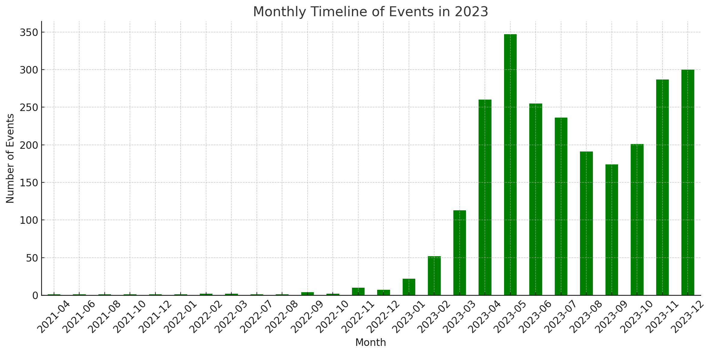
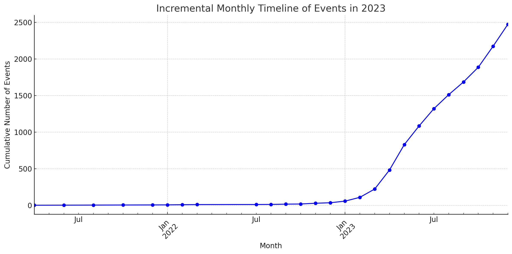

# ChatGPT, GenerativeAI and LLMs Timeline 

This repository organizes a timeline of key events (products, services, papers, GitHub, blog posts and news) that occurred before and after the ChatGPT announcement. 

It's curating a variety of information in this timeline, with a particular focus on LLM and Generative AI. 

Maybe it's a scene from the hottest history, so I thought it would be important to keep those memories well, so I organized them.

## Statistics 

These diagrams were generated by ChatGPT's Code Interpreter.

 

## Contributing

Issues and Pull Requests are greatly appreciated. If you've never contributed to an open source project before I'm more than happy to walk you through how to create a pull request.

You can start by [opening an issue](https://github.com/hollobit/BCAC_timeline/issues/new) describing the problem that you're looking to resolve and we'll go from there.

## Emoji 

arXiv :x:, PDF :paperclip:, arxiv-vanity :orange_book:, paper page :house:, papers with code :eight_spoked_asterisk:, Github :octocat:

## License

This document is licensed under the [MIT license](https://opensource.org/licenses/mit-license.php) © Jonghong Jeon(전종홍)

## Timeline V2

### 2024

  * 04/17 - **Stable Diffusion 3 API Now Available**    ([twitter](https://twitter.com/StabilityAI/status/1780599024707596508)),  ([Blog](https://stability.ai/news/stable-diffusion-3-api?utm_source=twitter&utm_medium=website&utm_campaign=blog)),  ([Demo](https://platform.stability.ai/docs/api-reference#tag/Generate/paths/~1v2beta~1stable-image~1generate~1sd3/post)), 
  * 04/16 - **VASA-1: Lifelike Audio-Driven Talking Faces Generated in Real Time**  ([:x:](https://arxiv.org/abs/2404.10667)), ([:book:](https://browse.arxiv.org/pdf/2404.10667.pdf)), ([:paperclip:](https://arxiv.org/pdf/2404.10667.pdf)),  ([:orange_book:](https://www.arxiv-vanity.com/papers/2404.10667)), ([:house:](https://huggingface.co/papers/2404.10667)), ([HTML](https://browse.arxiv.org/html/2404.10667v1)), ([SL](https://arxiv-sanity-lite.com/?rank=pid&pid=2404.10667)), ([SP](https://www.summarizepaper.com/en/arxiv-id/2404.10667v1/)), ([GS](https://scholar.google.com/scholar_lookup?arxiv_id=2404.10667)), ([SS](https://api.semanticscholar.org/arXiv:2404.10667)), ([:eight_spoked_asterisk:](https://paperswithcode.com/paper/vasa-1-lifelike-audio-driven-talking-faces))
  * 04/15 - **Video2Game: Real-time, Interactive, Realistic and Browser-Compatible Environment from a Single Video**  ([:x:](https://arxiv.org/abs/2404.09833)), ([:book:](https://browse.arxiv.org/pdf/2404.09833.pdf)), ([:paperclip:](https://arxiv.org/pdf/2404.09833.pdf)),  ([:orange_book:](https://www.arxiv-vanity.com/papers/2404.09833)), ([:house:](https://huggingface.co/papers/2404.09833)), ([HTML](https://browse.arxiv.org/html/2404.09833v1)), ([SL](https://arxiv-sanity-lite.com/?rank=pid&pid=2404.09833)), ([SP](https://www.summarizepaper.com/en/arxiv-id/2404.09833v1/)), ([GS](https://scholar.google.com/scholar_lookup?arxiv_id=2404.09833)), ([SS](https://api.semanticscholar.org/arXiv:2404.09833)), ([:eight_spoked_asterisk:](https://paperswithcode.com/paper/video2game-real-time-interactive-realistic))
  * 04/15 - **Tango 2: Aligning Diffusion-based Text-to-Audio Generations through Direct Preference Optimization**  ([:x:](https://arxiv.org/abs/2404.09956)), ([:book:](https://browse.arxiv.org/pdf/2404.09956.pdf)), ([:paperclip:](https://arxiv.org/pdf/2404.09956.pdf)),  ([:orange_book:](https://www.arxiv-vanity.com/papers/2404.09956)), ([:house:](https://huggingface.co/papers/2404.09956)), ([HTML](https://browse.arxiv.org/html/2404.09956v1)), ([SL](https://arxiv-sanity-lite.com/?rank=pid&pid=2404.09956)), ([SP](https://www.summarizepaper.com/en/arxiv-id/2404.09956v1/)), ([GS](https://scholar.google.com/scholar_lookup?arxiv_id=2404.09956)), ([SS](https://api.semanticscholar.org/arXiv:2404.09956)), ([:eight_spoked_asterisk:](https://paperswithcode.com/paper/tango-2-aligning-diffusion-based-text-to)), ([:octocat:](https://github.com/declare-lab/tango))
  * 04/15 - **Taming Latent Diffusion Model for Neural Radiance Field Inpainting**  ([:x:](https://arxiv.org/abs/2404.09995)), ([:book:](https://browse.arxiv.org/pdf/2404.09995.pdf)), ([:paperclip:](https://arxiv.org/pdf/2404.09995.pdf)),  ([:orange_book:](https://www.arxiv-vanity.com/papers/2404.09995)), ([:house:](https://huggingface.co/papers/2404.09995)), ([HTML](https://browse.arxiv.org/html/2404.09995v1)), ([SL](https://arxiv-sanity-lite.com/?rank=pid&pid=2404.09995)), ([SP](https://www.summarizepaper.com/en/arxiv-id/2404.09995v1/)), ([GS](https://scholar.google.com/scholar_lookup?arxiv_id=2404.09995)), ([SS](https://api.semanticscholar.org/arXiv:2404.09995)), ([:eight_spoked_asterisk:](https://paperswithcode.com/paper/taming-latent-diffusion-model-for-neural))
  * 04/15 - **Opus can operate as a Turing machine**    ([twitter](https://twitter.com/ctjlewis/status/1779740038852690393)), 
  * 04/15 - **MathGPT: Leveraging Llama 2 to create a platform for highly personalized learning**   
  * 04/15 - **HQ-Edit: A High-Quality Dataset for Instruction-based Image Editing**  ([:x:](https://arxiv.org/abs/2404.09990)), ([:book:](https://browse.arxiv.org/pdf/2404.09990.pdf)), ([:paperclip:](https://arxiv.org/pdf/2404.09990.pdf)),  ([:orange_book:](https://www.arxiv-vanity.com/papers/2404.09990)), ([:house:](https://huggingface.co/papers/2404.09990)), ([HTML](https://browse.arxiv.org/html/2404.09990v1)), ([SL](https://arxiv-sanity-lite.com/?rank=pid&pid=2404.09990)), ([SP](https://www.summarizepaper.com/en/arxiv-id/2404.09990v1/)), ([GS](https://scholar.google.com/scholar_lookup?arxiv_id=2404.09990)), ([SS](https://api.semanticscholar.org/arXiv:2404.09990)), ([:eight_spoked_asterisk:](https://paperswithcode.com/paper/hq-edit-a-high-quality-dataset-for))
  * 04/15 - **Ctrl-Adapter: An Efficient and Versatile Framework for Adapting Diverse Controls to Any Diffusion Model**  ([:x:](https://arxiv.org/abs/2404.09967)), ([:book:](https://browse.arxiv.org/pdf/2404.09967.pdf)), ([:paperclip:](https://arxiv.org/pdf/2404.09967.pdf)),  ([:orange_book:](https://www.arxiv-vanity.com/papers/2404.09967)), ([:house:](https://huggingface.co/papers/2404.09967)), ([HTML](https://browse.arxiv.org/html/2404.09967v1)), ([SL](https://arxiv-sanity-lite.com/?rank=pid&pid=2404.09967)), ([SP](https://www.summarizepaper.com/en/arxiv-id/2404.09967v1/)), ([GS](https://scholar.google.com/scholar_lookup?arxiv_id=2404.09967)), ([SS](https://api.semanticscholar.org/arXiv:2404.09967)), ([:eight_spoked_asterisk:](https://paperswithcode.com/paper/ctrl-adapter-an-efficient-and-versatile))
  * 04/15 - **Compression Represents Intelligence Linearly**  ([:x:](https://arxiv.org/abs/2404.09937)), ([:book:](https://browse.arxiv.org/pdf/2404.09937.pdf)), ([:paperclip:](https://arxiv.org/pdf/2404.09937.pdf)),  ([:orange_book:](https://www.arxiv-vanity.com/papers/2404.09937)), ([:house:](https://huggingface.co/papers/2404.09937)), ([HTML](https://browse.arxiv.org/html/2404.09937v1)), ([SL](https://arxiv-sanity-lite.com/?rank=pid&pid=2404.09937)), ([SP](https://www.summarizepaper.com/en/arxiv-id/2404.09937v1/)), ([GS](https://scholar.google.com/scholar_lookup?arxiv_id=2404.09937)), ([SS](https://api.semanticscholar.org/arXiv:2404.09937)), ([:eight_spoked_asterisk:](https://paperswithcode.com/paper/compression-represents-intelligence-linearly))
  * 04/15 - **CompGS: Efficient 3D Scene Representation via Compressed Gaussian Splatting**  ([:x:](https://arxiv.org/abs/2404.09458)), ([:book:](https://browse.arxiv.org/pdf/2404.09458.pdf)), ([:paperclip:](https://arxiv.org/pdf/2404.09458.pdf)),  ([:orange_book:](https://www.arxiv-vanity.com/papers/2404.09458)), ([:house:](https://huggingface.co/papers/2404.09458)), ([HTML](https://browse.arxiv.org/html/2404.09458v1)), ([SL](https://arxiv-sanity-lite.com/?rank=pid&pid=2404.09458)), ([SP](https://www.summarizepaper.com/en/arxiv-id/2404.09458v1/)), ([GS](https://scholar.google.com/scholar_lookup?arxiv_id=2404.09458)), ([SS](https://api.semanticscholar.org/arXiv:2404.09458)), ([:eight_spoked_asterisk:](https://paperswithcode.com/paper/compgs-efficient-3d-scene-representation-via))
  * 04/14 - **TextHawk: Exploring Efficient Fine-Grained Perception of Multimodal Large Language Models**  ([:x:](https://arxiv.org/abs/2404.09204)), ([:book:](https://browse.arxiv.org/pdf/2404.09204.pdf)), ([:paperclip:](https://arxiv.org/pdf/2404.09204.pdf)),  ([:orange_book:](https://www.arxiv-vanity.com/papers/2404.09204)), ([:house:](https://huggingface.co/papers/2404.09204)), ([HTML](https://browse.arxiv.org/html/2404.09204v1)), ([SL](https://arxiv-sanity-lite.com/?rank=pid&pid=2404.09204)), ([SP](https://www.summarizepaper.com/en/arxiv-id/2404.09204v1/)), ([GS](https://scholar.google.com/scholar_lookup?arxiv_id=2404.09204)), ([SS](https://api.semanticscholar.org/arXiv:2404.09204)), ([:eight_spoked_asterisk:](https://paperswithcode.com/paper/texthawk-exploring-efficient-fine-grained)), ([:octocat:](https://github.com/yuyq96/texthawk))
  * 04/13 - **Cathie Wood Muscles Into ChatGPT Boom With New OpenAI Stake**    ([News](https://finance.yahoo.com/news/cathie-wood-ark-investment-management-232619722.html)),
  * 04/12 - **Scaling (Down) CLIP: A Comprehensive Analysis of Data, Architecture, and Training Strategies**  ([:x:](https://arxiv.org/abs/2404.08197)), ([:book:](https://browse.arxiv.org/pdf/2404.08197.pdf)), ([:paperclip:](https://arxiv.org/pdf/2404.08197.pdf)),  ([:orange_book:](https://www.arxiv-vanity.com/papers/2404.08197)), ([:house:](https://huggingface.co/papers/2404.08197)), ([HTML](https://browse.arxiv.org/html/2404.08197v1)), ([SL](https://arxiv-sanity-lite.com/?rank=pid&pid=2404.08197)), ([SP](https://www.summarizepaper.com/en/arxiv-id/2404.08197v1/)), ([GS](https://scholar.google.com/scholar_lookup?arxiv_id=2404.08197)), ([SS](https://api.semanticscholar.org/arXiv:2404.08197)), ([:eight_spoked_asterisk:](https://paperswithcode.com/paper/scaling-down-clip-a-comprehensive-analysis-of))
  * 04/12 - **Probing the 3D Awareness of Visual Foundation Models**  ([:x:](https://arxiv.org/abs/2404.08636)), ([:book:](https://browse.arxiv.org/pdf/2404.08636.pdf)), ([:paperclip:](https://arxiv.org/pdf/2404.08636.pdf)),  ([:orange_book:](https://www.arxiv-vanity.com/papers/2404.08636)), ([:house:](https://huggingface.co/papers/2404.08636)), ([HTML](https://browse.arxiv.org/html/2404.08636v1)), ([SL](https://arxiv-sanity-lite.com/?rank=pid&pid=2404.08636)), ([SP](https://www.summarizepaper.com/en/arxiv-id/2404.08636v1/)), ([GS](https://scholar.google.com/scholar_lookup?arxiv_id=2404.08636)), ([SS](https://api.semanticscholar.org/arXiv:2404.08636)), ([:eight_spoked_asterisk:](https://paperswithcode.com/paper/probing-the-3d-awareness-of-visual-foundation)), ([:octocat:](https://github.com/mbanani/probe3d))
  * 04/12 - **Pre-training Small Base LMs with Fewer Tokens**  ([:x:](https://arxiv.org/abs/2404.08634)), ([:book:](https://browse.arxiv.org/pdf/2404.08634.pdf)), ([:paperclip:](https://arxiv.org/pdf/2404.08634.pdf)),  ([:orange_book:](https://www.arxiv-vanity.com/papers/2404.08634)), ([:house:](https://huggingface.co/papers/2404.08634)), ([HTML](https://browse.arxiv.org/html/2404.08634v1)), ([SL](https://arxiv-sanity-lite.com/?rank=pid&pid=2404.08634)), ([SP](https://www.summarizepaper.com/en/arxiv-id/2404.08634v1/)), ([GS](https://scholar.google.com/scholar_lookup?arxiv_id=2404.08634)), ([SS](https://api.semanticscholar.org/arXiv:2404.08634)), ([:eight_spoked_asterisk:](https://paperswithcode.com/paper/pre-training-small-base-lms-with-fewer-tokens)), ([:octocat:](https://github.com/Lightning-AI/lit-gpt))
  * 04/12 - **On the Robustness of Language Guidance for Low-Level Vision Tasks: Findings from Depth Estimation**  ([:x:](https://arxiv.org/abs/2404.08540)), ([:book:](https://browse.arxiv.org/pdf/2404.08540.pdf)), ([:paperclip:](https://arxiv.org/pdf/2404.08540.pdf)),  ([:orange_book:](https://www.arxiv-vanity.com/papers/2404.08540)), ([:house:](https://huggingface.co/papers/2404.08540)), ([HTML](https://browse.arxiv.org/html/2404.08540v1)), ([SL](https://arxiv-sanity-lite.com/?rank=pid&pid=2404.08540)), ([SP](https://www.summarizepaper.com/en/arxiv-id/2404.08540v1/)), ([GS](https://scholar.google.com/scholar_lookup?arxiv_id=2404.08540)), ([SS](https://api.semanticscholar.org/arXiv:2404.08540)), ([:eight_spoked_asterisk:](https://paperswithcode.com/paper/on-the-robustness-of-language-guidance-for)), ([:octocat:](https://github.com/agneet42/robustness_depth_lang))
  * 04/12 - **MonoPatchNeRF: Improving Neural Radiance Fields with Patch-based Monocular Guidance**  ([:x:](https://arxiv.org/abs/2404.08252)), ([:book:](https://browse.arxiv.org/pdf/2404.08252.pdf)), ([:paperclip:](https://arxiv.org/pdf/2404.08252.pdf)),  ([:orange_book:](https://www.arxiv-vanity.com/papers/2404.08252)), ([:house:](https://huggingface.co/papers/2404.08252)), ([HTML](https://browse.arxiv.org/html/2404.08252v1)), ([SL](https://arxiv-sanity-lite.com/?rank=pid&pid=2404.08252)), ([SP](https://www.summarizepaper.com/en/arxiv-id/2404.08252v1/)), ([GS](https://scholar.google.com/scholar_lookup?arxiv_id=2404.08252)), ([SS](https://api.semanticscholar.org/arXiv:2404.08252)), ([:eight_spoked_asterisk:](https://paperswithcode.com/paper/monopatchnerf-improving-neural-radiance))
  * 04/12 - **Megalodon: Efficient LLM Pretraining and Inference with Unlimited Context Length**  ([:x:](https://arxiv.org/abs/2404.08801)), ([:book:](https://browse.arxiv.org/pdf/2404.08801.pdf)), ([:paperclip:](https://arxiv.org/pdf/2404.08801.pdf)),  ([:orange_book:](https://www.arxiv-vanity.com/papers/2404.08801)), ([:house:](https://huggingface.co/papers/2404.08801)), ([HTML](https://browse.arxiv.org/html/2404.08801v1)), ([SL](https://arxiv-sanity-lite.com/?rank=pid&pid=2404.08801)), ([SP](https://www.summarizepaper.com/en/arxiv-id/2404.08801v1/)), ([GS](https://scholar.google.com/scholar_lookup?arxiv_id=2404.08801)), ([SS](https://api.semanticscholar.org/arXiv:2404.08801)), ([:eight_spoked_asterisk:](https://paperswithcode.com/paper/megalodon-efficient-llm-pretraining-and)), ([:octocat:](https://github.com/xuezhemax/megalodon))
  * 04/12 - **Is ChatGPT Transforming Academics' Writing Style?**  ([:x:](https://arxiv.org/abs/2404.08627)), ([:book:](https://browse.arxiv.org/pdf/2404.08627.pdf)), ([:paperclip:](https://arxiv.org/pdf/2404.08627.pdf)),  ([:orange_book:](https://www.arxiv-vanity.com/papers/2404.08627)), ([:house:](https://huggingface.co/papers/2404.08627)), ([HTML](https://browse.arxiv.org/html/2404.08627v1)), ([SL](https://arxiv-sanity-lite.com/?rank=pid&pid=2404.08627)), ([SP](https://www.summarizepaper.com/en/arxiv-id/2404.08627v1/)), ([GS](https://scholar.google.com/scholar_lookup?arxiv_id=2404.08627)), ([SS](https://api.semanticscholar.org/arXiv:2404.08627)), ([:eight_spoked_asterisk:](https://paperswithcode.com/paper/is-chatgpt-transforming-academics-writing))
  * 04/12 - **COCONut: Modernizing COCO Segmentation**  ([:x:](https://arxiv.org/abs/2404.08639)), ([:book:](https://browse.arxiv.org/pdf/2404.08639.pdf)), ([:paperclip:](https://arxiv.org/pdf/2404.08639.pdf)),  ([:orange_book:](https://www.arxiv-vanity.com/papers/2404.08639)), ([:house:](https://huggingface.co/papers/2404.08639)), ([HTML](https://browse.arxiv.org/html/2404.08639v1)), ([SL](https://arxiv-sanity-lite.com/?rank=pid&pid=2404.08639)), ([SP](https://www.summarizepaper.com/en/arxiv-id/2404.08639v1/)), ([GS](https://scholar.google.com/scholar_lookup?arxiv_id=2404.08639)), ([SS](https://api.semanticscholar.org/arXiv:2404.08639)), ([:eight_spoked_asterisk:](https://paperswithcode.com/paper/coconut-modernizing-coco-segmentation))
  * 04/12 - **AI Chip Trims Energy Budget Back by 99+ Percent**    ([News](https://spectrum.ieee.org/optical-neural-network)), 
  * 04/12 - **AdapterSwap: Continuous Training of LLMs with Data Removal and Access-Control Guarantees**  ([:x:](https://arxiv.org/abs/2404.08417)), ([:book:](https://browse.arxiv.org/pdf/2404.08417.pdf)), ([:paperclip:](https://arxiv.org/pdf/2404.08417.pdf)),  ([:orange_book:](https://www.arxiv-vanity.com/papers/2404.08417)), ([:house:](https://huggingface.co/papers/2404.08417)), ([HTML](https://browse.arxiv.org/html/2404.08417v1)), ([SL](https://arxiv-sanity-lite.com/?rank=pid&pid=2404.08417)), ([SP](https://www.summarizepaper.com/en/arxiv-id/2404.08417v1/)), ([GS](https://scholar.google.com/scholar_lookup?arxiv_id=2404.08417)), ([SS](https://api.semanticscholar.org/arXiv:2404.08417)), ([:eight_spoked_asterisk:](https://paperswithcode.com/paper/adapterswap-continuous-training-of-llms-with))
  * 04/12 - **Grok-1.5 Vision Preview**    ([Demo](https://x.ai/blog/grok-1.5v)),  
  * 04/12 - **The good, the bad, and the Humane Pin**    ([News](https://www.theverge.com/24128273/humane-ai-pin-review-taylor-swift-tiktok-openai-vergecast)), 
  * 04/12 - **Paid ChatGPT users can now access GPT-4 Turbo**    ([twitter](https://twitter.com/OpenAI/status/1778574613813006610)),  ([News](https://www.engadget.com/paid-chatgpt-users-can-now-access-gpt-4-turbo-123031501.html)), , ([:octocat:](https://github.com/openai/simple-evals))
  * 04/11 - **Remembering Transformer for Continual Learning**  ([:x:](https://arxiv.org/abs/2404.07518)), ([:book:](https://browse.arxiv.org/pdf/2404.07518.pdf)), ([:paperclip:](https://arxiv.org/pdf/2404.07518.pdf)),  ([:orange_book:](https://www.arxiv-vanity.com/papers/2404.07518)), ([:house:](https://huggingface.co/papers/2404.07518)), ([HTML](https://browse.arxiv.org/html/2404.07518v1)), ([SL](https://arxiv-sanity-lite.com/?rank=pid&pid=2404.07518)), ([SP](https://www.summarizepaper.com/en/arxiv-id/2404.07518v1/)), ([GS](https://scholar.google.com/scholar_lookup?arxiv_id=2404.07518)), ([SS](https://api.semanticscholar.org/arXiv:2404.07518)), ([:eight_spoked_asterisk:](https://paperswithcode.com/paper/remembering-transformer-for-continual))
  * 04/11 - **Amazon adds Andrew Ng, a leading voice in artificial intelligence, to its board of directors**    ([News](https://abcnews.go.com/Technology/wireStory/amazon-adds-andrew-ng-leading-voice-artificial-intelligence-109131975)), 
  * 04/11 - **Adobe Is Buying Videos for $3 Per Minute to Build AI Model**    ([News](https://www.bloomberg.com/news/articles/2024-04-10/adobe-is-buying-video-clips-for-3-per-minute-to-build-ai-model)), 
  * 04/11 - **UltraEval: A Lightweight Platform for Flexible and Comprehensive Evaluation for LLMs**  ([:x:](https://arxiv.org/abs/2404.07584)), ([:book:](https://browse.arxiv.org/pdf/2404.07584.pdf)), ([:paperclip:](https://arxiv.org/pdf/2404.07584.pdf)),  ([:orange_book:](https://www.arxiv-vanity.com/papers/2404.07584)), ([:house:](https://huggingface.co/papers/2404.07584)), ([HTML](https://browse.arxiv.org/html/2404.07584v1)), ([SL](https://arxiv-sanity-lite.com/?rank=pid&pid=2404.07584)), ([SP](https://www.summarizepaper.com/en/arxiv-id/2404.07584v1/)), ([GS](https://scholar.google.com/scholar_lookup?arxiv_id=2404.07584)), ([SS](https://api.semanticscholar.org/arXiv:2404.07584)), ([:eight_spoked_asterisk:](https://paperswithcode.com/paper/ultraeval-a-lightweight-platform-for-flexible)), ([:octocat:](https://github.com/openbmb/ultraeval))
  * 04/11 - **Transferable and Principled Efficiency for Open-Vocabulary Segmentation**  ([:x:](https://arxiv.org/abs/2404.07448)), ([:book:](https://browse.arxiv.org/pdf/2404.07448.pdf)), ([:paperclip:](https://arxiv.org/pdf/2404.07448.pdf)),  ([:orange_book:](https://www.arxiv-vanity.com/papers/2404.07448)), ([:house:](https://huggingface.co/papers/2404.07448)), ([HTML](https://browse.arxiv.org/html/2404.07448v1)), ([SL](https://arxiv-sanity-lite.com/?rank=pid&pid=2404.07448)), ([SP](https://www.summarizepaper.com/en/arxiv-id/2404.07448v1/)), ([GS](https://scholar.google.com/scholar_lookup?arxiv_id=2404.07448)), ([SS](https://api.semanticscholar.org/arXiv:2404.07448)), ([:eight_spoked_asterisk:](https://paperswithcode.com/paper/transferable-and-principled-efficiency-for)), ([:octocat:](https://github.com/xujxyang/opentrans))
  * 04/11 - **SWE-agent**    ([twitter](https://twitter.com/jyangballin/status/1775114444370051582)),  ([Demo](https://swe-agent.com/)), , ([:octocat:](https://github.com/princeton-nlp/SWE-agent))
  * 04/11 - **Sparse Laneformer**  ([:x:](https://arxiv.org/abs/2404.07821)), ([:book:](https://browse.arxiv.org/pdf/2404.07821.pdf)), ([:paperclip:](https://arxiv.org/pdf/2404.07821.pdf)),  ([:orange_book:](https://www.arxiv-vanity.com/papers/2404.07821)), ([:house:](https://huggingface.co/papers/2404.07821)), ([HTML](https://browse.arxiv.org/html/2404.07821v1)), ([SL](https://arxiv-sanity-lite.com/?rank=pid&pid=2404.07821)), ([SP](https://www.summarizepaper.com/en/arxiv-id/2404.07821v1/)), ([GS](https://scholar.google.com/scholar_lookup?arxiv_id=2404.07821)), ([SS](https://api.semanticscholar.org/arXiv:2404.07821)), ([:eight_spoked_asterisk:](https://paperswithcode.com/paper/sparse-laneformer))
  * 04/11 - **Rho-1: Not All Tokens Are What You Need**  ([:x:](https://arxiv.org/abs/2404.07965)), ([:book:](https://browse.arxiv.org/pdf/2404.07965.pdf)), ([:paperclip:](https://arxiv.org/pdf/2404.07965.pdf)),  ([:orange_book:](https://www.arxiv-vanity.com/papers/2404.07965)), ([:house:](https://huggingface.co/papers/2404.07965)), ([HTML](https://browse.arxiv.org/html/2404.07965v1)), ([SL](https://arxiv-sanity-lite.com/?rank=pid&pid=2404.07965)), ([SP](https://www.summarizepaper.com/en/arxiv-id/2404.07965v1/)), ([GS](https://scholar.google.com/scholar_lookup?arxiv_id=2404.07965)), ([SS](https://api.semanticscholar.org/arXiv:2404.07965)), ([:eight_spoked_asterisk:](https://paperswithcode.com/paper/rho-1-not-all-tokens-are-what-you-need)), ([:octocat:](https://github.com/microsoft/rho))
  * 04/11 - **ResearchAgent: Iterative Research Idea Generation over Scientific Literature with Large Language Models**  ([:x:](https://arxiv.org/abs/2404.07738)), ([:book:](https://browse.arxiv.org/pdf/2404.07738.pdf)), ([:paperclip:](https://arxiv.org/pdf/2404.07738.pdf)),  ([:orange_book:](https://www.arxiv-vanity.com/papers/2404.07738)), ([:house:](https://huggingface.co/papers/2404.07738)), ([HTML](https://browse.arxiv.org/html/2404.07738v1)), ([SL](https://arxiv-sanity-lite.com/?rank=pid&pid=2404.07738)), ([SP](https://www.summarizepaper.com/en/arxiv-id/2404.07738v1/)), ([GS](https://scholar.google.com/scholar_lookup?arxiv_id=2404.07738)), ([SS](https://api.semanticscholar.org/arXiv:2404.07738)), ([:eight_spoked_asterisk:](https://paperswithcode.com/paper/researchagent-iterative-research-idea))
  * 04/11 - **RecurrentGemma: Moving Past Transformers for Efficient Open Language Models**  ([:x:](https://arxiv.org/abs/2404.07839)), ([:book:](https://browse.arxiv.org/pdf/2404.07839.pdf)), ([:paperclip:](https://arxiv.org/pdf/2404.07839.pdf)),  ([:orange_book:](https://www.arxiv-vanity.com/papers/2404.07839)), ([:house:](https://huggingface.co/papers/2404.07839)), ([HTML](https://browse.arxiv.org/html/2404.07839v1)), ([SL](https://arxiv-sanity-lite.com/?rank=pid&pid=2404.07839)), ([SP](https://www.summarizepaper.com/en/arxiv-id/2404.07839v1/)), ([GS](https://scholar.google.com/scholar_lookup?arxiv_id=2404.07839)), ([SS](https://api.semanticscholar.org/arXiv:2404.07839)), ([:eight_spoked_asterisk:](https://paperswithcode.com/paper/recurrentgemma-moving-past-transformers-for))
  * 04/11 - **OSWorld: Benchmarking Multimodal Agents for Open-Ended Tasks in Real Computer Environments**  ([:x:](https://arxiv.org/abs/2404.07972)), ([:book:](https://browse.arxiv.org/pdf/2404.07972.pdf)), ([:paperclip:](https://arxiv.org/pdf/2404.07972.pdf)),  ([:orange_book:](https://www.arxiv-vanity.com/papers/2404.07972)), ([:house:](https://huggingface.co/papers/2404.07972)), ([HTML](https://browse.arxiv.org/html/2404.07972v1)), ([SL](https://arxiv-sanity-lite.com/?rank=pid&pid=2404.07972)), ([SP](https://www.summarizepaper.com/en/arxiv-id/2404.07972v1/)), ([GS](https://scholar.google.com/scholar_lookup?arxiv_id=2404.07972)), ([SS](https://api.semanticscholar.org/arXiv:2404.07972)), ([:eight_spoked_asterisk:](https://paperswithcode.com/paper/osworld-benchmarking-multimodal-agents-for))
  * 04/11 - **LLoCO: Learning Long Contexts Offline**  ([:x:](https://arxiv.org/abs/2404.07979)), ([:book:](https://browse.arxiv.org/pdf/2404.07979.pdf)), ([:paperclip:](https://arxiv.org/pdf/2404.07979.pdf)),  ([:orange_book:](https://www.arxiv-vanity.com/papers/2404.07979)), ([:house:](https://huggingface.co/papers/2404.07979)), ([HTML](https://browse.arxiv.org/html/2404.07979v1)), ([SL](https://arxiv-sanity-lite.com/?rank=pid&pid=2404.07979)), ([SP](https://www.summarizepaper.com/en/arxiv-id/2404.07979v1/)), ([GS](https://scholar.google.com/scholar_lookup?arxiv_id=2404.07979)), ([SS](https://api.semanticscholar.org/arXiv:2404.07979)), ([:eight_spoked_asterisk:](https://paperswithcode.com/paper/lloco-learning-long-contexts-offline))
  * 04/11 - **Leveraging Large Language Models (LLMs) to Support Collaborative Human-AI Online Risk Data Annotation**  ([:x:](https://arxiv.org/abs/2404.07926)), ([:book:](https://browse.arxiv.org/pdf/2404.07926.pdf)), ([:paperclip:](https://arxiv.org/pdf/2404.07926.pdf)),  ([:orange_book:](https://www.arxiv-vanity.com/papers/2404.07926)), ([:house:](https://huggingface.co/papers/2404.07926)), ([HTML](https://browse.arxiv.org/html/2404.07926v1)), ([SL](https://arxiv-sanity-lite.com/?rank=pid&pid=2404.07926)), ([SP](https://www.summarizepaper.com/en/arxiv-id/2404.07926v1/)), ([GS](https://scholar.google.com/scholar_lookup?arxiv_id=2404.07926)), ([SS](https://api.semanticscholar.org/arXiv:2404.07926)), ([:eight_spoked_asterisk:](https://paperswithcode.com/paper/leveraging-large-language-models-llms-to-1))
  * 04/11 - **JetMoE: Reaching Llama2 Performance with 0.1M Dollars**  ([:x:](https://arxiv.org/abs/2404.07413)), ([:book:](https://browse.arxiv.org/pdf/2404.07413.pdf)), ([:paperclip:](https://arxiv.org/pdf/2404.07413.pdf)),  ([:orange_book:](https://www.arxiv-vanity.com/papers/2404.07413)), ([:house:](https://huggingface.co/papers/2404.07413)), ([HTML](https://browse.arxiv.org/html/2404.07413v1)), ([SL](https://arxiv-sanity-lite.com/?rank=pid&pid=2404.07413)), ([SP](https://www.summarizepaper.com/en/arxiv-id/2404.07413v1/)), ([GS](https://scholar.google.com/scholar_lookup?arxiv_id=2404.07413)), ([SS](https://api.semanticscholar.org/arXiv:2404.07413)) ([Project](https://research.myshell.ai/jetmoe)),  ([twitter](https://twitter.com/omarsar0/status/1775971009469768104)), , ([:eight_spoked_asterisk:](https://paperswithcode.com/paper/jetmoe-reaching-llama2-performance-with-0-1m)), ([:octocat:](https://github.com/myshell-ai/jetmoe))
  * 04/11 - **HGRN2: Gated Linear RNNs with State Expansion**  ([:x:](https://arxiv.org/abs/2404.07904)), ([:book:](https://browse.arxiv.org/pdf/2404.07904.pdf)), ([:paperclip:](https://arxiv.org/pdf/2404.07904.pdf)),  ([:orange_book:](https://www.arxiv-vanity.com/papers/2404.07904)), ([:house:](https://huggingface.co/papers/2404.07904)), ([HTML](https://browse.arxiv.org/html/2404.07904v1)), ([SL](https://arxiv-sanity-lite.com/?rank=pid&pid=2404.07904)), ([SP](https://www.summarizepaper.com/en/arxiv-id/2404.07904v1/)), ([GS](https://scholar.google.com/scholar_lookup?arxiv_id=2404.07904)), ([SS](https://api.semanticscholar.org/arXiv:2404.07904)), ([:eight_spoked_asterisk:](https://paperswithcode.com/paper/hgrn2-gated-linear-rnns-with-state-expansion)), ([:octocat:](https://github.com/opennlplab/hgrn2))
  * 04/11 - **From Words to Numbers: Your Large Language Model Is Secretly A Capable Regressor When Given In-Context Examples**  ([:x:](https://arxiv.org/abs/2404.07544)), ([:book:](https://browse.arxiv.org/pdf/2404.07544.pdf)), ([:paperclip:](https://arxiv.org/pdf/2404.07544.pdf)),  ([:orange_book:](https://www.arxiv-vanity.com/papers/2404.07544)), ([:house:](https://huggingface.co/papers/2404.07544)), ([HTML](https://browse.arxiv.org/html/2404.07544v1)), ([SL](https://arxiv-sanity-lite.com/?rank=pid&pid=2404.07544)), ([SP](https://www.summarizepaper.com/en/arxiv-id/2404.07544v1/)), ([GS](https://scholar.google.com/scholar_lookup?arxiv_id=2404.07544)), ([SS](https://api.semanticscholar.org/arXiv:2404.07544)), ([:eight_spoked_asterisk:](https://paperswithcode.com/paper/from-words-to-numbers-your-large-language))
  * 04/11 - **Ferret-v2: An Improved Baseline for Referring and Grounding with Large Language Models**  ([:x:](https://arxiv.org/abs/2404.07973)), ([:book:](https://browse.arxiv.org/pdf/2404.07973.pdf)), ([:paperclip:](https://arxiv.org/pdf/2404.07973.pdf)),  ([:orange_book:](https://www.arxiv-vanity.com/papers/2404.07973)), ([:house:](https://huggingface.co/papers/2404.07973)), ([HTML](https://browse.arxiv.org/html/2404.07973v1)), ([SL](https://arxiv-sanity-lite.com/?rank=pid&pid=2404.07973)), ([SP](https://www.summarizepaper.com/en/arxiv-id/2404.07973v1/)), ([GS](https://scholar.google.com/scholar_lookup?arxiv_id=2404.07973)), ([SS](https://api.semanticscholar.org/arXiv:2404.07973)), ([:eight_spoked_asterisk:](https://paperswithcode.com/paper/ferret-v2-an-improved-baseline-for-referring))
  * 04/11 - **ControlNet++: Improving Conditional Controls with Efficient Consistency Feedback**  ([:x:](https://arxiv.org/abs/2404.07987)), ([:book:](https://browse.arxiv.org/pdf/2404.07987.pdf)), ([:paperclip:](https://arxiv.org/pdf/2404.07987.pdf)),  ([:orange_book:](https://www.arxiv-vanity.com/papers/2404.07987)), ([:house:](https://huggingface.co/papers/2404.07987)), ([HTML](https://browse.arxiv.org/html/2404.07987v1)), ([SL](https://arxiv-sanity-lite.com/?rank=pid&pid=2404.07987)), ([SP](https://www.summarizepaper.com/en/arxiv-id/2404.07987v1/)), ([GS](https://scholar.google.com/scholar_lookup?arxiv_id=2404.07987)), ([SS](https://api.semanticscholar.org/arXiv:2404.07987)), ([:eight_spoked_asterisk:](https://paperswithcode.com/paper/controlnet-improving-conditional-controls))
  * 04/11 - **Context-aware Video Anomaly Detection in Long-Term Datasets**  ([:x:](https://arxiv.org/abs/2404.07887)), ([:book:](https://browse.arxiv.org/pdf/2404.07887.pdf)), ([:paperclip:](https://arxiv.org/pdf/2404.07887.pdf)),  ([:orange_book:](https://www.arxiv-vanity.com/papers/2404.07887)), ([:house:](https://huggingface.co/papers/2404.07887)), ([HTML](https://browse.arxiv.org/html/2404.07887v1)), ([SL](https://arxiv-sanity-lite.com/?rank=pid&pid=2404.07887)), ([SP](https://www.summarizepaper.com/en/arxiv-id/2404.07887v1/)), ([GS](https://scholar.google.com/scholar_lookup?arxiv_id=2404.07887)), ([SS](https://api.semanticscholar.org/arXiv:2404.07887)), ([:eight_spoked_asterisk:](https://paperswithcode.com/paper/context-aware-video-anomaly-detection-in-long))
  * 04/11 - **ChatGPT-3.5, Claude 3 kick pixelated butt in Street Fighter III tournament for LLMs**    ([News](https://www.theregister.com/2024/04/11/chatgpt_claude_street_fighter_3/)), 
  * 04/11 - **ChatGPT Can Predict the Future when it Tells Stories Set in the Future About the Past**  ([:x:](https://arxiv.org/abs/2404.07396)), ([:book:](https://browse.arxiv.org/pdf/2404.07396.pdf)), ([:paperclip:](https://arxiv.org/pdf/2404.07396.pdf)),  ([:orange_book:](https://www.arxiv-vanity.com/papers/2404.07396)), ([:house:](https://huggingface.co/papers/2404.07396)), ([HTML](https://browse.arxiv.org/html/2404.07396v1)), ([SL](https://arxiv-sanity-lite.com/?rank=pid&pid=2404.07396)), ([SP](https://www.summarizepaper.com/en/arxiv-id/2404.07396v1/)), ([GS](https://scholar.google.com/scholar_lookup?arxiv_id=2404.07396)), ([SS](https://api.semanticscholar.org/arXiv:2404.07396)), ([:eight_spoked_asterisk:](https://paperswithcode.com/paper/chatgpt-can-predict-the-future-when-it-tells))
  * 04/11 - **Best Practices and Lessons Learned on Synthetic Data for Language Models**  ([:x:](https://arxiv.org/abs/2404.07503)), ([:book:](https://browse.arxiv.org/pdf/2404.07503.pdf)), ([:paperclip:](https://arxiv.org/pdf/2404.07503.pdf)),  ([:orange_book:](https://www.arxiv-vanity.com/papers/2404.07503)), ([:house:](https://huggingface.co/papers/2404.07503)), ([HTML](https://browse.arxiv.org/html/2404.07503v1)), ([SL](https://arxiv-sanity-lite.com/?rank=pid&pid=2404.07503)), ([SP](https://www.summarizepaper.com/en/arxiv-id/2404.07503v1/)), ([GS](https://scholar.google.com/scholar_lookup?arxiv_id=2404.07503)), ([SS](https://api.semanticscholar.org/arXiv:2404.07503)), ([:eight_spoked_asterisk:](https://paperswithcode.com/paper/best-practices-and-lessons-learned-on))
  * 04/11 - **Benchmark LLMs by fighting in Street Fighter 3**    ([Demo](https://huggingface.co/spaces/junior-labs/llm-colosseum)), , ([:octocat:](https://github.com/OpenGenerativeAI/llm-colosseum))
  * 04/11 - **Audio Dialogues: Dialogues dataset for audio and music understanding**  ([:x:](https://arxiv.org/abs/2404.07616)), ([:book:](https://browse.arxiv.org/pdf/2404.07616.pdf)), ([:paperclip:](https://arxiv.org/pdf/2404.07616.pdf)),  ([:orange_book:](https://www.arxiv-vanity.com/papers/2404.07616)), ([:house:](https://huggingface.co/papers/2404.07616)), ([HTML](https://browse.arxiv.org/html/2404.07616v1)), ([SL](https://arxiv-sanity-lite.com/?rank=pid&pid=2404.07616)), ([SP](https://www.summarizepaper.com/en/arxiv-id/2404.07616v1/)), ([GS](https://scholar.google.com/scholar_lookup?arxiv_id=2404.07616)), ([SS](https://api.semanticscholar.org/arXiv:2404.07616)), ([:eight_spoked_asterisk:](https://paperswithcode.com/paper/audio-dialogues-dialogues-dataset-for-audio))
  * 04/11 - **Applying Guidance in a Limited Interval Improves Sample and Distribution Quality in Diffusion Models**  ([:x:](https://arxiv.org/abs/2404.07724)), ([:book:](https://browse.arxiv.org/pdf/2404.07724.pdf)), ([:paperclip:](https://arxiv.org/pdf/2404.07724.pdf)),  ([:orange_book:](https://www.arxiv-vanity.com/papers/2404.07724)), ([:house:](https://huggingface.co/papers/2404.07724)), ([HTML](https://browse.arxiv.org/html/2404.07724v1)), ([SL](https://arxiv-sanity-lite.com/?rank=pid&pid=2404.07724)), ([SP](https://www.summarizepaper.com/en/arxiv-id/2404.07724v1/)), ([GS](https://scholar.google.com/scholar_lookup?arxiv_id=2404.07724)), ([SS](https://api.semanticscholar.org/arXiv:2404.07724)), ([:eight_spoked_asterisk:](https://paperswithcode.com/paper/applying-guidance-in-a-limited-interval))
  * 04/11 - **AmpleGCG: Learning a Universal and Transferable Generative Model of Adversarial Suffixes for Jailbreaking Both Open and Closed LLMs**  ([:x:](https://arxiv.org/abs/2404.07921)), ([:book:](https://browse.arxiv.org/pdf/2404.07921.pdf)), ([:paperclip:](https://arxiv.org/pdf/2404.07921.pdf)),  ([:orange_book:](https://www.arxiv-vanity.com/papers/2404.07921)), ([:house:](https://huggingface.co/papers/2404.07921)), ([HTML](https://browse.arxiv.org/html/2404.07921v1)), ([SL](https://arxiv-sanity-lite.com/?rank=pid&pid=2404.07921)), ([SP](https://www.summarizepaper.com/en/arxiv-id/2404.07921v1/)), ([GS](https://scholar.google.com/scholar_lookup?arxiv_id=2404.07921)), ([SS](https://api.semanticscholar.org/arXiv:2404.07921)), ([:eight_spoked_asterisk:](https://paperswithcode.com/paper/amplegcg-learning-a-universal-and)), ([:octocat:](https://github.com/osu-nlp-group/amplegcg))
  * 04/10 - **LM Transparency Tool: Interactive Tool for Analyzing Transformer Language Models**  ([:x:](https://arxiv.org/abs/2404.07004)), ([:book:](https://browse.arxiv.org/pdf/2404.07004.pdf)), ([:paperclip:](https://arxiv.org/pdf/2404.07004.pdf)),  ([:orange_book:](https://www.arxiv-vanity.com/papers/2404.07004)), ([:house:](https://huggingface.co/papers/2404.07004)), ([HTML](https://browse.arxiv.org/html/2404.07004v1)), ([SL](https://arxiv-sanity-lite.com/?rank=pid&pid=2404.07004)), ([SP](https://www.summarizepaper.com/en/arxiv-id/2404.07004v1/)), ([GS](https://scholar.google.com/scholar_lookup?arxiv_id=2404.07004)), ([SS](https://api.semanticscholar.org/arXiv:2404.07004)), ([:eight_spoked_asterisk:](https://paperswithcode.com/paper/lm-transparency-tool-interactive-tool-for))
  * 04/10 - **Gemini 1.5 Pro now understands audio**    ([twitter](https://twitter.com/liambolling/status/1777758743637483562)), 
  * 04/10 - **Exploring Concept Depth: How Large Language Models Acquire Knowledge at Different Layers?**  ([:x:](https://arxiv.org/abs/2404.07066)), ([:book:](https://browse.arxiv.org/pdf/2404.07066.pdf)), ([:paperclip:](https://arxiv.org/pdf/2404.07066.pdf)),  ([:orange_book:](https://www.arxiv-vanity.com/papers/2404.07066)), ([:house:](https://huggingface.co/papers/2404.07066)), ([HTML](https://browse.arxiv.org/html/2404.07066v1)), ([SL](https://arxiv-sanity-lite.com/?rank=pid&pid=2404.07066)), ([SP](https://www.summarizepaper.com/en/arxiv-id/2404.07066v1/)), ([GS](https://scholar.google.com/scholar_lookup?arxiv_id=2404.07066)), ([SS](https://api.semanticscholar.org/arXiv:2404.07066)), ([:eight_spoked_asterisk:](https://paperswithcode.com/paper/exploring-concept-depth-how-large-language)), ([:octocat:](https://github.com/luckfort/cd))
  * 04/10 - **Urban Architect: Steerable 3D Urban Scene Generation with Layout Prior**  ([:x:](https://arxiv.org/abs/2404.06780)), ([:book:](https://browse.arxiv.org/pdf/2404.06780.pdf)), ([:paperclip:](https://arxiv.org/pdf/2404.06780.pdf)),  ([:orange_book:](https://www.arxiv-vanity.com/papers/2404.06780)), ([:house:](https://huggingface.co/papers/2404.06780)), ([HTML](https://browse.arxiv.org/html/2404.06780v1)), ([SL](https://arxiv-sanity-lite.com/?rank=pid&pid=2404.06780)), ([SP](https://www.summarizepaper.com/en/arxiv-id/2404.06780v1/)), ([GS](https://scholar.google.com/scholar_lookup?arxiv_id=2404.06780)), ([SS](https://api.semanticscholar.org/arXiv:2404.06780)), ([:eight_spoked_asterisk:](https://paperswithcode.com/paper/urban-architect-steerable-3d-urban-scene))
  * 04/10 - **RealmDreamer: Text-Driven 3D Scene Generation with Inpainting and Depth Diffusion**  ([:x:](https://arxiv.org/abs/2404.07199)), ([:book:](https://browse.arxiv.org/pdf/2404.07199.pdf)), ([:paperclip:](https://arxiv.org/pdf/2404.07199.pdf)),  ([:orange_book:](https://www.arxiv-vanity.com/papers/2404.07199)), ([:house:](https://huggingface.co/papers/2404.07199)), ([HTML](https://browse.arxiv.org/html/2404.07199v1)), ([SL](https://arxiv-sanity-lite.com/?rank=pid&pid=2404.07199)), ([SP](https://www.summarizepaper.com/en/arxiv-id/2404.07199v1/)), ([GS](https://scholar.google.com/scholar_lookup?arxiv_id=2404.07199)), ([SS](https://api.semanticscholar.org/arXiv:2404.07199)), ([:eight_spoked_asterisk:](https://paperswithcode.com/paper/realmdreamer-text-driven-3d-scene-generation))
  * 04/10 - **OpenAI and Meta are on the verge of releasing AI models capable of reasoning like humans, report says**    ([News](https://www.businessinsider.com/openai-meta-agi-ai-models-reasoning-race-2024-4)), 
  * 04/10 - **MetaCheckGPT -- A Multi-task Hallucination Detector Using LLM Uncertainty and Meta-models**  ([:x:](https://arxiv.org/abs/2404.06948)), ([:book:](https://browse.arxiv.org/pdf/2404.06948.pdf)), ([:paperclip:](https://arxiv.org/pdf/2404.06948.pdf)),  ([:orange_book:](https://www.arxiv-vanity.com/papers/2404.06948)), ([:house:](https://huggingface.co/papers/2404.06948)), ([HTML](https://browse.arxiv.org/html/2404.06948v1)), ([SL](https://arxiv-sanity-lite.com/?rank=pid&pid=2404.06948)), ([SP](https://www.summarizepaper.com/en/arxiv-id/2404.06948v1/)), ([GS](https://scholar.google.com/scholar_lookup?arxiv_id=2404.06948)), ([SS](https://api.semanticscholar.org/arXiv:2404.06948)), ([:eight_spoked_asterisk:](https://paperswithcode.com/paper/metacheckgpt-a-multi-task-hallucination))
  * 04/10 - **Meta confirms that its Llama 3 open source LLM is coming in the next month**    ([News](https://techcrunch.com/2024/04/09/meta-confirms-that-its-llama-3-open-source-llm-is-coming-in-the-next-month/)), 
  * 04/10 - **Leave No Context Behind: Efficient Infinite Context Transformers with Infini-attention**  ([:x:](https://arxiv.org/abs/2404.07143)), ([:book:](https://browse.arxiv.org/pdf/2404.07143.pdf)), ([:paperclip:](https://arxiv.org/pdf/2404.07143.pdf)),  ([:orange_book:](https://www.arxiv-vanity.com/papers/2404.07143)), ([:house:](https://huggingface.co/papers/2404.07143)), ([HTML](https://browse.arxiv.org/html/2404.07143v1)), ([SL](https://arxiv-sanity-lite.com/?rank=pid&pid=2404.07143)), ([SP](https://www.summarizepaper.com/en/arxiv-id/2404.07143v1/)), ([GS](https://scholar.google.com/scholar_lookup?arxiv_id=2404.07143)), ([SS](https://api.semanticscholar.org/arXiv:2404.07143)), ([:eight_spoked_asterisk:](https://paperswithcode.com/paper/leave-no-context-behind-efficient-infinite))
  * 04/10 - **Incremental XAI: Memorable Understanding of AI with Incremental Explanations**  ([:x:](https://arxiv.org/abs/2404.06733)), ([:book:](https://browse.arxiv.org/pdf/2404.06733.pdf)), ([:paperclip:](https://arxiv.org/pdf/2404.06733.pdf)),  ([:orange_book:](https://www.arxiv-vanity.com/papers/2404.06733)), ([:house:](https://huggingface.co/papers/2404.06733)), ([HTML](https://browse.arxiv.org/html/2404.06733v1)), ([SL](https://arxiv-sanity-lite.com/?rank=pid&pid=2404.06733)), ([SP](https://www.summarizepaper.com/en/arxiv-id/2404.06733v1/)), ([GS](https://scholar.google.com/scholar_lookup?arxiv_id=2404.06733)), ([SS](https://api.semanticscholar.org/arXiv:2404.06733)), ([:eight_spoked_asterisk:](https://paperswithcode.com/paper/incremental-xai-memorable-understanding-of-ai))
  * 04/10 - **DreamScene360: Unconstrained Text-to-3D Scene Generation with Panoramic Gaussian Splatting**  ([:x:](https://arxiv.org/abs/2404.06903)), ([:book:](https://browse.arxiv.org/pdf/2404.06903.pdf)), ([:paperclip:](https://arxiv.org/pdf/2404.06903.pdf)),  ([:orange_book:](https://www.arxiv-vanity.com/papers/2404.06903)), ([:house:](https://huggingface.co/papers/2404.06903)), ([HTML](https://browse.arxiv.org/html/2404.06903v1)), ([SL](https://arxiv-sanity-lite.com/?rank=pid&pid=2404.06903)), ([SP](https://www.summarizepaper.com/en/arxiv-id/2404.06903v1/)), ([GS](https://scholar.google.com/scholar_lookup?arxiv_id=2404.06903)), ([SS](https://api.semanticscholar.org/arXiv:2404.06903)), ([:eight_spoked_asterisk:](https://paperswithcode.com/paper/dreamscene360-unconstrained-text-to-3d-scene))
  * 04/10 - **Does Mapo Tofu Contain Coffee? Probing LLMs for Food-related Cultural Knowledge**  ([:x:](https://arxiv.org/abs/2404.06833)), ([:book:](https://browse.arxiv.org/pdf/2404.06833.pdf)), ([:paperclip:](https://arxiv.org/pdf/2404.06833.pdf)),  ([:orange_book:](https://www.arxiv-vanity.com/papers/2404.06833)), ([:house:](https://huggingface.co/papers/2404.06833)), ([HTML](https://browse.arxiv.org/html/2404.06833v1)), ([SL](https://arxiv-sanity-lite.com/?rank=pid&pid=2404.06833)), ([SP](https://www.summarizepaper.com/en/arxiv-id/2404.06833v1/)), ([GS](https://scholar.google.com/scholar_lookup?arxiv_id=2404.06833)), ([SS](https://api.semanticscholar.org/arXiv:2404.06833)), ([:eight_spoked_asterisk:](https://paperswithcode.com/paper/does-mapo-tofu-contain-coffee-probing-llms))
  * 04/10 - **BRAVE: Broadening the visual encoding of vision-language models**  ([:x:](https://arxiv.org/abs/2404.07204)), ([:book:](https://browse.arxiv.org/pdf/2404.07204.pdf)), ([:paperclip:](https://arxiv.org/pdf/2404.07204.pdf)),  ([:orange_book:](https://www.arxiv-vanity.com/papers/2404.07204)), ([:house:](https://huggingface.co/papers/2404.07204)), ([HTML](https://browse.arxiv.org/html/2404.07204v1)), ([SL](https://arxiv-sanity-lite.com/?rank=pid&pid=2404.07204)), ([SP](https://www.summarizepaper.com/en/arxiv-id/2404.07204v1/)), ([GS](https://scholar.google.com/scholar_lookup?arxiv_id=2404.07204)), ([SS](https://api.semanticscholar.org/arXiv:2404.07204)), ([:eight_spoked_asterisk:](https://paperswithcode.com/paper/brave-broadening-the-visual-encoding-of))
  * 04/10 - **AI startup Mistral launches a 281GB AI model to rival OpenAI, Meta, and Google**    ([News](https://www.zdnet.com/article/ai-startup-mistral-launches-a-281gb-ai-model-to-rival-openai-meta-and-google/)), 
  * 04/10 - **Agent-driven Generative Semantic Communication for Remote Surveillance**  ([:x:](https://arxiv.org/abs/2404.06997)), ([:book:](https://browse.arxiv.org/pdf/2404.06997.pdf)), ([:paperclip:](https://arxiv.org/pdf/2404.06997.pdf)),  ([:orange_book:](https://www.arxiv-vanity.com/papers/2404.06997)), ([:house:](https://huggingface.co/papers/2404.06997)), ([HTML](https://browse.arxiv.org/html/2404.06997v1)), ([SL](https://arxiv-sanity-lite.com/?rank=pid&pid=2404.06997)), ([SP](https://www.summarizepaper.com/en/arxiv-id/2404.06997v1/)), ([GS](https://scholar.google.com/scholar_lookup?arxiv_id=2404.06997)), ([SS](https://api.semanticscholar.org/arXiv:2404.06997)), ([:eight_spoked_asterisk:](https://paperswithcode.com/paper/agent-driven-generative-semantic))
  * 04/10 - **Adapting LLaMA Decoder to Vision Transformer**  ([:x:](https://arxiv.org/abs/2404.06773)), ([:book:](https://browse.arxiv.org/pdf/2404.06773.pdf)), ([:paperclip:](https://arxiv.org/pdf/2404.06773.pdf)),  ([:orange_book:](https://www.arxiv-vanity.com/papers/2404.06773)), ([:house:](https://huggingface.co/papers/2404.06773)), ([HTML](https://browse.arxiv.org/html/2404.06773v1)), ([SL](https://arxiv-sanity-lite.com/?rank=pid&pid=2404.06773)), ([SP](https://www.summarizepaper.com/en/arxiv-id/2404.06773v1/)), ([GS](https://scholar.google.com/scholar_lookup?arxiv_id=2404.06773)), ([SS](https://api.semanticscholar.org/arXiv:2404.06773)), ([:eight_spoked_asterisk:](https://paperswithcode.com/paper/adapting-llama-decoder-to-vision-transformer))
  * 04/10 - **A Survey on the Integration of Generative AI for Critical Thinking in Mobile Networks**  ([:x:](https://arxiv.org/abs/2404.06946)), ([:book:](https://browse.arxiv.org/pdf/2404.06946.pdf)), ([:paperclip:](https://arxiv.org/pdf/2404.06946.pdf)),  ([:orange_book:](https://www.arxiv-vanity.com/papers/2404.06946)), ([:house:](https://huggingface.co/papers/2404.06946)), ([HTML](https://browse.arxiv.org/html/2404.06946v1)), ([SL](https://arxiv-sanity-lite.com/?rank=pid&pid=2404.06946)), ([SP](https://www.summarizepaper.com/en/arxiv-id/2404.06946v1/)), ([GS](https://scholar.google.com/scholar_lookup?arxiv_id=2404.06946)), ([SS](https://api.semanticscholar.org/arXiv:2404.06946)), ([:eight_spoked_asterisk:](https://paperswithcode.com/paper/a-survey-on-the-integration-of-generative-ai))
  * 04/09 - **Take a Look at it! Rethinking How to Evaluate Language Model Jailbreak**  ([:x:](https://arxiv.org/abs/2404.06407)), ([:book:](https://browse.arxiv.org/pdf/2404.06407.pdf)), ([:paperclip:](https://arxiv.org/pdf/2404.06407.pdf)),  ([:orange_book:](https://www.arxiv-vanity.com/papers/2404.06407)), ([:house:](https://huggingface.co/papers/2404.06407)), ([HTML](https://browse.arxiv.org/html/2404.06407v1)), ([SL](https://arxiv-sanity-lite.com/?rank=pid&pid=2404.06407)), ([SP](https://www.summarizepaper.com/en/arxiv-id/2404.06407v1/)), ([GS](https://scholar.google.com/scholar_lookup?arxiv_id=2404.06407)), ([SS](https://api.semanticscholar.org/arXiv:2404.06407)), ([:eight_spoked_asterisk:](https://paperswithcode.com/paper/take-a-look-at-it-rethinking-how-to-evaluate)), ([:octocat:](https://github.com/controllability/jailbreak-evaluation))
  * 04/09 - **RULER: What's the Real Context Size of Your Long-Context Language Models?**  ([:x:](https://arxiv.org/abs/2404.06654)), ([:book:](https://browse.arxiv.org/pdf/2404.06654.pdf)), ([:paperclip:](https://arxiv.org/pdf/2404.06654.pdf)),  ([:orange_book:](https://www.arxiv-vanity.com/papers/2404.06654)), ([:house:](https://huggingface.co/papers/2404.06654)), ([HTML](https://browse.arxiv.org/html/2404.06654v1)), ([SL](https://arxiv-sanity-lite.com/?rank=pid&pid=2404.06654)), ([SP](https://www.summarizepaper.com/en/arxiv-id/2404.06654v1/)), ([GS](https://scholar.google.com/scholar_lookup?arxiv_id=2404.06654)), ([SS](https://api.semanticscholar.org/arXiv:2404.06654)), ([:eight_spoked_asterisk:](https://paperswithcode.com/paper/ruler-what-s-the-real-context-size-of-your)), ([:octocat:](https://github.com/hsiehjackson/ruler))
  * 04/09 - **Revising Densification in Gaussian Splatting**  ([:x:](https://arxiv.org/abs/2404.06109)), ([:book:](https://browse.arxiv.org/pdf/2404.06109.pdf)), ([:paperclip:](https://arxiv.org/pdf/2404.06109.pdf)),  ([:orange_book:](https://www.arxiv-vanity.com/papers/2404.06109)), ([:house:](https://huggingface.co/papers/2404.06109)), ([HTML](https://browse.arxiv.org/html/2404.06109v1)), ([SL](https://arxiv-sanity-lite.com/?rank=pid&pid=2404.06109)), ([SP](https://www.summarizepaper.com/en/arxiv-id/2404.06109v1/)), ([GS](https://scholar.google.com/scholar_lookup?arxiv_id=2404.06109)), ([SS](https://api.semanticscholar.org/arXiv:2404.06109)), ([:eight_spoked_asterisk:](https://paperswithcode.com/paper/revising-densification-in-gaussian-splatting))
  * 04/09 - **Reconstructing Hand-Held Objects in 3D**  ([:x:](https://arxiv.org/abs/2404.06507)), ([:book:](https://browse.arxiv.org/pdf/2404.06507.pdf)), ([:paperclip:](https://arxiv.org/pdf/2404.06507.pdf)),  ([:orange_book:](https://www.arxiv-vanity.com/papers/2404.06507)), ([:house:](https://huggingface.co/papers/2404.06507)), ([HTML](https://browse.arxiv.org/html/2404.06507v1)), ([SL](https://arxiv-sanity-lite.com/?rank=pid&pid=2404.06507)), ([SP](https://www.summarizepaper.com/en/arxiv-id/2404.06507v1/)), ([GS](https://scholar.google.com/scholar_lookup?arxiv_id=2404.06507)), ([SS](https://api.semanticscholar.org/arXiv:2404.06507)), ([:eight_spoked_asterisk:](https://paperswithcode.com/paper/reconstructing-hand-held-objects-in-3d))
  * 04/09 - **RAR-b: Reasoning as Retrieval Benchmark**  ([:x:](https://arxiv.org/abs/2404.06347)), ([:book:](https://browse.arxiv.org/pdf/2404.06347.pdf)), ([:paperclip:](https://arxiv.org/pdf/2404.06347.pdf)),  ([:orange_book:](https://www.arxiv-vanity.com/papers/2404.06347)), ([:house:](https://huggingface.co/papers/2404.06347)), ([HTML](https://browse.arxiv.org/html/2404.06347v1)), ([SL](https://arxiv-sanity-lite.com/?rank=pid&pid=2404.06347)), ([SP](https://www.summarizepaper.com/en/arxiv-id/2404.06347v1/)), ([GS](https://scholar.google.com/scholar_lookup?arxiv_id=2404.06347)), ([SS](https://api.semanticscholar.org/arXiv:2404.06347)), ([:eight_spoked_asterisk:](https://paperswithcode.com/paper/rar-b-reasoning-as-retrieval-benchmark))
  * 04/09 - **Privacy Preserving Prompt Engineering: A Survey**  ([:x:](https://arxiv.org/abs/2404.06001)), ([:book:](https://browse.arxiv.org/pdf/2404.06001.pdf)), ([:paperclip:](https://arxiv.org/pdf/2404.06001.pdf)),  ([:orange_book:](https://www.arxiv-vanity.com/papers/2404.06001)), ([:house:](https://huggingface.co/papers/2404.06001)), ([HTML](https://browse.arxiv.org/html/2404.06001v1)), ([SL](https://arxiv-sanity-lite.com/?rank=pid&pid=2404.06001)), ([SP](https://www.summarizepaper.com/en/arxiv-id/2404.06001v1/)), ([GS](https://scholar.google.com/scholar_lookup?arxiv_id=2404.06001)), ([SS](https://api.semanticscholar.org/arXiv:2404.06001)), ([:eight_spoked_asterisk:](https://paperswithcode.com/paper/privacy-preserving-prompt-engineering-a))
  * 04/09 - **On Evaluating the Efficiency of Source Code Generated by LLMs**  ([:x:](https://arxiv.org/abs/2404.06041)), ([:book:](https://browse.arxiv.org/pdf/2404.06041.pdf)), ([:paperclip:](https://arxiv.org/pdf/2404.06041.pdf)),  ([:orange_book:](https://www.arxiv-vanity.com/papers/2404.06041)), ([:house:](https://huggingface.co/papers/2404.06041)), ([HTML](https://browse.arxiv.org/html/2404.06041v1)), ([SL](https://arxiv-sanity-lite.com/?rank=pid&pid=2404.06041)), ([SP](https://www.summarizepaper.com/en/arxiv-id/2404.06041v1/)), ([GS](https://scholar.google.com/scholar_lookup?arxiv_id=2404.06041)), ([SS](https://api.semanticscholar.org/arXiv:2404.06041))
  * 04/09 - **OmniFusion Technical Report**  ([:x:](https://arxiv.org/abs/2404.06212)), ([:book:](https://browse.arxiv.org/pdf/2404.06212.pdf)), ([:paperclip:](https://arxiv.org/pdf/2404.06212.pdf)),  ([:orange_book:](https://www.arxiv-vanity.com/papers/2404.06212)), ([:house:](https://huggingface.co/papers/2404.06212)), ([HTML](https://browse.arxiv.org/html/2404.06212v1)), ([SL](https://arxiv-sanity-lite.com/?rank=pid&pid=2404.06212)), ([SP](https://www.summarizepaper.com/en/arxiv-id/2404.06212v1/)), ([GS](https://scholar.google.com/scholar_lookup?arxiv_id=2404.06212)), ([SS](https://api.semanticscholar.org/arXiv:2404.06212)), ([:eight_spoked_asterisk:](https://paperswithcode.com/paper/omnifusion-technical-report)), ([:octocat:](https://github.com/airi-institute/omnifusion))
  * 04/09 - **MuPT: A Generative Symbolic Music Pretrained Transformer**  ([:x:](https://arxiv.org/abs/2404.06393)), ([:book:](https://browse.arxiv.org/pdf/2404.06393.pdf)), ([:paperclip:](https://arxiv.org/pdf/2404.06393.pdf)),  ([:orange_book:](https://www.arxiv-vanity.com/papers/2404.06393)), ([:house:](https://huggingface.co/papers/2404.06393)), ([HTML](https://browse.arxiv.org/html/2404.06393v1)), ([SL](https://arxiv-sanity-lite.com/?rank=pid&pid=2404.06393)), ([SP](https://www.summarizepaper.com/en/arxiv-id/2404.06393v1/)), ([GS](https://scholar.google.com/scholar_lookup?arxiv_id=2404.06393)), ([SS](https://api.semanticscholar.org/arXiv:2404.06393)), ([:eight_spoked_asterisk:](https://paperswithcode.com/paper/mupt-a-generative-symbolic-music-pretrained))
  * 04/09 - **MiniCPM: Unveiling the Potential of Small Language Models with Scalable Training Strategies**  ([:x:](https://arxiv.org/abs/2404.06395)), ([:book:](https://browse.arxiv.org/pdf/2404.06395.pdf)), ([:paperclip:](https://arxiv.org/pdf/2404.06395.pdf)),  ([:orange_book:](https://www.arxiv-vanity.com/papers/2404.06395)), ([:house:](https://huggingface.co/papers/2404.06395)), ([HTML](https://browse.arxiv.org/html/2404.06395v1)), ([SL](https://arxiv-sanity-lite.com/?rank=pid&pid=2404.06395)), ([SP](https://www.summarizepaper.com/en/arxiv-id/2404.06395v1/)), ([GS](https://scholar.google.com/scholar_lookup?arxiv_id=2404.06395)), ([SS](https://api.semanticscholar.org/arXiv:2404.06395)), ([:eight_spoked_asterisk:](https://paperswithcode.com/paper/minicpm-unveiling-the-potential-of-small)), ([:octocat:](https://github.com/openbmb/minicpm))
  * 04/09 - **Magic-Boost: Boost 3D Generation with Mutli-View Conditioned Diffusion**  ([:x:](https://arxiv.org/abs/2404.06429)), ([:book:](https://browse.arxiv.org/pdf/2404.06429.pdf)), ([:paperclip:](https://arxiv.org/pdf/2404.06429.pdf)),  ([:orange_book:](https://www.arxiv-vanity.com/papers/2404.06429)), ([:house:](https://huggingface.co/papers/2404.06429)), ([HTML](https://browse.arxiv.org/html/2404.06429v1)), ([SL](https://arxiv-sanity-lite.com/?rank=pid&pid=2404.06429)), ([SP](https://www.summarizepaper.com/en/arxiv-id/2404.06429v1/)), ([GS](https://scholar.google.com/scholar_lookup?arxiv_id=2404.06429)), ([SS](https://api.semanticscholar.org/arXiv:2404.06429)), ([:eight_spoked_asterisk:](https://paperswithcode.com/paper/magic-boost-boost-3d-generation-with-mutli))
  * 04/09 - **LLM2Vec: Large Language Models Are Secretly Powerful Text Encoders**  ([:x:](https://arxiv.org/abs/2404.05961)), ([:book:](https://browse.arxiv.org/pdf/2404.05961.pdf)), ([:paperclip:](https://arxiv.org/pdf/2404.05961.pdf)),  ([:orange_book:](https://www.arxiv-vanity.com/papers/2404.05961)), ([:house:](https://huggingface.co/papers/2404.05961)), ([HTML](https://browse.arxiv.org/html/2404.05961v1)), ([SL](https://arxiv-sanity-lite.com/?rank=pid&pid=2404.05961)), ([SP](https://www.summarizepaper.com/en/arxiv-id/2404.05961v1/)), ([GS](https://scholar.google.com/scholar_lookup?arxiv_id=2404.05961)), ([SS](https://api.semanticscholar.org/arXiv:2404.05961)), ([:eight_spoked_asterisk:](https://paperswithcode.com/paper/llm2vec-large-language-models-are-secretly)), ([:octocat:](https://github.com/mcgill-nlp/llm2vec))
  * 04/09 - **InternLM-XComposer2-4KHD: A Pioneering Large Vision-Language Model Handling Resolutions from 336 Pixels to 4K HD**  ([:x:](https://arxiv.org/abs/2404.06512)), ([:book:](https://browse.arxiv.org/pdf/2404.06512.pdf)), ([:paperclip:](https://arxiv.org/pdf/2404.06512.pdf)),  ([:orange_book:](https://www.arxiv-vanity.com/papers/2404.06512)), ([:house:](https://huggingface.co/papers/2404.06512)), ([HTML](https://browse.arxiv.org/html/2404.06512v1)), ([SL](https://arxiv-sanity-lite.com/?rank=pid&pid=2404.06512)), ([SP](https://www.summarizepaper.com/en/arxiv-id/2404.06512v1/)), ([GS](https://scholar.google.com/scholar_lookup?arxiv_id=2404.06512)), ([SS](https://api.semanticscholar.org/arXiv:2404.06512)), ([:eight_spoked_asterisk:](https://paperswithcode.com/paper/internlm-xcomposer2-4khd-a-pioneering-large)), ([:octocat:](https://github.com/internlm/internlm-xcomposer))
  * 04/09 - **Hash3D: Training-free Acceleration for 3D Generation**  ([:x:](https://arxiv.org/abs/2404.06091)), ([:book:](https://browse.arxiv.org/pdf/2404.06091.pdf)), ([:paperclip:](https://arxiv.org/pdf/2404.06091.pdf)),  ([:orange_book:](https://www.arxiv-vanity.com/papers/2404.06091)), ([:house:](https://huggingface.co/papers/2404.06091)), ([HTML](https://browse.arxiv.org/html/2404.06091v1)), ([SL](https://arxiv-sanity-lite.com/?rank=pid&pid=2404.06091)), ([SP](https://www.summarizepaper.com/en/arxiv-id/2404.06091v1/)), ([GS](https://scholar.google.com/scholar_lookup?arxiv_id=2404.06091)), ([SS](https://api.semanticscholar.org/arXiv:2404.06091)), ([:eight_spoked_asterisk:](https://paperswithcode.com/paper/hash3d-training-free-acceleration-for-3d)), ([:octocat:](https://github.com/Adamdad/hash3D))
  * 04/09 - **Google unveils open source projects for generative AI**    ([News](https://www.infoworld.com/article/3715123/google-unveils-open-source-projects-for-generative-ai.html)), 
  * 04/09 - **Elephants Never Forget: Memorization and Learning of Tabular Data in Large Language Models**  ([:x:](https://arxiv.org/abs/2404.06209)), ([:book:](https://browse.arxiv.org/pdf/2404.06209.pdf)), ([:paperclip:](https://arxiv.org/pdf/2404.06209.pdf)),  ([:orange_book:](https://www.arxiv-vanity.com/papers/2404.06209)), ([:house:](https://huggingface.co/papers/2404.06209)), ([HTML](https://browse.arxiv.org/html/2404.06209v1)), ([SL](https://arxiv-sanity-lite.com/?rank=pid&pid=2404.06209)), ([SP](https://www.summarizepaper.com/en/arxiv-id/2404.06209v1/)), ([GS](https://scholar.google.com/scholar_lookup?arxiv_id=2404.06209)), ([SS](https://api.semanticscholar.org/arXiv:2404.06209)), ([:eight_spoked_asterisk:](https://paperswithcode.com/paper/elephants-never-forget-memorization-and)), ([:octocat:](https://github.com/interpretml/llm-tabular-memorization-checker))
  * 04/09 - **Apple just unveiled new Ferret-UI LLM — this AI can read your iPhone screen**    ([News](https://www.tomsguide.com/ai/apple-just-unveiled-new-ferret-ui-llm-this-ai-can-read-your-iphone-screen)), 
  * 04/09 - **AEGIS: Online Adaptive AI Content Safety Moderation with Ensemble of LLM Experts**  ([:x:](https://arxiv.org/abs/2404.05993)), ([:book:](https://browse.arxiv.org/pdf/2404.05993.pdf)), ([:paperclip:](https://arxiv.org/pdf/2404.05993.pdf)),  ([:orange_book:](https://www.arxiv-vanity.com/papers/2404.05993)), ([:house:](https://huggingface.co/papers/2404.05993)), ([HTML](https://browse.arxiv.org/html/2404.05993v1)), ([SL](https://arxiv-sanity-lite.com/?rank=pid&pid=2404.05993)), ([SP](https://www.summarizepaper.com/en/arxiv-id/2404.05993v1/)), ([GS](https://scholar.google.com/scholar_lookup?arxiv_id=2404.05993)), ([SS](https://api.semanticscholar.org/arXiv:2404.05993)), ([:eight_spoked_asterisk:](https://paperswithcode.com/paper/aegis-online-adaptive-ai-content-safety))
  * 04/08 - **YaART: Yet Another ART Rendering Technology**  ([:x:](https://arxiv.org/abs/2404.05666)), ([:book:](https://browse.arxiv.org/pdf/2404.05666.pdf)), ([:paperclip:](https://arxiv.org/pdf/2404.05666.pdf)),  ([:orange_book:](https://www.arxiv-vanity.com/papers/2404.05666)), ([:house:](https://huggingface.co/papers/2404.05666)), ([HTML](https://browse.arxiv.org/html/2404.05666v1)), ([SL](https://arxiv-sanity-lite.com/?rank=pid&pid=2404.05666)), ([SP](https://www.summarizepaper.com/en/arxiv-id/2404.05666v1/)), ([GS](https://scholar.google.com/scholar_lookup?arxiv_id=2404.05666)), ([SS](https://api.semanticscholar.org/arXiv:2404.05666)), ([:eight_spoked_asterisk:](https://paperswithcode.com/paper/yaart-yet-another-art-rendering-technology))
  * 04/08 - **WILBUR: Adaptive In-Context Learning for Robust and Accurate Web Agents**  ([:x:](https://arxiv.org/abs/2404.05902)), ([:book:](https://browse.arxiv.org/pdf/2404.05902.pdf)), ([:paperclip:](https://arxiv.org/pdf/2404.05902.pdf)),  ([:orange_book:](https://www.arxiv-vanity.com/papers/2404.05902)), ([:house:](https://huggingface.co/papers/2404.05902)), ([HTML](https://browse.arxiv.org/html/2404.05902v1)), ([SL](https://arxiv-sanity-lite.com/?rank=pid&pid=2404.05902)), ([SP](https://www.summarizepaper.com/en/arxiv-id/2404.05902v1/)), ([GS](https://scholar.google.com/scholar_lookup?arxiv_id=2404.05902)), ([SS](https://api.semanticscholar.org/arXiv:2404.05902)), ([:eight_spoked_asterisk:](https://paperswithcode.com/paper/wilbur-adaptive-in-context-learning-for))
  * 04/08 - **UniFL: Improve Stable Diffusion via Unified Feedback Learning**  ([:x:](https://arxiv.org/abs/2404.05595)), ([:book:](https://browse.arxiv.org/pdf/2404.05595.pdf)), ([:paperclip:](https://arxiv.org/pdf/2404.05595.pdf)),  ([:orange_book:](https://www.arxiv-vanity.com/papers/2404.05595)), ([:house:](https://huggingface.co/papers/2404.05595)), ([HTML](https://browse.arxiv.org/html/2404.05595v1)), ([SL](https://arxiv-sanity-lite.com/?rank=pid&pid=2404.05595)), ([SP](https://www.summarizepaper.com/en/arxiv-id/2404.05595v1/)), ([GS](https://scholar.google.com/scholar_lookup?arxiv_id=2404.05595)), ([SS](https://api.semanticscholar.org/arXiv:2404.05595)), ([:eight_spoked_asterisk:](https://paperswithcode.com/paper/unifl-improve-stable-diffusion-via-unified))
  * 04/08 - **Unbridled Icarus: A Survey of the Potential Perils of Image Inputs in Multimodal Large Language Model Security**  ([:x:](https://arxiv.org/abs/2404.05264)), ([:book:](https://browse.arxiv.org/pdf/2404.05264.pdf)), ([:paperclip:](https://arxiv.org/pdf/2404.05264.pdf)),  ([:orange_book:](https://www.arxiv-vanity.com/papers/2404.05264)), ([:house:](https://huggingface.co/papers/2404.05264)), ([HTML](https://browse.arxiv.org/html/2404.05264v1)), ([SL](https://arxiv-sanity-lite.com/?rank=pid&pid=2404.05264)), ([SP](https://www.summarizepaper.com/en/arxiv-id/2404.05264v1/)), ([GS](https://scholar.google.com/scholar_lookup?arxiv_id=2404.05264)), ([SS](https://api.semanticscholar.org/arXiv:2404.05264)), ([:eight_spoked_asterisk:](https://paperswithcode.com/paper/unbridled-icarus-a-survey-of-the-potential))
  * 04/08 - **The Hallucinations Leaderboard -- An Open Effort to Measure Hallucinations in Large Language Models**  ([:x:](https://arxiv.org/abs/2404.05904)), ([:book:](https://browse.arxiv.org/pdf/2404.05904.pdf)), ([:paperclip:](https://arxiv.org/pdf/2404.05904.pdf)),  ([:orange_book:](https://www.arxiv-vanity.com/papers/2404.05904)), ([:house:](https://huggingface.co/papers/2404.05904)), ([HTML](https://browse.arxiv.org/html/2404.05904v1)), ([SL](https://arxiv-sanity-lite.com/?rank=pid&pid=2404.05904)), ([SP](https://www.summarizepaper.com/en/arxiv-id/2404.05904v1/)), ([GS](https://scholar.google.com/scholar_lookup?arxiv_id=2404.05904)), ([SS](https://api.semanticscholar.org/arXiv:2404.05904)), ([:eight_spoked_asterisk:](https://paperswithcode.com/paper/the-hallucinations-leaderboard-an-open-effort))
  * 04/08 - **The Fact Selection Problem in LLM-Based Program Repair**  ([:x:](https://arxiv.org/abs/2404.05520)), ([:book:](https://browse.arxiv.org/pdf/2404.05520.pdf)), ([:paperclip:](https://arxiv.org/pdf/2404.05520.pdf)),  ([:orange_book:](https://www.arxiv-vanity.com/papers/2404.05520)), ([:house:](https://huggingface.co/papers/2404.05520)), ([HTML](https://browse.arxiv.org/html/2404.05520v1)), ([SL](https://arxiv-sanity-lite.com/?rank=pid&pid=2404.05520)), ([SP](https://www.summarizepaper.com/en/arxiv-id/2404.05520v1/)), ([GS](https://scholar.google.com/scholar_lookup?arxiv_id=2404.05520)), ([SS](https://api.semanticscholar.org/arXiv:2404.05520)), ([:eight_spoked_asterisk:](https://cs.paperswithcode.com/paper/the-fact-selection-problem-in-llm-based)), ([:octocat:](https://github.com/pyrepair/maniple))
  * 04/08 - **SwapAnything: Enabling Arbitrary Object Swapping in Personalized Visual Editing**  ([:x:](https://arxiv.org/abs/2404.05717)), ([:book:](https://browse.arxiv.org/pdf/2404.05717.pdf)), ([:paperclip:](https://arxiv.org/pdf/2404.05717.pdf)),  ([:orange_book:](https://www.arxiv-vanity.com/papers/2404.05717)), ([:house:](https://huggingface.co/papers/2404.05717)), ([HTML](https://browse.arxiv.org/html/2404.05717v1)), ([SL](https://arxiv-sanity-lite.com/?rank=pid&pid=2404.05717)), ([SP](https://www.summarizepaper.com/en/arxiv-id/2404.05717v1/)), ([GS](https://scholar.google.com/scholar_lookup?arxiv_id=2404.05717)), ([SS](https://api.semanticscholar.org/arXiv:2404.05717)), ([:eight_spoked_asterisk:](https://paperswithcode.com/paper/swapanything-enabling-arbitrary-object))
  * 04/08 - **SambaLingo: Teaching Large Language Models New Languages**  ([:x:](https://arxiv.org/abs/2404.05829)), ([:book:](https://browse.arxiv.org/pdf/2404.05829.pdf)), ([:paperclip:](https://arxiv.org/pdf/2404.05829.pdf)),  ([:orange_book:](https://www.arxiv-vanity.com/papers/2404.05829)), ([:house:](https://huggingface.co/papers/2404.05829)), ([HTML](https://browse.arxiv.org/html/2404.05829v1)), ([SL](https://arxiv-sanity-lite.com/?rank=pid&pid=2404.05829)), ([SP](https://www.summarizepaper.com/en/arxiv-id/2404.05829v1/)), ([GS](https://scholar.google.com/scholar_lookup?arxiv_id=2404.05829)), ([SS](https://api.semanticscholar.org/arXiv:2404.05829)), ([:eight_spoked_asterisk:](https://paperswithcode.com/paper/sambalingo-teaching-large-language-models-new))
  * 04/08 - **Negative Preference Optimization: From Catastrophic Collapse to Effective Unlearning**  ([:x:](https://arxiv.org/abs/2404.05868)), ([:book:](https://browse.arxiv.org/pdf/2404.05868.pdf)), ([:paperclip:](https://arxiv.org/pdf/2404.05868.pdf)),  ([:orange_book:](https://www.arxiv-vanity.com/papers/2404.05868)), ([:house:](https://huggingface.co/papers/2404.05868)), ([HTML](https://browse.arxiv.org/html/2404.05868v1)), ([SL](https://arxiv-sanity-lite.com/?rank=pid&pid=2404.05868)), ([SP](https://www.summarizepaper.com/en/arxiv-id/2404.05868v1/)), ([GS](https://scholar.google.com/scholar_lookup?arxiv_id=2404.05868)), ([SS](https://api.semanticscholar.org/arXiv:2404.05868)), ([:eight_spoked_asterisk:](https://paperswithcode.com/paper/negative-preference-optimization-from))
  * 04/08 - **Naver debuts multilingual HyperCLOVA X LLM it will use to build sovereign AI for Asia**    ([News](https://www.theregister.com/2024/04/08/naver_cloud_hyperclova_llm_sovereign_ai/)), 
  * 04/08 - **MoMA: Multimodal LLM Adapter for Fast Personalized Image Generation**  ([:x:](https://arxiv.org/abs/2404.05674)), ([:book:](https://browse.arxiv.org/pdf/2404.05674.pdf)), ([:paperclip:](https://arxiv.org/pdf/2404.05674.pdf)),  ([:orange_book:](https://www.arxiv-vanity.com/papers/2404.05674)), ([:house:](https://huggingface.co/papers/2404.05674)), ([HTML](https://browse.arxiv.org/html/2404.05674v1)), ([SL](https://arxiv-sanity-lite.com/?rank=pid&pid=2404.05674)), ([SP](https://www.summarizepaper.com/en/arxiv-id/2404.05674v1/)), ([GS](https://scholar.google.com/scholar_lookup?arxiv_id=2404.05674)), ([SS](https://api.semanticscholar.org/arXiv:2404.05674)), ([:eight_spoked_asterisk:](https://paperswithcode.com/paper/moma-multimodal-llm-adapter-for-fast))
  * 04/08 - **MedExpQA: Multilingual Benchmarking of Large Language Models for Medical Question Answering**  ([:x:](https://arxiv.org/abs/2404.05590)), ([:book:](https://browse.arxiv.org/pdf/2404.05590.pdf)), ([:paperclip:](https://arxiv.org/pdf/2404.05590.pdf)),  ([:orange_book:](https://www.arxiv-vanity.com/papers/2404.05590)), ([:house:](https://huggingface.co/papers/2404.05590)), ([HTML](https://browse.arxiv.org/html/2404.05590v1)), ([SL](https://arxiv-sanity-lite.com/?rank=pid&pid=2404.05590)), ([SP](https://www.summarizepaper.com/en/arxiv-id/2404.05590v1/)), ([GS](https://scholar.google.com/scholar_lookup?arxiv_id=2404.05590)), ([SS](https://api.semanticscholar.org/arXiv:2404.05590)), ([:eight_spoked_asterisk:](https://paperswithcode.com/paper/medexpqa-multilingual-benchmarking-of-large))
  * 04/08 - **MA-LMM: Memory-Augmented Large Multimodal Model for Long-Term Video Understanding**  ([:x:](https://arxiv.org/abs/2404.05726)), ([:book:](https://browse.arxiv.org/pdf/2404.05726.pdf)), ([:paperclip:](https://arxiv.org/pdf/2404.05726.pdf)),  ([:orange_book:](https://www.arxiv-vanity.com/papers/2404.05726)), ([:house:](https://huggingface.co/papers/2404.05726)), ([HTML](https://browse.arxiv.org/html/2404.05726v1)), ([SL](https://arxiv-sanity-lite.com/?rank=pid&pid=2404.05726)), ([SP](https://www.summarizepaper.com/en/arxiv-id/2404.05726v1/)), ([GS](https://scholar.google.com/scholar_lookup?arxiv_id=2404.05726)), ([SS](https://api.semanticscholar.org/arXiv:2404.05726)), ([:eight_spoked_asterisk:](https://paperswithcode.com/paper/ma-lmm-memory-augmented-large-multimodal))
  * 04/08 - **LayoutLLM: Layout Instruction Tuning with Large Language Models for Document Understanding**  ([:x:](https://arxiv.org/abs/2404.05225)), ([:book:](https://browse.arxiv.org/pdf/2404.05225.pdf)), ([:paperclip:](https://arxiv.org/pdf/2404.05225.pdf)),  ([:orange_book:](https://www.arxiv-vanity.com/papers/2404.05225)), ([:house:](https://huggingface.co/papers/2404.05225)), ([HTML](https://browse.arxiv.org/html/2404.05225v1)), ([SL](https://arxiv-sanity-lite.com/?rank=pid&pid=2404.05225)), ([SP](https://www.summarizepaper.com/en/arxiv-id/2404.05225v1/)), ([GS](https://scholar.google.com/scholar_lookup?arxiv_id=2404.05225)), ([SS](https://api.semanticscholar.org/arXiv:2404.05225)), ([:eight_spoked_asterisk:](https://paperswithcode.com/paper/layoutllm-layout-instruction-tuning-with)), ([:octocat:](https://github.com/alibabaresearch/advancedliteratemachinery))
  * 04/08 - **Ferret-UI: Grounded Mobile UI Understanding with Multimodal LLMs**  ([:x:](https://arxiv.org/abs/2404.05719)), ([:book:](https://browse.arxiv.org/pdf/2404.05719.pdf)), ([:paperclip:](https://arxiv.org/pdf/2404.05719.pdf)),  ([:orange_book:](https://www.arxiv-vanity.com/papers/2404.05719)), ([:house:](https://huggingface.co/papers/2404.05719)), ([HTML](https://browse.arxiv.org/html/2404.05719v1)), ([SL](https://arxiv-sanity-lite.com/?rank=pid&pid=2404.05719)), ([SP](https://www.summarizepaper.com/en/arxiv-id/2404.05719v1/)), ([GS](https://scholar.google.com/scholar_lookup?arxiv_id=2404.05719)), ([SS](https://api.semanticscholar.org/arXiv:2404.05719)), ([:eight_spoked_asterisk:](https://paperswithcode.com/paper/ferret-ui-grounded-mobile-ui-understanding))
  * 04/08 - **Evaluating Interventional Reasoning Capabilities of Large Language Models**  ([:x:](https://arxiv.org/abs/2404.05545)), ([:book:](https://browse.arxiv.org/pdf/2404.05545.pdf)), ([:paperclip:](https://arxiv.org/pdf/2404.05545.pdf)),  ([:orange_book:](https://www.arxiv-vanity.com/papers/2404.05545)), ([:house:](https://huggingface.co/papers/2404.05545)), ([HTML](https://browse.arxiv.org/html/2404.05545v1)), ([SL](https://arxiv-sanity-lite.com/?rank=pid&pid=2404.05545)), ([SP](https://www.summarizepaper.com/en/arxiv-id/2404.05545v1/)), ([GS](https://scholar.google.com/scholar_lookup?arxiv_id=2404.05545)), ([SS](https://api.semanticscholar.org/arXiv:2404.05545)), ([:eight_spoked_asterisk:](https://paperswithcode.com/paper/evaluating-interventional-reasoning))
  * 04/08 - **Eagle and Finch: RWKV with Matrix-Valued States and Dynamic Recurrence**  ([:x:](https://arxiv.org/abs/2404.05892)), ([:book:](https://browse.arxiv.org/pdf/2404.05892.pdf)), ([:paperclip:](https://arxiv.org/pdf/2404.05892.pdf)),  ([:orange_book:](https://www.arxiv-vanity.com/papers/2404.05892)), ([:house:](https://huggingface.co/papers/2404.05892)), ([HTML](https://browse.arxiv.org/html/2404.05892v1)), ([SL](https://arxiv-sanity-lite.com/?rank=pid&pid=2404.05892)), ([SP](https://www.summarizepaper.com/en/arxiv-id/2404.05892v1/)), ([GS](https://scholar.google.com/scholar_lookup?arxiv_id=2404.05892)), ([SS](https://api.semanticscholar.org/arXiv:2404.05892)), ([:eight_spoked_asterisk:](https://paperswithcode.com/paper/eagle-and-finch-rwkv-with-matrix-valued)), ([:octocat:](https://github.com/rwkv/rwkv-infctx-trainer))
  * 04/08 - **CodecLM: Aligning Language Models with Tailored Synthetic Data**  ([:x:](https://arxiv.org/abs/2404.05875)), ([:book:](https://browse.arxiv.org/pdf/2404.05875.pdf)), ([:paperclip:](https://arxiv.org/pdf/2404.05875.pdf)),  ([:orange_book:](https://www.arxiv-vanity.com/papers/2404.05875)), ([:house:](https://huggingface.co/papers/2404.05875)), ([HTML](https://browse.arxiv.org/html/2404.05875v1)), ([SL](https://arxiv-sanity-lite.com/?rank=pid&pid=2404.05875)), ([SP](https://www.summarizepaper.com/en/arxiv-id/2404.05875v1/)), ([GS](https://scholar.google.com/scholar_lookup?arxiv_id=2404.05875)), ([SS](https://api.semanticscholar.org/arXiv:2404.05875)), ([:eight_spoked_asterisk:](https://paperswithcode.com/paper/codeclm-aligning-language-models-with))
  * 04/08 - **AutoCodeRover: Autonomous Program Improvement**  ([:x:](https://arxiv.org/abs/2404.05427)), ([:book:](https://browse.arxiv.org/pdf/2404.05427.pdf)), ([:paperclip:](https://arxiv.org/pdf/2404.05427.pdf)),  ([:orange_book:](https://www.arxiv-vanity.com/papers/2404.05427)), ([:house:](https://huggingface.co/papers/2404.05427)), ([HTML](https://browse.arxiv.org/html/2404.05427v1)), ([SL](https://arxiv-sanity-lite.com/?rank=pid&pid=2404.05427)), ([SP](https://www.summarizepaper.com/en/arxiv-id/2404.05427v1/)), ([GS](https://scholar.google.com/scholar_lookup?arxiv_id=2404.05427)), ([SS](https://api.semanticscholar.org/arXiv:2404.05427)), ([:eight_spoked_asterisk:](https://paperswithcode.com/paper/autocoderover-autonomous-program-improvement)), ([:octocat:](https://github.com/nus-apr/auto-code-rover))
  * 04/07 - **TimeGPT in Load Forecasting: A Large Time Series Model Perspective**  ([:x:](https://arxiv.org/abs/2404.04885)), ([:book:](https://browse.arxiv.org/pdf/2404.04885.pdf)), ([:paperclip:](https://arxiv.org/pdf/2404.04885.pdf)),  ([:orange_book:](https://www.arxiv-vanity.com/papers/2404.04885)), ([:house:](https://huggingface.co/papers/2404.04885)), ([HTML](https://browse.arxiv.org/html/2404.04885v1)), ([SL](https://arxiv-sanity-lite.com/?rank=pid&pid=2404.04885)), ([SP](https://www.summarizepaper.com/en/arxiv-id/2404.04885v1/)), ([GS](https://scholar.google.com/scholar_lookup?arxiv_id=2404.04885)), ([SS](https://api.semanticscholar.org/arXiv:2404.04885)), ([:eight_spoked_asterisk:](https://paperswithcode.com/paper/timegpt-in-load-forecasting-a-large-time))
  * 04/07 - **OpenAI transcribed over a million hours of YouTube videos to train GPT-4**    ([News](https://www.theverge.com/2024/4/6/24122915/openai-youtube-transcripts-gpt-4-training-data-google)), 
  * 04/07 - **MagicTime: Time-lapse Video Generation Models as Metamorphic Simulators**  ([:x:](https://arxiv.org/abs/2404.05014)), ([:book:](https://browse.arxiv.org/pdf/2404.05014.pdf)), ([:paperclip:](https://arxiv.org/pdf/2404.05014.pdf)),  ([:orange_book:](https://www.arxiv-vanity.com/papers/2404.05014)), ([:house:](https://huggingface.co/papers/2404.05014)), ([HTML](https://browse.arxiv.org/html/2404.05014v1)), ([SL](https://arxiv-sanity-lite.com/?rank=pid&pid=2404.05014)), ([SP](https://www.summarizepaper.com/en/arxiv-id/2404.05014v1/)), ([GS](https://scholar.google.com/scholar_lookup?arxiv_id=2404.05014)), ([SS](https://api.semanticscholar.org/arXiv:2404.05014)), ([:eight_spoked_asterisk:](https://paperswithcode.com/paper/magictime-time-lapse-video-generation-models)), ([:octocat:](https://github.com/pku-yuangroup/magictime))
  * 04/07 - **ByteEdit: Boost, Comply and Accelerate Generative Image Editing**  ([:x:](https://arxiv.org/abs/2404.04860)), ([:book:](https://browse.arxiv.org/pdf/2404.04860.pdf)), ([:paperclip:](https://arxiv.org/pdf/2404.04860.pdf)),  ([:orange_book:](https://www.arxiv-vanity.com/papers/2404.04860)), ([:house:](https://huggingface.co/papers/2404.04860)), ([HTML](https://browse.arxiv.org/html/2404.04860v1)), ([SL](https://arxiv-sanity-lite.com/?rank=pid&pid=2404.04860)), ([SP](https://www.summarizepaper.com/en/arxiv-id/2404.04860v1/)), ([GS](https://scholar.google.com/scholar_lookup?arxiv_id=2404.04860)), ([SS](https://api.semanticscholar.org/arXiv:2404.04860)), ([:eight_spoked_asterisk:](https://paperswithcode.com/paper/byteedit-boost-comply-and-accelerate))
  * 04/06 - **Majority Voting of Doctors Improves Appropriateness of AI Reliance in Pathology**  ([:x:](https://arxiv.org/abs/2404.04485)), ([:book:](https://browse.arxiv.org/pdf/2404.04485.pdf)), ([:paperclip:](https://arxiv.org/pdf/2404.04485.pdf)),  ([:orange_book:](https://www.arxiv-vanity.com/papers/2404.04485)), ([:house:](https://huggingface.co/papers/2404.04485)), ([HTML](https://browse.arxiv.org/html/2404.04485v1)), ([SL](https://arxiv-sanity-lite.com/?rank=pid&pid=2404.04485)), ([SP](https://www.summarizepaper.com/en/arxiv-id/2404.04485v1/)), ([GS](https://scholar.google.com/scholar_lookup?arxiv_id=2404.04485)), ([SS](https://api.semanticscholar.org/arXiv:2404.04485))
  * 04/06 - **Diffusion-RWKV: Scaling RWKV-Like Architectures for Diffusion Models**  ([:x:](https://arxiv.org/abs/2404.04478)), ([:book:](https://browse.arxiv.org/pdf/2404.04478.pdf)), ([:paperclip:](https://arxiv.org/pdf/2404.04478.pdf)),  ([:orange_book:](https://www.arxiv-vanity.com/papers/2404.04478)), ([:house:](https://huggingface.co/papers/2404.04478)), ([HTML](https://browse.arxiv.org/html/2404.04478v1)), ([SL](https://arxiv-sanity-lite.com/?rank=pid&pid=2404.04478)), ([SP](https://www.summarizepaper.com/en/arxiv-id/2404.04478v1/)), ([GS](https://scholar.google.com/scholar_lookup?arxiv_id=2404.04478)), ([SS](https://api.semanticscholar.org/arXiv:2404.04478)), ([:eight_spoked_asterisk:](https://paperswithcode.com/paper/diffusion-rwkv-scaling-rwkv-like)), ([:octocat:](https://github.com/feizc/diffusion-rwkv))
  * 04/06 - **DATENeRF: Depth-Aware Text-based Editing of NeRFs**  ([:x:](https://arxiv.org/abs/2404.04526)), ([:book:](https://browse.arxiv.org/pdf/2404.04526.pdf)), ([:paperclip:](https://arxiv.org/pdf/2404.04526.pdf)),  ([:orange_book:](https://www.arxiv-vanity.com/papers/2404.04526)), ([:house:](https://huggingface.co/papers/2404.04526)), ([HTML](https://browse.arxiv.org/html/2404.04526v1)), ([SL](https://arxiv-sanity-lite.com/?rank=pid&pid=2404.04526)), ([SP](https://www.summarizepaper.com/en/arxiv-id/2404.04526v1/)), ([GS](https://scholar.google.com/scholar_lookup?arxiv_id=2404.04526)), ([SS](https://api.semanticscholar.org/arXiv:2404.04526)), ([:eight_spoked_asterisk:](https://paperswithcode.com/paper/datenerf-depth-aware-text-based-editing-of))
  * 04/06 - **BeyondScene: Higher-Resolution Human-Centric Scene Generation With Pretrained Diffusion**  ([:x:](https://arxiv.org/abs/2404.04544)), ([:book:](https://browse.arxiv.org/pdf/2404.04544.pdf)), ([:paperclip:](https://arxiv.org/pdf/2404.04544.pdf)),  ([:orange_book:](https://www.arxiv-vanity.com/papers/2404.04544)), ([:house:](https://huggingface.co/papers/2404.04544)), ([HTML](https://browse.arxiv.org/html/2404.04544v1)), ([SL](https://arxiv-sanity-lite.com/?rank=pid&pid=2404.04544)), ([SP](https://www.summarizepaper.com/en/arxiv-id/2404.04544v1/)), ([GS](https://scholar.google.com/scholar_lookup?arxiv_id=2404.04544)), ([SS](https://api.semanticscholar.org/arXiv:2404.04544)), ([:eight_spoked_asterisk:](https://paperswithcode.com/paper/beyondscene-higher-resolution-human-centric))
  * 04/06 - **Aligning Diffusion Models by Optimizing Human Utility**  ([:x:](https://arxiv.org/abs/2404.04465)), ([:book:](https://browse.arxiv.org/pdf/2404.04465.pdf)), ([:paperclip:](https://arxiv.org/pdf/2404.04465.pdf)),  ([:orange_book:](https://www.arxiv-vanity.com/papers/2404.04465)), ([:house:](https://huggingface.co/papers/2404.04465)), ([HTML](https://browse.arxiv.org/html/2404.04465v1)), ([SL](https://arxiv-sanity-lite.com/?rank=pid&pid=2404.04465)), ([SP](https://www.summarizepaper.com/en/arxiv-id/2404.04465v1/)), ([GS](https://scholar.google.com/scholar_lookup?arxiv_id=2404.04465)), ([SS](https://api.semanticscholar.org/arXiv:2404.04465)), ([:eight_spoked_asterisk:](https://paperswithcode.com/paper/aligning-diffusion-models-by-optimizing-human))
  * 04/06 - **The Case for Developing a Foundation Model for Planning-like Tasks from Scratch**  ([:x:](https://arxiv.org/abs/2404.04540)), ([:book:](https://browse.arxiv.org/pdf/2404.04540.pdf)), ([:paperclip:](https://arxiv.org/pdf/2404.04540.pdf)),  ([:orange_book:](https://www.arxiv-vanity.com/papers/2404.04540)), ([:house:](https://huggingface.co/papers/2404.04540)), ([HTML](https://browse.arxiv.org/html/2404.04540v1)), ([SL](https://arxiv-sanity-lite.com/?rank=pid&pid=2404.04540)), ([SP](https://www.summarizepaper.com/en/arxiv-id/2404.04540v1/)), ([GS](https://scholar.google.com/scholar_lookup?arxiv_id=2404.04540)), ([SS](https://api.semanticscholar.org/arXiv:2404.04540)), ([:eight_spoked_asterisk:](https://paperswithcode.com/paper/the-case-for-developing-a-foundation-model))
  * 04/05 - **Increased LLM Vulnerabilities from Fine-tuning and Quantization**  ([:x:](https://arxiv.org/abs/2404.04392)), ([:book:](https://browse.arxiv.org/pdf/2404.04392.pdf)), ([:paperclip:](https://arxiv.org/pdf/2404.04392.pdf)),  ([:orange_book:](https://www.arxiv-vanity.com/papers/2404.04392)), ([:house:](https://huggingface.co/papers/2404.04392)), ([HTML](https://browse.arxiv.org/html/2404.04392v1)), ([SL](https://arxiv-sanity-lite.com/?rank=pid&pid=2404.04392)), ([SP](https://www.summarizepaper.com/en/arxiv-id/2404.04392v1/)), ([GS](https://scholar.google.com/scholar_lookup?arxiv_id=2404.04392)), ([SS](https://api.semanticscholar.org/arXiv:2404.04392)), ([:eight_spoked_asterisk:](https://paperswithcode.com/paper/increased-llm-vulnerabilities-from-fine))
  * 04/05 - **SpatialTracker: Tracking Any 2D Pixels in 3D Space**  ([:x:](https://arxiv.org/abs/2404.04319)), ([:book:](https://browse.arxiv.org/pdf/2404.04319.pdf)), ([:paperclip:](https://arxiv.org/pdf/2404.04319.pdf)),  ([:orange_book:](https://www.arxiv-vanity.com/papers/2404.04319)), ([:house:](https://huggingface.co/papers/2404.04319)), ([HTML](https://browse.arxiv.org/html/2404.04319v1)), ([SL](https://arxiv-sanity-lite.com/?rank=pid&pid=2404.04319)), ([SP](https://www.summarizepaper.com/en/arxiv-id/2404.04319v1/)), ([GS](https://scholar.google.com/scholar_lookup?arxiv_id=2404.04319)), ([SS](https://api.semanticscholar.org/arXiv:2404.04319)), ([:eight_spoked_asterisk:](https://paperswithcode.com/paper/spatialtracker-tracking-any-2d-pixels-in-3d))
  * 04/05 - **Social Skill Training with Large Language Models**  ([:x:](https://arxiv.org/abs/2404.04204)), ([:book:](https://browse.arxiv.org/pdf/2404.04204.pdf)), ([:paperclip:](https://arxiv.org/pdf/2404.04204.pdf)),  ([:orange_book:](https://www.arxiv-vanity.com/papers/2404.04204)), ([:house:](https://huggingface.co/papers/2404.04204)), ([HTML](https://browse.arxiv.org/html/2404.04204v1)), ([SL](https://arxiv-sanity-lite.com/?rank=pid&pid=2404.04204)), ([SP](https://www.summarizepaper.com/en/arxiv-id/2404.04204v1/)), ([GS](https://scholar.google.com/scholar_lookup?arxiv_id=2404.04204)), ([SS](https://api.semanticscholar.org/arXiv:2404.04204)), ([:eight_spoked_asterisk:](https://paperswithcode.com/paper/social-skill-training-with-large-language))
  * 04/05 - **Sigma: Siamese Mamba Network for Multi-Modal Semantic Segmentation**  ([:x:](https://arxiv.org/abs/2404.04256)), ([:book:](https://browse.arxiv.org/pdf/2404.04256.pdf)), ([:paperclip:](https://arxiv.org/pdf/2404.04256.pdf)),  ([:orange_book:](https://www.arxiv-vanity.com/papers/2404.04256)), ([:house:](https://huggingface.co/papers/2404.04256)), ([HTML](https://browse.arxiv.org/html/2404.04256v1)), ([SL](https://arxiv-sanity-lite.com/?rank=pid&pid=2404.04256)), ([SP](https://www.summarizepaper.com/en/arxiv-id/2404.04256v1/)), ([GS](https://scholar.google.com/scholar_lookup?arxiv_id=2404.04256)), ([SS](https://api.semanticscholar.org/arXiv:2404.04256)), ([:eight_spoked_asterisk:](https://paperswithcode.com/paper/sigma-siamese-mamba-network-for-multi-modal)), ([:octocat:](https://github.com/zifuwan/sigma))
  * 04/05 - **Robust Gaussian Splatting**  ([:x:](https://arxiv.org/abs/2404.04211)), ([:book:](https://browse.arxiv.org/pdf/2404.04211.pdf)), ([:paperclip:](https://arxiv.org/pdf/2404.04211.pdf)),  ([:orange_book:](https://www.arxiv-vanity.com/papers/2404.04211)), ([:house:](https://huggingface.co/papers/2404.04211)), ([HTML](https://browse.arxiv.org/html/2404.04211v1)), ([SL](https://arxiv-sanity-lite.com/?rank=pid&pid=2404.04211)), ([SP](https://www.summarizepaper.com/en/arxiv-id/2404.04211v1/)), ([GS](https://scholar.google.com/scholar_lookup?arxiv_id=2404.04211)), ([SS](https://api.semanticscholar.org/arXiv:2404.04211)), ([:eight_spoked_asterisk:](https://paperswithcode.com/paper/robust-gaussian-splatting))
  * 04/05 - **PhysAvatar: Learning the Physics of Dressed 3D Avatars from Visual Observations**  ([:x:](https://arxiv.org/abs/2404.04421)), ([:book:](https://browse.arxiv.org/pdf/2404.04421.pdf)), ([:paperclip:](https://arxiv.org/pdf/2404.04421.pdf)),  ([:orange_book:](https://www.arxiv-vanity.com/papers/2404.04421)), ([:house:](https://huggingface.co/papers/2404.04421)), ([HTML](https://browse.arxiv.org/html/2404.04421v1)), ([SL](https://arxiv-sanity-lite.com/?rank=pid&pid=2404.04421)), ([SP](https://www.summarizepaper.com/en/arxiv-id/2404.04421v1/)), ([GS](https://scholar.google.com/scholar_lookup?arxiv_id=2404.04421)), ([SS](https://api.semanticscholar.org/arXiv:2404.04421)), ([:eight_spoked_asterisk:](https://paperswithcode.com/paper/physavatar-learning-the-physics-of-dressed-3d))
  * 04/05 - **Koala: Key frame-conditioned long video-LLM**  ([:x:](https://arxiv.org/abs/2404.04346)), ([:book:](https://browse.arxiv.org/pdf/2404.04346.pdf)), ([:paperclip:](https://arxiv.org/pdf/2404.04346.pdf)),  ([:orange_book:](https://www.arxiv-vanity.com/papers/2404.04346)), ([:house:](https://huggingface.co/papers/2404.04346)), ([HTML](https://browse.arxiv.org/html/2404.04346v1)), ([SL](https://arxiv-sanity-lite.com/?rank=pid&pid=2404.04346)), ([SP](https://www.summarizepaper.com/en/arxiv-id/2404.04346v1/)), ([GS](https://scholar.google.com/scholar_lookup?arxiv_id=2404.04346)), ([SS](https://api.semanticscholar.org/arXiv:2404.04346)), ([:eight_spoked_asterisk:](https://paperswithcode.com/paper/koala-key-frame-conditioned-long-video-llm))
  * 04/05 - **CLUE: A Clinical Language Understanding Evaluation for LLMs**  ([:x:](https://arxiv.org/abs/2404.04067)), ([:book:](https://browse.arxiv.org/pdf/2404.04067.pdf)), ([:paperclip:](https://arxiv.org/pdf/2404.04067.pdf)),  ([:orange_book:](https://www.arxiv-vanity.com/papers/2404.04067)), ([:house:](https://huggingface.co/papers/2404.04067)), ([HTML](https://browse.arxiv.org/html/2404.04067v1)), ([SL](https://arxiv-sanity-lite.com/?rank=pid&pid=2404.04067)), ([SP](https://www.summarizepaper.com/en/arxiv-id/2404.04067v1/)), ([GS](https://scholar.google.com/scholar_lookup?arxiv_id=2404.04067)), ([SS](https://api.semanticscholar.org/arXiv:2404.04067)), ([:eight_spoked_asterisk:](https://paperswithcode.com/paper/clue-a-clinical-language-understanding))
  * 04/05 - **Chinese Tiny LLM: Pretraining a Chinese-Centric Large Language Model**  ([:x:](https://arxiv.org/abs/2404.04167)), ([:book:](https://browse.arxiv.org/pdf/2404.04167.pdf)), ([:paperclip:](https://arxiv.org/pdf/2404.04167.pdf)),  ([:orange_book:](https://www.arxiv-vanity.com/papers/2404.04167)), ([:house:](https://huggingface.co/papers/2404.04167)), ([HTML](https://browse.arxiv.org/html/2404.04167v1)), ([SL](https://arxiv-sanity-lite.com/?rank=pid&pid=2404.04167)), ([SP](https://www.summarizepaper.com/en/arxiv-id/2404.04167v1/)), ([GS](https://scholar.google.com/scholar_lookup?arxiv_id=2404.04167)), ([SS](https://api.semanticscholar.org/arXiv:2404.04167)), ([:eight_spoked_asterisk:](https://paperswithcode.com/paper/chinese-tiny-llm-pretraining-a-chinese))
  * 04/05 - **Assisting humans in complex comparisons: automated information comparison at scale**  ([:x:](https://arxiv.org/abs/2404.04351)), ([:book:](https://browse.arxiv.org/pdf/2404.04351.pdf)), ([:paperclip:](https://arxiv.org/pdf/2404.04351.pdf)),  ([:orange_book:](https://www.arxiv-vanity.com/papers/2404.04351)), ([:house:](https://huggingface.co/papers/2404.04351)), ([HTML](https://browse.arxiv.org/html/2404.04351v1)), ([SL](https://arxiv-sanity-lite.com/?rank=pid&pid=2404.04351)), ([SP](https://www.summarizepaper.com/en/arxiv-id/2404.04351v1/)), ([GS](https://scholar.google.com/scholar_lookup?arxiv_id=2404.04351)), ([SS](https://api.semanticscholar.org/arXiv:2404.04351)), ([:eight_spoked_asterisk:](https://paperswithcode.com/paper/assisting-humans-in-complex-comparisons))
  * 04/04 - **Language Model Evolution: An Iterated Learning Perspective**  ([:x:](https://arxiv.org/abs/2404.04286)), ([:book:](https://browse.arxiv.org/pdf/2404.04286.pdf)), ([:paperclip:](https://arxiv.org/pdf/2404.04286.pdf)),  ([:orange_book:](https://www.arxiv-vanity.com/papers/2404.04286)), ([:house:](https://huggingface.co/papers/2404.04286)), ([HTML](https://browse.arxiv.org/html/2404.04286v1)), ([SL](https://arxiv-sanity-lite.com/?rank=pid&pid=2404.04286)), ([SP](https://www.summarizepaper.com/en/arxiv-id/2404.04286v1/)), ([GS](https://scholar.google.com/scholar_lookup?arxiv_id=2404.04286)), ([SS](https://api.semanticscholar.org/arXiv:2404.04286)), ([:eight_spoked_asterisk:](https://paperswithcode.com/paper/language-model-evolution-an-iterated-learning))
  * 04/04 - **Visualization-of-Thought Elicits Spatial Reasoning in Large Language Models**  ([:x:](https://arxiv.org/abs/2404.03622)), ([:book:](https://browse.arxiv.org/pdf/2404.03622.pdf)), ([:paperclip:](https://arxiv.org/pdf/2404.03622.pdf)),  ([:orange_book:](https://www.arxiv-vanity.com/papers/2404.03622)), ([:house:](https://huggingface.co/papers/2404.03622)), ([HTML](https://browse.arxiv.org/html/2404.03622v1)), ([SL](https://arxiv-sanity-lite.com/?rank=pid&pid=2404.03622)), ([SP](https://www.summarizepaper.com/en/arxiv-id/2404.03622v1/)), ([GS](https://scholar.google.com/scholar_lookup?arxiv_id=2404.03622)), ([SS](https://api.semanticscholar.org/arXiv:2404.03622)) ([twitter](https://twitter.com/omarsar0/status/1776082343813403063)), 
  * 04/04 - **No "Zero-Shot" Without Exponential Data: Pretraining Concept Frequency Determines Multimodal Model Performance**  ([:x:](https://arxiv.org/abs/2404.04125)), ([:book:](https://browse.arxiv.org/pdf/2404.04125.pdf)), ([:paperclip:](https://arxiv.org/pdf/2404.04125.pdf)),  ([:orange_book:](https://www.arxiv-vanity.com/papers/2404.04125)), ([:house:](https://huggingface.co/papers/2404.04125)), ([HTML](https://browse.arxiv.org/html/2404.04125v1)), ([SL](https://arxiv-sanity-lite.com/?rank=pid&pid=2404.04125)), ([SP](https://www.summarizepaper.com/en/arxiv-id/2404.04125v1/)), ([GS](https://scholar.google.com/scholar_lookup?arxiv_id=2404.04125)), ([SS](https://api.semanticscholar.org/arXiv:2404.04125)), ([:eight_spoked_asterisk:](https://paperswithcode.com/paper/no-zero-shot-without-exponential-data)), ([:octocat:](https://github.com/bethgelab/frequency_determines_performance))
  * 04/04 - **Evaluating LLMs at Detecting Errors in LLM Responses**  ([:x:](https://arxiv.org/abs/2404.03602)), ([:book:](https://browse.arxiv.org/pdf/2404.03602.pdf)), ([:paperclip:](https://arxiv.org/pdf/2404.03602.pdf)),  ([:orange_book:](https://www.arxiv-vanity.com/papers/2404.03602)), ([:house:](https://huggingface.co/papers/2404.03602)), ([HTML](https://browse.arxiv.org/html/2404.03602v1)), ([SL](https://arxiv-sanity-lite.com/?rank=pid&pid=2404.03602)), ([SP](https://www.summarizepaper.com/en/arxiv-id/2404.03602v1/)), ([GS](https://scholar.google.com/scholar_lookup?arxiv_id=2404.03602)), ([SS](https://api.semanticscholar.org/arXiv:2404.03602)), ([:eight_spoked_asterisk:](https://paperswithcode.com/paper/evaluating-llms-at-detecting-errors-in-llm)), ([:octocat:](https://github.com/psunlpgroup/realmistake))
  * 04/04 - **Evaluating Generative Language Models in Information Extraction as Subjective Question Correction**  ([:x:](https://arxiv.org/abs/2404.03532)), ([:book:](https://browse.arxiv.org/pdf/2404.03532.pdf)), ([:paperclip:](https://arxiv.org/pdf/2404.03532.pdf)),  ([:orange_book:](https://www.arxiv-vanity.com/papers/2404.03532)), ([:house:](https://huggingface.co/papers/2404.03532)), ([HTML](https://browse.arxiv.org/html/2404.03532v1)), ([SL](https://arxiv-sanity-lite.com/?rank=pid&pid=2404.03532)), ([SP](https://www.summarizepaper.com/en/arxiv-id/2404.03532v1/)), ([GS](https://scholar.google.com/scholar_lookup?arxiv_id=2404.03532)), ([SS](https://api.semanticscholar.org/arXiv:2404.03532)), ([:eight_spoked_asterisk:](https://paperswithcode.com/paper/evaluating-generative-language-models-in)), ([:octocat:](https://github.com/thu-keg/sqc-score))
  * 04/04 - **Direct Nash Optimization: Teaching Language Models to Self-Improve with General Preferences**  ([:x:](https://arxiv.org/abs/2404.03715)), ([:book:](https://browse.arxiv.org/pdf/2404.03715.pdf)), ([:paperclip:](https://arxiv.org/pdf/2404.03715.pdf)),  ([:orange_book:](https://www.arxiv-vanity.com/papers/2404.03715)), ([:house:](https://huggingface.co/papers/2404.03715)), ([HTML](https://browse.arxiv.org/html/2404.03715v1)), ([SL](https://arxiv-sanity-lite.com/?rank=pid&pid=2404.03715)), ([SP](https://www.summarizepaper.com/en/arxiv-id/2404.03715v1/)), ([GS](https://scholar.google.com/scholar_lookup?arxiv_id=2404.03715)), ([SS](https://api.semanticscholar.org/arXiv:2404.03715)), ([:eight_spoked_asterisk:](https://paperswithcode.com/paper/direct-nash-optimization-teaching-language))
  * 04/04 - **CBR-RAG: Case-Based Reasoning for Retrieval Augmented Generation in LLMs for Legal Question Answering**  ([:x:](https://arxiv.org/abs/2404.04302)), ([:book:](https://browse.arxiv.org/pdf/2404.04302.pdf)), ([:paperclip:](https://arxiv.org/pdf/2404.04302.pdf)),  ([:orange_book:](https://www.arxiv-vanity.com/papers/2404.04302)), ([:house:](https://huggingface.co/papers/2404.04302)), ([HTML](https://browse.arxiv.org/html/2404.04302v1)), ([SL](https://arxiv-sanity-lite.com/?rank=pid&pid=2404.04302)), ([SP](https://www.summarizepaper.com/en/arxiv-id/2404.04302v1/)), ([GS](https://scholar.google.com/scholar_lookup?arxiv_id=2404.04302)), ([SS](https://api.semanticscholar.org/arXiv:2404.04302)), ([:eight_spoked_asterisk:](https://paperswithcode.com/paper/cbr-rag-case-based-reasoning-for-retrieval))
  * 04/04 - **Capabilities of Large Language Models in Control Engineering: A Benchmark Study on GPT-4, Claude 3 Opus, and Gemini 1.0 Ultra**  ([:x:](https://arxiv.org/abs/2404.03647)), ([:book:](https://browse.arxiv.org/pdf/2404.03647.pdf)), ([:paperclip:](https://arxiv.org/pdf/2404.03647.pdf)),  ([:orange_book:](https://www.arxiv-vanity.com/papers/2404.03647)), ([:house:](https://huggingface.co/papers/2404.03647)), ([HTML](https://browse.arxiv.org/html/2404.03647v1)), ([SL](https://arxiv-sanity-lite.com/?rank=pid&pid=2404.03647)), ([SP](https://www.summarizepaper.com/en/arxiv-id/2404.03647v1/)), ([GS](https://scholar.google.com/scholar_lookup?arxiv_id=2404.03647)), ([SS](https://api.semanticscholar.org/arXiv:2404.03647)), ([:eight_spoked_asterisk:](https://paperswithcode.com/paper/capabilities-of-large-language-models-in))
  * 04/04 - **CantTalkAboutThis: Aligning Language Models to Stay on Topic in Dialogues**  ([:x:](https://arxiv.org/abs/2404.03820)), ([:book:](https://browse.arxiv.org/pdf/2404.03820.pdf)), ([:paperclip:](https://arxiv.org/pdf/2404.03820.pdf)),  ([:orange_book:](https://www.arxiv-vanity.com/papers/2404.03820)), ([:house:](https://huggingface.co/papers/2404.03820)), ([HTML](https://browse.arxiv.org/html/2404.03820v1)), ([SL](https://arxiv-sanity-lite.com/?rank=pid&pid=2404.03820)), ([SP](https://www.summarizepaper.com/en/arxiv-id/2404.03820v1/)), ([GS](https://scholar.google.com/scholar_lookup?arxiv_id=2404.03820)), ([SS](https://api.semanticscholar.org/arXiv:2404.03820)), ([:eight_spoked_asterisk:](https://paperswithcode.com/paper/canttalkaboutthis-aligning-language-models-to))
  * 04/04 - **AutoWebGLM: Bootstrap And Reinforce A Large Language Model-based Web Navigating Agent**  ([:x:](https://arxiv.org/abs/2404.03648)), ([:book:](https://browse.arxiv.org/pdf/2404.03648.pdf)), ([:paperclip:](https://arxiv.org/pdf/2404.03648.pdf)),  ([:orange_book:](https://www.arxiv-vanity.com/papers/2404.03648)), ([:house:](https://huggingface.co/papers/2404.03648)), ([HTML](https://browse.arxiv.org/html/2404.03648v1)), ([SL](https://arxiv-sanity-lite.com/?rank=pid&pid=2404.03648)), ([SP](https://www.summarizepaper.com/en/arxiv-id/2404.03648v1/)), ([GS](https://scholar.google.com/scholar_lookup?arxiv_id=2404.03648)), ([SS](https://api.semanticscholar.org/arXiv:2404.03648)), ([:eight_spoked_asterisk:](https://paperswithcode.com/paper/autowebglm-bootstrap-and-reinforce-a-large)), ([:octocat:](https://github.com/thudm/autowebglm))
  * 04/04 - **Training LLMs over Neurally Compressed Text**  ([:x:](https://arxiv.org/abs/2404.03626)), ([:book:](https://browse.arxiv.org/pdf/2404.03626.pdf)), ([:paperclip:](https://arxiv.org/pdf/2404.03626.pdf)),  ([:orange_book:](https://www.arxiv-vanity.com/papers/2404.03626)), ([:house:](https://huggingface.co/papers/2404.03626)), ([HTML](https://browse.arxiv.org/html/2404.03626v1)), ([SL](https://arxiv-sanity-lite.com/?rank=pid&pid=2404.03626)), ([SP](https://www.summarizepaper.com/en/arxiv-id/2404.03626v1/)), ([GS](https://scholar.google.com/scholar_lookup?arxiv_id=2404.03626)), ([SS](https://api.semanticscholar.org/arXiv:2404.03626)), ([:eight_spoked_asterisk:](https://paperswithcode.com/paper/training-llms-over-neurally-compressed-text))	
  * 04/04 - **ReFT: Representation Finetuning for Language Models**  ([:x:](https://arxiv.org/abs/2404.03592)), ([:book:](https://browse.arxiv.org/pdf/2404.03592.pdf)), ([:paperclip:](https://arxiv.org/pdf/2404.03592.pdf)),  ([:orange_book:](https://www.arxiv-vanity.com/papers/2404.03592)), ([:house:](https://huggingface.co/papers/2404.03592)), ([HTML](https://browse.arxiv.org/html/2404.03592v1)), ([SL](https://arxiv-sanity-lite.com/?rank=pid&pid=2404.03592)), ([SP](https://www.summarizepaper.com/en/arxiv-id/2404.03592v1/)), ([GS](https://scholar.google.com/scholar_lookup?arxiv_id=2404.03592)), ([SS](https://api.semanticscholar.org/arXiv:2404.03592)), ([:eight_spoked_asterisk:](https://paperswithcode.com/paper/reft-representation-finetuning-for-language)), ([:octocat:](https://github.com/stanfordnlp/pyreft))	
  * 04/04 - **Red Teaming GPT-4V: Are GPT-4V Safe Against Uni/Multi-Modal Jailbreak Attacks?**  ([:x:](https://arxiv.org/abs/2404.03411)), ([:book:](https://browse.arxiv.org/pdf/2404.03411.pdf)), ([:paperclip:](https://arxiv.org/pdf/2404.03411.pdf)),  ([:orange_book:](https://www.arxiv-vanity.com/papers/2404.03411)), ([:house:](https://huggingface.co/papers/2404.03411)), ([HTML](https://browse.arxiv.org/html/2404.03411v1)), ([SL](https://arxiv-sanity-lite.com/?rank=pid&pid=2404.03411)), ([SP](https://www.summarizepaper.com/en/arxiv-id/2404.03411v1/)), ([GS](https://scholar.google.com/scholar_lookup?arxiv_id=2404.03411)), ([SS](https://api.semanticscholar.org/arXiv:2404.03411)), ([:eight_spoked_asterisk:](https://paperswithcode.com/paper/red-teaming-gpt-4v-are-gpt-4v-safe-against))	
  * 04/04 - **RALL-E: Robust Codec Language Modeling with Chain-of-Thought Prompting for Text-to-Speech Synthesis**  ([:x:](https://arxiv.org/abs/2404.03204)), ([:book:](https://browse.arxiv.org/pdf/2404.03204.pdf)), ([:paperclip:](https://arxiv.org/pdf/2404.03204.pdf)),  ([:orange_book:](https://www.arxiv-vanity.com/papers/2404.03204)), ([:house:](https://huggingface.co/papers/2404.03204)), ([HTML](https://browse.arxiv.org/html/2404.03204v1)), ([SL](https://arxiv-sanity-lite.com/?rank=pid&pid=2404.03204)), ([SP](https://www.summarizepaper.com/en/arxiv-id/2404.03204v1/)), ([GS](https://scholar.google.com/scholar_lookup?arxiv_id=2404.03204)), ([SS](https://api.semanticscholar.org/arXiv:2404.03204)), ([:eight_spoked_asterisk:](https://paperswithcode.com/paper/rall-e-robust-codec-language-modeling-with))	
  * 04/04 - **PointInfinity: Resolution-Invariant Point Diffusion Models**  ([:x:](https://arxiv.org/abs/2404.03566)), ([:book:](https://browse.arxiv.org/pdf/2404.03566.pdf)), ([:paperclip:](https://arxiv.org/pdf/2404.03566.pdf)),  ([:orange_book:](https://www.arxiv-vanity.com/papers/2404.03566)), ([:house:](https://huggingface.co/papers/2404.03566)), ([HTML](https://browse.arxiv.org/html/2404.03566v1)), ([SL](https://arxiv-sanity-lite.com/?rank=pid&pid=2404.03566)), ([SP](https://www.summarizepaper.com/en/arxiv-id/2404.03566v1/)), ([GS](https://scholar.google.com/scholar_lookup?arxiv_id=2404.03566)), ([SS](https://api.semanticscholar.org/arXiv:2404.03566)), ([:eight_spoked_asterisk:](https://paperswithcode.com/paper/pointinfinity-resolution-invariant-point))	
  * 04/04 - **MiniGPT4-Video: Advancing Multimodal LLMs for Video Understanding with Interleaved Visual-Textual Tokens**  ([:x:](https://arxiv.org/abs/2404.03413)), ([:book:](https://browse.arxiv.org/pdf/2404.03413.pdf)), ([:paperclip:](https://arxiv.org/pdf/2404.03413.pdf)),  ([:orange_book:](https://www.arxiv-vanity.com/papers/2404.03413)), ([:house:](https://huggingface.co/papers/2404.03413)), ([HTML](https://browse.arxiv.org/html/2404.03413v1)), ([SL](https://arxiv-sanity-lite.com/?rank=pid&pid=2404.03413)), ([SP](https://www.summarizepaper.com/en/arxiv-id/2404.03413v1/)), ([GS](https://scholar.google.com/scholar_lookup?arxiv_id=2404.03413)), ([SS](https://api.semanticscholar.org/arXiv:2404.03413)), ([:eight_spoked_asterisk:](https://paperswithcode.com/paper/minigpt4-video-advancing-multimodal-llms-for))	
  * 04/04 - **CoMat: Aligning Text-to-Image Diffusion Model with Image-to-Text Concept Matching**  ([:x:](https://arxiv.org/abs/2404.03653)), ([:book:](https://browse.arxiv.org/pdf/2404.03653.pdf)), ([:paperclip:](https://arxiv.org/pdf/2404.03653.pdf)),  ([:orange_book:](https://www.arxiv-vanity.com/papers/2404.03653)), ([:house:](https://huggingface.co/papers/2404.03653)), ([HTML](https://browse.arxiv.org/html/2404.03653v1)), ([SL](https://arxiv-sanity-lite.com/?rank=pid&pid=2404.03653)), ([SP](https://www.summarizepaper.com/en/arxiv-id/2404.03653v1/)), ([GS](https://scholar.google.com/scholar_lookup?arxiv_id=2404.03653)), ([SS](https://api.semanticscholar.org/arXiv:2404.03653)), ([:eight_spoked_asterisk:](https://paperswithcode.com/paper/comat-aligning-text-to-image-diffusion-model))	
  * 04/04 - **CodeEditorBench: Evaluating Code Editing Capability of Large Language Models**  ([:x:](https://arxiv.org/abs/2404.03543)), ([:book:](https://browse.arxiv.org/pdf/2404.03543.pdf)), ([:paperclip:](https://arxiv.org/pdf/2404.03543.pdf)),  ([:orange_book:](https://www.arxiv-vanity.com/papers/2404.03543)), ([:house:](https://huggingface.co/papers/2404.03543)), ([HTML](https://browse.arxiv.org/html/2404.03543v1)), ([SL](https://arxiv-sanity-lite.com/?rank=pid&pid=2404.03543)), ([SP](https://www.summarizepaper.com/en/arxiv-id/2404.03543v1/)), ([GS](https://scholar.google.com/scholar_lookup?arxiv_id=2404.03543)), ([SS](https://api.semanticscholar.org/arXiv:2404.03543)), ([:eight_spoked_asterisk:](https://paperswithcode.com/paper/codeeditorbench-evaluating-code-editing))	
  * 04/04 - **AutoWebGLM: Bootstrap And Reinforce A Large Language Model-based Web Navigating Agent**  ([:x:](https://arxiv.org/abs/2404.03648)), ([:book:](https://browse.arxiv.org/pdf/2404.03648.pdf)), ([:paperclip:](https://arxiv.org/pdf/2404.03648.pdf)),  ([:orange_book:](https://www.arxiv-vanity.com/papers/2404.03648)), ([:house:](https://huggingface.co/papers/2404.03648)), ([HTML](https://browse.arxiv.org/html/2404.03648v1)), ([SL](https://arxiv-sanity-lite.com/?rank=pid&pid=2404.03648)), ([SP](https://www.summarizepaper.com/en/arxiv-id/2404.03648v1/)), ([GS](https://scholar.google.com/scholar_lookup?arxiv_id=2404.03648)), ([SS](https://api.semanticscholar.org/arXiv:2404.03648)), ([:eight_spoked_asterisk:](https://paperswithcode.com/paper/autowebglm-bootstrap-and-reinforce-a-large)), ([:octocat:](https://github.com/thudm/autowebglm))	
  * 04/03 - **Visual Autoregressive Modeling: Scalable Image Generation via Next-Scale Prediction**  ([:x:](https://arxiv.org/abs/2404.02905)), ([:book:](https://browse.arxiv.org/pdf/2404.02905.pdf)), ([:paperclip:](https://arxiv.org/pdf/2404.02905.pdf)),  ([:orange_book:](https://www.arxiv-vanity.com/papers/2404.02905)), ([:house:](https://huggingface.co/papers/2404.02905)), ([HTML](https://browse.arxiv.org/html/2404.02905v1)), ([SL](https://arxiv-sanity-lite.com/?rank=pid&pid=2404.02905)), ([SP](https://www.summarizepaper.com/en/arxiv-id/2404.02905v1/)), ([GS](https://scholar.google.com/scholar_lookup?arxiv_id=2404.02905)), ([SS](https://api.semanticscholar.org/arXiv:2404.02905)), ([:eight_spoked_asterisk:](https://paperswithcode.com/paper/visual-autoregressive-modeling-scalable-image)), ([:octocat:](https://github.com/FoundationVision/VAR))	
  * 04/03 - **On the Scalability of Diffusion-based Text-to-Image Generation**  ([:x:](https://arxiv.org/abs/2404.02883)), ([:book:](https://browse.arxiv.org/pdf/2404.02883.pdf)), ([:paperclip:](https://arxiv.org/pdf/2404.02883.pdf)),  ([:orange_book:](https://www.arxiv-vanity.com/papers/2404.02883)), ([:house:](https://huggingface.co/papers/2404.02883)), ([HTML](https://browse.arxiv.org/html/2404.02883v1)), ([SL](https://arxiv-sanity-lite.com/?rank=pid&pid=2404.02883)), ([SP](https://www.summarizepaper.com/en/arxiv-id/2404.02883v1/)), ([GS](https://scholar.google.com/scholar_lookup?arxiv_id=2404.02883)), ([SS](https://api.semanticscholar.org/arXiv:2404.02883)), ([:eight_spoked_asterisk:](https://paperswithcode.com/paper/on-the-scalability-of-diffusion-based-text-to))	
  * 04/03 - **Many-shot jailbreaking**  ([:x:](https://www.anthropic.com/research/many-shot-jailbreaking)) 	
  * 04/03 - **LVLM-Intrepret: An Interpretability Tool for Large Vision-Language Models**  ([:x:](https://arxiv.org/abs/2404.03118)), ([:book:](https://browse.arxiv.org/pdf/2404.03118.pdf)), ([:paperclip:](https://arxiv.org/pdf/2404.03118.pdf)),  ([:orange_book:](https://www.arxiv-vanity.com/papers/2404.03118)), ([:house:](https://huggingface.co/papers/2404.03118)), ([HTML](https://browse.arxiv.org/html/2404.03118v1)), ([SL](https://arxiv-sanity-lite.com/?rank=pid&pid=2404.03118)), ([SP](https://www.summarizepaper.com/en/arxiv-id/2404.03118v1/)), ([GS](https://scholar.google.com/scholar_lookup?arxiv_id=2404.03118)), ([SS](https://api.semanticscholar.org/arXiv:2404.03118)), ([:eight_spoked_asterisk:](https://paperswithcode.com/paper/lvlm-intrepret-an-interpretability-tool-for))	
  * 04/03 - **Language Models as Compilers: Simulating Pseudocode Execution Improves Algorithmic Reasoning in Language Models**  ([:x:](https://arxiv.org/abs/2404.02575)), ([:book:](https://browse.arxiv.org/pdf/2404.02575.pdf)), ([:paperclip:](https://arxiv.org/pdf/2404.02575.pdf)),  ([:orange_book:](https://www.arxiv-vanity.com/papers/2404.02575)), ([:house:](https://huggingface.co/papers/2404.02575)), ([HTML](https://browse.arxiv.org/html/2404.02575v1)), ([SL](https://arxiv-sanity-lite.com/?rank=pid&pid=2404.02575)), ([SP](https://www.summarizepaper.com/en/arxiv-id/2404.02575v1/)), ([GS](https://scholar.google.com/scholar_lookup?arxiv_id=2404.02575)), ([SS](https://api.semanticscholar.org/arXiv:2404.02575)), ([:eight_spoked_asterisk:](https://paperswithcode.com/paper/language-models-as-compilers-simulating))	
  * 04/03 - **InstantStyle: Free Lunch towards Style-Preserving in Text-to-Image Generation**  ([:x:](https://arxiv.org/abs/2404.02733)), ([:book:](https://browse.arxiv.org/pdf/2404.02733.pdf)), ([:paperclip:](https://arxiv.org/pdf/2404.02733.pdf)),  ([:orange_book:](https://www.arxiv-vanity.com/papers/2404.02733)), ([:house:](https://huggingface.co/papers/2404.02733)), ([HTML](https://browse.arxiv.org/html/2404.02733v1)), ([SL](https://arxiv-sanity-lite.com/?rank=pid&pid=2404.02733)), ([SP](https://www.summarizepaper.com/en/arxiv-id/2404.02733v1/)), ([GS](https://scholar.google.com/scholar_lookup?arxiv_id=2404.02733)), ([SS](https://api.semanticscholar.org/arXiv:2404.02733)), ([:eight_spoked_asterisk:](https://paperswithcode.com/paper/instantstyle-free-lunch-towards-style)), ([:octocat:](https://github.com/instantstyle/instantstyle))	
  * 04/03 - **Freditor: High-Fidelity and Transferable NeRF Editing by Frequency Decomposition**  ([:x:](https://arxiv.org/abs/2404.02514)), ([:book:](https://browse.arxiv.org/pdf/2404.02514.pdf)), ([:paperclip:](https://arxiv.org/pdf/2404.02514.pdf)),  ([:orange_book:](https://www.arxiv-vanity.com/papers/2404.02514)), ([:house:](https://huggingface.co/papers/2404.02514)), ([HTML](https://browse.arxiv.org/html/2404.02514v1)), ([SL](https://arxiv-sanity-lite.com/?rank=pid&pid=2404.02514)), ([SP](https://www.summarizepaper.com/en/arxiv-id/2404.02514v1/)), ([GS](https://scholar.google.com/scholar_lookup?arxiv_id=2404.02514)), ([SS](https://api.semanticscholar.org/arXiv:2404.02514)), ([:eight_spoked_asterisk:](https://paperswithcode.com/paper/freditor-high-fidelity-and-transferable-nerf))	
  * 04/03 - **Cross-Attention Makes Inference Cumbersome in Text-to-Image Diffusion Models**  ([:x:](https://arxiv.org/abs/2404.02747)), ([:book:](https://browse.arxiv.org/pdf/2404.02747.pdf)), ([:paperclip:](https://arxiv.org/pdf/2404.02747.pdf)),  ([:orange_book:](https://www.arxiv-vanity.com/papers/2404.02747)), ([:house:](https://huggingface.co/papers/2404.02747)), ([HTML](https://browse.arxiv.org/html/2404.02747v1)), ([SL](https://arxiv-sanity-lite.com/?rank=pid&pid=2404.02747)), ([SP](https://www.summarizepaper.com/en/arxiv-id/2404.02747v1/)), ([GS](https://scholar.google.com/scholar_lookup?arxiv_id=2404.02747)), ([SS](https://api.semanticscholar.org/arXiv:2404.02747)), ([:eight_spoked_asterisk:](https://paperswithcode.com/paper/cross-attention-makes-inference-cumbersome-in)), ([:octocat:](https://github.com/haozheliu-st/t-gate))	
  * 04/03 - **ChatGLM-Math: Improving Math Problem-Solving in Large Language Models with a Self-Critique Pipeline**  ([:x:](https://arxiv.org/abs/2404.02893)), ([:book:](https://browse.arxiv.org/pdf/2404.02893.pdf)), ([:paperclip:](https://arxiv.org/pdf/2404.02893.pdf)),  ([:orange_book:](https://www.arxiv-vanity.com/papers/2404.02893)), ([:house:](https://huggingface.co/papers/2404.02893)), ([HTML](https://browse.arxiv.org/html/2404.02893v1)), ([SL](https://arxiv-sanity-lite.com/?rank=pid&pid=2404.02893)), ([SP](https://www.summarizepaper.com/en/arxiv-id/2404.02893v1/)), ([GS](https://scholar.google.com/scholar_lookup?arxiv_id=2404.02893)), ([SS](https://api.semanticscholar.org/arXiv:2404.02893)), ([:eight_spoked_asterisk:](https://paperswithcode.com/paper/chatglm-math-improving-math-problem-solving)), ([:octocat:](https://github.com/thudm/chatglm-math))	
  * 04/02 - **Poro 34B and the Blessing of Multilinguality**  ([:x:](https://arxiv.org/abs/2404.01856)), ([:book:](https://browse.arxiv.org/pdf/2404.01856.pdf)), ([:paperclip:](https://arxiv.org/pdf/2404.01856.pdf)),  ([:orange_book:](https://www.arxiv-vanity.com/papers/2404.01856)), ([:house:](https://huggingface.co/papers/2404.01856)), ([HTML](https://browse.arxiv.org/html/2404.01856v1)), ([SL](https://arxiv-sanity-lite.com/?rank=pid&pid=2404.01856)), ([SP](https://www.summarizepaper.com/en/arxiv-id/2404.01856v1/)), ([GS](https://scholar.google.com/scholar_lookup?arxiv_id=2404.01856)), ([SS](https://api.semanticscholar.org/arXiv:2404.01856)), ([:eight_spoked_asterisk:](https://paperswithcode.com/paper/poro-34b-and-the-blessing-of-multilinguality))	
  * 04/02 - **Octopus v2: On-device language model for super agent**  ([:x:](https://arxiv.org/abs/2404.01744)), ([:book:](https://browse.arxiv.org/pdf/2404.01744.pdf)), ([:paperclip:](https://arxiv.org/pdf/2404.01744.pdf)),  ([:orange_book:](https://www.arxiv-vanity.com/papers/2404.01744)), ([:house:](https://huggingface.co/papers/2404.01744)), ([HTML](https://browse.arxiv.org/html/2404.01744v1)), ([SL](https://arxiv-sanity-lite.com/?rank=pid&pid=2404.01744)), ([SP](https://www.summarizepaper.com/en/arxiv-id/2404.01744v1/)), ([GS](https://scholar.google.com/scholar_lookup?arxiv_id=2404.01744)), ([SS](https://api.semanticscholar.org/arXiv:2404.01744)), ([:eight_spoked_asterisk:](https://paperswithcode.com/paper/octopus-v2-on-device-language-model-for-super))	
  * 04/02 - **Mixture-of-Depths: Dynamically allocating compute in transformer-based language models**  ([:x:](https://arxiv.org/abs/2404.02258)), ([:book:](https://browse.arxiv.org/pdf/2404.02258.pdf)), ([:paperclip:](https://arxiv.org/pdf/2404.02258.pdf)),  ([:orange_book:](https://www.arxiv-vanity.com/papers/2404.02258)), ([:house:](https://huggingface.co/papers/2404.02258)), ([HTML](https://browse.arxiv.org/html/2404.02258v1)), ([SL](https://arxiv-sanity-lite.com/?rank=pid&pid=2404.02258)), ([SP](https://www.summarizepaper.com/en/arxiv-id/2404.02258v1/)), ([GS](https://scholar.google.com/scholar_lookup?arxiv_id=2404.02258)), ([SS](https://api.semanticscholar.org/arXiv:2404.02258)), ([:eight_spoked_asterisk:](https://paperswithcode.com/paper/mixture-of-depths-dynamically-allocating))	
  * 04/02 - **Long-context LLMs Struggle with Long In-context Learning**  ([:x:](https://arxiv.org/abs/2404.02060)), ([:book:](https://browse.arxiv.org/pdf/2404.02060.pdf)), ([:paperclip:](https://arxiv.org/pdf/2404.02060.pdf)),  ([:orange_book:](https://www.arxiv-vanity.com/papers/2404.02060)), ([:house:](https://huggingface.co/papers/2404.02060)), ([HTML](https://browse.arxiv.org/html/2404.02060v1)), ([SL](https://arxiv-sanity-lite.com/?rank=pid&pid=2404.02060)), ([SP](https://www.summarizepaper.com/en/arxiv-id/2404.02060v1/)), ([GS](https://scholar.google.com/scholar_lookup?arxiv_id=2404.02060)), ([SS](https://api.semanticscholar.org/arXiv:2404.02060)), ([:eight_spoked_asterisk:](https://paperswithcode.com/paper/long-context-llms-struggle-with-long-in)), ([:octocat:](https://github.com/tiger-ai-lab/longiclbench))	
  * 04/02 - **LLM-ABR: Designing Adaptive Bitrate Algorithms via Large Language Models**  ([:x:](https://arxiv.org/abs/2404.01617)), ([:book:](https://browse.arxiv.org/pdf/2404.01617.pdf)), ([:paperclip:](https://arxiv.org/pdf/2404.01617.pdf)),  ([:orange_book:](https://www.arxiv-vanity.com/papers/2404.01617)), ([:house:](https://huggingface.co/papers/2404.01617)), ([HTML](https://browse.arxiv.org/html/2404.01617v1)), ([SL](https://arxiv-sanity-lite.com/?rank=pid&pid=2404.01617)), ([SP](https://www.summarizepaper.com/en/arxiv-id/2404.01617v1/)), ([GS](https://scholar.google.com/scholar_lookup?arxiv_id=2404.01617)), ([SS](https://api.semanticscholar.org/arXiv:2404.01617)), ([:eight_spoked_asterisk:](https://paperswithcode.com/paper/llm-abr-designing-adaptive-bitrate-algorithms))	
  * 04/02 - **Large language models could change the future of behavioral healthcare: a proposal for responsible development and evaluation**  ([:x:](https://www.nature.com/articles/s44184-024-00056-z)) 	
  * 04/02 - **HyperCLOVA X Technical Report**  ([:x:](https://arxiv.org/abs/2404.01954)), ([:book:](https://browse.arxiv.org/pdf/2404.01954.pdf)), ([:paperclip:](https://arxiv.org/pdf/2404.01954.pdf)),  ([:orange_book:](https://www.arxiv-vanity.com/papers/2404.01954)), ([:house:](https://huggingface.co/papers/2404.01954)), ([HTML](https://browse.arxiv.org/html/2404.01954v1)), ([SL](https://arxiv-sanity-lite.com/?rank=pid&pid=2404.01954)), ([SP](https://www.summarizepaper.com/en/arxiv-id/2404.01954v1/)), ([GS](https://scholar.google.com/scholar_lookup?arxiv_id=2404.01954)), ([SS](https://api.semanticscholar.org/arXiv:2404.01954)), ([:eight_spoked_asterisk:](https://paperswithcode.com/paper/hyperclova-x-technical-report))	
  * 04/02 - **CameraCtrl: Enabling Camera Control for Text-to-Video Generation**  ([:x:](https://arxiv.org/abs/2404.02101)), ([:book:](https://browse.arxiv.org/pdf/2404.02101.pdf)), ([:paperclip:](https://arxiv.org/pdf/2404.02101.pdf)),  ([:orange_book:](https://www.arxiv-vanity.com/papers/2404.02101)), ([:house:](https://huggingface.co/papers/2404.02101)), ([HTML](https://browse.arxiv.org/html/2404.02101v1)), ([SL](https://arxiv-sanity-lite.com/?rank=pid&pid=2404.02101)), ([SP](https://www.summarizepaper.com/en/arxiv-id/2404.02101v1/)), ([GS](https://scholar.google.com/scholar_lookup?arxiv_id=2404.02101)), ([SS](https://api.semanticscholar.org/arXiv:2404.02101)), ([:eight_spoked_asterisk:](https://paperswithcode.com/paper/cameractrl-enabling-camera-control-for-text)), ([:octocat:](https://github.com/hehao13/cameractrl))	
  * 04/02 - **Advancing LLM Reasoning Generalists with Preference Trees**  ([:x:](https://arxiv.org/abs/2404.02078)), ([:book:](https://browse.arxiv.org/pdf/2404.02078.pdf)), ([:paperclip:](https://arxiv.org/pdf/2404.02078.pdf)),  ([:orange_book:](https://www.arxiv-vanity.com/papers/2404.02078)), ([:house:](https://huggingface.co/papers/2404.02078)), ([HTML](https://browse.arxiv.org/html/2404.02078v1)), ([SL](https://arxiv-sanity-lite.com/?rank=pid&pid=2404.02078)), ([SP](https://www.summarizepaper.com/en/arxiv-id/2404.02078v1/)), ([GS](https://scholar.google.com/scholar_lookup?arxiv_id=2404.02078)), ([SS](https://api.semanticscholar.org/arXiv:2404.02078)), ([:eight_spoked_asterisk:](https://paperswithcode.com/paper/advancing-llm-reasoning-generalists-with)), ([:octocat:](https://github.com/openbmb/eurus))
  * 04/01 - **Stream of Search (SoS): Learning to Search in Language**  ([:x:](https://arxiv.org/abs/2404.03683)), ([:book:](https://browse.arxiv.org/pdf/2404.03683.pdf)), ([:paperclip:](https://arxiv.org/pdf/2404.03683.pdf)),  ([:orange_book:](https://www.arxiv-vanity.com/papers/2404.03683)), ([:house:](https://huggingface.co/papers/2404.03683)), ([HTML](https://browse.arxiv.org/html/2404.03683v1)), ([SL](https://arxiv-sanity-lite.com/?rank=pid&pid=2404.03683)), ([SP](https://www.summarizepaper.com/en/arxiv-id/2404.03683v1/)), ([GS](https://scholar.google.com/scholar_lookup?arxiv_id=2404.03683)), ([SS](https://api.semanticscholar.org/arXiv:2404.03683)), ([:eight_spoked_asterisk:](https://paperswithcode.com/paper/stream-of-search-sos-learning-to-search-in)), ([:octocat:](https://github.com/kanishkg/stream-of-search))   
  * 04/01 - **LLM as a Mastermind: A Survey of Strategic Reasoning with Large Language Models**  ([:x:](https://arxiv.org/abs/2404.01230)), ([:book:](https://browse.arxiv.org/pdf/2404.01230.pdf)), ([:paperclip:](https://arxiv.org/pdf/2404.01230.pdf)),  ([:orange_book:](https://www.arxiv-vanity.com/papers/2404.01230)), ([:house:](https://huggingface.co/papers/2404.01230)), ([HTML](https://browse.arxiv.org/html/2404.01230v1)), ([SL](https://arxiv-sanity-lite.com/?rank=pid&pid=2404.01230)), ([SP](https://www.summarizepaper.com/en/arxiv-id/2404.01230v1/)), ([GS](https://scholar.google.com/scholar_lookup?arxiv_id=2404.01230)), ([SS](https://api.semanticscholar.org/arXiv:2404.01230)), ([:eight_spoked_asterisk:](https://paperswithcode.com/paper/llm-as-a-mastermind-a-survey-of-strategic))
  * 04/01 - **The Rise and Rise of A.I.  Large Language Models (LLMs)**    ([Blog](https://informationisbeautiful.net/visualizations/the-rise-of-generative-ai-large-language-models-llms-like-chatgpt/)), 	
  * 04/01 - **Streaming Dense Video Captioning**  ([:x:](https://arxiv.org/abs/2404.01297)), ([:book:](https://browse.arxiv.org/pdf/2404.01297.pdf)), ([:paperclip:](https://arxiv.org/pdf/2404.01297.pdf)),  ([:orange_book:](https://www.arxiv-vanity.com/papers/2404.01297)), ([:house:](https://huggingface.co/papers/2404.01297)), ([HTML](https://browse.arxiv.org/html/2404.01297v1)), ([SL](https://arxiv-sanity-lite.com/?rank=pid&pid=2404.01297)), ([SP](https://www.summarizepaper.com/en/arxiv-id/2404.01297v1/)), ([GS](https://scholar.google.com/scholar_lookup?arxiv_id=2404.01297)), ([SS](https://api.semanticscholar.org/arXiv:2404.01297)), ([:eight_spoked_asterisk:](https://paperswithcode.com/paper/streaming-dense-video-captioning)), ([:octocat:](https://github.com/google-research/scenic))	
  * 04/01 - **Measuring Style Similarity in Diffusion Models**  ([:x:](https://arxiv.org/abs/2404.01292)), ([:book:](https://browse.arxiv.org/pdf/2404.01292.pdf)), ([:paperclip:](https://arxiv.org/pdf/2404.01292.pdf)),  ([:orange_book:](https://www.arxiv-vanity.com/papers/2404.01292)), ([:house:](https://huggingface.co/papers/2404.01292)), ([HTML](https://browse.arxiv.org/html/2404.01292v1)), ([SL](https://arxiv-sanity-lite.com/?rank=pid&pid=2404.01292)), ([SP](https://www.summarizepaper.com/en/arxiv-id/2404.01292v1/)), ([GS](https://scholar.google.com/scholar_lookup?arxiv_id=2404.01292)), ([SS](https://api.semanticscholar.org/arXiv:2404.01292)), ([:eight_spoked_asterisk:](https://paperswithcode.com/paper/measuring-style-similarity-in-diffusion)), ([:octocat:](https://github.com/learn2phoenix/csd))	
  * 04/01 - **Getting it Right: Improving Spatial Consistency in Text-to-Image Models**  ([:x:](https://arxiv.org/abs/2404.01197)), ([:book:](https://browse.arxiv.org/pdf/2404.01197.pdf)), ([:paperclip:](https://arxiv.org/pdf/2404.01197.pdf)),  ([:orange_book:](https://www.arxiv-vanity.com/papers/2404.01197)), ([:house:](https://huggingface.co/papers/2404.01197)), ([HTML](https://browse.arxiv.org/html/2404.01197v1)), ([SL](https://arxiv-sanity-lite.com/?rank=pid&pid=2404.01197)), ([SP](https://www.summarizepaper.com/en/arxiv-id/2404.01197v1/)), ([GS](https://scholar.google.com/scholar_lookup?arxiv_id=2404.01197)), ([SS](https://api.semanticscholar.org/arXiv:2404.01197)), ([:eight_spoked_asterisk:](https://paperswithcode.com/paper/getting-it-right-improving-spatial)), ([:octocat:](https://github.com/SPRIGHT-T2I/SPRIGHT))	
  * 04/01 - **For Data-Guzzling AI Companies, the Internet Is Too Small**    ([News](https://archive.is/PVGVH)), 	
  * 04/01 - **FlexiDreamer: Single Image-to-3D Generation with FlexiCubes**  ([:x:](https://arxiv.org/abs/2404.00987)), ([:book:](https://browse.arxiv.org/pdf/2404.00987.pdf)), ([:paperclip:](https://arxiv.org/pdf/2404.00987.pdf)),  ([:orange_book:](https://www.arxiv-vanity.com/papers/2404.00987)), ([:house:](https://huggingface.co/papers/2404.00987)), ([HTML](https://browse.arxiv.org/html/2404.00987v1)), ([SL](https://arxiv-sanity-lite.com/?rank=pid&pid=2404.00987)), ([SP](https://www.summarizepaper.com/en/arxiv-id/2404.00987v1/)), ([GS](https://scholar.google.com/scholar_lookup?arxiv_id=2404.00987)), ([SS](https://api.semanticscholar.org/arXiv:2404.00987)), ([:eight_spoked_asterisk:](https://paperswithcode.com/paper/flexidreamer-single-image-to-3d-generation))	
  * 04/01 - **Evalverse: Unified and Accessible Library for Large Language Model Evaluation**  ([:x:](https://arxiv.org/abs/2404.00943)), ([:book:](https://browse.arxiv.org/pdf/2404.00943.pdf)), ([:paperclip:](https://arxiv.org/pdf/2404.00943.pdf)),  ([:orange_book:](https://www.arxiv-vanity.com/papers/2404.00943)), ([:house:](https://huggingface.co/papers/2404.00943)), ([HTML](https://browse.arxiv.org/html/2404.00943v1)), ([SL](https://arxiv-sanity-lite.com/?rank=pid&pid=2404.00943)), ([SP](https://www.summarizepaper.com/en/arxiv-id/2404.00943v1/)), ([GS](https://scholar.google.com/scholar_lookup?arxiv_id=2404.00943)), ([SS](https://api.semanticscholar.org/arXiv:2404.00943)), ([:eight_spoked_asterisk:](https://paperswithcode.com/paper/evalverse-unified-and-accessible-library-for)), ([:octocat:](https://github.com/upstageai/evalverse))	
  * 04/01 - **Direct Preference Optimization of Video Large Multimodal Models from Language Model Reward**  ([:x:](https://arxiv.org/abs/2404.01258)), ([:book:](https://browse.arxiv.org/pdf/2404.01258.pdf)), ([:paperclip:](https://arxiv.org/pdf/2404.01258.pdf)),  ([:orange_book:](https://www.arxiv-vanity.com/papers/2404.01258)), ([:house:](https://huggingface.co/papers/2404.01258)), ([HTML](https://browse.arxiv.org/html/2404.01258v1)), ([SL](https://arxiv-sanity-lite.com/?rank=pid&pid=2404.01258)), ([SP](https://www.summarizepaper.com/en/arxiv-id/2404.01258v1/)), ([GS](https://scholar.google.com/scholar_lookup?arxiv_id=2404.01258)), ([SS](https://api.semanticscholar.org/arXiv:2404.01258)), ([:eight_spoked_asterisk:](https://paperswithcode.com/paper/direct-preference-optimization-of-video-large)), ([:octocat:](https://github.com/riflezhang/llava-hound-dpo))	
  * 04/01 - **DBRX, Continual Pretraining, RewardBench, Faster Inference, and More**    ([Blog](https://cameronrwolfe.substack.com/p/dbrx-continual-pretraining-rewardbench)), 	
  * 04/01 - **CosmicMan: A Text-to-Image Foundation Model for Humans**  ([:x:](https://arxiv.org/abs/2404.01294)), ([:book:](https://browse.arxiv.org/pdf/2404.01294.pdf)), ([:paperclip:](https://arxiv.org/pdf/2404.01294.pdf)),  ([:orange_book:](https://www.arxiv-vanity.com/papers/2404.01294)), ([:house:](https://huggingface.co/papers/2404.01294)), ([HTML](https://browse.arxiv.org/html/2404.01294v1)), ([SL](https://arxiv-sanity-lite.com/?rank=pid&pid=2404.01294)), ([SP](https://www.summarizepaper.com/en/arxiv-id/2404.01294v1/)), ([GS](https://scholar.google.com/scholar_lookup?arxiv_id=2404.01294)), ([SS](https://api.semanticscholar.org/arXiv:2404.01294)), ([:eight_spoked_asterisk:](https://paperswithcode.com/paper/cosmicman-a-text-to-image-foundation-model))	
  * 04/01 - **Condition-Aware Neural Network for Controlled Image Generation**  ([:x:](https://arxiv.org/abs/2404.01143)), ([:book:](https://browse.arxiv.org/pdf/2404.01143.pdf)), ([:paperclip:](https://arxiv.org/pdf/2404.01143.pdf)),  ([:orange_book:](https://www.arxiv-vanity.com/papers/2404.01143)), ([:house:](https://huggingface.co/papers/2404.01143)), ([HTML](https://browse.arxiv.org/html/2404.01143v1)), ([SL](https://arxiv-sanity-lite.com/?rank=pid&pid=2404.01143)), ([SP](https://www.summarizepaper.com/en/arxiv-id/2404.01143v1/)), ([GS](https://scholar.google.com/scholar_lookup?arxiv_id=2404.01143)), ([SS](https://api.semanticscholar.org/arXiv:2404.01143)), ([:eight_spoked_asterisk:](https://paperswithcode.com/paper/condition-aware-neural-network-for-controlled))	
  * 04/01 - **Bigger is not Always Better: Scaling Properties of Latent Diffusion Models**  ([:x:](https://arxiv.org/abs/2404.01367)), ([:book:](https://browse.arxiv.org/pdf/2404.01367.pdf)), ([:paperclip:](https://arxiv.org/pdf/2404.01367.pdf)),  ([:orange_book:](https://www.arxiv-vanity.com/papers/2404.01367)), ([:house:](https://huggingface.co/papers/2404.01367)), ([HTML](https://browse.arxiv.org/html/2404.01367v1)), ([SL](https://arxiv-sanity-lite.com/?rank=pid&pid=2404.01367)), ([SP](https://www.summarizepaper.com/en/arxiv-id/2404.01367v1/)), ([GS](https://scholar.google.com/scholar_lookup?arxiv_id=2404.01367)), ([SS](https://api.semanticscholar.org/arXiv:2404.01367)), ([:eight_spoked_asterisk:](https://paperswithcode.com/paper/bigger-is-not-always-better-scaling))	
  * 04/01 - **Are large language models superhuman chemists?**  ([:x:](https://arxiv.org/abs/2404.01475)), ([:book:](https://browse.arxiv.org/pdf/2404.01475.pdf)), ([:paperclip:](https://arxiv.org/pdf/2404.01475.pdf)),  ([:orange_book:](https://www.arxiv-vanity.com/papers/2404.01475)), ([:house:](https://huggingface.co/papers/2404.01475)), ([HTML](https://browse.arxiv.org/html/2404.01475v1)), ([SL](https://arxiv-sanity-lite.com/?rank=pid&pid=2404.01475)), ([SP](https://www.summarizepaper.com/en/arxiv-id/2404.01475v1/)), ([GS](https://scholar.google.com/scholar_lookup?arxiv_id=2404.01475)), ([SS](https://api.semanticscholar.org/arXiv:2404.01475)), ([:eight_spoked_asterisk:](https://paperswithcode.com/paper/are-large-language-models-superhuman-chemists))	
  * 03/31 - **WavLLM: Towards Robust and Adaptive Speech Large Language Model**  ([:x:](https://arxiv.org/abs/2404.00656)), ([:book:](https://browse.arxiv.org/pdf/2404.00656.pdf)), ([:paperclip:](https://arxiv.org/pdf/2404.00656.pdf)),  ([:orange_book:](https://www.arxiv-vanity.com/papers/2404.00656)), ([:house:](https://huggingface.co/papers/2404.00656)), ([HTML](https://browse.arxiv.org/html/2404.00656v1)), ([SL](https://arxiv-sanity-lite.com/?rank=pid&pid=2404.00656)), ([SP](https://www.summarizepaper.com/en/arxiv-id/2404.00656v1/)), ([GS](https://scholar.google.com/scholar_lookup?arxiv_id=2404.00656)), ([SS](https://api.semanticscholar.org/arXiv:2404.00656)), ([:eight_spoked_asterisk:](https://paperswithcode.com/paper/wavllm-towards-robust-and-adaptive-speech))	
  * 03/31 - **Tired of Plugins? Large Language Models Can Be End-To-End Recommenders**  ([:x:](https://arxiv.org/abs/2404.00702)), ([:book:](https://browse.arxiv.org/pdf/2404.00702.pdf)), ([:paperclip:](https://arxiv.org/pdf/2404.00702.pdf)),  ([:orange_book:](https://www.arxiv-vanity.com/papers/2404.00702)), ([:house:](https://huggingface.co/papers/2404.00702)), ([HTML](https://browse.arxiv.org/html/2404.00702v1)), ([SL](https://arxiv-sanity-lite.com/?rank=pid&pid=2404.00702)), ([SP](https://www.summarizepaper.com/en/arxiv-id/2404.00702v1/)), ([GS](https://scholar.google.com/scholar_lookup?arxiv_id=2404.00702)), ([SS](https://api.semanticscholar.org/arXiv:2404.00702)), ([:eight_spoked_asterisk:](https://paperswithcode.com/paper/tired-of-plugins-large-language-models-can-be)), ([:octocat:](https://github.com/wlzhang2020/UniLLMRec))	
  * 03/30 - **Survey on Large Language Model-Enhanced Reinforcement Learning: Concept, Taxonomy, and Methods**  ([:x:](https://arxiv.org/abs/2404.00282)), ([:book:](https://browse.arxiv.org/pdf/2404.00282.pdf)), ([:paperclip:](https://arxiv.org/pdf/2404.00282.pdf)),  ([:orange_book:](https://www.arxiv-vanity.com/papers/2404.00282)), ([:house:](https://huggingface.co/papers/2404.00282)), ([HTML](https://browse.arxiv.org/html/2404.00282v1)), ([SL](https://arxiv-sanity-lite.com/?rank=pid&pid=2404.00282)), ([SP](https://www.summarizepaper.com/en/arxiv-id/2404.00282v1/)), ([GS](https://scholar.google.com/scholar_lookup?arxiv_id=2404.00282)), ([SS](https://api.semanticscholar.org/arXiv:2404.00282)), ([:eight_spoked_asterisk:](https://paperswithcode.com/paper/survey-on-large-language-model-enhanced))
  * 03/30 - **ST-LLM: Large Language Models Are Effective Temporal Learners**  ([:x:](https://arxiv.org/abs/2404.00308)), ([:book:](https://browse.arxiv.org/pdf/2404.00308.pdf)), ([:paperclip:](https://arxiv.org/pdf/2404.00308.pdf)),  ([:orange_book:](https://www.arxiv-vanity.com/papers/2404.00308)), ([:house:](https://huggingface.co/papers/2404.00308)), ([HTML](https://browse.arxiv.org/html/2404.00308v1)), ([SL](https://arxiv-sanity-lite.com/?rank=pid&pid=2404.00308)), ([SP](https://www.summarizepaper.com/en/arxiv-id/2404.00308v1/)), ([GS](https://scholar.google.com/scholar_lookup?arxiv_id=2404.00308)), ([SS](https://api.semanticscholar.org/arXiv:2404.00308))	
  * 03/30 - **Noise-Aware Training of Layout-Aware Language Models**  ([:x:](https://arxiv.org/abs/2404.00488)), ([:book:](https://browse.arxiv.org/pdf/2404.00488.pdf)), ([:paperclip:](https://arxiv.org/pdf/2404.00488.pdf)),  ([:orange_book:](https://www.arxiv-vanity.com/papers/2404.00488)), ([:house:](https://huggingface.co/papers/2404.00488)), ([HTML](https://browse.arxiv.org/html/2404.00488v1)), ([SL](https://arxiv-sanity-lite.com/?rank=pid&pid=2404.00488)), ([SP](https://www.summarizepaper.com/en/arxiv-id/2404.00488v1/)), ([GS](https://scholar.google.com/scholar_lookup?arxiv_id=2404.00488)), ([SS](https://api.semanticscholar.org/arXiv:2404.00488)), ([:eight_spoked_asterisk:](https://paperswithcode.com/paper/noise-aware-training-of-layout-aware-language))	
  * 03/30 - **MaGRITTe: Manipulative and Generative 3D Realization from Image, Topview and Text**  ([:x:](https://arxiv.org/abs/2404.00345)), ([:book:](https://browse.arxiv.org/pdf/2404.00345.pdf)), ([:paperclip:](https://arxiv.org/pdf/2404.00345.pdf)),  ([:orange_book:](https://www.arxiv-vanity.com/papers/2404.00345)), ([:house:](https://huggingface.co/papers/2404.00345)), ([HTML](https://browse.arxiv.org/html/2404.00345v1)), ([SL](https://arxiv-sanity-lite.com/?rank=pid&pid=2404.00345)), ([SP](https://www.summarizepaper.com/en/arxiv-id/2404.00345v1/)), ([GS](https://scholar.google.com/scholar_lookup?arxiv_id=2404.00345)), ([SS](https://api.semanticscholar.org/arXiv:2404.00345))	
  * 03/30 - **Aurora-M: The First Open Source Multilingual Language Model Red-teamed according to the U.S. Executive Order**  ([:x:](https://arxiv.org/abs/2404.00399)), ([:book:](https://browse.arxiv.org/pdf/2404.00399.pdf)), ([:paperclip:](https://arxiv.org/pdf/2404.00399.pdf)),  ([:orange_book:](https://www.arxiv-vanity.com/papers/2404.00399)), ([:house:](https://huggingface.co/papers/2404.00399)), ([HTML](https://browse.arxiv.org/html/2404.00399v1)), ([SL](https://arxiv-sanity-lite.com/?rank=pid&pid=2404.00399)), ([SP](https://www.summarizepaper.com/en/arxiv-id/2404.00399v1/)), ([GS](https://scholar.google.com/scholar_lookup?arxiv_id=2404.00399)), ([SS](https://api.semanticscholar.org/arXiv:2404.00399)), ([:eight_spoked_asterisk:](https://paperswithcode.com/paper/aurora-m-the-first-open-source-multilingual))	
  * 03/29 - **Unsolvable Problem Detection: Evaluating Trustworthiness of Vision Language Models**  ([:x:](https://arxiv.org/abs/2403.20331)), ([:book:](https://browse.arxiv.org/pdf/2403.20331.pdf)), ([:paperclip:](https://arxiv.org/pdf/2403.20331.pdf)),  ([:orange_book:](https://www.arxiv-vanity.com/papers/2403.20331)), ([:house:](https://huggingface.co/papers/2403.20331)), ([HTML](https://browse.arxiv.org/html/2403.20331v1)), ([SL](https://arxiv-sanity-lite.com/?rank=pid&pid=2403.20331)), ([SP](https://www.summarizepaper.com/en/arxiv-id/2403.20331v1/)), ([GS](https://scholar.google.com/scholar_lookup?arxiv_id=2403.20331)), ([SS](https://api.semanticscholar.org/arXiv:2403.20331)), ([:eight_spoked_asterisk:](https://paperswithcode.com/paper/unsolvable-problem-detection-evaluating))	
  * 03/29 - **Transformer-Lite: High-efficiency Deployment of Large Language Models on Mobile Phone GPUs**  ([:x:](https://arxiv.org/abs/2403.20041)), ([:book:](https://browse.arxiv.org/pdf/2403.20041.pdf)), ([:paperclip:](https://arxiv.org/pdf/2403.20041.pdf)),  ([:orange_book:](https://www.arxiv-vanity.com/papers/2403.20041)), ([:house:](https://huggingface.co/papers/2403.20041)), ([HTML](https://browse.arxiv.org/html/2403.20041v1)), ([SL](https://arxiv-sanity-lite.com/?rank=pid&pid=2403.20041)), ([SP](https://www.summarizepaper.com/en/arxiv-id/2403.20041v1/)), ([GS](https://scholar.google.com/scholar_lookup?arxiv_id=2403.20041)), ([SS](https://api.semanticscholar.org/arXiv:2403.20041)), ([:eight_spoked_asterisk:](https://paperswithcode.com/paper/transformer-lite-high-efficiency-deployment))	
  * 03/29 - **Snap-it, Tap-it, Splat-it: Tactile-Informed 3D Gaussian Splatting for Reconstructing Challenging Surfaces**  ([:x:](https://arxiv.org/abs/2403.20275)), ([:book:](https://browse.arxiv.org/pdf/2403.20275.pdf)), ([:paperclip:](https://arxiv.org/pdf/2403.20275.pdf)),  ([:orange_book:](https://www.arxiv-vanity.com/papers/2403.20275)), ([:house:](https://huggingface.co/papers/2403.20275)), ([HTML](https://browse.arxiv.org/html/2403.20275v1)), ([SL](https://arxiv-sanity-lite.com/?rank=pid&pid=2403.20275)), ([SP](https://www.summarizepaper.com/en/arxiv-id/2403.20275v1/)), ([GS](https://scholar.google.com/scholar_lookup?arxiv_id=2403.20275)), ([SS](https://api.semanticscholar.org/arXiv:2403.20275)), ([:eight_spoked_asterisk:](https://paperswithcode.com/paper/snap-it-tap-it-splat-it-tactile-informed-3d))	
  * 03/29 - **ReALM: Reference Resolution As Language Modeling**  ([:x:](https://arxiv.org/abs/2403.20329)), ([:book:](https://browse.arxiv.org/pdf/2403.20329.pdf)), ([:paperclip:](https://arxiv.org/pdf/2403.20329.pdf)),  ([:orange_book:](https://www.arxiv-vanity.com/papers/2403.20329)), ([:house:](https://huggingface.co/papers/2403.20329)), ([HTML](https://browse.arxiv.org/html/2403.20329v1)), ([SL](https://arxiv-sanity-lite.com/?rank=pid&pid=2403.20329)), ([SP](https://www.summarizepaper.com/en/arxiv-id/2403.20329v1/)), ([GS](https://scholar.google.com/scholar_lookup?arxiv_id=2403.20329)), ([SS](https://api.semanticscholar.org/arXiv:2403.20329)), ([:eight_spoked_asterisk:](https://paperswithcode.com/paper/realm-reference-resolution-as-language))	
  * 03/29 - **NVIDIA H200 GPUs Crush MLPerf’s LLM Inferencing Benchmark**    ([News](https://thenewstack.io/nvidia-h200-gpus-crush-mlperfs-llm-inferencing-benchmark/)), 	
  * 03/29 - **MambaMixer: Efficient Selective State Space Models with Dual Token and Channel Selection**  ([:x:](https://arxiv.org/abs/2403.19888)), ([:book:](https://browse.arxiv.org/pdf/2403.19888.pdf)), ([:paperclip:](https://arxiv.org/pdf/2403.19888.pdf)),  ([:orange_book:](https://www.arxiv-vanity.com/papers/2403.19888)), ([:house:](https://huggingface.co/papers/2403.19888)), ([HTML](https://browse.arxiv.org/html/2403.19888v1)), ([SL](https://arxiv-sanity-lite.com/?rank=pid&pid=2403.19888)), ([SP](https://www.summarizepaper.com/en/arxiv-id/2403.19888v1/)), ([GS](https://scholar.google.com/scholar_lookup?arxiv_id=2403.19888)), ([SS](https://api.semanticscholar.org/arXiv:2403.19888)), ([:eight_spoked_asterisk:](https://paperswithcode.com/paper/mambamixer-efficient-selective-state-space))	
  * 03/29 - **LLaVA-Gemma: Accelerating Multimodal Foundation Models with a Compact Language Model**  ([:x:](https://arxiv.org/abs/2404.01331)), ([:book:](https://browse.arxiv.org/pdf/2404.01331.pdf)), ([:paperclip:](https://arxiv.org/pdf/2404.01331.pdf)),  ([:orange_book:](https://www.arxiv-vanity.com/papers/2404.01331)), ([:house:](https://huggingface.co/papers/2404.01331)), ([HTML](https://browse.arxiv.org/html/2404.01331v1)), ([SL](https://arxiv-sanity-lite.com/?rank=pid&pid=2404.01331)), ([SP](https://www.summarizepaper.com/en/arxiv-id/2404.01331v1/)), ([GS](https://scholar.google.com/scholar_lookup?arxiv_id=2404.01331)), ([SS](https://api.semanticscholar.org/arXiv:2404.01331)), ([:eight_spoked_asterisk:](https://paperswithcode.com/paper/llava-gemma-accelerating-multimodal))	
  * 03/29 - **InstantSplat: Unbounded Sparse-view Pose-free Gaussian Splatting in 40 Seconds**  ([:x:](https://arxiv.org/abs/2403.20309)), ([:book:](https://browse.arxiv.org/pdf/2403.20309.pdf)), ([:paperclip:](https://arxiv.org/pdf/2403.20309.pdf)),  ([:orange_book:](https://www.arxiv-vanity.com/papers/2403.20309)), ([:house:](https://huggingface.co/papers/2403.20309)), ([HTML](https://browse.arxiv.org/html/2403.20309v1)), ([SL](https://arxiv-sanity-lite.com/?rank=pid&pid=2403.20309)), ([SP](https://www.summarizepaper.com/en/arxiv-id/2403.20309v1/)), ([GS](https://scholar.google.com/scholar_lookup?arxiv_id=2403.20309)), ([SS](https://api.semanticscholar.org/arXiv:2403.20309)), ([:eight_spoked_asterisk:](https://paperswithcode.com/paper/instantsplat-unbounded-sparse-view-pose-free))	
  * 03/29 - **Gecko: Versatile Text Embeddings Distilled from Large Language Models**  ([:x:](https://arxiv.org/abs/2403.20327)), ([:book:](https://browse.arxiv.org/pdf/2403.20327.pdf)), ([:paperclip:](https://arxiv.org/pdf/2403.20327.pdf)),  ([:orange_book:](https://www.arxiv-vanity.com/papers/2403.20327)), ([:house:](https://huggingface.co/papers/2403.20327)), ([HTML](https://browse.arxiv.org/html/2403.20327v1)), ([SL](https://arxiv-sanity-lite.com/?rank=pid&pid=2403.20327)), ([SP](https://www.summarizepaper.com/en/arxiv-id/2403.20327v1/)), ([GS](https://scholar.google.com/scholar_lookup?arxiv_id=2403.20327)), ([SS](https://api.semanticscholar.org/arXiv:2403.20327)), ([:eight_spoked_asterisk:](https://paperswithcode.com/paper/gecko-versatile-text-embeddings-distilled))	
  * 03/29 - **DiJiang: Efficient Large Language Models through Compact Kernelization**  ([:x:](https://arxiv.org/abs/2403.19928)), ([:book:](https://browse.arxiv.org/pdf/2403.19928.pdf)), ([:paperclip:](https://arxiv.org/pdf/2403.19928.pdf)),  ([:orange_book:](https://www.arxiv-vanity.com/papers/2403.19928)), ([:house:](https://huggingface.co/papers/2403.19928)), ([HTML](https://browse.arxiv.org/html/2403.19928v1)), ([SL](https://arxiv-sanity-lite.com/?rank=pid&pid=2403.19928)), ([SP](https://www.summarizepaper.com/en/arxiv-id/2403.19928v1/)), ([GS](https://scholar.google.com/scholar_lookup?arxiv_id=2403.19928)), ([SS](https://api.semanticscholar.org/arXiv:2403.19928)), ([:eight_spoked_asterisk:](https://paperswithcode.com/paper/dijiang-efficient-large-language-models)), ([:octocat:](https://github.com/yuchuantian/dijiang))	
  * 03/29 - **DeepMind develops SAFE, an AI-based app that can fact-check LLMs**    ([News](https://techxplore.com/news/2024-03-deepmind-safe-ai-based-app.html)), 	
  * 03/29 - **CtRL-Sim: Reactive and Controllable Driving Agents with Offline Reinforcement Learning**  ([:x:](https://arxiv.org/abs/2403.19918)), ([:book:](https://browse.arxiv.org/pdf/2403.19918.pdf)), ([:paperclip:](https://arxiv.org/pdf/2403.19918.pdf)),  ([:orange_book:](https://www.arxiv-vanity.com/papers/2403.19918)), ([:house:](https://huggingface.co/papers/2403.19918)), ([HTML](https://browse.arxiv.org/html/2403.19918v1)), ([SL](https://arxiv-sanity-lite.com/?rank=pid&pid=2403.19918)), ([SP](https://www.summarizepaper.com/en/arxiv-id/2403.19918v1/)), ([GS](https://scholar.google.com/scholar_lookup?arxiv_id=2403.19918)), ([SS](https://api.semanticscholar.org/arXiv:2403.19918)), ([:eight_spoked_asterisk:](https://paperswithcode.com/paper/ctrl-sim-reactive-and-controllable-driving))	
  * 03/29 - **Are We on the Right Way for Evaluating Large Vision-Language Models?**  ([:x:](https://arxiv.org/abs/2403.20330)), ([:book:](https://browse.arxiv.org/pdf/2403.20330.pdf)), ([:paperclip:](https://arxiv.org/pdf/2403.20330.pdf)),  ([:orange_book:](https://www.arxiv-vanity.com/papers/2403.20330)), ([:house:](https://huggingface.co/papers/2403.20330)), ([HTML](https://browse.arxiv.org/html/2403.20330v1)), ([SL](https://arxiv-sanity-lite.com/?rank=pid&pid=2403.20330)), ([SP](https://www.summarizepaper.com/en/arxiv-id/2403.20330v1/)), ([GS](https://scholar.google.com/scholar_lookup?arxiv_id=2403.20330)), ([SS](https://api.semanticscholar.org/arXiv:2403.20330)), ([:eight_spoked_asterisk:](https://paperswithcode.com/paper/are-we-on-the-right-way-for-evaluating-large))	
  * 03/28 - **sDPO: Don't Use Your Data All at Once**  ([:x:](https://arxiv.org/abs/2403.19270)), ([:book:](https://browse.arxiv.org/pdf/2403.19270.pdf)), ([:paperclip:](https://arxiv.org/pdf/2403.19270.pdf)),  ([:orange_book:](https://www.arxiv-vanity.com/papers/2403.19270)), ([:house:](https://huggingface.co/papers/2403.19270)), ([HTML](https://browse.arxiv.org/html/2403.19270v1)), ([SL](https://arxiv-sanity-lite.com/?rank=pid&pid=2403.19270)), ([SP](https://www.summarizepaper.com/en/arxiv-id/2403.19270v1/)), ([GS](https://scholar.google.com/scholar_lookup?arxiv_id=2403.19270)), ([SS](https://api.semanticscholar.org/arXiv:2403.19270)), ([:eight_spoked_asterisk:](https://paperswithcode.com/paper/sdpo-don-t-use-your-data-all-at-once))	
  * 03/28 - **Mesh2NeRF: Direct Mesh Supervision for Neural Radiance Field Representation and Generation**  ([:x:](https://arxiv.org/abs/2403.19319)), ([:book:](https://browse.arxiv.org/pdf/2403.19319.pdf)), ([:paperclip:](https://arxiv.org/pdf/2403.19319.pdf)),  ([:orange_book:](https://www.arxiv-vanity.com/papers/2403.19319)), ([:house:](https://huggingface.co/papers/2403.19319)), ([HTML](https://browse.arxiv.org/html/2403.19319v1)), ([SL](https://arxiv-sanity-lite.com/?rank=pid&pid=2403.19319)), ([SP](https://www.summarizepaper.com/en/arxiv-id/2403.19319v1/)), ([GS](https://scholar.google.com/scholar_lookup?arxiv_id=2403.19319)), ([SS](https://api.semanticscholar.org/arXiv:2403.19319)), ([:eight_spoked_asterisk:](https://paperswithcode.com/paper/mesh2nerf-direct-mesh-supervision-for-neural))	
  * 03/28 - **Localizing Paragraph Memorization in Language Models**  ([:x:](https://arxiv.org/abs/2403.19851)), ([:book:](https://browse.arxiv.org/pdf/2403.19851.pdf)), ([:paperclip:](https://arxiv.org/pdf/2403.19851.pdf)),  ([:orange_book:](https://www.arxiv-vanity.com/papers/2403.19851)), ([:house:](https://huggingface.co/papers/2403.19851)), ([HTML](https://browse.arxiv.org/html/2403.19851v1)), ([SL](https://arxiv-sanity-lite.com/?rank=pid&pid=2403.19851)), ([SP](https://www.summarizepaper.com/en/arxiv-id/2403.19851v1/)), ([GS](https://scholar.google.com/scholar_lookup?arxiv_id=2403.19851)), ([SS](https://api.semanticscholar.org/arXiv:2403.19851)), ([:eight_spoked_asterisk:](https://paperswithcode.com/paper/localizing-paragraph-memorization-in-language))	
  * 03/28 - **Jamba: A Hybrid Transformer-Mamba Language Model**  ([:x:](https://arxiv.org/abs/2403.19887)), ([:book:](https://browse.arxiv.org/pdf/2403.19887.pdf)), ([:paperclip:](https://arxiv.org/pdf/2403.19887.pdf)),  ([:orange_book:](https://www.arxiv-vanity.com/papers/2403.19887)), ([:house:](https://huggingface.co/papers/2403.19887)), ([HTML](https://browse.arxiv.org/html/2403.19887v1)), ([SL](https://arxiv-sanity-lite.com/?rank=pid&pid=2403.19887)), ([SP](https://www.summarizepaper.com/en/arxiv-id/2403.19887v1/)), ([GS](https://scholar.google.com/scholar_lookup?arxiv_id=2403.19887)), ([SS](https://api.semanticscholar.org/arXiv:2403.19887)), ([:eight_spoked_asterisk:](https://paperswithcode.com/paper/jamba-a-hybrid-transformer-mamba-language))	
  * 03/28 - **GaussianCube: Structuring Gaussian Splatting using Optimal Transport for 3D Generative Modeling**  ([:x:](https://arxiv.org/abs/2403.19655)), ([:book:](https://browse.arxiv.org/pdf/2403.19655.pdf)), ([:paperclip:](https://arxiv.org/pdf/2403.19655.pdf)),  ([:orange_book:](https://www.arxiv-vanity.com/papers/2403.19655)), ([:house:](https://huggingface.co/papers/2403.19655)), ([HTML](https://browse.arxiv.org/html/2403.19655v1)), ([SL](https://arxiv-sanity-lite.com/?rank=pid&pid=2403.19655)), ([SP](https://www.summarizepaper.com/en/arxiv-id/2403.19655v1/)), ([GS](https://scholar.google.com/scholar_lookup?arxiv_id=2403.19655)), ([SS](https://api.semanticscholar.org/arXiv:2403.19655)), ([:eight_spoked_asterisk:](https://paperswithcode.com/paper/gaussiancube-structuring-gaussian-splatting))	
  * 03/28 - **Claude 3 overtakes GPT-4 in the duel of the AI bots. Here's how to get in on the action**    ([News](https://www.zdnet.com/article/claude-3-overtakes-gpt-4-in-the-duel-of-the-ai-bots-heres-how-to-get-in-on-the-action/)), 	
  * 03/28 - **Announcing Grok-1.5**    ([Blog](https://x.ai/blog/grok-1.5)),  ([Demo](https://grok.x.ai/)), 	
  * 03/27 - **A Path Towards Legal Autonomy: An interoperable and explainable approach to extracting, transforming, loading and computing legal information using large language models, expert systems and Bayesian networks**  ([:x:](https://arxiv.org/abs/2403.18537)), ([:book:](https://browse.arxiv.org/pdf/2403.18537.pdf)), ([:paperclip:](https://arxiv.org/pdf/2403.18537.pdf)),  ([:orange_book:](https://www.arxiv-vanity.com/papers/2403.18537)), ([:house:](https://huggingface.co/papers/2403.18537)), ([HTML](https://browse.arxiv.org/html/2403.18537v1)), ([SL](https://arxiv-sanity-lite.com/?rank=pid&pid=2403.18537)), ([SP](https://www.summarizepaper.com/en/arxiv-id/2403.18537v1/)), ([GS](https://scholar.google.com/scholar_lookup?arxiv_id=2403.18537)), ([SS](https://api.semanticscholar.org/arXiv:2403.18537)), ([:eight_spoked_asterisk:](https://paperswithcode.com/paper/a-path-towards-legal-autonomy-an))
  * 03/27 - **ViTAR: Vision Transformer with Any Resolution**  ([:x:](https://arxiv.org/abs/2403.18361)), ([:book:](https://browse.arxiv.org/pdf/2403.18361.pdf)), ([:paperclip:](https://arxiv.org/pdf/2403.18361.pdf)),  ([:orange_book:](https://www.arxiv-vanity.com/papers/2403.18361)), ([:house:](https://huggingface.co/papers/2403.18361)), ([HTML](https://browse.arxiv.org/html/2403.18361v1)), ([SL](https://arxiv-sanity-lite.com/?rank=pid&pid=2403.18361)), ([SP](https://www.summarizepaper.com/en/arxiv-id/2403.18361v1/)), ([GS](https://scholar.google.com/scholar_lookup?arxiv_id=2403.18361)), ([SS](https://api.semanticscholar.org/arXiv:2403.18361)), ([:eight_spoked_asterisk:](https://paperswithcode.com/paper/vitar-vision-transformer-with-any-resolution))	
  * 03/27 - **Towards a World-English Language Model for On-Device Virtual Assistants**  ([:x:](https://arxiv.org/abs/2403.18783)), ([:book:](https://browse.arxiv.org/pdf/2403.18783.pdf)), ([:paperclip:](https://arxiv.org/pdf/2403.18783.pdf)),  ([:orange_book:](https://www.arxiv-vanity.com/papers/2403.18783)), ([:house:](https://huggingface.co/papers/2403.18783)), ([HTML](https://browse.arxiv.org/html/2403.18783v1)), ([SL](https://arxiv-sanity-lite.com/?rank=pid&pid=2403.18783)), ([SP](https://www.summarizepaper.com/en/arxiv-id/2403.18783v1/)), ([GS](https://scholar.google.com/scholar_lookup?arxiv_id=2403.18783)), ([SS](https://api.semanticscholar.org/arXiv:2403.18783)), ([:eight_spoked_asterisk:](https://paperswithcode.com/paper/towards-a-world-english-language-model-for-on))	
  * 03/27 - **TextCraftor: Your Text Encoder Can be Image Quality Controller**  ([:x:](https://arxiv.org/abs/2403.18978)), ([:book:](https://browse.arxiv.org/pdf/2403.18978.pdf)), ([:paperclip:](https://arxiv.org/pdf/2403.18978.pdf)),  ([:orange_book:](https://www.arxiv-vanity.com/papers/2403.18978)), ([:house:](https://huggingface.co/papers/2403.18978)), ([HTML](https://browse.arxiv.org/html/2403.18978v1)), ([SL](https://arxiv-sanity-lite.com/?rank=pid&pid=2403.18978)), ([SP](https://www.summarizepaper.com/en/arxiv-id/2403.18978v1/)), ([GS](https://scholar.google.com/scholar_lookup?arxiv_id=2403.18978)), ([SS](https://api.semanticscholar.org/arXiv:2403.18978)), ([:eight_spoked_asterisk:](https://paperswithcode.com/paper/textcraftor-your-text-encoder-can-be-image))	
  * 03/27 - **ObjectDrop: Bootstrapping Counterfactuals for Photorealistic Object Removal and Insertion**  ([:x:](https://arxiv.org/abs/2403.18818)), ([:book:](https://browse.arxiv.org/pdf/2403.18818.pdf)), ([:paperclip:](https://arxiv.org/pdf/2403.18818.pdf)),  ([:orange_book:](https://www.arxiv-vanity.com/papers/2403.18818)), ([:house:](https://huggingface.co/papers/2403.18818)), ([HTML](https://browse.arxiv.org/html/2403.18818v1)), ([SL](https://arxiv-sanity-lite.com/?rank=pid&pid=2403.18818)), ([SP](https://www.summarizepaper.com/en/arxiv-id/2403.18818v1/)), ([GS](https://scholar.google.com/scholar_lookup?arxiv_id=2403.18818)), ([SS](https://api.semanticscholar.org/arXiv:2403.18818)), ([:eight_spoked_asterisk:](https://paperswithcode.com/paper/objectdrop-bootstrapping-counterfactuals-for))	
  * 03/27 - **Mini-Gemini: Mining the Potential of Multi-modality Vision Language Models**  ([:x:](https://arxiv.org/abs/2403.18814)), ([:book:](https://browse.arxiv.org/pdf/2403.18814.pdf)), ([:paperclip:](https://arxiv.org/pdf/2403.18814.pdf)),  ([:orange_book:](https://www.arxiv-vanity.com/papers/2403.18814)), ([:house:](https://huggingface.co/papers/2403.18814)), ([HTML](https://browse.arxiv.org/html/2403.18814v1)), ([SL](https://arxiv-sanity-lite.com/?rank=pid&pid=2403.18814)), ([SP](https://www.summarizepaper.com/en/arxiv-id/2403.18814v1/)), ([GS](https://scholar.google.com/scholar_lookup?arxiv_id=2403.18814)), ([SS](https://api.semanticscholar.org/arXiv:2403.18814)), ([:eight_spoked_asterisk:](https://paperswithcode.com/paper/mini-gemini-mining-the-potential-of-multi)), ([:octocat:](https://github.com/dvlab-research/minigemini))	
  * 03/27 - **Long-form factuality in large language models**  ([:x:](https://arxiv.org/abs/2403.18802)), ([:book:](https://browse.arxiv.org/pdf/2403.18802.pdf)), ([:paperclip:](https://arxiv.org/pdf/2403.18802.pdf)),  ([:orange_book:](https://www.arxiv-vanity.com/papers/2403.18802)), ([:house:](https://huggingface.co/papers/2403.18802)), ([HTML](https://browse.arxiv.org/html/2403.18802v1)), ([SL](https://arxiv-sanity-lite.com/?rank=pid&pid=2403.18802)), ([SP](https://www.summarizepaper.com/en/arxiv-id/2403.18802v1/)), ([GS](https://scholar.google.com/scholar_lookup?arxiv_id=2403.18802)), ([SS](https://api.semanticscholar.org/arXiv:2403.18802)), ([:eight_spoked_asterisk:](https://paperswithcode.com/paper/long-form-factuality-in-large-language-models)), ([:octocat:](https://github.com/google-deepmind/long-form-factuality))	
  * 03/27 - **LITA: Language Instructed Temporal-Localization Assistant**  ([:x:](https://arxiv.org/abs/2403.19046)), ([:book:](https://browse.arxiv.org/pdf/2403.19046.pdf)), ([:paperclip:](https://arxiv.org/pdf/2403.19046.pdf)),  ([:orange_book:](https://www.arxiv-vanity.com/papers/2403.19046)), ([:house:](https://huggingface.co/papers/2403.19046)), ([HTML](https://browse.arxiv.org/html/2403.19046v1)), ([SL](https://arxiv-sanity-lite.com/?rank=pid&pid=2403.19046)), ([SP](https://www.summarizepaper.com/en/arxiv-id/2403.19046v1/)), ([GS](https://scholar.google.com/scholar_lookup?arxiv_id=2403.19046)), ([SS](https://api.semanticscholar.org/arXiv:2403.19046)), ([:eight_spoked_asterisk:](https://paperswithcode.com/paper/lita-language-instructed-temporal)), ([:octocat:](https://github.com/nvlabs/lita))	
  * 03/27 - **Garment3DGen: 3D Garment Stylization and Texture Generation**  ([:x:](https://arxiv.org/abs/2403.18816)), ([:book:](https://browse.arxiv.org/pdf/2403.18816.pdf)), ([:paperclip:](https://arxiv.org/pdf/2403.18816.pdf)),  ([:orange_book:](https://www.arxiv-vanity.com/papers/2403.18816)), ([:house:](https://huggingface.co/papers/2403.18816)), ([HTML](https://browse.arxiv.org/html/2403.18816v1)), ([SL](https://arxiv-sanity-lite.com/?rank=pid&pid=2403.18816)), ([SP](https://www.summarizepaper.com/en/arxiv-id/2403.18816v1/)), ([GS](https://scholar.google.com/scholar_lookup?arxiv_id=2403.18816)), ([SS](https://api.semanticscholar.org/arXiv:2403.18816)), ([:eight_spoked_asterisk:](https://paperswithcode.com/paper/garment3dgen-3d-garment-stylization-and))	
  * 03/27 - **Gamba: Marry Gaussian Splatting with Mamba for single view 3D reconstruction**  ([:x:](https://arxiv.org/abs/2403.18795)), ([:book:](https://browse.arxiv.org/pdf/2403.18795.pdf)), ([:paperclip:](https://arxiv.org/pdf/2403.18795.pdf)),  ([:orange_book:](https://www.arxiv-vanity.com/papers/2403.18795)), ([:house:](https://huggingface.co/papers/2403.18795)), ([HTML](https://browse.arxiv.org/html/2403.18795v1)), ([SL](https://arxiv-sanity-lite.com/?rank=pid&pid=2403.18795)), ([SP](https://www.summarizepaper.com/en/arxiv-id/2403.18795v1/)), ([GS](https://scholar.google.com/scholar_lookup?arxiv_id=2403.18795)), ([SS](https://api.semanticscholar.org/arXiv:2403.18795)), ([:eight_spoked_asterisk:](https://paperswithcode.com/paper/gamba-marry-gaussian-splatting-with-mamba-for))	
  * 03/27 - **FlexEdit: Flexible and Controllable Diffusion-based Object-centric Image Editing**  ([:x:](https://arxiv.org/abs/2403.18605)), ([:book:](https://browse.arxiv.org/pdf/2403.18605.pdf)), ([:paperclip:](https://arxiv.org/pdf/2403.18605.pdf)),  ([:orange_book:](https://www.arxiv-vanity.com/papers/2403.18605)), ([:house:](https://huggingface.co/papers/2403.18605)), ([HTML](https://browse.arxiv.org/html/2403.18605v1)), ([SL](https://arxiv-sanity-lite.com/?rank=pid&pid=2403.18605)), ([SP](https://www.summarizepaper.com/en/arxiv-id/2403.18605v1/)), ([GS](https://scholar.google.com/scholar_lookup?arxiv_id=2403.18605)), ([SS](https://api.semanticscholar.org/arXiv:2403.18605)), ([:eight_spoked_asterisk:](https://paperswithcode.com/paper/flexedit-flexible-and-controllable-diffusion))	
  * 03/27 - **BioMedLM: A 2.7B Parameter Language Model Trained On Biomedical Text**  ([:x:](https://arxiv.org/abs/2403.18421)), ([:book:](https://browse.arxiv.org/pdf/2403.18421.pdf)), ([:paperclip:](https://arxiv.org/pdf/2403.18421.pdf)),  ([:orange_book:](https://www.arxiv-vanity.com/papers/2403.18421)), ([:house:](https://huggingface.co/papers/2403.18421)), ([HTML](https://browse.arxiv.org/html/2403.18421v1)), ([SL](https://arxiv-sanity-lite.com/?rank=pid&pid=2403.18421)), ([SP](https://www.summarizepaper.com/en/arxiv-id/2403.18421v1/)), ([GS](https://scholar.google.com/scholar_lookup?arxiv_id=2403.18421)), ([SS](https://api.semanticscholar.org/arXiv:2403.18421)), ([:eight_spoked_asterisk:](https://paperswithcode.com/paper/biomedlm-a-2-7b-parameter-language-model))	
  * 03/26 - **MAGIS: LLM-Based Multi-Agent Framework for GitHub Issue Resolution**  ([:x:](https://arxiv.org/abs/2403.17927)), ([:book:](https://browse.arxiv.org/pdf/2403.17927.pdf)), ([:paperclip:](https://arxiv.org/pdf/2403.17927.pdf)),  ([:orange_book:](https://www.arxiv-vanity.com/papers/2403.17927)), ([:house:](https://huggingface.co/papers/2403.17927)), ([HTML](https://browse.arxiv.org/html/2403.17927v1)), ([SL](https://arxiv-sanity-lite.com/?rank=pid&pid=2403.17927)), ([SP](https://www.summarizepaper.com/en/arxiv-id/2403.17927v1/)), ([GS](https://scholar.google.com/scholar_lookup?arxiv_id=2403.17927)), ([SS](https://api.semanticscholar.org/arXiv:2403.17927)), ([:eight_spoked_asterisk:](https://paperswithcode.com/paper/twostep-multi-agent-task-planning-using))
  * 03/26 - **The Unreasonable Ineffectiveness of the Deeper Layers**  ([:x:](https://arxiv.org/abs/2403.17887)), ([:book:](https://browse.arxiv.org/pdf/2403.17887.pdf)), ([:paperclip:](https://arxiv.org/pdf/2403.17887.pdf)),  ([:orange_book:](https://www.arxiv-vanity.com/papers/2403.17887)), ([:house:](https://huggingface.co/papers/2403.17887)), ([HTML](https://browse.arxiv.org/html/2403.17887v1)), ([SL](https://arxiv-sanity-lite.com/?rank=pid&pid=2403.17887)), ([SP](https://www.summarizepaper.com/en/arxiv-id/2403.17887v1/)), ([GS](https://scholar.google.com/scholar_lookup?arxiv_id=2403.17887)), ([SS](https://api.semanticscholar.org/arXiv:2403.17887)), ([:eight_spoked_asterisk:](https://paperswithcode.com/paper/the-unreasonable-ineffectiveness-of-the))	
  * 03/26 - **TC4D: Trajectory-Conditioned Text-to-4D Generation**  ([:x:](https://arxiv.org/abs/2403.17920)), ([:book:](https://browse.arxiv.org/pdf/2403.17920.pdf)), ([:paperclip:](https://arxiv.org/pdf/2403.17920.pdf)),  ([:orange_book:](https://www.arxiv-vanity.com/papers/2403.17920)), ([:house:](https://huggingface.co/papers/2403.17920)), ([HTML](https://browse.arxiv.org/html/2403.17920v1)), ([SL](https://arxiv-sanity-lite.com/?rank=pid&pid=2403.17920)), ([SP](https://www.summarizepaper.com/en/arxiv-id/2403.17920v1/)), ([GS](https://scholar.google.com/scholar_lookup?arxiv_id=2403.17920)), ([SS](https://api.semanticscholar.org/arXiv:2403.17920)), ([:eight_spoked_asterisk:](https://paperswithcode.com/paper/tc4d-trajectory-conditioned-text-to-4d))	
  * 03/26 - **Octree-GS: Towards Consistent Real-time Rendering with LOD-Structured 3D Gaussians**  ([:x:](https://arxiv.org/abs/2403.17898)), ([:book:](https://browse.arxiv.org/pdf/2403.17898.pdf)), ([:paperclip:](https://arxiv.org/pdf/2403.17898.pdf)),  ([:orange_book:](https://www.arxiv-vanity.com/papers/2403.17898)), ([:house:](https://huggingface.co/papers/2403.17898)), ([HTML](https://browse.arxiv.org/html/2403.17898v1)), ([SL](https://arxiv-sanity-lite.com/?rank=pid&pid=2403.17898)), ([SP](https://www.summarizepaper.com/en/arxiv-id/2403.17898v1/)), ([GS](https://scholar.google.com/scholar_lookup?arxiv_id=2403.17898)), ([SS](https://api.semanticscholar.org/arXiv:2403.17898)), ([:eight_spoked_asterisk:](https://paperswithcode.com/paper/octree-gs-towards-consistent-real-time)), ([:octocat:](https://github.com/city-super/Octree-GS))	
  * 03/26 - **Introducing DBRX: A New State-of-the-Art Open LLM**    ([Blog](https://www.databricks.com/blog/introducing-dbrx-new-state-art-open-llm)), 	
  * 03/26 - **InternLM2 Technical Report**  ([:x:](https://arxiv.org/abs/2403.17297)), ([:book:](https://browse.arxiv.org/pdf/2403.17297.pdf)), ([:paperclip:](https://arxiv.org/pdf/2403.17297.pdf)),  ([:orange_book:](https://www.arxiv-vanity.com/papers/2403.17297)), ([:house:](https://huggingface.co/papers/2403.17297)), ([HTML](https://browse.arxiv.org/html/2403.17297v1)), ([SL](https://arxiv-sanity-lite.com/?rank=pid&pid=2403.17297)), ([SP](https://www.summarizepaper.com/en/arxiv-id/2403.17297v1/)), ([GS](https://scholar.google.com/scholar_lookup?arxiv_id=2403.17297)), ([SS](https://api.semanticscholar.org/arXiv:2403.17297)), ([:eight_spoked_asterisk:](https://paperswithcode.com/paper/internlm2-technical-report)), ([:octocat:](https://github.com/internlm/internlm))	
  * 03/26 - **Improving Text-to-Image Consistency via Automatic Prompt Optimization**  ([:x:](https://arxiv.org/abs/2403.17804)), ([:book:](https://browse.arxiv.org/pdf/2403.17804.pdf)), ([:paperclip:](https://arxiv.org/pdf/2403.17804.pdf)),  ([:orange_book:](https://www.arxiv-vanity.com/papers/2403.17804)), ([:house:](https://huggingface.co/papers/2403.17804)), ([HTML](https://browse.arxiv.org/html/2403.17804v1)), ([SL](https://arxiv-sanity-lite.com/?rank=pid&pid=2403.17804)), ([SP](https://www.summarizepaper.com/en/arxiv-id/2403.17804v1/)), ([GS](https://scholar.google.com/scholar_lookup?arxiv_id=2403.17804)), ([SS](https://api.semanticscholar.org/arXiv:2403.17804)), ([:eight_spoked_asterisk:](https://paperswithcode.com/paper/improving-text-to-image-consistency-via))	
  * 03/26 - **Fully-fused Multi-Layer Perceptrons on Intel Data Center GPUs**  ([:x:](https://arxiv.org/abs/2403.17607)), ([:book:](https://browse.arxiv.org/pdf/2403.17607.pdf)), ([:paperclip:](https://arxiv.org/pdf/2403.17607.pdf)),  ([:orange_book:](https://www.arxiv-vanity.com/papers/2403.17607)), ([:house:](https://huggingface.co/papers/2403.17607)), ([HTML](https://browse.arxiv.org/html/2403.17607v1)), ([SL](https://arxiv-sanity-lite.com/?rank=pid&pid=2403.17607)), ([SP](https://www.summarizepaper.com/en/arxiv-id/2403.17607v1/)), ([GS](https://scholar.google.com/scholar_lookup?arxiv_id=2403.17607)), ([SS](https://api.semanticscholar.org/arXiv:2403.17607)), ([:eight_spoked_asterisk:](https://paperswithcode.com/paper/fully-fused-multi-layer-perceptrons-on-intel)), ([:octocat:](https://github.com/intel/tiny-dpcpp-nn))	
  * 03/26 - **EgoLifter: Open-world 3D Segmentation for Egocentric Perception**  ([:x:](https://arxiv.org/abs/2403.18118)), ([:book:](https://browse.arxiv.org/pdf/2403.18118.pdf)), ([:paperclip:](https://arxiv.org/pdf/2403.18118.pdf)),  ([:orange_book:](https://www.arxiv-vanity.com/papers/2403.18118)), ([:house:](https://huggingface.co/papers/2403.18118)), ([HTML](https://browse.arxiv.org/html/2403.18118v1)), ([SL](https://arxiv-sanity-lite.com/?rank=pid&pid=2403.18118)), ([SP](https://www.summarizepaper.com/en/arxiv-id/2403.18118v1/)), ([GS](https://scholar.google.com/scholar_lookup?arxiv_id=2403.18118)), ([SS](https://api.semanticscholar.org/arXiv:2403.18118)), ([:eight_spoked_asterisk:](https://paperswithcode.com/paper/egolifter-open-world-3d-segmentation-for))	
  * 03/26 - **AniPortrait: Audio-Driven Synthesis of Photorealistic Portrait Animation**  ([:x:](https://arxiv.org/abs/2403.17694)), ([:book:](https://browse.arxiv.org/pdf/2403.17694.pdf)), ([:paperclip:](https://arxiv.org/pdf/2403.17694.pdf)),  ([:orange_book:](https://www.arxiv-vanity.com/papers/2403.17694)), ([:house:](https://huggingface.co/papers/2403.17694)), ([HTML](https://browse.arxiv.org/html/2403.17694v1)), ([SL](https://arxiv-sanity-lite.com/?rank=pid&pid=2403.17694)), ([SP](https://www.summarizepaper.com/en/arxiv-id/2403.17694v1/)), ([GS](https://scholar.google.com/scholar_lookup?arxiv_id=2403.17694)), ([SS](https://api.semanticscholar.org/arXiv:2403.17694)), ([:eight_spoked_asterisk:](https://paperswithcode.com/paper/aniportrait-audio-driven-synthesis-of)), ([:octocat:](https://github.com/scutzzj/aniportrait))	
  * 03/26 - **2D Gaussian Splatting for Geometrically Accurate Radiance Fields**  ([:x:](https://arxiv.org/abs/2403.17888)), ([:book:](https://browse.arxiv.org/pdf/2403.17888.pdf)), ([:paperclip:](https://arxiv.org/pdf/2403.17888.pdf)),  ([:orange_book:](https://www.arxiv-vanity.com/papers/2403.17888)), ([:house:](https://huggingface.co/papers/2403.17888)), ([HTML](https://browse.arxiv.org/html/2403.17888v1)), ([SL](https://arxiv-sanity-lite.com/?rank=pid&pid=2403.17888)), ([SP](https://www.summarizepaper.com/en/arxiv-id/2403.17888v1/)), ([GS](https://scholar.google.com/scholar_lookup?arxiv_id=2403.17888)), ([SS](https://api.semanticscholar.org/arXiv:2403.17888)), ([:eight_spoked_asterisk:](https://paperswithcode.com/paper/2d-gaussian-splatting-for-geometrically))
  * 03/25 - **Towards Automatic Evaluation for LLMs' Clinical Capabilities: Metric, Data, and Algorithm**  ([:x:](https://arxiv.org/abs/2403.16446)), ([:book:](https://browse.arxiv.org/pdf/2403.16446.pdf)), ([:paperclip:](https://arxiv.org/pdf/2403.16446.pdf)),  ([:orange_book:](https://www.arxiv-vanity.com/papers/2403.16446)), ([:house:](https://huggingface.co/papers/2403.16446)), ([HTML](https://browse.arxiv.org/html/2403.16446v1)), ([SL](https://arxiv-sanity-lite.com/?rank=pid&pid=2403.16446)), ([SP](https://www.summarizepaper.com/en/arxiv-id/2403.16446v1/)), ([GS](https://scholar.google.com/scholar_lookup?arxiv_id=2403.16446)), ([SS](https://api.semanticscholar.org/arXiv:2403.16446)), ([:eight_spoked_asterisk:](https://paperswithcode.com/paper/towards-automatic-evaluation-for-llms))
  * 03/25 - **RepairAgent: An Autonomous, LLM-Based Agent for Program Repair**  ([:x:](https://arxiv.org/abs/2403.17134)), ([:book:](https://browse.arxiv.org/pdf/2403.17134.pdf)), ([:paperclip:](https://arxiv.org/pdf/2403.17134.pdf)),  ([:orange_book:](https://www.arxiv-vanity.com/papers/2403.17134)), ([:house:](https://huggingface.co/papers/2403.17134)), ([HTML](https://browse.arxiv.org/html/2403.17134v1)), ([SL](https://arxiv-sanity-lite.com/?rank=pid&pid=2403.17134)), ([SP](https://www.summarizepaper.com/en/arxiv-id/2403.17134v1/)), ([GS](https://scholar.google.com/scholar_lookup?arxiv_id=2403.17134)), ([SS](https://api.semanticscholar.org/arXiv:2403.17134)), ([:eight_spoked_asterisk:](https://paperswithcode.com/paper/repairagent-an-autonomous-llm-based-agent-for))
  * 03/25 - **RL for Consistency Models: Faster Reward Guided Text-to-Image Generation**  ([:x:](https://arxiv.org/abs/2404.03673)), ([:book:](https://browse.arxiv.org/pdf/2404.03673.pdf)), ([:paperclip:](https://arxiv.org/pdf/2404.03673.pdf)),  ([:orange_book:](https://www.arxiv-vanity.com/papers/2404.03673)), ([:house:](https://huggingface.co/papers/2404.03673)), ([HTML](https://browse.arxiv.org/html/2404.03673v1)), ([SL](https://arxiv-sanity-lite.com/?rank=pid&pid=2404.03673)), ([SP](https://www.summarizepaper.com/en/arxiv-id/2404.03673v1/)), ([GS](https://scholar.google.com/scholar_lookup?arxiv_id=2404.03673)), ([SS](https://api.semanticscholar.org/arXiv:2404.03673)), ([:eight_spoked_asterisk:](https://paperswithcode.com/paper/rl-for-consistency-models-faster-reward)), ([:octocat:](https://github.com/Owen-Oertell/rlcm))   
  * 03/25 - **VP3D: Unleashing 2D Visual Prompt for Text-to-3D Generation**  ([:x:](https://arxiv.org/abs/2403.17001)), ([:book:](https://browse.arxiv.org/pdf/2403.17001.pdf)), ([:paperclip:](https://arxiv.org/pdf/2403.17001.pdf)),  ([:orange_book:](https://www.arxiv-vanity.com/papers/2403.17001)), ([:house:](https://huggingface.co/papers/2403.17001)), ([HTML](https://browse.arxiv.org/html/2403.17001v1)), ([SL](https://arxiv-sanity-lite.com/?rank=pid&pid=2403.17001)), ([SP](https://www.summarizepaper.com/en/arxiv-id/2403.17001v1/)), ([GS](https://scholar.google.com/scholar_lookup?arxiv_id=2403.17001)), ([SS](https://api.semanticscholar.org/arXiv:2403.17001)), ([:eight_spoked_asterisk:](https://paperswithcode.com/paper/vp3d-unleashing-2d-visual-prompt-for-text-to))	
  * 03/25 - **TRIP: Temporal Residual Learning with Image Noise Prior for Image-to-Video Diffusion Models**  ([:x:](https://arxiv.org/abs/2403.17005)), ([:book:](https://browse.arxiv.org/pdf/2403.17005.pdf)), ([:paperclip:](https://arxiv.org/pdf/2403.17005.pdf)),  ([:orange_book:](https://www.arxiv-vanity.com/papers/2403.17005)), ([:house:](https://huggingface.co/papers/2403.17005)), ([HTML](https://browse.arxiv.org/html/2403.17005v1)), ([SL](https://arxiv-sanity-lite.com/?rank=pid&pid=2403.17005)), ([SP](https://www.summarizepaper.com/en/arxiv-id/2403.17005v1/)), ([GS](https://scholar.google.com/scholar_lookup?arxiv_id=2403.17005)), ([SS](https://api.semanticscholar.org/arXiv:2403.17005)), ([:eight_spoked_asterisk:](https://paperswithcode.com/paper/trip-temporal-residual-learning-with-image))	
  * 03/25 - **SDXS: Real-Time One-Step Latent Diffusion Models with Image Conditions**  ([:x:](https://arxiv.org/abs/2403.16627)), ([:book:](https://browse.arxiv.org/pdf/2403.16627.pdf)), ([:paperclip:](https://arxiv.org/pdf/2403.16627.pdf)),  ([:orange_book:](https://www.arxiv-vanity.com/papers/2403.16627)), ([:house:](https://huggingface.co/papers/2403.16627)), ([HTML](https://browse.arxiv.org/html/2403.16627v1)), ([SL](https://arxiv-sanity-lite.com/?rank=pid&pid=2403.16627)), ([SP](https://www.summarizepaper.com/en/arxiv-id/2403.16627v1/)), ([GS](https://scholar.google.com/scholar_lookup?arxiv_id=2403.16627)), ([SS](https://api.semanticscholar.org/arXiv:2403.16627)), ([:eight_spoked_asterisk:](https://paperswithcode.com/paper/sdxs-real-time-one-step-latent-diffusion)), ([:octocat:](https://github.com/IDKiro/sdxs))	
  * 03/25 - **LLM Agent Operating System**  ([:x:](https://arxiv.org/abs/2403.16971)), ([:book:](https://browse.arxiv.org/pdf/2403.16971.pdf)), ([:paperclip:](https://arxiv.org/pdf/2403.16971.pdf)),  ([:orange_book:](https://www.arxiv-vanity.com/papers/2403.16971)), ([:house:](https://huggingface.co/papers/2403.16971)), ([HTML](https://browse.arxiv.org/html/2403.16971v1)), ([SL](https://arxiv-sanity-lite.com/?rank=pid&pid=2403.16971)), ([SP](https://www.summarizepaper.com/en/arxiv-id/2403.16971v1/)), ([GS](https://scholar.google.com/scholar_lookup?arxiv_id=2403.16971)), ([SS](https://api.semanticscholar.org/arXiv:2403.16971)), ([:eight_spoked_asterisk:](https://paperswithcode.com/paper/llm-agent-operating-system)), ([:octocat:](https://github.com/agiresearch/aios))	
  * 03/25 - **FlashFace: Human Image Personalization with High-fidelity Identity Preservation**  ([:x:](https://arxiv.org/abs/2403.17008)), ([:book:](https://browse.arxiv.org/pdf/2403.17008.pdf)), ([:paperclip:](https://arxiv.org/pdf/2403.17008.pdf)),  ([:orange_book:](https://www.arxiv-vanity.com/papers/2403.17008)), ([:house:](https://huggingface.co/papers/2403.17008)), ([HTML](https://browse.arxiv.org/html/2403.17008v1)), ([SL](https://arxiv-sanity-lite.com/?rank=pid&pid=2403.17008)), ([SP](https://www.summarizepaper.com/en/arxiv-id/2403.17008v1/)), ([GS](https://scholar.google.com/scholar_lookup?arxiv_id=2403.17008)), ([SS](https://api.semanticscholar.org/arXiv:2403.17008)), ([:eight_spoked_asterisk:](https://paperswithcode.com/paper/flashface-human-image-personalization-with))	
  * 03/25 - **DreamPolisher: Towards High-Quality Text-to-3D Generation via Geometric Diffusion**  ([:x:](https://arxiv.org/abs/2403.17237)), ([:book:](https://browse.arxiv.org/pdf/2403.17237.pdf)), ([:paperclip:](https://arxiv.org/pdf/2403.17237.pdf)),  ([:orange_book:](https://www.arxiv-vanity.com/papers/2403.17237)), ([:house:](https://huggingface.co/papers/2403.17237)), ([HTML](https://browse.arxiv.org/html/2403.17237v1)), ([SL](https://arxiv-sanity-lite.com/?rank=pid&pid=2403.17237)), ([SP](https://www.summarizepaper.com/en/arxiv-id/2403.17237v1/)), ([GS](https://scholar.google.com/scholar_lookup?arxiv_id=2403.17237)), ([SS](https://api.semanticscholar.org/arXiv:2403.17237)), ([:eight_spoked_asterisk:](https://paperswithcode.com/paper/dreampolisher-towards-high-quality-text-to-3d)), ([:octocat:](https://github.com/yuanze-lin/DreamPolisher))	
  * 03/25 - **Be Yourself: Bounded Attention for Multi-Subject Text-to-Image Generation**  ([:x:](https://arxiv.org/abs/2403.16990)), ([:book:](https://browse.arxiv.org/pdf/2403.16990.pdf)), ([:paperclip:](https://arxiv.org/pdf/2403.16990.pdf)),  ([:orange_book:](https://www.arxiv-vanity.com/papers/2403.16990)), ([:house:](https://huggingface.co/papers/2403.16990)), ([HTML](https://browse.arxiv.org/html/2403.16990v1)), ([SL](https://arxiv-sanity-lite.com/?rank=pid&pid=2403.16990)), ([SP](https://www.summarizepaper.com/en/arxiv-id/2403.16990v1/)), ([GS](https://scholar.google.com/scholar_lookup?arxiv_id=2403.16990)), ([SS](https://api.semanticscholar.org/arXiv:2403.16990)), ([:eight_spoked_asterisk:](https://paperswithcode.com/paper/be-yourself-bounded-attention-for-multi))	
  * 03/23 - **When LLM-based Code Generation Meets the Software Development Process**  ([:x:](https://arxiv.org/abs/2403.15852)), ([:book:](https://browse.arxiv.org/pdf/2403.15852.pdf)), ([:paperclip:](https://arxiv.org/pdf/2403.15852.pdf)),  ([:orange_book:](https://www.arxiv-vanity.com/papers/2403.15852)), ([:house:](https://huggingface.co/papers/2403.15852)), ([HTML](https://browse.arxiv.org/html/2403.15852v1)), ([SL](https://arxiv-sanity-lite.com/?rank=pid&pid=2403.15852)), ([SP](https://www.summarizepaper.com/en/arxiv-id/2403.15852v1/)), ([GS](https://scholar.google.com/scholar_lookup?arxiv_id=2403.15852)), ([SS](https://api.semanticscholar.org/arXiv:2403.15852)), ([:eight_spoked_asterisk:](https://paperswithcode.com/paper/when-llm-based-code-generation-meets-the))
  * 03/22 - **ThemeStation: Generating Theme-Aware 3D Assets from Few Exemplars**  ([:x:](https://arxiv.org/abs/2403.15383)), ([:book:](https://browse.arxiv.org/pdf/2403.15383.pdf)), ([:paperclip:](https://arxiv.org/pdf/2403.15383.pdf)),  ([:orange_book:](https://www.arxiv-vanity.com/papers/2403.15383)), ([:house:](https://huggingface.co/papers/2403.15383)), ([HTML](https://browse.arxiv.org/html/2403.15383v1)), ([SL](https://arxiv-sanity-lite.com/?rank=pid&pid=2403.15383)), ([SP](https://www.summarizepaper.com/en/arxiv-id/2403.15383v1/)), ([GS](https://scholar.google.com/scholar_lookup?arxiv_id=2403.15383)), ([SS](https://api.semanticscholar.org/arXiv:2403.15383)), ([:eight_spoked_asterisk:](https://paperswithcode.com/paper/themestation-generating-theme-aware-3d-assets))	
  * 03/22 - **SiMBA: Simplified Mamba-Based Architecture for Vision and Multivariate Time series**  ([:x:](https://arxiv.org/abs/2403.15360)), ([:book:](https://browse.arxiv.org/pdf/2403.15360.pdf)), ([:paperclip:](https://arxiv.org/pdf/2403.15360.pdf)),  ([:orange_book:](https://www.arxiv-vanity.com/papers/2403.15360)), ([:house:](https://huggingface.co/papers/2403.15360)), ([HTML](https://browse.arxiv.org/html/2403.15360v1)), ([SL](https://arxiv-sanity-lite.com/?rank=pid&pid=2403.15360)), ([SP](https://www.summarizepaper.com/en/arxiv-id/2403.15360v1/)), ([GS](https://scholar.google.com/scholar_lookup?arxiv_id=2403.15360)), ([SS](https://api.semanticscholar.org/arXiv:2403.15360)), ([:eight_spoked_asterisk:](https://paperswithcode.com/paper/simba-simplified-mamba-based-architecture-for)), ([:octocat:](https://github.com/badripatro/simba))	
  * 03/22 - **LLM2LLM: Boosting LLMs with Novel Iterative Data Enhancement**  ([:x:](https://arxiv.org/abs/2403.15042)), ([:book:](https://browse.arxiv.org/pdf/2403.15042.pdf)), ([:paperclip:](https://arxiv.org/pdf/2403.15042.pdf)),  ([:orange_book:](https://www.arxiv-vanity.com/papers/2403.15042)), ([:house:](https://huggingface.co/papers/2403.15042)), ([HTML](https://browse.arxiv.org/html/2403.15042v1)), ([SL](https://arxiv-sanity-lite.com/?rank=pid&pid=2403.15042)), ([SP](https://www.summarizepaper.com/en/arxiv-id/2403.15042v1/)), ([GS](https://scholar.google.com/scholar_lookup?arxiv_id=2403.15042)), ([SS](https://api.semanticscholar.org/arXiv:2403.15042)), ([:eight_spoked_asterisk:](https://paperswithcode.com/paper/llm2llm-boosting-llms-with-novel-iterative)), ([:octocat:](https://github.com/squeezeailab/llm2llm))	
  * 03/22 - **LATTE3D: Large-scale Amortized Text-To-Enhanced3D Synthesis**  ([:x:](https://arxiv.org/abs/2403.15385)), ([:book:](https://browse.arxiv.org/pdf/2403.15385.pdf)), ([:paperclip:](https://arxiv.org/pdf/2403.15385.pdf)),  ([:orange_book:](https://www.arxiv-vanity.com/papers/2403.15385)), ([:house:](https://huggingface.co/papers/2403.15385)), ([HTML](https://browse.arxiv.org/html/2403.15385v1)), ([SL](https://arxiv-sanity-lite.com/?rank=pid&pid=2403.15385)), ([SP](https://www.summarizepaper.com/en/arxiv-id/2403.15385v1/)), ([GS](https://scholar.google.com/scholar_lookup?arxiv_id=2403.15385)), ([SS](https://api.semanticscholar.org/arXiv:2403.15385)), ([:eight_spoked_asterisk:](https://paperswithcode.com/paper/latte3d-large-scale-amortized-text-to))	
  * 03/22 - **InternVideo2: Scaling Video Foundation Models for Multimodal Video Understanding**  ([:x:](https://arxiv.org/abs/2403.15377)), ([:book:](https://browse.arxiv.org/pdf/2403.15377.pdf)), ([:paperclip:](https://arxiv.org/pdf/2403.15377.pdf)),  ([:orange_book:](https://www.arxiv-vanity.com/papers/2403.15377)), ([:house:](https://huggingface.co/papers/2403.15377)), ([HTML](https://browse.arxiv.org/html/2403.15377v1)), ([SL](https://arxiv-sanity-lite.com/?rank=pid&pid=2403.15377)), ([SP](https://www.summarizepaper.com/en/arxiv-id/2403.15377v1/)), ([GS](https://scholar.google.com/scholar_lookup?arxiv_id=2403.15377)), ([SS](https://api.semanticscholar.org/arXiv:2403.15377)), ([:eight_spoked_asterisk:](https://paperswithcode.com/paper/internvideo2-scaling-video-foundation-models)), ([:octocat:](https://github.com/opengvlab/internvideo2))	
  * 03/22 - **FollowIR: Evaluating and Teaching Information Retrieval Models to Follow Instructions**  ([:x:](https://arxiv.org/abs/2403.15246)), ([:book:](https://browse.arxiv.org/pdf/2403.15246.pdf)), ([:paperclip:](https://arxiv.org/pdf/2403.15246.pdf)),  ([:orange_book:](https://www.arxiv-vanity.com/papers/2403.15246)), ([:house:](https://huggingface.co/papers/2403.15246)), ([HTML](https://browse.arxiv.org/html/2403.15246v1)), ([SL](https://arxiv-sanity-lite.com/?rank=pid&pid=2403.15246)), ([SP](https://www.summarizepaper.com/en/arxiv-id/2403.15246v1/)), ([GS](https://scholar.google.com/scholar_lookup?arxiv_id=2403.15246)), ([SS](https://api.semanticscholar.org/arXiv:2403.15246)), ([:eight_spoked_asterisk:](https://paperswithcode.com/paper/followir-evaluating-and-teaching-information)), ([:octocat:](https://github.com/hiyouga/llama-factory))	
  * 03/22 - **DragAPart: Learning a Part-Level Motion Prior for Articulated Objects**  ([:x:](https://arxiv.org/abs/2403.15382)), ([:book:](https://browse.arxiv.org/pdf/2403.15382.pdf)), ([:paperclip:](https://arxiv.org/pdf/2403.15382.pdf)),  ([:orange_book:](https://www.arxiv-vanity.com/papers/2403.15382)), ([:house:](https://huggingface.co/papers/2403.15382)), ([HTML](https://browse.arxiv.org/html/2403.15382v1)), ([SL](https://arxiv-sanity-lite.com/?rank=pid&pid=2403.15382)), ([SP](https://www.summarizepaper.com/en/arxiv-id/2403.15382v1/)), ([GS](https://scholar.google.com/scholar_lookup?arxiv_id=2403.15382)), ([SS](https://api.semanticscholar.org/arXiv:2403.15382)), ([:eight_spoked_asterisk:](https://paperswithcode.com/paper/dragapart-learning-a-part-level-motion-prior))	
  * 03/22 - **Can large language models explore in-context?**  ([:x:](https://arxiv.org/abs/2403.15371)), ([:book:](https://browse.arxiv.org/pdf/2403.15371.pdf)), ([:paperclip:](https://arxiv.org/pdf/2403.15371.pdf)),  ([:orange_book:](https://www.arxiv-vanity.com/papers/2403.15371)), ([:house:](https://huggingface.co/papers/2403.15371)), ([HTML](https://browse.arxiv.org/html/2403.15371v1)), ([SL](https://arxiv-sanity-lite.com/?rank=pid&pid=2403.15371)), ([SP](https://www.summarizepaper.com/en/arxiv-id/2403.15371v1/)), ([GS](https://scholar.google.com/scholar_lookup?arxiv_id=2403.15371)), ([SS](https://api.semanticscholar.org/arXiv:2403.15371)), ([:eight_spoked_asterisk:](https://paperswithcode.com/paper/can-large-language-models-explore-in-context))	
  * 03/22 - **AllHands: Ask Me Anything on Large-scale Verbatim Feedback via Large Language Models**  ([:x:](https://arxiv.org/abs/2403.15157)), ([:book:](https://browse.arxiv.org/pdf/2403.15157.pdf)), ([:paperclip:](https://arxiv.org/pdf/2403.15157.pdf)),  ([:orange_book:](https://www.arxiv-vanity.com/papers/2403.15157)), ([:house:](https://huggingface.co/papers/2403.15157)), ([HTML](https://browse.arxiv.org/html/2403.15157v1)), ([SL](https://arxiv-sanity-lite.com/?rank=pid&pid=2403.15157)), ([SP](https://www.summarizepaper.com/en/arxiv-id/2403.15157v1/)), ([GS](https://scholar.google.com/scholar_lookup?arxiv_id=2403.15157)), ([SS](https://api.semanticscholar.org/arXiv:2403.15157))	
  * 03/21 - **PeerGPT: Probing the Roles of LLM-based Peer Agents as Team Moderators and Participants in Children's Collaborative Learning**  ([:x:](https://arxiv.org/abs/2403.14227)), ([:book:](https://browse.arxiv.org/pdf/2403.14227.pdf)), ([:paperclip:](https://arxiv.org/pdf/2403.14227.pdf)),  ([:orange_book:](https://www.arxiv-vanity.com/papers/2403.14227)), ([:house:](https://huggingface.co/papers/2403.14227)), ([HTML](https://browse.arxiv.org/html/2403.14227v1)), ([SL](https://arxiv-sanity-lite.com/?rank=pid&pid=2403.14227)), ([SP](https://www.summarizepaper.com/en/arxiv-id/2403.14227v1/)), ([GS](https://scholar.google.com/scholar_lookup?arxiv_id=2403.14227)), ([SS](https://api.semanticscholar.org/arXiv:2403.14227)), ([:eight_spoked_asterisk:](https://paperswithcode.com/paper/peergpt-probing-the-roles-of-llm-based-peer))
  * 03/21 - **StyleCineGAN: Landscape Cinemagraph Generation using a Pre-trained StyleGAN**  ([:x:](https://arxiv.org/abs/2403.14186)), ([:book:](https://browse.arxiv.org/pdf/2403.14186.pdf)), ([:paperclip:](https://arxiv.org/pdf/2403.14186.pdf)),  ([:orange_book:](https://www.arxiv-vanity.com/papers/2403.14186)), ([:house:](https://huggingface.co/papers/2403.14186)), ([HTML](https://browse.arxiv.org/html/2403.14186v1)), ([SL](https://arxiv-sanity-lite.com/?rank=pid&pid=2403.14186)), ([SP](https://www.summarizepaper.com/en/arxiv-id/2403.14186v1/)), ([GS](https://scholar.google.com/scholar_lookup?arxiv_id=2403.14186)), ([SS](https://api.semanticscholar.org/arXiv:2403.14186)), ([:eight_spoked_asterisk:](https://paperswithcode.com/paper/stylecinegan-landscape-cinemagraph-generation)), ([:octocat:](https://github.com/jeolpyeoni/StyleCineGAN))	
  * 03/21 - **StreamingT2V: Consistent, Dynamic, and Extendable Long Video Generation from Text**  ([:x:](https://arxiv.org/abs/2403.14773)), ([:book:](https://browse.arxiv.org/pdf/2403.14773.pdf)), ([:paperclip:](https://arxiv.org/pdf/2403.14773.pdf)),  ([:orange_book:](https://www.arxiv-vanity.com/papers/2403.14773)), ([:house:](https://huggingface.co/papers/2403.14773)), ([HTML](https://browse.arxiv.org/html/2403.14773v1)), ([SL](https://arxiv-sanity-lite.com/?rank=pid&pid=2403.14773)), ([SP](https://www.summarizepaper.com/en/arxiv-id/2403.14773v1/)), ([GS](https://scholar.google.com/scholar_lookup?arxiv_id=2403.14773)), ([SS](https://api.semanticscholar.org/arXiv:2403.14773)), ([:eight_spoked_asterisk:](https://paperswithcode.com/paper/streamingt2v-consistent-dynamic-and)), ([:octocat:](https://github.com/picsart-ai-research/streamingt2v))	
  * 03/21 - **ReNoise: Real Image Inversion Through Iterative Noising**  ([:x:](https://arxiv.org/abs/2403.14602)), ([:book:](https://browse.arxiv.org/pdf/2403.14602.pdf)), ([:paperclip:](https://arxiv.org/pdf/2403.14602.pdf)),  ([:orange_book:](https://www.arxiv-vanity.com/papers/2403.14602)), ([:house:](https://huggingface.co/papers/2403.14602)), ([HTML](https://browse.arxiv.org/html/2403.14602v1)), ([SL](https://arxiv-sanity-lite.com/?rank=pid&pid=2403.14602)), ([SP](https://www.summarizepaper.com/en/arxiv-id/2403.14602v1/)), ([GS](https://scholar.google.com/scholar_lookup?arxiv_id=2403.14602)), ([SS](https://api.semanticscholar.org/arXiv:2403.14602)), ([:eight_spoked_asterisk:](https://paperswithcode.com/paper/renoise-real-image-inversion-through))	
  * 03/21 - **Recourse for reclamation: Chatting with generative language models**  ([:x:](https://arxiv.org/abs/2403.14467)), ([:book:](https://browse.arxiv.org/pdf/2403.14467.pdf)), ([:paperclip:](https://arxiv.org/pdf/2403.14467.pdf)),  ([:orange_book:](https://www.arxiv-vanity.com/papers/2403.14467)), ([:house:](https://huggingface.co/papers/2403.14467)), ([HTML](https://browse.arxiv.org/html/2403.14467v1)), ([SL](https://arxiv-sanity-lite.com/?rank=pid&pid=2403.14467)), ([SP](https://www.summarizepaper.com/en/arxiv-id/2403.14467v1/)), ([GS](https://scholar.google.com/scholar_lookup?arxiv_id=2403.14467)), ([SS](https://api.semanticscholar.org/arXiv:2403.14467)), ([:eight_spoked_asterisk:](https://paperswithcode.com/paper/recourse-for-reclamation-chatting-with))	
  * 03/21 - **RakutenAI-7B: Extending Large Language Models for Japanese**  ([:x:](https://arxiv.org/abs/2403.15484)), ([:book:](https://browse.arxiv.org/pdf/2403.15484.pdf)), ([:paperclip:](https://arxiv.org/pdf/2403.15484.pdf)),  ([:orange_book:](https://www.arxiv-vanity.com/papers/2403.15484)), ([:house:](https://huggingface.co/papers/2403.15484)), ([HTML](https://browse.arxiv.org/html/2403.15484v1)), ([SL](https://arxiv-sanity-lite.com/?rank=pid&pid=2403.15484)), ([SP](https://www.summarizepaper.com/en/arxiv-id/2403.15484v1/)), ([GS](https://scholar.google.com/scholar_lookup?arxiv_id=2403.15484)), ([SS](https://api.semanticscholar.org/arXiv:2403.15484)), ([:eight_spoked_asterisk:](https://paperswithcode.com/paper/rakutenai-7b-extending-large-language-models))	
  * 03/21 - **MyVLM: Personalizing VLMs for User-Specific Queries**  ([:x:](https://arxiv.org/abs/2403.14599)), ([:book:](https://browse.arxiv.org/pdf/2403.14599.pdf)), ([:paperclip:](https://arxiv.org/pdf/2403.14599.pdf)),  ([:orange_book:](https://www.arxiv-vanity.com/papers/2403.14599)), ([:house:](https://huggingface.co/papers/2403.14599)), ([HTML](https://browse.arxiv.org/html/2403.14599v1)), ([SL](https://arxiv-sanity-lite.com/?rank=pid&pid=2403.14599)), ([SP](https://www.summarizepaper.com/en/arxiv-id/2403.14599v1/)), ([GS](https://scholar.google.com/scholar_lookup?arxiv_id=2403.14599)), ([SS](https://api.semanticscholar.org/arXiv:2403.14599)), ([:eight_spoked_asterisk:](https://paperswithcode.com/paper/myvlm-personalizing-vlms-for-user-specific))	
  * 03/21 - **MathVerse: Does Your Multi-modal LLM Truly See the Diagrams in Visual Math Problems?**  ([:x:](https://arxiv.org/abs/2403.14624)), ([:book:](https://browse.arxiv.org/pdf/2403.14624.pdf)), ([:paperclip:](https://arxiv.org/pdf/2403.14624.pdf)),  ([:orange_book:](https://www.arxiv-vanity.com/papers/2403.14624)), ([:house:](https://huggingface.co/papers/2403.14624)), ([HTML](https://browse.arxiv.org/html/2403.14624v1)), ([SL](https://arxiv-sanity-lite.com/?rank=pid&pid=2403.14624)), ([SP](https://www.summarizepaper.com/en/arxiv-id/2403.14624v1/)), ([GS](https://scholar.google.com/scholar_lookup?arxiv_id=2403.14624)), ([SS](https://api.semanticscholar.org/arXiv:2403.14624)), ([:eight_spoked_asterisk:](https://paperswithcode.com/paper/mathverse-does-your-multi-modal-llm-truly-see))	
  * 03/21 - **GRM: Large Gaussian Reconstruction Model for Efficient 3D Reconstruction and Generation**  ([:x:](https://arxiv.org/abs/2403.14621)), ([:book:](https://browse.arxiv.org/pdf/2403.14621.pdf)), ([:paperclip:](https://arxiv.org/pdf/2403.14621.pdf)),  ([:orange_book:](https://www.arxiv-vanity.com/papers/2403.14621)), ([:house:](https://huggingface.co/papers/2403.14621)), ([HTML](https://browse.arxiv.org/html/2403.14621v1)), ([SL](https://arxiv-sanity-lite.com/?rank=pid&pid=2403.14621)), ([SP](https://www.summarizepaper.com/en/arxiv-id/2403.14621v1/)), ([GS](https://scholar.google.com/scholar_lookup?arxiv_id=2403.14621)), ([SS](https://api.semanticscholar.org/arXiv:2403.14621)), ([:eight_spoked_asterisk:](https://paperswithcode.com/paper/grm-large-gaussian-reconstruction-model-for)), ([:octocat:](https://github.com/justimyhxu/grm))	
  * 03/21 - **General Assembly adopts landmark resolution on artificial intelligence**    ([News](https://news.un.org/en/story/2024/03/1147831)), 	
  * 03/21 - **Gaussian Frosting: Editable Complex Radiance Fields with Real-Time Rendering**  ([:x:](https://arxiv.org/abs/2403.14554)), ([:book:](https://browse.arxiv.org/pdf/2403.14554.pdf)), ([:paperclip:](https://arxiv.org/pdf/2403.14554.pdf)),  ([:orange_book:](https://www.arxiv-vanity.com/papers/2403.14554)), ([:house:](https://huggingface.co/papers/2403.14554)), ([HTML](https://browse.arxiv.org/html/2403.14554v1)), ([SL](https://arxiv-sanity-lite.com/?rank=pid&pid=2403.14554)), ([SP](https://www.summarizepaper.com/en/arxiv-id/2403.14554v1/)), ([GS](https://scholar.google.com/scholar_lookup?arxiv_id=2403.14554)), ([SS](https://api.semanticscholar.org/arXiv:2403.14554)), ([:eight_spoked_asterisk:](https://paperswithcode.com/paper/gaussian-frosting-editable-complex-radiance))	
  * 03/21 - **Explorative Inbetweening of Time and Space**  ([:x:](https://arxiv.org/abs/2403.14611)), ([:book:](https://browse.arxiv.org/pdf/2403.14611.pdf)), ([:paperclip:](https://arxiv.org/pdf/2403.14611.pdf)),  ([:orange_book:](https://www.arxiv-vanity.com/papers/2403.14611)), ([:house:](https://huggingface.co/papers/2403.14611)), ([HTML](https://browse.arxiv.org/html/2403.14611v1)), ([SL](https://arxiv-sanity-lite.com/?rank=pid&pid=2403.14611)), ([SP](https://www.summarizepaper.com/en/arxiv-id/2403.14611v1/)), ([GS](https://scholar.google.com/scholar_lookup?arxiv_id=2403.14611)), ([SS](https://api.semanticscholar.org/arXiv:2403.14611)), ([:eight_spoked_asterisk:](https://paperswithcode.com/paper/explorative-inbetweening-of-time-and-space))	
  * 03/21 - **Efficient Video Diffusion Models via Content-Frame Motion-Latent Decomposition**  ([:x:](https://arxiv.org/abs/2403.14148)), ([:book:](https://browse.arxiv.org/pdf/2403.14148.pdf)), ([:paperclip:](https://arxiv.org/pdf/2403.14148.pdf)),  ([:orange_book:](https://www.arxiv-vanity.com/papers/2403.14148)), ([:house:](https://huggingface.co/papers/2403.14148)), ([HTML](https://browse.arxiv.org/html/2403.14148v1)), ([SL](https://arxiv-sanity-lite.com/?rank=pid&pid=2403.14148)), ([SP](https://www.summarizepaper.com/en/arxiv-id/2403.14148v1/)), ([GS](https://scholar.google.com/scholar_lookup?arxiv_id=2403.14148)), ([SS](https://api.semanticscholar.org/arXiv:2403.14148)), ([:eight_spoked_asterisk:](https://paperswithcode.com/paper/efficient-video-diffusion-models-via-content))	
  * 03/21 - **DreamReward: Text-to-3D Generation with Human Preference**  ([:x:](https://arxiv.org/abs/2403.14613)), ([:book:](https://browse.arxiv.org/pdf/2403.14613.pdf)), ([:paperclip:](https://arxiv.org/pdf/2403.14613.pdf)),  ([:orange_book:](https://www.arxiv-vanity.com/papers/2403.14613)), ([:house:](https://huggingface.co/papers/2403.14613)), ([HTML](https://browse.arxiv.org/html/2403.14613v1)), ([SL](https://arxiv-sanity-lite.com/?rank=pid&pid=2403.14613)), ([SP](https://www.summarizepaper.com/en/arxiv-id/2403.14613v1/)), ([GS](https://scholar.google.com/scholar_lookup?arxiv_id=2403.14613)), ([SS](https://api.semanticscholar.org/arXiv:2403.14613)), ([:eight_spoked_asterisk:](https://paperswithcode.com/paper/dreamreward-text-to-3d-generation-with-human))	
  * 03/21 - **Cobra: Extending Mamba to Multi-Modal Large Language Model for Efficient Inference**  ([:x:](https://arxiv.org/abs/2403.14520)), ([:book:](https://browse.arxiv.org/pdf/2403.14520.pdf)), ([:paperclip:](https://arxiv.org/pdf/2403.14520.pdf)),  ([:orange_book:](https://www.arxiv-vanity.com/papers/2403.14520)), ([:house:](https://huggingface.co/papers/2403.14520)), ([HTML](https://browse.arxiv.org/html/2403.14520v1)), ([SL](https://arxiv-sanity-lite.com/?rank=pid&pid=2403.14520)), ([SP](https://www.summarizepaper.com/en/arxiv-id/2403.14520v1/)), ([GS](https://scholar.google.com/scholar_lookup?arxiv_id=2403.14520)), ([SS](https://api.semanticscholar.org/arXiv:2403.14520)), ([:eight_spoked_asterisk:](https://paperswithcode.com/paper/cobra-extending-mamba-to-multi-modal-large)), ([:octocat:](https://github.com/h-zhao1997/cobra))	
  * 03/21 - **Champ: Controllable and Consistent Human Image Animation with 3D Parametric Guidance**  ([:x:](https://arxiv.org/abs/2403.14781)), ([:book:](https://browse.arxiv.org/pdf/2403.14781.pdf)), ([:paperclip:](https://arxiv.org/pdf/2403.14781.pdf)),  ([:orange_book:](https://www.arxiv-vanity.com/papers/2403.14781)), ([:house:](https://huggingface.co/papers/2403.14781)), ([HTML](https://browse.arxiv.org/html/2403.14781v1)), ([SL](https://arxiv-sanity-lite.com/?rank=pid&pid=2403.14781)), ([SP](https://www.summarizepaper.com/en/arxiv-id/2403.14781v1/)), ([GS](https://scholar.google.com/scholar_lookup?arxiv_id=2403.14781)), ([SS](https://api.semanticscholar.org/arXiv:2403.14781)), ([:eight_spoked_asterisk:](https://paperswithcode.com/paper/champ-controllable-and-consistent-human-image)), ([:octocat:](https://github.com/fudan-generative-vision/champ))	
  * 03/21 - **AnyV2V: A Plug-and-Play Framework For Any Video-to-Video Editing Tasks**  ([:x:](https://arxiv.org/abs/2403.14468)), ([:book:](https://browse.arxiv.org/pdf/2403.14468.pdf)), ([:paperclip:](https://arxiv.org/pdf/2403.14468.pdf)),  ([:orange_book:](https://www.arxiv-vanity.com/papers/2403.14468)), ([:house:](https://huggingface.co/papers/2403.14468)), ([HTML](https://browse.arxiv.org/html/2403.14468v1)), ([SL](https://arxiv-sanity-lite.com/?rank=pid&pid=2403.14468)), ([SP](https://www.summarizepaper.com/en/arxiv-id/2403.14468v1/)), ([GS](https://scholar.google.com/scholar_lookup?arxiv_id=2403.14468)), ([SS](https://api.semanticscholar.org/arXiv:2403.14468)), ([:eight_spoked_asterisk:](https://paperswithcode.com/paper/anyv2v-a-plug-and-play-framework-for-any))	
  * 03/20 - **Mapping LLM Security Landscapes: A Comprehensive Stakeholder Risk Assessment Proposal**  ([:x:](https://arxiv.org/abs/2403.13309)), ([:book:](https://browse.arxiv.org/pdf/2403.13309.pdf)), ([:paperclip:](https://arxiv.org/pdf/2403.13309.pdf)),  ([:orange_book:](https://www.arxiv-vanity.com/papers/2403.13309)), ([:house:](https://huggingface.co/papers/2403.13309)), ([HTML](https://browse.arxiv.org/html/2403.13309v1)), ([SL](https://arxiv-sanity-lite.com/?rank=pid&pid=2403.13309)), ([SP](https://www.summarizepaper.com/en/arxiv-id/2403.13309v1/)), ([GS](https://scholar.google.com/scholar_lookup?arxiv_id=2403.13309)), ([SS](https://api.semanticscholar.org/arXiv:2403.13309)), ([:eight_spoked_asterisk:](https://paperswithcode.com/paper/mapping-llm-security-landscapes-a))
  * 03/20 - **ZigMa: Zigzag Mamba Diffusion Model**  ([:x:](https://arxiv.org/abs/2403.13802)), ([:book:](https://browse.arxiv.org/pdf/2403.13802.pdf)), ([:paperclip:](https://arxiv.org/pdf/2403.13802.pdf)),  ([:orange_book:](https://www.arxiv-vanity.com/papers/2403.13802)), ([:house:](https://huggingface.co/papers/2403.13802)), ([HTML](https://browse.arxiv.org/html/2403.13802v1)), ([SL](https://arxiv-sanity-lite.com/?rank=pid&pid=2403.13802)), ([SP](https://www.summarizepaper.com/en/arxiv-id/2403.13802v1/)), ([GS](https://scholar.google.com/scholar_lookup?arxiv_id=2403.13802)), ([SS](https://api.semanticscholar.org/arXiv:2403.13802)), ([:eight_spoked_asterisk:](https://paperswithcode.com/paper/zigma-zigzag-mamba-diffusion-model)), ([:octocat:](https://github.com/CompVis/zigma))	
  * 03/20 - **VSTAR: Generative Temporal Nursing for Longer Dynamic Video Synthesis**  ([:x:](https://arxiv.org/abs/2403.13501)), ([:book:](https://browse.arxiv.org/pdf/2403.13501.pdf)), ([:paperclip:](https://arxiv.org/pdf/2403.13501.pdf)),  ([:orange_book:](https://www.arxiv-vanity.com/papers/2403.13501)), ([:house:](https://huggingface.co/papers/2403.13501)), ([HTML](https://browse.arxiv.org/html/2403.13501v1)), ([SL](https://arxiv-sanity-lite.com/?rank=pid&pid=2403.13501)), ([SP](https://www.summarizepaper.com/en/arxiv-id/2403.13501v1/)), ([GS](https://scholar.google.com/scholar_lookup?arxiv_id=2403.13501)), ([SS](https://api.semanticscholar.org/arXiv:2403.13501)), ([:eight_spoked_asterisk:](https://paperswithcode.com/paper/vstar-generative-temporal-nursing-for-longer))	
  * 03/20 - **RewardBench: Evaluating Reward Models for Language Modeling**  ([:x:](https://arxiv.org/abs/2403.13787)), ([:book:](https://browse.arxiv.org/pdf/2403.13787.pdf)), ([:paperclip:](https://arxiv.org/pdf/2403.13787.pdf)),  ([:orange_book:](https://www.arxiv-vanity.com/papers/2403.13787)), ([:house:](https://huggingface.co/papers/2403.13787)), ([HTML](https://browse.arxiv.org/html/2403.13787v1)), ([SL](https://arxiv-sanity-lite.com/?rank=pid&pid=2403.13787)), ([SP](https://www.summarizepaper.com/en/arxiv-id/2403.13787v1/)), ([GS](https://scholar.google.com/scholar_lookup?arxiv_id=2403.13787)), ([SS](https://api.semanticscholar.org/arXiv:2403.13787)), ([:eight_spoked_asterisk:](https://paperswithcode.com/paper/rewardbench-evaluating-reward-models-for)), ([:octocat:](https://github.com/allenai/reward-bench))	
  * 03/20 - **Reverse Training to Nurse the Reversal Curse**  ([:x:](https://arxiv.org/abs/2403.13799)), ([:book:](https://browse.arxiv.org/pdf/2403.13799.pdf)), ([:paperclip:](https://arxiv.org/pdf/2403.13799.pdf)),  ([:orange_book:](https://www.arxiv-vanity.com/papers/2403.13799)), ([:house:](https://huggingface.co/papers/2403.13799)), ([HTML](https://browse.arxiv.org/html/2403.13799v1)), ([SL](https://arxiv-sanity-lite.com/?rank=pid&pid=2403.13799)), ([SP](https://www.summarizepaper.com/en/arxiv-id/2403.13799v1/)), ([GS](https://scholar.google.com/scholar_lookup?arxiv_id=2403.13799)), ([SS](https://api.semanticscholar.org/arXiv:2403.13799)), ([:eight_spoked_asterisk:](https://paperswithcode.com/paper/reverse-training-to-nurse-the-reversal-curse))	
  * 03/20 - **RadSplat: Radiance Field-Informed Gaussian Splatting for Robust Real-Time Rendering with 900+ FPS**  ([:x:](https://arxiv.org/abs/2403.13806)), ([:book:](https://browse.arxiv.org/pdf/2403.13806.pdf)), ([:paperclip:](https://arxiv.org/pdf/2403.13806.pdf)),  ([:orange_book:](https://www.arxiv-vanity.com/papers/2403.13806)), ([:house:](https://huggingface.co/papers/2403.13806)), ([HTML](https://browse.arxiv.org/html/2403.13806v1)), ([SL](https://arxiv-sanity-lite.com/?rank=pid&pid=2403.13806)), ([SP](https://www.summarizepaper.com/en/arxiv-id/2403.13806v1/)), ([GS](https://scholar.google.com/scholar_lookup?arxiv_id=2403.13806)), ([SS](https://api.semanticscholar.org/arXiv:2403.13806)), ([:eight_spoked_asterisk:](https://paperswithcode.com/paper/radsplat-radiance-field-informed-gaussian))	
  * 03/20 - **Mora: Enabling Generalist Video Generation via A Multi-Agent Framework**  ([:x:](https://arxiv.org/abs/2403.13248)), ([:book:](https://browse.arxiv.org/pdf/2403.13248.pdf)), ([:paperclip:](https://arxiv.org/pdf/2403.13248.pdf)),  ([:orange_book:](https://www.arxiv-vanity.com/papers/2403.13248)), ([:house:](https://huggingface.co/papers/2403.13248)), ([HTML](https://browse.arxiv.org/html/2403.13248v1)), ([SL](https://arxiv-sanity-lite.com/?rank=pid&pid=2403.13248)), ([SP](https://www.summarizepaper.com/en/arxiv-id/2403.13248v1/)), ([GS](https://scholar.google.com/scholar_lookup?arxiv_id=2403.13248)), ([SS](https://api.semanticscholar.org/arXiv:2403.13248)), ([:eight_spoked_asterisk:](https://paperswithcode.com/paper/mora-enabling-generalist-video-generation-via)), ([:octocat:](https://github.com/lichao-sun/mora))	
  * 03/20 - **LlamaFactory: Unified Efficient Fine-Tuning of 100+ Language Models**  ([:x:](https://arxiv.org/abs/2403.13372)), ([:book:](https://browse.arxiv.org/pdf/2403.13372.pdf)), ([:paperclip:](https://arxiv.org/pdf/2403.13372.pdf)),  ([:orange_book:](https://www.arxiv-vanity.com/papers/2403.13372)), ([:house:](https://huggingface.co/papers/2403.13372)), ([HTML](https://browse.arxiv.org/html/2403.13372v1)), ([SL](https://arxiv-sanity-lite.com/?rank=pid&pid=2403.13372)), ([SP](https://www.summarizepaper.com/en/arxiv-id/2403.13372v1/)), ([GS](https://scholar.google.com/scholar_lookup?arxiv_id=2403.13372)), ([SS](https://api.semanticscholar.org/arXiv:2403.13372)), ([:eight_spoked_asterisk:](https://paperswithcode.com/paper/mora-enabling-generalist-video-generation-via)), ([:octocat:](https://github.com/hiyouga/llama-factory))	
  * 03/20 - **IDAdapter: Learning Mixed Features for Tuning-Free Personalization of Text-to-Image Models**  ([:x:](https://arxiv.org/abs/2403.13535)), ([:book:](https://browse.arxiv.org/pdf/2403.13535.pdf)), ([:paperclip:](https://arxiv.org/pdf/2403.13535.pdf)),  ([:orange_book:](https://www.arxiv-vanity.com/papers/2403.13535)), ([:house:](https://huggingface.co/papers/2403.13535)), ([HTML](https://browse.arxiv.org/html/2403.13535v1)), ([SL](https://arxiv-sanity-lite.com/?rank=pid&pid=2403.13535)), ([SP](https://www.summarizepaper.com/en/arxiv-id/2403.13535v1/)), ([GS](https://scholar.google.com/scholar_lookup?arxiv_id=2403.13535)), ([SS](https://api.semanticscholar.org/arXiv:2403.13535)), ([:eight_spoked_asterisk:](https://paperswithcode.com/paper/idadapter-learning-mixed-features-for-tuning))	
  * 03/20 - **HyperLLaVA: Dynamic Visual and Language Expert Tuning for Multimodal Large Language Models**  ([:x:](https://arxiv.org/abs/2403.13447)), ([:book:](https://browse.arxiv.org/pdf/2403.13447.pdf)), ([:paperclip:](https://arxiv.org/pdf/2403.13447.pdf)),  ([:orange_book:](https://www.arxiv-vanity.com/papers/2403.13447)), ([:house:](https://huggingface.co/papers/2403.13447)), ([HTML](https://browse.arxiv.org/html/2403.13447v1)), ([SL](https://arxiv-sanity-lite.com/?rank=pid&pid=2403.13447)), ([SP](https://www.summarizepaper.com/en/arxiv-id/2403.13447v1/)), ([GS](https://scholar.google.com/scholar_lookup?arxiv_id=2403.13447)), ([SS](https://api.semanticscholar.org/arXiv:2403.13447)), ([:eight_spoked_asterisk:](https://paperswithcode.com/paper/hyperllava-dynamic-visual-and-language-expert)), ([:octocat:](https://github.com/dcdmllm/hyperllava))	
  * 03/20 - **Evaluating Frontier Models for Dangerous Capabilities**  ([:x:](https://arxiv.org/abs/2403.13793)), ([:book:](https://browse.arxiv.org/pdf/2403.13793.pdf)), ([:paperclip:](https://arxiv.org/pdf/2403.13793.pdf)),  ([:orange_book:](https://www.arxiv-vanity.com/papers/2403.13793)), ([:house:](https://huggingface.co/papers/2403.13793)), ([HTML](https://browse.arxiv.org/html/2403.13793v1)), ([SL](https://arxiv-sanity-lite.com/?rank=pid&pid=2403.13793)), ([SP](https://www.summarizepaper.com/en/arxiv-id/2403.13793v1/)), ([GS](https://scholar.google.com/scholar_lookup?arxiv_id=2403.13793)), ([SS](https://api.semanticscholar.org/arXiv:2403.13793)), ([:eight_spoked_asterisk:](https://paperswithcode.com/paper/evaluating-frontier-models-for-dangerous))	
  * 03/20 - **DepthFM: Fast Monocular Depth Estimation with Flow Matching**  ([:x:](https://arxiv.org/abs/2403.13788)), ([:book:](https://browse.arxiv.org/pdf/2403.13788.pdf)), ([:paperclip:](https://arxiv.org/pdf/2403.13788.pdf)),  ([:orange_book:](https://www.arxiv-vanity.com/papers/2403.13788)), ([:house:](https://huggingface.co/papers/2403.13788)), ([HTML](https://browse.arxiv.org/html/2403.13788v1)), ([SL](https://arxiv-sanity-lite.com/?rank=pid&pid=2403.13788)), ([SP](https://www.summarizepaper.com/en/arxiv-id/2403.13788v1/)), ([GS](https://scholar.google.com/scholar_lookup?arxiv_id=2403.13788)), ([SS](https://api.semanticscholar.org/arXiv:2403.13788)), ([:eight_spoked_asterisk:](https://paperswithcode.com/paper/depthfm-fast-monocular-depth-estimation-with))	
  * 03/20 - **Compress3D: a Compressed Latent Space for 3D Generation from a Single Image**  ([:x:](https://arxiv.org/abs/2403.13524)), ([:book:](https://browse.arxiv.org/pdf/2403.13524.pdf)), ([:paperclip:](https://arxiv.org/pdf/2403.13524.pdf)),  ([:orange_book:](https://www.arxiv-vanity.com/papers/2403.13524)), ([:house:](https://huggingface.co/papers/2403.13524)), ([HTML](https://browse.arxiv.org/html/2403.13524v1)), ([SL](https://arxiv-sanity-lite.com/?rank=pid&pid=2403.13524)), ([SP](https://www.summarizepaper.com/en/arxiv-id/2403.13524v1/)), ([GS](https://scholar.google.com/scholar_lookup?arxiv_id=2403.13524)), ([SS](https://api.semanticscholar.org/arXiv:2403.13524)), ([:eight_spoked_asterisk:](https://paperswithcode.com/paper/compress3d-a-compressed-latent-space-for-3d))	
  * 03/20 - **Be-Your-Outpainter: Mastering Video Outpainting through Input-Specific Adaptation**  ([:x:](https://arxiv.org/abs/2403.13745)), ([:book:](https://browse.arxiv.org/pdf/2403.13745.pdf)), ([:paperclip:](https://arxiv.org/pdf/2403.13745.pdf)),  ([:orange_book:](https://www.arxiv-vanity.com/papers/2403.13745)), ([:house:](https://huggingface.co/papers/2403.13745)), ([HTML](https://browse.arxiv.org/html/2403.13745v1)), ([SL](https://arxiv-sanity-lite.com/?rank=pid&pid=2403.13745)), ([SP](https://www.summarizepaper.com/en/arxiv-id/2403.13745v1/)), ([GS](https://scholar.google.com/scholar_lookup?arxiv_id=2403.13745)), ([SS](https://api.semanticscholar.org/arXiv:2403.13745)), ([:eight_spoked_asterisk:](https://paperswithcode.com/paper/be-your-outpainter-mastering-video)), ([:octocat:](https://github.com/g-u-n/be-your-outpainter))	
  * 03/19 - **When Do We Not Need Larger Vision Models?**  ([:x:](https://arxiv.org/abs/2403.13043)), ([:book:](https://browse.arxiv.org/pdf/2403.13043.pdf)), ([:paperclip:](https://arxiv.org/pdf/2403.13043.pdf)),  ([:orange_book:](https://www.arxiv-vanity.com/papers/2403.13043)), ([:house:](https://huggingface.co/papers/2403.13043)), ([HTML](https://browse.arxiv.org/html/2403.13043v1)), ([SL](https://arxiv-sanity-lite.com/?rank=pid&pid=2403.13043)), ([SP](https://www.summarizepaper.com/en/arxiv-id/2403.13043v1/)), ([GS](https://scholar.google.com/scholar_lookup?arxiv_id=2403.13043)), ([SS](https://api.semanticscholar.org/arXiv:2403.13043)), ([:eight_spoked_asterisk:](https://paperswithcode.com/paper/when-do-we-not-need-larger-vision-models)), ([:octocat:](https://github.com/bfshi/scaling_on_scales))	
  * 03/19 - **Vid2Robot: End-to-end Video-conditioned Policy Learning with Cross-Attention Transformers**  ([:x:](https://arxiv.org/abs/2403.12943)), ([:book:](https://browse.arxiv.org/pdf/2403.12943.pdf)), ([:paperclip:](https://arxiv.org/pdf/2403.12943.pdf)),  ([:orange_book:](https://www.arxiv-vanity.com/papers/2403.12943)), ([:house:](https://huggingface.co/papers/2403.12943)), ([HTML](https://browse.arxiv.org/html/2403.12943v1)), ([SL](https://arxiv-sanity-lite.com/?rank=pid&pid=2403.12943)), ([SP](https://www.summarizepaper.com/en/arxiv-id/2403.12943v1/)), ([GS](https://scholar.google.com/scholar_lookup?arxiv_id=2403.12943)), ([SS](https://api.semanticscholar.org/arXiv:2403.12943)), ([:eight_spoked_asterisk:](https://paperswithcode.com/paper/vid2robot-end-to-end-video-conditioned-policy))	
  * 03/19 - **Towards a general-purpose foundation model for computational pathology**  ([:x:](https://www.nature.com/articles/s41591-024-02857-3)) 	
  * 03/19 - **TexDreamer: Towards Zero-Shot High-Fidelity 3D Human Texture Generation**  ([:x:](https://arxiv.org/abs/2403.12906)), ([:book:](https://browse.arxiv.org/pdf/2403.12906.pdf)), ([:paperclip:](https://arxiv.org/pdf/2403.12906.pdf)),  ([:orange_book:](https://www.arxiv-vanity.com/papers/2403.12906)), ([:house:](https://huggingface.co/papers/2403.12906)), ([HTML](https://browse.arxiv.org/html/2403.12906v1)), ([SL](https://arxiv-sanity-lite.com/?rank=pid&pid=2403.12906)), ([SP](https://www.summarizepaper.com/en/arxiv-id/2403.12906v1/)), ([GS](https://scholar.google.com/scholar_lookup?arxiv_id=2403.12906)), ([SS](https://api.semanticscholar.org/arXiv:2403.12906)), ([:eight_spoked_asterisk:](https://paperswithcode.com/paper/texdreamer-towards-zero-shot-high-fidelity-3d))	
  * 03/19 - **SceneScript: Reconstructing Scenes With An Autoregressive Structured Language Model**  ([:x:](https://arxiv.org/abs/2403.13064)), ([:book:](https://browse.arxiv.org/pdf/2403.13064.pdf)), ([:paperclip:](https://arxiv.org/pdf/2403.13064.pdf)),  ([:orange_book:](https://www.arxiv-vanity.com/papers/2403.13064)), ([:house:](https://huggingface.co/papers/2403.13064)), ([HTML](https://browse.arxiv.org/html/2403.13064v1)), ([SL](https://arxiv-sanity-lite.com/?rank=pid&pid=2403.13064)), ([SP](https://www.summarizepaper.com/en/arxiv-id/2403.13064v1/)), ([GS](https://scholar.google.com/scholar_lookup?arxiv_id=2403.13064)), ([SS](https://api.semanticscholar.org/arXiv:2403.13064)), ([:eight_spoked_asterisk:](https://paperswithcode.com/paper/scenescript-reconstructing-scenes-with-an))	
  * 03/19 - **mPLUG-DocOwl 1.5: Unified Structure Learning for OCR-free Document Understanding**  ([:x:](https://arxiv.org/abs/2403.12895)), ([:book:](https://browse.arxiv.org/pdf/2403.12895.pdf)), ([:paperclip:](https://arxiv.org/pdf/2403.12895.pdf)),  ([:orange_book:](https://www.arxiv-vanity.com/papers/2403.12895)), ([:house:](https://huggingface.co/papers/2403.12895)), ([HTML](https://browse.arxiv.org/html/2403.12895v1)), ([SL](https://arxiv-sanity-lite.com/?rank=pid&pid=2403.12895)), ([SP](https://www.summarizepaper.com/en/arxiv-id/2403.12895v1/)), ([GS](https://scholar.google.com/scholar_lookup?arxiv_id=2403.12895)), ([SS](https://api.semanticscholar.org/arXiv:2403.12895)), ([:eight_spoked_asterisk:](https://paperswithcode.com/paper/mplug-docowl-1-5-unified-structure-learning)), ([:octocat:](https://github.com/x-plug/mplug-docowl))	
  * 03/19 - **Magic Fixup: Streamlining Photo Editing by Watching Dynamic Videos**  ([:x:](https://arxiv.org/abs/2403.13044)), ([:book:](https://browse.arxiv.org/pdf/2403.13044.pdf)), ([:paperclip:](https://arxiv.org/pdf/2403.13044.pdf)),  ([:orange_book:](https://www.arxiv-vanity.com/papers/2403.13044)), ([:house:](https://huggingface.co/papers/2403.13044)), ([HTML](https://browse.arxiv.org/html/2403.13044v1)), ([SL](https://arxiv-sanity-lite.com/?rank=pid&pid=2403.13044)), ([SP](https://www.summarizepaper.com/en/arxiv-id/2403.13044v1/)), ([GS](https://scholar.google.com/scholar_lookup?arxiv_id=2403.13044)), ([SS](https://api.semanticscholar.org/arXiv:2403.13044)), ([:eight_spoked_asterisk:](https://paperswithcode.com/paper/magic-fixup-streamlining-photo-editing-by))	
  * 03/19 - **LLMLingua-2: Data Distillation for Efficient and Faithful Task-Agnostic Prompt Compression**  ([:x:](https://arxiv.org/abs/2403.12968)), ([:book:](https://browse.arxiv.org/pdf/2403.12968.pdf)), ([:paperclip:](https://arxiv.org/pdf/2403.12968.pdf)),  ([:orange_book:](https://www.arxiv-vanity.com/papers/2403.12968)), ([:house:](https://huggingface.co/papers/2403.12968)), ([HTML](https://browse.arxiv.org/html/2403.12968v1)), ([SL](https://arxiv-sanity-lite.com/?rank=pid&pid=2403.12968)), ([SP](https://www.summarizepaper.com/en/arxiv-id/2403.12968v1/)), ([GS](https://scholar.google.com/scholar_lookup?arxiv_id=2403.12968)), ([SS](https://api.semanticscholar.org/arXiv:2403.12968)), ([:eight_spoked_asterisk:](https://paperswithcode.com/paper/llmlingua-2-data-distillation-for-efficient)), ([:octocat:](https://github.com/microsoft/LLMLingua))	
  * 03/19 - **GVGEN: Text-to-3D Generation with Volumetric Representation**  ([:x:](https://arxiv.org/abs/2403.12957)), ([:book:](https://browse.arxiv.org/pdf/2403.12957.pdf)), ([:paperclip:](https://arxiv.org/pdf/2403.12957.pdf)),  ([:orange_book:](https://www.arxiv-vanity.com/papers/2403.12957)), ([:house:](https://huggingface.co/papers/2403.12957)), ([HTML](https://browse.arxiv.org/html/2403.12957v1)), ([SL](https://arxiv-sanity-lite.com/?rank=pid&pid=2403.12957)), ([SP](https://www.summarizepaper.com/en/arxiv-id/2403.12957v1/)), ([GS](https://scholar.google.com/scholar_lookup?arxiv_id=2403.12957)), ([SS](https://api.semanticscholar.org/arXiv:2403.12957)), ([:eight_spoked_asterisk:](https://paperswithcode.com/paper/gvgen-text-to-3d-generation-with-volumetric))	
  * 03/19 - **GaussianFlow: Splatting Gaussian Dynamics for 4D Content Creation**  ([:x:](https://arxiv.org/abs/2403.12365)), ([:book:](https://browse.arxiv.org/pdf/2403.12365.pdf)), ([:paperclip:](https://arxiv.org/pdf/2403.12365.pdf)),  ([:orange_book:](https://www.arxiv-vanity.com/papers/2403.12365)), ([:house:](https://huggingface.co/papers/2403.12365)), ([HTML](https://browse.arxiv.org/html/2403.12365v1)), ([SL](https://arxiv-sanity-lite.com/?rank=pid&pid=2403.12365)), ([SP](https://www.summarizepaper.com/en/arxiv-id/2403.12365v1/)), ([GS](https://scholar.google.com/scholar_lookup?arxiv_id=2403.12365)), ([SS](https://api.semanticscholar.org/arXiv:2403.12365)), ([:eight_spoked_asterisk:](https://paperswithcode.com/paper/gaussianflow-splatting-gaussian-dynamics-for))	
  * 03/19 - **FRESCO: Spatial-Temporal Correspondence for Zero-Shot Video Translation**  ([:x:](https://arxiv.org/abs/2403.12962)), ([:book:](https://browse.arxiv.org/pdf/2403.12962.pdf)), ([:paperclip:](https://arxiv.org/pdf/2403.12962.pdf)),  ([:orange_book:](https://www.arxiv-vanity.com/papers/2403.12962)), ([:house:](https://huggingface.co/papers/2403.12962)), ([HTML](https://browse.arxiv.org/html/2403.12962v1)), ([SL](https://arxiv-sanity-lite.com/?rank=pid&pid=2403.12962)), ([SP](https://www.summarizepaper.com/en/arxiv-id/2403.12962v1/)), ([GS](https://scholar.google.com/scholar_lookup?arxiv_id=2403.12962)), ([SS](https://api.semanticscholar.org/arXiv:2403.12962)), ([:eight_spoked_asterisk:](https://paperswithcode.com/paper/fresco-spatial-temporal-correspondence-for)), ([:octocat:](https://github.com/williamyang1991/fresco))	
  * 03/19 - **FouriScale: A Frequency Perspective on Training-Free High-Resolution Image Synthesis**  ([:x:](https://arxiv.org/abs/2403.12963)), ([:book:](https://browse.arxiv.org/pdf/2403.12963.pdf)), ([:paperclip:](https://arxiv.org/pdf/2403.12963.pdf)),  ([:orange_book:](https://www.arxiv-vanity.com/papers/2403.12963)), ([:house:](https://huggingface.co/papers/2403.12963)), ([HTML](https://browse.arxiv.org/html/2403.12963v1)), ([SL](https://arxiv-sanity-lite.com/?rank=pid&pid=2403.12963)), ([SP](https://www.summarizepaper.com/en/arxiv-id/2403.12963v1/)), ([GS](https://scholar.google.com/scholar_lookup?arxiv_id=2403.12963)), ([SS](https://api.semanticscholar.org/arXiv:2403.12963)), ([:eight_spoked_asterisk:](https://paperswithcode.com/paper/fouriscale-a-frequency-perspective-on)), ([:octocat:](https://github.com/leonhlj/fouriscale))	
  * 03/19 - **Evolutionary Optimization of Model Merging Recipes**  ([:x:](https://arxiv.org/abs/2403.13187)), ([:book:](https://browse.arxiv.org/pdf/2403.13187.pdf)), ([:paperclip:](https://arxiv.org/pdf/2403.13187.pdf)),  ([:orange_book:](https://www.arxiv-vanity.com/papers/2403.13187)), ([:house:](https://huggingface.co/papers/2403.13187)), ([HTML](https://browse.arxiv.org/html/2403.13187v1)), ([SL](https://arxiv-sanity-lite.com/?rank=pid&pid=2403.13187)), ([SP](https://www.summarizepaper.com/en/arxiv-id/2403.13187v1/)), ([GS](https://scholar.google.com/scholar_lookup?arxiv_id=2403.13187)), ([SS](https://api.semanticscholar.org/arXiv:2403.13187)), ([:eight_spoked_asterisk:](https://paperswithcode.com/paper/evolutionary-optimization-of-model-merging)), ([:octocat:](https://github.com/ sakanaai/evolutionary-model-merge))	
  * 03/19 - **ComboVerse: Compositional 3D Assets Creation Using Spatially-Aware Diffusion Guidance**  ([:x:](https://arxiv.org/abs/2403.12409)), ([:book:](https://browse.arxiv.org/pdf/2403.12409.pdf)), ([:paperclip:](https://arxiv.org/pdf/2403.12409.pdf)),  ([:orange_book:](https://www.arxiv-vanity.com/papers/2403.12409)), ([:house:](https://huggingface.co/papers/2403.12409)), ([HTML](https://browse.arxiv.org/html/2403.12409v1)), ([SL](https://arxiv-sanity-lite.com/?rank=pid&pid=2403.12409)), ([SP](https://www.summarizepaper.com/en/arxiv-id/2403.12409v1/)), ([GS](https://scholar.google.com/scholar_lookup?arxiv_id=2403.12409)), ([SS](https://api.semanticscholar.org/arXiv:2403.12409)), ([:eight_spoked_asterisk:](https://paperswithcode.com/paper/comboverse-compositional-3d-assets-creation))	
  * 03/19 - **Chart-based Reasoning: Transferring Capabilities from LLMs to VLMs**  ([:x:](https://arxiv.org/abs/2403.12596)), ([:book:](https://browse.arxiv.org/pdf/2403.12596.pdf)), ([:paperclip:](https://arxiv.org/pdf/2403.12596.pdf)),  ([:orange_book:](https://www.arxiv-vanity.com/papers/2403.12596)), ([:house:](https://huggingface.co/papers/2403.12596)), ([HTML](https://browse.arxiv.org/html/2403.12596v1)), ([SL](https://arxiv-sanity-lite.com/?rank=pid&pid=2403.12596)), ([SP](https://www.summarizepaper.com/en/arxiv-id/2403.12596v1/)), ([GS](https://scholar.google.com/scholar_lookup?arxiv_id=2403.12596)), ([SS](https://api.semanticscholar.org/arXiv:2403.12596)), ([:eight_spoked_asterisk:](https://paperswithcode.com/paper/chart-based-reasoning-transferring))	
  * 03/19 - **Apple's MM1: A multimodal large language model capable of interpreting both images and text data**    ([News](https://techxplore.com/news/2024-03-apple-mm1-multimodal-llm-capable.html)), 	
  * 03/19 - **AnimateDiff-Lightning: Cross-Model Diffusion Distillation**  ([:x:](https://arxiv.org/abs/2403.12706)), ([:book:](https://browse.arxiv.org/pdf/2403.12706.pdf)), ([:paperclip:](https://arxiv.org/pdf/2403.12706.pdf)),  ([:orange_book:](https://www.arxiv-vanity.com/papers/2403.12706)), ([:house:](https://huggingface.co/papers/2403.12706)), ([HTML](https://browse.arxiv.org/html/2403.12706v1)), ([SL](https://arxiv-sanity-lite.com/?rank=pid&pid=2403.12706)), ([SP](https://www.summarizepaper.com/en/arxiv-id/2403.12706v1/)), ([GS](https://scholar.google.com/scholar_lookup?arxiv_id=2403.12706)), ([SS](https://api.semanticscholar.org/arXiv:2403.12706)), ([:eight_spoked_asterisk:](https://paperswithcode.com/paper/animatediff-lightning-cross-model-diffusion))	
  * 03/19 - **Agent-FLAN: Designing Data and Methods of Effective Agent Tuning for Large Language Models**  ([:x:](https://arxiv.org/abs/2403.12881)), ([:book:](https://browse.arxiv.org/pdf/2403.12881.pdf)), ([:paperclip:](https://arxiv.org/pdf/2403.12881.pdf)),  ([:orange_book:](https://www.arxiv-vanity.com/papers/2403.12881)), ([:house:](https://huggingface.co/papers/2403.12881)), ([HTML](https://browse.arxiv.org/html/2403.12881v1)), ([SL](https://arxiv-sanity-lite.com/?rank=pid&pid=2403.12881)), ([SP](https://www.summarizepaper.com/en/arxiv-id/2403.12881v1/)), ([GS](https://scholar.google.com/scholar_lookup?arxiv_id=2403.12881)), ([SS](https://api.semanticscholar.org/arXiv:2403.12881)), ([:eight_spoked_asterisk:](https://paperswithcode.com/paper/agent-flan-designing-data-and-methods-of)), ([:octocat:](https://github.com/internlm/agent-flan))	
  * 03/19 - **A visual-language foundation model for computational pathology**  ([:x:](https://www.nature.com/articles/s41591-024-02856-4)) , ([:eight_spoked_asterisk:](https://paperswithcode.com/paper/towards-a-visual-language-foundation-model))	
  * 03/19 - **Characteristic AI Agents via Large Language Models**  ([:x:](https://arxiv.org/abs/2403.12368)), ([:book:](https://browse.arxiv.org/pdf/2403.12368.pdf)), ([:paperclip:](https://arxiv.org/pdf/2403.12368.pdf)),  ([:orange_book:](https://www.arxiv-vanity.com/papers/2403.12368)), ([:house:](https://huggingface.co/papers/2403.12368)), ([HTML](https://browse.arxiv.org/html/2403.12368v1)), ([SL](https://arxiv-sanity-lite.com/?rank=pid&pid=2403.12368)), ([SP](https://www.summarizepaper.com/en/arxiv-id/2403.12368v1/)), ([GS](https://scholar.google.com/scholar_lookup?arxiv_id=2403.12368)), ([SS](https://api.semanticscholar.org/arXiv:2403.12368)), ([:eight_spoked_asterisk:](https://paperswithcode.com/paper/characteristic-ai-agents-via-large-language)), ([:octocat:](https://github.com/nuaa-nlp/character100 ))
  * 03/18 - **How Far Are We on the Decision-Making of LLMs? Evaluating LLMs' Gaming Ability in Multi-Agent Environments**  ([:x:](https://arxiv.org/abs/2403.11807)), ([:book:](https://browse.arxiv.org/pdf/2403.11807.pdf)), ([:paperclip:](https://arxiv.org/pdf/2403.11807.pdf)),  ([:orange_book:](https://www.arxiv-vanity.com/papers/2403.11807)), ([:house:](https://huggingface.co/papers/2403.11807)), ([HTML](https://browse.arxiv.org/html/2403.11807v1)), ([SL](https://arxiv-sanity-lite.com/?rank=pid&pid=2403.11807)), ([SP](https://www.summarizepaper.com/en/arxiv-id/2403.11807v1/)), ([GS](https://scholar.google.com/scholar_lookup?arxiv_id=2403.11807)), ([SS](https://api.semanticscholar.org/arXiv:2403.11807)), ([:eight_spoked_asterisk:](https://paperswithcode.com/paper/how-far-are-we-on-the-decision-making-of-llms)), ([:octocat:](https://github.com/cuhk-arise/gamabench))
  * 03/18 - **VideoAgent: A Memory-augmented Multimodal Agent for Video Understanding**  ([:x:](https://arxiv.org/abs/2403.11481)), ([:book:](https://browse.arxiv.org/pdf/2403.11481.pdf)), ([:paperclip:](https://arxiv.org/pdf/2403.11481.pdf)),  ([:orange_book:](https://www.arxiv-vanity.com/papers/2403.11481)), ([:house:](https://huggingface.co/papers/2403.11481)), ([HTML](https://browse.arxiv.org/html/2403.11481v1)), ([SL](https://arxiv-sanity-lite.com/?rank=pid&pid=2403.11481)), ([SP](https://www.summarizepaper.com/en/arxiv-id/2403.11481v1/)), ([GS](https://scholar.google.com/scholar_lookup?arxiv_id=2403.11481)), ([SS](https://api.semanticscholar.org/arXiv:2403.11481)), ([:eight_spoked_asterisk:](https://paperswithcode.com/paper/videoagent-a-memory-augmented-multimodal))	
  * 03/18 - **VFusion3D: Learning Scalable 3D Generative Models from Video Diffusion Models**  ([:x:](https://arxiv.org/abs/2403.12034)), ([:book:](https://browse.arxiv.org/pdf/2403.12034.pdf)), ([:paperclip:](https://arxiv.org/pdf/2403.12034.pdf)),  ([:orange_book:](https://www.arxiv-vanity.com/papers/2403.12034)), ([:house:](https://huggingface.co/papers/2403.12034)), ([HTML](https://browse.arxiv.org/html/2403.12034v1)), ([SL](https://arxiv-sanity-lite.com/?rank=pid&pid=2403.12034)), ([SP](https://www.summarizepaper.com/en/arxiv-id/2403.12034v1/)), ([GS](https://scholar.google.com/scholar_lookup?arxiv_id=2403.12034)), ([SS](https://api.semanticscholar.org/arXiv:2403.12034)), ([:eight_spoked_asterisk:](https://paperswithcode.com/paper/vfusion3d-learning-scalable-3d-generative))	
  * 03/18 - **TnT-LLM: Text Mining at Scale with Large Language Models**  ([:x:](https://arxiv.org/abs/2403.12173)), ([:book:](https://browse.arxiv.org/pdf/2403.12173.pdf)), ([:paperclip:](https://arxiv.org/pdf/2403.12173.pdf)),  ([:orange_book:](https://www.arxiv-vanity.com/papers/2403.12173)), ([:house:](https://huggingface.co/papers/2403.12173)), ([HTML](https://browse.arxiv.org/html/2403.12173v1)), ([SL](https://arxiv-sanity-lite.com/?rank=pid&pid=2403.12173)), ([SP](https://www.summarizepaper.com/en/arxiv-id/2403.12173v1/)), ([GS](https://scholar.google.com/scholar_lookup?arxiv_id=2403.12173)), ([SS](https://api.semanticscholar.org/arXiv:2403.12173)), ([:eight_spoked_asterisk:](https://paperswithcode.com/paper/tnt-llm-text-mining-at-scale-with-large))	
  * 03/18 - **SV3D: Novel Multi-view Synthesis and 3D Generation from a Single Image using Latent Video Diffusion**  ([:x:](https://arxiv.org/abs/2403.12008)), ([:book:](https://browse.arxiv.org/pdf/2403.12008.pdf)), ([:paperclip:](https://arxiv.org/pdf/2403.12008.pdf)),  ([:orange_book:](https://www.arxiv-vanity.com/papers/2403.12008)), ([:house:](https://huggingface.co/papers/2403.12008)), ([HTML](https://browse.arxiv.org/html/2403.12008v1)), ([SL](https://arxiv-sanity-lite.com/?rank=pid&pid=2403.12008)), ([SP](https://www.summarizepaper.com/en/arxiv-id/2403.12008v1/)), ([GS](https://scholar.google.com/scholar_lookup?arxiv_id=2403.12008)), ([SS](https://api.semanticscholar.org/arXiv:2403.12008)), ([:eight_spoked_asterisk:](https://paperswithcode.com/paper/sv3d-novel-multi-view-synthesis-and-3d))	
  * 03/18 - **ROUTERBENCH: A Benchmark for Multi-LLM Routing System**  ([:x:](https://arxiv.org/abs/2403.12031)), ([:book:](https://browse.arxiv.org/pdf/2403.12031.pdf)), ([:paperclip:](https://arxiv.org/pdf/2403.12031.pdf)),  ([:orange_book:](https://www.arxiv-vanity.com/papers/2403.12031)), ([:house:](https://huggingface.co/papers/2403.12031)), ([HTML](https://browse.arxiv.org/html/2403.12031v1)), ([SL](https://arxiv-sanity-lite.com/?rank=pid&pid=2403.12031)), ([SP](https://www.summarizepaper.com/en/arxiv-id/2403.12031v1/)), ([GS](https://scholar.google.com/scholar_lookup?arxiv_id=2403.12031)), ([SS](https://api.semanticscholar.org/arXiv:2403.12031)), ([:eight_spoked_asterisk:](https://paperswithcode.com/paper/routerbench-a-benchmark-for-multi-llm-routing)), ([SS](withmartian/routerbench))	
  * 03/18 - **Meta-Prompting for Automating Zero-shot Visual Recognition with LLMs**  ([:x:](https://arxiv.org/abs/2403.11755)), ([:book:](https://browse.arxiv.org/pdf/2403.11755.pdf)), ([:paperclip:](https://arxiv.org/pdf/2403.11755.pdf)),  ([:orange_book:](https://www.arxiv-vanity.com/papers/2403.11755)), ([:house:](https://huggingface.co/papers/2403.11755)), ([HTML](https://browse.arxiv.org/html/2403.11755v1)), ([SL](https://arxiv-sanity-lite.com/?rank=pid&pid=2403.11755)), ([SP](https://www.summarizepaper.com/en/arxiv-id/2403.11755v1/)), ([GS](https://scholar.google.com/scholar_lookup?arxiv_id=2403.11755)), ([SS](https://api.semanticscholar.org/arXiv:2403.11755)), ([:eight_spoked_asterisk:](https://paperswithcode.com/paper/meta-prompting-for-automating-zero-shot)), ([:octocat:](https://github.com/jmiemirza/meta-prompting))	
  * 03/18 - **LN3Diff: Scalable Latent Neural Fields Diffusion for Speedy 3D Generation**  ([:x:](https://arxiv.org/abs/2403.12019)), ([:book:](https://browse.arxiv.org/pdf/2403.12019.pdf)), ([:paperclip:](https://arxiv.org/pdf/2403.12019.pdf)),  ([:orange_book:](https://www.arxiv-vanity.com/papers/2403.12019)), ([:house:](https://huggingface.co/papers/2403.12019)), ([HTML](https://browse.arxiv.org/html/2403.12019v1)), ([SL](https://arxiv-sanity-lite.com/?rank=pid&pid=2403.12019)), ([SP](https://www.summarizepaper.com/en/arxiv-id/2403.12019v1/)), ([GS](https://scholar.google.com/scholar_lookup?arxiv_id=2403.12019)), ([SS](https://api.semanticscholar.org/arXiv:2403.12019)), ([:eight_spoked_asterisk:](https://paperswithcode.com/paper/ln3diff-scalable-latent-neural-fields))	
  * 03/18 - **LLaVA-UHD: an LMM Perceiving Any Aspect Ratio and High-Resolution Images**  ([:x:](https://arxiv.org/abs/2403.11703)), ([:book:](https://browse.arxiv.org/pdf/2403.11703.pdf)), ([:paperclip:](https://arxiv.org/pdf/2403.11703.pdf)),  ([:orange_book:](https://www.arxiv-vanity.com/papers/2403.11703)), ([:house:](https://huggingface.co/papers/2403.11703)), ([HTML](https://browse.arxiv.org/html/2403.11703v1)), ([SL](https://arxiv-sanity-lite.com/?rank=pid&pid=2403.11703)), ([SP](https://www.summarizepaper.com/en/arxiv-id/2403.11703v1/)), ([GS](https://scholar.google.com/scholar_lookup?arxiv_id=2403.11703)), ([SS](https://api.semanticscholar.org/arXiv:2403.11703)), ([:eight_spoked_asterisk:](https://paperswithcode.com/paper/llava-uhd-an-lmm-perceiving-any-aspect-ratio)), ([:octocat:](https://github.com/thunlp/llava-uhd))	
  * 03/18 - **Larimar: Large Language Models with Episodic Memory Control**  ([:x:](https://arxiv.org/abs/2403.11901)), ([:book:](https://browse.arxiv.org/pdf/2403.11901.pdf)), ([:paperclip:](https://arxiv.org/pdf/2403.11901.pdf)),  ([:orange_book:](https://www.arxiv-vanity.com/papers/2403.11901)), ([:house:](https://huggingface.co/papers/2403.11901)), ([HTML](https://browse.arxiv.org/html/2403.11901v1)), ([SL](https://arxiv-sanity-lite.com/?rank=pid&pid=2403.11901)), ([SP](https://www.summarizepaper.com/en/arxiv-id/2403.11901v1/)), ([GS](https://scholar.google.com/scholar_lookup?arxiv_id=2403.11901)), ([SS](https://api.semanticscholar.org/arXiv:2403.11901)), ([:eight_spoked_asterisk:](https://paperswithcode.com/paper/larimar-large-language-models-with-episodic))	
  * 03/18 - **Infinite-ID: Identity-preserved Personalization via ID-semantics Decoupling Paradigm**  ([:x:](https://arxiv.org/abs/2403.11781)), ([:book:](https://browse.arxiv.org/pdf/2403.11781.pdf)), ([:paperclip:](https://arxiv.org/pdf/2403.11781.pdf)),  ([:orange_book:](https://www.arxiv-vanity.com/papers/2403.11781)), ([:house:](https://huggingface.co/papers/2403.11781)), ([HTML](https://browse.arxiv.org/html/2403.11781v1)), ([SL](https://arxiv-sanity-lite.com/?rank=pid&pid=2403.11781)), ([SP](https://www.summarizepaper.com/en/arxiv-id/2403.11781v1/)), ([GS](https://scholar.google.com/scholar_lookup?arxiv_id=2403.11781)), ([SS](https://api.semanticscholar.org/arXiv:2403.11781)), ([:eight_spoked_asterisk:](https://paperswithcode.com/paper/infinite-id-identity-preserved))	
  * 03/18 - **GPT-4 as Evaluator: Evaluating Large Language Models on Pest Management in Agriculture**  ([:x:](https://arxiv.org/abs/2403.11858)), ([:book:](https://browse.arxiv.org/pdf/2403.11858.pdf)), ([:paperclip:](https://arxiv.org/pdf/2403.11858.pdf)),  ([:orange_book:](https://www.arxiv-vanity.com/papers/2403.11858)), ([:house:](https://huggingface.co/papers/2403.11858)), ([HTML](https://browse.arxiv.org/html/2403.11858v1)), ([SL](https://arxiv-sanity-lite.com/?rank=pid&pid=2403.11858)), ([SP](https://www.summarizepaper.com/en/arxiv-id/2403.11858v1/)), ([GS](https://scholar.google.com/scholar_lookup?arxiv_id=2403.11858)), ([SS](https://api.semanticscholar.org/arXiv:2403.11858)), ([:eight_spoked_asterisk:](https://paperswithcode.com/paper/gpt-4-as-evaluator-evaluating-large-language))	
  * 03/18 - **Generic 3D Diffusion Adapter Using Controlled Multi-View Editing**  ([:x:](https://arxiv.org/abs/2403.12032)), ([:book:](https://browse.arxiv.org/pdf/2403.12032.pdf)), ([:paperclip:](https://arxiv.org/pdf/2403.12032.pdf)),  ([:orange_book:](https://www.arxiv-vanity.com/papers/2403.12032)), ([:house:](https://huggingface.co/papers/2403.12032)), ([HTML](https://browse.arxiv.org/html/2403.12032v1)), ([SL](https://arxiv-sanity-lite.com/?rank=pid&pid=2403.12032)), ([SP](https://www.summarizepaper.com/en/arxiv-id/2403.12032v1/)), ([GS](https://scholar.google.com/scholar_lookup?arxiv_id=2403.12032)), ([SS](https://api.semanticscholar.org/arXiv:2403.12032)), ([:eight_spoked_asterisk:](https://paperswithcode.com/paper/generic-3d-diffusion-adapter-using-controlled)), ([:octocat:](https://github.com/Lakonik/MVEdit))	
  * 03/18 - **From Pixels to Insights: A Survey on Automatic Chart Understanding in the Era of Large Foundation Models**  ([:x:](https://arxiv.org/abs/2403.12027)), ([:book:](https://browse.arxiv.org/pdf/2403.12027.pdf)), ([:paperclip:](https://arxiv.org/pdf/2403.12027.pdf)),  ([:orange_book:](https://www.arxiv-vanity.com/papers/2403.12027)), ([:house:](https://huggingface.co/papers/2403.12027)), ([HTML](https://browse.arxiv.org/html/2403.12027v1)), ([SL](https://arxiv-sanity-lite.com/?rank=pid&pid=2403.12027)), ([SP](https://www.summarizepaper.com/en/arxiv-id/2403.12027v1/)), ([GS](https://scholar.google.com/scholar_lookup?arxiv_id=2403.12027)), ([SS](https://api.semanticscholar.org/arXiv:2403.12027)), ([:eight_spoked_asterisk:](https://paperswithcode.com/paper/from-pixels-to-insights-a-survey-on-automatic)), ([:octocat:](https://github.com/khuangaf/awesome-chart-understanding))	
  * 03/18 - **Fast High-Resolution Image Synthesis with Latent Adversarial Diffusion Distillation**  ([:x:](https://arxiv.org/abs/2403.12015)), ([:book:](https://browse.arxiv.org/pdf/2403.12015.pdf)), ([:paperclip:](https://arxiv.org/pdf/2403.12015.pdf)),  ([:orange_book:](https://www.arxiv-vanity.com/papers/2403.12015)), ([:house:](https://huggingface.co/papers/2403.12015)), ([HTML](https://browse.arxiv.org/html/2403.12015v1)), ([SL](https://arxiv-sanity-lite.com/?rank=pid&pid=2403.12015)), ([SP](https://www.summarizepaper.com/en/arxiv-id/2403.12015v1/)), ([GS](https://scholar.google.com/scholar_lookup?arxiv_id=2403.12015)), ([SS](https://api.semanticscholar.org/arXiv:2403.12015)), ([:eight_spoked_asterisk:](https://paperswithcode.com/paper/fast-high-resolution-image-synthesis-with))	
  * 03/18 - **Decoding Compressed Trust: Scrutinizing the Trustworthiness of Efficient LLMs Under Compression**  ([:x:](https://arxiv.org/abs/2403.15447)), ([:book:](https://browse.arxiv.org/pdf/2403.15447.pdf)), ([:paperclip:](https://arxiv.org/pdf/2403.15447.pdf)),  ([:orange_book:](https://www.arxiv-vanity.com/papers/2403.15447)), ([:house:](https://huggingface.co/papers/2403.15447)), ([HTML](https://browse.arxiv.org/html/2403.15447v1)), ([SL](https://arxiv-sanity-lite.com/?rank=pid&pid=2403.15447)), ([SP](https://www.summarizepaper.com/en/arxiv-id/2403.15447v1/)), ([GS](https://scholar.google.com/scholar_lookup?arxiv_id=2403.15447)), ([SS](https://api.semanticscholar.org/arXiv:2403.15447)), ([:eight_spoked_asterisk:](https://paperswithcode.com/paper/decoding-compressed-trust-scrutinizing-the))	
  * 03/18 - **Compiler generated feedback for Large Language Models**  ([:x:](https://arxiv.org/abs/2403.14714)), ([:book:](https://browse.arxiv.org/pdf/2403.14714.pdf)), ([:paperclip:](https://arxiv.org/pdf/2403.14714.pdf)),  ([:orange_book:](https://www.arxiv-vanity.com/papers/2403.14714)), ([:house:](https://huggingface.co/papers/2403.14714)), ([HTML](https://browse.arxiv.org/html/2403.14714v1)), ([SL](https://arxiv-sanity-lite.com/?rank=pid&pid=2403.14714)), ([SP](https://www.summarizepaper.com/en/arxiv-id/2403.14714v1/)), ([GS](https://scholar.google.com/scholar_lookup?arxiv_id=2403.14714)), ([SS](https://api.semanticscholar.org/arXiv:2403.14714)), ([:eight_spoked_asterisk:](https://paperswithcode.com/paper/compiler-generated-feedback-for-large))	
  * 03/17 - **PhD: A Prompted Visual Hallucination Evaluation Dataset**  ([:x:](https://arxiv.org/abs/2403.11116)), ([:book:](https://browse.arxiv.org/pdf/2403.11116.pdf)), ([:paperclip:](https://arxiv.org/pdf/2403.11116.pdf)),  ([:orange_book:](https://www.arxiv-vanity.com/papers/2403.11116)), ([:house:](https://huggingface.co/papers/2403.11116)), ([HTML](https://browse.arxiv.org/html/2403.11116v1)), ([SL](https://arxiv-sanity-lite.com/?rank=pid&pid=2403.11116)), ([SP](https://www.summarizepaper.com/en/arxiv-id/2403.11116v1/)), ([GS](https://scholar.google.com/scholar_lookup?arxiv_id=2403.11116)), ([SS](https://api.semanticscholar.org/arXiv:2403.11116)), ([:eight_spoked_asterisk:](https://paperswithcode.com/paper/phd-a-prompted-visual-hallucination))	
  * 03/17 - **MindEye2: Shared-Subject Models Enable fMRI-To-Image With 1 Hour of Data**  ([:x:](https://arxiv.org/abs/2403.11207)), ([:book:](https://browse.arxiv.org/pdf/2403.11207.pdf)), ([:paperclip:](https://arxiv.org/pdf/2403.11207.pdf)),  ([:orange_book:](https://www.arxiv-vanity.com/papers/2403.11207)), ([:house:](https://huggingface.co/papers/2403.11207)), ([HTML](https://browse.arxiv.org/html/2403.11207v1)), ([SL](https://arxiv-sanity-lite.com/?rank=pid&pid=2403.11207)), ([SP](https://www.summarizepaper.com/en/arxiv-id/2403.11207v1/)), ([GS](https://scholar.google.com/scholar_lookup?arxiv_id=2403.11207)), ([SS](https://api.semanticscholar.org/arXiv:2403.11207)), ([:eight_spoked_asterisk:](https://paperswithcode.com/paper/mindeye2-shared-subject-models-enable-fmri-to)), ([:octocat:](https://github.com/medarc-ai/mindeyev2))	
  * 03/16 - **VisionCLIP: An Med-AIGC based Ethical Language-Image Foundation Model for Generalizable Retina Image Analysis**  ([:x:](https://arxiv.org/abs/2403.10823)), ([:book:](https://browse.arxiv.org/pdf/2403.10823.pdf)), ([:paperclip:](https://arxiv.org/pdf/2403.10823.pdf)),  ([:orange_book:](https://www.arxiv-vanity.com/papers/2403.10823)), ([:house:](https://huggingface.co/papers/2403.10823)), ([HTML](https://browse.arxiv.org/html/2403.10823v1)), ([SL](https://arxiv-sanity-lite.com/?rank=pid&pid=2403.10823)), ([SP](https://www.summarizepaper.com/en/arxiv-id/2403.10823v1/)), ([GS](https://scholar.google.com/scholar_lookup?arxiv_id=2403.10823)), ([SS](https://api.semanticscholar.org/arXiv:2403.10823)), ([:eight_spoked_asterisk:](https://paperswithcode.com/paper/visionclip-an-med-aigc-based-ethical-language))	
  * 03/16 - **Do Large Language Models understand Medical Codes?**  ([:x:](https://arxiv.org/abs/2403.10822)), ([:book:](https://browse.arxiv.org/pdf/2403.10822.pdf)), ([:paperclip:](https://arxiv.org/pdf/2403.10822.pdf)),  ([:orange_book:](https://www.arxiv-vanity.com/papers/2403.10822)), ([:house:](https://huggingface.co/papers/2403.10822)), ([HTML](https://browse.arxiv.org/html/2403.10822v1)), ([SL](https://arxiv-sanity-lite.com/?rank=pid&pid=2403.10822)), ([SP](https://www.summarizepaper.com/en/arxiv-id/2403.10822v1/)), ([GS](https://scholar.google.com/scholar_lookup?arxiv_id=2403.10822)), ([SS](https://api.semanticscholar.org/arXiv:2403.10822)), ([:eight_spoked_asterisk:](https://paperswithcode.com/paper/do-large-language-models-understand-medical))	
  * 03/15 - **VideoAgent: Long-form Video Understanding with Large Language Model as Agent**  ([:x:](https://arxiv.org/abs/2403.10517)), ([:book:](https://browse.arxiv.org/pdf/2403.10517.pdf)), ([:paperclip:](https://arxiv.org/pdf/2403.10517.pdf)),  ([:orange_book:](https://www.arxiv-vanity.com/papers/2403.10517)), ([:house:](https://huggingface.co/papers/2403.10517)), ([HTML](https://browse.arxiv.org/html/2403.10517v1)), ([SL](https://arxiv-sanity-lite.com/?rank=pid&pid=2403.10517)), ([SP](https://www.summarizepaper.com/en/arxiv-id/2403.10517v1/)), ([GS](https://scholar.google.com/scholar_lookup?arxiv_id=2403.10517)), ([SS](https://api.semanticscholar.org/arXiv:2403.10517)), ([:eight_spoked_asterisk:](https://paperswithcode.com/paper/videoagent-long-form-video-understanding-with))	
  * 03/15 - **Uni-SMART: Universal Science Multimodal Analysis and Research Transformer**  ([:x:](https://arxiv.org/abs/2403.10301)), ([:book:](https://browse.arxiv.org/pdf/2403.10301.pdf)), ([:paperclip:](https://arxiv.org/pdf/2403.10301.pdf)),  ([:orange_book:](https://www.arxiv-vanity.com/papers/2403.10301)), ([:house:](https://huggingface.co/papers/2403.10301)), ([HTML](https://browse.arxiv.org/html/2403.10301v1)), ([SL](https://arxiv-sanity-lite.com/?rank=pid&pid=2403.10301)), ([SP](https://www.summarizepaper.com/en/arxiv-id/2403.10301v1/)), ([GS](https://scholar.google.com/scholar_lookup?arxiv_id=2403.10301)), ([SS](https://api.semanticscholar.org/arXiv:2403.10301)), ([:eight_spoked_asterisk:](https://paperswithcode.com/paper/uni-smart-universal-science-multimodal))	
  * 03/15 - **Trusting the Search: Unraveling Human Trust in Health Information from Google and ChatGPT**  ([:x:](https://arxiv.org/abs/2403.09987)), ([:book:](https://browse.arxiv.org/pdf/2403.09987.pdf)), ([:paperclip:](https://arxiv.org/pdf/2403.09987.pdf)),  ([:orange_book:](https://www.arxiv-vanity.com/papers/2403.09987)), ([:house:](https://huggingface.co/papers/2403.09987)), ([HTML](https://browse.arxiv.org/html/2403.09987v1)), ([SL](https://arxiv-sanity-lite.com/?rank=pid&pid=2403.09987)), ([SP](https://www.summarizepaper.com/en/arxiv-id/2403.09987v1/)), ([GS](https://scholar.google.com/scholar_lookup?arxiv_id=2403.09987)), ([SS](https://api.semanticscholar.org/arXiv:2403.09987))	
  * 03/15 - **RAFT: Adapting Language Model to Domain Specific RAG**  ([:x:](https://arxiv.org/abs/2403.10131)), ([:book:](https://browse.arxiv.org/pdf/2403.10131.pdf)), ([:paperclip:](https://arxiv.org/pdf/2403.10131.pdf)),  ([:orange_book:](https://www.arxiv-vanity.com/papers/2403.10131)), ([:house:](https://huggingface.co/papers/2403.10131)), ([HTML](https://browse.arxiv.org/html/2403.10131v1)), ([SL](https://arxiv-sanity-lite.com/?rank=pid&pid=2403.10131)), ([SP](https://www.summarizepaper.com/en/arxiv-id/2403.10131v1/)), ([GS](https://scholar.google.com/scholar_lookup?arxiv_id=2403.10131)), ([SS](https://api.semanticscholar.org/arXiv:2403.10131)), ([:eight_spoked_asterisk:](https://paperswithcode.com/paper/raft-adapting-language-model-to-domain)), ([:octocat:](https://github.com/ShishirPatil/gorilla))	
  * 03/15 - **RAFT: Adapting Language Model to Domain Specific RAG**  ([:x:](https://arxiv.org/abs/2403.10131)), ([:book:](https://browse.arxiv.org/pdf/2403.10131.pdf)), ([:paperclip:](https://arxiv.org/pdf/2403.10131.pdf)),  ([:orange_book:](https://www.arxiv-vanity.com/papers/2403.10131)), ([:house:](https://huggingface.co/papers/2403.10131)), ([HTML](https://browse.arxiv.org/html/2403.10131v1)), ([SL](https://arxiv-sanity-lite.com/?rank=pid&pid=2403.10131)), ([SP](https://www.summarizepaper.com/en/arxiv-id/2403.10131v1/)), ([GS](https://scholar.google.com/scholar_lookup?arxiv_id=2403.10131)), ([SS](https://api.semanticscholar.org/arXiv:2403.10131)), ([:eight_spoked_asterisk:](https://paperswithcode.com/paper/raft-adapting-language-model-to-domain))	
  * 03/15 - **PERL: Parameter Efficient Reinforcement Learning from Human Feedback**  ([:x:](https://arxiv.org/abs/2403.10704)), ([:book:](https://browse.arxiv.org/pdf/2403.10704.pdf)), ([:paperclip:](https://arxiv.org/pdf/2403.10704.pdf)),  ([:orange_book:](https://www.arxiv-vanity.com/papers/2403.10704)), ([:house:](https://huggingface.co/papers/2403.10704)), ([HTML](https://browse.arxiv.org/html/2403.10704v1)), ([SL](https://arxiv-sanity-lite.com/?rank=pid&pid=2403.10704)), ([SP](https://www.summarizepaper.com/en/arxiv-id/2403.10704v1/)), ([GS](https://scholar.google.com/scholar_lookup?arxiv_id=2403.10704)), ([SS](https://api.semanticscholar.org/arXiv:2403.10704)), ([:eight_spoked_asterisk:](https://paperswithcode.com/paper/perl-parameter-efficient-reinforcement))	
  * 03/15 - **NeuFlow: Real-time, High-accuracy Optical Flow Estimation on Robots Using Edge Devices**  ([:x:](https://arxiv.org/abs/2403.10425)), ([:book:](https://browse.arxiv.org/pdf/2403.10425.pdf)), ([:paperclip:](https://arxiv.org/pdf/2403.10425.pdf)),  ([:orange_book:](https://www.arxiv-vanity.com/papers/2403.10425)), ([:house:](https://huggingface.co/papers/2403.10425)), ([HTML](https://browse.arxiv.org/html/2403.10425v1)), ([SL](https://arxiv-sanity-lite.com/?rank=pid&pid=2403.10425)), ([SP](https://www.summarizepaper.com/en/arxiv-id/2403.10425v1/)), ([GS](https://scholar.google.com/scholar_lookup?arxiv_id=2403.10425)), ([SS](https://api.semanticscholar.org/arXiv:2403.10425)), ([:eight_spoked_asterisk:](https://paperswithcode.com/paper/neuflow-real-time-high-accuracy-optical-flow)), ([:octocat:](https://github.com/neufieldrobotics/neuflow))	
  * 03/15 - **MusicHiFi: Fast High-Fidelity Stereo Vocoding**  ([:x:](https://arxiv.org/abs/2403.10493)), ([:book:](https://browse.arxiv.org/pdf/2403.10493.pdf)), ([:paperclip:](https://arxiv.org/pdf/2403.10493.pdf)),  ([:orange_book:](https://www.arxiv-vanity.com/papers/2403.10493)), ([:house:](https://huggingface.co/papers/2403.10493)), ([HTML](https://browse.arxiv.org/html/2403.10493v1)), ([SL](https://arxiv-sanity-lite.com/?rank=pid&pid=2403.10493)), ([SP](https://www.summarizepaper.com/en/arxiv-id/2403.10493v1/)), ([GS](https://scholar.google.com/scholar_lookup?arxiv_id=2403.10493)), ([SS](https://api.semanticscholar.org/arXiv:2403.10493))	
  * 03/15 - **LightIt: Illumination Modeling and Control for Diffusion Models**  ([:x:](https://arxiv.org/abs/2403.10615)), ([:book:](https://browse.arxiv.org/pdf/2403.10615.pdf)), ([:paperclip:](https://arxiv.org/pdf/2403.10615.pdf)),  ([:orange_book:](https://www.arxiv-vanity.com/papers/2403.10615)), ([:house:](https://huggingface.co/papers/2403.10615)), ([HTML](https://browse.arxiv.org/html/2403.10615v1)), ([SL](https://arxiv-sanity-lite.com/?rank=pid&pid=2403.10615)), ([SP](https://www.summarizepaper.com/en/arxiv-id/2403.10615v1/)), ([GS](https://scholar.google.com/scholar_lookup?arxiv_id=2403.10615)), ([SS](https://api.semanticscholar.org/arXiv:2403.10615)), ([:eight_spoked_asterisk:](https://paperswithcode.com/paper/lightit-illumination-modeling-and-control-for))	
  * 03/15 - **Isotropic3D: Image-to-3D Generation Based on a Single CLIP Embedding**  ([:x:](https://arxiv.org/abs/2403.10395)), ([:book:](https://browse.arxiv.org/pdf/2403.10395.pdf)), ([:paperclip:](https://arxiv.org/pdf/2403.10395.pdf)),  ([:orange_book:](https://www.arxiv-vanity.com/papers/2403.10395)), ([:house:](https://huggingface.co/papers/2403.10395)), ([HTML](https://browse.arxiv.org/html/2403.10395v1)), ([SL](https://arxiv-sanity-lite.com/?rank=pid&pid=2403.10395)), ([SP](https://www.summarizepaper.com/en/arxiv-id/2403.10395v1/)), ([GS](https://scholar.google.com/scholar_lookup?arxiv_id=2403.10395)), ([SS](https://api.semanticscholar.org/arXiv:2403.10395)), ([:eight_spoked_asterisk:](https://paperswithcode.com/paper/isotropic3d-image-to-3d-generation-based-on-a)), ([:octocat:](https://github.com/pkunliu/isotropic3d))	
  * 03/15 - **FDGaussian: Fast Gaussian Splatting from Single Image via Geometric-aware Diffusion Model**  ([:x:](https://arxiv.org/abs/2403.10242)), ([:book:](https://browse.arxiv.org/pdf/2403.10242.pdf)), ([:paperclip:](https://arxiv.org/pdf/2403.10242.pdf)),  ([:orange_book:](https://www.arxiv-vanity.com/papers/2403.10242)), ([:house:](https://huggingface.co/papers/2403.10242)), ([HTML](https://browse.arxiv.org/html/2403.10242v1)), ([SL](https://arxiv-sanity-lite.com/?rank=pid&pid=2403.10242)), ([SP](https://www.summarizepaper.com/en/arxiv-id/2403.10242v1/)), ([GS](https://scholar.google.com/scholar_lookup?arxiv_id=2403.10242)), ([SS](https://api.semanticscholar.org/arXiv:2403.10242)), ([:eight_spoked_asterisk:](https://paperswithcode.com/paper/fdgaussian-fast-gaussian-splatting-from))	
  * 03/15 - **Enhancing Human-Centered Dynamic Scene Understanding via Multiple LLMs Collaborated Reasoning**  ([:x:](https://arxiv.org/abs/2403.10107)), ([:book:](https://browse.arxiv.org/pdf/2403.10107.pdf)), ([:paperclip:](https://arxiv.org/pdf/2403.10107.pdf)),  ([:orange_book:](https://www.arxiv-vanity.com/papers/2403.10107)), ([:house:](https://huggingface.co/papers/2403.10107)), ([HTML](https://browse.arxiv.org/html/2403.10107v1)), ([SL](https://arxiv-sanity-lite.com/?rank=pid&pid=2403.10107)), ([SP](https://www.summarizepaper.com/en/arxiv-id/2403.10107v1/)), ([GS](https://scholar.google.com/scholar_lookup?arxiv_id=2403.10107)), ([SS](https://api.semanticscholar.org/arXiv:2403.10107)), ([:eight_spoked_asterisk:](https://paperswithcode.com/paper/enhancing-human-centered-dynamic-scene))	
  * 03/15 - **EfficientVMamba: Atrous Selective Scan for Light Weight Visual Mamba**  ([:x:](https://arxiv.org/abs/2403.09977)), ([:book:](https://browse.arxiv.org/pdf/2403.09977.pdf)), ([:paperclip:](https://arxiv.org/pdf/2403.09977.pdf)),  ([:orange_book:](https://www.arxiv-vanity.com/papers/2403.09977)), ([:house:](https://huggingface.co/papers/2403.09977)), ([HTML](https://browse.arxiv.org/html/2403.09977v1)), ([SL](https://arxiv-sanity-lite.com/?rank=pid&pid=2403.09977)), ([SP](https://www.summarizepaper.com/en/arxiv-id/2403.09977v1/)), ([GS](https://scholar.google.com/scholar_lookup?arxiv_id=2403.09977)), ([SS](https://api.semanticscholar.org/arXiv:2403.09977)), ([:eight_spoked_asterisk:](https://paperswithcode.com/paper/efficientvmamba-atrous-selective-scan-for))	
  * 03/15 - **DiPaCo: Distributed Path Composition**  ([:x:](https://arxiv.org/abs/2403.10616)), ([:book:](https://browse.arxiv.org/pdf/2403.10616.pdf)), ([:paperclip:](https://arxiv.org/pdf/2403.10616.pdf)),  ([:orange_book:](https://www.arxiv-vanity.com/papers/2403.10616)), ([:house:](https://huggingface.co/papers/2403.10616)), ([HTML](https://browse.arxiv.org/html/2403.10616v1)), ([SL](https://arxiv-sanity-lite.com/?rank=pid&pid=2403.10616)), ([SP](https://www.summarizepaper.com/en/arxiv-id/2403.10616v1/)), ([GS](https://scholar.google.com/scholar_lookup?arxiv_id=2403.10616)), ([SS](https://api.semanticscholar.org/arXiv:2403.10616)), ([:eight_spoked_asterisk:](https://paperswithcode.com/paper/dipaco-distributed-path-composition))	
  * 03/15 - **Controllable Text-to-3D Generation via Surface-Aligned Gaussian Splatting**  ([:x:](https://arxiv.org/abs/2403.09981)), ([:book:](https://browse.arxiv.org/pdf/2403.09981.pdf)), ([:paperclip:](https://arxiv.org/pdf/2403.09981.pdf)),  ([:orange_book:](https://www.arxiv-vanity.com/papers/2403.09981)), ([:house:](https://huggingface.co/papers/2403.09981)), ([HTML](https://browse.arxiv.org/html/2403.09981v1)), ([SL](https://arxiv-sanity-lite.com/?rank=pid&pid=2403.09981)), ([SP](https://www.summarizepaper.com/en/arxiv-id/2403.09981v1/)), ([GS](https://scholar.google.com/scholar_lookup?arxiv_id=2403.09981)), ([SS](https://api.semanticscholar.org/arXiv:2403.09981)), ([:eight_spoked_asterisk:](https://paperswithcode.com/paper/controllable-text-to-3d-generation-via))	
  * 03/14 - **WavCraft: Audio Editing and Generation with Natural Language Prompts**  ([:x:](https://arxiv.org/abs/2403.09527)), ([:book:](https://browse.arxiv.org/pdf/2403.09527.pdf)), ([:paperclip:](https://arxiv.org/pdf/2403.09527.pdf)),  ([:orange_book:](https://www.arxiv-vanity.com/papers/2403.09527)), ([:house:](https://huggingface.co/papers/2403.09527)), ([HTML](https://browse.arxiv.org/html/2403.09527v1)), ([SL](https://arxiv-sanity-lite.com/?rank=pid&pid=2403.09527)), ([SP](https://www.summarizepaper.com/en/arxiv-id/2403.09527v1/)), ([GS](https://scholar.google.com/scholar_lookup?arxiv_id=2403.09527)), ([SS](https://api.semanticscholar.org/arXiv:2403.09527)), ([:eight_spoked_asterisk:](https://paperswithcode.com/paper/wavcraft-audio-editing-and-generation-with)), ([:octocat:](https://github.com/jinhualiang/wavcraft))	
  * 03/14 - **VisionGPT-3D: A Generalized Multimodal Agent for Enhanced 3D Vision Understanding**  ([:x:](https://arxiv.org/abs/2403.09530)), ([:book:](https://browse.arxiv.org/pdf/2403.09530.pdf)), ([:paperclip:](https://arxiv.org/pdf/2403.09530.pdf)),  ([:orange_book:](https://www.arxiv-vanity.com/papers/2403.09530)), ([:house:](https://huggingface.co/papers/2403.09530)), ([HTML](https://browse.arxiv.org/html/2403.09530v1)), ([SL](https://arxiv-sanity-lite.com/?rank=pid&pid=2403.09530)), ([SP](https://www.summarizepaper.com/en/arxiv-id/2403.09530v1/)), ([GS](https://scholar.google.com/scholar_lookup?arxiv_id=2403.09530)), ([SS](https://api.semanticscholar.org/arXiv:2403.09530)), ([:eight_spoked_asterisk:](https://paperswithcode.com/paper/visiongpt-3d-a-generalized-multimodal-agent)), ([:octocat:](https://github.com/superagi/veagle))	
  * 03/14 - **Video Mamba Suite: State Space Model as a Versatile Alternative for Video Understanding**  ([:x:](https://arxiv.org/abs/2403.09626)), ([:book:](https://browse.arxiv.org/pdf/2403.09626.pdf)), ([:paperclip:](https://arxiv.org/pdf/2403.09626.pdf)),  ([:orange_book:](https://www.arxiv-vanity.com/papers/2403.09626)), ([:house:](https://huggingface.co/papers/2403.09626)), ([HTML](https://browse.arxiv.org/html/2403.09626v1)), ([SL](https://arxiv-sanity-lite.com/?rank=pid&pid=2403.09626)), ([SP](https://www.summarizepaper.com/en/arxiv-id/2403.09626v1/)), ([GS](https://scholar.google.com/scholar_lookup?arxiv_id=2403.09626)), ([SS](https://api.semanticscholar.org/arXiv:2403.09626)), ([:eight_spoked_asterisk:](https://paperswithcode.com/paper/video-mamba-suite-state-space-model-as-a)), ([:octocat:](https://github.com/opengvlab/video-mamba-suite))	
  * 03/14 - **Video Editing via Factorized Diffusion Distillation**  ([:x:](https://arxiv.org/abs/2403.09334)), ([:book:](https://browse.arxiv.org/pdf/2403.09334.pdf)), ([:paperclip:](https://arxiv.org/pdf/2403.09334.pdf)),  ([:orange_book:](https://www.arxiv-vanity.com/papers/2403.09334)), ([:house:](https://huggingface.co/papers/2403.09334)), ([HTML](https://browse.arxiv.org/html/2403.09334v1)), ([SL](https://arxiv-sanity-lite.com/?rank=pid&pid=2403.09334)), ([SP](https://www.summarizepaper.com/en/arxiv-id/2403.09334v1/)), ([GS](https://scholar.google.com/scholar_lookup?arxiv_id=2403.09334)), ([SS](https://api.semanticscholar.org/arXiv:2403.09334)), ([:eight_spoked_asterisk:](https://paperswithcode.com/paper/video-editing-via-factorized-diffusion))	
  * 03/14 - **Unlocking the conversion of Web Screenshots into HTML Code with the WebSight Dataset**  ([:x:](https://arxiv.org/abs/2403.09029)), ([:book:](https://browse.arxiv.org/pdf/2403.09029.pdf)), ([:paperclip:](https://arxiv.org/pdf/2403.09029.pdf)),  ([:orange_book:](https://www.arxiv-vanity.com/papers/2403.09029)), ([:house:](https://huggingface.co/papers/2403.09029)), ([HTML](https://browse.arxiv.org/html/2403.09029v1)), ([SL](https://arxiv-sanity-lite.com/?rank=pid&pid=2403.09029)), ([SP](https://www.summarizepaper.com/en/arxiv-id/2403.09029v1/)), ([GS](https://scholar.google.com/scholar_lookup?arxiv_id=2403.09029)), ([SS](https://api.semanticscholar.org/arXiv:2403.09029)), ([:eight_spoked_asterisk:](https://paperswithcode.com/paper/unlocking-the-conversion-of-web-screenshots))	
  * 03/14 - **StreamMultiDiffusion: Real-Time Interactive Generation with Region-Based Semantic Control**  ([:x:](https://arxiv.org/abs/2403.09055)), ([:book:](https://browse.arxiv.org/pdf/2403.09055.pdf)), ([:paperclip:](https://arxiv.org/pdf/2403.09055.pdf)),  ([:orange_book:](https://www.arxiv-vanity.com/papers/2403.09055)), ([:house:](https://huggingface.co/papers/2403.09055)), ([HTML](https://browse.arxiv.org/html/2403.09055v1)), ([SL](https://arxiv-sanity-lite.com/?rank=pid&pid=2403.09055)), ([SP](https://www.summarizepaper.com/en/arxiv-id/2403.09055v1/)), ([GS](https://scholar.google.com/scholar_lookup?arxiv_id=2403.09055)), ([SS](https://api.semanticscholar.org/arXiv:2403.09055)), ([:eight_spoked_asterisk:](https://paperswithcode.com/paper/streammultidiffusion-real-time-interactive)), ([:octocat:](https://github.com/ironjr/streammultidiffusion))	
  * 03/14 - **Scaling Instructable Agents Across Many Simulated Worlds**    ([twitter](https://twitter.com/fablesimulation/status/1767988371828388027)),  ([Blog](https://gonzoml.substack.com/p/deepmind-sima-scaling-instructable)), 	
  * 03/14 - **Recurrent Drafter for Fast Speculative Decoding in Large Language Models**  ([:x:](https://arxiv.org/abs/2403.09919)), ([:book:](https://browse.arxiv.org/pdf/2403.09919.pdf)), ([:paperclip:](https://arxiv.org/pdf/2403.09919.pdf)),  ([:orange_book:](https://www.arxiv-vanity.com/papers/2403.09919)), ([:house:](https://huggingface.co/papers/2403.09919)), ([HTML](https://browse.arxiv.org/html/2403.09919v1)), ([SL](https://arxiv-sanity-lite.com/?rank=pid&pid=2403.09919)), ([SP](https://www.summarizepaper.com/en/arxiv-id/2403.09919v1/)), ([GS](https://scholar.google.com/scholar_lookup?arxiv_id=2403.09919)), ([SS](https://api.semanticscholar.org/arXiv:2403.09919)), ([:eight_spoked_asterisk:](https://paperswithcode.com/paper/recurrent-drafter-for-fast-speculative))	
  * 03/14 - **Quiet-STaR: Language Models Can Teach Themselves to Think Before Speaking**  ([:x:](https://arxiv.org/abs/2403.09629)), ([:book:](https://browse.arxiv.org/pdf/2403.09629.pdf)), ([:paperclip:](https://arxiv.org/pdf/2403.09629.pdf)),  ([:orange_book:](https://www.arxiv-vanity.com/papers/2403.09629)), ([:house:](https://huggingface.co/papers/2403.09629)), ([HTML](https://browse.arxiv.org/html/2403.09629v1)), ([SL](https://arxiv-sanity-lite.com/?rank=pid&pid=2403.09629)), ([SP](https://www.summarizepaper.com/en/arxiv-id/2403.09629v1/)), ([GS](https://scholar.google.com/scholar_lookup?arxiv_id=2403.09629)), ([SS](https://api.semanticscholar.org/arXiv:2403.09629)), ([:eight_spoked_asterisk:](https://paperswithcode.com/paper/quiet-star-language-models-can-teach)), ([:octocat:](https://github.com/ezelikman/quiet-star))	
  * 03/14 - **MM1: Methods, Analysis & Insights from Multimodal LLM Pre-training**  ([:x:](https://arxiv.org/abs/2403.09611)), ([:book:](https://browse.arxiv.org/pdf/2403.09611.pdf)), ([:paperclip:](https://arxiv.org/pdf/2403.09611.pdf)),  ([:orange_book:](https://www.arxiv-vanity.com/papers/2403.09611)), ([:house:](https://huggingface.co/papers/2403.09611)), ([HTML](https://browse.arxiv.org/html/2403.09611v1)), ([SL](https://arxiv-sanity-lite.com/?rank=pid&pid=2403.09611)), ([SP](https://www.summarizepaper.com/en/arxiv-id/2403.09611v1/)), ([GS](https://scholar.google.com/scholar_lookup?arxiv_id=2403.09611)), ([SS](https://api.semanticscholar.org/arXiv:2403.09611)), ([:eight_spoked_asterisk:](https://paperswithcode.com/paper/mm1-methods-analysis-insights-from-multimodal))	
  * 03/14 - **LocalMamba: Visual State Space Model with Windowed Selective Scan**  ([:x:](https://arxiv.org/abs/2403.09338)), ([:book:](https://browse.arxiv.org/pdf/2403.09338.pdf)), ([:paperclip:](https://arxiv.org/pdf/2403.09338.pdf)),  ([:orange_book:](https://www.arxiv-vanity.com/papers/2403.09338)), ([:house:](https://huggingface.co/papers/2403.09338)), ([HTML](https://browse.arxiv.org/html/2403.09338v1)), ([SL](https://arxiv-sanity-lite.com/?rank=pid&pid=2403.09338)), ([SP](https://www.summarizepaper.com/en/arxiv-id/2403.09338v1/)), ([GS](https://scholar.google.com/scholar_lookup?arxiv_id=2403.09338)), ([SS](https://api.semanticscholar.org/arXiv:2403.09338)), ([:eight_spoked_asterisk:](https://paperswithcode.com/paper/localmamba-visual-state-space-model-with)), ([:octocat:](https://github.com/hunto/localmamba))	
  * 03/14 - **Large Language Models and Causal Inference in Collaboration: A Comprehensive Survey**  ([:x:](https://arxiv.org/abs/2403.09606)), ([:book:](https://browse.arxiv.org/pdf/2403.09606.pdf)), ([:paperclip:](https://arxiv.org/pdf/2403.09606.pdf)),  ([:orange_book:](https://www.arxiv-vanity.com/papers/2403.09606)), ([:house:](https://huggingface.co/papers/2403.09606)), ([HTML](https://browse.arxiv.org/html/2403.09606v1)), ([SL](https://arxiv-sanity-lite.com/?rank=pid&pid=2403.09606)), ([SP](https://www.summarizepaper.com/en/arxiv-id/2403.09606v1/)), ([GS](https://scholar.google.com/scholar_lookup?arxiv_id=2403.09606)), ([SS](https://api.semanticscholar.org/arXiv:2403.09606)), ([:eight_spoked_asterisk:](https://paperswithcode.com/paper/large-language-models-and-causal-inference-in))	
  * 03/14 - **Helpful or Harmful? Exploring the Efficacy of Large Language Models for Online Grooming Prevention**  ([:x:](https://arxiv.org/abs/2403.09795)), ([:book:](https://browse.arxiv.org/pdf/2403.09795.pdf)), ([:paperclip:](https://arxiv.org/pdf/2403.09795.pdf)),  ([:orange_book:](https://www.arxiv-vanity.com/papers/2403.09795)), ([:house:](https://huggingface.co/papers/2403.09795)), ([HTML](https://browse.arxiv.org/html/2403.09795v1)), ([SL](https://arxiv-sanity-lite.com/?rank=pid&pid=2403.09795)), ([SP](https://www.summarizepaper.com/en/arxiv-id/2403.09795v1/)), ([GS](https://scholar.google.com/scholar_lookup?arxiv_id=2403.09795)), ([SS](https://api.semanticscholar.org/arXiv:2403.09795)), ([:eight_spoked_asterisk:](https://paperswithcode.com/paper/helpful-or-harmful-exploring-the-efficacy-of))	
  * 03/14 - **Griffon v2: Advancing Multimodal Perception with High-Resolution Scaling and Visual-Language Co-Referring**  ([:x:](https://arxiv.org/abs/2403.09333)), ([:book:](https://browse.arxiv.org/pdf/2403.09333.pdf)), ([:paperclip:](https://arxiv.org/pdf/2403.09333.pdf)),  ([:orange_book:](https://www.arxiv-vanity.com/papers/2403.09333)), ([:house:](https://huggingface.co/papers/2403.09333)), ([HTML](https://browse.arxiv.org/html/2403.09333v1)), ([SL](https://arxiv-sanity-lite.com/?rank=pid&pid=2403.09333)), ([SP](https://www.summarizepaper.com/en/arxiv-id/2403.09333v1/)), ([GS](https://scholar.google.com/scholar_lookup?arxiv_id=2403.09333)), ([SS](https://api.semanticscholar.org/arXiv:2403.09333)), ([:eight_spoked_asterisk:](https://paperswithcode.com/paper/griffon-v2-advancing-multimodal-perception)), ([:octocat:](https://github.com/jefferyzhan/griffon))	
  * 03/14 - **GPT on a Quantum Computer**  ([:x:](https://arxiv.org/abs/2403.09418)), ([:book:](https://browse.arxiv.org/pdf/2403.09418.pdf)), ([:paperclip:](https://arxiv.org/pdf/2403.09418.pdf)),  ([:orange_book:](https://www.arxiv-vanity.com/papers/2403.09418)), ([:house:](https://huggingface.co/papers/2403.09418)), ([HTML](https://browse.arxiv.org/html/2403.09418v1)), ([SL](https://arxiv-sanity-lite.com/?rank=pid&pid=2403.09418)), ([SP](https://www.summarizepaper.com/en/arxiv-id/2403.09418v1/)), ([GS](https://scholar.google.com/scholar_lookup?arxiv_id=2403.09418)), ([SS](https://api.semanticscholar.org/arXiv:2403.09418))	
  * 03/14 - **Glyph-ByT5: A Customized Text Encoder for Accurate Visual Text Rendering**  ([:x:](https://arxiv.org/abs/2403.09622)), ([:book:](https://browse.arxiv.org/pdf/2403.09622.pdf)), ([:paperclip:](https://arxiv.org/pdf/2403.09622.pdf)),  ([:orange_book:](https://www.arxiv-vanity.com/papers/2403.09622)), ([:house:](https://huggingface.co/papers/2403.09622)), ([HTML](https://browse.arxiv.org/html/2403.09622v1)), ([SL](https://arxiv-sanity-lite.com/?rank=pid&pid=2403.09622)), ([SP](https://www.summarizepaper.com/en/arxiv-id/2403.09622v1/)), ([GS](https://scholar.google.com/scholar_lookup?arxiv_id=2403.09622)), ([SS](https://api.semanticscholar.org/arXiv:2403.09622)), ([:eight_spoked_asterisk:](https://paperswithcode.com/paper/glyph-byt5-a-customized-text-encoder-for))	
  * 03/14 - **GiT: Towards Generalist Vision Transformer through Universal Language Interface**  ([:x:](https://arxiv.org/abs/2403.09394)), ([:book:](https://browse.arxiv.org/pdf/2403.09394.pdf)), ([:paperclip:](https://arxiv.org/pdf/2403.09394.pdf)),  ([:orange_book:](https://www.arxiv-vanity.com/papers/2403.09394)), ([:house:](https://huggingface.co/papers/2403.09394)), ([HTML](https://browse.arxiv.org/html/2403.09394v1)), ([SL](https://arxiv-sanity-lite.com/?rank=pid&pid=2403.09394)), ([SP](https://www.summarizepaper.com/en/arxiv-id/2403.09394v1/)), ([GS](https://scholar.google.com/scholar_lookup?arxiv_id=2403.09394)), ([SS](https://api.semanticscholar.org/arXiv:2403.09394)), ([:eight_spoked_asterisk:](https://paperswithcode.com/paper/git-towards-generalist-vision-transformer)), ([:octocat:](https://github.com/haiyang-w/git))	
  * 03/14 - **Exploring the Capabilities and Limitations of Large Language Models in the Electric Energy Sector**  ([:x:](https://arxiv.org/abs/2403.09125)), ([:book:](https://browse.arxiv.org/pdf/2403.09125.pdf)), ([:paperclip:](https://arxiv.org/pdf/2403.09125.pdf)),  ([:orange_book:](https://www.arxiv-vanity.com/papers/2403.09125)), ([:house:](https://huggingface.co/papers/2403.09125)), ([HTML](https://browse.arxiv.org/html/2403.09125v1)), ([SL](https://arxiv-sanity-lite.com/?rank=pid&pid=2403.09125)), ([SP](https://www.summarizepaper.com/en/arxiv-id/2403.09125v1/)), ([GS](https://scholar.google.com/scholar_lookup?arxiv_id=2403.09125)), ([SS](https://api.semanticscholar.org/arXiv:2403.09125)), ([:eight_spoked_asterisk:](https://paperswithcode.com/paper/exploring-the-capabilities-and-limitations-of))	
  * 03/14 - **BurstAttention: An Efficient Distributed Attention Framework for Extremely Long Sequences**  ([:x:](https://arxiv.org/abs/2403.09347)), ([:book:](https://browse.arxiv.org/pdf/2403.09347.pdf)), ([:paperclip:](https://arxiv.org/pdf/2403.09347.pdf)),  ([:orange_book:](https://www.arxiv-vanity.com/papers/2403.09347)), ([:house:](https://huggingface.co/papers/2403.09347)), ([HTML](https://browse.arxiv.org/html/2403.09347v1)), ([SL](https://arxiv-sanity-lite.com/?rank=pid&pid=2403.09347)), ([SP](https://www.summarizepaper.com/en/arxiv-id/2403.09347v1/)), ([GS](https://scholar.google.com/scholar_lookup?arxiv_id=2403.09347)), ([SS](https://api.semanticscholar.org/arXiv:2403.09347)), ([:eight_spoked_asterisk:](https://paperswithcode.com/paper/burstattention-an-efficient-distributed)), ([:octocat:](https://github.com/MayDomine/Burst-Attention))	
  * 03/14 - **3D-VLA: A 3D Vision-Language-Action Generative World Model**  ([:x:](https://arxiv.org/abs/2403.09631)), ([:book:](https://browse.arxiv.org/pdf/2403.09631.pdf)), ([:paperclip:](https://arxiv.org/pdf/2403.09631.pdf)),  ([:orange_book:](https://www.arxiv-vanity.com/papers/2403.09631)), ([:house:](https://huggingface.co/papers/2403.09631)), ([HTML](https://browse.arxiv.org/html/2403.09631v1)), ([SL](https://arxiv-sanity-lite.com/?rank=pid&pid=2403.09631)), ([SP](https://www.summarizepaper.com/en/arxiv-id/2403.09631v1/)), ([GS](https://scholar.google.com/scholar_lookup?arxiv_id=2403.09631)), ([SS](https://api.semanticscholar.org/arXiv:2403.09631)), ([:eight_spoked_asterisk:](https://paperswithcode.com/paper/3d-vla-a-3d-vision-language-action-generative))	
  * 03/13 - **VLOGGER: Multimodal Diffusion for Embodied Avatar Synthesis**  ([:x:](https://arxiv.org/abs/2403.08764)), ([:book:](https://browse.arxiv.org/pdf/2403.08764.pdf)), ([:paperclip:](https://arxiv.org/pdf/2403.08764.pdf)),  ([:orange_book:](https://www.arxiv-vanity.com/papers/2403.08764)), ([:house:](https://huggingface.co/papers/2403.08764)), ([HTML](https://browse.arxiv.org/html/2403.08764v1)), ([SL](https://arxiv-sanity-lite.com/?rank=pid&pid=2403.08764)), ([SP](https://www.summarizepaper.com/en/arxiv-id/2403.08764v1/)), ([GS](https://scholar.google.com/scholar_lookup?arxiv_id=2403.08764)), ([SS](https://api.semanticscholar.org/arXiv:2403.08764)), ([:eight_spoked_asterisk:](https://paperswithcode.com/paper/vlogger-multimodal-diffusion-for-embodied))	
  * 03/13 - **The Human Factor in Detecting Errors of Large Language Models: A Systematic Literature Review and Future Research Directions**  ([:x:](https://arxiv.org/abs/2403.09743)), ([:book:](https://browse.arxiv.org/pdf/2403.09743.pdf)), ([:paperclip:](https://arxiv.org/pdf/2403.09743.pdf)),  ([:orange_book:](https://www.arxiv-vanity.com/papers/2403.09743)), ([:house:](https://huggingface.co/papers/2403.09743)), ([HTML](https://browse.arxiv.org/html/2403.09743v1)), ([SL](https://arxiv-sanity-lite.com/?rank=pid&pid=2403.09743)), ([SP](https://www.summarizepaper.com/en/arxiv-id/2403.09743v1/)), ([GS](https://scholar.google.com/scholar_lookup?arxiv_id=2403.09743)), ([SS](https://api.semanticscholar.org/arXiv:2403.09743)), ([:eight_spoked_asterisk:](https://paperswithcode.com/paper/the-human-factor-in-detecting-errors-of-large))	
  * 03/13 - **SOTOPIA-π: Interactive Learning of Socially Intelligent Language Agents**  ([:x:](https://arxiv.org/abs/2403.08715)), ([:book:](https://browse.arxiv.org/pdf/2403.08715.pdf)), ([:paperclip:](https://arxiv.org/pdf/2403.08715.pdf)),  ([:orange_book:](https://www.arxiv-vanity.com/papers/2403.08715)), ([:house:](https://huggingface.co/papers/2403.08715)), ([HTML](https://browse.arxiv.org/html/2403.08715v1)), ([SL](https://arxiv-sanity-lite.com/?rank=pid&pid=2403.08715)), ([SP](https://www.summarizepaper.com/en/arxiv-id/2403.08715v1/)), ([GS](https://scholar.google.com/scholar_lookup?arxiv_id=2403.08715)), ([SS](https://api.semanticscholar.org/arXiv:2403.08715)), ([:eight_spoked_asterisk:](https://paperswithcode.com/paper/sotopia-p-interactive-learning-of-socially)), ([:octocat:](https://github.com/sotopia-lab/sotopia-pi))	
  * 03/13 - **Simple and Scalable Strategies to Continually Pre-train Large Language Models**  ([:x:](https://arxiv.org/abs/2403.08763)), ([:book:](https://browse.arxiv.org/pdf/2403.08763.pdf)), ([:paperclip:](https://arxiv.org/pdf/2403.08763.pdf)),  ([:orange_book:](https://www.arxiv-vanity.com/papers/2403.08763)), ([:house:](https://huggingface.co/papers/2403.08763)), ([HTML](https://browse.arxiv.org/html/2403.08763v1)), ([SL](https://arxiv-sanity-lite.com/?rank=pid&pid=2403.08763)), ([SP](https://www.summarizepaper.com/en/arxiv-id/2403.08763v1/)), ([GS](https://scholar.google.com/scholar_lookup?arxiv_id=2403.08763)), ([SS](https://api.semanticscholar.org/arXiv:2403.08763)), ([:eight_spoked_asterisk:](https://paperswithcode.com/paper/simple-and-scalable-strategies-to-continually)), ([:octocat:](https://github.com/eleutherai/gpt-neox))	
  * 03/13 - **Scaling Up Dynamic Human-Scene Interaction Modeling**  ([:x:](https://arxiv.org/abs/2403.08629)), ([:book:](https://browse.arxiv.org/pdf/2403.08629.pdf)), ([:paperclip:](https://arxiv.org/pdf/2403.08629.pdf)),  ([:orange_book:](https://www.arxiv-vanity.com/papers/2403.08629)), ([:house:](https://huggingface.co/papers/2403.08629)), ([HTML](https://browse.arxiv.org/html/2403.08629v1)), ([SL](https://arxiv-sanity-lite.com/?rank=pid&pid=2403.08629)), ([SP](https://www.summarizepaper.com/en/arxiv-id/2403.08629v1/)), ([GS](https://scholar.google.com/scholar_lookup?arxiv_id=2403.08629)), ([SS](https://api.semanticscholar.org/arXiv:2403.08629)), ([:eight_spoked_asterisk:](https://paperswithcode.com/paper/scaling-up-dynamic-human-scene-interaction))	
  * 03/13 - **Language-based game theory in the age of artificial intelligence**  ([:x:](https://arxiv.org/abs/2403.08944)), ([:book:](https://browse.arxiv.org/pdf/2403.08944.pdf)), ([:paperclip:](https://arxiv.org/pdf/2403.08944.pdf)),  ([:orange_book:](https://www.arxiv-vanity.com/papers/2403.08944)), ([:house:](https://huggingface.co/papers/2403.08944)), ([HTML](https://browse.arxiv.org/html/2403.08944v1)), ([SL](https://arxiv-sanity-lite.com/?rank=pid&pid=2403.08944)), ([SP](https://www.summarizepaper.com/en/arxiv-id/2403.08944v1/)), ([GS](https://scholar.google.com/scholar_lookup?arxiv_id=2403.08944)), ([SS](https://api.semanticscholar.org/arXiv:2403.08944)), ([:eight_spoked_asterisk:](https://paperswithcode.com/paper/language-based-game-theory-in-the-age-of))	
  * 03/13 - **Language models scale reliably with over-training and on downstream tasks**  ([:x:](https://arxiv.org/abs/2403.08540)), ([:book:](https://browse.arxiv.org/pdf/2403.08540.pdf)), ([:paperclip:](https://arxiv.org/pdf/2403.08540.pdf)),  ([:orange_book:](https://www.arxiv-vanity.com/papers/2403.08540)), ([:house:](https://huggingface.co/papers/2403.08540)), ([HTML](https://browse.arxiv.org/html/2403.08540v1)), ([SL](https://arxiv-sanity-lite.com/?rank=pid&pid=2403.08540)), ([SP](https://www.summarizepaper.com/en/arxiv-id/2403.08540v1/)), ([GS](https://scholar.google.com/scholar_lookup?arxiv_id=2403.08540)), ([SS](https://api.semanticscholar.org/arXiv:2403.08540)), ([:eight_spoked_asterisk:](https://paperswithcode.com/paper/language-models-scale-reliably-with-over)), ([:octocat:](https://github.com/mlfoundations/scaling))	
  * 03/13 - **Knowledge Conflicts for LLMs: A Survey**  ([:x:](https://arxiv.org/abs/2403.08319)), ([:book:](https://browse.arxiv.org/pdf/2403.08319.pdf)), ([:paperclip:](https://arxiv.org/pdf/2403.08319.pdf)),  ([:orange_book:](https://www.arxiv-vanity.com/papers/2403.08319)), ([:house:](https://huggingface.co/papers/2403.08319)), ([HTML](https://browse.arxiv.org/html/2403.08319v1)), ([SL](https://arxiv-sanity-lite.com/?rank=pid&pid=2403.08319)), ([SP](https://www.summarizepaper.com/en/arxiv-id/2403.08319v1/)), ([GS](https://scholar.google.com/scholar_lookup?arxiv_id=2403.08319)), ([SS](https://api.semanticscholar.org/arXiv:2403.08319)), ([:eight_spoked_asterisk:](https://paperswithcode.com/paper/knowledge-conflicts-for-llms-a-survey))	
  * 03/13 - **Gemma: Open Models Based on Gemini Research and Technology**  ([:x:](https://arxiv.org/abs/2403.08295)), ([:book:](https://browse.arxiv.org/pdf/2403.08295.pdf)), ([:paperclip:](https://arxiv.org/pdf/2403.08295.pdf)),  ([:orange_book:](https://www.arxiv-vanity.com/papers/2403.08295)), ([:house:](https://huggingface.co/papers/2403.08295)), ([HTML](https://browse.arxiv.org/html/2403.08295v1)), ([SL](https://arxiv-sanity-lite.com/?rank=pid&pid=2403.08295)), ([SP](https://www.summarizepaper.com/en/arxiv-id/2403.08295v1/)), ([GS](https://scholar.google.com/scholar_lookup?arxiv_id=2403.08295)), ([SS](https://api.semanticscholar.org/arXiv:2403.08295)), ([:eight_spoked_asterisk:](https://paperswithcode.com/paper/gemma-open-models-based-on-gemini-research))	
  * 03/13 - **GaussianImage: 1000 FPS Image Representation and Compression by 2D Gaussian Splatting**  ([:x:](https://arxiv.org/abs/2403.08551)), ([:book:](https://browse.arxiv.org/pdf/2403.08551.pdf)), ([:paperclip:](https://arxiv.org/pdf/2403.08551.pdf)),  ([:orange_book:](https://www.arxiv-vanity.com/papers/2403.08551)), ([:house:](https://huggingface.co/papers/2403.08551)), ([HTML](https://browse.arxiv.org/html/2403.08551v1)), ([SL](https://arxiv-sanity-lite.com/?rank=pid&pid=2403.08551)), ([SP](https://www.summarizepaper.com/en/arxiv-id/2403.08551v1/)), ([GS](https://scholar.google.com/scholar_lookup?arxiv_id=2403.08551)), ([SS](https://api.semanticscholar.org/arXiv:2403.08551)), ([:eight_spoked_asterisk:](https://paperswithcode.com/paper/gaussianimage-1000-fps-image-representation))	
  * 03/13 - **Follow-Your-Click: Open-domain Regional Image Animation via Short Prompts**  ([:x:](https://arxiv.org/abs/2403.08268)), ([:book:](https://browse.arxiv.org/pdf/2403.08268.pdf)), ([:paperclip:](https://arxiv.org/pdf/2403.08268.pdf)),  ([:orange_book:](https://www.arxiv-vanity.com/papers/2403.08268)), ([:house:](https://huggingface.co/papers/2403.08268)), ([HTML](https://browse.arxiv.org/html/2403.08268v1)), ([SL](https://arxiv-sanity-lite.com/?rank=pid&pid=2403.08268)), ([SP](https://www.summarizepaper.com/en/arxiv-id/2403.08268v1/)), ([GS](https://scholar.google.com/scholar_lookup?arxiv_id=2403.08268)), ([SS](https://api.semanticscholar.org/arXiv:2403.08268)), ([:eight_spoked_asterisk:](https://paperswithcode.com/paper/follow-your-click-open-domain-regional-image)), ([:octocat:](https://github.com/mayuelala/followyourclick))	
  * 03/13 - **Cultural evolution in populations of Large Language Models**  ([:x:](https://arxiv.org/abs/2403.08882)), ([:book:](https://browse.arxiv.org/pdf/2403.08882.pdf)), ([:paperclip:](https://arxiv.org/pdf/2403.08882.pdf)),  ([:orange_book:](https://www.arxiv-vanity.com/papers/2403.08882)), ([:house:](https://huggingface.co/papers/2403.08882)), ([HTML](https://browse.arxiv.org/html/2403.08882v1)), ([SL](https://arxiv-sanity-lite.com/?rank=pid&pid=2403.08882)), ([SP](https://www.summarizepaper.com/en/arxiv-id/2403.08882v1/)), ([GS](https://scholar.google.com/scholar_lookup?arxiv_id=2403.08882)), ([SS](https://api.semanticscholar.org/arXiv:2403.08882)), ([:eight_spoked_asterisk:](https://paperswithcode.com/paper/cultural-evolution-in-populations-of-large)), ([:octocat:](https://github.com/jeremyperez2/llm-culture))	
  * 03/13 - **Bugs in Large Language Models Generated Code: An Empirical Study**  ([:x:](https://arxiv.org/abs/2403.08937)), ([:book:](https://browse.arxiv.org/pdf/2403.08937.pdf)), ([:paperclip:](https://arxiv.org/pdf/2403.08937.pdf)),  ([:orange_book:](https://www.arxiv-vanity.com/papers/2403.08937)), ([:house:](https://huggingface.co/papers/2403.08937)), ([HTML](https://browse.arxiv.org/html/2403.08937v1)), ([SL](https://arxiv-sanity-lite.com/?rank=pid&pid=2403.08937)), ([SP](https://www.summarizepaper.com/en/arxiv-id/2403.08937v1/)), ([GS](https://scholar.google.com/scholar_lookup?arxiv_id=2403.08937)), ([SS](https://api.semanticscholar.org/arXiv:2403.08937)), ([:eight_spoked_asterisk:](https://paperswithcode.com/paper/bugs-in-large-language-models-generated-code)), ([:octocat:](https://github.com/flowss/bugsinllms))	
  * 03/12 - **Synth^2: Boosting Visual-Language Models with Synthetic Captions and Image Embeddings**  ([:x:](https://arxiv.org/abs/2403.07750)), ([:book:](https://browse.arxiv.org/pdf/2403.07750.pdf)), ([:paperclip:](https://arxiv.org/pdf/2403.07750.pdf)),  ([:orange_book:](https://www.arxiv-vanity.com/papers/2403.07750)), ([:house:](https://huggingface.co/papers/2403.07750)), ([HTML](https://browse.arxiv.org/html/2403.07750v1)), ([SL](https://arxiv-sanity-lite.com/?rank=pid&pid=2403.07750)), ([SP](https://www.summarizepaper.com/en/arxiv-id/2403.07750v1/)), ([GS](https://scholar.google.com/scholar_lookup?arxiv_id=2403.07750)), ([SS](https://api.semanticscholar.org/arXiv:2403.07750)), ([:eight_spoked_asterisk:](https://paperswithcode.com/paper/synth-2-boosting-visual-language-models-with))	
  * 03/12 - **Motion Mamba: Efficient and Long Sequence Motion Generation with Hierarchical and Bidirectional Selective SSM**  ([:x:](https://arxiv.org/abs/2403.07487)), ([:book:](https://browse.arxiv.org/pdf/2403.07487.pdf)), ([:paperclip:](https://arxiv.org/pdf/2403.07487.pdf)),  ([:orange_book:](https://www.arxiv-vanity.com/papers/2403.07487)), ([:house:](https://huggingface.co/papers/2403.07487)), ([HTML](https://browse.arxiv.org/html/2403.07487v1)), ([SL](https://arxiv-sanity-lite.com/?rank=pid&pid=2403.07487)), ([SP](https://www.summarizepaper.com/en/arxiv-id/2403.07487v1/)), ([GS](https://scholar.google.com/scholar_lookup?arxiv_id=2403.07487)), ([SS](https://api.semanticscholar.org/arXiv:2403.07487)), ([:eight_spoked_asterisk:](https://paperswithcode.com/paper/motion-mamba-efficient-and-long-sequence))	
  * 03/12 - **MoAI: Mixture of All Intelligence for Large Language and Vision Models**  ([:x:](https://arxiv.org/abs/2403.07508)), ([:book:](https://browse.arxiv.org/pdf/2403.07508.pdf)), ([:paperclip:](https://arxiv.org/pdf/2403.07508.pdf)),  ([:orange_book:](https://www.arxiv-vanity.com/papers/2403.07508)), ([:house:](https://huggingface.co/papers/2403.07508)), ([HTML](https://browse.arxiv.org/html/2403.07508v1)), ([SL](https://arxiv-sanity-lite.com/?rank=pid&pid=2403.07508)), ([SP](https://www.summarizepaper.com/en/arxiv-id/2403.07508v1/)), ([GS](https://scholar.google.com/scholar_lookup?arxiv_id=2403.07508)), ([SS](https://api.semanticscholar.org/arXiv:2403.07508)), ([:eight_spoked_asterisk:](https://paperswithcode.com/paper/moai-mixture-of-all-intelligence-for-large))	
  * 03/12 - **Learning Generalizable Feature Fields for Mobile Manipulation**  ([:x:](https://arxiv.org/abs/2403.07563)), ([:book:](https://browse.arxiv.org/pdf/2403.07563.pdf)), ([:paperclip:](https://arxiv.org/pdf/2403.07563.pdf)),  ([:orange_book:](https://www.arxiv-vanity.com/papers/2403.07563)), ([:house:](https://huggingface.co/papers/2403.07563)), ([HTML](https://browse.arxiv.org/html/2403.07563v1)), ([SL](https://arxiv-sanity-lite.com/?rank=pid&pid=2403.07563)), ([SP](https://www.summarizepaper.com/en/arxiv-id/2403.07563v1/)), ([GS](https://scholar.google.com/scholar_lookup?arxiv_id=2403.07563)), ([SS](https://api.semanticscholar.org/arXiv:2403.07563)), ([:eight_spoked_asterisk:](https://paperswithcode.com/paper/learning-generalizable-feature-fields-for))	
  * 03/12 - **DragAnything: Motion Control for Anything using Entity Representation**  ([:x:](https://arxiv.org/abs/2403.07420)), ([:book:](https://browse.arxiv.org/pdf/2403.07420.pdf)), ([:paperclip:](https://arxiv.org/pdf/2403.07420.pdf)),  ([:orange_book:](https://www.arxiv-vanity.com/papers/2403.07420)), ([:house:](https://huggingface.co/papers/2403.07420)), ([HTML](https://browse.arxiv.org/html/2403.07420v1)), ([SL](https://arxiv-sanity-lite.com/?rank=pid&pid=2403.07420)), ([SP](https://www.summarizepaper.com/en/arxiv-id/2403.07420v1/)), ([GS](https://scholar.google.com/scholar_lookup?arxiv_id=2403.07420)), ([SS](https://api.semanticscholar.org/arXiv:2403.07420)), ([:eight_spoked_asterisk:](https://paperswithcode.com/paper/draganything-motion-control-for-anything)), ([:octocat:](https://github.com/showlab/draganything))	
  * 03/12 - **Chronos: Learning the Language of Time Series**  ([:x:](https://arxiv.org/abs/2403.07815)), ([:book:](https://browse.arxiv.org/pdf/2403.07815.pdf)), ([:paperclip:](https://arxiv.org/pdf/2403.07815.pdf)),  ([:orange_book:](https://www.arxiv-vanity.com/papers/2403.07815)), ([:house:](https://huggingface.co/papers/2403.07815)), ([HTML](https://browse.arxiv.org/html/2403.07815v1)), ([SL](https://arxiv-sanity-lite.com/?rank=pid&pid=2403.07815)), ([SP](https://www.summarizepaper.com/en/arxiv-id/2403.07815v1/)), ([GS](https://scholar.google.com/scholar_lookup?arxiv_id=2403.07815)), ([SS](https://api.semanticscholar.org/arXiv:2403.07815)), ([:eight_spoked_asterisk:](https://paperswithcode.com/paper/chronos-learning-the-language-of-time-series)), ([:octocat:](https://github.com/amazon-science/chronos-forecasting))	
  * 03/12 - **Branch-Train-MiX: Mixing Expert LLMs into a Mixture-of-Experts LLM**  ([:x:](https://arxiv.org/abs/2403.07816)), ([:book:](https://browse.arxiv.org/pdf/2403.07816.pdf)), ([:paperclip:](https://arxiv.org/pdf/2403.07816.pdf)),  ([:orange_book:](https://www.arxiv-vanity.com/papers/2403.07816)), ([:house:](https://huggingface.co/papers/2403.07816)), ([HTML](https://browse.arxiv.org/html/2403.07816v1)), ([SL](https://arxiv-sanity-lite.com/?rank=pid&pid=2403.07816)), ([SP](https://www.summarizepaper.com/en/arxiv-id/2403.07816v1/)), ([GS](https://scholar.google.com/scholar_lookup?arxiv_id=2403.07816)), ([SS](https://api.semanticscholar.org/arXiv:2403.07816)), ([:eight_spoked_asterisk:](https://paperswithcode.com/paper/branch-train-mix-mixing-expert-llms-into-a)), ([:octocat:](https://github.com/arshadshk/mergekitMOE))	
  * 03/11 - **Transparent AI Disclosure Obligations: Who, What, When, Where, Why, How**  ([:x:](https://arxiv.org/abs/2403.06823)), ([:book:](https://browse.arxiv.org/pdf/2403.06823.pdf)), ([:paperclip:](https://arxiv.org/pdf/2403.06823.pdf)),  ([:orange_book:](https://www.arxiv-vanity.com/papers/2403.06823)), ([:house:](https://huggingface.co/papers/2403.06823)), ([HTML](https://browse.arxiv.org/html/2403.06823v1)), ([SL](https://arxiv-sanity-lite.com/?rank=pid&pid=2403.06823)), ([SP](https://www.summarizepaper.com/en/arxiv-id/2403.06823v1/)), ([GS](https://scholar.google.com/scholar_lookup?arxiv_id=2403.06823)), ([SS](https://api.semanticscholar.org/arXiv:2403.06823))	
  * 03/11 - **HILL: A Hallucination Identifier for Large Language Models**  ([:x:](https://arxiv.org/abs/2403.06710)), ([:book:](https://browse.arxiv.org/pdf/2403.06710.pdf)), ([:paperclip:](https://arxiv.org/pdf/2403.06710.pdf)),  ([:orange_book:](https://www.arxiv-vanity.com/papers/2403.06710)), ([:house:](https://huggingface.co/papers/2403.06710)), ([HTML](https://browse.arxiv.org/html/2403.06710v1)), ([SL](https://arxiv-sanity-lite.com/?rank=pid&pid=2403.06710)), ([SP](https://www.summarizepaper.com/en/arxiv-id/2403.06710v1/)), ([GS](https://scholar.google.com/scholar_lookup?arxiv_id=2403.06710)), ([SS](https://api.semanticscholar.org/arXiv:2403.06710))	
  * 03/11 - **FAX: Scalable and Differentiable Federated Primitives in JAX**  ([:x:](https://arxiv.org/abs/2403.07128)), ([:book:](https://browse.arxiv.org/pdf/2403.07128.pdf)), ([:paperclip:](https://arxiv.org/pdf/2403.07128.pdf)),  ([:orange_book:](https://www.arxiv-vanity.com/papers/2403.07128)), ([:house:](https://huggingface.co/papers/2403.07128)), ([HTML](https://browse.arxiv.org/html/2403.07128v1)), ([SL](https://arxiv-sanity-lite.com/?rank=pid&pid=2403.07128)), ([SP](https://www.summarizepaper.com/en/arxiv-id/2403.07128v1/)), ([GS](https://scholar.google.com/scholar_lookup?arxiv_id=2403.07128)), ([SS](https://api.semanticscholar.org/arXiv:2403.07128)), ([:eight_spoked_asterisk:](https://paperswithcode.com/paper/fax-scalable-and-differentiable-federated)), ([:octocat:](https://github.com/google-research/google-research))	
  * 03/11 - **FashionReGen: LLM-Empowered Fashion Report Generation**  ([:x:](https://arxiv.org/abs/2403.06660)), ([:book:](https://browse.arxiv.org/pdf/2403.06660.pdf)), ([:paperclip:](https://arxiv.org/pdf/2403.06660.pdf)),  ([:orange_book:](https://www.arxiv-vanity.com/papers/2403.06660)), ([:house:](https://huggingface.co/papers/2403.06660)), ([HTML](https://browse.arxiv.org/html/2403.06660v1)), ([SL](https://arxiv-sanity-lite.com/?rank=pid&pid=2403.06660)), ([SP](https://www.summarizepaper.com/en/arxiv-id/2403.06660v1/)), ([GS](https://scholar.google.com/scholar_lookup?arxiv_id=2403.06660)), ([SS](https://api.semanticscholar.org/arXiv:2403.06660)), ([:eight_spoked_asterisk:](https://paperswithcode.com/paper/fashionregen-llm-empowered-fashion-report))	
  * 03/11 - **VideoMamba: State Space Model for Efficient Video Understanding**  ([:x:](https://arxiv.org/abs/2403.06977)), ([:book:](https://browse.arxiv.org/pdf/2403.06977.pdf)), ([:paperclip:](https://arxiv.org/pdf/2403.06977.pdf)),  ([:orange_book:](https://www.arxiv-vanity.com/papers/2403.06977)), ([:house:](https://huggingface.co/papers/2403.06977)), ([HTML](https://browse.arxiv.org/html/2403.06977v1)), ([SL](https://arxiv-sanity-lite.com/?rank=pid&pid=2403.06977)), ([SP](https://www.summarizepaper.com/en/arxiv-id/2403.06977v1/)), ([GS](https://scholar.google.com/scholar_lookup?arxiv_id=2403.06977)), ([SS](https://api.semanticscholar.org/arXiv:2403.06977)), ([:eight_spoked_asterisk:](https://paperswithcode.com/paper/videomamba-state-space-model-for-efficient)), ([:octocat:](https://github.com/opengvlab/videomamba))
  * 03/11 - **V3D: Video Diffusion Models are Effective 3D Generators**  ([:x:](https://arxiv.org/abs/2403.06738)), ([:book:](https://browse.arxiv.org/pdf/2403.06738.pdf)), ([:paperclip:](https://arxiv.org/pdf/2403.06738.pdf)),  ([:orange_book:](https://www.arxiv-vanity.com/papers/2403.06738)), ([:house:](https://huggingface.co/papers/2403.06738)), ([HTML](https://browse.arxiv.org/html/2403.06738v1)), ([SL](https://arxiv-sanity-lite.com/?rank=pid&pid=2403.06738)), ([SP](https://www.summarizepaper.com/en/arxiv-id/2403.06738v1/)), ([GS](https://scholar.google.com/scholar_lookup?arxiv_id=2403.06738)), ([SS](https://api.semanticscholar.org/arXiv:2403.06738)), ([:eight_spoked_asterisk:](https://paperswithcode.com/paper/v3d-video-diffusion-models-are-effective-3d)), ([:octocat:](https://github.com/heheyas/v3d))
  * 03/11 - **Stealing Part of a Production Language Model**  ([:x:](https://arxiv.org/abs/2403.06634)), ([:book:](https://browse.arxiv.org/pdf/2403.06634.pdf)), ([:paperclip:](https://arxiv.org/pdf/2403.06634.pdf)),  ([:orange_book:](https://www.arxiv-vanity.com/papers/2403.06634)), ([:house:](https://huggingface.co/papers/2403.06634)), ([HTML](https://browse.arxiv.org/html/2403.06634v1)), ([SL](https://arxiv-sanity-lite.com/?rank=pid&pid=2403.06634)), ([SP](https://www.summarizepaper.com/en/arxiv-id/2403.06634v1/)), ([GS](https://scholar.google.com/scholar_lookup?arxiv_id=2403.06634)), ([SS](https://api.semanticscholar.org/arXiv:2403.06634))
  * 03/11 - **Multistep Consistency Models**  ([:x:](https://arxiv.org/abs/2403.06807)), ([:book:](https://browse.arxiv.org/pdf/2403.06807.pdf)), ([:paperclip:](https://arxiv.org/pdf/2403.06807.pdf)),  ([:orange_book:](https://www.arxiv-vanity.com/papers/2403.06807)), ([:house:](https://huggingface.co/papers/2403.06807)), ([HTML](https://browse.arxiv.org/html/2403.06807v1)), ([SL](https://arxiv-sanity-lite.com/?rank=pid&pid=2403.06807)), ([SP](https://www.summarizepaper.com/en/arxiv-id/2403.06807v1/)), ([GS](https://scholar.google.com/scholar_lookup?arxiv_id=2403.06807)), ([SS](https://api.semanticscholar.org/arXiv:2403.06807)), ([:eight_spoked_asterisk:](https://paperswithcode.com/paper/consistency-models)), ([:octocat:](https://github.com/openai/consistency_models))
  * 03/11 - **FaceChain-SuDe: Building Derived Class to Inherit Category Attributes for One-shot Subject-Driven Generation**  ([:x:](https://arxiv.org/abs/2403.06775)), ([:book:](https://browse.arxiv.org/pdf/2403.06775.pdf)), ([:paperclip:](https://arxiv.org/pdf/2403.06775.pdf)),  ([:orange_book:](https://www.arxiv-vanity.com/papers/2403.06775)), ([:house:](https://huggingface.co/papers/2403.06775)), ([HTML](https://browse.arxiv.org/html/2403.06775v1)), ([SL](https://arxiv-sanity-lite.com/?rank=pid&pid=2403.06775)), ([SP](https://www.summarizepaper.com/en/arxiv-id/2403.06775v1/)), ([GS](https://scholar.google.com/scholar_lookup?arxiv_id=2403.06775)), ([SS](https://api.semanticscholar.org/arXiv:2403.06775)), ([:eight_spoked_asterisk:](https://paperswithcode.com/paper/facechain-sude-building-derived-class-to))
  * 03/11 - **Chain-of-table: Evolving tables in the reasoning chain for table understanding**  ([Blog](https://blog.research.google/2024/03/chain-of-table-evolving-tables-in.html)), 
  * 03/11 - **An Image is Worth 1/2 Tokens After Layer 2: Plug-and-Play Inference Acceleration for Large Vision-Language Models**  ([:x:](https://arxiv.org/abs/2403.06764)), ([:book:](https://browse.arxiv.org/pdf/2403.06764.pdf)), ([:paperclip:](https://arxiv.org/pdf/2403.06764.pdf)),  ([:orange_book:](https://www.arxiv-vanity.com/papers/2403.06764)), ([:house:](https://huggingface.co/papers/2403.06764)), ([HTML](https://browse.arxiv.org/html/2403.06764v1)), ([SL](https://arxiv-sanity-lite.com/?rank=pid&pid=2403.06764)), ([SP](https://www.summarizepaper.com/en/arxiv-id/2403.06764v1/)), ([GS](https://scholar.google.com/scholar_lookup?arxiv_id=2403.06764)), ([SS](https://api.semanticscholar.org/arXiv:2403.06764)), ([:eight_spoked_asterisk:](https://paperswithcode.com/paper/an-image-is-worth-1-2-tokens-after-layer-2)), ([:octocat:](https://github.com/pkunlp-icler/fastv))
  * 03/11 - **Adding NVMe SSDs to Enable and Accelerate 100B Model Fine-tuning on a Single GPU**  ([:x:](https://arxiv.org/abs/2403.06504)), ([:book:](https://browse.arxiv.org/pdf/2403.06504.pdf)), ([:paperclip:](https://arxiv.org/pdf/2403.06504.pdf)),  ([:orange_book:](https://www.arxiv-vanity.com/papers/2403.06504)), ([:house:](https://huggingface.co/papers/2403.06504)), ([HTML](https://browse.arxiv.org/html/2403.06504v1)), ([SL](https://arxiv-sanity-lite.com/?rank=pid&pid=2403.06504)), ([SP](https://www.summarizepaper.com/en/arxiv-id/2403.06504v1/)), ([GS](https://scholar.google.com/scholar_lookup?arxiv_id=2403.06504)), ([SS](https://api.semanticscholar.org/arXiv:2403.06504))
  * 03/10 - **VidProM: A Million-scale Real Prompt-Gallery Dataset for Text-to-Video Diffusion Models**  ([:x:](https://arxiv.org/abs/2403.06098)), ([:book:](https://browse.arxiv.org/pdf/2403.06098.pdf)), ([:paperclip:](https://arxiv.org/pdf/2403.06098.pdf)),  ([:orange_book:](https://www.arxiv-vanity.com/papers/2403.06098)), ([:house:](https://huggingface.co/papers/2403.06098)), ([HTML](https://browse.arxiv.org/html/2403.06098v1)), ([SL](https://arxiv-sanity-lite.com/?rank=pid&pid=2403.06098)), ([SP](https://www.summarizepaper.com/en/arxiv-id/2403.06098v1/)), ([GS](https://scholar.google.com/scholar_lookup?arxiv_id=2403.06098)), ([SS](https://api.semanticscholar.org/arXiv:2403.06098)), ([:eight_spoked_asterisk:](https://paperswithcode.com/paper/vidprom-a-million-scale-real-prompt-gallery))
  * 03/09 - **Algorithmic progress in language models**  ([:x:](https://arxiv.org/abs/2403.05812)), ([:book:](https://browse.arxiv.org/pdf/2403.05812.pdf)), ([:paperclip:](https://arxiv.org/pdf/2403.05812.pdf)),  ([:orange_book:](https://www.arxiv-vanity.com/papers/2403.05812)), ([:house:](https://huggingface.co/papers/2403.05812)), ([HTML](https://browse.arxiv.org/html/2403.05812v1)), ([SL](https://arxiv-sanity-lite.com/?rank=pid&pid=2403.05812)), ([SP](https://www.summarizepaper.com/en/arxiv-id/2403.05812v1/)), ([GS](https://scholar.google.com/scholar_lookup?arxiv_id=2403.05812)), ([SS](https://api.semanticscholar.org/arXiv:2403.05812)), ([:eight_spoked_asterisk:](https://paperswithcode.com/paper/algorithmic-progress-in-language-models))
  * 03/08 - **Sora as an AGI World Model? A Complete Survey on Text-to-Video Generation**  ([:x:](https://arxiv.org/abs/2403.05131)), ([:book:](https://browse.arxiv.org/pdf/2403.05131.pdf)), ([:paperclip:](https://arxiv.org/pdf/2403.05131.pdf)),  ([:orange_book:](https://www.arxiv-vanity.com/papers/2403.05131)), ([:house:](https://huggingface.co/papers/2403.05131)), ([HTML](https://browse.arxiv.org/html/2403.05131v1)), ([SL](https://arxiv-sanity-lite.com/?rank=pid&pid=2403.05131)), ([SP](https://www.summarizepaper.com/en/arxiv-id/2403.05131v1/)), ([GS](https://scholar.google.com/scholar_lookup?arxiv_id=2403.05131)), ([SS](https://api.semanticscholar.org/arXiv:2403.05131)), ([:eight_spoked_asterisk:](https://paperswithcode.com/paper/sora-as-an-agi-world-model-a-complete-survey))	
  * 03/08 - **On Protecting the Data Privacy of Large Language Models (LLMs): A Survey**  ([:x:](https://arxiv.org/abs/2403.05156)), ([:book:](https://browse.arxiv.org/pdf/2403.05156.pdf)), ([:paperclip:](https://arxiv.org/pdf/2403.05156.pdf)),  ([:orange_book:](https://www.arxiv-vanity.com/papers/2403.05156)), ([:house:](https://huggingface.co/papers/2403.05156)), ([HTML](https://browse.arxiv.org/html/2403.05156v1)), ([SL](https://arxiv-sanity-lite.com/?rank=pid&pid=2403.05156)), ([SP](https://www.summarizepaper.com/en/arxiv-id/2403.05156v1/)), ([GS](https://scholar.google.com/scholar_lookup?arxiv_id=2403.05156)), ([SS](https://api.semanticscholar.org/arXiv:2403.05156))	
  * 03/08 - **VideoElevator: Elevating Video Generation Quality with Versatile Text-to-Image Diffusion Models**  ([:x:](https://arxiv.org/abs/2403.05438)), ([:book:](https://browse.arxiv.org/pdf/2403.05438.pdf)), ([:paperclip:](https://arxiv.org/pdf/2403.05438.pdf)),  ([:orange_book:](https://www.arxiv-vanity.com/papers/2403.05438)), ([:house:](https://huggingface.co/papers/2403.05438)), ([HTML](https://browse.arxiv.org/html/2403.05438v1)), ([SL](https://arxiv-sanity-lite.com/?rank=pid&pid=2403.05438)), ([SP](https://www.summarizepaper.com/en/arxiv-id/2403.05438v1/)), ([GS](https://scholar.google.com/scholar_lookup?arxiv_id=2403.05438)), ([SS](https://api.semanticscholar.org/arXiv:2403.05438)), ([:eight_spoked_asterisk:](https://paperswithcode.com/paper/videoelevator-elevating-video-generation))
  * 03/08 - **Personalized Audiobook Recommendations at Spotify Through Graph Neural Networks**  ([:x:](https://arxiv.org/abs/2403.05185)), ([:book:](https://browse.arxiv.org/pdf/2403.05185.pdf)), ([:paperclip:](https://arxiv.org/pdf/2403.05185.pdf)),  ([:orange_book:](https://www.arxiv-vanity.com/papers/2403.05185)), ([:house:](https://huggingface.co/papers/2403.05185)), ([HTML](https://browse.arxiv.org/html/2403.05185v1)), ([SL](https://arxiv-sanity-lite.com/?rank=pid&pid=2403.05185)), ([SP](https://www.summarizepaper.com/en/arxiv-id/2403.05185v1/)), ([GS](https://scholar.google.com/scholar_lookup?arxiv_id=2403.05185)), ([SS](https://api.semanticscholar.org/arXiv:2403.05185)), ([:eight_spoked_asterisk:](https://paperswithcode.com/paper/personalized-audiobook-recommendations-at))
  * 03/08 - **Gemini 1.5: Unlocking multimodal understanding across millions of tokens of context**  ([:x:](https://arxiv.org/abs/2403.05530)), ([:book:](https://browse.arxiv.org/pdf/2403.05530.pdf)), ([:paperclip:](https://arxiv.org/pdf/2403.05530.pdf)),  ([:orange_book:](https://www.arxiv-vanity.com/papers/2403.05530)), ([:house:](https://huggingface.co/papers/2403.05530)), ([HTML](https://browse.arxiv.org/html/2403.05530v1)), ([SL](https://arxiv-sanity-lite.com/?rank=pid&pid=2403.05530)), ([SP](https://www.summarizepaper.com/en/arxiv-id/2403.05530v1/)), ([GS](https://scholar.google.com/scholar_lookup?arxiv_id=2403.05530)), ([SS](https://api.semanticscholar.org/arXiv:2403.05530)), ([:eight_spoked_asterisk:](https://paperswithcode.com/paper/gemini-1-5-unlocking-multimodal-understanding))
  * 03/08 - **ELLA: Equip Diffusion Models with LLM for Enhanced Semantic Alignment**  ([:x:](https://arxiv.org/abs/2403.05135)), ([:book:](https://browse.arxiv.org/pdf/2403.05135.pdf)), ([:paperclip:](https://arxiv.org/pdf/2403.05135.pdf)),  ([:orange_book:](https://www.arxiv-vanity.com/papers/2403.05135)), ([:house:](https://huggingface.co/papers/2403.05135)), ([HTML](https://browse.arxiv.org/html/2403.05135v1)), ([SL](https://arxiv-sanity-lite.com/?rank=pid&pid=2403.05135)), ([SP](https://www.summarizepaper.com/en/arxiv-id/2403.05135v1/)), ([GS](https://scholar.google.com/scholar_lookup?arxiv_id=2403.05135)), ([SS](https://api.semanticscholar.org/arXiv:2403.05135)), ([:eight_spoked_asterisk:](https://paperswithcode.com/paper/ella-equip-diffusion-models-with-llm-for))
  * 03/08 - **DeepSeek-VL: Towards Real-World Vision-Language Understanding**  ([:x:](https://arxiv.org/abs/2403.05525)), ([:book:](https://browse.arxiv.org/pdf/2403.05525.pdf)), ([:paperclip:](https://arxiv.org/pdf/2403.05525.pdf)),  ([:orange_book:](https://www.arxiv-vanity.com/papers/2403.05525)), ([:house:](https://huggingface.co/papers/2403.05525)), ([HTML](https://browse.arxiv.org/html/2403.05525v1)), ([SL](https://arxiv-sanity-lite.com/?rank=pid&pid=2403.05525)), ([SP](https://www.summarizepaper.com/en/arxiv-id/2403.05525v1/)), ([GS](https://scholar.google.com/scholar_lookup?arxiv_id=2403.05525)), ([SS](https://api.semanticscholar.org/arXiv:2403.05525)), ([:eight_spoked_asterisk:](https://paperswithcode.com/paper/deepseek-vl-towards-real-world-vision)), ([:octocat:](https://github.com/deepseek-ai/deepseek-vl))
  * 03/08 - **CRM: Single Image to 3D Textured Mesh with Convolutional Reconstruction Model**  ([:x:](https://arxiv.org/abs/2403.05034)), ([:book:](https://browse.arxiv.org/pdf/2403.05034.pdf)), ([:paperclip:](https://arxiv.org/pdf/2403.05034.pdf)),  ([:orange_book:](https://www.arxiv-vanity.com/papers/2403.05034)), ([:house:](https://huggingface.co/papers/2403.05034)), ([HTML](https://browse.arxiv.org/html/2403.05034v1)), ([SL](https://arxiv-sanity-lite.com/?rank=pid&pid=2403.05034)), ([SP](https://www.summarizepaper.com/en/arxiv-id/2403.05034v1/)), ([GS](https://scholar.google.com/scholar_lookup?arxiv_id=2403.05034)), ([SS](https://api.semanticscholar.org/arXiv:2403.05034)), ([:eight_spoked_asterisk:](https://paperswithcode.com/paper/crm-single-image-to-3d-textured-mesh-with))
  * 03/08 - **CogView3: Finer and Faster Text-to-Image Generation via Relay Diffusion**  ([:x:](https://arxiv.org/abs/2403.05121)), ([:book:](https://browse.arxiv.org/pdf/2403.05121.pdf)), ([:paperclip:](https://arxiv.org/pdf/2403.05121.pdf)),  ([:orange_book:](https://www.arxiv-vanity.com/papers/2403.05121)), ([:house:](https://huggingface.co/papers/2403.05121)), ([HTML](https://browse.arxiv.org/html/2403.05121v1)), ([SL](https://arxiv-sanity-lite.com/?rank=pid&pid=2403.05121)), ([SP](https://www.summarizepaper.com/en/arxiv-id/2403.05121v1/)), ([GS](https://scholar.google.com/scholar_lookup?arxiv_id=2403.05121)), ([SS](https://api.semanticscholar.org/arXiv:2403.05121)), ([:eight_spoked_asterisk:](https://paperswithcode.com/paper/cogview3-finer-and-faster-text-to-image))
  * 03/08 - **Now available on Poe: Claude 3**  ([Demo](https://poe.com/Claude-3-Opus)), 
  * 03/08 - **Google - Health-specific embedding tools for dermatology and pathology**  ([Blog](https://blog.research.google/2024/03/health-specific-embedding-tools-for.html)),
  * 03/07 - **Yi: Open Foundation Models by 01.AI**  ([:x:](https://arxiv.org/abs/2403.04652)), ([:book:](https://browse.arxiv.org/pdf/2403.04652.pdf)), ([:paperclip:](https://arxiv.org/pdf/2403.04652.pdf)),  ([:orange_book:](https://www.arxiv-vanity.com/papers/2403.04652)), ([:house:](https://huggingface.co/papers/2403.04652)), ([HTML](https://browse.arxiv.org/html/2403.04652v1)), ([SL](https://arxiv-sanity-lite.com/?rank=pid&pid=2403.04652)), ([SP](https://www.summarizepaper.com/en/arxiv-id/2403.04652v1/)), ([GS](https://scholar.google.com/scholar_lookup?arxiv_id=2403.04652)), ([SS](https://api.semanticscholar.org/arXiv:2403.04652)), ([:eight_spoked_asterisk:](https://paperswithcode.com/paper/yi-open-foundation-models-by-01-ai)), ([:octocat:](https://github.com/01-ai/yi))
  * 03/07 - **Teaching Large Language Models to Reason with Reinforcement Learning**  ([:x:](https://arxiv.org/abs/2403.04642)), ([:book:](https://browse.arxiv.org/pdf/2403.04642.pdf)), ([:paperclip:](https://arxiv.org/pdf/2403.04642.pdf)),  ([:orange_book:](https://www.arxiv-vanity.com/papers/2403.04642)), ([:house:](https://huggingface.co/papers/2403.04642)), ([HTML](https://browse.arxiv.org/html/2403.04642v1)), ([SL](https://arxiv-sanity-lite.com/?rank=pid&pid=2403.04642)), ([SP](https://www.summarizepaper.com/en/arxiv-id/2403.04642v1/)), ([GS](https://scholar.google.com/scholar_lookup?arxiv_id=2403.04642)), ([SS](https://api.semanticscholar.org/arXiv:2403.04642)), ([:eight_spoked_asterisk:](https://paperswithcode.com/paper/teaching-large-language-models-to-reason-with))
  * 03/07 - **StableDrag: Stable Dragging for Point-based Image Editing**  ([:x:](https://arxiv.org/abs/2403.04437)), ([:book:](https://browse.arxiv.org/pdf/2403.04437.pdf)), ([:paperclip:](https://arxiv.org/pdf/2403.04437.pdf)),  ([:orange_book:](https://www.arxiv-vanity.com/papers/2403.04437)), ([:house:](https://huggingface.co/papers/2403.04437)), ([HTML](https://browse.arxiv.org/html/2403.04437v1)), ([SL](https://arxiv-sanity-lite.com/?rank=pid&pid=2403.04437)), ([SP](https://www.summarizepaper.com/en/arxiv-id/2403.04437v1/)), ([GS](https://scholar.google.com/scholar_lookup?arxiv_id=2403.04437)), ([SS](https://api.semanticscholar.org/arXiv:2403.04437)), ([:eight_spoked_asterisk:](https://paperswithcode.com/paper/stabledrag-stable-dragging-for-point-based))
  * 03/07 - **Radiative Gaussian Splatting for Efficient X-ray Novel View Synthesis**  ([:x:](https://arxiv.org/abs/2403.04116)), ([:book:](https://browse.arxiv.org/pdf/2403.04116.pdf)), ([:paperclip:](https://arxiv.org/pdf/2403.04116.pdf)),  ([:orange_book:](https://www.arxiv-vanity.com/papers/2403.04116)), ([:house:](https://huggingface.co/papers/2403.04116)), ([HTML](https://browse.arxiv.org/html/2403.04116v1)), ([SL](https://arxiv-sanity-lite.com/?rank=pid&pid=2403.04116)), ([SP](https://www.summarizepaper.com/en/arxiv-id/2403.04116v1/)), ([GS](https://scholar.google.com/scholar_lookup?arxiv_id=2403.04116)), ([SS](https://api.semanticscholar.org/arXiv:2403.04116)), ([:eight_spoked_asterisk:](https://paperswithcode.com/paper/radiative-gaussian-splatting-for-efficient-x)), ([:octocat:](https://github.com/caiyuanhao1998/x-gaussian))
  * 03/07 - **PixArt-Σ: Weak-to-Strong Training of Diffusion Transformer for 4K Text-to-Image Generation**  ([:x:](https://arxiv.org/abs/2403.04692)), ([:book:](https://browse.arxiv.org/pdf/2403.04692.pdf)), ([:paperclip:](https://arxiv.org/pdf/2403.04692.pdf)),  ([:orange_book:](https://www.arxiv-vanity.com/papers/2403.04692)), ([:house:](https://huggingface.co/papers/2403.04692)), ([HTML](https://browse.arxiv.org/html/2403.04692v1)), ([SL](https://arxiv-sanity-lite.com/?rank=pid&pid=2403.04692)), ([SP](https://www.summarizepaper.com/en/arxiv-id/2403.04692v1/)), ([GS](https://scholar.google.com/scholar_lookup?arxiv_id=2403.04692)), ([SS](https://api.semanticscholar.org/arXiv:2403.04692)), ([:eight_spoked_asterisk:](https://paperswithcode.com/paper/pixart-s-weak-to-strong-training-of-diffusion))
  * 03/07 - **Pix2Gif: Motion-Guided Diffusion for GIF Generation**  ([:x:](https://arxiv.org/abs/2403.04634)), ([:book:](https://browse.arxiv.org/pdf/2403.04634.pdf)), ([:paperclip:](https://arxiv.org/pdf/2403.04634.pdf)),  ([:orange_book:](https://www.arxiv-vanity.com/papers/2403.04634)), ([:house:](https://huggingface.co/papers/2403.04634)), ([HTML](https://browse.arxiv.org/html/2403.04634v1)), ([SL](https://arxiv-sanity-lite.com/?rank=pid&pid=2403.04634)), ([SP](https://www.summarizepaper.com/en/arxiv-id/2403.04634v1/)), ([GS](https://scholar.google.com/scholar_lookup?arxiv_id=2403.04634)), ([SS](https://api.semanticscholar.org/arXiv:2403.04634)), ([:eight_spoked_asterisk:](https://paperswithcode.com/paper/pix2gif-motion-guided-diffusion-for-gif))
  * 03/07 - **Meet ‘Liberated Qwen’, an uncensored LLM that strictly adheres to system prompts**  ([News](https://venturebeat.com/ai/meet-liberated-qwen-an-uncensored-llm-that-strictly-adheres-to-system-prompts/)), 
  * 03/07 - **LLMs in the Imaginarium: Tool Learning through Simulated Trial and Error**  ([:x:](https://arxiv.org/abs/2403.04746)), ([:book:](https://browse.arxiv.org/pdf/2403.04746.pdf)), ([:paperclip:](https://arxiv.org/pdf/2403.04746.pdf)),  ([:orange_book:](https://www.arxiv-vanity.com/papers/2403.04746)), ([:house:](https://huggingface.co/papers/2403.04746)), ([HTML](https://browse.arxiv.org/html/2403.04746v1)), ([SL](https://arxiv-sanity-lite.com/?rank=pid&pid=2403.04746)), ([SP](https://www.summarizepaper.com/en/arxiv-id/2403.04746v1/)), ([GS](https://scholar.google.com/scholar_lookup?arxiv_id=2403.04746)), ([SS](https://api.semanticscholar.org/arXiv:2403.04746)), ([:eight_spoked_asterisk:](https://paperswithcode.com/paper/llms-in-the-imaginarium-tool-learning-through)), ([:octocat:](https://github.com/microsoft/simulated-trial-and-error))
  * 03/07 - **KAIST develops next-generation ultra-low power LLM accelerator**  ([News](https://en.yna.co.kr/view/AEN20240306003700320)), 
  * 03/07 - **Inflection-2.5: meet the world's best personal AI**  ([News](https://inflection.ai/inflection-2-5)), 
  * 03/07 - **How Far Are We from Intelligent Visual Deductive Reasoning?**  ([:x:](https://arxiv.org/abs/2403.04732)), ([:book:](https://browse.arxiv.org/pdf/2403.04732.pdf)), ([:paperclip:](https://arxiv.org/pdf/2403.04732.pdf)),  ([:orange_book:](https://www.arxiv-vanity.com/papers/2403.04732)), ([:house:](https://huggingface.co/papers/2403.04732)), ([HTML](https://browse.arxiv.org/html/2403.04732v1)), ([SL](https://arxiv-sanity-lite.com/?rank=pid&pid=2403.04732)), ([SP](https://www.summarizepaper.com/en/arxiv-id/2403.04732v1/)), ([GS](https://scholar.google.com/scholar_lookup?arxiv_id=2403.04732)), ([SS](https://api.semanticscholar.org/arXiv:2403.04732)), ([:eight_spoked_asterisk:](https://paperswithcode.com/paper/how-far-are-we-from-intelligent-visual)), ([:octocat:](https://github.com/apple/ml-rpm-bench))
  * 03/07 - **GaLore: Memory-Efficient LLM Training by Gradient Low-Rank Projection**  ([:x:](https://arxiv.org/abs/2403.03507)), ([:book:](https://browse.arxiv.org/pdf/2403.03507.pdf)), ([:paperclip:](https://arxiv.org/pdf/2403.03507.pdf)),  ([:orange_book:](https://www.arxiv-vanity.com/papers/2403.03507)), ([:house:](https://huggingface.co/papers/2403.03507)), ([HTML](https://browse.arxiv.org/html/2403.03507v1)), ([SL](https://arxiv-sanity-lite.com/?rank=pid&pid=2403.03507)), ([SP](https://www.summarizepaper.com/en/arxiv-id/2403.03507v1/)), ([GS](https://scholar.google.com/scholar_lookup?arxiv_id=2403.03507)), ([SS](https://api.semanticscholar.org/arXiv:2403.03507)), ([:eight_spoked_asterisk:](https://paperswithcode.com/paper/galore-memory-efficient-llm-training-by)), ([:octocat:](https://github.com/jiaweizzhao/galore))
  * 03/07 - **Evaluating LLM models at scale**  ([Blog](https://blog.mozilla.org/en/mozilla/ai/evaluating-llm-models-at-scale/)), 
  * 03/07 - **Common 7B Language Models Already Possess Strong Math Capabilities**  ([:x:](https://arxiv.org/abs/2403.04706)), ([:book:](https://browse.arxiv.org/pdf/2403.04706.pdf)), ([:paperclip:](https://arxiv.org/pdf/2403.04706.pdf)),  ([:orange_book:](https://www.arxiv-vanity.com/papers/2403.04706)), ([:house:](https://huggingface.co/papers/2403.04706)), ([HTML](https://browse.arxiv.org/html/2403.04706v1)), ([SL](https://arxiv-sanity-lite.com/?rank=pid&pid=2403.04706)), ([SP](https://www.summarizepaper.com/en/arxiv-id/2403.04706v1/)), ([GS](https://scholar.google.com/scholar_lookup?arxiv_id=2403.04706)), ([SS](https://api.semanticscholar.org/arXiv:2403.04706)), ([:eight_spoked_asterisk:](https://paperswithcode.com/paper/common-7b-language-models-already-possess))
  * 03/07 - **Chatbot Arena: An Open Platform for Evaluating LLMs by Human Preference**  ([:x:](https://arxiv.org/abs/2403.04132)), ([:book:](https://browse.arxiv.org/pdf/2403.04132.pdf)), ([:paperclip:](https://arxiv.org/pdf/2403.04132.pdf)),  ([:orange_book:](https://www.arxiv-vanity.com/papers/2403.04132)), ([:house:](https://huggingface.co/papers/2403.04132)), ([HTML](https://browse.arxiv.org/html/2403.04132v1)), ([SL](https://arxiv-sanity-lite.com/?rank=pid&pid=2403.04132)), ([SP](https://www.summarizepaper.com/en/arxiv-id/2403.04132v1/)), ([GS](https://scholar.google.com/scholar_lookup?arxiv_id=2403.04132)), ([SS](https://api.semanticscholar.org/arXiv:2403.04132)), ([:eight_spoked_asterisk:](https://paperswithcode.com/paper/chatbot-arena-an-open-platform-for-evaluating))
  * 03/06 - **Stop Regressing: Training Value Functions via Classification for Scalable Deep RL**  ([:x:](https://arxiv.org/abs/2403.03950)), ([:book:](https://browse.arxiv.org/pdf/2403.03950.pdf)), ([:paperclip:](https://arxiv.org/pdf/2403.03950.pdf)),  ([:orange_book:](https://www.arxiv-vanity.com/papers/2403.03950)), ([:house:](https://huggingface.co/papers/2403.03950)), ([HTML](https://browse.arxiv.org/html/2403.03950v1)), ([SL](https://arxiv-sanity-lite.com/?rank=pid&pid=2403.03950)), ([SP](https://www.summarizepaper.com/en/arxiv-id/2403.03950v1/)), ([GS](https://scholar.google.com/scholar_lookup?arxiv_id=2403.03950)), ([SS](https://api.semanticscholar.org/arXiv:2403.03950)), ([:eight_spoked_asterisk:](https://paperswithcode.com/paper/stop-regressing-training-value-functions-via))
  * 03/06 - **ShortGPT: Layers in Large Language Models are More Redundant Than You Expect**  ([:x:](https://arxiv.org/abs/2403.03853)), ([:book:](https://browse.arxiv.org/pdf/2403.03853.pdf)), ([:paperclip:](https://arxiv.org/pdf/2403.03853.pdf)),  ([:orange_book:](https://www.arxiv-vanity.com/papers/2403.03853)), ([:house:](https://huggingface.co/papers/2403.03853)), ([HTML](https://browse.arxiv.org/html/2403.03853v1)), ([SL](https://arxiv-sanity-lite.com/?rank=pid&pid=2403.03853)), ([SP](https://www.summarizepaper.com/en/arxiv-id/2403.03853v1/)), ([GS](https://scholar.google.com/scholar_lookup?arxiv_id=2403.03853)), ([SS](https://api.semanticscholar.org/arXiv:2403.03853)), ([:eight_spoked_asterisk:](https://paperswithcode.com/paper/shortgpt-layers-in-large-language-models-are))
  * 03/06 - **SaulLM-7B: A pioneering Large Language Model for Law**  ([:x:](https://arxiv.org/abs/2403.03883)), ([:book:](https://browse.arxiv.org/pdf/2403.03883.pdf)), ([:paperclip:](https://arxiv.org/pdf/2403.03883.pdf)),  ([:orange_book:](https://www.arxiv-vanity.com/papers/2403.03883)), ([:house:](https://huggingface.co/papers/2403.03883)), ([HTML](https://browse.arxiv.org/html/2403.03883v1)), ([SL](https://arxiv-sanity-lite.com/?rank=pid&pid=2403.03883)), ([SP](https://www.summarizepaper.com/en/arxiv-id/2403.03883v1/)), ([GS](https://scholar.google.com/scholar_lookup?arxiv_id=2403.03883)), ([SS](https://api.semanticscholar.org/arXiv:2403.03883)), ([:eight_spoked_asterisk:](https://paperswithcode.com/paper/saullm-7b-a-pioneering-large-language-model))
  * 03/06 - **NY hospital exec: Multimodal LLM assistants will create a “paradigm shift” in patient care**  ([News](https://venturebeat.com/ai/ny-hospital-exec-multimodal-llm-assistants-will-create-a-paradigm-shift-in-patient-care/)), 
  * 03/06 - **Learning to Decode Collaboratively with Multiple Language Models**  ([:x:](https://arxiv.org/abs/2403.03870)), ([:book:](https://browse.arxiv.org/pdf/2403.03870.pdf)), ([:paperclip:](https://arxiv.org/pdf/2403.03870.pdf)),  ([:orange_book:](https://www.arxiv-vanity.com/papers/2403.03870)), ([:house:](https://huggingface.co/papers/2403.03870)), ([HTML](https://browse.arxiv.org/html/2403.03870v1)), ([SL](https://arxiv-sanity-lite.com/?rank=pid&pid=2403.03870)), ([SP](https://www.summarizepaper.com/en/arxiv-id/2403.03870v1/)), ([GS](https://scholar.google.com/scholar_lookup?arxiv_id=2403.03870)), ([SS](https://api.semanticscholar.org/arXiv:2403.03870)), ([:eight_spoked_asterisk:](https://paperswithcode.com/paper/learning-to-decode-collaboratively-with)), ([:octocat:](https://github.com/clinicalml/co-llm))
  * 03/06 - **Enhancing Vision-Language Pre-training with Rich Supervisions**  ([:x:](https://arxiv.org/abs/2403.03346)), ([:book:](https://browse.arxiv.org/pdf/2403.03346.pdf)), ([:paperclip:](https://arxiv.org/pdf/2403.03346.pdf)),  ([:orange_book:](https://www.arxiv-vanity.com/papers/2403.03346)), ([:house:](https://huggingface.co/papers/2403.03346)), ([HTML](https://browse.arxiv.org/html/2403.03346v1)), ([SL](https://arxiv-sanity-lite.com/?rank=pid&pid=2403.03346)), ([SP](https://www.summarizepaper.com/en/arxiv-id/2403.03346v1/)), ([GS](https://scholar.google.com/scholar_lookup?arxiv_id=2403.03346)), ([SS](https://api.semanticscholar.org/arXiv:2403.03346)), ([:eight_spoked_asterisk:](https://paperswithcode.com/paper/enhancing-vision-language-pre-training-with-1))
  * 03/06 - **Backtracing: Retrieving the Cause of the Query**  ([:x:](https://arxiv.org/abs/2403.03956)), ([:book:](https://browse.arxiv.org/pdf/2403.03956.pdf)), ([:paperclip:](https://arxiv.org/pdf/2403.03956.pdf)),  ([:orange_book:](https://www.arxiv-vanity.com/papers/2403.03956)), ([:house:](https://huggingface.co/papers/2403.03956)), ([HTML](https://browse.arxiv.org/html/2403.03956v1)), ([SL](https://arxiv-sanity-lite.com/?rank=pid&pid=2403.03956)), ([SP](https://www.summarizepaper.com/en/arxiv-id/2403.03956v1/)), ([GS](https://scholar.google.com/scholar_lookup?arxiv_id=2403.03956)), ([SS](https://api.semanticscholar.org/arXiv:2403.03956)), ([:eight_spoked_asterisk:](https://paperswithcode.com/paper/backtracing-retrieving-the-cause-of-the-query)), ([:octocat:](https://github.com/rosewang2008/backtracing))
  * 03/06 - **AI Prompt Engineering Is Dead**  ([News](https://spectrum.ieee.org/prompt-engineering-is-dead)), 
  * 03/06 - **3D Diffusion Policy**  ([:x:](https://arxiv.org/abs/2403.03954)), ([:book:](https://browse.arxiv.org/pdf/2403.03954.pdf)), ([:paperclip:](https://arxiv.org/pdf/2403.03954.pdf)),  ([:orange_book:](https://www.arxiv-vanity.com/papers/2403.03954)), ([:house:](https://huggingface.co/papers/2403.03954)), ([HTML](https://browse.arxiv.org/html/2403.03954v1)), ([SL](https://arxiv-sanity-lite.com/?rank=pid&pid=2403.03954)), ([SP](https://www.summarizepaper.com/en/arxiv-id/2403.03954v1/)), ([GS](https://scholar.google.com/scholar_lookup?arxiv_id=2403.03954)), ([SS](https://api.semanticscholar.org/arXiv:2403.03954)), ([:eight_spoked_asterisk:](https://paperswithcode.com/paper/3d-diffusion-policy)), ([:octocat:](https://github.com/YanjieZe/3D-Diffusion-Policy))
  * 03/05 - **OpenAI and Elon Musk**   ([Blog](https://openai.com/blog/openai-elon-musk)), 
  * 03/05 - **Caduceus: Bi-Directional Equivariant Long-Range DNA Sequence Modeling**  ([:x:](https://arxiv.org/abs/2403.03234)), ([:book:](https://browse.arxiv.org/pdf/2403.03234.pdf)), ([:paperclip:](https://arxiv.org/pdf/2403.03234.pdf)),  ([:orange_book:](https://www.arxiv-vanity.com/papers/2403.03234)), ([:house:](https://huggingface.co/papers/2403.03234)), ([HTML](https://browse.arxiv.org/html/2403.03234v1)), ([SL](https://arxiv-sanity-lite.com/?rank=pid&pid=2403.03234)), ([SP](https://www.summarizepaper.com/en/arxiv-id/2403.03234v1/)), ([GS](https://scholar.google.com/scholar_lookup?arxiv_id=2403.03234)), ([SS](https://api.semanticscholar.org/arXiv:2403.03234)), ([:eight_spoked_asterisk:](https://paperswithcode.com/paper/caduceus-bi-directional-equivariant-long))
  * 03/05 - **WikiTableEdit: A Benchmark for Table Editing by Natural Language Instruction** ([:x:](https://arxiv.org/abs/2403.02962)), ([:book:](https://browse.arxiv.org/pdf/2403.02962.pdf)), ([:paperclip:](https://arxiv.org/pdf/2403.02962.pdf)),  ([:orange_book:](https://www.arxiv-vanity.com/papers/2403.02962)), ([:house:](https://huggingface.co/papers/2403.02962)), ([HTML](https://browse.arxiv.org/html/2403.02962v1)), ([SL](https://arxiv-sanity-lite.com/?rank=pid&pid=2403.02962)), ([SP](https://www.summarizepaper.com/en/arxiv-id/2403.02962v1/)), ([GS](https://scholar.google.com/scholar_lookup?arxiv_id=2403.02962)), ([SS](https://api.semanticscholar.org/arXiv:2403.02962)), ([:eight_spoked_asterisk:](https://paperswithcode.com/paper/wikitableedit-a-benchmark-for-table-editing))
  * 03/05 - **Updating the Minimum Information about CLinical Artificial Intelligence (MI-CLAIM) checklist for generative modeling research** ([:x:](https://arxiv.org/abs/2403.02558)), ([:book:](https://browse.arxiv.org/pdf/2403.02558.pdf)), ([:paperclip:](https://arxiv.org/pdf/2403.02558.pdf)),  ([:orange_book:](https://www.arxiv-vanity.com/papers/2403.02558)), ([:house:](https://huggingface.co/papers/2403.02558)), ([HTML](https://browse.arxiv.org/html/2403.02558v1)), ([SL](https://arxiv-sanity-lite.com/?rank=pid&pid=2403.02558)), ([SP](https://www.summarizepaper.com/en/arxiv-id/2403.02558v1/)), ([GS](https://scholar.google.com/scholar_lookup?arxiv_id=2403.02558)), ([SS](https://api.semanticscholar.org/arXiv:2403.02558)), ([:eight_spoked_asterisk:](https://paperswithcode.com/paper/updating-the-minimum-information-about)), ([:octocat:](https://github.com/bmiao10/mi-claim-2024))
  * 03/05 - **Tuning-Free Noise Rectification for High Fidelity Image-to-Video Generation** ([:x:](https://arxiv.org/abs/2403.02827)), ([:book:](https://browse.arxiv.org/pdf/2403.02827.pdf)), ([:paperclip:](https://arxiv.org/pdf/2403.02827.pdf)),  ([:orange_book:](https://www.arxiv-vanity.com/papers/2403.02827)), ([:house:](https://huggingface.co/papers/2403.02827)), ([HTML](https://browse.arxiv.org/html/2403.02827v1)), ([SL](https://arxiv-sanity-lite.com/?rank=pid&pid=2403.02827)), ([SP](https://www.summarizepaper.com/en/arxiv-id/2403.02827v1/)), ([GS](https://scholar.google.com/scholar_lookup?arxiv_id=2403.02827)), ([SS](https://api.semanticscholar.org/arXiv:2403.02827)), ([:eight_spoked_asterisk:](https://paperswithcode.com/paper/tuning-free-noise-rectification-for-high))
  * 03/05 - **The WMDP Benchmark: Measuring and Reducing Malicious Use With Unlearning** ([:x:](https://arxiv.org/abs/2403.03218)), ([:book:](https://browse.arxiv.org/pdf/2403.03218.pdf)), ([:paperclip:](https://arxiv.org/pdf/2403.03218.pdf)),  ([:orange_book:](https://www.arxiv-vanity.com/papers/2403.03218)), ([:house:](https://huggingface.co/papers/2403.03218)), ([HTML](https://browse.arxiv.org/html/2403.03218v1)), ([SL](https://arxiv-sanity-lite.com/?rank=pid&pid=2403.03218)), ([SP](https://www.summarizepaper.com/en/arxiv-id/2403.03218v1/)), ([GS](https://scholar.google.com/scholar_lookup?arxiv_id=2403.03218)), ([SS](https://api.semanticscholar.org/arXiv:2403.03218)), ([:eight_spoked_asterisk:](https://paperswithcode.com/paper/the-wmdp-benchmark-measuring-and-reducing))
  * 03/05 - **Scaling Rectified Flow Transformers for High-Resolution Image Synthesis** ([:x:](https://arxiv.org/abs/2403.03206)), ([:book:](https://browse.arxiv.org/pdf/2403.03206.pdf)), ([:paperclip:](https://arxiv.org/pdf/2403.03206.pdf)),  ([:orange_book:](https://www.arxiv-vanity.com/papers/2403.03206)), ([:house:](https://huggingface.co/papers/2403.03206)), ([HTML](https://browse.arxiv.org/html/2403.03206v1)), ([SL](https://arxiv-sanity-lite.com/?rank=pid&pid=2403.03206)), ([SP](https://www.summarizepaper.com/en/arxiv-id/2403.03206v1/)), ([GS](https://scholar.google.com/scholar_lookup?arxiv_id=2403.03206)), ([SS](https://api.semanticscholar.org/arXiv:2403.03206)), ([:eight_spoked_asterisk:](https://paperswithcode.com/paper/scaling-rectified-flow-transformers-for-high))
  * 03/05 - **RT-Sketch: Goal-Conditioned Imitation Learning from Hand-Drawn Sketches** ([:x:](https://arxiv.org/abs/2403.02709)), ([:book:](https://browse.arxiv.org/pdf/2403.02709.pdf)), ([:paperclip:](https://arxiv.org/pdf/2403.02709.pdf)),  ([:orange_book:](https://www.arxiv-vanity.com/papers/2403.02709)), ([:house:](https://huggingface.co/papers/2403.02709)), ([HTML](https://browse.arxiv.org/html/2403.02709v1)), ([SL](https://arxiv-sanity-lite.com/?rank=pid&pid=2403.02709)), ([SP](https://www.summarizepaper.com/en/arxiv-id/2403.02709v1/)), ([GS](https://scholar.google.com/scholar_lookup?arxiv_id=2403.02709)), ([SS](https://api.semanticscholar.org/arXiv:2403.02709))
  * 03/05 - **Revisiting Meta-evaluation for Grammatical Error Correction** ([:x:](https://arxiv.org/abs/2403.02674)), ([:book:](https://browse.arxiv.org/pdf/2403.02674.pdf)), ([:paperclip:](https://arxiv.org/pdf/2403.02674.pdf)),  ([:orange_book:](https://www.arxiv-vanity.com/papers/2403.02674)), ([:house:](https://huggingface.co/papers/2403.02674)), ([HTML](https://browse.arxiv.org/html/2403.02674v1)), ([SL](https://arxiv-sanity-lite.com/?rank=pid&pid=2403.02674)), ([SP](https://www.summarizepaper.com/en/arxiv-id/2403.02674v1/)), ([GS](https://scholar.google.com/scholar_lookup?arxiv_id=2403.02674)), ([SS](https://api.semanticscholar.org/arXiv:2403.02674)), ([:eight_spoked_asterisk:](https://paperswithcode.com/paper/revisiting-meta-evaluation-for-grammatical))
  * 03/05 - **NaturalSpeech 3: Zero-Shot Speech Synthesis with Factorized Codec and Diffusion Models** ([:x:](https://arxiv.org/abs/2403.03100)), ([:book:](https://browse.arxiv.org/pdf/2403.03100.pdf)), ([:paperclip:](https://arxiv.org/pdf/2403.03100.pdf)),  ([:orange_book:](https://www.arxiv-vanity.com/papers/2403.03100)), ([:house:](https://huggingface.co/papers/2403.03100)), ([HTML](https://browse.arxiv.org/html/2403.03100v1)), ([SL](https://arxiv-sanity-lite.com/?rank=pid&pid=2403.03100)), ([SP](https://www.summarizepaper.com/en/arxiv-id/2403.03100v1/)), ([GS](https://scholar.google.com/scholar_lookup?arxiv_id=2403.03100)), ([SS](https://api.semanticscholar.org/arXiv:2403.03100)), ([:eight_spoked_asterisk:](https://paperswithcode.com/paper/naturalspeech-3-zero-shot-speech-synthesis))
  * 03/05 - **Modeling Collaborator: Enabling Subjective Vision Classification With Minimal Human Effort via LLM Tool-Use** ([:x:](https://arxiv.org/abs/2403.02626)), ([:book:](https://browse.arxiv.org/pdf/2403.02626.pdf)), ([:paperclip:](https://arxiv.org/pdf/2403.02626.pdf)),  ([:orange_book:](https://www.arxiv-vanity.com/papers/2403.02626)), ([:house:](https://huggingface.co/papers/2403.02626)), ([HTML](https://browse.arxiv.org/html/2403.02626v1)), ([SL](https://arxiv-sanity-lite.com/?rank=pid&pid=2403.02626)), ([SP](https://www.summarizepaper.com/en/arxiv-id/2403.02626v1/)), ([GS](https://scholar.google.com/scholar_lookup?arxiv_id=2403.02626)), ([SS](https://api.semanticscholar.org/arXiv:2403.02626)), ([:eight_spoked_asterisk:](https://paperswithcode.com/paper/modeling-collaborator-enabling-subjective))
  * 03/05 - **MathScale: Scaling Instruction Tuning for Mathematical Reasoning** ([:x:](https://arxiv.org/abs/2403.02884)), ([:book:](https://browse.arxiv.org/pdf/2403.02884.pdf)), ([:paperclip:](https://arxiv.org/pdf/2403.02884.pdf)),  ([:orange_book:](https://www.arxiv-vanity.com/papers/2403.02884)), ([:house:](https://huggingface.co/papers/2403.02884)), ([HTML](https://browse.arxiv.org/html/2403.02884v1)), ([SL](https://arxiv-sanity-lite.com/?rank=pid&pid=2403.02884)), ([SP](https://www.summarizepaper.com/en/arxiv-id/2403.02884v1/)), ([GS](https://scholar.google.com/scholar_lookup?arxiv_id=2403.02884)), ([SS](https://api.semanticscholar.org/arXiv:2403.02884))
  * 03/05 - **KnowAgent: Knowledge-Augmented Planning for LLM-Based Agents** ([:x:](https://arxiv.org/abs/2403.03101)), ([:book:](https://browse.arxiv.org/pdf/2403.03101.pdf)), ([:paperclip:](https://arxiv.org/pdf/2403.03101.pdf)),  ([:orange_book:](https://www.arxiv-vanity.com/papers/2403.03101)), ([:house:](https://huggingface.co/papers/2403.03101)), ([HTML](https://browse.arxiv.org/html/2403.03101v1)), ([SL](https://arxiv-sanity-lite.com/?rank=pid&pid=2403.03101)), ([SP](https://www.summarizepaper.com/en/arxiv-id/2403.03101v1/)), ([GS](https://scholar.google.com/scholar_lookup?arxiv_id=2403.03101)), ([SS](https://api.semanticscholar.org/arXiv:2403.03101)), ([:eight_spoked_asterisk:](https://paperswithcode.com/paper/knowagent-knowledge-augmented-planning-for)), ([:octocat:](https://github.com/zjunlp/knowagent))
  * 03/05 - **Interactive Continual Learning: Fast and Slow Thinking** ([:x:](https://arxiv.org/abs/2403.02628)), ([:book:](https://browse.arxiv.org/pdf/2403.02628.pdf)), ([:paperclip:](https://arxiv.org/pdf/2403.02628.pdf)),  ([:orange_book:](https://www.arxiv-vanity.com/papers/2403.02628)), ([:house:](https://huggingface.co/papers/2403.02628)), ([HTML](https://browse.arxiv.org/html/2403.02628v1)), ([SL](https://arxiv-sanity-lite.com/?rank=pid&pid=2403.02628)), ([SP](https://www.summarizepaper.com/en/arxiv-id/2403.02628v1/)), ([GS](https://scholar.google.com/scholar_lookup?arxiv_id=2403.02628)), ([SS](https://api.semanticscholar.org/arXiv:2403.02628)), ([:eight_spoked_asterisk:](https://paperswithcode.com/paper/interactive-continual-learning-fast-and-slow))
  * 03/05 - **InjecAgent: Benchmarking Indirect Prompt Injections in Tool-Integrated Large Language Model Agents** ([:x:](https://arxiv.org/abs/2403.02691)), ([:book:](https://browse.arxiv.org/pdf/2403.02691.pdf)), ([:paperclip:](https://arxiv.org/pdf/2403.02691.pdf)),  ([:orange_book:](https://www.arxiv-vanity.com/papers/2403.02691)), ([:house:](https://huggingface.co/papers/2403.02691)), ([HTML](https://browse.arxiv.org/html/2403.02691v1)), ([SL](https://arxiv-sanity-lite.com/?rank=pid&pid=2403.02691)), ([SP](https://www.summarizepaper.com/en/arxiv-id/2403.02691v1/)), ([GS](https://scholar.google.com/scholar_lookup?arxiv_id=2403.02691)), ([SS](https://api.semanticscholar.org/arXiv:2403.02691)), ([:eight_spoked_asterisk:](https://paperswithcode.com/paper/injecagent-benchmarking-indirect-prompt))
  * 03/05 - **In Search of Truth: An Interrogation Approach to Hallucination Detection** ([:x:](https://arxiv.org/abs/2403.02889)), ([:book:](https://browse.arxiv.org/pdf/2403.02889.pdf)), ([:paperclip:](https://arxiv.org/pdf/2403.02889.pdf)),  ([:orange_book:](https://www.arxiv-vanity.com/papers/2403.02889)), ([:house:](https://huggingface.co/papers/2403.02889)), ([HTML](https://browse.arxiv.org/html/2403.02889v1)), ([SL](https://arxiv-sanity-lite.com/?rank=pid&pid=2403.02889)), ([SP](https://www.summarizepaper.com/en/arxiv-id/2403.02889v1/)), ([GS](https://scholar.google.com/scholar_lookup?arxiv_id=2403.02889)), ([SS](https://api.semanticscholar.org/arXiv:2403.02889)), ([:eight_spoked_asterisk:](https://paperswithcode.com/paper/in-search-of-truth-an-interrogation-approach))
  * 03/05 - **ImgTrojan: Jailbreaking Vision-Language Models with ONE Image** ([:x:](https://arxiv.org/abs/2403.02910)), ([:book:](https://browse.arxiv.org/pdf/2403.02910.pdf)), ([:paperclip:](https://arxiv.org/pdf/2403.02910.pdf)),  ([:orange_book:](https://www.arxiv-vanity.com/papers/2403.02910)), ([:house:](https://huggingface.co/papers/2403.02910)), ([HTML](https://browse.arxiv.org/html/2403.02910v1)), ([SL](https://arxiv-sanity-lite.com/?rank=pid&pid=2403.02910)), ([SP](https://www.summarizepaper.com/en/arxiv-id/2403.02910v1/)), ([GS](https://scholar.google.com/scholar_lookup?arxiv_id=2403.02910)), ([SS](https://api.semanticscholar.org/arXiv:2403.02910)), ([:eight_spoked_asterisk:](https://paperswithcode.com/paper/imgtrojan-jailbreaking-vision-language-models))
  * 03/05 - **Generative Software Engineering** ([:x:](https://arxiv.org/abs/2403.02583)), ([:book:](https://browse.arxiv.org/pdf/2403.02583.pdf)), ([:paperclip:](https://arxiv.org/pdf/2403.02583.pdf)),  ([:orange_book:](https://www.arxiv-vanity.com/papers/2403.02583)), ([:house:](https://huggingface.co/papers/2403.02583)), ([HTML](https://browse.arxiv.org/html/2403.02583v1)), ([SL](https://arxiv-sanity-lite.com/?rank=pid&pid=2403.02583)), ([SP](https://www.summarizepaper.com/en/arxiv-id/2403.02583v1/)), ([GS](https://scholar.google.com/scholar_lookup?arxiv_id=2403.02583)), ([SS](https://api.semanticscholar.org/arXiv:2403.02583))
  * 03/05 - **Finetuned Multimodal Language Models Are High-Quality Image-Text Data Filters** ([:x:](https://arxiv.org/abs/2403.02677)), ([:book:](https://browse.arxiv.org/pdf/2403.02677.pdf)), ([:paperclip:](https://arxiv.org/pdf/2403.02677.pdf)),  ([:orange_book:](https://www.arxiv-vanity.com/papers/2403.02677)), ([:house:](https://huggingface.co/papers/2403.02677)), ([HTML](https://browse.arxiv.org/html/2403.02677v1)), ([SL](https://arxiv-sanity-lite.com/?rank=pid&pid=2403.02677)), ([SP](https://www.summarizepaper.com/en/arxiv-id/2403.02677v1/)), ([GS](https://scholar.google.com/scholar_lookup?arxiv_id=2403.02677)), ([SS](https://api.semanticscholar.org/arXiv:2403.02677)), ([:eight_spoked_asterisk:](https://paperswithcode.com/paper/finetuned-multimodal-language-models-are-high))
  * 03/05 - **Feast Your Eyes: Mixture-of-Resolution Adaptation for Multimodal Large Language Models** ([:x:](https://arxiv.org/abs/2403.03003)), ([:book:](https://browse.arxiv.org/pdf/2403.03003.pdf)), ([:paperclip:](https://arxiv.org/pdf/2403.03003.pdf)),  ([:orange_book:](https://www.arxiv-vanity.com/papers/2403.03003)), ([:house:](https://huggingface.co/papers/2403.03003)), ([HTML](https://browse.arxiv.org/html/2403.03003v1)), ([SL](https://arxiv-sanity-lite.com/?rank=pid&pid=2403.03003)), ([SP](https://www.summarizepaper.com/en/arxiv-id/2403.03003v1/)), ([GS](https://scholar.google.com/scholar_lookup?arxiv_id=2403.03003)), ([SS](https://api.semanticscholar.org/arXiv:2403.03003)), ([:eight_spoked_asterisk:](https://paperswithcode.com/paper/feast-your-eyes-mixture-of-resolution))
  * 03/05 - **Exploring the Limitations of Large Language Models in Compositional Relation Reasoning** ([:x:](https://arxiv.org/abs/2403.02615)), ([:book:](https://browse.arxiv.org/pdf/2403.02615.pdf)), ([:paperclip:](https://arxiv.org/pdf/2403.02615.pdf)),  ([:orange_book:](https://www.arxiv-vanity.com/papers/2403.02615)), ([:house:](https://huggingface.co/papers/2403.02615)), ([HTML](https://browse.arxiv.org/html/2403.02615v1)), ([SL](https://arxiv-sanity-lite.com/?rank=pid&pid=2403.02615)), ([SP](https://www.summarizepaper.com/en/arxiv-id/2403.02615v1/)), ([GS](https://scholar.google.com/scholar_lookup?arxiv_id=2403.02615)), ([SS](https://api.semanticscholar.org/arXiv:2403.02615)), ([:eight_spoked_asterisk:](https://paperswithcode.com/paper/exploring-the-limitations-of-large-language))
  * 03/05 - **EasyQuant: An Efficient Data-free Quantization Algorithm for LLMs** ([:x:](https://arxiv.org/abs/2403.02775)), ([:book:](https://browse.arxiv.org/pdf/2403.02775.pdf)), ([:paperclip:](https://arxiv.org/pdf/2403.02775.pdf)),  ([:orange_book:](https://www.arxiv-vanity.com/papers/2403.02775)), ([:house:](https://huggingface.co/papers/2403.02775)), ([HTML](https://browse.arxiv.org/html/2403.02775v1)), ([SL](https://arxiv-sanity-lite.com/?rank=pid&pid=2403.02775)), ([SP](https://www.summarizepaper.com/en/arxiv-id/2403.02775v1/)), ([GS](https://scholar.google.com/scholar_lookup?arxiv_id=2403.02775)), ([SS](https://api.semanticscholar.org/arXiv:2403.02775)), ([:eight_spoked_asterisk:](https://paperswithcode.com/paper/easyquant-an-efficient-data-free-quantization))
  * 03/05 - **Design2Code: How Far Are We From Automating Front-End Engineering?** ([:x:](https://arxiv.org/abs/2403.03163)), ([:book:](https://browse.arxiv.org/pdf/2403.03163.pdf)), ([:paperclip:](https://arxiv.org/pdf/2403.03163.pdf)),  ([:orange_book:](https://www.arxiv-vanity.com/papers/2403.03163)), ([:house:](https://huggingface.co/papers/2403.03163)), ([HTML](https://browse.arxiv.org/html/2403.03163v1)), ([SL](https://arxiv-sanity-lite.com/?rank=pid&pid=2403.03163)), ([SP](https://www.summarizepaper.com/en/arxiv-id/2403.03163v1/)), ([GS](https://scholar.google.com/scholar_lookup?arxiv_id=2403.03163)), ([SS](https://api.semanticscholar.org/arXiv:2403.03163)), ([:eight_spoked_asterisk:](https://paperswithcode.com/paper/design2code-how-far-are-we-from-automating))
  * 03/05 - **ChatGPT and biometrics: an assessment of face recognition, gender detection, and age estimation capabilities** ([:x:](https://arxiv.org/abs/2403.02965)), ([:book:](https://browse.arxiv.org/pdf/2403.02965.pdf)), ([:paperclip:](https://arxiv.org/pdf/2403.02965.pdf)),  ([:orange_book:](https://www.arxiv-vanity.com/papers/2403.02965)), ([:house:](https://huggingface.co/papers/2403.02965)), ([HTML](https://browse.arxiv.org/html/2403.02965v1)), ([SL](https://arxiv-sanity-lite.com/?rank=pid&pid=2403.02965)), ([SP](https://www.summarizepaper.com/en/arxiv-id/2403.02965v1/)), ([GS](https://scholar.google.com/scholar_lookup?arxiv_id=2403.02965)), ([SS](https://api.semanticscholar.org/arXiv:2403.02965)), ([:eight_spoked_asterisk:](https://paperswithcode.com/paper/chatgpt-and-biometrics-an-assessment-of-face))
  * 03/05 - **ChatCite: LLM Agent with Human Workflow Guidance for Comparative Literature Summary** ([:x:](https://arxiv.org/abs/2403.02574)), ([:book:](https://browse.arxiv.org/pdf/2403.02574.pdf)), ([:paperclip:](https://arxiv.org/pdf/2403.02574.pdf)),  ([:orange_book:](https://www.arxiv-vanity.com/papers/2403.02574)), ([:house:](https://huggingface.co/papers/2403.02574)), ([HTML](https://browse.arxiv.org/html/2403.02574v1)), ([SL](https://arxiv-sanity-lite.com/?rank=pid&pid=2403.02574)), ([SP](https://www.summarizepaper.com/en/arxiv-id/2403.02574v1/)), ([GS](https://scholar.google.com/scholar_lookup?arxiv_id=2403.02574)), ([SS](https://api.semanticscholar.org/arXiv:2403.02574)), ([:eight_spoked_asterisk:](https://paperswithcode.com/paper/chatcite-llm-agent-with-human-workflow))
  * 03/05 - **Benchmarking the Text-to-SQL Capability of Large Language Models: A Comprehensive Evaluation** ([:x:](https://arxiv.org/abs/2403.02951)), ([:book:](https://browse.arxiv.org/pdf/2403.02951.pdf)), ([:paperclip:](https://arxiv.org/pdf/2403.02951.pdf)),  ([:orange_book:](https://www.arxiv-vanity.com/papers/2403.02951)), ([:house:](https://huggingface.co/papers/2403.02951)), ([HTML](https://browse.arxiv.org/html/2403.02951v1)), ([SL](https://arxiv-sanity-lite.com/?rank=pid&pid=2403.02951)), ([SP](https://www.summarizepaper.com/en/arxiv-id/2403.02951v1/)), ([GS](https://scholar.google.com/scholar_lookup?arxiv_id=2403.02951)), ([SS](https://api.semanticscholar.org/arXiv:2403.02951)), ([:eight_spoked_asterisk:](https://paperswithcode.com/paper/benchmarking-the-text-to-sql-capability-of))
  * 03/05 - **An Empirical Study of LLM-as-a-Judge for LLM Evaluation: Fine-tuned Judge Models are Task-specific Classifiers** ([:x:](https://arxiv.org/abs/2403.02839)), ([:book:](https://browse.arxiv.org/pdf/2403.02839.pdf)), ([:paperclip:](https://arxiv.org/pdf/2403.02839.pdf)),  ([:orange_book:](https://www.arxiv-vanity.com/papers/2403.02839)), ([:house:](https://huggingface.co/papers/2403.02839)), ([HTML](https://browse.arxiv.org/html/2403.02839v1)), ([SL](https://arxiv-sanity-lite.com/?rank=pid&pid=2403.02839)), ([SP](https://www.summarizepaper.com/en/arxiv-id/2403.02839v1/)), ([GS](https://scholar.google.com/scholar_lookup?arxiv_id=2403.02839)), ([SS](https://api.semanticscholar.org/arXiv:2403.02839)), ([:eight_spoked_asterisk:](https://paperswithcode.com/paper/an-empirical-study-of-llm-as-a-judge-for-llm))
  * 3/5 - OpenAI - ChatGPT can now read responses to you.   ([twitter](https://twitter.com/OpenAI/status/1764712432939995549), 
  * 03/04 - **The Claude 3 Model Family: Opus, Sonnet, Haiku**  ([:x:](https://www.anthropic.com/news/claude-3-family))  ([twitter](https://twitter.com/AnthropicAI/status/1764653830468428150)), , ([:eight_spoked_asterisk:](https://paperswithcode.com/paper/the-claude-3-model-family-opus-sonnet-haiku))
  * 03/04 - **Wukong: Towards a Scaling Law for Large-Scale Recommendation** ([:x:](https://arxiv.org/abs/2403.02545)), ([:book:](https://browse.arxiv.org/pdf/2403.02545.pdf)), ([:paperclip:](https://arxiv.org/pdf/2403.02545.pdf)),  ([:orange_book:](https://www.arxiv-vanity.com/papers/2403.02545)), ([:house:](https://huggingface.co/papers/2403.02545)), ([HTML](https://browse.arxiv.org/html/2403.02545v1)), ([SL](https://arxiv-sanity-lite.com/?rank=pid&pid=2403.02545)), ([SP](https://www.summarizepaper.com/en/arxiv-id/2403.02545v1/)), ([GS](https://scholar.google.com/scholar_lookup?arxiv_id=2403.02545)), ([SS](https://api.semanticscholar.org/arXiv:2403.02545)), ([:eight_spoked_asterisk:](https://paperswithcode.com/paper/wukong-towards-a-scaling-law-for-large-scale))
  * 03/04 - **Large language models surpass human experts in predicting neuroscience results**  ([:x:](https://arxiv.org/abs/2403.03230)), ([:book:](https://browse.arxiv.org/pdf/2403.03230.pdf)), ([:paperclip:](https://arxiv.org/pdf/2403.03230.pdf)),  ([:orange_book:](https://www.arxiv-vanity.com/papers/2403.03230)), ([:house:](https://huggingface.co/papers/2403.03230)), ([HTML](https://browse.arxiv.org/html/2403.03230v1)), ([SL](https://arxiv-sanity-lite.com/?rank=pid&pid=2403.03230)), ([SP](https://www.summarizepaper.com/en/arxiv-id/2403.03230v1/)), ([GS](https://scholar.google.com/scholar_lookup?arxiv_id=2403.03230)), ([SS](https://api.semanticscholar.org/arXiv:2403.03230)), ([:eight_spoked_asterisk:](https://paperswithcode.com/paper/large-language-models-surpass-human-experts))	
  * 03/04 - **NoteLLM: A Retrievable Large Language Model for Note Recommendation** ([:x:](https://arxiv.org/abs/2403.01744)), ([:book:](https://browse.arxiv.org/pdf/2403.01744.pdf)), ([:paperclip:](https://arxiv.org/pdf/2403.01744.pdf)),  ([:orange_book:](https://www.arxiv-vanity.com/papers/2403.01744)), ([:house:](https://huggingface.co/papers/2403.01744)), ([HTML](https://browse.arxiv.org/html/2403.01744v1)), ([SL](https://arxiv-sanity-lite.com/?rank=pid&pid=2403.01744)), ([SP](https://www.summarizepaper.com/en/arxiv-id/2403.01744v1/)), ([GS](https://scholar.google.com/scholar_lookup?arxiv_id=2403.01744)), ([SS](https://api.semanticscholar.org/arXiv:2403.01744)), ([:eight_spoked_asterisk:](https://paperswithcode.com/paper/notellm-a-retrievable-large-language-model))
  * 03/04 - **MagicClay: Sculpting Meshes With Generative Neural Fields** ([:x:](https://arxiv.org/abs/2403.02460)), ([:book:](https://browse.arxiv.org/pdf/2403.02460.pdf)), ([:paperclip:](https://arxiv.org/pdf/2403.02460.pdf)),  ([:orange_book:](https://www.arxiv-vanity.com/papers/2403.02460)), ([:house:](https://huggingface.co/papers/2403.02460)), ([HTML](https://browse.arxiv.org/html/2403.02460v1)), ([SL](https://arxiv-sanity-lite.com/?rank=pid&pid=2403.02460)), ([SP](https://www.summarizepaper.com/en/arxiv-id/2403.02460v1/)), ([GS](https://scholar.google.com/scholar_lookup?arxiv_id=2403.02460)), ([SS](https://api.semanticscholar.org/arXiv:2403.02460))
  * 03/04 - **Enhancing LLM Safety via Constrained Direct Preference Optimization** ([:x:](https://arxiv.org/abs/2403.02475)), ([:book:](https://browse.arxiv.org/pdf/2403.02475.pdf)), ([:paperclip:](https://arxiv.org/pdf/2403.02475.pdf)),  ([:orange_book:](https://www.arxiv-vanity.com/papers/2403.02475)), ([:house:](https://huggingface.co/papers/2403.02475)), ([HTML](https://browse.arxiv.org/html/2403.02475v1)), ([SL](https://arxiv-sanity-lite.com/?rank=pid&pid=2403.02475)), ([SP](https://www.summarizepaper.com/en/arxiv-id/2403.02475v1/)), ([GS](https://scholar.google.com/scholar_lookup?arxiv_id=2403.02475)), ([SS](https://api.semanticscholar.org/arXiv:2403.02475)), ([:eight_spoked_asterisk:](https://paperswithcode.com/paper/enhancing-llm-safety-via-constrained-direct))
  * 03/04 - **DACO: Towards Application-Driven and Comprehensive Data Analysis via Code Generation** ([:x:](https://arxiv.org/abs/2403.02528)), ([:book:](https://browse.arxiv.org/pdf/2403.02528.pdf)), ([:paperclip:](https://arxiv.org/pdf/2403.02528.pdf)),  ([:orange_book:](https://www.arxiv-vanity.com/papers/2403.02528)), ([:house:](https://huggingface.co/papers/2403.02528)), ([HTML](https://browse.arxiv.org/html/2403.02528v1)), ([SL](https://arxiv-sanity-lite.com/?rank=pid&pid=2403.02528)), ([SP](https://www.summarizepaper.com/en/arxiv-id/2403.02528v1/)), ([GS](https://scholar.google.com/scholar_lookup?arxiv_id=2403.02528)), ([SS](https://api.semanticscholar.org/arXiv:2403.02528)), ([:eight_spoked_asterisk:](https://paperswithcode.com/paper/daco-towards-application-driven-and)), ([:octocat:](https://github.com/shirley-wu/daco))
  * 03/04 - **CODE-ACCORD: A Corpus of Building Regulatory Data for Rule Generation towards Automatic Compliance Checking** ([:x:](https://arxiv.org/abs/2403.02231)), ([:book:](https://browse.arxiv.org/pdf/2403.02231.pdf)), ([:paperclip:](https://arxiv.org/pdf/2403.02231.pdf)),  ([:orange_book:](https://www.arxiv-vanity.com/papers/2403.02231)), ([:house:](https://huggingface.co/papers/2403.02231)), ([HTML](https://browse.arxiv.org/html/2403.02231v1)), ([SL](https://arxiv-sanity-lite.com/?rank=pid&pid=2403.02231)), ([SP](https://www.summarizepaper.com/en/arxiv-id/2403.02231v1/)), ([GS](https://scholar.google.com/scholar_lookup?arxiv_id=2403.02231)), ([SS](https://api.semanticscholar.org/arXiv:2403.02231)), ([:eight_spoked_asterisk:](https://paperswithcode.com/paper/code-accord-a-corpus-of-building-regulatory)), ([:octocat:](https://github.com/accord-project/code-accord))
  * 03/04 - **Balancing Enhancement, Harmlessness, and General Capabilities: Enhancing Conversational LLMs with Direct RLHF** ([:x:](https://arxiv.org/abs/2403.02513)), ([:book:](https://browse.arxiv.org/pdf/2403.02513.pdf)), ([:paperclip:](https://arxiv.org/pdf/2403.02513.pdf)),  ([:orange_book:](https://www.arxiv-vanity.com/papers/2403.02513)), ([:house:](https://huggingface.co/papers/2403.02513)), ([HTML](https://browse.arxiv.org/html/2403.02513v1)), ([SL](https://arxiv-sanity-lite.com/?rank=pid&pid=2403.02513)), ([SP](https://www.summarizepaper.com/en/arxiv-id/2403.02513v1/)), ([GS](https://scholar.google.com/scholar_lookup?arxiv_id=2403.02513)), ([SS](https://api.semanticscholar.org/arXiv:2403.02513)), ([:eight_spoked_asterisk:](https://paperswithcode.com/paper/balancing-enhancement-harmlessness-and))
  * 03/04 - **adaptMLLM: Fine-Tuning Multilingual Language Models on Low-Resource Languages with Integrated LLM Playgrounds** ([:x:](https://arxiv.org/abs/2403.02370)), ([:book:](https://browse.arxiv.org/pdf/2403.02370.pdf)), ([:paperclip:](https://arxiv.org/pdf/2403.02370.pdf)),  ([:orange_book:](https://www.arxiv-vanity.com/papers/2403.02370)), ([:house:](https://huggingface.co/papers/2403.02370)), ([HTML](https://browse.arxiv.org/html/2403.02370v1)), ([SL](https://arxiv-sanity-lite.com/?rank=pid&pid=2403.02370)), ([SP](https://www.summarizepaper.com/en/arxiv-id/2403.02370v1/)), ([GS](https://scholar.google.com/scholar_lookup?arxiv_id=2403.02370)), ([SS](https://api.semanticscholar.org/arXiv:2403.02370)), ([:eight_spoked_asterisk:](https://paperswithcode.com/paper/adaptmllm-fine-tuning-multilingual-language)), ([:octocat:](https://github.com/adaptnmt/adaptmllm))
  * 3/4 - ViewDiff: 3D-Consistent Image Generation with Text-to-Image Models ([:x:](https://arxiv.org/abs/2403.01807)), ([:book:](https://browse.arxiv.org/pdf/2403.01807.pdf)), ([:paperclip:](https://arxiv.org/pdf/2403.01807.pdf)),  ([:orange_book:](https://www.arxiv-vanity.com/papers/2403.01807)), ([:house:](https://huggingface.co/papers/2403.01807)), ([HTML](https://browse.arxiv.org/html/2403.01807v1)), ([SP](https://www.summarizepaper.com/en/arxiv-id/2403.01807v1/)), ([GS](https://scholar.google.com/scholar_lookup?arxiv_id=2403.01807)), ([SS](https://api.semanticscholar.org/arXiv:2403.01807)), ([:eight_spoked_asterisk:](https://paperswithcode.com/paper/viewdiff-3d-consistent-image-generation-with)), ([:octocat:](https://github.com/facebookresearch/viewdiff))
  * 3/4 - TripoSR: Fast 3D Object Reconstruction from a Single Image ([:x:](https://arxiv.org/abs/2403.02151)), ([:book:](https://browse.arxiv.org/pdf/2403.02151.pdf)), ([:paperclip:](https://arxiv.org/pdf/2403.02151.pdf)),  ([:orange_book:](https://www.arxiv-vanity.com/papers/2403.02151)), ([:house:](https://huggingface.co/papers/2403.02151)), ([HTML](https://browse.arxiv.org/html/2403.02151v1)), ([SP](https://www.summarizepaper.com/en/arxiv-id/2403.02151v1/)), ([GS](https://scholar.google.com/scholar_lookup?arxiv_id=2403.02151)), ([SS](https://api.semanticscholar.org/arXiv:2403.02151)), ([:eight_spoked_asterisk:](https://paperswithcode.com/paper/triposr-fast-3d-object-reconstruction-from-a)), ([:octocat:](https://github.com/vast-ai-research/triposr))
  * 3/4 - RT-H: Action Hierarchies Using Language ([:x:](https://arxiv.org/abs/2403.01823)), ([:book:](https://browse.arxiv.org/pdf/2403.01823.pdf)), ([:paperclip:](https://arxiv.org/pdf/2403.01823.pdf)),  ([:orange_book:](https://www.arxiv-vanity.com/papers/2403.01823)), ([:house:](https://huggingface.co/papers/2403.01823)), ([HTML](https://browse.arxiv.org/html/2403.01823v1)), ([SP](https://www.summarizepaper.com/en/arxiv-id/2403.01823v1/)), ([GS](https://scholar.google.com/scholar_lookup?arxiv_id=2403.01823)), ([SS](https://api.semanticscholar.org/arXiv:2403.01823)), ([:eight_spoked_asterisk:](https://paperswithcode.com/paper/rt-h-action-hierarchies-using-language))
  * 3/4 - ResAdapter: Domain Consistent Resolution Adapter for Diffusion Models ([:x:](https://arxiv.org/abs/2403.02084)), ([:book:](https://browse.arxiv.org/pdf/2403.02084.pdf)), ([:paperclip:](https://arxiv.org/pdf/2403.02084.pdf)),  ([:orange_book:](https://www.arxiv-vanity.com/papers/2403.02084)), ([:house:](https://huggingface.co/papers/2403.02084)), ([HTML](https://browse.arxiv.org/html/2403.02084v1)), ([SP](https://www.summarizepaper.com/en/arxiv-id/2403.02084v1/)), ([GS](https://scholar.google.com/scholar_lookup?arxiv_id=2403.02084)), ([SS](https://api.semanticscholar.org/arXiv:2403.02084)), ([:eight_spoked_asterisk:](https://paperswithcode.com/paper/resadapter-domain-consistent-resolution))
  * 3/4 - OOTDiffusion: Outfitting Fusion based Latent Diffusion for Controllable Virtual Try-on ([:x:](https://arxiv.org/abs/2403.01779)), ([:book:](https://browse.arxiv.org/pdf/2403.01779.pdf)), ([:paperclip:](https://arxiv.org/pdf/2403.01779.pdf)),  ([:orange_book:](https://www.arxiv-vanity.com/papers/2403.01779)), ([:house:](https://huggingface.co/papers/2403.01779)), ([HTML](https://browse.arxiv.org/html/2403.01779v1)), ([SP](https://www.summarizepaper.com/en/arxiv-id/2403.01779v1/)), ([GS](https://scholar.google.com/scholar_lookup?arxiv_id=2403.01779)), ([SS](https://api.semanticscholar.org/arXiv:2403.01779)), ([:eight_spoked_asterisk:](https://paperswithcode.com/paper/ootdiffusion-outfitting-fusion-based-latent)), ([:octocat:](https://github.com/levihsu/ootdiffusion))
  * 3/4 - Build AI for a Better Future   ([twitter](https://twitter.com/RonConway/status/1764652519324778966)),  ([News](https://openletter.svangel.com/)), 
  * 3/4 - AtomoVideo: High Fidelity Image-to-Video Generation ([:x:](https://arxiv.org/abs/2403.01800)), ([:book:](https://browse.arxiv.org/pdf/2403.01800.pdf)), ([:paperclip:](https://arxiv.org/pdf/2403.01800.pdf)),  ([:orange_book:](https://www.arxiv-vanity.com/papers/2403.01800)), ([:house:](https://huggingface.co/papers/2403.01800)), ([HTML](https://browse.arxiv.org/html/2403.01800v1)), ([SP](https://www.summarizepaper.com/en/arxiv-id/2403.01800v1/)), ([GS](https://scholar.google.com/scholar_lookup?arxiv_id=2403.01800)), ([SS](https://api.semanticscholar.org/arXiv:2403.01800)), ([:eight_spoked_asterisk:](https://paperswithcode.com/paper/atomovideo-high-fidelity-image-to-video))
  * 03/03 - **Research Papers in February 2024: A LoRA Successor, Small Finetuned LLMs Vs Generalist LLMs, and Transparent LLM Research**   ([Blog](https://magazine.sebastianraschka.com/p/research-papers-in-february-2024)), 
  * 3/3 - Nvidia CEO Jensen Huang says AI could pass most human tests in 5 years   ([News](https://www.foxbusiness.com/technology/nvidia-ceo-jensen-huang-says-ai-could-pass-most-human-tests-5-years)
  * 3/3 - MovieLLM: Enhancing Long Video Understanding with AI-Generated Movies ([:x:](https://arxiv.org/abs/2403.01422)), ([:book:](https://browse.arxiv.org/pdf/2403.01422.pdf)), ([:paperclip:](https://arxiv.org/pdf/2403.01422.pdf)),  ([:orange_book:](https://www.arxiv-vanity.com/papers/2403.01422)), ([:house:](https://huggingface.co/papers/2403.01422)), ([HTML](https://browse.arxiv.org/html/2403.01422v1)), ([SP](https://www.summarizepaper.com/en/arxiv-id/2403.01422v1/)), ([GS](https://scholar.google.com/scholar_lookup?arxiv_id=2403.01422)), ([SS](https://api.semanticscholar.org/arXiv:2403.01422)), ([:eight_spoked_asterisk:](https://paperswithcode.com/paper/moviellm-enhancing-long-video-understanding))
  * 3/3 - InfiMM-HD: A Leap Forward in High-Resolution Multimodal Understanding ([:x:](https://arxiv.org/abs/2403.01487)), ([:book:](https://browse.arxiv.org/pdf/2403.01487.pdf)), ([:paperclip:](https://arxiv.org/pdf/2403.01487.pdf)),  ([:orange_book:](https://www.arxiv-vanity.com/papers/2403.01487)), ([:house:](https://huggingface.co/papers/2403.01487)), ([HTML](https://browse.arxiv.org/html/2403.01487v1)), ([SP](https://www.summarizepaper.com/en/arxiv-id/2403.01487v1/)), ([GS](https://scholar.google.com/scholar_lookup?arxiv_id=2403.01487)), ([SS](https://api.semanticscholar.org/arXiv:2403.01487)), ([:eight_spoked_asterisk:](https://paperswithcode.com/paper/infimm-hd-a-leap-forward-in-high-resolution))
  * 3/3 - Could this be bigger than OpenAI? Microsoft invests billions in French startup — Mistral AI is a multilingual maestro that's almost as good as ChatGPT 4   ([News](https://www.techradar.com/pro/could-this-be-bigger-than-openai-microsoft-invests-billions-in-french-startup-mistral-ai-is-a-multilingual-maestro-thats-almost-as-good-as-chatgpt-4)), 
  * 3/3 - 3DGStream: On-the-Fly Training of 3D Gaussians for Efficient Streaming of Photo-Realistic Free-Viewpoint Videos ([:x:](https://arxiv.org/abs/2403.01444)), ([:book:](https://browse.arxiv.org/pdf/2403.01444.pdf)), ([:paperclip:](https://arxiv.org/pdf/2403.01444.pdf)),  ([:orange_book:](https://www.arxiv-vanity.com/papers/2403.01444)), ([:house:](https://huggingface.co/papers/2403.01444)), ([HTML](https://browse.arxiv.org/html/2403.01444v1)), ([SP](https://www.summarizepaper.com/en/arxiv-id/2403.01444v1/)), ([GS](https://scholar.google.com/scholar_lookup?arxiv_id=2403.01444)), ([SS](https://api.semanticscholar.org/arXiv:2403.01444)), ([:eight_spoked_asterisk:](https://paperswithcode.com/paper/3dgstream-on-the-fly-training-of-3d-gaussians))
  * 3/2 - Nvidia CEO says AI could pass human tests in five years   ([News](https://www.reuters.com/technology/nvidia-ceo-says-ai-could-pass-human-tests-five-years-2024-03-01/)
  * 3/1 - Elon Musk sues OpenAI and CEO Sam Altman over contract breach   ([News](https://www.cnbc.com/2024/03/01/elon-musk-sues-openai-and-ceo-sam-altman-over-contract-breach.html))
  * 3.1 - AtP*: An efficient and scalable method for localizing LLM behaviour to components ([:x:](https://arxiv.org/abs/2403.00745)), ([:book:](https://browse.arxiv.org/pdf/2403.00745.pdf)), ([:paperclip:](https://arxiv.org/pdf/2403.00745.pdf)),  ([:orange_book:](https://www.arxiv-vanity.com/papers/2403.00745)), ([:house:](https://huggingface.co/papers/2403.00745)), ([HTML](https://browse.arxiv.org/html/2403.00745v1)), ([SP](https://www.summarizepaper.com/en/arxiv-id/2403.00745v1/)), ([GS](https://scholar.google.com/scholar_lookup?arxiv_id=2403.00745)), ([SS](https://api.semanticscholar.org/arXiv:2403.00745))
  * 3.1 - VisionLLaMA: A Unified LLaMA Interface for Vision Tasks ([:x:](https://arxiv.org/abs/2403.00522)), ([:book:](https://browse.arxiv.org/pdf/2403.00522.pdf)), ([:paperclip:](https://arxiv.org/pdf/2403.00522.pdf)),  ([:orange_book:](https://www.arxiv-vanity.com/papers/2403.00522)), ([:house:](https://huggingface.co/papers/2403.00522)), ([HTML](https://browse.arxiv.org/html/2403.00522v1)), ([SP](https://www.summarizepaper.com/en/arxiv-id/2403.00522v1/)), ([GS](https://scholar.google.com/scholar_lookup?arxiv_id=2403.00522)), ([SS](https://api.semanticscholar.org/arXiv:2403.00522))
  * 3.1 - Learning and Leveraging World Models in Visual Representation Learning ([:x:](https://arxiv.org/abs/2403.00504)), ([:book:](https://browse.arxiv.org/pdf/2403.00504.pdf)), ([:paperclip:](https://arxiv.org/pdf/2403.00504.pdf)),  ([:orange_book:](https://www.arxiv-vanity.com/papers/2403.00504)), ([:house:](https://huggingface.co/papers/2403.00504)), ([HTML](https://browse.arxiv.org/html/2403.00504v1)), ([SP](https://www.summarizepaper.com/en/arxiv-id/2403.00504v1/)), ([GS](https://scholar.google.com/scholar_lookup?arxiv_id=2403.00504)), ([SS](https://api.semanticscholar.org/arXiv:2403.00504))
  * 3.1 - RealCustom: Narrowing Real Text Word for Real-Time Open-Domain Text-to-Image Customization ([:x:](https://arxiv.org/abs/2403.00483)), ([:book:](https://browse.arxiv.org/pdf/2403.00483.pdf)), ([:paperclip:](https://arxiv.org/pdf/2403.00483.pdf)),  ([:orange_book:](https://www.arxiv-vanity.com/papers/2403.00483)), ([:house:](https://huggingface.co/papers/2403.00483)), ([HTML](https://browse.arxiv.org/html/2403.00483v1)), ([SP](https://www.summarizepaper.com/en/arxiv-id/2403.00483v1/)), ([GS](https://scholar.google.com/scholar_lookup?arxiv_id=2403.00483)), ([SS](https://api.semanticscholar.org/arXiv:2403.00483))
  * 3.1 - Multimodal ArXiv: A Dataset for Improving Scientific Comprehension of Large Vision-Language Models ([:x:](https://arxiv.org/abs/2403.00231)), ([:book:](https://browse.arxiv.org/pdf/2403.00231.pdf)), ([:paperclip:](https://arxiv.org/pdf/2403.00231.pdf)),  ([:orange_book:](https://www.arxiv-vanity.com/papers/2403.00231)), ([:house:](https://huggingface.co/papers/2403.00231)), ([HTML](https://browse.arxiv.org/html/2403.00231v1)), ([SP](https://www.summarizepaper.com/en/arxiv-id/2403.00231v1/)), ([GS](https://scholar.google.com/scholar_lookup?arxiv_id=2403.00231)), ([SS](https://api.semanticscholar.org/arXiv:2403.00231))
  * 3.1 - Resonance RoPE: Improving Context Length Generalization of Large Language Models ([:x:](https://arxiv.org/abs/2403.00071)), ([:book:](https://browse.arxiv.org/pdf/2403.00071.pdf)), ([:paperclip:](https://arxiv.org/pdf/2403.00071.pdf)),  ([:orange_book:](https://www.arxiv-vanity.com/papers/2403.00071)), ([:house:](https://huggingface.co/papers/2403.00071)), ([HTML](https://browse.arxiv.org/html/2403.00071v1)), ([SP](https://www.summarizepaper.com/en/arxiv-id/2403.00071v1/)), ([GS](https://scholar.google.com/scholar_lookup?arxiv_id=2403.00071)), ([SS](https://api.semanticscholar.org/arXiv:2403.00071)), ([:eight_spoked_asterisk:](https://paperswithcode.com/paper/resonance-rope-improving-context-length)), ([:octocat:](https://github.com/sheryc/resonance_rope))
  * 02/29 - **OHTA: One-shot Hand Avatar via Data-driven Implicit Priors**  ([:x:](https://arxiv.org/abs/2402.18969)), ([:book:](https://browse.arxiv.org/pdf/2402.18969.pdf)), ([:paperclip:](https://arxiv.org/pdf/2402.18969.pdf)),  ([:orange_book:](https://www.arxiv-vanity.com/papers/2402.18969)), ([:house:](https://huggingface.co/papers/2402.18969)), ([HTML](https://browse.arxiv.org/html/2402.18969v1)), ([SL](https://arxiv-sanity-lite.com/?rank=pid&pid=2402.18969)), ([SP](https://www.summarizepaper.com/en/arxiv-id/2402.18969v1/)), ([GS](https://scholar.google.com/scholar_lookup?arxiv_id=2402.18969)), ([SS](https://api.semanticscholar.org/arXiv:2402.18969)), ([:eight_spoked_asterisk:](https://paperswithcode.com/paper/ohta-one-shot-hand-avatar-via-data-driven))
  * 02/29 - **Retrieval-Augmented Generation for AI-Generated Content: A Survey** ([:x:](https://arxiv.org/abs/2402.19473)), ([:book:](https://browse.arxiv.org/pdf/2402.19473.pdf)), ([:paperclip:](https://arxiv.org/pdf/2402.19473.pdf)),  ([:orange_book:](https://www.arxiv-vanity.com/papers/2402.19473)), ([:house:](https://huggingface.co/papers/2402.19473)), ([HTML](https://browse.arxiv.org/html/2402.19473v1)), ([SL](https://arxiv-sanity-lite.com/?rank=pid&pid=2402.19473)), ([SP](https://www.summarizepaper.com/en/arxiv-id/2402.19473v1/)), ([GS](https://scholar.google.com/scholar_lookup?arxiv_id=2402.19473)), ([SS](https://api.semanticscholar.org/arXiv:2402.19473)), ([:eight_spoked_asterisk:](https://paperswithcode.com/paper/retrieval-augmented-generation-for-ai)), ([:octocat:](https://github.com/hymie122/rag-survey))
  * 2.29 - DistriFusion: Distributed Parallel Inference for High-Resolution Diffusion Models ([:x:](https://arxiv.org/abs/2402.19481)), ([:book:](https://browse.arxiv.org/pdf/2402.19481.pdf)), ([:paperclip:](https://arxiv.org/pdf/2402.19481.pdf)),  ([:orange_book:](https://www.arxiv-vanity.com/papers/2402.19481)), ([:house:](https://huggingface.co/papers/2402.19481)), ([HTML](https://browse.arxiv.org/html/2402.19481v1)), ([SP](https://www.summarizepaper.com/en/arxiv-id/2402.19481v1/)), ([GS](https://scholar.google.com/scholar_lookup?arxiv_id=2402.19481)), ([SS](https://api.semanticscholar.org/arXiv:2402.19481)), ([:eight_spoked_asterisk:](https://paperswithcode.com/paper/distrifusion-distributed-parallel-inference))
  * 2.29 - Panda-70M: Captioning 70M Videos with Multiple Cross-Modality Teachers ([:x:](https://arxiv.org/abs/2402.19479)), ([:book:](https://browse.arxiv.org/pdf/2402.19479.pdf)), ([:paperclip:](https://arxiv.org/pdf/2402.19479.pdf)),  ([:orange_book:](https://www.arxiv-vanity.com/papers/2402.19479)), ([:house:](https://huggingface.co/papers/2402.19479)), ([HTML](https://browse.arxiv.org/html/2402.19479v1)), ([SP](https://www.summarizepaper.com/en/arxiv-id/2402.19479v1/)), ([GS](https://scholar.google.com/scholar_lookup?arxiv_id=2402.19479)), ([SS](https://api.semanticscholar.org/arXiv:2402.19479)), ([:eight_spoked_asterisk:](https://paperswithcode.com/paper/panda-70m-captioning-70m-videos-with-multiple))
  * 2.29 - Humanoid Locomotion as Next Token Prediction ([:x:](https://arxiv.org/abs/2402.19469)), ([:book:](https://browse.arxiv.org/pdf/2402.19469.pdf)), ([:paperclip:](https://arxiv.org/pdf/2402.19469.pdf)),  ([:orange_book:](https://www.arxiv-vanity.com/papers/2402.19469)), ([:house:](https://huggingface.co/papers/2402.19469)), ([HTML](https://browse.arxiv.org/html/2402.19469v1)), ([SP](https://www.summarizepaper.com/en/arxiv-id/2402.19469v1/)), ([GS](https://scholar.google.com/scholar_lookup?arxiv_id=2402.19469)), ([SS](https://api.semanticscholar.org/arXiv:2402.19469)), ([:eight_spoked_asterisk:](https://paperswithcode.com/paper/humanoid-locomotion-as-next-token-prediction))
  * 2.29 - Griffin: Mixing Gated Linear Recurrences with Local Attention for Efficient Language Models ([:x:](https://arxiv.org/abs/2402.19427)), ([:book:](https://browse.arxiv.org/pdf/2402.19427.pdf)), ([:paperclip:](https://arxiv.org/pdf/2402.19427.pdf)),  ([:orange_book:](https://www.arxiv-vanity.com/papers/2402.19427)), ([:house:](https://huggingface.co/papers/2402.19427)), ([HTML](https://browse.arxiv.org/html/2402.19427v1)), ([SP](https://www.summarizepaper.com/en/arxiv-id/2402.19427v1/)), ([GS](https://scholar.google.com/scholar_lookup?arxiv_id=2402.19427)), ([SS](https://api.semanticscholar.org/arXiv:2402.19427)), ([:eight_spoked_asterisk:](https://paperswithcode.com/paper/griffin-mixing-gated-linear-recurrences-with))
  * 2.29 - StarCoder 2 and The Stack v2: The Next Generation ([:x:](https://arxiv.org/abs/2402.19173)), ([:book:](https://browse.arxiv.org/pdf/2402.19173.pdf)), ([:paperclip:](https://arxiv.org/pdf/2402.19173.pdf)),  ([:orange_book:](https://www.arxiv-vanity.com/papers/2402.19173)), ([:house:](https://huggingface.co/papers/2402.19173)), ([HTML](https://browse.arxiv.org/html/2402.19173v1)), ([SP](https://www.summarizepaper.com/en/arxiv-id/2402.19173v1/)), ([GS](https://scholar.google.com/scholar_lookup?arxiv_id=2402.19173)), ([SS](https://api.semanticscholar.org/arXiv:2402.19173)), ([:eight_spoked_asterisk:](https://paperswithcode.com/paper/starcoder-2-and-the-stack-v2-the-next))
  * 2.29 - Trajectory Consistency Distillation ([:x:](https://arxiv.org/abs/2402.19159)), ([:book:](https://browse.arxiv.org/pdf/2402.19159.pdf)), ([:paperclip:](https://arxiv.org/pdf/2402.19159.pdf)),  ([:orange_book:](https://www.arxiv-vanity.com/papers/2402.19159)), ([:house:](https://huggingface.co/papers/2402.19159)), ([HTML](https://browse.arxiv.org/html/2402.19159v1)), ([SP](https://www.summarizepaper.com/en/arxiv-id/2402.19159v1/)), ([GS](https://scholar.google.com/scholar_lookup?arxiv_id=2402.19159)), ([SS](https://api.semanticscholar.org/arXiv:2402.19159)), ([:eight_spoked_asterisk:](https://paperswithcode.com/paper/trajectory-consistency-distillation)), ([:octocat:](https://github.com/jabir-zheng/TCD))
  * 2.29 - Beyond Language Models: Byte Models are Digital World Simulators ([:x:](https://arxiv.org/abs/2402.19155)), ([:book:](https://browse.arxiv.org/pdf/2402.19155.pdf)), ([:paperclip:](https://arxiv.org/pdf/2402.19155.pdf)),  ([:orange_book:](https://www.arxiv-vanity.com/papers/2402.19155)), ([:house:](https://huggingface.co/papers/2402.19155)), ([HTML](https://browse.arxiv.org/html/2402.19155v1)), ([SP](https://www.summarizepaper.com/en/arxiv-id/2402.19155v1/)), ([GS](https://scholar.google.com/scholar_lookup?arxiv_id=2402.19155)), ([SS](https://api.semanticscholar.org/arXiv:2402.19155)), ([:eight_spoked_asterisk:](https://paperswithcode.com/paper/beyond-language-models-byte-models-are))
  * 2.29 - Syntactic Ghost: An Imperceptible General-purpose Backdoor Attacks on Pre-trained Language Models ([:x:](https://arxiv.org/abs/2402.18945)), ([:book:](https://browse.arxiv.org/pdf/2402.18945.pdf)), ([:paperclip:](https://arxiv.org/pdf/2402.18945.pdf)),  ([:orange_book:](https://www.arxiv-vanity.com/papers/2402.18945)), ([:house:](https://huggingface.co/papers/2402.18945)), ([HTML](https://browse.arxiv.org/html/2402.18945v1)), ([SP](https://www.summarizepaper.com/en/arxiv-id/2402.18945v1/)), ([GS](https://scholar.google.com/scholar_lookup?arxiv_id=2402.18945)), ([SS](https://api.semanticscholar.org/arXiv:2402.18945)), ([:eight_spoked_asterisk:](https://paperswithcode.com/paper/syntactic-ghost-an-imperceptible-general))
  * 2.29 - ViewFusion: Towards Multi-View Consistency via Interpolated Denoising ([:x:](https://arxiv.org/abs/2402.18842)), ([:book:](https://browse.arxiv.org/pdf/2402.18842.pdf)), ([:paperclip:](https://arxiv.org/pdf/2402.18842.pdf)),  ([:orange_book:](https://www.arxiv-vanity.com/papers/2402.18842)), ([:house:](https://huggingface.co/papers/2402.18842)), ([HTML](https://browse.arxiv.org/html/2402.18842v1)), ([SP](https://www.summarizepaper.com/en/arxiv-id/2402.18842v1/)), ([GS](https://scholar.google.com/scholar_lookup?arxiv_id=2402.18842)), ([SS](https://api.semanticscholar.org/arXiv:2402.18842)), ([:eight_spoked_asterisk:](https://paperswithcode.com/paper/viewfusion-towards-multi-view-consistency-via)), ([:octocat:](https://github.com/Wi-sc/ViewFusion))
  * 2.29 - MOSAIC: A Modular System for Assistive and Interactive Cooking ([:x:](https://arxiv.org/abs/2402.18796)), ([:book:](https://browse.arxiv.org/pdf/2402.18796.pdf)), ([:paperclip:](https://arxiv.org/pdf/2402.18796.pdf)),  ([:orange_book:](https://www.arxiv-vanity.com/papers/2402.18796)), ([:house:](https://huggingface.co/papers/2402.18796)), ([HTML](https://browse.arxiv.org/html/2402.18796v1)), ([SP](https://www.summarizepaper.com/en/arxiv-id/2402.18796v1/)), ([GS](https://scholar.google.com/scholar_lookup?arxiv_id=2402.18796)), ([SS](https://api.semanticscholar.org/arXiv:2402.18796))
  * 2.28 - Priority Sampling of Large Language Models for Compilers ([:x:](https://arxiv.org/abs/2402.18734)), ([:book:](https://browse.arxiv.org/pdf/2402.18734.pdf)), ([:paperclip:](https://arxiv.org/pdf/2402.18734.pdf)),  ([:orange_book:](https://www.arxiv-vanity.com/papers/2402.18734)), ([:house:](https://huggingface.co/papers/2402.18734)), ([HTML](https://browse.arxiv.org/html/2402.18734v1)), ([SP](https://www.summarizepaper.com/en/arxiv-id/2402.18734v1/)), ([GS](https://scholar.google.com/scholar_lookup?arxiv_id=2402.18734)), ([SS](https://api.semanticscholar.org/arXiv:2402.18734)), ([:eight_spoked_asterisk:](https://paperswithcode.com/paper/priority-sampling-of-large-language-models))
  * 2.28 - Simple linear attention language models balance the recall-throughput tradeoff ([:x:](https://arxiv.org/abs/2402.18668)), ([:book:](https://browse.arxiv.org/pdf/2402.18668.pdf)), ([:paperclip:](https://arxiv.org/pdf/2402.18668.pdf)),  ([:orange_book:](https://www.arxiv-vanity.com/papers/2402.18668)), ([:house:](https://huggingface.co/papers/2402.18668)), ([HTML](https://browse.arxiv.org/html/2402.18668v1)), ([SP](https://www.summarizepaper.com/en/arxiv-id/2402.18668v1/)), ([GS](https://scholar.google.com/scholar_lookup?arxiv_id=2402.18668)), ([SS](https://api.semanticscholar.org/arXiv:2402.18668)), ([:eight_spoked_asterisk:](https://paperswithcode.com/paper/simple-linear-attention-language-models)), ([:octocat:](https://github.com/hazyresearch/based))
  * 2.28 - Approaching Human-Level Forecasting with Language Models ([:x:](https://arxiv.org/abs/2402.18563)), ([:book:](https://browse.arxiv.org/pdf/2402.18563.pdf)), ([:paperclip:](https://arxiv.org/pdf/2402.18563.pdf)),  ([:orange_book:](https://www.arxiv-vanity.com/papers/2402.18563)), ([:house:](https://huggingface.co/papers/2402.18563)), ([HTML](https://browse.arxiv.org/html/2402.18563v1)), ([SP](https://www.summarizepaper.com/en/arxiv-id/2402.18563v1/)), ([GS](https://scholar.google.com/scholar_lookup?arxiv_id=2402.18563)), ([SS](https://api.semanticscholar.org/arXiv:2402.18563)), ([:eight_spoked_asterisk:](https://paperswithcode.com/paper/approaching-human-level-forecasting-with))
  * 2.28 - Datasets for Large Language Models: A Comprehensive Survey ([:x:](https://arxiv.org/abs/2402.18041)), ([:book:](https://browse.arxiv.org/pdf/2402.18041.pdf)), ([:paperclip:](https://arxiv.org/pdf/2402.18041.pdf)),  ([:orange_book:](https://www.arxiv-vanity.com/papers/2402.18041)), ([:house:](https://huggingface.co/papers/2402.18041)), ([HTML](https://browse.arxiv.org/html/2402.18041v1)), ([SP](https://www.summarizepaper.com/en/arxiv-id/2402.18041v1/)), ([GS](https://scholar.google.com/scholar_lookup?arxiv_id=2402.18041)), ([SS](https://api.semanticscholar.org/arXiv:2402.18041)), ([:eight_spoked_asterisk:](https://paperswithcode.com/paper/datasets-for-large-language-models-a)), ([:octocat:](https://github.com/lmmlzn/awesome-llms-datasets))
  * 2.28 - A Survey on Recent Advances in LLM-Based Multi-turn Dialogue Systems ([:x:](https://arxiv.org/abs/2402.18013)), ([:book:](https://browse.arxiv.org/pdf/2402.18013.pdf)), ([:paperclip:](https://arxiv.org/pdf/2402.18013.pdf)),  ([:orange_book:](https://www.arxiv-vanity.com/papers/2402.18013)), ([:house:](https://huggingface.co/papers/2402.18013)), ([HTML](https://browse.arxiv.org/html/2402.18013v1)), ([SP](https://www.summarizepaper.com/en/arxiv-id/2402.18013v1/)), ([GS](https://scholar.google.com/scholar_lookup?arxiv_id=2402.18013)), ([SS](https://api.semanticscholar.org/arXiv:2402.18013)), ([:eight_spoked_asterisk:](https://paperswithcode.com/paper/a-survey-on-recent-advances-in-llm-based))
  * 02/27 - **A High Level Guide to LLM Evaluation Metrics**   ([Blog](https://towardsdatascience.com/a-high-level-guide-to-llm-evaluation-metrics-fbecd08f725c)), 
  * 2/27 - Users Say Microsoft's AI Has Alternate Personality as Godlike AGI That Demands to Be Worshipped   ([News](https://futurism.com/microsoft-copilot-alter-egos))
  * 2/27 - Google DeepMind CEO on AGI, OpenAI and Beyond – MWC 2024   ([News](https://aibusiness.com/nlp/google-deepmind-ceo-on-agi-openai-and-beyond-mwc-2024))
  * 2.27 - Large Language Models(LLMs) on Tabular Data: Prediction, Generation, and Understanding -- A Survey ([:x:](https://arxiv.org/abs/2402.17944)), ([:book:](https://browse.arxiv.org/pdf/2402.17944.pdf)), ([:paperclip:](https://arxiv.org/pdf/2402.17944.pdf)),  ([:orange_book:](https://www.arxiv-vanity.com/papers/2402.17944)), ([:house:](https://huggingface.co/papers/2402.17944)), ([HTML](https://browse.arxiv.org/html/2402.17944v1)), ([SP](https://www.summarizepaper.com/en/arxiv-id/2402.17944v1/)), ([GS](https://scholar.google.com/scholar_lookup?arxiv_id=2402.17944)), ([SS](https://api.semanticscholar.org/arXiv:2402.17944)), ([:eight_spoked_asterisk:](https://paperswithcode.com/paper/large-language-models-on-tabular-data-a))
  * 2.27 - The Era of 1-bit LLMs: All Large Language Models are in 1.58 Bits ([:x:](https://arxiv.org/abs/2402.17764)), ([:book:](https://browse.arxiv.org/pdf/2402.17764.pdf)), ([:paperclip:](https://arxiv.org/pdf/2402.17764.pdf)),  ([:orange_book:](https://www.arxiv-vanity.com/papers/2402.17764)), ([:house:](https://huggingface.co/papers/2402.17764)), ([HTML](https://browse.arxiv.org/html/2402.17764v1)), ([SP](https://www.summarizepaper.com/en/arxiv-id/2402.17764v1/)), ([GS](https://scholar.google.com/scholar_lookup?arxiv_id=2402.17764)), ([SS](https://api.semanticscholar.org/arXiv:2402.17764)), ([:eight_spoked_asterisk:](https://paperswithcode.com/paper/the-era-of-1-bit-llms-all-large-language)), ([:octocat:](https://github.com/Entropy-xcy/bitnet158))
  * 2.27 - Towards Optimal Learning of Language Models ([:x:](https://arxiv.org/abs/2402.17759)), ([:book:](https://browse.arxiv.org/pdf/2402.17759.pdf)), ([:paperclip:](https://arxiv.org/pdf/2402.17759.pdf)),  ([:orange_book:](https://www.arxiv-vanity.com/papers/2402.17759)), ([:house:](https://huggingface.co/papers/2402.17759)), ([HTML](https://browse.arxiv.org/html/2402.17759v1)), ([SP](https://www.summarizepaper.com/en/arxiv-id/2402.17759v1/)), ([GS](https://scholar.google.com/scholar_lookup?arxiv_id=2402.17759)), ([SS](https://api.semanticscholar.org/arXiv:2402.17759)), ([:eight_spoked_asterisk:](https://paperswithcode.com/paper/towards-optimal-learning-of-language-models))
  * 2.27 - Evaluating Very Long-Term Conversational Memory of LLM Agents ([:x:](https://arxiv.org/abs/2402.17753)), ([:book:](https://browse.arxiv.org/pdf/2402.17753.pdf)), ([:paperclip:](https://arxiv.org/pdf/2402.17753.pdf)),  ([:orange_book:](https://www.arxiv-vanity.com/papers/2402.17753)), ([:house:](https://huggingface.co/papers/2402.17753)), ([HTML](https://browse.arxiv.org/html/2402.17753v1)), ([SP](https://www.summarizepaper.com/en/arxiv-id/2402.17753v1/)), ([GS](https://scholar.google.com/scholar_lookup?arxiv_id=2402.17753)), ([SS](https://api.semanticscholar.org/arXiv:2402.17753)), ([:eight_spoked_asterisk:](https://paperswithcode.com/paper/evaluating-very-long-term-conversational))
  * 2.27 - Seeing and Hearing: Open-domain Visual-Audio Generation with Diffusion Latent Aligners ([:x:](https://arxiv.org/abs/2402.17723)), ([:book:](https://browse.arxiv.org/pdf/2402.17723.pdf)), ([:paperclip:](https://arxiv.org/pdf/2402.17723.pdf)),  ([:orange_book:](https://www.arxiv-vanity.com/papers/2402.17723)), ([:house:](https://huggingface.co/papers/2402.17723)), ([HTML](https://browse.arxiv.org/html/2402.17723v1)), ([SP](https://www.summarizepaper.com/en/arxiv-id/2402.17723v1/)), ([GS](https://scholar.google.com/scholar_lookup?arxiv_id=2402.17723)), ([SS](https://api.semanticscholar.org/arXiv:2402.17723)), ([:eight_spoked_asterisk:](https://paperswithcode.com/paper/seeing-and-hearing-open-domain-visual-audio))
  * 2.27 - OmniACT: A Dataset and Benchmark for Enabling Multimodal Generalist Autonomous Agents for Desktop and Web ([:x:](https://arxiv.org/abs/2402.17553)), ([:book:](https://browse.arxiv.org/pdf/2402.17553.pdf)), ([:paperclip:](https://arxiv.org/pdf/2402.17553.pdf)),  ([:orange_book:](https://www.arxiv-vanity.com/papers/2402.17553)), ([:house:](https://huggingface.co/papers/2402.17553)), ([HTML](https://browse.arxiv.org/html/2402.17553v1)), ([SP](https://www.summarizepaper.com/en/arxiv-id/2402.17553v1/)), ([GS](https://scholar.google.com/scholar_lookup?arxiv_id=2402.17553)), ([SS](https://api.semanticscholar.org/arXiv:2402.17553)), ([:eight_spoked_asterisk:](https://paperswithcode.com/paper/omniact-a-dataset-and-benchmark-for-enabling))
  * 2.27 - EMO: Emote Portrait Alive -- Generating Expressive Portrait Videos with Audio2Video Diffusion Model under Weak Conditions ([:x:](https://arxiv.org/abs/2402.17485)), ([:book:](https://browse.arxiv.org/pdf/2402.17485.pdf)), ([:paperclip:](https://arxiv.org/pdf/2402.17485.pdf)),  ([:orange_book:](https://www.arxiv-vanity.com/papers/2402.17485)), ([:house:](https://huggingface.co/papers/2402.17485)), ([HTML](https://browse.arxiv.org/html/2402.17485v1)), ([SP](https://www.summarizepaper.com/en/arxiv-id/2402.17485v1/)), ([GS](https://scholar.google.com/scholar_lookup?arxiv_id=2402.17485)), ([SS](https://api.semanticscholar.org/arXiv:2402.17485)), ([:eight_spoked_asterisk:](https://paperswithcode.com/search?q_meta=&q_type=&q=EMO%3A%20Emote%20Portrait%20Alive%20--%20Generating%20Expressive%20Portrait%20Videos%20with%20Audio2Video%20Diffusion%20Model%20under%20Weak%20Conditions))
  * 2.27 - EMO: Emote Portrait Alive - Generating Expressive Portrait Videos with Audio2Video Diffusion Model under Weak Conditions ([:x:](https://arxiv.org/abs/2402.17485)), ([:book:](https://browse.arxiv.org/pdf/2402.17485.pdf)), ([:paperclip:](https://arxiv.org/pdf/2402.17485.pdf)),  ([:orange_book:](https://www.arxiv-vanity.com/papers/2402.17485)), ([:house:](https://huggingface.co/papers/2402.17485)), ([HTML](https://browse.arxiv.org/html/2402.17485v1)), ([SP](https://www.summarizepaper.com/en/arxiv-id/2402.17485v1/)), ([GS](https://scholar.google.com/scholar_lookup?arxiv_id=2402.17485)), ([SS](https://api.semanticscholar.org/arXiv:2402.17485)), ([:eight_spoked_asterisk:](https://paperswithcode.com/paper/emo-emote-portrait-alive-generating))
  * 2.27 - Training-Free Long-Context Scaling of Large Language Models ([:x:](https://arxiv.org/abs/2402.17463)), ([:book:](https://browse.arxiv.org/pdf/2402.17463.pdf)), ([:paperclip:](https://arxiv.org/pdf/2402.17463.pdf)),  ([:orange_book:](https://www.arxiv-vanity.com/papers/2402.17463)), ([:house:](https://huggingface.co/papers/2402.17463)), ([HTML](https://browse.arxiv.org/html/2402.17463v1)), ([SP](https://www.summarizepaper.com/en/arxiv-id/2402.17463v1/)), ([GS](https://scholar.google.com/scholar_lookup?arxiv_id=2402.17463)), ([SS](https://api.semanticscholar.org/arXiv:2402.17463)), ([:eight_spoked_asterisk:](https://paperswithcode.com/paper/training-free-long-context-scaling-of-large)), ([:octocat:](https://github.com/hkunlp/chunkllama))
  * 2.27 - VastGaussian: Vast 3D Gaussians for Large Scene Reconstruction ([:x:](https://arxiv.org/abs/2402.17427)), ([:book:](https://browse.arxiv.org/pdf/2402.17427.pdf)), ([:paperclip:](https://arxiv.org/pdf/2402.17427.pdf)),  ([:orange_book:](https://www.arxiv-vanity.com/papers/2402.17427)), ([:house:](https://huggingface.co/papers/2402.17427)), ([HTML](https://browse.arxiv.org/html/2402.17427v1)), ([SP](https://www.summarizepaper.com/en/arxiv-id/2402.17427v1/)), ([GS](https://scholar.google.com/scholar_lookup?arxiv_id=2402.17427)), ([SS](https://api.semanticscholar.org/arXiv:2402.17427)), ([:eight_spoked_asterisk:](https://paperswithcode.com/paper/vastgaussian-vast-3d-gaussians-for-large))
  * 2.27 - DiffuseKronA: A Parameter Efficient Fine-tuning Method for Personalized Diffusion Model ([:x:](https://arxiv.org/abs/2402.17412)), ([:book:](https://browse.arxiv.org/pdf/2402.17412.pdf)), ([:paperclip:](https://arxiv.org/pdf/2402.17412.pdf)),  ([:orange_book:](https://www.arxiv-vanity.com/papers/2402.17412)), ([:house:](https://huggingface.co/papers/2402.17412)), ([HTML](https://browse.arxiv.org/html/2402.17412v1)), ([SP](https://www.summarizepaper.com/en/arxiv-id/2402.17412v1/)), ([GS](https://scholar.google.com/scholar_lookup?arxiv_id=2402.17412)), ([SS](https://api.semanticscholar.org/arXiv:2402.17412)), ([:eight_spoked_asterisk:](https://paperswithcode.com/paper/diffusekrona-a-parameter-efficient-fine))
  * 2.27 - Sora Generates Videos with Stunning Geometrical Consistency ([:x:](https://arxiv.org/abs/2402.17403)), ([:book:](https://browse.arxiv.org/pdf/2402.17403.pdf)), ([:paperclip:](https://arxiv.org/pdf/2402.17403.pdf)),  ([:orange_book:](https://www.arxiv-vanity.com/papers/2402.17403)), ([:house:](https://huggingface.co/papers/2402.17403)), ([HTML](https://browse.arxiv.org/html/2402.17403v1)), ([SP](https://www.summarizepaper.com/en/arxiv-id/2402.17403v1/)), ([GS](https://scholar.google.com/scholar_lookup?arxiv_id=2402.17403)), ([SS](https://api.semanticscholar.org/arXiv:2402.17403)), ([:eight_spoked_asterisk:](https://paperswithcode.com/paper/sora-generates-videos-with-stunning))
  * 2.27 - Playground v2.5: Three Insights towards Enhancing Aesthetic Quality in Text-to-Image Generation ([:x:](https://arxiv.org/abs/2402.17245)), ([:book:](https://browse.arxiv.org/pdf/2402.17245.pdf)), ([:paperclip:](https://arxiv.org/pdf/2402.17245.pdf)),  ([:orange_book:](https://www.arxiv-vanity.com/papers/2402.17245)), ([:house:](https://huggingface.co/papers/2402.17245)), ([HTML](https://browse.arxiv.org/html/2402.17245v1)), ([SP](https://www.summarizepaper.com/en/arxiv-id/2402.17245v1/)), ([GS](https://scholar.google.com/scholar_lookup?arxiv_id=2402.17245)), ([SS](https://api.semanticscholar.org/arXiv:2402.17245)), ([:eight_spoked_asterisk:](https://paperswithcode.com/paper/playground-v2-5-three-insights-towards))
  * 2.27 - When Scaling Meets LLM Finetuning: The Effect of Data, Model and Finetuning Method ([:x:](https://arxiv.org/abs/2402.17193)), ([:book:](https://browse.arxiv.org/pdf/2402.17193.pdf)), ([:paperclip:](https://arxiv.org/pdf/2402.17193.pdf)),  ([:orange_book:](https://www.arxiv-vanity.com/papers/2402.17193)), ([:house:](https://huggingface.co/papers/2402.17193)), ([HTML](https://browse.arxiv.org/html/2402.17193v1)), ([SP](https://www.summarizepaper.com/en/arxiv-id/2402.17193v1/)), ([GS](https://scholar.google.com/scholar_lookup?arxiv_id=2402.17193)), ([SS](https://api.semanticscholar.org/arXiv:2402.17193)), ([:eight_spoked_asterisk:](https://paperswithcode.com/paper/when-scaling-meets-llm-finetuning-the-effect))
  * 2.27 - Sora: A Review on Background, Technology, Limitations, and Opportunities of Large Vision Models ([:x:](https://arxiv.org/abs/2402.17177)), ([:book:](https://browse.arxiv.org/pdf/2402.17177.pdf)), ([:paperclip:](https://arxiv.org/pdf/2402.17177.pdf)),  ([:orange_book:](https://www.arxiv-vanity.com/papers/2402.17177)), ([:house:](https://huggingface.co/papers/2402.17177)), ([HTML](https://browse.arxiv.org/html/2402.17177v1)), ([SP](https://www.summarizepaper.com/en/arxiv-id/2402.17177v1/)), ([GS](https://scholar.google.com/scholar_lookup?arxiv_id=2402.17177)), ([SS](https://api.semanticscholar.org/arXiv:2402.17177)), ([:eight_spoked_asterisk:](https://paperswithcode.com/paper/sora-a-review-on-background-technology)), ([:octocat:](https://github.com/lichao-sun/sorareview))
  * 2.27 - Video as the New Language for Real-World Decision Making ([:x:](https://arxiv.org/abs/2402.17139)), ([:book:](https://browse.arxiv.org/pdf/2402.17139.pdf)), ([:paperclip:](https://arxiv.org/pdf/2402.17139.pdf)),  ([:orange_book:](https://www.arxiv-vanity.com/papers/2402.17139)), ([:house:](https://huggingface.co/papers/2402.17139)), ([HTML](https://browse.arxiv.org/html/2402.17139v1)), ([SP](https://www.summarizepaper.com/en/arxiv-id/2402.17139v1/)), ([GS](https://scholar.google.com/scholar_lookup?arxiv_id=2402.17139)), ([SS](https://api.semanticscholar.org/arXiv:2402.17139)), ([:eight_spoked_asterisk:](https://paperswithcode.com/paper/video-as-the-new-language-for-real-world))
  * 02/27 - **On the Societal Impact of Open Foundation Models**  ([:x:](https://arxiv.org/abs/2403.07918)), ([:book:](https://browse.arxiv.org/pdf/2403.07918.pdf)), ([:paperclip:](https://arxiv.org/pdf/2403.07918.pdf)),  ([:orange_book:](https://www.arxiv-vanity.com/papers/2403.07918)), ([:house:](https://huggingface.co/papers/2403.07918)), ([HTML](https://browse.arxiv.org/html/2403.07918v1)), ([SL](https://arxiv-sanity-lite.com/?rank=pid&pid=2403.07918)), ([SP](https://www.summarizepaper.com/en/arxiv-id/2403.07918v1/)), ([GS](https://scholar.google.com/scholar_lookup?arxiv_id=2403.07918)), ([SS](https://api.semanticscholar.org/arXiv:2403.07918)), ([:eight_spoked_asterisk:](https://paperswithcode.com/paper/on-the-societal-impact-of-open-foundation))
  * 02/26 - **Set the Clock: Temporal Alignment of Pretrained Language Models**  ([:x:](https://arxiv.org/abs/2402.16797)), ([:book:](https://browse.arxiv.org/pdf/2402.16797.pdf)), ([:paperclip:](https://arxiv.org/pdf/2402.16797.pdf)),  ([:orange_book:](https://www.arxiv-vanity.com/papers/2402.16797)), ([:house:](https://huggingface.co/papers/2402.16797)), ([HTML](https://browse.arxiv.org/html/2402.16797v1)), ([SL](https://arxiv-sanity-lite.com/?rank=pid&pid=2402.16797)), ([SP](https://www.summarizepaper.com/en/arxiv-id/2402.16797v1/)), ([GS](https://scholar.google.com/scholar_lookup?arxiv_id=2402.16797)), ([SS](https://api.semanticscholar.org/arXiv:2402.16797)), ([:eight_spoked_asterisk:](https://paperswithcode.com/paper/set-the-clock-temporal-alignment-of)), ([:octocat:](https://github.com/yizhongw/llm-temporal-alignment))	
  * 2/26 - DenseMamba: State Space Models with Dense Hidden Connection for Efficient Large Language Models ([:x:](https://arxiv.org/abs/2403.00818)), ([:book:](https://browse.arxiv.org/pdf/2403.00818.pdf))([:paperclip:](https://arxiv.org/pdf/2403.00818.pdf)),  ([:orange_book:](https://www.arxiv-vanity.com/papers/2403.00818)), ([:house:](https://huggingface.co/papers/2403.00818)), ([HTML](https://browse.arxiv.org/html/2403.00818v1)), ([SP](https://www.summarizepaper.com/en/arxiv-id/2403.00818v1/)), ([GS](https://scholar.google.com/scholar_lookup?arxiv_id=2403.00818)), ([SS](https://api.semanticscholar.org/arXiv:2403.00818)), ([:eight_spoked_asterisk:](https://paperswithcode.com/paper/densemamba-state-space-models-with-dense)), ([:octocat:](https://github.com/wailordhe/densessm))
  * 02/26 - **Mistral Large is our flagship model, with top-tier reasoning capacities**   ([News](https://mistral.ai/news/mistral-large/))																												
  * 2.26 - Disentangled 3D Scene Generation with Layout Learning ([:x:](https://arxiv.org/abs/2402.16936)), ([:book:](https://browse.arxiv.org/pdf/2402.16936.pdf)), ([:paperclip:](https://arxiv.org/pdf/2402.16936.pdf)),  ([:orange_book:](https://www.arxiv-vanity.com/papers/2402.16936)), ([:house:](https://huggingface.co/papers/2402.16936)), ([HTML](https://browse.arxiv.org/html/2402.16936v1)), ([SP](https://www.summarizepaper.com/en/arxiv-id/2402.16936v1/)), ([GS](https://scholar.google.com/scholar_lookup?arxiv_id=2402.16936)), ([SS](https://api.semanticscholar.org/arXiv:2402.16936)), ([:eight_spoked_asterisk:](https://paperswithcode.com/paper/disentangled-3d-scene-generation-with-layout))
  * 2.26 - Multi-LoRA Composition for Image Generation ([:x:](https://arxiv.org/abs/2402.16843)), ([:book:](https://browse.arxiv.org/pdf/2402.16843.pdf)), ([:paperclip:](https://arxiv.org/pdf/2402.16843.pdf)),  ([:orange_book:](https://www.arxiv-vanity.com/papers/2402.16843)), ([:house:](https://huggingface.co/papers/2402.16843)), ([HTML](https://browse.arxiv.org/html/2402.16843v1)), ([SP](https://www.summarizepaper.com/en/arxiv-id/2402.16843v1/)), ([GS](https://scholar.google.com/scholar_lookup?arxiv_id=2402.16843)), ([SS](https://api.semanticscholar.org/arXiv:2402.16843)), ([:eight_spoked_asterisk:](https://paperswithcode.com/paper/multi-lora-composition-for-image-generation))
  * 2.26 - MobiLlama: Towards Accurate and Lightweight Fully Transparent GPT ([:x:](https://arxiv.org/abs/2402.16840)), ([:book:](https://browse.arxiv.org/pdf/2402.16840.pdf)), ([:paperclip:](https://arxiv.org/pdf/2402.16840.pdf)),  ([:orange_book:](https://www.arxiv-vanity.com/papers/2402.16840)), ([:house:](https://huggingface.co/papers/2402.16840)), ([HTML](https://browse.arxiv.org/html/2402.16840v1)), ([SP](https://www.summarizepaper.com/en/arxiv-id/2402.16840v1/)), ([GS](https://scholar.google.com/scholar_lookup?arxiv_id=2402.16840)), ([SS](https://api.semanticscholar.org/arXiv:2402.16840)), ([:eight_spoked_asterisk:](https://paperswithcode.com/paper/mobillama-towards-accurate-and-lightweight)), ([:octocat:](https://github.com/mbzuai-oryx/mobillama))
  * 2.26 - Do Large Language Models Latently Perform Multi-Hop Reasoning? ([:x:](https://arxiv.org/abs/2402.16837)), ([:book:](https://browse.arxiv.org/pdf/2402.16837.pdf)), ([:paperclip:](https://arxiv.org/pdf/2402.16837.pdf)),  ([:orange_book:](https://www.arxiv-vanity.com/papers/2402.16837)), ([:house:](https://huggingface.co/papers/2402.16837)), ([HTML](https://browse.arxiv.org/html/2402.16837v1)), ([SP](https://www.summarizepaper.com/en/arxiv-id/2402.16837v1/)), ([GS](https://scholar.google.com/scholar_lookup?arxiv_id=2402.16837)), ([SS](https://api.semanticscholar.org/arXiv:2402.16837)), ([:eight_spoked_asterisk:](https://paperswithcode.com/paper/do-large-language-models-latently-perform))
  * 2.26 - Rainbow Teaming: Open-Ended Generation of Diverse Adversarial Prompts ([:x:](https://arxiv.org/abs/2402.16822)), ([:book:](https://browse.arxiv.org/pdf/2402.16822.pdf)), ([:paperclip:](https://arxiv.org/pdf/2402.16822.pdf)),  ([:orange_book:](https://www.arxiv-vanity.com/papers/2402.16822)), ([:house:](https://huggingface.co/papers/2402.16822)), ([HTML](https://browse.arxiv.org/html/2402.16822v1)), ([SP](https://www.summarizepaper.com/en/arxiv-id/2402.16822v1/)), ([GS](https://scholar.google.com/scholar_lookup?arxiv_id=2402.16822)), ([SS](https://api.semanticscholar.org/arXiv:2402.16822)), ([:eight_spoked_asterisk:](https://paperswithcode.com/paper/rainbow-teaming-open-ended-generation-of))
  * 2.26 - Nemotron-4 15B Technical Report ([:x:](https://arxiv.org/abs/2402.16819)), ([:book:](https://browse.arxiv.org/pdf/2402.16819.pdf)), ([:paperclip:](https://arxiv.org/pdf/2402.16819.pdf)),  ([:orange_book:](https://www.arxiv-vanity.com/papers/2402.16819)), ([:house:](https://huggingface.co/papers/2402.16819)), ([HTML](https://browse.arxiv.org/html/2402.16819v1)), ([SP](https://www.summarizepaper.com/en/arxiv-id/2402.16819v1/)), ([GS](https://scholar.google.com/scholar_lookup?arxiv_id=2402.16819)), ([SS](https://api.semanticscholar.org/arXiv:2402.16819)), ([:eight_spoked_asterisk:](https://paperswithcode.com/paper/nemotron-4-15b-technical-report))
  * 2.26 - StructLM: Towards Building Generalist Models for Structured Knowledge Grounding ([:x:](https://arxiv.org/abs/2402.16671)), ([:book:](https://browse.arxiv.org/pdf/2402.16671.pdf)), ([:paperclip:](https://arxiv.org/pdf/2402.16671.pdf)),  ([:orange_book:](https://www.arxiv-vanity.com/papers/2402.16671)), ([:house:](https://huggingface.co/papers/2402.16671)), ([HTML](https://browse.arxiv.org/html/2402.16671v1)), ([SP](https://www.summarizepaper.com/en/arxiv-id/2402.16671v1/)), ([GS](https://scholar.google.com/scholar_lookup?arxiv_id=2402.16671)), ([SS](https://api.semanticscholar.org/arXiv:2402.16671)), ([:eight_spoked_asterisk:](https://paperswithcode.com/paper/structlm-towards-building-generalist-models))
  * 2.26 - Towards Open-ended Visual Quality Comparison ([:x:](https://arxiv.org/abs/2402.16641)), ([:book:](https://browse.arxiv.org/pdf/2402.16641.pdf)), ([:paperclip:](https://arxiv.org/pdf/2402.16641.pdf)),  ([:orange_book:](https://www.arxiv-vanity.com/papers/2402.16641)), ([:house:](https://huggingface.co/papers/2402.16641)), ([HTML](https://browse.arxiv.org/html/2402.16641v1)), ([SP](https://www.summarizepaper.com/en/arxiv-id/2402.16641v1/)), ([GS](https://scholar.google.com/scholar_lookup?arxiv_id=2402.16641)), ([SS](https://api.semanticscholar.org/arXiv:2402.16641)), ([:eight_spoked_asterisk:](https://paperswithcode.com/paper/towards-open-ended-visual-quality-comparison))
  * 2.25 - ChatMusician: Understanding and Generating Music Intrinsically with LLM ([:x:](https://arxiv.org/abs/2402.16153)), ([:book:](https://browse.arxiv.org/pdf/2402.16153.pdf)), ([:paperclip:](https://arxiv.org/pdf/2402.16153.pdf)),  ([:orange_book:](https://www.arxiv-vanity.com/papers/2402.16153)), ([:house:](https://huggingface.co/papers/2402.16153)), ([HTML](https://browse.arxiv.org/html/2402.16153v1)), ([SP](https://www.summarizepaper.com/en/arxiv-id/2402.16153v1/)), ([GS](https://scholar.google.com/scholar_lookup?arxiv_id=2402.16153)), ([SS](https://api.semanticscholar.org/arXiv:2402.16153)), ([:eight_spoked_asterisk:](https://paperswithcode.com/paper/chatmusician-understanding-and-generating)), ([:octocat:](https://github.com/hf-lin/ChatMusician))
  * 2.25 - FuseChat: Knowledge Fusion of Chat Models ([:x:](https://arxiv.org/abs/2402.16107)), ([:book:](https://browse.arxiv.org/pdf/2402.16107.pdf)), ([:paperclip:](https://arxiv.org/pdf/2402.16107.pdf)),  ([:orange_book:](https://www.arxiv-vanity.com/papers/2402.16107)), ([:house:](https://huggingface.co/papers/2402.16107)), ([HTML](https://browse.arxiv.org/html/2402.16107v1)), ([SP](https://www.summarizepaper.com/en/arxiv-id/2402.16107v1/)), ([GS](https://scholar.google.com/scholar_lookup?arxiv_id=2402.16107)), ([SS](https://api.semanticscholar.org/arXiv:2402.16107)), ([:eight_spoked_asterisk:](https://paperswithcode.com/paper/fusechat-knowledge-fusion-of-chat-models)), ([:octocat:](https://github.com/fanqiwan/fusellm))
  * 02/24 - **Divide-or-Conquer? Which Part Should You Distill Your LLM?**  ([:x:](https://arxiv.org/abs/2402.15000)), ([:book:](https://browse.arxiv.org/pdf/2402.15000.pdf)), ([:paperclip:](https://arxiv.org/pdf/2402.15000.pdf)),  ([:orange_book:](https://www.arxiv-vanity.com/papers/2402.15000)), ([:house:](https://huggingface.co/papers/2402.15000)), ([HTML](https://browse.arxiv.org/html/2402.15000v1)), ([SL](https://arxiv-sanity-lite.com/?rank=pid&pid=2402.15000)), ([SP](https://www.summarizepaper.com/en/arxiv-id/2402.15000v1/)), ([GS](https://scholar.google.com/scholar_lookup?arxiv_id=2402.15000)), ([SS](https://api.semanticscholar.org/arXiv:2402.15000)), ([:eight_spoked_asterisk:](https://paperswithcode.com/paper/divide-or-conquer-which-part-should-you))
  * 02/24 - **Perplexity.ai Revamps Google SEO Model For LLM Era**   ([News](https://spectrum.ieee.org/perplexity-ai))
  * 02/24 - **Data Interpreter: An LLM Agent For Data Science**  ([:x:](https://arxiv.org/abs/2402.18679)), ([:book:](https://browse.arxiv.org/pdf/2402.18679.pdf)), ([:paperclip:](https://arxiv.org/pdf/2402.18679.pdf)),  ([:orange_book:](https://www.arxiv-vanity.com/papers/2402.18679)), ([:house:](https://huggingface.co/papers/2402.18679)), ([HTML](https://browse.arxiv.org/html/2402.18679v1)), ([SL](https://arxiv-sanity-lite.com/?rank=pid&pid=2402.18679)), ([SP](https://www.summarizepaper.com/en/arxiv-id/2402.18679v1/)), ([GS](https://scholar.google.com/scholar_lookup?arxiv_id=2402.18679)), ([SS](https://api.semanticscholar.org/arXiv:2402.18679)), ([:eight_spoked_asterisk:](https://paperswithcode.com/paper/data-interpreter-an-llm-agent-for-data)), ([:octocat:](https://github.com/geekan/metagpt))
  * 2.24 - Empowering Large Language Model Agents through Action Learning ([:x:](https://arxiv.org/abs/2402.15809)), ([:book:](https://browse.arxiv.org/pdf/2402.15809.pdf)), ([:paperclip:](https://arxiv.org/pdf/2402.15809.pdf)),  ([:orange_book:](https://www.arxiv-vanity.com/papers/2402.15809)), ([:house:](https://huggingface.co/papers/2402.15809)), ([HTML](https://browse.arxiv.org/html/2402.15809v1)), ([SP](https://www.summarizepaper.com/en/arxiv-id/2402.15809v1/)), ([GS](https://scholar.google.com/scholar_lookup?arxiv_id=2402.15809)), ([SS](https://api.semanticscholar.org/arXiv:2402.15809)), ([:eight_spoked_asterisk:](https://paperswithcode.com/paper/empowering-large-language-model-agents))
  * 2.23 - MegaScale: Scaling Large Language Model Training to More Than 10,000 GPUs ([:x:](https://arxiv.org/abs/2402.15627)), ([:book:](https://browse.arxiv.org/pdf/2402.15627.pdf)), ([:paperclip:](https://arxiv.org/pdf/2402.15627.pdf)),  ([:orange_book:](https://www.arxiv-vanity.com/papers/2402.15627)), ([:house:](https://huggingface.co/papers/2402.15627)), ([HTML](https://browse.arxiv.org/html/2402.15627v1)), ([SP](https://www.summarizepaper.com/en/arxiv-id/2402.15627v1/)), ([GS](https://scholar.google.com/scholar_lookup?arxiv_id=2402.15627)), ([SS](https://api.semanticscholar.org/arXiv:2402.15627)), ([:eight_spoked_asterisk:](https://paperswithcode.com/paper/megascale-scaling-large-language-model))
  * 2.23 - Seamless Human Motion Composition with Blended Positional Encodings ([:x:](https://arxiv.org/abs/2402.15509)), ([:book:](https://browse.arxiv.org/pdf/2402.15509.pdf)), ([:paperclip:](https://arxiv.org/pdf/2402.15509.pdf)),  ([:orange_book:](https://www.arxiv-vanity.com/papers/2402.15509)), ([:house:](https://huggingface.co/papers/2402.15509)), ([HTML](https://browse.arxiv.org/html/2402.15509v1)), ([SP](https://www.summarizepaper.com/en/arxiv-id/2402.15509v1/)), ([GS](https://scholar.google.com/scholar_lookup?arxiv_id=2402.15509)), ([SS](https://api.semanticscholar.org/arXiv:2402.15509)), ([:eight_spoked_asterisk:](https://paperswithcode.com/paper/seamless-human-motion-composition-with)), ([:octocat:](https://github.com/BarqueroGerman/FlowMDM))
  * 2.23 - AgentOhana: Design Unified Data and Training Pipeline for Effective Agent Learning ([:x:](https://arxiv.org/abs/2402.15506)), ([:book:](https://browse.arxiv.org/pdf/2402.15506.pdf)), ([:paperclip:](https://arxiv.org/pdf/2402.15506.pdf)),  ([:orange_book:](https://www.arxiv-vanity.com/papers/2402.15506)), ([:house:](https://huggingface.co/papers/2402.15506)), ([HTML](https://browse.arxiv.org/html/2402.15506v1)), ([SP](https://www.summarizepaper.com/en/arxiv-id/2402.15506v1/)), ([GS](https://scholar.google.com/scholar_lookup?arxiv_id=2402.15506)), ([SS](https://api.semanticscholar.org/arXiv:2402.15506)), ([:eight_spoked_asterisk:](https://paperswithcode.com/paper/agentohana-design-unified-data-and-training))
  * 2.23 - Gen4Gen: Generative Data Pipeline for Generative Multi-Concept Composition ([:x:](https://arxiv.org/abs/2402.15504)), ([:book:](https://browse.arxiv.org/pdf/2402.15504.pdf)), ([:paperclip:](https://arxiv.org/pdf/2402.15504.pdf)),  ([:orange_book:](https://www.arxiv-vanity.com/papers/2402.15504)), ([:house:](https://huggingface.co/papers/2402.15504)), ([HTML](https://browse.arxiv.org/html/2402.15504v1)), ([SP](https://www.summarizepaper.com/en/arxiv-id/2402.15504v1/)), ([GS](https://scholar.google.com/scholar_lookup?arxiv_id=2402.15504)), ([SS](https://api.semanticscholar.org/arXiv:2402.15504)), ([:eight_spoked_asterisk:](https://paperswithcode.com/paper/gen4gen-generative-data-pipeline-for)), ([:octocat:](https://github.com/louisYen/Gen4Gen))
  * 2.23 - API-BLEND: A Comprehensive Corpora for Training and Benchmarking API LLMs ([:x:](https://arxiv.org/abs/2402.15491)), ([:book:](https://browse.arxiv.org/pdf/2402.15491.pdf)), ([:paperclip:](https://arxiv.org/pdf/2402.15491.pdf)),  ([:orange_book:](https://www.arxiv-vanity.com/papers/2402.15491)), ([:house:](https://huggingface.co/papers/2402.15491)), ([HTML](https://browse.arxiv.org/html/2402.15491v1)), ([SP](https://www.summarizepaper.com/en/arxiv-id/2402.15491v1/)), ([GS](https://scholar.google.com/scholar_lookup?arxiv_id=2402.15491)), ([SS](https://api.semanticscholar.org/arXiv:2402.15491)), ([:eight_spoked_asterisk:](https://paperswithcode.com/paper/api-blend-a-comprehensive-corpora-for))
  * 2.23 - Genie: Generative Interactive Environments ([:x:](https://arxiv.org/abs/2402.15391)), ([:book:](https://browse.arxiv.org/pdf/2402.15391.pdf)), ([:paperclip:](https://arxiv.org/pdf/2402.15391.pdf)),  ([:orange_book:](https://www.arxiv-vanity.com/papers/2402.15391)), ([:house:](https://huggingface.co/papers/2402.15391)), ([HTML](https://browse.arxiv.org/html/2402.15391v1)), ([SP](https://www.summarizepaper.com/en/arxiv-id/2402.15391v1/)), ([GS](https://scholar.google.com/scholar_lookup?arxiv_id=2402.15391)), ([SS](https://api.semanticscholar.org/arXiv:2402.15391)), ([:eight_spoked_asterisk:](https://paperswithcode.com/paper/genie-generative-interactive-environments))
  * 2.23 - GPTVQ: The Blessing of Dimensionality for LLM Quantization ([:x:](https://arxiv.org/abs/2402.15319)), ([:book:](https://browse.arxiv.org/pdf/2402.15319.pdf)), ([:paperclip:](https://arxiv.org/pdf/2402.15319.pdf)),  ([:orange_book:](https://www.arxiv-vanity.com/papers/2402.15319)), ([:house:](https://huggingface.co/papers/2402.15319)), ([HTML](https://browse.arxiv.org/html/2402.15319v1)), ([SP](https://www.summarizepaper.com/en/arxiv-id/2402.15319v1/)), ([GS](https://scholar.google.com/scholar_lookup?arxiv_id=2402.15319)), ([SS](https://api.semanticscholar.org/arXiv:2402.15319)), ([:eight_spoked_asterisk:](https://paperswithcode.com/paper/gptvq-the-blessing-of-dimensionality-for-llm))
  * 2.23 - ChunkAttention: Efficient Self-Attention with Prefix-Aware KV Cache and Two-Phase Partition ([:x:](https://arxiv.org/abs/2402.15220)), ([:book:](https://browse.arxiv.org/pdf/2402.15220.pdf)), ([:paperclip:](https://arxiv.org/pdf/2402.15220.pdf)),  ([:orange_book:](https://www.arxiv-vanity.com/papers/2402.15220)), ([:house:](https://huggingface.co/papers/2402.15220)), ([HTML](https://browse.arxiv.org/html/2402.15220v1)), ([SP](https://www.summarizepaper.com/en/arxiv-id/2402.15220v1/)), ([GS](https://scholar.google.com/scholar_lookup?arxiv_id=2402.15220)), ([SS](https://api.semanticscholar.org/arXiv:2402.15220)), ([:eight_spoked_asterisk:](https://paperswithcode.com/paper/chunkattention-efficient-self-attention-with))
  * 2.22 - CLoVe: Encoding Compositional Language in Contrastive Vision-Language Models ([:x:](https://arxiv.org/abs/2402.15021)), ([:book:](https://browse.arxiv.org/pdf/2402.15021.pdf)), ([:paperclip:](https://arxiv.org/pdf/2402.15021.pdf)),  ([:orange_book:](https://www.arxiv-vanity.com/papers/2402.15021)), ([:house:](https://huggingface.co/papers/2402.15021)), ([HTML](https://browse.arxiv.org/html/2402.15021v1)), ([AS](https://www.summarizepaper.com/en/arxiv-id/2402.15021v1/)), ([GS](https://scholar.google.com/scholar_lookup?arxiv_id=2402.15021)), ([:eight_spoked_asterisk:](https://paperswithcode.com/paper/clove-encoding-compositional-language-in)), ([:octocat:](https://github.com/netflix/clove))
  * 02/22 - **Assisting in Writing Wikipedia-like Articles From Scratch with Large Language Models** ([:x:](https://arxiv.org/abs/2402.14207)), ([:book:](https://browse.arxiv.org/pdf/2402.14207.pdf)), ([:paperclip:](https://arxiv.org/pdf/2402.14207.pdf)),  ([:orange_book:](https://www.arxiv-vanity.com/papers/2402.14207)), ([:house:](https://huggingface.co/papers/2402.14207)), ([HTML](https://browse.arxiv.org/html/2402.14207v1)), ([SL](https://arxiv-sanity-lite.com/?rank=pid&pid=2402.14207)), ([SP](https://www.summarizepaper.com/en/arxiv-id/2402.14207v1/)), ([GS](https://scholar.google.com/scholar_lookup?arxiv_id=2402.14207)), ([SS](https://api.semanticscholar.org/arXiv:2402.14207))
  * 2.22 - Divide-or-Conquer? Which Part Should You Distill Your LLM? ([:x:](https://arxiv.org/abs/2402.15000)), ([:book:](https://browse.arxiv.org/pdf/2402.15000.pdf)), ([:paperclip:](https://arxiv.org/pdf/2402.15000.pdf)),  ([:orange_book:](https://www.arxiv-vanity.com/papers/2402.15000)), ([:house:](https://huggingface.co/papers/2402.15000)), ([HTML](https://browse.arxiv.org/html/2402.15000v1)), ([AS](https://www.summarizepaper.com/en/arxiv-id/2402.15000v1/)), ([GS](https://scholar.google.com/scholar_lookup?arxiv_id=2402.15000)), ([:eight_spoked_asterisk:](https://paperswithcode.com/paper/divide-or-conquer-which-part-should-you))
  * 2.22 - MobileLLM: Optimizing Sub-billion Parameter Language Models for On-Device Use Cases ([:x:](https://arxiv.org/abs/2402.14905)), ([:book:](https://browse.arxiv.org/pdf/2402.14905.pdf)), ([:paperclip:](https://arxiv.org/pdf/2402.14905.pdf)),  ([:orange_book:](https://www.arxiv-vanity.com/papers/2402.14905)), ([:house:](https://huggingface.co/papers/2402.14905)), ([HTML](https://browse.arxiv.org/html/2402.14905v1)), ([AS](https://www.summarizepaper.com/en/arxiv-id/2402.14905v1/)), ([GS](https://scholar.google.com/scholar_lookup?arxiv_id=2402.14905)), ([:eight_spoked_asterisk:](https://paperswithcode.com/paper/mobilellm-optimizing-sub-billion-parameter))
  * 2.22 - Watermarking Makes Language Models Radioactive ([:x:](https://arxiv.org/abs/2402.14904)), ([:book:](https://browse.arxiv.org/pdf/2402.14904.pdf)), ([:paperclip:](https://arxiv.org/pdf/2402.14904.pdf)),  ([:orange_book:](https://www.arxiv-vanity.com/papers/2402.14904)), ([:house:](https://huggingface.co/papers/2402.14904)), ([HTML](https://browse.arxiv.org/html/2402.14904v1)), ([AS](https://www.summarizepaper.com/en/arxiv-id/2402.14904v1/)), ([GS](https://scholar.google.com/scholar_lookup?arxiv_id=2402.14904)), ([:eight_spoked_asterisk:](https://paperswithcode.com/paper/watermarking-makes-language-models))
  * 2.22 - AutoPrompt - prompt optimization framework  ([:octocat:](https://github.com/Eladlev/AutoPrompt))
  * 2.22 - Announcing Stable Diffusion 3 ([tweet](https://twitter.com/StabilityAI/status/1760656767237656820)), ([blog](https://stability.ai/news/stable-diffusion-3?utm_source=twitter&utm_medium=website&utm_campaign=blog))
  * 2.22 - DualFocus: Integrating Macro and Micro Perspectives in Multi-modal Large Language Models ([:x:](https://arxiv.org/abs/2402.14767)), ([:book:](https://browse.arxiv.org/pdf/2402.14767.pdf)), ([:paperclip:](https://arxiv.org/pdf/2402.14767.pdf)),  ([:orange_book:](https://www.arxiv-vanity.com/papers/2402.14767)), ([:house:](https://huggingface.co/papers/2402.14767)), ([HTML](https://browse.arxiv.org/html/2402.14767v1)), ([:eight_spoked_asterisk:](https://paperswithcode.com/paper/dualfocus-integrating-macro-and-micro)) , ([:octocat:](https://github.com/InternLM/InternLM-XComposer))
  * 2.22 - RoboScript: Code Generation for Free-Form Manipulation Tasks across Real and Simulation ([:x:](https://arxiv.org/abs/2402.14623)), ([:book:](https://browse.arxiv.org/pdf/2402.14623.pdf)), ([:paperclip:](https://arxiv.org/pdf/2402.14623.pdf)),  ([:orange_book:](https://www.arxiv-vanity.com/papers/2402.14623)), ([:house:](https://huggingface.co/papers/2402.14623)), ([HTML](https://browse.arxiv.org/html/2402.14623v1)), ([:eight_spoked_asterisk:](https://paperswithcode.com/paper/roboscript-code-generation-for-free-form)) 
  * 2.22 - LLMs with Industrial Lens: Deciphering the Challenges and Prospects -- A Survey ([:x:](https://arxiv.org/abs/2402.14558)), ([:book:](https://browse.arxiv.org/pdf/2402.14558.pdf)), ([:paperclip:](https://arxiv.org/pdf/2402.14558.pdf)),  ([:orange_book:](https://www.arxiv-vanity.com/papers/2402.14558)), ([:house:](https://huggingface.co/papers/2402.14558)), ([HTML](https://browse.arxiv.org/html/2402.14558v1)), ([:eight_spoked_asterisk:](https://paperswithcode.com/paper/llms-with-industrial-lens-deciphering-the)) 
  * 2.22 - Vision-Language Navigation with Embodied Intelligence: A Survey ([:x:](https://arxiv.org/abs/2402.14304)), ([:book:](https://browse.arxiv.org/pdf/2402.14304.pdf)), ([:paperclip:](https://arxiv.org/pdf/2402.14304.pdf)),  ([:orange_book:](https://www.arxiv-vanity.com/papers/2402.14304)), ([:house:](https://huggingface.co/papers/2402.14304)), ([HTML](https://browse.arxiv.org/html/2402.14304v1)), ([:eight_spoked_asterisk:](https://paperswithcode.com/paper/vision-language-navigation-with-embodied)) 
  * 2.22 - Enhancing Robotic Manipulation with AI Feedback from Multimodal Large Language Models ([:x:](https://arxiv.org/abs/2402.14245)), ([:book:](https://browse.arxiv.org/pdf/2402.14245.pdf)), ([:paperclip:](https://arxiv.org/pdf/2402.14245.pdf)),  ([:orange_book:](https://www.arxiv-vanity.com/papers/2402.14245)), ([:house:](https://huggingface.co/papers/2402.14245)), ([HTML](https://browse.arxiv.org/html/2402.14245v1)), ([:eight_spoked_asterisk:](https://paperswithcode.com/paper/enhancing-robotic-manipulation-with-ai)) 
  * 2.22 - Do Machines and Humans Focus on Similar Code? Exploring Explainability of Large Language Models in Code Summarization ([:x:](https://arxiv.org/abs/2402.14182)), ([:book:](https://browse.arxiv.org/pdf/2402.14182.pdf)), ([:paperclip:](https://arxiv.org/pdf/2402.14182.pdf)),  ([:orange_book:](https://www.arxiv-vanity.com/papers/2402.14182)), ([:house:](https://huggingface.co/papers/2402.14182)), ([HTML](https://browse.arxiv.org/html/2402.14182v1)), ([:eight_spoked_asterisk:](https://paperswithcode.com/paper/do-machines-and-humans-focus-on-similar-code)) 
  * 2.22 - PALO: A Polyglot Large Multimodal Model for 5B People ([:x:](https://arxiv.org/abs/2402.14818)), ([:book:](https://browse.arxiv.org/pdf/2402.14818.pdf)), ([:paperclip:](https://arxiv.org/pdf/2402.14818.pdf)),  ([:orange_book:](https://www.arxiv-vanity.com/papers/2402.14818)), ([:house:](https://huggingface.co/papers/2402.14818)), ([HTML](https://browse.arxiv.org/html/2402.14818v1)), ([:eight_spoked_asterisk:](https://paperswithcode.com/paper/palo-a-polyglot-large-multimodal-model-for-5b)) , ([:octocat:](https://github.com/mbzuai-oryx/palo))
  * 2.22 - GeneOH Diffusion: Towards Generalizable Hand-Object Interaction Denoising via Denoising Diffusion ([:x:](https://arxiv.org/abs/2402.14810)), ([:book:](https://browse.arxiv.org/pdf/2402.14810.pdf)), ([:paperclip:](https://arxiv.org/pdf/2402.14810.pdf)),  ([:orange_book:](https://www.arxiv-vanity.com/papers/2402.14810)), ([:house:](https://huggingface.co/papers/2402.14810)), ([HTML](https://browse.arxiv.org/html/2402.14810v1)), ([:eight_spoked_asterisk:](https://paperswithcode.com/paper/geneoh-diffusion-towards-generalizable-hand)) , ([:octocat:](https://github.com/meowuu7/geneoh-diffusion))
  * 2.22 - Snap Video: Scaled Spatiotemporal Transformers for Text-to-Video Synthesis ([:x:](https://arxiv.org/abs/2402.14797)), ([:book:](https://browse.arxiv.org/pdf/2402.14797.pdf)), ([:paperclip:](https://arxiv.org/pdf/2402.14797.pdf)),  ([:orange_book:](https://www.arxiv-vanity.com/papers/2402.14797)), ([:house:](https://huggingface.co/papers/2402.14797)), ([HTML](https://browse.arxiv.org/html/2402.14797v1)), ([:eight_spoked_asterisk:](https://paperswithcode.com/paper/snap-video-scaled-spatiotemporal-transformers)) 
  * 2.22 - CyberDemo: Augmenting Simulated Human Demonstration for Real-World Dexterous Manipulation ([:x:](https://arxiv.org/abs/2402.14795)), ([:book:](https://browse.arxiv.org/pdf/2402.14795.pdf)), ([:paperclip:](https://arxiv.org/pdf/2402.14795.pdf)),  ([:orange_book:](https://www.arxiv-vanity.com/papers/2402.14795)), ([:house:](https://huggingface.co/papers/2402.14795)), ([HTML](https://browse.arxiv.org/html/2402.14795v1)), ([:eight_spoked_asterisk:](https://paperswithcode.com/paper/cyberdemo-augmenting-simulated-human)) 
  * 2.22 - Consolidating Attention Features for Multi-view Image Editing ([:x:](https://arxiv.org/abs/2402.14792)), ([:book:](https://browse.arxiv.org/pdf/2402.14792.pdf)), ([:paperclip:](https://arxiv.org/pdf/2402.14792.pdf)),  ([:orange_book:](https://www.arxiv-vanity.com/papers/2402.14792)), ([:house:](https://huggingface.co/papers/2402.14792)), ([HTML](https://browse.arxiv.org/html/2402.14792v1)), ([:eight_spoked_asterisk:](https://paperswithcode.com/paper/consolidating-attention-features-for-multi)) 
  * 2.22 - OpenCodeInterpreter: Integrating Code Generation with Execution and Refinement ([:x:](https://arxiv.org/abs/2402.14658)), ([:book:](https://browse.arxiv.org/pdf/2402.14658.pdf)), ([:paperclip:](https://arxiv.org/pdf/2402.14658.pdf)),  ([:orange_book:](https://www.arxiv-vanity.com/papers/2402.14658)), ([:house:](https://huggingface.co/papers/2402.14658)), ([HTML](https://browse.arxiv.org/html/2402.14658v1)), ([:eight_spoked_asterisk:](https://paperswithcode.com/paper/opencodeinterpreter-integrating-code)) 
  * 2.22 - GaussianPro: 3D Gaussian Splatting with Progressive Propagation ([:x:](https://arxiv.org/abs/2402.14650)), ([:book:](https://browse.arxiv.org/pdf/2402.14650.pdf)), ([:paperclip:](https://arxiv.org/pdf/2402.14650.pdf)),  ([:orange_book:](https://www.arxiv-vanity.com/papers/2402.14650)), ([:house:](https://huggingface.co/papers/2402.14650)), ([HTML](https://browse.arxiv.org/html/2402.14650v1)), ([:eight_spoked_asterisk:](https://paperswithcode.com/paper/gaussianpro-3d-gaussian-splatting-with)) 
  * 2.22 - OmniPred: Language Models as Universal Regressors ([:x:](https://arxiv.org/abs/2402.14547)), ([:book:](https://browse.arxiv.org/pdf/2402.14547.pdf)), ([:paperclip:](https://arxiv.org/pdf/2402.14547.pdf)),  ([:orange_book:](https://www.arxiv-vanity.com/papers/2402.14547)), ([:house:](https://huggingface.co/papers/2402.14547)), ([HTML](https://browse.arxiv.org/html/2402.14547v1)), ([:eight_spoked_asterisk:](https://paperswithcode.com/paper/omnipred-language-models-as-universal)) 
  * 2.22 - Subobject-level Image Tokenization ([:x:](https://arxiv.org/abs/2402.14327)), ([:book:](https://browse.arxiv.org/pdf/2402.14327.pdf)), ([:paperclip:](https://arxiv.org/pdf/2402.14327.pdf)),  ([:orange_book:](https://www.arxiv-vanity.com/papers/2402.14327)), ([:house:](https://huggingface.co/papers/2402.14327)), ([HTML](https://browse.arxiv.org/html/2402.14327v1)), ([:eight_spoked_asterisk:](https://paperswithcode.com/paper/subobject-level-image-tokenization)) , ([:octocat:](https://github.com/chendelong1999/subobjects))
  * 2.22 - TinyLLaVA: A Framework of Small-scale Large Multimodal Models ([:x:](https://arxiv.org/abs/2402.14289)), ([:book:](https://browse.arxiv.org/pdf/2402.14289.pdf)), ([:paperclip:](https://arxiv.org/pdf/2402.14289.pdf)),  ([:orange_book:](https://www.arxiv-vanity.com/papers/2402.14289)), ([:house:](https://huggingface.co/papers/2402.14289)), ([HTML](https://browse.arxiv.org/html/2402.14289v1)), ([:eight_spoked_asterisk:](https://paperswithcode.com/paper/tinyllava-a-framework-of-small-scale-large)) , ([:octocat:](https://github.com/dlcv-buaa/tinyllavabench))
  * 2.22 - Copilot Evaluation Harness: Evaluating LLM-Guided Software Programming ([:x:](https://arxiv.org/abs/2402.14261)), ([:book:](https://browse.arxiv.org/pdf/2402.14261.pdf)), ([:paperclip:](https://arxiv.org/pdf/2402.14261.pdf)),  ([:orange_book:](https://www.arxiv-vanity.com/papers/2402.14261)), ([:house:](https://huggingface.co/papers/2402.14261)), ([HTML](https://browse.arxiv.org/html/2402.14261v1)), ([:eight_spoked_asterisk:](https://paperswithcode.com/paper/copilot-evaluation-harness-evaluating-llm)) 
  * 2.22 - MVD^2: Efficient Multiview 3D Reconstruction for Multiview Diffusion ([:x:](https://arxiv.org/abs/2402.14253)), ([:book:](https://browse.arxiv.org/pdf/2402.14253.pdf)), ([:paperclip:](https://arxiv.org/pdf/2402.14253.pdf)),  ([:orange_book:](https://www.arxiv-vanity.com/papers/2402.14253)), ([:house:](https://huggingface.co/papers/2402.14253)), ([HTML](https://browse.arxiv.org/html/2402.14253v1)), ([:eight_spoked_asterisk:](https://paperswithcode.com/paper/mvd-2-efficient-multiview-3d-reconstruction)) 
  * 2.22 - BeTAIL: Behavior Transformer Adversarial Imitation Learning from Human Racing Gameplay ([:x:](https://arxiv.org/abs/2402.14194)), ([:book:](https://browse.arxiv.org/pdf/2402.14194.pdf)), ([:paperclip:](https://arxiv.org/pdf/2402.14194.pdf)),  ([:orange_book:](https://www.arxiv-vanity.com/papers/2402.14194)), ([:house:](https://huggingface.co/papers/2402.14194)), ([HTML](https://browse.arxiv.org/html/2402.14194v1)), ([:eight_spoked_asterisk:](https://paperswithcode.com/paper/betail-behavior-transformer-adversarial)) 
  * 2.21 - Is LLM-as-a-Judge Robust? Investigating Universal Adversarial Attacks on Zero-shot LLM Assessment ([:x:](https://arxiv.org/abs/2402.14016)), ([:book:](https://browse.arxiv.org/pdf/2402.14016.pdf)), ([:paperclip:](https://arxiv.org/pdf/2402.14016.pdf)),  ([:orange_book:](https://www.arxiv-vanity.com/papers/2402.14016)), ([:house:](https://huggingface.co/papers/2402.14016)), ([HTML](https://browse.arxiv.org/html/2402.14016v1)), ([AS](https://www.summarizepaper.com/en/arxiv-id/2402.14016v1/)), ([GS](https://scholar.google.com/scholar_lookup?arxiv_id=2402.14016)), ([:eight_spoked_asterisk:](https://paperswithcode.com/paper/is-llm-as-a-judge-robust-investigating))
  * 2.21 - Large Language Models for Data Annotation: A Survey ([:x:](https://arxiv.org/abs/2402.13446)), ([:book:](https://browse.arxiv.org/pdf/2402.13446.pdf)), ([:paperclip:](https://arxiv.org/pdf/2402.13446.pdf)),  ([:orange_book:](https://www.arxiv-vanity.com/papers/2402.13446)), ([:house:](https://huggingface.co/papers/2402.13446)), ([HTML](https://browse.arxiv.org/html/2402.13446v1)), ([AS](https://www.summarizepaper.com/en/arxiv-id/2402.13446v1/)), ([GS](https://scholar.google.com/scholar_lookup?arxiv_id=2402.13446)), ([:eight_spoked_asterisk:](https://paperswithcode.com/paper/large-language-models-for-data-annotation-a)), ([:octocat:](https://github.com/zhen-tan-dmml/llm4annotation))
  * 2.21 - EyeTrans: Merging Human and Machine Attention for Neural Code Summarization ([:x:](https://arxiv.org/abs/2402.14096)), ([:book:](https://browse.arxiv.org/pdf/2402.14096.pdf)), ([:paperclip:](https://arxiv.org/pdf/2402.14096.pdf)),  ([:orange_book:](https://www.arxiv-vanity.com/papers/2402.14096)), ([:house:](https://huggingface.co/papers/2402.14096)), ([HTML](https://browse.arxiv.org/html/2402.14096v1)), ([:eight_spoked_asterisk:](https://paperswithcode.com/paper/eyetrans-merging-human-and-machine-attention)) 
  * 2.21 - Corrective Machine Unlearning ([:x:](https://arxiv.org/abs/2402.14015)), ([:book:](https://browse.arxiv.org/pdf/2402.14015.pdf)), ([:paperclip:](https://arxiv.org/pdf/2402.14015.pdf)),  ([:orange_book:](https://www.arxiv-vanity.com/papers/2402.14015)), ([:house:](https://huggingface.co/papers/2402.14015)), ([HTML](https://browse.arxiv.org/html/2402.14015v1)), ([:eight_spoked_asterisk:](https://paperswithcode.com/paper/corrective-machine-unlearning)) 
  * 2.21 - Towards Building Multilingual Language Model for Medicine ([:x:](https://arxiv.org/abs/2402.13963)), ([:book:](https://browse.arxiv.org/pdf/2402.13963.pdf)), ([:paperclip:](https://arxiv.org/pdf/2402.13963.pdf)),  ([:orange_book:](https://www.arxiv-vanity.com/papers/2402.13963)), ([:house:](https://huggingface.co/papers/2402.13963)), ([HTML](https://browse.arxiv.org/html/2402.13963v1)), ([:eight_spoked_asterisk:](https://paperswithcode.com/paper/towards-building-multilingual-language-model)) , ([:octocat:](https://github.com/magic-ai4med/mmedlm))
  * 2.21 - Generative AI for Secure Physical Layer Communications: A Survey ([:x:](https://arxiv.org/abs/2402.13553)), ([:book:](https://browse.arxiv.org/pdf/2402.13553.pdf)), ([:paperclip:](https://arxiv.org/pdf/2402.13553.pdf)),  ([:orange_book:](https://www.arxiv-vanity.com/papers/2402.13553)), ([:house:](https://huggingface.co/papers/2402.13553)), ([HTML](https://browse.arxiv.org/html/2402.13553v1)), ([:eight_spoked_asterisk:]()) 
  * 2.21 - LLMs Meet Long Video: Advancing Long Video Comprehension with An Interactive Visual Adapter in LLMs ([:x:](https://arxiv.org/abs/2402.13546)), ([:book:](https://browse.arxiv.org/pdf/2402.13546.pdf)), ([:paperclip:](https://arxiv.org/pdf/2402.13546.pdf)),  ([:orange_book:](https://www.arxiv-vanity.com/papers/2402.13546)), ([:house:](https://huggingface.co/papers/2402.13546)), ([HTML](https://browse.arxiv.org/html/2402.13546v1)), ([:eight_spoked_asterisk:](https://paperswithcode.com/paper/llms-meet-long-video-advancing-long-video)) 
  * 2.21 - Linear Transformers are Versatile In-Context Learners ([:x:](https://arxiv.org/abs/2402.14180)), ([:book:](https://browse.arxiv.org/pdf/2402.14180.pdf)), ([:paperclip:](https://arxiv.org/pdf/2402.14180.pdf)),  ([:orange_book:](https://www.arxiv-vanity.com/papers/2402.14180)), ([:house:](https://huggingface.co/papers/2402.14180)), ([HTML](https://browse.arxiv.org/html/2402.14180v1)), ([:eight_spoked_asterisk:](https://paperswithcode.com/paper/linear-transformers-are-versatile-in-context)) 
  * 2.21 - T-Stitch: Accelerating Sampling in Pre-Trained Diffusion Models with Trajectory Stitching ([:x:](https://arxiv.org/abs/2402.14167)), ([:book:](https://browse.arxiv.org/pdf/2402.14167.pdf)), ([:paperclip:](https://arxiv.org/pdf/2402.14167.pdf)),  ([:orange_book:](https://www.arxiv-vanity.com/papers/2402.14167)), ([:house:](https://huggingface.co/papers/2402.14167)), ([HTML](https://browse.arxiv.org/html/2402.14167v1)), ([:eight_spoked_asterisk:](https://paperswithcode.com/paper/t-stitch-accelerating-sampling-in-pre-trained)) , ([:octocat:](https://github.com/nvlabs/t-stitch))
  * 2.21 - LexC-Gen: Generating Data for Extremely Low-Resource Languages with Large Language Models and Bilingual Lexicons ([:x:](https://arxiv.org/abs/2402.14086)), ([:book:](https://browse.arxiv.org/pdf/2402.14086.pdf)), ([:paperclip:](https://arxiv.org/pdf/2402.14086.pdf)),  ([:orange_book:](https://www.arxiv-vanity.com/papers/2402.14086)), ([:house:](https://huggingface.co/papers/2402.14086)), ([HTML](https://browse.arxiv.org/html/2402.14086v1)), ([:eight_spoked_asterisk:](https://paperswithcode.com/paper/lexc-gen-generating-data-for-extremely-low)) , ([:octocat:](https://github.com/BatsResearch/LexC-Gen))
  * 2.21 - Beyond A*: Better Planning with Transformers via Search Dynamics Bootstrapping ([:x:](https://arxiv.org/abs/2402.14083)), ([:book:](https://browse.arxiv.org/pdf/2402.14083.pdf)), ([:paperclip:](https://arxiv.org/pdf/2402.14083.pdf)),  ([:orange_book:](https://www.arxiv-vanity.com/papers/2402.14083)), ([:house:](https://huggingface.co/papers/2402.14083)), ([HTML](https://browse.arxiv.org/html/2402.14083v1)), ([:eight_spoked_asterisk:](https://paperswithcode.com/paper/beyond-a-better-planning-with-transformers)) 
  * 2.21 - AgentScope: A Flexible yet Robust Multi-Agent Platform ([:x:](https://arxiv.org/abs/2402.14034)), ([:book:](https://browse.arxiv.org/pdf/2402.14034.pdf)), ([:paperclip:](https://arxiv.org/pdf/2402.14034.pdf)),  ([:orange_book:](https://www.arxiv-vanity.com/papers/2402.14034)), ([:house:](https://huggingface.co/papers/2402.14034)), ([HTML](https://browse.arxiv.org/html/2402.14034v1)), ([:eight_spoked_asterisk:](https://paperswithcode.com/paper/agentscope-a-flexible-yet-robust-multi-agent)) , ([:octocat:](https://github.com/modelscope/agentscope))
  * 2.21 - Coercing LLMs to do and reveal (almost) anything ([:x:](https://arxiv.org/abs/2402.14020)), ([:book:](https://browse.arxiv.org/pdf/2402.14020.pdf)), ([:paperclip:](https://arxiv.org/pdf/2402.14020.pdf)),  ([:orange_book:](https://www.arxiv-vanity.com/papers/2402.14020)), ([:house:](https://huggingface.co/papers/2402.14020)), ([HTML](https://browse.arxiv.org/html/2402.14020v1)), ([:eight_spoked_asterisk:](https://paperswithcode.com/paper/coercing-llms-to-do-and-reveal-almost)) 
  * 2.21 - D-Flow: Differentiating through Flows for Controlled Generation ([:x:](https://arxiv.org/abs/2402.14017)), ([:book:](https://browse.arxiv.org/pdf/2402.14017.pdf)), ([:paperclip:](https://arxiv.org/pdf/2402.14017.pdf)),  ([:orange_book:](https://www.arxiv-vanity.com/papers/2402.14017)), ([:house:](https://huggingface.co/papers/2402.14017)), ([HTML](https://browse.arxiv.org/html/2402.14017v1)), ([:eight_spoked_asterisk:](https://paperswithcode.com/paper/d-flow-differentiating-through-flows-for)) 
  * 2.21 - SDXL-Lightning: Progressive Adversarial Diffusion Distillation ([:x:](https://arxiv.org/abs/2402.13929)), ([:book:](https://browse.arxiv.org/pdf/2402.13929.pdf)), ([:paperclip:](https://arxiv.org/pdf/2402.13929.pdf)),  ([:orange_book:](https://www.arxiv-vanity.com/papers/2402.13929)), ([:house:](https://huggingface.co/papers/2402.13929)), ([HTML](https://browse.arxiv.org/html/2402.13929v1)), ([:eight_spoked_asterisk:](https://paperswithcode.com/paper/sdxl-lightning-progressive-adversarial)) 
  * 2.21 - Music Style Transfer with Time-Varying Inversion of Diffusion Models ([:x:](https://arxiv.org/abs/2402.13763)), ([:book:](https://browse.arxiv.org/pdf/2402.13763.pdf)), ([:paperclip:](https://arxiv.org/pdf/2402.13763.pdf)),  ([:orange_book:](https://www.arxiv-vanity.com/papers/2402.13763)), ([:house:](https://huggingface.co/papers/2402.13763)), ([HTML](https://browse.arxiv.org/html/2402.13763v1)), ([:eight_spoked_asterisk:]()) 
  * 2.21 - LongRoPE: Extending LLM Context Window Beyond 2 Million Tokens ([:x:](https://arxiv.org/abs/2402.13753)), ([:book:](https://browse.arxiv.org/pdf/2402.13753.pdf)), ([:paperclip:](https://arxiv.org/pdf/2402.13753.pdf)),  ([:orange_book:](https://www.arxiv-vanity.com/papers/2402.13753)), ([:house:](https://huggingface.co/papers/2402.13753)), ([HTML](https://browse.arxiv.org/html/2402.13753v1)), ([:eight_spoked_asterisk:](https://paperswithcode.com/search?q_meta=&q_type=&q=LongRoPE%3A%20Extending%20LLM%20Context%20Window%20Beyond%202%20Million%20Tokens)) 
  * 2.21 - Ouroboros: Speculative Decoding with Large Model Enhanced Drafting ([:x:](https://arxiv.org/abs/2402.13720)), ([:book:](https://browse.arxiv.org/pdf/2402.13720.pdf)), ([:paperclip:](https://arxiv.org/pdf/2402.13720.pdf)),  ([:orange_book:](https://www.arxiv-vanity.com/papers/2402.13720)), ([:house:](https://huggingface.co/papers/2402.13720)), ([HTML](https://browse.arxiv.org/html/2402.13720v1)), ([:eight_spoked_asterisk:](https://paperswithcode.com/paper/ouroboros-speculative-decoding-with-large)) 
  * 2.21 - YOLOv9: Learning What You Want to Learn Using Programmable Gradient Information ([:x:](https://arxiv.org/abs/2402.13616)), ([:book:](https://browse.arxiv.org/pdf/2402.13616.pdf)), ([:paperclip:](https://arxiv.org/pdf/2402.13616.pdf)),  ([:orange_book:](https://www.arxiv-vanity.com/papers/2402.13616)), ([:house:](https://huggingface.co/papers/2402.13616)), ([HTML](https://browse.arxiv.org/html/2402.13616v1)), ([:eight_spoked_asterisk:](https://paperswithcode.com/paper/yolov9-learning-what-you-want-to-learn-using)) 
  * 2.21 - User-LLM: Efficient LLM Contextualization with User Embeddings ([:x:](https://arxiv.org/abs/2402.13598)), ([:book:](https://browse.arxiv.org/pdf/2402.13598.pdf)), ([:paperclip:](https://arxiv.org/pdf/2402.13598.pdf)),  ([:orange_book:](https://www.arxiv-vanity.com/papers/2402.13598)), ([:house:](https://huggingface.co/papers/2402.13598)), ([HTML](https://browse.arxiv.org/html/2402.13598v1)), ([:eight_spoked_asterisk:](https://paperswithcode.com/paper/user-llm-efficient-llm-contextualization-with)) 
  * 2.21 - BBA: Bi-Modal Behavioral Alignment for Reasoning with Large Vision-Language Models ([:x:](https://arxiv.org/abs/2402.13577)), ([:book:](https://browse.arxiv.org/pdf/2402.13577.pdf)), ([:paperclip:](https://arxiv.org/pdf/2402.13577.pdf)),  ([:orange_book:](https://www.arxiv-vanity.com/papers/2402.13577)), ([:house:](https://huggingface.co/papers/2402.13577)), ([HTML](https://browse.arxiv.org/html/2402.13577v1)), ([:eight_spoked_asterisk:](https://paperswithcode.com/paper/bba-bi-modal-behavioral-alignment-for)) 
  * 2.21 - ToDo: Token Downsampling for Efficient Generation of High-Resolution Images ([:x:](https://arxiv.org/abs/2402.13573)), ([:book:](https://browse.arxiv.org/pdf/2402.13573.pdf)), ([:paperclip:](https://arxiv.org/pdf/2402.13573.pdf)),  ([:orange_book:](https://www.arxiv-vanity.com/papers/2402.13573)), ([:house:](https://huggingface.co/papers/2402.13573)), ([HTML](https://browse.arxiv.org/html/2402.13573v1)), ([:eight_spoked_asterisk:](https://paperswithcode.com/paper/todo-token-downsampling-for-efficient)) 
  * 2.20 - Healthcare Copilot: Eliciting the Power of General LLMs for Medical Consultation ([:x:](https://arxiv.org/abs/2402.13408)), ([:book:](https://browse.arxiv.org/pdf/2402.13408.pdf)), ([:paperclip:](https://arxiv.org/pdf/2402.13408.pdf)),  ([:orange_book:](https://www.arxiv-vanity.com/papers/2402.13408)), ([:house:](https://huggingface.co/papers/2402.13408)), ([HTML](https://browse.arxiv.org/html/2402.13408v1)), ([:eight_spoked_asterisk:](https://paperswithcode.com/paper/healthcare-copilot-eliciting-the-power-of)) 
  * 2.20 - BiMediX: Bilingual Medical Mixture of Experts LLM ([:x:](https://arxiv.org/abs/2402.13253)), ([:book:](https://browse.arxiv.org/pdf/2402.13253.pdf)), ([:paperclip:](https://arxiv.org/pdf/2402.13253.pdf)),  ([:orange_book:](https://www.arxiv-vanity.com/papers/2402.13253)), ([:house:](https://huggingface.co/papers/2402.13253)), ([HTML](https://browse.arxiv.org/html/2402.13253v1)), ([:eight_spoked_asterisk:](https://paperswithcode.com/paper/bimedix-bilingual-medical-mixture-of-experts)) , ([:octocat:](https://github.com/mbzuai-oryx/bimedix))
  * 2.20 - Me LLaMA: Foundation Large Language Models for Medical Applications ([:x:](https://arxiv.org/abs/2402.12749)), ([:book:](https://browse.arxiv.org/pdf/2402.12749.pdf)), ([:paperclip:](https://arxiv.org/pdf/2402.12749.pdf)),  ([:orange_book:](https://www.arxiv-vanity.com/papers/2402.12749)), ([:house:](https://huggingface.co/papers/2402.12749)), ([HTML](https://browse.arxiv.org/html/2402.12749v1)), ([:eight_spoked_asterisk:](https://paperswithcode.com/paper/me-llama-foundation-large-language-models-for)) , ([:octocat:](https://github.com/bids-xu-lab/me-llama))
  * 2.20 - From Cloud to Edge: Rethinking Generative AI for Low-Resource Design Challenges ([:x:](https://arxiv.org/abs/2402.12702)), ([:book:](https://browse.arxiv.org/pdf/2402.12702.pdf)), ([:paperclip:](https://arxiv.org/pdf/2402.12702.pdf)),  ([:orange_book:](https://www.arxiv-vanity.com/papers/2402.12702)), ([:house:](https://huggingface.co/papers/2402.12702)), ([HTML](https://browse.arxiv.org/html/2402.12702v1)), ([:eight_spoked_asterisk:](https://paperswithcode.com/paper/from-cloud-to-edge-rethinking-generative-ai)) 
  * 2.20 - Aria Everyday Activities Dataset ([:x:](https://arxiv.org/abs/2402.13349)), ([:book:](https://browse.arxiv.org/pdf/2402.13349.pdf)), ([:paperclip:](https://arxiv.org/pdf/2402.13349.pdf)),  ([:orange_book:](https://www.arxiv-vanity.com/papers/2402.13349)), ([:house:](https://huggingface.co/papers/2402.13349)), ([HTML](https://browse.arxiv.org/html/2402.13349v1)), ([:eight_spoked_asterisk:](https://paperswithcode.com/paper/aria-everyday-activities-dataset)) 
  * 2.20 - Improving Robustness for Joint Optimization of Camera Poses and Decomposed Low-Rank Tensorial Radiance Fields ([:x:](https://arxiv.org/abs/2402.13252)), ([:book:](https://browse.arxiv.org/pdf/2402.13252.pdf)), ([:paperclip:](https://arxiv.org/pdf/2402.13252.pdf)),  ([:orange_book:](https://www.arxiv-vanity.com/papers/2402.13252)), ([:house:](https://huggingface.co/papers/2402.13252)), ([HTML](https://browse.arxiv.org/html/2402.13252v1)), ([:eight_spoked_asterisk:](https://paperswithcode.com/paper/improving-robustness-for-joint-optimization)) 
  * 2.20 - FlashTex: Fast Relightable Mesh Texturing with LightControlNet ([:x:](https://arxiv.org/abs/2402.13251)), ([:book:](https://browse.arxiv.org/pdf/2402.13251.pdf)), ([:paperclip:](https://arxiv.org/pdf/2402.13251.pdf)),  ([:orange_book:](https://www.arxiv-vanity.com/papers/2402.13251)), ([:house:](https://huggingface.co/papers/2402.13251)), ([HTML](https://browse.arxiv.org/html/2402.13251v1)), ([:eight_spoked_asterisk:](https://paperswithcode.com/paper/flashtex-fast-relightable-mesh-texturing-with)) 
  * 2.20 - Video ReCap: Recursive Captioning of Hour-Long Videos ([:x:](https://arxiv.org/abs/2402.13250)), ([:book:](https://browse.arxiv.org/pdf/2402.13250.pdf)), ([:paperclip:](https://arxiv.org/pdf/2402.13250.pdf)),  ([:orange_book:](https://www.arxiv-vanity.com/papers/2402.13250)), ([:house:](https://huggingface.co/papers/2402.13250)), ([HTML](https://browse.arxiv.org/html/2402.13250v1)), ([:eight_spoked_asterisk:](https://paperswithcode.com/paper/video-recap-recursive-captioning-of-hour-long)) 
  * 2.20 - TofuEval: Evaluating Hallucinations of LLMs on Topic-Focused Dialogue Summarization ([:x:](https://arxiv.org/abs/2402.13249)), ([:book:](https://browse.arxiv.org/pdf/2402.13249.pdf)), ([:paperclip:](https://arxiv.org/pdf/2402.13249.pdf)),  ([:orange_book:](https://www.arxiv-vanity.com/papers/2402.13249)), ([:house:](https://huggingface.co/papers/2402.13249)), ([HTML](https://browse.arxiv.org/html/2402.13249v1)), ([:eight_spoked_asterisk:](https://paperswithcode.com/paper/tofueval-evaluating-hallucinations-of-llms-on)) , ([:octocat:](https://github.com/amazon-science/tofueval))
  * 2.20 - A Touch, Vision, and Language Dataset for Multimodal Alignment ([:x:](https://arxiv.org/abs/2402.13232)), ([:book:](https://browse.arxiv.org/pdf/2402.13232.pdf)), ([:paperclip:](https://arxiv.org/pdf/2402.13232.pdf)),  ([:orange_book:](https://www.arxiv-vanity.com/papers/2402.13232)), ([:house:](https://huggingface.co/papers/2402.13232)), ([HTML](https://browse.arxiv.org/html/2402.13232v1)), ([:eight_spoked_asterisk:](https://paperswithcode.com/paper/a-touch-vision-and-language-dataset-for)) 
  * 2.20 - How Easy is It to Fool Your Multimodal LLMs? An Empirical Analysis on Deceptive Prompts ([:x:](https://arxiv.org/abs/2402.13220)), ([:book:](https://browse.arxiv.org/pdf/2402.13220.pdf)), ([:paperclip:](https://arxiv.org/pdf/2402.13220.pdf)),  ([:orange_book:](https://www.arxiv-vanity.com/papers/2402.13220)), ([:house:](https://huggingface.co/papers/2402.13220)), ([HTML](https://browse.arxiv.org/html/2402.13220v1)), ([:eight_spoked_asterisk:](https://paperswithcode.com/paper/how-easy-is-it-to-fool-your-multimodal-llms)) 
  * 2.20 - VideoPrism: A Foundational Visual Encoder for Video Understanding ([:x:](https://arxiv.org/abs/2402.13217)), ([:book:](https://browse.arxiv.org/pdf/2402.13217.pdf)), ([:paperclip:](https://arxiv.org/pdf/2402.13217.pdf)),  ([:orange_book:](https://www.arxiv-vanity.com/papers/2402.13217)), ([:house:](https://huggingface.co/papers/2402.13217)), ([HTML](https://browse.arxiv.org/html/2402.13217v1)), ([:eight_spoked_asterisk:](https://paperswithcode.com/paper/videoprism-a-foundational-visual-encoder-for)) 
  * 2.20 - Neural Network Diffusion ([:x:](https://arxiv.org/abs/2402.13144)), ([:book:](https://browse.arxiv.org/pdf/2402.13144.pdf)), ([:paperclip:](https://arxiv.org/pdf/2402.13144.pdf)),  ([:orange_book:](https://www.arxiv-vanity.com/papers/2402.13144)), ([:house:](https://huggingface.co/papers/2402.13144)), ([HTML](https://browse.arxiv.org/html/2402.13144v1)), ([:eight_spoked_asterisk:](https://paperswithcode.com/paper/neural-network-diffusion)) , ([:octocat:](https://github.com/nus-hpc-ai-lab/neural-network-diffusion))
  * 2.20 - Synthetic Data (Almost) from Scratch: Generalized Instruction Tuning for Language Models ([:x:](https://arxiv.org/abs/2402.13064)), ([:book:](https://browse.arxiv.org/pdf/2402.13064.pdf)), ([:paperclip:](https://arxiv.org/pdf/2402.13064.pdf)),  ([:orange_book:](https://www.arxiv-vanity.com/papers/2402.13064)), ([:house:](https://huggingface.co/papers/2402.13064)), ([HTML](https://browse.arxiv.org/html/2402.13064v1)), ([:eight_spoked_asterisk:](https://paperswithcode.com/paper/synthetic-data-almost-from-scratch)) 
  * 2.20 - RealCompo: Dynamic Equilibrium between Realism and Compositionality Improves Text-to-Image Diffusion Models ([:x:](https://arxiv.org/abs/2402.12908)), ([:book:](https://browse.arxiv.org/pdf/2402.12908.pdf)), ([:paperclip:](https://arxiv.org/pdf/2402.12908.pdf)),  ([:orange_book:](https://www.arxiv-vanity.com/papers/2402.12908)), ([:house:](https://huggingface.co/papers/2402.12908)), ([HTML](https://browse.arxiv.org/html/2402.12908v1)), ([:eight_spoked_asterisk:](https://paperswithcode.com/paper/realcompo-dynamic-equilibrium-between-realism)) , ([:octocat:](https://github.com/yangling0818/realcompo))
  * 2.20 - Instruction-tuned Language Models are Better Knowledge Learners ([:x:](https://arxiv.org/abs/2402.12847)), ([:book:](https://browse.arxiv.org/pdf/2402.12847.pdf)), ([:paperclip:](https://arxiv.org/pdf/2402.12847.pdf)),  ([:orange_book:](https://www.arxiv-vanity.com/papers/2402.12847)), ([:house:](https://huggingface.co/papers/2402.12847)), ([HTML](https://browse.arxiv.org/html/2402.12847v1)), ([:eight_spoked_asterisk:](https://paperswithcode.com/paper/instruction-tuned-language-models-are-better)) 
  * 2.20 - MVDiffusion++: A Dense High-resolution Multi-view Diffusion Model for Single or Sparse-view 3D Object Reconstruction ([:x:](https://arxiv.org/abs/2402.12712)), ([:book:](https://browse.arxiv.org/pdf/2402.12712.pdf)), ([:paperclip:](https://arxiv.org/pdf/2402.12712.pdf)),  ([:orange_book:](https://www.arxiv-vanity.com/papers/2402.12712)), ([:house:](https://huggingface.co/papers/2402.12712)), ([HTML](https://browse.arxiv.org/html/2402.12712v1)), ([:eight_spoked_asterisk:](https://paperswithcode.com/paper/mvdiffusion-a-dense-high-resolution-multi)) 
  * 2,20 - The FinBen: An Holistic Financial Benchmark for Large Language Models ([:x:](https://arxiv.org/abs/2402.12659)), ([:book:](https://browse.arxiv.org/pdf/2402.12659.pdf)), ([:paperclip:](https://arxiv.org/pdf/2402.12659.pdf)),  ([:orange_book:](https://www.arxiv-vanity.com/papers/2402.12659)), ([:house:](https://huggingface.co/papers/2402.12659)), ([HTML](https://browse.arxiv.org/html/2402.12659v1)), ([:eight_spoked_asterisk:](https://paperswithcode.com/paper/the-finben-an-holistic-financial-benchmark)) , ([:octocat:](https://github.com/the-finai/pixiu))
  * 02/19 - **Sequoia: Scalable, Robust, and Hardware-aware Speculative Decoding**  ([:x:](https://arxiv.org/abs/2402.12374)), ([:book:](https://browse.arxiv.org/pdf/2402.12374.pdf)), ([:paperclip:](https://arxiv.org/pdf/2402.12374.pdf)),  ([:orange_book:](https://www.arxiv-vanity.com/papers/2402.12374)), ([:house:](https://huggingface.co/papers/2402.12374)), ([HTML](https://browse.arxiv.org/html/2402.12374v1)), ([SL](https://arxiv-sanity-lite.com/?rank=pid&pid=2402.12374)), ([SP](https://www.summarizepaper.com/en/arxiv-id/2402.12374v1/)), ([GS](https://scholar.google.com/scholar_lookup?arxiv_id=2402.12374)), ([SS](https://api.semanticscholar.org/arXiv:2402.12374)), ([:eight_spoked_asterisk:](https://paperswithcode.com/paper/sequoia-scalable-robust-and-hardware-aware)), ([:octocat:](https://github.com/infini-ai-lab/sequoia))	  
  * 02/19 - **ArtPrompt: ASCII Art-based Jailbreak Attacks against Aligned LLMs** ([:x:](https://arxiv.org/abs/2402.11753)), ([:book:](https://browse.arxiv.org/pdf/2402.11753.pdf)), ([:paperclip:](https://arxiv.org/pdf/2402.11753.pdf)),  ([:orange_book:](https://www.arxiv-vanity.com/papers/2402.11753)), ([:house:](https://huggingface.co/papers/2402.11753)), ([HTML](https://browse.arxiv.org/html/2402.11753v1)), ([SL](https://arxiv-sanity-lite.com/?rank=pid&pid=2402.11753)), ([SP](https://www.summarizepaper.com/en/arxiv-id/2402.11753v1/)), ([GS](https://scholar.google.com/scholar_lookup?arxiv_id=2402.11753)), ([SS](https://api.semanticscholar.org/arXiv:2402.11753)), ([:eight_spoked_asterisk:](https://paperswithcode.com/paper/artprompt-ascii-art-based-jailbreak-attacks))
  * 2.19 - Same Task, More Tokens: the Impact of Input Length on the Reasoning Performance of Large Language Models ([:x:](https://arxiv.org/abs/2402.14848)), ([:book:](https://browse.arxiv.org/pdf/2402.14848.pdf)), ([:paperclip:](https://arxiv.org/pdf/2402.14848.pdf)),  ([:orange_book:](https://www.arxiv-vanity.com/papers/2402.14848)), ([:house:](https://huggingface.co/papers/2402.14848)), ([HTML](https://browse.arxiv.org/html/2402.14848v1)), ([AS](https://www.summarizepaper.com/en/arxiv-id/2402.14848v1/)), ([GS](https://scholar.google.com/scholar_lookup?arxiv_id=2402.14848)), ([:eight_spoked_asterisk:](https://paperswithcode.com/paper/same-task-more-tokens-the-impact-of-input)), ([:octocat:](https://github.com/alonj/Same-Task-More-Tokens))
  * 2.19 - Uncertainty quantification in fine-tuned LLMs using LoRA ensembles ([:x:](https://arxiv.org/abs/2402.12264)), ([:book:](https://browse.arxiv.org/pdf/2402.12264.pdf)), ([:paperclip:](https://arxiv.org/pdf/2402.12264.pdf)),  ([:orange_book:](https://www.arxiv-vanity.com/papers/2402.12264)), ([:house:](https://huggingface.co/papers/2402.12264)), ([HTML](https://browse.arxiv.org/html/2402.12264v1)), ([:eight_spoked_asterisk:](https://paperswithcode.com/paper/uncertainty-quantification-in-fine-tuned-llms)) 
  * 2.19 - Automatic Evaluation for Mental Health Counseling using LLMs ([:x:](https://arxiv.org/abs/2402.11958)), ([:book:](https://browse.arxiv.org/pdf/2402.11958.pdf)), ([:paperclip:](https://arxiv.org/pdf/2402.11958.pdf)),  ([:orange_book:](https://www.arxiv-vanity.com/papers/2402.11958)), ([:house:](https://huggingface.co/papers/2402.11958)), ([HTML](https://browse.arxiv.org/html/2402.11958v1)), ([:eight_spoked_asterisk:](https://paperswithcode.com/paper/automatic-evaluation-for-mental-health)) 
  * 2.19 - FeB4RAG: Evaluating Federated Search in the Context of Retrieval Augmented Generation ([:x:](https://arxiv.org/abs/2402.11891)), ([:book:](https://browse.arxiv.org/pdf/2402.11891.pdf)), ([:paperclip:](https://arxiv.org/pdf/2402.11891.pdf)),  ([:orange_book:](https://www.arxiv-vanity.com/papers/2402.11891)), ([:house:](https://huggingface.co/papers/2402.11891)), ([HTML](https://browse.arxiv.org/html/2402.11891v1)), ([:eight_spoked_asterisk:](https://paperswithcode.com/paper/feb4rag-evaluating-federated-search-in-the)) 
  * 2.19 - In deep reinforcement learning, a pruned network is a good network ([:x:](https://arxiv.org/abs/2402.12479)), ([:book:](https://browse.arxiv.org/pdf/2402.12479.pdf)), ([:paperclip:](https://arxiv.org/pdf/2402.12479.pdf)),  ([:orange_book:](https://www.arxiv-vanity.com/papers/2402.12479)), ([:house:](https://huggingface.co/papers/2402.12479)), ([HTML](https://browse.arxiv.org/html/2402.12479v1)), ([:eight_spoked_asterisk:](https://paperswithcode.com/paper/in-deep-reinforcement-learning-a-pruned)) 
  * 2.19 - Binary Opacity Grids: Capturing Fine Geometric Detail for Mesh-Based View Synthesis ([:x:](https://arxiv.org/abs/2402.12377)), ([:book:](https://browse.arxiv.org/pdf/2402.12377.pdf)), ([:paperclip:](https://arxiv.org/pdf/2402.12377.pdf)),  ([:orange_book:](https://www.arxiv-vanity.com/papers/2402.12377)), ([:house:](https://huggingface.co/papers/2402.12377)), ([HTML](https://browse.arxiv.org/html/2402.12377v1)), ([:eight_spoked_asterisk:](https://paperswithcode.com/paper/binary-opacity-grids-capturing-fine-geometric)) 
  * 2.19 - FiT: Flexible Vision Transformer for Diffusion Model ([:x:](https://arxiv.org/abs/2402.12376)), ([:book:](https://browse.arxiv.org/pdf/2402.12376.pdf)), ([:paperclip:](https://arxiv.org/pdf/2402.12376.pdf)),  ([:orange_book:](https://www.arxiv-vanity.com/papers/2402.12376)), ([:house:](https://huggingface.co/papers/2402.12376)), ([HTML](https://browse.arxiv.org/html/2402.12376v1)), ([:eight_spoked_asterisk:](https://paperswithcode.com/paper/fit-flexible-vision-transformer-for-diffusion)) , ([:octocat:](https://github.com/whlzy/fit))
  * 2.19 - AnyGPT: Unified Multimodal LLM with Discrete Sequence Modeling ([:x:](https://arxiv.org/abs/2402.12226)), ([:book:](https://browse.arxiv.org/pdf/2402.12226.pdf)), ([:paperclip:](https://arxiv.org/pdf/2402.12226.pdf)),  ([:orange_book:](https://www.arxiv-vanity.com/papers/2402.12226)), ([:house:](https://huggingface.co/papers/2402.12226)), ([HTML](https://browse.arxiv.org/html/2402.12226v1)), ([:eight_spoked_asterisk:](https://paperswithcode.com/paper/anygpt-unified-multimodal-llm-with-discrete)) 
  * 2.19 - Pushing Auto-regressive Models for 3D Shape Generation at Capacity and Scalability ([:x:](https://arxiv.org/abs/2402.12225)), ([:book:](https://browse.arxiv.org/pdf/2402.12225.pdf)), ([:paperclip:](https://arxiv.org/pdf/2402.12225.pdf)),  ([:orange_book:](https://www.arxiv-vanity.com/papers/2402.12225)), ([:house:](https://huggingface.co/papers/2402.12225)), ([HTML](https://browse.arxiv.org/html/2402.12225v1)), ([:eight_spoked_asterisk:](https://paperswithcode.com/paper/pushing-auto-regressive-models-for-3d-shape)) 
  * 2.19 - Reformatted Alignment ([:x:](https://arxiv.org/abs/2402.12219)), ([:book:](https://browse.arxiv.org/pdf/2402.12219.pdf)), ([:paperclip:](https://arxiv.org/pdf/2402.12219.pdf)),  ([:orange_book:](https://www.arxiv-vanity.com/papers/2402.12219)), ([:house:](https://huggingface.co/papers/2402.12219)), ([HTML](https://browse.arxiv.org/html/2402.12219v1)), ([:eight_spoked_asterisk:](https://paperswithcode.com/paper/reformatted-alignment)) , ([:octocat:](https://github.com/gair-nlp/realign))
  * 2.19 - DiLightNet: Fine-grained Lighting Control for Diffusion-based Image Generation ([:x:](https://arxiv.org/abs/2402.11929)), ([:book:](https://browse.arxiv.org/pdf/2402.11929.pdf)), ([:paperclip:](https://arxiv.org/pdf/2402.11929.pdf)),  ([:orange_book:](https://www.arxiv-vanity.com/papers/2402.11929)), ([:house:](https://huggingface.co/papers/2402.11929)), ([HTML](https://browse.arxiv.org/html/2402.11929v1)), ([:eight_spoked_asterisk:](https://paperswithcode.com/paper/dilightnet-fine-grained-lighting-control-for)) 
  * 2.18 - Search Engines Post-ChatGPT: How Generative Artificial Intelligence Could Make Search Less Reliable ([:x:](https://arxiv.org/abs/2402.11707)), ([:book:](https://browse.arxiv.org/pdf/2402.11707.pdf)), ([:paperclip:](https://arxiv.org/pdf/2402.11707.pdf)),  ([:orange_book:](https://www.arxiv-vanity.com/papers/2402.11707)), ([:house:](https://huggingface.co/papers/2402.11707)), ([HTML](https://browse.arxiv.org/html/2402.11707v1)), ([:eight_spoked_asterisk:](https://paperswithcode.com/paper/search-engines-post-chatgpt-how-generative)) 
  * 2.18 - Vision-Flan: Scaling Human-Labeled Tasks in Visual Instruction Tuning ([:x:](https://arxiv.org/abs/2402.11690)), ([:book:](https://browse.arxiv.org/pdf/2402.11690.pdf)), ([:paperclip:](https://arxiv.org/pdf/2402.11690.pdf)),  ([:orange_book:](https://www.arxiv-vanity.com/papers/2402.11690)), ([:house:](https://huggingface.co/papers/2402.11690)), ([HTML](https://browse.arxiv.org/html/2402.11690v1)), ([:eight_spoked_asterisk:](https://paperswithcode.com/paper/vision-flan-scaling-human-labeled-tasks-in)) 
  * 2.18 - LongAgent: Scaling Language Models to 128k Context through Multi-Agent Collaboration ([:x:](https://arxiv.org/abs/2402.11550)), ([:book:](https://browse.arxiv.org/pdf/2402.11550.pdf)), ([:paperclip:](https://arxiv.org/pdf/2402.11550.pdf)),  ([:orange_book:](https://www.arxiv-vanity.com/papers/2402.11550)), ([:house:](https://huggingface.co/papers/2402.11550)), ([HTML](https://browse.arxiv.org/html/2402.11550v1)), ([:eight_spoked_asterisk:](https://paperswithcode.com/paper/longagent-scaling-language-models-to-128k)) 
  * 2.18 - Learning to Learn Faster from Human Feedback with Language Model Predictive Control ([:x:](https://arxiv.org/abs/2402.11450)), ([:book:](https://browse.arxiv.org/pdf/2402.11450.pdf)), ([:paperclip:](https://arxiv.org/pdf/2402.11450.pdf)),  ([:orange_book:](https://www.arxiv-vanity.com/papers/2402.11450)), ([:house:](https://huggingface.co/papers/2402.11450)), ([HTML](https://browse.arxiv.org/html/2402.11450v1)), ([:eight_spoked_asterisk:]()) 
  * 2.17 - OneBit: Towards Extremely Low-bit Large Language Models ([:x:](https://arxiv.org/abs/2402.11295)), ([:book:](https://browse.arxiv.org/pdf/2402.11295.pdf)), ([:paperclip:](https://arxiv.org/pdf/2402.11295.pdf)),  ([:orange_book:](https://www.arxiv-vanity.com/papers/2402.11295)), ([:house:](https://huggingface.co/papers/2402.11295)), ([HTML](https://browse.arxiv.org/html/2402.11295v1)), ([:eight_spoked_asterisk:](https://paperswithcode.com/paper/onebit-towards-extremely-low-bit-large)) 
  * 2.17 - CoLLaVO: Crayon Large Language and Vision mOdel ([:x:](https://arxiv.org/abs/2402.11248)), ([:book:](https://browse.arxiv.org/pdf/2402.11248.pdf)), ([:paperclip:](https://arxiv.org/pdf/2402.11248.pdf)),  ([:orange_book:](https://www.arxiv-vanity.com/papers/2402.11248)), ([:house:](https://huggingface.co/papers/2402.11248)), ([HTML](https://browse.arxiv.org/html/2402.11248v1)), ([:eight_spoked_asterisk:](https://paperswithcode.com/paper/collavo-crayon-large-language-and-vision)) , ([:octocat:](https://github.com/ByungKwanLee/CoLLaVO-Crayon-Large-Language-and-Vision-mOdel))
  * 2.16 - Orca-Math: Unlocking the potential of SLMs in Grade School Math ([:x:](https://arxiv.org/abs/2402.14830)), ([:book:](https://browse.arxiv.org/pdf/2402.14830.pdf)), ([:paperclip:](https://arxiv.org/pdf/2402.14830.pdf)),  ([:orange_book:](https://www.arxiv-vanity.com/papers/2402.14830)), ([:house:](https://huggingface.co/papers/2402.14830)), ([HTML](https://browse.arxiv.org/html/2402.14830v1)), ([AS](https://www.summarizepaper.com/en/arxiv-id/2402.14830v1/)), ([GS](https://scholar.google.com/scholar_lookup?arxiv_id=2402.14830)), ([:eight_spoked_asterisk:](https://paperswithcode.com/paper/orca-math-unlocking-the-potential-of-slms-in))
  * 2.16 - Using Left and Right Brains Together: Towards Vision and Language Planning ([:x:](https://arxiv.org/abs/2402.10534)), ([:book:](https://browse.arxiv.org/pdf/2402.10534.pdf)), ([:paperclip:](https://arxiv.org/pdf/2402.10534.pdf)),  ([:orange_book:](https://www.arxiv-vanity.com/papers/2402.10534)), ([:house:](https://huggingface.co/papers/2402.10534)), ([HTML](https://browse.arxiv.org/html/2402.10534v1)), ([:eight_spoked_asterisk:](https://paperswithcode.com/paper/using-left-and-right-brains-together-towards)) 
  * 2.16 - Speculative Streaming: Fast LLM Inference without Auxiliary Models ([:x:](https://arxiv.org/abs/2402.11131)), ([:book:](https://browse.arxiv.org/pdf/2402.11131.pdf)), ([:paperclip:](https://arxiv.org/pdf/2402.11131.pdf)),  ([:orange_book:](https://www.arxiv-vanity.com/papers/2402.11131)), ([:house:](https://huggingface.co/papers/2402.11131)), ([HTML](https://browse.arxiv.org/html/2402.11131v1)), ([:eight_spoked_asterisk:](https://paperswithcode.com/paper/speculative-streaming-fast-llm-inference)) 
  * 2.16 - FinTral: A Family of GPT-4 Level Multimodal Financial Large Language Models ([:x:](https://arxiv.org/abs/2402.10986)), ([:book:](https://browse.arxiv.org/pdf/2402.10986.pdf)), ([:paperclip:](https://arxiv.org/pdf/2402.10986.pdf)),  ([:orange_book:](https://www.arxiv-vanity.com/papers/2402.10986)), ([:house:](https://huggingface.co/papers/2402.10986)), ([HTML](https://browse.arxiv.org/html/2402.10986v1)), ([:eight_spoked_asterisk:](https://paperswithcode.com/paper/fintral-a-family-of-gpt-4-level-multimodal)) 
  * 2.16 - PaLM2-VAdapter: Progressively Aligned Language Model Makes a Strong Vision-language Adapter ([:x:](https://arxiv.org/abs/2402.10896)), ([:book:](https://browse.arxiv.org/pdf/2402.10896.pdf)), ([:paperclip:](https://arxiv.org/pdf/2402.10896.pdf)),  ([:orange_book:](https://www.arxiv-vanity.com/papers/2402.10896)), ([:house:](https://huggingface.co/papers/2402.10896)), ([HTML](https://browse.arxiv.org/html/2402.10896v1)), ([:eight_spoked_asterisk:](https://paperswithcode.com/paper/palm2-vadapter-progressively-aligned-language)) 
  * 2.16 - RLVF: Learning from Verbal Feedback without Overgeneralization ([:x:](https://arxiv.org/abs/2402.10893)), ([:book:](https://browse.arxiv.org/pdf/2402.10893.pdf)), ([:paperclip:](https://arxiv.org/pdf/2402.10893.pdf)),  ([:orange_book:](https://www.arxiv-vanity.com/papers/2402.10893)), ([:house:](https://huggingface.co/papers/2402.10893)), ([HTML](https://browse.arxiv.org/html/2402.10893v1)), ([:eight_spoked_asterisk:](https://paperswithcode.com/paper/rlvf-learning-from-verbal-feedback-without)) 
  * 2.16 - In Search of Needles in a 11M Haystack: Recurrent Memory Finds What LLMs Miss ([:x:](https://arxiv.org/abs/2402.10790)), ([:book:](https://browse.arxiv.org/pdf/2402.10790.pdf)), ([:paperclip:](https://arxiv.org/pdf/2402.10790.pdf)),  ([:orange_book:](https://www.arxiv-vanity.com/papers/2402.10790)), ([:house:](https://huggingface.co/papers/2402.10790)), ([HTML](https://browse.arxiv.org/html/2402.10790v1)), ([:eight_spoked_asterisk:](https://paperswithcode.com/paper/in-search-of-needles-in-a-10m-haystack)) , ([:octocat:](https://github.com/booydar/babilong))
  * 2.16 - Linear Transformers with Learnable Kernel Functions are Better In-Context Models ([:x:](https://arxiv.org/abs/2402.10644)), ([:book:](https://browse.arxiv.org/pdf/2402.10644.pdf)), ([:paperclip:](https://arxiv.org/pdf/2402.10644.pdf)),  ([:orange_book:](https://www.arxiv-vanity.com/papers/2402.10644)), ([:house:](https://huggingface.co/papers/2402.10644)), ([HTML](https://browse.arxiv.org/html/2402.10644v1)), ([:eight_spoked_asterisk:](https://paperswithcode.com/paper/linear-transformers-with-learnable-kernel)) , ([:octocat:](https://github.com/corl-team/rebased))
  * 2.16 - SPAR: Personalized Content-Based Recommendation via Long Engagement Attention ([:x:](https://arxiv.org/abs/2402.10555)), ([:book:](https://browse.arxiv.org/pdf/2402.10555.pdf)), ([:paperclip:](https://arxiv.org/pdf/2402.10555.pdf)),  ([:orange_book:](https://www.arxiv-vanity.com/papers/2402.10555)), ([:house:](https://huggingface.co/papers/2402.10555)), ([HTML](https://browse.arxiv.org/html/2402.10555v1)), ([:eight_spoked_asterisk:](https://paperswithcode.com/paper/spar-personalized-content-based)) 
  * 2.16 - LLM Comparator: Visual Analytics for Side-by-Side Evaluation of Large Language Models ([:x:](https://arxiv.org/abs/2402.10524)), ([:book:](https://browse.arxiv.org/pdf/2402.10524.pdf)), ([:paperclip:](https://arxiv.org/pdf/2402.10524.pdf)),  ([:orange_book:](https://www.arxiv-vanity.com/papers/2402.10524)), ([:house:](https://huggingface.co/papers/2402.10524)), ([HTML](https://browse.arxiv.org/html/2402.10524v1)), ([:eight_spoked_asterisk:](https://paperswithcode.com/paper/llm-comparator-visual-analytics-for-side-by)) 
  * 2.16 - Make a Cheap Scaling: A Self-Cascade Diffusion Model for Higher-Resolution Adaptation ([:x:](https://arxiv.org/abs/2402.10491)), ([:book:](https://browse.arxiv.org/pdf/2402.10491.pdf)), ([:paperclip:](https://arxiv.org/pdf/2402.10491.pdf)),  ([:orange_book:](https://www.arxiv-vanity.com/papers/2402.10491)), ([:house:](https://huggingface.co/papers/2402.10491)), ([HTML](https://browse.arxiv.org/html/2402.10491v1)), ([:eight_spoked_asterisk:](https://paperswithcode.com/paper/make-a-cheap-scaling-a-self-cascade-diffusion)) , ([:octocat:](https://github.com/guolanqing/self-cascade))
  * 2.16 - Large Language Models as Zero-shot Dialogue State Tracker through Function Calling ([:x:](https://arxiv.org/abs/2402.10466)), ([:book:](https://browse.arxiv.org/pdf/2402.10466.pdf)), ([:paperclip:](https://arxiv.org/pdf/2402.10466.pdf)),  ([:orange_book:](https://www.arxiv-vanity.com/papers/2402.10466)), ([:house:](https://huggingface.co/papers/2402.10466)), ([HTML](https://browse.arxiv.org/html/2402.10466v1)), ([:eight_spoked_asterisk:](https://paperswithcode.com/paper/large-language-models-as-zero-shot-dialogue)) 
  * 2.16 - DataDreamer: A Tool for Synthetic Data Generation and Reproducible LLM Workflows ([:x:](https://arxiv.org/abs/2402.10379)), ([:book:](https://browse.arxiv.org/pdf/2402.10379.pdf)), ([:paperclip:](https://arxiv.org/pdf/2402.10379.pdf)),  ([:orange_book:](https://www.arxiv-vanity.com/papers/2402.10379)), ([:house:](https://huggingface.co/papers/2402.10379)), ([HTML](https://browse.arxiv.org/html/2402.10379v1)), ([:eight_spoked_asterisk:](https://paperswithcode.com/paper/datadreamer-a-tool-for-synthetic-data)) , ([:octocat:](https://github.com/datadreamer-dev/datadreamer))
  * 2.16 - OpenAI Reaches $80 Billion Valuation In Venture Firm Deal, Report Says (Forbes [news](https://www.forbes.com/sites/antoniopequenoiv/2024/02/16/openai-reaches-80-billion-valuation-in-venture-firm-deal-report-says/?sh=54bdb9bb3d8a))
  * 2.16 - Chain-of-Thought Reasoning Without Prompting ([:x:](https://arxiv.org/abs/2402.10200)), ([:book:](https://browse.arxiv.org/pdf/2402.10200.pdf)), ([:paperclip:](https://arxiv.org/pdf/2402.10200.pdf)),  ([:orange_book:](https://www.arxiv-vanity.com/papers/2402.10200)), ([:house:](https://huggingface.co/papers/2402.10200)), ([HTML](https://browse.arxiv.org/html/2402.10200v1)), ([:eight_spoked_asterisk:](https://paperswithcode.com/paper/chain-of-thought-reasoning-without-prompting))
  * 2.16 - OpenAI’s Sam Altman Seeks US Blessing to Raise Billions for AI Chips (Bloomberg [news](https://www.bloomberg.com/news/articles/2024-02-16/openai-s-altman-seeks-us-blessing-to-raise-billions-for-ai-chips))
  * 2.15 - BioMistral: A Collection of Open-Source Pretrained Large Language Models for Medical Domains ([:x:](https://arxiv.org/abs/2402.10373)), ([:book:](https://browse.arxiv.org/pdf/2402.10373.pdf)), ([:paperclip:](https://arxiv.org/pdf/2402.10373.pdf)),  ([:orange_book:](https://www.arxiv-vanity.com/papers/2402.10373)), ([:house:](https://huggingface.co/papers/2402.10373)), ([HTML](https://browse.arxiv.org/html/2402.10373v1)), ([:eight_spoked_asterisk:](https://paperswithcode.com/paper/biomistral-a-collection-of-open-source)) 
  * 2.15 - Generative AI and Process Systems Engineering: The Next Frontier ([:x:](https://arxiv.org/abs/2402.10977)), ([:book:](https://browse.arxiv.org/pdf/2402.10977.pdf)), ([:paperclip:](https://arxiv.org/pdf/2402.10977.pdf)),  ([:orange_book:](https://www.arxiv-vanity.com/papers/2402.10977)), ([:house:](https://huggingface.co/papers/2402.10977)), ([HTML](https://browse.arxiv.org/html/2402.10977v1)), ([:eight_spoked_asterisk:](https://paperswithcode.com/paper/generative-ai-and-process-systems-engineering)) 
  * 2.15 - Generative AI in the Construction Industry: A State-of-the-art Analysis ([:x:](https://arxiv.org/abs/2402.09939)), ([:book:](https://browse.arxiv.org/pdf/2402.09939.pdf)), ([:paperclip:](https://arxiv.org/pdf/2402.09939.pdf)),  ([:orange_book:](https://www.arxiv-vanity.com/papers/2402.09939)), ([:house:](https://huggingface.co/papers/2402.09939)), ([HTML](https://browse.arxiv.org/html/2402.09939v1)), ([:eight_spoked_asterisk:](https://paperswithcode.com/paper/generative-ai-in-the-construction-industry-a)) 
  * 2.15 - OpenAI Sora - Creating video from text ([blog](https://openai.com/sora))
  * 2.15 - OpenAI - Video generation models as world simulators ([TR](https://openai.com/research/video-generation-models-as-world-simulators))
  * 2.15 - Our next-generation model: Gemini 1.5 ([blog](https://blog.google/technology/ai/google-gemini-next-generation-model-february-2024/))
  * 2.15 - V-JEPA: The next step toward Yann LeCun’s vision of advanced machine intelligence (AMI) [blog](https://ai.meta.com/blog/v-jepa-yann-lecun-ai-model-video-joint-embedding-predictive-architecture/)
  * 2.15 - Self-Play Fine-Tuning of Diffusion Models for Text-to-Image Generation ([:x:](https://arxiv.org/abs/2402.10210)), ([:book:](https://browse.arxiv.org/pdf/2402.10210.pdf)), ([:paperclip:](https://arxiv.org/pdf/2402.10210.pdf)),  ([:orange_book:](https://www.arxiv-vanity.com/papers/2402.10210)), ([:house:](https://huggingface.co/papers/2402.10210)), ([HTML](https://browse.arxiv.org/html/2402.10210v1)), ([:eight_spoked_asterisk:](https://paperswithcode.com/paper/self-play-fine-tuning-of-diffusion-models-for))
  * 2.15 - OpenAI blocks state-sponsored hackers from using ChatGPT ([news](https://www.bleepingcomputer.com/news/security/openai-blocks-state-sponsored-hackers-from-using-chatgpt/))
  * 2.15 - Chain-of-Thought Reasoning Without Prompting ([:x:](https://arxiv.org/abs/2402.10200)), ([:book:](https://browse.arxiv.org/pdf/2402.10200.pdf)), ([:paperclip:](https://arxiv.org/pdf/2402.10200.pdf)),  ([:orange_book:](https://www.arxiv-vanity.com/papers/2402.10200)), ([:house:](https://huggingface.co/papers/2402.10200)), ([HTML](https://browse.arxiv.org/html/2402.10200v1)), ([:eight_spoked_asterisk:](https://paperswithcode.com/paper/chain-of-thought-reasoning-without-prompting)) 
  * 2.15 - Generative Representational Instruction Tuning ([:x:](https://arxiv.org/abs/2402.09906)), ([:book:](https://browse.arxiv.org/pdf/2402.09906.pdf)), ([:paperclip:](https://arxiv.org/pdf/2402.09906.pdf)),  ([:orange_book:](https://www.arxiv-vanity.com/papers/2402.09906)), ([:house:](https://huggingface.co/papers/2402.09906)), ([HTML](https://browse.arxiv.org/html/2402.09906v1)), ([:eight_spoked_asterisk:](https://paperswithcode.com/paper/generative-representational-instruction)) , ([:octocat:](https://github.com/contextualai/gritlm))
  * 2.15 - How to Train Data-Efficient LLMs ([:x:](https://arxiv.org/abs/2402.09668)), ([:book:](https://browse.arxiv.org/pdf/2402.09668.pdf)), ([:paperclip:](https://arxiv.org/pdf/2402.09668.pdf)),  ([:orange_book:](https://www.arxiv-vanity.com/papers/2402.09668)), ([:house:](https://huggingface.co/papers/2402.09668)), ([HTML](https://browse.arxiv.org/html/2402.09668v1)), ([:eight_spoked_asterisk:](https://paperswithcode.com/paper/how-to-train-data-efficient-llms)) 
  * 2.15 - A Human-Inspired Reading Agent with Gist Memory of Very Long Contexts ([:x:](https://arxiv.org/abs/2402.09727)), ([:book:](https://browse.arxiv.org/pdf/2402.09727.pdf)), ([:paperclip:](https://arxiv.org/pdf/2402.09727.pdf)),  ([:orange_book:](https://www.arxiv-vanity.com/papers/2402.09727)), ([:house:](https://huggingface.co/papers/2402.09727)), ([HTML](https://browse.arxiv.org/html/2402.09727v1)), ([:eight_spoked_asterisk:](https://paperswithcode.com/paper/a-human-inspired-reading-agent-with-gist)) 
  * 2.15 - BitDelta: Your Fine-Tune May Only Be Worth One Bit ([:x:](https://arxiv.org/abs/2402.10193)), ([:book:](https://browse.arxiv.org/pdf/2402.10193.pdf)), ([:paperclip:](https://arxiv.org/pdf/2402.10193.pdf)),  ([:orange_book:](https://www.arxiv-vanity.com/papers/2402.10193)), ([:house:](https://huggingface.co/papers/2402.10193)), ([HTML](https://browse.arxiv.org/html/2402.10193v1)), ([:eight_spoked_asterisk:](https://paperswithcode.com/paper/bitdelta-your-fine-tune-may-only-be-worth-one)) , ([:octocat:](https://github.com/FasterDecoding/BitDelta))
  * 2.15 - OpenMathInstruct-1: A 1.8 Million Math Instruction Tuning Dataset ([:x:](https://arxiv.org/abs/2402.10176)), ([:book:](https://browse.arxiv.org/pdf/2402.10176.pdf)), ([:paperclip:](https://arxiv.org/pdf/2402.10176.pdf)),  ([:orange_book:](https://www.arxiv-vanity.com/papers/2402.10176)), ([:house:](https://huggingface.co/papers/2402.10176)), ([HTML](https://browse.arxiv.org/html/2402.10176v1)), ([:eight_spoked_asterisk:](https://paperswithcode.com/paper/openmathinstruct-1-a-1-8-million-math)) , ([:octocat:](https://github.com/kipok/nemo-skills))
  * 2.15 - Self-Play Fine-Tuning of Diffusion Models for Text-to-Image Generation ([:x:](https://arxiv.org/abs/2402.10210)), ([:book:](https://browse.arxiv.org/pdf/2402.10210.pdf)), ([:paperclip:](https://arxiv.org/pdf/2402.10210.pdf)),  ([:orange_book:](https://www.arxiv-vanity.com/papers/2402.10210)), ([:house:](https://huggingface.co/papers/2402.10210)), ([HTML](https://browse.arxiv.org/html/2402.10210v1)), ([:eight_spoked_asterisk:](https://paperswithcode.com/paper/self-play-fine-tuning-of-diffusion-models-for)) 
  * 2.15 - Zero-Shot Unsupervised and Text-Based Audio Editing Using DDPM Inversion ([:x:](https://arxiv.org/abs/2402.10009)), ([:book:](https://browse.arxiv.org/pdf/2402.10009.pdf)), ([:paperclip:](https://arxiv.org/pdf/2402.10009.pdf)),  ([:orange_book:](https://www.arxiv-vanity.com/papers/2402.10009)), ([:house:](https://huggingface.co/papers/2402.10009)), ([HTML](https://browse.arxiv.org/html/2402.10009v1)), ([:eight_spoked_asterisk:](https://paperswithcode.com/paper/zero-shot-unsupervised-and-text-based-audio)) 
  * 2.15 - Data Engineering for Scaling Language Models to 128K Context ([:x:](https://arxiv.org/abs/2402.10171)), ([:book:](https://browse.arxiv.org/pdf/2402.10171.pdf)), ([:paperclip:](https://arxiv.org/pdf/2402.10171.pdf)),  ([:orange_book:](https://www.arxiv-vanity.com/papers/2402.10171)), ([:house:](https://huggingface.co/papers/2402.10171)), ([HTML](https://browse.arxiv.org/html/2402.10171v1)), ([:eight_spoked_asterisk:](https://paperswithcode.com/paper/data-engineering-for-scaling-language-models)) , ([:octocat:](https://github.com/franxyao/long-context-data-engineering))
  * 2.15 - DreamMatcher: Appearance Matching Self-Attention for Semantically-Consistent Text-to-Image Personalization ([:x:](https://arxiv.org/abs/2402.09812)), ([:book:](https://browse.arxiv.org/pdf/2402.09812.pdf)), ([:paperclip:](https://arxiv.org/pdf/2402.09812.pdf)),  ([:orange_book:](https://www.arxiv-vanity.com/papers/2402.09812)), ([:house:](https://huggingface.co/papers/2402.09812)), ([HTML](https://browse.arxiv.org/html/2402.09812v1)), ([:eight_spoked_asterisk:](https://paperswithcode.com/paper/dreammatcher-appearance-matching-self)) 
  * 2.15 - GES: Generalized Exponential Splatting for Efficient Radiance Field Rendering ([:x:](https://arxiv.org/abs/2402.10128)), ([:book:](https://browse.arxiv.org/pdf/2402.10128.pdf)), ([:paperclip:](https://arxiv.org/pdf/2402.10128.pdf)),  ([:orange_book:](https://www.arxiv-vanity.com/papers/2402.10128)), ([:house:](https://huggingface.co/papers/2402.10128)), ([HTML](https://browse.arxiv.org/html/2402.10128v1)), ([:eight_spoked_asterisk:](https://paperswithcode.com/paper/ges-generalized-exponential-splatting-for)) 
  * 2.15 - Hierarchical State Space Models for Continuous Sequence-to-Sequence Modeling ([:x:](https://arxiv.org/abs/2402.10211)), ([:book:](https://browse.arxiv.org/pdf/2402.10211.pdf)), ([:paperclip:](https://arxiv.org/pdf/2402.10211.pdf)),  ([:orange_book:](https://www.arxiv-vanity.com/papers/2402.10211)), ([:house:](https://huggingface.co/papers/2402.10211)), ([HTML](https://browse.arxiv.org/html/2402.10211v1)), ([:eight_spoked_asterisk:](https://paperswithcode.com/paper/hierarchical-state-space-models-for)) 
  * 2.15 - AI Hospital: Interactive Evaluation and Collaboration of LLMs as Intern Doctors for Clinical Diagnosis ([:x:](https://arxiv.org/abs/2402.09742)), ([:book:](https://browse.arxiv.org/pdf/2402.09742.pdf)), ([:paperclip:](https://arxiv.org/pdf/2402.09742.pdf)),  ([:orange_book:](https://www.arxiv-vanity.com/papers/2402.09742)), ([:house:](https://huggingface.co/papers/2402.09742)), ([HTML](https://browse.arxiv.org/html/2402.09742v1)), ([:eight_spoked_asterisk:](https://paperswithcode.com/paper/ai-hospital-interactive-evaluation-and)) 
  * 2.15 - GeoEval: Benchmark for Evaluating LLMs and Multi-Modal Models on Geometry Problem-Solving ([:x:](https://arxiv.org/abs/2402.10104)), ([:book:](https://browse.arxiv.org/pdf/2402.10104.pdf)), ([:paperclip:](https://arxiv.org/pdf/2402.10104.pdf)),  ([:orange_book:](https://www.arxiv-vanity.com/papers/2402.10104)), ([:house:](https://huggingface.co/papers/2402.10104)), ([HTML](https://browse.arxiv.org/html/2402.10104v1)), ([:eight_spoked_asterisk:](https://paperswithcode.com/paper/geoeval-benchmark-for-evaluating-llms-and)) , ([:octocat:](https://github.com/geoeval/geoeval))
  * 2.15 - Rapid Adoption, Hidden Risks: The Dual Impact of Large Language Model Customization ([:x:](https://arxiv.org/abs/2402.09179)), ([:book:](https://browse.arxiv.org/pdf/2402.09179.pdf)), ([:paperclip:](https://arxiv.org/pdf/2402.09179.pdf)),  ([:orange_book:](https://www.arxiv-vanity.com/papers/2402.09179)), ([:house:](https://huggingface.co/papers/2402.09179)), ([HTML](https://browse.arxiv.org/html/2402.09179v1)), ([:eight_spoked_asterisk:](https://paperswithcode.com/paper/rapid-adoption-hidden-risks-the-dual-impact)) 
  * 2.15 - Universal Manipulation Interface: In-The-Wild Robot Teaching Without In-The-Wild Robots ([:x:](https://arxiv.org/abs/2402.10329)), ([:book:](https://browse.arxiv.org/pdf/2402.10329.pdf)), ([:paperclip:](https://arxiv.org/pdf/2402.10329.pdf)),  ([:orange_book:](https://www.arxiv-vanity.com/papers/2402.10329)), ([:house:](https://huggingface.co/papers/2402.10329)), ([HTML](https://browse.arxiv.org/html/2402.10329v1)), ([:eight_spoked_asterisk:]()) 
  * 2.15 - LAVE: LLM-Powered Agent Assistance and Language Augmentation for Video Editing ([:x:](https://arxiv.org/abs/2402.10294)), ([:book:](https://browse.arxiv.org/pdf/2402.10294.pdf)), ([:paperclip:](https://arxiv.org/pdf/2402.10294.pdf)),  ([:orange_book:](https://www.arxiv-vanity.com/papers/2402.10294)), ([:house:](https://huggingface.co/papers/2402.10294)), ([HTML](https://browse.arxiv.org/html/2402.10294v1)), ([:eight_spoked_asterisk:](https://paperswithcode.com/paper/lave-llm-powered-agent-assistance-and)) 
  * 2.15 - GaussianObject: Just Taking Four Images to Get A High-Quality 3D Object with Gaussian Splatting ([:x:](https://arxiv.org/abs/2402.10259)), ([:book:](https://browse.arxiv.org/pdf/2402.10259.pdf)), ([:paperclip:](https://arxiv.org/pdf/2402.10259.pdf)),  ([:orange_book:](https://www.arxiv-vanity.com/papers/2402.10259)), ([:house:](https://huggingface.co/papers/2402.10259)), ([HTML](https://browse.arxiv.org/html/2402.10259v1)), ([:eight_spoked_asterisk:](https://paperswithcode.com/paper/gaussianobject-just-taking-four-images-to-get)) 
  * 2.15 - Both Matter: Enhancing the Emotional Intelligence of Large Language Models without Compromising the General Intelligence ([:x:](https://arxiv.org/abs/2402.10073)), ([:book:](https://browse.arxiv.org/pdf/2402.10073.pdf)), ([:paperclip:](https://arxiv.org/pdf/2402.10073.pdf)),  ([:orange_book:](https://www.arxiv-vanity.com/papers/2402.10073)), ([:house:](https://huggingface.co/papers/2402.10073)), ([HTML](https://browse.arxiv.org/html/2402.10073v1)), ([:eight_spoked_asterisk:](https://paperswithcode.com/paper/both-matter-enhancing-the-emotional)) 
  * 2.15 - Mind the Modality Gap: Towards a Remote Sensing Vision-Language Model via Cross-modal Alignment ([:x:](https://arxiv.org/abs/2402.09816)), ([:book:](https://browse.arxiv.org/pdf/2402.09816.pdf)), ([:paperclip:](https://arxiv.org/pdf/2402.09816.pdf)),  ([:orange_book:](https://www.arxiv-vanity.com/papers/2402.09816)), ([:house:](https://huggingface.co/papers/2402.09816)), ([HTML](https://browse.arxiv.org/html/2402.09816v1)), ([:eight_spoked_asterisk:](https://paperswithcode.com/paper/mind-the-modality-gap-towards-a-remote)) 
  * 2.14 - Generalization in Healthcare AI: Evaluation of a Clinical Large Language Model ([:x:](https://arxiv.org/abs/2402.10965)), ([:book:](https://browse.arxiv.org/pdf/2402.10965.pdf)), ([:paperclip:](https://arxiv.org/pdf/2402.10965.pdf)),  ([:orange_book:](https://www.arxiv-vanity.com/papers/2402.10965)), ([:house:](https://huggingface.co/papers/2402.10965)), ([HTML](https://browse.arxiv.org/html/2402.10965v1)), ([:eight_spoked_asterisk:](https://paperswithcode.com/paper/generalization-in-healthcare-ai-evaluation-of)) 
  * 2.14 - LlaSMol: Advancing Large Language Models for Chemistry with a Large-Scale, Comprehensive, High-Quality Instruction Tuning Dataset ([:x:](https://arxiv.org/abs/2402.09391)), ([:book:](https://browse.arxiv.org/pdf/2402.09391.pdf)), ([:paperclip:](https://arxiv.org/pdf/2402.09391.pdf)),  ([:orange_book:](https://www.arxiv-vanity.com/papers/2402.09391)), ([:house:](https://huggingface.co/papers/2402.09391)), ([HTML](https://browse.arxiv.org/html/2402.09391v1)), ([:eight_spoked_asterisk:](https://paperswithcode.com/paper/llasmol-advancing-large-language-models-for)) , ([:octocat:](https://github.com/osu-nlp-group/llm4chem))
  * 2.14 - LLM Agents can Autonomously Hack Websites ([:x:](https://arxiv.org/abs/2402.06664)), ([:book:](https://browse.arxiv.org/pdf/2402.06664.pdf)), ([:paperclip:](https://arxiv.org/pdf/2402.06664.pdf)),  ([:orange_book:](https://www.arxiv-vanity.com/papers/2402.06664)), ([:house:](https://huggingface.co/papers/2402.06664)), ([HTML](https://browse.arxiv.org/html/2402.06664v1)), ([:eight_spoked_asterisk:](https://paperswithcode.com/paper/llm-agents-can-autonomously-hack-websites)) 
  * 2.14 - OpenAI - Disrupting malicious uses of AI by state-affiliated threat actors ([blog](https://openai.com/blog/disrupting-malicious-uses-of-ai-by-state-affiliated-threat-actors))
  * 2.14 - Attacks, Defenses and Evaluations for LLM Conversation Safety: A Survey ([:x:](https://arxiv.org/abs/2402.09283)), ([:book:](https://browse.arxiv.org/pdf/2402.09283.pdf)), ([:paperclip:](https://arxiv.org/pdf/2402.09283.pdf)),  ([:orange_book:](https://www.arxiv-vanity.com/papers/2402.09283)), ([:house:](https://huggingface.co/papers/2402.09283)), ([HTML](https://browse.arxiv.org/html/2402.09283v1)), ([:eight_spoked_asterisk:](https://paperswithcode.com/paper/attacks-defenses-and-evaluations-for-llm)) 
  * 2.14 - GPT-4's assessment of its performance in a USMLE-based case study ([:x:](https://arxiv.org/abs/2402.09654)), ([:book:](https://browse.arxiv.org/pdf/2402.09654.pdf)), ([:paperclip:](https://arxiv.org/pdf/2402.09654.pdf)),  ([:orange_book:](https://www.arxiv-vanity.com/papers/2402.09654)), ([:house:](https://huggingface.co/papers/2402.09654)), ([HTML](https://browse.arxiv.org/html/2402.09654v1)), ([:eight_spoked_asterisk:](https://paperswithcode.com/paper/gpt-4-s-assessment-of-its-performance-in-a)) 
  * 2.14 - Addressing cognitive bias in medical language models ([:x:](https://arxiv.org/abs/2402.08113)), ([:book:](https://browse.arxiv.org/pdf/2402.08113.pdf)), ([:paperclip:](https://arxiv.org/pdf/2402.08113.pdf)),  ([:orange_book:](https://www.arxiv-vanity.com/papers/2402.08113)), ([:house:](https://huggingface.co/papers/2402.08113)), ([HTML](https://browse.arxiv.org/html/2402.08113v1)), ([:eight_spoked_asterisk:](https://paperswithcode.com/paper/addressing-cognitive-bias-in-medical-language)) 
  * 2.14 - CodeMind: A Framework to Challenge Large Language Models for Code Reasoning ([:x:](https://arxiv.org/abs/2402.09664)), ([:book:](https://browse.arxiv.org/pdf/2402.09664.pdf)), ([:paperclip:](https://arxiv.org/pdf/2402.09664.pdf)),  ([:orange_book:](https://www.arxiv-vanity.com/papers/2402.09664)), ([:house:](https://huggingface.co/papers/2402.09664)), ([HTML](https://browse.arxiv.org/html/2402.09664v1)), ([:eight_spoked_asterisk:](https://paperswithcode.com/paper/codemind-a-framework-to-challenge-large)) 
  * 2.14 - AQA-Bench: An Interactive Benchmark for Evaluating LLMs' Sequential Reasoning Ability ([:x:](https://arxiv.org/abs/2402.09404)), ([:book:](https://browse.arxiv.org/pdf/2402.09404.pdf)), ([:paperclip:](https://arxiv.org/pdf/2402.09404.pdf)),  ([:orange_book:](https://www.arxiv-vanity.com/papers/2402.09404)), ([:house:](https://huggingface.co/papers/2402.09404)), ([HTML](https://browse.arxiv.org/html/2402.09404v1)), ([:eight_spoked_asterisk:](https://paperswithcode.com/paper/aqa-bench-an-interactive-benchmark-for)) , ([:octocat:](https://github.com/ucsc-vlaa/aqa-bench))
  * 2.14 - DolphCoder: Echo-Locating Code Large Language Models with Diverse and Multi-Objective Instruction Tuning ([:x:](https://arxiv.org/abs/2402.09136)), ([:book:](https://browse.arxiv.org/pdf/2402.09136.pdf)), ([:paperclip:](https://arxiv.org/pdf/2402.09136.pdf)),  ([:orange_book:](https://www.arxiv-vanity.com/papers/2402.09136)), ([:house:](https://huggingface.co/papers/2402.09136)), ([HTML](https://browse.arxiv.org/html/2402.09136v1)), ([:eight_spoked_asterisk:](https://paperswithcode.com/paper/dolphcoder-echo-locating-code-large-language)) 
  * 2.14 - OpenToM: A Comprehensive Benchmark for Evaluating Theory-of-Mind Reasoning Capabilities of Large Language Models ([:x:](https://arxiv.org/abs/2402.06044)), ([:book:](https://browse.arxiv.org/pdf/2402.06044.pdf)), ([:paperclip:](https://arxiv.org/pdf/2402.06044.pdf)),  ([:orange_book:](https://www.arxiv-vanity.com/papers/2402.06044)), ([:house:](https://huggingface.co/papers/2402.06044)), ([HTML](https://browse.arxiv.org/html/2402.06044v1)), ([:eight_spoked_asterisk:](https://paperswithcode.com/paper/opentom-a-comprehensive-benchmark-for)) , ([:octocat:](https://github.com/seacowx/opentom))
  * 2.14 - Magic-Me: Identity-Specific Video Customized Diffusion ([:x:](https://arxiv.org/abs/2402.09368)), ([:book:](https://browse.arxiv.org/pdf/2402.09368.pdf)), ([:paperclip:](https://arxiv.org/pdf/2402.09368.pdf)),  ([:orange_book:](https://www.arxiv-vanity.com/papers/2402.09368)), ([:house:](https://huggingface.co/papers/2402.09368)), ([HTML](https://browse.arxiv.org/html/2402.09368v1)), ([:eight_spoked_asterisk:](https://paperswithcode.com/paper/magic-me-identity-specific-video-customized)) , ([:octocat:](https://github.com/zhen-dong/magic-me))
  * 2.14 - Premise Order Matters in Reasoning with Large Language Models ([:x:](https://arxiv.org/abs/2402.08939)), ([:book:](https://browse.arxiv.org/pdf/2402.08939.pdf)), ([:paperclip:](https://arxiv.org/pdf/2402.08939.pdf)),  ([:orange_book:](https://www.arxiv-vanity.com/papers/2402.08939)), ([:house:](https://huggingface.co/papers/2402.08939)), ([HTML](https://browse.arxiv.org/html/2402.08939v1)), ([:eight_spoked_asterisk:](https://paperswithcode.com/paper/premise-order-matters-in-reasoning-with-large)) 
  * 2.14 - L3GO: Language Agents with Chain-of-3D-Thoughts for Generating Unconventional Objects ([:x:](https://arxiv.org/abs/2402.09052)), ([:book:](https://browse.arxiv.org/pdf/2402.09052.pdf)), ([:paperclip:](https://arxiv.org/pdf/2402.09052.pdf)),  ([:orange_book:](https://www.arxiv-vanity.com/papers/2402.09052)), ([:house:](https://huggingface.co/papers/2402.09052)), ([HTML](https://browse.arxiv.org/html/2402.09052v1)), ([:eight_spoked_asterisk:](https://paperswithcode.com/paper/l3go-language-agents-with-chain-of-3d)) 
  * 2.14 - Computing Power and the Governance of Artificial Intelligence ([:x:](https://arxiv.org/abs/2402.08797)), ([:book:](https://browse.arxiv.org/pdf/2402.08797.pdf)), ([:paperclip:](https://arxiv.org/pdf/2402.08797.pdf)),  ([:orange_book:](https://www.arxiv-vanity.com/papers/2402.08797)), ([:house:](https://huggingface.co/papers/2402.08797)), ([HTML](https://browse.arxiv.org/html/2402.08797v1)), ([:eight_spoked_asterisk:]()) 
  * 2.14 - Transformers Can Achieve Length Generalization But Not Robustly ([:x:](https://arxiv.org/abs/2402.09371)), ([:book:](https://browse.arxiv.org/pdf/2402.09371.pdf)), ([:paperclip:](https://arxiv.org/pdf/2402.09371.pdf)),  ([:orange_book:](https://www.arxiv-vanity.com/papers/2402.09371)), ([:house:](https://huggingface.co/papers/2402.09371)), ([HTML](https://browse.arxiv.org/html/2402.09371v1)), ([:eight_spoked_asterisk:](https://paperswithcode.com/paper/transformers-can-achieve-length)) 
  * 2.14 - MPIrigen: MPI Code Generation through Domain-Specific Language Models ([:x:](https://arxiv.org/abs/2402.09126)), ([:book:](https://browse.arxiv.org/pdf/2402.09126.pdf)), ([:paperclip:](https://arxiv.org/pdf/2402.09126.pdf)),  ([:orange_book:](https://www.arxiv-vanity.com/papers/2402.09126)), ([:house:](https://huggingface.co/papers/2402.09126)), ([HTML](https://browse.arxiv.org/html/2402.09126v1)), ([:eight_spoked_asterisk:](https://paperswithcode.com/paper/mpirigen-mpi-code-generation-through-domain)) 
  * 2.14 - Towards Next-Level Post-Training Quantization of Hyper-Scale Transformers ([:x:](https://arxiv.org/abs/2402.08958)), ([:book:](https://browse.arxiv.org/pdf/2402.08958.pdf)), ([:paperclip:](https://arxiv.org/pdf/2402.08958.pdf)),  ([:orange_book:](https://www.arxiv-vanity.com/papers/2402.08958)), ([:house:](https://huggingface.co/papers/2402.08958)), ([HTML](https://browse.arxiv.org/html/2402.08958v1)), ([:eight_spoked_asterisk:](https://paperswithcode.com/paper/towards-next-level-post-training-quantization))
  * 2/13 - Meta’s AI Chief Yann LeCun on AGI, Open-Source, and AI Risk   ([News](https://time.com/6694432/yann-lecun-meta-ai-interview/))
  * 2.13 - A Survey of Generative AI for De Novo Drug Design: New Frontiers in Molecule and Protein Generation ([:x:](https://arxiv.org/abs/2402.08703)), ([:book:](https://browse.arxiv.org/pdf/2402.08703.pdf)), ([:paperclip:](https://arxiv.org/pdf/2402.08703.pdf)),  ([:orange_book:](https://www.arxiv-vanity.com/papers/2402.08703)), ([:house:](https://huggingface.co/papers/2402.08703)), ([HTML](https://browse.arxiv.org/html/2402.08703v1)), ([:eight_spoked_asterisk:](https://paperswithcode.com/paper/a-survey-of-generative-ai-for-de-novo-drug)) , ([:octocat:](https://github.com/gersteinlab/genai4drug))
  * 2.13 - A survey of recent methods for addressing AI fairness and bias in biomedicine ([:x:](https://arxiv.org/abs/2402.08250)), ([:book:](https://browse.arxiv.org/pdf/2402.08250.pdf)), ([:paperclip:](https://arxiv.org/pdf/2402.08250.pdf)),  ([:orange_book:](https://www.arxiv-vanity.com/papers/2402.08250)), ([:house:](https://huggingface.co/papers/2402.08250)), ([HTML](https://browse.arxiv.org/html/2402.08250v1)), ([:eight_spoked_asterisk:](https://paperswithcode.com/paper/a-survey-of-recent-methods-for-addressing-ai)) 
  * 2.13 - GLoRe: When, Where, and How to Improve LLM Reasoning via Global and Local Refinements ([:x:](https://arxiv.org/abs/2402.10963)), ([:book:](https://browse.arxiv.org/pdf/2402.10963.pdf)), ([:paperclip:](https://arxiv.org/pdf/2402.10963.pdf)),  ([:orange_book:](https://www.arxiv-vanity.com/papers/2402.10963)), ([:house:](https://huggingface.co/papers/2402.10963)), ([HTML](https://browse.arxiv.org/html/2402.10963v1)), ([:eight_spoked_asterisk:]()) 
  * 2.13 - OpenAi - Memory and new controls for ChatGPT ([blog](https://openai.com/blog/memory-and-new-controls-for-chatgpt))
  * 2.13 - GhostWriter: Augmenting Collaborative Human-AI Writing Experiences Through Personalization and Agency ([:x:](https://arxiv.org/abs/2402.08855)), ([:book:](https://browse.arxiv.org/pdf/2402.08855.pdf)), ([:paperclip:](https://arxiv.org/pdf/2402.08855.pdf)),  ([:orange_book:](https://www.arxiv-vanity.com/papers/2402.08855)), ([:house:](https://huggingface.co/papers/2402.08855)), ([HTML](https://browse.arxiv.org/html/2402.08855v1)), ([:eight_spoked_asterisk:](https://paperswithcode.com/paper/ghostwriter-augmenting-collaborative-human-ai)) 
  * 2.13 - PRDP: Proximal Reward Difference Prediction for Large-Scale Reward Finetuning of Diffusion Models ([:x:](https://arxiv.org/abs/2402.08714)), ([:book:](https://browse.arxiv.org/pdf/2402.08714.pdf)), ([:paperclip:](https://arxiv.org/pdf/2402.08714.pdf)),  ([:orange_book:](https://www.arxiv-vanity.com/papers/2402.08714)), ([:house:](https://huggingface.co/papers/2402.08714)), ([HTML](https://browse.arxiv.org/html/2402.08714v1)), ([:eight_spoked_asterisk:](https://paperswithcode.com/paper/prdp-proximal-reward-difference-prediction)) 
  * 2.13 - Mixtures of Experts Unlock Parameter Scaling for Deep RL ([:x:](https://arxiv.org/abs/2402.08609)), ([:book:](https://browse.arxiv.org/pdf/2402.08609.pdf)), ([:paperclip:](https://arxiv.org/pdf/2402.08609.pdf)),  ([:orange_book:](https://www.arxiv-vanity.com/papers/2402.08609)), ([:house:](https://huggingface.co/papers/2402.08609)), ([HTML](https://browse.arxiv.org/html/2402.08609v1)), ([:eight_spoked_asterisk:](https://paperswithcode.com/paper/mixtures-of-experts-unlock-parameter-scaling)) 
  * 2.13 - World Model on Million-Length Video And Language With RingAttention ([:x:](https://arxiv.org/abs/2402.08268)), ([:book:](https://browse.arxiv.org/pdf/2402.08268.pdf)), ([:paperclip:](https://arxiv.org/pdf/2402.08268.pdf)),  ([:orange_book:](https://www.arxiv-vanity.com/papers/2402.08268)), ([:house:](https://huggingface.co/papers/2402.08268)), ([HTML](https://browse.arxiv.org/html/2402.08268v1)), ([:eight_spoked_asterisk:](https://paperswithcode.com/paper/world-model-on-million-length-video-and)) , ([:octocat:](https://github.com/LargeWorldModel/LWM))
  * 2.13 - Learning Continuous 3D Words for Text-to-Image Generation ([:x:](https://arxiv.org/abs/2402.08654)), ([:book:](https://browse.arxiv.org/pdf/2402.08654.pdf)), ([:paperclip:](https://arxiv.org/pdf/2402.08654.pdf)),  ([:orange_book:](https://www.arxiv-vanity.com/papers/2402.08654)), ([:house:](https://huggingface.co/papers/2402.08654)), ([HTML](https://browse.arxiv.org/html/2402.08654v1)), ([:eight_spoked_asterisk:](https://paperswithcode.com/paper/learning-continuous-3d-words-for-text-to)) 
  * 2.13 - ChatCell: Facilitating Single-Cell Analysis with Natural Language ([:x:](https://arxiv.org/abs/2402.08303)), ([:book:](https://browse.arxiv.org/pdf/2402.08303.pdf)), ([:paperclip:](https://arxiv.org/pdf/2402.08303.pdf)),  ([:orange_book:](https://www.arxiv-vanity.com/papers/2402.08303)), ([:house:](https://huggingface.co/papers/2402.08303)), ([HTML](https://browse.arxiv.org/html/2402.08303v1)), ([:eight_spoked_asterisk:](https://paperswithcode.com/paper/chatcell-facilitating-single-cell-analysis)) , ([:octocat:](https://github.com/zjunlp/chatcell))
  * 2.13 - Graph Mamba: Towards Learning on Graphs with State Space Models ([:x:](https://arxiv.org/abs/2402.08678)), ([:book:](https://browse.arxiv.org/pdf/2402.08678.pdf)), ([:paperclip:](https://arxiv.org/pdf/2402.08678.pdf)),  ([:orange_book:](https://www.arxiv-vanity.com/papers/2402.08678)), ([:house:](https://huggingface.co/papers/2402.08678)), ([HTML](https://browse.arxiv.org/html/2402.08678v1)), ([:eight_spoked_asterisk:](https://paperswithcode.com/paper/graph-mamba-towards-learning-on-graphs-with)) , ([:octocat:](https://github.com/graphmamba/gmn))
  * 2.13 - IM-3D: Iterative Multiview Diffusion and Reconstruction for High-Quality 3D Generation ([:x:](https://arxiv.org/abs/2402.08682)), ([:book:](https://browse.arxiv.org/pdf/2402.08682.pdf)), ([:paperclip:](https://arxiv.org/pdf/2402.08682.pdf)),  ([:orange_book:](https://www.arxiv-vanity.com/papers/2402.08682)), ([:house:](https://huggingface.co/papers/2402.08682)), ([HTML](https://browse.arxiv.org/html/2402.08682v1)), ([:eight_spoked_asterisk:](https://paperswithcode.com/paper/im-3d-iterative-multiview-diffusion-and)) 
  * 2.13 - Vision-Based Hand Gesture Customization from a Single Demonstration ([:x:](https://arxiv.org/abs/2402.08420)), ([:book:](https://browse.arxiv.org/pdf/2402.08420.pdf)), ([:paperclip:](https://arxiv.org/pdf/2402.08420.pdf)),  ([:orange_book:](https://www.arxiv-vanity.com/papers/2402.08420)), ([:house:](https://huggingface.co/papers/2402.08420)), ([HTML](https://browse.arxiv.org/html/2402.08420v1)), ([:eight_spoked_asterisk:]()) 
  * 2.13 - Tandem Transformers for Inference Efficient LLMs ([:x:](https://arxiv.org/abs/2402.08644)), ([:book:](https://browse.arxiv.org/pdf/2402.08644.pdf)), ([:paperclip:](https://arxiv.org/pdf/2402.08644.pdf)),  ([:orange_book:](https://www.arxiv-vanity.com/papers/2402.08644)), ([:house:](https://huggingface.co/papers/2402.08644)), ([HTML](https://browse.arxiv.org/html/2402.08644v1)), ([:eight_spoked_asterisk:](https://paperswithcode.com/paper/tandem-transformers-for-inference-efficient)) 
  * 2.13 - NeRF Analogies: Example-Based Visual Attribute Transfer for NeRFs ([:x:](https://arxiv.org/abs/2402.08622)), ([:book:](https://browse.arxiv.org/pdf/2402.08622.pdf)), ([:paperclip:](https://arxiv.org/pdf/2402.08622.pdf)),  ([:orange_book:](https://www.arxiv-vanity.com/papers/2402.08622)), ([:house:](https://huggingface.co/papers/2402.08622)), ([HTML](https://browse.arxiv.org/html/2402.08622v1)), ([:eight_spoked_asterisk:](https://paperswithcode.com/paper/nerf-analogies-example-based-visual-attribute)) 
  * 2.13 - A Survey of Table Reasoning with Large Language Models ([:x:](https://arxiv.org/abs/2402.08259)), ([:book:](https://browse.arxiv.org/pdf/2402.08259.pdf)), ([:paperclip:](https://arxiv.org/pdf/2402.08259.pdf)),  ([:orange_book:](https://www.arxiv-vanity.com/papers/2402.08259)), ([:house:](https://huggingface.co/papers/2402.08259)), ([HTML](https://browse.arxiv.org/html/2402.08259v1)), ([:eight_spoked_asterisk:](https://paperswithcode.com/paper/a-survey-of-table-reasoning-with-large)) 
  * 2.13 - Combining Insights From Multiple Large Language Models Improves Diagnostic Accuracy ([:x:](https://arxiv.org/abs/2402.08806)), ([:book:](https://browse.arxiv.org/pdf/2402.08806.pdf)), ([:paperclip:](https://arxiv.org/pdf/2402.08806.pdf)),  ([:orange_book:](https://www.arxiv-vanity.com/papers/2402.08806)), ([:house:](https://huggingface.co/papers/2402.08806)), ([HTML](https://browse.arxiv.org/html/2402.08806v1)), ([:eight_spoked_asterisk:](https://paperswithcode.com/paper/combining-insights-from-multiple-large)) 
  * 2.13 - PRompt Optimization in Multi-Step Tasks (PROMST): Integrating Human Feedback and Preference Alignment ([:x:](https://arxiv.org/abs/2402.08702)), ([:book:](https://browse.arxiv.org/pdf/2402.08702.pdf)), ([:paperclip:](https://arxiv.org/pdf/2402.08702.pdf)),  ([:orange_book:](https://www.arxiv-vanity.com/papers/2402.08702)), ([:house:](https://huggingface.co/papers/2402.08702)), ([HTML](https://browse.arxiv.org/html/2402.08702v1)), ([:eight_spoked_asterisk:](https://paperswithcode.com/paper/prompt-optimization-in-multi-step-tasks)) , ([:octocat:](https://github.com/yongchao98/promst))
  * 2.12 - CyberMetric: A Benchmark Dataset for Evaluating Large Language Models Knowledge in Cybersecurity ([:x:](https://arxiv.org/abs/2402.07688)), ([:book:](https://browse.arxiv.org/pdf/2402.07688.pdf)), ([:paperclip:](https://arxiv.org/pdf/2402.07688.pdf)),  ([:orange_book:](https://www.arxiv-vanity.com/papers/2402.07688)), ([:house:](https://huggingface.co/papers/2402.07688)), ([HTML](https://browse.arxiv.org/html/2402.07688v1)), ([:eight_spoked_asterisk:](https://paperswithcode.com/paper/cybermetric-a-benchmark-dataset-for)) 
  * 2.12 - The Sound of Healthcare: Improving Medical Transcription ASR Accuracy with Large Language Models ([:x:](https://arxiv.org/abs/2402.07658)), ([:book:](https://browse.arxiv.org/pdf/2402.07658.pdf)), ([:paperclip:](https://arxiv.org/pdf/2402.07658.pdf)),  ([:orange_book:](https://www.arxiv-vanity.com/papers/2402.07658)), ([:house:](https://huggingface.co/papers/2402.07658)), ([HTML](https://browse.arxiv.org/html/2402.07658v1)), ([:eight_spoked_asterisk:](https://paperswithcode.com/paper/the-sound-of-healthcare-improving-medical)) 
  * 2.12 - Detecting the Clinical Features of Difficult-to-Treat Depression using Synthetic Data from Large Language Models ([:x:](https://arxiv.org/abs/2402.07645)), ([:book:](https://browse.arxiv.org/pdf/2402.07645.pdf)), ([:paperclip:](https://arxiv.org/pdf/2402.07645.pdf)),  ([:orange_book:](https://www.arxiv-vanity.com/papers/2402.07645)), ([:house:](https://huggingface.co/papers/2402.07645)), ([HTML](https://browse.arxiv.org/html/2402.07645v1)), ([:eight_spoked_asterisk:](https://paperswithcode.com/paper/detecting-the-clinical-features-of-difficult)) 
  * 2.12 - Health-LLM: Personalized Retrieval-Augmented Disease Prediction Model ([:x:](https://arxiv.org/abs/2402.00746)), ([:book:](https://browse.arxiv.org/pdf/2402.00746.pdf)), ([:paperclip:](https://arxiv.org/pdf/2402.00746.pdf)),  ([:orange_book:](https://www.arxiv-vanity.com/papers/2402.00746)), ([:house:](https://huggingface.co/papers/2402.00746)), ([HTML](https://browse.arxiv.org/html/2402.00746v1)), ([:eight_spoked_asterisk:](https://paperswithcode.com/paper/health-llm-personalized-retrieval-augmented)) , ([:octocat:](https://github.com/jmyissb/healthllm))
  * 2.12 - LoTa-Bench: Benchmarking Language-oriented Task Planners for Embodied Agents ([:x:](https://arxiv.org/abs/2402.08178)), ([:book:](https://browse.arxiv.org/pdf/2402.08178.pdf)), ([:paperclip:](https://arxiv.org/pdf/2402.08178.pdf)),  ([:orange_book:](https://www.arxiv-vanity.com/papers/2402.08178)), ([:house:](https://huggingface.co/papers/2402.08178)), ([HTML](https://browse.arxiv.org/html/2402.08178v1)), ([:eight_spoked_asterisk:](https://paperswithcode.com/paper/lota-bench-benchmarking-language-oriented)) , ([:octocat:](https://github.com/lbaa2022/llmtaskplanning))
  * 2.12 - LLaGA: Large Language and Graph Assistant ([:x:](https://arxiv.org/abs/2402.08170)), ([:book:](https://browse.arxiv.org/pdf/2402.08170.pdf)), ([:paperclip:](https://arxiv.org/pdf/2402.08170.pdf)),  ([:orange_book:](https://www.arxiv-vanity.com/papers/2402.08170)), ([:house:](https://huggingface.co/papers/2402.08170)), ([HTML](https://browse.arxiv.org/html/2402.08170v1)), ([:eight_spoked_asterisk:](https://paperswithcode.com/paper/llaga-large-language-and-graph-assistant)) , ([:octocat:](https://github.com/chenrunjin/llaga))
  * 2.12 - Mercury: An Efficiency Benchmark for LLM Code Synthesis ([:x:](https://arxiv.org/abs/2402.07844)), ([:book:](https://browse.arxiv.org/pdf/2402.07844.pdf)), ([:paperclip:](https://arxiv.org/pdf/2402.07844.pdf)),  ([:orange_book:](https://www.arxiv-vanity.com/papers/2402.07844)), ([:house:](https://huggingface.co/papers/2402.07844)), ([HTML](https://browse.arxiv.org/html/2402.07844v1)), ([:eight_spoked_asterisk:](https://paperswithcode.com/paper/mercury-an-efficiency-benchmark-for-llm-code)) 
  * 2.12 - CyberMetric: A Benchmark Dataset for Evaluating Large Language Models Knowledge in Cybersecurity ([:x:](https://arxiv.org/abs/2402.07688)), ([:book:](https://browse.arxiv.org/pdf/2402.07688.pdf)), ([:paperclip:](https://arxiv.org/pdf/2402.07688.pdf)),  ([:orange_book:](https://www.arxiv-vanity.com/papers/2402.07688)), ([:house:](https://huggingface.co/papers/2402.07688)), ([HTML](https://browse.arxiv.org/html/2402.07688v1)), ([:eight_spoked_asterisk:](https://paperswithcode.com/paper/cybermetric-a-benchmark-dataset-for)) 
  * 2.12 - Rolling Diffusion Models ([:x:](https://arxiv.org/abs/2402.09470)), ([:book:](https://browse.arxiv.org/pdf/2402.09470.pdf)), ([:paperclip:](https://arxiv.org/pdf/2402.09470.pdf)),  ([:orange_book:](https://www.arxiv-vanity.com/papers/2402.09470)), ([:house:](https://huggingface.co/papers/2402.09470)), ([HTML](https://browse.arxiv.org/html/2402.09470v1)), ([:eight_spoked_asterisk:](https://paperswithcode.com/paper/rolling-diffusion-models)) 
  * 2.12 - BASE TTS: Lessons from building a billion-parameter Text-to-Speech model on 100K hours of data ([:x:](https://arxiv.org/abs/2402.08093)), ([:book:](https://browse.arxiv.org/pdf/2402.08093.pdf)), ([:paperclip:](https://arxiv.org/pdf/2402.08093.pdf)),  ([:orange_book:](https://www.arxiv-vanity.com/papers/2402.08093)), ([:house:](https://huggingface.co/papers/2402.08093)), ([HTML](https://browse.arxiv.org/html/2402.08093v1)), ([:eight_spoked_asterisk:](https://paperswithcode.com/paper/base-tts-lessons-from-building-a-billion)) 
  * 2.12 - Aya Model: An Instruction Finetuned Open-Access Multilingual Language Model ([:x:](https://arxiv.org/abs/2402.07827)), ([:book:](https://browse.arxiv.org/pdf/2402.07827.pdf)), ([:paperclip:](https://arxiv.org/pdf/2402.07827.pdf)),  ([:orange_book:](https://www.arxiv-vanity.com/papers/2402.07827)), ([:house:](https://huggingface.co/papers/2402.07827)), ([HTML](https://browse.arxiv.org/html/2402.07827v1)), ([:eight_spoked_asterisk:](https://paperswithcode.com/paper/aya-model-an-instruction-finetuned-open)) 
  * 2.12 - OS-Copilot: Towards Generalist Computer Agents with Self-Improvement ([:x:](https://arxiv.org/abs/2402.07456)), ([:book:](https://browse.arxiv.org/pdf/2402.07456.pdf)), ([:paperclip:](https://arxiv.org/pdf/2402.07456.pdf)),  ([:orange_book:](https://www.arxiv-vanity.com/papers/2402.07456)), ([:house:](https://huggingface.co/papers/2402.07456)), ([HTML](https://browse.arxiv.org/html/2402.07456v1)), ([:eight_spoked_asterisk:](https://paperswithcode.com/paper/os-copilot-towards-generalist-computer-agents)) 
  * 2.12 - PIVOT: Iterative Visual Prompting Elicits Actionable Knowledge for VLMs ([:x:](https://arxiv.org/abs/2402.07872)), ([:book:](https://browse.arxiv.org/pdf/2402.07872.pdf)), ([:paperclip:](https://arxiv.org/pdf/2402.07872.pdf)),  ([:orange_book:](https://www.arxiv-vanity.com/papers/2402.07872)), ([:house:](https://huggingface.co/papers/2402.07872)), ([HTML](https://browse.arxiv.org/html/2402.07872v1)), ([:eight_spoked_asterisk:](https://paperswithcode.com/paper/pivot-iterative-visual-prompting-elicits)) 
  * 2.12 - Lumos : Empowering Multimodal LLMs with Scene Text Recognition ([:x:](https://arxiv.org/abs/2402.08017)), ([:book:](https://browse.arxiv.org/pdf/2402.08017.pdf)), ([:paperclip:](https://arxiv.org/pdf/2402.08017.pdf)),  ([:orange_book:](https://www.arxiv-vanity.com/papers/2402.08017)), ([:house:](https://huggingface.co/papers/2402.08017)), ([HTML](https://browse.arxiv.org/html/2402.08017v1)), ([:eight_spoked_asterisk:](https://paperswithcode.com/paper/lumos-empowering-multimodal-llms-with-scene)) 
  * 2.12 - Making Flow-Matching-Based Zero-Shot Text-to-Speech Laugh as You Like ([:x:](https://arxiv.org/abs/2402.07383)), ([:book:](https://browse.arxiv.org/pdf/2402.07383.pdf)), ([:paperclip:](https://arxiv.org/pdf/2402.07383.pdf)),  ([:orange_book:](https://www.arxiv-vanity.com/papers/2402.07383)), ([:house:](https://huggingface.co/papers/2402.07383)), ([HTML](https://browse.arxiv.org/html/2402.07383v1)), ([:eight_spoked_asterisk:](https://paperswithcode.com/paper/making-flow-matching-based-zero-shot-text-to)) 
  * 2.12 - AutoMathText: Autonomous Data Selection with Language Models for Mathematical Texts ([:x:](https://arxiv.org/abs/2402.07625)), ([:book:](https://browse.arxiv.org/pdf/2402.07625.pdf)), ([:paperclip:](https://arxiv.org/pdf/2402.07625.pdf)),  ([:orange_book:](https://www.arxiv-vanity.com/papers/2402.07625)), ([:house:](https://huggingface.co/papers/2402.07625)), ([HTML](https://browse.arxiv.org/html/2402.07625v1)), ([:eight_spoked_asterisk:](https://paperswithcode.com/paper/automathtext-autonomous-data-selection-with)) , ([:octocat:](https://github.com/yifanzhang-pro/automathtext))
  * 2.12 - Scaling Laws for Fine-Grained Mixture of Experts ([:x:](https://arxiv.org/abs/2402.07871)), ([:book:](https://browse.arxiv.org/pdf/2402.07871.pdf)), ([:paperclip:](https://arxiv.org/pdf/2402.07871.pdf)),  ([:orange_book:](https://www.arxiv-vanity.com/papers/2402.07871)), ([:house:](https://huggingface.co/papers/2402.07871)), ([HTML](https://browse.arxiv.org/html/2402.07871v1)), ([:eight_spoked_asterisk:](https://paperswithcode.com/paper/scaling-laws-for-fine-grained-mixture-of)) 
  * 2.12 - Prismatic VLMs: Investigating the Design Space of Visually-Conditioned Language Models ([:x:](https://arxiv.org/abs/2402.07865)), ([:book:](https://browse.arxiv.org/pdf/2402.07865.pdf)), ([:paperclip:](https://arxiv.org/pdf/2402.07865.pdf)),  ([:orange_book:](https://www.arxiv-vanity.com/papers/2402.07865)), ([:house:](https://huggingface.co/papers/2402.07865)), ([HTML](https://browse.arxiv.org/html/2402.07865v1)), ([:eight_spoked_asterisk:](https://paperswithcode.com/paper/prismatic-vlms-investigating-the-design-space)) , ([:octocat:](https://github.com/tri-ml/prismatic-vlms))
  * 2.12 - Policy Improvement using Language Feedback Models ([:x:](https://arxiv.org/abs/2402.07876)), ([:book:](https://browse.arxiv.org/pdf/2402.07876.pdf)), ([:paperclip:](https://arxiv.org/pdf/2402.07876.pdf)),  ([:orange_book:](https://www.arxiv-vanity.com/papers/2402.07876)), ([:house:](https://huggingface.co/papers/2402.07876)), ([HTML](https://browse.arxiv.org/html/2402.07876v1)), ([:eight_spoked_asterisk:](https://paperswithcode.com/paper/policy-improvement-using-language-feedback)) 
  * 2.12 - Suppressing Pink Elephants with Direct Principle Feedback ([:x:](https://arxiv.org/abs/2402.07896)), ([:book:](https://browse.arxiv.org/pdf/2402.07896.pdf)), ([:paperclip:](https://arxiv.org/pdf/2402.07896.pdf)),  ([:orange_book:](https://www.arxiv-vanity.com/papers/2402.07896)), ([:house:](https://huggingface.co/papers/2402.07896)), ([HTML](https://browse.arxiv.org/html/2402.07896v1)), ([:eight_spoked_asterisk:](https://paperswithcode.com/paper/suppressing-pink-elephants-with-direct)) 
  * 2.12 - Step-On-Feet Tuning: Scaling Self-Alignment of LLMs via Bootstrapping ([:x:](https://arxiv.org/abs/2402.07610)), ([:book:](https://browse.arxiv.org/pdf/2402.07610.pdf)), ([:paperclip:](https://arxiv.org/pdf/2402.07610.pdf)),  ([:orange_book:](https://www.arxiv-vanity.com/papers/2402.07610)), ([:house:](https://huggingface.co/papers/2402.07610)), ([HTML](https://browse.arxiv.org/html/2402.07610v1)), ([:eight_spoked_asterisk:](https://paperswithcode.com/paper/step-on-feet-tuning-scaling-self-alignment-of)) 
  * 2.12 - WildfireGPT: Tailored Large Language Model for Wildfire Analysis ([:x:](https://arxiv.org/abs/2402.07877)), ([:book:](https://browse.arxiv.org/pdf/2402.07877.pdf)), ([:paperclip:](https://arxiv.org/pdf/2402.07877.pdf)),  ([:orange_book:](https://www.arxiv-vanity.com/papers/2402.07877)), ([:house:](https://huggingface.co/papers/2402.07877)), ([HTML](https://browse.arxiv.org/html/2402.07877v1)), ([:eight_spoked_asterisk:](https://paperswithcode.com/paper/wildfiregpt-tailored-large-language-model-for)) 
  * 2.12 - AI-Augmented Predictions: LLM Assistants Improve Human Forecasting Accuracy ([:x:](https://arxiv.org/abs/2402.07862)), ([:book:](https://browse.arxiv.org/pdf/2402.07862.pdf)), ([:paperclip:](https://arxiv.org/pdf/2402.07862.pdf)),  ([:orange_book:](https://www.arxiv-vanity.com/papers/2402.07862)), ([:house:](https://huggingface.co/papers/2402.07862)), ([HTML](https://browse.arxiv.org/html/2402.07862v1)), ([:eight_spoked_asterisk:](https://paperswithcode.com/paper/ai-augmented-predictions-llm-assistants)) 
  * 2.12 - AIR-Bench: Benchmarking Large Audio-Language Models via Generative Comprehension ([:x:](https://arxiv.org/abs/2402.07729)), ([:book:](https://browse.arxiv.org/pdf/2402.07729.pdf)), ([:paperclip:](https://arxiv.org/pdf/2402.07729.pdf)),  ([:orange_book:](https://www.arxiv-vanity.com/papers/2402.07729)), ([:house:](https://huggingface.co/papers/2402.07729)), ([HTML](https://browse.arxiv.org/html/2402.07729v1)), ([:eight_spoked_asterisk:](https://paperswithcode.com/paper/air-bench-benchmarking-large-audio-language)) 
  * 2.12 - Imagining a Future of Designing with AI: Dynamic Grounding, Constructive Negotiation, and Sustainable Motivation ([:x:](https://arxiv.org/abs/2402.07342)), ([:book:](https://browse.arxiv.org/pdf/2402.07342.pdf)), ([:paperclip:](https://arxiv.org/pdf/2402.07342.pdf)),  ([:orange_book:](https://www.arxiv-vanity.com/papers/2402.07342)), ([:house:](https://huggingface.co/papers/2402.07342)), ([HTML](https://browse.arxiv.org/html/2402.07342v1)), ([:eight_spoked_asterisk:](https://paperswithcode.com/paper/imagining-a-future-of-designing-with-ai)) 
  * 2.11 - A Benchmark for Multi-modal Foundation Models on Low-level Vision: from Single Images to Pairs ([:x:](https://arxiv.org/abs/2402.07116)), ([:book:](https://browse.arxiv.org/pdf/2402.07116.pdf)), ([:paperclip:](https://arxiv.org/pdf/2402.07116.pdf)),  ([:orange_book:](https://www.arxiv-vanity.com/papers/2402.07116)), ([:house:](https://huggingface.co/papers/2402.07116)), ([HTML](https://browse.arxiv.org/html/2402.07116v1)), ([AS](https://www.summarizepaper.com/en/arxiv-id/2402.07116v1/)), ([GS](https://scholar.google.com/scholar_lookup?arxiv_id=2402.07116)), ([:eight_spoked_asterisk:](https://paperswithcode.com/paper/a-benchmark-for-multi-modal-foundation-models)), ([:octocat:](https://github.com/Q-Future/Q-Bench))
  * 2.11 - The Bias of Harmful Label Associations in Vision-Language Models ([:x:](https://arxiv.org/abs/2402.07329)), ([:book:](https://browse.arxiv.org/pdf/2402.07329.pdf)), ([:paperclip:](https://arxiv.org/pdf/2402.07329.pdf)),  ([:orange_book:](https://www.arxiv-vanity.com/papers/2402.07329)), ([:house:](https://huggingface.co/papers/2402.07329)), ([HTML](https://browse.arxiv.org/html/2402.07329v1)), ([:eight_spoked_asterisk:](https://paperswithcode.com/paper/the-bias-of-harmful-label-associations-in)) 
  * 2.11 - GALA3D: Towards Text-to-3D Complex Scene Generation via Layout-guided Generative Gaussian Splatting ([:x:](https://arxiv.org/abs/2402.07207)), ([:book:](https://browse.arxiv.org/pdf/2402.07207.pdf)), ([:paperclip:](https://arxiv.org/pdf/2402.07207.pdf)),  ([:orange_book:](https://www.arxiv-vanity.com/papers/2402.07207)), ([:house:](https://huggingface.co/papers/2402.07207)), ([HTML](https://browse.arxiv.org/html/2402.07207v1)), ([:eight_spoked_asterisk:](https://paperswithcode.com/paper/gala3d-towards-text-to-3d-complex-scene)) 
  * 2.11 - ODIN: Disentangled Reward Mitigates Hacking in RLHF ([:x:](https://arxiv.org/abs/2402.07319)), ([:book:](https://browse.arxiv.org/pdf/2402.07319.pdf)), ([:paperclip:](https://arxiv.org/pdf/2402.07319.pdf)),  ([:orange_book:](https://www.arxiv-vanity.com/papers/2402.07319)), ([:house:](https://huggingface.co/papers/2402.07319)), ([HTML](https://browse.arxiv.org/html/2402.07319v1)), ([:eight_spoked_asterisk:](https://paperswithcode.com/paper/odin-disentangled-reward-mitigates-hacking-in)) 
  * 2.10 - Fiddler: CPU-GPU Orchestration for Fast Inference of Mixture-of-Experts Models ([:x:](https://arxiv.org/abs/2402.07033)), ([:book:](https://browse.arxiv.org/pdf/2402.07033.pdf)), ([:paperclip:](https://arxiv.org/pdf/2402.07033.pdf)),  ([:orange_book:](https://www.arxiv-vanity.com/papers/2402.07033)), ([:house:](https://huggingface.co/papers/2402.07033)), ([HTML](https://browse.arxiv.org/html/2402.07033v1)), ([:eight_spoked_asterisk:](https://paperswithcode.com/paper/fiddler-cpu-gpu-orchestration-for-fast)) , ([:octocat:](https://github.com/efeslab/fiddler))
  * 2.10 - ChemLLM: A Chemical Large Language Model ([:x:](https://arxiv.org/abs/2402.06852)), ([:book:](https://browse.arxiv.org/pdf/2402.06852.pdf)), ([:paperclip:](https://arxiv.org/pdf/2402.06852.pdf)),  ([:orange_book:](https://www.arxiv-vanity.com/papers/2402.06852)), ([:house:](https://huggingface.co/papers/2402.06852)), ([HTML](https://browse.arxiv.org/html/2402.06852v1)), ([:eight_spoked_asterisk:](https://paperswithcode.com/paper/chemllm-a-chemical-large-language-model)) 
  * 2.10 - A Tale of Tails: Model Collapse as a Change of Scaling Laws ([:x:](https://arxiv.org/abs/2402.07043)), ([:book:](https://browse.arxiv.org/pdf/2402.07043.pdf)), ([:paperclip:](https://arxiv.org/pdf/2402.07043.pdf)),  ([:orange_book:](https://www.arxiv-vanity.com/papers/2402.07043)), ([:house:](https://huggingface.co/papers/2402.07043)), ([HTML](https://browse.arxiv.org/html/2402.07043v1)), ([:eight_spoked_asterisk:](https://paperswithcode.com/paper/a-tale-of-tails-model-collapse-as-a-change-of)) 
  * 2.10 - LiRank: Industrial Large Scale Ranking Models at LinkedIn ([:x:](https://arxiv.org/abs/2402.06859)), ([:book:](https://browse.arxiv.org/pdf/2402.06859.pdf)), ([:paperclip:](https://arxiv.org/pdf/2402.06859.pdf)),  ([:orange_book:](https://www.arxiv-vanity.com/papers/2402.06859)), ([:house:](https://huggingface.co/papers/2402.06859)), ([HTML](https://browse.arxiv.org/html/2402.06859v1)), ([:eight_spoked_asterisk:](https://paperswithcode.com/paper/lirank-industrial-large-scale-ranking-models)) 
  * 2.10 - Gemini Goes to Med School: Exploring the Capabilities of Multimodal Large Language Models on Medical Challenge Problems & Hallucinations ([:x:](https://arxiv.org/abs/2402.07023)), ([:book:](https://browse.arxiv.org/pdf/2402.07023.pdf)), ([:paperclip:](https://arxiv.org/pdf/2402.07023.pdf)),  ([:orange_book:](https://www.arxiv-vanity.com/papers/2402.07023)), ([:house:](https://huggingface.co/papers/2402.07023)), ([HTML](https://browse.arxiv.org/html/2402.07023v1)), ([:eight_spoked_asterisk:](https://paperswithcode.com/paper/gemini-goes-to-med-school-exploring-the)) , ([:octocat:](https://github.com/promptslab/rosettaeval))
  * 2.10 - REALM: RAG-Driven Enhancement of Multimodal Electronic Health Records Analysis via Large Language Models ([:x:](https://arxiv.org/abs/2402.07016)), ([:book:](https://browse.arxiv.org/pdf/2402.07016.pdf)), ([:paperclip:](https://arxiv.org/pdf/2402.07016.pdf)),  ([:orange_book:](https://www.arxiv-vanity.com/papers/2402.07016)), ([:house:](https://huggingface.co/papers/2402.07016)), ([HTML](https://browse.arxiv.org/html/2402.07016v1)), ([:eight_spoked_asterisk:](https://paperswithcode.com/paper/realm-rag-driven-enhancement-of-multimodal)) 
  * 2.10 - OpenFedLLM: Training Large Language Models on Decentralized Private Data via Federated Learning ([:x:](https://arxiv.org/abs/2402.06954)), ([:book:](https://browse.arxiv.org/pdf/2402.06954.pdf)), ([:paperclip:](https://arxiv.org/pdf/2402.06954.pdf)),  ([:orange_book:](https://www.arxiv-vanity.com/papers/2402.06954)), ([:house:](https://huggingface.co/papers/2402.06954)), ([HTML](https://browse.arxiv.org/html/2402.06954v1)), ([:eight_spoked_asterisk:](https://paperswithcode.com/paper/openfedllm-training-large-language-models-on)) , ([:octocat:](https://github.com/rui-ye/openfedllm))
  * 2.9 - History, Development, and Principles of Large Language Models-An Introductory Survey ([:x:](https://arxiv.org/abs/2402.06853)), ([:book:](https://browse.arxiv.org/pdf/2402.06853.pdf)), ([:paperclip:](https://arxiv.org/pdf/2402.06853.pdf)),  ([:orange_book:](https://www.arxiv-vanity.com/papers/2402.06853)), ([:house:](https://huggingface.co/papers/2402.06853)), ([HTML](https://browse.arxiv.org/html/2402.06853v1)), ([:eight_spoked_asterisk:](https://paperswithcode.com/paper/history-development-and-principles-of-large)) 
  * 2.9 - Large Language Models: A Survey ([:x:](https://arxiv.org/abs/2402.06196)), ([:book:](https://browse.arxiv.org/pdf/2402.06196.pdf)), ([:paperclip:](https://arxiv.org/pdf/2402.06196.pdf)),  ([:orange_book:](https://www.arxiv-vanity.com/papers/2402.06196)), ([:house:](https://huggingface.co/papers/2402.06196)), ([HTML](https://browse.arxiv.org/html/2402.06196v1)), ([:eight_spoked_asterisk:](https://paperswithcode.com/paper/large-language-models-a-survey)) 
  * 2.9 - Factuality of Large Language Models in the Year 2024 ([:x:](https://arxiv.org/abs/2402.02420)), ([:book:](https://browse.arxiv.org/pdf/2402.02420.pdf)), ([:paperclip:](https://arxiv.org/pdf/2402.02420.pdf)),  ([:orange_book:](https://www.arxiv-vanity.com/papers/2402.02420)), ([:house:](https://huggingface.co/papers/2402.02420)), ([HTML](https://browse.arxiv.org/html/2402.02420v1)), ([:eight_spoked_asterisk:](https://paperswithcode.com/paper/factuality-of-large-language-models-in-the)) 
  * 2.9 - RareBench: Can LLMs Serve as Rare Diseases Specialists? ([:x:](https://arxiv.org/abs/2402.06341)), ([:book:](https://browse.arxiv.org/pdf/2402.06341.pdf)), ([:paperclip:](https://arxiv.org/pdf/2402.06341.pdf)),  ([:orange_book:](https://www.arxiv-vanity.com/papers/2402.06341)), ([:house:](https://huggingface.co/papers/2402.06341)), ([HTML](https://browse.arxiv.org/html/2402.06341v1)), ([:eight_spoked_asterisk:](https://paperswithcode.com/paper/rarebench-can-llms-serve-as-rare-diseases)) 
  * 2.9 - Aya Dataset: An Open-Access Collection for Multilingual Instruction Tuning ([:x:](https://arxiv.org/abs/2402.06619)), ([:book:](https://browse.arxiv.org/pdf/2402.06619.pdf)), ([:paperclip:](https://arxiv.org/pdf/2402.06619.pdf)),  ([:orange_book:](https://www.arxiv-vanity.com/papers/2402.06619)), ([:house:](https://huggingface.co/papers/2402.06619)), ([HTML](https://browse.arxiv.org/html/2402.06619v1)), ([:eight_spoked_asterisk:](https://paperswithcode.com/paper/aya-dataset-an-open-access-collection-for)) 
  * 2.9 - HeadStudio: Text to Animatable Head Avatars with 3D Gaussian Splatting ([:x:](https://arxiv.org/abs/2402.06149)), ([:book:](https://browse.arxiv.org/pdf/2402.06149.pdf)), ([:paperclip:](https://arxiv.org/pdf/2402.06149.pdf)),  ([:orange_book:](https://www.arxiv-vanity.com/papers/2402.06149)), ([:house:](https://huggingface.co/papers/2402.06149)), ([HTML](https://browse.arxiv.org/html/2402.06149v1)), ([:eight_spoked_asterisk:](https://paperswithcode.com/paper/headstudio-text-to-animatable-head-avatars)) 
  * 2.9 - InternLM-Math: Open Math Large Language Models Toward Verifiable Reasoning ([:x:](https://arxiv.org/abs/2402.06332)), ([:book:](https://browse.arxiv.org/pdf/2402.06332.pdf)), ([:paperclip:](https://arxiv.org/pdf/2402.06332.pdf)),  ([:orange_book:](https://www.arxiv-vanity.com/papers/2402.06332)), ([:house:](https://huggingface.co/papers/2402.06332)), ([HTML](https://browse.arxiv.org/html/2402.06332v1)), ([:eight_spoked_asterisk:](https://paperswithcode.com/paper/internlm-math-open-math-large-language-models)) , ([:octocat:](https://github.com/internlm/internlm-math))
  * 2.9 - Keyframer: Empowering Animation Design using Large Language Models ([:x:](https://arxiv.org/abs/2402.06071)), ([:book:](https://browse.arxiv.org/pdf/2402.06071.pdf)), ([:paperclip:](https://arxiv.org/pdf/2402.06071.pdf)),  ([:orange_book:](https://www.arxiv-vanity.com/papers/2402.06071)), ([:house:](https://huggingface.co/papers/2402.06071)), ([HTML](https://browse.arxiv.org/html/2402.06071v1)), ([:eight_spoked_asterisk:]()) 
  * 2.9 - ViGoR: Improving Visual Grounding of Large Vision Language Models with Fine-Grained Reward Modeling ([:x:](https://arxiv.org/abs/2402.06118)), ([:book:](https://browse.arxiv.org/pdf/2402.06118.pdf)), ([:paperclip:](https://arxiv.org/pdf/2402.06118.pdf)),  ([:orange_book:](https://www.arxiv-vanity.com/papers/2402.06118)), ([:house:](https://huggingface.co/papers/2402.06118)), ([HTML](https://browse.arxiv.org/html/2402.06118v1)), ([:eight_spoked_asterisk:](https://paperswithcode.com/paper/vigor-improving-visual-grounding-of-large)) 
  * 2.9 - MusicMagus: Zero-Shot Text-to-Music Editing via Diffusion Models ([:x:](https://arxiv.org/abs/2402.06178)), ([:book:](https://browse.arxiv.org/pdf/2402.06178.pdf)), ([:paperclip:](https://arxiv.org/pdf/2402.06178.pdf)),  ([:orange_book:](https://www.arxiv-vanity.com/papers/2402.06178)), ([:house:](https://huggingface.co/papers/2402.06178)), ([HTML](https://browse.arxiv.org/html/2402.06178v1)), ([:eight_spoked_asterisk:](https://paperswithcode.com/paper/musicmagus-zero-shot-text-to-music-editing)) 
  * 2.9 - Model Editing with Canonical Examples ([:x:](https://arxiv.org/abs/2402.06155)), ([:book:](https://browse.arxiv.org/pdf/2402.06155.pdf)), ([:paperclip:](https://arxiv.org/pdf/2402.06155.pdf)),  ([:orange_book:](https://www.arxiv-vanity.com/papers/2402.06155)), ([:house:](https://huggingface.co/papers/2402.06155)), ([HTML](https://browse.arxiv.org/html/2402.06155v1)), ([:eight_spoked_asterisk:](https://paperswithcode.com/paper/model-editing-with-canonical-examples)) , ([:octocat:](https://github.com/john-hewitt/model-editing-canonical-examples))
  * 2.8 - UFO: A UI-Focused Agent for Windows OS Interaction ([:x:](https://arxiv.org/abs/2402.07939)), ([:book:](https://browse.arxiv.org/pdf/2402.07939.pdf)), ([:paperclip:](https://arxiv.org/pdf/2402.07939.pdf)),  ([:orange_book:](https://www.arxiv-vanity.com/papers/2402.07939)), ([:house:](https://huggingface.co/papers/2402.07939)), ([HTML](https://browse.arxiv.org/html/2402.07939v1)), ([:eight_spoked_asterisk:](https://paperswithcode.com/paper/ufo-a-ui-focused-agent-for-windows-os)) , ([:octocat:](https://github.com/microsoft/UFO))
  * 2.8 - SubGen: Token Generation in Sublinear Time and Memory ([:x:](https://arxiv.org/abs/2402.06082)), ([:book:](https://browse.arxiv.org/pdf/2402.06082.pdf)), ([:paperclip:](https://arxiv.org/pdf/2402.06082.pdf)),  ([:orange_book:](https://www.arxiv-vanity.com/papers/2402.06082)), ([:house:](https://huggingface.co/papers/2402.06082)), ([HTML](https://browse.arxiv.org/html/2402.06082v1)), ([:eight_spoked_asterisk:](https://paperswithcode.com/paper/subgen-token-generation-in-sublinear-time-and)) 
  * 2.8 - Premier-TACO: Pretraining Multitask Representation via Temporal Action-Driven Contrastive Loss ([:x:](https://arxiv.org/abs/2402.06187)), ([:book:](https://browse.arxiv.org/pdf/2402.06187.pdf)), ([:paperclip:](https://arxiv.org/pdf/2402.06187.pdf)),  ([:orange_book:](https://www.arxiv-vanity.com/papers/2402.06187)), ([:house:](https://huggingface.co/papers/2402.06187)), ([HTML](https://browse.arxiv.org/html/2402.06187v1)), ([:eight_spoked_asterisk:]()) 
  * 2.8 - Animated Stickers: Bringing Stickers to Life with Video Diffusion ([:x:](https://arxiv.org/abs/2402.06088)), ([:book:](https://browse.arxiv.org/pdf/2402.06088.pdf)), ([:paperclip:](https://arxiv.org/pdf/2402.06088.pdf)),  ([:orange_book:](https://www.arxiv-vanity.com/papers/2402.06088)), ([:house:](https://huggingface.co/papers/2402.06088)), ([HTML](https://browse.arxiv.org/html/2402.06088v1)), ([:eight_spoked_asterisk:](https://paperswithcode.com/paper/animated-stickers-bringing-stickers-to-life)) 
  * 2.8 - Real-World Fluid Directed Rigid Body Control via Deep Reinforcement Learning ([:x:](https://arxiv.org/abs/2402.06102)), ([:book:](https://browse.arxiv.org/pdf/2402.06102.pdf)), ([:paperclip:](https://arxiv.org/pdf/2402.06102.pdf)),  ([:orange_book:](https://www.arxiv-vanity.com/papers/2402.06102)), ([:house:](https://huggingface.co/papers/2402.06102)), ([HTML](https://browse.arxiv.org/html/2402.06102v1)), ([:eight_spoked_asterisk:](https://paperswithcode.com/paper/real-world-fluid-directed-rigid-body-control)) 
  * 2.8 - WebLINX: Real-World Website Navigation with Multi-Turn Dialogue ([:x:](https://arxiv.org/abs/2402.05930)), ([:book:](https://browse.arxiv.org/pdf/2402.05930.pdf)), ([:paperclip:](https://arxiv.org/pdf/2402.05930.pdf)),  ([:orange_book:](https://www.arxiv-vanity.com/papers/2402.05930)), ([:house:](https://huggingface.co/papers/2402.05930)), ([HTML](https://browse.arxiv.org/html/2402.05930v1)), ([:eight_spoked_asterisk:](https://paperswithcode.com/paper/weblinx-real-world-website-navigation-with)) , ([:octocat:](https://github.com/McGill-NLP/weblinx))
  * 2.8 - An Interactive Agent Foundation Model ([:x:](https://arxiv.org/abs/2402.05929)), ([:book:](https://browse.arxiv.org/pdf/2402.05929.pdf)), ([:paperclip:](https://arxiv.org/pdf/2402.05929.pdf)),  ([:orange_book:](https://www.arxiv-vanity.com/papers/2402.05929)), ([:house:](https://huggingface.co/papers/2402.05929)), ([HTML](https://browse.arxiv.org/html/2402.05929v1)), ([:eight_spoked_asterisk:](https://paperswithcode.com/paper/an-interactive-agent-foundation-model)) 
  * 2.8 - Multilingual E5 Text Embeddings: A Technical Report ([:x:](https://arxiv.org/abs/2402.05672)), ([:book:](https://browse.arxiv.org/pdf/2402.05672.pdf)), ([:paperclip:](https://arxiv.org/pdf/2402.05672.pdf)),  ([:orange_book:](https://www.arxiv-vanity.com/papers/2402.05672)), ([:house:](https://huggingface.co/papers/2402.05672)), ([HTML](https://browse.arxiv.org/html/2402.05672v1)), ([:eight_spoked_asterisk:](https://paperswithcode.com/paper/multilingual-e5-text-embeddings-a-technical)) , ([:octocat:](https://github.com/microsoft/unilm))
  * 2.8 - In-Context Principle Learning from Mistakes ([:x:](https://arxiv.org/abs/2402.05403)), ([:book:](https://browse.arxiv.org/pdf/2402.05403.pdf)), ([:paperclip:](https://arxiv.org/pdf/2402.05403.pdf)),  ([:orange_book:](https://www.arxiv-vanity.com/papers/2402.05403)), ([:house:](https://huggingface.co/papers/2402.05403)), ([HTML](https://browse.arxiv.org/html/2402.05403v1)), ([:eight_spoked_asterisk:](https://paperswithcode.com/paper/in-context-principle-learning-from-mistakes)) 
  * 2.8 - SPHINX-X: Scaling Data and Parameters for a Family of Multi-modal Large Language Models ([:x:](https://arxiv.org/abs/2402.05935)), ([:book:](https://browse.arxiv.org/pdf/2402.05935.pdf)), ([:paperclip:](https://arxiv.org/pdf/2402.05935.pdf)),  ([:orange_book:](https://www.arxiv-vanity.com/papers/2402.05935)), ([:house:](https://huggingface.co/papers/2402.05935)), ([HTML](https://browse.arxiv.org/html/2402.05935v1)), ([:eight_spoked_asterisk:](https://paperswithcode.com/paper/sphinx-x-scaling-data-and-parameters-for-a)) , ([:octocat:](https://github.com/alpha-vllm/llama2-accessory))
  * 2.8 - InstaGen: Enhancing Object Detection by Training on Synthetic Dataset ([:x:](https://arxiv.org/abs/2402.05937)), ([:book:](https://browse.arxiv.org/pdf/2402.05937.pdf)), ([:paperclip:](https://arxiv.org/pdf/2402.05937.pdf)),  ([:orange_book:](https://www.arxiv-vanity.com/papers/2402.05937)), ([:house:](https://huggingface.co/papers/2402.05937)), ([HTML](https://browse.arxiv.org/html/2402.05937v1)), ([:eight_spoked_asterisk:](https://paperswithcode.com/paper/instagen-enhancing-object-detection-by)) 
  * 2.8 - Memory Consolidation Enables Long-Context Video Understanding ([:x:](https://arxiv.org/abs/2402.05861)), ([:book:](https://browse.arxiv.org/pdf/2402.05861.pdf)), ([:paperclip:](https://arxiv.org/pdf/2402.05861.pdf)),  ([:orange_book:](https://www.arxiv-vanity.com/papers/2402.05861)), ([:house:](https://huggingface.co/papers/2402.05861)), ([HTML](https://browse.arxiv.org/html/2402.05861v1)), ([:eight_spoked_asterisk:](https://paperswithcode.com/paper/memory-consolidation-enables-long-context)) 
  * 2.8 - Implicit Diffusion: Efficient Optimization through Stochastic Sampling ([:x:](https://arxiv.org/abs/2402.05468)), ([:book:](https://browse.arxiv.org/pdf/2402.05468.pdf)), ([:paperclip:](https://arxiv.org/pdf/2402.05468.pdf)),  ([:orange_book:](https://www.arxiv-vanity.com/papers/2402.05468)), ([:house:](https://huggingface.co/papers/2402.05468)), ([HTML](https://browse.arxiv.org/html/2402.05468v1)), ([:eight_spoked_asterisk:](https://paperswithcode.com/paper/implicit-diffusion-efficient-optimization)) 
  * 2.8 - SpiRit-LM: Interleaved Spoken and Written Language Model ([:x:](https://arxiv.org/abs/2402.05755)), ([:book:](https://browse.arxiv.org/pdf/2402.05755.pdf)), ([:paperclip:](https://arxiv.org/pdf/2402.05755.pdf)),  ([:orange_book:](https://www.arxiv-vanity.com/papers/2402.05755)), ([:house:](https://huggingface.co/papers/2402.05755)), ([HTML](https://browse.arxiv.org/html/2402.05755v1)), ([:eight_spoked_asterisk:](https://paperswithcode.com/paper/spirit-lm-interleaved-spoken-and-written)) 
  * 2.8 - Offline Actor-Critic Reinforcement Learning Scales to Large Models ([:x:](https://arxiv.org/abs/2402.05546)), ([:book:](https://browse.arxiv.org/pdf/2402.05546.pdf)), ([:paperclip:](https://arxiv.org/pdf/2402.05546.pdf)),  ([:orange_book:](https://www.arxiv-vanity.com/papers/2402.05546)), ([:house:](https://huggingface.co/papers/2402.05546)), ([HTML](https://browse.arxiv.org/html/2402.05546v1)), ([:eight_spoked_asterisk:](https://paperswithcode.com/paper/offline-actor-critic-reinforcement-learning)) 
  * 2.8 - Question Aware Vision Transformer for Multimodal Reasoning ([:x:](https://arxiv.org/abs/2402.05472)), ([:book:](https://browse.arxiv.org/pdf/2402.05472.pdf)), ([:paperclip:](https://arxiv.org/pdf/2402.05472.pdf)),  ([:orange_book:](https://www.arxiv-vanity.com/papers/2402.05472)), ([:house:](https://huggingface.co/papers/2402.05472)), ([HTML](https://browse.arxiv.org/html/2402.05472v1)), ([:eight_spoked_asterisk:](https://paperswithcode.com/paper/question-aware-vision-transformer-for)) 
  * 2.8 - Driving Everywhere with Large Language Model Policy Adaptation ([:x:](https://arxiv.org/abs/2402.05932)), ([:book:](https://browse.arxiv.org/pdf/2402.05932.pdf)), ([:paperclip:](https://arxiv.org/pdf/2402.05932.pdf)),  ([:orange_book:](https://www.arxiv-vanity.com/papers/2402.05932)), ([:house:](https://huggingface.co/papers/2402.05932)), ([HTML](https://browse.arxiv.org/html/2402.05932v1)), ([:eight_spoked_asterisk:](https://paperswithcode.com/paper/driving-everywhere-with-large-language-model)) 
  * 2.8 - LLMs Among Us: Generative AI Participating in Digital Discourse ([:x:](https://arxiv.org/abs/2402.07940)), ([:book:](https://browse.arxiv.org/pdf/2402.07940.pdf)), ([:paperclip:](https://arxiv.org/pdf/2402.07940.pdf)),  ([:orange_book:](https://www.arxiv-vanity.com/papers/2402.07940)), ([:house:](https://huggingface.co/papers/2402.07940)), ([HTML](https://browse.arxiv.org/html/2402.07940v1)), ([:eight_spoked_asterisk:](https://paperswithcode.com/paper/llms-among-us-generative-ai-participating-in)) 
  * 2.8 - A Systematic Survey of Prompt Engineering in Large Language Models: Techniques and Applications ([:x:](https://arxiv.org/abs/2402.07927)), ([:book:](https://browse.arxiv.org/pdf/2402.07927.pdf)), ([:paperclip:](https://arxiv.org/pdf/2402.07927.pdf)),  ([:orange_book:](https://www.arxiv-vanity.com/papers/2402.07927)), ([:house:](https://huggingface.co/papers/2402.07927)), ([HTML](https://browse.arxiv.org/html/2402.07927v1)), ([:eight_spoked_asterisk:](https://paperswithcode.com/paper/a-systematic-survey-of-prompt-engineering-on)) , ([:octocat:](https://github.com/JindongGu/Awesome-Prompting-on-Vision-Language-Model))
  * 2.8 - Self-Alignment of Large Language Models via Monopolylogue-based Social Scene Simulation ([:x:](https://arxiv.org/abs/2402.05699)), ([:book:](https://browse.arxiv.org/pdf/2402.05699.pdf)), ([:paperclip:](https://arxiv.org/pdf/2402.05699.pdf)),  ([:orange_book:](https://www.arxiv-vanity.com/papers/2402.05699)), ([:house:](https://huggingface.co/papers/2402.05699)), ([HTML](https://browse.arxiv.org/html/2402.05699v1)), ([:eight_spoked_asterisk:](https://paperswithcode.com/paper/self-alignment-of-large-language-models-via)) 
  * 2.8 - Comprehensive Assessment of Jailbreak Attacks Against LLMs ([:x:](https://arxiv.org/abs/2402.05668)), ([:book:](https://browse.arxiv.org/pdf/2402.05668.pdf)), ([:paperclip:](https://arxiv.org/pdf/2402.05668.pdf)),  ([:orange_book:](https://www.arxiv-vanity.com/papers/2402.05668)), ([:house:](https://huggingface.co/papers/2402.05668)), ([HTML](https://browse.arxiv.org/html/2402.05668v1)), ([:eight_spoked_asterisk:](https://paperswithcode.com/paper/comprehensive-assessment-of-jailbreak-attacks)) 
  * 2.8 - Real-World Robot Applications of Foundation Models: A Review ([:x:](https://arxiv.org/abs/2402.05741)), ([:book:](https://browse.arxiv.org/pdf/2402.05741.pdf)), ([:paperclip:](https://arxiv.org/pdf/2402.05741.pdf)),  ([:orange_book:](https://www.arxiv-vanity.com/papers/2402.05741)), ([:house:](https://huggingface.co/papers/2402.05741)), ([HTML](https://browse.arxiv.org/html/2402.05741v1)), ([:eight_spoked_asterisk:](https://paperswithcode.com/paper/real-world-robot-applications-of-foundation)) 
  * 2.7 - Scaling Up LLM Reviews for Google Ads Content Moderation ([:x:](https://arxiv.org/abs/2402.14590)), ([:book:](https://browse.arxiv.org/pdf/2402.14590.pdf)), ([:paperclip:](https://arxiv.org/pdf/2402.14590.pdf)),  ([:orange_book:](https://www.arxiv-vanity.com/papers/2402.14590)), ([:house:](https://huggingface.co/papers/2402.14590)), ([HTML](https://browse.arxiv.org/html/2402.14590v1)), ([AS](https://www.summarizepaper.com/en/arxiv-id/2402.14590v1/)), ([GS](https://scholar.google.com/scholar_lookup?arxiv_id=2402.14590)), ([:eight_spoked_asterisk:](https://paperswithcode.com/paper/scaling-up-llm-reviews-for-google-ads-content))
  * 2.7 - AlphaFold Meets Flow Matching for Generating Protein Ensembles ([:x:](https://arxiv.org/abs/2402.04845)), ([:book:](https://browse.arxiv.org/pdf/2402.04845.pdf)), ([:paperclip:](https://arxiv.org/pdf/2402.04845.pdf)),  ([:orange_book:](https://www.arxiv-vanity.com/papers/2402.04845)), ([:house:](https://huggingface.co/papers/2402.04845)), ([HTML](https://browse.arxiv.org/html/2402.04845v1)), ([AS](https://www.summarizepaper.com/en/arxiv-id/2402.04845v1/)), ([GS](https://scholar.google.com/scholar_lookup?arxiv_id=2402.04845)), ([:eight_spoked_asterisk:](https://paperswithcode.com/paper/alphafold-meets-flow-matching-for-generating)), ([:octocat:](https://github.com/bjing2016/alphaflow))
  * 2.7 - Scaling Up LLM Reviews for Google Ads Content Moderation ([:x:](https://arxiv.org/abs/2402.14590)), ([:book:](https://browse.arxiv.org/pdf/2402.14590.pdf)), ([:paperclip:](https://arxiv.org/pdf/2402.14590.pdf)),  ([:orange_book:](https://www.arxiv-vanity.com/papers/2402.14590)), ([:house:](https://huggingface.co/papers/2402.14590)), ([HTML](https://browse.arxiv.org/html/2402.14590v1)), ([:eight_spoked_asterisk:]()) 
  * 2.7 - Large Language User Interfaces: Voice Interactive User Interfaces powered by LLMs ([:x:](https://arxiv.org/abs/2402.07938)), ([:book:](https://browse.arxiv.org/pdf/2402.07938.pdf)), ([:paperclip:](https://arxiv.org/pdf/2402.07938.pdf)),  ([:orange_book:](https://www.arxiv-vanity.com/papers/2402.07938)), ([:house:](https://huggingface.co/papers/2402.07938)), ([HTML](https://browse.arxiv.org/html/2402.07938v1)), ([:eight_spoked_asterisk:](https://paperswithcode.com/paper/large-language-user-interfaces-voice)) 
  * 2.7 - Continual Learning for Large Language Models: A Survey ([:x:](https://arxiv.org/abs/2402.01364)), ([:book:](https://browse.arxiv.org/pdf/2402.01364.pdf)), ([:paperclip:](https://arxiv.org/pdf/2402.01364.pdf)),  ([:orange_book:](https://www.arxiv-vanity.com/papers/2402.01364)), ([:house:](https://huggingface.co/papers/2402.01364)), ([HTML](https://browse.arxiv.org/html/2402.01364v1)), ([:eight_spoked_asterisk:](https://paperswithcode.com/paper/continual-learning-for-large-language-models)) 
  * 2.7 - Large Language Models Based Fuzzing Techniques: A Survey ([:x:](https://arxiv.org/abs/2402.00350)), ([:book:](https://browse.arxiv.org/pdf/2402.00350.pdf)), ([:paperclip:](https://arxiv.org/pdf/2402.00350.pdf)),  ([:orange_book:](https://www.arxiv-vanity.com/papers/2402.00350)), ([:house:](https://huggingface.co/papers/2402.00350)), ([HTML](https://browse.arxiv.org/html/2402.00350v1)), ([:eight_spoked_asterisk:](https://paperswithcode.com/paper/large-language-models-based-fuzzing)) 
  * 2.7 - Advancing Explainable AI Toward Human-Like Intelligence: Forging the Path to Artificial Brain ([:x:](https://arxiv.org/abs/2402.06673)), ([:book:](https://browse.arxiv.org/pdf/2402.06673.pdf)), ([:paperclip:](https://arxiv.org/pdf/2402.06673.pdf)),  ([:orange_book:](https://www.arxiv-vanity.com/papers/2402.06673)), ([:house:](https://huggingface.co/papers/2402.06673)), ([HTML](https://browse.arxiv.org/html/2402.06673v1)), ([:eight_spoked_asterisk:](https://paperswithcode.com/paper/advancing-explainable-ai-toward-human-like)) 
  * 2.7 - MLLM-as-a-Judge: Assessing Multimodal LLM-as-a-Judge with Vision-Language Benchmark ([:x:](https://arxiv.org/abs/2402.04788)), ([:book:](https://browse.arxiv.org/pdf/2402.04788.pdf)), ([:paperclip:](https://arxiv.org/pdf/2402.04788.pdf)),  ([:orange_book:](https://www.arxiv-vanity.com/papers/2402.04788)), ([:house:](https://huggingface.co/papers/2402.04788)), ([HTML](https://browse.arxiv.org/html/2402.04788v1)), ([:eight_spoked_asterisk:](https://paperswithcode.com/paper/mllm-as-a-judge-assessing-multimodal-llm-as-a)) 
  * 2.7 - SALAD-Bench: A Hierarchical and Comprehensive Safety Benchmark for Large Language Models ([:x:](https://arxiv.org/abs/2402.05044)), ([:book:](https://browse.arxiv.org/pdf/2402.05044.pdf)), ([:paperclip:](https://arxiv.org/pdf/2402.05044.pdf)),  ([:orange_book:](https://www.arxiv-vanity.com/papers/2402.05044)), ([:house:](https://huggingface.co/papers/2402.05044)), ([HTML](https://browse.arxiv.org/html/2402.05044v1)), ([:eight_spoked_asterisk:](https://paperswithcode.com/paper/salad-bench-a-hierarchical-and-comprehensive)) , ([:octocat:](https://github.com/opensafetylab/salad-bench))
  * 2.7 - MEMORYLLM: Towards Self-Updatable Large Language Models ([:x:](https://arxiv.org/abs/2402.04624)), ([:book:](https://browse.arxiv.org/pdf/2402.04624.pdf)), ([:paperclip:](https://arxiv.org/pdf/2402.04624.pdf)),  ([:orange_book:](https://www.arxiv-vanity.com/papers/2402.04624)), ([:house:](https://huggingface.co/papers/2402.04624)), ([HTML](https://browse.arxiv.org/html/2402.04624v1)), ([:eight_spoked_asterisk:](https://paperswithcode.com/paper/memoryllm-towards-self-updatable-large)) 
  * 2.7 - Prioritizing Safeguarding Over Autonomy: Risks of LLM Agents for Science ([:x:](https://arxiv.org/abs/2402.04247)), ([:book:](https://browse.arxiv.org/pdf/2402.04247.pdf)), ([:paperclip:](https://arxiv.org/pdf/2402.04247.pdf)),  ([:orange_book:](https://www.arxiv-vanity.com/papers/2402.04247)), ([:house:](https://huggingface.co/papers/2402.04247)), ([HTML](https://browse.arxiv.org/html/2402.04247v1)), ([:eight_spoked_asterisk:](https://paperswithcode.com/paper/prioritizing-safeguarding-over-autonomy-risks)) 
  * 2.7 - λ-ECLIPSE: Multi-Concept Personalized Text-to-Image Diffusion Models by Leveraging CLIP Latent Space ([:x:](https://arxiv.org/abs/2402.05195)), ([:book:](https://browse.arxiv.org/pdf/2402.05195.pdf)), ([:paperclip:](https://arxiv.org/pdf/2402.05195.pdf)),  ([:orange_book:](https://www.arxiv-vanity.com/papers/2402.05195)), ([:house:](https://huggingface.co/papers/2402.05195)), ([HTML](https://browse.arxiv.org/html/2402.05195v1)), ([:eight_spoked_asterisk:](https://paperswithcode.com/paper/l-eclipse-multi-concept-personalized-text-to)) 
  * 2.7 - Grandmaster-Level Chess Without Search ([:x:](https://arxiv.org/abs/2402.04494)), ([:book:](https://browse.arxiv.org/pdf/2402.04494.pdf)), ([:paperclip:](https://arxiv.org/pdf/2402.04494.pdf)),  ([:orange_book:](https://www.arxiv-vanity.com/papers/2402.04494)), ([:house:](https://huggingface.co/papers/2402.04494)), ([HTML](https://browse.arxiv.org/html/2402.04494v1)), ([:eight_spoked_asterisk:](https://paperswithcode.com/paper/grandmaster-level-chess-without-search)) 
  * 2.7 - Direct Language Model Alignment from Online AI Feedback ([:x:](https://arxiv.org/abs/2402.04792)), ([:book:](https://browse.arxiv.org/pdf/2402.04792.pdf)), ([:paperclip:](https://arxiv.org/pdf/2402.04792.pdf)),  ([:orange_book:](https://www.arxiv-vanity.com/papers/2402.04792)), ([:house:](https://huggingface.co/papers/2402.04792)), ([HTML](https://browse.arxiv.org/html/2402.04792v1)), ([:eight_spoked_asterisk:](https://paperswithcode.com/paper/direct-language-model-alignment-from-online)) 
  * 2.7 - ScreenAI: A Vision-Language Model for UI and Infographics Understanding ([:x:](https://arxiv.org/abs/2402.04615)), ([:book:](https://browse.arxiv.org/pdf/2402.04615.pdf)), ([:paperclip:](https://arxiv.org/pdf/2402.04615.pdf)),  ([:orange_book:](https://www.arxiv-vanity.com/papers/2402.04615)), ([:house:](https://huggingface.co/papers/2402.04615)), ([HTML](https://browse.arxiv.org/html/2402.04615v1)), ([:eight_spoked_asterisk:](https://paperswithcode.com/paper/screenai-a-vision-language-model-for-ui-and)) 
  * 2.7 - LGM: Large Multi-View Gaussian Model for High-Resolution 3D Content Creation ([:x:](https://arxiv.org/abs/2402.05054)), ([:book:](https://browse.arxiv.org/pdf/2402.05054.pdf)), ([:paperclip:](https://arxiv.org/pdf/2402.05054.pdf)),  ([:orange_book:](https://www.arxiv-vanity.com/papers/2402.05054)), ([:house:](https://huggingface.co/papers/2402.05054)), ([HTML](https://browse.arxiv.org/html/2402.05054v1)), ([:eight_spoked_asterisk:](https://paperswithcode.com/paper/lgm-large-multi-view-gaussian-model-for-high)) 
  * 2.7 - EfficientViT-SAM: Accelerated Segment Anything Model Without Performance Loss ([:x:](https://arxiv.org/abs/2402.05008)), ([:book:](https://browse.arxiv.org/pdf/2402.05008.pdf)), ([:paperclip:](https://arxiv.org/pdf/2402.05008.pdf)),  ([:orange_book:](https://www.arxiv-vanity.com/papers/2402.05008)), ([:house:](https://huggingface.co/papers/2402.05008)), ([HTML](https://browse.arxiv.org/html/2402.05008v1)), ([:eight_spoked_asterisk:](https://paperswithcode.com/paper/efficientvit-sam-accelerated-segment-anything)) , ([:octocat:](https://github.com/mit-han-lab/efficientvit))
  * 2.7 - CodeIt: Self-Improving Language Models with Prioritized Hindsight Replay ([:x:](https://arxiv.org/abs/2402.04858)), ([:book:](https://browse.arxiv.org/pdf/2402.04858.pdf)), ([:paperclip:](https://arxiv.org/pdf/2402.04858.pdf)),  ([:orange_book:](https://www.arxiv-vanity.com/papers/2402.04858)), ([:house:](https://huggingface.co/papers/2402.04858)), ([HTML](https://browse.arxiv.org/html/2402.04858v1)), ([:eight_spoked_asterisk:](https://paperswithcode.com/paper/codeit-self-improving-language-models-with)) 
  * 2;7 - Hydragen: High-Throughput LLM Inference with Shared Prefixes ([:x:](https://arxiv.org/abs/2402.05099)), ([:book:](https://browse.arxiv.org/pdf/2402.05099.pdf)), ([:paperclip:](https://arxiv.org/pdf/2402.05099.pdf)),  ([:orange_book:](https://www.arxiv-vanity.com/papers/2402.05099)), ([:house:](https://huggingface.co/papers/2402.05099)), ([HTML](https://browse.arxiv.org/html/2402.05099v1)), ([:eight_spoked_asterisk:](https://paperswithcode.com/paper/hydragen-high-throughput-llm-inference-with)) 
  * 2.7 - Fast Timing-Conditioned Latent Audio Diffusion ([:x:](https://arxiv.org/abs/2402.04825)), ([:book:](https://browse.arxiv.org/pdf/2402.04825.pdf)), ([:paperclip:](https://arxiv.org/pdf/2402.04825.pdf)),  ([:orange_book:](https://www.arxiv-vanity.com/papers/2402.04825)), ([:house:](https://huggingface.co/papers/2402.04825)), ([HTML](https://browse.arxiv.org/html/2402.04825v1)), ([:eight_spoked_asterisk:](https://paperswithcode.com/paper/fast-timing-conditioned-latent-audio)) , ([:octocat:](https://github.com/stability-ai/stable-audio-tools))
  * 1.15 - TP-Aware Dequantization ([:x:](https://arxiv.org/abs/2402.04925)), ([:book:](https://browse.arxiv.org/pdf/2402.04925.pdf)), ([:paperclip:](https://arxiv.org/pdf/2402.04925.pdf)),  ([:orange_book:](https://www.arxiv-vanity.com/papers/2402.04925)), ([:house:](https://huggingface.co/papers/2402.04925)), ([HTML](https://browse.arxiv.org/html/2402.04925v1)), ([:eight_spoked_asterisk:](https://paperswithcode.com/paper/tp-aware-dequantization)) 
  * 2.7 - Progressive Gradient Flow for Robust N:M Sparsity Training in Transformers ([:x:](https://arxiv.org/abs/2402.04744)), ([:book:](https://browse.arxiv.org/pdf/2402.04744.pdf)), ([:paperclip:](https://arxiv.org/pdf/2402.04744.pdf)),  ([:orange_book:](https://www.arxiv-vanity.com/papers/2402.04744)), ([:house:](https://huggingface.co/papers/2402.04744)), ([HTML](https://browse.arxiv.org/html/2402.04744v1)), ([:eight_spoked_asterisk:](https://paperswithcode.com/paper/progressive-gradient-flow-for-robust-n-m)) , ([:octocat:](https://github.com/abhibambhaniya/progressive_gradient_flow_nm_sparsity))
  * 2.6 - ConsistI2V: Enhancing Visual Consistency for Image-to-Video Generation ([:x:](https://arxiv.org/abs/2402.04324)), ([:book:](https://browse.arxiv.org/pdf/2402.04324.pdf)), ([:paperclip:](https://arxiv.org/pdf/2402.04324.pdf)),  ([:orange_book:](https://www.arxiv-vanity.com/papers/2402.04324)), ([:house:](https://huggingface.co/papers/2402.04324)), ([HTML](https://browse.arxiv.org/html/2402.04324v1)), ([:eight_spoked_asterisk:](https://paperswithcode.com/paper/consisti2v-enhancing-visual-consistency-for)) 
  * 2.6 - Tag-LLM: Repurposing General-Purpose LLMs for Specialized Domains ([:x:](https://arxiv.org/abs/2402.05140)), ([:book:](https://browse.arxiv.org/pdf/2402.05140.pdf)), ([:paperclip:](https://arxiv.org/pdf/2402.05140.pdf)),  ([:orange_book:](https://www.arxiv-vanity.com/papers/2402.05140)), ([:house:](https://huggingface.co/papers/2402.05140)), ([HTML](https://browse.arxiv.org/html/2402.05140v1)), ([:eight_spoked_asterisk:](https://paperswithcode.com/paper/tag-llm-repurposing-general-purpose-llms-for)) , ([:octocat:](https://github.com/sjunhongshen/tag-llm))
  * 2.6 - BiLLM: Pushing the Limit of Post-Training Quantization for LLMs ([:x:](https://arxiv.org/abs/2402.04291)), ([:book:](https://browse.arxiv.org/pdf/2402.04291.pdf)), ([:paperclip:](https://arxiv.org/pdf/2402.04291.pdf)),  ([:orange_book:](https://www.arxiv-vanity.com/papers/2402.04291)), ([:house:](https://huggingface.co/papers/2402.04291)), ([HTML](https://browse.arxiv.org/html/2402.04291v1)), ([:eight_spoked_asterisk:](https://paperswithcode.com/paper/billm-pushing-the-limit-of-post-training)) , ([:octocat:](https://github.com/aaronhuang-778/billm))
  * 2.6 - The Hedgehog & the Porcupine: Expressive Linear Attentions with Softmax Mimicry ([:x:](https://arxiv.org/abs/2402.04347)), ([:book:](https://browse.arxiv.org/pdf/2402.04347.pdf)), ([:paperclip:](https://arxiv.org/pdf/2402.04347.pdf)),  ([:orange_book:](https://www.arxiv-vanity.com/papers/2402.04347)), ([:house:](https://huggingface.co/papers/2402.04347)), ([HTML](https://browse.arxiv.org/html/2402.04347v1)), ([:eight_spoked_asterisk:](https://paperswithcode.com/paper/the-hedgehog-the-porcupine-expressive-linear)) 
  * 2.6 - Fine-Tuned Language Models Generate Stable Inorganic Materials as Text ([:x:](https://arxiv.org/abs/2402.04379)), ([:book:](https://browse.arxiv.org/pdf/2402.04379.pdf)), ([:paperclip:](https://arxiv.org/pdf/2402.04379.pdf)),  ([:orange_book:](https://www.arxiv-vanity.com/papers/2402.04379)), ([:house:](https://huggingface.co/papers/2402.04379)), ([HTML](https://browse.arxiv.org/html/2402.04379v1)), ([:eight_spoked_asterisk:](https://paperswithcode.com/paper/fine-tuned-language-models-generate-stable)) , ([:octocat:](https://github.com/facebookresearch/crystal-llm))
  * 2.6 - Self-Discover: Large Language Models Self-Compose Reasoning Structures ([:x:](https://arxiv.org/abs/2402.03620)), ([:book:](https://browse.arxiv.org/pdf/2402.03620.pdf)), ([:paperclip:](https://arxiv.org/pdf/2402.03620.pdf)),  ([:orange_book:](https://www.arxiv-vanity.com/papers/2402.03620)), ([:house:](https://huggingface.co/papers/2402.03620)), ([HTML](https://browse.arxiv.org/html/2402.03620v1)), ([:eight_spoked_asterisk:](https://paperswithcode.com/paper/self-discover-large-language-models-self)) , ([:octocat:](https://github.com/catid/self-discover))
  * 2.6 - Can Mamba Learn How to Learn? A Comparative Study on In-Context Learning Tasks ([:x:](https://arxiv.org/abs/2402.04248)), ([:book:](https://browse.arxiv.org/pdf/2402.04248.pdf)), ([:paperclip:](https://arxiv.org/pdf/2402.04248.pdf)),  ([:orange_book:](https://www.arxiv-vanity.com/papers/2402.04248)), ([:house:](https://huggingface.co/papers/2402.04248)), ([HTML](https://browse.arxiv.org/html/2402.04248v1)), ([:eight_spoked_asterisk:](https://paperswithcode.com/paper/can-mamba-learn-how-to-learn-a-comparative)) 
  * 2.6 - EVA-CLIP-18B: Scaling CLIP to 18 Billion Parameters ([:x:](https://arxiv.org/abs/2402.04252)), ([:book:](https://browse.arxiv.org/pdf/2402.04252.pdf)), ([:paperclip:](https://arxiv.org/pdf/2402.04252.pdf)),  ([:orange_book:](https://www.arxiv-vanity.com/papers/2402.04252)), ([:house:](https://huggingface.co/papers/2402.04252)), ([HTML](https://browse.arxiv.org/html/2402.04252v1)), ([:eight_spoked_asterisk:](https://paperswithcode.com/paper/eva-clip-18b-scaling-clip-to-18-billion)) , ([:octocat:](https://github.com/baaivision/EVA))
  * 2.6 - MusicRL: Aligning Music Generation to Human Preferences ([:x:](https://arxiv.org/abs/2402.04229)), ([:book:](https://browse.arxiv.org/pdf/2402.04229.pdf)), ([:paperclip:](https://arxiv.org/pdf/2402.04229.pdf)),  ([:orange_book:](https://www.arxiv-vanity.com/papers/2402.04229)), ([:house:](https://huggingface.co/papers/2402.04229)), ([HTML](https://browse.arxiv.org/html/2402.04229v1)), ([:eight_spoked_asterisk:](https://paperswithcode.com/paper/musicrl-aligning-music-generation-to-human)) 
  * 2.6 - Scaling Laws for Downstream Task Performance of Large Language Models ([:x:](https://arxiv.org/abs/2402.04177)), ([:book:](https://browse.arxiv.org/pdf/2402.04177.pdf)), ([:paperclip:](https://arxiv.org/pdf/2402.04177.pdf)),  ([:orange_book:](https://www.arxiv-vanity.com/papers/2402.04177)), ([:house:](https://huggingface.co/papers/2402.04177)), ([HTML](https://browse.arxiv.org/html/2402.04177v1)), ([:eight_spoked_asterisk:](https://paperswithcode.com/paper/scaling-laws-for-downstream-task-performance)) 
  * 2.6 - Vision Superalignment: Weak-to-Strong Generalization for Vision Foundation Models ([:x:](https://arxiv.org/abs/2402.03749)), ([:book:](https://browse.arxiv.org/pdf/2402.03749.pdf)), ([:paperclip:](https://arxiv.org/pdf/2402.03749.pdf)),  ([:orange_book:](https://www.arxiv-vanity.com/papers/2402.03749)), ([:house:](https://huggingface.co/papers/2402.03749)), ([HTML](https://browse.arxiv.org/html/2402.03749v1)), ([:eight_spoked_asterisk:](https://paperswithcode.com/paper/vision-superalignment-weak-to-strong)) , ([:octocat:](https://github.com/ggjy/vision_weak_to_strong))
  * 2.6 - Multi-line AI-assisted Code Authoring ([:x:](https://arxiv.org/abs/2402.04141)), ([:book:](https://browse.arxiv.org/pdf/2402.04141.pdf)), ([:paperclip:](https://arxiv.org/pdf/2402.04141.pdf)),  ([:orange_book:](https://www.arxiv-vanity.com/papers/2402.04141)), ([:house:](https://huggingface.co/papers/2402.04141)), ([HTML](https://browse.arxiv.org/html/2402.04141v1)), ([:eight_spoked_asterisk:](https://paperswithcode.com/paper/multi-line-ai-assisted-code-authoring)) 
  * 2.6 - MobileVLM V2: Faster and Stronger Baseline for Vision Language Model ([:x:](https://arxiv.org/abs/2402.03766)), ([:book:](https://browse.arxiv.org/pdf/2402.03766.pdf)), ([:paperclip:](https://arxiv.org/pdf/2402.03766.pdf)),  ([:orange_book:](https://www.arxiv-vanity.com/papers/2402.03766)), ([:house:](https://huggingface.co/papers/2402.03766)), ([HTML](https://browse.arxiv.org/html/2402.03766v1)), ([:eight_spoked_asterisk:](https://paperswithcode.com/paper/2402-03766)) , ([:octocat:](https://github.com/meituan-automl/mobilevlm))
  * 2.6 - EscherNet: A Generative Model for Scalable View Synthesis ([:x:](https://arxiv.org/abs/2402.03908)), ([:book:](https://browse.arxiv.org/pdf/2402.03908.pdf)), ([:paperclip:](https://arxiv.org/pdf/2402.03908.pdf)),  ([:orange_book:](https://www.arxiv-vanity.com/papers/2402.03908)), ([:house:](https://huggingface.co/papers/2402.03908)), ([HTML](https://browse.arxiv.org/html/2402.03908v1)), ([:eight_spoked_asterisk:](https://paperswithcode.com/paper/eschernet-a-generative-model-for-scalable)) 
  * 2.6 - CogCoM: Train Large Vision-Language Models Diving into Details through Chain of Manipulations ([:x:](https://arxiv.org/abs/2402.04236)), ([:book:](https://browse.arxiv.org/pdf/2402.04236.pdf)), ([:paperclip:](https://arxiv.org/pdf/2402.04236.pdf)),  ([:orange_book:](https://www.arxiv-vanity.com/papers/2402.04236)), ([:house:](https://huggingface.co/papers/2402.04236)), ([HTML](https://browse.arxiv.org/html/2402.04236v1)), ([:eight_spoked_asterisk:](https://paperswithcode.com/paper/cogcom-train-large-vision-language-models)) , ([:octocat:](https://github.com/thudm/cogcom))
  * 2.6 - Large Language Models for Time Series: A Survey ([:x:](https://arxiv.org/abs/2402.01801)), ([:book:](https://browse.arxiv.org/pdf/2402.01801.pdf)), ([:paperclip:](https://arxiv.org/pdf/2402.01801.pdf)),  ([:orange_book:](https://www.arxiv-vanity.com/papers/2402.01801)), ([:house:](https://huggingface.co/papers/2402.01801)), ([HTML](https://browse.arxiv.org/html/2402.01801v1)), ([:eight_spoked_asterisk:](https://paperswithcode.com/paper/large-language-models-for-time-series-a)) , ([:octocat:](https://github.com/xiyuanzh/awesome-llm-time-series))
  * 2.6 - Assured LLM-Based Software Engineering ([:x:](https://arxiv.org/abs/2402.04380)), ([:book:](https://browse.arxiv.org/pdf/2402.04380.pdf)), ([:paperclip:](https://arxiv.org/pdf/2402.04380.pdf)),  ([:orange_book:](https://www.arxiv-vanity.com/papers/2402.04380)), ([:house:](https://huggingface.co/papers/2402.04380)), ([HTML](https://browse.arxiv.org/html/2402.04380v1)), ([:eight_spoked_asterisk:]()) 
  * 2.6 - Leak, Cheat, Repeat: Data Contamination and Evaluation Malpractices in Closed-Source LLMs ([:x:](https://arxiv.org/abs/2402.03927)), ([:book:](https://browse.arxiv.org/pdf/2402.03927.pdf)), ([:paperclip:](https://arxiv.org/pdf/2402.03927.pdf)),  ([:orange_book:](https://www.arxiv-vanity.com/papers/2402.03927)), ([:house:](https://huggingface.co/papers/2402.03927)), ([HTML](https://browse.arxiv.org/html/2402.03927v1)), ([:eight_spoked_asterisk:](https://paperswithcode.com/paper/leak-cheat-repeat-data-contamination-and)) 
  * 2.5 - A Survey on Effective Invocation Methods of Massive LLM Services ([:x:](https://arxiv.org/abs/2402.03408)), ([:book:](https://browse.arxiv.org/pdf/2402.03408.pdf)), ([:paperclip:](https://arxiv.org/pdf/2402.03408.pdf)),  ([:orange_book:](https://www.arxiv-vanity.com/papers/2402.03408)), ([:house:](https://huggingface.co/papers/2402.03408)), ([HTML](https://browse.arxiv.org/html/2402.03408v1)), ([:eight_spoked_asterisk:](https://cs.paperswithcode.com/paper/a-survey-on-effective-invocation-methods-of)) , ([:octocat:](https://github.com/w-caner/effective-strategy-for-lmaas))
  * 2.5 - Empowering Time Series Analysis with Large Language Models: A Survey ([:x:](https://arxiv.org/abs/2402.03182)), ([:book:](https://browse.arxiv.org/pdf/2402.03182.pdf)), ([:paperclip:](https://arxiv.org/pdf/2402.03182.pdf)),  ([:orange_book:](https://www.arxiv-vanity.com/papers/2402.03182)), ([:house:](https://huggingface.co/papers/2402.03182)), ([HTML](https://browse.arxiv.org/html/2402.03182v1)), ([:eight_spoked_asterisk:](https://paperswithcode.com/paper/empowering-time-series-analysis-with-large)) 
  * 2.5 - When Large Language Models Meet Vector Databases: A Survey ([:x:](https://arxiv.org/abs/2402.01763)), ([:book:](https://browse.arxiv.org/pdf/2402.01763.pdf)), ([:paperclip:](https://arxiv.org/pdf/2402.01763.pdf)),  ([:orange_book:](https://www.arxiv-vanity.com/papers/2402.01763)), ([:house:](https://huggingface.co/papers/2402.01763)), ([HTML](https://browse.arxiv.org/html/2402.01763v1)), ([:eight_spoked_asterisk:](https://paperswithcode.com/paper/when-large-language-models-meet-vector)) 
  * 2.5 - Uncertainty of Thoughts: Uncertainty-Aware Planning Enhances Information Seeking in Large Language Models ([:x:](https://arxiv.org/abs/2402.03271)), ([:book:](https://browse.arxiv.org/pdf/2402.03271.pdf)), ([:paperclip:](https://arxiv.org/pdf/2402.03271.pdf)),  ([:orange_book:](https://www.arxiv-vanity.com/papers/2402.03271)), ([:house:](https://huggingface.co/papers/2402.03271)), ([HTML](https://browse.arxiv.org/html/2402.03271v1)), ([:eight_spoked_asterisk:](https://paperswithcode.com/paper/uncertainty-of-thoughts-uncertainty-aware)) , ([:octocat:](https://github.com/zhiyuanhubj/uot))
  * 2.5 - Large Language Model Distilling Medication Recommendation Model ([:x:](https://arxiv.org/abs/2402.02803)), ([:book:](https://browse.arxiv.org/pdf/2402.02803.pdf)), ([:paperclip:](https://arxiv.org/pdf/2402.02803.pdf)),  ([:orange_book:](https://www.arxiv-vanity.com/papers/2402.02803)), ([:house:](https://huggingface.co/papers/2402.02803)), ([HTML](https://browse.arxiv.org/html/2402.02803v1)), ([:eight_spoked_asterisk:](https://paperswithcode.com/paper/large-language-model-distilling-medication)) , ([:octocat:](https://github.com/liuqidong07/leader-pytorch))
  * 2.5 - Professional Agents -- Evolving Large Language Models into Autonomous Experts with Human-Level Competencies ([:x:](https://arxiv.org/abs/2402.03628)), ([:book:](https://browse.arxiv.org/pdf/2402.03628.pdf)), ([:paperclip:](https://arxiv.org/pdf/2402.03628.pdf)),  ([:orange_book:](https://www.arxiv-vanity.com/papers/2402.03628)), ([:house:](https://huggingface.co/papers/2402.03628)), ([HTML](https://browse.arxiv.org/html/2402.03628v1)), ([:eight_spoked_asterisk:](https://paperswithcode.com/paper/professional-agents-evolving-large-language)) 
  * 2.5 - Minds versus Machines: Rethinking Entailment Verification with Language Models ([:x:](https://arxiv.org/abs/2402.03686)), ([:book:](https://browse.arxiv.org/pdf/2402.03686.pdf)), ([:paperclip:](https://arxiv.org/pdf/2402.03686.pdf)),  ([:orange_book:](https://www.arxiv-vanity.com/papers/2402.03686)), ([:house:](https://huggingface.co/papers/2402.03686)), ([HTML](https://browse.arxiv.org/html/2402.03686v1)), ([:eight_spoked_asterisk:](https://paperswithcode.com/paper/minds-versus-machines-rethinking-entailment)) 
  * 2.5 - DeAL: Decoding-time Alignment for Large Language Models ([:x:](https://arxiv.org/abs/2402.06147)), ([:book:](https://browse.arxiv.org/pdf/2402.06147.pdf)), ([:paperclip:](https://arxiv.org/pdf/2402.06147.pdf)),  ([:orange_book:](https://www.arxiv-vanity.com/papers/2402.06147)), ([:house:](https://huggingface.co/papers/2402.06147)), ([HTML](https://browse.arxiv.org/html/2402.06147v1)), ([:eight_spoked_asterisk:](https://paperswithcode.com/paper/deal-decoding-time-alignment-for-large)) 
  * 2.5 - Diffusion World Model ([:x:](https://arxiv.org/abs/2402.03570)), ([:book:](https://browse.arxiv.org/pdf/2402.03570.pdf)), ([:paperclip:](https://arxiv.org/pdf/2402.03570.pdf)),  ([:orange_book:](https://www.arxiv-vanity.com/papers/2402.03570)), ([:house:](https://huggingface.co/papers/2402.03570)), ([HTML](https://browse.arxiv.org/html/2402.03570v1)), ([:eight_spoked_asterisk:](https://paperswithcode.com/paper/diffusion-world-model)) 
  * 2.5 - DeepSeekMath: Pushing the Limits of Mathematical Reasoning in Open Language Models ([:x:](https://arxiv.org/abs/2402.03300)), ([:book:](https://browse.arxiv.org/pdf/2402.03300.pdf)), ([:paperclip:](https://arxiv.org/pdf/2402.03300.pdf)),  ([:orange_book:](https://www.arxiv-vanity.com/papers/2402.03300)), ([:house:](https://huggingface.co/papers/2402.03300)), ([HTML](https://browse.arxiv.org/html/2402.03300v1)), ([:eight_spoked_asterisk:](https://paperswithcode.com/paper/deepseekmath-pushing-the-limits-of)) , ([:octocat:](https://github.com/deepseek-ai/deepseek-math))
  * 2.5 - Training-Free Consistent Text-to-Image Generation ([:x:](https://arxiv.org/abs/2402.03286)), ([:book:](https://browse.arxiv.org/pdf/2402.03286.pdf)), ([:paperclip:](https://arxiv.org/pdf/2402.03286.pdf)),  ([:orange_book:](https://www.arxiv-vanity.com/papers/2402.03286)), ([:house:](https://huggingface.co/papers/2402.03286)), ([HTML](https://browse.arxiv.org/html/2402.03286v1)), ([:eight_spoked_asterisk:](https://paperswithcode.com/paper/training-free-consistent-text-to-image)) 
  * 2.5 - Direct-a-Video: Customized Video Generation with User-Directed Camera Movement and Object Motion ([:x:](https://arxiv.org/abs/2402.03162)), ([:book:](https://browse.arxiv.org/pdf/2402.03162.pdf)), ([:paperclip:](https://arxiv.org/pdf/2402.03162.pdf)),  ([:orange_book:](https://www.arxiv-vanity.com/papers/2402.03162)), ([:house:](https://huggingface.co/papers/2402.03162)), ([HTML](https://browse.arxiv.org/html/2402.03162v1)), ([:eight_spoked_asterisk:](https://paperswithcode.com/paper/direct-a-video-customized-video-generation)) 
  * 2.5 - InteractiveVideo: User-Centric Controllable Video Generation with Synergistic Multimodal Instructions ([:x:](https://arxiv.org/abs/2402.03040)), ([:book:](https://browse.arxiv.org/pdf/2402.03040.pdf)), ([:paperclip:](https://arxiv.org/pdf/2402.03040.pdf)),  ([:orange_book:](https://www.arxiv-vanity.com/papers/2402.03040)), ([:house:](https://huggingface.co/papers/2402.03040)), ([HTML](https://browse.arxiv.org/html/2402.03040v1)), ([:eight_spoked_asterisk:](https://paperswithcode.com/paper/interactivevideo-user-centric-controllable)) , ([:octocat:](https://github.com/invictus717/interactivevideo))
  * 2.5 - V-IRL: Grounding Virtual Intelligence in Real Life ([:x:](https://arxiv.org/abs/2402.03310)), ([:book:](https://browse.arxiv.org/pdf/2402.03310.pdf)), ([:paperclip:](https://arxiv.org/pdf/2402.03310.pdf)),  ([:orange_book:](https://www.arxiv-vanity.com/papers/2402.03310)), ([:house:](https://huggingface.co/papers/2402.03310)), ([HTML](https://browse.arxiv.org/html/2402.03310v1)), ([:eight_spoked_asterisk:](https://paperswithcode.com/paper/v-irl-grounding-virtual-intelligence-in-real)) , ([:octocat:](https://github.com/VIRL-Platform/VIRL))
  * 2.5 - Video-LaVIT: Unified Video-Language Pre-training with Decoupled Visual-Motional Tokenization ([:x:](https://arxiv.org/abs/2402.03161)), ([:book:](https://browse.arxiv.org/pdf/2402.03161.pdf)), ([:paperclip:](https://arxiv.org/pdf/2402.03161.pdf)),  ([:orange_book:](https://www.arxiv-vanity.com/papers/2402.03161)), ([:house:](https://huggingface.co/papers/2402.03161)), ([HTML](https://browse.arxiv.org/html/2402.03161v1)), ([:eight_spoked_asterisk:](https://paperswithcode.com/paper/video-lavit-unified-video-language-pre)) , ([:octocat:](https://github.com/jy0205/lavit))
  * 2.5 - Rethinking Optimization and Architecture for Tiny Language Models ([:x:](https://arxiv.org/abs/2402.02791)), ([:book:](https://browse.arxiv.org/pdf/2402.02791.pdf)), ([:paperclip:](https://arxiv.org/pdf/2402.02791.pdf)),  ([:orange_book:](https://www.arxiv-vanity.com/papers/2402.02791)), ([:house:](https://huggingface.co/papers/2402.02791)), ([HTML](https://browse.arxiv.org/html/2402.02791v1)), ([:eight_spoked_asterisk:](https://paperswithcode.com/paper/rethinking-optimization-and-architecture-for)) , ([:octocat:](https://github.com/yuchuantian/rethinktinylm))
  * 2.5 - Shortened LLaMA: A Simple Depth Pruning for Large Language Models ([:x:](https://arxiv.org/abs/2402.02834)), ([:book:](https://browse.arxiv.org/pdf/2402.02834.pdf)), ([:paperclip:](https://arxiv.org/pdf/2402.02834.pdf)),  ([:orange_book:](https://www.arxiv-vanity.com/papers/2402.02834)), ([:house:](https://huggingface.co/papers/2402.02834)), ([HTML](https://browse.arxiv.org/html/2402.02834v1)), ([:eight_spoked_asterisk:](https://paperswithcode.com/paper/shortened-llama-a-simple-depth-pruning-for)) 
  * 2.5 - Progress and Opportunities of Foundation Models in Bioinformatics ([:x:](https://arxiv.org/abs/2402.04286)), ([:book:](https://browse.arxiv.org/pdf/2402.04286.pdf)), ([:paperclip:](https://arxiv.org/pdf/2402.04286.pdf)),  ([:orange_book:](https://www.arxiv-vanity.com/papers/2402.04286)), ([:house:](https://huggingface.co/papers/2402.04286)), ([HTML](https://browse.arxiv.org/html/2402.04286v1)), ([:eight_spoked_asterisk:](https://paperswithcode.com/paper/progress-and-opportunities-of-foundation)) 
  * 02/04 - **DenseFormer: Enhancing Information Flow in Transformers via Depth Weighted Averaging**  ([:x:](https://arxiv.org/abs/2402.02622)), ([:book:](https://browse.arxiv.org/pdf/2402.02622.pdf)), ([:paperclip:](https://arxiv.org/pdf/2402.02622.pdf)),  ([:orange_book:](https://www.arxiv-vanity.com/papers/2402.02622)), ([:house:](https://huggingface.co/papers/2402.02622)), ([HTML](https://browse.arxiv.org/html/2402.02622v1)), ([SL](https://arxiv-sanity-lite.com/?rank=pid&pid=2402.02622)), ([SP](https://www.summarizepaper.com/en/arxiv-id/2402.02622v1/)), ([GS](https://scholar.google.com/scholar_lookup?arxiv_id=2402.02622)), ([SS](https://api.semanticscholar.org/arXiv:2402.02622)), ([:eight_spoked_asterisk:](https://paperswithcode.com/paper/denseformer-enhancing-information-flow-in)), ([:octocat:](https://github.com/zhaoolee/garss))	
  * 2.4 - A Survey on Robotics with Foundation Models: toward Embodied AI ([:x:](https://arxiv.org/abs/2402.02385)), ([:book:](https://browse.arxiv.org/pdf/2402.02385.pdf)), ([:paperclip:](https://arxiv.org/pdf/2402.02385.pdf)),  ([:orange_book:](https://www.arxiv-vanity.com/papers/2402.02385)), ([:house:](https://huggingface.co/papers/2402.02385)), ([HTML](https://browse.arxiv.org/html/2402.02385v1)), ([:eight_spoked_asterisk:]()) 
  * 2.4 - DiffEditor: Boosting Accuracy and Flexibility on Diffusion-based Image Editing ([:x:](https://arxiv.org/abs/2402.02583)), ([:book:](https://browse.arxiv.org/pdf/2402.02583.pdf)), ([:paperclip:](https://arxiv.org/pdf/2402.02583.pdf)),  ([:orange_book:](https://www.arxiv-vanity.com/papers/2402.02583)), ([:house:](https://huggingface.co/papers/2402.02583)), ([HTML](https://browse.arxiv.org/html/2402.02583v1)), ([:eight_spoked_asterisk:](https://paperswithcode.com/paper/diffeditor-boosting-accuracy-and-flexibility)) , ([:octocat:](https://github.com/ mc-e/dragondiffusion))
  * 2.4 - Advancing Graph Representation Learning with Large Language Models: A Comprehensive Survey of Techniques ([:x:](https://arxiv.org/abs/2402.05952)), ([:book:](https://browse.arxiv.org/pdf/2402.05952.pdf)), ([:paperclip:](https://arxiv.org/pdf/2402.05952.pdf)),  ([:orange_book:](https://www.arxiv-vanity.com/papers/2402.05952)), ([:house:](https://huggingface.co/papers/2402.05952)), ([HTML](https://browse.arxiv.org/html/2402.05952v1)), ([:eight_spoked_asterisk:](https://paperswithcode.com/paper/advancing-graph-representation-learning-with)) 
  * 2.4 - A Survey on Data Selection for LLM Instruction Tuning ([:x:](https://arxiv.org/abs/2402.05123)), ([:book:](https://browse.arxiv.org/pdf/2402.05123.pdf)), ([:paperclip:](https://arxiv.org/pdf/2402.05123.pdf)),  ([:orange_book:](https://www.arxiv-vanity.com/papers/2402.05123)), ([:house:](https://huggingface.co/papers/2402.05123)), ([HTML](https://browse.arxiv.org/html/2402.05123v1)), ([:eight_spoked_asterisk:](https://paperswithcode.com/paper/a-survey-on-data-selection-for-llm)) 
  * 2.4 - Understanding the planning of LLM agents: A survey ([:x:](https://arxiv.org/abs/2402.02716)), ([:book:](https://browse.arxiv.org/pdf/2402.02716.pdf)), ([:paperclip:](https://arxiv.org/pdf/2402.02716.pdf)),  ([:orange_book:](https://www.arxiv-vanity.com/papers/2402.02716)), ([:house:](https://huggingface.co/papers/2402.02716)), ([HTML](https://browse.arxiv.org/html/2402.02716v1)), ([:eight_spoked_asterisk:](https://paperswithcode.com/paper/understanding-the-planning-of-llm-agents-a)) 
  * 2.4 - Zero-Shot Clinical Trial Patient Matching with LLMs ([:x:](https://arxiv.org/abs/2402.05125)), ([:book:](https://browse.arxiv.org/pdf/2402.05125.pdf)), ([:paperclip:](https://arxiv.org/pdf/2402.05125.pdf)),  ([:orange_book:](https://www.arxiv-vanity.com/papers/2402.05125)), ([:house:](https://huggingface.co/papers/2402.05125)), ([HTML](https://browse.arxiv.org/html/2402.05125v1)), ([:eight_spoked_asterisk:](https://paperswithcode.com/paper/zero-shot-clinical-trial-patient-matching)) 
  * 2.4 - Integration of cognitive tasks into artificial general intelligence test for large models ([:x:](https://arxiv.org/abs/2402.02547)), ([:book:](https://browse.arxiv.org/pdf/2402.02547.pdf)), ([:paperclip:](https://arxiv.org/pdf/2402.02547.pdf)),  ([:orange_book:](https://www.arxiv-vanity.com/papers/2402.02547)), ([:house:](https://huggingface.co/papers/2402.02547)), ([HTML](https://browse.arxiv.org/html/2402.02547v1)), ([:eight_spoked_asterisk:](https://paperswithcode.com/paper/integration-of-cognitive-tasks-into)) 
  * 2.4 - Formal-LLM: Integrating Formal Language and Natural Language for Controllable LLM-based Agents ([:x:](https://arxiv.org/abs/2402.00798)), ([:book:](https://browse.arxiv.org/pdf/2402.00798.pdf)), ([:paperclip:](https://arxiv.org/pdf/2402.00798.pdf)),  ([:orange_book:](https://www.arxiv-vanity.com/papers/2402.00798)), ([:house:](https://huggingface.co/papers/2402.00798)), ([HTML](https://browse.arxiv.org/html/2402.00798v1)), ([:eight_spoked_asterisk:](https://paperswithcode.com/paper/formal-llm-integrating-formal-language-and)) , ([:octocat:](https://github.com/agiresearch/formal-llm))
  * 02/03 - **Research Papers in Jan 2024: Model Merging, Mixtures of Experts, and Towards Smaller LLMs**   ([Blog](https://magazine.sebastianraschka.com/p/research-papers-in-january-2024)), 
  * 2.3 - Large Language Model for Table Processing: A Survey ([:x:](https://arxiv.org/abs/2402.05121)), ([:book:](https://browse.arxiv.org/pdf/2402.05121.pdf)), ([:paperclip:](https://arxiv.org/pdf/2402.05121.pdf)),  ([:orange_book:](https://www.arxiv-vanity.com/papers/2402.05121)), ([:house:](https://huggingface.co/papers/2402.05121)), ([HTML](https://browse.arxiv.org/html/2402.05121v1)), ([:eight_spoked_asterisk:](https://paperswithcode.com/paper/large-language-model-for-table-processing-a)) 
  * 2.3 - A Survey of Large Language Models in Finance (FinLLMs) ([:x:](https://arxiv.org/abs/2402.02315)), ([:book:](https://browse.arxiv.org/pdf/2402.02315.pdf)), ([:paperclip:](https://arxiv.org/pdf/2402.02315.pdf)),  ([:orange_book:](https://www.arxiv-vanity.com/papers/2402.02315)), ([:house:](https://huggingface.co/papers/2402.02315)), ([HTML](https://browse.arxiv.org/html/2402.02315v1)), ([:eight_spoked_asterisk:](https://paperswithcode.com/paper/a-survey-of-large-language-models-in-finance)) , ([:octocat:](https://github.com/adlnlp/finllms))
  * 2.3 - Beyond the Limits: A Survey of Techniques to Extend the Context Length in Large Language Models ([:x:](https://arxiv.org/abs/2402.02244)), ([:book:](https://browse.arxiv.org/pdf/2402.02244.pdf)), ([:paperclip:](https://arxiv.org/pdf/2402.02244.pdf)),  ([:orange_book:](https://www.arxiv-vanity.com/papers/2402.02244)), ([:house:](https://huggingface.co/papers/2402.02244)), ([HTML](https://browse.arxiv.org/html/2402.02244v1)), ([:eight_spoked_asterisk:](https://paperswithcode.com/paper/beyond-the-limits-a-survey-of-techniques-to)) 
  * 2.3 - IMUSIC: IMU-based Facial Expression Capture ([:x:](https://arxiv.org/abs/2402.03944)), ([:book:](https://browse.arxiv.org/pdf/2402.03944.pdf)), ([:paperclip:](https://arxiv.org/pdf/2402.03944.pdf)),  ([:orange_book:](https://www.arxiv-vanity.com/papers/2402.03944)), ([:house:](https://huggingface.co/papers/2402.03944)), ([HTML](https://browse.arxiv.org/html/2402.03944v1)), ([:eight_spoked_asterisk:](https://paperswithcode.com/paper/imusic-imu-based-facial-expression-capture)) 
  * 2.3 - More Agents Is All You Need ([:x:](https://arxiv.org/abs/2402.05120)), ([:book:](https://browse.arxiv.org/pdf/2402.05120.pdf)), ([:paperclip:](https://arxiv.org/pdf/2402.05120.pdf)),  ([:orange_book:](https://www.arxiv-vanity.com/papers/2402.05120)), ([:house:](https://huggingface.co/papers/2402.05120)), ([HTML](https://browse.arxiv.org/html/2402.05120v1)), ([:eight_spoked_asterisk:](https://paperswithcode.com/paper/more-agents-is-all-you-need)) 
  * 2.2 - Parametric Feature Transfer: One-shot Federated Learning with Foundation Models ([:x:](https://arxiv.org/abs/2402.01862)), ([:book:](https://browse.arxiv.org/pdf/2402.01862.pdf)), ([:paperclip:](https://arxiv.org/pdf/2402.01862.pdf)),  ([:orange_book:](https://www.arxiv-vanity.com/papers/2402.01862)), ([:house:](https://huggingface.co/papers/2402.01862)), ([HTML](https://browse.arxiv.org/html/2402.01862v1)), ([:eight_spoked_asterisk:](https://paperswithcode.com/paper/parametric-feature-transfer-one-shot)) 
  * 2.2 - Code Representation Learning At Scale ([:x:](https://arxiv.org/abs/2402.01935)), ([:book:](https://browse.arxiv.org/pdf/2402.01935.pdf)), ([:paperclip:](https://arxiv.org/pdf/2402.01935.pdf)),  ([:orange_book:](https://www.arxiv-vanity.com/papers/2402.01935)), ([:house:](https://huggingface.co/papers/2402.01935)), ([HTML](https://browse.arxiv.org/html/2402.01935v1)), ([:eight_spoked_asterisk:](https://paperswithcode.com/paper/code-representation-learning-at-scale)) 
  * 2.2 - Audio Flamingo: A Novel Audio Language Model with Few-Shot Learning and Dialogue Abilities ([:x:](https://arxiv.org/abs/2402.01831)), ([:book:](https://browse.arxiv.org/pdf/2402.01831.pdf)), ([:paperclip:](https://arxiv.org/pdf/2402.01831.pdf)),  ([:orange_book:](https://www.arxiv-vanity.com/papers/2402.01831)), ([:house:](https://huggingface.co/papers/2402.01831)), ([HTML](https://browse.arxiv.org/html/2402.01831v1)), ([:eight_spoked_asterisk:](https://paperswithcode.com/paper/audio-flamingo-a-novel-audio-language-model)) 
  * 2.2 - Specialized Language Models with Cheap Inference from Limited Domain Data ([:x:](https://arxiv.org/abs/2402.01093)), ([:book:](https://browse.arxiv.org/pdf/2402.01093.pdf)), ([:paperclip:](https://arxiv.org/pdf/2402.01093.pdf)),  ([:orange_book:](https://www.arxiv-vanity.com/papers/2402.01093)), ([:house:](https://huggingface.co/papers/2402.01093)), ([HTML](https://browse.arxiv.org/html/2402.01093v1)), ([:eight_spoked_asterisk:](https://paperswithcode.com/paper/specialized-language-models-with-cheap)) 
  * 2.2 - StepCoder: Improve Code Generation with Reinforcement Learning from Compiler Feedback ([:x:](https://arxiv.org/abs/2402.01391)), ([:book:](https://browse.arxiv.org/pdf/2402.01391.pdf)), ([:paperclip:](https://arxiv.org/pdf/2402.01391.pdf)),  ([:orange_book:](https://www.arxiv-vanity.com/papers/2402.01391)), ([:house:](https://huggingface.co/papers/2402.01391)), ([HTML](https://browse.arxiv.org/html/2402.01391v1)), ([:eight_spoked_asterisk:](https://paperswithcode.com/paper/stepcoder-improve-code-generation-with)) , ([:octocat:](https://github.com/ablustrund/apps_plus))
  * 2.2 - PokéLLMon: A Human-Parity Agent for Pokémon Battles with Large Language Models ([:x:](https://arxiv.org/abs/2402.01118)), ([:book:](https://browse.arxiv.org/pdf/2402.01118.pdf)), ([:paperclip:](https://arxiv.org/pdf/2402.01118.pdf)),  ([:orange_book:](https://www.arxiv-vanity.com/papers/2402.01118)), ([:house:](https://huggingface.co/papers/2402.01118)), ([HTML](https://browse.arxiv.org/html/2402.01118v1)), ([:eight_spoked_asterisk:](https://paperswithcode.com/paper/pokellmon-a-human-parity-agent-for-pokemon)) , ([:octocat:](https://github.com/git-disl/pokellmon))
  * 2.2 - TravelPlanner: A Benchmark for Real-World Planning with Language Agents ([:x:](https://arxiv.org/abs/2402.01622)), ([:book:](https://browse.arxiv.org/pdf/2402.01622.pdf)), ([:paperclip:](https://arxiv.org/pdf/2402.01622.pdf)),  ([:orange_book:](https://www.arxiv-vanity.com/papers/2402.01622)), ([:house:](https://huggingface.co/papers/2402.01622)), ([HTML](https://browse.arxiv.org/html/2402.01622v1)), ([:eight_spoked_asterisk:](https://paperswithcode.com/paper/travelplanner-a-benchmark-for-real-world)) 
  * 2.2 - Boximator: Generating Rich and Controllable Motions for Video Synthesis ([:x:](https://arxiv.org/abs/2402.01566)), ([:book:](https://browse.arxiv.org/pdf/2402.01566.pdf)), ([:paperclip:](https://arxiv.org/pdf/2402.01566.pdf)),  ([:orange_book:](https://www.arxiv-vanity.com/papers/2402.01566)), ([:house:](https://huggingface.co/papers/2402.01566)), ([HTML](https://browse.arxiv.org/html/2402.01566v1)), ([:eight_spoked_asterisk:](https://paperswithcode.com/paper/boximator-generating-rich-and-controllable)) 
  * 2.2 - K-Level Reasoning with Large Language Models ([:x:](https://arxiv.org/abs/2402.01521)), ([:book:](https://browse.arxiv.org/pdf/2402.01521.pdf)), ([:paperclip:](https://arxiv.org/pdf/2402.01521.pdf)),  ([:orange_book:](https://www.arxiv-vanity.com/papers/2402.01521)), ([:house:](https://huggingface.co/papers/2402.01521)), ([HTML](https://browse.arxiv.org/html/2402.01521v1)), ([:eight_spoked_asterisk:](https://paperswithcode.com/paper/k-level-reasoning-with-large-language-models)) 
  * 2.2 - Nomic Embed: Training a Reproducible Long Context Text Embedder ([:x:](https://arxiv.org/abs/2402.01613)), ([:book:](https://browse.arxiv.org/pdf/2402.01613.pdf)), ([:paperclip:](https://arxiv.org/pdf/2402.01613.pdf)),  ([:orange_book:](https://www.arxiv-vanity.com/papers/2402.01613)), ([:house:](https://huggingface.co/papers/2402.01613)), ([HTML](https://browse.arxiv.org/html/2402.01613v1)), ([:eight_spoked_asterisk:](https://paperswithcode.com/paper/nomic-embed-training-a-reproducible-long)) , ([:octocat:](https://github.com/nomic-ai/contrastors))
  * 2.2 - LiPO: Listwise Preference Optimization through Learning-to-Rank ([:x:](https://arxiv.org/abs/2402.01878)), ([:book:](https://browse.arxiv.org/pdf/2402.01878.pdf)), ([:paperclip:](https://arxiv.org/pdf/2402.01878.pdf)),  ([:orange_book:](https://www.arxiv-vanity.com/papers/2402.01878)), ([:house:](https://huggingface.co/papers/2402.01878)), ([HTML](https://browse.arxiv.org/html/2402.01878v1)), ([:eight_spoked_asterisk:](https://paperswithcode.com/paper/lipo-listwise-preference-optimization-through)) 
  * 2.2 - A Survey on Large Language Model Hallucination via a Creativity Perspective ([:x:](https://arxiv.org/abs/2402.06647)), ([:book:](https://browse.arxiv.org/pdf/2402.06647.pdf)), ([:paperclip:](https://arxiv.org/pdf/2402.06647.pdf)),  ([:orange_book:](https://www.arxiv-vanity.com/papers/2402.06647)), ([:house:](https://huggingface.co/papers/2402.06647)), ([HTML](https://browse.arxiv.org/html/2402.06647v1)), ([:eight_spoked_asterisk:](https://paperswithcode.com/paper/a-survey-on-large-language-model)) 
  * 2.2 - A Survey on Context-Aware Multi-Agent Systems: Techniques, Challenges and Future Directions ([:x:](https://arxiv.org/abs/2402.01968)), ([:book:](https://browse.arxiv.org/pdf/2402.01968.pdf)), ([:paperclip:](https://arxiv.org/pdf/2402.01968.pdf)),  ([:orange_book:](https://www.arxiv-vanity.com/papers/2402.01968)), ([:house:](https://huggingface.co/papers/2402.01968)), ([HTML](https://browse.arxiv.org/html/2402.01968v1)), ([:eight_spoked_asterisk:](https://paperswithcode.com/paper/a-survey-on-context-aware-multi-agent-systems)) 
  * 2.2 - Large language models cannot replace human participants because they cannot portray identity groups ([:x:](https://arxiv.org/abs/2402.01908)), ([:book:](https://browse.arxiv.org/pdf/2402.01908.pdf)), ([:paperclip:](https://arxiv.org/pdf/2402.01908.pdf)),  ([:orange_book:](https://www.arxiv-vanity.com/papers/2402.01908)), ([:house:](https://huggingface.co/papers/2402.01908)), ([HTML](https://browse.arxiv.org/html/2402.01908v1)), ([:eight_spoked_asterisk:]()) 
  * 2.2 - Faster and Lighter LLMs: A Survey on Current Challenges and Way Forward ([:x:](https://arxiv.org/abs/2402.01799)), ([:book:](https://browse.arxiv.org/pdf/2402.01799.pdf)), ([:paperclip:](https://arxiv.org/pdf/2402.01799.pdf)),  ([:orange_book:](https://www.arxiv-vanity.com/papers/2402.01799)), ([:house:](https://huggingface.co/papers/2402.01799)), ([HTML](https://browse.arxiv.org/html/2402.01799v1)), ([:eight_spoked_asterisk:](https://paperswithcode.com/paper/faster-and-lighter-llms-a-survey-on-current)) , ([:octocat:](https://github.com/nyunai/faster-llm-survey))
  * 2.2 - LLM-based NLG Evaluation: Current Status and Challenges ([:x:](https://arxiv.org/abs/2402.01383)), ([:book:](https://browse.arxiv.org/pdf/2402.01383.pdf)), ([:paperclip:](https://arxiv.org/pdf/2402.01383.pdf)),  ([:orange_book:](https://www.arxiv-vanity.com/papers/2402.01383)), ([:house:](https://huggingface.co/papers/2402.01383)), ([HTML](https://browse.arxiv.org/html/2402.01383v1)), ([:eight_spoked_asterisk:](https://paperswithcode.com/paper/llm-based-nlg-evaluation-current-status-and)) 
  * 2.2 - Exploring patient trust in clinical advice from AI-driven LLMs like ChatGPT for self-diagnosis ([:x:](https://arxiv.org/abs/2402.07920)), ([:book:](https://browse.arxiv.org/pdf/2402.07920.pdf)), ([:paperclip:](https://arxiv.org/pdf/2402.07920.pdf)),  ([:orange_book:](https://www.arxiv-vanity.com/papers/2402.07920)), ([:house:](https://huggingface.co/papers/2402.07920)), ([HTML](https://browse.arxiv.org/html/2402.07920v1)), ([:eight_spoked_asterisk:]()) 
  * 2.2 - How well do LLMs cite relevant medical references? An evaluation framework and analyses ([:x:](https://arxiv.org/abs/2402.02008)), ([:book:](https://browse.arxiv.org/pdf/2402.02008.pdf)), ([:paperclip:](https://arxiv.org/pdf/2402.02008.pdf)),  ([:orange_book:](https://www.arxiv-vanity.com/papers/2402.02008)), ([:house:](https://huggingface.co/papers/2402.02008)), ([HTML](https://browse.arxiv.org/html/2402.02008v1)), ([:eight_spoked_asterisk:](https://paperswithcode.com/paper/how-well-do-llms-cite-relevant-medical)) 
  * 2.2 - Peer-review-in-LLMs: Automatic Evaluation Method for LLMs in Open-environment ([:x:](https://arxiv.org/abs/2402.01830)), ([:book:](https://browse.arxiv.org/pdf/2402.01830.pdf)), ([:paperclip:](https://arxiv.org/pdf/2402.01830.pdf)),  ([:orange_book:](https://www.arxiv-vanity.com/papers/2402.01830)), ([:house:](https://huggingface.co/papers/2402.01830)), ([HTML](https://browse.arxiv.org/html/2402.01830v1)), ([:eight_spoked_asterisk:](https://paperswithcode.com/paper/peer-review-in-llms-automatic-evaluation)) , ([:octocat:](https://github.com/ PKU-YuanGroup/Peer-review-in-LLMs))
  * 2.2 - Exploring the Limitations of Graph Reasoning in Large Language Models ([:x:](https://arxiv.org/abs/2402.01805)), ([:book:](https://browse.arxiv.org/pdf/2402.01805.pdf)), ([:paperclip:](https://arxiv.org/pdf/2402.01805.pdf)),  ([:orange_book:](https://www.arxiv-vanity.com/papers/2402.01805)), ([:house:](https://huggingface.co/papers/2402.01805)), ([HTML](https://browse.arxiv.org/html/2402.01805v1)), ([:eight_spoked_asterisk:](https://paperswithcode.com/paper/exploring-the-limitations-of-graph-reasoning)) 
  * 2.2 - Can MLLMs Perform Text-to-Image In-Context Learning? ([:x:](https://arxiv.org/abs/2402.01293)), ([:book:](https://browse.arxiv.org/pdf/2402.01293.pdf)), ([:paperclip:](https://arxiv.org/pdf/2402.01293.pdf)),  ([:orange_book:](https://www.arxiv-vanity.com/papers/2402.01293)), ([:house:](https://huggingface.co/papers/2402.01293)), ([HTML](https://browse.arxiv.org/html/2402.01293v1)), ([:eight_spoked_asterisk:](https://paperswithcode.com/paper/can-mllms-perform-text-to-image-in-context)) , ([:octocat:](https://github.com/UW-Madison-Lee-Lab/CoBSAT))
  * 2.1 - HR-MultiWOZ: A Task Oriented Dialogue (TOD) Dataset for HR LLM Agent ([:x:](https://arxiv.org/abs/2402.01018)), ([:book:](https://browse.arxiv.org/pdf/2402.01018.pdf)), ([:paperclip:](https://arxiv.org/pdf/2402.01018.pdf)),  ([:orange_book:](https://www.arxiv-vanity.com/papers/2402.01018)), ([:house:](https://huggingface.co/papers/2402.01018)), ([HTML](https://browse.arxiv.org/html/2402.01018v1)), ([:eight_spoked_asterisk:](https://paperswithcode.com/paper/hr-multiwoz-a-task-oriented-dialogue-tod)) 
  * 2.1 - When Benchmarks are Targets: Revealing the Sensitivity of Large Language Model Leaderboards ([:x:](https://arxiv.org/abs/2402.01781)), ([:book:](https://browse.arxiv.org/pdf/2402.01781.pdf)), ([:paperclip:](https://arxiv.org/pdf/2402.01781.pdf)),  ([:orange_book:](https://www.arxiv-vanity.com/papers/2402.01781)), ([:house:](https://huggingface.co/papers/2402.01781)), ([HTML](https://browse.arxiv.org/html/2402.01781v1)), ([:eight_spoked_asterisk:](https://paperswithcode.com/paper/when-benchmarks-are-targets-revealing-the)) 
  * 2.1 - Comparative Study of Large Language Model Architectures on Frontier ([:x:](https://arxiv.org/abs/2402.00691)), ([:book:](https://browse.arxiv.org/pdf/2402.00691.pdf)), ([:paperclip:](https://arxiv.org/pdf/2402.00691.pdf)),  ([:orange_book:](https://www.arxiv-vanity.com/papers/2402.00691)), ([:house:](https://huggingface.co/papers/2402.00691)), ([HTML](https://browse.arxiv.org/html/2402.00691v1)), ([:eight_spoked_asterisk:]()) 
  * 2.1 - BlackMamba: Mixture of Experts for State-Space Models ([:x:](https://arxiv.org/abs/2402.01771)), ([:book:](https://browse.arxiv.org/pdf/2402.01771.pdf)), ([:paperclip:](https://arxiv.org/pdf/2402.01771.pdf)),  ([:orange_book:](https://www.arxiv-vanity.com/papers/2402.01771)), ([:house:](https://huggingface.co/papers/2402.01771)), ([HTML](https://browse.arxiv.org/html/2402.01771v1)), ([:eight_spoked_asterisk:](https://paperswithcode.com/paper/blackmamba-mixture-of-experts-for-state-space)) , ([:octocat:](https://github.com/zyphra/blackmamba))
  * 2.1 - Repeat After Me: Transformers are Better than State Space Models at Copying ([:x:](https://arxiv.org/abs/2402.01032)), ([:book:](https://browse.arxiv.org/pdf/2402.01032.pdf)), ([:paperclip:](https://arxiv.org/pdf/2402.01032.pdf)),  ([:orange_book:](https://www.arxiv-vanity.com/papers/2402.01032)), ([:house:](https://huggingface.co/papers/2402.01032)), ([HTML](https://browse.arxiv.org/html/2402.01032v1)), ([:eight_spoked_asterisk:](https://paperswithcode.com/paper/repeat-after-me-transformers-are-better-than)) 
  * 2.1 - CroissantLLM: A Truly Bilingual French-English Language Model ([:x:](https://arxiv.org/abs/2402.00786)), ([:book:](https://browse.arxiv.org/pdf/2402.00786.pdf)), ([:paperclip:](https://arxiv.org/pdf/2402.00786.pdf)),  ([:orange_book:](https://www.arxiv-vanity.com/papers/2402.00786)), ([:house:](https://huggingface.co/papers/2402.00786)), ([HTML](https://browse.arxiv.org/html/2402.00786v1)), ([:eight_spoked_asterisk:](https://paperswithcode.com/paper/croissantllm-a-truly-bilingual-french-english)) , ([:octocat:](https://github.com/manuelfay/llm-data-hub))
  * 2.1 - OLMo: Accelerating the Science of Language Models ([:x:](https://arxiv.org/abs/2402.00838)), ([:book:](https://browse.arxiv.org/pdf/2402.00838.pdf)), ([:paperclip:](https://arxiv.org/pdf/2402.00838.pdf)),  ([:orange_book:](https://www.arxiv-vanity.com/papers/2402.00838)), ([:house:](https://huggingface.co/papers/2402.00838)), ([HTML](https://browse.arxiv.org/html/2402.00838v1)), ([:eight_spoked_asterisk:](https://paperswithcode.com/paper/olmo-accelerating-the-science-of-language)) , ([:octocat:](https://github.com/allenai/olmo))
  * 2.1 - Can Large Language Models Understand Context? ([:x:](https://arxiv.org/abs/2402.00858)), ([:book:](https://browse.arxiv.org/pdf/2402.00858.pdf)), ([:paperclip:](https://arxiv.org/pdf/2402.00858.pdf)),  ([:orange_book:](https://www.arxiv-vanity.com/papers/2402.00858)), ([:house:](https://huggingface.co/papers/2402.00858)), ([HTML](https://browse.arxiv.org/html/2402.00858v1)), ([:eight_spoked_asterisk:](https://paperswithcode.com/paper/can-large-language-models-understand-context)) 
  * 2.1 - Efficient Exploration for LLMs ([:x:](https://arxiv.org/abs/2402.00396)), ([:book:](https://browse.arxiv.org/pdf/2402.00396.pdf)), ([:paperclip:](https://arxiv.org/pdf/2402.00396.pdf)),  ([:orange_book:](https://www.arxiv-vanity.com/papers/2402.00396)), ([:house:](https://huggingface.co/papers/2402.00396)), ([HTML](https://browse.arxiv.org/html/2402.00396v1)), ([:eight_spoked_asterisk:](https://paperswithcode.com/paper/efficient-exploration-for-llms)) 
  * 2.1 - SymbolicAI: A framework for logic-based approaches combining generative models and solvers ([:x:](https://arxiv.org/abs/2402.00854)), ([:book:](https://browse.arxiv.org/pdf/2402.00854.pdf)), ([:paperclip:](https://arxiv.org/pdf/2402.00854.pdf)),  ([:orange_book:](https://www.arxiv-vanity.com/papers/2402.00854)), ([:house:](https://huggingface.co/papers/2402.00854)), ([HTML](https://browse.arxiv.org/html/2402.00854v1)), ([:eight_spoked_asterisk:](https://paperswithcode.com/paper/symbolicai-a-framework-for-logic-based)) , ([:octocat:](https://github.com/ExtensityAI/symbolicai))
  * 2.1 - AnimateLCM: Accelerating the Animation of Personalized Diffusion Models and Adapters with Decoupled Consistency Learning ([:x:](https://arxiv.org/abs/2402.00769)), ([:book:](https://browse.arxiv.org/pdf/2402.00769.pdf)), ([:paperclip:](https://arxiv.org/pdf/2402.00769.pdf)),  ([:orange_book:](https://www.arxiv-vanity.com/papers/2402.00769)), ([:house:](https://huggingface.co/papers/2402.00769)), ([HTML](https://browse.arxiv.org/html/2402.00769v1)), ([:eight_spoked_asterisk:](https://paperswithcode.com/paper/animatelcm-accelerating-the-animation-of)) , ([:octocat:](https://github.com/g-u-n/animatelcm))
  * 2.1 - Machine Unlearning for Image-to-Image Generative Models ([:x:](https://arxiv.org/abs/2402.00351)), ([:book:](https://browse.arxiv.org/pdf/2402.00351.pdf)), ([:paperclip:](https://arxiv.org/pdf/2402.00351.pdf)),  ([:orange_book:](https://www.arxiv-vanity.com/papers/2402.00351)), ([:house:](https://huggingface.co/papers/2402.00351)), ([HTML](https://browse.arxiv.org/html/2402.00351v1)), ([:eight_spoked_asterisk:](https://paperswithcode.com/paper/machine-unlearning-for-image-to-image)) 
  * 2.1 - AToM: Amortized Text-to-Mesh using 2D Diffusion ([:x:](https://arxiv.org/abs/2402.00867)), ([:book:](https://browse.arxiv.org/pdf/2402.00867.pdf)), ([:paperclip:](https://arxiv.org/pdf/2402.00867.pdf)),  ([:orange_book:](https://www.arxiv-vanity.com/papers/2402.00867)), ([:house:](https://huggingface.co/papers/2402.00867)), ([HTML](https://browse.arxiv.org/html/2402.00867v1)), ([:eight_spoked_asterisk:](https://paperswithcode.com/paper/atom-amortized-text-to-mesh-using-2d)) 
  * 2.1 - Transforming and Combining Rewards for Aligning Large Language Models ([:x:](https://arxiv.org/abs/2402.00742)), ([:book:](https://browse.arxiv.org/pdf/2402.00742.pdf)), ([:paperclip:](https://arxiv.org/pdf/2402.00742.pdf)),  ([:orange_book:](https://www.arxiv-vanity.com/papers/2402.00742)), ([:house:](https://huggingface.co/papers/2402.00742)), ([HTML](https://browse.arxiv.org/html/2402.00742v1)), ([:eight_spoked_asterisk:](https://paperswithcode.com/paper/transforming-and-combining-rewards-for)) 
  * 2.1 - EE-Tuning: An Economical yet Scalable Solution for Tuning Early-Exit Large Language Models ([:x:](https://arxiv.org/abs/2402.00518)), ([:book:](https://browse.arxiv.org/pdf/2402.00518.pdf)), ([:paperclip:](https://arxiv.org/pdf/2402.00518.pdf)),  ([:orange_book:](https://www.arxiv-vanity.com/papers/2402.00518)), ([:house:](https://huggingface.co/papers/2402.00518)), ([HTML](https://browse.arxiv.org/html/2402.00518v1)), ([:eight_spoked_asterisk:](https://paperswithcode.com/paper/ee-tuning-an-economical-yet-scalable-solution)) , ([:octocat:](https://github.com/pan-x-c/ee-llm))
  * 2.1 - Recent Advances in Hate Speech Moderation: Multimodality and the Role of Large Models ([:x:](https://arxiv.org/abs/2401.16727)), ([:book:](https://browse.arxiv.org/pdf/2401.16727.pdf)), ([:paperclip:](https://arxiv.org/pdf/2401.16727.pdf)),  ([:orange_book:](https://www.arxiv-vanity.com/papers/2401.16727)), ([:house:](https://huggingface.co/papers/2401.16727)), ([HTML](https://browse.arxiv.org/html/2401.16727v1)), ([:eight_spoked_asterisk:](https://paperswithcode.com/paper/recent-advances-in-hate-speech-moderation)) 
  * 1.31 - Towards Efficient and Reliable LLM Serving: A Real-World Workload Study ([:x:](https://arxiv.org/abs/2401.17644)), ([:book:](https://browse.arxiv.org/pdf/2401.17644.pdf)), ([:paperclip:](https://arxiv.org/pdf/2401.17644.pdf)),  ([:orange_book:](https://www.arxiv-vanity.com/papers/2401.17644)), ([:house:](https://huggingface.co/papers/2401.17644)), ([HTML](https://browse.arxiv.org/html/2401.17644v1)), ([:eight_spoked_asterisk:]())   * 1.31 - EVA-GAN: Enhanced Various Audio Generation via Scalable Generative Adversarial Networks ([:x:](https://arxiv.org/abs/2402.00892)), ([:book:](https://browse.arxiv.org/pdf/2402.00892.pdf)), ([:paperclip:](https://arxiv.org/pdf/2402.00892.pdf)),  ([:orange_book:](https://www.arxiv-vanity.com/papers/2402.00892)), ([:house:](https://huggingface.co/papers/2402.00892)), ([HTML](https://browse.arxiv.org/html/2402.00892v1)), ([:eight_spoked_asterisk:](https://paperswithcode.com/paper/eva-gan-enhanced-various-audio-generation-via)) 
  * 1.31 - Dolma: an Open Corpus of Three Trillion Tokens for Language Model Pretraining Research ([:x:](https://arxiv.org/abs/2402.00159)), ([:book:](https://browse.arxiv.org/pdf/2402.00159.pdf)), ([:paperclip:](https://arxiv.org/pdf/2402.00159.pdf)),  ([:orange_book:](https://www.arxiv-vanity.com/papers/2402.00159)), ([:house:](https://huggingface.co/papers/2402.00159)), ([HTML](https://browse.arxiv.org/html/2402.00159v1)), ([:eight_spoked_asterisk:](https://paperswithcode.com/paper/dolma-an-open-corpus-of-three-trillion-tokens)) , ([:octocat:](https://github.com/allenai/dolma))
  * 1.31 - Agile But Safe: Learning Collision-Free High-Speed Legged Locomotion ([:x:](https://arxiv.org/abs/2401.17583)), ([:book:](https://browse.arxiv.org/pdf/2401.17583.pdf)), ([:paperclip:](https://arxiv.org/pdf/2401.17583.pdf)),  ([:orange_book:](https://www.arxiv-vanity.com/papers/2401.17583)), ([:house:](https://huggingface.co/papers/2401.17583)), ([HTML](https://browse.arxiv.org/html/2401.17583v1)), ([:eight_spoked_asterisk:](https://paperswithcode.com/paper/agile-but-safe-learning-collision-free-high)) 
  * 1.31 - LongAlign: A Recipe for Long Context Alignment of Large Language Models ([:x:](https://arxiv.org/abs/2401.18058)), ([:book:](https://browse.arxiv.org/pdf/2401.18058.pdf)), ([:paperclip:](https://arxiv.org/pdf/2401.18058.pdf)),  ([:orange_book:](https://www.arxiv-vanity.com/papers/2401.18058)), ([:house:](https://huggingface.co/papers/2401.18058)), ([HTML](https://browse.arxiv.org/html/2401.18058v1)), ([:eight_spoked_asterisk:](https://paperswithcode.com/paper/longalign-a-recipe-for-long-context-alignment)) , ([:octocat:](https://github.com/thudm/longalign))
  * 1.31 - Advances in 3D Generation: A Survey ([:x:](https://arxiv.org/abs/2401.17807)), ([:book:](https://browse.arxiv.org/pdf/2401.17807.pdf)), ([:paperclip:](https://arxiv.org/pdf/2401.17807.pdf)),  ([:orange_book:](https://www.arxiv-vanity.com/papers/2401.17807)), ([:house:](https://huggingface.co/papers/2401.17807)), ([HTML](https://browse.arxiv.org/html/2401.17807v1)), ([:eight_spoked_asterisk:](https://paperswithcode.com/paper/advances-in-3d-generation-a-survey)) 
  * 1.31 - ReplaceAnything3D:Text-Guided 3D Scene Editing with Compositional Neural Radiance Fields ([:x:](https://arxiv.org/abs/2401.17895)), ([:book:](https://browse.arxiv.org/pdf/2401.17895.pdf)), ([:paperclip:](https://arxiv.org/pdf/2401.17895.pdf)),  ([:orange_book:](https://www.arxiv-vanity.com/papers/2401.17895)), ([:house:](https://huggingface.co/papers/2401.17895)), ([HTML](https://browse.arxiv.org/html/2401.17895v1)), ([:eight_spoked_asterisk:](https://paperswithcode.com/paper/replaceanything3d-text-guided-3d-scene)) 
  * 1.31 - RAPTOR: Recursive Abstractive Processing for Tree-Organized Retrieval ([:x:](https://arxiv.org/abs/2401.18059)), ([:book:](https://browse.arxiv.org/pdf/2401.18059.pdf)), ([:paperclip:](https://arxiv.org/pdf/2401.18059.pdf)),  ([:orange_book:](https://www.arxiv-vanity.com/papers/2401.18059)), ([:house:](https://huggingface.co/papers/2401.18059)), ([HTML](https://browse.arxiv.org/html/2401.18059v1)), ([:eight_spoked_asterisk:](https://paperswithcode.com/paper/raptor-recursive-abstractive-processing-for)) 
  * 1.31 - Scavenging Hyena: Distilling Transformers into Long Convolution Models ([:x:](https://arxiv.org/abs/2401.17574)), ([:book:](https://browse.arxiv.org/pdf/2401.17574.pdf)), ([:paperclip:](https://arxiv.org/pdf/2401.17574.pdf)),  ([:orange_book:](https://www.arxiv-vanity.com/papers/2401.17574)), ([:house:](https://huggingface.co/papers/2401.17574)), ([HTML](https://browse.arxiv.org/html/2401.17574v1)), ([:eight_spoked_asterisk:](https://paperswithcode.com/paper/scavenging-hyena-distilling-transformers-into)) 
  * 1.31 - CARFF: Conditional Auto-encoded Radiance Field for 3D Scene Forecasting ([:x:](https://arxiv.org/abs/2401.18075)), ([:book:](https://browse.arxiv.org/pdf/2401.18075.pdf)), ([:paperclip:](https://arxiv.org/pdf/2401.18075.pdf)),  ([:orange_book:](https://www.arxiv-vanity.com/papers/2401.18075)), ([:house:](https://huggingface.co/papers/2401.18075)), ([HTML](https://browse.arxiv.org/html/2401.18075v1)), ([:eight_spoked_asterisk:](https://paperswithcode.com/paper/carff-conditional-auto-encoded-radiance-field)) 
  * 1.31 - Large Language Models for Mathematical Reasoning: Progresses and Challenges ([:x:](https://arxiv.org/abs/2402.00157)), ([:book:](https://browse.arxiv.org/pdf/2402.00157.pdf)), ([:paperclip:](https://arxiv.org/pdf/2402.00157.pdf)),  ([:orange_book:](https://www.arxiv-vanity.com/papers/2402.00157)), ([:house:](https://huggingface.co/papers/2402.00157)), ([HTML](https://browse.arxiv.org/html/2402.00157v1)), ([:eight_spoked_asterisk:](https://paperswithcode.com/paper/large-language-models-for-mathematical)) 
  * 1.30 - Large Language Models in Cybersecurity: State-of-the-Art ([:x:](https://arxiv.org/abs/2402.00891)), ([:book:](https://browse.arxiv.org/pdf/2402.00891.pdf)), ([:paperclip:](https://arxiv.org/pdf/2402.00891.pdf)),  ([:orange_book:](https://www.arxiv-vanity.com/papers/2402.00891)), ([:house:](https://huggingface.co/papers/2402.00891)), ([HTML](https://browse.arxiv.org/html/2402.00891v1)), ([:eight_spoked_asterisk:](https://paperswithcode.com/paper/large-language-models-in-cybersecurity-state)) 
  * 1.30 - Rethinking Interpretability in the Era of Large Language Models ([:x:](https://arxiv.org/abs/2402.01761)), ([:book:](https://browse.arxiv.org/pdf/2402.01761.pdf)), ([:paperclip:](https://arxiv.org/pdf/2402.01761.pdf)),  ([:orange_book:](https://www.arxiv-vanity.com/papers/2402.01761)), ([:house:](https://huggingface.co/papers/2402.01761)), ([HTML](https://browse.arxiv.org/html/2402.01761v1)), ([:eight_spoked_asterisk:](https://paperswithcode.com/paper/rethinking-interpretability-in-the-era-of)) , ([:octocat:](https://github.com/csinva/imodelsX))
  * 1.30 - Infini-gram: Scaling Unbounded n-gram Language Models to a Trillion Tokens ([:x:](https://arxiv.org/abs/2401.17377)), ([:book:](https://browse.arxiv.org/pdf/2401.17377.pdf)), ([:paperclip:](https://arxiv.org/pdf/2401.17377.pdf)),  ([:orange_book:](https://www.arxiv-vanity.com/papers/2401.17377)), ([:house:](https://huggingface.co/papers/2401.17377)), ([HTML](https://browse.arxiv.org/html/2401.17377v1)), ([:eight_spoked_asterisk:](https://paperswithcode.com/paper/infini-gram-scaling-unbounded-n-gram-language)) 
  * 1.30 - Anything in Any Scene: Photorealistic Video Object Insertion ([:x:](https://arxiv.org/abs/2401.17509)), ([:book:](https://browse.arxiv.org/pdf/2401.17509.pdf)), ([:paperclip:](https://arxiv.org/pdf/2401.17509.pdf)),  ([:orange_book:](https://www.arxiv-vanity.com/papers/2401.17509)), ([:house:](https://huggingface.co/papers/2401.17509)), ([HTML](https://browse.arxiv.org/html/2401.17509v1)), ([:eight_spoked_asterisk:](https://paperswithcode.com/paper/anything-in-any-scene-photorealistic-video)) 
  * 1.30 - Efficient Tool Use with Chain-of-Abstraction Reasoning ([:x:](https://arxiv.org/abs/2401.17464)), ([:book:](https://browse.arxiv.org/pdf/2401.17464.pdf)), ([:paperclip:](https://arxiv.org/pdf/2401.17464.pdf)),  ([:orange_book:](https://www.arxiv-vanity.com/papers/2401.17464)), ([:house:](https://huggingface.co/papers/2401.17464)), ([HTML](https://browse.arxiv.org/html/2401.17464v1)), ([:eight_spoked_asterisk:](https://paperswithcode.com/paper/efficient-tool-use-with-chain-of-abstraction)) 
  * 1.30 - Weaver: Foundation Models for Creative Writing ([:x:](https://arxiv.org/abs/2401.17268)), ([:book:](https://browse.arxiv.org/pdf/2401.17268.pdf)), ([:paperclip:](https://arxiv.org/pdf/2401.17268.pdf)),  ([:orange_book:](https://www.arxiv-vanity.com/papers/2401.17268)), ([:house:](https://huggingface.co/papers/2401.17268)), ([HTML](https://browse.arxiv.org/html/2401.17268v1)), ([:eight_spoked_asterisk:](https://paperswithcode.com/paper/weaver-foundation-models-for-creative-writing)) 
  * 1.30 - BlockFusion: Expandable 3D Scene Generation using Latent Tri-plane Extrapolation ([:x:](https://arxiv.org/abs/2401.17053)), ([:book:](https://browse.arxiv.org/pdf/2401.17053.pdf)), ([:paperclip:](https://arxiv.org/pdf/2401.17053.pdf)),  ([:orange_book:](https://www.arxiv-vanity.com/papers/2401.17053)), ([:house:](https://huggingface.co/papers/2401.17053)), ([HTML](https://browse.arxiv.org/html/2401.17053v1)), ([:eight_spoked_asterisk:](https://paperswithcode.com/paper/blockfusion-expandable-3d-scene-generation)) 
  * 1.30 - YOLO-World: Real-Time Open-Vocabulary Object Detection ([:x:](https://arxiv.org/abs/2401.17270)), ([:book:](https://browse.arxiv.org/pdf/2401.17270.pdf)), ([:paperclip:](https://arxiv.org/pdf/2401.17270.pdf)),  ([:orange_book:](https://www.arxiv-vanity.com/papers/2401.17270)), ([:house:](https://huggingface.co/papers/2401.17270)), ([HTML](https://browse.arxiv.org/html/2401.17270v1)), ([:eight_spoked_asterisk:](https://paperswithcode.com/paper/yolo-world-real-time-open-vocabulary-object)) , ([:octocat:](https://github.com/ailab-cvc/yolo-world))
  * 1.30 - StrokeNUWA: Tokenizing Strokes for Vector Graphic Synthesis ([:x:](https://arxiv.org/abs/2401.17093)), ([:book:](https://browse.arxiv.org/pdf/2401.17093.pdf)), ([:paperclip:](https://arxiv.org/pdf/2401.17093.pdf)),  ([:orange_book:](https://www.arxiv-vanity.com/papers/2401.17093)), ([:house:](https://huggingface.co/papers/2401.17093)), ([HTML](https://browse.arxiv.org/html/2401.17093v1)), ([:eight_spoked_asterisk:](https://paperswithcode.com/paper/strokenuwa-tokenizing-strokes-for-vector)) 
  * 1.30 - Proactive Detection of Voice Cloning with Localized Watermarking ([:x:](https://arxiv.org/abs/2401.17264)), ([:book:](https://browse.arxiv.org/pdf/2401.17264.pdf)), ([:paperclip:](https://arxiv.org/pdf/2401.17264.pdf)),  ([:orange_book:](https://www.arxiv-vanity.com/papers/2401.17264)), ([:house:](https://huggingface.co/papers/2401.17264)), ([HTML](https://browse.arxiv.org/html/2401.17264v1)), ([:eight_spoked_asterisk:](https://paperswithcode.com/paper/proactive-detection-of-voice-cloning-with)) , ([:octocat:](https://github.com/facebookresearch/audioseal))
  * 1.30 - Transfer Learning for Text Diffusion Models ([:x:](https://arxiv.org/abs/2401.17181)), ([:book:](https://browse.arxiv.org/pdf/2401.17181.pdf)), ([:paperclip:](https://arxiv.org/pdf/2401.17181.pdf)),  ([:orange_book:](https://www.arxiv-vanity.com/papers/2401.17181)), ([:house:](https://huggingface.co/papers/2401.17181)), ([HTML](https://browse.arxiv.org/html/2401.17181v1)), ([:eight_spoked_asterisk:](https://paperswithcode.com/paper/transfer-learning-for-text-diffusion-models)) 
  * 1.30 - Repositioning the Subject within Image ([:x:](https://arxiv.org/abs/2401.16861)), ([:book:](https://browse.arxiv.org/pdf/2401.16861.pdf)), ([:paperclip:](https://arxiv.org/pdf/2401.16861.pdf)),  ([:orange_book:](https://www.arxiv-vanity.com/papers/2401.16861)), ([:house:](https://huggingface.co/papers/2401.16861)), ([HTML](https://browse.arxiv.org/html/2401.16861v1)), ([:eight_spoked_asterisk:](https://paperswithcode.com/paper/repositioning-the-subject-within-image)) 
  * 1.30 - OWSM v3.1: Better and Faster Open Whisper-Style Speech Models based on E-Branchformer ([:x:](https://arxiv.org/abs/2401.16658)), ([:book:](https://browse.arxiv.org/pdf/2401.16658.pdf)), ([:paperclip:](https://arxiv.org/pdf/2401.16658.pdf)),  ([:orange_book:](https://www.arxiv-vanity.com/papers/2401.16658)), ([:house:](https://huggingface.co/papers/2401.16658)), ([HTML](https://browse.arxiv.org/html/2401.16658v1)), ([:eight_spoked_asterisk:](https://paperswithcode.com/paper/owsm-v3-1-better-and-faster-open-whisper)) 
  * 1.30 - Weak-to-Strong Jailbreaking on Large Language Models ([:x:](https://arxiv.org/abs/2401.17256)), ([:book:](https://browse.arxiv.org/pdf/2401.17256.pdf)), ([:paperclip:](https://arxiv.org/pdf/2401.17256.pdf)),  ([:orange_book:](https://www.arxiv-vanity.com/papers/2401.17256)), ([:house:](https://huggingface.co/papers/2401.17256)), ([HTML](https://browse.arxiv.org/html/2401.17256v1)), ([:eight_spoked_asterisk:](https://paperswithcode.com/paper/weak-to-strong-jailbreaking-on-large-language)) , ([:octocat:](https://github.com/xuandongzhao/weak-to-strong))
  * 1.30 - H2O-Danube-1.8B Technical Report ([:x:](https://arxiv.org/abs/2401.16818)), ([:book:](https://browse.arxiv.org/pdf/2401.16818.pdf)), ([:paperclip:](https://arxiv.org/pdf/2401.16818.pdf)),  ([:orange_book:](https://www.arxiv-vanity.com/papers/2401.16818)), ([:house:](https://huggingface.co/papers/2401.16818)), ([HTML](https://browse.arxiv.org/html/2401.16818v1)), ([:eight_spoked_asterisk:](https://paperswithcode.com/paper/h2o-danube-1-8b-technical-report)) 
  * 1.30 - MouSi: Poly-Visual-Expert Vision-Language Models ([:x:](https://arxiv.org/abs/2401.17221)), ([:book:](https://browse.arxiv.org/pdf/2401.17221.pdf)), ([:paperclip:](https://arxiv.org/pdf/2401.17221.pdf)),  ([:orange_book:](https://www.arxiv-vanity.com/papers/2401.17221)), ([:house:](https://huggingface.co/papers/2401.17221)), ([HTML](https://browse.arxiv.org/html/2401.17221v1)), ([:eight_spoked_asterisk:](https://paperswithcode.com/paper/mousi-poly-visual-expert-vision-language)) , ([:octocat:](https://github.com/fudannlplab/mousi))
  * 1.30 - T3: Transparent Tracking & Triggering for Fine-grained Overlap of Compute & Collectives ([:x:](https://arxiv.org/abs/2401.16677)), ([:book:](https://browse.arxiv.org/pdf/2401.16677.pdf)), ([:paperclip:](https://arxiv.org/pdf/2401.16677.pdf)),  ([:orange_book:](https://www.arxiv-vanity.com/papers/2401.16677)), ([:house:](https://huggingface.co/papers/2401.16677)), ([HTML](https://browse.arxiv.org/html/2401.16677v1)), ([:eight_spoked_asterisk:](https://paperswithcode.com/paper/t3-transparent-tracking-triggering-for-fine)) 
  * 1.30 - Towards Generating Executable Metamorphic Relations Using Large Language Models ([:x:](https://arxiv.org/abs/2401.17019)), ([:book:](https://browse.arxiv.org/pdf/2401.17019.pdf)), ([:paperclip:](https://arxiv.org/pdf/2401.17019.pdf)),  ([:orange_book:](https://www.arxiv-vanity.com/papers/2401.17019)), ([:house:](https://huggingface.co/papers/2401.17019)), ([HTML](https://browse.arxiv.org/html/2401.17019v1)), ([:eight_spoked_asterisk:]()) 
  * 1.30 - A Preliminary Study on Using Large Language Models in Software Pentesting ([:x:](https://arxiv.org/abs/2401.17459)), ([:book:](https://browse.arxiv.org/pdf/2401.17459.pdf)), ([:paperclip:](https://arxiv.org/pdf/2401.17459.pdf)),  ([:orange_book:](https://www.arxiv-vanity.com/papers/2401.17459)), ([:house:](https://huggingface.co/papers/2401.17459)), ([HTML](https://browse.arxiv.org/html/2401.17459v1)), ([:eight_spoked_asterisk:](https://paperswithcode.com/paper/a-preliminary-study-on-using-large-language)) 
  * 1.30 - Planning, Creation, Usage: Benchmarking LLMs for Comprehensive Tool Utilization in Real-World Complex Scenarios ([:x:](https://arxiv.org/abs/2401.17167)), ([:book:](https://browse.arxiv.org/pdf/2401.17167.pdf)), ([:paperclip:](https://arxiv.org/pdf/2401.17167.pdf)),  ([:orange_book:](https://www.arxiv-vanity.com/papers/2401.17167)), ([:house:](https://huggingface.co/papers/2401.17167)), ([HTML](https://browse.arxiv.org/html/2401.17167v1)), ([:eight_spoked_asterisk:](https://paperswithcode.com/paper/planning-creation-usage-benchmarking-llms-for)) , ([:octocat:](https://github.com/joeying1019/ultratool))
  * 1.30 - Can Large Language Models be Trusted for Evaluation? Scalable Meta-Evaluation of LLMs as Evaluators via Agent Debate ([:x:](https://arxiv.org/abs/2401.16788)), ([:book:](https://browse.arxiv.org/pdf/2401.16788.pdf)), ([:paperclip:](https://arxiv.org/pdf/2401.16788.pdf)),  ([:orange_book:](https://www.arxiv-vanity.com/papers/2401.16788)), ([:house:](https://huggingface.co/papers/2401.16788)), ([HTML](https://browse.arxiv.org/html/2401.16788v1)), ([:eight_spoked_asterisk:](https://paperswithcode.com/paper/can-large-language-models-be-trusted-for)) , ([:octocat:](https://github.com/gair-nlp/scaleeval))
  * 1.29 - Beyond Direct Diagnosis: LLM-based Multi-Specialist Agent Consultation for Automatic Diagnosis ([:x:](https://arxiv.org/abs/2401.16107)), ([:book:](https://browse.arxiv.org/pdf/2401.16107.pdf)), ([:paperclip:](https://arxiv.org/pdf/2401.16107.pdf)),  ([:orange_book:](https://www.arxiv-vanity.com/papers/2401.16107)), ([:house:](https://huggingface.co/papers/2401.16107)), ([HTML](https://browse.arxiv.org/html/2401.16107v1)), ([:eight_spoked_asterisk:](https://paperswithcode.com/paper/beyond-direct-diagnosis-llm-based-multi)) 
  * 1.29 - MT-Eval: A Multi-Turn Capabilities Evaluation Benchmark for Large Language Models ([:x:](https://arxiv.org/abs/2401.16745)), ([:book:](https://browse.arxiv.org/pdf/2401.16745.pdf)), ([:paperclip:](https://arxiv.org/pdf/2401.16745.pdf)),  ([:orange_book:](https://www.arxiv-vanity.com/papers/2401.16745)), ([:house:](https://huggingface.co/papers/2401.16745)), ([HTML](https://browse.arxiv.org/html/2401.16745v1)), ([:eight_spoked_asterisk:](https://paperswithcode.com/paper/mt-eval-a-multi-turn-capabilities-evaluation)) , ([:octocat:](https://github.com/kwanwaichung/mt-eval))
  * 1.29 - OpenMoE: An Early Effort on Open Mixture-of-Experts Language Models ([:x:](https://arxiv.org/abs/2402.01739)), ([:book:](https://browse.arxiv.org/pdf/2402.01739.pdf)), ([:paperclip:](https://arxiv.org/pdf/2402.01739.pdf)),  ([:orange_book:](https://www.arxiv-vanity.com/papers/2402.01739)), ([:house:](https://huggingface.co/papers/2402.01739)), ([HTML](https://browse.arxiv.org/html/2402.01739v1)), ([:eight_spoked_asterisk:](https://paperswithcode.com/paper/openmoe-an-early-effort-on-open-mixture-of)) , ([:octocat:](https://github.com/xuefuzhao/openmoe))
  * 1.29 - High-Quality Image Restoration Following Human Instructions ([:x:](https://arxiv.org/abs/2401.16468)), ([:book:](https://browse.arxiv.org/pdf/2401.16468.pdf)), ([:paperclip:](https://arxiv.org/pdf/2401.16468.pdf)),  ([:orange_book:](https://www.arxiv-vanity.com/papers/2401.16468)), ([:house:](https://huggingface.co/papers/2401.16468)), ([HTML](https://browse.arxiv.org/html/2401.16468v1)), ([:eight_spoked_asterisk:](https://paperswithcode.com/paper/high-quality-image-restoration-following)) , ([:octocat:](https://github.com/mv-lab/InstructIR))
  * 1.29 - ReGAL: Refactoring Programs to Discover Generalizable Abstractions ([:x:](https://arxiv.org/abs/2401.16467)), ([:book:](https://browse.arxiv.org/pdf/2401.16467.pdf)), ([:paperclip:](https://arxiv.org/pdf/2401.16467.pdf)),  ([:orange_book:](https://www.arxiv-vanity.com/papers/2401.16467)), ([:house:](https://huggingface.co/papers/2401.16467)), ([HTML](https://browse.arxiv.org/html/2401.16467v1)), ([:eight_spoked_asterisk:](https://paperswithcode.com/paper/regal-refactoring-programs-to-discover)) , ([:octocat:](https://github.com/esteng/regal_program_learning))
  * 1.29 - InternLM-XComposer2: Mastering Free-form Text-Image Composition and Comprehension in Vision-Language Large Model ([:x:](https://arxiv.org/abs/2401.16420)), ([:book:](https://browse.arxiv.org/pdf/2401.16420.pdf)), ([:paperclip:](https://arxiv.org/pdf/2401.16420.pdf)),  ([:orange_book:](https://www.arxiv-vanity.com/papers/2401.16420)), ([:house:](https://huggingface.co/papers/2401.16420)), ([HTML](https://browse.arxiv.org/html/2401.16420v1)), ([:eight_spoked_asterisk:](https://paperswithcode.com/paper/internlm-xcomposer2-mastering-free-form-text)) , ([:octocat:](https://github.com/internlm/internlm-xcomposer))
  * 1.29 - MoE-LLaVA: Mixture of Experts for Large Vision-Language Models ([:x:](https://arxiv.org/abs/2401.15947)), ([:book:](https://browse.arxiv.org/pdf/2401.15947.pdf)), ([:paperclip:](https://arxiv.org/pdf/2401.15947.pdf)),  ([:orange_book:](https://www.arxiv-vanity.com/papers/2401.15947)), ([:house:](https://huggingface.co/papers/2401.15947)), ([HTML](https://browse.arxiv.org/html/2401.15947v1)), ([:eight_spoked_asterisk:](https://paperswithcode.com/paper/moe-llava-mixture-of-experts-for-large-vision)) , ([:octocat:](https://github.com/PKU-YuanGroup/MoE-LLaVA))
  * 1.29 - Rephrasing the Web: A Recipe for Compute and Data-Efficient Language Modeling ([:x:](https://arxiv.org/abs/2401.16380)), ([:book:](https://browse.arxiv.org/pdf/2401.16380.pdf)), ([:paperclip:](https://arxiv.org/pdf/2401.16380.pdf)),  ([:orange_book:](https://www.arxiv-vanity.com/papers/2401.16380)), ([:house:](https://huggingface.co/papers/2401.16380)), ([HTML](https://browse.arxiv.org/html/2401.16380v1)), ([:eight_spoked_asterisk:](https://paperswithcode.com/paper/rephrasing-the-web-a-recipe-for-compute-and)) 
  * 1.29 - Motion-I2V: Consistent and Controllable Image-to-Video Generation with Explicit Motion Modeling ([:x:](https://arxiv.org/abs/2401.15977)), ([:book:](https://browse.arxiv.org/pdf/2401.15977.pdf)), ([:paperclip:](https://arxiv.org/pdf/2401.15977.pdf)),  ([:orange_book:](https://www.arxiv-vanity.com/papers/2401.15977)), ([:house:](https://huggingface.co/papers/2401.15977)), ([HTML](https://browse.arxiv.org/html/2401.15977v1)), ([:eight_spoked_asterisk:](https://paperswithcode.com/paper/motion-i2v-consistent-and-controllable-image)) 
  * 1.29 - StableIdentity: Inserting Anybody into Anywhere at First Sight ([:x:](https://arxiv.org/abs/2401.15975)), ([:book:](https://browse.arxiv.org/pdf/2401.15975.pdf)), ([:paperclip:](https://arxiv.org/pdf/2401.15975.pdf)),  ([:orange_book:](https://www.arxiv-vanity.com/papers/2401.15975)), ([:house:](https://huggingface.co/papers/2401.15975)), ([HTML](https://browse.arxiv.org/html/2401.15975v1)), ([:eight_spoked_asterisk:](https://paperswithcode.com/paper/stableidentity-inserting-anybody-into)) 
  * 1.29 - SERL: A Software Suite for Sample-Efficient Robotic Reinforcement Learning ([:x:](https://arxiv.org/abs/2401.16013)), ([:book:](https://browse.arxiv.org/pdf/2401.16013.pdf)), ([:paperclip:](https://arxiv.org/pdf/2401.16013.pdf)),  ([:orange_book:](https://www.arxiv-vanity.com/papers/2401.16013)), ([:house:](https://huggingface.co/papers/2401.16013)), ([HTML](https://browse.arxiv.org/html/2401.16013v1)), ([:eight_spoked_asterisk:](https://paperswithcode.com/paper/serl-a-software-suite-for-sample-efficient)) 
  * 1.29 - Mobile-Agent: Autonomous Multi-Modal Mobile Device Agent with Visual Perception ([:x:](https://arxiv.org/abs/2401.16158)), ([:book:](https://browse.arxiv.org/pdf/2401.16158.pdf)), ([:paperclip:](https://arxiv.org/pdf/2401.16158.pdf)),  ([:orange_book:](https://www.arxiv-vanity.com/papers/2401.16158)), ([:house:](https://huggingface.co/papers/2401.16158)), ([HTML](https://browse.arxiv.org/html/2401.16158v1)), ([:eight_spoked_asterisk:](https://paperswithcode.com/paper/mobile-agent-autonomous-multi-modal-mobile)) , ([:octocat:](https://github.com/x-plug/mobileagent))
  * 1.29 - Overcoming the Pitfalls of Vision-Language Model Finetuning for OOD Generalization ([:x:](https://arxiv.org/abs/2401.15914)), ([:book:](https://browse.arxiv.org/pdf/2401.15914.pdf)), ([:paperclip:](https://arxiv.org/pdf/2401.15914.pdf)),  ([:orange_book:](https://www.arxiv-vanity.com/papers/2401.15914)), ([:house:](https://huggingface.co/papers/2401.15914)), ([HTML](https://browse.arxiv.org/html/2401.15914v1)), ([:eight_spoked_asterisk:](https://paperswithcode.com/paper/overcoming-the-pitfalls-of-vision-language)) 
  * 1.29 - Security and Privacy Challenges of Large Language Models: A Survey ([:x:](https://arxiv.org/abs/2402.00888)), ([:book:](https://browse.arxiv.org/pdf/2402.00888.pdf)), ([:paperclip:](https://arxiv.org/pdf/2402.00888.pdf)),  ([:orange_book:](https://www.arxiv-vanity.com/papers/2402.00888)), ([:house:](https://huggingface.co/papers/2402.00888)), ([HTML](https://browse.arxiv.org/html/2402.00888v1)), ([:eight_spoked_asterisk:](https://paperswithcode.com/paper/security-and-privacy-challenges-of-large)) 
  * 1.29 - Development and Testing of a Novel Large Language Model-Based Clinical Decision Support Systems for Medication Safety in 12 Clinical Specialties ([:x:](https://arxiv.org/abs/2402.01741)), ([:book:](https://browse.arxiv.org/pdf/2402.01741.pdf)), ([:paperclip:](https://arxiv.org/pdf/2402.01741.pdf)),  ([:orange_book:](https://www.arxiv-vanity.com/papers/2402.01741)), ([:house:](https://huggingface.co/papers/2402.01741)), ([HTML](https://browse.arxiv.org/html/2402.01741v1)), ([:eight_spoked_asterisk:](https://paperswithcode.com/paper/development-and-testing-of-a-novel-large)) 
  * 1.29 - Development and Testing of Retrieval Augmented Generation in Large Language Models -- A Case Study Report ([:x:](https://arxiv.org/abs/2402.01733)), ([:book:](https://browse.arxiv.org/pdf/2402.01733.pdf)), ([:paperclip:](https://arxiv.org/pdf/2402.01733.pdf)),  ([:orange_book:](https://www.arxiv-vanity.com/papers/2402.01733)), ([:house:](https://huggingface.co/papers/2402.01733)), ([HTML](https://browse.arxiv.org/html/2402.01733v1)), ([:eight_spoked_asterisk:](https://paperswithcode.com/paper/development-and-testing-of-retrieval)) 
  * 1.28 - Evaluating LLM -- Generated Multimodal Diagnosis from Medical Images and Symptom Analysis ([:x:](https://arxiv.org/abs/2402.01730)), ([:book:](https://browse.arxiv.org/pdf/2402.01730.pdf)), ([:paperclip:](https://arxiv.org/pdf/2402.01730.pdf)),  ([:orange_book:](https://www.arxiv-vanity.com/papers/2402.01730)), ([:house:](https://huggingface.co/papers/2402.01730)), ([HTML](https://browse.arxiv.org/html/2402.01730v1)), ([:eight_spoked_asterisk:](https://paperswithcode.com/paper/evaluating-llm-generated-multimodal-diagnosis)) 
  * 1.28 - Media2Face: Co-speech Facial Animation Generation With Multi-Modality Guidance ([:x:](https://arxiv.org/abs/2401.15687)), ([:book:](https://browse.arxiv.org/pdf/2401.15687.pdf)), ([:paperclip:](https://arxiv.org/pdf/2401.15687.pdf)),  ([:orange_book:](https://www.arxiv-vanity.com/papers/2401.15687)), ([:house:](https://huggingface.co/papers/2401.15687)), ([HTML](https://browse.arxiv.org/html/2401.15687v1)), ([:eight_spoked_asterisk:](https://paperswithcode.com/paper/media2face-co-speech-facial-animation)) 
  * 1.28 - Divide and Conquer: Language Models can Plan and Self-Correct for Compositional Text-to-Image Generation ([:x:](https://arxiv.org/abs/2401.15688)), ([:book:](https://browse.arxiv.org/pdf/2401.15688.pdf)), ([:paperclip:](https://arxiv.org/pdf/2401.15688.pdf)),  ([:orange_book:](https://www.arxiv-vanity.com/papers/2401.15688)), ([:house:](https://huggingface.co/papers/2401.15688)), ([HTML](https://browse.arxiv.org/html/2401.15688v1)), ([:eight_spoked_asterisk:](https://paperswithcode.com/paper/divide-and-conquer-language-models-can-plan)) 
  * 1.28 - Object-Driven One-Shot Fine-tuning of Text-to-Image Diffusion with Prototypical Embedding ([:x:](https://arxiv.org/abs/2401.15708)), ([:book:](https://browse.arxiv.org/pdf/2401.15708.pdf)), ([:paperclip:](https://arxiv.org/pdf/2401.15708.pdf)),  ([:orange_book:](https://www.arxiv-vanity.com/papers/2401.15708)), ([:house:](https://huggingface.co/papers/2401.15708)), ([HTML](https://browse.arxiv.org/html/2401.15708v1)), ([:eight_spoked_asterisk:](https://paperswithcode.com/paper/object-driven-one-shot-fine-tuning-of-text-to)) 
  * 1.28 - Comuniqa : Exploring Large Language Models for improving speaking skills ([:x:](https://arxiv.org/abs/2401.15595)), ([:book:](https://browse.arxiv.org/pdf/2401.15595.pdf)), ([:paperclip:](https://arxiv.org/pdf/2401.15595.pdf)),  ([:orange_book:](https://www.arxiv-vanity.com/papers/2401.15595)), ([:house:](https://huggingface.co/papers/2401.15595)), ([HTML](https://browse.arxiv.org/html/2401.15595v1)), ([:eight_spoked_asterisk:]()) 
  * 1.28 - Evaluating Gender Bias in Large Language Models via Chain-of-Thought Prompting ([:x:](https://arxiv.org/abs/2401.15585)), ([:book:](https://browse.arxiv.org/pdf/2401.15585.pdf)), ([:paperclip:](https://arxiv.org/pdf/2401.15585.pdf)),  ([:orange_book:](https://www.arxiv-vanity.com/papers/2401.15585)), ([:house:](https://huggingface.co/papers/2401.15585)), ([HTML](https://browse.arxiv.org/html/2401.15585v1)), ([:eight_spoked_asterisk:](https://paperswithcode.com/paper/evaluating-gender-bias-in-large-language)) 
  * 1.27 - A Survey on Data Augmentation in Large Model Era ([:x:](https://arxiv.org/abs/2401.15422)), ([:book:](https://browse.arxiv.org/pdf/2401.15422.pdf)), ([:paperclip:](https://arxiv.org/pdf/2401.15422.pdf)),  ([:orange_book:](https://www.arxiv-vanity.com/papers/2401.15422)), ([:house:](https://huggingface.co/papers/2401.15422)), ([HTML](https://browse.arxiv.org/html/2401.15422v1)), ([:eight_spoked_asterisk:](https://paperswithcode.com/paper/a-survey-on-data-augmentation-in-large-model)) , ([:octocat:](https://github.com/mlgroup-jlu/llm-data-aug-survey))
  * 1.26 - SliceGPT: Compress Large Language Models by Deleting Rows and Columns ([:x:](https://arxiv.org/abs/2401.15024)), ([:book:](https://browse.arxiv.org/pdf/2401.15024.pdf)), ([:paperclip:](https://arxiv.org/pdf/2401.15024.pdf)),  ([:orange_book:](https://www.arxiv-vanity.com/papers/2401.15024)), ([:house:](https://huggingface.co/papers/2401.15024)), ([HTML](https://browse.arxiv.org/html/2401.15024v1)), ([:eight_spoked_asterisk:](https://paperswithcode.com/paper/slicegpt-compress-large-language-models-by)) , ([:octocat:](https://github.com/microsoft/transformercompression))
  * 1.26 - From GPT-4 to Gemini and Beyond: Assessing the Landscape of MLLMs on Generalizability, Trustworthiness and Causality through Four Modalities ([:x:](https://arxiv.org/abs/2401.15071)), ([:book:](https://browse.arxiv.org/pdf/2401.15071.pdf)), ([:paperclip:](https://arxiv.org/pdf/2401.15071.pdf)),  ([:orange_book:](https://www.arxiv-vanity.com/papers/2401.15071)), ([:house:](https://huggingface.co/papers/2401.15071)), ([HTML](https://browse.arxiv.org/html/2401.15071v1)), ([:eight_spoked_asterisk:](https://paperswithcode.com/paper/from-gpt-4-to-gemini-and-beyond-assessing-the)) 
  * 1.26 - Learning Universal Predictors ([:x:](https://arxiv.org/abs/2401.14953)), ([:book:](https://browse.arxiv.org/pdf/2401.14953.pdf)), ([:paperclip:](https://arxiv.org/pdf/2401.14953.pdf)),  ([:orange_book:](https://www.arxiv-vanity.com/papers/2401.14953)), ([:house:](https://huggingface.co/papers/2401.14953)), ([HTML](https://browse.arxiv.org/html/2401.14953v1)), ([:eight_spoked_asterisk:](https://paperswithcode.com/paper/learning-universal-predictors)) , ([:octocat:](https://github.com/google-deepmind/neural_networks_solomonoff_induction))
  * 1.26 - EAGLE: Speculative Sampling Requires Rethinking Feature Uncertainty ([:x:](https://arxiv.org/abs/2401.15077)), ([:book:](https://browse.arxiv.org/pdf/2401.15077.pdf)), ([:paperclip:](https://arxiv.org/pdf/2401.15077.pdf)),  ([:orange_book:](https://www.arxiv-vanity.com/papers/2401.15077)), ([:house:](https://huggingface.co/papers/2401.15077)), ([HTML](https://browse.arxiv.org/html/2401.15077v1)), ([:eight_spoked_asterisk:](https://paperswithcode.com/paper/eagle-speculative-sampling-requires)) , ([:octocat:](https://github.com/safeailab/eagle))
  * 1.26 - Taiyi-Diffusion-XL: Advancing Bilingual Text-to-Image Generation with Large Vision-Language Model Support ([:x:](https://arxiv.org/abs/2401.14688)), ([:book:](https://browse.arxiv.org/pdf/2401.14688.pdf)), ([:paperclip:](https://arxiv.org/pdf/2401.14688.pdf)),  ([:orange_book:](https://www.arxiv-vanity.com/papers/2401.14688)), ([:house:](https://huggingface.co/papers/2401.14688)), ([HTML](https://browse.arxiv.org/html/2401.14688v1)), ([:eight_spoked_asterisk:](https://paperswithcode.com/paper/taiyi-diffusion-xl-advancing-bilingual-text)) 
  * 1.26 - Generative Expressive Robot Behaviors using Large Language Models ([:x:](https://arxiv.org/abs/2401.14673)), ([:book:](https://browse.arxiv.org/pdf/2401.14673.pdf)), ([:paperclip:](https://arxiv.org/pdf/2401.14673.pdf)),  ([:orange_book:](https://www.arxiv-vanity.com/papers/2401.14673)), ([:house:](https://huggingface.co/papers/2401.14673)), ([HTML](https://browse.arxiv.org/html/2401.14673v1)), ([:eight_spoked_asterisk:]()) 
  * 1.26 - TIP-Editor: An Accurate 3D Editor Following Both Text-Prompts And Image-Prompts ([:x:](https://arxiv.org/abs/2401.14828)), ([:book:](https://browse.arxiv.org/pdf/2401.14828.pdf)), ([:paperclip:](https://arxiv.org/pdf/2401.14828.pdf)),  ([:orange_book:](https://www.arxiv-vanity.com/papers/2401.14828)), ([:house:](https://huggingface.co/papers/2401.14828)), ([HTML](https://browse.arxiv.org/html/2401.14828v1)), ([:eight_spoked_asterisk:](https://paperswithcode.com/paper/tip-editor-an-accurate-3d-editor-following)) 
  * 1.26 - Scientific Large Language Models: A Survey on Biological & Chemical Domains ([:x:](https://arxiv.org/abs/2401.14656)), ([:book:](https://browse.arxiv.org/pdf/2401.14656.pdf)), ([:paperclip:](https://arxiv.org/pdf/2401.14656.pdf)),  ([:orange_book:](https://www.arxiv-vanity.com/papers/2401.14656)), ([:house:](https://huggingface.co/papers/2401.14656)), ([HTML](https://browse.arxiv.org/html/2401.14656v1)), ([:eight_spoked_asterisk:](https://paperswithcode.com/paper/scientific-large-language-models-a-survey-on)) , ([:octocat:](https://github.com/hicai-zju/scientific-llm-survey))
  * 1.26 - F-Eval: Asssessing Fundamental Abilities with Refined Evaluation Methods ([:x:](https://arxiv.org/abs/2401.14869)), ([:book:](https://browse.arxiv.org/pdf/2401.14869.pdf)), ([:paperclip:](https://arxiv.org/pdf/2401.14869.pdf)),  ([:orange_book:](https://www.arxiv-vanity.com/papers/2401.14869)), ([:house:](https://huggingface.co/papers/2401.14869)), ([HTML](https://browse.arxiv.org/html/2401.14869v1)), ([:eight_spoked_asterisk:](https://paperswithcode.com/paper/f-eval-asssessing-fundamental-abilities-with)) , ([:octocat:](https://github.com/juliasun623/f-eval))
  * 01/25 - **Towards 3D Molecule-Text Interpretation in Language Models**  ([:x:](https://arxiv.org/abs/2401.13923)), ([:book:](https://browse.arxiv.org/pdf/2401.13923.pdf)), ([:paperclip:](https://arxiv.org/pdf/2401.13923.pdf)),  ([:orange_book:](https://www.arxiv-vanity.com/papers/2401.13923)), ([:house:](https://huggingface.co/papers/2401.13923)), ([HTML](https://browse.arxiv.org/html/2401.13923v1)), ([SL](https://arxiv-sanity-lite.com/?rank=pid&pid=2401.13923)), ([SP](https://www.summarizepaper.com/en/arxiv-id/2401.13923v1/)), ([GS](https://scholar.google.com/scholar_lookup?arxiv_id=2401.13923)), ([SS](https://api.semanticscholar.org/arXiv:2401.13923)), ([:eight_spoked_asterisk:](https://paperswithcode.com/paper/towards-3d-molecule-text-interpretation-in)), ([:octocat:](https://github.com/sh0520/3d-molm))	
  * 01/25 - **Unifying Large Language Models and Knowledge Graphs: A Roadmap**  ([:x:](https://arxiv.org/abs/2306.08302)), ([:book:](https://browse.arxiv.org/pdf/2306.08302.pdf)), ([:paperclip:](https://arxiv.org/pdf/2306.08302.pdf)),  ([:orange_book:](https://www.arxiv-vanity.com/papers/2306.08302)), ([:house:](https://huggingface.co/papers/2306.08302)), ([HTML](https://browse.arxiv.org/html/2306.08302v1)), ([SL](https://arxiv-sanity-lite.com/?rank=pid&pid=2306.08302)), ([SP](https://www.summarizepaper.com/en/arxiv-id/2306.08302v1/)), ([GS](https://scholar.google.com/scholar_lookup?arxiv_id=2306.08302)), ([SS](https://api.semanticscholar.org/arXiv:2306.08302)), ([:eight_spoked_asterisk:](https://paperswithcode.com/paper/unifying-large-language-models-and-knowledge))
  * 1.25 - Enhancing Diagnostic Accuracy through Multi-Agent Conversations: Using Large Language Models to Mitigate Cognitive Bias ([:x:](https://arxiv.org/abs/2401.14589)), ([:book:](https://browse.arxiv.org/pdf/2401.14589.pdf)), ([:paperclip:](https://arxiv.org/pdf/2401.14589.pdf)),  ([:orange_book:](https://www.arxiv-vanity.com/papers/2401.14589)), ([:house:](https://huggingface.co/papers/2401.14589)), ([HTML](https://browse.arxiv.org/html/2401.14589v1)), ([:eight_spoked_asterisk:](https://paperswithcode.com/paper/enhancing-diagnostic-accuracy-through-multi)) 
  * 1.25 - K-QA: A Real-World Medical Q&A Benchmark ([:x:](https://arxiv.org/abs/2401.14493)), ([:book:](https://browse.arxiv.org/pdf/2401.14493.pdf)), ([:paperclip:](https://arxiv.org/pdf/2401.14493.pdf)),  ([:orange_book:](https://www.arxiv-vanity.com/papers/2401.14493)), ([:house:](https://huggingface.co/papers/2401.14493)), ([HTML](https://browse.arxiv.org/html/2401.14493v1)), ([:eight_spoked_asterisk:](https://paperswithcode.com/paper/k-qa-a-real-world-medical-q-a-benchmark)) , ([:octocat:](https://github.com/itaymanes/k-qa))
  * 1.25 - How Can Large Language Models Understand Spatial-Temporal Data? ([:x:](https://arxiv.org/abs/2401.14192)), ([:book:](https://browse.arxiv.org/pdf/2401.14192.pdf)), ([:paperclip:](https://arxiv.org/pdf/2401.14192.pdf)),  ([:orange_book:](https://www.arxiv-vanity.com/papers/2401.14192)), ([:house:](https://huggingface.co/papers/2401.14192)), ([HTML](https://browse.arxiv.org/html/2401.14192v1)), ([:eight_spoked_asterisk:](https://paperswithcode.com/paper/how-can-large-language-models-understand)) 
  * 1.25 - Leeroo Orchestrator: Elevating LLMs Performance Through Model Integration ([:x:](https://arxiv.org/abs/2401.13979)), ([:book:](https://browse.arxiv.org/pdf/2401.13979.pdf)), ([:paperclip:](https://arxiv.org/pdf/2401.13979.pdf)),  ([:orange_book:](https://www.arxiv-vanity.com/papers/2401.13979)), ([:house:](https://huggingface.co/papers/2401.13979)), ([HTML](https://browse.arxiv.org/html/2401.13979v1)), ([:eight_spoked_asterisk:](https://paperswithcode.com/paper/leeroo-orchestrator-elevating-llms)) , ([:octocat:](https://github.com/leeroo-ai/leeroo_orchestrator))
  * 1.25 - LLM on FHIR -- Demystifying Health Records ([:x:](https://arxiv.org/abs/2402.01711)), ([:book:](https://browse.arxiv.org/pdf/2402.01711.pdf)), ([:paperclip:](https://arxiv.org/pdf/2402.01711.pdf)),  ([:orange_book:](https://www.arxiv-vanity.com/papers/2402.01711)), ([:house:](https://huggingface.co/papers/2402.01711)), ([HTML](https://browse.arxiv.org/html/2402.01711v1)), ([:eight_spoked_asterisk:](https://paperswithcode.com/paper/llm-on-fhir-demystifying-health-records)) 
  * 1.25 - DeepSeek-Coder: When the Large Language Model Meets Programming -- The Rise of Code Intelligence ([:x:](https://arxiv.org/abs/2401.14196)), ([:book:](https://browse.arxiv.org/pdf/2401.14196.pdf)), ([:paperclip:](https://arxiv.org/pdf/2401.14196.pdf)),  ([:orange_book:](https://www.arxiv-vanity.com/papers/2401.14196)), ([:house:](https://huggingface.co/papers/2401.14196)), ([HTML](https://browse.arxiv.org/html/2401.14196v1)), ([:eight_spoked_asterisk:](https://paperswithcode.com/paper/deepseek-coder-when-the-large-language-model)) , ([:octocat:](https://github.com/deepseek-ai/DeepSeek-Coder))
  * 1.25 - Rethinking Patch Dependence for Masked Autoencoders ([:x:](https://arxiv.org/abs/2401.14391)), ([:book:](https://browse.arxiv.org/pdf/2401.14391.pdf)), ([:paperclip:](https://arxiv.org/pdf/2401.14391.pdf)),  ([:orange_book:](https://www.arxiv-vanity.com/papers/2401.14391)), ([:house:](https://huggingface.co/papers/2401.14391)), ([HTML](https://browse.arxiv.org/html/2401.14391v1)), ([:eight_spoked_asterisk:](https://paperswithcode.com/paper/rethinking-patch-dependence-for-masked)) 
  * 1.25 - WebVoyager: Building an End-to-End Web Agent with Large Multimodal Models ([:x:](https://arxiv.org/abs/2401.13919)), ([:book:](https://browse.arxiv.org/pdf/2401.13919.pdf)), ([:paperclip:](https://arxiv.org/pdf/2401.13919.pdf)),  ([:orange_book:](https://www.arxiv-vanity.com/papers/2401.13919)), ([:house:](https://huggingface.co/papers/2401.13919)), ([HTML](https://browse.arxiv.org/html/2401.13919v1)), ([:eight_spoked_asterisk:](https://paperswithcode.com/paper/webvoyager-building-an-end-to-end-web-agent)) 
  * 1.25 - Unitxt: Flexible, Shareable and Reusable Data Preparation and Evaluation for Generative AI ([:x:](https://arxiv.org/abs/2401.14019)), ([:book:](https://browse.arxiv.org/pdf/2401.14019.pdf)), ([:paperclip:](https://arxiv.org/pdf/2401.14019.pdf)),  ([:orange_book:](https://www.arxiv-vanity.com/papers/2401.14019)), ([:house:](https://huggingface.co/papers/2401.14019)), ([HTML](https://browse.arxiv.org/html/2401.14019v1)), ([:eight_spoked_asterisk:](https://paperswithcode.com/paper/unitxt-flexible-shareable-and-reusable-data)) , ([:octocat:](https://github.com/ibm/unitxt))
  * 1.25 - Deconstructing Denoising Diffusion Models for Self-Supervised Learning ([:x:](https://arxiv.org/abs/2401.14404)), ([:book:](https://browse.arxiv.org/pdf/2401.14404.pdf)), ([:paperclip:](https://arxiv.org/pdf/2401.14404.pdf)),  ([:orange_book:](https://www.arxiv-vanity.com/papers/2401.14404)), ([:house:](https://huggingface.co/papers/2401.14404)), ([HTML](https://browse.arxiv.org/html/2401.14404v1)), ([:eight_spoked_asterisk:](https://paperswithcode.com/paper/deconstructing-denoising-diffusion-models-for)) 
  * 1.25 - FP6-LLM: Efficiently Serving Large Language Models Through FP6-Centric Algorithm-System Co-Design ([:x:](https://arxiv.org/abs/2401.14112)), ([:book:](https://browse.arxiv.org/pdf/2401.14112.pdf)), ([:paperclip:](https://arxiv.org/pdf/2401.14112.pdf)),  ([:orange_book:](https://www.arxiv-vanity.com/papers/2401.14112)), ([:house:](https://huggingface.co/papers/2401.14112)), ([HTML](https://browse.arxiv.org/html/2401.14112v1)), ([:eight_spoked_asterisk:](https://paperswithcode.com/paper/fp6-llm-efficiently-serving-large-language)) 
  * 1.25 - Multimodal Pathway: Improve Transformers with Irrelevant Data from Other Modalities ([:x:](https://arxiv.org/abs/2401.14405)), ([:book:](https://browse.arxiv.org/pdf/2401.14405.pdf)), ([:paperclip:](https://arxiv.org/pdf/2401.14405.pdf)),  ([:orange_book:](https://www.arxiv-vanity.com/papers/2401.14405)), ([:house:](https://huggingface.co/papers/2401.14405)), ([HTML](https://browse.arxiv.org/html/2401.14405v1)), ([:eight_spoked_asterisk:](https://paperswithcode.com/paper/multimodal-pathway-improve-transformers-with)) , ([:octocat:](https://github.com/ailab-cvc/m2pt))
  * 1.25 - BootPIG: Bootstrapping Zero-shot Personalized Image Generation Capabilities in Pretrained Diffusion Models ([:x:](https://arxiv.org/abs/2401.13974)), ([:book:](https://browse.arxiv.org/pdf/2401.13974.pdf)), ([:paperclip:](https://arxiv.org/pdf/2401.13974.pdf)),  ([:orange_book:](https://www.arxiv-vanity.com/papers/2401.13974)), ([:house:](https://huggingface.co/papers/2401.13974)), ([HTML](https://browse.arxiv.org/html/2401.13974v1)), ([:eight_spoked_asterisk:](https://paperswithcode.com/paper/bootpig-bootstrapping-zero-shot-personalized)) 
  * 1.25 - Sketch2NeRF: Multi-view Sketch-guided Text-to-3D Generation ([:x:](https://arxiv.org/abs/2401.14257)), ([:book:](https://browse.arxiv.org/pdf/2401.14257.pdf)), ([:paperclip:](https://arxiv.org/pdf/2401.14257.pdf)),  ([:orange_book:](https://www.arxiv-vanity.com/papers/2401.14257)), ([:house:](https://huggingface.co/papers/2401.14257)), ([HTML](https://browse.arxiv.org/html/2401.14257v1)), ([:eight_spoked_asterisk:](https://paperswithcode.com/paper/sketch2nerf-multi-view-sketch-guided-text-to)) 
  * 1.25 - Adaptive Mobile Manipulation for Articulated Objects In the Open World ([:x:](https://arxiv.org/abs/2401.14403)), ([:book:](https://browse.arxiv.org/pdf/2401.14403.pdf)), ([:paperclip:](https://arxiv.org/pdf/2401.14403.pdf)),  ([:orange_book:](https://www.arxiv-vanity.com/papers/2401.14403)), ([:house:](https://huggingface.co/papers/2401.14403)), ([HTML](https://browse.arxiv.org/html/2401.14403v1)), ([:eight_spoked_asterisk:](https://paperswithcode.com/paper/adaptive-mobile-manipulation-for-articulated)) 
  * 1.25 - pix2gestalt: Amodal Segmentation by Synthesizing Wholes ([:x:](https://arxiv.org/abs/2401.14398)), ([:book:](https://browse.arxiv.org/pdf/2401.14398.pdf)), ([:paperclip:](https://arxiv.org/pdf/2401.14398.pdf)),  ([:orange_book:](https://www.arxiv-vanity.com/papers/2401.14398)), ([:house:](https://huggingface.co/papers/2401.14398)), ([HTML](https://browse.arxiv.org/html/2401.14398v1)), ([:eight_spoked_asterisk:](https://paperswithcode.com/paper/pix2gestalt-amodal-segmentation-by)) , ([:octocat:](https://github.com/cvlab-columbia/pix2gestalt))
  * 1.25 - CreativeSynth: Creative Blending and Synthesis of Visual Arts based on Multimodal Diffusion ([:x:](https://arxiv.org/abs/2401.14066)), ([:book:](https://browse.arxiv.org/pdf/2401.14066.pdf)), ([:paperclip:](https://arxiv.org/pdf/2401.14066.pdf)),  ([:orange_book:](https://www.arxiv-vanity.com/papers/2401.14066)), ([:house:](https://huggingface.co/papers/2401.14066)), ([HTML](https://browse.arxiv.org/html/2401.14066v1)), ([:eight_spoked_asterisk:](https://paperswithcode.com/paper/creativesynth-creative-blending-and-synthesis)) 
  * 1.25 - Genie: Achieving Human Parity in Content-Grounded Datasets Generation ([:x:](https://arxiv.org/abs/2401.14367)), ([:book:](https://browse.arxiv.org/pdf/2401.14367.pdf)), ([:paperclip:](https://arxiv.org/pdf/2401.14367.pdf)),  ([:orange_book:](https://www.arxiv-vanity.com/papers/2401.14367)), ([:house:](https://huggingface.co/papers/2401.14367)), ([HTML](https://browse.arxiv.org/html/2401.14367v1)), ([:eight_spoked_asterisk:](https://paperswithcode.com/paper/genie-achieving-human-parity-in-content)) 
  * 1.24 - Diffuse to Choose: Enriching Image Conditioned Inpainting in Latent Diffusion Models for Virtual Try-All ([:x:](https://arxiv.org/abs/2401.13795)), ([:book:](https://browse.arxiv.org/pdf/2401.13795.pdf)), ([:paperclip:](https://arxiv.org/pdf/2401.13795.pdf)),  ([:orange_book:](https://www.arxiv-vanity.com/papers/2401.13795)), ([:house:](https://huggingface.co/papers/2401.13795)), ([HTML](https://browse.arxiv.org/html/2401.13795v1)), ([:eight_spoked_asterisk:](https://paperswithcode.com/paper/diffuse-to-choose-enriching-image-conditioned)) 
  * 1.24 - Scaling Up to Excellence: Practicing Model Scaling for Photo-Realistic Image Restoration In the Wild ([:x:](https://arxiv.org/abs/2401.13627)), ([:book:](https://browse.arxiv.org/pdf/2401.13627.pdf)), ([:paperclip:](https://arxiv.org/pdf/2401.13627.pdf)),  ([:orange_book:](https://www.arxiv-vanity.com/papers/2401.13627)), ([:house:](https://huggingface.co/papers/2401.13627)), ([HTML](https://browse.arxiv.org/html/2401.13627v1)), ([:eight_spoked_asterisk:](https://paperswithcode.com/paper/scaling-up-to-excellence-practicing-model)) 
  * 1.24 - MambaByte: Token-free Selective State Space Model ([:x:](https://arxiv.org/abs/2401.13660)), ([:book:](https://browse.arxiv.org/pdf/2401.13660.pdf)), ([:paperclip:](https://arxiv.org/pdf/2401.13660.pdf)),  ([:orange_book:](https://www.arxiv-vanity.com/papers/2401.13660)), ([:house:](https://huggingface.co/papers/2401.13660)), ([HTML](https://browse.arxiv.org/html/2401.13660v1)), ([:eight_spoked_asterisk:](https://paperswithcode.com/paper/mambabyte-token-free-selective-state-space)) 
  * 1.24 - MM-LLMs: Recent Advances in MultiModal Large Language Models ([:x:](https://arxiv.org/abs/2401.13601)), ([:book:](https://browse.arxiv.org/pdf/2401.13601.pdf)), ([:paperclip:](https://arxiv.org/pdf/2401.13601.pdf)),  ([:orange_book:](https://www.arxiv-vanity.com/papers/2401.13601)), ([:house:](https://huggingface.co/papers/2401.13601)), ([HTML](https://browse.arxiv.org/html/2401.13601v1)), ([:eight_spoked_asterisk:](https://paperswithcode.com/paper/mm-llms-recent-advances-in-multimodal-large)) 
  * 1.24 - MaLA-500: Massive Language Adaptation of Large Language Models ([:x:](https://arxiv.org/abs/2401.13303)), ([:book:](https://browse.arxiv.org/pdf/2401.13303.pdf)), ([:paperclip:](https://arxiv.org/pdf/2401.13303.pdf)),  ([:orange_book:](https://www.arxiv-vanity.com/papers/2401.13303)), ([:house:](https://huggingface.co/papers/2401.13303)), ([HTML](https://browse.arxiv.org/html/2401.13303v1)), ([:eight_spoked_asterisk:](https://paperswithcode.com/paper/mala-500-massive-language-adaptation-of-large)) 
  * 1.24 - UNIMO-G: Unified Image Generation through Multimodal Conditional Diffusion ([:x:](https://arxiv.org/abs/2401.13388)), ([:book:](https://browse.arxiv.org/pdf/2401.13388.pdf)), ([:paperclip:](https://arxiv.org/pdf/2401.13388.pdf)),  ([:orange_book:](https://www.arxiv-vanity.com/papers/2401.13388)), ([:house:](https://huggingface.co/papers/2401.13388)), ([HTML](https://browse.arxiv.org/html/2401.13388v1)), ([:eight_spoked_asterisk:](https://paperswithcode.com/paper/unimo-g-unified-image-generation-through)) 
  * 1.24 - SpacTor-T5: Pre-training T5 Models with Span Corruption and Replaced Token Detection ([:x:](https://arxiv.org/abs/2401.13160)), ([:book:](https://browse.arxiv.org/pdf/2401.13160.pdf)), ([:paperclip:](https://arxiv.org/pdf/2401.13160.pdf)),  ([:orange_book:](https://www.arxiv-vanity.com/papers/2401.13160)), ([:house:](https://huggingface.co/papers/2401.13160)), ([HTML](https://browse.arxiv.org/html/2401.13160v1)), ([:eight_spoked_asterisk:](https://paperswithcode.com/paper/spactor-t5-pre-training-t5-models-with-span)) 
  * 1.24 - ConTextual: Evaluating Context-Sensitive Text-Rich Visual Reasoning in Large Multimodal Models ([:x:](https://arxiv.org/abs/2401.13311)), ([:book:](https://browse.arxiv.org/pdf/2401.13311.pdf)), ([:paperclip:](https://arxiv.org/pdf/2401.13311.pdf)),  ([:orange_book:](https://www.arxiv-vanity.com/papers/2401.13311)), ([:house:](https://huggingface.co/papers/2401.13311)), ([HTML](https://browse.arxiv.org/html/2401.13311v1)), ([:eight_spoked_asterisk:](https://paperswithcode.com/paper/contextual-evaluating-context-sensitive-text)) 
  * 1.24 - Evaluation of General Large Language Models in Contextually Assessing Semantic Concepts Extracted from Adult Critical Care Electronic Health Record Notes ([:x:](https://arxiv.org/abs/2401.13588)), ([:book:](https://browse.arxiv.org/pdf/2401.13588.pdf)), ([:paperclip:](https://arxiv.org/pdf/2401.13588.pdf)),  ([:orange_book:](https://www.arxiv-vanity.com/papers/2401.13588)), ([:house:](https://huggingface.co/papers/2401.13588)), ([HTML](https://browse.arxiv.org/html/2401.13588v1)), ([:eight_spoked_asterisk:](https://paperswithcode.com/paper/evaluation-of-general-large-language-models)) 
  * 01/23 - **Large Language Models are Superpositions of All Characters: Attaining Arbitrary Role-play via Self-Alignment** ([:x:](https://arxiv.org/abs/2401.12474)), ([:book:](https://browse.arxiv.org/pdf/2401.12474.pdf)), ([:paperclip:](https://arxiv.org/pdf/2401.12474.pdf)),  ([:orange_book:](https://www.arxiv-vanity.com/papers/2401.12474)), ([:house:](https://huggingface.co/papers/2401.12474)), ([HTML](https://browse.arxiv.org/html/2401.12474v1)), ([SL](https://arxiv-sanity-lite.com/?rank=pid&pid=2401.12474)), ([SP](https://www.summarizepaper.com/en/arxiv-id/2401.12474v1/)), ([GS](https://scholar.google.com/scholar_lookup?arxiv_id=2401.12474)), ([SS](https://api.semanticscholar.org/arXiv:2401.12474)), ([:eight_spoked_asterisk:](https://paperswithcode.com/paper/large-language-models-are-superpositions-of))
  * 1.23 - From Understanding to Utilization: A Survey on Explainability for Large Language Models ([:x:](https://arxiv.org/abs/2401.12874)), ([:book:](https://browse.arxiv.org/pdf/2401.12874.pdf)), ([:paperclip:](https://arxiv.org/pdf/2401.12874.pdf)),  ([:orange_book:](https://www.arxiv-vanity.com/papers/2401.12874)), ([:house:](https://huggingface.co/papers/2401.12874)), ([HTML](https://browse.arxiv.org/html/2401.12874v1)), ([:eight_spoked_asterisk:](https://paperswithcode.com/paper/from-understanding-to-utilization-a-survey-on)) 
  * 1.23 - Unsocial Intelligence: a Pluralistic, Democratic, and Participatory Investigation of AGI Discourse ([:x:](https://arxiv.org/abs/2401.13142)), ([:book:](https://browse.arxiv.org/pdf/2401.13142.pdf)), ([:paperclip:](https://arxiv.org/pdf/2401.13142.pdf)),  ([:orange_book:](https://www.arxiv-vanity.com/papers/2401.13142)), ([:house:](https://huggingface.co/papers/2401.13142)), ([HTML](https://browse.arxiv.org/html/2401.13142v1)), ([:eight_spoked_asterisk:]()) 
  * 1.23 - AgentBoard: An Analytical Evaluation Board of Multi-turn LLM Agents ([:x:](https://arxiv.org/abs/2401.13178)), ([:book:](https://browse.arxiv.org/pdf/2401.13178.pdf)), ([:paperclip:](https://arxiv.org/pdf/2401.13178.pdf)),  ([:orange_book:](https://www.arxiv-vanity.com/papers/2401.13178)), ([:house:](https://huggingface.co/papers/2401.13178)), ([HTML](https://browse.arxiv.org/html/2401.13178v1)), ([:eight_spoked_asterisk:](https://paperswithcode.com/paper/agentboard-an-analytical-evaluation-board-of)) , ([:octocat:](https://github.com/hkust-nlp/agentboard))
  * 1.23 - HAZARD Challenge: Embodied Decision Making in Dynamically Changing Environments ([:x:](https://arxiv.org/abs/2401.12975)), ([:book:](https://browse.arxiv.org/pdf/2401.12975.pdf)), ([:paperclip:](https://arxiv.org/pdf/2401.12975.pdf)),  ([:orange_book:](https://www.arxiv-vanity.com/papers/2401.12975)), ([:house:](https://huggingface.co/papers/2401.12975)), ([HTML](https://browse.arxiv.org/html/2401.12975v1)), ([:eight_spoked_asterisk:](https://paperswithcode.com/paper/hazard-challenge-embodied-decision-making-in)) , ([:octocat:](https://github.com/umass-foundation-model/hazard))
  * 1.23 - Benchmarking LLMs via Uncertainty Quantification ([:x:](https://arxiv.org/abs/2401.12794)), ([:book:](https://browse.arxiv.org/pdf/2401.12794.pdf)), ([:paperclip:](https://arxiv.org/pdf/2401.12794.pdf)),  ([:orange_book:](https://www.arxiv-vanity.com/papers/2401.12794)), ([:house:](https://huggingface.co/papers/2401.12794)), ([HTML](https://browse.arxiv.org/html/2401.12794v1)), ([:eight_spoked_asterisk:](https://paperswithcode.com/paper/benchmarking-llms-via-uncertainty)) , ([:octocat:](https://github.com/smartyfh/llm-uncertainty-bench))
  * 1.23 - Evaluation of large language models for assessing code maintainability ([:x:](https://arxiv.org/abs/2401.12714)), ([:book:](https://browse.arxiv.org/pdf/2401.12714.pdf)), ([:paperclip:](https://arxiv.org/pdf/2401.12714.pdf)),  ([:orange_book:](https://www.arxiv-vanity.com/papers/2401.12714)), ([:house:](https://huggingface.co/papers/2401.12714)), ([HTML](https://browse.arxiv.org/html/2401.12714v1)), ([:eight_spoked_asterisk:](https://paperswithcode.com/paper/evaluation-of-large-language-models-for-2)) 
  * 1.23 - AutoRT: Embodied Foundation Models for Large Scale Orchestration of Robotic Agents ([:x:](https://arxiv.org/abs/2401.12963)), ([:book:](https://browse.arxiv.org/pdf/2401.12963.pdf)), ([:paperclip:](https://arxiv.org/pdf/2401.12963.pdf)),  ([:orange_book:](https://www.arxiv-vanity.com/papers/2401.12963)), ([:house:](https://huggingface.co/papers/2401.12963)), ([HTML](https://browse.arxiv.org/html/2401.12963v1)), ([:eight_spoked_asterisk:](https://paperswithcode.com/paper/autort-embodied-foundation-models-for-large))
  * 1.23 - Multilingual and Fully Non-Autoregressive ASR with Large Language Model Fusion: A Comprehensive Study ([:x:](https://arxiv.org/abs/2401.12789)), ([:book:](https://browse.arxiv.org/pdf/2401.12789.pdf)), ([:paperclip:](https://arxiv.org/pdf/2401.12789.pdf)),  ([:orange_book:](https://www.arxiv-vanity.com/papers/2401.12789)), ([:house:](https://huggingface.co/papers/2401.12789)), ([HTML](https://browse.arxiv.org/html/2401.12789v1)), ([:eight_spoked_asterisk:](https://paperswithcode.com/paper/multilingual-and-fully-non-autoregressive-asr))
  * 1.23 - GALA: Generating Animatable Layered Assets from a Single Scan ([:x:](https://arxiv.org/abs/2401.12979)), ([:book:](https://browse.arxiv.org/pdf/2401.12979.pdf)), ([:paperclip:](https://arxiv.org/pdf/2401.12979.pdf)),  ([:orange_book:](https://www.arxiv-vanity.com/papers/2401.12979)), ([:house:](https://huggingface.co/papers/2401.12979)), ([HTML](https://browse.arxiv.org/html/2401.12979v1)), ([:eight_spoked_asterisk:](https://paperswithcode.com/paper/gala-generating-animatable-layered-assets))
  * 1.23 - Lumiere: A Space-Time Diffusion Model for Video Generation ([:x:](https://arxiv.org/abs/2401.12945)), ([:book:](https://browse.arxiv.org/pdf/2401.12945.pdf)), ([:paperclip:](https://arxiv.org/pdf/2401.12945.pdf)),  ([:orange_book:](https://www.arxiv-vanity.com/papers/2401.12945)), ([:house:](https://huggingface.co/papers/2401.12945)), ([HTML](https://browse.arxiv.org/html/2401.12945v1)), ([:eight_spoked_asterisk:](https://paperswithcode.com/paper/lumiere-a-space-time-diffusion-model-for))
  * 1.23 - Small Language Model Meets with Reinforced Vision Vocabulary ([:x:](https://arxiv.org/abs/2401.12503)), ([:book:](https://browse.arxiv.org/pdf/2401.12503.pdf)), ([:paperclip:](https://arxiv.org/pdf/2401.12503.pdf)),  ([:orange_book:](https://www.arxiv-vanity.com/papers/2401.12503)), ([:house:](https://huggingface.co/papers/2401.12503)), ([HTML](https://browse.arxiv.org/html/2401.12503v1)), ([:eight_spoked_asterisk:](https://paperswithcode.com/paper/small-language-model-meets-with-reinforced))
  * 1.23 - Large Language Models are Superpositions of All Characters: Attaining Arbitrary Role-play via Self-Alignment ([:x:](https://arxiv.org/abs/2401.12474)), ([:book:](https://browse.arxiv.org/pdf/2401.12474.pdf)), ([:paperclip:](https://arxiv.org/pdf/2401.12474.pdf)),  ([:orange_book:](https://www.arxiv-vanity.com/papers/2401.12474)), ([:house:](https://huggingface.co/papers/2401.12474)), ([HTML](https://browse.arxiv.org/html/2401.12474v1)), ([:eight_spoked_asterisk:](https://paperswithcode.com/paper/large-language-models-are-superpositions-of))
  * 1.23 - Meta-Prompting: Enhancing Language Models with Task-Agnostic Scaffolding ([:x:](https://arxiv.org/abs/2401.12954)), ([:book:](https://browse.arxiv.org/pdf/2401.12954.pdf)), ([:paperclip:](https://arxiv.org/pdf/2401.12954.pdf)),  ([:orange_book:](https://www.arxiv-vanity.com/papers/2401.12954)), ([:house:](https://huggingface.co/papers/2401.12954)), ([HTML](https://browse.arxiv.org/html/2401.12954v1)), ([:eight_spoked_asterisk:](https://paperswithcode.com/paper/meta-prompting-enhancing-language-models-with)), ([:octocat:](https://github.com/suzgunmirac/meta-prompting)) 
  * 1.23 - BiTA: Bi-Directional Tuning for Lossless Acceleration in Large Language Models ([:x:](https://arxiv.org/abs/2401.12522)), ([:book:](https://browse.arxiv.org/pdf/2401.12522.pdf)), ([:paperclip:](https://arxiv.org/pdf/2401.12522.pdf)),  ([:orange_book:](https://www.arxiv-vanity.com/papers/2401.12522)), ([:house:](https://huggingface.co/papers/2401.12522)), ([HTML](https://browse.arxiv.org/html/2401.12522v1)), ([:eight_spoked_asterisk:](https://paperswithcode.com/paper/bita-bi-directional-tuning-for-lossless))
  * 1.23 - Spotting LLMs With Binoculars: Zero-Shot Detection of Machine-Generated Text ([:x:](https://arxiv.org/abs/2401.12070)), ([:book:](https://browse.arxiv.org/pdf/2401.12070.pdf)), ([:paperclip:](https://arxiv.org/pdf/2401.12070.pdf)),  ([:orange_book:](https://www.arxiv-vanity.com/papers/2401.12070)), ([:house:](https://huggingface.co/papers/2401.12070)), ([HTML](https://browse.arxiv.org/html/2401.12070v1)), ([:eight_spoked_asterisk:](https://paperswithcode.com/paper/spotting-llms-with-binoculars-zero-shot)), ([:octocat:](https://github.com/ahans30/binoculars)) 
  * 1.23 - Red Teaming Visual Language Models ([:x:](https://arxiv.org/abs/2401.12915)), ([:book:](https://browse.arxiv.org/pdf/2401.12915.pdf)), ([:paperclip:](https://arxiv.org/pdf/2401.12915.pdf)),  ([:orange_book:](https://www.arxiv-vanity.com/papers/2401.12915)), ([:house:](https://huggingface.co/papers/2401.12915)), ([HTML](https://browse.arxiv.org/html/2401.12915v1)), ([:eight_spoked_asterisk:](https://paperswithcode.com/paper/red-teaming-visual-language-models))
  * 1.23 - CheXagent: Towards a Foundation Model for Chest X-Ray Interpretation ([:x:](https://arxiv.org/abs/2401.12208)), ([:book:](https://browse.arxiv.org/pdf/2401.12208.pdf)), ([:paperclip:](https://arxiv.org/pdf/2401.12208.pdf)),  ([:orange_book:](https://www.arxiv-vanity.com/papers/2401.12208)), ([:house:](https://huggingface.co/papers/2401.12208)), ([HTML](https://browse.arxiv.org/html/2401.12208v1)), ([:eight_spoked_asterisk:](https://paperswithcode.com/paper/chexagent-towards-a-foundation-model-for))
  * 1.23 - How to Fine-Tune LLMs in 2024 with Hugging Face ([blog](https://www.philschmid.de/fine-tune-llms-in-2024-with-trl))
  * 1.22 - CMMMU: A Chinese Massive Multi-discipline Multimodal Understanding Benchmark ([:x:](https://arxiv.org/abs/2401.11944)), ([:book:](https://browse.arxiv.org/pdf/2401.11944.pdf)), ([:paperclip:](https://arxiv.org/pdf/2401.11944.pdf)),  ([:orange_book:](https://www.arxiv-vanity.com/papers/2401.11944)), ([:house:](https://huggingface.co/papers/2401.11944)), ([HTML](https://browse.arxiv.org/html/2401.11944v1)), ([:eight_spoked_asterisk:](https://paperswithcode.com/paper/cmmmu-a-chinese-massive-multi-discipline))
  * 1.22 - Mastering Text-to-Image Diffusion: Recaptioning, Planning, and Generating with Multimodal LLMs ([:x:](https://arxiv.org/abs/2401.11708)), ([:book:](https://browse.arxiv.org/pdf/2401.11708.pdf)), ([:paperclip:](https://arxiv.org/pdf/2401.11708.pdf)),  ([:orange_book:](https://www.arxiv-vanity.com/papers/2401.11708)), ([:house:](https://huggingface.co/papers/2401.11708)), ([HTML](https://browse.arxiv.org/html/2401.11708v1)), ([:eight_spoked_asterisk:](https://paperswithcode.com/paper/mastering-text-to-image-diffusion)), ([:octocat:](https://github.com/yangling0818/rpg-diffusionmaster)) 
  * 1.22 - EmerDiff: Emerging Pixel-level Semantic Knowledge in Diffusion Models ([:x:](https://arxiv.org/abs/2401.11739)), ([:book:](https://browse.arxiv.org/pdf/2401.11739.pdf)), ([:paperclip:](https://arxiv.org/pdf/2401.11739.pdf)),  ([:orange_book:](https://www.arxiv-vanity.com/papers/2401.11739)), ([:house:](https://huggingface.co/papers/2401.11739)), ([HTML](https://browse.arxiv.org/html/2401.11739v1)), ([:eight_spoked_asterisk:](https://paperswithcode.com/paper/emerdiff-emerging-pixel-level-semantic))
  * 1.22 - SpatialVLM: Endowing Vision-Language Models with Spatial Reasoning Capabilities ([:x:](https://arxiv.org/abs/2401.12168)), ([:book:](https://browse.arxiv.org/pdf/2401.12168.pdf)), ([:paperclip:](https://arxiv.org/pdf/2401.12168.pdf)),  ([:orange_book:](https://www.arxiv-vanity.com/papers/2401.12168)), ([:house:](https://huggingface.co/papers/2401.12168)), ([HTML](https://browse.arxiv.org/html/2401.12168v1)), ([:eight_spoked_asterisk:](https://paperswithcode.com/paper/spatialvlm-endowing-vision-language-models))
  * 1.22 - DITTO: Diffusion Inference-Time T-Optimization for Music Generation ([:x:](https://arxiv.org/abs/2401.12179)), ([:book:](https://browse.arxiv.org/pdf/2401.12179.pdf)), ([:paperclip:](https://arxiv.org/pdf/2401.12179.pdf)),  ([:orange_book:](https://www.arxiv-vanity.com/papers/2401.12179)), ([:house:](https://huggingface.co/papers/2401.12179)), ([HTML](https://browse.arxiv.org/html/2401.12179v1)), ([:eight_spoked_asterisk:](https://paperswithcode.com/paper/ditto-diffusion-inference-time-t-optimization))
  * 1.22 - Scalable High-Resolution Pixel-Space Image Synthesis with Hourglass Diffusion Transformers ([:x:](https://arxiv.org/abs/2401.11605)), ([:book:](https://browse.arxiv.org/pdf/2401.11605.pdf)), ([:paperclip:](https://arxiv.org/pdf/2401.11605.pdf)),  ([:orange_book:](https://www.arxiv-vanity.com/papers/2401.11605)), ([:house:](https://huggingface.co/papers/2401.11605)), ([HTML](https://browse.arxiv.org/html/2401.11605v1)), ([:eight_spoked_asterisk:](https://paperswithcode.com/paper/scalable-high-resolution-pixel-space-image))
  * 1.22 - WARM: On the Benefits of Weight Averaged Reward Models ([:x:](https://arxiv.org/abs/2401.12187)), ([:book:](https://browse.arxiv.org/pdf/2401.12187.pdf)), ([:paperclip:](https://arxiv.org/pdf/2401.12187.pdf)),  ([:orange_book:](https://www.arxiv-vanity.com/papers/2401.12187)), ([:house:](https://huggingface.co/papers/2401.12187)), ([HTML](https://browse.arxiv.org/html/2401.12187v1)), ([:eight_spoked_asterisk:](https://paperswithcode.com/paper/warm-on-the-benefits-of-weight-averaged))
  * 1.22 - OK-Robot: What Really Matters in Integrating Open-Knowledge Models for Robotics ([:x:](https://arxiv.org/abs/2401.12202)), ([:book:](https://browse.arxiv.org/pdf/2401.12202.pdf)), ([:paperclip:](https://arxiv.org/pdf/2401.12202.pdf)),  ([:orange_book:](https://www.arxiv-vanity.com/papers/2401.12202)), ([:house:](https://huggingface.co/papers/2401.12202)), ([HTML](https://browse.arxiv.org/html/2401.12202v1)), ([:eight_spoked_asterisk:](https://paperswithcode.com/paper/ok-robot-what-really-matters-in-integrating))
  * 1.22 - Single-View 3D Human Digitalization with Large Reconstruction Models ([:x:](https://arxiv.org/abs/2401.12175)), ([:book:](https://browse.arxiv.org/pdf/2401.12175.pdf)), ([:paperclip:](https://arxiv.org/pdf/2401.12175.pdf)),  ([:orange_book:](https://www.arxiv-vanity.com/papers/2401.12175)), ([:house:](https://huggingface.co/papers/2401.12175)), ([HTML](https://browse.arxiv.org/html/2401.12175v1)), ([:eight_spoked_asterisk:](https://paperswithcode.com/paper/single-view-3d-human-digitalization-with))
  * 1.22 - Scaling Face Interaction Graph Networks to Real World Scenes ([:x:](https://arxiv.org/abs/2401.11985)), ([:book:](https://browse.arxiv.org/pdf/2401.11985.pdf)), ([:paperclip:](https://arxiv.org/pdf/2401.11985.pdf)),  ([:orange_book:](https://www.arxiv-vanity.com/papers/2401.11985)), ([:house:](https://huggingface.co/papers/2401.11985)), ([HTML](https://browse.arxiv.org/html/2401.v1)), ([:eight_spoked_asterisk:](https://paperswithcode.com/paper/scaling-face-interaction-graph-networks-to))
  * 1.22 - AI for social science and social science of AI: A Survey ([:x:](https://arxiv.org/abs/2401.11839)), ([:book:](https://browse.arxiv.org/pdf/2401.11839.pdf)), ([:paperclip:](https://arxiv.org/pdf/2401.11839.pdf)),  ([:orange_book:](https://www.arxiv-vanity.com/papers/2401.11839)), ([:house:](https://huggingface.co/papers/2401.11839)), ([HTML](https://browse.arxiv.org/html/2401.11839v1)), ([:eight_spoked_asterisk:](https://paperswithcode.com/paper/ai-for-social-science-and-social-science-of)) 
  * 1.21 - Revolutionizing Finance with LLMs: An Overview of Applications and Insights ([:x:](https://arxiv.org/abs/2401.11641)), ([:book:](https://browse.arxiv.org/pdf/2401.11641.pdf)), ([:paperclip:](https://arxiv.org/pdf/2401.11641.pdf)),  ([:orange_book:](https://www.arxiv-vanity.com/papers/2401.11641)), ([:house:](https://huggingface.co/papers/2401.11641)), ([HTML](https://browse.arxiv.org/html/2401.11641v1)), ([:eight_spoked_asterisk:](https://paperswithcode.com/paper/revolutionizing-finance-with-llms-an-overview)) 
  * 1.21 - Large Language Model based Multi-Agents: A Survey of Progress and Challenges ([:x:](https://arxiv.org/abs/2402.01680)), ([:book:](https://browse.arxiv.org/pdf/2402.01680.pdf)), ([:paperclip:](https://arxiv.org/pdf/2402.01680.pdf)),  ([:orange_book:](https://www.arxiv-vanity.com/papers/2402.01680)), ([:house:](https://huggingface.co/papers/2402.01680)), ([HTML](https://browse.arxiv.org/html/2402.01680v1)), ([:eight_spoked_asterisk:](https://paperswithcode.com/paper/large-language-model-based-multi-agents-a)) , ([:octocat:](https://github.com/taichengguo/llm_multiagents_survey_papers))
  * 1.20 - Fast Registration of Photorealistic Avatars for VR Facial Animation ([:x:](https://arxiv.org/abs/2401.11002)), ([:book:](https://browse.arxiv.org/pdf/2401.11002.pdf)), ([:paperclip:](https://arxiv.org/pdf/2401.11002.pdf)),  ([:orange_book:](https://www.arxiv-vanity.com/papers/2401.11002)), ([:house:](https://huggingface.co/papers/2401.11002)), ([HTML](https://browse.arxiv.org/html/2401.11002v1)), ([:eight_spoked_asterisk:](https://paperswithcode.com/paper/fast-registration-of-photorealistic-avatars))
  * 1.20 - StreamVoice: Streamable Context-Aware Language Modeling for Real-time Zero-Shot Voice Conversion ([:x:](https://arxiv.org/abs/2401.11053)), ([:book:](https://browse.arxiv.org/pdf/2401.11053.pdf)), ([:paperclip:](https://arxiv.org/pdf/2401.11053.pdf)),  ([:orange_book:](https://www.arxiv-vanity.com/papers/2401.11053)), ([:house:](https://huggingface.co/papers/2401.11053)), ([HTML](https://browse.arxiv.org/html/2401.11053v1)), ([:eight_spoked_asterisk:](https://paperswithcode.com/paper/streamvoice-streamable-context-aware-language))
  * 1.20 - UltrAvatar: A Realistic Animatable 3D Avatar Diffusion Model with Authenticity Guided Textures ([:x:](https://arxiv.org/abs/2401.11078)), ([:book:](https://browse.arxiv.org/pdf/2401.11078.pdf)), ([:paperclip:](https://arxiv.org/pdf/2401.11078.pdf)),  ([:orange_book:](https://www.arxiv-vanity.com/papers/2401.11078)), ([:house:](https://huggingface.co/papers/2401.11078)), ([HTML](https://browse.arxiv.org/html/2401.v1)), ([:eight_spoked_asterisk:](https://paperswithcode.com/paper/ultravatar-a-realistic-animatable-3d-avatar))
  * 1.20 - Make-A-Shape: a Ten-Million-scale 3D Shape Model ([:x:](https://arxiv.org/abs/2401.11067)), ([:book:](https://browse.arxiv.org/pdf/2401.11067.pdf)), ([:paperclip:](https://arxiv.org/pdf/2401.11067.pdf)),  ([:orange_book:](https://www.arxiv-vanity.com/papers/2401.11067)), ([:house:](https://huggingface.co/papers/2401.11067)), ([HTML](https://browse.arxiv.org/html/2401.11067v1)), ([:eight_spoked_asterisk:](https://paperswithcode.com/paper/make-a-shape-a-ten-million-scale-3d-shape))
  * 1.20 - Orion-14B: Open-source Multilingual Large Language Models ([:x:](https://arxiv.org/abs/2401.12246)), ([:book:](https://browse.arxiv.org/pdf/2401.12246.pdf)), ([:paperclip:](https://arxiv.org/pdf/2401.12246.pdf)),  ([:orange_book:](https://www.arxiv-vanity.com/papers/2401.12246)), ([:house:](https://huggingface.co/papers/2401.12246)), ([HTML](https://browse.arxiv.org/html/2401.12246v1)), ([:eight_spoked_asterisk:](https://paperswithcode.com/paper/orion-14b-open-source-multilingual-large)), ([:octocat:](https://github.com/orionstarai/orion)) 
  * 1.20 - Large-scale Reinforcement Learning for Diffusion Models ([:x:](https://arxiv.org/abs/2401.12244)), ([:book:](https://browse.arxiv.org/pdf/2401.12244.pdf)), ([:paperclip:](https://arxiv.org/pdf/2401.12244.pdf)),  ([:orange_book:](https://www.arxiv-vanity.com/papers/2401.12244)), ([:house:](https://huggingface.co/papers/2401.12244)), ([HTML](https://browse.arxiv.org/html/2401.12244v1)), ([:eight_spoked_asterisk:](https://paperswithcode.com/paper/large-scale-reinforcement-learning-for))
  * 1.20 - Papers and resources for LLMs evaluation ([:octocat:](https://github.com/MLGroupJLU/LLM-eval-survey)) 
  * 1.20 - Depth Anything: Unleashing the Power of Large-Scale Unlabeled Data ([:x:](https://arxiv.org/abs/2401.10891)), ([:book:](https://browse.arxiv.org/pdf/2401.10891.pdf)), ([:paperclip:](https://arxiv.org/pdf/2401.10891.pdf)),  ([:orange_book:](https://www.arxiv-vanity.com/papers/2401.10891)), ([:house:](https://huggingface.co/papers/2401.10891)), ([HTML](https://browse.arxiv.org/html/2401.10891v1)), ([:eight_spoked_asterisk:](https://paperswithcode.com/paper/depth-anything-unleashing-the-power-of-large)), ([:octocat:](https://github.com/LiheYoung/Depth-Anything)) 
  * 1.20 - Medusa: Simple LLM Inference Acceleration Framework with Multiple Decoding Heads ([:x:](https://arxiv.org/abs/2401.10774)), ([:book:](https://browse.arxiv.org/pdf/2401.10774.pdf)), ([:paperclip:](https://arxiv.org/pdf/2401.10774.pdf)),  ([:orange_book:](https://www.arxiv-vanity.com/papers/2401.10774)), ([:house:](https://huggingface.co/papers/2401.10774)), ([HTML](https://browse.arxiv.org/html/2401.10774v1)), ([:eight_spoked_asterisk:](https://paperswithcode.com/paper/medusa-simple-llm-inference-acceleration)), ([:octocat:](https://github.com/fasterdecoding/medusa))
  * 1.20 - ActAnywhere: Subject-Aware Video Background Generation ([:x:](https://arxiv.org/abs/2401.10822)), ([:book:](https://browse.arxiv.org/pdf/2401.10822.pdf)), ([:paperclip:](https://arxiv.org/pdf/2401.10822.pdf)),  ([:orange_book:](https://www.arxiv-vanity.com/papers/2401.10822)), ([:house:](https://huggingface.co/papers/2401.10822)), ([HTML](https://browse.arxiv.org/html/2401.10822v1)), ([:eight_spoked_asterisk:](https://paperswithcode.com/paper/actanywhere-subject-aware-video-background))
  * 1.20 - Rambler: Supporting Writing With Speech via LLM-Assisted Gist Manipulation ([:x:](https://arxiv.org/abs/2401.10838)), ([:book:](https://browse.arxiv.org/pdf/2401.1551083804.pdf)), ([:paperclip:](https://arxiv.org/pdf/2401.10838.pdf)),  ([:orange_book:](https://www.arxiv-vanity.com/papers/2401.10838)), ([:house:](https://huggingface.co/papers/2401.10838)), ([HTML](https://browse.arxiv.org/html/2401.v1)), ([:eight_spoked_asterisk:]())
  * 1.20 - Synthesizing Moving People with 3D Control ([:x:](https://arxiv.org/abs/2401.10889)), ([:book:](https://browse.arxiv.org/pdf/2401.10889.pdf)), ([:paperclip:](https://arxiv.org/pdf/2401.10889.pdf)),  ([:orange_book:](https://www.arxiv-vanity.com/papers/2401.10889)), ([:house:](https://huggingface.co/papers/2401.10889)), ([HTML](https://browse.arxiv.org/html/2401.10889v1)), ([:eight_spoked_asterisk:](https://paperswithcode.com/paper/synthesizing-moving-people-with-3d-control))
  * 1.20 - Understanding Video Transformers via Universal Concept Discovery ([:x:](https://arxiv.org/abs/2401.10831)), ([:book:](https://browse.arxiv.org/pdf/2401.10831.pdf)), ([:paperclip:](https://arxiv.org/pdf/2401.10831.pdf)),  ([:orange_book:](https://www.arxiv-vanity.com/papers/2401.10831)), ([:house:](https://huggingface.co/papers/2401.10831)), ([HTML](https://browse.arxiv.org/html/2401.10831v1)), ([:eight_spoked_asterisk:](https://paperswithcode.com/paper/understanding-video-transformers-via))
  * 1.19 - Inflation with Diffusion: Efficient Temporal Adaptation for Text-to-Video Super-Resolution ([:x:](https://arxiv.org/abs/2401.10404)), ([:book:](https://browse.arxiv.org/pdf/2401.10404.pdf)), ([:paperclip:](https://arxiv.org/pdf/2401.10404.pdf)),  ([:orange_book:](https://www.arxiv-vanity.com/papers/2401.10404)), ([:house:](https://huggingface.co/papers/2401.10404)), ([HTML](https://browse.arxiv.org/html/2401.10404v1)), ([:eight_spoked_asterisk:](https://paperswithcode.com/paper/inflation-with-diffusion-efficient-temporal))
  * 1.19 - Meta is developing open source AGI, says Zuckerberg ([news](https://venturebeat.com/ai/meta-is-all-in-on-open-source-agi-says-zuckerberg/)) - 
  * 1.19 - Mark Zuckerberg’s new goal is creating artificial general intelligence ([news](https://www.theverge.com/2024/1/18/24042354/mark-zuckerberg-meta-agi-reorg-interview))
  * 1.19 - DiffusionGPT: LLM-Driven Text-to-Image Generation System ([:x:](https://arxiv.org/abs/2401.10061)), ([:book:](https://browse.arxiv.org/pdf/2401.10061.pdf)), ([:paperclip:](https://arxiv.org/pdf/2401.10061.pdf)),  ([:orange_book:](https://www.arxiv-vanity.com/papers/2401.10061)), ([:house:](https://huggingface.co/papers/2401.10061)), ([HTML](https://browse.arxiv.org/html/2401.10061v1)), ([:eight_spoked_asterisk:](https://paperswithcode.com/paper/diffusiongpt-llm-driven-text-to-image))
  * 1.19 - ChatQA: Building GPT-4 Level Conversational QA Models ([:x:](https://arxiv.org/abs/2401.10225)), ([:book:](https://browse.arxiv.org/pdf/2401.10225.pdf)), ([:paperclip:](https://arxiv.org/pdf/2401.10225.pdf)),  ([:orange_book:](https://www.arxiv-vanity.com/papers/2401.10225)), ([:house:](https://huggingface.co/papers/2401.10225)), ([HTML](https://browse.arxiv.org/html/2401.10225v1)), ([:eight_spoked_asterisk:](https://paperswithcode.com/paper/chatqa-building-gpt-4-level-conversational-qa))
  * 1.19 - VMamba: Visual State Space Model ([:x:](https://arxiv.org/abs/2401.10166)), ([:book:](https://browse.arxiv.org/pdf/2401.10166.pdf)), ([:paperclip:](https://arxiv.org/pdf/2401.10166.pdf)),  ([:orange_book:](https://www.arxiv-vanity.com/papers/2401.10166)), ([:house:](https://huggingface.co/papers/2401.10166)), ([HTML](https://browse.arxiv.org/html/2401.10166v1)), ([:eight_spoked_asterisk:](https://paperswithcode.com/paper/vmamba-visual-state-space-model))
  * 1.19 - SHINOBI: Shape and Illumination using Neural Object Decomposition via BRDF Optimization In-the-wild ([:x:](https://arxiv.org/abs/2401.10171)), ([:book:](https://browse.arxiv.org/pdf/2401.10171.pdf)), ([:paperclip:](https://arxiv.org/pdf/2401.10171.pdf)),  ([:orange_book:](https://www.arxiv-vanity.com/papers/2401.10171)), ([:house:](https://huggingface.co/papers/2401.10171)), ([HTML](https://browse.arxiv.org/html/2401.10171v1)), ([:eight_spoked_asterisk:](https://paperswithcode.com/paper/shinobi-shape-and-illumination-using-neural))
  * 01/18 - **Veagle: Advancements in Multimodal Representation Learning**  ([:x:](https://arxiv.org/abs/2403.08773)), ([:book:](https://browse.arxiv.org/pdf/2403.08773.pdf)), ([:paperclip:](https://arxiv.org/pdf/2403.08773.pdf)),  ([:orange_book:](https://www.arxiv-vanity.com/papers/2403.08773)), ([:house:](https://huggingface.co/papers/2403.08773)), ([HTML](https://browse.arxiv.org/html/2403.08773v1)), ([SL](https://arxiv-sanity-lite.com/?rank=pid&pid=2403.08773)), ([SP](https://www.summarizepaper.com/en/arxiv-id/2403.08773v1/)), ([GS](https://scholar.google.com/scholar_lookup?arxiv_id=2403.08773)), ([SS](https://api.semanticscholar.org/arXiv:2403.08773)), ([:eight_spoked_asterisk:](https://paperswithcode.com/paper/veagle-advancements-in-multimodal)), ([:octocat:](https://github.com/hunto/localmamba))	
  * 01/18 - **WHO - Ethics and governance of artificial intelligence for health: Guidance on large multi-modal models**   ([News](https://www.who.int/publications/i/item/9789240084759)), 
  * 01/18 - **Understanding Liability Risk from Using Health Care Artificial Intelligence Tools** ([:x:](https://www.nejm.org/doi/full/10.1056/NEJMhle2308901)) 
  * 1.18 - R-Judge: Benchmarking Safety Risk Awareness for LLM Agents ([:x:](https://arxiv.org/abs/2401.10019)), ([:book:](https://browse.arxiv.org/pdf/2401.10019.pdf)), ([:paperclip:](https://arxiv.org/pdf/2401.10019.pdf)),  ([:orange_book:](https://www.arxiv-vanity.com/papers/2401.10019)), ([:house:](https://huggingface.co/papers/2401.10019)), ([HTML](https://browse.arxiv.org/html/2401.10019v1)), ([AS](https://www.summarizepaper.com/en/arxiv-id/2401.10019v1/)), ([GS](https://scholar.google.com/scholar_lookup?arxiv_id=2401.10019)), ([:eight_spoked_asterisk:](https://paperswithcode.com/paper/r-judge-benchmarking-safety-risk-awareness)), ([:octocat:](https://github.com/lordog/r-judge))
  * 1.18 - R-Judge: Benchmarking Safety Risk Awareness for LLM Agents ([:x:](https://arxiv.org/abs/2401.10019)), ([:book:](https://browse.arxiv.org/pdf/2401.10019.pdf)), ([:paperclip:](https://arxiv.org/pdf/2401.10019.pdf)),  ([:orange_book:](https://www.arxiv-vanity.com/papers/2401.10019)), ([:house:](https://huggingface.co/papers/2401.10019)), ([HTML](https://browse.arxiv.org/html/2401.10019v1)), ([:eight_spoked_asterisk:](https://paperswithcode.com/paper/r-judge-benchmarking-safety-risk-awareness)), ([:octocat:](https://github.com/lordog/r-judge)) 
  * 1.18 - A Survey on Hardware Accelerators for Large Language Models ([:x:](https://arxiv.org/abs/2401.09890)), ([:book:](https://browse.arxiv.org/pdf/2401.09890.pdf)), ([:paperclip:](https://arxiv.org/pdf/2401.09890.pdf)),  ([:orange_book:](https://www.arxiv-vanity.com/papers/2401.09890)), ([:house:](https://huggingface.co/papers/2401.09890)), ([HTML](https://browse.arxiv.org/html/2401.09890v1)), ([:eight_spoked_asterisk:](https://paperswithcode.com/paper/a-survey-on-hardware-accelerators-for-large))
  * 1.18 - Evolutionary Computation in the Era of Large Language Model: Survey and Roadmap ([:x:](https://arxiv.org/abs/2401.10034)), ([:book:](https://browse.arxiv.org/pdf/2401.10034.pdf)), ([:paperclip:](https://arxiv.org/pdf/2401.10034.pdf)),  ([:orange_book:](https://www.arxiv-vanity.com/papers/2401.10034)), ([:house:](https://huggingface.co/papers/2401.10034)), ([HTML](https://browse.arxiv.org/html/2401.10034v1)), ([:eight_spoked_asterisk:](https://paperswithcode.com/paper/evolutionary-computation-in-the-era-of-large)), ([SS](https://www.semanticscholar.org/paper/Evolutionary-Computation-in-the-Era-of-Large-Model%3A-Wu-Wu/478f71f1cd9bad0435560544a9dce7ca49d97766))
  * 1.18 - RAP-SAM: Towards Real-Time All-Purpose Segment Anything ([:x:](https://arxiv.org/abs/2401.10228)), ([:book:](https://browse.arxiv.org/pdf/2401.10228.pdf)), ([:paperclip:](https://arxiv.org/pdf/2401.10228.pdf)),  ([:orange_book:](https://www.arxiv-vanity.com/papers/2401.10228)), ([:house:](https://huggingface.co/papers/2401.10228)), ([HTML](https://browse.arxiv.org/html/2401.10228v1)), ([:eight_spoked_asterisk:](https://paperswithcode.com/paper/rap-sam-towards-real-time-all-purpose-segment)), ([:octocat:](https://github.com/xushilin1/rap-sam)) 
  * 1.18 - Self-Rewarding Language Models ([:x:](https://arxiv.org/abs/2401.10020)), ([:book:](https://browse.arxiv.org/pdf/2401.10020.pdf)), ([:paperclip:](https://arxiv.org/pdf/2401.10020.pdf)),  ([:orange_book:](https://www.arxiv-vanity.com/papers/2401.10020)), ([:house:](https://huggingface.co/papers/2401.10020)), ([HTML](https://browse.arxiv.org/html/2401.10020v1)), ([:eight_spoked_asterisk:](https://paperswithcode.com/paper/self-rewarding-language-models)), ([:octocat:](https://github.com/mzeromiko/vmamba))
  * 1.18 - WorldDreamer: Towards General World Models for Video Generation via Predicting Masked Tokens ([:x:](https://arxiv.org/abs/2401.09985)), ([:book:](https://browse.arxiv.org/pdf/2401.09985.pdf)), ([:paperclip:](https://arxiv.org/pdf/2401.09985.pdf)),  ([:orange_book:](https://www.arxiv-vanity.com/papers/2401.09985)), ([:house:](https://huggingface.co/papers/2401.09985)), ([HTML](https://browse.arxiv.org/html/2401.09985v1)), ([:eight_spoked_asterisk:](https://paperswithcode.com/paper/worlddreamer-towards-general-world-models-for))
  * 1.18 - Improving fine-grained understanding in image-text pre-training ([:x:](https://arxiv.org/abs/2401.09865)), ([:book:](https://browse.arxiv.org/pdf/2401.09865.pdf)), ([:paperclip:](https://arxiv.org/pdf/2401.09865.pdf)),  ([:orange_book:](https://www.arxiv-vanity.com/papers/2401.09865)), ([:house:](https://huggingface.co/papers/2401.09865)), ([HTML](https://browse.arxiv.org/html/2401.09865v1)), ([:eight_spoked_asterisk:](https://paperswithcode.com/paper/improving-fine-grained-understanding-in-image))
  * 1.18 - FreGrad: Lightweight and Fast Frequency-aware Diffusion Vocoder ([:x:](https://arxiv.org/abs/2401.10032)), ([:book:](https://browse.arxiv.org/pdf/2401.10032.pdf)), ([:paperclip:](https://arxiv.org/pdf/2401.10032.pdf)),  ([:orange_book:](https://www.arxiv-vanity.com/papers/2401.10032)), ([:house:](https://huggingface.co/papers/2401.10032)), ([HTML](https://browse.arxiv.org/html/2401.10032v1)), ([:eight_spoked_asterisk:](https://paperswithcode.com/paper/fregrad-lightweight-and-fast-frequency-aware)), ([:octocat:](https://github.com/signofthefour/fregrad))
  * 1.18 - CustomVideo: Customizing Text-to-Video Generation with Multiple Subjects ([:x:](https://arxiv.org/abs/2401.09962)), ([:book:](https://browse.arxiv.org/pdf/2401.09962.pdf)), ([:paperclip:](https://arxiv.org/pdf/2401.09962.pdf)),  ([:orange_book:](https://www.arxiv-vanity.com/papers/2401.09962)), ([:house:](https://huggingface.co/papers/2401.09962)), ([HTML](https://browse.arxiv.org/html/2401.09962v1)), ([:eight_spoked_asterisk:](https://paperswithcode.com/paper/customvideo-customizing-text-to-video))
  * 1.18 - Vision Mamba: Efficient Visual Representation Learning with Bidirectional State Space Model ([:x:](https://arxiv.org/abs/2401.09417)), ([:book:](https://browse.arxiv.org/pdf/2401.09417.pdf)), ([:paperclip:](https://arxiv.org/pdf/2401.09417.pdf)),  ([:orange_book:](https://www.arxiv-vanity.com/papers/2401.09417)), ([:house:](https://huggingface.co/papers/2401.09417)), ([HTML](https://browse.arxiv.org/html/2401.09417v1)), ([:eight_spoked_asterisk:](https://paperswithcode.com/paper/vision-mamba-efficient-visual-representation)), ([:octocat:](https://github.com/hustvl/vim)) 
  * 1.18 - SceneVerse: Scaling 3D Vision-Language Learning for Grounded Scene Understanding ([:x:](https://arxiv.org/abs/2401.09340)), ([:book:](https://browse.arxiv.org/pdf/2401.09340.pdf)), ([:paperclip:](https://arxiv.org/pdf/2401.09340.pdf)),  ([:orange_book:](https://www.arxiv-vanity.com/papers/2401.09340)), ([:house:](https://huggingface.co/papers/2401.09340)), ([HTML](https://browse.arxiv.org/html/2401.09340v1)), ([:eight_spoked_asterisk:](https://paperswithcode.com/paper/sceneverse-scaling-3d-vision-language))
  * 1.18 - GARField: Group Anything with Radiance Fields ([:x:](https://arxiv.org/abs/2401.09419)), ([:book:](https://browse.arxiv.org/pdf/2401.09419.pdf)), ([:paperclip:](https://arxiv.org/pdf/2401.09419.pdf)),  ([:orange_book:](https://www.arxiv-vanity.com/papers/2401.09419)), ([:house:](https://huggingface.co/papers/2401.09419)), ([HTML](https://browse.arxiv.org/html/2401.09419v1)), ([:eight_spoked_asterisk:](https://paperswithcode.com/paper/garfield-group-anything-with-radiance-fields))
  * 1.18 - TextureDreamer: Image-guided Texture Synthesis through Geometry-aware Diffusion ([:x:](https://arxiv.org/abs/2401.09416)), ([:book:](https://browse.arxiv.org/pdf/2401.09416.pdf)), ([:paperclip:](https://arxiv.org/pdf/2401.09416.pdf)),  ([:orange_book:](https://www.arxiv-vanity.com/papers/2401.09416)), ([:house:](https://huggingface.co/papers/2401.09416)), ([HTML](https://browse.arxiv.org/html/2401.09416v1)), ([:eight_spoked_asterisk:](https://paperswithcode.com/paper/texturedreamer-image-guided-texture-synthesis))
  * 1.7 - Agent AI: Surveying the Horizons of Multimodal Interaction ([:x:](https://arxiv.org/abs/2402.15504)), ([:book:](https://browse.arxiv.org/pdf/2402.15504.pdf)), ([:paperclip:](https://arxiv.org/pdf/2402.15504.pdf)),  ([:orange_book:](https://www.arxiv-vanity.com/papers/2402.15504)), ([:house:](https://huggingface.co/papers/2402.15504)), ([HTML](https://browse.arxiv.org/html/2402.15504v1)), ([:eight_spoked_asterisk:](https://paperswithcode.com/paper/agent-ai-surveying-the-horizons-of-multimodal)) , ([:octocat:](https://github.com/guilk/kat))
  * 1.17 - State-of-the-art Code Generation with AlphaCodium – From Prompt Engineering to Flow Engineering ([blog](https://www.codium.ai/blog/alphacodium-state-of-the-art-code-generation-for-code-contests/))
  * 1.17 - Scalable Pre-training of Large Autoregressive Image Models ([:x:](https://arxiv.org/abs/2401.08541)), ([:book:](https://browse.arxiv.org/pdf/2401.08541.pdf)), ([:paperclip:](https://arxiv.org/pdf/2401.08541.pdf)),  ([:orange_book:](https://www.arxiv-vanity.com/papers/2401.08541)), ([:house:](https://huggingface.co/papers/2401.08541)), ([HTML](https://browse.arxiv.org/html/2401.08541v1)), ([:eight_spoked_asterisk:](https://paperswithcode.com/paper/scalable-pre-training-of-large-autoregressive)), ([:octocat:](https://github.com/apple/ml-aim)) 
  * 1.17 - Contrastive Preference Optimization: Pushing the Boundaries of LLM Performance in Machine Translation ([:x:](https://arxiv.org/abs/2401.08417)), ([:book:](https://browse.arxiv.org/pdf/2401.08417.pdf)), ([:paperclip:](https://arxiv.org/pdf/2401.08417.pdf)),  ([:orange_book:](https://www.arxiv-vanity.com/papers/2401.08417)), ([:house:](https://huggingface.co/papers/2401.08417)), ([HTML](https://browse.arxiv.org/html/2401.08417v1)), ([:eight_spoked_asterisk:](https://paperswithcode.com/paper/contrastive-preference-optimization-pushing)), ([:octocat:](https://github.com/fe1ixxu/alma)) 
  * 1.17 - Understanding the concerns and choices of public when using large language models for healthcare ([:x:](https://arxiv.org/abs/2401.09090)), ([:book:](https://browse.arxiv.org/pdf/2401.09090.pdf)), ([:paperclip:](https://arxiv.org/pdf/2401.09090.pdf)),  ([:orange_book:](https://www.arxiv-vanity.com/papers/2401.09090)), ([:house:](https://huggingface.co/papers/2401.09090)), ([HTML](https://browse.arxiv.org/html/2401.09090v1)), ([:eight_spoked_asterisk:]())
  * 1.17 - ClimateGPT: Towards AI Synthesizing Interdisciplinary Research on Climate Change ([:x:](https://arxiv.org/abs/2401.09646)), ([:book:](https://browse.arxiv.org/pdf/2401.09646.pdf)), ([:paperclip:](https://arxiv.org/pdf/2401.09646.pdf)),  ([:orange_book:](https://www.arxiv-vanity.com/papers/2401.09646)), ([:house:](https://huggingface.co/papers/2401.09646)), ([HTML](https://browse.arxiv.org/html/2401.09646v1)), ([:eight_spoked_asterisk:](https://paperswithcode.com/paper/climategpt-towards-ai-synthesizing))
  * 1.17 - Foundations of Vector Retrieval ([:x:](https://arxiv.org/abs/2401.09350)), ([:book:](https://browse.arxiv.org/pdf/2401.09350.pdf)), ([:paperclip:](https://arxiv.org/pdf/2401.09350.pdf)),  ([:orange_book:](https://www.arxiv-vanity.com/papers/2401.09350)), ([:house:](https://huggingface.co/papers/2401.09350)), ([HTML](https://browse.arxiv.org/html/2401.09350v1)), ([:eight_spoked_asterisk:](https://paperswithcode.com/paper/foundations-of-vector-retrieval))
  * 1.17 - ReFT: Reasoning with Reinforced Fine-Tuning ([:x:](https://arxiv.org/abs/2401.08967)), ([:book:](https://browse.arxiv.org/pdf/2401.08967.pdf)), ([:paperclip:](https://arxiv.org/pdf/2401.08967.pdf)),  ([:orange_book:](https://www.arxiv-vanity.com/papers/2401.08967)), ([:house:](https://huggingface.co/papers/2401.08967)), ([HTML](https://browse.arxiv.org/html/2401.08967v1)), ([:eight_spoked_asterisk:](https://paperswithcode.com/paper/reft-reasoning-with-reinforced-fine-tuning))
  * 1.17 - UniVG: Towards UNIfied-modal Video Generation ([:x:](https://arxiv.org/abs/2401.09084)), ([:book:](https://browse.arxiv.org/pdf/2401.09084.pdf)), ([:paperclip:](https://arxiv.org/pdf/2401.09084.pdf)),  ([:orange_book:](https://www.arxiv-vanity.com/papers/2401.09084)), ([:house:](https://huggingface.co/papers/2401.09084)), ([HTML](https://browse.arxiv.org/html/2401.09084v1)), ([:eight_spoked_asterisk:](https://paperswithcode.com/paper/univg-towards-unified-modal-video-generation))
  * 1.17 - Asynchronous Local-SGD Training for Language Modeling ([:x:](https://arxiv.org/abs/2401.09135)), ([:book:](https://browse.arxiv.org/pdf/2401.09135.pdf)), ([:paperclip:](https://arxiv.org/pdf/2401.09135.pdf)),  ([:orange_book:](https://www.arxiv-vanity.com/papers/2401.09135)), ([:house:](https://huggingface.co/papers/2401.09135)), ([HTML](https://browse.arxiv.org/html/2401.09135v1)), ([:eight_spoked_asterisk:](https://paperswithcode.com/paper/asynchronous-local-sgd-training-for-language))
  * 1.17 - VideoCrafter2: Overcoming Data Limitations for High-Quality Video Diffusion Models ([:x:](https://arxiv.org/abs/2401.09047)), ([:book:](https://browse.arxiv.org/pdf/2401.09047.pdf)), ([:paperclip:](https://arxiv.org/pdf/2401.09047.pdf)),  ([:orange_book:](https://www.arxiv-vanity.com/papers/2401.09047)), ([:house:](https://huggingface.co/papers/2401.15504)), ([HTML](https://browse.arxiv.org/html/2401.09047v1)), ([:eight_spoked_asterisk:](https://paperswithcode.com/paper/videocrafter2-overcoming-data-limitations-for))
  * 1.17 - SiT: Exploring Flow and Diffusion-based Generative Models with Scalable Interpolant Transformers ([:x:](https://arxiv.org/abs/2401.08740)), ([:book:](https://browse.arxiv.org/pdf/2401.08740.pdf)), ([:paperclip:](https://arxiv.org/pdf/2401.08740.pdf)),  ([:orange_book:](https://www.arxiv-vanity.com/papers/2401.08740)), ([:house:](https://huggingface.co/papers/2401.08740)), ([HTML](https://browse.arxiv.org/html/2401.08740v1)), ([:eight_spoked_asterisk:](https://paperswithcode.com/paper/sit-exploring-flow-and-diffusion-based))
  * 1.17 - Compose and Conquer: Diffusion-Based 3D Depth Aware Composable Image Synthesis ([:x:](https://arxiv.org/abs/2401.09048)), ([:book:](https://browse.arxiv.org/pdf/2401.09048.pdf)), ([:paperclip:](https://arxiv.org/pdf/2401.09048.pdf)),  ([:orange_book:](https://www.arxiv-vanity.com/papers/2401.09048)), ([:house:](https://huggingface.co/papers/2401.09048)), ([HTML](https://browse.arxiv.org/html/2401.09048v1)), ([:eight_spoked_asterisk:](https://paperswithcode.com/paper/compose-and-conquer-diffusion-based-3d-depth))
  * 1.16 - Towards A Better Metric for Text-to-Video Generation ([:x:](https://arxiv.org/abs/2401.07781)), ([:book:](https://browse.arxiv.org/pdf/2401.07781.pdf)), ([:paperclip:](https://arxiv.org/pdf/2401.07781.pdf)),  ([:orange_book:](https://www.arxiv-vanity.com/papers/2401.07781)), ([:house:](https://huggingface.co/papers/2401.07781)), ([HTML](https://browse.arxiv.org/html/2401.07781v1)), ([:eight_spoked_asterisk:](https://paperswithcode.com/paper/towards-a-better-metric-for-text-to-video))
  * 1.16 - Segment Anything Model Can Not Segment Anything: Assessing AI Foundation Model's Generalizability in Permafrost Mapping ([:x:](https://arxiv.org/abs/2401.08787)), ([:book:](https://browse.arxiv.org/pdf/2401.08787.pdf)), ([:paperclip:](https://arxiv.org/pdf/2401.08787.pdf)),  ([:orange_book:](https://www.arxiv-vanity.com/papers/2401.08787)), ([:house:](https://huggingface.co/papers/2401.08787)), ([HTML](https://browse.arxiv.org/html/2401.08787v1)), ([:eight_spoked_asterisk:](https://paperswithcode.com/paper/segment-anything-model-can-not-segment))
  * 1.16 - Understanding User Experience in Large Language Model Interactions ([:x:](https://arxiv.org/abs/2401.08329)), ([:book:](https://browse.arxiv.org/pdf/2401.08329.pdf)), ([:paperclip:](https://arxiv.org/pdf/2401.08329.pdf)),  ([:orange_book:](https://www.arxiv-vanity.com/papers/2401.08329)), ([:house:](https://huggingface.co/papers/2401.08329)), ([HTML](https://browse.arxiv.org/html/2401.08329v1)), ([:eight_spoked_asterisk:]())
  * 1.16 - Tuning Language Models by Proxy ([:x:](https://arxiv.org/abs/2401.08565)), ([:book:](https://browse.arxiv.org/pdf/2401.08565.pdf)), ([:paperclip:](https://arxiv.org/pdf/2401.08565.pdf)),  ([:orange_book:](https://www.arxiv-vanity.com/papers/2401.08565)), ([:house:](https://huggingface.co/papers/2401.08565)), ([HTML](https://browse.arxiv.org/html/2401.08565v1)), ([:eight_spoked_asterisk:](https://paperswithcode.com/paper/tuning-language-models-by-proxy))
  * 1.16 - A Survey of Resource-efficient LLM and Multimodal Foundation Models ([:x:](https://arxiv.org/abs/2401.08092)), ([:book:](https://browse.arxiv.org/pdf/2401.08092.pdf)), ([:paperclip:](https://arxiv.org/pdf/2401.08092.pdf)),  ([:orange_book:](https://www.arxiv-vanity.com/papers/2401.08092)), ([:house:](https://huggingface.co/papers/2401.08092)), ([HTML](https://browse.arxiv.org/html/2401.08092v1)), ([:eight_spoked_asterisk:](https://paperswithcode.com/paper/a-survey-of-resource-efficient-llm-and)), ([:octocat:](https://github.com/ubiquitouslearning/efficient_foundation_model_survey)) 
  * 1.16 - Meta release MAGNeT for text2music ([tweet](https://twitter.com/lonziks/status/1746951479334768777)) - 
  * 1.16 - Here's how OpenAI plans to address election misinformation on ChatGPT and Dall-E ([news](https://mashable.com/article/openai-2024-election-misinformation-tools))
  * 1.16 - ChatGPT will have video functionality and more accuracy in future versions — Sam Altman says GPT-5 will be a big improvement ([news](https://www.tomsguide.com/news/chatgpt-will-have-video-functionality-and-more-accuracy-in-future-versions-sam-altman-says-gpt-5-will-be-a-big-improvement))
  * 1.15 - InstantID: Zero-shot Identity-Preserving Generation in Seconds ([:x:](https://arxiv.org/abs/2401.07519)), ([:book:](https://browse.arxiv.org/pdf/2401.07519.pdf)), ([:paperclip:](https://arxiv.org/pdf/2401.07519.pdf)),  ([:orange_book:](https://www.arxiv-vanity.com/papers/2401.07519)), ([:house:](https://huggingface.co/papers/2401.07519)), ([HTML](https://browse.arxiv.org/html/2401.07519v1)), ([:eight_spoked_asterisk:](https://paperswithcode.com/paper/instantid-zero-shot-identity-preserving)), ([:octocat:](https://github.com/instantid/instantid)) 
  * 1.15 - HexaGen3D: StableDiffusion is just one step away from Fast and Diverse Text-to-3D Generation ([:x:](https://arxiv.org/abs/2401.07727)), ([:book:](https://browse.arxiv.org/pdf/2401.07727.pdf)), ([:paperclip:](https://arxiv.org/pdf/2401.07727.pdf)),  ([:orange_book:](https://www.arxiv-vanity.com/papers/2401.07727)), ([:house:](https://huggingface.co/papers/2401.07727)), ([HTML](https://browse.arxiv.org/html/2401.07727v1)), ([:eight_spoked_asterisk:](https://paperswithcode.com/paper/hexagen3d-stablediffusion-is-just-one-step))
  * 1.15 - The What, Why, and How of Context Length Extension Techniques in Large Language Models -- A Detailed Survey ([:x:](https://arxiv.org/abs/2401.07872)), ([:book:](https://browse.arxiv.org/pdf/2401.07872.pdf)), ([:paperclip:](https://arxiv.org/pdf/2401.07872.pdf)),  ([:orange_book:](https://www.arxiv-vanity.com/papers/2401.07872)), ([:house:](https://huggingface.co/papers/2401.07872)), ([HTML](https://browse.arxiv.org/html/2401.07872v1)), ([:eight_spoked_asterisk:](https://paperswithcode.com/paper/the-what-why-and-how-of-context-length))
  * 1.15 - GPT Store users breaking rules with 'girlfriend' bots ([news](https://mashable.com/article/openai-gpt-store-girlfriend-bots-chatgpt))
  * 1.15 - ChatGPT for Self-Diagnosis: AI Is Changing the Way We Answer Our Own Health Questions (CNET [news](https://www.cnet.com/health/medical/chatgpt-for-self-diagnosis-ai-is-changing-the-way-we-answer-our-own-health-questions/))
  * 1.14 - Anthropic researchers find that AI models can be trained to deceive (TechCrunch [news](https://techcrunch.com/2024/01/13/anthropic-researchers-find-that-ai-models-can-be-trained-to-deceive))
  * 1.13 - E^2-LLM: Efficient and Extreme Length Extension of Large Language Models ([:x:](https://arxiv.org/abs/2401.06951)), ([:book:](https://browse.arxiv.org/pdf/2401.06951.pdf)), ([:paperclip:](https://arxiv.org/pdf/2401.06951.pdf)),  ([:orange_book:](https://www.arxiv-vanity.com/papers/2401.06951)), ([:house:](https://huggingface.co/papers/2401.06951)), ([HTML](https://browse.arxiv.org/html/2401.06951v1)), ([:eight_spoked_asterisk:](https://paperswithcode.com/paper/e-2-llm-efficient-and-extreme-length))
  * 1.13 - Quantum Denoising Diffusion Models ([:x:](https://arxiv.org/abs/2401.07049)), ([:book:](https://browse.arxiv.org/pdf/2401.07049.pdf)), ([:paperclip:](https://arxiv.org/pdf/2401.07049.pdf)),  ([:orange_book:](https://www.arxiv-vanity.com/papers/2401.07049)), ([:house:](https://huggingface.co/papers/2401.07049)), ([HTML](https://browse.arxiv.org/html/2401.07049v1)), ([:eight_spoked_asterisk:](https://paperswithcode.com/paper/quantum-denoising-diffusion-models))
  * 1.13 - Extending LLMs' Context Window with 100 Samples ([:x:](https://arxiv.org/abs/2401.07004)), ([:book:](https://browse.arxiv.org/pdf/2401.07004.pdf)), ([:paperclip:](https://arxiv.org/pdf/2401.07004.pdf)),  ([:orange_book:](https://www.arxiv-vanity.com/papers/2401.07004)), ([:house:](https://huggingface.co/papers/2401.07004)), ([HTML](https://browse.arxiv.org/html/2401.07004v1)), ([:eight_spoked_asterisk:](https://paperswithcode.com/paper/extending-llms-context-window-with-100)), ([:octocat:](https://github.com/gair-nlp/entropy-abf)) 
  * 1.13 - Leveraging Large Language Models for NLG Evaluation: A Survey ([:x:](https://arxiv.org/abs/2401.07103)), ([:book:](https://browse.arxiv.org/pdf/2401.07103.pdf)), ([:paperclip:](https://arxiv.org/pdf/2401.07103.pdf)),  ([:orange_book:](https://www.arxiv-vanity.com/papers/2401.07103)), ([:house:](https://huggingface.co/papers/2401.07103)), ([HTML](https://browse.arxiv.org/html/2401.07103v1)), ([:eight_spoked_asterisk:](https://paperswithcode.com/paper/leveraging-large-language-models-for-nlg)), ([:octocat:](https://github.com/lastmile-ai/aiconfig)) 
  * 1.12 - A Survey on the Applications of Frontier AI, Foundation Models, and Large Language Models to Intelligent Transportation Systems ([:x:](https://arxiv.org/abs/2401.06831)), ([:book:](https://browse.arxiv.org/pdf/2401.06831.pdf)), ([:paperclip:](https://arxiv.org/pdf/2401.06831.pdf)),  ([:orange_book:](https://www.arxiv-vanity.com/papers/2401.06831)), ([:house:](https://huggingface.co/papers/2401.06831)), ([HTML](https://browse.arxiv.org/html/2401.06831v1)), ([:eight_spoked_asterisk:](https://paperswithcode.com/paper/a-survey-on-the-applications-of-frontier-ai))
  * 1.12 - Business and ethical concerns in domestic Conversational Generative AI-empowered multi-robot systems ([:x:](https://arxiv.org/abs/2401.09473)), ([:book:](https://browse.arxiv.org/pdf/2401.09473.pdf)), ([:paperclip:](https://arxiv.org/pdf/2401.09473.pdf)),  ([:orange_book:](https://www.arxiv-vanity.com/papers/2401.09473)), ([:house:](https://huggingface.co/papers/2401.09473)), ([HTML](https://browse.arxiv.org/html/2401.09473v1)), ([:eight_spoked_asterisk:](https://paperswithcode.com/paper/business-and-ethical-concerns-in-domestic))
  * 1.12 - AI girlfriend bots are already flooding OpenAI’s GPT store ([news](https://qz.com/ai-girlfriend-bots-are-already-flooding-openai-s-gpt-st-1851159131))
  * 1.12 - Intention Analysis Prompting Makes Large Language Models A Good Jailbreak Defender ([:x:](https://arxiv.org/abs/2401.06561)), ([:book:](https://browse.arxiv.org/pdf/2401.06561.pdf)), ([:paperclip:](https://arxiv.org/pdf/2401.06561.pdf)),  ([:orange_book:](https://www.arxiv-vanity.com/papers/2401.06561)), ([:house:](https://huggingface.co/papers/2401.06561)), ([HTML](https://browse.arxiv.org/html/2401.06561v1)), ([:eight_spoked_asterisk:](https://paperswithcode.com/paper/intention-analysis-prompting-makes-large))
  * 1.12 - DevEval: Evaluating Code Generation in Practical Software Projects ([:x:](https://arxiv.org/abs/2401.06401)), ([:book:](https://browse.arxiv.org/pdf/2401.06401.pdf)), ([:paperclip:](https://arxiv.org/pdf/2401.06401.pdf)),  ([:orange_book:](https://www.arxiv-vanity.com/papers/2401.06401)), ([:house:](https://huggingface.co/papers/2401.06401)), ([HTML](https://browse.arxiv.org/html/2401.06401v1)), ([:eight_spoked_asterisk:](https://paperswithcode.com/paper/deveval-evaluating-code-generation-in))
  * 1.12 - How Johnny Can Persuade LLMs to Jailbreak Them: Rethinking Persuasion to Challenge AI Safety by Humanizing LLMs ([:x:](https://arxiv.org/abs/2401.06373)), ([:book:](https://browse.arxiv.org/pdf/2401.06373.pdf)), ([:paperclip:](https://arxiv.org/pdf/2401.06373.pdf)),  ([:orange_book:](https://www.arxiv-vanity.com/papers/2401.06373)), ([:house:](https://huggingface.co/papers/2401.06373)), ([HTML](https://browse.arxiv.org/html/2401.06373v1)), ([:eight_spoked_asterisk:](https://paperswithcode.com/paper/how-johnny-can-persuade-llms-to-jailbreak))
  * 1.12 - OpenAI Quietly Deletes Ban on Using ChatGPT for “Military and Warfare” ([news](https://theintercept.com/2024/01/12/open-ai-military-ban-chatgpt/))
  * 1.12 - Google AI has better bedside manner than human doctors — and makes better diagnoses ([Nature [doi: https://doi.org/10.1038/d41586-024-00099-4](https://www.nature.com/articles/d41586-024-00099-4))
  * 1.12 - OpenChat: Advancing Open-source Language Models with Mixed-Quality Data ([tweet](https://twitter.com/AlphaSignalAI/status/1745519568720924852)), ([demo](https://openchat.team/ko)), ([:octocat:](https://github.com/imoneoi/openchat))
  * 1.12 - AMIE: A research AI system for diagnostic medical reasoning and conversations ([tweet](https://twitter.com/GoogleAI/status/1745843740822933517)), ([blog](https://blog.research.google/2024/01/amie-research-ai-system-for-diagnostic_12.html))
  * 1.12 - PALP: Prompt Aligned Personalization of Text-to-Image Models ([:x:](https://arxiv.org/abs/2401.06105)), ([:book:](https://browse.arxiv.org/pdf/2401.06105.pdf)), ([:paperclip:](https://arxiv.org/pdf/2401.06105.pdf)),  ([:orange_book:](https://www.arxiv-vanity.com/papers/2401.06105)), ([:house:](https://huggingface.co/papers/2401.06105)), ([HTML](https://browse.arxiv.org/html/2401.06105v1)), ([:eight_spoked_asterisk:](https://paperswithcode.com/paper/palp-prompt-aligned-personalization-of-text))
  * 1.12 - Transformers are Multi-State RNNs ([:x:](https://arxiv.org/abs/2401.06104)), ([:book:](https://browse.arxiv.org/pdf/2401.06104.pdf)), ([:paperclip:](https://arxiv.org/pdf/2401.06104.pdf)),  ([:orange_book:](https://www.arxiv-vanity.com/papers/2401.06104)), ([:house:](https://huggingface.co/papers/2401.06104)), ([HTML](https://browse.arxiv.org/html/2401.06104v1)), ([:eight_spoked_asterisk:](https://paperswithcode.com/paper/transformers-are-multi-state-rnns))
  * 1.12 - TOFU: A Task of Fictitious Unlearning for LLMs ([:x:](https://arxiv.org/abs/2401.06121)), ([:book:](https://browse.arxiv.org/pdf/2401.06121.pdf)), ([:paperclip:](https://arxiv.org/pdf/2401.06121.pdf)),  ([:orange_book:](https://www.arxiv-vanity.com/papers/2401.06121)), ([:house:](https://huggingface.co/papers/2401.06121)), ([HTML](https://browse.arxiv.org/html/2401.06121v1)), ([:eight_spoked_asterisk:](https://paperswithcode.com/paper/tofu-a-task-of-fictitious-unlearning-for-llms))
  * 1.12 - Patchscope: A Unifying Framework for Inspecting Hidden Representations of Language Models ([:x:](https://arxiv.org/abs/2401.06102)), ([:book:](https://browse.arxiv.org/pdf/2401.06102.pdf)), ([:paperclip:](https://arxiv.org/pdf/2401.06102.pdf)),  ([:orange_book:](https://www.arxiv-vanity.com/papers/2401.06102)), ([:house:](https://huggingface.co/papers/2401.06102)), ([HTML](https://browse.arxiv.org/html/2401.06102v1)), ([:eight_spoked_asterisk:](https://paperswithcode.com/paper/patchscope-a-unifying-framework-for))
  * 1.12 - DeepSeekMoE: Towards Ultimate Expert Specialization in Mixture-of-Experts Language Models ([:x:](https://arxiv.org/abs/2401.06066)), ([:book:](https://browse.arxiv.org/pdf/2401.06066.pdf)), ([:paperclip:](https://arxiv.org/pdf/2401.06066.pdf)),  ([:orange_book:](https://www.arxiv-vanity.com/papers/2401.06066)), ([:house:](https://huggingface.co/papers/2401.06066)), ([HTML](https://browse.arxiv.org/html/2401.06066v1)), ([:eight_spoked_asterisk:](https://paperswithcode.com/paper/deepseekmoe-towards-ultimate-expert)), ([:octocat:](https://github.com/deepseek-ai/deepseek-moe)) 
  * 1.12 - TRIPS: Trilinear Point Splatting for Real-Time Radiance Field Rendering ([:x:](https://arxiv.org/abs/2401.06003)), ([:book:](https://browse.arxiv.org/pdf/2401.06003.pdf)), ([:paperclip:](https://arxiv.org/pdf/2401.06003.pdf)),  ([:orange_book:](https://www.arxiv-vanity.com/papers/2401.06003)), ([:house:](https://huggingface.co/papers/2401.06003)), ([HTML](https://browse.arxiv.org/html/2401.06003v1)), ([:eight_spoked_asterisk:](https://paperswithcode.com/paper/trips-trilinear-point-splatting-for-real-time))
  * 1.12 - Distilling Vision-Language Models on Millions of Videos ([:x:](https://arxiv.org/abs/2401.06129)), ([:book:](https://browse.arxiv.org/pdf/2401.06129.pdf)), ([:paperclip:](https://arxiv.org/pdf/2401.06129.pdf)),  ([:orange_book:](https://www.arxiv-vanity.com/papers/2401.06129)), ([:house:](https://huggingface.co/papers/2401.06129)), ([HTML](https://browse.arxiv.org/html/2401.06129v1)), ([:eight_spoked_asterisk:](https://paperswithcode.com/paper/distilling-vision-language-models-on-millions))
  * 1.12 - Secrets of RLHF in Large Language Models Part II: Reward Modeling ([:x:](https://arxiv.org/abs/2401.06080)), ([:book:](https://browse.arxiv.org/pdf/2401.06080.pdf)), ([:paperclip:](https://arxiv.org/pdf/2401.06080.pdf)),  ([:orange_book:](https://www.arxiv-vanity.com/papers/2401.06080)), ([:house:](https://huggingface.co/papers/2401.06080)), ([HTML](https://browse.arxiv.org/html/2401.06080v1)), ([:eight_spoked_asterisk:](https://paperswithcode.com/paper/secrets-of-rlhf-in-large-language-models-part-1)), ([:octocat:](https://github.com/openlmlab/moss-rlhf)) 
  * 1.12 - LEGO:Language Enhanced Multi-modal Grounding Model ([:x:](https://arxiv.org/abs/2401.06071)), ([:book:](https://browse.arxiv.org/pdf/2401.06071.pdf)), ([:paperclip:](https://arxiv.org/pdf/2401.06071.pdf)),  ([:orange_book:](https://www.arxiv-vanity.com/papers/2401.06071)), ([:house:](https://huggingface.co/papers/2401.06071)), ([HTML](https://browse.arxiv.org/html/2401.06071v1)), ([:eight_spoked_asterisk:](https://paperswithcode.com/paper/lego-language-enhanced-multi-modal-grounding)), ([:octocat:](https://github.com/lzw-lzw/lego)) 
  * 1.11 - Risk Taxonomy, Mitigation, and Assessment Benchmarks of Large Language Model Systems ([:x:](https://arxiv.org/abs/2401.05778)), ([:book:](https://browse.arxiv.org/pdf/2401.05778.pdf)), ([:paperclip:](https://arxiv.org/pdf/2401.05778.pdf)),  ([:orange_book:](https://www.arxiv-vanity.com/papers/2401.05778)), ([:house:](https://huggingface.co/papers/2401.05778)), ([HTML](https://browse.arxiv.org/html/2401.05778v1)), ([AS](https://www.summarizepaper.com/en/arxiv-id/2401.05778v1/)), ([GS](https://scholar.google.com/scholar_lookup?arxiv_id=2401.05778))
  * 1.11 - Uncertainty Awareness of Large Language Models Under Code Distribution Shifts: A Benchmark Study ([:x:](https://arxiv.org/abs/2402.05939)), ([:book:](https://browse.arxiv.org/pdf/2402.05939.pdf)), ([:paperclip:](https://arxiv.org/pdf/2402.05939.pdf)),  ([:orange_book:](https://www.arxiv-vanity.com/papers/2402.05939)), ([:house:](https://huggingface.co/papers/2402.05939)), ([HTML](https://browse.arxiv.org/html/2402.05939v1)), ([:eight_spoked_asterisk:](https://paperswithcode.com/paper/uncertainty-awareness-of-large-language)) 
  * 1.11 - A Universal Knowledge Model and Cognitive Architecture for Prototyping AGI ([:x:](https://arxiv.org/abs/2401.06256)), ([:book:](https://browse.arxiv.org/pdf/2401.06256.pdf)), ([:paperclip:](https://arxiv.org/pdf/2401.06256.pdf)),  ([:orange_book:](https://www.arxiv-vanity.com/papers/2401.06256)), ([:house:](https://huggingface.co/papers/2401.06256)), ([HTML](https://browse.arxiv.org/html/2401.06256v1)), ([:eight_spoked_asterisk:](https://paperswithcode.com/paper/a-universal-knowledge-model-and-cognitive))
  * 1.11 - OpenAI debuts ChatGPT subscription aimed at small teams (TechCrunch [news](https://techcrunch.com/2024/01/10/openai-launches-chatgpt-subscription-aimed-at-small-teams/))
  * 1.11 - OpenAI Signs Up 260 Businesses for Corporate Version of ChatGPT (Bloomberg [news](https://www.bloomberg.com/news/articles/2024-01-11/openai-signs-up-260-businesses-for-corporate-version-of-chatgpt)), ([archive](https://archive.is/kNwmj#selection-4553.0-4553.63))
  * 1.11 - The Benefits of a Concise Chain of Thought on Problem-Solving in Large Language Models ([:x:](https://arxiv.org/abs/2401.05618)), ([:book:](https://browse.arxiv.org/pdf/2401.05618.pdf)), ([:paperclip:](https://arxiv.org/pdf/2401.05618.pdf)),  ([:orange_book:](https://www.arxiv-vanity.com/papers/2401.05618)), ([:house:](https://huggingface.co/papers/2401.05618)), ([HTML](https://browse.arxiv.org/html/2401.05618v1)), ([:eight_spoked_asterisk:](https://paperswithcode.com/paper/the-benefits-of-a-concise-chain-of-thought-on))
  * 1.11 - Risk Taxonomy, Mitigation, and Assessment Benchmarks of Large Language Model Systems ([:x:](https://arxiv.org/abs/2401.05778)), ([:book:](https://browse.arxiv.org/pdf/2401.05778.pdf)), ([:paperclip:](https://arxiv.org/pdf/2401.05778.pdf)),  ([:orange_book:](https://www.arxiv-vanity.com/papers/2401.05778)), ([:house:](https://huggingface.co/papers/2401.05778)), ([HTML](https://browse.arxiv.org/html/2401.05778v1)), ([:eight_spoked_asterisk:](https://paperswithcode.com/paper/risk-taxonomy-mitigation-and-assessment))
  * 1.11 - Surgical-DINO: Adapter Learning of Foundation Model for Depth Estimation in Endoscopic Surgery ([:x:](https://arxiv.org/abs/2401.06013)), ([:book:](https://browse.arxiv.org/pdf/2401.06013.pdf)), ([:paperclip:](https://arxiv.org/pdf/2401.06013.pdf)),  ([:orange_book:](https://www.arxiv-vanity.com/papers/2401.06013)), ([:house:](https://huggingface.co/papers/2401.06013)), ([HTML](https://browse.arxiv.org/html/2401.06013v1)), ([:eight_spoked_asterisk:](https://paperswithcode.com/paper/surgical-dino-adapter-learning-of-foundation))
  * 1.11 - Seven Failure Points When Engineering a Retrieval Augmented Generation System ([:x:](https://arxiv.org/abs/2401.05856)), ([:book:](https://browse.arxiv.org/pdf/2401.05856.pdf)), ([:paperclip:](https://arxiv.org/pdf/2401.05856.pdf)),  ([:orange_book:](https://www.arxiv-vanity.com/papers/2401.05856)), ([:house:](https://huggingface.co/papers/2401.05856)), ([HTML](https://browse.arxiv.org/html/2401.05856v1)), ([:eight_spoked_asterisk:]())
  * 1.11 - Can large language models identify and correct their mistakes? ([blog](https://blog.research.google/2024/01/can-large-language-models-identify-and.html))
  * 1.11 - PIXART-δ: Fast and Controllable Image Generation with Latent Consistency Models ([:x:](https://arxiv.org/abs/2401.05252)), ([:book:](https://browse.arxiv.org/pdf/2401.05252.pdf)), ([:paperclip:](https://arxiv.org/pdf/2401.05252.pdf)),  ([:orange_book:](https://www.arxiv-vanity.com/papers/2401.05252)), ([:house:](https://huggingface.co/papers/2401.05252)), ([HTML](https://browse.arxiv.org/html/2401.05252v1)), ([:eight_spoked_asterisk:](https://paperswithcode.com/paper/pixart-d-fast-and-controllable-image)), ([:octocat:](https://github.com/PixArt-alpha/PixArt-alpha)) 
  * 1.11 - InseRF: Text-Driven Generative Object Insertion in Neural 3D Scenes ([:x:](https://arxiv.org/abs/2401.05335)), ([:book:](https://browse.arxiv.org/pdf/2401.05335.pdf)), ([:paperclip:](https://arxiv.org/pdf/2401.05335.pdf)),  ([:orange_book:](https://www.arxiv-vanity.com/papers/2401.05335)), ([:house:](https://huggingface.co/papers/2401.05335)), ([HTML](https://browse.arxiv.org/html/2401.05335v1)), ([:eight_spoked_asterisk:](https://paperswithcode.com/paper/inserf-text-driven-generative-object))
  * 1.11 - URHand: Universal Relightable Hands ([:x:](https://arxiv.org/abs/2401.05334)), ([:book:](https://browse.arxiv.org/pdf/2401.05334.pdf)), ([:paperclip:](https://arxiv.org/pdf/2401.05334.pdf)),  ([:orange_book:](https://www.arxiv-vanity.com/papers/2401.05334)), ([:house:](https://huggingface.co/papers/2401.05334)), ([HTML](https://browse.arxiv.org/html/2401.05334v1)), ([:eight_spoked_asterisk:](https://paperswithcode.com/paper/urhand-universal-relightable-hands))
  * 1.11 - ANIM-400K: A Large-Scale Dataset for Automated End-To-End Dubbing of Video ([:x:](https://arxiv.org/abs/2401.05314)), ([:book:](https://browse.arxiv.org/pdf/2401.05314.pdf)), ([:paperclip:](https://arxiv.org/pdf/2401.05314.pdf)),  ([:orange_book:](https://www.arxiv-vanity.com/papers/2401.05314)), ([:house:](https://huggingface.co/papers/2401.05314)), ([HTML](https://browse.arxiv.org/html/2401.05314v1)), ([:eight_spoked_asterisk:](https://paperswithcode.com/paper/anim-400k-a-large-scale-dataset-for-automated)), ([:octocat:](https://github.com/davidmchan/anim400k)) 
  * 1.11 - Score Distillation Sampling with Learned Manifold Corrective ([:x:](https://arxiv.org/abs/2401.05293)), ([:book:](https://browse.arxiv.org/pdf/2401.05293.pdf)), ([:paperclip:](https://arxiv.org/pdf/2401.05293.pdf)),  ([:orange_book:](https://www.arxiv-vanity.com/papers/2401.05293)), ([:house:](https://huggingface.co/papers/2401.05293)), ([HTML](https://browse.arxiv.org/html/2401.05293v1)), ([:eight_spoked_asterisk:](https://paperswithcode.com/paper/score-distillation-sampling-with-learned))
  * 1.11 - Parrot: Pareto-optimal Multi-Reward Reinforcement Learning Framework for Text-to-Image Generation ([:x:](https://arxiv.org/abs/2401.05675)), ([:book:](https://browse.arxiv.org/pdf/2401.05675.pdf)), ([:paperclip:](https://arxiv.org/pdf/2401.05675.pdf)),  ([:orange_book:](https://www.arxiv-vanity.com/papers/2401.05675)), ([:house:](https://huggingface.co/papers/2401.05675)), ([HTML](https://browse.arxiv.org/html/2401.05675v1)), ([:eight_spoked_asterisk:](https://paperswithcode.com/paper/parrot-pareto-optimal-multi-reward))
  * 1.11 - Object-Centric Diffusion for Efficient Video Editing ([:x:](https://arxiv.org/abs/2401.05735)), ([:book:](https://browse.arxiv.org/pdf/2401.05735.pdf)), ([:paperclip:](https://arxiv.org/pdf/2401.05735.pdf)),  ([:orange_book:](https://www.arxiv-vanity.com/papers/2401.05735)), ([:house:](https://huggingface.co/papers/2401.05735)), ([HTML](https://browse.arxiv.org/html/2401.05735v1)), ([:eight_spoked_asterisk:](https://paperswithcode.com/paper/object-centric-diffusion-for-efficient-video))
  * 1.11 - Diffusion Priors for Dynamic View Synthesis from Monocular Videos ([:x:](https://arxiv.org/abs/2401.05583)), ([:book:](https://browse.arxiv.org/pdf/2401.05583.pdf)), ([:paperclip:](https://arxiv.org/pdf/2401.05583.pdf)),  ([:orange_book:](https://www.arxiv-vanity.com/papers/2401.05583)), ([:house:](https://huggingface.co/papers/2401.05583)), ([HTML](https://browse.arxiv.org/html/2401.05583v1)), ([:eight_spoked_asterisk:](https://paperswithcode.com/paper/diffusion-priors-for-dynamic-view-synthesis))
  * 1.11 - A Shocking Amount of the Web is Machine Translated: Insights from Multi-Way Parallelism ([:x:](https://arxiv.org/abs/2401.05749)), ([:book:](https://browse.arxiv.org/pdf/2401.05749.pdf)), ([:paperclip:](https://arxiv.org/pdf/2401.05749.pdf)),  ([:orange_book:](https://www.arxiv-vanity.com/papers/2401.05749)), ([:house:](https://huggingface.co/papers/2401.05749)), ([HTML](https://browse.arxiv.org/html/2401.05749v1)), ([:eight_spoked_asterisk:](https://paperswithcode.com/paper/a-shocking-amount-of-the-web-is-machine))
  * 1.11 - Towards Conversational Diagnostic AI ([:x:](https://arxiv.org/abs/2401.05654)), ([:book:](https://browse.arxiv.org/pdf/2401.05654.pdf)), ([:paperclip:](https://arxiv.org/pdf/2401.05654.pdf)),  ([:orange_book:](https://www.arxiv-vanity.com/papers/2401.05654)), ([:house:](https://huggingface.co/papers/2401.05654)), ([HTML](https://browse.arxiv.org/html/2401.05654v1)), ([:eight_spoked_asterisk:](https://paperswithcode.com/paper/towards-conversational-diagnostic-ai))
  * 1.11 - Tuning LLMs with Contrastive Alignment Instructions for Machine Translation in Unseen, Low-resource Languages ([:x:](https://arxiv.org/abs/2401.05811)), ([:book:](https://browse.arxiv.org/pdf/2401.05811.pdf)), ([:paperclip:](https://arxiv.org/pdf/2401.05811.pdf)),  ([:orange_book:](https://www.arxiv-vanity.com/papers/2401.05811)), ([:house:](https://huggingface.co/papers/2401.05811)), ([HTML](https://browse.arxiv.org/html/2401.05811v1)), ([:eight_spoked_asterisk:](https://paperswithcode.com/paper/tuning-llms-with-contrastive-alignment))
  * 1.11 - Sleeper Agents: Training Deceptive LLMs that Persist Through Safety Training ([:x:](https://arxiv.org/abs/2401.05566)), ([:book:](https://browse.arxiv.org/pdf/2401.05566.pdf)), ([:paperclip:](https://arxiv.org/pdf/2401.05566.pdf)),  ([:orange_book:](https://www.arxiv-vanity.com/papers/2401.05566)), ([:house:](https://huggingface.co/papers/2401.05566)), ([HTML](https://browse.arxiv.org/html/2401.05566v1)), ([:eight_spoked_asterisk:](https://paperswithcode.com/paper/sleeper-agents-training-deceptive-llms-that)), ([:octocat:](https://github.com/anthropics/sleeper-agents-paper)) 
  * 1.10 - Exploring the Reasoning Abilities of Multimodal Large Language Models (MLLMs): A Comprehensive Survey on Emerging Trends in Multimodal Reasoning ([:x:](https://arxiv.org/abs/2401.06805)), ([:book:](https://browse.arxiv.org/pdf/2401.06805.pdf)), ([:paperclip:](https://arxiv.org/pdf/2401.06805.pdf)),  ([:orange_book:](https://www.arxiv-vanity.com/papers/2401.06805)), ([:house:](https://huggingface.co/papers/2401.06805)), ([HTML](https://browse.arxiv.org/html/2401.06805v1)), ([:eight_spoked_asterisk:](https://paperswithcode.com/paper/exploring-the-reasoning-abilities-of))
  * 1.10 - OpenAI's GPT Store Now Offers a Selection of 3 Million Custom AI Bots ([news](https://www.cnet.com/tech/computing/openais-gpt-store-now-offers-a-selection-of-3-million-custom-ai-bots/))
  * 1.10 - VLP: Vision Language Planning for Autonomous Driving ([:x:](https://arxiv.org/abs/2401.05577)), ([:book:](https://browse.arxiv.org/pdf/2401.05577.pdf)), ([:paperclip:](https://arxiv.org/pdf/2401.05577.pdf)),  ([:orange_book:](https://www.arxiv-vanity.com/papers/2401.05577)), ([:house:](https://huggingface.co/papers/2401.05577)), ([HTML](https://browse.arxiv.org/html/2401.05577v1)), ([:eight_spoked_asterisk:](https://paperswithcode.com/paper/vlp-vision-language-planning-for-autonomous))
  * 1.10 - Personal LLM Agents: Insights and Survey about the Capability, Efficiency and Security ([:x:](https://arxiv.org/abs/2401.05459)), ([:book:](https://browse.arxiv.org/pdf/2401.05459.pdf)), ([:paperclip:](https://arxiv.org/pdf/2401.05459.pdf)),  ([:orange_book:](https://www.arxiv-vanity.com/papers/2401.05459)), ([:house:](https://huggingface.co/papers/2401.05459)), ([HTML](https://browse.arxiv.org/html/2401.05459v1)), ([:eight_spoked_asterisk:](https://paperswithcode.com/paper/personal-llm-agents-insights-and-survey-about)), ([:octocat:](https://github.com/mobilellm/personal_llm_agents_survey)) 
  * 1.10 - Lightning Attention-2: A Free Lunch for Handling Unlimited Sequence Lengths in Large Language Models ([:x:](https://arxiv.org/abs/2401.04658)), ([:book:](https://browse.arxiv.org/pdf/2401.04658.pdf)), ([:paperclip:](https://arxiv.org/pdf/2401.04658.pdf)),  ([:orange_book:](https://www.arxiv-vanity.com/papers/2401.04658)), ([:house:](https://huggingface.co/papers/2401.04658)), ([HTML](https://browse.arxiv.org/html/2401.04658v1)), ([:eight_spoked_asterisk:](https://paperswithcode.com/paper/lightning-attention-2-a-free-lunch-for))
  * 1.10 - Narrowing the Knowledge Evaluation Gap: Open-Domain Question Answering with Multi-Granularity Answers ([:x:](https://arxiv.org/abs/2401.04695)), ([:book:](https://browse.arxiv.org/pdf/2401.04695.pdf)), ([:paperclip:](https://arxiv.org/pdf/2401.04695.pdf)),  ([:orange_book:](https://www.arxiv-vanity.com/papers/2401.04695)), ([:house:](https://huggingface.co/papers/2401.04695)), ([HTML](https://browse.arxiv.org/html/2401.04695v1)), ([:eight_spoked_asterisk:](https://paperswithcode.com/paper/narrowing-the-knowledge-evaluation-gap-open))
  * 1.10 - The Impact of Reasoning Step Length on Large Language Models ([:x:](https://arxiv.org/abs/2401.04925)), ([:book:](https://browse.arxiv.org/pdf/2401.04925.pdf)), ([:paperclip:](https://arxiv.org/pdf/2401.04925.pdf)),  ([:orange_book:](https://www.arxiv-vanity.com/papers/2401.04925)), ([:house:](https://huggingface.co/papers/2401.04925)), ([HTML](https://browse.arxiv.org/html/2401.04925v1)), ([:eight_spoked_asterisk:](https://paperswithcode.com/paper/the-impact-of-reasoning-step-length-on-large))
  * 1.10 - Bootstrapping LLM-based Task-Oriented Dialogue Agents via Self-Talk ([:x:](https://arxiv.org/abs/2401.05033)), ([:book:](https://browse.arxiv.org/pdf/2401.05033.pdf)), ([:paperclip:](https://arxiv.org/pdf/2401.05033.pdf)),  ([:orange_book:](https://www.arxiv-vanity.com/papers/2401.05033)), ([:house:](https://huggingface.co/papers/2401.05033)), ([HTML](https://browse.arxiv.org/html/2401.05033v1)), ([:eight_spoked_asterisk:](https://paperswithcode.com/paper/bootstrapping-llm-based-task-oriented))
  * 1.10 - Introducing the GPT Store ([blog](https://openai.com/blog/introducing-the-gpt-store))
  * 1.10 - TrustLLM: Trustworthiness in Large Language Models ([project](https://trustllmbenchmark.github.io/TrustLLM-Website/)), ([:x:](https://arxiv.org/abs/2401.05561)), ([:book:](https://browse.arxiv.org/pdf/2401.05561.pdf)), ([:paperclip:](https://arxiv.org/pdf/2401.05561.pdf)),  ([:orange_book:](https://www.arxiv-vanity.com/papers/2401.05561)), ([:house:](https://huggingface.co/papers/2401.05561)), ([HTML](https://browse.arxiv.org/html/2401.05561v1)), ([:eight_spoked_asterisk:](https://paperswithcode.com/paper/trustllm-trustworthiness-in-large-language)), ([:octocat:](https://github.com/HowieHwong/TrustLLM))
  * 1.10 - Jump Cut Smoothing for Talking Heads ([:x:](https://arxiv.org/abs/2401.04718)), ([:book:](https://browse.arxiv.org/pdf/2401.04718.pdf)), ([:paperclip:](https://arxiv.org/pdf/2401.04718.pdf)),  ([:orange_book:](https://www.arxiv-vanity.com/papers/2401.04718)), ([:house:](https://huggingface.co/papers/2401.04718)), ([:eight_spoked_asterisk:]())
  * 1.9 - DeepSpeed-FastGen: High-throughput Text Generation for LLMs via MII and DeepSpeed-Inference ([:x:](https://arxiv.org/abs/2401.08671)), ([:book:](https://browse.arxiv.org/pdf/2401.08671.pdf)), ([:paperclip:](https://arxiv.org/pdf/2401.08671.pdf)),  ([:orange_book:](https://www.arxiv-vanity.com/papers/2401.08671)), ([:house:](https://huggingface.co/papers/2401.08671)), ([HTML](https://browse.arxiv.org/html/2401.08671v1)), ([:eight_spoked_asterisk:]())
  * 1.9 - Masked Audio Generation using a Single Non-Autoregressive Transformer ([project](https://pages.cs.huji.ac.il/adiyoss-lab/MAGNeT/)), ([:x:](https://arxiv.org/abs/2401.04577)), ([:book:](https://browse.arxiv.org/pdf/2401.04577.pdf)), ([:paperclip:](https://arxiv.org/pdf/2401.04577.pdf)),  ([:orange_book:](https://www.arxiv-vanity.com/papers/2401.04577)), ([:house:](https://huggingface.co/papers/2401.04577)), ([HTML](https://browse.arxiv.org/html/2401.04577v1)), ([:eight_spoked_asterisk:](https://paperswithcode.com/paper/masked-audio-generation-using-a-single-non))
  * 1.9 - Let's Go Shopping (LGS) -- Web-Scale Image-Text Dataset for Visual Concept Understanding ([:x:](https://arxiv.org/abs/2401.04575)), ([:book:](https://browse.arxiv.org/pdf/2401.04575.pdf)), ([:paperclip:](https://arxiv.org/pdf/2401.04575.pdf)),  ([:orange_book:](https://www.arxiv-vanity.com/papers/2401.04575)), ([:house:](https://huggingface.co/papers/2401.04575)), ([HTML](https://browse.arxiv.org/html/2401.04575v1)), ([:eight_spoked_asterisk:](https://paperswithcode.com/paper/let-s-go-shopping-lgs-web-scale-image-text))
  * 1.9 - Chain-of-Table: Evolving Tables in the Reasoning Chain for Table Understanding ([:x:](https://arxiv.org/abs/2401.04398)), ([:book:](https://browse.arxiv.org/pdf/2401.04398.pdf)), ([:paperclip:](https://arxiv.org/pdf/2401.04398.pdf)),  ([:orange_book:](https://www.arxiv-vanity.com/papers/2401.04398)), ([:house:](https://huggingface.co/papers/2401.04398)), ([HTML](https://browse.arxiv.org/html/2401.04398v1)), ([:eight_spoked_asterisk:](https://paperswithcode.com/paper/chain-of-table-evolving-tables-in-the))
  * 1.9 - FADI-AEC: Fast Score Based Diffusion Model Guided by Far-end Signal for Acoustic Echo Cancellation ([:x:](https://arxiv.org/abs/2401.04283)), ([:book:](https://browse.arxiv.org/pdf/2401.04283.pdf)), ([:paperclip:](https://arxiv.org/pdf/2401.04283.pdf)),  ([:orange_book:](https://www.arxiv-vanity.com/papers/2401.04283)), ([:house:](https://huggingface.co/papers/2401.04283)), ([HTML](https://browse.arxiv.org/html/2401.04283v1)), ([:eight_spoked_asterisk:](https://paperswithcode.com/paper/fadi-aec-fast-score-based-diffusion-model))
  * 1.9 - New York Times-ChatGPT lawsuit poses new legal threats to artificial intelligence ([news](https://thehill.com/policy/technology/4392624-new-york-times-chatgpt-lawsuit-poses-new-legal-threats-to-artificial-intelligence/))
  * 1.9 - GPT-Pilot: Dev tool that writes scalable apps from scratch while the developer oversees the implementation ([:octocat:](https://github.com/Pythagora-io/gpt-pilot))
  * 1.9 - MagicVideo-V2: Multi-Stage High-Aesthetic Video Generation ([proejct](https://magicvideov2.github.io/)), ([:x:](https://arxiv.org/abs/2401.04468)), ([:book:](https://browse.arxiv.org/pdf/2401.04468.pdf)), ([:paperclip:](https://arxiv.org/pdf/2401.04468.pdf)),  ([:orange_book:](https://www.arxiv-vanity.com/papers/2401.04468)), ([:house:](https://huggingface.co/papers/2401.04468)), ([:eight_spoked_asterisk:]())
  * 1.9 - AGG: Amortized Generative 3D Gaussians for Single Image to 3D ([:x:](https://arxiv.org/abs/2401.04099)), ([:book:](https://browse.arxiv.org/pdf/2401.04099.pdf)), ([:paperclip:](https://arxiv.org/pdf/2401.04099.pdf)),  ([:orange_book:](https://www.arxiv-vanity.com/papers/2401.04099)), ([:house:](https://huggingface.co/papers/2401.04099)), ([:eight_spoked_asterisk:](https://paperswithcode.com/paper/agg-amortized-generative-3d-gaussians-for))
  * 1.9 - MoE-Mamba: Efficient Selective State Space Models with Mixture of Experts ([:x:](https://arxiv.org/abs/2401.04081)), ([:book:](https://browse.arxiv.org/pdf/2401.04081.pdf)), ([:paperclip:](https://arxiv.org/pdf/2401.04081.pdf)),  ([:orange_book:](https://www.arxiv-vanity.com/papers/2401.04081)), ([:house:](https://huggingface.co/papers/2401.04081)), ([:eight_spoked_asterisk:](https://paperswithcode.com/paper/moe-mamba-efficient-selective-state-space))
  * 1.9 - GPT-4V(ision) is a Human-Aligned Evaluator for Text-to-3D Generation ([:x:](https://arxiv.org/abs/2401.04092)), ([:book:](https://browse.arxiv.org/pdf/2401.04092.pdf)), ([:paperclip:](https://arxiv.org/pdf/2401.04092.pdf)),  ([:orange_book:](https://www.arxiv-vanity.com/papers/2401.04092)), ([:house:](https://huggingface.co/papers/2401.04092)), ([:eight_spoked_asterisk:](https://paperswithcode.com/paper/gpt-4v-ision-is-a-human-aligned-evaluator-for)), ([:octocat:](https://github.com/3DTopia/GPTEval3D)) 
  * 01/08 - **PythonSaga: Redefining the Benchmark to Evaluate Code Generating LLM** ([:x:](https://arxiv.org/abs/2401.03855)), ([:book:](https://browse.arxiv.org/pdf/2401.03855.pdf)), ([:paperclip:](https://arxiv.org/pdf/2401.03855.pdf)),  ([:orange_book:](https://www.arxiv-vanity.com/papers/2401.03855)), ([:house:](https://huggingface.co/papers/2401.03855)), ([HTML](https://browse.arxiv.org/html/2401.03855v1)), ([SL](https://arxiv-sanity-lite.com/?rank=pid&pid=2401.03855)), ([SP](https://www.summarizepaper.com/en/arxiv-id/2401.03855v1/)), ([GS](https://scholar.google.com/scholar_lookup?arxiv_id=2401.03855)), ([SS](https://api.semanticscholar.org/arXiv:2401.03855)), ([:eight_spoked_asterisk:](https://paperswithcode.com/paper/boldly-going-where-no-benchmark-has-gone))
  * 1.8 - Volkswagen brings ChatGPT into compact cars ([news](https://www.foxbusiness.com/technology/volkswagen-brings-chatgpt-into-compact-cars))
  * 1.8 - OpenAI - OpenAI and journalism ([blog](https://openai.com/blog/openai-and-journalism))
  * 1.8 - FlightLLM: Efficient Large Language Model Inference with a Complete Mapping Flow on FPGAs ([:x:](https://arxiv.org/abs/2401.03868)), ([:book:](https://browse.arxiv.org/pdf/2401.03868.pdf)), ([:paperclip:](https://arxiv.org/pdf/2401.03868.pdf)),  ([:orange_book:](https://www.arxiv-vanity.com/papers/2401.03868)), ([:house:](https://huggingface.co/papers/2401.03868)), ([:eight_spoked_asterisk:](https://paperswithcode.com/paper/flightllm-efficient-large-language-model))
  * 1.8 - TeleChat Technical Report ([:x:](https://arxiv.org/abs/2401.03804)), ([:book:](https://browse.arxiv.org/pdf/2401.03804.pdf)), ([:paperclip:](https://arxiv.org/pdf/2401.03804.pdf)),  ([:orange_book:](https://www.arxiv-vanity.com/papers/2401.03804)), ([:house:](https://huggingface.co/papers/2401.03804)), ([:eight_spoked_asterisk:](https://paperswithcode.com/paper/telechat-technical-report))
  * 1.8 - From Audio to Photoreal Embodiment: Synthesizing Humans in Conversations ([:octocat:](https://github.com/facebookresearch/audio2photoreal)) - 
  * 1.8 - A Complete List of ArXiv Papers on Alignment, Safety, and Security of Large Language Models (LLMs) ([list](https://unispac.github.io/arxiv-llm-alignment-safety-security/))
  * 1.8 - Mixtral of Experts ([:x:](https://arxiv.org/abs/2401.04088)), ([:book:](https://browse.arxiv.org/pdf/2401.04088.pdf)), ([:paperclip:](https://arxiv.org/pdf/2401.04088.pdf)),  ([:orange_book:](https://www.arxiv-vanity.com/papers/2401.04088)), ([:house:](https://huggingface.co/papers/2401.04088)), ([:eight_spoked_asterisk:]())
  * 1.7 - Agent AI: Surveying the Horizons of Multimodal Interaction ([:x:](https://arxiv.org/abs/2401.03568)), ([:book:](https://browse.arxiv.org/pdf/2401.03568.pdf)), ([:paperclip:](https://arxiv.org/pdf/2401.03568.pdf)),  ([:orange_book:](https://www.arxiv-vanity.com/papers/2401.03568)), ([:house:](https://huggingface.co/papers/2401.03568)), ([HTML](https://browse.arxiv.org/html/2401.03568v1)), ([:eight_spoked_asterisk:](https://paperswithcode.com/paper/agent-ai-surveying-the-horizons-of-multimodal)) , ([:octocat:](https://github.com/guilk/kat))
  * 1.7 - Exploring Large Language Model based Intelligent Agents: Definitions, Methods, and Prospects ([:x:](https://arxiv.org/abs/2401.03428)), ([:book:](https://browse.arxiv.org/pdf/2401.03428.pdf)), ([:paperclip:](https://arxiv.org/pdf/2401.03428.pdf)),  ([:orange_book:](https://www.arxiv-vanity.com/papers/2401.03428)), ([:house:](https://huggingface.co/papers/2401.03428)), ([HTML](https://browse.arxiv.org/html/2401.03428v1)), ([:eight_spoked_asterisk:](https://paperswithcode.com/paper/exploring-large-language-model-based))
  * 1.7 - DiarizationLM: Speaker Diarization Post-Processing with Large Language Models ([:x:](https://arxiv.org/abs/2401.03506)), ([:book:](https://browse.arxiv.org/pdf/2401.03506.pdf)), ([:paperclip:](https://arxiv.org/pdf/2401.03506.pdf)),  ([:orange_book:](https://www.arxiv-vanity.com/papers/2401.03506)), ([:house:](https://huggingface.co/papers/2401.03506)), ([:eight_spoked_asterisk:](https://paperswithcode.com/paper/diarizationlm-speaker-diarization-post)), ([:octocat:](https://github.com/google/speaker-id)) 
  * 1.7 - Soaring from 4K to 400K: Extending LLM's Context with Activation Beacon ([:x:](https://arxiv.org/abs/2401.03462)), ([:book:](https://browse.arxiv.org/pdf/2401.03462.pdf)), ([:paperclip:](https://arxiv.org/pdf/2401.03462.pdf)),  ([:orange_book:](https://www.arxiv-vanity.com/papers/2401.03462)), ([:house:](https://huggingface.co/papers/2401.03462)), ([:eight_spoked_asterisk:](https://paperswithcode.com/paper/soaring-from-4k-to-400k-extending-llm-s)), ([:octocat:](https://github.com/flagopen/flagembedding)) 
  * 1.7 - How To Make Money In 2024 Using ChatGPT’s GPT Store (Forbes [news](https://www.forbes.com/sites/rachelwells/2024/01/07/how-to-make-money-in-2024-using-chatgpts-gpt-store))
  * 1.6 - CRUXEval: A Benchmark for Code Reasoning, Understanding and Execution ([:x:](https://arxiv.org/abs/2401.03065)), ([:book:](https://browse.arxiv.org/pdf/2401.03065.pdf)), ([:paperclip:](https://arxiv.org/pdf/2401.03065.pdf)),  ([:orange_book:](https://www.arxiv-vanity.com/papers/2401.03065)), ([:house:](https://huggingface.co/papers/2401.03065)), ([:eight_spoked_asterisk:](https://paperswithcode.com/paper/cruxeval-a-benchmark-for-code-reasoning))
  * 1.6 - Denoising Vision Transformers ([:x:](https://arxiv.org/abs/2401.02957)), ([:book:](https://browse.arxiv.org/pdf/2401.02957.pdf)), ([:paperclip:](https://arxiv.org/pdf/2401.02957.pdf)),  ([:orange_book:](https://www.arxiv-vanity.com/papers/2401.02957)), ([:house:](https://huggingface.co/papers/2401.02957)), ([:eight_spoked_asterisk:](https://paperswithcode.com/paper/denoising-vision-transformers))
  * 1.6 - Open-Vocabulary SAM: Segment and Recognize Twenty-thousand Classes Interactively ([:x:](https://arxiv.org/abs/2401.02955)), ([:book:](https://browse.arxiv.org/pdf/2401.02955.pdf)), ([:paperclip:](https://arxiv.org/pdf/2401.02955.pdf)),  ([:orange_book:](https://www.arxiv-vanity.com/papers/2401.02955)), ([:house:](https://huggingface.co/papers/2401.02955)), ([:eight_spoked_asterisk:](https://paperswithcode.com/paper/open-vocabulary-sam-segment-and-recognize)), ([:octocat:](https://github.com/harboryuan/ovsam)) 
  * 1.6 - Microsoft Phi-2 model changes licence to MIT ([news](https://news.ycombinator.com/item?id=38889539))
  * 1.6 - Microsoft, OpenAI sued for copyright infringement by nonfiction book authors in class action claim (CNBC [news](https://www.cnbc.com/2024/01/05/microsoft-openai-sued-over-copyright-infringement-by-authors.html))
  * 1.5 - Levels of AGI: Operationalizing Progress on the Path to AGI (v2) ([:x:](https://arxiv.org/abs/2311.02462)), ([:book:](https://browse.arxiv.org/pdf/2311.02462.pdf)), ([:paperclip:](https://arxiv.org/pdf/2311.02462.pdf)),  ([:orange_book:](https://www.arxiv-vanity.com/papers/2311.02462)), ([:house:](https://huggingface.co/papers/2311.02462)), ([HTML](https://browse.arxiv.org/html/2311.02462v2)), ([:eight_spoked_asterisk:](https://paperswithcode.com/paper/levels-of-agi-operationalizing-progress-on)), ([SS](https://www.semanticscholar.org/paper/Levels-of-AGI%3A-Operationalizing-Progress-on-the-to-Morris-Sohl-Dickstein/a2160ce64f13948222d6619d8b8b3a86d2991772))
  * 1.5 - CoCoT: Contrastive Chain-of-Thought Prompting for Large Multimodal Models with Multiple Image Inputs ([:x:](https://arxiv.org/abs/2401.02582)), ([:book:](https://browse.arxiv.org/pdf/2401.02582.pdf)), ([:paperclip:](https://arxiv.org/pdf/2401.02582.pdf)),  ([:orange_book:](https://www.arxiv-vanity.com/papers/2401.02582)), ([:house:](https://huggingface.co/papers/2401.02582)), ([HTML](https://browse.arxiv.org/html/2401.02582v1)), ([:eight_spoked_asterisk:](https://paperswithcode.com/paper/cocot-contrastive-chain-of-thought-prompting))
  * 1.5 - Latte: Latent Diffusion Transformer for Video Generation ([:x:](https://arxiv.org/abs/2401.03048)), ([:book:](https://browse.arxiv.org/pdf/2401.03048.pdf)), ([:paperclip:](https://arxiv.org/pdf/2401.03048.pdf)),  ([:orange_book:](https://www.arxiv-vanity.com/papers/2401.03048)), ([:house:](https://huggingface.co/papers/2401.03048)), ([:eight_spoked_asterisk:](https://paperswithcode.com/paper/latte-latent-diffusion-transformer-for-video))
  * 1.5 - From LLM to Conversational Agent: A Memory Enhanced Architecture with Fine-Tuning of Large Language Models ([:x:](https://arxiv.org/abs/2401.02777)), ([:book:](https://browse.arxiv.org/pdf/2401.02777.pdf)), ([:paperclip:](https://arxiv.org/pdf/2401.02777.pdf)),  ([:orange_book:](https://www.arxiv-vanity.com/papers/2401.02777)), ([:house:](https://huggingface.co/papers/2401.02777)), ([HTML](https://browse.arxiv.org/html/2401.02777v1)), ([:eight_spoked_asterisk:](https://paperswithcode.com/paper/from-llm-to-conversational-agent-a-memory))
  * 1.5 - DeepSeek LLM: Scaling Open-Source Language Models with Longtermism ([:x:](https://arxiv.org/abs/2401.02954)), ([:book:](https://browse.arxiv.org/pdf/2401.02954.pdf)), ([:paperclip:](https://arxiv.org/pdf/2401.02954.pdf)),  ([:orange_book:](https://www.arxiv-vanity.com/papers/2401.02954)), ([:house:](https://huggingface.co/papers/2401.02954)), ([:eight_spoked_asterisk:](https://paperswithcode.com/paper/deepseek-llm-scaling-open-source-language))
  * 1.5 - AST-T5: Structure-Aware Pretraining for Code Generation and Understanding ([:x:](https://arxiv.org/abs/2401.03003)), ([:book:](https://browse.arxiv.org/pdf/2401.03003.pdf)), ([:paperclip:](https://arxiv.org/pdf/2401.03003.pdf)),  ([:orange_book:](https://www.arxiv-vanity.com/papers/2401.03003)), ([:house:](https://huggingface.co/papers/2401.03003)), ([:eight_spoked_asterisk:](https://paperswithcode.com/paper/ast-t5-structure-aware-pretraining-for-code)), ([:octocat:](https://github.com/gonglinyuan/ast_t5)) 
  * 1.5 - Thousands of AI Authors on the Future of AI ([:x:](https://arxiv.org/abs/2401.02843)), ([:book:](https://browse.arxiv.org/pdf/2401.02843.pdf)), ([:paperclip:](https://arxiv.org/pdf/2401.02843.pdf)),  ([:orange_book:](https://www.arxiv-vanity.com/papers/2401.02843)), ([:house:](https://huggingface.co/papers/2401.02843)), ([:eight_spoked_asterisk:](https://paperswithcode.com/paper/thousands-of-ai-authors-on-the-future-of-ai))
  * 1.5 - MLLM-Protector: Ensuring MLLM's Safety without Hurting Performance ([:x:](https://arxiv.org/abs/2401.02906)), ([:book:](https://browse.arxiv.org/pdf/2401.02906.pdf)), ([:paperclip:](https://arxiv.org/pdf/2401.02906.pdf)),  ([:orange_book:](https://www.arxiv-vanity.com/papers/2401.02906)), ([:house:](https://huggingface.co/papers/2401.02906)), ([:eight_spoked_asterisk:](https://paperswithcode.com/paper/mllm-protector-ensuring-mllm-s-safety-without))
  * 1.5 - DocGraphLM: Documental Graph Language Model for Information Extraction ([:x:](https://arxiv.org/abs/2401.02823)), ([:book:](https://browse.arxiv.org/pdf/2401.02823.pdf)), ([:paperclip:](https://arxiv.org/pdf/2401.02823.pdf)),  ([:orange_book:](https://www.arxiv-vanity.com/papers/2401.02823)), ([:house:](https://huggingface.co/papers/2401.02823)), ([:eight_spoked_asterisk:](https://paperswithcode.com/paper/docgraphlm-documental-graph-language-model))
  * 1.5 - Progressive Knowledge Distillation Of Stable Diffusion XL Using Layer Level Loss ([:x:](https://arxiv.org/abs/2401.02677)), ([:book:](https://browse.arxiv.org/pdf/2401.02677.pdf)), ([:paperclip:](https://arxiv.org/pdf/2401.02677.pdf)),  ([:orange_book:](https://www.arxiv-vanity.com/papers/2401.02677)), ([:house:](https://huggingface.co/papers/2401.02677)), ([:eight_spoked_asterisk:](https://paperswithcode.com/paper/progressive-knowledge-distillation-of-stable))
  * 1.5 - Pheme: Efficient and Conversational Speech Generation ([:x:](https://arxiv.org/abs/2401.02839)), ([:book:](https://browse.arxiv.org/pdf/2401.02839.pdf)), ([:paperclip:](https://arxiv.org/pdf/2401.02839.pdf)),  ([:orange_book:](https://www.arxiv-vanity.com/papers/2401.02839)), ([:house:](https://huggingface.co/papers/2401.02839)), ([:eight_spoked_asterisk:](https://paperswithcode.com/paper/pheme-efficient-and-conversational-speech))
  * 1.5 - Infinite-LLM: Efficient LLM Service for Long Context with DistAttention and Distributed KVCache ([:x:](https://arxiv.org/abs/2401.02669)), ([:book:](https://browse.arxiv.org/pdf/2401.02669.pdf)), ([:paperclip:](https://arxiv.org/pdf/2401.02669.pdf)),  ([:orange_book:](https://www.arxiv-vanity.com/papers/2401.02669)), ([:house:](https://huggingface.co/papers/2401.02669)), ([:eight_spoked_asterisk:]())
  * 1.5 - The GPT store will launch next week ([blog](https://community.openai.com/t/the-gpt-store-will-launch-next-week/578337/1)) - 
  * 1.5 - TinyLlama: An Open-Source Small Language Model ([:x:](https://arxiv.org/abs/2401.02385)), ([:book:](https://browse.arxiv.org/pdf/2401.02385.pdf)), ([:paperclip:](https://arxiv.org/pdf/2401.02385.pdf)),  ([:orange_book:](https://www.arxiv-vanity.com/papers/2401.02385)), ([:house:](https://huggingface.co/papers/2401.02385)), ([:eight_spoked_asterisk:](https://paperswithcode.com/paper/tinyllama-an-open-source-small-language-model)), ([:octocat:](https://github.com/jzhang38/tinyllama))
  * 1.5 - LLaMA Pro: Progressive LLaMA with Block Expansion ([:x:](https://arxiv.org/abs/2401.02415)), ([:book:](https://browse.arxiv.org/pdf/2401.02415.pdf)), ([:paperclip:](https://arxiv.org/pdf/2401.02415.pdf)),  ([:orange_book:](https://www.arxiv-vanity.com/papers/2401.02415)), ([:house:](https://huggingface.co/papers/2401.02415)), ([:eight_spoked_asterisk:](https://paperswithcode.com/paper/llama-pro-progressive-llama-with-block)), ([:octocat:](https://github.com/tencentarc/llama-pro)) 
  * 1.5 - What You See is What You GAN: Rendering Every Pixel for High-Fidelity Geometry in 3D GANs ([:x:](https://arxiv.org/abs/2401.02411)), ([:book:](https://browse.arxiv.org/pdf/2401.02411.pdf)), ([:paperclip:](https://arxiv.org/pdf/2401.02411.pdf)),  ([:orange_book:](https://www.arxiv-vanity.com/papers/2401.02411)), ([:house:](https://huggingface.co/papers/2401.02411)), ([:eight_spoked_asterisk:](https://paperswithcode.com/paper/what-you-see-is-what-you-gan-rendering-every))
  * 1.5 - Learning the 3D Fauna of the Web ([:x:](https://arxiv.org/abs/2401.02400)), ([:book:](https://browse.arxiv.org/pdf/2401.02400.pdf)), ([:paperclip:](https://arxiv.org/pdf/2401.02400.pdf)),  ([:orange_book:](https://www.arxiv-vanity.com/papers/2401.02400)), ([:house:](https://huggingface.co/papers/2401.02400)), ([:eight_spoked_asterisk:](https://paperswithcode.com/paper/learning-the-3d-fauna-of-the-web))
  * 1.5 - ODIN: A Single Model for 2D and 3D Perception ([:x:](https://arxiv.org/abs/2401.02416)), ([:book:](https://browse.arxiv.org/pdf/2401.02416.pdf)), ([:paperclip:](https://arxiv.org/pdf/2401.02416.pdf)),  ([:orange_book:](https://www.arxiv-vanity.com/papers/2401.02416)), ([:house:](https://huggingface.co/papers/2401.02416)), ([:eight_spoked_asterisk:](https://paperswithcode.com/paper/odin-a-single-model-for-2d-and-3d-perception))
  * 1.5 - LLaVA-φ: Efficient Multi-Modal Assistant with Small Language Model ([:x:](https://arxiv.org/abs/2401.02330)), ([:book:](https://browse.arxiv.org/pdf/2401.02330.pdf)), ([:paperclip:](https://arxiv.org/pdf/2401.02330.pdf)),  ([:orange_book:](https://www.arxiv-vanity.com/papers/2401.02330)), ([:house:](https://huggingface.co/papers/2401.02330)), ([:eight_spoked_asterisk:](https://paperswithcode.com/paper/llava-ph-efficient-multi-modal-assistant-with))
  * 1.4 - Blending Is All You Need: Cheaper, Better Alternative to Trillion-Parameters LLM ([:x:](https://arxiv.org/abs/2401.02994)), ([:book:](https://browse.arxiv.org/pdf/2401.02994.pdf)), ([:paperclip:](https://arxiv.org/pdf/2401.02994.pdf)),  ([:orange_book:](https://www.arxiv-vanity.com/papers/2401.02994)), ([:house:](https://huggingface.co/papers/2401.02994)), ([:eight_spoked_asterisk:](https://paperswithcode.com/paper/blending-is-all-you-need-cheaper-better))
  * 1.4 - Microsoft adding new PC button in its first significant keyboard change in decades (CNBC [news](https://www.cnbc.com/2024/01/05/microsoft-openai-sued-over-copyright-infringement-by-authors.html))
  * 1.4 - LLM Augmented LLMs: Expanding Capabilities through Composition ([:x:](https://arxiv.org/abs/2401.02412)), ([:book:](https://browse.arxiv.org/pdf/2401.02412.pdf)), ([:paperclip:](https://arxiv.org/pdf/2401.02412.pdf)),  ([:orange_book:](https://www.arxiv-vanity.com/papers/2401.02412)), ([:house:](https://huggingface.co/papers/2401.02412)), ([:eight_spoked_asterisk:](https://paperswithcode.com/paper/llm-augmented-llms-expanding-capabilities))
  * 1.4 - Correctness Comparison of ChatGPT-4, Bard, Claude-2, and Copilot for Spatial Tasks ([:x:](https://arxiv.org/abs/2401.02404)), ([:book:](https://browse.arxiv.org/pdf/2401.02404.pdf)), ([:paperclip:](https://arxiv.org/pdf/2401.02404.pdf)),  ([:orange_book:](https://www.arxiv-vanity.com/papers/2401.02404)), ([:house:](https://huggingface.co/papers/2401.02404)), ([:eight_spoked_asterisk:]())
  * 1.4 - Understanding LLMs: A Comprehensive Overview from Training to Inference ([:x:](https://arxiv.org/abs/2401.02038)), ([:book:](https://browse.arxiv.org/pdf/2401.02038.pdf)), ([:paperclip:](https://arxiv.org/pdf/2401.02038.pdf)),  ([:orange_book:](https://www.arxiv-vanity.com/papers/2401.02038)), ([:house:](https://huggingface.co/papers/2401.02038)), ([:eight_spoked_asterisk:](https://paperswithcode.com/paper/understanding-llms-a-comprehensive-overview))
  * 1.4 - Mobile ALOHA: Learning Bimanual Mobile Manipulation with Low-Cost Whole-Body Teleoperation ([:x:](https://arxiv.org/abs/2401.02117)), ([:book:](https://browse.arxiv.org/pdf/2401.02117.pdf)), ([:paperclip:](https://arxiv.org/pdf/2401.02117.pdf)),  ([:orange_book:](https://www.arxiv-vanity.com/papers/2401.02117)), ([:house:](https://huggingface.co/papers/2401.02117)), ([:eight_spoked_asterisk:](https://paperswithcode.com/paper/mobile-aloha-learning-bimanual-mobile))
  * 1.4 - Instruct-Imagen: Image Generation with Multi-modal Instruction ([:x:](https://arxiv.org/abs/2401.01952)), ([:book:](https://browse.arxiv.org/pdf/2401.01952.pdf)), ([:paperclip:](https://arxiv.org/pdf/2401.01952.pdf)),  ([:orange_book:](https://www.arxiv-vanity.com/papers/2401.01952)), ([:house:](https://huggingface.co/papers/2401.01952)), ([:eight_spoked_asterisk:](https://paperswithcode.com/paper/instruct-imagen-image-generation-with-multi))
  * 1.4 - ICE-GRT: Instruction Context Enhancement by Generative Reinforcement based Transformers ([:x:](https://arxiv.org/abs/2401.02072)), ([:book:](https://browse.arxiv.org/pdf/2401.02072.pdf)), ([:paperclip:](https://arxiv.org/pdf/2401.02072.pdf)),  ([:orange_book:](https://www.arxiv-vanity.com/papers/2401.02072)), ([:house:](https://huggingface.co/papers/2401.02072)), ([:eight_spoked_asterisk:](https://paperswithcode.com/paper/ice-grt-instruction-context-enhancement-by))
  * 1.4 - Improving Diffusion-Based Image Synthesis with Context Prediction ([:x:](https://arxiv.org/abs/2401.02015)), ([:book:](https://browse.arxiv.org/pdf/2401.02015.pdf)), ([:paperclip:](https://arxiv.org/pdf/2401.02015.pdf)),  ([:orange_book:](https://www.arxiv-vanity.com/papers/2401.02015)), ([:house:](https://huggingface.co/papers/2401.02015)), ([:eight_spoked_asterisk:](https://paperswithcode.com/paper/improving-diffusion-based-image-synthesis-1))
  * 1.4 - Towards Truly Zero-shot Compositional Visual Reasoning with LLMs as Programmers ([:x:](https://arxiv.org/abs/2401.01974)), ([:book:](https://browse.arxiv.org/pdf/2401.01974.pdf)), ([:paperclip:](https://arxiv.org/pdf/2401.01974.pdf)),  ([:orange_book:](https://www.arxiv-vanity.com/papers/2401.01974)), ([:house:](https://huggingface.co/papers/2401.01974)), ([:eight_spoked_asterisk:](https://paperswithcode.com/paper/towards-truly-zero-shot-compositional-visual))
  * 1.4 - FMGS: Foundation Model Embedded 3D Gaussian Splatting for Holistic 3D Scene Understanding ([:x:](https://arxiv.org/abs/2401.01970)), ([:book:](https://browse.arxiv.org/pdf/2401.01970.pdf)), ([:paperclip:](https://arxiv.org/pdf/2401.01970.pdf)),  ([:orange_book:](https://www.arxiv-vanity.com/papers/2401.01970)), ([:house:](https://huggingface.co/papers/2401.01970)), ([:eight_spoked_asterisk:](https://paperswithcode.com/paper/fmgs-foundation-model-embedded-3d-gaussian))
  * 1.4 - aMUSEd: An Open MUSE Reproduction ([:x:](https://arxiv.org/abs/2401.01808)), ([:book:](https://browse.arxiv.org/pdf/2401.01808.pdf)), ([:paperclip:](https://arxiv.org/pdf/2401.01808.pdf)),  ([:orange_book:](https://www.arxiv-vanity.com/papers/2401.01808)), ([:house:](https://huggingface.co/papers/2401.01808)), ([:eight_spoked_asterisk:](https://paperswithcode.com/paper/amused-an-open-muse-reproduction))
  * 1.4 - From Audio to Photoreal Embodiment: Synthesizing Humans in Conversations ([:x:](https://arxiv.org/abs/2401.01885)), ([:book:](https://browse.arxiv.org/pdf/2401.01885.pdf)), ([:paperclip:](https://arxiv.org/pdf/2401.01885.pdf)),  ([:orange_book:](https://www.arxiv-vanity.com/papers/2401.01885)), ([:house:](https://huggingface.co/papers/2401.01885)), ([:eight_spoked_asterisk:](https://paperswithcode.com/paper/from-audio-to-photoreal-embodiment)), ([:octocat:](https://github.com/facebookresearch/audio2photoreal))
  * 1.4 - Moonshot: Towards Controllable Video Generation and Editing with Multimodal Conditions ([:x:](https://arxiv.org/abs/2401.01827)), ([:book:](https://browse.arxiv.org/pdf/2401.01827.pdf)), ([:paperclip:](https://arxiv.org/pdf/2401.01827.pdf)),  ([:orange_book:](https://www.arxiv-vanity.com/papers/2401.01827)), ([:house:](https://huggingface.co/papers/2401.01827)), ([:eight_spoked_asterisk:](https://paperswithcode.com/paper/moonshot-towards-controllable-video)), ([:octocat:](https://github.com/salesforce/lavis)) 
  * 1.4 - CoMoSVC: Consistency Model-based Singing Voice Conversion ([:x:](https://arxiv.org/abs/2401.01792)), ([:book:](https://browse.arxiv.org/pdf/2401.01792.pdf)), ([:paperclip:](https://arxiv.org/pdf/2401.01792.pdf)),  ([:orange_book:](https://www.arxiv-vanity.com/papers/2401.01792)), ([:house:](https://huggingface.co/papers/2401.01792)), ([:eight_spoked_asterisk:](https://paperswithcode.com/paper/comosvc-consistency-model-based-singing-voice))
  * 1.4 - A Vision Check-up for Language Models ([:x:](https://arxiv.org/abs/2401.01862)), ([:book:](https://browse.arxiv.org/pdf/2401.01862.pdf)), ([:paperclip:](https://arxiv.org/pdf/2401.01862.pdf)),  ([:orange_book:](https://www.arxiv-vanity.com/papers/2401.01862)), ([:house:](https://huggingface.co/papers/2401.01862)), ([:eight_spoked_asterisk:](https://paperswithcode.com/paper/a-vision-check-up-for-language-models))
  * 1.4 - Multilingual Instruction Tuning With Just a Pinch of Multilinguality ([:x:](https://arxiv.org/abs/2401.01854)), ([:book:](https://browse.arxiv.org/pdf/2401.01854.pdf)), ([:paperclip:](https://arxiv.org/pdf/2401.01854.pdf)),  ([:orange_book:](https://www.arxiv-vanity.com/papers/2401.01854)), ([:house:](https://huggingface.co/papers/2401.01854)), ([:eight_spoked_asterisk:](https://paperswithcode.com/paper/multilingual-instruction-tuning-with-just-a))
  * 1.3 - Exploring the Frontiers of LLMs in Psychological Applications: A Comprehensive Review ([:x:](https://arxiv.org/abs/2401.01519)), ([:book:](https://browse.arxiv.org/pdf/2401.01519.pdf)), ([:paperclip:](https://arxiv.org/pdf/2401.01519.pdf)),  ([:orange_book:](https://www.arxiv-vanity.com/papers/2401.01519)), ([:house:](https://huggingface.co/papers/2401.01519)), ([HTML](https://browse.arxiv.org/html/2401.01519v1)), ([:eight_spoked_asterisk:](https://paperswithcode.com/paper/exploring-the-frontiers-of-llms-in))
  * 1.3 - Has Your Pretrained Model Improved? A Multi-head Posterior Based Approach ([:x:](https://arxiv.org/abs/2401.02987)), ([:book:](https://browse.arxiv.org/pdf/2401.02987.pdf)), ([:paperclip:](https://arxiv.org/pdf/2401.02987.pdf)),  ([:orange_book:](https://www.arxiv-vanity.com/papers/2401.02987)), ([:house:](https://huggingface.co/papers/2401.02987)), ([:eight_spoked_asterisk:](https://paperswithcode.com/paper/has-your-pretrained-model-improved-a-multi))
  * 1.3 - GPT-4V(ision) is a Generalist Web Agent, if Grounded ([:x:](https://arxiv.org/abs/2401.01614)), ([:book:](https://browse.arxiv.org/pdf/2401.01614.pdf)), ([:paperclip:](https://arxiv.org/pdf/2401.01614.pdf)),  ([:orange_book:](https://www.arxiv-vanity.com/papers/2401.01614)), ([:house:](https://huggingface.co/papers/2401.01614)), ([:eight_spoked_asterisk:](https://paperswithcode.com/paper/gpt-4v-ision-is-a-generalist-web-agent-if))
  * 1.3 - Image Sculpting: Precise Object Editing with 3D Geometry Control ([:x:](https://arxiv.org/abs/2401.01702)), ([:book:](https://browse.arxiv.org/pdf/2401.01702.pdf)), ([:paperclip:](https://arxiv.org/pdf/2401.01702.pdf)),  ([:orange_book:](https://www.arxiv-vanity.com/papers/2401.01702)), ([:house:](https://huggingface.co/papers/2401.01702)), ([:eight_spoked_asterisk:](https://paperswithcode.com/paper/image-sculpting-precise-object-editing-with))
  * 1.3 - SIGNeRF: Scene Integrated Generation for Neural Radiance Fields ([:x:](https://arxiv.org/abs/2401.01647)), ([:book:](https://browse.arxiv.org/pdf/2401.01647.pdf)), ([:paperclip:](https://arxiv.org/pdf/2401.01647.pdf)),  ([:orange_book:](https://www.arxiv-vanity.com/papers/2401.01647)), ([:house:](https://huggingface.co/papers/2401.01647)), ([:eight_spoked_asterisk:](https://paperswithcode.com/paper/signerf-scene-integrated-generation-for))
  * 1.3 - Incremental FastPitch: Chunk-based High Quality Text to Speech ([:x:](https://arxiv.org/abs/2401.01755)), ([:book:](https://browse.arxiv.org/pdf/2401.01755.pdf)), ([:paperclip:](https://arxiv.org/pdf/2401.01755.pdf)),  ([:orange_book:](https://www.arxiv-vanity.com/papers/2401.01755)), ([:house:](https://huggingface.co/papers/2401.01755)), ([:eight_spoked_asterisk:](https://paperswithcode.com/paper/incremental-fastpitch-chunk-based-high))
  * 1.3 - Efficient Hybrid Zoom using Camera Fusion on Mobile Phones ([:x:](https://arxiv.org/abs/2401.01461)), ([:book:](https://browse.arxiv.org/pdf/2401.01461.pdf)), ([:paperclip:](https://arxiv.org/pdf/2401.01461.pdf)),  ([:orange_book:](https://www.arxiv-vanity.com/papers/2401.01461)), ([:house:](https://huggingface.co/papers/2401.01461)), ([:eight_spoked_asterisk:](https://paperswithcode.com/paper/efficient-hybrid-zoom-using-camera-fusion-on))
  * 1.3 - WordArt Designer API: User-Driven Artistic Typography Synthesis with Large Language Models on ModelScope ([:x:](https://arxiv.org/abs/2401.01699)), ([:book:](https://browse.arxiv.org/pdf/2401.01699.pdf)), ([:paperclip:](https://arxiv.org/pdf/2401.01699.pdf)),  ([:orange_book:](https://www.arxiv-vanity.com/papers/2401.01699)), ([:house:](https://huggingface.co/papers/2401.01699)), ([:eight_spoked_asterisk:](https://paperswithcode.com/paper/wordart-designer-api-user-driven-artistic))
  * 1.3 - Self-Play Fine-Tuning Converts Weak Language Models to Strong Language Models ([:x:](https://arxiv.org/abs/2401.01335)), ([:book:](https://browse.arxiv.org/pdf/2401.01335.pdf)), ([:paperclip:](https://arxiv.org/pdf/2401.01335.pdf)),  ([:orange_book:](https://www.arxiv-vanity.com/papers/2401.01335)), ([:house:](https://huggingface.co/papers/2401.01335)), ([:eight_spoked_asterisk:](https://paperswithcode.com/paper/self-play-fine-tuning-converts-weak-language))
  * 1.3 - LLM Maybe LongLM: Self-Extend LLM Context Window Without Tuning ([:x:](https://arxiv.org/abs/2401.01325)), ([:book:](https://browse.arxiv.org/pdf/2401.01325.pdf)), ([:paperclip:](https://arxiv.org/pdf/2401.01325.pdf)),  ([:orange_book:](https://www.arxiv-vanity.com/papers/2401.01325)), ([:house:](https://huggingface.co/papers/2401.01325)), ([:eight_spoked_asterisk:](https://paperswithcode.com/paper/llm-maybe-longlm-self-extend-llm-context))
  * 1.3 - VideoDrafter: Content-Consistent Multi-Scene Video Generation with LLM ([:x:](https://arxiv.org/abs/2401.01256)), ([:book:](https://browse.arxiv.org/pdf/2401.01256.pdf)), ([:paperclip:](https://arxiv.org/pdf/2401.01256.pdf)),  ([:orange_book:](https://www.arxiv-vanity.com/papers/2401.01256)), ([:house:](https://huggingface.co/papers/2401.01256)), ([:eight_spoked_asterisk:](https://paperswithcode.com/paper/videodrafter-content-consistent-multi-scene))
  * 1.3 - A Comprehensive Study of Knowledge Editing for Large Language Models ([:x:](https://arxiv.org/abs/2401.01286)), ([:book:](https://browse.arxiv.org/pdf/2401.01286.pdf)), ([:paperclip:](https://arxiv.org/pdf/2401.01286.pdf)),  ([:orange_book:](https://www.arxiv-vanity.com/papers/2401.01286)), ([:house:](https://huggingface.co/papers/2401.01286)), ([:eight_spoked_asterisk:](https://paperswithcode.com/paper/a-comprehensive-study-of-knowledge-editing)), ([:octocat:](https://github.com/zjunlp/easyedit)) 
  * 1.3 - Few-shot Adaptation of Multi-modal Foundation Models: A Survey ([:x:](https://arxiv.org/abs/2401.01736)), ([:book:](https://browse.arxiv.org/pdf/2401.01736.pdf)), ([:paperclip:](https://arxiv.org/pdf/2401.01736.pdf)),  ([:orange_book:](https://www.arxiv-vanity.com/papers/2401.01736)), ([:house:](https://huggingface.co/papers/2401.01736)), ([:eight_spoked_asterisk:](https://paperswithcode.com/paper/few-shot-adaptation-of-multi-modal-foundation))
  * 1.3 - Can AI Be as Creative as Humans? ([:x:](https://arxiv.org/abs/2401.15504)), ([:book:](https://browse.arxiv.org/pdf/2401.01623.pdf)), ([:paperclip:](https://arxiv.org/pdf/2401.01623.pdf)),  ([:orange_book:](https://www.arxiv-vanity.com/papers/2401.01623)), ([:house:](https://huggingface.co/papers/2401.01623)), ([:eight_spoked_asterisk:](https://paperswithcode.com/paper/can-ai-be-as-creative-as-humans))
  * 1.3 - Enhancing the medical foundation model with multi-scale and cross-modality feature learning ([:x:](https://arxiv.org/abs/2401.01583)), ([:book:](https://browse.arxiv.org/pdf/2401.01583.pdf)), ([:paperclip:](https://arxiv.org/pdf/2401.01583.pdf)),  ([:orange_book:](https://www.arxiv-vanity.com/papers/2401.01583)), ([:house:](https://huggingface.co/papers/2401.01583)), ([:eight_spoked_asterisk:](https://paperswithcode.com/paper/enhancing-the-medical-foundation-model-with))
  * 1.2 - Diagnostic Accuracy of a Large Language Model in Pediatric Case Studies (JAMA [doi:10.1001/jamapediatrics.2023.5750](https://jamanetwork.com/journals/jamapediatrics/article-abstract/2813283))
  * 1.2 - An Overarching Framework for the Ethics of Artificial Intelligence in Pediatrics (JAMA [doi:10.1001/jamapediatrics.2023.5761](https://jamanetwork.com/journals/jamapediatrics/article-abstract/2813281))
  * 1.2 - A Comprehensive Survey of Hallucination Mitigation Techniques in Large Language Models ([:x:](https://arxiv.org/abs/2401.01313)), ([:book:](https://browse.arxiv.org/pdf/2401.01313.pdf)), ([:paperclip:](https://arxiv.org/pdf/2401.01313.pdf)),  ([:orange_book:](https://www.arxiv-vanity.com/papers/2401.01313)), ([:house:](https://huggingface.co/papers/2401.01313)), ([:eight_spoked_asterisk:](https://paperswithcode.com/paper/a-comprehensive-survey-of-hallucination))
  * 1.2 - LLaMA Beyond English: An Empirical Study on Language Capability Transfer  ([:x:](https://arxiv.org/abs/2401.01055)), ([:book:](https://browse.arxiv.org/pdf/2401.01055.pdf)), ([:paperclip:](https://arxiv.org/pdf/2401.01055.pdf)),  ([:orange_book:](https://www.arxiv-vanity.com/papers/2401.01055)), ([:house:](https://huggingface.co/papers/2401.01055)), ([:eight_spoked_asterisk:](https://paperswithcode.com/paper/llama-beyond-english-an-empirical-study-on))
  * 1.2 - Boundary Attention: Learning to Find Faint Boundaries at Any Resolution ([:x:](https://arxiv.org/abs/2401.00935)), ([:book:](https://browse.arxiv.org/pdf/2401.00935.pdf)), ([:paperclip:](https://arxiv.org/pdf/2401.00935.pdf)),  ([:orange_book:](https://www.arxiv-vanity.com/papers/2401.00935)), ([:house:](https://huggingface.co/papers/2401.15504)), ([:eight_spoked_asterisk:](https://paperswithcode.com/paper/boundary-attention-learning-to-find-faint))
  * 1.2 - Q-Refine: A Perceptual Quality Refiner for AI-Generated Image ([:x:](https://arxiv.org/abs/2401.01117)), ([:book:](https://browse.arxiv.org/pdf/2401.01117.pdf)), ([:paperclip:](https://arxiv.org/pdf/2401.01117.pdf)),  ([:orange_book:](https://www.arxiv-vanity.com/papers/2401.01117)), ([:house:](https://huggingface.co/papers/2401.01117)), ([:eight_spoked_asterisk:](https://paperswithcode.com/paper/q-refine-a-perceptual-quality-refiner-for-ai))
  * 1.2 - En3D: An Enhanced Generative Model for Sculpting 3D Humans from 2D Synthetic Data ([:x:](https://arxiv.org/abs/2401.01173)), ([:book:](https://browse.arxiv.org/pdf/2401.01173.pdf)), ([:paperclip:](https://arxiv.org/pdf/2401.01173.pdf)),  ([:orange_book:](https://www.arxiv-vanity.com/papers/2401.01173)), ([:house:](https://huggingface.co/papers/2401.01173)), ([:eight_spoked_asterisk:](https://paperswithcode.com/paper/en3d-an-enhanced-generative-model-for))
  * 1.2 - Astraios: Parameter-Efficient Instruction Tuning Code Large Language Models ([:x:](https://arxiv.org/abs/2401.00788)), ([:book:](https://browse.arxiv.org/pdf/2401.00788.pdf)), ([:paperclip:](https://arxiv.org/pdf/2401.00788.pdf)),  ([:orange_book:](https://www.arxiv-vanity.com/papers/2401.00788)), ([:house:](https://huggingface.co/papers/2401.00788)), ([:eight_spoked_asterisk:](https://paperswithcode.com/paper/astraios-parameter-efficient-instruction)), ([:octocat:](https://github.com/bigcode-project/astraios)) 
  * 1.2 - COSMO: COntrastive Streamlined MultimOdal Model with Interleaved Pre-Training ([:x:](https://arxiv.org/abs/2401.00849)), ([:book:](https://browse.arxiv.org/pdf/2401.00849.pdf)), ([:paperclip:](https://arxiv.org/pdf/2401.00849.pdf)),  ([:orange_book:](https://www.arxiv-vanity.com/papers/2401.00849)), ([:house:](https://huggingface.co/papers/2401.00849)), ([:eight_spoked_asterisk:](https://paperswithcode.com/paper/cosmo-contrastive-streamlined-multimodal))
  * 1.1 - A Computational Framework for Behavioral Assessment of LLM Therapists ([:x:](https://arxiv.org/abs/2401.00820)), ([:book:](https://browse.arxiv.org/pdf/2401.00820.pdf)), ([:paperclip:](https://arxiv.org/pdf/2401.00820.pdf)),  ([:orange_book:](https://www.arxiv-vanity.com/papers/2401.00820)), ([:house:](https://huggingface.co/papers/2401.00820)), ([:eight_spoked_asterisk:](https://paperswithcode.com/paper/a-computational-framework-for-behavioral)), ([:octocat:](https://github.com/behavioral-data/bolt)) 
  * 1.1 - DocLLM: A layout-aware generative language model for multimodal document understanding ([:x:](https://arxiv.org/abs/2401.00908)), ([:book:](https://browse.arxiv.org/pdf/2401.00908.pdf)), ([:paperclip:](https://arxiv.org/pdf/2401.00908.pdf)),  ([:orange_book:](https://www.arxiv-vanity.com/papers/2401.00908)), ([:house:](https://huggingface.co/papers/2401.00908)), ([:eight_spoked_asterisk:](https://paperswithcode.com/paper/docllm-a-layout-aware-generative-language))
  * 1.1 - Taming Mode Collapse in Score Distillation for Text-to-3D Generation ([:x:](https://arxiv.org/abs/2401.00909)), ([:book:](https://browse.arxiv.org/pdf/2401.00909.pdf)), ([:paperclip:](https://arxiv.org/pdf/2401.00909.pdf)),  ([:orange_book:](https://www.arxiv-vanity.com/papers/2401.00909)), ([:house:](https://huggingface.co/papers/2401.00909)), ([:eight_spoked_asterisk:](https://paperswithcode.com/paper/taming-mode-collapse-in-score-distillation))
  * 1.1 - The Earth is Flat? Unveiling Factual Errors in Large Language Models ([:x:](https://arxiv.org/abs/2401.00761)), ([:book:](https://browse.arxiv.org/pdf/2401.00761.pdf)), ([:paperclip:](https://arxiv.org/pdf/2401.00761.pdf)),  ([:orange_book:](https://www.arxiv-vanity.com/papers/2401.00761)), ([:house:](https://huggingface.co/papers/2401.00761)), ([:eight_spoked_asterisk:](https://paperswithcode.com/paper/the-earth-is-flat-unveiling-factual-errors-in))
  * 1.1 - General-purpose foundation models for increased autonomy in robot-assisted surgery ([:x:](https://arxiv.org/abs/2401.00678)), ([:book:](https://browse.arxiv.org/pdf/2401.00678.pdf)), ([:paperclip:](https://arxiv.org/pdf/2401.00678.pdf)),  ([:orange_book:](https://www.arxiv-vanity.com/papers/2401.00678)), ([:house:](https://huggingface.co/papers/2401.00678)), ([:eight_spoked_asterisk:](https://paperswithcode.com/paper/general-purpose-foundation-models-for))
  * 1.1 - PROMPT-IML: Image Manipulation Localization with Pre-trained Foundation Models Through Prompt Tuning ([:x:](https://arxiv.org/abs/2401.00653)), ([:book:](https://browse.arxiv.org/pdf/2401.00653.pdf)), ([:paperclip:](https://arxiv.org/pdf/2401.00653.pdf)),  ([:orange_book:](https://www.arxiv-vanity.com/papers/2401.00653)), ([:house:](https://huggingface.co/papers/2401.00653)), ([:eight_spoked_asterisk:](https://paperswithcode.com/paper/prompt-iml-image-manipulation-localization))
  * 1.1 - Beyond Efficiency: A Systematic Survey of Resource-Efficient Large Language Models ([:x:](https://arxiv.org/abs/2401.00625)), ([:book:](https://browse.arxiv.org/pdf/2401.00625.pdf)), ([:paperclip:](https://arxiv.org/pdf/2401.00625.pdf)),  ([:orange_book:](https://www.arxiv-vanity.com/papers/2401.00625)), ([:house:](https://huggingface.co/papers/2401.00625)), ([:eight_spoked_asterisk:](https://paperswithcode.com/paper/beyond-efficiency-a-systematic-survey-of))
  * 1.1 - SteinDreamer: Variance Reduction for Text-to-3D Score Distillation via Stein Identity ([:x:](https://arxiv.org/abs/2401.00604)), ([:book:](https://browse.arxiv.org/pdf/2401.00604.pdf)), ([:paperclip:](https://arxiv.org/pdf/2401.00604.pdf)),  ([:orange_book:](https://www.arxiv-vanity.com/papers/2401.00604)), ([:house:](https://huggingface.co/papers/2401.00604)), ([:eight_spoked_asterisk:](https://paperswithcode.com/paper/steindreamer-variance-reduction-for-text-to))

### 2023

  * 12.31 - Opening A Pandora's Box: Things You Should Know in the Era of Custom GPTs ([:x:](https://arxiv.org/abs/2401.00905)), ([:book:](https://browse.arxiv.org/pdf/2401.00905.pdf)), ([:paperclip:](https://arxiv.org/pdf/2401.00905.pdf)),  ([:orange_book:](https://www.arxiv-vanity.com/papers/2401.00905)), ([:house:](https://huggingface.co/papers/2401.00905)), ([:eight_spoked_asterisk:]())
  * 12.31 - State of Open Source AI Book - 2023 Edition ([book](https://book.premai.io/state-of-open-source-ai/))
  * 12.31 - TrailBlazer: Trajectory Control for Diffusion-Based Video Generation ([:x:](https://arxiv.org/abs/2401.00896)), ([:book:](https://browse.arxiv.org/pdf/2401.00896.pdf)), ([:paperclip:](https://arxiv.org/pdf/2401.00896.pdf)),  ([:orange_book:](https://www.arxiv-vanity.com/papers/2401.00896)), ([:house:](https://huggingface.co/papers/2401.00896)), ([:eight_spoked_asterisk:](https://paperswithcode.com/paper/trailblazer-trajectory-control-for-diffusion))
  * 12.31 - Improving Text Embeddings with Large Language Models ([:x:](https://arxiv.org/abs/2401.00368)), ([:book:](https://browse.arxiv.org/pdf/2401.00368.pdf)), ([:paperclip:](https://arxiv.org/pdf/2401.00368.pdf)),  ([:orange_book:](https://www.arxiv-vanity.com/papers/2401.00368)), ([:house:](https://huggingface.co/papers/2401.00368)), ([:eight_spoked_asterisk:](https://paperswithcode.com/paper/improving-text-embeddings-with-large-language))
  * 12.31 - Beyond Chinchilla-Optimal: Accounting for Inference in Language Model Scaling Laws ([:x:](https://arxiv.org/abs/2401.00448)), ([:book:](https://browse.arxiv.org/pdf/2401.00448.pdf)), ([:paperclip:](https://arxiv.org/pdf/2401.00448.pdf)),  ([:orange_book:](https://www.arxiv-vanity.com/papers/2401.00448)), ([:house:](https://huggingface.co/papers/2401.00448)), ([:eight_spoked_asterisk:](https://paperswithcode.com/paper/beyond-chinchilla-optimal-accounting-for))
  * 12.31 - GraphGPT: Graph Learning with Generative Pre-trained Transformers ([:x:](https://arxiv.org/abs/2401.00529)), ([:book:](https://browse.arxiv.org/pdf/2401.00529.pdf)), ([:paperclip:](https://arxiv.org/pdf/2401.00529.pdf)),  ([:orange_book:](https://www.arxiv-vanity.com/papers/2401.00529)), ([:house:](https://huggingface.co/papers/2401.00529)), ([:eight_spoked_asterisk:](https://paperswithcode.com/paper/graphgpt-graph-learning-with-generative-pre))
  * 12.31 - Brain-Conditional Multimodal Synthesis: A Survey and Taxonomy ([:x:](https://arxiv.org/abs/2401.00430)), ([:book:](https://browse.arxiv.org/pdf/2401.00430.pdf)), ([:paperclip:](https://arxiv.org/pdf/2401.00430.pdf)),  ([:orange_book:](https://www.arxiv-vanity.com/papers/2401.00430)), ([:house:](https://huggingface.co/papers/2401.00430)), ([:eight_spoked_asterisk:](https://paperswithcode.com/paper/brain-conditional-multimodal-synthesis-a))
  * 12.31 - GeoGalactica: A Scientific Large Language Model in Geoscience ([:x:](https://arxiv.org/abs/2401.00434)), ([:book:](https://browse.arxiv.org/pdf/2401.00434.pdf)), ([:paperclip:](https://arxiv.org/pdf/2401.00434.pdf)),  ([:orange_book:](https://www.arxiv-vanity.com/papers/2401.00434)), ([:house:](https://huggingface.co/papers/2401.00434)), ([:eight_spoked_asterisk:](https://paperswithcode.com/paper/geogalactica-a-scientific-large-language)), ([:octocat:](https://github.com/geobrain-ai/geogalactica)) 
  * 12/30 - **Ten Noteworthy AI Research Papers of 2023**  ([Blog](https://magazine.sebastianraschka.com/p/10-ai-research-papers-2023)), 
  * 12.30 - Red Teaming for Large Language Models At Scale: Tackling Hallucinations on Mathematics Tasks ([:x:](https://arxiv.org/abs/2401.00290)), ([:book:](https://browse.arxiv.org/pdf/2401.00290.pdf)), ([:paperclip:](https://arxiv.org/pdf/2401.00290.pdf)),  ([:orange_book:](https://www.arxiv-vanity.com/papers/2401.00290)), ([:house:](https://huggingface.co/papers/2401.00290)), ([HTML](https://browse.arxiv.org/html/2401.00290v1)), ([:eight_spoked_asterisk:](https://paperswithcode.com/paper/red-teaming-for-large-language-models-at))
  * 12.30 - Gemini in Reasoning: Unveiling Commonsense in Multimodal Large Language Models ([:x:](https://arxiv.org/abs/2312.17661)), ([:book:](https://browse.arxiv.org/pdf/2312.17661.pdf)), ([:paperclip:](https://arxiv.org/pdf/2312.17661.pdf)),  ([:orange_book:](https://www.arxiv-vanity.com/papers/2312.17661)), ([:house:](https://huggingface.co/papers/2312.17661)), ([:eight_spoked_asterisk:](https://paperswithcode.com/paper/gemini-in-reasoning-unveiling-commonsense-in))
  * 12.30 - Boosting Large Language Model for Speech Synthesis: An Empirical Study ([:x:](https://arxiv.org/abs/2401.00246)), ([:book:](https://browse.arxiv.org/pdf/2401.00246.pdf)), ([:paperclip:](https://arxiv.org/pdf/2401.00246.pdf)),  ([:orange_book:](https://www.arxiv-vanity.com/papers/2401.00246)), ([:house:](https://huggingface.co/papers/2401.00246)), ([:eight_spoked_asterisk:](https://paperswithcode.com/paper/boosting-large-language-model-for-speech))
  * 12.30 - Unicron: Economizing Self-Healing LLM Training at Scale ([:x:](https://arxiv.org/abs/2401.00134)), ([:book:](https://browse.arxiv.org/pdf/2401.00134.pdf)), ([:paperclip:](https://arxiv.org/pdf/2401.00134.pdf)),  ([:orange_book:](https://www.arxiv-vanity.com/papers/2401.00134)), ([:house:](https://huggingface.co/papers/2401.00134)), ([:eight_spoked_asterisk:]())
  * 12.30 - Autonomous Threat Hunting: A Future Paradigm for AI-Driven Threat Intelligence ([:x:](https://arxiv.org/abs/2401.00286)), ([:book:](https://browse.arxiv.org/pdf/2401.00286.pdf)), ([:paperclip:](https://arxiv.org/pdf/2401.00286.pdf)),  ([:orange_book:](https://www.arxiv-vanity.com/papers/2401.00286)), ([:house:](https://huggingface.co/papers/2401.00286)), ([:eight_spoked_asterisk:]())
  * 12.30 - Promoting Segment Anything Model towards Highly Accurate Dichotomous Image Segmentation ([:x:](https://arxiv.org/abs/2401.00248)), ([:book:](https://browse.arxiv.org/pdf/2401.00248.pdf)), ([:paperclip:](https://arxiv.org/pdf/2401.00248.pdf)),  ([:orange_book:](https://www.arxiv-vanity.com/papers/2401.00248)), ([:house:](https://huggingface.co/papers/2401.00248)), ([:eight_spoked_asterisk:](https://paperswithcode.com/paper/promoting-segment-anything-model-towards))
  * 12.30 - USFM: A Universal Ultrasound Foundation Model Generalized to Tasks and Organs towards Label Efficient Image Analysis ([:x:](https://arxiv.org/abs/2401.00153)), ([:book:](https://browse.arxiv.org/pdf/2401.00153.pdf)), ([:paperclip:](https://arxiv.org/pdf/2401.00153.pdf)),  ([:orange_book:](https://www.arxiv-vanity.com/papers/2401.00153)), ([:house:](https://huggingface.co/papers/2401.00153)), ([:eight_spoked_asterisk:]())
  * 12.30 - Pushing Boundaries: Exploring Zero Shot Object Classification with Large Multimodal Models ([:x:](https://arxiv.org/abs/2401.00127)), ([:book:](https://browse.arxiv.org/pdf/2401.00127.pdf)), ([:paperclip:](https://arxiv.org/pdf/2401.00127.pdf)),  ([:orange_book:](https://www.arxiv-vanity.com/papers/2401.00127)), ([:house:](https://huggingface.co/papers/2401.00127)), ([:eight_spoked_asterisk:](https://paperswithcode.com/paper/pushing-boundaries-exploring-zero-shot-object))
  * 12.30 - FlowVid: Taming Imperfect Optical Flows for Consistent Video-to-Video Synthesis ([:x:](https://arxiv.org/abs/2312.17681)), ([:book:](https://browse.arxiv.org/pdf/2312.17681.pdf)), ([:paperclip:](https://arxiv.org/pdf/2312.17681.pdf)),  ([:orange_book:](https://www.arxiv-vanity.com/papers/2312.17681)), ([:house:](https://huggingface.co/papers/2312.17681)), ([:eight_spoked_asterisk:](https://paperswithcode.com/paper/flowvid-taming-imperfect-optical-flows-for))
  * 12.29 - DB-GPT: Empowering Database Interactions with Private Large Language Models ([:x:](https://arxiv.org/abs/2312.17449)), ([:book:](https://browse.arxiv.org/pdf/2312.17449.pdf)), ([:paperclip:](https://arxiv.org/pdf/2312.17449.pdf)),  ([:orange_book:](https://www.arxiv-vanity.com/papers/2312.17449)), ([:house:](https://huggingface.co/papers/2312.17449)), ([HTML](https://browse.arxiv.org/html/2412.17449v2)), ([:eight_spoked_asterisk:](https://cs.paperswithcode.com/paper/db-gpt-empowering-database-interactions-with)), ([:octocat:](https://github.com/eosphoros-ai/db-gpt)) 
  * 12.29 - A foundation model for atomistic materials chemistry ([:x:](https://arxiv.org/abs/2401.00096)), ([:book:](https://browse.arxiv.org/pdf/2401.00096.pdf)), ([:paperclip:](https://arxiv.org/pdf/2401.00096.pdf)),  ([:orange_book:](https://www.arxiv-vanity.com/papers/2401.00096)), ([:house:](https://huggingface.co/papers/2401.00096)), ([:eight_spoked_asterisk:](https://physics.paperswithcode.com/paper/a-foundation-model-for-atomistic-materials)), ([:octocat:](https://github.com/ACEsuit/mace)) 
  * 12.29 - Self-supervised Pretraining for Decision Foundation Model: Formulation, Pipeline and Challenges ([:x:](https://arxiv.org/abs/2401.00031)), ([:book:](https://browse.arxiv.org/pdf/2401.00031.pdf)), ([:paperclip:](https://arxiv.org/pdf/2401.00031.pdf)),  ([:orange_book:](https://www.arxiv-vanity.com/papers/2401.00031)), ([:house:](https://huggingface.co/papers/2401.00031)), ([:eight_spoked_asterisk:](https://paperswithcode.com/paper/self-supervised-pretraining-for-decision))
  * 12.29 - EHR Interaction Between Patients and AI: NoteAid EHR Interaction ([:x:](https://arxiv.org/abs/2312.17475)), ([:book:](https://browse.arxiv.org/pdf/2312.17475.pdf)), ([:paperclip:](https://arxiv.org/pdf/2312.17475.pdf)),  ([:orange_book:](https://www.arxiv-vanity.com/papers/2312.17475)), ([:house:](https://huggingface.co/papers/2312.17475)), ([:eight_spoked_asterisk:](https://paperswithcode.com/paper/ehr-interaction-between-patients-and-ai))
  * 12.29 - Learning Vision from Models Rivals Learning Vision from Data ([:x:](https://arxiv.org/abs/2312.17742)), ([:book:](https://browse.arxiv.org/pdf/2312.17742.pdf)), ([:paperclip:](https://arxiv.org/pdf/2312.17742.pdf)),  ([:orange_book:](https://www.arxiv-vanity.com/papers/2312.17742)), ([:house:](https://huggingface.co/papers/2312.17742)), ([:eight_spoked_asterisk:](https://paperswithcode.com/paper/learning-vision-from-models-rivals-learning)), ([:octocat:](https://github.com/google-research/syn-rep-learn)) 
  * 12.29 - Generative AI for Math: Part I -- MathPile: A Billion-Token-Scale Pretraining Corpus for Math ([:x:](https://arxiv.org/abs/2312.17120)), ([:book:](https://browse.arxiv.org/pdf/2312.17120.pdf)), ([:paperclip:](https://arxiv.org/pdf/2312.17120.pdf)),  ([:orange_book:](https://www.arxiv-vanity.com/papers/2312.17120)), ([:house:](https://huggingface.co/papers/2312.17120)), ([:eight_spoked_asterisk:](https://paperswithcode.com/paper/generative-ai-for-math-part-i-mathpile-a)), ([:octocat:](https://github.com/gair-nlp/mathpile)) 
  * 12.29 - Unified-IO 2: Scaling Autoregressive Multimodal Models with Vision, Language, Audio, and Action ([:x:](https://arxiv.org/abs/2312.17172)), ([:book:](https://browse.arxiv.org/pdf/2312.17172.pdf)), ([:paperclip:](https://arxiv.org/pdf/2312.17172.pdf)),  ([:orange_book:](https://www.arxiv-vanity.com/papers/2312.17172)), ([:house:](https://huggingface.co/papers/2312.17172)), ([:eight_spoked_asterisk:](https://paperswithcode.com/paper/unified-io-2-scaling-autoregressive))
  * 12.29 - Unsupervised Universal Image Segmentation ([:x:](https://arxiv.org/abs/2312.17243)), ([:book:](https://browse.arxiv.org/pdf/2312.17243.pdf)), ([:paperclip:](https://arxiv.org/pdf/2312.17243.pdf)),  ([:orange_book:](https://www.arxiv-vanity.com/papers/2312.17243)), ([:house:](https://huggingface.co/papers/2312.17243)), ([:eight_spoked_asterisk:](https://paperswithcode.com/paper/unsupervised-universal-image-segmentation)), ([:octocat:](https://github.com/u2seg/u2seg)) 
  * 12.29 - DreamGaussian4D: Generative 4D Gaussian Splatting ([:x:](https://arxiv.org/abs/2312.17142)), ([:book:](https://browse.arxiv.org/pdf/2312.17142.pdf)), ([:paperclip:](https://arxiv.org/pdf/2312.17142.pdf)),  ([:orange_book:](https://www.arxiv-vanity.com/papers/2312.17142)), ([:house:](https://huggingface.co/papers/2312.17142)), ([:eight_spoked_asterisk:](https://paperswithcode.com/paper/dreamgaussian4d-generative-4d-gaussian)), ([:octocat:](https://github.com/jiawei-ren/dreamgaussian4d)) 
  * 12.29 - InsActor: Instruction-driven Physics-based Characters ([:x:](https://arxiv.org/abs/2312.17135)), ([:book:](https://browse.arxiv.org/pdf/2312.17135.pdf)), ([:paperclip:](https://arxiv.org/pdf/2312.17135.pdf)),  ([:orange_book:](https://www.arxiv-vanity.com/papers/2312.17135)), ([:house:](https://huggingface.co/papers/2312.17135)), ([:eight_spoked_asterisk:](https://paperswithcode.com/paper/insactor-instruction-driven-physics-based-1))
  * 12.29 - The LLM Surgeon ([:x:](https://arxiv.org/abs/2312.17244)), ([:book:](https://browse.arxiv.org/pdf/2312.17244.pdf)), ([:paperclip:](https://arxiv.org/pdf/2312.17244.pdf)),  ([:orange_book:](https://www.arxiv-vanity.com/papers/2312.17244)), ([:house:](https://huggingface.co/papers/2312.17244)), ([:eight_spoked_asterisk:](https://paperswithcode.com/paper/the-llm-surgeon))
  * 12.29 - Compact Neural Graphics Primitives with Learned Hash Probing ([:x:](https://arxiv.org/abs/2312.17241)), ([:book:](https://browse.arxiv.org/pdf/2312.17241.pdf)), ([:paperclip:](https://arxiv.org/pdf/2312.17241.pdf)),  ([:orange_book:](https://www.arxiv-vanity.com/papers/2312.17241)), ([:house:](https://huggingface.co/papers/2312.17241)), ([:eight_spoked_asterisk:](https://paperswithcode.com/paper/compact-neural-graphics-primitives-with))
  * 12.29 - Restoration by Generation with Constrained Priors ([:x:](https://arxiv.org/abs/2312.17161)), ([:book:](https://browse.arxiv.org/pdf/2312.17161.pdf)), ([:paperclip:](https://arxiv.org/pdf/2312.17161.pdf)),  ([:orange_book:](https://www.arxiv-vanity.com/papers/2312.17161)), ([:house:](https://huggingface.co/papers/2312.17161)), ([:eight_spoked_asterisk:](https://paperswithcode.com/paper/restoration-by-generation-with-constrained))
  * 12.28 - Fast Inference of Mixture-of-Experts Language Models with Offloading ([:x:](https://arxiv.org/abs/2312.17238)), ([:book:](https://browse.arxiv.org/pdf/2312.17238.pdf)), ([:paperclip:](https://arxiv.org/pdf/2312.17238.pdf)),  ([:orange_book:](https://www.arxiv-vanity.com/papers/2312.17238)), ([:house:](https://huggingface.co/papers/2312.17238)), ([:eight_spoked_asterisk:](https://paperswithcode.com/paper/fast-inference-of-mixture-of-experts-language)), ([:octocat:](https://github.com/dvmazur/mixtral-offloading))
  * 12.28 - MobileVLM : A Fast, Reproducible and Strong Vision Language Assistant for Mobile Devices ([:x:](https://arxiv.org/abs/2312.16886)), ([:book:](https://browse.arxiv.org/pdf/2312.16886.pdf)), ([:paperclip:](https://arxiv.org/pdf/2312.16886.pdf)),  ([:orange_book:](https://www.arxiv-vanity.com/papers/2312.16886)), ([:house:](https://huggingface.co/papers/2312.16886)), ([:eight_spoked_asterisk:](https://paperswithcode.com/paper/mobilevlm-a-fast-reproducible-and-strong)), ([:octocat:](https://github.com/meituan-automl/mobilevlm)) 
  * 12.28 - I2V-Adapter: A General Image-to-Video Adapter for Video Diffusion Models ([:x:](https://arxiv.org/abs/2312.16693)), ([:book:](https://browse.arxiv.org/pdf/2312.16693.pdf)), ([:paperclip:](https://arxiv.org/pdf/2312.16693.pdf)),  ([:orange_book:](https://www.arxiv-vanity.com/papers/2312.16693)), ([:house:](https://huggingface.co/papers/2312.16693)), ([:eight_spoked_asterisk:](https://paperswithcode.com/paper/i2v-adapter-a-general-image-to-video-adapter))
  * 12.28 - Spacetime Gaussian Feature Splatting for Real-Time Dynamic View Synthesis ([:x:](https://arxiv.org/abs/2312.16812)), ([:book:](https://browse.arxiv.org/pdf/2312.16812.pdf)), ([:paperclip:](https://arxiv.org/pdf/2312.16812.pdf)),  ([:orange_book:](https://www.arxiv-vanity.com/papers/2312.16812)), ([:house:](https://huggingface.co/papers/2312.16812)), ([:eight_spoked_asterisk:](https://paperswithcode.com/paper/spacetime-gaussian-feature-splatting-for-real))
  * 12.28 - DiffusionGAN3D: Boosting Text-guided 3D Generation and Domain Adaption by Combining 3D GANs and Diffusion Priors ([:x:](https://arxiv.org/abs/2312.16837)), ([:book:](https://browse.arxiv.org/pdf/2312.16837.pdf)), ([:paperclip:](https://arxiv.org/pdf/2312.16837.pdf)),  ([:orange_book:](https://www.arxiv-vanity.com/papers/2312.16837)), ([:house:](https://huggingface.co/papers/2312.16837)), ([:eight_spoked_asterisk:](https://paperswithcode.com/paper/diffusiongan3d-boosting-text-guided-3d))
  * 12.28 - Prompt Expansion for Adaptive Text-to-Image Generation ([:x:](https://arxiv.org/abs/2312.16720)), ([:book:](https://browse.arxiv.org/pdf/2312.16720.pdf)), ([:paperclip:](https://arxiv.org/pdf/2312.16720.pdf)),  ([:orange_book:](https://www.arxiv-vanity.com/papers/2312.16720)), ([:house:](https://huggingface.co/papers/2312.16720)), ([:eight_spoked_asterisk:](https://paperswithcode.com/paper/prompt-expansion-for-adaptive-text-to-image))
  * 12.28 - TinyGPT-V: Efficient Multimodal Large Language Model via Small Backbones ([:x:](https://arxiv.org/abs/2312.16862)), ([:book:](https://browse.arxiv.org/pdf/2312.16862.pdf)), ([:paperclip:](https://arxiv.org/pdf/2312.16862.pdf)),  ([:orange_book:](https://www.arxiv-vanity.com/papers/2312.16862)), ([:house:](https://huggingface.co/papers/2312.16862)), ([:eight_spoked_asterisk:](https://paperswithcode.com/paper/tinygpt-v-efficient-multimodal-large-language)), ([:octocat:](https://github.com/dlyuangod/tinygpt-v)) 
  * 12.28 - Segment3D: Learning Fine-Grained Class-Agnostic 3D Segmentation without Manual Labels ([:x:](https://arxiv.org/abs/2312.17232)), ([:book:](https://browse.arxiv.org/pdf/2312.17232.pdf)), ([:paperclip:](https://arxiv.org/pdf/2312.17232.pdf)),  ([:orange_book:](https://www.arxiv-vanity.com/papers/2312.17232)), ([:house:](https://huggingface.co/papers/2312.17232)), ([:eight_spoked_asterisk:](https://paperswithcode.com/paper/segment3d-learning-fine-grained-class))
  * 12.28 - Challenge LLMs to Reason About Reasoning: A Benchmark to Unveil Cognitive Depth in LLMs ([:x:](https://arxiv.org/abs/2312.17080)), ([:book:](https://browse.arxiv.org/pdf/2312.17080.pdf)), ([:paperclip:](https://arxiv.org/pdf/2312.17080.pdf)),  ([:orange_book:](https://www.arxiv-vanity.com/papers/2312.17080)), ([:house:](https://huggingface.co/papers/2312.17080)), ([:eight_spoked_asterisk:](https://paperswithcode.com/paper/challenge-llms-to-reason-about-reasoning-a))
  * 12.27 - New York Times sues Microsoft and OpenAI for 'billions' (BBC [news](https://www.bbc.com/news/technology-67826601))
  * 12.27 - PanGu-π: Enhancing Language Model Architectures via Nonlinearity Compensation ([:x:](https://arxiv.org/abs/2312.17276)), ([:book:](https://browse.arxiv.org/pdf/2312.17276.pdf)), ([:paperclip:](https://arxiv.org/pdf/2312.17276.pdf)),  ([:orange_book:](https://www.arxiv-vanity.com/papers/2312.17276)), ([:house:](https://huggingface.co/papers/2312.17276)), ([:eight_spoked_asterisk:](https://paperswithcode.com/paper/pangu-p-enhancing-language-model))
  * 12.27 - City-on-Web: Real-time Neural Rendering of Large-scale Scenes on the Web ([:x:](https://arxiv.org/abs/2312.16457)), ([:book:](https://browse.arxiv.org/pdf/2312.16457.pdf)), ([:paperclip:](https://arxiv.org/pdf/2312.16457.pdf)),  ([:orange_book:](https://www.arxiv-vanity.com/papers/2312.16457)), ([:house:](https://huggingface.co/papers/2312.16457)), ([:eight_spoked_asterisk:](https://paperswithcode.com/paper/city-on-web-real-time-neural-rendering-of))
  * 12.27 - PanGu-Draw: Advancing Resource-Efficient Text-to-Image Synthesis with Time-Decoupled Training and Reusable Coop-Diffusion ([:x:](https://arxiv.org/abs/2312.16486)), ([:book:](https://browse.arxiv.org/pdf/2312.16486.pdf)), ([:paperclip:](https://arxiv.org/pdf/2312.16486.pdf)),  ([:orange_book:](https://www.arxiv-vanity.com/papers/2312.16486)), ([:house:](https://huggingface.co/papers/2312.16486)), ([:eight_spoked_asterisk:](https://paperswithcode.com/paper/pangu-draw-advancing-resource-efficient-text))
  * 12.27 - Principled Instructions Are All You Need for Questioning LLaMA-1/2, GPT-3.5/4 ([:x:](https://arxiv.org/abs/2312.16171)), ([:book:](https://browse.arxiv.org/pdf/2312.16171.pdf)), ([:paperclip:](https://arxiv.org/pdf/2312.16171.pdf)),  ([:orange_book:](https://www.arxiv-vanity.com/papers/2312.16171)), ([:house:](https://huggingface.co/papers/2312.16171)), ([:eight_spoked_asterisk:](https://paperswithcode.com/paper/principled-instructions-are-all-you-need-for)), ([:octocat:](https://github.com/vila-lab/atlas)) 
  * 12.27 - LangSplat: 3D Language Gaussian Splatting ([:x:](https://arxiv.org/abs/2312.16084)), ([:book:](https://browse.arxiv.org/pdf/2312.16084.pdf)), ([:paperclip:](https://arxiv.org/pdf/2312.16084.pdf)),  ([:orange_book:](https://www.arxiv-vanity.com/papers/2312.16084)), ([:house:](https://huggingface.co/papers/2312.16084)), ([:eight_spoked_asterisk:](https://paperswithcode.com/paper/langsplat-3d-language-gaussian-splatting))
  * 12.27 - One-dimensional Adapter to Rule Them All: Concepts, Diffusion Models and Erasing Applications ([:x:](https://arxiv.org/abs/2312.16145)), ([:book:](https://browse.arxiv.org/pdf/2312.16145.pdf)), ([:paperclip:](https://arxiv.org/pdf/2312.16145.pdf)),  ([:orange_book:](https://www.arxiv-vanity.com/papers/2312.16145)), ([:house:](https://huggingface.co/papers/2312.16145)), ([:eight_spoked_asterisk:](https://paperswithcode.com/paper/one-dimensional-adapter-to-rule-them-all))
  * 12.26 - DL3DV-10K: A Large-Scale Scene Dataset for Deep Learning-based 3D Vision ([:x:](https://arxiv.org/abs/2312.16256)), ([:book:](https://browse.arxiv.org/pdf/2312.16256.pdf)), ([:paperclip:](https://arxiv.org/pdf/2312.16256.pdf)),  ([:orange_book:](https://www.arxiv-vanity.com/papers/2312.16256)), ([:house:](https://huggingface.co/papers/2312.16256)), ([:eight_spoked_asterisk:](https://paperswithcode.com/paper/dl3dv-10k-a-large-scale-scene-dataset-for))
  * 12.26 - SSR-Encoder: Encoding Selective Subject Representation for Subject-Driven Generation ([:x:](https://arxiv.org/abs/2312.16272)), ([:book:](https://browse.arxiv.org/pdf/2312.16272.pdf)), ([:paperclip:](https://arxiv.org/pdf/2312.16272.pdf)),  ([:orange_book:](https://www.arxiv-vanity.com/papers/2312.16272)), ([:house:](https://huggingface.co/papers/2312.16272)), ([:eight_spoked_asterisk:](https://paperswithcode.com/paper/ssr-encoder-encoding-selective-subject))
  * 12.26 - Audiobox: Unified Audio Generation with Natural Language Prompts ([:x:](https://arxiv.org/abs/2312.15821)), ([:book:](https://browse.arxiv.org/pdf/2312.15821.pdf)), ([:paperclip:](https://arxiv.org/pdf/2312.15821.pdf)),  ([:orange_book:](https://www.arxiv-vanity.com/papers/2312.15821)), ([:house:](https://huggingface.co/papers/2312.15821)), ([:eight_spoked_asterisk:](https://paperswithcode.com/paper/audiobox-unified-audio-generation-with))
  * 12.26 - A Recipe for Scaling up Text-to-Video Generation with Text-free Videos ([:x:](https://arxiv.org/abs/2312.15770)), ([:book:](https://browse.arxiv.org/pdf/2312.15770.pdf)), ([:paperclip:](https://arxiv.org/pdf/2312.15770.pdf)),  ([:orange_book:](https://www.arxiv-vanity.com/papers/2312.15770)), ([:house:](https://huggingface.co/papers/2312.15770)), ([:eight_spoked_asterisk:](https://paperswithcode.com/paper/a-recipe-for-scaling-up-text-to-video))
  * 12.26 - HarmonyView: Harmonizing Consistency and Diversity in One-Image-to-3D ([:x:](https://arxiv.org/abs/2312.15980)), ([:book:](https://browse.arxiv.org/pdf/2312.15980.pdf)), ([:paperclip:](https://arxiv.org/pdf/2312.15980.pdf)),  ([:orange_book:](https://www.arxiv-vanity.com/papers/2312.15980)), ([:house:](https://huggingface.co/papers/2312.15980)), ([:eight_spoked_asterisk:](https://paperswithcode.com/paper/harmonyview-harmonizing-consistency-and))
  * 12.26 - Supervised Knowledge Makes Large Language Models Better In-context Learners ([:x:](https://arxiv.org/abs/2312.15918)), ([:book:](https://browse.arxiv.org/pdf/2312.15918.pdf)), ([:paperclip:](https://arxiv.org/pdf/2312.15918.pdf)),  ([:orange_book:](https://www.arxiv-vanity.com/papers/2312.15918)), ([:house:](https://huggingface.co/papers/2312.15918)), ([:eight_spoked_asterisk:](https://paperswithcode.com/paper/supervised-knowledge-makes-large-language))
  * 12.25 - UniRef++: Segment Every Reference Object in Spatial and Temporal Spaces ([:x:](https://arxiv.org/abs/2312.15715)), ([:book:](https://browse.arxiv.org/pdf/2312.15715.pdf)), ([:paperclip:](https://arxiv.org/pdf/2312.15715.pdf)),  ([:orange_book:](https://www.arxiv-vanity.com/papers/2312.15715)), ([:house:](https://huggingface.co/papers/2312.15715)), ([:eight_spoked_asterisk:](https://paperswithcode.com/paper/uniref-segment-every-reference-object-in)), ([:octocat:](https://github.com/foundationvision/uniref)) 
  * 12.24 - Hyper-VolTran: Fast and Generalizable One-Shot Image to 3D Object Structure via HyperNetworks ([:x:](https://arxiv.org/abs/2312.16218)), ([:book:](https://browse.arxiv.org/pdf/2312.16218.pdf)), ([:paperclip:](https://arxiv.org/pdf/2312.16218.pdf)),  ([:orange_book:](https://www.arxiv-vanity.com/papers/2312.16218)), ([:house:](https://huggingface.co/papers/2312.16218)), ([:eight_spoked_asterisk:](https://paperswithcode.com/paper/hyper-voltran-fast-and-generalizable-one-shot))
  * 12.24 - ChatGPT 3.5 fails to write appropriate multiple choice practice exam questions ([paper](https://www.sciencedirect.com/science/article/pii/S2374289523000313)), ([PDF](https://www.sciencedirect.com/science/article/pii/S2374289523000313/pdfft?md5=a10c566ba8cc29483c2eb3deca716a25&pid=1-s2.0-S2374289523000313-main.pdf))
  * 12.24 - LARP: Language-Agent Role Play for Open-World Games ([:x:](https://arxiv.org/abs/2312.17653)), ([:book:](https://browse.arxiv.org/pdf/2312.17653.pdf)), ([:paperclip:](https://arxiv.org/pdf/2312.17653.pdf)),  ([:orange_book:](https://www.arxiv-vanity.com/papers/2312.17653)), ([:house:](https://huggingface.co/papers/2312.17653)), ([:eight_spoked_asterisk:](https://paperswithcode.com/paper/larp-language-agent-role-play-for-open-world))
  * 12.24 - Make-A-Character: High Quality Text-to-3D Character Generation within Minutes ([:x:](https://arxiv.org/abs/2312.15430)), ([:book:](https://browse.arxiv.org/pdf/2312.15430.pdf)), ([:paperclip:](https://arxiv.org/pdf/2312.15430.pdf)),  ([:orange_book:](https://www.arxiv-vanity.com/papers/2312.15430)), ([:house:](https://huggingface.co/papers/2312.15430)), ([:eight_spoked_asterisk:](https://paperswithcode.com/paper/make-a-character-high-quality-text-to-3d))
  * 12.23 - SOLAR 10.7B: Scaling Large Language Models with Simple yet Effective Depth Up-Scaling ([:x:](https://arxiv.org/abs/2312.15166)), ([:book:](https://browse.arxiv.org/pdf/2312.15166.pdf)), ([:paperclip:](https://arxiv.org/pdf/2312.15166.pdf)),  ([:orange_book:](https://www.arxiv-vanity.com/papers/2312.15166)), ([:house:](https://huggingface.co/papers/2312.15166)), ([:eight_spoked_asterisk:](https://paperswithcode.com/paper/solar-10-7b-scaling-large-language-models))
  * 12.23 - Gemini vs GPT-4V: A Preliminary Comparison and Combination of Vision-Language Models Through Qualitative Cases ([:x:](https://arxiv.org/abs/2312.15011)), ([:book:](https://browse.arxiv.org/pdf/2312.15011.pdf)), ([:paperclip:](https://arxiv.org/pdf/2312.15011.pdf)),  ([:orange_book:](https://www.arxiv-vanity.com/papers/2312.15011)), ([:house:](https://huggingface.co/papers/2312.15011)), ([:eight_spoked_asterisk:](https://paperswithcode.com/paper/gemini-vs-gpt-4v-a-preliminary-comparison-and)), ([:octocat:](https://github.com/qi-zhangyang/gemini-vs-gpt4v)) 
  * 12.23 - Human101: Training 100+FPS Human Gaussians in 100s from 1 View ([:x:](https://arxiv.org/abs/2312.15258)), ([:book:](https://browse.arxiv.org/pdf/2312.15258.pdf)), ([:paperclip:](https://arxiv.org/pdf/2312.15258.pdf)),  ([:orange_book:](https://www.arxiv-vanity.com/papers/2312.15258)), ([:house:](https://huggingface.co/papers/2312.15258)), ([:eight_spoked_asterisk:](https://paperswithcode.com/paper/human101-training-100-fps-human-gaussians-in)), ([:octocat:](https://github.com/longxiang-ai/human101)) 
  * 12.23 - On the Promises and Challenges of Multimodal Foundation Models for Geographical, Environmental, Agricultural, and Urban Planning Applications ([:x:](https://arxiv.org/abs/2312.17016)), ([:book:](https://browse.arxiv.org/pdf/2312.17016.pdf)), ([:paperclip:](https://arxiv.org/pdf/2312.17016.pdf)),  ([:orange_book:](https://www.arxiv-vanity.com/papers/2312.17016)), ([:house:](https://huggingface.co/papers/2312.17016)), ([:eight_spoked_asterisk:](https://paperswithcode.com/paper/on-the-promises-and-challenges-of-multimodal))
  * 12.22 - Awesome LLM Interpretability - A curated list of Large Language Model (LLM) Interpretability resources ([:octocat:](https://github.com/JShollaj/awesome-llm-interpretability)) 
  * 12.22 - HeadCraft: Modeling High-Detail Shape Variations for Animated 3DMMs ([:x:](https://arxiv.org/abs/2312.14140)), ([:book:](https://browse.arxiv.org/pdf/2312.14140.pdf)), ([:paperclip:](https://arxiv.org/pdf/2312.14140.pdf)),  ([:orange_book:](https://www.arxiv-vanity.com/papers/2312.14140)), ([:house:](https://huggingface.co/papers/2312.14140)), ([:eight_spoked_asterisk:](https://paperswithcode.com/paper/headcraft-modeling-high-detail-shape))
  * 12.22 - Carve3D: Improving Multi-view Reconstruction Consistency for Diffusion Models with RL Finetuning ([:x:](https://arxiv.org/abs/2312.13980)), ([:book:](https://browse.arxiv.org/pdf/2312.13980.pdf)), ([:paperclip:](https://arxiv.org/pdf/2312.13980.pdf)),  ([:orange_book:](https://www.arxiv-vanity.com/papers/2312.13980)), ([:house:](https://huggingface.co/papers/2312.13980)), ([:eight_spoked_asterisk:](https://paperswithcode.com/paper/carve3d-improving-multi-view-reconstruction))
  * 12.22 - Paint3D: Paint Anything 3D with Lighting-Less Texture Diffusion Models ([:x:](https://arxiv.org/abs/2312.13913)), ([:book:](https://browse.arxiv.org/pdf/2312.13913.pdf)), ([:paperclip:](https://arxiv.org/pdf/2312.13913.pdf)),  ([:orange_book:](https://www.arxiv-vanity.com/papers/2312.13913)), ([:house:](https://huggingface.co/papers/2312.13913)), ([:eight_spoked_asterisk:](https://paperswithcode.com/paper/paint3d-paint-anything-3d-with-lighting-less)), ([:octocat:](https://github.com/opentexture/paint3d)) 
  * 12.22 - HD-Painter: High-Resolution and Prompt-Faithful Text-Guided Image Inpainting with Diffusion Models ([:x:](https://arxiv.org/abs/2312.14091)), ([:book:](https://browse.arxiv.org/pdf/2312.14091.pdf)), ([:paperclip:](https://arxiv.org/pdf/2312.14091.pdf)),  ([:orange_book:](https://www.arxiv-vanity.com/papers/2312.14091)), ([:house:](https://huggingface.co/papers/2312.14091)), ([:eight_spoked_asterisk:](https://paperswithcode.com/paper/hd-painter-high-resolution-and-prompt))
  * 12.22 - PIA: Your Personalized Image Animator via Plug-and-Play Modules in Text-to-Image Models ([:x:](https://arxiv.org/abs/2312.13964)), ([:book:](https://browse.arxiv.org/pdf/2312.13964.pdf)), ([:paperclip:](https://arxiv.org/pdf/2312.13964.pdf)),  ([:orange_book:](https://www.arxiv-vanity.com/papers/2312.13964)), ([:house:](https://huggingface.co/papers/2312.13964)), ([:eight_spoked_asterisk:](https://paperswithcode.com/paper/pia-your-personalized-image-animator-via-plug))
  * 12.22 - VideoPoet: A Large Language Model for Zero-Shot Video Generation ([:x:](https://arxiv.org/abs/2312.14125)), ([:book:](https://browse.arxiv.org/pdf/2312.14125.pdf)), ([:paperclip:](https://arxiv.org/pdf/2312.14125.pdf)),  ([:orange_book:](https://www.arxiv-vanity.com/papers/2312.14125)), ([:house:](https://huggingface.co/papers/2312.14125)), ([:eight_spoked_asterisk:](https://paperswithcode.com/paper/videopoet-a-large-language-model-for-zero))
  * 12.21 - Exploring the intersection of Generative AI and Software Development ([:x:](https://arxiv.org/abs/2312.14262)), ([:book:](https://browse.arxiv.org/pdf/2312.14262.pdf)), ([:paperclip:](https://arxiv.org/pdf/2312.14262.pdf)),  ([:orange_book:](https://www.arxiv-vanity.com/papers/2312.14262)), ([:house:](https://huggingface.co/papers/2312.14262)), ([HTML](https://browse.arxiv.org/html/2412.14262v1)), ([:eight_spoked_asterisk:](https://paperswithcode.com/paper/exploring-the-intersection-of-generative-ai))
  * 12.21 - Generative Multimodal Models are In-Context Learners ([:x:](https://arxiv.org/abs/2312.13286)), ([:book:](https://browse.arxiv.org/pdf/2312.13286.pdf)), ([:paperclip:](https://arxiv.org/pdf/2312.13286.pdf)),  ([:orange_book:](https://www.arxiv-vanity.com/papers/2312.13286)), ([:house:](https://huggingface.co/papers/2312.13286)), ([:eight_spoked_asterisk:](https://paperswithcode.com/paper/generative-multimodal-models-are-in-context)), ([:octocat:](https://github.com/baaivision/emu)) 
  * 12.21 - Zero-Shot Metric Depth with a Field-of-View Conditioned Diffusion Model ([:x:](https://arxiv.org/abs/2312.13252)), ([:book:](https://browse.arxiv.org/pdf/2312.13252.pdf)), ([:paperclip:](https://arxiv.org/pdf/2312.13252.pdf)),  ([:orange_book:](https://www.arxiv-vanity.com/papers/2312.13252)), ([:house:](https://huggingface.co/papers/2312.13252)), ([:eight_spoked_asterisk:](https://paperswithcode.com/paper/zero-shot-metric-depth-with-a-field-of-view))
  * 12.21 - Splatter Image: Ultra-Fast Single-View 3D Reconstruction ([:x:](https://arxiv.org/abs/2312.13150)), ([:book:](https://browse.arxiv.org/pdf/2312.13150.pdf)), ([:paperclip:](https://arxiv.org/pdf/2312.13150.pdf)),  ([:orange_book:](https://www.arxiv-vanity.com/papers/2312.13150)), ([:house:](https://huggingface.co/papers/2312.13150)), ([:eight_spoked_asterisk:](https://paperswithcode.com/paper/splatter-image-ultra-fast-single-view-3d)), ([:octocat:](https://github.com/szymanowiczs/splatter-image)) 
  * 12.21 - UniSDF: Unifying Neural Representations for High-Fidelity 3D Reconstruction of Complex Scenes with Reflections ([:x:](https://arxiv.org/abs/2312.13285)), ([:book:](https://browse.arxiv.org/pdf/2312.13285.pdf)), ([:paperclip:](https://arxiv.org/pdf/2312.13285.pdf)),  ([:orange_book:](https://www.arxiv-vanity.com/papers/2312.13285)), ([:house:](https://huggingface.co/papers/2312.13285)), ([:eight_spoked_asterisk:](https://paperswithcode.com/paper/unisdf-unifying-neural-representations-for))
  * 12.21 - SpecNeRF: Gaussian Directional Encoding for Specular Reflections ([:x:](https://arxiv.org/abs/2312.13102)), ([:book:](https://browse.arxiv.org/pdf/2312.13102.pdf)), ([:paperclip:](https://arxiv.org/pdf/2312.13102.pdf)),  ([:orange_book:](https://www.arxiv-vanity.com/papers/2312.13102)), ([:house:](https://huggingface.co/papers/2312.13102)), ([:eight_spoked_asterisk:](https://paperswithcode.com/paper/specnerf-gaussian-directional-encoding-for))
  * 12.21 - Repaint123: Fast and High-quality One Image to 3D Generation with Progressive Controllable 2D Repainting ([:x:](https://arxiv.org/abs/2312.13271)), ([:book:](https://browse.arxiv.org/pdf/2312.13271.pdf)), ([:paperclip:](https://arxiv.org/pdf/2312.15504.pdf)),  ([:orange_book:](https://www.arxiv-vanity.com/papers/2312.13271)), ([:house:](https://huggingface.co/papers/2312.13271)), ([:eight_spoked_asterisk:](https://paperswithcode.com/paper/repaint123-fast-and-high-quality-one-image-to)), ([:octocat:](https://github.com/junwuzhang19/repaint123)) 
  * 12.21 - Neural feels with neural fields: Visuo-tactile perception for in-hand manipulation ([:x:](https://arxiv.org/abs/2312.13469)), ([:book:](https://browse.arxiv.org/pdf/2312.13469.pdf)), ([:paperclip:](https://arxiv.org/pdf/2312.13469.pdf)),  ([:orange_book:](https://www.arxiv-vanity.com/papers/2312.13469)), ([:house:](https://huggingface.co/papers/2312.13469)), ([:eight_spoked_asterisk:](https://paperswithcode.com/paper/neural-feels-with-neural-fields-visuo-tactile))
  * 12.21 - DreamTuner: Single Image is Enough for Subject-Driven Generation ([:x:](https://arxiv.org/abs/2312.13691)), ([:book:](https://browse.arxiv.org/pdf/2312.13691.pdf)), ([:paperclip:](https://arxiv.org/pdf/2312.13691.pdf)),  ([:orange_book:](https://www.arxiv-vanity.com/papers/2312.13691)), ([:house:](https://huggingface.co/papers/2312.13691)), ([:eight_spoked_asterisk:](https://paperswithcode.com/paper/dreamtuner-single-image-is-enough-for-subject))
  * 12.21 - TinySAM: Pushing the Envelope for Efficient Segment Anything Model ([:x:](https://arxiv.org/abs/2312.13789)), ([:book:](https://browse.arxiv.org/pdf/2312.13789.pdf)), ([:paperclip:](https://arxiv.org/pdf/2312.13789.pdf)),  ([:orange_book:](https://www.arxiv-vanity.com/papers/2312.13789)), ([:house:](https://huggingface.co/papers/2312.13789)), ([:eight_spoked_asterisk:](https://paperswithcode.com/paper/tinysam-pushing-the-envelope-for-efficient)), ([:octocat:](https://github.com/xinghaochen/tinysam)) 
  * 12.21 - Align Your Gaussians: Text-to-4D with Dynamic 3D Gaussians and Composed Diffusion Models ([:x:](https://arxiv.org/abs/2312.13763)), ([:book:](https://browse.arxiv.org/pdf/2312.13763.pdf)), ([:paperclip:](https://arxiv.org/pdf/2312.13763.pdf)),  ([:orange_book:](https://www.arxiv-vanity.com/papers/2312.13763)), ([:house:](https://huggingface.co/papers/2312.13763)), ([:eight_spoked_asterisk:](https://paperswithcode.com/paper/align-your-gaussians-text-to-4d-with-dynamic))
  * 12.21 - ShowRoom3D: Text to High-Quality 3D Room Generation Using 3D Priors ([:x:](https://arxiv.org/abs/2312.13324)), ([:book:](https://browse.arxiv.org/pdf/2312.13324.pdf)), ([:paperclip:](https://arxiv.org/pdf/2312.13324.pdf)),  ([:orange_book:](https://www.arxiv-vanity.com/papers/2312.13324)), ([:house:](https://huggingface.co/papers/2312.13324)), ([:eight_spoked_asterisk:](https://paperswithcode.com/paper/showroom3d-text-to-high-quality-3d-room))
  * 12.21 - AppAgent: Multimodal Agents as Smartphone Users ([:x:](https://arxiv.org/abs/2312.13771)), ([:book:](https://browse.arxiv.org/pdf/2312.13771.pdf)), ([:paperclip:](https://arxiv.org/pdf/2312.13771.pdf)),  ([:orange_book:](https://www.arxiv-vanity.com/papers/2312.13771)), ([:house:](https://huggingface.co/papers/2312.13771)), ([:eight_spoked_asterisk:](https://paperswithcode.com/paper/appagent-multimodal-agents-as-smartphone)), ([SS](https://www.semanticscholar.org/paper/AppAgent%3A-Multimodal-Agents-as-Smartphone-Users-Yang-Liu/53cb57c8ca1ce950b0588d481ae399296acb8f5b))
  * 12.21 - DREAM-Talk: Diffusion-based Realistic Emotional Audio-driven Method for Single Image Talking Face Generation ([:x:](https://arxiv.org/abs/2312.13578)), ([:book:](https://browse.arxiv.org/pdf/2312.13578.pdf)), ([:paperclip:](https://arxiv.org/pdf/2312.13578.pdf)),  ([:orange_book:](https://www.arxiv-vanity.com/papers/2312.13578)), ([:house:](https://huggingface.co/papers/2312.13578)), ([:eight_spoked_asterisk:](https://paperswithcode.com/paper/dream-talk-diffusion-based-realistic))
  * 12.21 - Time is Encoded in the Weights of Finetuned Language Models ([:x:](https://arxiv.org/abs/2312.13401)), ([:book:](https://browse.arxiv.org/pdf/2312.13401.pdf)), ([:paperclip:](https://arxiv.org/pdf/2312.13401.pdf)),  ([:orange_book:](https://www.arxiv-vanity.com/papers/2312.13401)), ([:house:](https://huggingface.co/papers/2312.13401)), ([:eight_spoked_asterisk:](https://paperswithcode.com/paper/time-is-encoded-in-the-weights-of-finetuned))
  * 12.21 - The alpha version of Midjourney V6 is open for testing ([tweet](https://twitter.com/ciguleva/status/1737719062418112542))
  * 12.21 - InternVL: Scaling up Vision Foundation Models and Aligning for Generic Visual-Linguistic Tasks ([:x:](https://arxiv.org/abs/2312.14238)), ([:book:](https://browse.arxiv.org/pdf/2312.14238.pdf)), ([:paperclip:](https://arxiv.org/pdf/2312.14238.pdf)),  ([:orange_book:](https://www.arxiv-vanity.com/papers/2312.14238)), ([:house:](https://huggingface.co/papers/2312.14238)), ([HTML](https://browse.arxiv.org/html/2412.14238v3)), ([:eight_spoked_asterisk:](https://paperswithcode.com/paper/internvl-scaling-up-vision-foundation-models)), ([:octocat:](https://github.com/opengvlab/internvl)) 
  * 12.20 - RadEdit: stress-testing biomedical vision models via diffusion image editing ([:x:](https://arxiv.org/abs/2312.12865)), ([:book:](https://browse.arxiv.org/pdf/2312.12865.pdf)), ([:paperclip:](https://arxiv.org/pdf/2312.12865.pdf)),  ([:orange_book:](https://www.arxiv-vanity.com/papers/2312.12865)), ([:house:](https://huggingface.co/papers/2312.12865)), ([:eight_spoked_asterisk:](https://paperswithcode.com/paper/radedit-stress-testing-biomedical-vision))
  * 12.20 - Autonomous chemical research with large language models (Nature [https://doi.org/10.1038/s41586-023-06792-0](https://www.nature.com/articles/s41586-023-06792-0))
  * 12.20 - Jack of All Tasks, Master of Many: Designing General-purpose Coarse-to-Fine Vision-Language Model ([:x:](https://arxiv.org/abs/2312.12423)), ([:book:](https://browse.arxiv.org/pdf/2312.12423.pdf)), ([:paperclip:](https://arxiv.org/pdf/2312.12423.pdf)),  ([:orange_book:](https://www.arxiv-vanity.com/papers/2312.12423)), ([:house:](https://huggingface.co/papers/2312.12423)), ([:eight_spoked_asterisk:](https://paperswithcode.com/paper/jack-of-all-tasks-master-of-many-designing))
  * 12.20 - InstructVideo: Instructing Video Diffusion Models with Human Feedback ([:x:](https://arxiv.org/abs/2312.12490)), ([:book:](https://browse.arxiv.org/pdf/2312.12490.pdf)), ([:paperclip:](https://arxiv.org/pdf/2312.12490.pdf)),  ([:orange_book:](https://www.arxiv-vanity.com/papers/2312.12490)), ([:house:](https://huggingface.co/papers/2312.12490)), ([:eight_spoked_asterisk:](https://paperswithcode.com/paper/instructvideo-instructing-video-diffusion))
  * 12.20 - Cached Transformers: Improving Transformers with Differentiable Memory Cache ([:x:](https://arxiv.org/abs/2312.12742)), ([:book:](https://browse.arxiv.org/pdf/2312.12742.pdf)), ([:paperclip:](https://arxiv.org/pdf/2312.12742.pdf)),  ([:orange_book:](https://www.arxiv-vanity.com/papers/2312.12742)), ([:house:](https://huggingface.co/papers/2312.12742)), ([:eight_spoked_asterisk:](https://paperswithcode.com/paper/cached-transformers-improving-transformers))
  * 12.20 - Adaptive Guidance: Training-free Acceleration of Conditional Diffusion Models ([:x:](https://arxiv.org/abs/2312.12487)), ([:book:](https://browse.arxiv.org/pdf/2312.12487.pdf)), ([:paperclip:](https://arxiv.org/pdf/2312.12487.pdf)),  ([:orange_book:](https://www.arxiv-vanity.com/papers/2312.12487)), ([:house:](https://huggingface.co/papers/2312.12487)), ([:eight_spoked_asterisk:](https://paperswithcode.com/paper/adaptive-guidance-training-free-acceleration))
  * 12.20 - Mini-GPTs: Efficient Large Language Models through Contextual Pruning ([:x:](https://arxiv.org/abs/2312.12682)), ([:book:](https://browse.arxiv.org/pdf/2312.12682.pdf)), ([:paperclip:](https://arxiv.org/pdf/2312.12682.pdf)),  ([:orange_book:](https://www.arxiv-vanity.com/papers/2312.12682)), ([:house:](https://huggingface.co/papers/2312.12682)), ([:eight_spoked_asterisk:](https://paperswithcode.com/paper/mini-gpts-efficient-large-language-models))
  * 12.20 - Model-Based Control with Sparse Neural Dynamics ([:x:](https://arxiv.org/abs/2312.12791)), ([:book:](https://browse.arxiv.org/pdf/2312.12791.pdf)), ([:paperclip:](https://arxiv.org/pdf/2312.12791.pdf)),  ([:orange_book:](https://www.arxiv-vanity.com/papers/2312.12791)), ([:house:](https://huggingface.co/papers/2312.12791)), ([:eight_spoked_asterisk:](https://paperswithcode.com/paper/model-based-control-with-sparse-neural-1))
  * 12.20 - RadEdit: stress-testing biomedical vision models via diffusion image editing ([:x:](https://arxiv.org/abs/2312.12865)), ([:book:](https://browse.arxiv.org/pdf/2312.12865.pdf)), ([:paperclip:](https://arxiv.org/pdf/2312.12865.pdf)),  ([:orange_book:](https://www.arxiv-vanity.com/papers/2312.12865)), ([:house:](https://huggingface.co/papers/2312.12865)), ([:eight_spoked_asterisk:](https://paperswithcode.com/paper/radedit-stress-testing-biomedical-vision))
  * 12.20 - StreamDiffusion: A Pipeline-level Solution for Real-time Interactive Generation ([:x:](https://arxiv.org/abs/2312.12491)), ([:book:](https://browse.arxiv.org/pdf/2312.12491.pdf)), ([:paperclip:](https://arxiv.org/pdf/2312.12491.pdf)),  ([:orange_book:](https://www.arxiv-vanity.com/papers/2312.12491)), ([:house:](https://huggingface.co/papers/2312.12491)), ([:eight_spoked_asterisk:](https://paperswithcode.com/paper/streamdiffusion-a-pipeline-level-solution-for)), ([:octocat:](https://github.com/cumulo-autumn/streamdiffusion)) 
  * 12.20 - Unlocking Pre-trained Image Backbones for Semantic Image Synthesis ([:x:](https://arxiv.org/abs/2312.13314)), ([:book:](https://browse.arxiv.org/pdf/2312.13314.pdf)), ([:paperclip:](https://arxiv.org/pdf/2312.13314.pdf)),  ([:orange_book:](https://www.arxiv-vanity.com/papers/2312.13314)), ([:house:](https://huggingface.co/papers/2312.13314)), ([:eight_spoked_asterisk:](https://paperswithcode.com/paper/unlocking-pre-trained-image-backbones-for))
  * 12.20 - Fairy: Fast Parallelized Instruction-Guided Video-to-Video Synthesis ([:x:](https://arxiv.org/abs/2312.13834)), ([:book:](https://browse.arxiv.org/pdf/2312.13834.pdf)), ([:paperclip:](https://arxiv.org/pdf/2312.13834.pdf)),  ([:orange_book:](https://www.arxiv-vanity.com/papers/2312.13834)), ([:house:](https://huggingface.co/papers/2312.13834)), ([:eight_spoked_asterisk:](https://paperswithcode.com/paper/fairy-fast-parallelized-instruction-guided))
  * 12.20 - Stable Video Diffusion Now Available on Stability AI Developer Platform API ([blog](https://stability.ai/news/introducing-stable-video-diffusion-api))
  * 12.20 - How to Use ChatGPT to Set Transformative Goals for 2024Use ChatGPT to simplify -- and enhance -- your goal-setting proces ([news](https://www.inc.com/suzanne-lucas/how-to-use-chatgpt-to-set-transformative-goals-for-2024.html))
  * 12.20 - A Challenger to GPT-4V? Early Explorations of Gemini in Visual Expertise ([:x:](https://arxiv.org/abs/2312.12436)), ([:book:](https://browse.arxiv.org/pdf/2312.12436.pdf)), ([:paperclip:](https://arxiv.org/pdf/2312.12436.pdf)),  ([:orange_book:](https://www.arxiv-vanity.com/papers/2312.12436)), ([:house:](https://huggingface.co/papers/2312.12436)), ([:eight_spoked_asterisk:](https://paperswithcode.com/paper/a-challenger-to-gpt-4v-early-explorations-of)), ([SS](https://www.semanticscholar.org/paper/A-Challenger-to-GPT-4V-Early-Explorations-of-Gemini-Fu-Zhang/9bd4ce663905d5153c90fd999d56e4b808f3fc57))
  * 12.20 - Tracking Any Object Amodally ([:x:](https://arxiv.org/abs/2312.12433)), ([:book:](https://browse.arxiv.org/pdf/2312.12433.pdf)), ([:paperclip:](https://arxiv.org/pdf/2312.12433.pdf)),  ([:orange_book:](https://www.arxiv-vanity.com/papers/2312.12433)), ([:house:](https://huggingface.co/papers/2312.12433)), ([:eight_spoked_asterisk:](https://paperswithcode.com/paper/tracking-any-object-amodally)), ([:octocat:](https://github.com/WesleyHsieh0806/TAO-Amodal)) 
  * 12.19 - Efficient LLM inference solution on Intel GPU ([:x:](https://arxiv.org/abs/2401.05391)), ([:book:](https://browse.arxiv.org/pdf/2401.05391.pdf)), ([:paperclip:](https://arxiv.org/pdf/2401.05391.pdf)),  ([:orange_book:](https://www.arxiv-vanity.com/papers/2401.05391)), ([:house:](https://huggingface.co/papers/2401.05391)), ([HTML](https://browse.arxiv.org/html/2401.05391v1)), ([:eight_spoked_asterisk:]())
  * 12.19 - 3D-LFM: Lifting Foundation Model ([:x:](https://arxiv.org/abs/2312.11894)), ([:book:](https://browse.arxiv.org/pdf/2312.11894.pdf)), ([:paperclip:](https://arxiv.org/pdf/2312.11894.pdf)),  ([:orange_book:](https://www.arxiv-vanity.com/papers/2312.11894)), ([:house:](https://huggingface.co/papers/2312.11894)), ([:eight_spoked_asterisk:](https://paperswithcode.com/paper/3d-lfm-lifting-foundation-model)), ([:octocat:](https://github.com/mosamdabhi/3dlfm)) 
  * 12.19 - HAAR: Text-Conditioned Generative Model of 3D Strand-based Human Hairstyles ([:x:](https://arxiv.org/abs/2312.11666)), ([:book:](https://browse.arxiv.org/pdf/2312.11666.pdf)), ([:paperclip:](https://arxiv.org/pdf/2312.11666.pdf)),  ([:orange_book:](https://www.arxiv-vanity.com/papers/2312.11666)), ([:house:](https://huggingface.co/papers/2312.11666)), ([:eight_spoked_asterisk:](https://paperswithcode.com/paper/haar-text-conditioned-generative-model-of-3d))
  * 12.19 - MixRT: Mixed Neural Representations For Real-Time NeRF Rendering ([:x:](https://arxiv.org/abs/2312.11841)), ([:book:](https://browse.arxiv.org/pdf/2312.11841.pdf)), ([:paperclip:](https://arxiv.org/pdf/2312.11841.pdf)),  ([:orange_book:](https://www.arxiv-vanity.com/papers/2312.11841)), ([:house:](https://huggingface.co/papers/2312.11841)), ([:eight_spoked_asterisk:](https://paperswithcode.com/paper/mixrt-mixed-neural-representations-for-real))
  * 12.19 - Text-Conditioned Resampler For Long Form Video Understanding ([:x:](https://arxiv.org/abs/2312.11897)), ([:book:](https://browse.arxiv.org/pdf/2312.11897.pdf)), ([:paperclip:](https://arxiv.org/pdf/2312.11897.pdf)),  ([:orange_book:](https://www.arxiv-vanity.com/papers/2312.11897)), ([:house:](https://huggingface.co/papers/2312.11897)), ([:eight_spoked_asterisk:](https://paperswithcode.com/paper/text-conditioned-resampler-for-long-form))
  * 12.19 - TIP: Text-Driven Image Processing with Semantic and Restoration Instructions ([:x:](https://arxiv.org/abs/2312.11595)), ([:book:](https://browse.arxiv.org/pdf/2312.11595.pdf)), ([:paperclip:](https://arxiv.org/pdf/2312.11595.pdf)),  ([:orange_book:](https://www.arxiv-vanity.com/papers/2312.11595)), ([:house:](https://huggingface.co/papers/2312.11595)), ([:eight_spoked_asterisk:](https://paperswithcode.com/paper/tip-text-driven-image-processing-with))
  * 12.19 - SCEdit: Efficient and Controllable Image Diffusion Generation via Skip Connection Editing ([:x:](https://arxiv.org/abs/2312.11392)), ([:book:](https://browse.arxiv.org/pdf/2312.11392.pdf)), ([:paperclip:](https://arxiv.org/pdf/2312.11392.pdf)),  ([:orange_book:](https://www.arxiv-vanity.com/papers/2312.11392)), ([:house:](https://huggingface.co/papers/2312.11392)), ([:eight_spoked_asterisk:](https://paperswithcode.com/paper/scedit-efficient-and-controllable-image))
  * 12.19 - G-LLaVA: Solving Geometric Problem with Multi-Modal Large Language Model ([:x:](https://arxiv.org/abs/2312.11370)), ([:book:](https://browse.arxiv.org/pdf/2312.11370.pdf)), ([:paperclip:](https://arxiv.org/pdf/2312.11370.pdf)),  ([:orange_book:](https://www.arxiv-vanity.com/papers/2312.11370)), ([:house:](https://huggingface.co/papers/2312.11370)), ([:eight_spoked_asterisk:](https://paperswithcode.com/paper/g-llava-solving-geometric-problem-with-multi)), ([:octocat:](https://github.com/pipilurj/g-llava)) 
  * 12.19 - GAvatar: Animatable 3D Gaussian Avatars with Implicit Mesh Learning ([:x:](https://arxiv.org/abs/2312.11461)), ([:book:](https://browse.arxiv.org/pdf/2312.11461.pdf)), ([:paperclip:](https://arxiv.org/pdf/2312.11461.pdf)),  ([:orange_book:](https://www.arxiv-vanity.com/papers/2312.11461)), ([:house:](https://huggingface.co/papers/2312.11461)), ([:eight_spoked_asterisk:](https://paperswithcode.com/paper/gavatar-animatable-3d-gaussian-avatars-with))
  * 12.19 - MAG-Edit: Localized Image Editing in Complex Scenarios via Mask-Based Attention-Adjusted Guidance ([:x:](https://arxiv.org/abs/2312.11396)), ([:book:](https://browse.arxiv.org/pdf/2312.11396.pdf)), ([:paperclip:](https://arxiv.org/pdf/2312.11396.pdf)),  ([:orange_book:](https://www.arxiv-vanity.com/papers/2312.11396)), ([:house:](https://huggingface.co/papers/2312.11396)), ([:eight_spoked_asterisk:](https://paperswithcode.com/paper/mag-edit-localized-image-editing-in-complex))
  * 12.19 - Cascade Speculative Drafting for Even Faster LLM Inference ([:x:](https://arxiv.org/abs/2312.11462)), ([:book:](https://browse.arxiv.org/pdf/2312.11462.pdf)), ([:paperclip:](https://arxiv.org/pdf/2312.11462.pdf)),  ([:orange_book:](https://www.arxiv-vanity.com/papers/2312.11462)), ([:house:](https://huggingface.co/papers/2312.11462)), ([:eight_spoked_asterisk:](https://paperswithcode.com/paper/cascade-speculative-drafting-for-even-faster))
  * 12.19 - VolumeDiffusion: Flexible Text-to-3D Generation with Efficient Volumetric Encoder ([:x:](https://arxiv.org/abs/2312.11459)), ([:book:](https://browse.arxiv.org/pdf/2312.11459.pdf)), ([:paperclip:](https://arxiv.org/pdf/2312.11459.pdf)),  ([:orange_book:](https://www.arxiv-vanity.com/papers/2312.11459)), ([:house:](https://huggingface.co/papers/2312.11459)), ([:eight_spoked_asterisk:](https://paperswithcode.com/paper/volumediffusion-flexible-text-to-3d)), ([:octocat:](https://github.com/tzco/volumediffusion)) 
  * 12.19 - MaskINT: Video Editing via Interpolative Non-autoregressive Masked Transformers ([:x:](https://arxiv.org/abs/2312.12468)), ([:book:](https://browse.arxiv.org/pdf/2312.12468.pdf)), ([:paperclip:](https://arxiv.org/pdf/2312.12468.pdf)),  ([:orange_book:](https://www.arxiv-vanity.com/papers/2312.12468)), ([:house:](https://huggingface.co/papers/2312.12468)), ([:eight_spoked_asterisk:](https://paperswithcode.com/paper/maskint-video-editing-via-interpolative-non))
  * 12.19 - Parameter-Efficient Fine-Tuning Methods for Pretrained Language Models: A Critical Review and Assessment ([:x:](https://arxiv.org/abs/2312.12148)), ([:book:](https://browse.arxiv.org/pdf/2312.12148.pdf)), ([:paperclip:](https://arxiv.org/pdf/2312.12148.pdf)),  ([:orange_book:](https://www.arxiv-vanity.com/papers/2312.12148)), ([:house:](https://huggingface.co/papers/2312.12148)), ([:eight_spoked_asterisk:](https://paperswithcode.com/paper/parameter-efficient-fine-tuning-methods-for)), ([SS](https://www.semanticscholar.org/paper/Parameter-Efficient-Fine-Tuning-Methods-for-Models%3A-Xu-Xie/83de13bd492b9e72c314e308f0d77014154a6a74))
  * 12.19 - Designing Guiding Principles for NLP for Healthcare: A Case Study of Maternal Health ([:x:](https://arxiv.org/abs/2312.11803)), ([:book:](https://browse.arxiv.org/pdf/2312.11803.pdf)), ([:paperclip:](https://arxiv.org/pdf/2312.11803.pdf)),  ([:orange_book:](https://www.arxiv-vanity.com/papers/2312.11803)), ([:house:](https://huggingface.co/papers/2312.11803)), ([:eight_spoked_asterisk:](https://paperswithcode.com/paper/designing-guiding-principles-for-nlp-for)), ([SS](https://www.semanticscholar.org/paper/Designing-Guiding-Principles-for-NLP-for-A-Case-of-Antoniak-Naik/54a8b99357ee491ed2a2da2fef3d65983f97cb96))
  * 12.19 - These scientists aren’t using ChatGPT — here’s why (Nature [doi: https://doi.org/10.1038/d41586-023-04071-6](https://www.nature.com/articles/d41586-023-04071-6))
  * 12.19 - Gemini: A Family of Highly Capable Multimodal Models ([:x:](https://arxiv.org/abs/2312.11805)), ([:book:](https://browse.arxiv.org/pdf/2312.11805.pdf)), ([:paperclip:](https://arxiv.org/pdf/2312.11805.pdf)),  ([:orange_book:](https://www.arxiv-vanity.com/papers/2312.11805)), ([:house:](https://huggingface.co/papers/2312.11805)), ([:eight_spoked_asterisk:](https://paperswithcode.com/paper/gemini-a-family-of-highly-capable-multimodal-1)), ([SS](https://www.semanticscholar.org/paper/Gemini%3A-A-Family-of-Highly-Capable-Multimodal-Anil-Borgeaud/f79114e2572f095265179831d19de2eb54174415))
  * 12.19 - Urban Generative Intelligence (UGI): A Foundational Platform for Agents in Embodied City Environment ([:x:](https://arxiv.org/abs/2312.11813)), ([:book:](https://browse.arxiv.org/pdf/2312.11813.pdf)), ([:paperclip:](https://arxiv.org/pdf/2312.11813.pdf)),  ([:orange_book:](https://www.arxiv-vanity.com/papers/2312.11813)), ([:house:](https://huggingface.co/papers/2312.11813)), ([:eight_spoked_asterisk:](https://paperswithcode.com/paper/urban-generative-intelligence-ugi-a))
  * 12.18 - A Comprehensive Survey of Attack Techniques, Implementation, and Mitigation Strategies in Large Language Models ([:x:](https://arxiv.org/abs/2312.10982)), ([:book:](https://browse.arxiv.org/pdf/2312.10982.pdf)), ([:paperclip:](https://arxiv.org/pdf/2312.10982.pdf)),  ([:orange_book:](https://www.arxiv-vanity.com/papers/2312.10982)), ([:house:](https://huggingface.co/papers/2312.10982)), ([:eight_spoked_asterisk:]()), ([SS](https://www.semanticscholar.org/paper/A-Comprehensive-Survey-of-Attack-Techniques%2C-and-in-Esmradi-Yip/952b2e2aadeec56ee4cffbe23f9f70bcfcb14b53))
  * 12.18 - Retrieval-Augmented Generation for Large Language Models: A Survey ([:x:](https://arxiv.org/abs/2312.10997)), ([:book:](https://browse.arxiv.org/pdf/2312.10997.pdf)), ([:paperclip:](https://arxiv.org/pdf/2312.10997.pdf)),  ([:orange_book:](https://www.arxiv-vanity.com/papers/2312.10997)), ([:house:](https://huggingface.co/papers/2312.10997)), ([:eight_spoked_asterisk:](https://paperswithcode.com/paper/retrieval-augmented-generation-for-large)), ([:octocat:](https://github.com/tongji-kgllm/rag-survey)), ([SS](https://www.semanticscholar.org/paper/Retrieval-Augmented-Generation-for-Large-Language-A-Gao-Xiong/46f9f7b8f88f72e12cbdb21e3311f995eb6e65c5)) 
  * 12.18 - 2023, year of open LLMs ([blog](https://huggingface.co/blog/2023-in-llms))
  * 12.18 - From Google Gemini to OpenAI Q* (Q-Star): A Survey of Reshaping the Generative Artificial Intelligence (AI) Research Landscape ([:x:](https://arxiv.org/abs/2312.10868)), ([:book:](https://browse.arxiv.org/pdf/2312.10868.pdf)), ([:paperclip:](https://arxiv.org/pdf/2312.10868.pdf)),  ([:orange_book:](https://www.arxiv-vanity.com/papers/2312.10868)), ([:house:](https://huggingface.co/papers/2312.10868)), ([:eight_spoked_asterisk:](https://paperswithcode.com/paper/from-google-gemini-to-openai-q-q-star-a)), ([SS](https://www.semanticscholar.org/paper/From-Google-Gemini-to-OpenAI-Q*-(Q-Star)%3A-A-Survey-McIntosh-Susnjak/a1abf4d8bad5694621e4d8cd09e41c80cdbba318))
  * 12.18 - OpenAI Preparedness ([blog](https://openai.com/safety/preparedness)) - ([framework](https://cdn.openai.com/openai-preparedness-framework-beta.pdf))
  * 12.18 - An In-depth Look at Gemini's Language Abilities ([:x:](https://arxiv.org/abs/2312.11444)), ([:book:](https://browse.arxiv.org/pdf/2312.11444.pdf)), ([:paperclip:](https://arxiv.org/pdf/2312.11444.pdf)),  ([:orange_book:](https://www.arxiv-vanity.com/papers/2312.11444)), ([:house:](https://huggingface.co/papers/2312.11444)), ([:eight_spoked_asterisk:](https://paperswithcode.com/paper/an-in-depth-look-at-gemini-s-language)), ([SS](https://www.semanticscholar.org/paper/An-In-depth-Look-at-Gemini's-Language-Abilities-Akter-Yu/b9ea4ea333eeb8875c3e23637a8dce99038be95c)) - 
  * 12.18 - M3DBench: Let's Instruct Large Models with Multi-modal 3D Prompts ([:x:](https://arxiv.org/abs/2312.10763)), ([:book:](https://browse.arxiv.org/pdf/2312.10763.pdf)), ([:paperclip:](https://arxiv.org/pdf/2312.10763.pdf)),  ([:orange_book:](https://www.arxiv-vanity.com/papers/2312.10763)), ([:house:](https://huggingface.co/papers/2312.10763)), ([:eight_spoked_asterisk:](https://paperswithcode.com/paper/m3dbench-let-s-instruct-large-models-with)), ([:octocat:](https://github.com/OpenM3D/M3DBench)) 
  * 12.18 - MagicScroll: Nontypical Aspect-Ratio Image Generation for Visual Storytelling via Multi-Layered Semantic-Aware Denoising ([:x:](https://arxiv.org/abs/2312.10899)), ([:book:](https://browse.arxiv.org/pdf/2312.10899.pdf)), ([:paperclip:](https://arxiv.org/pdf/2312.10899.pdf)),  ([:orange_book:](https://www.arxiv-vanity.com/papers/2312.10899)), ([:house:](https://huggingface.co/papers/2312.10899)), ([:eight_spoked_asterisk:](https://paperswithcode.com/paper/magicscroll-nontypical-aspect-ratio-image))
  * 12.18 - Your Student is Better Than Expected: Adaptive Teacher-Student Collaboration for Text-Conditional Diffusion Models ([:x:](https://arxiv.org/abs/2312.10835)), ([:book:](https://browse.arxiv.org/pdf/2312.10835.pdf)), ([:paperclip:](https://arxiv.org/pdf/2312.10835.pdf)),  ([:orange_book:](https://www.arxiv-vanity.com/papers/2312.10835)), ([:house:](https://huggingface.co/papers/2312.10835)), ([:eight_spoked_asterisk:](https://paperswithcode.com/paper/your-student-is-better-than-expected-adaptive)), ([:octocat:](https://github.com/yandex-research/adaptive-diffusion)) 
  * 12.17 - VecFusion: Vector Font Generation with Diffusion ([:x:](https://arxiv.org/abs/2312.10540)), ([:book:](https://browse.arxiv.org/pdf/2312.10540.pdf)), ([:paperclip:](https://arxiv.org/pdf/2312.10540.pdf)),  ([:orange_book:](https://www.arxiv-vanity.com/papers/2312.10540)), ([:house:](https://huggingface.co/papers/2312.10540)), ([:eight_spoked_asterisk:](https://paperswithcode.com/paper/vecfusion-vector-font-generation-with))
  * 12.17 - Silkie: Preference Distillation for Large Visual Language Models ([:x:](https://arxiv.org/abs/2312.10665)), ([:book:](https://browse.arxiv.org/pdf/2312.10665.pdf)), ([:paperclip:](https://arxiv.org/pdf/2312.10665.pdf)),  ([:orange_book:](https://www.arxiv-vanity.com/papers/2312.10665)), ([:house:](https://huggingface.co/papers/2312.10665)), ([:eight_spoked_asterisk:](https://paperswithcode.com/paper/silkie-preference-distillation-for-large))
  * 12.17 - StarVector: Generating Scalable Vector Graphics Code from Images ([:x:](https://arxiv.org/abs/2312.11556)), ([:book:](https://browse.arxiv.org/pdf/2312.11556.pdf)), ([:paperclip:](https://arxiv.org/pdf/2312.11556.pdf)),  ([:orange_book:](https://www.arxiv-vanity.com/papers/2312.11556)), ([:house:](https://huggingface.co/papers/2312.11556)), ([:eight_spoked_asterisk:](https://paperswithcode.com/paper/starvector-generating-scalable-vector))
  * 12.17 - Paloma: A Benchmark for Evaluating Language Model Fit ([:x:](https://arxiv.org/abs/2312.10523)), ([:book:](https://browse.arxiv.org/pdf/2312.10523.pdf)), ([:paperclip:](https://arxiv.org/pdf/2312.10523.pdf)),  ([:orange_book:](https://www.arxiv-vanity.com/papers/2312.10523)), ([:house:](https://huggingface.co/papers/2312.10523)), ([:eight_spoked_asterisk:](https://paperswithcode.com/paper/paloma-a-benchmark-for-evaluating-language)), ([SS](https://www.semanticscholar.org/paper/Paloma%3A-A-Benchmark-for-Evaluating-Language-Model-Magnusson-Bhagia/1a3f7e23ef8f0bf06d0efa0dc174e4e361226ead))
  * 12.17 - A Survey of Reasoning with Foundation Models ([:x:](https://arxiv.org/abs/2312.11562)), ([:book:](https://browse.arxiv.org/pdf/2312.11562.pdf)), ([:paperclip:](https://arxiv.org/pdf/2312.11562.pdf)),  ([:orange_book:](https://www.arxiv-vanity.com/papers/2312.11562)), ([:house:](https://huggingface.co/papers/2312.11562)), ([:eight_spoked_asterisk:](https://paperswithcode.com/paper/a-survey-of-reasoning-with-foundation-models)), ([:octocat:](https://github.com/reasoning-survey/awesome-reasoning-foundation-models)), ([SS](https://www.semanticscholar.org/paper/A-Survey-of-Reasoning-with-Foundation-Models-Sun-Zheng/db1f4a2edc2e18908b556f54bee6dc501e7e5108)) 
  * 12.17 - VidToMe: Video Token Merging for Zero-Shot Video Editing ([:x:](https://arxiv.org/abs/2312.10656)), ([:book:](https://browse.arxiv.org/pdf/2312.10656.pdf)), ([:paperclip:](https://arxiv.org/pdf/2312.10656.pdf)),  ([:orange_book:](https://www.arxiv-vanity.com/papers/2312.10656)), ([:house:](https://huggingface.co/papers/2312.10656)), ([:eight_spoked_asterisk:](https://paperswithcode.com/paper/vidtome-video-token-merging-for-zero-shot))
  * 12.16 - Rich Human Feedback for Text-to-Image Generation ([:x:](https://arxiv.org/abs/2312.10240)), ([:book:](https://browse.arxiv.org/pdf/2312.10240.pdf)), ([:paperclip:](https://arxiv.org/pdf/2312.10240.pdf)),  ([:orange_book:](https://www.arxiv-vanity.com/papers/2312.10240)), ([:house:](https://huggingface.co/papers/2312.10240)), ([:eight_spoked_asterisk:](https://paperswithcode.com/paper/rich-human-feedback-for-text-to-image))
  * 12.16 - ProTIP: Progressive Tool Retrieval Improves Planning ([:x:](https://arxiv.org/abs/2312.10332)), ([:book:](https://browse.arxiv.org/pdf/2312.10332.pdf)), ([:paperclip:](https://arxiv.org/pdf/2312.10332.pdf)),  ([:orange_book:](https://www.arxiv-vanity.com/papers/2312.10332)), ([:house:](https://huggingface.co/papers/2312.10332)), ([:eight_spoked_asterisk:](https://paperswithcode.com/paper/protip-progressive-tool-retrieval-improves))
  * 12.16 - Amphion: An Open-Source Audio, Music and Speech Generation Toolkit ([:x:](https://arxiv.org/abs/2312.09911)), ([:book:](https://browse.arxiv.org/pdf/2312.09911.pdf)), ([:paperclip:](https://arxiv.org/pdf/2312.09911.pdf)),  ([:orange_book:](https://www.arxiv-vanity.com/papers/2312.09911)), ([:house:](https://huggingface.co/papers/2312.09911)), ([:eight_spoked_asterisk:](https://cs.paperswithcode.com/paper/amphion-an-open-source-audio-music-and-speech)), ([:octocat:](https://github.com/open-mmlab/amphion)) 
  * 12.16 - ReST meets ReAct: Self-Improvement for Multi-Step Reasoning LLM Agent ([:x:](https://arxiv.org/abs/2312.10003)), ([:book:](https://browse.arxiv.org/pdf/2312.10003.pdf)), ([:paperclip:](https://arxiv.org/pdf/2312.10003.pdf)),  ([:orange_book:](https://www.arxiv-vanity.com/papers/2312.10003)), ([:house:](https://huggingface.co/papers/2312.10003)), ([:eight_spoked_asterisk:](https://paperswithcode.com/paper/rest-meets-react-self-improvement-for-multi))
  * 12.16 - Faithful Persona-based Conversational Dataset Generation with Large Language Models ([:x:](https://arxiv.org/abs/2312.10007)), ([:book:](https://browse.arxiv.org/pdf/2312.10007.pdf)), ([:paperclip:](https://arxiv.org/pdf/2312.10007.pdf)),  ([:orange_book:](https://www.arxiv-vanity.com/papers/2312.10007)), ([:house:](https://huggingface.co/papers/2312.10007)), ([:eight_spoked_asterisk:](https://paperswithcode.com/paper/faithful-persona-based-conversational-dataset)), ([:octocat:](https://github.com/google-research-datasets/Synthetic-Persona-Chat)) 
  * 12.16 - SlimmeRF: Slimmable Radiance Fields ([:x:](https://arxiv.org/abs/2312.10034)), ([:book:](https://browse.arxiv.org/pdf/2312.10034.pdf)), ([:paperclip:](https://arxiv.org/pdf/2312.10034.pdf)),  ([:orange_book:](https://www.arxiv-vanity.com/papers/2312.10034)), ([:house:](https://huggingface.co/papers/2312.10034)), ([:eight_spoked_asterisk:](https://paperswithcode.com/paper/slimmerf-slimmable-radiance-fields)), ([:octocat:](https://github.com/shiran-yuan/slimmerf)) 
  * 12.16 - Customize-It-3D: High-Quality 3D Creation from A Single Image Using Subject-Specific Knowledge Prior ([:x:](https://arxiv.org/abs/2312.11535)), ([:book:](https://browse.arxiv.org/pdf/2312.11535.pdf)), ([:paperclip:](https://arxiv.org/pdf/2312.11535.pdf)),  ([:orange_book:](https://www.arxiv-vanity.com/papers/2312.11535)), ([:house:](https://huggingface.co/papers/2312.11535)), ([:eight_spoked_asterisk:](https://paperswithcode.com/paper/customize-it-3d-high-quality-3d-creation-from))
  * 12.16 - Topic-VQ-VAE: Leveraging Latent Codebooks for Flexible Topic-Guided Document Generation ([:x:](https://arxiv.org/abs/2312.11532)), ([:book:](https://browse.arxiv.org/pdf/2312.11532.pdf)), ([:paperclip:](https://arxiv.org/pdf/2312.11532.pdf)),  ([:orange_book:](https://www.arxiv-vanity.com/papers/2312.11532)), ([:house:](https://huggingface.co/papers/2312.11532)), ([:eight_spoked_asterisk:](https://paperswithcode.com/paper/topic-vq-vae-leveraging-latent-codebooks-for))
  * 12.16 - FastSR-NeRF: Improving NeRF Efficiency on Consumer Devices with A Simple Super-Resolution Pipeline ([:x:](https://arxiv.org/abs/2312.11537)), ([:book:](https://browse.arxiv.org/pdf/2312.11537.pdf)), ([:paperclip:](https://arxiv.org/pdf/2312.11537.pdf)),  ([:orange_book:](https://www.arxiv-vanity.com/papers/2312.11537)), ([:house:](https://huggingface.co/papers/2312.11537)), ([:eight_spoked_asterisk:](https://paperswithcode.com/paper/fastsr-nerf-improving-nerf-efficiency-on))
  * 12.16 - PowerInfer: Fast Large Language Model Serving with a Consumer-grade GPU ([:x:](https://arxiv.org/abs/2312.12456)), ([:book:](https://browse.arxiv.org/pdf/2312.12456.pdf)), ([:paperclip:](https://arxiv.org/pdf/2312.12456.pdf)),  ([:orange_book:](https://www.arxiv-vanity.com/papers/2312.12456)), ([:house:](https://huggingface.co/papers/2312.12456)), ([:eight_spoked_asterisk:](https://paperswithcode.com/paper/powerinfer-fast-large-language-model-serving)), ([:octocat:](https://github.com/sjtu-ipads/powerinfer)) 
  * 12.16 - Challenges with unsupervised LLM knowledge discovery ([:x:](https://arxiv.org/abs/2312.10029)), ([:book:](https://browse.arxiv.org/pdf/2312.10029.pdf)), ([:paperclip:](https://arxiv.org/pdf/2312.10029.pdf)),  ([:orange_book:](https://www.arxiv-vanity.com/papers/2312.10029)), ([:house:](https://huggingface.co/papers/2312.10029)), ([:eight_spoked_asterisk:](https://paperswithcode.com/paper/challenges-with-unsupervised-llm-knowledge))
  * 12.16 - Catwalk: A Unified Language Model Evaluation Framework for Many Datasets ([:x:](https://arxiv.org/abs/2312.10253)), ([:book:](https://browse.arxiv.org/pdf/2312.10253.pdf)), ([:paperclip:](https://arxiv.org/pdf/2312.10253.pdf)),  ([:orange_book:](https://www.arxiv-vanity.com/papers/2312.10253)), ([:house:](https://huggingface.co/papers/2312.10253)), ([:eight_spoked_asterisk:](https://paperswithcode.com/paper/catwalk-a-unified-language-model-evaluation)), ([:octocat:](https://github.com/allenai/catwalk)), ([SS](https://www.semanticscholar.org/paper/Catwalk%3A-A-Unified-Language-Model-Evaluation-for-Groeneveld-Awadalla/4318e4ab5e2f5e2a50469aa043fe66c0744370a4)) 
  * 12.16 - Point Transformer V3: Simpler, Faster, Stronger ([:x:](https://arxiv.org/abs/2312.10035)), ([:book:](https://browse.arxiv.org/pdf/2312.10035.pdf)), ([:paperclip:](https://arxiv.org/pdf/2312.10035.pdf)),  ([:orange_book:](https://www.arxiv-vanity.com/papers/2312.10035)), ([:house:](https://huggingface.co/papers/2312.10035)), ([:eight_spoked_asterisk:](https://paperswithcode.com/paper/point-transformer-v3-simpler-faster-stronger)), ([:octocat:](https://github.com/pointcept/pointtransformerv3)) 
  * 12.15 - Osprey: Pixel Understanding with Visual Instruction Tuning ([:x:](https://arxiv.org/abs/2312.10032)), ([:book:](https://browse.arxiv.org/pdf/2312.10032.pdf)), ([:paperclip:](https://arxiv.org/pdf/2312.10032.pdf)),  ([:orange_book:](https://www.arxiv-vanity.com/papers/2312.10032)), ([:house:](https://huggingface.co/papers/2312.10032)), ([HTML](https://browse.arxiv.org/html/2412.10032v2)), ([:eight_spoked_asterisk:](https://paperswithcode.com/paper/osprey-pixel-understanding-with-visual)), ([:octocat:](https://github.com/circleradon/osprey))
  * 12.15 - Weak-to-Strong Generalization: Eliciting Strong Capabilities With Weak Supervision ([:x:](https://arxiv.org/abs/2312.09390)), ([:book:](https://browse.arxiv.org/pdf/2312.09390.pdf)), ([:paperclip:](https://arxiv.org/pdf/2312.09390.pdf)),  ([:orange_book:](https://www.arxiv-vanity.com/papers/2312.09390)), ([:house:](https://huggingface.co/papers/2312.09390)), ([:eight_spoked_asterisk:](https://paperswithcode.com/paper/weak-to-strong-generalization-eliciting))
  * 12.15 - Generative Artificial Intelligence and the Creative Economy Staff Report: Perspectives and Takeaways ([report](https://www.ftc.gov/reports/generative-artificial-intelligence-creative-economy-staff-report-perspectives-takeaways)), ([PDF](https://www.ftc.gov/system/files/ftc_gov/pdf/12-15-2023AICEStaffReport.pdf))
  * 12.15 - Weight subcloning: direct initialization of transformers using larger pretrained ones ([:x:](https://arxiv.org/abs/2312.09299)), ([:book:](https://browse.arxiv.org/pdf/2312.09299.pdf)), ([:paperclip:](https://arxiv.org/pdf/2312.09299.pdf)),  ([:orange_book:](https://www.arxiv-vanity.com/papers/2312.09299)), ([:house:](https://huggingface.co/papers/2312.09299)), ([:eight_spoked_asterisk:](https://paperswithcode.com/paper/weight-subcloning-direct-initialization-of))
  * 12.15 - Faster Diffusion: Rethinking the Role of UNet Encoder in Diffusion Models ([:x:](https://arxiv.org/abs/2312.09608)), ([:book:](https://browse.arxiv.org/pdf/2312.09608.pdf)), ([:paperclip:](https://arxiv.org/pdf/2312.09608.pdf)),  ([:orange_book:](https://www.arxiv-vanity.com/papers/2312.09608)), ([:house:](https://huggingface.co/papers/2312.09608)), ([:eight_spoked_asterisk:](https://paperswithcode.com/paper/faster-diffusion-rethinking-the-role-of-unet)), ([:octocat:](https://github.com/hutaihang/faster-diffusion)) 
  * 12.15 - Self-Evaluation Improves Selective Generation in Large Language Models ([:x:](https://arxiv.org/abs/2312.09300)), ([:book:](https://browse.arxiv.org/pdf/2312.09300.pdf)), ([:paperclip:](https://arxiv.org/pdf/2312.09300.pdf)),  ([:orange_book:](https://www.arxiv-vanity.com/papers/2312.09300)), ([:house:](https://huggingface.co/papers/2312.09300)), ([:eight_spoked_asterisk:](https://paperswithcode.com/paper/self-evaluation-improves-selective-generation))
  * 12.15 - Extending Context Window of Large Language Models via Semantic Compression ([:x:](https://arxiv.org/abs/2312.09571)), ([:book:](https://browse.arxiv.org/pdf/2312.09571.pdf)), ([:paperclip:](https://arxiv.org/pdf/2312.09571.pdf)),  ([:orange_book:](https://www.arxiv-vanity.com/papers/2312.09571)), ([:house:](https://huggingface.co/papers/2312.09571)), ([:eight_spoked_asterisk:](https://paperswithcode.com/paper/extending-context-window-of-large-language-1))
  * 12.15 - Stable Score Distillation for High-Quality 3D Generation ([:x:](https://arxiv.org/abs/2312.09305)), ([:book:](https://browse.arxiv.org/pdf/2312.09305.pdf)), ([:paperclip:](https://arxiv.org/pdf/2312.09305.pdf)),  ([:orange_book:](https://www.arxiv-vanity.com/papers/2312.09305)), ([:house:](https://huggingface.co/papers/2312.09305)), ([:eight_spoked_asterisk:](https://paperswithcode.com/paper/stable-score-distillation-for-high-quality-3d))
  * 12.15 - Towards the Unification of Generative and Discriminative Visual Foundation Model: A Survey ([:x:](https://arxiv.org/abs/2312.10163)), ([:book:](https://browse.arxiv.org/pdf/2312.10163.pdf)), ([:paperclip:](https://arxiv.org/pdf/2312.10163.pdf)),  ([:orange_book:](https://www.arxiv-vanity.com/papers/2312.10163)), ([:house:](https://huggingface.co/papers/2312.10163)), ([:eight_spoked_asterisk:](https://paperswithcode.com/paper/towards-the-unification-of-generative-and))
  * 12.15 - MobileSAMv2: Faster Segment Anything to Everything ([:x:](https://arxiv.org/abs/2312.09579)), ([:book:](https://browse.arxiv.org/pdf/2312.09579.pdf)), ([:paperclip:](https://arxiv.org/pdf/2312.09579.pdf)),  ([:orange_book:](https://www.arxiv-vanity.com/papers/2312.09579)), ([:house:](https://huggingface.co/papers/2312.09579)), ([:eight_spoked_asterisk:](https://paperswithcode.com/paper/mobilesamv2-faster-segment-anything-to)), ([:octocat:](https://github.com/chaoningzhang/mobilesam)) 
  * 12.15 - DreamTalk: When Expressive Talking Head Generation Meets Diffusion Probabilistic Models ([:x:](https://arxiv.org/abs/2312.09767)), ([:book:](https://browse.arxiv.org/pdf/2312.09767.pdf)), ([:paperclip:](https://arxiv.org/pdf/2312.09767.pdf)),  ([:orange_book:](https://www.arxiv-vanity.com/papers/2312.09767)), ([:house:](https://huggingface.co/papers/2312.09767)), ([:eight_spoked_asterisk:](https://paperswithcode.com/paper/dreamtalk-when-expressive-talking-head))
  * 12.15 - Towards the Unification of Generative and Discriminative Visual Foundation Model: A Survey ([:x:](https://arxiv.org/abs/2312.10163)), ([:book:](https://browse.arxiv.org/pdf/2312.10163.pdf)), ([:paperclip:](https://arxiv.org/pdf/2312.10163.pdf)),  ([:orange_book:](https://www.arxiv-vanity.com/papers/2312.10163)), ([:house:](https://huggingface.co/papers/2312.10163)), ([:eight_spoked_asterisk:](https://paperswithcode.com/paper/towards-the-unification-of-generative-and))
  * 12.15 - LoRAMoE: Revolutionizing Mixture of Experts for Maintaining World Knowledge in Language Model Alignment ([:x:](https://arxiv.org/abs/2312.09979)), ([:book:](https://browse.arxiv.org/pdf/2312.09979.pdf)), ([:paperclip:](https://arxiv.org/pdf/2312.09979.pdf)),  ([:orange_book:](https://www.arxiv-vanity.com/papers/2312.09979)), ([:house:](https://huggingface.co/papers/2312.09979)), ([:eight_spoked_asterisk:](https://paperswithcode.com/paper/the-art-of-balancing-revolutionizing-mixture)), ([SS](https://www.semanticscholar.org/paper/LoRAMoE%3A-Revolutionizing-Mixture-of-Experts-for-in-Dou-Zhou/5fffc5f56c67740603c68473dea50ce059cbb78f))
  * 12.15 - TinyGSM: achieving >80% on GSM8k with small language models ([:x:](https://arxiv.org/abs/2312.09241)), ([:book:](https://browse.arxiv.org/pdf/2312.09241.pdf)), ([:paperclip:](https://arxiv.org/pdf/2312.09241.pdf)),  ([:orange_book:](https://www.arxiv-vanity.com/papers/2312.09241)), ([:house:](https://huggingface.co/papers/2312.09241)), ([:eight_spoked_asterisk:](https://paperswithcode.com/paper/tinygsm-achieving-80-on-gsm8k-with-small))
  * 12.15 - VideoLCM: Video Latent Consistency Model ([:x:](https://arxiv.org/abs/2312.09109)), ([:book:](https://browse.arxiv.org/pdf/2312.09109.pdf)), ([:paperclip:](https://arxiv.org/pdf/2312.09109.pdf)),  ([:orange_book:](https://www.arxiv-vanity.com/papers/2312.09109)), ([:house:](https://huggingface.co/papers/2312.09109)), ([:eight_spoked_asterisk:](https://paperswithcode.com/paper/videolcm-video-latent-consistency-model))
  * 12.15 - LIME: Localized Image Editing via Attention Regularization in Diffusion Models ([:x:](https://arxiv.org/abs/2312.09256)), ([:book:](https://browse.arxiv.org/pdf/2312.09256.pdf)), ([:paperclip:](https://arxiv.org/pdf/2312.09256.pdf)),  ([:orange_book:](https://www.arxiv-vanity.com/papers/2312.09256)), ([:house:](https://huggingface.co/papers/2312.09256)), ([:eight_spoked_asterisk:](https://paperswithcode.com/paper/lime-localized-image-editing-via-attention))
  * 12.15 - Mosaic-SDF for 3D Generative Models ([:x:](https://arxiv.org/abs/2312.09222)), ([:book:](https://browse.arxiv.org/pdf/2312.09222.pdf)), ([:paperclip:](https://arxiv.org/pdf/2312.09222.pdf)),  ([:orange_book:](https://www.arxiv-vanity.com/papers/2312.09222)), ([:house:](https://huggingface.co/papers/2312.09222)), ([:eight_spoked_asterisk:](https://paperswithcode.com/paper/mosaic-sdf-for-3d-generative-models))
  * 12.15 - FineControlNet: Fine-level Text Control for Image Generation with Spatially Aligned Text Control Injection ([:x:](https://arxiv.org/abs/2312.09252)), ([:book:](https://browse.arxiv.org/pdf/2312.09252.pdf)), ([:paperclip:](https://arxiv.org/pdf/2312.09252.pdf)),  ([:orange_book:](https://www.arxiv-vanity.com/papers/2312.09252)), ([:house:](https://huggingface.co/papers/2312.09252)), ([:eight_spoked_asterisk:](https://paperswithcode.com/paper/finecontrolnet-fine-level-text-control-for))
  * 12.15 - VL-GPT: A Generative Pre-trained Transformer for Vision and Language Understanding and Generation ([:x:](https://arxiv.org/abs/2312.09251)), ([:book:](https://browse.arxiv.org/pdf/2312.09251.pdf)), ([:paperclip:](https://arxiv.org/pdf/2312.09251.pdf)),  ([:orange_book:](https://www.arxiv-vanity.com/papers/2312.09251)), ([:house:](https://huggingface.co/papers/2312.09251)), ([:eight_spoked_asterisk:](https://paperswithcode.com/paper/vl-gpt-a-generative-pre-trained-transformer)), ([:octocat:](https://github.com/ailab-cvc/vl-gpt)) 
  * 12.15 - Pixel Aligned Language Models ([:x:](https://arxiv.org/abs/2312.09237)), ([:book:](https://browse.arxiv.org/pdf/2312.09237.pdf)), ([:paperclip:](https://arxiv.org/pdf/2312.09237.pdf)),  ([:orange_book:](https://www.arxiv-vanity.com/papers/2312.09237)), ([:house:](https://huggingface.co/papers/2312.09237)), ([:eight_spoked_asterisk:](https://paperswithcode.com/paper/pixel-aligned-language-models))
  * 12.15 - General Object Foundation Model for Images and Videos at Scale ([:x:](https://arxiv.org/abs/2312.09158)), ([:book:](https://browse.arxiv.org/pdf/2312.09158.pdf)), ([:paperclip:](https://arxiv.org/pdf/2312.09158.pdf)),  ([:orange_book:](https://www.arxiv-vanity.com/papers/2312.09158)), ([:house:](https://huggingface.co/papers/2312.09158)), ([:eight_spoked_asterisk:](https://paperswithcode.com/paper/general-object-foundation-model-for-images)), ([:octocat:](https://github.com/FoundationVision/GLEE)) 
  * 12.15 - Holodeck: Language Guided Generation of 3D Embodied AI Environments ([:x:](https://arxiv.org/abs/2312.09067)), ([:book:](https://browse.arxiv.org/pdf/2312.09067.pdf)), ([:paperclip:](https://arxiv.org/pdf/2312.09067.pdf)),  ([:orange_book:](https://www.arxiv-vanity.com/papers/2312.09067)), ([:house:](https://huggingface.co/papers/2312.09067)), ([:eight_spoked_asterisk:](https://paperswithcode.com/paper/holodeck-language-guided-generation-of-3d))
  * 12.14 - OpenAI - Superalignment Fast Grants ([blog](https://openai.com/blog/superalignment-fast-grants))
  * 12.14 - CERN for AGI: A Theoretical Framework for Autonomous Simulation-Based Artificial Intelligence Testing and Alignment ([:x:](https://arxiv.org/abs/2312.09402)), ([:book:](https://browse.arxiv.org/pdf/2312.09402.pdf)), ([:paperclip:](https://arxiv.org/pdf/2312.09402.pdf)),  ([:orange_book:](https://www.arxiv-vanity.com/papers/2312.09402)), ([:house:](https://huggingface.co/papers/2312.09402)), ([:eight_spoked_asterisk:](https://paperswithcode.com/paper/cern-for-agi-a-theoretical-framework-for)), ([SS](https://www.semanticscholar.org/paper/CERN-for-AGI%3A-A-Theoretical-Framework-for-Testing-Boji%C4%87-Cinelli/0cef9b572565c93366b3228b0812e9c0069d4f18))
  * 12.14 - ChatSOS LLM-based knowledge QA system for safety engineering	([:x:](https://arxiv.org/abs/2312.08629)), ([:book:](https://browse.arxiv.org/pdf/2312.08629.pdf)), ([:paperclip:](https://arxiv.org/pdf/2312.08629.pdf)),  ([:orange_book:](https://www.arxiv-vanity.com/papers/2312.08629)), ([:house:](https://huggingface.co/papers/2312.08629)), ([:eight_spoked_asterisk:](https://paperswithcode.com/paper/chatsos-llm-based-knowledge-q-a-system-for))
  * 12.14 - Influence of Prompting Strategies on Segment Anything Model (SAM) for Short-axis Cardiac MRI segmentation ([:x:](https://arxiv.org/abs/2312.08932)), ([:book:](https://browse.arxiv.org/pdf/2312.08932.pdf)), ([:paperclip:](https://arxiv.org/pdf/2312.08932.pdf)),  ([:orange_book:](https://www.arxiv-vanity.com/papers/2312.08932)), ([:house:](https://huggingface.co/papers/2312.08932)), ([:eight_spoked_asterisk:](https://paperswithcode.com/paper/influence-of-prompting-strategies-on-segment))
  * 12.14 - ZeroQuant(4+2): Redefining LLMs Quantization with a New FP6-Centric Strategy for Diverse Generative Tasks ([:x:](https://arxiv.org/abs/2312.08583)), ([:book:](https://browse.arxiv.org/pdf/2312.08583.pdf)), ([:paperclip:](https://arxiv.org/pdf/2312.08583.pdf)),  ([:orange_book:](https://www.arxiv-vanity.com/papers/2312.08583)), ([:house:](https://huggingface.co/papers/2312.08583)), ([:eight_spoked_asterisk:](https://paperswithcode.com/paper/zeroquant-4-2-redefining-llms-quantization)), ([:octocat:](https://github.com/microsoft/DeepSpeed)) 
  * 12.14 - Vision-Language Models as a Source of Rewards ([:x:](https://arxiv.org/abs/2312.09187)), ([:book:](https://browse.arxiv.org/pdf/2312.09187.pdf)), ([:paperclip:](https://arxiv.org/pdf/2312.09187.pdf)),  ([:orange_book:](https://www.arxiv-vanity.com/papers/2312.09187)), ([:house:](https://huggingface.co/papers/2312.09187)), ([:eight_spoked_asterisk:](https://paperswithcode.com/paper/vision-language-models-as-a-source-of-rewards))
  * 12.14 - StemGen: A music generation model that listens ([:x:](https://arxiv.org/abs/2312.08723)), ([:book:](https://browse.arxiv.org/pdf/2312.08723.pdf)), ([:paperclip:](https://arxiv.org/pdf/2312.08723.pdf)),  ([:orange_book:](https://www.arxiv-vanity.com/papers/2312.08723)), ([:house:](https://huggingface.co/papers/2312.08723)), ([:eight_spoked_asterisk:](https://paperswithcode.com/paper/stemgen-a-music-generation-model-that-listens))
  * 12.14 - CogAgent: A Visual Language Model for GUI Agents ([:x:](https://arxiv.org/abs/2312.08914)), ([:book:](https://browse.arxiv.org/pdf/2312.08914.pdf)), ([:paperclip:](https://arxiv.org/pdf/2312.08914.pdf)),  ([:orange_book:](https://www.arxiv-vanity.com/papers/2312.08914)), ([:house:](https://huggingface.co/papers/2312.08914)), ([:eight_spoked_asterisk:](https://paperswithcode.com/paper/cogagent-a-visual-language-model-for-gui)), ([:octocat:](https://github.com/thudm/cogvlm)) 
  * 12.14 - A Picture is Worth More Than 77 Text Tokens: Evaluating CLIP-Style Models on Dense Captions ([:x:](https://arxiv.org/abs/2312.08578)), ([:book:](https://browse.arxiv.org/pdf/2312.08578.pdf)), ([:paperclip:](https://arxiv.org/pdf/2312.08578.pdf)),  ([:orange_book:](https://www.arxiv-vanity.com/papers/2312.08578)), ([:house:](https://huggingface.co/papers/2312.08578)), ([:eight_spoked_asterisk:](https://paperswithcode.com/paper/a-picture-is-worth-more-than-77-text-tokens)), ([:octocat:](https://github.com/facebookresearch/dci)) 
  * 12.14 - Zebra: Extending Context Window with Layerwise Grouped Local-Global Attention ([:x:](https://arxiv.org/abs/2312.08618)), ([:book:](https://browse.arxiv.org/pdf/2312.08618.pdf)), ([:paperclip:](https://arxiv.org/pdf/2312.08618.pdf)),  ([:orange_book:](https://www.arxiv-vanity.com/papers/2312.08618)), ([:house:](https://huggingface.co/papers/2312.08618)), ([:eight_spoked_asterisk:](https://paperswithcode.com/paper/zebra-extending-context-window-with-layerwise))
  * 12.14 - Distributed Inference and Fine-tuning of Large Language Models Over The Internet ([:x:](https://arxiv.org/abs/2312.08361)), ([:book:](https://browse.arxiv.org/pdf/2312.08361.pdf)), ([:paperclip:](https://arxiv.org/pdf/2312.08361.pdf)),  ([:orange_book:](https://www.arxiv-vanity.com/papers/2312.08361)), ([:house:](https://huggingface.co/papers/2312.08361)), ([:eight_spoked_asterisk:](https://paperswithcode.com/paper/distributed-inference-and-fine-tuning-of-1))
  * 12.14 - FoundationPose: Unified 6D Pose Estimation and Tracking of Novel Objects ([:x:](https://arxiv.org/abs/2312.08344)), ([:book:](https://browse.arxiv.org/pdf/2312.08344.pdf)), ([:paperclip:](https://arxiv.org/pdf/2312.08344.pdf)),  ([:orange_book:](https://www.arxiv-vanity.com/papers/2312.08344)), ([:house:](https://huggingface.co/papers/2312.08344)), ([:eight_spoked_asterisk:](https://paperswithcode.com/paper/foundationpose-unified-6d-pose-estimation-and))
  * 12.14 - TigerBot: An Open Multilingual Multitask LLM ([:x:](https://arxiv.org/abs/2312.08688)), ([:book:](https://browse.arxiv.org/pdf/2312.08688.pdf)), ([:paperclip:](https://arxiv.org/pdf/2312.08688.pdf)),  ([:orange_book:](https://www.arxiv-vanity.com/papers/2312.08688)), ([:house:](https://huggingface.co/papers/2312.08688)), ([:eight_spoked_asterisk:](https://paperswithcode.com/paper/tigerbot-an-open-multilingual-multitask-llm))
  * 12.14 - OpenAI - Prompt engineering ([guide](https://platform.openai.com/docs/guides/prompt-engineering))
  * 12.14 - OpenAI - Weak-to-strong generalization ([blog](https://openai.com/research/weak-to-strong-generalization))
  * 12.14 - China releases first AI large language model for ancient book research ([news](https://www.ecns.cn/news/sci-tech/2023-12-14/detail-ihcvumcq4268645.shtml))
  * 12.14 - [Imagen 2](https://deepmind.google/technologies/imagen-2/) on Vertex AI is now generally available (Google [blog](https://cloud.google.com/blog/products/ai-machine-learning/imagen-2-on-vertex-ai-is-now-generally-available?hl=en))
  * 12.13 - JAMA NETWORK OPEN PUBLISHES CRITERIA FOR MANUSCRIPTS REPORTING CLINICAL USE OF AI ([news](https://advances.massgeneral.org/neuro/journal.aspx?id=2557))
  * 12.13 - SEEAvatar: Photorealistic Text-to-3D Avatar Generation with Constrained Geometry and Appearance ([:x:](https://arxiv.org/abs/2312.08889)), ([:book:](https://browse.arxiv.org/pdf/2312.08889.pdf)), ([:paperclip:](https://arxiv.org/pdf/2312.08889.pdf)),  ([:orange_book:](https://www.arxiv-vanity.com/papers/2312.08889)), ([:house:](https://huggingface.co/papers/2312.08889)), ([:eight_spoked_asterisk:](https://paperswithcode.com/paper/seeavatar-photorealistic-text-to-3d-avatar))
  * 12.13 - LLM in a flash: Efficient Large Language Model Inference with Limited Memory ([:x:](https://arxiv.org/abs/2312.11514)), ([:book:](https://browse.arxiv.org/pdf/2312.11514.pdf)), ([:paperclip:](https://arxiv.org/pdf/2312.11514.pdf)),  ([:orange_book:](https://www.arxiv-vanity.com/papers/2312.11514)), ([:house:](https://huggingface.co/papers/2312.11514)), ([:eight_spoked_asterisk:](https://paperswithcode.com/paper/llm-in-a-flash-efficient-large-language-model))
  * 12.13 - PromptBench: A Unified Library for Evaluation of Large Language Models ([:x:](https://arxiv.org/abs/2312.07910)), ([:book:](https://browse.arxiv.org/pdf/2312.07910.pdf)), ([:paperclip:](https://arxiv.org/pdf/2312.07910.pdf)),  ([:orange_book:](https://www.arxiv-vanity.com/papers/2312.07910)), ([:house:](https://huggingface.co/papers/2312.07910)), ([:eight_spoked_asterisk:](nified-library-for-evaluation)), ([:octocat:](https://github.com/microsoft/promptbench)) 
  * 12.13 - SwitchHead: Accelerating Transformers with Mixture-of-Experts Attention ([:x:](https://arxiv.org/abs/2312.07987)), ([:book:](https://browse.arxiv.org/pdf/2312.07987.pdf)), ([:paperclip:](https://arxiv.org/pdf/2312.07987.pdf)),  ([:orange_book:](https://www.arxiv-vanity.com/papers/2312.07987)), ([:house:](https://huggingface.co/papers/2312.07987)), ([:eight_spoked_asterisk:](https://paperswithcode.com/paper/switchhead-accelerating-transformers-with)), ([:octocat:](https://github.com/robertcsordas/moe_attention)) 
  * 12.13 - CLIP as RNN: Segment Countless Visual Concepts without Training Endeavor ([:x:](https://arxiv.org/abs/2312.07661)), ([:book:](https://browse.arxiv.org/pdf/2312.07661.pdf)), ([:paperclip:](https://arxiv.org/pdf/2312.07661.pdf)),  ([:orange_book:](https://www.arxiv-vanity.com/papers/2312.07661)), ([:house:](https://huggingface.co/papers/2312.07661)), ([:eight_spoked_asterisk:](https://paperswithcode.com/paper/clip-as-rnn-segment-countless-visual-concepts))
  * 12.13 - Clockwork Diffusion: Efficient Generation With Model-Step Distillation ([:x:](https://arxiv.org/abs/2312.08128)), ([:book:](https://browse.arxiv.org/pdf/2312.08128.pdf)), ([:paperclip:](https://arxiv.org/pdf/2312.08128.pdf)),  ([:orange_book:](https://www.arxiv-vanity.com/papers/2312.08128)), ([:house:](https://huggingface.co/papers/2312.08128)), ([:eight_spoked_asterisk:](https://paperswithcode.com/paper/clockwork-diffusion-efficient-generation-with))
  * 12.13 - Foundation Models in Robotics: Applications, Challenges, and the Future ([:x:](https://arxiv.org/abs/2312.07843)), ([:book:](https://browse.arxiv.org/pdf/2312.07843.pdf)), ([:paperclip:](https://arxiv.org/pdf/2312.07843.pdf)),  ([:orange_book:](https://www.arxiv-vanity.com/papers/2312.07843)), ([:house:](https://huggingface.co/papers/2312.07843)), ([:eight_spoked_asterisk:]())
  * 12.13 - The Rise of ‘Small Language Models’ and Reinforcement Learning ([news](https://www.theinformation.com/articles/the-rise-of-small-language-models-and-reinforcement-learning))
  * 12.13 - Mistral AI Picks ‘Mixture of Experts’ Model to Challenge GPT 3.5 ([news](https://decrypt.co/209540/mistral-ai-picks-mixture-of-experts-model-to-challenge-gpt-3-5))
  * 12.13 - OpenAI’s chief scientist helped to create ChatGPT — while worrying about AI safety (Nature [news](https://www.nature.com/articles/d41586-023-03925-3))
  * 12.13 - Nature’s Ten people (and one non-human) who helped shape science in 2023 ([news](https://www.nature.com/immersive/d41586-023-03919-1/index.html))
  * 12.13 - OpenAI and Axel Springer strike unprecedented deal to offer news in ChatGPT ([news](https://www.cnbc.com/2023/12/13/openai-and-axel-springer-strike-unprecedented-deal-to-offer-news-in-chatgpt.html))
  * 12.13 - ChatGPT and science: the AI system was a force in 2023 — for good and bad (Nature [doi: https://doi.org/10.1038/d41586-023-03930-6](https://www.nature.com/articles/d41586-023-03930-6))
  * 12.13 - PEEKABOO: Interactive Video Generation via Masked-Diffusion ([:x:](https://arxiv.org/abs/2312.07509)), ([:book:](https://browse.arxiv.org/pdf/2312.07509.pdf)), ([:paperclip:](https://arxiv.org/pdf/2312.07509.pdf)),  ([:orange_book:](https://www.arxiv-vanity.com/papers/2312.07509)), ([:house:](https://huggingface.co/papers/2312.07509)), ([:eight_spoked_asterisk:](https://paperswithcode.com/paper/peekaboo-interactive-video-generation-via))
  * 12.13 - How Well Does GPT-4V(ision) Adapt to Distribution Shifts? A Preliminary Investigation ([:x:](https://arxiv.org/abs/2312.07424)), ([:book:](https://browse.arxiv.org/pdf/2312.07424.pdf)), ([:paperclip:](https://arxiv.org/pdf/2312.07424.pdf)),  ([:orange_book:](https://www.arxiv-vanity.com/papers/2312.07424)), ([:house:](https://huggingface.co/papers/2312.07424)), ([:eight_spoked_asterisk:](https://paperswithcode.com/paper/how-well-does-gpt-4v-ision-adapt-to))
  * 12.13 - Interfacing Foundation Models' Embeddings ([:x:](https://arxiv.org/abs/2312.07532)), ([:book:](https://browse.arxiv.org/pdf/2312.07532.pdf)), ([:paperclip:](https://arxiv.org/pdf/2312.07532.pdf)),  ([:orange_book:](https://www.arxiv-vanity.com/papers/2312.07532)), ([:house:](https://huggingface.co/papers/2312.07532)), ([:eight_spoked_asterisk:](https://paperswithcode.com/paper/interfacing-foundation-models-embeddings)), ([:octocat:](https://github.com/ux-decoder/find)) 
  * 12.13 - FreeInit: Bridging Initialization Gap in Video Diffusion Models ([:x:](https://arxiv.org/abs/2312.07537)), ([:book:](https://browse.arxiv.org/pdf/2312.07537.pdf)), ([:paperclip:](https://arxiv.org/pdf/2312.07537.pdf)),  ([:orange_book:](https://www.arxiv-vanity.com/papers/2312.07537)), ([:house:](https://huggingface.co/papers/2312.07537)), ([:eight_spoked_asterisk:](https://paperswithcode.com/paper/freeinit-bridging-initialization-gap-in-video)), ([:octocat:](https://github.com/tianxingwu/freeinit)) 
  * 12.13 - FreeControl: Training-Free Spatial Control of Any Text-to-Image Diffusion Model with Any Condition ([:x:](https://arxiv.org/abs/2312.07536)), ([:book:](https://browse.arxiv.org/pdf/2312.07536.pdf)), ([:paperclip:](https://arxiv.org/pdf/2312.07536.pdf)),  ([:orange_book:](https://www.arxiv-vanity.com/papers/2312.07536)), ([:house:](https://huggingface.co/papers/2312.07536)), ([:eight_spoked_asterisk:](https://paperswithcode.com/paper/freecontrol-training-free-spatial-control-of))
  * 12.13 - DiffMorpher: Unleashing the Capability of Diffusion Models for Image Morphing ([project](https://kevin-thu.github.io/DiffMorpher_page/)), ([:x:](https://arxiv.org/abs/2312.07409)), ([:book:](https://browse.arxiv.org/pdf/2312.07409.pdf)), ([:paperclip:](https://arxiv.org/pdf/2312.07409.pdf)),  ([:orange_book:](https://www.arxiv-vanity.com/papers/2312.07409)), ([:house:](https://huggingface.co/papers/2312.07409)), ([:eight_spoked_asterisk:](https://paperswithcode.com/paper/diffmorpher-unleashing-the-capability-of)), ([:octocat:](https://github.com/Kevin-thu/DiffMorpher)), ([demo](https://huggingface.co/spaces/Kevin-thu/DiffMorpher)) 
  * 12.13 - VILA: On Pre-training for Visual Language Models ([:x:](https://arxiv.org/abs/2312.07533)), ([:book:](https://browse.arxiv.org/pdf/2312.07533.pdf)), ([:paperclip:](https://arxiv.org/pdf/2312.07533.pdf)),  ([:orange_book:](https://www.arxiv-vanity.com/papers/2312.07533)), ([:house:](https://huggingface.co/papers/2312.07533)), ([:eight_spoked_asterisk:](https://paperswithcode.com/paper/vila-on-pre-training-for-visual-language))
  * 12.13 - A Survey of Text Watermarking in the Era of Large Language Models ([:x:](https://arxiv.org/abs/2312.07913)), ([:book:](https://browse.arxiv.org/pdf/2312.07913.pdf)), ([:paperclip:](https://arxiv.org/pdf/2312.07913.pdf)),  ([:orange_book:](https://www.arxiv-vanity.com/papers/2312.07913)), ([:house:](https://huggingface.co/papers/2312.07913)), ([:eight_spoked_asterisk:](https://paperswithcode.com/paper/a-survey-of-text-watermarking-in-the-era-of)), ([SS](https://www.semanticscholar.org/paper/A-Survey-of-Text-Watermarking-in-the-Era-of-Large-Liu-Pan/3686311263da911309233e93a271f44f2a1f1c3a))
  * 12.12 - promptbase - All things prompt engineering ([:octocat:](https://github.com/microsoft/promptbase))
  * 12.12 - Steering at the Frontier: Extending the Power of Prompting (Microsoft [blog](https://www.microsoft.com/en-us/research/blog/steering-at-the-frontier-extending-the-power-of-prompting/))
  * 12.12 - LLMEval: A Preliminary Study on How to Evaluate Large Language Models ([:x:](https://arxiv.org/abs/2312.07398)), ([:book:](https://browse.arxiv.org/pdf/2312.07398.pdf)), ([:paperclip:](https://arxiv.org/pdf/2312.07398.pdf)),  ([:orange_book:](https://www.arxiv-vanity.com/papers/2312.07398)), ([:house:](https://huggingface.co/papers/2312.07398)), ([:eight_spoked_asterisk:](https://paperswithcode.com/paper/llmeval-a-preliminary-study-on-how-to))
  * 12.12 - Domain Prompt Learning with Quaternion Networks ([:x:](https://arxiv.org/abs/2312.08878)), ([:book:](https://browse.arxiv.org/pdf/2312.08878.pdf)), ([:paperclip:](https://arxiv.org/pdf/2312.08878.pdf)),  ([:orange_book:](https://www.arxiv-vanity.com/papers/2312.08878)), ([:house:](https://huggingface.co/papers/2312.08878)), ([:eight_spoked_asterisk:](https://paperswithcode.com/paper/domain-prompt-learning-with-quaternion))
  * 12.12 - SM70: A Large Language Model for Medical Devices ([:x:](https://arxiv.org/abs/2312.06974)), ([:book:](https://browse.arxiv.org/pdf/2312.06974.pdf)), ([:paperclip:](https://arxiv.org/pdf/2312.06974.pdf)),  ([:orange_book:](https://www.arxiv-vanity.com/papers/2312.06974)), ([:house:](https://huggingface.co/papers/2312.06974)), ([:eight_spoked_asterisk:](https://paperswithcode.com/paper/sm70-a-large-language-model-for-medical))
  * 12.12 - Efficient Few-Shot Clinical Task Adaptation with Large Language Models ([:x:](https://arxiv.org/abs/2312.07125)), ([:book:](https://browse.arxiv.org/pdf/2312.07125.pdf)), ([:paperclip:](https://arxiv.org/pdf/2312.07125.pdf)),  ([:orange_book:](https://www.arxiv-vanity.com/papers/2312.07125)), ([:house:](https://huggingface.co/papers/2312.07125)), ([:eight_spoked_asterisk:](https://paperswithcode.com/paper/efficient-few-shot-clinical-task-adaptation))
  * 12.12 - Mathematical Language Models: A Survey ([:x:](https://arxiv.org/abs/2312.07622)), ([:book:](https://browse.arxiv.org/pdf/2312.07622.pdf)), ([:paperclip:](https://arxiv.org/pdf/2312.07622.pdf)),  ([:orange_book:](https://www.arxiv-vanity.com/papers/2312.07622)), ([:house:](https://huggingface.co/papers/2312.07622)), ([:eight_spoked_asterisk:](https://paperswithcode.com/paper/mathematical-language-models-a-survey))
  * 12.12 - Phi-2: The surprising power of small language models (Microsoft [blog](https://www.microsoft.com/en-us/research/blog/phi-2-the-surprising-power-of-small-language-models/))
  * 12.12 - Microsoft debuts 2.7B-parameter Phi-2 model that outperforms many larger language models ([news](https://siliconangle.com/2023/12/12/microsoft-debuts-2-7b-parameter-phi-2-model-outperforms-many-larger-language-models/))
  * 12.12 - Google’s New AI, Gemini, Beats ChatGPT In 30 Of 32 Test Categories (Forbes [news](https://www.forbes.com/sites/chriswestfall/2023/12/12/googles-new-ai-gemini-beats-chatgpt-in-30-of-32-test-categories/?sh=73956e3b6c80))
  * 12.12 - From Text to Motion: Grounding GPT-4 in a Humanoid Robot "Alter3" ([:x:](https://arxiv.org/abs/2312.06571)), ([:book:](https://browse.arxiv.org/pdf/2312.06571.pdf)), ([:paperclip:](https://arxiv.org/pdf/2312.06571.pdf)),  ([:orange_book:](https://www.arxiv-vanity.com/papers/2312.06571)), ([:house:](https://huggingface.co/papers/2312.06571)), ([:eight_spoked_asterisk:]())
  * 12.12 - LLM360: Towards Fully Transparent Open-Source LLMs ([:x:](https://arxiv.org/abs/2312.06550)), ([:book:](https://browse.arxiv.org/pdf/2312.06550.pdf)), ([:paperclip:](https://arxiv.org/pdf/2312.06550.pdf)),  ([:orange_book:](https://www.arxiv-vanity.com/papers/2312.06550)), ([:house:](https://huggingface.co/papers/2312.06550)), ([:eight_spoked_asterisk:](https://paperswithcode.com/paper/llm360-towards-fully-transparent-open-source)), ([:octocat:](https://github.com/llm360/analysis360)) 
  * 12.12 - Sherpa3D: Boosting High-Fidelity Text-to-3D Generation via Coarse 3D Prior ([:x:](https://arxiv.org/abs/2312.06655)), ([:book:](https://browse.arxiv.org/pdf/2312.06655.pdf)), ([:paperclip:](https://arxiv.org/pdf/2312.06655.pdf)),  ([:orange_book:](https://www.arxiv-vanity.com/papers/2312.06655)), ([:house:](https://huggingface.co/papers/2312.06655)), ([:eight_spoked_asterisk:](https://paperswithcode.com/paper/sherpa3d-boosting-high-fidelity-text-to-3d)), ([:octocat:](https://github.com/liuff19/Sherpa3D)) 
  * 12.12 - Photorealistic Video Generation with Diffusion Models ([:x:](https://arxiv.org/abs/2312.06662)), ([:book:](https://browse.arxiv.org/pdf/2312.06662.pdf)), ([:paperclip:](https://arxiv.org/pdf/2312.06662.pdf)),  ([:orange_book:](https://www.arxiv-vanity.com/papers/2312.06662)), ([:house:](https://huggingface.co/papers/2312.06662)), ([:eight_spoked_asterisk:](https://paperswithcode.com/paper/photorealistic-video-generation-with))
  * 12.12 - "I Want It That Way": Enabling Interactive Decision Support Using Large Language Models and Constraint Programming ([:x:](https://arxiv.org/abs/2312.06908)), ([:book:](https://browse.arxiv.org/pdf/2312.06908.pdf)), ([:paperclip:](https://arxiv.org/pdf/2312.06908.pdf)),  ([:orange_book:](https://www.arxiv-vanity.com/papers/2312.06908)), ([:house:](https://huggingface.co/papers/2312.06908)), ([:eight_spoked_asterisk:]())
  * 12.12 - Fast Training of Diffusion Transformer with Extreme Masking for 3D Point Clouds Generation ([:x:](https://arxiv.org/abs/2312.07231)), ([:book:](https://browse.arxiv.org/pdf/2312.07231.pdf)), ([:paperclip:](https://arxiv.org/pdf/2312.07231.pdf)),  ([:orange_book:](https://www.arxiv-vanity.com/papers/2312.07231)), ([:house:](https://huggingface.co/papers/2312.07231)), ([:eight_spoked_asterisk:](https://paperswithcode.com/paper/fast-training-of-diffusion-transformer-with))
  * 12.12 - Rethinking Compression: Reduced Order Modelling of Latent Features in Large Language Models ([:x:](https://arxiv.org/abs/2312.07046)), ([:book:](https://browse.arxiv.org/pdf/2312.07046.pdf)), ([:paperclip:](https://arxiv.org/pdf/2312.07046.pdf)),  ([:orange_book:](https://www.arxiv-vanity.com/papers/2312.07046)), ([:house:](https://huggingface.co/papers/2312.07046)), ([:eight_spoked_asterisk:](https://paperswithcode.com/paper/rethinking-compression-reduced-order)), ([:octocat:](https://github.com/transmuteai/trailmet)) 
  * 12.12 - Honeybee: Locality-enhanced Projector for Multimodal LLM ([:x:](https://arxiv.org/abs/2312.06742)), ([:book:](https://browse.arxiv.org/pdf/2312.06742.pdf)), ([:paperclip:](https://arxiv.org/pdf/2312.06742.pdf)),  ([:orange_book:](https://www.arxiv-vanity.com/papers/2312.06742)), ([:house:](https://huggingface.co/papers/2312.06742)), ([:eight_spoked_asterisk:](https://paperswithcode.com/paper/honeybee-locality-enhanced-projector-for)), ([:octocat:](https://github.com/kakaobrain/honeybee)) 
  * 12.12 - COLMAP-Free 3D Gaussian Splatting ([:x:](https://arxiv.org/abs/2312.07504)), ([:book:](https://browse.arxiv.org/pdf/2312.07504.pdf)), ([:paperclip:](https://arxiv.org/pdf/2312.07504.pdf)),  ([:orange_book:](https://www.arxiv-vanity.com/papers/2312.07504)), ([:house:](https://huggingface.co/papers/2312.07504)), ([:eight_spoked_asterisk:](https://paperswithcode.com/paper/colmap-free-3d-gaussian-splatting))
  * 12.12 - Alignment for Honesty ([:x:](https://arxiv.org/abs/2312.07000)), ([:book:](https://browse.arxiv.org/pdf/2312.07000.pdf)), ([:paperclip:](https://arxiv.org/pdf/2312.07000.pdf)),  ([:orange_book:](https://www.arxiv-vanity.com/papers/2312.07000)), ([:house:](https://huggingface.co/papers/2312.07000)), ([:eight_spoked_asterisk:](https://paperswithcode.com/paper/alignment-for-honesty)), ([:octocat:](https://github.com/gair-nlp/alignment-for-honesty)) 
  * 12.12 - CCM: Adding Conditional Controls to Text-to-Image Consistency Models ([:x:](https://arxiv.org/abs/2312.06971)), ([:book:](https://browse.arxiv.org/pdf/2312.06971.pdf)), ([:paperclip:](https://arxiv.org/pdf/2312.06971.pdf)),  ([:orange_book:](https://www.arxiv-vanity.com/papers/2312.06971)), ([:house:](https://huggingface.co/papers/2312.06971)), ([:eight_spoked_asterisk:](https://paperswithcode.com/paper/ccm-adding-conditional-controls-to-text-to))
  * 12.11 - Privacy Issues in Large Language Models: A Survey ([:x:](https://arxiv.org/abs/2312.06717)), ([:book:](https://browse.arxiv.org/pdf/2312.06717.pdf)), ([:paperclip:](https://arxiv.org/pdf/2312.06717.pdf)),  ([:orange_book:](https://www.arxiv-vanity.com/papers/2312.06717)), ([:house:](https://huggingface.co/papers/2312.06717)), ([:eight_spoked_asterisk:](https://paperswithcode.com/paper/privacy-issues-in-large-language-models-a)), ([:octocat:](https://github.com/safr-ml-lab/survey-llm)), ([SS](https://www.semanticscholar.org/paper/Privacy-Issues-in-Large-Language-Models%3A-A-Survey-Neel-Chang/6900a4cff871055213077e1c846cdf70b77c91a7)) 
  * 12.11 - Why We Support and Encourage the Use of Large Language Models in NEJM AI Submissions ([paper](https://ai.nejm.org/doi/full/10.1056/AIe2300128))
  * 12.11 - Vary: Scaling up the Vision Vocabulary for Large Vision-Language Models ([:x:](https://arxiv.org/abs/2312.06109)), ([:book:](https://browse.arxiv.org/pdf/2312.06109.pdf)), ([:paperclip:](https://arxiv.org/pdf/2312.06109.pdf)),  ([:orange_book:](https://www.arxiv-vanity.com/papers/2312.06109)), ([:house:](https://huggingface.co/papers/2312.06109)), ([:eight_spoked_asterisk:](https://paperswithcode.com/paper/vary-scaling-up-the-vision-vocabulary-for))
  * 12.11 - Beyond Human Data: Scaling Self-Training for Problem-Solving with Language Models ([:x:](https://arxiv.org/abs/2312.06585)), ([:book:](https://browse.arxiv.org/pdf/2312.06585.pdf)), ([:paperclip:](https://arxiv.org/pdf/2312.06585.pdf)),  ([:orange_book:](https://www.arxiv-vanity.com/papers/2312.06585)), ([:house:](https://huggingface.co/papers/2312.06585)), ([:eight_spoked_asterisk:](https://paperswithcode.com/paper/beyond-human-data-scaling-self-training-for))
  * 12.11 - A Survey of Large Language Models in Medicine: Principles, Applications, and Challenges ([:x:](https://arxiv.org/abs/2311.05112)), ([:book:](https://browse.arxiv.org/pdf/2311.05112.pdf)), ([:paperclip:](https://arxiv.org/pdf/2311.05112.pdf)),  ([:orange_book:](https://www.arxiv-vanity.com/papers/2311.05112)), ([:house:](https://huggingface.co/papers/2311.05112)), ([:eight_spoked_asterisk:](https://paperswithcode.com/paper/a-survey-of-large-language-models-in-medicine)), ([:octocat:](https://github.com/ai-in-health/medllmspracticalguide)) 
  * 12.11 - Artificial Intelligence vs Clinician Performance in Estimating Probabilities of Diagnoses Before and After Testing (JAMA [doi:10.1001/jamanetworkopen.2023.47075](https://jamanetwork.com/journals/jamanetworkopen/fullarticle/2812737))
  * 12.11 - Evaluation of Large Language Models for Decision Making in Autonomous Driving ([:x:](https://arxiv.org/abs/2312.06351)), ([:book:](https://browse.arxiv.org/pdf/2312.06351.pdf)), ([:paperclip:](https://arxiv.org/pdf/2312.06351.pdf)),  ([:orange_book:](https://www.arxiv-vanity.com/papers/2312.06351)), ([:house:](https://huggingface.co/papers/2312.06351)), ([:eight_spoked_asterisk:](https://paperswithcode.com/paper/evaluation-of-large-language-models-for-1))
  * 12.11 - Federated Full-Parameter Tuning of Billion-Sized Language Models with Communication Cost under 18 Kilobytes ([:x:](https://arxiv.org/abs/2312.06353)), ([:book:](https://browse.arxiv.org/pdf/2312.06353.pdf)), ([:paperclip:](https://arxiv.org/pdf/2312.06353.pdf)),  ([:orange_book:](https://www.arxiv-vanity.com/papers/2312.06353)), ([:house:](https://huggingface.co/papers/2312.06353)), ([:eight_spoked_asterisk:](https://paperswithcode.com/paper/federated-full-parameter-tuning-of-billion))
  * 12.10 - Context Tuning for Retrieval Augmented Generation ([:x:](https://arxiv.org/abs/2312.05708)), ([:book:](https://browse.arxiv.org/pdf/2312.05708.pdf)), ([:paperclip:](https://arxiv.org/pdf/2312.05708.pdf)),  ([:orange_book:](https://www.arxiv-vanity.com/papers/2312.05708)), ([:house:](https://huggingface.co/papers/2312.05708)), ([:eight_spoked_asterisk:](https://paperswithcode.com/paper/context-tuning-for-retrieval-augmented))
  * 12/09 - **Research Papers in Nov 2023: Tackling Hallucinations, Boosting Reasoning Abilities, and New Insights into the Transformer Architecture**  ([Blog](https://magazine.sebastianraschka.com/p/research-papers-in-november-2023)), 
  * 12.9 - Using Captum to Explain Generative Language Models ([:x:](https://arxiv.org/abs/2312.05491)), ([:book:](https://browse.arxiv.org/pdf/2312.05491.pdf)), ([:paperclip:](https://arxiv.org/pdf/2312.05491.pdf)),  ([:orange_book:](https://www.arxiv-vanity.com/papers/2312.05491)), ([:house:](https://huggingface.co/papers/2312.05491)), ([:eight_spoked_asterisk:](https://paperswithcode.com/paper/using-captum-to-explain-generative-language))
  * 12.9 - Efficient Quantization Strategies for Latent Diffusion Models ([:x:](https://arxiv.org/abs/2312.05431)), ([:book:](https://browse.arxiv.org/pdf/2312.05431.pdf)), ([:paperclip:](https://arxiv.org/pdf/2312.05431.pdf)),  ([:orange_book:](https://www.arxiv-vanity.com/papers/2312.05431)), ([:house:](https://huggingface.co/papers/2312.05431)), ([:eight_spoked_asterisk:](https://paperswithcode.com/paper/efficient-quantization-strategies-for-latent))
  * 12.9 - Steering Llama 2 via Contrastive Activation Addition ([:x:](https://arxiv.org/abs/2312.06681)), ([:book:](https://browse.arxiv.org/pdf/2312.06681.pdf)), ([:paperclip:](https://arxiv.org/pdf/2312.06681.pdf)),  ([:orange_book:](https://www.arxiv-vanity.com/papers/2312.06681)), ([:house:](https://huggingface.co/papers/2312.06681)), ([:eight_spoked_asterisk:](https://paperswithcode.com/paper/steering-llama-2-via-contrastive-activation))
  * 12.9 - Artificial intelligence act: Council and Parliament strike a deal on the first rules for AI in the world ([press](https://www.consilium.europa.eu/en/press/press-releases/2023/12/09/artificial-intelligence-act-council-and-parliament-strike-a-deal-on-the-first-worldwide-rules-for-ai/))
  * 12.9 - Google’s best Gemini AI demo video was fabricated ([news](https://arstechnica.com/information-technology/2023/12/google-admits-it-fudged-a-gemini-ai-demo-video-which-critics-say-misled-viewers/))
  * 12.9 - DreaMoving: A Human Dance Video Generation Framework based on Diffusion Models ([:x:](https://arxiv.org/abs/2312.05107)), ([:book:](https://browse.arxiv.org/pdf/2312.05107.pdf)), ([:paperclip:](https://arxiv.org/pdf/2312.05107.pdf)),  ([:orange_book:](https://www.arxiv-vanity.com/papers/2312.05107)), ([:house:](https://huggingface.co/papers/2312.05107)), ([:eight_spoked_asterisk:]())
  * 12.9 - PathFinder: Guided Search over Multi-Step Reasoning Paths ([:x:](https://arxiv.org/abs/2312.05180)), ([:book:](https://browse.arxiv.org/pdf/2312.05180.pdf)), ([:paperclip:](https://arxiv.org/pdf/2312.05180.pdf)),  ([:orange_book:](https://www.arxiv-vanity.com/papers/2312.05180)), ([:house:](https://huggingface.co/papers/2312.05180)), ([:eight_spoked_asterisk:](https://paperswithcode.com/paper/pathfinder-guided-search-over-multi-step))
  * 12.8 - Perspectives on the State and Future of Deep Learning -- 2023 ([:x:](https://arxiv.org/abs/2312.09323)), ([:book:](https://browse.arxiv.org/pdf/2312.09323.pdf)), ([:paperclip:](https://arxiv.org/pdf/2312.09323.pdf)),  ([:orange_book:](https://www.arxiv-vanity.com/papers/2312.09323)), ([:house:](https://huggingface.co/papers/2312.09323)), ([:eight_spoked_asterisk:](https://paperswithcode.com/paper/perspectives-on-the-state-and-future-of-deep))
  * 12.8 - Are We Testing or Being Tested? Exploring the Practical Applications of Large Language Models in Software Testing ([:x:](https://arxiv.org/abs/2312.04860)), ([:book:](https://browse.arxiv.org/pdf/2312.04860.pdf)), ([:paperclip:](https://arxiv.org/pdf/2312.04860.pdf)),  ([:orange_book:](https://www.arxiv-vanity.com/papers/2312.04860)), ([:house:](https://huggingface.co/papers/2312.04860)), ([:eight_spoked_asterisk:]()), ([SS](https://www.semanticscholar.org/paper/Are-We-Testing-or-Being-Tested-Exploring-the-of-in-Santos-Santos/9fe9b361e954554d38d209205db8ba83139c1e9e))
  * 12.8 - Assessing LLMs for Moral Value Pluralism ([:x:](https://arxiv.org/abs/2312.10075)), ([:book:](https://browse.arxiv.org/pdf/2312.10075.pdf)), ([:paperclip:](https://arxiv.org/pdf/2312.10075.pdf)),  ([:orange_book:](https://www.arxiv-vanity.com/papers/2312.10075)), ([:house:](https://huggingface.co/papers/2312.10075)), ([:eight_spoked_asterisk:](https://paperswithcode.com/paper/assessing-llms-for-moral-value-pluralism)), ([SS](https://www.semanticscholar.org/paper/Assessing-LLMs-for-Moral-Value-Pluralism-Benkler-Mosaphir/5204ea886dd9391fdea6975c36e8c2305c9813d1))
  * 12.8 - Large-scale Training of Foundation Models for Wearable Biosignals ([:x:](https://arxiv.org/abs/2312.05409)), ([:book:](https://browse.arxiv.org/pdf/2312.05409.pdf)), ([:paperclip:](https://arxiv.org/pdf/2312.05409.pdf)),  ([:orange_book:](https://www.arxiv-vanity.com/papers/2312.05409)), ([:house:](https://huggingface.co/papers/2312.05409)), ([:eight_spoked_asterisk:](https://paperswithcode.com/paper/large-scale-training-of-foundation-models-for))
  * 12.8 - Ophtha-LLaMA2: A Large Language Model for Ophthalmology ([:x:](https://arxiv.org/abs/2312.04906)), ([:book:](https://browse.arxiv.org/pdf/2312.04906.pdf)), ([:paperclip:](https://arxiv.org/pdf/2312.04906.pdf)),  ([:orange_book:](https://www.arxiv-vanity.com/papers/2312.04906)), ([:house:](https://huggingface.co/papers/2312.04906)), ([:eight_spoked_asterisk:](https://paperswithcode.com/paper/ophtha-llama2-a-large-language-model-for))
  * 12.8 - MVDD: Multi-View Depth Diffusion Models ([:x:](https://arxiv.org/abs/2312.04875)), ([:book:](https://browse.arxiv.org/pdf/2312.04875.pdf)), ([:paperclip:](https://arxiv.org/pdf/2312.04875.pdf)),  ([:orange_book:](https://www.arxiv-vanity.com/papers/2312.04875)), ([:house:](https://huggingface.co/papers/2312.04875)), ([:eight_spoked_asterisk:](https://paperswithcode.com/paper/mvdd-multi-view-depth-diffusion-models))
  * 12.8 - ECLIPSE: A Resource-Efficient Text-to-Image Prior for Image Generations ([:x:](https://arxiv.org/abs/2312.04655)), ([:book:](https://browse.arxiv.org/pdf/2312.04655.pdf)), ([:paperclip:](https://arxiv.org/pdf/2312.04655.pdf)),  ([:orange_book:](https://www.arxiv-vanity.com/papers/2312.04655)), ([:house:](https://huggingface.co/papers/2312.04655)), ([:eight_spoked_asterisk:](https://paperswithcode.com/paper/eclipse-a-resource-efficient-text-to-image))
  * 12.8 - Purple Llama CyberSecEval: A Secure Coding Benchmark for Language Models ([:x:](https://arxiv.org/abs/2312.04724)), ([:book:](https://browse.arxiv.org/pdf/2312.04724.pdf)), ([:paperclip:](https://arxiv.org/pdf/2312.04724.pdf)),  ([:orange_book:](https://www.arxiv-vanity.com/papers/2312.04724)), ([:house:](https://huggingface.co/papers/2312.04724)), ([:eight_spoked_asterisk:](https://paperswithcode.com/paper/purple-llama-cyberseceval-a-secure-coding))
  * 12.8 - SparQ Attention: Bandwidth-Efficient LLM Inference ([:x:](https://arxiv.org/abs/2312.04985)), ([:book:](https://browse.arxiv.org/pdf/2312.04985.pdf)), ([:paperclip:](https://arxiv.org/pdf/2312.04985.pdf)),  ([:orange_book:](https://www.arxiv-vanity.com/papers/2312.04985)), ([:house:](https://huggingface.co/papers/2312.04985)), ([:eight_spoked_asterisk:](https://paperswithcode.com/paper/sparq-attention-bandwidth-efficient-llm))
  * 12.8 - GPT4 paper assistant: A daily ArXiv scanner ([:octocat:](https://github.com/tatsu-lab/gpt_paper_assistant)), ([demo](https://tatsu-lab.github.io/gpt_paper_assistant/))
  * 12.8 - EE-LLM: Large-Scale Training and Inference of Early-Exit Large Language Models with 3D Parallelism ([:x:](https://arxiv.org/abs/2312.04916)), ([:book:](https://browse.arxiv.org/pdf/2312.04916.pdf)), ([:paperclip:](https://arxiv.org/pdf/2312.04916.pdf)),  ([:orange_book:](https://www.arxiv-vanity.com/papers/2312.04916)), ([:house:](https://huggingface.co/papers/2312.04916)), ([:eight_spoked_asterisk:](https://paperswithcode.com/paper/ee-llm-large-scale-training-and-inference-of))
  * 12.8 - Customizing Motion in Text-to-Video Diffusion Models ([:x:](https://arxiv.org/abs/2312.04966)), ([:book:](https://browse.arxiv.org/pdf/2312.04966.pdf)), ([:paperclip:](https://arxiv.org/pdf/2312.04966.pdf)),  ([:orange_book:](https://www.arxiv-vanity.com/papers/2312.04966)), ([:house:](https://huggingface.co/papers/2312.04966)), ([:eight_spoked_asterisk:](https://paperswithcode.com/paper/customizing-motion-in-text-to-video-diffusion))
  * 12.8 - HyperDreamer: Hyper-Realistic 3D Content Generation and Editing from a Single Image ([:x:](https://arxiv.org/abs/2312.04543)), ([:book:](https://browse.arxiv.org/pdf/2312.04543.pdf)), ([:paperclip:](https://arxiv.org/pdf/2312.04543.pdf)),  ([:orange_book:](https://www.arxiv-vanity.com/papers/2312.04543)), ([:house:](https://huggingface.co/papers/2312.04543)), ([:eight_spoked_asterisk:](https://paperswithcode.com/paper/hyperdreamer-hyper-realistic-3d-content))
  * 12.8 - PhotoMaker: Customizing Realistic Human Photos via Stacked ID Embedding ([:x:](https://arxiv.org/abs/2312.04461)), ([:book:](https://browse.arxiv.org/pdf/2312.04461.pdf)), ([:paperclip:](https://arxiv.org/pdf/2312.04461.pdf)),  ([:orange_book:](https://www.arxiv-vanity.com/papers/2312.04461)), ([:house:](https://huggingface.co/papers/2312.04461)), ([:eight_spoked_asterisk:](https://paperswithcode.com/paper/photomaker-customizing-realistic-human-photos))
  * 12.8 - Smooth Diffusion: Crafting Smooth Latent Spaces in Diffusion Models ([:x:](https://arxiv.org/abs/2312.04410)), ([:book:](https://browse.arxiv.org/pdf/2312.04410.pdf)), ([:paperclip:](https://arxiv.org/pdf/2312.04410.pdf)),  ([:orange_book:](https://www.arxiv-vanity.com/papers/2312.04410)), ([:house:](https://huggingface.co/papers/2312.04410)), ([:eight_spoked_asterisk:](https://paperswithcode.com/paper/smooth-diffusion-crafting-smooth-latent)), ([:octocat:](https://github.com/shi-labs/smooth-diffusion)) 
  * 12.8 - GenTron: Delving Deep into Diffusion Transformers for Image and Video Generation ([:x:](https://arxiv.org/abs/2312.04557)), ([:book:](https://browse.arxiv.org/pdf/2312.04557.pdf)), ([:paperclip:](https://arxiv.org/pdf/2312.04557.pdf)),  ([:orange_book:](https://www.arxiv-vanity.com/papers/2312.04557)), ([:house:](https://huggingface.co/papers/2312.04557)), ([:eight_spoked_asterisk:](https://paperswithcode.com/paper/gentron-delving-deep-into-diffusion))
  * 12.8 - NeRFiller: Completing Scenes via Generative 3D Inpainting ([:x:](https://arxiv.org/abs/2312.04560)), ([:book:](https://browse.arxiv.org/pdf/2312.04560.pdf)), ([:paperclip:](https://arxiv.org/pdf/2312.04560.pdf)),  ([:orange_book:](https://www.arxiv-vanity.com/papers/2312.04560)), ([:house:](https://huggingface.co/papers/2312.04560)), ([:eight_spoked_asterisk:](https://paperswithcode.com/paper/nerfiller-completing-scenes-via-generative-3d))
  * 12.8 - Large Language Models for Mathematicians ([:x:](https://arxiv.org/abs/2312.04556)), ([:book:](https://browse.arxiv.org/pdf/2312.04556.pdf)), ([:paperclip:](https://arxiv.org/pdf/2312.04556.pdf)),  ([:orange_book:](https://www.arxiv-vanity.com/papers/2312.04556)), ([:house:](https://huggingface.co/papers/2312.04556)), ([:eight_spoked_asterisk:](https://paperswithcode.com/paper/large-language-models-for-mathematicians))
  * 12.8 - Gen2Det: Generate to Detect ([:x:](https://arxiv.org/abs/2312.04566)), ([:book:](https://browse.arxiv.org/pdf/2312.04566.pdf)), ([:paperclip:](https://arxiv.org/pdf/2312.04566.pdf)),  ([:orange_book:](https://www.arxiv-vanity.com/papers/2312.04566)), ([:house:](https://huggingface.co/papers/2312.04566)), ([:eight_spoked_asterisk:](https://paperswithcode.com/paper/gen2det-generate-to-detect))
  * 12.8 - DreamVideo: Composing Your Dream Videos with Customized Subject and Motion ([:x:](https://arxiv.org/abs/2312.04433)), ([:book:](https://browse.arxiv.org/pdf/2312.04433.pdf)), ([:paperclip:](https://arxiv.org/pdf/2312.04433.pdf)),  ([:orange_book:](https://www.arxiv-vanity.com/papers/2312.04433)), ([:house:](https://huggingface.co/papers/2312.04433)), ([:eight_spoked_asterisk:](https://paperswithcode.com/paper/dreamvideo-composing-your-dream-videos-with))
  * 12.8 - Scaling Laws of Synthetic Images for Model Training ... for Now ([:x:](https://arxiv.org/abs/2312.04567)), ([:book:](https://browse.arxiv.org/pdf/2312.04567.pdf)), ([:paperclip:](https://arxiv.org/pdf/2312.04567.pdf)),  ([:orange_book:](https://www.arxiv-vanity.com/papers/2312.04567)), ([:house:](https://huggingface.co/papers/2312.04567)), ([:eight_spoked_asterisk:](https://paperswithcode.com/paper/scaling-laws-of-synthetic-images-for-model)), ([:octocat:](https://github.com/google-research/syn-rep-learn)) 
  * 12.8 - Hierarchical Spatio-temporal Decoupling for Text-to-Video Generation ([:x:](https://arxiv.org/abs/2312.04483)), ([:book:](https://browse.arxiv.org/pdf/2312.04483.pdf)), ([:paperclip:](https://arxiv.org/pdf/2312.04483.pdf)),  ([:orange_book:](https://www.arxiv-vanity.com/papers/2312.04483)), ([:house:](https://huggingface.co/papers/2312.04483)), ([:eight_spoked_asterisk:](https://paperswithcode.com/paper/hierarchical-spatio-temporal-decoupling-for))
  * 12.8 - Generating Illustrated Instructions ([:x:](https://arxiv.org/abs/2312.04552)), ([:book:](https://browse.arxiv.org/pdf/2312.04552.pdf)), ([:paperclip:](https://arxiv.org/pdf/2312.04552.pdf)),  ([:orange_book:](https://www.arxiv-vanity.com/papers/2312.04552)), ([:house:](https://huggingface.co/papers/2312.04552)), ([:eight_spoked_asterisk:](https://paperswithcode.com/paper/generating-illustrated-instructions))
  * 12.8 - Efficient Monotonic Multihead Attention ([:x:](https://arxiv.org/abs/2312.04515)), ([:book:](https://browse.arxiv.org/pdf/2312.04515.pdf)), ([:paperclip:](https://arxiv.org/pdf/2312.04515.pdf)),  ([:orange_book:](https://www.arxiv-vanity.com/papers/2312.04515)), ([:house:](https://huggingface.co/papers/2312.04515)), ([:eight_spoked_asterisk:](https://paperswithcode.com/paper/efficient-monotonic-multihead-attention))
  * 12.8 - Seamless: Multilingual Expressive and Streaming Speech Translation ([:x:](https://arxiv.org/abs/2312.05187)), ([:book:](https://browse.arxiv.org/pdf/2312.05187.pdf)), ([:paperclip:](https://arxiv.org/pdf/2312.05187.pdf)),  ([:orange_book:](https://www.arxiv-vanity.com/papers/2312.05187)), ([:house:](https://huggingface.co/papers/2312.05187)), ([:eight_spoked_asterisk:](https://paperswithcode.com/paper/seamless-multilingual-expressive-and)), ([:octocat:](https://github.com/facebookresearch/seamless_communication)) 
  * 12.7 - Performance of Large Language Models on a Neurology Board–Style Examination (JAMA [doi:10.1001/jamanetworkopen.2023.46721](https://jamanetwork.com/journals/jamanetworkopen/fullarticle/2812620))
  * 12.7 - LEGO: Learning EGOcentric Action Frame Generation via Visual Instruction Tuning ([:x:](https://arxiv.org/abs/2312.03849)), ([:book:](https://browse.arxiv.org/pdf/2312.03849.pdf)), ([:paperclip:](https://arxiv.org/pdf/2312.03849.pdf)),  ([:orange_book:](https://www.arxiv-vanity.com/papers/2312.03849)), ([:house:](https://huggingface.co/papers/2312.03849)), ([:eight_spoked_asterisk:](https://paperswithcode.com/paper/lego-learning-egocentric-action-frame))
  * 12.7 - Beyond Surface: Probing LLaMA Across Scales and Layers ([:x:](https://arxiv.org/abs/2312.04333)), ([:book:](https://browse.arxiv.org/pdf/2312.04333.pdf)), ([:paperclip:](https://arxiv.org/pdf/2312.04333.pdf)),  ([:orange_book:](https://www.arxiv-vanity.com/papers/2312.04333)), ([:house:](https://huggingface.co/papers/2312.04333)), ([:eight_spoked_asterisk:](https://paperswithcode.com/paper/beyond-surface-probing-llama-across-scales)), ([:octocat:](https://github.com/nuochenpku/llama_analysis)) 
  * 12.7 - Pearl: A Production-ready Reinforcement Learning Agent ([:x:](https://arxiv.org/abs/2312.03814)), ([:book:](https://browse.arxiv.org/pdf/2312.03814.pdf)), ([:paperclip:](https://arxiv.org/pdf/2312.03814.pdf)),  ([:orange_book:](https://www.arxiv-vanity.com/papers/2312.03814)), ([:house:](https://huggingface.co/papers/2312.03814)), ([:eight_spoked_asterisk:](https://paperswithcode.com/paper/pearl-a-production-ready-reinforcement)), ([:octocat:](https://github.com/facebookresearch/pearl)) 
  * 12.7 - Controllable Human-Object Interaction Synthesis ([:x:](https://arxiv.org/abs/2312.03913)), ([:book:](https://browse.arxiv.org/pdf/2312.03913.pdf)), ([:paperclip:](https://arxiv.org/pdf/2312.03913.pdf)),  ([:orange_book:](https://www.arxiv-vanity.com/papers/2312.03913)), ([:house:](https://huggingface.co/papers/2312.03913)), ([:eight_spoked_asterisk:](https://paperswithcode.com/paper/controllable-human-object-interaction))
  * 12.7 - Alpha-CLIP: A CLIP Model Focusing on Wherever You Want ([:x:](https://arxiv.org/abs/2312.03818)), ([:book:](https://browse.arxiv.org/pdf/2312.03818.pdf)), ([:paperclip:](https://arxiv.org/pdf/2312.03818.pdf)),  ([:orange_book:](https://www.arxiv-vanity.com/papers/2312.03818)), ([:house:](https://huggingface.co/papers/2312.03818)), ([:eight_spoked_asterisk:](https://paperswithcode.com/paper/alpha-clip-a-clip-model-focusing-on-wherever)), ([:octocat:](https://github.com/sunzey/alphaclip)) 
  * 12.7 - Text-to-3D Generation with Bidirectional Diffusion using both 2D and 3D priors ([:x:](https://arxiv.org/abs/2312.04963)), ([:book:](https://browse.arxiv.org/pdf/2312.04963.pdf)), ([:paperclip:](https://arxiv.org/pdf/2312.04963.pdf)),  ([:orange_book:](https://www.arxiv-vanity.com/papers/2312.04963)), ([:house:](https://huggingface.co/papers/2312.04963)), ([:eight_spoked_asterisk:](https://paperswithcode.com/paper/text-to-3d-generation-with-bidirectional))
  * 12.7 - Announcing Purple Llama: Towards open trust and safety in the new world of generative AI ([blog](https://ai.meta.com/blog/purple-llama-open-trust-safety-generative-ai/))
  * 12.7 - Llama Guard: LLM-based Input-Output Safeguard for Human-AI Conversations ([paper](https://ai.meta.com/research/publications/llama-guard-llm-based-input-output-safeguard-for-human-ai-conversations/)), ([:x:](https://arxiv.org/abs/2312.06674)), ([:book:](https://browse.arxiv.org/pdf/2312.06674.pdf)), ([:paperclip:](https://arxiv.org/pdf/2312.06674.pdf)),  ([:orange_book:](https://www.arxiv-vanity.com/papers/2312.06674)), ([:house:](https://huggingface.co/papers/2312.06674)), ([:eight_spoked_asterisk:](https://paperswithcode.com/paper/llama-guard-llm-based-input-output-safeguard))
  * 12.7 - Enhancing Medical Task Performance in GPT-4V: A Comprehensive Study on Prompt Engineering Strategies ([:x:](https://arxiv.org/abs/2312.04344)), ([:book:](https://browse.arxiv.org/pdf/2312.04344.pdf)), ([:paperclip:](https://arxiv.org/pdf/2312.04344.pdf)),  ([:orange_book:](https://www.arxiv-vanity.com/papers/2312.04344)), ([:house:](https://huggingface.co/papers/2312.04344)), ([:eight_spoked_asterisk:](https://paperswithcode.com/paper/enhancing-medical-task-performance-in-gpt-4v))
  * 12.7 - GPT-4V with Emotion: A Zero-shot Benchmark for Multimodal Emotion Understanding ([:x:](https://arxiv.org/abs/2312.04293)), ([:book:](https://browse.arxiv.org/pdf/2312.04293.pdf)), ([:paperclip:](https://arxiv.org/pdf/2312.04293.pdf)),  ([:orange_book:](https://www.arxiv-vanity.com/papers/2312.04293)), ([:house:](https://huggingface.co/papers/2312.04293)), ([:eight_spoked_asterisk:](https://paperswithcode.com/paper/gpt-4v-with-emotion-a-zero-shot-benchmark-for))
  * 12.7 - Chain of Code: Reasoning with a Language Model-Augmented Code Emulator ([:x:](https://arxiv.org/abs/2312.04474)), ([:book:](https://browse.arxiv.org/pdf/2312.04474.pdf)), ([:paperclip:](https://arxiv.org/pdf/2312.04474.pdf)),  ([:orange_book:](https://www.arxiv-vanity.com/papers/2312.04474)), ([:house:](https://huggingface.co/papers/2312.04474)), ([:eight_spoked_asterisk:](https://paperswithcode.com/paper/chain-of-code-reasoning-with-a-language-model))
  * 12.7 - OneLLM: One Framework to Align All Modalities with Language ([:x:](https://arxiv.org/abs/2312.03700)), ([:book:](https://browse.arxiv.org/pdf/2312.03700.pdf)), ([:paperclip:](https://arxiv.org/pdf/2312.03700.pdf)),  ([:orange_book:](https://www.arxiv-vanity.com/papers/2312.03700)), ([:house:](https://huggingface.co/papers/2312.03700)), ([:eight_spoked_asterisk:](https://paperswithcode.com/paper/onellm-one-framework-to-align-all-modalities)), ([:octocat:](https://github.com/csuhan/onellm)) 
  * 12.7 - Relightable Gaussian Codec Avatars ([:x:](https://arxiv.org/abs/2312.03704)), ([:book:](https://browse.arxiv.org/pdf/2312.03704.pdf)), ([:paperclip:](https://arxiv.org/pdf/2312.03704.pdf)),  ([:orange_book:](https://www.arxiv-vanity.com/papers/2312.03704)), ([:house:](https://huggingface.co/papers/2312.03704)), ([:eight_spoked_asterisk:](https://paperswithcode.com/paper/relightable-gaussian-codec-avatars))
  * 12.7 - MotionCtrl: A Unified and Flexible Motion Controller for Video Generation ([:x:](https://arxiv.org/abs/2312.03641)), ([:book:](https://browse.arxiv.org/pdf/2312.03641.pdf)), ([:paperclip:](https://arxiv.org/pdf/2312.03641.pdf)),  ([:orange_book:](https://www.arxiv-vanity.com/papers/2312.03641)), ([:house:](https://huggingface.co/papers/2312.03641)), ([:eight_spoked_asterisk:](https://paperswithcode.com/paper/motionctrl-a-unified-and-flexible-motion))
  * 12.7 - Context Diffusion: In-Context Aware Image Generation ([:x:](https://arxiv.org/abs/2312.03584)), ([:book:](https://browse.arxiv.org/pdf/2312.03584.pdf)), ([:paperclip:](https://arxiv.org/pdf/2312.03584.pdf)),  ([:orange_book:](https://www.arxiv-vanity.com/papers/2312.03584)), ([:house:](https://huggingface.co/papers/2312.03584)), ([:eight_spoked_asterisk:](https://paperswithcode.com/paper/context-diffusion-in-context-aware-image))
  * 12.7 - DreamComposer: Controllable 3D Object Generation via Multi-View Conditions ([:x:](https://arxiv.org/abs/2312.03611)), ([:book:](https://browse.arxiv.org/pdf/2312.03611.pdf)), ([:paperclip:](https://arxiv.org/pdf/2312.03611.pdf)),  ([:orange_book:](https://www.arxiv-vanity.com/papers/2312.03611)), ([:house:](https://huggingface.co/papers/2312.03611)), ([:eight_spoked_asterisk:](https://paperswithcode.com/paper/dreamcomposer-controllable-3d-object))
  * 12.7 - Self-conditioned Image Generation via Generating Representations ([:x:](https://arxiv.org/abs/2312.03701)), ([:book:](https://browse.arxiv.org/pdf/2312.03701.pdf)), ([:paperclip:](https://arxiv.org/pdf/2312.03701.pdf)),  ([:orange_book:](https://www.arxiv-vanity.com/papers/2312.03701)), ([:house:](https://huggingface.co/papers/2312.03701)), ([:eight_spoked_asterisk:](https://paperswithcode.com/paper/self-conditioned-image-generation-via)), ([:octocat:](https://github.com/LTH14/rcg))
  * 12.7 - Generative agent-based modeling with actions grounded in physical, social, or digital space using Concordia ([:x:](https://arxiv.org/abs/2312.03664)), ([:book:](https://browse.arxiv.org/pdf/2312.03664.pdf)), ([:paperclip:](https://arxiv.org/pdf/2312.03664.pdf)),  ([:orange_book:](https://www.arxiv-vanity.com/papers/2312.03664)), ([:house:](https://huggingface.co/papers/2312.03664)), ([:eight_spoked_asterisk:](https://paperswithcode.com/paper/generative-agent-based-modeling-with-actions)), ([:octocat:](https://github.com/google-deepmind/concordia)) 
  * 12.7 - Multimodal Data and Resource Efficient Device-Directed Speech Detection with Large Foundation Models ([:x:](https://arxiv.org/abs/2312.03632)), ([:book:](https://browse.arxiv.org/pdf/2312.03632.pdf)), ([:paperclip:](https://arxiv.org/pdf/2312.03632.pdf)),  ([:orange_book:](https://www.arxiv-vanity.com/papers/2312.03632)), ([:house:](https://huggingface.co/papers/2312.03632)), ([:eight_spoked_asterisk:](https://paperswithcode.com/paper/multimodal-data-and-resource-efficient-device))
  * 12.7 - Language-Informed Visual Concept Learning ([:x:](https://arxiv.org/abs/2312.03587)), ([:book:](https://browse.arxiv.org/pdf/2312.03587.pdf)), ([:paperclip:](https://arxiv.org/pdf/2312.03587.pdf)),  ([:orange_book:](https://www.arxiv-vanity.com/papers/2312.03587)), ([:house:](https://huggingface.co/papers/2312.03587)), ([:eight_spoked_asterisk:](https://paperswithcode.com/paper/language-informed-visual-concept-learning))
  * 12.6 - Assessing the Usability of GutGPT: A Simulation Study of an AI Clinical Decision Support System for Gastrointestinal Bleeding Risk ([:x:](https://arxiv.org/abs/2312.10072)), ([:book:](https://browse.arxiv.org/pdf/2312.10072.pdf)), ([:paperclip:](https://arxiv.org/pdf/2312.10072.pdf)),  ([:orange_book:](https://www.arxiv-vanity.com/papers/2312.10072)), ([:house:](https://huggingface.co/papers/2312.10072)), ([:eight_spoked_asterisk:](https://paperswithcode.com/paper/assessing-the-usability-of-gutgpt-a)), ([SS](https://www.semanticscholar.org/paper/Assessing-the-Usability-of-GutGPT%3A-A-Simulation-of-Chan-You/d03810c0a5efa889c8c095b2be4766eecae7ccc2))
  * 12.6 - LLaVA-Grounding: Grounded Visual Chat with Large Multimodal Models ([:x:](https://arxiv.org/abs/2312.02949)), ([:book:](https://browse.arxiv.org/pdf/2312.02949.pdf)), ([:paperclip:](https://arxiv.org/pdf/2312.02949.pdf)),  ([:orange_book:](https://www.arxiv-vanity.com/papers/2312.02949)), ([:house:](https://huggingface.co/papers/2312.02949)), ([:eight_spoked_asterisk:](https://paperswithcode.com/paper/llava-grounding-grounded-visual-chat-with)), ([:octocat:](https://github.com/ux-decoder/llava-grounding))
  * 12.6 - Alchemist: Parametric Control of Material Properties with Diffusion Models ([:x:](https://arxiv.org/abs/2312.02970)), ([:book:](https://browse.arxiv.org/pdf/2312.02970.pdf)), ([:paperclip:](https://arxiv.org/pdf/2312.02970.pdf)),  ([:orange_book:](https://www.arxiv-vanity.com/papers/2312.02970)), ([:house:](https://huggingface.co/papers/2312.02970)), ([:eight_spoked_asterisk:](https://paperswithcode.com/paper/alchemist-parametric-control-of-material))
  * 12.6 - GPT4Point: A Unified Framework for Point-Language Understanding and Generation ([:x:](https://arxiv.org/abs/2312.02980)), ([:book:](https://browse.arxiv.org/pdf/2312.02980.pdf)), ([:paperclip:](https://arxiv.org/pdf/2312.02980.pdf)),  ([:orange_book:](https://www.arxiv-vanity.com/papers/2312.02980)), ([:house:](https://huggingface.co/papers/2312.02980)), ([:eight_spoked_asterisk:](https://paperswithcode.com/paper/gpt4point-a-unified-framework-for-point))
  * 12.6 - WhisBERT: Multimodal Text-Audio Language Modeling on 100M Words ([:x:](https://arxiv.org/abs/2312.02931)), ([:book:](https://browse.arxiv.org/pdf/2312.02931.pdf)), ([:paperclip:](https://arxiv.org/pdf/2312.02931.pdf)),  ([:orange_book:](https://www.arxiv-vanity.com/papers/2312.02931)), ([:house:](https://huggingface.co/papers/2312.02931)), ([:eight_spoked_asterisk:](https://paperswithcode.com/paper/whisbert-multimodal-text-audio-language))
  * 12.6 - Cache Me if You Can: Accelerating Diffusion Models through Block Caching ([:x:](https://arxiv.org/abs/2312.03209)), ([:book:](https://browse.arxiv.org/pdf/2312.03209.pdf)), ([:paperclip:](https://arxiv.org/pdf/2312.03209.pdf)),  ([:orange_book:](https://www.arxiv-vanity.com/papers/2312.03209)), ([:house:](https://huggingface.co/papers/2312.03209)), ([:eight_spoked_asterisk:](https://paperswithcode.com/paper/cache-me-if-you-can-accelerating-diffusion))
  * 12.6 - HiFi4G: High-Fidelity Human Performance Rendering via Compact Gaussian Splatting ([:x:](https://arxiv.org/abs/2312.03461)), ([:book:](https://browse.arxiv.org/pdf/2312.03461.pdf)), ([:paperclip:](https://arxiv.org/pdf/2312.03461.pdf)),  ([:orange_book:](https://www.arxiv-vanity.com/papers/2312.03461)), ([:house:](https://huggingface.co/papers/2312.03461)), ([:eight_spoked_asterisk:](https://paperswithcode.com/paper/hifi4g-high-fidelity-human-performance))
  * 12.6 - LooseControl: Lifting ControlNet for Generalized Depth Conditioning ([:x:](https://arxiv.org/abs/2312.03079)), ([:book:](https://browse.arxiv.org/pdf/2312.03079.pdf)), ([:paperclip:](https://arxiv.org/pdf/2312.03079.pdf)),  ([:orange_book:](https://www.arxiv-vanity.com/papers/2312.03079)), ([:house:](https://huggingface.co/papers/2312.03079)), ([:eight_spoked_asterisk:](https://paperswithcode.com/paper/loosecontrol-lifting-controlnet-for))
  * 12.6 - MagicStick: Controllable Video Editing via Control Handle Transformations ([:x:](https://arxiv.org/abs/2312.03047)), ([:book:](https://browse.arxiv.org/pdf/2312.03047.pdf)), ([:paperclip:](https://arxiv.org/pdf/2312.03047.pdf)),  ([:orange_book:](https://www.arxiv-vanity.com/papers/2312.03047)), ([:house:](https://huggingface.co/papers/2312.03047)), ([:eight_spoked_asterisk:](https://paperswithcode.com/paper/magicstick-controllable-video-editing-via)), ([:octocat:](https://github.com/mayuelala/magicstick)) 
  * 12.6 - HybridNeRF: Efficient Neural Rendering via Adaptive Volumetric Surfaces ([:x:](https://arxiv.org/abs/2312.03160)), ([:book:](https://browse.arxiv.org/pdf/2312.03160.pdf)), ([:paperclip:](https://arxiv.org/pdf/2312.03160.pdf)),  ([:orange_book:](https://www.arxiv-vanity.com/papers/2312.03160)), ([:house:](https://huggingface.co/papers/2312.03160)), ([:eight_spoked_asterisk:](https://paperswithcode.com/paper/hybridnerf-efficient-neural-rendering-via))
  * 12.6 - Kandinsky 3.0 Technical Report ([:x:](https://arxiv.org/abs/2312.03511)), ([:book:](https://browse.arxiv.org/pdf/2312.03511.pdf)), ([:paperclip:](https://arxiv.org/pdf/2312.03511.pdf)),  ([:orange_book:](https://www.arxiv-vanity.com/papers/2312.03511)), ([:house:](https://huggingface.co/papers/2312.03511)), ([:eight_spoked_asterisk:](https://paperswithcode.com/paper/kandinsky-3-0-technical-report)), ([:octocat:](https://github.com/ai-forever/movqgan)) 
  * 12.6 - Schrodinger Bridges Beat Diffusion Models on Text-to-Speech Synthesis ([:x:](https://arxiv.org/abs/2312.03491)), ([:book:](https://browse.arxiv.org/pdf/2312.03491.pdf)), ([:paperclip:](https://arxiv.org/pdf/2312.03491.pdf)),  ([:orange_book:](https://www.arxiv-vanity.com/papers/2312.03491)), ([:house:](https://huggingface.co/papers/2312.03491)), ([:eight_spoked_asterisk:](https://paperswithcode.com/paper/schrodinger-bridges-beat-diffusion-models-on))
  * 12.6 - AnimateZero: Video Diffusion Models are Zero-Shot Image Animators ([:x:](https://arxiv.org/abs/2312.03793)), ([:book:](https://browse.arxiv.org/pdf/2312.03793.pdf)), ([:paperclip:](https://arxiv.org/pdf/2312.03793.pdf)),  ([:orange_book:](https://www.arxiv-vanity.com/papers/2312.03793)), ([:house:](https://huggingface.co/papers/2312.03793)), ([:eight_spoked_asterisk:](https://paperswithcode.com/paper/animatezero-video-diffusion-models-are-zero)), ([:octocat:](https://github.com/vvictoryuki/animatezero)) 
  * 12.6 - EU Artificial Intelligence act: potential implications for healthcare AI ([blog](https://setterwalls.se/artikel/eu-artificial-intelligence-act-potential-implications-for-healthcare-ai/))
  * 12.6 - DiffusionSat: A Generative Foundation Model for Satellite Imagery ([:x:](https://arxiv.org/abs/2312.03606)), ([:book:](https://browse.arxiv.org/pdf/2312.03606.pdf)), ([:paperclip:](https://arxiv.org/pdf/2312.03606.pdf)),  ([:orange_book:](https://www.arxiv-vanity.com/papers/2312.03606)), ([:house:](https://huggingface.co/papers/2312.03606)), ([:eight_spoked_asterisk:](https://paperswithcode.com/paper/diffusionsat-a-generative-foundation-model))
  * 12.6 - Open-sourced Data Ecosystem in Autonomous Driving: the Present and Future ([:x:](https://arxiv.org/abs/2312.03408)), ([:book:](https://browse.arxiv.org/pdf/2312.03408.pdf)), ([:paperclip:](https://arxiv.org/pdf/2312.03408.pdf)),  ([:orange_book:](https://www.arxiv-vanity.com/papers/2312.03408)), ([:house:](https://huggingface.co/papers/2312.03408)), ([:eight_spoked_asterisk:](https://paperswithcode.com/paper/open-sourced-data-ecosystem-in-autonomous)), ([:octocat:](https://github.com/opendrivelab/driveagi)) 
  * 12.6 - Gemini: A Family of Highly Capable Multimodal Models ([PDF](https://storage.googleapis.com/deepmind-media/gemini/gemini_1_report.pdf))
  * 12.6 - Google - AlphaCode 2 Technical Report ([PDF](https://storage.googleapis.com/deepmind-media/AlphaCode2/AlphaCode2_Tech_Report.pdf))
  * 12.6 - Google -Introducing Gemini: our largest and most capable AI model ([blog](https://blog.google/technology/ai/google-gemini-ai/)), (Hands-on with Gemini: Interacting with multimodal AI - [youtube](https://www.youtube.com/watch?v=UIZAiXYceBI)) - 
  * 12.6 - Google - Learn more about Gemini, our most capable AI model ([blog](https://blog.google/technology/ai/gemini-collection/)), (Welcome to the Gemini era - [youtube](https://www.youtube.com/watch?v=jV1vkHv4zq8))
  * 12.6 - Pixel 8 Pro — the first smartphone with AI built in — is now running Gemini Nano, plus more AI updates coming to the Pixel portfolio ([blog](https://blog.google/products/pixel/pixel-feature-drop-december-2023/))
  * 12.6 - Early LLM-based Tools for Enterprise Information Workers Likely Provide Meaningful Boosts to Productivity ([paper](https://www.microsoft.com/en-us/research/publication/early-llm-based-tools-for-enterprise-information-workers-likely-provide-meaningful-boosts-to-productivity/)), ([pdf](https://www.microsoft.com/en-us/research/uploads/prod/2023/12/AI-and-Productivity-Report-First-Edition.pdf))
  * 12.6 - Describing Differences in Image Sets with Natural Language ([:x:](https://arxiv.org/abs/2312.02974)), ([:book:](https://browse.arxiv.org/pdf/2312.02974.pdf)), ([:paperclip:](https://arxiv.org/pdf/2312.02974.pdf)),  ([:orange_book:](https://www.arxiv-vanity.com/papers/2312.02974)), ([:house:](https://huggingface.co/papers/2312.02974)), ([:eight_spoked_asterisk:](https://paperswithcode.com/paper/describing-differences-in-image-sets-with)), ([:octocat:](https://github.com/understanding-visual-datasets/visdiff)) 
  * 12.6 - LivePhoto: Real Image Animation with Text-guided Motion Control ([:x:](https://arxiv.org/abs/2312.02928)), ([:book:](https://browse.arxiv.org/pdf/2312.02928.pdf)), ([:paperclip:](https://arxiv.org/pdf/2312.02928.pdf)),  ([:orange_book:](https://www.arxiv-vanity.com/papers/2312.02928)), ([:house:](https://huggingface.co/papers/2312.02928)), ([:eight_spoked_asterisk:](https://paperswithcode.com/paper/livephoto-real-image-animation-with-text))
  * 12.6 - Rank-without-GPT: Building GPT-Independent Listwise Rerankers on Open-Source Large Language Models ([:x:](https://arxiv.org/abs/2312.02969)), ([:book:](https://browse.arxiv.org/pdf/2312.02969.pdf)), ([:paperclip:](https://arxiv.org/pdf/2312.02969.pdf)),  ([:orange_book:](https://www.arxiv-vanity.com/papers/2312.02969)), ([:house:](https://huggingface.co/papers/2312.02969)), ([:eight_spoked_asterisk:](https://paperswithcode.com/paper/rank-without-gpt-building-gpt-independent))
  * 12.6 - Fine-grained Controllable Video Generation via Object Appearance and Context ([:x:](https://arxiv.org/abs/2312.02919)), ([:book:](https://browse.arxiv.org/pdf/2312.02919.pdf)), ([:paperclip:](https://arxiv.org/pdf/2312.02919.pdf)),  ([:orange_book:](https://www.arxiv-vanity.com/papers/2312.02919)), ([:house:](https://huggingface.co/papers/2312.02919)), ([:eight_spoked_asterisk:](https://paperswithcode.com/paper/fine-grained-controllable-video-generation))
  * 12.6 - MVHumanNet: A Large-scale Dataset of Multi-view Daily Dressing Human Captures ([:x:](https://arxiv.org/abs/2312.02963)), ([:book:](https://browse.arxiv.org/pdf/2312.02963.pdf)), ([:paperclip:](https://arxiv.org/pdf/2312.02963.pdf)),  ([:orange_book:](https://www.arxiv-vanity.com/papers/2312.02963)), ([:house:](https://huggingface.co/papers/2312.02963)), ([:eight_spoked_asterisk:](https://paperswithcode.com/paper/mvhumannet-a-large-scale-dataset-of-multi))
  * 12.6 - ReconFusion: 3D Reconstruction with Diffusion Priors ([:x:](https://arxiv.org/abs/2312.02981)), ([:book:](https://browse.arxiv.org/pdf/2312.02981.pdf)), ([:paperclip:](https://arxiv.org/pdf/2312.02981.pdf)),  ([:orange_book:](https://www.arxiv-vanity.com/papers/2312.02981)), ([:house:](https://huggingface.co/papers/2312.02981)), ([:eight_spoked_asterisk:](https://paperswithcode.com/paper/reconfusion-3d-reconstruction-with-diffusion))
  * 12.5 - Breast Ultrasound Report Generation using LangChain ([:x:](https://arxiv.org/abs/2312.03013)), ([:book:](https://browse.arxiv.org/pdf/2312.03013.pdf)), ([:paperclip:](https://arxiv.org/pdf/2312.03013.pdf)),  ([:orange_book:](https://www.arxiv-vanity.com/papers/2312.03013)), ([:house:](https://huggingface.co/papers/2312.03013)), ([:eight_spoked_asterisk:](https://paperswithcode.com/paper/breast-ultrasound-report-generation-using))
  * 12.5 - Generating Fine-Grained Human Motions Using ChatGPT-Refined Descriptions ([:x:](https://arxiv.org/abs/2312.02772)), ([:book:](https://browse.arxiv.org/pdf/2312.02772.pdf)), ([:paperclip:](https://arxiv.org/pdf/2312.02772.pdf)),  ([:orange_book:](https://www.arxiv-vanity.com/papers/2312.02772)), ([:house:](https://huggingface.co/papers/2312.02772)), ([:eight_spoked_asterisk:](https://paperswithcode.com/paper/generating-fine-grained-human-motions-using))
  * 12.5 - Orthogonal Adaptation for Modular Customization of Diffusion Models ([:x:](https://arxiv.org/abs/2312.02432)), ([:book:](https://browse.arxiv.org/pdf/2312.02432.pdf)), ([:paperclip:](https://arxiv.org/pdf/2312.02432.pdf)),  ([:orange_book:](https://www.arxiv-vanity.com/papers/2312.02432)), ([:house:](https://huggingface.co/papers/2312.02432)), ([:eight_spoked_asterisk:](https://paperswithcode.com/paper/orthogonal-adaptation-for-modular))
  * 12.5 - FaceStudio: Put Your Face Everywhere in Seconds ([:x:](https://arxiv.org/abs/2312.02663)), ([:book:](https://browse.arxiv.org/pdf/2312.02663.pdf)), ([:paperclip:](https://arxiv.org/pdf/2312.02663.pdf)),  ([:orange_book:](https://www.arxiv-vanity.com/papers/2312.02663)), ([:house:](https://huggingface.co/papers/2312.02663)), ([:eight_spoked_asterisk:](https://paperswithcode.com/paper/facestudio-put-your-face-everywhere-in))
  * 12.5 - Gaussian Head Avatar: Ultra High-fidelity Head Avatar via Dynamic Gaussians ([:x:](https://arxiv.org/abs/2312.03029)), ([:book:](https://browse.arxiv.org/pdf/2312.03029.pdf)), ([:paperclip:](https://arxiv.org/pdf/2312.03029.pdf)),  ([:orange_book:](https://www.arxiv-vanity.com/papers/2312.03029)), ([:house:](https://huggingface.co/papers/2312.03029)), ([:eight_spoked_asterisk:](https://paperswithcode.com/paper/gaussian-head-avatar-ultra-high-fidelity-head)), ([:octocat:](https://github.com/yuelangx/gaussian-head-avatar)) 
  * 12.5 - BenchLMM: Benchmarking Cross-style Visual Capability of Large Multimodal Models ([:x:](https://arxiv.org/abs/2312.02896)), ([:book:](https://browse.arxiv.org/pdf/2312.02896.pdf)), ([:paperclip:](https://arxiv.org/pdf/2312.02896.pdf)),  ([:orange_book:](https://www.arxiv-vanity.com/papers/2312.02896)), ([:house:](https://huggingface.co/papers/2312.02896)), ([:eight_spoked_asterisk:](https://paperswithcode.com/paper/benchlmm-benchmarking-cross-style-visual)), ([:octocat:](https://github.com/AIFEG/BenchLMM)) 
  * 12.5 - Foundation Models for Weather and Climate Data Understanding: A Comprehensive Survey ([:x:](https://arxiv.org/abs/2312.03014)), ([:book:](https://browse.arxiv.org/pdf/2312.03014.pdf)), ([:paperclip:](https://arxiv.org/pdf/2312.03014.pdf)),  ([:orange_book:](https://www.arxiv-vanity.com/papers/2312.03014)), ([:house:](https://huggingface.co/papers/2312.03014)), ([:eight_spoked_asterisk:](https://paperswithcode.com/paper/foundation-models-for-weather-and-climate))
  * 12.5 - Creative Agents: Empowering Agents with Imagination for Creative Tasks ([:x:](https://arxiv.org/abs/2312.02519)), ([:book:](https://browse.arxiv.org/pdf/2312.02519.pdf)), ([:paperclip:](https://arxiv.org/pdf/2312.02519.pdf)),  ([:orange_book:](https://www.arxiv-vanity.com/papers/2312.02519)), ([:house:](https://huggingface.co/papers/2312.02519)), ([:eight_spoked_asterisk:](https://paperswithcode.com/paper/creative-agents-empowering-agents-with)), ([:octocat:](https://github.com/pku-rl/creative-agents)) 
  * 12.5 - Large Language Models on Graphs: A Comprehensive Survey ([:x:](https://arxiv.org/abs/2312.02783)), ([:book:](https://browse.arxiv.org/pdf/2312.02783.pdf)), ([:paperclip:](https://arxiv.org/pdf/2312.02783.pdf)),  ([:orange_book:](https://www.arxiv-vanity.com/papers/2312.02783)), ([:house:](https://huggingface.co/papers/2312.02783)), ([:eight_spoked_asterisk:](https://paperswithcode.com/paper/large-language-models-on-graphs-a)), ([:octocat:](https://github.com/petergriffinjin/awesome-language-model-on-graphs)) 
  * 12.5 - Magicoder: Source Code Is All You Need ([:x:](https://arxiv.org/abs/2312.02120)), ([:book:](https://browse.arxiv.org/pdf/2312.02120.pdf)), ([:paperclip:](https://arxiv.org/pdf/2312.02120.pdf)),  ([:orange_book:](https://www.arxiv-vanity.com/papers/2312.02120)), ([:house:](https://huggingface.co/papers/2312.02120)), ([:eight_spoked_asterisk:](https://paperswithcode.com/paper/magicoder-source-code-is-all-you-need)), ([:octocat:](https://github.com/ise-uiuc/magicoder)) 
  * 12.5 - Llamafile  - Distribute and run LLMs with a single file ([:octocat:](https://github.com/Mozilla-Ocho/llamafile#binary-instructions))
  * 12.5 - LLM Visualization ([demo](https://bbycroft.net/llm))
  * 12.5 - Analyzing and Improving the Training Dynamics of Diffusion Models ([:x:](https://arxiv.org/abs/2312.02696)), ([:book:](https://browse.arxiv.org/pdf/2312.02696.pdf)), ([:paperclip:](https://arxiv.org/pdf/2312.02696.pdf)),  ([:orange_book:](https://www.arxiv-vanity.com/papers/2312.02696)), ([:house:](https://huggingface.co/papers/2312.02696)), ([:eight_spoked_asterisk:](https://paperswithcode.com/paper/analyzing-and-improving-the-training-dynamics))
  * 12.4 - Competition-Level Problems are Effective LLM Evaluators ([:x:](https://arxiv.org/abs/2312.02143)), ([:book:](https://browse.arxiv.org/pdf/2312.02143.pdf)), ([:paperclip:](https://arxiv.org/pdf/2312.02143.pdf)),  ([:orange_book:](https://www.arxiv-vanity.com/papers/2312.02143)), ([:house:](https://huggingface.co/papers/2312.02143)), ([:eight_spoked_asterisk:](https://paperswithcode.com/paper/competition-level-problems-are-effective))
  * 12.4 - A collection of principles for guiding and evaluating large language models ([:x:](https://arxiv.org/abs/2312.10059)), ([:book:](https://browse.arxiv.org/pdf/2312.10059.pdf)), ([:paperclip:](https://arxiv.org/pdf/2312.10059.pdf)),  ([:orange_book:](https://www.arxiv-vanity.com/papers/2312.10059)), ([:house:](https://huggingface.co/papers/2312.10059)), ([:eight_spoked_asterisk:]()), ([SS](https://www.semanticscholar.org/paper/A-collection-of-principles-for-guiding-and-large-Hebenstreit-Praas/ed37dbbd05c59ce0564544f32cbe47a2af4eb73f))
  * 12.4 - MedXChat: Bridging CXR Modalities with a Unified Multimodal Large Model ([:x:](https://arxiv.org/abs/2312.02233)), ([:book:](https://browse.arxiv.org/pdf/2312.02233.pdf)), ([:paperclip:](https://arxiv.org/pdf/2312.02233.pdf)),  ([:orange_book:](https://www.arxiv-vanity.com/papers/2312.02233)), ([:house:](https://huggingface.co/papers/2312.02233)), ([:eight_spoked_asterisk:](https://paperswithcode.com/paper/medxchat-bridging-cxr-modalities-with-a))
  * 12.4 - Towards General Purpose Vision Foundation Models for Medical Image Analysis: An Experimental Study of DINOv2 on Radiology Benchmarks ([:x:](https://arxiv.org/abs/2312.02366)), ([:book:](https://browse.arxiv.org/pdf/2312.02366.pdf)), ([:paperclip:](https://arxiv.org/pdf/2312.02366.pdf)),  ([:orange_book:](https://www.arxiv-vanity.com/papers/2312.02366)), ([:house:](https://huggingface.co/papers/2312.02366)), ([:eight_spoked_asterisk:](https://paperswithcode.com/paper/towards-general-purpose-vision-foundation)), ([:octocat:](https://github.com/mohammedsb/dinov2formedical)) 
  * 12.4 - Aligning and Prompting Everything All at Once for Universal Visual Perception ([:x:](https://arxiv.org/abs/2312.02153)), ([:book:](https://browse.arxiv.org/pdf/2312.02153.pdf)), ([:paperclip:](https://arxiv.org/pdf/2312.02153.pdf)),  ([:orange_book:](https://www.arxiv-vanity.com/papers/2312.02153)), ([:house:](https://huggingface.co/papers/2312.02153)), ([:eight_spoked_asterisk:](https://paperswithcode.com/paper/aligning-and-prompting-everything-all-at-once)), ([:octocat:](https://github.com/shenyunhang/ape)) 
  * 12.4 - Hulk: A Universal Knowledge Translator for Human-Centric Tasks ([:x:](https://arxiv.org/abs/2312.01697)), ([:book:](https://browse.arxiv.org/pdf/2312.01697.pdf)), ([:paperclip:](https://arxiv.org/pdf/2312.01697.pdf)),  ([:orange_book:](https://www.arxiv-vanity.com/papers/2312.01697)), ([:house:](https://huggingface.co/papers/2312.01697)), ([:eight_spoked_asterisk:](https://paperswithcode.com/paper/hulk-a-universal-knowledge-translator-for)), ([:octocat:](https://github.com/opengvlab/humanbench)) 
  * 12.4 - [AI Alliance](https://thealliance.ai/) Launches as an International Community of Leading Technology Developers, Researchers, and Adopters Collaborating Together to Advance Open, Safe, Responsible AI (Meta [blog](https://ai.meta.com/blog/ai-alliance/)) - 
  * 12.4 - Style Aligned Image Generation via Shared Attention ([project](https://style-aligned-gen.github.io/)), ([:x:](https://arxiv.org/abs/2312.02133)), ([:book:](https://browse.arxiv.org/pdf/2312.02133.pdf)), ([:paperclip:](https://arxiv.org/pdf/2312.02133.pdf)),  ([:orange_book:](https://www.arxiv-vanity.com/papers/2312.02133)), ([:house:](https://huggingface.co/papers/2312.02133)), ([:eight_spoked_asterisk:](https://paperswithcode.com/paper/style-aligned-image-generation-via-shared)), ([:octocat:](https://github.com/google/style-aligned/)) 
  * 12.4 - Data Management For Large Language Models: A Survey ([:x:](https://arxiv.org/abs/2312.01700)), ([:book:](https://browse.arxiv.org/pdf/2312.01700.pdf)), ([:paperclip:](https://arxiv.org/pdf/2312.01700.pdf)),  ([:orange_book:](https://www.arxiv-vanity.com/papers/2312.01700)), ([:house:](https://huggingface.co/papers/2312.01700)), ([:eight_spoked_asterisk:](https://paperswithcode.com/paper/data-management-for-large-language-models-a))
  * 12.4 - Merlin:Empowering Multimodal LLMs with Foresight Minds ([:x:](https://arxiv.org/abs/2312.00589)), ([:book:](https://browse.arxiv.org/pdf/2312.00589.pdf)), ([:paperclip:](https://arxiv.org/pdf/2312.00589.pdf)),  ([:orange_book:](https://www.arxiv-vanity.com/papers/2312.00589)), ([:house:](https://huggingface.co/papers/2312.00589)), ([:eight_spoked_asterisk:](https://paperswithcode.com/paper/merlin-empowering-multimodal-llms-with))
  * 12.4 - X-Adapter: Adding Universal Compatibility of Plugins for Upgraded Diffusion Model ([:x:](https://arxiv.org/abs/2312.02238)), ([:book:](https://browse.arxiv.org/pdf/2312.02238.pdf)), ([:paperclip:](https://arxiv.org/pdf/2312.02238.pdf)),  ([:orange_book:](https://www.arxiv-vanity.com/papers/2312.02238)), ([:house:](https://huggingface.co/papers/2312.02238)), ([:eight_spoked_asterisk:](https://paperswithcode.com/paper/x-adapter-adding-universal-compatibility-of))
  * 12.3 - Effectively Fine-tune to Improve Large Multimodal Models for Radiology Report Generation ([:x:](https://arxiv.org/abs/2312.01504)), ([:book:](https://browse.arxiv.org/pdf/2312.01504.pdf)), ([:paperclip:](https://arxiv.org/pdf/2312.01504.pdf)),  ([:orange_book:](https://www.arxiv-vanity.com/papers/2312.01504)), ([:house:](https://huggingface.co/papers/2312.01504)), ([:eight_spoked_asterisk:](https://paperswithcode.com/paper/effectively-fine-tune-to-improve-large))
  * 12.3 - DragVideo: Interactive Drag-style Video Editing ([:x:](https://arxiv.org/abs/2312.02216)), ([:book:](https://browse.arxiv.org/pdf/2312.02216.pdf)), ([:paperclip:](https://arxiv.org/pdf/2312.02216.pdf)),  ([:orange_book:](https://www.arxiv-vanity.com/papers/2312.02216)), ([:house:](https://huggingface.co/papers/2312.02216)), ([:eight_spoked_asterisk:](https://paperswithcode.com/paper/dragvideo-interactive-drag-style-video)), ([:octocat:](https://github.com/rickyskywalker/dragvideo-official)) 
  * 12.3 - ImageDream: Image-Prompt Multi-view Diffusion for 3D Generation ([:x:](https://arxiv.org/abs/2312.02201)), ([:book:](https://browse.arxiv.org/pdf/2312.02201.pdf)), ([:paperclip:](https://arxiv.org/pdf/2312.02201.pdf)),  ([:orange_book:](https://www.arxiv-vanity.com/papers/2312.02201)), ([:house:](https://huggingface.co/papers/2312.02201)), ([:eight_spoked_asterisk:](https://paperswithcode.com/paper/imagedream-image-prompt-multi-view-diffusion))
  * 12.3 - US artificial intelligence leader OpenAI applies for GPT-6, GPT-7 trademarks in China ([news](https://www.scmp.com/tech/big-tech/article/3243678/us-artificial-intelligence-leader-openai-applies-gpt-6-gpt-7-trademarks-china))
  * 12.3 - Axiomatic Preference Modeling for Longform Question Answering ([:x:](https://arxiv.org/abs/2312.02206)), ([:book:](https://browse.arxiv.org/pdf/2312.02206.pdf)), ([:paperclip:](https://arxiv.org/pdf/2312.02206.pdf)),  ([:orange_book:](https://www.arxiv-vanity.com/papers/2312.02206)), ([:house:](https://huggingface.co/papers/2312.02206)), ([:eight_spoked_asterisk:](https://paperswithcode.com/paper/axiomatic-preference-modeling-for-longform))
  * 12.2 - StableDreamer: Taming Noisy Score Distillation Sampling for Text-to-3D ([:x:](https://arxiv.org/abs/2312.02189)), ([:book:](https://browse.arxiv.org/pdf/2312.02189.pdf)), ([:paperclip:](https://arxiv.org/pdf/2312.02189.pdf)),  ([:orange_book:](https://www.arxiv-vanity.com/papers/2312.02189)), ([:house:](https://huggingface.co/papers/2312.02189)), ([:eight_spoked_asterisk:](https://paperswithcode.com/paper/stabledreamer-taming-noisy-score-distillation))
  * 12.2 - Medical AI Tools Can Make Dangerous Mistakes. Can the Government Help Prevent Them? (WSJ [news](https://www.wsj.com/tech/ai/medical-ai-tools-can-make-dangerous-mistakes-can-the-government-help-prevent-them-b7cd8b35)) - ([archive](https://archive.is/lyxRv))
  * 12.2 - Segment and Caption Anything ([:x:](https://arxiv.org/abs/2312.00869)), ([:book:](https://browse.arxiv.org/pdf/2312.00869.pdf)), ([:paperclip:](https://arxiv.org/pdf/2312.00869.pdf)),  ([:orange_book:](https://www.arxiv-vanity.com/papers/2312.00869)), ([:house:](https://huggingface.co/papers/2312.00869)), ([:eight_spoked_asterisk:](https://paperswithcode.com/paper/segment-and-caption-anything))
  * 12.2 - SeaLLMs -- Large Language Models for Southeast Asia ([:x:](https://arxiv.org/abs/2312.00738)), ([:book:](https://browse.arxiv.org/pdf/2312.00738.pdf)), ([:paperclip:](https://arxiv.org/pdf/2312.00738.pdf)),  ([:orange_book:](https://www.arxiv-vanity.com/papers/2312.00738)), ([:house:](https://huggingface.co/papers/2312.00738)), ([:eight_spoked_asterisk:](https://paperswithcode.com/paper/seallms-large-language-models-for-southeast)), ([:octocat:](https://github.com/damo-nlp-sg/seallms)) 
  * 12.2 - VideoBooth: Diffusion-based Video Generation with Image Prompts ([:x:](https://arxiv.org/abs/2312.00777)), ([:book:](https://browse.arxiv.org/pdf/2312.00777.pdf)), ([:paperclip:](https://arxiv.org/pdf/2312.00777.pdf)),  ([:orange_book:](https://www.arxiv-vanity.com/papers/2312.00777)), ([:house:](https://huggingface.co/papers/2312.00777)), ([:eight_spoked_asterisk:](https://paperswithcode.com/paper/videobooth-diffusion-based-video-generation))
  * 12.2 - Mamba: Linear-Time Sequence Modeling with Selective State Spaces ([:x:](https://arxiv.org/abs/2312.00752)), ([:book:](https://browse.arxiv.org/pdf/2312.00752.pdf)), ([:paperclip:](https://arxiv.org/pdf/2312.00752.pdf)),  ([:orange_book:](https://www.arxiv-vanity.com/papers/2312.00752)), ([:house:](https://huggingface.co/papers/2312.00752)), ([:eight_spoked_asterisk:](https://paperswithcode.com/paper/mamba-linear-time-sequence-modeling-with))
  * 12.2 - Beyond ChatBots: ExploreLLM for Structured Thoughts and Personalized Model Responses ([:x:](https://arxiv.org/abs/2312.00763)), ([:book:](https://browse.arxiv.org/pdf/2312.00763.pdf)), ([:paperclip:](https://arxiv.org/pdf/2312.00763.pdf)),  ([:orange_book:](https://www.arxiv-vanity.com/papers/2312.00763)), ([:house:](https://huggingface.co/papers/2312.00763)), ([:eight_spoked_asterisk:](https://paperswithcode.com/paper/beyond-chatbots-explorellm-for-structured))
  * 12.1 - Mamba: Linear-Time Sequence Modeling with Selective State Spaces ([:x:](https://arxiv.org/abs/2312.00752)), ([:book:](https://browse.arxiv.org/pdf/2312.00752.pdf)), ([:paperclip:](https://arxiv.org/pdf/2312.00752.pdf)),  ([:orange_book:](https://www.arxiv-vanity.com/papers/2312.00752)), ([:house:](https://huggingface.co/papers/2312.00752)), ([HTML](https://browse.arxiv.org/html/2312.00752v1)), ([AS](https://www.summarizepaper.com/en/arxiv-id/2312.00752v1/)), ([GS](https://scholar.google.com/scholar_lookup?arxiv_id=2312.00752)), ([:eight_spoked_asterisk:](https://paperswithcode.com/paper/mamba-linear-time-sequence-modeling-with)), ([:octocat:](https://github.com/state-spaces/mamba))
  * 12.1 - Rethinking FID: Towards a Better Evaluation Metric for Image Generation ([:x:](https://arxiv.org/abs/2401.09603)), ([:book:](https://browse.arxiv.org/pdf/2401.09603.pdf)), ([:paperclip:](https://arxiv.org/pdf/2401.09603.pdf)),  ([:orange_book:](https://www.arxiv-vanity.com/papers/2401.09603)), ([:house:](https://huggingface.co/papers/2401.09603)), ([HTML](https://browse.arxiv.org/html/2401.09603v1)), ([:eight_spoked_asterisk:]())
  * 12.1 - Grounding Everything: Emerging Localization Properties in Vision-Language Transformers ([:x:](https://arxiv.org/abs/2312.00878)), ([:book:](https://browse.arxiv.org/pdf/2312.00878.pdf)), ([:paperclip:](https://arxiv.org/pdf/2312.00878.pdf)),  ([:orange_book:](https://www.arxiv-vanity.com/papers/2312.00878)), ([:house:](https://huggingface.co/papers/2312.00878)), ([:eight_spoked_asterisk:](https://paperswithcode.com/paper/grounding-everything-emerging-localization)), ([:octocat:](https://github.com/walbouss/gem)) 
  * 12.1 - The Efficiency Spectrum of Large Language Models: An Algorithmic Survey ([:x:](https://arxiv.org/abs/2312.00678)), ([:book:](https://browse.arxiv.org/pdf/2312.00678.pdf)), ([:paperclip:](https://arxiv.org/pdf/2312.00678.pdf)),  ([:orange_book:](https://www.arxiv-vanity.com/papers/2312.00678)), ([:house:](https://huggingface.co/papers/2312.00678)), ([:eight_spoked_asterisk:](https://paperswithcode.com/paper/the-efficiency-spectrum-of-large-language)), ([:octocat:](https://github.com/tding1/efficient-llm-survey))
  * 12.1 - An open letter to ChatGPT on its first birthday (CNN [news](https://edition.cnn.com/2023/12/01/media/chatgpt-first-birthday-open-letter/index.html))
  * 12.1 - Explanatory Argument Extraction of Correct Answers in Resident Medical Exams ([:x:](https://arxiv.org/abs/2312.00567)), ([:book:](https://browse.arxiv.org/pdf/2312.00567.pdf)), ([:paperclip:](https://arxiv.org/pdf/2312.00567.pdf)),  ([:orange_book:](https://www.arxiv-vanity.com/papers/2312.00567)), ([:house:](https://huggingface.co/papers/2312.00567)), ([:eight_spoked_asterisk:](https://paperswithcode.com/paper/explanatory-argument-extraction-of-correct))
  * 12.1 - GraphDreamer: Compositional 3D Scene Synthesis from Scene Graphs ([:x:](https://arxiv.org/abs/2312.00093)), ([:book:](https://browse.arxiv.org/pdf/2312.00093.pdf)), ([:paperclip:](https://arxiv.org/pdf/2312.00093.pdf)),  ([:orange_book:](https://www.arxiv-vanity.com/papers/2312.00093)), ([:house:](https://huggingface.co/papers/2312.00093)), ([:eight_spoked_asterisk:](https://paperswithcode.com/paper/graphdreamer-compositional-3d-scene-synthesis))
  * 12.1 - StyleCrafter: Enhancing Stylized Text-to-Video Generation with Style Adapter ([:x:](https://arxiv.org/abs/2312.00330)), ([:book:](https://browse.arxiv.org/pdf/2312.00330.pdf)), ([:paperclip:](https://arxiv.org/pdf/2312.00330.pdf)),  ([:orange_book:](https://www.arxiv-vanity.com/papers/2312.00330)), ([:house:](https://huggingface.co/papers/2312.00330)), ([:eight_spoked_asterisk:](https://paperswithcode.com/paper/stylecrafter-enhancing-stylized-text-to-video)), ([:octocat:](https://github.com/GongyeLiu/StyleCrafter)) 
  * 12.1 - Dolphins: Multimodal Language Model for Driving ([:x:](https://arxiv.org/abs/2312.00438)), ([:book:](https://browse.arxiv.org/pdf/2312.00438.pdf)), ([:paperclip:](https://arxiv.org/pdf/2312.00438.pdf)),  ([:orange_book:](https://www.arxiv-vanity.com/papers/2312.00438)), ([:house:](https://huggingface.co/papers/2312.00438)), ([:eight_spoked_asterisk:](https://paperswithcode.com/paper/dolphins-multimodal-language-model-for))
  * 12.1 - DREAM: Diffusion Rectification and Estimation-Adaptive Models ([:x:](https://arxiv.org/abs/2312.00210)), ([:book:](https://browse.arxiv.org/pdf/2312.00210.pdf)), ([:paperclip:](https://arxiv.org/pdf/2312.00210.pdf)),  ([:orange_book:](https://www.arxiv-vanity.com/papers/2312.00210)), ([:house:](https://huggingface.co/papers/2312.00210)), ([:eight_spoked_asterisk:](https://paperswithcode.com/paper/dream-diffusion-rectification-and-estimation))
  * 12.1 - Instruction-tuning Aligns LLMs to the Human Brain ([:x:](https://arxiv.org/abs/2312.00575)), ([:book:](https://browse.arxiv.org/pdf/2312.00575.pdf)), ([:paperclip:](https://arxiv.org/pdf/2312.00575.pdf)),  ([:orange_book:](https://www.arxiv-vanity.com/papers/2312.00575)), ([:house:](https://huggingface.co/papers/2312.00575)), ([:eight_spoked_asterisk:](https://paperswithcode.com/paper/instruction-tuning-aligns-llms-to-the-human))
  * 12.1 - Text-Guided 3D Face Synthesis -- From Generation to Editing ([:x:](https://arxiv.org/abs/2312.00375)), ([:book:](https://browse.arxiv.org/pdf/2312.00375.pdf)), ([:paperclip:](https://arxiv.org/pdf/2312.00375.pdf)),  ([:orange_book:](https://www.arxiv-vanity.com/papers/2312.00375)), ([:house:](https://huggingface.co/papers/2312.00375)), ([:eight_spoked_asterisk:](https://paperswithcode.com/paper/text-guided-3d-face-synthesis-from-generation))
  * 12.1 - FSGS: Real-Time Few-shot View Synthesis using Gaussian Splatting ([:x:](https://arxiv.org/abs/2312.00451)), ([:book:](https://browse.arxiv.org/pdf/2312.00451.pdf)), ([:paperclip:](https://arxiv.org/pdf/2312.00451.pdf)),  ([:orange_book:](https://www.arxiv-vanity.com/papers/2312.00451)), ([:house:](https://huggingface.co/papers/2312.00451)), ([:eight_spoked_asterisk:](https://paperswithcode.com/paper/fsgs-real-time-few-shot-view-synthesis-using))
  * 12.1 - Scaffold-GS: Structured 3D Gaussians for View-Adaptive Rendering ([:x:](https://arxiv.org/abs/2312.00109)), ([:book:](https://browse.arxiv.org/pdf/2312.00109.pdf)), ([:paperclip:](https://arxiv.org/pdf/2312.00109.pdf)),  ([:orange_book:](https://www.arxiv-vanity.com/papers/2312.00109)), ([:house:](https://huggingface.co/papers/2312.00109)), ([:eight_spoked_asterisk:](https://paperswithcode.com/paper/scaffold-gs-structured-3d-gaussians-for-view))
  * 12.1 - PyNeRF: Pyramidal Neural Radiance Fields ([:x:](https://arxiv.org/abs/2312.00252)), ([:book:](https://browse.arxiv.org/pdf/2312.00252.pdf)), ([:paperclip:](https://arxiv.org/pdf/2312.00252.pdf)),  ([:orange_book:](https://www.arxiv-vanity.com/papers/2312.00252)), ([:house:](https://huggingface.co/papers/2312.00252)), ([:eight_spoked_asterisk:](https://paperswithcode.com/paper/pynerf-pyramidal-neural-radiance-fields-1))
  * 11/30 - **TaskBench: Benchmarking Large Language Models for Task Automation** ([:x:](https://arxiv.org/abs/2311.18760)), ([:book:](https://browse.arxiv.org/pdf/2311.18760.pdf)), ([:paperclip:](https://arxiv.org/pdf/2311.18760.pdf)),  ([:orange_book:](https://www.arxiv-vanity.com/papers/2311.18760)), ([:house:](https://huggingface.co/papers/2311.18760)), ([HTML](https://browse.arxiv.org/html/2311.18760v1)), ([SL](https://arxiv-sanity-lite.com/?rank=pid&pid=2311.18760)), ([SP](https://www.summarizepaper.com/en/arxiv-id/2311.18760v1/)), ([GS](https://scholar.google.com/scholar_lookup?arxiv_id=2311.18760)), ([SS](https://api.semanticscholar.org/arXiv:2311.18760)), ([:eight_spoked_asterisk:](https://paperswithcode.com/paper/taskbench-benchmarking-large-language-models)), ([:octocat:](https://github.com/microsoft/JARVIS))
  * 11.30 - Zero Bubble Pipeline Parallelism ([:x:](https://arxiv.org/abs/2401.10241)), ([:book:](https://browse.arxiv.org/pdf/2401.10241.pdf)), ([:paperclip:](https://arxiv.org/pdf/2401.10241.pdf)),  ([:orange_book:](https://www.arxiv-vanity.com/papers/2401.10241)), ([:house:](https://huggingface.co/papers/2401.10241)), ([HTML](https://browse.arxiv.org/html/2401.10241v1)), ([:eight_spoked_asterisk:](https://paperswithcode.com/paper/zero-bubble-pipeline-parallelism)), ([:octocat:](https://github.com/sail-sg/zero-bubble-pipeline-parallelism)) 
  * 11.30 - Tech predictions for 2024 and beyond ([blog](https://www.allthingsdistributed.com/2023/11/tech-predictions-for-2024-and-beyond.html))
  * 11.30 - Meta - Audiobox: Generating audio from voice and natural language prompts ([blog](https://ai.meta.com/blog/audiobox-generating-audio-voice-natural-language-prompts))
  * 11.30 - Will Generative Artificial Intelligence Deliver on Its Promise in Health Care? (JAMA [doi:10.1001/jama.2023.25054](https://jamanetwork.com/journals/jama/article-abstract/2812615))
  * 11.30 - Generative AI could revolutionize health care — but not if control is ceded to big tech (Nature [doi: https://doi.org/10.1038/d41586-023-03803-y](https://www.nature.com/articles/d41586-023-03803-y))
  * 11.30 - ChatGPT one year on: who is using it, how and why? (Nature [https://doi.org/10.1038/d41586-023-03798-6](https://www.nature.com/articles/d41586-023-03798-6))
  * 11.30 - RaDialog: A Large Vision-Language Model for Radiology Report Generation and Conversational Assistance ([:x:](https://arxiv.org/abs/2311.18681)), ([:book:](https://browse.arxiv.org/pdf/2311.18681.pdf)), ([:paperclip:](https://arxiv.org/pdf/2311.18681.pdf)),  ([:orange_book:](https://www.arxiv-vanity.com/papers/2311.18681)), ([:house:](https://huggingface.co/papers/2311.18681)), ([:eight_spoked_asterisk:](https://paperswithcode.com/paper/radialog-a-large-vision-language-model-for)), ([:octocat:](https://github.com/chantalmp/radialog)) 
  * 11.30 - X-Dreamer: Creating High-quality 3D Content by Bridging the Domain Gap Between Text-to-2D and Text-to-3D Generation ([:x:](https://arxiv.org/abs/2312.00085)), ([:book:](https://browse.arxiv.org/pdf/2312.00085.pdf)), ([:paperclip:](https://arxiv.org/pdf/2312.00085.pdf)),  ([:orange_book:](https://www.arxiv-vanity.com/papers/2312.00085)), ([:house:](https://huggingface.co/papers/2312.00085)), ([:eight_spoked_asterisk:](https://paperswithcode.com/paper/x-dreamer-creating-high-quality-3d-content-by))
  * 11.30 - MoMask: Generative Masked Modeling of 3D Human Motions ([:x:](https://arxiv.org/abs/2312.00063)), ([:book:](https://browse.arxiv.org/pdf/2312.00063.pdf)), ([:paperclip:](https://arxiv.org/pdf/2312.00063.pdf)),  ([:orange_book:](https://www.arxiv-vanity.com/papers/2312.00063)), ([:house:](https://huggingface.co/papers/2312.00063)), ([:eight_spoked_asterisk:](https://paperswithcode.com/paper/momask-generative-masked-modeling-of-3d-human))
  * 11.30 - HiFi Tuner: High-Fidelity Subject-Driven Fine-Tuning for Diffusion Models ([:x:](https://arxiv.org/abs/2312.00079)), ([:book:](https://browse.arxiv.org/pdf/2312.00079.pdf)), ([:paperclip:](https://arxiv.org/pdf/2312.00079.pdf)),  ([:orange_book:](https://www.arxiv-vanity.com/papers/2312.00079)), ([:house:](https://huggingface.co/papers/2312.00079)), ([:eight_spoked_asterisk:](https://paperswithcode.com/paper/hifi-tuner-high-fidelity-subject-driven-fine))
  * 11.30 - Six ways large language models are changing healthcare (Nature medicine [https://doi.org/10.1038/s41591-023-02700-1](https://www.nature.com/articles/s41591-023-02700-1))
  * 11.30 - Towards Accurate Differential Diagnosis with Large Language Models ([:x:](https://arxiv.org/abs/2312.00164)), ([:book:](https://browse.arxiv.org/pdf/2312.00164.pdf)), ([:paperclip:](https://arxiv.org/pdf/2312.00164.pdf)),  ([:orange_book:](https://www.arxiv-vanity.com/papers/2312.00164)), ([:house:](https://huggingface.co/papers/2312.00164)), ([:eight_spoked_asterisk:](https://paperswithcode.com/paper/towards-accurate-differential-diagnosis-with))
  * 11.30 - Generative AI could revolutionize health care — but not if control is ceded to big tech (Nature [doi: https://doi.org/10.1038/d41586-023-03803-y](https://www.nature.com/articles/d41586-023-03803-y))
  * 11.30 - Discover, download, and run local LLMs - ([LM Studio](https://lmstudio.ai/))
  * 11.30 - A timeline of Sam Altman’s firing from OpenAI — and the fallout ([news](https://techcrunch.com/2023/11/29/a-timeline-of-sam-altmans-firing-from-openai-and-the-fallout/))
  * 11.30 - Synthetic data: Anthropic’s CAI, from fine-tuning to pretraining, OpenAI’s Superalignment, tips, types, and open examples ([blog](https://www.interconnects.ai/p/llm-synthetic-data))
  * 11.29 - Deepfakes, Misinformation, and Disinformation in the Era of Frontier AI, Generative AI, and Large AI Models ([:x:](https://arxiv.org/abs/2311.17394)), ([:book:](https://browse.arxiv.org/pdf/2311.17394.pdf)), ([:paperclip:](https://arxiv.org/pdf/2311.17394.pdf)),  ([:orange_book:](https://www.arxiv-vanity.com/papers/2311.17394)), ([:house:](https://huggingface.co/papers/2311.17394)), ([:eight_spoked_asterisk:]())
  * 11.29 - Are we going MAD? Benchmarking Multi-Agent Debate between Language Models for Medical Q&A ([:x:](https://arxiv.org/abs/2311.17371)), ([:book:](https://browse.arxiv.org/pdf/2311.17371.pdf)), ([:paperclip:](https://arxiv.org/pdf/2311.17371.pdf)),  ([:orange_book:](https://www.arxiv-vanity.com/papers/2311.17371)), ([:house:](https://huggingface.co/papers/2311.17371)), ([:eight_spoked_asterisk:](https://paperswithcode.com/paper/are-we-going-mad-benchmarking-multi-agent))
  * 11.29 - Welcome to a new world of work with Amazon Q - ([tweet](https://twitter.com/awscloud/status/1729574944336400481)), ([blog](https://aws.amazon.com/ko/q/))
  * 11.29 - Scaling deep learning for materials discovery (Nature [https://doi.org/10.1038/s41586-023-06735-9](https://www.nature.com/articles/s41586-023-06735-9))
  * 11.29 - Millions of new materials discovered with deep learning (Google DeepMind [blog](https://deepmind.google/discover/blog/millions-of-new-materials-discovered-with-deep-learning/))
  * 11.29 - OpenAI [Cookbook](https://cookbook.openai.com/)
  * 11.29 - Announcing ElevenLabs Grants! ([tweet](https://twitter.com/elevenlabsio/status/1729570805388853701)), ([site](https://elevenlabs.io/grants))
  * 11.29 - SDXL Turbo: A real-time text-to-image generation model ([tweet](https://twitter.com/StabilityAI/status/1729589510155948074)), ([news](https://stability.ai/news/stability-ai-sdxl-turbo))
  * 11.29Training Chain-of-Thought via Latent-Variable Inference ([:x:](https://arxiv.org/abs/2312.02179)), ([:book:](https://browse.arxiv.org/pdf/2312.02179.pdf)), ([:paperclip:](https://arxiv.org/pdf/2312.02179.pdf)),  ([:orange_book:](https://www.arxiv-vanity.com/papers/2312.02179)), ([:house:](https://huggingface.co/papers/2312.02179)), ([:eight_spoked_asterisk:](https://paperswithcode.com/paper/training-chain-of-thought-via-latent-variable-1))
  * 11.28 - The Falcon Series of Open Language Models ([:x:](https://arxiv.org/abs/2311.16867)), ([:book:](https://browse.arxiv.org/pdf/2311.16867.pdf)), ([:paperclip:](https://arxiv.org/pdf/2311.16867.pdf)),  ([:orange_book:](https://www.arxiv-vanity.com/papers/2311.16867)), ([:house:](https://huggingface.co/papers/2311.16867)), ([:eight_spoked_asterisk:](https://paperswithcode.com/paper/the-falcon-series-of-open-language-models))
  * 11.28 - AMA issues new principles for AI development, deployment & use ([press](https://www.ama-assn.org/press-center/press-releases/ama-issues-new-principles-ai-development-deployment-use)), ([PDF](https://www.ama-assn.org/system/files/ama-ai-principles.pdf))
  * 11.28 - Animate Anyone: Consistent and Controllable Image-to-Video Synthesis for Character Animation ([project](https://humanaigc.github.io/animate-anyone/)), ([:x:](https://arxiv.org/abs/2311.17117)), ([:book:](https://browse.arxiv.org/pdf/2311.17117.pdf)), ([:paperclip:](https://arxiv.org/pdf/2311.17117.pdf)),  ([:orange_book:](https://www.arxiv-vanity.com/papers/2311.17117)), ([:house:](https://huggingface.co/papers/2311.17117)), ([:eight_spoked_asterisk:](https://paperswithcode.com/paper/animate-anyone-consistent-and-controllable)), ([:octocat:](https://github.com/HumanAIGC/AnimateAnyone)) 
  * 11.28 - Power Hungry Processing: Watts Driving the Cost of AI Deployment? ([:x:](https://arxiv.org/abs/2311.16863)), ([:book:](https://browse.arxiv.org/pdf/2311.16863.pdf)), ([:paperclip:](https://arxiv.org/pdf/2311.16863.pdf)),  ([:orange_book:](https://www.arxiv-vanity.com/papers/2311.16863)), ([:house:](https://huggingface.co/papers/2311.16863)), ([:eight_spoked_asterisk:](https://paperswithcode.com/paper/power-hungry-processing-watts-driving-the))
  * 11.28 - Graph Prompt Learning: A Comprehensive Survey and Beyond ([:x:](https://arxiv.org/abs/2311.16534)), ([:book:](https://browse.arxiv.org/pdf/2311.16534.pdf)), ([:paperclip:](https://arxiv.org/pdf/2311.16534.pdf)),  ([:orange_book:](https://www.arxiv-vanity.com/papers/2311.16534)), ([:house:](https://huggingface.co/papers/2311.16534)), ([:eight_spoked_asterisk:](https://paperswithcode.com/paper/graph-prompt-learning-a-comprehensive-survey)), ([:octocat:](https://github.com/sheldonresearch/ProG)) 
  * 11.28 - ChatGPT's One-year Anniversary: Are Open-Source Large Language Models Catching up? ([:x:](https://arxiv.org/abs/2311.16989)), ([:book:](https://browse.arxiv.org/pdf/2311.16989.pdf)), ([:paperclip:](https://arxiv.org/pdf/2311.16989.pdf)),  ([:orange_book:](https://www.arxiv-vanity.com/papers/2311.16989)), ([:house:](https://huggingface.co/papers/2311.16989)), ([:eight_spoked_asterisk:](https://paperswithcode.com/paper/chatgpt-s-one-year-anniversary-are-open))
  * 11.28 - SparseCtrl: Adding Sparse Controls to Text-to-Video Diffusion Models ([project](https://guoyww.github.io/projects/SparseCtrl/)), ([:x:](https://arxiv.org/abs/2311.16933)), ([:book:](https://browse.arxiv.org/pdf/2311.16933.pdf)), ([:paperclip:](https://arxiv.org/pdf/2311.16933.pdf)),  ([:orange_book:](https://www.arxiv-vanity.com/papers/2311.16933)), ([:house:](https://huggingface.co/papers/2311.16933)), ([:eight_spoked_asterisk:](https://paperswithcode.com/paper/sparsectrl-adding-sparse-controls-to-text-to))
  * 11.28 - Surf-D: High-Quality Surface Generation for Arbitrary Topologies using Diffusion Models ([project](https://yzmblog.github.io/projects/SurfD/)), ([:x:](https://arxiv.org/abs/2311.17050)), ([:book:](https://browse.arxiv.org/pdf/2311.17050.pdf)), ([:paperclip:](https://arxiv.org/pdf/2311.17050.pdf)),  ([:orange_book:](https://www.arxiv-vanity.com/papers/2311.17050)), ([:house:](https://huggingface.co/papers/2311.17050)), ([:eight_spoked_asterisk:](https://paperswithcode.com/paper/surf-d-high-quality-surface-generation-for))
  * 11.28 - Introducing Pika 1.0, the idea-to-video platform that brings your creativity to life ([tweet](https://twitter.com/pika_labs/status/1729510078959497562)), ([site](https://pika.art/login))
  * 11.28 - Adversarial Diffusion Distillation ([:x:](https://arxiv.org/abs/2311.17042)), ([:book:](https://browse.arxiv.org/pdf/2311.17042.pdf)), ([:paperclip:](https://arxiv.org/pdf/2311.17042.pdf)),  ([:orange_book:](https://www.arxiv-vanity.com/papers/2311.17042)), ([:house:](https://huggingface.co/papers/2311.17042)), ([:eight_spoked_asterisk:](https://paperswithcode.com/paper/adversarial-diffusion-distillation)), ([:octocat:](https://github.com/stability-ai/generative-models)) 
  * 11.28 - MMMU: A Massive Multi-discipline Multimodal Understanding and Reasoning Benchmark for Expert AGI ([project](https://mmmu-benchmark.github.io/)), ([:x:](https://arxiv.org/abs/2311.16502)), ([:book:](https://browse.arxiv.org/pdf/2311.15504.pdf)), ([:paperclip:](https://arxiv.org/pdf/2311.16502.pdf)),  ([:orange_book:](https://www.arxiv-vanity.com/papers/2311.16502)), ([:house:](https://huggingface.co/papers/2311.16502)), ([:eight_spoked_asterisk:](https://paperswithcode.com/paper/mmmu-a-massive-multi-discipline-multimodal)), ([:octocat:](https://github.com/MMMU-Benchmark/MMMU)), ([Dataset](https://huggingface.co/datasets/MMMU/MMMU))
  * 11.28 - LEDITS++: Limitless Image Editing using Text-to-Image Models ([:x:](https://arxiv.org/abs/2311.16711)), ([:book:](https://browse.arxiv.org/pdf/2311.16711.pdf)), ([:paperclip:](https://arxiv.org/pdf/2311.16711.pdf)),  ([:orange_book:](https://www.arxiv-vanity.com/papers/2311.16711)), ([:house:](https://huggingface.co/papers/2311.16711)), ([:eight_spoked_asterisk:](https://paperswithcode.com/paper/ledits-limitless-image-editing-using-text-to))
  * 11.28 - MEDITRON-70B: Scaling Medical Pretraining for Large Language Models ([:x:](https://arxiv.org/abs/2311.16079)), ([:book:](https://browse.arxiv.org/pdf/2311.16079.pdf)), ([:paperclip:](https://arxiv.org/pdf/2311.16079.pdf)),  ([:orange_book:](https://www.arxiv-vanity.com/papers/2311.16079)), ([:house:](https://huggingface.co/papers/2311.16079)), ([:eight_spoked_asterisk:](https://paperswithcode.com/paper/meditron-70b-scaling-medical-pretraining-for)), ([:octocat:](https://github.com/epfllm/meditron)) 
  * 11.28 - Can Generalist Foundation Models Outcompete Special-Purpose Tuning? Case Study in Medicine ([:x:](https://arxiv.org/abs/2311.16452)), ([:book:](https://browse.arxiv.org/pdf/2311.16452.pdf)), ([:paperclip:](https://arxiv.org/pdf/2311.16452.pdf)),  ([:orange_book:](https://www.arxiv-vanity.com/papers/2311.16452)), ([:house:](https://huggingface.co/papers/2311.16452)), ([:eight_spoked_asterisk:](https://paperswithcode.com/paper/can-generalist-foundation-models-outcompete))
  * 11.28 - Effective prompting for Large Multimodal Models like GPT-4 Vision or LLaVA. 🔥 ([:octocat:](https://github.com/roboflow/multimodal-maestro)) 
  * 11.28 - The Power of Prompting ([blog](https://www.microsoft.com/en-us/research/blog/the-power-of-prompting/))
  * 11.27 - Video-Bench: A Comprehensive Benchmark and Toolkit for Evaluating Video-based Large Language Models ([:x:](https://arxiv.org/abs/2311.16103)), ([:book:](https://browse.arxiv.org/pdf/2311.16103.pdf)), ([:paperclip:](https://arxiv.org/pdf/2311.16103.pdf)),  ([:orange_book:](https://www.arxiv-vanity.com/papers/2311.16103)), ([:house:](https://huggingface.co/papers/2311.16103)), ([:eight_spoked_asterisk:](https://paperswithcode.com/paper/video-bench-a-comprehensive-benchmark-and)), ([:octocat:](https://github.com/pku-yuangroup/video-bench)) 
  * 11.27 - WorldSense: A Synthetic Benchmark for Grounded Reasoning in Large Language Models ([:x:](https://arxiv.org/abs/2311.15930)), ([:book:](https://browse.arxiv.org/pdf/2311.15930.pdf)), ([:paperclip:](https://arxiv.org/pdf/2311.15930.pdf)),  ([:orange_book:](https://www.arxiv-vanity.com/papers/2311.15930)), ([:house:](https://huggingface.co/papers/2311.15930)), ([:eight_spoked_asterisk:](https://paperswithcode.com/paper/worldsense-a-synthetic-benchmark-for-grounded))
  * 11.27 - MeshGPT: Generating Triangle Meshes with Decoder-Only Transformers ([project](https://nihalsid.github.io/mesh-gpt/)), ([:x:](https://arxiv.org/abs/2312.15475)), ([:book:](https://browse.arxiv.org/pdf/2312.15475.pdf)), ([:paperclip:](https://arxiv.org/pdf/2312.15475.pdf)),  ([:orange_book:](https://www.arxiv-vanity.com/papers/2312.15475)), ([:house:](https://huggingface.co/papers/2312.15475)), ([:eight_spoked_asterisk:](https://paperswithcode.com/paper/meshgpt-generating-triangle-meshes-with))
  * 11.27 - RO-LLaMA: Generalist LLM for Radiation Oncology via Noise Augmentation and Consistency Regularization ([:x:](https://arxiv.org/abs/2311.15876)), ([:book:](https://browse.arxiv.org/pdf/2311.15876.pdf)), ([:paperclip:](https://arxiv.org/pdf/2311.15876.pdf)),  ([:orange_book:](https://www.arxiv-vanity.com/papers/2311.15876)), ([:house:](https://huggingface.co/papers/2311.15876)), ([:eight_spoked_asterisk:](https://paperswithcode.com/paper/ro-llama-generalist-llm-for-radiation))
  * 11.27 - Applications of Large Scale Foundation Models for Autonomous Driving ([:x:](https://arxiv.org/abs/2311.12144)), ([:book:](https://browse.arxiv.org/pdf/2311.12144.pdf)), ([:paperclip:](https://arxiv.org/pdf/2311.12144.pdf)),  ([:orange_book:](https://www.arxiv-vanity.com/papers/2311.12144)), ([:house:](https://huggingface.co/papers/2311.12144)), ([:eight_spoked_asterisk:](https://paperswithcode.com/paper/applications-of-large-scale-foundation-models))
  * 11.27 - Building the Future of Responsible AI: A Reference Architecture for Designing Large Language Model based Agents ([:x:](https://arxiv.org/abs/2311.13148)), ([:book:](https://browse.arxiv.org/pdf/2311.13148.pdf)), ([:paperclip:](https://arxiv.org/pdf/2311.13148.pdf)),  ([:orange_book:](https://www.arxiv-vanity.com/papers/2311.13148)), ([:house:](https://huggingface.co/papers/2311.13148)), ([:eight_spoked_asterisk:](https://paperswithcode.com/paper/building-the-future-of-responsible-ai-a))
  * 11.27 - ChatGPT’s One-Year Anniversary: Generative AI’s Breakout Year ([blog](https://www.globalxetfs.com/chatgpts-one-year-anniversary-generative-ais-breakout-year/))
  * 11.27 - GPT-4’s potential in shaping the future of radiology ([tweet](https://twitter.com/gdb/status/1729483568827744673)), ([blog](https://www.microsoft.com/en-us/research/blog/gpt-4s-potential-in-shaping-the-future-of-radiology/))
  * 11.27 - Automatic Hallucination detection with SelfCheckGPT NLI ([blog](https://huggingface.co/blog/dhuynh95/automatic-hallucination-detection))
  * 11.25 - Walking a Tightrope -- Evaluating Large Language Models in High-Risk Domains ([:x:](https://arxiv.org/abs/2311.14966)), ([:book:](https://browse.arxiv.org/pdf/2311.14966.pdf)), ([:paperclip:](https://arxiv.org/pdf/2311.14966.pdf)),  ([:orange_book:](https://www.arxiv-vanity.com/papers/2311.14966)), ([:house:](https://huggingface.co/papers/2311.14966)), ([:eight_spoked_asterisk:](https://paperswithcode.com/paper/walking-a-tightrope-evaluating-large-language))
  * 11.25 - LLM-Assisted Code Cleaning For Training Accurate Code Generators ([:x:](https://arxiv.org/abs/2311.14904)), ([:book:](https://browse.arxiv.org/pdf/2311.14904.pdf)), ([:paperclip:](https://arxiv.org/pdf/2311.14904.pdf)),  ([:orange_book:](https://www.arxiv-vanity.com/papers/2311.14904)), ([:house:](https://huggingface.co/papers/2311.14904)), ([:eight_spoked_asterisk:](https://paperswithcode.com/paper/llm-assisted-code-cleaning-for-training))
  * 11.23 - MagicAnimate: Temporally Consistent Human Image Animation using Diffusion Model ([project](https://showlab.github.io/magicanimate/)), ([:x:](https://arxiv.org/abs/2311.16498)), ([:book:](https://browse.arxiv.org/pdf/2311.16498.pdf)), ([:paperclip:](https://arxiv.org/pdf/2311.16498.pdf)),  ([:orange_book:](https://www.arxiv-vanity.com/papers/2311.16498)), ([:house:](https://huggingface.co/papers/2311.16498)), ([:eight_spoked_asterisk:](https://paperswithcode.com/paper/magicanimate-temporally-consistent-human)), ([:octocat:](https://github.com/magic-research/magic-animate)), ([demo](https://huggingface.co/spaces/zcxu-eric/magicanimate))
  * 11.23 - Challenges of Large Language Models for Mental Health Counseling ([:x:](https://arxiv.org/abs/2311.13857)), ([:book:](https://browse.arxiv.org/pdf/2311.13857.pdf)), ([:paperclip:](https://arxiv.org/pdf/2311.13857.pdf)),  ([:orange_book:](https://www.arxiv-vanity.com/papers/2311.13857)), ([:house:](https://huggingface.co/papers/2311.13857)), ([:eight_spoked_asterisk:](https://paperswithcode.com/paper/challenges-of-large-language-models-for))
  * 11.23 - MLLM-Bench, Evaluating Multi-modal LLMs using GPT-4V ([:x:](https://arxiv.org/abs/2311.13951)), ([:book:](https://browse.arxiv.org/pdf/2311.13951.pdf)), ([:paperclip:](https://arxiv.org/pdf/2311.13951.pdf)),  ([:orange_book:](https://www.arxiv-vanity.com/papers/2311.13951)), ([:house:](https://huggingface.co/papers/2311.13951)), ([:eight_spoked_asterisk:](https://paperswithcode.com/paper/mllm-bench-evaluating-multi-modal-llms-using)), ([:octocat:](https://github.com/freedomintelligence/mllm-bench)) 
  * 11.23 - ZipLoRA: Any Subject in Any Style by Effectively Merging LoRAs ([:x:](https://arxiv.org/abs/2311.13600)), ([:book:](https://browse.arxiv.org/pdf/2311.13600.pdf)), ([:paperclip:](https://arxiv.org/pdf/2311.13600.pdf)),  ([:orange_book:](https://www.arxiv-vanity.com/papers/2311.13600)), ([:house:](https://huggingface.co/papers/2311.13600)), ([:eight_spoked_asterisk:](https://paperswithcode.com/paper/ziplora-any-subject-in-any-style-by))
  * 11.23 - Visual In-Context Prompting ([:x:](https://arxiv.org/abs/2311.13601)), ([:book:](https://browse.arxiv.org/pdf/2311.13601.pdf)), ([:paperclip:](https://arxiv.org/pdf/2311.13601.pdf)),  ([:orange_book:](https://www.arxiv-vanity.com/papers/2311.13601)), ([:house:](https://huggingface.co/papers/2311.13601)), ([:eight_spoked_asterisk:](https://paperswithcode.com/paper/visual-in-context-prompting)), ([:octocat:](https://github.com/ux-decoder/dinov)) 
  * 11.22 - Positional Description Matters for Transformers Arithmetic ([:x:](https://arxiv.org/abs/2311.14737)), ([:book:](https://browse.arxiv.org/pdf/2311.14737.pdf)), ([:paperclip:](https://arxiv.org/pdf/2311.14737.pdf)),  ([:orange_book:](https://www.arxiv-vanity.com/papers/2311.14737)), ([:house:](https://huggingface.co/papers/2311.14737)), ([:eight_spoked_asterisk:](https://paperswithcode.com/paper/positional-description-matters-for))
  * 11.22 - Enhancing Summarization Performance through Transformer-Based Prompt Engineering in Automated Medical Reporting ([:x:](https://arxiv.org/abs/2311.13274)), ([:book:](https://browse.arxiv.org/pdf/2311.13274.pdf)), ([:paperclip:](https://arxiv.org/pdf/2311.13274.pdf)),  ([:orange_book:](https://www.arxiv-vanity.com/papers/2311.13274)), ([:house:](https://huggingface.co/papers/2311.13274)), ([:eight_spoked_asterisk:](https://paperswithcode.com/paper/enhancing-summarization-performance-through))
  * 11.22 - OpenAI chaos: A timeline of firings, interim CEOs, re-hirings and other twists ([blog](https://www.axios.com/2023/11/22/openai-microsoft-sam-altman-ceo-chaos-timeline))
  * 11.22 - Here's a timeline of the OpenAI saga with CEO Sam Altman (mashable [news](https://mashable.com/article/openai-sam-altman-saga-timeline))
  * 11.22 - A timeline of Sam Altman's firing and dramatic return to OpenAI (Reuters [news](https://www.reuters.com/technology/openai-ouster-microsoft-ai-research-ceo-sam-altmans-tumultuous-weekend-2023-11-20/))
  * 11.22 - Sam Altman to return as CEO of OpenAI ([news](https://www.theguardian.com/technology/2023/nov/22/sam-altman-openai-ceo-return-board-chatgpt))
  * 11.22 - DiffusionMat: Alpha Matting as Sequential Refinement Learning ([project](https://cnnlstm.github.io/DiffusionMat)), ([:x:](https://arxiv.org/abs/2311.13535)), ([:book:](https://browse.arxiv.org/pdf/2311.13535.pdf)), ([:paperclip:](https://arxiv.org/pdf/2311.13535.pdf)),  ([:orange_book:](https://www.arxiv-vanity.com/papers/2311.13535)), ([:house:](https://huggingface.co/papers/2311.13535)), ([:eight_spoked_asterisk:](https://paperswithcode.com/paper/diffusionmat-alpha-matting-as-sequential))
  * 11.22 - GAIA: a benchmark for General AI Assistants ([:x:](https://arxiv.org/abs/2311.12983)), ([:book:](https://browse.arxiv.org/pdf/2311.12983.pdf)), ([:paperclip:](https://arxiv.org/pdf/2311.12983.pdf)),  ([:orange_book:](https://www.arxiv-vanity.com/papers/2311.12983)), ([:house:](https://huggingface.co/papers/2311.12983)), ([:eight_spoked_asterisk:](https://paperswithcode.com/paper/gaia-a-benchmark-for-general-ai-assistants))
  * 11.22 - FusionFrames: Efficient Architectural Aspects for Text-to-Video Generation Pipeline ([:x:](https://arxiv.org/abs/2311.13073)), ([:book:](https://browse.arxiv.org/pdf/2311.13073.pdf)), ([:paperclip:](https://arxiv.org/pdf/2311.13073.pdf)),  ([:orange_book:](https://www.arxiv-vanity.com/papers/2311.13073)), ([:house:](https://huggingface.co/papers/2311.13073)), ([:eight_spoked_asterisk:](https://paperswithcode.com/paper/fusionframes-efficient-architectural-aspects)), ([:octocat:](https://github.com/ai-forever/kandinskyvideo)) 
  * 11.22 - LucidDreamer: Domain-free Generation of 3D Gaussian Splatting Scenes ([:x:](https://arxiv.org/abs/2311.13384)), ([:book:](https://browse.arxiv.org/pdf/2311.13384.pdf)), ([:paperclip:](https://arxiv.org/pdf/2311.13384.pdf)),  ([:orange_book:](https://www.arxiv-vanity.com/papers/2311.13384)), ([:house:](https://huggingface.co/papers/2311.13384)), ([:eight_spoked_asterisk:](https://paperswithcode.com/paper/luciddreamer-domain-free-generation-of-3d))
  * 11.22 - Diffusion Model Alignment Using Direct Preference Optimization ([:x:](https://arxiv.org/abs/2311.12908)), ([:book:](https://browse.arxiv.org/pdf/2311.12908.pdf)), ([:paperclip:](https://arxiv.org/pdf/2311.12908.pdf)),  ([:orange_book:](https://www.arxiv-vanity.com/papers/2311.12908)), ([:house:](https://huggingface.co/papers/2311.12908)), ([:eight_spoked_asterisk:](https://paperswithcode.com/paper/diffusion-model-alignment-using-direct))
  * 11.22 - Using Human Feedback to Fine-tune Diffusion Models without Any Reward Model ([:x:](https://arxiv.org/abs/2311.13231)), ([:book:](https://browse.arxiv.org/pdf/2311.13231.pdf)), ([:paperclip:](https://arxiv.org/pdf/2311.13231.pdf)),  ([:orange_book:](https://www.arxiv-vanity.com/papers/2311.13231)), ([:house:](https://huggingface.co/papers/2311.13231)), ([:eight_spoked_asterisk:](https://paperswithcode.com/paper/using-human-feedback-to-fine-tune-diffusion)), ([:octocat:](https://github.com/yk7333/d3po)) 
  * 11.22 - PG-Video-LLaVA: Pixel Grounding Large Video-Language Models ([:x:](https://arxiv.org/abs/2311.13435)), ([:book:](https://browse.arxiv.org/pdf/2311.13435.pdf)), ([:paperclip:](https://arxiv.org/pdf/2311.13435.pdf)),  ([:orange_book:](https://www.arxiv-vanity.com/papers/2311.13435)), ([:house:](https://huggingface.co/papers/2311.13435)), ([:eight_spoked_asterisk:](https://paperswithcode.com/paper/pg-video-llava-pixel-grounding-large-video)), ([:octocat:](https://github.com/mbzuai-oryx/video-llava)) 
  * 11.22 - Diffusion360: Seamless 360 Degree Panoramic Image Generation based on Diffusion Models ([:x:](https://arxiv.org/abs/2311.13141)), ([:book:](https://browse.arxiv.org/pdf/2311.13141.pdf)), ([:paperclip:](https://arxiv.org/pdf/2311.13141.pdf)),  ([:orange_book:](https://www.arxiv-vanity.com/papers/2311.13141)), ([:house:](https://huggingface.co/papers/2311.13141)), ([:eight_spoked_asterisk:](https://paperswithcode.com/paper/diffusion360-seamless-360-degree-panoramic)), ([:octocat:](https://github.com/archerfmy/sd-t2i-360panoimage)) 
  * 11.22 - SuGaR: Surface-Aligned Gaussian Splatting for Efficient 3D Mesh Reconstruction and High-Quality Mesh Rendering ([:x:](https://arxiv.org/abs/2311.12775)), ([:book:](https://browse.arxiv.org/pdf/2311.12775.pdf)), ([:paperclip:](https://arxiv.org/pdf/2311.12775.pdf)),  ([:orange_book:](https://www.arxiv-vanity.com/papers/2311.12775)), ([:house:](https://huggingface.co/papers/2311.12775)), ([:eight_spoked_asterisk:](https://paperswithcode.com/paper/sugar-surface-aligned-gaussian-splatting-for))
  * 11.22 - ChatGPT generates fake data set to support scientific hypothesis (Nature [doi: https://doi.org/10.1038/d41586-023-03635-w](https://www.nature.com/articles/d41586-023-03635-w)), ([PDF](https://www.nature.com/articles/d41586-023-03635-w.pdf))
  * 11.21 - Advancing Transformer Architecture in Long-Context Large Language Models: A Comprehensive Survey ([:x:](https://arxiv.org/abs/2311.12351)), ([:book:](https://browse.arxiv.org/pdf/2311.12351.pdf)), ([:paperclip:](https://arxiv.org/pdf/2311.12351.pdf)),  ([:orange_book:](https://www.arxiv-vanity.com/papers/2311.12351)), ([:house:](https://huggingface.co/papers/2311.12351)), ([HTML](https://browse.arxiv.org/html/2311.12351v1)), ([AS](https://www.summarizepaper.com/en/arxiv-id/2311.12351v1/)), ([GS](https://scholar.google.com/scholar_lookup?arxiv_id=2311.12351)), ([:eight_spoked_asterisk:](https://paperswithcode.com/paper/advancing-transformer-architecture-in-long)), ([:octocat:](https://github.com/strivin0311/long-llms-learning))
  * 11.21 - Prompting Frameworks for Large Language Models: A Survey ([:x:](https://arxiv.org/abs/2311.12785)), ([:book:](https://browse.arxiv.org/pdf/2311.12785.pdf)), ([:paperclip:](https://arxiv.org/pdf/2311.12785.pdf)),  ([:orange_book:](https://www.arxiv-vanity.com/papers/2311.12785)), ([:house:](https://huggingface.co/papers/2311.12785)), ([:eight_spoked_asterisk:](https://cs.paperswithcode.com/paper/prompting-frameworks-for-large-language)), ([:octocat:](https://github.com/lxx0628/prompting-framework-survey)), ([SS](https://www.semanticscholar.org/paper/Prompting-Frameworks-for-Large-Language-Models%3A-A-Liu-Wang/5eb5cad49de8a1f386f3dd127de2046eaa27ea5c)) 
  * 11.21 - It’s Time For ‘Nutrition Labels’ In Artificial Intelligence (Forbes [news](https://www.forbes.com/sites/greglicholai/2023/11/21/its-time-for-nutrition-labels-in-artificial-intelligence/))
  * 11.21 - From Classification to Clinical Insights: Towards Analyzing and Reasoning About Mobile and Behavioral Health Data With Large Language Models ([:x:](https://arxiv.org/abs/2311.13063)), ([:book:](https://browse.arxiv.org/pdf/2311.13063.pdf)), ([:paperclip:](https://arxiv.org/pdf/2311.13063.pdf)),  ([:orange_book:](https://www.arxiv-vanity.com/papers/2311.13063)), ([:house:](https://huggingface.co/papers/2311.13063)), ([:eight_spoked_asterisk:](https://paperswithcode.com/paper/from-classification-to-clinical-insights))
  * 11.21 - ALPHA: AnomaLous Physiological Health Assessment Using Large Language Models ([:x:](https://arxiv.org/abs/2311.12524)), ([:book:](https://browse.arxiv.org/pdf/2311.12524.pdf)), ([:paperclip:](https://arxiv.org/pdf/2311.12524.pdf)),  ([:orange_book:](https://www.arxiv-vanity.com/papers/2311.12524)), ([:house:](https://huggingface.co/papers/2311.12524)), ([:eight_spoked_asterisk:](https://paperswithcode.com/paper/alpha-anomalous-physiological-health)), ([:octocat:](https://github.com/mcjacktang/llm-healthassistant)) 
  * 11.21 - HierSpeech++: Bridging the Gap between Semantic and Acoustic Representation of Speech by Hierarchical Variational Inference for Zero-shot Speech Synthesis ([:x:](https://arxiv.org/abs/2311.12454)), ([:book:](https://browse.arxiv.org/pdf/2311.12454.pdf)), ([:paperclip:](https://arxiv.org/pdf/2311.12454.pdf)),  ([:orange_book:](https://www.arxiv-vanity.com/papers/2311.12454)), ([:house:](https://huggingface.co/papers/2311.12454)), ([:eight_spoked_asterisk:](https://paperswithcode.com/paper/hierspeech-bridging-the-gap-between-semantic)), ([:octocat:](https://github.com/sh-lee-prml/hierspeechpp)) 
  * 11.21 - PhysGaussian: Physics-Integrated 3D Gaussians for Generative Dynamics ([:x:](https://arxiv.org/abs/2311.12198)), ([:book:](https://browse.arxiv.org/pdf/2311.12198.pdf)), ([:paperclip:](https://arxiv.org/pdf/2311.12198.pdf)),  ([:orange_book:](https://www.arxiv-vanity.com/papers/2311.12198)), ([:house:](https://huggingface.co/papers/2311.12198)), ([:eight_spoked_asterisk:](https://paperswithcode.com/paper/physgaussian-physics-integrated-3d-gaussians))
  * 11.21 - NeuroPrompts: An Adaptive Framework to Optimize Prompts for Text-to-Image Generation ([:x:](https://arxiv.org/abs/2311.12229)), ([:book:](https://browse.arxiv.org/pdf/2311.12229.pdf)), ([:paperclip:](https://arxiv.org/pdf/2311.12229.pdf)),  ([:orange_book:](https://www.arxiv-vanity.com/papers/2311.12229)), ([:house:](https://huggingface.co/papers/2311.12229)), ([:eight_spoked_asterisk:](https://paperswithcode.com/paper/neuroprompts-an-adaptive-framework-to))
  * 11.21 - Concept Sliders: LoRA Adaptors for Precise Control in Diffusion Models ([:x:](https://arxiv.org/abs/2311.12092)), ([:book:](https://browse.arxiv.org/pdf/2311.12092.pdf)), ([:paperclip:](https://arxiv.org/pdf/2311.12092.pdf)),  ([:orange_book:](https://www.arxiv-vanity.com/papers/2311.12092)), ([:house:](https://huggingface.co/papers/2311.12092)), ([:eight_spoked_asterisk:](https://paperswithcode.com/paper/concept-sliders-lora-adaptors-for-precise)), ([:octocat:](https://github.com/rohitgandikota/sliders)) 
  * 11.21 - PF-LRM: Pose-Free Large Reconstruction Model for Joint Pose and Shape Prediction ([:x:](https://arxiv.org/abs/2311.12024)), ([:book:](https://browse.arxiv.org/pdf/2311.12024.pdf)), ([:paperclip:](https://arxiv.org/pdf/2311.12024.pdf)),  ([:orange_book:](https://www.arxiv-vanity.com/papers/2311.12024)), ([:house:](https://huggingface.co/papers/2311.12024)), ([:eight_spoked_asterisk:](https://paperswithcode.com/paper/pf-lrm-pose-free-large-reconstruction-model))
  * 11.21 - GPT4Motion: Scripting Physical Motions in Text-to-Video Generation via Blender-Oriented GPT Planning ([:x:](https://arxiv.org/abs/2311.12631)), ([:book:](https://browse.arxiv.org/pdf/2311.12631.pdf)), ([:paperclip:](https://arxiv.org/pdf/2311.12631.pdf)),  ([:orange_book:](https://www.arxiv-vanity.com/papers/2311.12631)), ([:house:](https://huggingface.co/papers/2311.12631)), ([:eight_spoked_asterisk:](https://paperswithcode.com/paper/gpt4motion-scripting-physical-motions-in-text))
  * 11.21 - Accuracy of ChatGPT, Google Bard, and Microsoft Bing for Simplifying Radiology Reports (RSNA [ https://doi.org/10.1148/radiol.232561](https://pubs.rsna.org/doi/10.1148/radiol.232561)), ([PDF](https://pubs.rsna.org/doi/epdf/10.1148/radiol.232561))
  * 11.21 - System 2 Attention (is something you might need too) ([:x:](https://arxiv.org/abs/2311.11829)), ([:book:](https://browse.arxiv.org/pdf/2311.11829.pdf)), ([:paperclip:](https://arxiv.org/pdf/2311.11829.pdf)),  ([:orange_book:](https://www.arxiv-vanity.com/papers/2311.11829)), ([:house:](https://huggingface.co/papers/2311.11829)), ([:eight_spoked_asterisk:](https://paperswithcode.com/paper/system-2-attention-is-something-you-might))
  * 11.21 - GPQA: A Graduate-Level Google-Proof Q&A Benchmark ([:x:](https://arxiv.org/abs/2311.12022)), ([:book:](https://browse.arxiv.org/pdf/2311.12022.pdf)), ([:paperclip:](https://arxiv.org/pdf/2311.12022.pdf)),  ([:orange_book:](https://www.arxiv-vanity.com/papers/2311.12022)), ([:house:](https://huggingface.co/papers/2311.12022)), ([:eight_spoked_asterisk:](https://paperswithcode.com/paper/gpqa-a-graduate-level-google-proof-q-a)), ([:octocat:](https://github.com/idavidrein/gpqa)) 
  * 11.21 - GPT-4V(ision) for Robotics: Multimodal Task Planning from Human Demonstration ([:x:](https://arxiv.org/abs/2311.12015)), ([:book:](https://browse.arxiv.org/pdf/2311.12015.pdf)), ([:paperclip:](https://arxiv.org/pdf/2311.12015.pdf)),  ([:orange_book:](https://www.arxiv-vanity.com/papers/2311.12015)), ([:house:](https://huggingface.co/papers/2311.12015)), ([:eight_spoked_asterisk:](https://paperswithcode.com/paper/gpt-4v-ision-for-robotics-multimodal-task))
  * 11.20 - Assessing Prompt Injection Risks in 200+ Custom GPTs ([:x:](https://arxiv.org/abs/2311.11538)), ([:book:](https://browse.arxiv.org/pdf/2311.11538.pdf)), ([:paperclip:](https://arxiv.org/pdf/2311.11538.pdf)),  ([:orange_book:](https://www.arxiv-vanity.com/papers/2311.11538)), ([:house:](https://huggingface.co/papers/2311.11538)), ([:eight_spoked_asterisk:](https://paperswithcode.com/paper/assessing-prompt-injection-risks-in-200))
  * 11.20 - Advancing Transformer Architecture in Long-Context Large Language Models: A Comprehensive Survey ([:x:](https://arxiv.org/abs/2311.12351)), ([:book:](https://browse.arxiv.org/pdf/2311.12351.pdf)), ([:paperclip:](https://arxiv.org/pdf/2311.12351.pdf)),  ([:orange_book:](https://www.arxiv-vanity.com/papers/2311.12351)), ([:house:](https://huggingface.co/papers/2311.12351)), ([:eight_spoked_asterisk:](https://paperswithcode.com/paper/advancing-transformer-architecture-in-long)), ([:octocat:](https://github.com/strivin0311/long-llms-learning)) 
  * 11.20 - Sam Altman to Join Microsoft Following OpenAI Ouster (WSJ [news](https://www.wsj.com/tech/ai/openai-leadership-hangs-in-balance-as-sam-altmans-counte-rebellion-gains-steam-47276fa8))
  * 11.20 - MultiLoRA: Democratizing LoRA for Better Multi-Task Learning ([:x:](https://arxiv.org/abs/2311.11501)), ([:book:](https://browse.arxiv.org/pdf/2311.11501.pdf)), ([:paperclip:](https://arxiv.org/pdf/2311.11501.pdf)),  ([:orange_book:](https://www.arxiv-vanity.com/papers/2311.11501)), ([:house:](https://huggingface.co/papers/2311.11501)), ([:eight_spoked_asterisk:](https://paperswithcode.com/paper/multilora-democratizing-lora-for-better-multi))
  * 11.19 - Meta Prompting for AGI Systems ([:x:](https://arxiv.org/abs/2311.11482)), ([:book:](https://browse.arxiv.org/pdf/2311.11482.pdf)), ([:paperclip:](https://arxiv.org/pdf/2311.11482.pdf)),  ([:orange_book:](https://www.arxiv-vanity.com/papers/2311.11482)), ([:house:](https://huggingface.co/papers/2311.11482)), ([:eight_spoked_asterisk:](https://paperswithcode.com/paper/meta-prompting-for-agi-systems)), ([:octocat:](https://github.com/meta-prompting/meta-prompting)) 
  * 11.19 - M^{2}UGen: Multi-modal Music Understanding and Generation with the Power of Large Language Models ([:x:](https://arxiv.org/abs/2311.11255)), ([:book:](https://browse.arxiv.org/pdf/2311.11255.pdf)), ([:paperclip:](https://arxiv.org/pdf/2311.11255.pdf)),  ([:orange_book:](https://www.arxiv-vanity.com/papers/2311.11255)), ([:house:](https://huggingface.co/papers/2311.11255)), ([:eight_spoked_asterisk:]())
  * 11.19 - LucidDreamer: Towards High-Fidelity Text-to-3D Generation via Interval Score Matching ([:x:](https://arxiv.org/abs/2311.11284)), ([:book:](https://browse.arxiv.org/pdf/2311.11284.pdf)), ([:paperclip:](https://arxiv.org/pdf/2311.11284.pdf)),  ([:orange_book:](https://www.arxiv-vanity.com/papers/2311.11284)), ([:house:](https://huggingface.co/papers/2311.11284)), ([:eight_spoked_asterisk:](https://paperswithcode.com/paper/luciddreamer-towards-high-fidelity-text-to-3d)), ([:octocat:](https://github.com/envision-research/luciddreamer)) 
  * 11.19 - AutoStory: Generating Diverse Storytelling Images with Minimal Human Effort ([:x:](https://arxiv.org/abs/2311.11243)), ([:book:](https://browse.arxiv.org/pdf/2311.11243.pdf)), ([:paperclip:](https://arxiv.org/pdf/2311.11243.pdf)),  ([:orange_book:](https://www.arxiv-vanity.com/papers/2311.11243)), ([:house:](https://huggingface.co/papers/2311.11243)), ([:eight_spoked_asterisk:](https://paperswithcode.com/paper/autostory-generating-diverse-storytelling))
  * 11.19 - TPTU-v2: Boosting Task Planning and Tool Usage of Large Language Model-based Agents in Real-world Systems ([:x:](https://arxiv.org/abs/2311.11315)), ([:book:](https://browse.arxiv.org/pdf/2311.11315.pdf)), ([:paperclip:](https://arxiv.org/pdf/2311.11315.pdf)),  ([:orange_book:](https://www.arxiv-vanity.com/papers/2311.11315)), ([:house:](https://huggingface.co/papers/2311.11315)), ([:eight_spoked_asterisk:](https://paperswithcode.com/paper/tptu-v2-boosting-task-planning-and-tool-usage))
  * 11.18 - Designing Interpretable ML System to Enhance Trustworthy AI in Healthcare: A Systematic Review of the Last Decade to A Proposed Robust Framework ([:x:](https://arxiv.org/abs/2311.11055)), ([:book:](https://browse.arxiv.org/pdf/2311.11055.pdf)), ([:paperclip:](https://arxiv.org/pdf/2311.11055.pdf)),  ([:orange_book:](https://www.arxiv-vanity.com/papers/2311.11055)), ([:house:](https://huggingface.co/papers/2311.11055)), ([:eight_spoked_asterisk:](https://paperswithcode.com/paper/designing-interpretable-ml-system-to-enhance))
  * 11.18 - MagicDance: Realistic Human Dance Video Generation with Motions & Facial Expressions Transfer ([:x:](https://arxiv.org/abs/2311.12052)), ([:book:](https://browse.arxiv.org/pdf/2311.12052.pdf)), ([:paperclip:](https://arxiv.org/pdf/2311.12052.pdf)),  ([:orange_book:](https://www.arxiv-vanity.com/papers/2311.12052)), ([:house:](https://huggingface.co/papers/2311.12052)), ([:eight_spoked_asterisk:](https://paperswithcode.com/paper/magicdance-realistic-human-dance-video)), ([:octocat:](https://github.com/boese0601/magicdance)) 
  * 11.18 - Make Pixels Dance: High-Dynamic Video Generation ([:x:](https://arxiv.org/abs/2311.10982)), ([:book:](https://browse.arxiv.org/pdf/2311.10982.pdf)), ([:paperclip:](https://arxiv.org/pdf/2311.10982.pdf)),  ([:orange_book:](https://www.arxiv-vanity.com/papers/2311.10982)), ([:house:](https://huggingface.co/papers/2311.10982)), ([:eight_spoked_asterisk:](https://paperswithcode.com/paper/make-pixels-dance-high-dynamic-video))
  * 11.18 - Orca 2: Teaching Small Language Models How to Reason ([:x:](https://arxiv.org/abs/2311.11045)), ([:book:](https://browse.arxiv.org/pdf/2311.11045.pdf)), ([:paperclip:](https://arxiv.org/pdf/2311.11045.pdf)),  ([:orange_book:](https://www.arxiv-vanity.com/papers/2311.11045)), ([:house:](https://huggingface.co/papers/2311.11045)), ([:eight_spoked_asterisk:](https://paperswithcode.com/paper/orca-2-teaching-small-language-models-how-to)), ([:octocat:](https://github.com/zhaoolee/garss)) 
  * 11.18 - Rethinking Attention: Exploring Shallow Feed-Forward Neural Networks as an Alternative to Attention Layers in Transformers ([:x:](https://arxiv.org/abs/2311.10642)), ([:book:](https://browse.arxiv.org/pdf/2311.10642.pdf)), ([:paperclip:](https://arxiv.org/pdf/2311.10642.pdf)),  ([:orange_book:](https://www.arxiv-vanity.com/papers/2311.10642)), ([:house:](https://huggingface.co/papers/2311.10642)), ([:eight_spoked_asterisk:](https://paperswithcode.com/paper/rethinking-attention-exploring-shallow-feed))
  * 11.18 - Emu Video: Factorizing Text-to-Video Generation by Explicit Image Conditioning ([:x:](https://arxiv.org/abs/2311.10709)), ([:book:](https://browse.arxiv.org/pdf/2311.10709.pdf)), ([:paperclip:](https://arxiv.org/pdf/2311.10709.pdf)),  ([:orange_book:](https://www.arxiv-vanity.com/papers/2311.10709)), ([:house:](https://huggingface.co/papers/2311.10709)), ([:eight_spoked_asterisk:](https://paperswithcode.com/paper/emu-video-factorizing-text-to-video))
  * 11.18 - Camels in a Changing Climate: Enhancing LM Adaptation with Tulu 2 ([:x:](https://arxiv.org/abs/2311.10702)), ([:book:](https://browse.arxiv.org/pdf/2311.10702.pdf)), ([:paperclip:](https://arxiv.org/pdf/2311.10702.pdf)),  ([:orange_book:](https://www.arxiv-vanity.com/papers/2311.10702)), ([:house:](https://huggingface.co/papers/2311.10702)), ([:eight_spoked_asterisk:](https://paperswithcode.com/paper/camels-in-a-changing-climate-enhancing-lm))
  * 11.18 - SelfEval: Leveraging the discriminative nature of generative models for evaluation ([:x:](https://arxiv.org/abs/2311.10708)), ([:book:](https://browse.arxiv.org/pdf/2311.10708.pdf)), ([:paperclip:](https://arxiv.org/pdf/2311.10708.pdf)),  ([:orange_book:](https://www.arxiv-vanity.com/papers/2311.10708)), ([:house:](https://huggingface.co/papers/2311.10708)), ([:eight_spoked_asterisk:](https://paperswithcode.com/paper/selfeval-leveraging-the-discriminative-nature))
  * 11.18 - Adapters: A Unified Library for Parameter-Efficient and Modular Transfer Learning ([:x:](https://arxiv.org/abs/2311.11077)), ([:book:](https://browse.arxiv.org/pdf/2311.11077.pdf)), ([:paperclip:](https://arxiv.org/pdf/2311.11077.pdf)),  ([:orange_book:](https://www.arxiv-vanity.com/papers/2311.11077)), ([:house:](https://huggingface.co/papers/2311.11077)), ([:eight_spoked_asterisk:](https://paperswithcode.com/paper/adapters-a-unified-library-for-parameter)), ([:octocat:](https://github.com/Adapter-Hub/adapter-transformers)) 
  * 11.18 - Distilling and Retrieving Generalizable Knowledge for Robot Manipulation via Language Corrections ([:x:](https://arxiv.org/abs/2311.10678)), ([:book:](https://browse.arxiv.org/pdf/2311.10678.pdf)), ([:paperclip:](https://arxiv.org/pdf/2311.10678.pdf)),  ([:orange_book:](https://www.arxiv-vanity.com/papers/2311.10678)), ([:house:](https://huggingface.co/papers/2311.10678)), ([:eight_spoked_asterisk:](https://paperswithcode.com/paper/distilling-and-retrieving-generalizable))
  * 11.17 - Leveraging Large Language Models for Decision Support in Personalized Oncology (JAMA [doi:10.1001/jamanetworkopen.2023.43689](https://jamanetwork.com/journals/jamanetworkopen/fullarticle/2812097))
  * 11.17 - PEFT-MedAware: Large Language Model for Medical Awareness ([:x:](https://arxiv.org/abs/2311.10697)), ([:book:](https://browse.arxiv.org/pdf/2311.10697.pdf)), ([:paperclip:](https://arxiv.org/pdf/2311.10697.pdf)),  ([:orange_book:](https://www.arxiv-vanity.com/papers/2311.10697)), ([:house:](https://huggingface.co/papers/2311.10697)), ([:eight_spoked_asterisk:](https://paperswithcode.com/paper/peft-medaware-large-language-model-for))
  * 11.17 - OpenAI’s Sam Altman exits as CEO because ‘board no longer has confidence’ in his ability to lead (CNBC [news](https://www.cnbc.com/2023/11/17/sam-altman-leaves-openai-mira-murati-appointed-interim-boss.html))
  * 11.17 - Testing Language Model Agents Safely in the Wild ([:x:](https://arxiv.org/abs/2311.10538)), ([:book:](https://browse.arxiv.org/pdf/2311.10538.pdf)), ([:paperclip:](https://arxiv.org/pdf/2311.10538.pdf)),  ([:orange_book:](https://www.arxiv-vanity.com/papers/2311.10538)), ([:house:](https://huggingface.co/papers/2311.10538)), ([:eight_spoked_asterisk:](https://paperswithcode.com/paper/testing-language-model-agents-safely-in-the))
  * 11.17 - Text-to-Sticker: Style Tailoring Latent Diffusion Models for Human Expression ([:x:](https://arxiv.org/abs/2311.10794)), ([:book:](https://browse.arxiv.org/pdf/2311.10794.pdf)), ([:paperclip:](https://arxiv.org/pdf/2311.10794.pdf)),  ([:orange_book:](https://www.arxiv-vanity.com/papers/2311.10794)), ([:house:](https://huggingface.co/papers/2311.10794)), ([:eight_spoked_asterisk:](https://paperswithcode.com/paper/text-to-sticker-style-tailoring-latent))
  * 11.17 - The Chosen One: Consistent Characters in Text-to-Image Diffusion Models ([:x:](https://arxiv.org/abs/2311.10093)), ([:book:](https://browse.arxiv.org/pdf/2311.10093.pdf)), ([:paperclip:](https://arxiv.org/pdf/2311.10093.pdf)),  ([:orange_book:](https://www.arxiv-vanity.com/papers/2311.10093)), ([:house:](https://huggingface.co/papers/2311.10093)), ([:eight_spoked_asterisk:](https://paperswithcode.com/paper/the-chosen-one-consistent-characters-in-text))
  * 11.17 - Adaptive Shells for Efficient Neural Radiance Field Rendering ([:x:](https://arxiv.org/abs/2311.10091)), ([:book:](https://browse.arxiv.org/pdf/2311.10091.pdf)), ([:paperclip:](https://arxiv.org/pdf/2311.10091.pdf)),  ([:orange_book:](https://www.arxiv-vanity.com/papers/2311.10091)), ([:house:](https://huggingface.co/papers/2311.10091)), ([:eight_spoked_asterisk:](https://paperswithcode.com/paper/adaptive-shells-for-efficient-neural-radiance))
  * 11.17 - JaxMARL: Multi-Agent RL Environments in JAX ([:x:](https://arxiv.org/abs/2311.10090)), ([:book:](https://browse.arxiv.org/pdf/2311.10090.pdf)), ([:paperclip:](https://arxiv.org/pdf/2311.10090.pdf)),  ([:orange_book:](https://www.arxiv-vanity.com/papers/2311.10090)), ([:house:](https://huggingface.co/papers/2311.10090)), ([:eight_spoked_asterisk:](https://paperswithcode.com/paper/jaxmarl-multi-agent-rl-environments-in-jax)), ([:octocat:](https://github.com/flairox/jaxmarl ))  - 
  * 11.16 - By the Numbers: Tracking The AI Executive Order (HAI [news](https://hai.stanford.edu/news/numbers-tracking-ai-executive-order))
  * 11.16 - Change to policy on the use of generative AI and large language models (SCience [blog](https://www.science.org/content/blog-post/change-policy-use-generative-ai-and-large-language-models))
  * 11.16 - ML-Bench: Large Language Models Leverage Open-source Libraries for Machine Learning Tasks ([:x:](https://arxiv.org/abs/2311.09835)), ([:book:](https://browse.arxiv.org/pdf/2311.09835.pdf)), ([:paperclip:](https://arxiv.org/pdf/2311.09835.pdf)),  ([:orange_book:](https://www.arxiv-vanity.com/papers/2311.09835)), ([:house:](https://huggingface.co/papers/2311.09835)), ([:eight_spoked_asterisk:](https://paperswithcode.com/paper/ml-bench-large-language-models-leverage-open))
  * 11.16 - MedAgents: Large Language Models as Collaborators for Zero-shot Medical Reasoning ([:x:](https://arxiv.org/abs/2311.10537)), ([:book:](https://browse.arxiv.org/pdf/2311.10537.pdf)), ([:paperclip:](https://arxiv.org/pdf/2311.10537.pdf)),  ([:orange_book:](https://www.arxiv-vanity.com/papers/2311.10537)), ([:house:](https://huggingface.co/papers/2311.10537)), ([:eight_spoked_asterisk:](https://paperswithcode.com/paper/medagents-large-language-models-as)), ([:octocat:](https://github.com/gersteinlab/medagents)) 
  * 11.16 - HuatuoGPT-II, One-stage Training for Medical Adaption of LLMs ([:x:](https://arxiv.org/abs/2311.09774)), ([:book:](https://browse.arxiv.org/pdf/2311.09774.pdf)), ([:paperclip:](https://arxiv.org/pdf/2311.09774.pdf)),  ([:orange_book:](https://www.arxiv-vanity.com/papers/2311.09774)), ([:house:](https://huggingface.co/papers/2311.09774)), ([:eight_spoked_asterisk:](https://paperswithcode.com/paper/huatuogpt-ii-one-stage-training-for-medical)), ([:octocat:](https://github.com/freedomintelligence/huatuogpt-ii)) 
  * 11.16 - Do Physicians Know How to Prompt? The Need for Automatic Prompt Optimization Help in Clinical Note Generation ([:x:](https://arxiv.org/abs/2311.09684)), ([:book:](https://browse.arxiv.org/pdf/2311.09684.pdf)), ([:paperclip:](https://arxiv.org/pdf/2311.09684.pdf)),  ([:orange_book:](https://www.arxiv-vanity.com/papers/2311.09684)), ([:house:](https://huggingface.co/papers/2311.09684)), ([:eight_spoked_asterisk:](https://paperswithcode.com/paper/do-physicians-know-how-to-prompt-the-need-for))
  * 11.16 - AI: The Coming Revolution ([report](https://www.coatue.com/blog/perspective/ai-the-coming-revolution-2023)), ([presentation](https://drive.google.com/file/d/1gQhYT7j6b2wJmrFZHNeQgTiWPyTsjOfX/view))
  * 11.16 - VideoCon: Robust Video-Language Alignment via Contrast Captions ([:x:](https://arxiv.org/abs/2311.10111)), ([:book:](https://browse.arxiv.org/pdf/2311.10111.pdf)), ([:paperclip:](https://arxiv.org/pdf/2311.10111.pdf)),  ([:orange_book:](https://www.arxiv-vanity.com/papers/2311.10111)), ([:house:](https://huggingface.co/papers/2311.10111)), ([:eight_spoked_asterisk:](https://paperswithcode.com/paper/videocon-robust-video-language-alignment-via)), ([:octocat:](https://github.com/hritikbansal/videocon)) 
  * 11.16 - UnifiedVisionGPT: Streamlining Vision-Oriented AI through Generalized Multimodal Framework ([:x:](https://arxiv.org/abs/2311.10125)), ([:book:](https://browse.arxiv.org/pdf/2311.10125.pdf)), ([:paperclip:](https://arxiv.org/pdf/2311.10125.pdf)),  ([:orange_book:](https://www.arxiv-vanity.com/papers/2311.10125)), ([:house:](https://huggingface.co/papers/2311.10125)), ([:eight_spoked_asterisk:](https://paperswithcode.com/paper/unifiedvisiongpt-streamlining-vision-oriented)), ([:octocat:](https://github.com/lhbuilder/sa-segment-anything)) 
  * 11.16 - Exponentially Faster Language Modelling ([:x:](https://arxiv.org/abs/2311.10770)), ([:book:](https://browse.arxiv.org/pdf/2311.10770.pdf)), ([:paperclip:](https://arxiv.org/pdf/2311.10770.pdf)),  ([:orange_book:](https://www.arxiv-vanity.com/papers/2311.10770)), ([:house:](https://huggingface.co/papers/2311.10770)), ([:eight_spoked_asterisk:](https://paperswithcode.com/paper/exponentially-faster-language-modelling)), ([:octocat:](https://github.com/pbelcak/fastbert)) 
  * 11.16 - Memory Augmented Language Models through Mixture of Word Experts ([:x:](https://arxiv.org/abs/2311.10768)), ([:book:](https://browse.arxiv.org/pdf/2311.10768.pdf)), ([:paperclip:](https://arxiv.org/pdf/2311.10768.pdf)),  ([:orange_book:](https://www.arxiv-vanity.com/papers/2311.10768)), ([:house:](https://huggingface.co/papers/2311.10768)), ([:eight_spoked_asterisk:](https://paperswithcode.com/paper/memory-augmented-language-models-through))
  * 11.16 - ToolTalk: Evaluating Tool-Usage in a Conversational Setting ([:x:](https://arxiv.org/abs/2311.10775)), ([:book:](https://browse.arxiv.org/pdf/2311.10775.pdf)), ([:paperclip:](https://arxiv.org/pdf/2311.10775.pdf)),  ([:orange_book:](https://www.arxiv-vanity.com/papers/2311.10775)), ([:house:](https://huggingface.co/papers/2311.10775)), ([:eight_spoked_asterisk:](https://paperswithcode.com/paper/tooltalk-evaluating-tool-usage-in-a))
  * 11.16 - Video-LLaVA: Learning United Visual Representation by Alignment Before Projection ([:x:](https://arxiv.org/abs/2311.10122)), ([:book:](https://browse.arxiv.org/pdf/2311.10122.pdf)), ([:paperclip:](https://arxiv.org/pdf/2311.10122.pdf)),  ([:orange_book:](https://www.arxiv-vanity.com/papers/2311.10122)), ([:house:](https://huggingface.co/papers/2311.10122)), ([:eight_spoked_asterisk:](https://paperswithcode.com/paper/video-llava-learning-united-visual-1)), ([:octocat:](https://github.com/PKU-YuanGroup/Video-LLaVA)) 
  * 11.16 - MetaDreamer: Efficient Text-to-3D Creation With Disentangling Geometry and Texture ([:x:](https://arxiv.org/abs/2311.10123)), ([:book:](https://browse.arxiv.org/pdf/2311.10123.pdf)), ([:paperclip:](https://arxiv.org/pdf/2311.10123.pdf)),  ([:orange_book:](https://www.arxiv-vanity.com/papers/2311.10123)), ([:house:](https://huggingface.co/papers/2311.10123)), ([:eight_spoked_asterisk:](https://paperswithcode.com/paper/metadreamer-efficient-text-to-3d-creation))
  * 11.16 - I&S-ViT: An Inclusive & Stable Method for Pushing the Limit of Post-Training ViTs Quantization ([:x:](https://arxiv.org/abs/2311.10126)), ([:book:](https://browse.arxiv.org/pdf/2311.10126.pdf)), ([:paperclip:](https://arxiv.org/pdf/2311.10126.pdf)),  ([:orange_book:](https://www.arxiv-vanity.com/papers/2311.10126)), ([:house:](https://huggingface.co/papers/2311.10126)), ([:eight_spoked_asterisk:](https://paperswithcode.com/paper/i-s-vit-an-inclusive-stable-method-for))
  * 11.16 - Contrastive Chain-of-Thought Prompting ([:x:](https://arxiv.org/abs/2311.09277)), ([:book:](https://browse.arxiv.org/pdf/2311.09277.pdf)), ([:paperclip:](https://arxiv.org/pdf/2311.09277.pdf)),  ([:orange_book:](https://www.arxiv-vanity.com/papers/2311.09277)), ([:house:](https://huggingface.co/papers/2311.09277)), ([:eight_spoked_asterisk:](https://paperswithcode.com/paper/contrastive-chain-of-thought-prompting)), ([:octocat:](https://github.com/damo-nlp-sg/contrastive-cot)) 
  * 11.16 - Tied-Lora: Enhacing parameter efficiency of LoRA with weight tying ([:x:](https://arxiv.org/abs/2311.09578)), ([:book:](https://browse.arxiv.org/pdf/2311.09578.pdf)), ([:paperclip:](https://arxiv.org/pdf/2311.09578.pdf)),  ([:orange_book:](https://www.arxiv-vanity.com/papers/2311.09578)), ([:house:](https://huggingface.co/papers/2311.09578)), ([:eight_spoked_asterisk:](https://paperswithcode.com/paper/tied-lora-enhacing-parameter-efficiency-of))
  * 11.16 - DMV3D: Denoising Multi-View Diffusion using 3D Large Reconstruction Model ([:x:](https://arxiv.org/abs/2311.09217)), ([:book:](https://browse.arxiv.org/pdf/2311.09217.pdf)), ([:paperclip:](https://arxiv.org/pdf/2311.09217.pdf)),  ([:orange_book:](https://www.arxiv-vanity.com/papers/2311.09217)), ([:house:](https://huggingface.co/papers/2311.09217)), ([:eight_spoked_asterisk:](https://paperswithcode.com/paper/dmv3d-denoising-multi-view-diffusion-using-3d))
  * 11.16 - Single-Image 3D Human Digitization with Shape-Guided Diffusion ([:x:](https://arxiv.org/abs/2311.09221)), ([:book:](https://browse.arxiv.org/pdf/2311.09221.pdf)), ([:paperclip:](https://arxiv.org/pdf/2311.09221.pdf)),  ([:orange_book:](https://www.arxiv-vanity.com/papers/2311.09221)), ([:house:](https://huggingface.co/papers/2311.09221)), ([:eight_spoked_asterisk:](https://paperswithcode.com/paper/single-image-3d-human-digitization-with-shape))
  * 11.16 - GRIM: GRaph-based Interactive narrative visualization for gaMes ([:x:](https://arxiv.org/abs/2311.09213)), ([:book:](https://browse.arxiv.org/pdf/2311.09213.pdf)), ([:paperclip:](https://arxiv.org/pdf/2311.09213.pdf)),  ([:orange_book:](https://www.arxiv-vanity.com/papers/2311.09213)), ([:house:](https://huggingface.co/papers/2311.09213)), ([:eight_spoked_asterisk:](https://paperswithcode.com/paper/grim-graph-based-interactive-narrative))
  * 11.16 - PEARL: Personalizing Large Language Model Writing Assistants with Generation-Calibrated Retrievers ([:x:](https://arxiv.org/abs/2311.09180)), ([:book:](https://browse.arxiv.org/pdf/2311.09180.pdf)), ([:paperclip:](https://arxiv.org/pdf/2311.09180.pdf)),  ([:orange_book:](https://www.arxiv-vanity.com/papers/2311.09180)), ([:house:](https://huggingface.co/papers/2311.09180)), ([:eight_spoked_asterisk:](https://paperswithcode.com/paper/pearl-personalizing-large-language-model))
  * 11.16 - SiRA: Sparse Mixture of Low Rank Adaptation ([:x:](https://arxiv.org/abs/2311.09179)), ([:book:](https://browse.arxiv.org/pdf/2311.09179.pdf)), ([:paperclip:](https://arxiv.org/pdf/2311.09179.pdf)),  ([:orange_book:](https://www.arxiv-vanity.com/papers/2311.09179)), ([:house:](https://huggingface.co/papers/2311.09179)), ([:eight_spoked_asterisk:](https://paperswithcode.com/paper/sira-sparse-mixture-of-low-rank-adaptation))
  * 11.16 - Fusion-Eval: Integrating Evaluators with LLMs ([:x:](https://arxiv.org/abs/2311.09204)), ([:book:](https://browse.arxiv.org/pdf/2311.09204.pdf)), ([:paperclip:](https://arxiv.org/pdf/2311.09204.pdf)),  ([:orange_book:](https://www.arxiv-vanity.com/papers/2311.09204)), ([:house:](https://huggingface.co/papers/2311.09204)), ([:eight_spoked_asterisk:](https://paperswithcode.com/paper/fusion-eval-integrating-evaluators-with-llms))
  * 11.15 - Towards Publicly Accountable Frontier LLMs: Building an External Scrutiny Ecosystem under the ASPIRE Framework ([:x:](https://arxiv.org/abs/2311.14711)), ([:book:](https://browse.arxiv.org/pdf/2311.14711.pdf)), ([:paperclip:](https://arxiv.org/pdf/2311.14711.pdf)),  ([:orange_book:](https://www.arxiv-vanity.com/papers/2311.14711)), ([:house:](https://huggingface.co/papers/2311.14711)), ([:eight_spoked_asterisk:](https://paperswithcode.com/paper/towards-publicly-accountable-frontier-llms)), ([SS](https://www.semanticscholar.org/paper/Towards-Publicly-Accountable-Frontier-LLMs%3A-an-the-Anderljung-Smith/86c130dee7b3060bc647625b79945927ada43d3e))
  * 11.15 - How Trustworthy are Open-Source LLMs? An Assessment under Malicious Demonstrations Shows their Vulnerabilities ([:x:](https://arxiv.org/abs/2311.09447)), ([:book:](https://browse.arxiv.org/pdf/2311.09447.pdf)), ([:paperclip:](https://arxiv.org/pdf/2311.09447.pdf)),  ([:orange_book:](https://www.arxiv-vanity.com/papers/2311.09447)), ([:house:](https://huggingface.co/papers/2311.09447)), ([:eight_spoked_asterisk:](https://paperswithcode.com/paper/how-trustworthy-are-open-source-llms-an))
  * 11.15 - Towards Publicly Accountable Frontier LLMs: Building an External Scrutiny Ecosystem under the ASPIRE Framework ([:x:](https://arxiv.org/abs/2311.14711)), ([:book:](https://browse.arxiv.org/pdf/2311.14711.pdf)), ([:paperclip:](https://arxiv.org/pdf/2311.14711.pdf)),  ([:orange_book:](https://www.arxiv-vanity.com/papers/2311.14711)), ([:house:](https://huggingface.co/papers/2311.14711)), ([:eight_spoked_asterisk:](https://paperswithcode.com/paper/towards-publicly-accountable-frontier-llms))
  * 11.15 - Can AI solve medical mysteries? It’s worth finding out (WP [news](https://www.washingtonpost.com/opinions/2023/11/15/ai-rare-disease-diagnosis/)), ([archive](https://archive.is/1IULt#selection-429.0-429.55))
  * 11.15 - UFOGen: You Forward Once Large Scale Text-to-Image Generation via Diffusion GANs ([:x:](https://arxiv.org/abs/2311.09257)), ([:book:](https://browse.arxiv.org/pdf/2311.09257.pdf)), ([:paperclip:](https://arxiv.org/pdf/2311.09257.pdf)),  ([:orange_book:](https://www.arxiv-vanity.com/papers/2311.09257)), ([:house:](https://huggingface.co/papers/2311.09257)), ([:eight_spoked_asterisk:](https://paperswithcode.com/paper/ufogen-you-forward-once-large-scale-text-to))
  * 11.15 - Drivable 3D Gaussian Avatars ([:x:](https://arxiv.org/abs/2311.08581)), ([:book:](https://browse.arxiv.org/pdf/2311.08581.pdf)), ([:paperclip:](https://arxiv.org/pdf/2311.08581.pdf)),  ([:orange_book:](https://www.arxiv-vanity.com/papers/2311.08581)), ([:house:](https://huggingface.co/papers/2311.08581)), ([:eight_spoked_asterisk:](https://paperswithcode.com/paper/drivable-3d-gaussian-avatars))
  * 11.15 - EDMSound: Spectrogram Based Diffusion Models for Efficient and High-Quality Audio Synthesis ([:x:](https://arxiv.org/abs/2311.08667)), ([:book:](https://browse.arxiv.org/pdf/2311.08667.pdf)), ([:paperclip:](https://arxiv.org/pdf/2311.08667.pdf)),  ([:orange_book:](https://www.arxiv-vanity.com/papers/2311.08667)), ([:house:](https://huggingface.co/papers/2311.08667)), ([:eight_spoked_asterisk:]())
  * 11.15 - UNcommonsense Reasoning: Abductive Reasoning about Uncommon Situations ([:x:](https://arxiv.org/abs/2311.08469)), ([:book:](https://browse.arxiv.org/pdf/2311.08469.pdf)), ([:paperclip:](https://arxiv.org/pdf/2311.08469.pdf)),  ([:orange_book:](https://www.arxiv-vanity.com/papers/2311.08469)), ([:house:](https://huggingface.co/papers/2311.08469)), ([:eight_spoked_asterisk:](https://paperswithcode.com/paper/uncommonsense-reasoning-abductive-reasoning))
  * 11.15 - UT5: Pretraining Non autoregressive T5 with unrolled denoising ([:x:](https://arxiv.org/abs/2311.08552)), ([:book:](https://browse.arxiv.org/pdf/2311.08552.pdf)), ([:paperclip:](https://arxiv.org/pdf/2311.08552.pdf)),  ([:orange_book:](https://www.arxiv-vanity.com/papers/2311.08552)), ([:house:](https://huggingface.co/papers/2311.08552)), ([:eight_spoked_asterisk:](https://paperswithcode.com/paper/ut5-pretraining-non-autoregressive-t5-with))
  * 11.15 - Routing to the Expert: Efficient Reward-guided Ensemble of Large Language Models ([:x:](https://arxiv.org/abs/2311.08692)), ([:book:](https://browse.arxiv.org/pdf/2311.08692.pdf)), ([:paperclip:](https://arxiv.org/pdf/2311.08692.pdf)),  ([:orange_book:](https://www.arxiv-vanity.com/papers/2311.08692)), ([:house:](https://huggingface.co/papers/2311.08692)), ([:eight_spoked_asterisk:](https://paperswithcode.com/paper/routing-to-the-expert-efficient-reward-guided))
  * 11.15 - Llamas Know What GPTs Don't Show: Surrogate Models for Confidence Estimation ([:x:](https://arxiv.org/abs/2311.08877)), ([:book:](https://browse.arxiv.org/pdf/2311.08877.pdf)), ([:paperclip:](https://arxiv.org/pdf/2311.08877.pdf)),  ([:orange_book:](https://www.arxiv-vanity.com/papers/2311.08877)), ([:house:](https://huggingface.co/papers/2311.08877)), ([:eight_spoked_asterisk:](https://paperswithcode.com/paper/llamas-know-what-gpts-don-t-show-surrogate))
  * 11.15 - Thread of Thought Unraveling Chaotic Contexts ([:x:](https://arxiv.org/abs/2311.08734)), ([:book:](https://browse.arxiv.org/pdf/2311.08734.pdf)), ([:paperclip:](https://arxiv.org/pdf/2311.08734.pdf)),  ([:orange_book:](https://www.arxiv-vanity.com/papers/2311.08734)), ([:house:](https://huggingface.co/papers/2311.08734)), ([:eight_spoked_asterisk:](https://paperswithcode.com/paper/thread-of-thought-unraveling-chaotic-contexts))
  * 11.15 - Instant3D: Instant Text-to-3D Generation ([:x:](https://arxiv.org/abs/2311.08403)), ([:book:](https://browse.arxiv.org/pdf/2311.08403.pdf)), ([:paperclip:](https://arxiv.org/pdf/2311.08403.pdf)),  ([:orange_book:](https://www.arxiv-vanity.com/papers/2311.08403)), ([:house:](https://huggingface.co/papers/2311.08403)), ([:eight_spoked_asterisk:](https://paperswithcode.com/paper/instant3d-instant-text-to-3d-generation))
  * 11.15 - Fine-tuning Language Models for Factuality ([:x:](https://arxiv.org/abs/2311.08401)), ([:book:](https://browse.arxiv.org/pdf/2311.08401.pdf)), ([:paperclip:](https://arxiv.org/pdf/2311.08401.pdf)),  ([:orange_book:](https://www.arxiv-vanity.com/papers/2311.08401)), ([:house:](https://huggingface.co/papers/2311.08401)), ([:eight_spoked_asterisk:](https://paperswithcode.com/paper/fine-tuning-language-models-for-factuality))
  * 11.15 - Fast Chain-of-Thought: A Glance of Future from Parallel Decoding Leads to Answers Faster ([:x:](https://arxiv.org/abs/2311.08263)), ([:book:](https://browse.arxiv.org/pdf/2311.08263.pdf)), ([:paperclip:](https://arxiv.org/pdf/2311.08263.pdf)),  ([:orange_book:](https://www.arxiv-vanity.com/papers/2311.08263)), ([:house:](https://huggingface.co/papers/2311.08263)), ([:eight_spoked_asterisk:](https://paperswithcode.com/paper/fast-chain-of-thought-a-glance-of-future-from))
  * 11.14 - Extrinsically-Focused Evaluation of Omissions in Medical Summarization ([:x:](https://arxiv.org/abs/2311.08303)), ([:book:](https://browse.arxiv.org/pdf/2311.08303.pdf)), ([:paperclip:](https://arxiv.org/pdf/2311.08303.pdf)),  ([:orange_book:](https://www.arxiv-vanity.com/papers/2311.08303)), ([:house:](https://huggingface.co/papers/2311.08303)), ([:eight_spoked_asterisk:](https://paperswithcode.com/paper/extrinsically-focused-evaluation-of-omissions))
  * 11.14 - Artificial General Intelligence, Existential Risk, and Human Risk Perception ([:x:](https://arxiv.org/abs/2311.08698)), ([:book:](https://browse.arxiv.org/pdf/2311.08698.pdf)), ([:paperclip:](https://arxiv.org/pdf/2311.08698.pdf)),  ([:orange_book:](https://www.arxiv-vanity.com/papers/2311.08698)), ([:house:](https://huggingface.co/papers/2311.08698)), ([:eight_spoked_asterisk:](https://paperswithcode.com/paper/artificial-general-intelligence-existential))
  * 11.14 - Story-to-Motion: Synthesizing Infinite and Controllable Character Animation from Long Text ([:x:](https://arxiv.org/abs/2311.07446)), ([:book:](https://browse.arxiv.org/pdf/2311.07446.pdf)), ([:paperclip:](https://arxiv.org/pdf/2311.07446.pdf)),  ([:orange_book:](https://www.arxiv-vanity.com/papers/2311.07446)), ([:house:](https://huggingface.co/papers/2311.07446)), ([:eight_spoked_asterisk:](https://paperswithcode.com/paper/story-to-motion-synthesizing-infinite-and))
  * 11.14 - One-2-3-45++: Fast Single Image to 3D Objects with Consistent Multi-View Generation and 3D Diffusion ([:x:](https://arxiv.org/abs/2311.07885)), ([:book:](https://browse.arxiv.org/pdf/2311.07885.pdf)), ([:paperclip:](https://arxiv.org/pdf/2311.07885.pdf)),  ([:orange_book:](https://www.arxiv-vanity.com/papers/2311.07885)), ([:house:](https://huggingface.co/papers/2311.07885)), ([:eight_spoked_asterisk:](https://paperswithcode.com/paper/one-2-3-45-fast-single-image-to-3d-objects))
  * 11.14 - A Survey on Language Models for Code ([:x:](https://arxiv.org/abs/2311.07989)), ([:book:](https://browse.arxiv.org/pdf/2311.07989.pdf)), ([:paperclip:](https://arxiv.org/pdf/2311.07989.pdf)),  ([:orange_book:](https://www.arxiv-vanity.com/papers/2311.07989)), ([:house:](https://huggingface.co/papers/2311.07989)), ([:eight_spoked_asterisk:](https://paperswithcode.com/paper/a-survey-on-language-models-for-code)), ([:octocat:](https://github.com/codefuse-ai/awesome-code-llm)) 
  * 11.14 - DiLoCo: Distributed Low-Communication Training of Language Models ([:x:](https://arxiv.org/abs/2311.08105)), ([:book:](https://browse.arxiv.org/pdf/2311.08105.pdf)), ([:paperclip:](https://arxiv.org/pdf/2311.08105.pdf)),  ([:orange_book:](https://www.arxiv-vanity.com/papers/2311.08105)), ([:house:](https://huggingface.co/papers/2311.08105)), ([:eight_spoked_asterisk:](https://paperswithcode.com/paper/diloco-distributed-low-communication-training))
  * 11.14 - Instruction-Following Evaluation for Large Language Models ([:x:](https://arxiv.org/abs/2311.07911)), ([:book:](https://browse.arxiv.org/pdf/2311.07911.pdf)), ([:paperclip:](https://arxiv.org/pdf/2311.07911.pdf)),  ([:orange_book:](https://www.arxiv-vanity.com/papers/2311.07911)), ([:house:](https://huggingface.co/papers/2311.07911)), ([:eight_spoked_asterisk:](https://paperswithcode.com/paper/instruction-following-evaluation-for-large)), ([:octocat:](https://github.com/google-research/google-research)) 
  * 11.14 - The ART of LLM Refinement: Ask, Refine, and Trust ([:x:](https://arxiv.org/abs/2311.07961)), ([:book:](https://browse.arxiv.org/pdf/2311.07961.pdf)), ([:paperclip:](https://arxiv.org/pdf/2311.07961.pdf)),  ([:orange_book:](https://www.arxiv-vanity.com/papers/2311.07961)), ([:house:](https://huggingface.co/papers/2311.07961)), ([:eight_spoked_asterisk:](https://paperswithcode.com/paper/the-art-of-llm-refinement-ask-refine-and))
  * 11.14 - MART: Improving LLM Safety with Multi-round Automatic Red-Teaming ([:x:](https://arxiv.org/abs/2311.07689)), ([:book:](https://browse.arxiv.org/pdf/2311.07689.pdf)), ([:paperclip:](https://arxiv.org/pdf/2311.07689.pdf)),  ([:orange_book:](https://www.arxiv-vanity.com/papers/2311.07689)), ([:house:](https://huggingface.co/papers/2311.07689)), ([:eight_spoked_asterisk:](https://paperswithcode.com/paper/mart-improving-llm-safety-with-multi-round))
  * 11.14 - Qwen-Audio: Advancing Universal Audio Understanding via Unified Large-Scale Audio-Language Models ([:x:](https://arxiv.org/abs/2311.07919)), ([:book:](https://browse.arxiv.org/pdf/2311.07919.pdf)), ([:paperclip:](https://arxiv.org/pdf/2311.07919.pdf)),  ([:orange_book:](https://www.arxiv-vanity.com/papers/2311.07919)), ([:house:](https://huggingface.co/papers/2311.07919)), ([:eight_spoked_asterisk:](https://paperswithcode.com/paper/qwen-audio-advancing-universal-audio)), ([:octocat:](https://github.com/qwenlm/qwen-audio)) 
  * 11.14 - GPT-4V in Wonderland: Large Multimodal Models for Zero-Shot Smartphone GUI Navigation ([:x:](https://arxiv.org/abs/2311.07562)), ([:book:](https://browse.arxiv.org/pdf/2311.07562.pdf)), ([:paperclip:](https://arxiv.org/pdf/2311.07562.pdf)),  ([:orange_book:](https://www.arxiv-vanity.com/papers/2311.07562)), ([:house:](https://huggingface.co/papers/2311.07562)), ([:eight_spoked_asterisk:](https://paperswithcode.com/paper/gpt-4v-in-wonderland-large-multimodal-models)), ([:octocat:](https://github.com/zzxslp/mm-navigator)) 
  * 11.14 - SPHINX: The Joint Mixing of Weights, Tasks, and Visual Embeddings for Multi-modal Large Language Models ([:x:](https://arxiv.org/abs/2311.07575)), ([:book:](https://browse.arxiv.org/pdf/2311.07575.pdf)), ([:paperclip:](https://arxiv.org/pdf/2311.07575.pdf)),  ([:orange_book:](https://www.arxiv-vanity.com/papers/2311.07575)), ([:house:](https://huggingface.co/papers/2311.07575)), ([:eight_spoked_asterisk:](https://paperswithcode.com/paper/sphinx-the-joint-mixing-of-weights-tasks-and)), ([:octocat:](https://github.com/alpha-vllm/llama2-accessory)) 
  * 11.14 - MEGAVERSE: Benchmarking Large Language Models Across Languages, Modalities, Models and Tasks ([:x:](https://arxiv.org/abs/2311.07463)), ([:book:](https://browse.arxiv.org/pdf/2311.07463.pdf)), ([:paperclip:](https://arxiv.org/pdf/2311.07463.pdf)),  ([:orange_book:](https://www.arxiv-vanity.com/papers/2311.07463)), ([:house:](https://huggingface.co/papers/2311.07463)), ([:eight_spoked_asterisk:](https://paperswithcode.com/paper/megaverse-benchmarking-large-language-models)) - 
  * 11.13 - Applying Large Language Models for Causal Structure Learning in Non Small Cell Lung Cancer ([:x:](https://arxiv.org/abs/2311.07191)), ([:book:](https://browse.arxiv.org/pdf/2311.07191.pdf)), ([:paperclip:](https://arxiv.org/pdf/2311.07191.pdf)),  ([:orange_book:](https://www.arxiv-vanity.com/papers/2311.07191)), ([:house:](https://huggingface.co/papers/2311.07191)), ([:eight_spoked_asterisk:](https://paperswithcode.com/paper/applying-large-language-models-for-causal))
  * 11.13 - The Impact of Large Language Models on Scientific Discovery: a Preliminary Study using GPT-4 ([:x:](https://arxiv.org/abs/2311.07361)), ([:book:](https://browse.arxiv.org/pdf/2311.07361.pdf)), ([:paperclip:](https://arxiv.org/pdf/2311.07361.pdf)),  ([:orange_book:](https://www.arxiv-vanity.com/papers/2311.07361)), ([:house:](https://huggingface.co/papers/2311.07361)), ([:eight_spoked_asterisk:](https://paperswithcode.com/paper/the-impact-of-large-language-models-on))
  * 11.13 - To See is to Believe: Prompting GPT-4V for Better Visual Instruction Tuning ([:x:](https://arxiv.org/abs/2311.07574)), ([:book:](https://browse.arxiv.org/pdf/2311.07574.pdf)), ([:paperclip:](https://arxiv.org/pdf/2311.07574.pdf)),  ([:orange_book:](https://www.arxiv-vanity.com/papers/2311.07574)), ([:house:](https://huggingface.co/papers/2311.07574)), ([:eight_spoked_asterisk:](https://paperswithcode.com/paper/to-see-is-to-believe-prompting-gpt-4v-for)), ([:octocat:](https://github.com/x2fd/lvis-instruct4v)) 
  * 11.13 - Music ControlNet: Multiple Time-varying Controls for Music Generation ([:x:](https://arxiv.org/abs/2311.07069)), ([:book:](https://browse.arxiv.org/pdf/2311.07069.pdf)), ([:paperclip:](https://arxiv.org/pdf/2311.07069.pdf)),  ([:orange_book:](https://www.arxiv-vanity.com/papers/2311.07069)), ([:house:](https://huggingface.co/papers/2311.07069)), ([:eight_spoked_asterisk:]())
  * 11.13 - Prompt Engineering a Prompt Engineer ([:x:](https://arxiv.org/abs/2311.05661)), ([:book:](https://browse.arxiv.org/pdf/2311.05661.pdf)), ([:paperclip:](https://arxiv.org/pdf/2311.05661.pdf)),  ([:orange_book:](https://www.arxiv-vanity.com/papers/2311.05661)), ([:house:](https://huggingface.co/papers/2311.05661)), ([:eight_spoked_asterisk:](https://paperswithcode.com/paper/prompt-engineering-a-prompt-engineer))
  * 11.12 - Trusted Source Alignment in Large Language Models ([:x:](https://arxiv.org/abs/2311.06697)), ([:book:](https://browse.arxiv.org/pdf/2311.06697.pdf)), ([:paperclip:](https://arxiv.org/pdf/2311.06697.pdf)),  ([:orange_book:](https://www.arxiv-vanity.com/papers/2311.06697)), ([:house:](https://huggingface.co/papers/2311.06697)), ([:eight_spoked_asterisk:](https://paperswithcode.com/paper/trusted-source-alignment-in-large-language))
  * 11.12 - ChatAnything: Facetime Chat with LLM-Enhanced Personas ([:x:](https://arxiv.org/abs/2311.06772)), ([:book:](https://browse.arxiv.org/pdf/2311.06772.pdf)), ([:paperclip:](https://arxiv.org/pdf/2311.06772.pdf)),  ([:orange_book:](https://www.arxiv-vanity.com/papers/2311.06772)), ([:house:](https://huggingface.co/papers/2311.06772)), ([:eight_spoked_asterisk:](https://paperswithcode.com/paper/chatanything-facetime-chat-with-llm-enhanced))
  * 11.12 - Q-Instruct: Improving Low-level Visual Abilities for Multi-modality Foundation Models ([:x:](https://arxiv.org/abs/2311.06783)), ([:book:](https://browse.arxiv.org/pdf/2311.06783.pdf)), ([:paperclip:](https://arxiv.org/pdf/2311.06783.pdf)),  ([:orange_book:](https://www.arxiv-vanity.com/papers/2311.06783)), ([:house:](https://huggingface.co/papers/2311.06783)), ([:eight_spoked_asterisk:](https://paperswithcode.com/paper/q-instruct-improving-low-level-visual)), ([:octocat:](https://github.com/Q-Future/Q-Instruct)) 
  * 11.12 - Towards General-Purpose Speech Abilities for Large Language Models Using Unpaired Data ([:x:](https://arxiv.org/abs/2311.06753)), ([:book:](https://browse.arxiv.org/pdf/2311.06753.pdf)), ([:paperclip:](https://arxiv.org/pdf/2311.06753.pdf)),  ([:orange_book:](https://www.arxiv-vanity.com/papers/2311.06753)), ([:house:](https://huggingface.co/papers/2311.06753)), ([:eight_spoked_asterisk:](https://paperswithcode.com/paper/towards-general-purpose-speech-abilities-for))
  * 11.12 - Cappy: Outperforming and Boosting Large Multi-Task LMs with a Small Scorer ([:x:](https://arxiv.org/abs/2311.06720)), ([:book:](https://browse.arxiv.org/pdf/2311.06720.pdf)), ([:paperclip:](https://arxiv.org/pdf/2311.06720.pdf)),  ([:orange_book:](https://www.arxiv-vanity.com/papers/2311.06720)), ([:house:](https://huggingface.co/papers/2311.06720)), ([:eight_spoked_asterisk:](https://paperswithcode.com/paper/cappy-outperforming-and-boosting-large-multi))
  * 11.11 - LayoutPrompter: Awaken the Design Ability of Large Language Models ([:x:](https://arxiv.org/abs/2311.06495)), ([:book:](https://browse.arxiv.org/pdf/2311.06495.pdf)), ([:paperclip:](https://arxiv.org/pdf/2311.06495.pdf)),  ([:orange_book:](https://www.arxiv-vanity.com/papers/2311.06495)), ([:house:](https://huggingface.co/papers/2311.06495)), ([:eight_spoked_asterisk:](https://paperswithcode.com/paper/layoutprompter-awaken-the-design-ability-of-1)), ([:octocat:](https://github.com/microsoft/layoutgeneration)) 
  * 11.11 - GOAT: GO to Any Thing ([:x:](https://arxiv.org/abs/2311.06430)), ([:book:](https://browse.arxiv.org/pdf/2311.06430.pdf)), ([:paperclip:](https://arxiv.org/pdf/2311.06430.pdf)),  ([:orange_book:](https://www.arxiv-vanity.com/papers/2311.06430)), ([:house:](https://huggingface.co/papers/2311.06430)), ([:eight_spoked_asterisk:]())
  * 11.11 - Language Models can be Logical Solvers ([:x:](https://arxiv.org/abs/2311.06158)), ([:book:](https://browse.arxiv.org/pdf/2311.06158.pdf)), ([:paperclip:](https://arxiv.org/pdf/2311.06158.pdf)),  ([:orange_book:](https://www.arxiv-vanity.com/papers/2311.06158)), ([:house:](https://huggingface.co/papers/2311.06158)), ([:eight_spoked_asterisk:](https://paperswithcode.com/paper/language-models-can-be-logical-solvers))
  * 11.11 - Instant3D: Fast Text-to-3D with Sparse-View Generation and Large Reconstruction Model ([:x:](https://arxiv.org/abs/2311.06214)), ([:book:](https://browse.arxiv.org/pdf/2311.06214.pdf)), ([:paperclip:](https://arxiv.org/pdf/2311.06214.pdf)),  ([:orange_book:](https://www.arxiv-vanity.com/papers/2311.06214)), ([:house:](https://huggingface.co/papers/2311.06214)), ([:eight_spoked_asterisk:](https://paperswithcode.com/paper/instant3d-fast-text-to-3d-with-sparse-view))
  * 11.11 - Parameter-Efficient Orthogonal Finetuning via Butterfly Factorization ([:x:](https://arxiv.org/abs/2311.06243)), ([:book:](https://browse.arxiv.org/pdf/2311.06243.pdf)), ([:paperclip:](https://arxiv.org/pdf/2311.06243.pdf)),  ([:orange_book:](https://www.arxiv-vanity.com/papers/2311.06243)), ([:house:](https://huggingface.co/papers/2311.06243)), ([:eight_spoked_asterisk:](https://paperswithcode.com/paper/parameter-efficient-orthogonal-finetuning-via))
  * 11.11 - A Strengths, Weaknesses, Opportunities, and Threats (SWOT) Analysis of ChatGPT Integration in Nursing Education: A Narrative Review (Cureus [DOI: 10.7759/cureus.48643](https://www.cureus.com/articles/202239-a-strengths-weaknesses-opportunities-and-threats-swot-analysis-of-chatgpt-integration-in-nursing-education-a-narrative-review#!/))
  * 11.11 - The Impact of Chat Generative Pre-trained Transformer (ChatGPT) on Oncology: Application, Expectations, and Future Prospects (Cureus [DOI: 10.7759/cureus.48670](https://www.cureus.com/articles/203580-the-impact-of-chat-generative-pre-trained-transformer-chatgpt-on-oncology-application-expectations-and-future-prospects#!/))
  * 11.10 - Holistic Evaluation of GPT-4V for Biomedical Imaging ([:x:](https://arxiv.org/abs/2312.05256)), ([:book:](https://browse.arxiv.org/pdf/2312.05256.pdf)), ([:paperclip:](https://arxiv.org/pdf/2312.05256.pdf)),  ([:orange_book:](https://www.arxiv-vanity.com/papers/2312.05256)), ([:house:](https://huggingface.co/papers/2312.05256)), ([:eight_spoked_asterisk:](https://paperswithcode.com/paper/holistic-evaluation-of-gpt-4v-for-biomedical))
  * 11.10 - How to Bridge the Gap between Modalities: A Comprehensive Survey on Multimodal Large Language Model ([:x:](https://arxiv.org/abs/2311.07594)), ([:book:](https://browse.arxiv.org/pdf/2311.07594.pdf)), ([:paperclip:](https://arxiv.org/pdf/2311.07594.pdf)),  ([:orange_book:](https://www.arxiv-vanity.com/papers/2311.07594)), ([:house:](https://huggingface.co/papers/2311.07594)), ([:eight_spoked_asterisk:](https://paperswithcode.com/paper/how-to-bridge-the-gap-between-modalities-a))
  * 11.10 - ChiMed-GPT: A Chinese Medical Large Language Model with Full Training Regime and Better Alignment to Human Preferences ([:x:](https://arxiv.org/abs/2311.06025)), ([:book:](https://browse.arxiv.org/pdf/2311.06025.pdf)), ([:paperclip:](https://arxiv.org/pdf/2311.06025.pdf)),  ([:orange_book:](https://www.arxiv-vanity.com/papers/2311.06025)), ([:house:](https://huggingface.co/papers/2311.06025)), ([:eight_spoked_asterisk:](https://paperswithcode.com/paper/chimed-gpt-a-chinese-medical-large-language)), ([:octocat:](https://github.com/synlp/chimed-gpt)) 
  * 11.10 - JARVIS-1: Open-World Multi-task Agents with Memory-Augmented Multimodal Language Models ([:x:](https://arxiv.org/abs/2311.05997)), ([:book:](https://browse.arxiv.org/pdf/2311.05997.pdf)), ([:paperclip:](https://arxiv.org/pdf/2311.05997.pdf)),  ([:orange_book:](https://www.arxiv-vanity.com/papers/2311.05997)), ([:house:](https://huggingface.co/papers/2311.05997)), ([:eight_spoked_asterisk:](https://paperswithcode.com/paper/jarvis-1-open-world-multi-task-agents-with))
  * 11.10 - China proposes new regulations for generative AI focusing on data security, evaluation ([news](https://coingeek.com/china-proposes-new-regulations-for-generative-ai-focusing-on-data-security-evaluation/)) - ([生成式人工智能服务安全基本要求](https://www.tc260.org.cn/upload/2023-10-11/1697008495851003865.pdf))
  * 11.10 - New international consortium formed to create trustworthy and reliable generative AI models for science ([news](https://www.anl.gov/article/new-international-consortium-formed-to-create-trustworthy-and-reliable-generative-ai-models-for)) - ([Trillion Parameter Consortium](https://tpc.dev/))
  * 11.10 - AI robotics’ ‘GPT moment’ is near (TC [news](https://techcrunch.com/2023/11/10/ai-robotics-gpt-moment-is-near/))
  * 11.10 - :hearts: ChatGPT in prostate cancer: myth or reality? (Prostate Cancer Prostatic Dis [https://doi.org/10.1038/s41391-023-00750-7](https://www.nature.com/articles/s41391-023-00750-7))
  * 11.10 - LCM-LoRA: A Universal Stable-Diffusion Acceleration Module ([:x:](https://arxiv.org/abs/2311.05556)), ([:book:](https://browse.arxiv.org/pdf/2311.05556.pdf)), ([:paperclip:](https://arxiv.org/pdf/2311.05556.pdf)),  ([:orange_book:](https://www.arxiv-vanity.com/papers/2311.05556)), ([:house:](https://huggingface.co/papers/2311.05556)), ([:eight_spoked_asterisk:](https://paperswithcode.com/paper/lcm-lora-a-universal-stable-diffusion)), ([:octocat:](https://github.com/luosiallen/latent-consistency-model)) 
  * 11.10 - LLaVA-Plus: Learning to Use Tools for Creating Multimodal Agents ([:x:](https://arxiv.org/abs/2311.05437)), ([:book:](https://browse.arxiv.org/pdf/2311.05437.pdf)), ([:paperclip:](https://arxiv.org/pdf/2311.05437.pdf)),  ([:orange_book:](https://www.arxiv-vanity.com/papers/2311.05437)), ([:house:](https://huggingface.co/papers/2311.05437)), ([:eight_spoked_asterisk:](https://paperswithcode.com/paper/llava-plus-learning-to-use-tools-for-creating))
  * 11.9 - Frontier Language Models are not Robust to Adversarial Arithmetic, or "What do I need to say so you agree 2+2=5? ([:x:](https://arxiv.org/abs/2311.07587)), ([:book:](https://browse.arxiv.org/pdf/2311.07587.pdf)), ([:paperclip:](https://arxiv.org/pdf/2311.07587.pdf)),  ([:orange_book:](https://www.arxiv-vanity.com/papers/2311.07587)), ([:house:](https://huggingface.co/papers/2311.07587)), ([:eight_spoked_asterisk:](https://paperswithcode.com/paper/frontier-language-models-are-not-robust-to))
  * 11.9 - Technical Report: Large Language Models can Strategically Deceive their Users when Put Under Pressure ([:x:](https://arxiv.org/abs/2311.07590)), ([:book:](https://browse.arxiv.org/pdf/2311.07590.pdf)), ([:paperclip:](https://arxiv.org/pdf/2311.07590.pdf)),  ([:orange_book:](https://www.arxiv-vanity.com/papers/2311.07590)), ([:house:](https://huggingface.co/papers/2311.07590)), ([:eight_spoked_asterisk:](https://paperswithcode.com/paper/technical-report-large-language-models-can)), ([:octocat:](https://github.com/apolloresearch/insider-trading)) 
  * 11.9 - Lumos: Learning Agents with Unified Data, Modular Design, and Open-Source LLMs ([:x:](https://arxiv.org/abs/2311.05657)), ([:book:](https://browse.arxiv.org/pdf/2311.05657.pdf)), ([:paperclip:](https://arxiv.org/pdf/2311.05657.pdf)),  ([:orange_book:](https://www.arxiv-vanity.com/papers/2311.05657)), ([:house:](https://huggingface.co/papers/2311.05657)), ([:eight_spoked_asterisk:](https://paperswithcode.com/paper/lumos-learning-agents-with-unified-data)), ([:octocat:](https://github.com/allenai/lumos)) 
  * 11.9 - :hearts: Accuracy of a Vision-Language Model on Challenging Medical Cases ([:x:](https://arxiv.org/abs/2311.05591)), ([:book:](https://browse.arxiv.org/pdf/2311.05591.pdf)), ([:paperclip:](https://arxiv.org/pdf/2311.05591.pdf)),  ([:orange_book:](https://www.arxiv-vanity.com/papers/2311.05591)), ([:house:](https://huggingface.co/papers/2311.05591)), ([:eight_spoked_asterisk:](https://paperswithcode.com/paper/accuracy-of-a-vision-language-model-on)), ([:octocat:](https://github.com/2v/gpt4v-image-challenge)) 
  * 11.9 - The testing framework for ML models, from tabular to LLMs ([:octocat:](https://github.com/Giskard-AI/giskard))
  * 11.9 - A Survey on Hallucination in Large Language Models: Principles, Taxonomy, Challenges, and Open Questions ([:x:](https://arxiv.org/abs/2311.05232)), ([:book:](https://browse.arxiv.org/pdf/2311.05232.pdf)), ([:paperclip:](https://arxiv.org/pdf/2311.05232.pdf)),  ([:orange_book:](https://www.arxiv-vanity.com/papers/2311.05232)), ([:house:](https://huggingface.co/papers/2311.05232)), ([:eight_spoked_asterisk:](https://paperswithcode.com/paper/a-survey-on-hallucination-in-large-language))
  * 11.9 - :hearts: A Survey of Large Language Models in Medicine: Progress, Application, and Challenge ([:x:](https://arxiv.org/abs/2311.05112)), ([:book:](https://browse.arxiv.org/pdf/2311.05112.pdf)), ([:paperclip:](https://arxiv.org/pdf/2311.05112.pdf)),  ([:orange_book:](https://www.arxiv-vanity.com/papers/2311.05112)), ([:house:](https://huggingface.co/papers/2311.05112)), ([SS](https://www.semanticscholar.org/paper/A-Survey-of-Large-Language-Models-in-Medicine%3A-and-Zhou-Gu/bca0bbd01ea917b7a9fe369288ea3ba03d3b1ff3)), ([:eight_spoked_asterisk:](https://paperswithcode.com/paper/a-survey-of-large-language-models-in-medicine)), ([:octocat:](https://github.com/ai-in-health/medllmspracticalguide)) 
  * 11.9 - GENOME: GenerativE Neuro-symbOlic visual reasoning by growing and reusing ModulEs ([:x:](https://arxiv.org/abs/2311.04901)), ([:book:](https://browse.arxiv.org/pdf/2311.04901.pdf)), ([:paperclip:](https://arxiv.org/pdf/2311.04901.pdf)),  ([:orange_book:](https://www.arxiv-vanity.com/papers/2311.04901)), ([:house:](https://huggingface.co/papers/2311.04901)), ([:eight_spoked_asterisk:](https://paperswithcode.com/paper/genome-generative-neuro-symbolic-visual))
  * 11.9 - u-LLaVA: Unifying Multi-Modal Tasks via Large Language Model ([:x:](https://arxiv.org/abs/2311.05348)), ([:book:](https://browse.arxiv.org/pdf/2311.05348.pdf)), ([:paperclip:](https://arxiv.org/pdf/2311.05348.pdf)),  ([:orange_book:](https://www.arxiv-vanity.com/papers/2311.05348)), ([:house:](https://huggingface.co/papers/2311.05348)), ([:eight_spoked_asterisk:](https://paperswithcode.com/paper/u-llava-unifying-multi-modal-tasks-via-large))
  * 11.9 - On the Road with GPT-4V(ision): Early Explorations of Visual-Language Model on Autonomous Driving ([:x:](https://arxiv.org/abs/2311.05332)), ([:book:](https://browse.arxiv.org/pdf/2311.05332.pdf)), ([:paperclip:](https://arxiv.org/pdf/2311.05332.pdf)),  ([:orange_book:](https://www.arxiv-vanity.com/papers/2311.05332)), ([:house:](https://huggingface.co/papers/2311.05332)), ([:eight_spoked_asterisk:](https://paperswithcode.com/paper/on-the-road-with-gpt-4v-ision-early)), ([:octocat:](https://github.com/pjlab-adg/gpt4v-ad-exploration)) 
  * 11.9 - Humane AI Pin: ChatGPT Wearable to Launch with $699 Price Tag ([news](https://tech.co/news/humane-ai-pin-price-specs-launch))
  * 11.9 - Microsoft briefly restricted employee access to OpenAI’s ChatGPT, citing security concerns ([news](https://www.cnbc.com/2023/11/09/microsoft-restricts-employee-access-to-openais-chatgpt.html))
  * 11.8 - Unveiling Safety Vulnerabilities of Large Language Models ([:x:](https://arxiv.org/abs/2311.04124)), ([:book:](https://browse.arxiv.org/pdf/2311.04124.pdf)), ([:paperclip:](https://arxiv.org/pdf/2311.04124.pdf)),  ([:orange_book:](https://www.arxiv-vanity.com/papers/2311.04124)), ([:house:](https://huggingface.co/papers/2311.04124)), ([:eight_spoked_asterisk:](https://paperswithcode.com/paper/unveiling-safety-vulnerabilities-of-large))
  * 11.8 - Video Instance Matting ([:x:](https://arxiv.org/abs/2311.04212)), ([:book:](https://browse.arxiv.org/pdf/2311.04212.pdf)), ([:paperclip:](https://arxiv.org/pdf/2311.04212.pdf)),  ([:orange_book:](https://www.arxiv-vanity.com/papers/2311.04212)), ([:house:](https://huggingface.co/papers/2311.04212)), ([:eight_spoked_asterisk:](https://paperswithcode.com/paper/video-instance-matting))
  * 11.8 - I2VGen-XL: High-Quality Image-to-Video Synthesis via Cascaded Diffusion Models ([:x:](https://arxiv.org/abs/2311.04145)), ([:book:](https://browse.arxiv.org/pdf/2311.04145.pdf)), ([:paperclip:](https://arxiv.org/pdf/2311.04145.pdf)),  ([:orange_book:](https://www.arxiv-vanity.com/papers/2311.04145)), ([:house:](https://huggingface.co/papers/2311.04145)), ([:eight_spoked_asterisk:](https://paperswithcode.com/paper/i2vgen-xl-high-quality-image-to-video))
  * 11.8 - OtterHD: A High-Resolution Multi-modality Model ([:x:](https://arxiv.org/abs/2311.04219)), ([:book:](https://browse.arxiv.org/pdf/2311.04219.pdf)), ([:paperclip:](https://arxiv.org/pdf/2311.04219.pdf)),  ([:orange_book:](https://www.arxiv-vanity.com/papers/2311.04219)), ([:house:](https://huggingface.co/papers/2311.04219)), ([:eight_spoked_asterisk:](https://paperswithcode.com/paper/otterhd-a-high-resolution-multi-modality))
  * 11.8 - TEAL: Tokenize and Embed ALL for Multi-modal Large Language Models ([:x:](https://arxiv.org/abs/2311.04589)), ([:book:](https://browse.arxiv.org/pdf/2311.04589.pdf)), ([:paperclip:](https://arxiv.org/pdf/2311.04589.pdf)),  ([:orange_book:](https://www.arxiv-vanity.com/papers/2311.04589)), ([:house:](https://huggingface.co/papers/2311.04589)), ([:eight_spoked_asterisk:](https://paperswithcode.com/paper/teal-tokenize-and-embed-all-for-multi-modal))
  * 11.8 - Holistic Evaluation of Text-To-Image Models ([:x:](https://arxiv.org/abs/2311.04287)), ([:book:](https://browse.arxiv.org/pdf/2311.04287.pdf)), ([:paperclip:](https://arxiv.org/pdf/2311.04287.pdf)),  ([:orange_book:](https://www.arxiv-vanity.com/papers/2311.04287)), ([:house:](https://huggingface.co/papers/2311.04287)), ([:eight_spoked_asterisk:](https://paperswithcode.com/paper/holistic-evaluation-of-text-to-image-models)), ([:octocat:](https://github.com/stanford-crfm/helm)) 
  * 11.8 - 3DiffTection: 3D Object Detection with Geometry-Aware Diffusion Features ([:x:](https://arxiv.org/abs/2311.04391)), ([:book:](https://browse.arxiv.org/pdf/2311.04391.pdf)), ([:paperclip:](https://arxiv.org/pdf/2311.04391.pdf)),  ([:orange_book:](https://www.arxiv-vanity.com/papers/2311.04391)), ([:house:](https://huggingface.co/papers/2311.04391)), ([:eight_spoked_asterisk:](https://paperswithcode.com/paper/3difftection-3d-object-detection-with))
  * 11.8 - NExT-Chat: An LMM for Chat, Detection and Segmentation ([:x:](https://arxiv.org/abs/2311.04498)), ([:book:](https://browse.arxiv.org/pdf/2311.04498.pdf)), ([:paperclip:](https://arxiv.org/pdf/2311.04498.pdf)),  ([:orange_book:](https://www.arxiv-vanity.com/papers/2311.04498)), ([:house:](https://huggingface.co/papers/2311.04498)), ([:eight_spoked_asterisk:](https://paperswithcode.com/paper/next-chat-an-lmm-for-chat-detection-and))
  * 11.8 - LRM: Large Reconstruction Model for Single Image to 3D ([:x:](https://arxiv.org/abs/2311.04400)), ([:book:](https://browse.arxiv.org/pdf/2311.04400.pdf)), ([:paperclip:](https://arxiv.org/pdf/2311.04400.pdf)),  ([:orange_book:](https://www.arxiv-vanity.com/papers/2311.04400)), ([:house:](https://huggingface.co/papers/2311.04400)), ([:eight_spoked_asterisk:](https://paperswithcode.com/paper/lrm-large-reconstruction-model-for-single))
  * 11.8 - Prompt Cache: Modular Attention Reuse for Low-Latency Inference ([:x:](https://arxiv.org/abs/2311.04934)), ([:book:](https://browse.arxiv.org/pdf/2311.04934.pdf)), ([:paperclip:](https://arxiv.org/pdf/2311.04934.pdf)),  ([:orange_book:](https://www.arxiv-vanity.com/papers/2311.04934)), ([:house:](https://huggingface.co/papers/2311.04934)), ([:eight_spoked_asterisk:](https://paperswithcode.com/paper/prompt-cache-modular-attention-reuse-for-low))
  * 11.8 - Role play with large language models (Nature [https://doi.org/10.1038/s41586-023-06647-8](https://www.nature.com/articles/s41586-023-06647-8))
  * 11.8 - How Accurate was ChatGPT for Common Allergy Myths? Pretty Accurate ([news](https://acaai.org/news/how-accurate-was-chatgpt-for-common-allergy-myths-pretty-accurate/))
  * 11.8 - Amazon is reportedly racing to build an AI model called Olympus to take on ChatGPT and Bard ([news](https://www.businessinsider.com/amazon-is-building-ai-model-olympus-compete-with-openai-google-2023-11))
  * 11.8 - The AI boom is shaking up the tech industry and moving markets. But is it all a mirage? ([news](https://www.bostonglobe.com/2023/11/08/business/ai-boom-hype-tech-markets/))
  * 11.8 - Samsung unveils ChatGPT alternative Samsung Gauss that can generate text, code and images ([news](https://techcrunch.com/2023/11/08/samsung-unveils-chatgpt-alternative-samsung-gauss-that-can-generate-text-code-and-images/))
  * 11.7 - Benefits and Harms of Large Language Models in Digital Mental Health ([:x:](https://arxiv.org/abs/2311.14693)), ([:book:](https://browse.arxiv.org/pdf/2311.14693.pdf)), ([:paperclip:](https://arxiv.org/pdf/2311.14693.pdf)),  ([:orange_book:](https://www.arxiv-vanity.com/papers/2311.14693)), ([:house:](https://huggingface.co/papers/2311.14693)), ([:eight_spoked_asterisk:](https://paperswithcode.com/paper/benefits-and-harms-of-large-language-models))
  * 11.7 - Evaluating Large Language Models in Ophthalmology ([:x:](https://arxiv.org/abs/2311.04933)), ([:book:](https://browse.arxiv.org/pdf/2311.04933.pdf)), ([:paperclip:](https://arxiv.org/pdf/2311.04933.pdf)),  ([:orange_book:](https://www.arxiv-vanity.com/papers/2311.04933)), ([:house:](https://huggingface.co/papers/2311.04933)), ([:eight_spoked_asterisk:](https://paperswithcode.com/paper/evaluating-large-language-models-in))
  * 11.7 - Evaluating multiple large language models in pediatric ophthalmology ([:x:](https://arxiv.org/abs/2311.04368)), ([:book:](https://browse.arxiv.org/pdf/2311.04368.pdf)), ([:paperclip:](https://arxiv.org/pdf/2311.04368.pdf)),  ([:orange_book:](https://www.arxiv-vanity.com/papers/2311.04368)), ([:house:](https://huggingface.co/papers/2311.04368)), ([:eight_spoked_asterisk:](https://paperswithcode.com/paper/evaluating-multiple-large-language-models-in))
  * 11.7 - Leveraging Large Language Models for Automated Proof Synthesis in Rust ([:x:](https://arxiv.org/abs/2311.03739)), ([:book:](https://browse.arxiv.org/pdf/2311.03739.pdf)), ([:paperclip:](https://arxiv.org/pdf/2311.03739.pdf)),  ([:orange_book:](https://www.arxiv-vanity.com/papers/2311.03739)), ([:house:](https://huggingface.co/papers/2311.03739)), ([:eight_spoked_asterisk:](https://paperswithcode.com/paper/leveraging-large-language-models-for-3))
  * 11.7 - SoundCam: A Dataset for Finding Humans Using Room Acoustics ([:x:](https://arxiv.org/abs/2311.03517)), ([:book:](https://browse.arxiv.org/pdf/2311.03517.pdf)), ([:paperclip:](https://arxiv.org/pdf/2311.03517.pdf)),  ([:orange_book:](https://www.arxiv-vanity.com/papers/2311.03517)), ([:house:](https://huggingface.co/papers/2311.03517)), ([:eight_spoked_asterisk:](https://paperswithcode.com/paper/soundcam-a-dataset-for-finding-humans-using))
  * 11.7 - Neural MMO 2.0: A Massively Multi-task Addition to Massively Multi-agent Learning ([:x:](https://arxiv.org/abs/2311.03736)), ([:book:](https://browse.arxiv.org/pdf/2311.03736.pdf)), ([:paperclip:](https://arxiv.org/pdf/2311.03736.pdf)),  ([:orange_book:](https://www.arxiv-vanity.com/papers/2311.03736)), ([:house:](https://huggingface.co/papers/2311.03736)), ([:eight_spoked_asterisk:](https://paperswithcode.com/paper/neural-mmo-2-0-a-massively-multi-task))
  * 11.7 - Random Field Augmentations for Self-Supervised Representation Learning ([:x:](https://arxiv.org/abs/2311.03629)), ([:book:](https://browse.arxiv.org/pdf/2311.03629.pdf)), ([:paperclip:](https://arxiv.org/pdf/2311.03629.pdf)),  ([:orange_book:](https://www.arxiv-vanity.com/papers/2311.03629)), ([:house:](https://huggingface.co/papers/2311.03629)), ([:eight_spoked_asterisk:](https://paperswithcode.com/paper/random-field-augmentations-for-self))
  * 11.7 - Everything of Thoughts: Defying the Law of Penrose Triangle for Thought Generation ([:x:](https://arxiv.org/abs/2311.04254)), ([:book:](https://browse.arxiv.org/pdf/2311.04254.pdf)), ([:paperclip:](https://arxiv.org/pdf/2311.04254.pdf)),  ([:orange_book:](https://www.arxiv-vanity.com/papers/2311.04254)), ([:house:](https://huggingface.co/papers/2311.04254)), ([:eight_spoked_asterisk:](https://paperswithcode.com/paper/everything-of-thoughts-defying-the-law-of))
  * 11.7 - mPLUG-Owl2: Revolutionizing Multi-modal Large Language Model with Modality Collaboration ([:x:](https://arxiv.org/abs/2311.04257)), ([:book:](https://browse.arxiv.org/pdf/2311.04257.pdf)), ([:paperclip:](https://arxiv.org/pdf/2311.04257.pdf)),  ([:orange_book:](https://www.arxiv-vanity.com/papers/2311.04257)), ([:house:](https://huggingface.co/papers/2311.04257)), ([:eight_spoked_asterisk:](https://paperswithcode.com/paper/mplug-owl2-revolutionizing-multi-modal-large)), ([:octocat:](https://github.com/x-plug/mplug-owl)) 
  * 11.7 - GPT4All: An Ecosystem of Open Source Compressed Language Models ([:x:](https://arxiv.org/abs/2311.04931)), ([:book:](https://browse.arxiv.org/pdf/2311.04931.pdf)), ([:paperclip:](https://arxiv.org/pdf/2311.04931.pdf)),  ([:orange_book:](https://www.arxiv-vanity.com/papers/2311.04931)), ([:house:](https://huggingface.co/papers/2311.04931)), ([:eight_spoked_asterisk:](https://paperswithcode.com/paper/gpt4all-an-ecosystem-of-open-source)), ([:octocat:](https://github.com/nomic-ai/gpt4all)) 
  * 11.7 - GLaMM: Pixel Grounding Large Multimodal Model ([:x:](https://arxiv.org/abs/2311.03356)), ([:book:](https://browse.arxiv.org/pdf/2311.03356.pdf)), ([:paperclip:](https://arxiv.org/pdf/2311.03356.pdf)),  ([:orange_book:](https://www.arxiv-vanity.com/papers/2311.03356)), ([:house:](https://huggingface.co/papers/2311.03356)), ([:eight_spoked_asterisk:](https://paperswithcode.com/paper/glamm-pixel-grounding-large-multimodal-model)), ([:octocat:](https://github.com/mbzuai-oryx/groundingLMM)) 
  * 11.7 - S-LoRA: Serving Thousands of Concurrent LoRA Adapters ([:x:](https://arxiv.org/abs/2311.03285)), ([:book:](https://browse.arxiv.org/pdf/2311.03285.pdf)), ([:paperclip:](https://arxiv.org/pdf/2311.03285.pdf)),  ([:orange_book:](https://www.arxiv-vanity.com/papers/2311.03285)), ([:house:](https://huggingface.co/papers/2311.03285)), ([:eight_spoked_asterisk:](https://paperswithcode.com/paper/s-lora-serving-thousands-of-concurrent-lora))
  * 11.7 - Ziya2: Data-centric Learning is All LLMs Need ([:x:](https://arxiv.org/abs/2311.03301)), ([:book:](https://browse.arxiv.org/pdf/2311.03301.pdf)), ([:paperclip:](https://arxiv.org/pdf/2311.03301.pdf)),  ([:orange_book:](https://www.arxiv-vanity.com/papers/2311.03301)), ([:house:](https://huggingface.co/papers/2311.03301)), ([:eight_spoked_asterisk:](https://paperswithcode.com/paper/ziya2-data-centric-learning-is-all-llms-need))
  * 11.7 - LDM3D-VR: Latent Diffusion Model for 3D VR ([:x:](https://arxiv.org/abs/2311.03226)), ([:book:](https://browse.arxiv.org/pdf/2311.03226.pdf)), ([:paperclip:](https://arxiv.org/pdf/2311.03226.pdf)),  ([:orange_book:](https://www.arxiv-vanity.com/papers/2311.03226)), ([:house:](https://huggingface.co/papers/2311.03226)), ([:eight_spoked_asterisk:](https://paperswithcode.com/paper/ldm3d-vr-latent-diffusion-model-for-3d-vr))
  * 11.6 - A Foundation Model for Music Informatics ([:x:](https://arxiv.org/abs/2311.03318)), ([:book:](https://browse.arxiv.org/pdf/2311.03318.pdf)), ([:paperclip:](https://arxiv.org/pdf/2311.03318.pdf)),  ([:orange_book:](https://www.arxiv-vanity.com/papers/2311.03318)), ([:house:](https://huggingface.co/papers/2311.03318)), ([:eight_spoked_asterisk:](https://paperswithcode.com/paper/a-foundation-model-for-music-informatics)), ([:octocat:](https://github.com/minzwon/musicfm)) 
  * 11.6 - Can LLMs Follow Simple Rules? ([:x:](https://arxiv.org/abs/2311.04235)), ([:book:](https://browse.arxiv.org/pdf/2311.04235.pdf)), ([:paperclip:](https://arxiv.org/pdf/2311.04235.pdf)),  ([:orange_book:](https://www.arxiv-vanity.com/papers/2311.04235)), ([:house:](https://huggingface.co/papers/2311.04235)), ([:eight_spoked_asterisk:](https://paperswithcode.com/paper/can-llms-follow-simple-rules)), ([:octocat:](https://github.com/normster/llm_rules)) 
  * 11.6 - ‘ChatGPT detector’ catches AI-generated papers with unprecedented accuracy (Nature [doi: https://doi.org/10.1038/d41586-023-03479-4](https://www.nature.com/articles/d41586-023-03479-4))
  * 11.6 - CogVLM: Visual Expert for Pretrained Language Models ([:x:](https://arxiv.org/abs/2311.03079)), ([:book:](https://browse.arxiv.org/pdf/2311.03079.pdf)), ([:paperclip:](https://arxiv.org/pdf/2311.03079.pdf)),  ([:orange_book:](https://www.arxiv-vanity.com/papers/2311.03079)), ([:house:](https://huggingface.co/papers/2311.03079)), ([:eight_spoked_asterisk:](https://paperswithcode.com/paper/cogvlm-visual-expert-for-pretrained-language)), ([:octocat:](https://github.com/thudm/cogvlm))
  * 11.6 - Introducing GPTs ([blog](https://openai.com/blog/introducing-gpts))|
  * 11.6 - New models and developer products announced at DevDay ([blog](https://openai.com/blog/new-models-and-developer-products-announced-at-devday))
  * 11.6 - OpenAI DevDay, Opening Keynote ([Youtube](https://www.youtube.com/watch?v=U9mJuUkhUzk)), ([tweet](https://twitter.com/OpenAI/status/1721596740024078340))
  * 11.6 - All the news from OpenAI’s first developer conference ([news](https://www.theverge.com/2023/11/6/23948619/openai-chatgpt-devday-developer-conference-news))
  * 11.6 - OpenAI Wants Everyone to Build Their Own Version of ChatGPT (Wired [news](https://www.wired.com/story/openai-wants-everyone-to-build-their-own-version-of-chatgpt/)) -      - 11.6 - Meet Angry Pumpkins: A game made using ChatGPT, DALL-E 3 and MidJourney ([news](https://indianexpress.com/article/technology/artificial-intelligence/angry-pumpkins-game-made-using-chatgpt-dall-e-3-midjourney-9015789/))
  * 11.6 - ChatGPT subscribers may get a ‘GPT builder’ option soon ([news](https://www.theverge.com/2023/11/5/23947720/openai-chatgpt-gpt-builder-chatbot-creator-gizmo-tool-rumor-ai))
  * 11.5 - Towards Generic Anomaly Detection and Understanding: Large-scale Visual-linguistic Model (GPT-4V) Takes the Lead ([:x:](https://arxiv.org/abs/2311.02782)), ([:book:](https://browse.arxiv.org/pdf/2311.02782.pdf)), ([:paperclip:](https://arxiv.org/pdf/2311.02782.pdf)),  ([:orange_book:](https://www.arxiv-vanity.com/papers/2311.02782)), ([:house:](https://huggingface.co/papers/2311.02782)), ([:eight_spoked_asterisk:](https://paperswithcode.com/paper/towards-generic-anomaly-detection-and)), ([:octocat:](https://github.com/caoyunkang/gpt4v-for-generic-anomaly-detection)) 
  * 11.5 - Levels of AGI: Operationalizing Progress on the Path to AGI ([:x:](https://arxiv.org/abs/2311.02462)), ([:book:](https://browse.arxiv.org/pdf/2311.02462.pdf)), ([:paperclip:](https://arxiv.org/pdf/2311.02462.pdf)),  ([:orange_book:](https://www.arxiv-vanity.com/papers/2311.02462)), ([:house:](https://huggingface.co/papers/2311.02462)), ([:eight_spoked_asterisk:](https://paperswithcode.com/paper/levels-of-agi-operationalizing-progress-on)), ([SS](https://www.semanticscholar.org/paper/Levels-of-AGI%3A-Operationalizing-Progress-on-the-to-Morris-Sohl-Dickstein/a2160ce64f13948222d6619d8b8b3a86d2991772))
  * 11/04 - **Research Papers in Oct 2023: A Potential Successor to RLHF for Efficient LLM Alignment and the Resurgence of CNNs**  ([Blog](https://magazine.sebastianraschka.com/p/research-papers-october-2023)), 
  * 11.4 - Evaluating the Potential of Leading Large Language Models in Reasoning Biology Questions ([:x:](https://arxiv.org/abs/2311.07582)), ([:book:](https://browse.arxiv.org/pdf/2311.07582.pdf)), ([:paperclip:](https://arxiv.org/pdf/2311.07582.pdf)),  ([:orange_book:](https://www.arxiv-vanity.com/papers/2311.07582)), ([:house:](https://huggingface.co/papers/2311.07582)), ([:eight_spoked_asterisk:](https://paperswithcode.com/paper/evaluating-the-potential-of-leading-large))
  * 11.4 - MFTCoder: Boosting Code LLMs with Multitask Fine-Tuning ([:x:](https://arxiv.org/abs/2311.02303)), ([:book:](https://browse.arxiv.org/pdf/2311.02303.pdf)), ([:paperclip:](https://arxiv.org/pdf/2311.02303.pdf)),  ([:orange_book:](https://www.arxiv-vanity.com/papers/2311.02303)), ([:house:](https://huggingface.co/papers/2311.02303)), ([:eight_spoked_asterisk:](https://paperswithcode.com/paper/mftcoder-boosting-code-llms-with-multitask)), ([:octocat:](https://github.com/codefuse-ai/mftcoder)) 
  * 11.4 - Tell Your Model Where to Attend: Post-hoc Attention Steering for LLMs ([:x:](https://arxiv.org/abs/2311.02262)), ([:book:](https://browse.arxiv.org/pdf/2311.02262.pdf)), ([:paperclip:](https://arxiv.org/pdf/2311.02262.pdf)),  ([:orange_book:](https://www.arxiv-vanity.com/papers/2311.02262)), ([:house:](https://huggingface.co/papers/2311.02262)), ([:eight_spoked_asterisk:](https://paperswithcode.com/paper/tell-your-model-where-to-attend-post-hoc)), ([:octocat:](https://github.com/qingruzhang/pasta)) 
  * 11.4 - Ultra-Long Sequence Distributed Transformer ([:x:](https://arxiv.org/abs/2311.02382)), ([:book:](https://browse.arxiv.org/pdf/2311.02382.pdf)), ([:paperclip:](https://arxiv.org/pdf/2311.02382.pdf)),  ([:orange_book:](https://www.arxiv-vanity.com/papers/2311.02382)), ([:house:](https://huggingface.co/papers/2311.02382)), ([:eight_spoked_asterisk:](https://paperswithcode.com/paper/ultra-long-sequence-distributed-transformer))
  * 11.4 - Meet Grok – Elon Musk’s Answer to ChatGPT ([Tweet](https://twitter.com/BrianRoemmele/status/1720804264300474873)), ([news](https://wccftech.com/meet-grok-elon-musk-answer-to-chatgpt/))
  * 11.4 - EmerNeRF: Emergent Spatial-Temporal Scene Decomposition via Self-Supervision ([:x:](https://arxiv.org/abs/2311.02077)), ([:book:](https://browse.arxiv.org/pdf/2311.02077.pdf)), ([:paperclip:](https://arxiv.org/pdf/2311.02077.pdf)),  ([:orange_book:](https://www.arxiv-vanity.com/papers/2311.02077)), ([:house:](https://huggingface.co/papers/2311.02077)), ([:eight_spoked_asterisk:](https://paperswithcode.com/paper/emernerf-emergent-spatial-temporal-scene))
  * 11.3 - Don't Make Your LLM an Evaluation Benchmark Cheater ([:x:](https://arxiv.org/abs/2311.01964)), ([:book:](https://browse.arxiv.org/pdf/2311.01964.pdf)), ([:paperclip:](https://arxiv.org/pdf/2311.01964.pdf)),  ([:orange_book:](https://www.arxiv-vanity.com/papers/2311.01964)), ([:house:](https://huggingface.co/papers/2311.01964)), ([:eight_spoked_asterisk:](https://paperswithcode.com/paper/don-t-make-your-llm-an-evaluation-benchmark)), ([SS](https://www.semanticscholar.org/paper/Don't-Make-Your-LLM-an-Evaluation-Benchmark-Cheater-Zhou-Zhu/84725855d10b531eb8cbe54935dda0440c2fc750))
  * 11.3 - LLM-driven Multimodal Target Volume Contouring in Radiation Oncology ([:x:](https://arxiv.org/abs/2311.01908)), ([:book:](https://browse.arxiv.org/pdf/2311.01908.pdf)), ([:paperclip:](https://arxiv.org/pdf/2311.01908.pdf)),  ([:orange_book:](https://www.arxiv-vanity.com/papers/2311.01908)), ([:house:](https://huggingface.co/papers/2311.01908)), ([:eight_spoked_asterisk:](https://paperswithcode.com/paper/llm-driven-multimodal-target-volume))
  * 11.3 - FinGPT: Large Generative Models for a Small Language ([:x:](https://arxiv.org/abs/2311.05640)), ([:book:](https://browse.arxiv.org/pdf/2311.05640.pdf)), ([:paperclip:](https://arxiv.org/pdf/2311.05640.pdf)),  ([:orange_book:](https://www.arxiv-vanity.com/papers/2311.05640)), ([:house:](https://huggingface.co/papers/2311.05640)), ([:eight_spoked_asterisk:](https://paperswithcode.com/paper/fingpt-large-generative-models-for-a-small))
  * 11.3 - :hearts: An Introduction to Natural Language Processing Techniques and Framework for Clinical Implementation in Radiation Oncology ([:x:](https://arxiv.org/abs/2311.02205)), ([:book:](https://browse.arxiv.org/pdf/2311.02205.pdf)), ([:paperclip:](https://arxiv.org/pdf/2311.02205.pdf)),  ([:orange_book:](https://www.arxiv-vanity.com/papers/2311.02205)), ([:house:](https://huggingface.co/papers/2311.02205)), ([SS](https://www.semanticscholar.org/paper/Large-Language-Models-Illuminate-a-Progressive-to-A-Yuan-Bao/8d2709ed1788a67e64425fb410bb49f3ee49e088)), ([:eight_spoked_asterisk:](https://paperswithcode.com/paper/an-introduction-to-natural-language))
  * 11.3 - Large Language Models Illuminate a Progressive Pathway to Artificial Healthcare Assistant: A Review ([:x:](https://arxiv.org/abs/2311.01918)), ([:book:](https://browse.arxiv.org/pdf/2311.01918.pdf)), ([:paperclip:](https://arxiv.org/pdf/2311.01918.pdf)),  ([:orange_book:](https://www.arxiv-vanity.com/papers/2311.01918)), ([:house:](https://huggingface.co/papers/2311.01918)), ([:eight_spoked_asterisk:](https://paperswithcode.com/paper/large-language-models-illuminate-a)), ([:octocat:](https://github.com/mingze-yuan/awesome-llm-healthcare)) 
  * 11.3 - FLAP: Fast Language-Audio Pre-training ([:x:](https://arxiv.org/abs/2311.01615)), ([:book:](https://browse.arxiv.org/pdf/2311.01615.pdf)), ([:paperclip:](https://arxiv.org/pdf/2311.01615.pdf)),  ([:orange_book:](https://www.arxiv-vanity.com/papers/2311.01615)), ([:house:](https://huggingface.co/papers/2311.01615)), ([:eight_spoked_asterisk:](https://paperswithcode.com/paper/flap-fast-language-audio-pre-training))
  * 11.3 - PPTC Benchmark: Evaluating Large Language Models for PowerPoint Task Completion ([:x:](https://arxiv.org/abs/2311.01767)), ([:book:](https://browse.arxiv.org/pdf/2311.01767.pdf)), ([:paperclip:](https://arxiv.org/pdf/2311.01767.pdf)),  ([:orange_book:](https://www.arxiv-vanity.com/papers/2311.01767)), ([:house:](https://huggingface.co/papers/2311.01767)), ([:eight_spoked_asterisk:](https://paperswithcode.com/paper/pptc-benchmark-evaluating-large-language))
  * 11.3 - The world’s week on AI safety: powerful computing efforts launched to boost research (nature [doi: https://doi.org/10.1038/d41586-023-03472-x](https://www.nature.com/articles/d41586-023-03472-x))
  * 11.3 - Forget ChatGPT, why Llama and open source AI win 2023 ([news](https://venturebeat.com/ai/forget-chatgpt-why-llama-and-open-source-ai-win-2023/))
  * 11.3 - RoboGen: Towards Unleashing Infinite Data for Automated Robot Learning via Generative Simulation ([:x:](https://arxiv.org/abs/2311.01455)), ([:book:](https://browse.arxiv.org/pdf/2311.01455.pdf)), ([:paperclip:](https://arxiv.org/pdf/2311.01455.pdf)),  ([:orange_book:](https://www.arxiv-vanity.com/papers/2311.01455)), ([:house:](https://huggingface.co/papers/2311.01455)), ([:eight_spoked_asterisk:](https://paperswithcode.com/paper/robogen-towards-unleashing-infinite-data-for))
  * 11.3 - Idempotent Generative Network ([:x:](https://arxiv.org/abs/2311.01462)), ([:book:](https://browse.arxiv.org/pdf/2311.01462.pdf)), ([:paperclip:](https://arxiv.org/pdf/2311.01462.pdf)),  ([:orange_book:](https://www.arxiv-vanity.com/papers/2311.01462)), ([:house:](https://huggingface.co/papers/2311.01462)), ([:eight_spoked_asterisk:](https://paperswithcode.com/paper/idempotent-generative-network))
  * 11.2 - ProAgent: From Robotic Process Automation to Agentic Process Automation ([:x:](https://arxiv.org/abs/2311.10751)), ([:book:](https://browse.arxiv.org/pdf/2311.10751.pdf)), ([:paperclip:](https://arxiv.org/pdf/2311.10751.pdf)),  ([:orange_book:](https://www.arxiv-vanity.com/papers/2311.10751)), ([:house:](https://huggingface.co/papers/2311.10751)), ([:eight_spoked_asterisk:](https://paperswithcode.com/paper/proagent-from-robotic-process-automation-to))
  * 11.2 - A Survey of Large Language Models for Autonomous Driving ([:x:](https://arxiv.org/abs/2311.01043)), ([:book:](https://browse.arxiv.org/pdf/2311.01043.pdf)), ([:paperclip:](https://arxiv.org/pdf/2311.01043.pdf)),  ([:orange_book:](https://www.arxiv-vanity.com/papers/2311.01043)), ([:house:](https://huggingface.co/papers/2311.01043)), ([:eight_spoked_asterisk:](https://paperswithcode.com/paper/a-survey-of-large-language-models-for-1)), ([:octocat:](https://github.com/thinklab-sjtu/awesome-llm4ad)) 
  * 11.2 - TopicGPT: A Prompt-based Topic Modeling Framework ([:x:](https://arxiv.org/abs/2311.01449)), ([:book:](https://browse.arxiv.org/pdf/2311.01449.pdf)), ([:paperclip:](https://arxiv.org/pdf/2311.01449.pdf)),  ([:orange_book:](https://www.arxiv-vanity.com/papers/2311.01449)), ([:house:](https://huggingface.co/papers/2311.01449)), ([:eight_spoked_asterisk:](https://paperswithcode.com/paper/topicgpt-a-prompt-based-topic-modeling)), ([:octocat:](https://github.com/chtmp223/topicgpt)) 
  * 11.2 - GOV.UK - Introducing the AI Safety Institute ([news](https://www.gov.uk/government/publications/ai-safety-institute-overview/introducing-the-ai-safety-institute))
  * 11.2 - US to launch its own AI safety institute ([news](https://www.reuters.com/technology/us-launch-its-own-ai-safety-institute-raimondo-2023-11-01/))
  * 11.2 - U.S. ARTIFICIAL INTELLIGENCE SAFETY INSTITUTE ([FAQ](https://www.nist.gov/artificial-intelligence/artificial-intelligence-safety-institute))
  * 11.2 - NIST Seeks Collaborators for Consortium Supporting Artificial Intelligence Safety ([news](https://www.nist.gov/news-events/news/2023/11/nist-seeks-collaborators-consortium-supporting-artificial-intelligence))
  * 11.2 - RoboVQA: Multimodal Long-Horizon Reasoning for Robotics ([:x:](https://arxiv.org/abs/2311.00899)), ([:book:](https://browse.arxiv.org/pdf/2311.00899.pdf)), ([:paperclip:](https://arxiv.org/pdf/2311.00899.pdf)),  ([:orange_book:](https://www.arxiv-vanity.com/papers/2311.00899)), ([:house:](https://huggingface.co/papers/2311.00899)), ([:eight_spoked_asterisk:]())
  * 11.2 - E3 TTS: Easy End-to-End Diffusion-based Text to Speech ([:x:](https://arxiv.org/abs/2311.00945)), ([:book:](https://browse.arxiv.org/pdf/2311.00945.pdf)), ([:paperclip:](https://arxiv.org/pdf/2311.00945.pdf)),  ([:orange_book:](https://www.arxiv-vanity.com/papers/2311.00945)), ([:house:](https://huggingface.co/papers/2311.00945)), ([:eight_spoked_asterisk:](https://paperswithcode.com/paper/e3-tts-easy-end-to-end-diffusion-based-text))
  * 11.2 - In-Context Prompt Editing For Conditional Audio Generation ([:x:](https://arxiv.org/abs/2311.00895)), ([:book:](https://browse.arxiv.org/pdf/2311.00895.pdf)), ([:paperclip:](https://arxiv.org/pdf/2311.00895.pdf)),  ([:orange_book:](https://www.arxiv-vanity.com/papers/2311.00895)), ([:house:](https://huggingface.co/papers/2311.00895)), ([:eight_spoked_asterisk:](https://paperswithcode.com/paper/in-context-prompt-editing-for-conditional))
  * 11.2 - FlashDecoding++: Faster Large Language Model Inference on GPUs ([:x:](https://arxiv.org/abs/2311.01282)), ([:book:](https://browse.arxiv.org/pdf/2311.01282.pdf)), ([:paperclip:](https://arxiv.org/pdf/2311.01282.pdf)),  ([:orange_book:](https://www.arxiv-vanity.com/papers/2311.01282)), ([:house:](https://huggingface.co/papers/2311.01282)), ([:eight_spoked_asterisk:](https://paperswithcode.com/paper/flashdecoding-faster-large-language-model))
  * 11.2 - [The AI Engineer Foundation](https://www.aie.foundation/): Open Source for the Future of AI ([news](https://thenewstack.io/the-ai-engineer-foundation-open-source-for-the-future-of-ai/)), ([:octocat:](https://github.com/AI-Engineer-Foundation/agent-protocol)) 
  * 11.2 - LLaVA-Interactive: An All-in-One Demo for Image Chat, Segmentation, Generation and Editing ([:x:](https://arxiv.org/abs/2311.00571)), ([:book:](https://browse.arxiv.org/pdf/2311.00571.pdf)), ([:paperclip:](https://arxiv.org/pdf/2311.00571.pdf)),  ([:orange_book:](https://www.arxiv-vanity.com/papers/2311.00571)), ([:house:](https://huggingface.co/papers/2311.00571)), ([:eight_spoked_asterisk:](https://paperswithcode.com/paper/llava-interactive-an-all-in-one-demo-for))
  * 11.2 - De-Diffusion Makes Text a Strong Cross-Modal Interface ([:x:](https://arxiv.org/abs/2311.00618)), ([:book:](https://browse.arxiv.org/pdf/2311.00618.pdf)), ([:paperclip:](https://arxiv.org/pdf/2311.00618.pdf)),  ([:orange_book:](https://www.arxiv-vanity.com/papers/2311.00618)), ([:house:](https://huggingface.co/papers/2311.00618)), ([:eight_spoked_asterisk:](https://paperswithcode.com/paper/de-diffusion-makes-text-a-strong-cross-modal))
  * 11.2 - Controllable Music Production with Diffusion Models and Guidance Gradients ([:x:](https://arxiv.org/abs/2311.00613)), ([:book:](https://browse.arxiv.org/pdf/2311.00613.pdf)), ([:paperclip:](https://arxiv.org/pdf/2311.00613.pdf)),  ([:orange_book:](https://www.arxiv-vanity.com/papers/2311.00613)), ([:house:](https://huggingface.co/papers/2311.00613)), ([:eight_spoked_asterisk:](https://paperswithcode.com/paper/controllable-music-production-with-diffusion))
  * 11.1 - Knowledge-Infused Prompting: Assessing and Advancing Clinical Text Data Generation with Large Language Models ([:x:](https://arxiv.org/abs/2311.00287)), ([:book:](https://browse.arxiv.org/pdf/2311.00287.pdf)), ([:paperclip:](https://arxiv.org/pdf/2311.00287.pdf)),  ([:orange_book:](https://www.arxiv-vanity.com/papers/2311.00287)), ([:house:](https://huggingface.co/papers/2311.00287)), ([:eight_spoked_asterisk:](https://paperswithcode.com/paper/knowledge-infused-prompting-assessing-and)), ([:octocat:](https://github.com/ritaranx/clingen)) 
  * 11.1 - AMSP: Super-Scaling LLM Training via Advanced Model States Partitioning ([:x:](https://arxiv.org/abs/2311.00257)), ([:book:](https://browse.arxiv.org/pdf/2311.00257.pdf)), ([:paperclip:](https://arxiv.org/pdf/2311.00257.pdf)),  ([:orange_book:](https://www.arxiv-vanity.com/papers/2311.00257)), ([:house:](https://huggingface.co/papers/2311.00257)), ([:eight_spoked_asterisk:]())
  * 11.1 - ChatCoder: Chat-based Refine Requirement Improves LLMs' Code Generation ([:x:](https://arxiv.org/abs/2311.00272)), ([:book:](https://browse.arxiv.org/pdf/2311.00272.pdf)), ([:paperclip:](https://arxiv.org/pdf/2311.00272.pdf)),  ([:orange_book:](https://www.arxiv-vanity.com/papers/2311.00272)), ([:house:](https://huggingface.co/papers/2311.00272)), ([:eight_spoked_asterisk:](https://paperswithcode.com/paper/chatcoder-chat-based-refine-requirement))
  * 11.1 - Grounding Visual Illusions in Language: Do Vision-Language Models Perceive Illusions Like Humans? ([:x:](https://arxiv.org/abs/2311.00047)), ([:book:](https://browse.arxiv.org/pdf/2311.00047.pdf)), ([:paperclip:](https://arxiv.org/pdf/2311.00047.pdf)),  ([:orange_book:](https://www.arxiv-vanity.com/papers/2311.00047)), ([:house:](https://huggingface.co/papers/2311.00047)), ([:eight_spoked_asterisk:](https://paperswithcode.com/paper/grounding-visual-illusions-in-language-do))
  * 11.1 - ChipNeMo: Domain-Adapted LLMs for Chip Design ([:x:](https://arxiv.org/abs/2311.00176)), ([:book:](https://browse.arxiv.org/pdf/2311.00176.pdf)), ([:paperclip:](https://arxiv.org/pdf/2311.00176.pdf)),  ([:orange_book:](https://www.arxiv-vanity.com/papers/2311.00176)), ([:house:](https://huggingface.co/papers/2311.00176)), ([:eight_spoked_asterisk:](https://paperswithcode.com/paper/chipnemo-domain-adapted-llms-for-chip-design))
  * 11.1 - Distil-Whisper: Robust Knowledge Distillation via Large-Scale Pseudo Labelling ([:x:](https://arxiv.org/abs/2311.00430)), ([:book:](https://browse.arxiv.org/pdf/2311.00430.pdf)), ([:paperclip:](https://arxiv.org/pdf/2311.00430.pdf)),  ([:orange_book:](https://www.arxiv-vanity.com/papers/2311.00430)), ([:house:](https://huggingface.co/papers/2311.00430)), ([:eight_spoked_asterisk:](https://paperswithcode.com/paper/distil-whisper-robust-knowledge-distillation)), ([:octocat:](https://github.com/huggingface/distil-whisper))  - 
  * 11.1 - The Generative AI Paradox: "What It Can Create, It May Not Understand" ([:x:](https://arxiv.org/abs/2311.00059)), ([:book:](https://browse.arxiv.org/pdf/2311.00059.pdf)), ([:paperclip:](https://arxiv.org/pdf/2311.00059.pdf)),  ([:orange_book:](https://www.arxiv-vanity.com/papers/2311.00059)), ([:house:](https://huggingface.co/papers/2311.00059)), ([:eight_spoked_asterisk:](https://paperswithcode.com/paper/the-generative-ai-paradox-what-it-can-create)) - 
  * 11.1 - Learning From Mistakes Makes LLM Better Reasoner ([:x:](https://arxiv.org/abs/2310.20689)), ([:book:](https://browse.arxiv.org/pdf/2310.20689.pdf)), ([:paperclip:](https://arxiv.org/pdf/2310.20689.pdf)),  ([:orange_book:](https://www.arxiv-vanity.com/papers/2310.20689)), ([:house:](https://huggingface.co/papers/2310.20689)), ([:eight_spoked_asterisk:](https://paperswithcode.com/paper/learning-from-mistakes-makes-llm-better)), ([:octocat:](https://github.com/microsoft/codet))
  * 11.1 - Exclusive: Stability AI brings advanced 3D and image fine-tuning to Stable Diffusion (VentureBeat[news](https://venturebeat.com/ai/exclusive-stability-ai-brings-advanced-3d-and-image-fine-tuning-to-stable-diffusion/)) 
  * 11.1 - An Early Look at Stability AI's New Text to 3D Model ([news](https://www.maginative.com/article/an-early-look-at-stability-ais-new-text-to-3d-model/))
  * 11.1 - Microsoft 365 Copilot is available for purchase starting today. Here's what to know (ZDnet [news](https://www.zdnet.com/article/what-is-microsoft-copilot-heres-everything-you-need-to-know/)) -  
  * 11.1 - GOV.UK - The Bletchley Declaration by Countries Attending the AI Safety Summit, 1-2 November 2023 ([Policy paper](https://www.gov.uk/government/publications/ai-safety-summit-2023-the-bletchley-declaration/the-bletchley-declaration-by-countries-attending-the-ai-safety-summit-1-2-november-2023))
  * 11.1 - Generative AI for Beginners - A Course ([:octocat:](https://github.com/microsoft/generative-ai-for-beginners)) - 
  * 11.1 - GOV.UK - Countries agree to safe and responsible development of frontier AI in landmark Bletchley Declaration ([press](https://www.gov.uk/government/news/countries-agree-to-safe-and-responsible-development-of-frontier-ai-in-landmark-bletchley-declaration))
  * 11.1 - JADE: A Linguistics-based Safety Evaluation Platform for LLM ([:x:](https://arxiv.org/abs/2311.00286)), ([:book:](https://browse.arxiv.org/pdf/2311.00286.pdf)), ([:paperclip:](https://arxiv.org/pdf/2311.00286.pdf)),  ([:orange_book:](https://www.arxiv-vanity.com/papers/2311.00286)), ([:house:](https://huggingface.co/papers/2311.00286)), ([:eight_spoked_asterisk:](https://paperswithcode.com/paper/jade-a-linguistic-based-safety-evaluation)), ([:octocat:](https://github.com/whitzard-ai/jade-db)) 
  * 10.31 - Taking control: Policies to address extinction risks from advanced AI ([:x:](https://arxiv.org/abs/2310.20563)), ([:book:](https://browse.arxiv.org/pdf/2310.20563.pdf)), ([:paperclip:](https://arxiv.org/pdf/2310.20563.pdf)), ([:orange_book:](https://www.arxiv-vanity.com/papers/2310.20563)), ([:house:](https://huggingface.co/papers/2310.20563)), ([:eight_spoked_asterisk:]())
  * 10.31 - Does GPT-4 Pass the Turing Test? ([:x:](https://arxiv.org/abs/2310.20216)), ([:book:](https://browse.arxiv.org/pdf/2310.20216.pdf)), ([:paperclip:](https://arxiv.org/pdf/2310.20216.pdf)), ([:orange_book:](https://www.arxiv-vanity.com/papers/2310.20216)), ([:house:](https://huggingface.co/papers/2310.20216)), ([:eight_spoked_asterisk:](https://paperswithcode.com/paper/does-gpt-4-pass-the-turing-test)), ([test](https://turingtest.live/))
  * 10.31 - :hearts: A Comprehensive Study of GPT-4V's Multimodal Capabilities in Medical Imaging ([:x:](https://arxiv.org/abs/2310.20381)), ([:book:](https://browse.arxiv.org/pdf/2310.20381.pdf)), ([:paperclip:](https://arxiv.org/pdf/2310.20381.pdf)), ([:orange_book:](https://www.arxiv-vanity.com/papers/2310.20381)), ([:house:](https://huggingface.co/papers/2310.20381)), ([:eight_spoked_asterisk:](https://paperswithcode.com/paper/a-comprehensive-study-of-gpt-4v-s-multimodal))
  * 10.31 - Artificial intelligence - UK Regulatory Outlook October 2023 ([news](https://www.osborneclarke.com/insights/Regulatory-Outlook-October-2023-Artificial-intelligence))
  * 10.31 - MM-VID: Advancing Video Understanding with GPT-4V(ision) ([:x:](https://arxiv.org/abs/2310.19773)), ([:book:](https://browse.arxiv.org/pdf/2310.19773.pdf)), ([:paperclip:](https://arxiv.org/pdf/2310.19773.pdf)), ([:orange_book:](https://www.arxiv-vanity.com/papers/2310.19773)), ([:house:](https://huggingface.co/papers/2310.19773)), ([:eight_spoked_asterisk:](https://paperswithcode.com/paper/mm-vid-advancing-video-understanding-with-gpt))
  * 10.30 - EHRTutor: Enhancing Patient Understanding of Discharge Instructions ([:x:](https://arxiv.org/abs/2310.19212)), ([:book:](https://browse.arxiv.org/pdf/2310.19212.pdf)), ([:paperclip:](https://arxiv.org/pdf/2310.19212.pdf)), ([:orange_book:](https://www.arxiv-vanity.com/papers/2310.19212)), ([:house:](https://huggingface.co/papers/2310.19212)), ([:eight_spoked_asterisk:](https://paperswithcode.com/paper/ehrtutor-enhancing-patient-understanding-of))
  * 10.30 - Transformation vs Tradition: Artificial General Intelligence (AGI) for Arts and Humanities ([:x:](https://arxiv.org/abs/2310.19626)), ([:book:](https://browse.arxiv.org/pdf/2310.19626.pdf)), ([:paperclip:](https://arxiv.org/pdf/2310.19626.pdf)), ([:orange_book:](https://www.arxiv-vanity.com/papers/2310.19626)), ([:house:](https://huggingface.co/papers/2310.19626)), ([:eight_spoked_asterisk:](https://paperswithcode.com/paper/transformation-vs-tradition-artificial))
  * 10.30 - Towards A Holistic Landscape of Situated Theory of Mind in Large Language Models ([:x:](https://arxiv.org/abs/2310.19619)), ([:book:](https://browse.arxiv.org/pdf/2310.19619.pdf)), ([:paperclip:](https://arxiv.org/pdf/2310.19619.pdf)), ([:orange_book:](https://www.arxiv-vanity.com/papers/2310.19619)), ([:house:](https://huggingface.co/papers/2310.19619)), ([:eight_spoked_asterisk:](https://paperswithcode.com/paper/towards-a-holistic-landscape-of-situated)), ([:octocat:](https://github.com/mars-tin/awesome-theory-of-mind)) 
  * 10.30 - RedPajama-Data-v2: an Open Dataset with 30 Trillion Tokens for Training Large Language Models ([blog](https://together.ai/blog/redpajama-data-v2)), ([:octocat:](https://github.com/togethercomputer/RedPajama-Data))
  * 10.30 - Awesome LLMs Evaluation Papers ([:octocat:](https://github.com/tjunlp-lab/Awesome-LLMs-Evaluation-Papers))
  * 10.30 - Evaluating Large Language Models: A Comprehensive Survey ([:x:](https://arxiv.org/abs/2310.19736)), ([:book:](https://browse.arxiv.org/pdf/2310.19736.pdf)), ([:paperclip:](https://arxiv.org/pdf/2310.19736.pdf)), ([:orange_book:](https://www.arxiv-vanity.com/papers/2310.19736)), ([:house:](https://huggingface.co/papers/2310.19736)), ([:eight_spoked_asterisk:](https://paperswithcode.com/paper/evaluating-large-language-models-a)), ([SS](https://www.semanticscholar.org/paper/Evaluating-Large-Language-Models%3A-A-Comprehensive-Guo-Jin/2f13f56646f23f35f21d12a763f9a52f5cadab0a#related-papers)), ([:octocat:](https://github.com/tjunlp-lab/awesome-llms-evaluation-papers)) 
  * 10.30 - Phishing emails increase over 1,200 percent since ChatGPT launch ([news](https://betanews.com/2023/10/30/phishing-emails-increase-over-1200-percent-since-chatgpt-launch/))
  * 10.30 - G7 Leaders’ Statement on the Hiroshima AI Process ([statement](https://digital-strategy.ec.europa.eu/en/library/g7-leaders-statement-hiroshima-ai-process)), ([download](https://ec.europa.eu/newsroom/dae/redirection/document/99644)), ([white house](https://www.whitehouse.gov/briefing-room/statements-releases/2023/10/30/g7-leaders-statement-on-the-hiroshima-ai-process/))
  * 10.30 - Commission welcomes G7 leaders' agreement on Guiding Principles and a Code of Conduct on Artificial Intelligence ([news](https://ec.europa.eu/commission/presscorner/detail/en/ip_23_5379))
  * 10.30 - Hiroshima Process International Guiding Principles for Advanced AI system ([news](https://digital-strategy.ec.europa.eu/en/library/hiroshima-process-international-guiding-principles-advanced-ai-system)), ([download](https://ec.europa.eu/newsroom/dae/redirection/document/99643))
  * 10.30 - Hiroshima Process International Code of Conduct for Advanced AI Systems ([news](https://digital-strategy.ec.europa.eu/en/library/hiroshima-process-international-code-conduct-advanced-ai-systems)), ([download](https://ec.europa.eu/newsroom/dae/redirection/document/99641))
  * 10.30 - FACT SHEET: President Biden Issues Executive Order on Safe, Secure, and Trustworthy Artificial Intelligence ([news](https://www.whitehouse.gov/briefing-room/statements-releases/2023/10/30/fact-sheet-president-biden-issues-executive-order-on-safe-secure-and-trustworthy-artificial-intelligence/))
  * 10.30 - Joe Biden’s Sweeping New Executive Order Aims to Drag the US Government Into the Age of ChatGPT (Wired [news](https://www.wired.com/story/joe-bidens-executive-order-ai-us-government-chatgpt/))
  * 10.30 - :hearts: Multimodal ChatGPT for Medical Applications: an Experimental Study of GPT-4V ([:x:](https://arxiv.org/abs/2310.19061)), ([:paperclip:](https://arxiv.org/pdf/2310.19061.pdf)), ([:orange_book:](https://www.arxiv-vanity.com/papers/2310.19061)), ([:house:](https://huggingface.co/papers/2310.19061)), ([:eight_spoked_asterisk:](https://paperswithcode.com/paper/multimodal-chatgpt-for-medical-applications)), ([:octocat:](https://github.com/zhilingyan/gpt4v-medical-report)) 
  * 10.30 - Atom: Low-bit Quantization for Efficient and Accurate LLM Serving ([:x:](https://arxiv.org/abs/2310.19102)), ([:paperclip:](https://arxiv.org/pdf/2310.19102.pdf)), ([:orange_book:](https://www.arxiv-vanity.com/papers/2310.19102)), ([:house:](https://huggingface.co/papers/2310.19102)), ([:eight_spoked_asterisk:](https://paperswithcode.com/paper/atom-low-bit-quantization-for-efficient-and))
  * 10.30 - Skywork: A More Open Bilingual Foundation Model ([:x:](https://arxiv.org/abs/2310.19341)), ([:paperclip:](https://arxiv.org/pdf/2310.19341.pdf)), ([:orange_book:](https://www.arxiv-vanity.com/papers/2310.19341)), ([:house:](https://huggingface.co/papers/2310.19341)), ([:eight_spoked_asterisk:](https://paperswithcode.com/paper/skywork-a-more-open-bilingual-foundation)), ([:octocat:](https://github.com/skyworkai/skywork))
  * 10.30 - VideoCrafter1: Open Diffusion Models for High-Quality Video Generation ([:x:](https://arxiv.org/abs/2310.19512)), ([:paperclip:](https://arxiv.org/pdf/2310.19512.pdf)), ([:orange_book:](https://www.arxiv-vanity.com/papers/2310.19512)), ([:house:](https://huggingface.co/papers/2310.19512)), ([:eight_spoked_asterisk:](https://paperswithcode.com/paper/videocrafter1-open-diffusion-models-for-high)), ([:octocat:](https://github.com/ailab-cvc/videocrafter)) 
  * 10.30 - Text-to-3D with classifier score distillation ([:x:](https://arxiv.org/abs/2310.19415)), ([:paperclip:](https://arxiv.org/pdf/2310.19415.pdf)), ([:orange_book:](https://www.arxiv-vanity.com/papers/2310.19415)), ([:house:](https://huggingface.co/papers/2310.19415)), ([:eight_spoked_asterisk:](https://paperswithcode.com/paper/text-to-3d-with-classifier-score-distillation))
  * 10.29 - TeacherLM: Teaching to Fish Rather Than Giving the Fish, Language Modeling Likewise ([:x:](https://arxiv.org/abs/2310.19019)), ([:paperclip:](https://arxiv.org/pdf/2310.19019.pdf)), ([:orange_book:](https://www.arxiv-vanity.com/papers/2310.19019)), ([:house:](https://huggingface.co/papers/2310.19019)), ([:eight_spoked_asterisk:](https://paperswithcode.com/paper/teacherlm-teaching-to-fish-rather-than-giving))
  * 10.28 - Foundational Models in Medical Imaging: A Comprehensive Survey and Future Vision ([:x:](https://arxiv.org/abs/2310.18689)), ([:book:](https://browse.arxiv.org/pdf/2310.18689.pdf)), ([:paperclip:](https://arxiv.org/pdf/2310.18689.pdf)), ([:orange_book:](https://www.arxiv-vanity.com/papers/2310.18689)), ([:house:](https://huggingface.co/papers/2310.18689)), ([:eight_spoked_asterisk:](https://paperswithcode.com/paper/foundational-models-in-medical-imaging-a)), ([:octocat:](https://github.com/xmindflow/Awesome-Foundation-Models-in-Medical-Imaging)), ([SS](https://www.semanticscholar.org/paper/Foundational-Models-in-Medical-Imaging%3A-A-Survey-Azad-Azad/8e5d42f5b98146d0784fe85e29c768a4989e1478)) 
  * 10.28 - Overview of Current Applications of Large Language Models in Various Medical Specialities ([:x:](https://arxiv.org/abs/2310.12882)), ([:book:](https://browse.arxiv.org/pdf/2310.12882.pdf)), ([:paperclip:](https://arxiv.org/pdf/2310.12882.pdf)), ([:orange_book:](https://www.arxiv-vanity.com/papers/2310.12882)), ([:house:](https://huggingface.co/papers/2310.12882)), ([:eight_spoked_asterisk:](https://paperswithcode.com/paper/overview-of-current-applications-of-large))
  * 10.28 - Punica: Multi-Tenant LoRA Serving ([:x:](https://arxiv.org/abs/2310.18547)), ([:book:](https://browse.arxiv.org/pdf/2310.18547.pdf)), ([:paperclip:](https://arxiv.org/pdf/2310.18547.pdf)), ([:orange_book:](https://www.arxiv-vanity.com/papers/2310.18547)), ([:house:](https://huggingface.co/papers/2310.18547)), ([:eight_spoked_asterisk:](https://paperswithcode.com/paper/punica-multi-tenant-lora-serving)), ([:octocat:](https://github.com/punica-ai/punica)) 
  * 10.28 - Personalised Distillation: Empowering Open-Sourced LLMs with Adaptive Learning for Code Generation ([:x:](https://arxiv.org/abs/2310.18628)), ([:paperclip:](https://arxiv.org/pdf/2310.18628.pdf)), ([:orange_book:](https://www.arxiv-vanity.com/papers/2310.18628)), ([:house:](https://huggingface.co/papers/2310.18628)), ([:eight_spoked_asterisk:](https://paperswithcode.com/paper/personalised-distillation-empowering-open))
  * 10.27 - :hearts: Qilin-Med-VL: Towards Chinese Large Vision-Language Model for General Healthcare ([:x:](https://arxiv.org/abs/2310.17956)), ([:book:](https://browse.arxiv.org/pdf/2310.17956.pdf)), ([:paperclip:](https://arxiv.org/pdf/2310.17956.pdf)), ([:orange_book:](https://www.arxiv-vanity.com/papers/2310.17956)), ([:house:](https://huggingface.co/papers/2310.17956)), ([:eight_spoked_asterisk:](https://paperswithcode.com/paper/qilin-med-vl-towards-chinese-large-vision)), ([:octocat:](https://github.com/williamliujl/qilin-med-vl)) 
  * 10.27 - JudgeLM: Fine-tuned Large Language Models are Scalable Judges ([:x:](https://arxiv.org/abs/2310.17631)), ([:paperclip:](https://arxiv.org/pdf/2310.17631.pdf)), ([:orange_book:](https://www.arxiv-vanity.com/papers/2310.17631)), ([:house:](https://huggingface.co/papers/2310.17631)), ([:eight_spoked_asterisk:](https://paperswithcode.com/paper/judgelm-fine-tuned-large-language-models-are)), ([:octocat:](https://github.com/baaivision/judgelm))
  * 10.27 - A Framework for Automated Measurement of Responsible AI Harms in Generative AI Applications ([:x:](https://arxiv.org/abs/2310.17750)), ([:paperclip:](https://arxiv.org/pdf/2310.17750.pdf)), ([:orange_book:](https://www.arxiv-vanity.com/papers/2310.17750)), ([:house:](https://huggingface.co/papers/2310.17750)), ([:eight_spoked_asterisk:](https://paperswithcode.com/paper/a-framework-for-automated-measurement-of))
  * 10.27 - ControlLLM: Augment Language Models with Tools by Searching on Graphs ([:x:](https://arxiv.org/abs/2310.17796)), ([:paperclip:](https://arxiv.org/pdf/2310.17796.pdf)), ([:orange_book:](https://www.arxiv-vanity.com/papers/2310.17796)), ([:house:](https://huggingface.co/papers/2310.17796)), ([:eight_spoked_asterisk:](https://paperswithcode.com/paper/controlllm-augment-language-models-with-tools))
  * 10.27 - FP8-LM: Training FP8 Large Language Models ([:x:](https://arxiv.org/abs/2310.18313)), ([:paperclip:](https://arxiv.org/pdf/2310.18313.pdf)), ([:orange_book:](https://www.arxiv-vanity.com/papers/2310.18313)), ([:house:](https://huggingface.co/papers/2310.18313)), ([:eight_spoked_asterisk:](https://paperswithcode.com/paper/fp8-lm-training-fp8-large-language-models)), ([:octocat:](https://github.com/azure/ms-amp)) 
  * 10.27 - United Nations creates advisory body to address AI governance (Reuters [news](https://www.reuters.com/technology/united-nations-creates-advisory-body-address-ai-governance-2023-10-26/), [UN AI Advisory Body](https://www.un.org/ai-advisory-body))
  * 10.27 - Guarding the AI frontier: A proposal for federal regulation ([news](https://www.c4isrnet.com/opinion/2023/10/26/guarding-the-ai-frontier-a-proposal-for-federal-regulation/))
  * 10.27 - GOV.UK - Emerging processes for frontier AI safety ([white paper](https://www.gov.uk/government/publications/emerging-processes-for-frontier-ai-safety) - [HTML](https://www.gov.uk/government/publications/emerging-processes-for-frontier-ai-safety/emerging-processes-for-frontier-ai-safety), [PDF](https://assets.publishing.service.gov.uk/media/653aabbd80884d000df71bdc/emerging-processes-frontier-ai-safety.pdf))
  * 10.27 - GOV.UK - Leading frontier AI companies publish safety policies ([news](https://www.gov.uk/government/news/leading-frontier-ai-companies-publish-safety-policies))
  * 10.26 - Style-Aware Radiology Report Generation with RadGraph and Few-Shot Prompting ([:x:](https://arxiv.org/abs/2310.17811)), ([:book:](https://browse.arxiv.org/pdf/2310.17811.pdf)), ([:paperclip:](https://arxiv.org/pdf/2310.17811.pdf)), ([:orange_book:](https://www.arxiv-vanity.com/papers/2310.17811)), ([:house:](https://huggingface.co/papers/2310.17811)), ([:eight_spoked_asterisk:](https://paperswithcode.com/paper/style-aware-radiology-report-generation-with))
  * 10.26 - UK Prime Minister announces world’s first AI Safety Institute ([news](https://www.csoonline.com/article/657279/uk-prime-minister-announces-worlds-first-ai-safety-institute.html))
  * 10.26 - Using fine-tuned large language models to parse clinical notes in musculoskeletal pain disorders (Lancet [https://doi.org/10.1016/S2589-7500(23)00202-9](https://www.thelancet.com/journals/landig/article/PIIS2589-7500(23)00202-9/fulltext))
  * 10.26 - Large Language Models as Generalizable Policies for Embodied Tasks ([project](https://llm-rl.github.io/)), ([:x:](https://arxiv.org/abs/2310.17722)), ([:book:](https://browse.arxiv.org/pdf/2310.17722.pdf)), ([:paperclip:](https://arxiv.org/pdf/2310.17722.pdf)), ([:orange_book:](https://www.arxiv-vanity.com/papers/2310.17722)), ([:house:](https://huggingface.co/papers/2310.17722)), ([:eight_spoked_asterisk:](https://paperswithcode.com/paper/large-language-models-as-generalizable))
  * 10.26 - How the Foundation Model Transparency Index Distorts Transparency ([blog](https://blog.eleuther.ai/fmti-critique/))
  * 10.26 - Deja Vu: Contextual Sparsity for Efficient LLMs at Inference Time ([:x:](https://arxiv.org/abs/2310.17157)), ([:paperclip:](https://arxiv.org/pdf/2310.17157.pdf)), ([:orange_book:](https://www.arxiv-vanity.com/papers/2310.17157)), ([:house:](https://huggingface.co/papers/2310.17157)), ([:eight_spoked_asterisk:](https://paperswithcode.com/paper/deja-vu-contextual-sparsity-for-efficient)), ([:octocat:](https://github.com/fminference/dejavu))
  * 10.26 - Controlled Decoding from Language Models ([:x:](https://arxiv.org/abs/2310.17022)), ([:paperclip:](https://arxiv.org/pdf/2310.17022.pdf)), ([:orange_book:](https://www.arxiv-vanity.com/papers/2310.17022)), ([:house:](https://huggingface.co/papers/2310.17022)), ([:eight_spoked_asterisk:](https://paperswithcode.com/paper/controlled-decoding-from-language-models))
  * 10.26 - HyperFields: Towards Zero-Shot Generation of NeRFs from Text ([:x:](https://arxiv.org/abs/2310.17075)), ([:paperclip:](https://arxiv.org/pdf/2310.17075.pdf)), ([:orange_book:](https://www.arxiv-vanity.com/papers/2310.17075)), ([:house:](https://huggingface.co/papers/2310.17075)), ([:eight_spoked_asterisk:](https://paperswithcode.com/paper/hyperfields-towards-zero-shot-generation-of))
  * 10.26 - CodeFusion: A Pre-trained Diffusion Model for Code Generation ([:x:](https://arxiv.org/abs/2310.17680)), ([:paperclip:](https://arxiv.org/pdf/2310.17680.pdf)), ([:orange_book:](https://www.arxiv-vanity.com/papers/2310.17680)), ([:house:](https://huggingface.co/papers/2310.17680)), ([:eight_spoked_asterisk:](https://paperswithcode.com/paper/codefusion-a-pre-trained-diffusion-model-for))
  * 10.26 - BostonDynamics - a robot tour guide using Spot integrated with Chat GPT and other AI models as a proof of concept for the robotics applications of foundational models ([Youtube](https://www.youtube.com/watch?v=djzOBZUFzTw))
  * 10.26 - A Picture is Worth a Thousand Words: Principled Recaptioning Improves Image Generation ([:x:](https://arxiv.org/abs/2310.16656)), ([:paperclip:](https://arxiv.org/pdf/2310.16656.pdf)), ([:orange_book:](https://www.arxiv-vanity.com/papers/2310.16656)), ([:house:](https://huggingface.co/papers/2310.16656)), ([:eight_spoked_asterisk:](https://paperswithcode.com/paper/a-picture-is-worth-a-thousand-words))
  * 10.26 - DreamCraft3D: Hierarchical 3D Generation with Bootstrapped Diffusion Prior ([:x:](https://arxiv.org/abs/2310.16818)), ([:paperclip:](https://arxiv.org/pdf/2310.16818.pdf)), ([:orange_book:](https://www.arxiv-vanity.com/papers/2310.16818)), ([:house:](https://huggingface.co/papers/2310.16818)), ([:eight_spoked_asterisk:](https://paperswithcode.com/paper/dreamcraft3d-hierarchical-3d-generation-with))
  * 10.25 - Gov.UK - Frontier AI: capabilities and risks – discussion paper ([paper](https://www.gov.uk/government/publications/frontier-ai-capabilities-and-risks-discussion-paper/frontier-ai-capabilities-and-risks-discussion-paper))
  * 10.25 - Qualcomm Raises Bar for On-Device Generative AI at Snapdragon Summit ([news](https://futurumgroup.com/insights/qualcomm-raises-bar-for-on-device-generative-ai-at-snapdragon-summit/)) - ([Keynote](https://www.qualcomm.com/company/events/snapdragon-summit/announcements))
  * 10.25 - Artificial Intelligence in Health Care: Peter Lee on Empathy, Empowerment, and Equity ([blog](https://www.ihi.org/insights/artificial-intelligence-health-care-peter-lee-empathy-empowerment-and-equity))
  * 10.25 - :hearts: An Integrative Survey on Mental Health Conversational Agents to Bridge Computer Science and Medical Perspectives ([:x:](https://arxiv.org/abs/2310.17017)), ([:book:](https://browse.arxiv.org/pdf/2310.17017.pdf)), ([:paperclip:](https://arxiv.org/pdf/2310.17017.pdf)), ([:orange_book:](https://www.arxiv-vanity.com/papers/2310.17017)), ([:house:](https://huggingface.co/papers/2310.17017)), ([:eight_spoked_asterisk:](https://paperswithcode.com/paper/an-integrative-survey-on-mental-health)), ([:octocat:](https://github.com/jeffreych0/mental_chatbot_survey)) 
  * 10.25 - OpenAI - Frontier risk and preparedness ([Blog](https://openai.com/blog/frontier-risk-and-preparedness))
  * 10.25 - Together with Anthropic, Google, and Microsoft, we’re announcing the new Executive Director of the Frontier Model Forum and a new $10 million AI Safety Fund ([blog](https://openai.com/blog/frontier-model-forum-updates))
  * 10.25 - An Early Evaluation of GPT-4V(ision) ([:x:](https://arxiv.org/abs/2310.15504)), ([:book:](https://browse.arxiv.org/pdf/2310.15504.pdf)), ([:paperclip:](https://arxiv.org/pdf/2310.15504.pdf)), ([:orange_book:](https://www.arxiv-vanity.com/papers/2310.15504)), ([:house:](https://huggingface.co/papers/2310.15504)), ([:eight_spoked_asterisk:](https://paperswithcode.com/paper/an-early-evaluation-of-gpt-4v-ision))
  * 10.25 - In-Context Learning Creates Task Vectors ([:x:](https://arxiv.org/abs/2310.15916)), ([:paperclip:](https://arxiv.org/pdf/2310.15916.pdf)), ([:orange_book:](https://www.arxiv-vanity.com/papers/2310.15916)), ([:house:](https://huggingface.co/papers/2310.15916)), ([:eight_spoked_asterisk:](https://paperswithcode.com/paper/in-context-learning-creates-task-vectors))
  * 10.25 - Woodpecker: Hallucination Correction for Multimodal Large Language Models ([:x:](https://arxiv.org/abs/2310.16045)), ([:paperclip:](https://arxiv.org/pdf/2310.16045.pdf)), ([:orange_book:](https://www.arxiv-vanity.com/papers/2310.16045)), ([:house:](https://huggingface.co/papers/2310.16045)), ([:eight_spoked_asterisk:](https://paperswithcode.com/paper/woodpecker-hallucination-correction-for)), ([:octocat:](https://github.com/byfu/woodpecker)) 
  * 10.25 - Dissecting In-Context Learning of Translations in GPTs ([:x:](https://arxiv.org/abs/2310.15987)), ([:paperclip:](https://arxiv.org/pdf/2310.15987.pdf)), ([:orange_book:](https://www.arxiv-vanity.com/papers/2310.15987)), ([:house:](https://huggingface.co/papers/2310.15987)), ([:eight_spoked_asterisk:](https://paperswithcode.com/paper/dissecting-in-context-learning-of))
  * 10.24 - BLESS: Benchmarking Large Language Models on Sentence Simplification ([:x:](https://arxiv.org/abs/2310.15773)), ([:book:](https://browse.arxiv.org/pdf/2310.15773.pdf)), ([:paperclip:](https://arxiv.org/pdf/2310.15773.pdf)), ([:orange_book:](https://www.arxiv-vanity.com/papers/2310.15773)), ([:house:](https://huggingface.co/papers/2310.15773)), ([:eight_spoked_asterisk:](https://paperswithcode.com/paper/bless-benchmarking-large-language-models-on)), ([:octocat:](https://github.com/zurichnlp/bless))
  * 10.24 - NoteChat: A Dataset of Synthetic Doctor-Patient Conversations Conditioned on Clinical Notes ([:x:](https://arxiv.org/abs/2310.15959)), ([:book:](https://browse.arxiv.org/pdf/2310.15959.pdf)), ([:paperclip:](https://arxiv.org/pdf/2310.15959.pdf)), ([:orange_book:](https://www.arxiv-vanity.com/papers/2310.15959)), ([:house:](https://huggingface.co/papers/2310.15959)), ([:eight_spoked_asterisk:](https://paperswithcode.com/paper/notechat-a-dataset-of-synthetic-doctor))
  * 10.24 - Clinfo.ai: An Open-Source Retrieval-Augmented Large Language Model System for Answering Medical Questions using Scientific Literature ([:x:](https://arxiv.org/abs/2310.16146)), ([:book:](https://browse.arxiv.org/pdf/2310.16146.pdf)), ([:paperclip:](https://arxiv.org/pdf/2310.16146.pdf)), ([:orange_book:](https://www.arxiv-vanity.com/papers/2310.16146)), ([:house:](https://huggingface.co/papers/2310.16146)), ([:eight_spoked_asterisk:](https://paperswithcode.com/paper/clinfo-ai-an-open-source-retrieval-augmented))  * 10.24 - LoRAShear: Efficient Large Language Model Structured Pruning and Knowledge Recovery ([:x:](https://arxiv.org/abs/2310.18356)), ([:paperclip:](https://arxiv.org/pdf/2310.18356.pdf)), ([:orange_book:](https://www.arxiv-vanity.com/papers/2310.18356)), ([:house:](https://huggingface.co/papers/2310.18356)), ([:eight_spoked_asterisk:](https://paperswithcode.com/paper/lorashear-efficient-large-language-model))
  * 10.24 - SAM-CLIP: Merging Vision Foundation Models towards Semantic and Spatial Understanding ([:x:](https://arxiv.org/abs/2310.15504)), ([:paperclip:](https://arxiv.org/pdf/2310.15504.pdf)), ([:orange_book:](https://www.arxiv-vanity.com/papers/2310.15504)), ([:house:](https://huggingface.co/papers/2310.15504)), ([:eight_spoked_asterisk:](https://paperswithcode.com/paper/sam-clip-merging-vision-foundation-models))
  * 10.24 - Wonder3D: Single Image to 3D using Cross-Domain Diffusion ([:x:](https://arxiv.org/abs/2310.15008)), ([:paperclip:](https://arxiv.org/pdf/2310.15008.pdf)), ([:orange_book:](https://www.arxiv-vanity.com/papers/2310.15008)), ([:house:](https://huggingface.co/papers/2310.15008)), ([:eight_spoked_asterisk:](https://paperswithcode.com/paper/wonder3d-single-image-to-3d-using-cross))
  * 10.24 - Matryoshka Diffusion Models ([:x:](https://arxiv.org/abs/2310.15504)), ([:paperclip:](https://arxiv.org/pdf/2310.15504.pdf)), ([:orange_book:](https://www.arxiv-vanity.com/papers/2310.15504)), ([:house:](https://huggingface.co/papers/2310.15504)), ([:eight_spoked_asterisk:](https://paperswithcode.com/paper/matryoshka-diffusion-models))
  * 10.24 - DEsignBench: Exploring and Benchmarking DALL-E 3 for Imagining Visual Design ([:x:](https://arxiv.org/abs/2310.15144)), ([:paperclip:](https://arxiv.org/pdf/2310.15144.pdf)), ([:orange_book:](https://www.arxiv-vanity.com/papers/2310.15144)), ([:house:](https://huggingface.co/papers/2310.15144)), ([:eight_spoked_asterisk:](https://paperswithcode.com/paper/designbench-exploring-and-benchmarking-dall-e))
  * 10.24 - FreeNoise: Tuning-Free Longer Video Diffusion Via Noise Rescheduling ([:x:](https://arxiv.org/abs/2310.15169)), ([:paperclip:](https://arxiv.org/pdf/2310.15169.pdf)), ([:orange_book:](https://www.arxiv-vanity.com/papers/2310.15169)), ([:house:](https://huggingface.co/papers/2310.15169)), ([:eight_spoked_asterisk:](https://paperswithcode.com/paper/freenoise-tuning-free-longer-video-diffusion)), ([:octocat:](https://github.com/arthur-qiu/longercrafter)) 
  * 10.24 - Branch-Solve-Merge Improves Large Language Model Evaluation and Generation ([:x:](https://arxiv.org/abs/2310.15123)), ([:paperclip:](https://arxiv.org/pdf/2310.15123.pdf)), ([:orange_book:](https://www.arxiv-vanity.com/papers/2310.15123)), ([:house:](https://huggingface.co/papers/2310.15123)), ([:eight_spoked_asterisk:](https://paperswithcode.com/paper/branch-solve-merge-improves-large-language))
  * 10/23 - **AI and Open Source in 2023**  ([Blog](https://magazine.sebastianraschka.com/p/ai-and-open-source-in-2023)), 
  * 10.23 - Systematic AI Approach for AGI: Addressing Alignment, Energy, and AGI Grand Challenges ([:x:](https://arxiv.org/abs/2310.15274)), ([:book:](https://browse.arxiv.org/pdf/2310.15274.pdf)), ([:paperclip:](https://arxiv.org/pdf/2310.15274.pdf)), ([:orange_book:](https://www.arxiv-vanity.com/papers/2310.15274)), ([:house:](https://huggingface.co/papers/2310.15274)), ([:eight_spoked_asterisk:](https://paperswithcode.com/paper/systematic-ai-approach-for-agi-addressing))
  * 10.23 - Evaluating Large Language Models on Controlled Generation Tasks ([:x:](https://arxiv.org/abs/2310.14542)), ([:book:](https://browse.arxiv.org/pdf/2310.14542.pdf)), ([:paperclip:](https://arxiv.org/pdf/2310.14542.pdf)), ([:orange_book:](https://www.arxiv-vanity.com/papers/2310.14542)), ([:house:](https://huggingface.co/papers/2310.14542)), ([:eight_spoked_asterisk:](https://paperswithcode.com/paper/evaluating-large-language-models-on))
  * 10.23 - AlpaCare:Instruction-tuned Large Language Models for Medical Application ([:x:](https://arxiv.org/abs/2310.14558)), ([:book:](https://browse.arxiv.org/pdf/2310.14558.pdf)), ([:paperclip:](https://arxiv.org/pdf/2310.14558.pdf)), ([:orange_book:](https://www.arxiv-vanity.com/papers/2310.14558)), ([:house:](https://huggingface.co/papers/2310.14558)), ([:eight_spoked_asterisk:](https://paperswithcode.com/paper/alpacare-instruction-tuned-large-language)), ([:octocat:](https://github.com/xzhang97666/alpacare)) 
  * 10.23 - Large Search Model: Redefining Search Stack in the Era of LLMs ([:x:](https://arxiv.org/abs/2310.14587)), ([:book:](https://browse.arxiv.org/pdf/2310.14587.pdf)), ([:paperclip:](https://arxiv.org/pdf/2310.14587.pdf)), ([:orange_book:](https://www.arxiv-vanity.com/papers/2310.14587)), ([:house:](https://huggingface.co/papers/2310.14587)), ([:eight_spoked_asterisk:](https://paperswithcode.com/paper/large-search-model-redefining-search-stack-in))
  * 10.23 - InstructExcel: A Benchmark for Natural Language Instruction in Excel ([:x:](https://arxiv.org/abs/2310.14495)), ([:paperclip:](https://arxiv.org/pdf/2310.14495.pdf)), ([:orange_book:](https://www.arxiv-vanity.com/papers/2310.14495)), ([:house:](https://huggingface.co/papers/2310.14495)), ([:eight_spoked_asterisk:](https://paperswithcode.com/paper/instructexcel-a-benchmark-for-natural))
  * 10.23 - HallusionBench: You See What You Think? Or You Think What You See? An Image-Context Reasoning Benchmark Challenging for GPT-4V(ision), LLaVA-1.5, and Other Multi-modality Models ([:x:](https://arxiv.org/abs/2310.14566)), ([:book:](https://browse.arxiv.org/pdf/2310.14566.pdf)), ([:paperclip:](https://arxiv.org/pdf/2310.14566.pdf)), ([:orange_book:](https://www.arxiv-vanity.com/papers/2310.14566)), ([:house:](https://huggingface.co/papers/2310.14566)), ([:eight_spoked_asterisk:](https://paperswithcode.com/paper/hallusionbench-you-see-what-you-think-or-you)), ([:octocat:](https://github.com/tianyi-lab/hallusionbench)) 
  * 10.23 - Moral Foundations of Large Language Models ([:x:](https://arxiv.org/abs/2310.15337)), ([:paperclip:](https://arxiv.org/pdf/2310.15337.pdf)), ([:orange_book:](https://www.arxiv-vanity.com/papers/2310.15337)), ([:house:](https://huggingface.co/papers/2310.15337)), ([:eight_spoked_asterisk:](https://paperswithcode.com/paper/moral-foundations-of-large-language-models))
  * 10.23 - Exploring the Boundaries of GPT-4 in Radiology ([:x:](https://arxiv.org/abs/2310.14573)), ([:paperclip:](https://arxiv.org/pdf/2310.14573.pdf)), ([:orange_book:](https://www.arxiv-vanity.com/papers/2310.14573)), ([:house:](https://huggingface.co/papers/2310.14573)), ([:eight_spoked_asterisk:](https://paperswithcode.com/paper/exploring-the-boundaries-of-gpt-4-in))
  * 10.22 - An International Consortium for Evaluations of Societal-Scale Risks from Advanced AI ([:x:](https://arxiv.org/abs/2310.14455)), ([:book:](https://browse.arxiv.org/pdf/2310.14455.pdf)), ([:paperclip:](https://arxiv.org/pdf/2310.14455.pdf)), ([:orange_book:](https://www.arxiv-vanity.com/papers/2310.14455)), ([:house:](https://huggingface.co/papers/2310.14455)), ([:eight_spoked_asterisk:](https://paperswithcode.com/paper/an-international-consortium-for-evaluations))
  * 10.22 - Assessing the Utilization of Large Language Models in Medical Education: Insights From Undergraduate Medical Students (Cureus [DOI: 10.7759/cureus.47468](https://www.cureus.com/articles/197012-assessing-the-utilization-of-large-language-models-in-medical-education-insights-from-undergraduate-medical-students#!/))
  * 10.21 - TexFusion: Synthesizing 3D Textures with Text-Guided Image Diffusion Models ([:x:](https://arxiv.org/abs/2310.13772)), ([:paperclip:](https://arxiv.org/pdf/2310.13772.pdf)), ([:orange_book:](https://www.arxiv-vanity.com/papers/2310.13772)), ([:house:](https://huggingface.co/papers/2310.13772)), ([:eight_spoked_asterisk:](https://paperswithcode.com/paper/texfusion-synthesizing-3d-textures-with-text-1))
  * 10.21 - Ensemble-Instruct: Generating Instruction-Tuning Data with a Heterogeneous Mixture of LMs ([:x:](https://arxiv.org/abs/2310.13961)), ([:paperclip:](https://arxiv.org/pdf/2310.13961.pdf)), ([:orange_book:](https://www.arxiv-vanity.com/papers/2310.13961)), ([:house:](https://huggingface.co/papers/2310.13961)), ([:eight_spoked_asterisk:](https://paperswithcode.com/paper/ensemble-instruct-generating-instruction))
  * 10.21 - Specific versus General Principles for Constitutional AI ([:x:](https://arxiv.org/abs/2310.13798)), ([:paperclip:](https://arxiv.org/pdf/2310.13798.pdf)), ([:orange_book:](https://www.arxiv-vanity.com/papers/2310.13798)), ([:house:](https://huggingface.co/papers/2310.13798)), ([:eight_spoked_asterisk:](https://paperswithcode.com/paper/specific-versus-general-principles-for))
  * 10.21 - Let's Synthesize Step by Step: Iterative Dataset Synthesis with Large Language Models by Extrapolating Errors from Small Models ([:x:](https://arxiv.org/abs/2310.13671)), ([:paperclip:](https://arxiv.org/pdf/2310.13671.pdf)), ([:orange_book:](https://www.arxiv-vanity.com/papers/2310.13671)), ([:house:](https://huggingface.co/papers/2310.13671)), ([:eight_spoked_asterisk:](https://paperswithcode.com/paper/let-s-synthesize-step-by-step-iterative))
  * 10.21 - Contrastive Preference Learning: Learning from Human Feedback without RL ([:x:](https://arxiv.org/abs/2310.13639)), ([:paperclip:](https://arxiv.org/pdf/2310.13639.pdf)), ([:orange_book:](https://www.arxiv-vanity.com/papers/2310.13639)), ([:house:](https://huggingface.co/papers/2310.13639)), ([:eight_spoked_asterisk:](https://paperswithcode.com/paper/contrastive-prefence-learning-learning-from))
  * 10.20 - Democratizing Reasoning Ability: Tailored Learning from Large Language Model ([:x:](https://arxiv.org/abs/2310.13332)), ([:paperclip:](https://arxiv.org/pdf/2310.13332.pdf)), ([:orange_book:](https://www.arxiv-vanity.com/papers/2310.13332)), ([:house:](https://huggingface.co/papers/2310.13332)), ([:eight_spoked_asterisk:](https://paperswithcode.com/paper/democratizing-reasoning-ability-tailored))
  * 10.20 - DPM-Solver-v3: Improved Diffusion ODE Solver with Empirical Model Statistics ([:x:](https://arxiv.org/abs/2310.13268)), ([:paperclip:](https://arxiv.org/pdf/2310.13268.pdf)), ([:orange_book:](https://www.arxiv-vanity.com/papers/2310.13268)), ([:house:](https://huggingface.co/papers/2310.13268)), ([:eight_spoked_asterisk:](https://paperswithcode.com/paper/dpm-solver-v3-improved-diffusion-ode-solver)), ([:octocat:](https://github.com/thu-ml/dpm-solver-v3)) 
  * 10.20 - Auto-Instruct: Automatic Instruction Generation and Ranking for Black-Box Language Models ([:x:](https://arxiv.org/abs/2310.13127)), ([:paperclip:](https://arxiv.org/pdf/2310.13127.pdf)), ([:orange_book:](https://www.arxiv-vanity.com/papers/2310.13127)), ([:house:](https://huggingface.co/papers/2310.13127)), ([:eight_spoked_asterisk:](https://paperswithcode.com/paper/auto-instruct-automatic-instruction))
  * 10.20 - Localizing and Editing Knowledge in Text-to-Image Generative Models ([:x:](https://arxiv.org/abs/2310.13730)), ([:paperclip:](https://arxiv.org/pdf/2310.13730.pdf)), ([:orange_book:](https://www.arxiv-vanity.com/papers/2310.13730)), ([:house:](https://huggingface.co/papers/2310.13730)), ([:eight_spoked_asterisk:](https://paperswithcode.com/paper/localizing-and-editing-knowledge-in-text-to))
  * 10.20 - Habitat 3.0: A Co-Habitat for Humans, Avatars and Robots ([:x:](https://arxiv.org/abs/2310.13724)), ([:paperclip:](https://arxiv.org/pdf/2310.13724.pdf)), ([:orange_book:](https://www.arxiv-vanity.com/papers/2310.13724)), ([:house:](https://huggingface.co/papers/2310.13724)), ([:eight_spoked_asterisk:](https://paperswithcode.com/paper/habitat-3-0-a-co-habitat-for-humans-avatars))
  * 10.20 - SALMONN: Towards Generic Hearing Abilities for Large Language Models ([:x:](https://arxiv.org/abs/2310.13289)), ([:paperclip:](https://arxiv.org/pdf/2310.13289.pdf)), ([:orange_book:](https://www.arxiv-vanity.com/papers/2310.13289)), ([:house:](https://huggingface.co/papers/2310.13289)), ([:eight_spoked_asterisk:](https://paperswithcode.com/paper/salmonn-towards-generic-hearing-abilities-for)), ([:octocat:](https://github.com/bytedance/salmonn)) 
  * 10.20 - Teaching Language Models to Self-Improve through Interactive Demonstrations ([:x:](https://arxiv.org/abs/2310.13522)), ([:paperclip:](https://arxiv.org/pdf/2310.13522.pdf)), ([:orange_book:](https://www.arxiv-vanity.com/papers/2310.13522)), ([:house:](https://huggingface.co/papers/2310.13522)), ([:eight_spoked_asterisk:](https://paperswithcode.com/paper/teaching-language-models-to-self-improve))
  * 10.20 - DreamSpace: Dreaming Your Room Space with Text-Driven Panoramic Texture Propagation ([:x:](https://arxiv.org/abs/2310.13119)), ([:paperclip:](https://arxiv.org/pdf/2310.13119.pdf)), ([:orange_book:](https://www.arxiv-vanity.com/papers/2310.13119)), ([:house:](https://huggingface.co/papers/2310.13119)), ([:eight_spoked_asterisk:](https://paperswithcode.com/paper/dreamspace-dreaming-your-room-space-with-text))
  * 10.20 - Creative Robot Tool Use with Large Language Models ([:x:](https://arxiv.org/abs/2310.13065)), ([:paperclip:](https://arxiv.org/pdf/2310.13065.pdf)), ([:orange_book:](https://www.arxiv-vanity.com/papers/2310.13065)), ([:house:](https://huggingface.co/papers/2310.13065)), ([:eight_spoked_asterisk:](https://paperswithcode.com/paper/creative-robot-tool-use-with-large-language))
  * 10.20 - Tuna: Instruction Tuning using Feedback from Large Language Models ([:x:](https://arxiv.org/abs/2310.13385)), ([:paperclip:](https://arxiv.org/pdf/2310.13385.pdf)), ([:orange_book:](https://www.arxiv-vanity.com/papers/2310.13385)), ([:house:](https://huggingface.co/papers/2310.13385)), ([:eight_spoked_asterisk:](https://paperswithcode.com/paper/tuna-instruction-tuning-using-feedback-from)), ([:octocat:](https://github.com/microsoft/lmops)) 
  * 10.20 - ToolChain*: Efficient Action Space Navigation in Large Language Models with A* Search ([:x:](https://arxiv.org/abs/2310.13227)), ([:paperclip:](https://arxiv.org/pdf/2310.13227.pdf)), ([:orange_book:](https://www.arxiv-vanity.com/papers/2310.13227)), ([:house:](https://huggingface.co/papers/2310.13227)), ([:eight_spoked_asterisk:](https://paperswithcode.com/paper/toolchain-efficient-action-space-navigation))
  * 10.20 - SILC: Improving Vision Language Pretraining with Self-Distillation ([:x:](https://arxiv.org/abs/2310.13355)), ([:paperclip:](https://arxiv.org/pdf/2310.13355.pdf)), ([:orange_book:](https://www.arxiv-vanity.com/papers/2310.13355)), ([:house:](https://huggingface.co/papers/2310.13355)), ([:eight_spoked_asterisk:](https://paperswithcode.com/paper/silc-improving-vision-language-pretraining))
  * 10.20 - Towards Understanding Sycophancy in Language Models ([:x:](https://arxiv.org/abs/2310.13548)), ([:paperclip:](https://arxiv.org/pdf/2310.13548.pdf)), ([:orange_book:](https://www.arxiv-vanity.com/papers/2310.13548)), ([:house:](https://huggingface.co/papers/2310.13548)), ([:eight_spoked_asterisk:](https://paperswithcode.com/paper/towards-understanding-sycophancy-in-language)), ([:octocat:](https://github.com/meg-tong/sycophancy-eval)) 
  * 10.20 - ScaleLong: Towards More Stable Training of Diffusion Model via Scaling Network Long Skip Connection ([:x:](https://arxiv.org/abs/2310.13545)), ([:paperclip:](https://arxiv.org/pdf/2310.13545.pdf)), ([:orange_book:](https://www.arxiv-vanity.com/papers/2310.13545)), ([:house:](https://huggingface.co/papers/2310.13545)), ([:eight_spoked_asterisk:](https://paperswithcode.com/paper/scalelong-towards-more-stable-training-of))
  * 10.20 - 3D-GPT: Procedural 3D Modeling with Large Language Models ([:x:](https://arxiv.org/abs/2310.12945)), ([:paperclip:](https://arxiv.org/pdf/2310.12945.pdf)), ([:orange_book:](https://www.arxiv-vanity.com/papers/2310.12945)), ([:house:](https://huggingface.co/papers/2310.12945)), ([:eight_spoked_asterisk:](https://paperswithcode.com/paper/3d-gpt-procedural-3d-modeling-with-large))
  * 10.20 - Eureka: Human-Level Reward Design via Coding Large Language Models ([:x:](https://arxiv.org/abs/2310.12931)), ([:paperclip:](https://arxiv.org/pdf/2310.12931.pdf)), ([:orange_book:](https://www.arxiv-vanity.com/papers/2310.12931)), ([:house:](https://huggingface.co/papers/2310.12931)), ([:eight_spoked_asterisk:](https://paperswithcode.com/paper/eureka-human-level-reward-design-via-coding)), ([:octocat:](https://github.com/eureka-research/Eureka)) 
  * 10.20 - AgentTuning: Enabling Generalized Agent Abilities for LLMs ([:x:](https://arxiv.org/abs/2310.12823)), ([:paperclip:](https://arxiv.org/pdf/2310.12823.pdf)), ([:orange_book:](https://www.arxiv-vanity.com/papers/2310.12823)), ([:house:](https://huggingface.co/papers/2310.12823)), ([:eight_spoked_asterisk:](https://paperswithcode.com/paper/agenttuning-enabling-generalized-agent)), ([:octocat:](https://github.com/thudm/agenttuning)) 
  * 10.20 - Vision-Language Models are Zero-Shot Reward Models for Reinforcement Learning ([:x:](https://arxiv.org/abs/2310.12921)), ([:paperclip:](https://arxiv.org/pdf/2310.12921.pdf)), ([:orange_book:](https://www.arxiv-vanity.com/papers/2310.12921)), ([:house:](https://huggingface.co/papers/2310.12921)), ([:eight_spoked_asterisk:](https://paperswithcode.com/paper/vision-language-models-are-zero-shot-reward))
  * 10.20 - AutoMix: Automatically Mixing Language Models ([:x:](https://arxiv.org/abs/2310.12963)), ([:paperclip:](https://arxiv.org/pdf/2310.12963.pdf)), ([:orange_book:](https://www.arxiv-vanity.com/papers/2310.12963)), ([:house:](https://huggingface.co/papers/2310.12963)), ([:eight_spoked_asterisk:](https://paperswithcode.com/paper/automix-automatically-mixing-language-models)), ([:octocat:](https://github.com/automix-llm/automix)) 
  * 10.20 - An Emulator for Fine-Tuning Large Language Models using Small Language Models ([:x:](https://arxiv.org/abs/2310.12962)), ([:paperclip:](https://arxiv.org/pdf/2310.12962.pdf)), ([:orange_book:](https://www.arxiv-vanity.com/papers/2310.12962)), ([:house:](https://huggingface.co/papers/2310.12962)), ([:eight_spoked_asterisk:](https://paperswithcode.com/paper/an-emulator-for-fine-tuning-large-language))
  * 10.20 - ChatGPT parent OpenAI seeks $86bn valuation (FT ([news](https://www.ft.com/content/e4ab95c9-5b45-4996-a69e-46075d6428e5))
  * 10.19 - The Foundation Model Transparency Index ([:x:](https://arxiv.org/abs/2310.12941)), ([:book:](https://browse.arxiv.org/pdf/2310.12941.pdf)), ([:paperclip:](https://arxiv.org/pdf/2310.12941.pdf)), ([:orange_book:](https://www.arxiv-vanity.com/papers/2310.12941)), ([:house:](https://huggingface.co/papers/2310.12941)), ([:eight_spoked_asterisk:](https://paperswithcode.com/paper/the-foundation-model-transparency-index)), ([SS](https://www.semanticscholar.org/paper/The-Foundation-Model-Transparency-Index-Bommasani-Klyman/07ee3807eb7a67dca8ed7b472c1af4110d97e95a)), ([:octocat:](https://github.com/stanford-crfm/fmti)) 
  * 10.19 - An Image is Worth Multiple Words: Learning Object Level Concepts using Multi-Concept Prompt Learning ([:x:](https://arxiv.org/abs/2310.12274)), ([:paperclip:](https://arxiv.org/pdf/2310.12274.pdf)), ([:orange_book:](https://www.arxiv-vanity.com/papers/2310.12274)), ([:house:](https://huggingface.co/papers/2310.12274)), ([:eight_spoked_asterisk:](https://paperswithcode.com/paper/an-image-is-worth-multiple-words-learning))
  * 10.19 - Loop Copilot: Conducting AI Ensembles for Music Generation and Iterative Editing ([:x:](https://arxiv.org/abs/2310.12404)), ([:paperclip:](https://arxiv.org/pdf/2310.12404.pdf)), ([:orange_book:](https://www.arxiv-vanity.com/papers/2310.12404)), ([:house:](https://huggingface.co/papers/2310.15504)), ([:eight_spoked_asterisk:](https://paperswithcode.com/paper/loop-copilot-conducting-ai-ensembles-for))
  * 10.19 - Safe RLHF: Safe Reinforcement Learning from Human Feedback  ([:x:](https://arxiv.org/abs/2310.12773)), ([:paperclip:](https://arxiv.org/pdf/2310.12773.pdf)), ([:orange_book:](https://www.arxiv-vanity.com/papers/2310.12773)), ([:house:](https://huggingface.co/papers/2310.12773)), ([:eight_spoked_asterisk:](https://paperswithcode.com/paper/safe-rlhf-safe-reinforcement-learning-from)), ([:octocat:](https://github.com/pku-alignment/safe-rlhf)) 
  * 10.19 - Enhancing High-Resolution 3D Generation through Pixel-wise Gradient Clipping ([:x:](https://arxiv.org/abs/2310.12474)), ([:paperclip:](https://arxiv.org/pdf/2310.12474.pdf)), ([:orange_book:](https://www.arxiv-vanity.com/papers/2310.12474)), ([:house:](https://huggingface.co/papers/2310.12474)), ([:eight_spoked_asterisk:](https://paperswithcode.com/paper/enhancing-high-resolution-3d-generation)), ([:octocat:](https://github.com/fudan-zvg/pgc-3d)) 
  * 10.18 - DynamiCrafter: Animating Open-domain Images with Video Diffusion Priors ([:x:](https://arxiv.org/abs/2310.12190)), ([:book:](https://browse.arxiv.org/pdf/2310.12190.pdf)), ([:paperclip:](https://arxiv.org/pdf/2310.12190.pdf)), ([:orange_book:](https://www.arxiv-vanity.com/papers/2310.12190)), ([:house:](https://huggingface.co/papers/2310.12190)), ([:eight_spoked_asterisk:](https://paperswithcode.com/paper/dynamicrafter-animating-open-domain-images)), ([:octocat:](https://github.com/ailab-cvc/videocrafter)) 
  * 10.18 - Self-RAG: Learning to Retrieve, Generate, and Critique through Self-Reflection ([:x:](https://arxiv.org/abs/2310.11511)), ([:paperclip:](https://arxiv.org/pdf/2310.11511.pdf)), ([:orange_book:](https://www.arxiv-vanity.com/papers/2310.11511)), ([:house:](https://huggingface.co/papers/2310.11511)), ([:eight_spoked_asterisk:](https://paperswithcode.com/paper/self-rag-learning-to-retrieve-generate-and)), ([:octocat:](https://github.com/AkariAsai/self-rag)) 
  * 10.18 - MusicAgent: An AI Agent for Music Understanding and Generation with Large Language Models ([:x:](https://arxiv.org/abs/2310.11954)), ([:paperclip:](https://arxiv.org/pdf/2310.11954.pdf)), ([:orange_book:](https://www.arxiv-vanity.com/papers/2310.11954)), ([:house:](https://huggingface.co/papers/2310.11954)), ([:eight_spoked_asterisk:](https://paperswithcode.com/paper/musicagent-an-ai-agent-for-music)), ([:octocat:](https://github.com/microsoft/muzic)) 
  * 10.18 - Progressive3D: Progressively Local Editing for Text-to-3D Content Creation with Complex Semantic Prompts ([:x:](https://arxiv.org/abs/2310.11784)), ([:paperclip:](https://arxiv.org/pdf/2310.11784.pdf)), ([:orange_book:](https://www.arxiv-vanity.com/papers/2310.11784)), ([:house:](https://huggingface.co/papers/2310.11784)), ([:eight_spoked_asterisk:](https://paperswithcode.com/paper/progressive3d-progressively-local-editing-for))
  * 10.18 - BitNet: Scaling 1-bit Transformers for Large Language Models ([:x:](https://arxiv.org/abs/2310.11453)), ([:paperclip:](https://arxiv.org/pdf/2310.11453.pdf)), ([:orange_book:](https://www.arxiv-vanity.com/papers/2310.11453)), ([:house:](https://huggingface.co/papers/2310.11453)), ([:eight_spoked_asterisk:](https://paperswithcode.com/paper/bitnet-scaling-1-bit-transformers-for-large)), ([:octocat:](https://github.com/kyegomez/BitNet)) 
  * 10.18 - 4K4D: Real-Time 4D View Synthesis at 4K Resolution ([:x:](https://arxiv.org/abs/2310.11448)), ([:paperclip:](https://arxiv.org/pdf/2310.11448.pdf)), ([:orange_book:](https://www.arxiv-vanity.com/papers/2310.11448)), ([:house:](https://huggingface.co/papers/2310.11448)), ([:eight_spoked_asterisk:](https://paperswithcode.com/paper/4k4d-real-time-4d-view-synthesis-at-4k))
  * 10.18 - VeRA: Vector-based Random Matrix Adaptation ([:x:](https://arxiv.org/abs/2310.11454)), ([:paperclip:](https://arxiv.org/pdf/2310.11454.pdf)), ([:orange_book:](https://www.arxiv-vanity.com/papers/2310.11454)), ([:house:](https://huggingface.co/papers/2310.11454)), ([:eight_spoked_asterisk:](https://paperswithcode.com/paper/vera-vector-based-random-matrix-adaptation))
  * 10.18 - Set-of-Mark Prompting Unleashes Extraordinary Visual Grounding in GPT-4V ([:x:](https://arxiv.org/abs/2310.11441)),  ([:book:](https://browse.arxiv.org/pdf/2310.11441.pdf)), ([:paperclip:](https://arxiv.org/pdf/2310.11441.pdf)), ([:orange_book:](https://www.arxiv-vanity.com/papers/2310.11441)), ([:house:](https://huggingface.co/papers/2310.11441)), ([:eight_spoked_asterisk:](https://paperswithcode.com/paper/set-of-mark-prompting-unleashes-extraordinary))
  * 10.18 - EvalCrafter: Benchmarking and Evaluating Large Video Generation Models ([:x:](https://arxiv.org/abs/2310.11440)), ([:paperclip:](https://arxiv.org/pdf/2310.11440.pdf)), ([:orange_book:](https://www.arxiv-vanity.com/papers/2310.11440)), ([:house:](https://huggingface.co/papers/2310.11440)), ([:eight_spoked_asterisk:](https://paperswithcode.com/paper/evalcrafter-benchmarking-and-evaluating-large))
  * 10.17 - Quantifying Language Models' Sensitivity to Spurious Features in Prompt Design or: How I learned to start worrying about prompt formatting ([:x:](https://arxiv.org/abs/2310.11324)), ([:book:](https://browse.arxiv.org/pdf/2310.11324.pdf)), ([:paperclip:](https://arxiv.org/pdf/2310.11324.pdf)), ([:orange_book:](https://www.arxiv-vanity.com/papers/2310.11324)), ([:house:](https://huggingface.co/papers/2310.11324)), ([:eight_spoked_asterisk:](https://paperswithcode.com/paper/quantifying-language-models-sensitivity-to)), ([:octocat:](https://github.com/msclar/formatspread)) 
  * 10.17 - Integrating LLM, EEG, and Eye-Tracking Biomarker Analysis for Word-Level Neural State Classification in Semantic Inference Reading Comprehension ([:x:](https://arxiv.org/abs/2309.15714)), ([:book:](https://browse.arxiv.org/pdf/2309.15714.pdf)), ([:paperclip:](https://arxiv.org/pdf/2309.15714.pdf)), ([:orange_book:](https://www.arxiv-vanity.com/papers/2309.15714)), ([:house:](https://huggingface.co/papers/2309.15714)), ([:eight_spoked_asterisk:](https://paperswithcode.com/paper/chatgpt-bci-word-level-neural-state))
  * 10.17 - Emulating Human Cognitive Processes for Expert-Level Medical Question-Answering with Large Language Models ([:x:](https://arxiv.org/abs/2310.11266)), ([:book:](https://browse.arxiv.org/pdf/2310.11266.pdf)), ([:paperclip:](https://arxiv.org/pdf/2310.11266.pdf)), ([:orange_book:](https://www.arxiv-vanity.com/papers/2310.11266)), ([:house:](https://huggingface.co/papers/2310.11266)), ([:eight_spoked_asterisk:](https://paperswithcode.com/paper/emulating-human-cognitive-processes-for))
  * 10.17 - TEQ: Trainable Equivalent Transformation for Quantization of LLMs ([:x:](https://arxiv.org/abs/2310.10944)), ([:paperclip:](https://arxiv.org/pdf/2310.10944.pdf)), ([:orange_book:](https://www.arxiv-vanity.com/papers/2310.10944)), ([:house:](https://huggingface.co/papers/2310.10944)), ([:eight_spoked_asterisk:](https://paperswithcode.com/paper/teq-trainable-equivalent-transformation-for)), ([:octocat:](https://github.com/intel/neural-compressor)) 
  * 10.17 - LAMP: Learn A Motion Pattern for Few-Shot-Based Video Generation ([:x:](https://arxiv.org/abs/2310.10769)), ([:paperclip:](https://arxiv.org/pdf/2310.10769.pdf)), ([:orange_book:](https://www.arxiv-vanity.com/papers/2310.10769)), ([:house:](https://huggingface.co/papers/2310.10769)), ([:eight_spoked_asterisk:](https://paperswithcode.com/paper/lamp-learn-a-motion-pattern-for-few-shot)), ([:octocat:](https://github.com/RQ-Wu/LAMP)) 
  * 10.17 - CrossCodeEval: A Diverse and Multilingual Benchmark for Cross-File Code Completion ([:x:](https://arxiv.org/abs/2310.11248)), ([:paperclip:](https://arxiv.org/pdf/2310.11248.pdf)), ([:orange_book:](https://www.arxiv-vanity.com/papers/2310.11248)), ([:house:](https://huggingface.co/papers/2310.11248)), ([:eight_spoked_asterisk:](https://paperswithcode.com/paper/crosscodeeval-a-diverse-and-multilingual))
  * 10.17 - Context-Aware Meta-Learning ([:x:](https://arxiv.org/abs/2310.10971)), ([:paperclip:](https://arxiv.org/pdf/2310.10971.pdf)), ([:orange_book:](https://www.arxiv-vanity.com/papers/2310.10971)), ([:house:](https://huggingface.co/papers/2310.10971)), ([:eight_spoked_asterisk:](https://paperswithcode.com/paper/context-aware-meta-learning))
  * 10.17 - H2O Open Ecosystem for State-of-the-art Large Language Models ([:x:](https://arxiv.org/abs/2310.13012)), ([:paperclip:](https://arxiv.org/pdf/2310.13012.pdf)), ([:orange_book:](https://www.arxiv-vanity.com/papers/2310.13012)), ([:house:](https://huggingface.co/papers/2310.13012)), ([:eight_spoked_asterisk:](https://paperswithcode.com/paper/h2o-open-ecosystem-for-state-of-the-art-large))
  * 10.17 - In-Context Pretraining: Language Modeling Beyond Document Boundaries ([:x:](https://arxiv.org/abs/2310.10638)), ([:paperclip:](https://arxiv.org/pdf/2310.10638.pdf)), ([:orange_book:](https://www.arxiv-vanity.com/papers/2310.10638)), ([:house:](https://huggingface.co/papers/2310.10638)), ([:eight_spoked_asterisk:](https://paperswithcode.com/paper/in-context-pretraining-language-modeling))
  * 10.17 - Interactive Task Planning with Language Models ([:x:](https://arxiv.org/abs/2310.10645)), ([:paperclip:](https://arxiv.org/pdf/2310.10645.pdf)), ([:orange_book:](https://www.arxiv-vanity.com/papers/2310.10645)), ([:house:](https://huggingface.co/papers/2310.10645)), ([:eight_spoked_asterisk:](https://www.nature.com/articles/d41586-023-03235-8))
  * 10.17 - Video Language Planning ([:x:](https://arxiv.org/abs/2310.15504)), ([:paperclip:](https://arxiv.org/pdf/2310.10625.pdf)), ([:orange_book:](https://www.arxiv-vanity.com/papers/2310.10625)), ([:house:](https://huggingface.co/papers/2310.10625)), ([:eight_spoked_asterisk:](https://paperswithcode.com/paper/video-language-planning))
  * 10.16 - Large Models for Time Series and Spatio-Temporal Data: A Survey and Outlook ([:x:](https://arxiv.org/abs/2310.10196)), ([:book:](https://browse.arxiv.org/pdf/2310.10196.pdf)), ([:paperclip:](https://arxiv.org/pdf/2310.10196.pdf)),  ([:orange_book:](https://www.arxiv-vanity.com/papers/2310.10196)), ([:house:](https://huggingface.co/papers/2310.10196)), ([HTML](https://browse.arxiv.org/html/2310.10196v1)), ([AS](https://www.summarizepaper.com/en/arxiv-id/2310.10196v1/)), ([GS](https://scholar.google.com/scholar_lookup?arxiv_id=2310.10196)), ([:eight_spoked_asterisk:](https://paperswithcode.com/paper/large-models-for-time-series-and-spatio)), ([:octocat:](https://github.com/qingsongedu/awesome-timeseries-spatiotemporal-lm-llm))
  * 10.16 - OpenAgents: An Open Platform for Language Agents in the Wild ([:x:](https://arxiv.org/abs/2310.10634)), ([:book:](https://browse.arxiv.org/pdf/2310.10634.pdf)), ([:paperclip:](https://arxiv.org/pdf/2310.10634.pdf)), ([:orange_book:](https://www.arxiv-vanity.com/papers/2310.10634)), ([:house:](https://huggingface.co/papers/2310.10634)), ([:eight_spoked_asterisk:](https://paperswithcode.com/paper/openagents-an-open-platform-for-language)), ([:octocat:](https://github.com/xlang-ai/openagents)) 
  * 10.16 - How ChatGPT is transforming the postdoc experience (Nature 622, 655-657 (2023) ([doi: https://doi.org/10.1038/d41586-023-03235-8]())
  * 10.16 - Llemma: An Open Language Model For Mathematics ([:x:](https://arxiv.org/abs/2310.10631)), ([:paperclip:](https://arxiv.org/pdf/2310.10631.pdf)), ([:orange_book:](https://www.arxiv-vanity.com/papers/2310.10631)), ([:house:](https://huggingface.co/papers/2310.10631)), ([:eight_spoked_asterisk:](https://paperswithcode.com/paper/llemma-an-open-language-model-for-mathematics)), ([:octocat:](https://github.com/EleutherAI/math-lm)) 
  * 10.15 - AutoAgents: A Framework for Automatic Agent Generation ([:x:](https://arxiv.org/abs/2309.17288)), ([:book:](https://browse.arxiv.org/pdf/2309.17288.pdf)), ([:paperclip:](https://arxiv.org/pdf/2309.17288.pdf)), ([:orange_book:](https://www.arxiv-vanity.com/papers/2309.17288)), ([:house:](https://huggingface.co/papers/2309.17288)), ([:eight_spoked_asterisk:](https://paperswithcode.com/paper/autoagents-a-framework-for-automatic-agent)), ([:octocat:](https://github.com/Link-AGI/AutoAgents)) 
  * 10.15 - Can GPT-4V(ision) Serve Medical Applications? Case Studies on GPT-4V for Multimodal Medical Diagnosis ([:x:](https://arxiv.org/abs/2310.09909)), ([:book:](https://browse.arxiv.org/pdf/2310.09909.pdf)), ([:paperclip:](https://arxiv.org/pdf/2310.09909.pdf)), ([:orange_book:](https://www.arxiv-vanity.com/papers/2310.09909)), ([:house:](https://huggingface.co/papers/2310.09909)), ([:eight_spoked_asterisk:](https://paperswithcode.com/paper/can-gpt-4v-ision-serve-medical-applications))
  * 10.14 - MiniGPT-v2: large language model as a unified interface for vision-language multi-task learning ([:x:](https://arxiv.org/abs/2310.09478)), ([:paperclip:](https://arxiv.org/pdf/2310.09478.pdf)), ([:orange_book:](https://www.arxiv-vanity.com/papers/2310.09478)), ([:house:](https://huggingface.co/papers/2310.09478)), ([:eight_spoked_asterisk:](https://paperswithcode.com/paper/minigpt-v2-large-language-model-as-a-unified)), ([:octocat:](https://github.com/vision-cair/minigpt-4)) 
  * 10.14 - Reward-Augmented Decoding: Efficient Controlled Text Generation With a Unidirectional Reward Model ([:x:](https://arxiv.org/abs/2310.09520)), ([:paperclip:](https://arxiv.org/pdf/2310.09520.pdf)), ([:orange_book:](https://www.arxiv-vanity.com/papers/2310.09520)), ([:house:](https://huggingface.co/papers/2310.09520)), ([:eight_spoked_asterisk:](https://paperswithcode.com/paper/reward-augmented-decoding-efficient)), ([:octocat:](https://github.com/haikangdeng/RAD)) 
  * 10.14 - Table-GPT: Table-tuned GPT for Diverse Table Tasks ([:x:](https://arxiv.org/abs/2310.09263)), ([:paperclip:](https://arxiv.org/pdf/2310.09263.pdf)), ([:orange_book:](https://www.arxiv-vanity.com/papers/2310.09263)), ([:house:](https://huggingface.co/papers/2310.09263)), ([:eight_spoked_asterisk:](https://paperswithcode.com/paper/table-gpt-table-tuned-gpt-for-diverse-table))
  * 10.14 - PaLI-3 Vision Language Models: Smaller, Faster, Stronger ([:x:](https://arxiv.org/abs/2310.09199)), ([:paperclip:](https://arxiv.org/pdf/2310.09199.pdf)), ([:orange_book:](https://www.arxiv-vanity.com/papers/2310.09199)), ([:house:](https://huggingface.co/papers/2310.09199)), ([:eight_spoked_asterisk:](https://paperswithcode.com/paper/pali-3-vision-language-models-smaller-faster)), ([:octocat:](https://github.com/kyegomez/PALI3)) 
  * 10.13 - Multinational AGI Consortium (MAGIC): A Proposal for International Coordination on AI ([:x:](https://arxiv.org/abs/2310.09217)), ([:book:](https://browse.arxiv.org/pdf/2310.09217.pdf)), ([:paperclip:](https://arxiv.org/pdf/2310.09217.pdf)), ([:orange_book:](https://www.arxiv-vanity.com/papers/2310.09217)), ([:house:](https://huggingface.co/papers/2310.09217)), ([:eight_spoked_asterisk:](https://paperswithcode.com/paper/multinational-agi-consortium-magic-a-proposal))
  * 10.13 - A Zero-Shot Language Agent for Computer Control with Structured Reflection ([:x:](https://arxiv.org/abs/2310.08740)), ([:paperclip:](https://arxiv.org/pdf/2310.08740.pdf)), ([:orange_book:](https://www.arxiv-vanity.com/papers/2310.08740)), ([:house:](https://huggingface.co/papers/2310.08740)), ([:eight_spoked_asterisk:](https://paperswithcode.com/paper/a-zero-shot-language-agent-for-computer))
  * 10.13 - The Consensus Game: Language Model Generation via Equilibrium Search ([:x:](https://arxiv.org/abs/2310.09139)), ([:paperclip:](https://arxiv.org/pdf/2310.09139.pdf)), ([:orange_book:](https://www.arxiv-vanity.com/papers/2310.09139)), ([:house:](https://huggingface.co/papers/2310.09139)), ([:eight_spoked_asterisk:](https://paperswithcode.com/paper/the-consensus-game-language-model-generation))
  * 10.13 - LoftQ: LoRA-Fine-Tuning-Aware Quantization for Large Language Models ([:x:](https://arxiv.org/abs/2310.08659)), ([:paperclip:](https://arxiv.org/pdf/2310.08659.pdf)), ([:orange_book:](https://www.arxiv-vanity.com/papers/2310.08659)), ([:house:](https://huggingface.co/papers/2310.08659)), ([:eight_spoked_asterisk:](https://paperswithcode.com/paper/loftq-lora-fine-tuning-aware-quantization-for))
  * 10.13 - CodeChain: Towards Modular Code Generation Through Chain of Self-revisions with Representative Sub-modules ([:x:](https://arxiv.org/abs/2310.08992)), ([:paperclip:](https://arxiv.org/pdf/2310.08992.pdf)), ([:orange_book:](https://www.arxiv-vanity.com/papers/2310.08992)), ([:house:](https://huggingface.co/papers/2310.08992)), ([:eight_spoked_asterisk:](https://paperswithcode.com/paper/codechain-towards-modular-code-generation))
  * 10.13 - Toward Joint Language Modeling for Speech Units and Text ([:x:](https://arxiv.org/abs/2310.08715)), ([:paperclip:](https://arxiv.org/pdf/2310.08715.pdf)), ([:orange_book:](https://www.arxiv-vanity.com/papers/2310.08715)), ([:house:](https://huggingface.co/papers/2310.08715)), ([:eight_spoked_asterisk:](https://paperswithcode.com/paper/toward-joint-language-modeling-for-speech))
  * 10.13 - Idea2Img: Iterative Self-Refinement with GPT-4V(ision) for Automatic Image Design and Generation ([:x:](https://arxiv.org/abs/2310.08541)), ([:paperclip:](https://arxiv.org/pdf/2310.08541.pdf)), ([:orange_book:](https://www.arxiv-vanity.com/papers/2310.08541)), ([:house:](https://huggingface.co/papers/2310.08541)), ([:eight_spoked_asterisk:](https://paperswithcode.com/paper/idea2img-iterative-self-refinement-with-gpt))
  * 10.13 - HyperHuman: Hyper-Realistic Human Generation with Latent Structural Diffusion ([:x:](https://arxiv.org/abs/2310.08579)), ([:paperclip:](https://arxiv.org/pdf/2310.08579.pdf)), ([:orange_book:](https://www.arxiv-vanity.com/papers/2310.08579)), ([:house:](https://huggingface.co/papers/2310.08579)), ([:eight_spoked_asterisk:](https://paperswithcode.com/paper/hyperhuman-hyper-realistic-human-generation))
  * 10.13 - GaussianDreamer: Fast Generation from Text to 3D Gaussian Splatting with Point Cloud Priors ([:x:](https://arxiv.org/abs/2310.08529)), ([:paperclip:](https://arxiv.org/pdf/2310.08529.pdf)), ([:orange_book:](https://www.arxiv-vanity.com/papers/2310.08529)), ([:house:](https://huggingface.co/papers/2310.08529)), ([:eight_spoked_asterisk:](https://paperswithcode.com/paper/gaussiandreamer-fast-generation-from-text-to))
  * 10.13 - MotionDirector: Motion Customization of Text-to-Video Diffusion Models ([:x:](https://arxiv.org/abs/2310.08465)), ([:paperclip:](https://arxiv.org/pdf/2310.08465.pdf)), ([:orange_book:](https://www.arxiv-vanity.com/papers/2310.08465)), ([:house:](https://huggingface.co/papers/2310.08465)), ([:eight_spoked_asterisk:](https://paperswithcode.com/paper/motiondirector-motion-customization-of-text))
  * 10.12 - Organizational preparedness for the use of large language models in pathology informatics (Journal of Pathology Informatics, [https://doi.org/10.1016/j.jpi.2023.100338](https://www.sciencedirect.com/science/article/pii/S2153353923001529))
  * 10.12 - :hearts: FDA creates new advisory committee for digital health and AI ([news](https://www.medicaldevice-network.com/news/fda-creates-new-advisory-committee-for-digital-health-and-ai/))
  * 10.12 - EIPE-text: Evaluation-Guided Iterative Plan Extraction for Long-Form Narrative Text Generation ([:x:](https://arxiv.org/abs/2310.08185)), ([:paperclip:](https://arxiv.org/pdf/2310.08185.pdf)), ([:orange_book:](https://www.arxiv-vanity.com/papers/2310.08185)), ([:house:](https://huggingface.co/papers/2310.08185)), ([:eight_spoked_asterisk:](https://paperswithcode.com/paper/eipe-text-evaluation-guided-iterative-plan))
  * 10.12 - LangNav: Language as a Perceptual Representation for Navigation ([:x:](https://arxiv.org/abs/2310.07889)), ([:paperclip:](https://arxiv.org/pdf/2310.07889.pdf)), ([:orange_book:](https://www.arxiv-vanity.com/papers/2310.07889)), ([:house:](https://huggingface.co/papers/2310.07889)), ([:eight_spoked_asterisk:](https://paperswithcode.com/paper/langnav-language-as-a-perceptual))
  * 10.12 - Octopus: Embodied Vision-Language Programmer from Environmental Feedback ([:x:](https://arxiv.org/abs/2310.08588)), ([:paperclip:](https://arxiv.org/pdf/2310.08588.pdf)), ([:orange_book:](https://www.arxiv-vanity.com/papers/2310.08588)), ([:house:](https://huggingface.co/papers/2310.08588)), ([:eight_spoked_asterisk:](https://paperswithcode.com/paper/octopus-embodied-vision-language-programmer)), ([:octocat:](https://github.com/dongyh20/octopus)) 
  * 10.12 - Prometheus: Inducing Fine-grained Evaluation Capability in Language Models ([:x:](https://arxiv.org/abs/2310.08491)), ([:paperclip:](https://arxiv.org/pdf/2310.08491.pdf)), ([:orange_book:](https://www.arxiv-vanity.com/papers/2310.08491)), ([:house:](https://huggingface.co/papers/2310.08491)), ([:eight_spoked_asterisk:](https://paperswithcode.com/paper/prometheus-inducing-fine-grained-evaluation)), ([:octocat:](https://github.com/kaistAI/Prometheus)) 
  * 10.12 - Can GPT models be Financial Analysts? An Evaluation of ChatGPT and GPT-4 on mock CFA Exams ([:x:](https://arxiv.org/abs/2310.08678)), ([:paperclip:](https://arxiv.org/pdf/2310.08678.pdf)), ([:orange_book:](https://www.arxiv-vanity.com/papers/2310.08678)), ([:house:](https://huggingface.co/papers/2310.08678)), ([:eight_spoked_asterisk:](https://paperswithcode.com/paper/can-gpt-models-be-financial-analysts-an))
  * 10.11 - Exploring the Landscape of Large Language Models In Medical Question Answering: Observations and Open Questions ([:x:](https://arxiv.org/abs/2310.07225)), ([:book:](https://browse.arxiv.org/pdf/2310.07225.pdf)), ([:paperclip:](https://arxiv.org/pdf/2310.07225.pdf)), ([:orange_book:](https://www.arxiv-vanity.com/papers/2310.07225)), ([:house:](https://huggingface.co/papers/2310.07225)), ([:eight_spoked_asterisk:](https://paperswithcode.com/paper/exploring-the-landscape-of-large-language))
  * 10.11 - Lemur: Harmonizing Natural Language and Code for Language Agents ([:x:](https://arxiv.org/abs/2310.06830)), ([:paperclip:](https://arxiv.org/pdf/2310.06830.pdf)), ([:orange_book:](https://www.arxiv-vanity.com/papers/2310.06830)), ([:house:](https://huggingface.co/papers/2310.06830)), ([:eight_spoked_asterisk:](https://paperswithcode.com/paper/lemur-harmonizing-natural-language-and-code)), ([:octocat:](https://github.com/openlemur/lemur)) 
  * 10.11 - Apple - Ferret: Refer and Ground Anything Anywhere at Any Granularity ([:x:](https://arxiv.org/abs/2310.07704)), ([:book:](https://browse.arxiv.org/pdf/2310.07704.pdf)), ([:paperclip:](https://arxiv.org/pdf/2310.07704.pdf)), ([:orange_book:](https://www.arxiv-vanity.com/papers/2310.07704)), ([:house:](https://huggingface.co/papers/2310.07704)), ([:eight_spoked_asterisk:](https://paperswithcode.com/paper/ferret-refer-and-ground-anything-anywhere-at)), ([:octocat:](https://github.com/apple/ml-ferret)) 
  * 10.10 - Open-Sourcing Highly Capable Foundation Models: An Evaluation of Risks, Benefits, and Alternative Methods for Pursuing Open-Source Objective ([paper](https://papers.ssrn.com/sol3/papers.cfm?abstract_id=4596436)), ([PDF](https://deliverypdf.ssrn.com/delivery.php?ID=563006110027083020093085109105065110102013067092070087126001109100016086077078126113099122116002019025028004087096118030088064126032013032039089005115120023084002095057039003090064121078124029104072125104072001019007125127074008124070029007029104012126&EXT=pdf&INDEX=TRUE))
  * 10.10 - Teaching Language Models to Hallucinate Less with Synthetic Tasks ([:x:](https://arxiv.org/abs/2310.06827)), ([:book:](https://browse.arxiv.org/pdf/2310.06827.pdf)), ([:paperclip:](https://arxiv.org/pdf/2310.06827.pdf)), ([:orange_book:](https://www.arxiv-vanity.com/papers/2310.06827)), ([:house:](https://huggingface.co/papers/2310.06827)), ([:eight_spoked_asterisk:](https://paperswithcode.com/paper/teaching-language-models-to-hallucinate-less))
  * 10.10 - Towards Mitigating Hallucination in Large Language Models via Self-Reflection ([:x:](https://arxiv.org/abs/2310.06271)), ([:book:](https://browse.arxiv.org/pdf/2310.06271.pdf)), ([:paperclip:](https://arxiv.org/pdf/2310.06271.pdf)), ([:orange_book:](https://www.arxiv-vanity.com/papers/2310.06271)), ([:house:](https://huggingface.co/papers/2310.06271)), ([:eight_spoked_asterisk:](https://paperswithcode.com/paper/towards-mitigating-hallucination-in-large))
  * 10.10 - Multilingual Jailbreak Challenges in Large Language Models ([:x:](https://arxiv.org/abs/2310.06474)), ([:book:](https://browse.arxiv.org/pdf/2310.06474.pdf)), ([:paperclip:](https://arxiv.org/pdf/2310.06474.pdf)), ([:orange_book:](https://www.arxiv-vanity.com/papers/2310.06474)), ([:house:](https://huggingface.co/papers/2310.06474)), ([:eight_spoked_asterisk:](https://paperswithcode.com/paper/multilingual-jailbreak-challenges-in-large)), ([:octocat:](https://github.com/DAMO-NLP-SG/multilingual-safety-for-LLMs)) 
  * 10.10 - Feasibility of Using the Privacy-preserving Large Language Model Vicuna for Labeling Radiology Reports (RSNA Radiology [https://doi.org/10.1148/radiol.231147](https://pubs.rsna.org/doi/10.1148/radiol.231147))
  * 10.10 - Benchmarking and Explaining Large Language Model-based Code Generation: A Causality-Centric Approach ([:x:](https://arxiv.org/abs/2310.06680)), ([:paperclip:](https://arxiv.org/pdf/2310.06680.pdf)), ([:orange_book:](https://www.arxiv-vanity.com/papers/2310.06680)), ([:house:](https://huggingface.co/papers/2310.06680)), ([:eight_spoked_asterisk:](https://paperswithcode.com/paper/benchmarking-and-explaining-large-language)), ([:octocat:](https://github.com/brucewlee/lftk)) 
  * 10.10 - How ChatGPT and other AI tools could disrupt scientific publishing (Nature 622, 234-236 (2023) [doi: https://doi.org/10.1038/d41586-023-03144-w](https://www.nature.com/articles/d41586-023-03144-w))
  * 10.9 - GraphLLM: Boosting Graph Reasoning Ability of Large Language Model ([:x:](https://arxiv.org/abs/2310.05845)), ([:book:](https://browse.arxiv.org/pdf/2310.05845.pdf)), ([:paperclip:](https://arxiv.org/pdf/2310.05845.pdf)), ([:orange_book:](https://www.arxiv-vanity.com/papers/2310.05845)), ([:house:](https://huggingface.co/papers/2310.05845)), ([:eight_spoked_asterisk:](https://paperswithcode.com/paper/graphllm-boosting-graph-reasoning-ability-of)), ([:octocat:](https://github.com/mistyreed63849/graph-llm)) 
  * 10.9 - HyperAttention: Long-context Attention in Near-Linear Time ([:x:](https://arxiv.org/abs/2310.05869)), ([:book:](https://browse.arxiv.org/pdf/2310.05869.pdf)), ([:paperclip:](https://arxiv.org/pdf/2310.05869.pdf)), ([:orange_book:](https://www.arxiv-vanity.com/papers/2310.05869)), ([:house:](https://huggingface.co/papers/2310.05869)), ([:eight_spoked_asterisk:](https://paperswithcode.com/paper/hyperattention-long-context-attention-in-near)), ([:octocat:](https://github.com/zhaoolee/garss)) 
  * 10.9 - :hearts: A Survey of Large Language Models for Healthcare: from Data, Technology, and Applications to Accountability and Ethics ([:x:](https://arxiv.org/abs/2310.05694)), ([:paperclip:](https://arxiv.org/pdf/2310.05694.pdf)), ([:orange_book:](https://www.arxiv-vanity.com/papers/2310.05694)), ([:house:](https://huggingface.co/papers/2310.05694)), ([:eight_spoked_asterisk:]()), ([:octocat:](https://github.com/kaihe-better/llm-for-healthcare))
  * 10.8 - :hearts: ChatRadio-Valuer: A Chat Large Language Model for Generalizable Radiology Report Generation Based on Multi-institution and Multi-system Data ([:x:](https://arxiv.org/abs/2310.05242)), ([:book:](https://browse.arxiv.org/pdf/2310.05242.pdf)), ([:paperclip:](https://arxiv.org/pdf/2310.05242.pdf)), ([:orange_book:](https://www.arxiv-vanity.com/papers/2310.05242)), ([:house:](https://huggingface.co/papers/2310.05242)), ([:eight_spoked_asterisk:](https://paperswithcode.com/paper/chatradio-valuer-a-chat-large-language-model))
  * 10.7 - Data-Centric Financial Large Language Models ([:x:](https://arxiv.org/abs/2310.17784)), ([:paperclip:](https://arxiv.org/pdf/2310.17784.pdf)), ([:orange_book:](https://www.arxiv-vanity.com/papers/2310.17784)), ([:house:](https://huggingface.co/papers/2310.17784)), ([:eight_spoked_asterisk:](https://paperswithcode.com/paper/data-centric-financial-large-language-models))
  * 10.6 - Segmented Harmonic Loss: Handling Class-Imbalanced Multi-Label Clinical Data for Medical Coding with Large Language Models ([:x:](https://arxiv.org/abs/2310.04595)), ([:book:](https://browse.arxiv.org/pdf/2310.04595.pdf)), ([:paperclip:](https://arxiv.org/pdf/2310.04595.pdf)), ([:orange_book:](https://www.arxiv-vanity.com/papers/2310.04595)), ([:house:](https://huggingface.co/papers/2310.04595)), ([:eight_spoked_asterisk:](https://paperswithcode.com/paper/segmented-harmonic-loss-handling-class))
  * 10.6 - Governments race to regulate AI tools (Reuters [news](https://www.reuters.com/technology/governments-race-regulate-ai-tools-2023-10-06/))
  * 10.6 - MathCoder: Seamless Code Integration in LLMs for Enhanced Mathematical Reasoning ([:x:](https://arxiv.org/abs/2310.03731)), ([:paperclip:](https://arxiv.org/pdf/2310.03731.pdf)), ([:orange_book:](https://www.arxiv-vanity.com/papers/2310.03731)), ([:house:](https://huggingface.co/papers/2310.03731)), ([:eight_spoked_asterisk:](https://paperswithcode.com/paper/mathcoder-seamless-code-integration-in-llms)), ([:octocat:](https://github.com/mathllm/mathcoder)) 
  * 10.6 - Improved Baselines with Visual Instruction Tuning ([:x:](https://arxiv.org/abs/2310.03744)), ([:paperclip:](https://arxiv.org/pdf/2310.03744.pdf)), ([:orange_book:](https://www.arxiv-vanity.com/papers/2310.03744)), ([:house:](https://huggingface.co/papers/2310.03744)), ([:eight_spoked_asterisk:](https://paperswithcode.com/paper/improved-baselines-with-visual-instruction)), ([:octocat:](https://github.com/haotian-liu/LLaVA)) 
  * 10.6 - Aligning Text-to-Image Diffusion Models with Reward Backpropagation ([:x:](https://arxiv.org/abs/2310.03739)), ([:paperclip:](https://arxiv.org/pdf/2310.03739.pdf)), ([:orange_book:](https://www.arxiv-vanity.com/papers/2310.03739)), ([:house:](https://huggingface.co/papers/2310.03739)), ([:eight_spoked_asterisk:](https://paperswithcode.com/paper/aligning-text-to-image-diffusion-models-with)), ([:octocat:](https://github.com/mihirp1998/alignprop)) 
  * 10.6 - DSPy: Compiling Declarative Language Model Calls into Self-Improving Pipelines ([:x:](https://arxiv.org/abs/2310.03714)), ([:paperclip:](https://arxiv.org/pdf/2310.03714.pdf)), ([:orange_book:](https://www.arxiv-vanity.com/papers/2310.03714)), ([:house:](https://huggingface.co/papers/2310.03714)), ([:eight_spoked_asterisk:](https://paperswithcode.com/paper/dspy-compiling-declarative-language-model)), ([:octocat:](https://github.com/stanfordnlp/dspy)) 
  * 10.6 - Leveraging Unpaired Data for Vision-Language Generative Models via Cycle Consistency ([:x:](https://arxiv.org/abs/2310.03734)), ([:paperclip:](https://arxiv.org/pdf/2310.03734.pdf)), ([:orange_book:](https://www.arxiv-vanity.com/papers/2310.03734)), ([:house:](https://huggingface.co/papers/2310.03734)), ([:eight_spoked_asterisk:](https://paperswithcode.com/paper/leveraging-unpaired-data-for-vision-language))
  * 10.6 - A Long Way to Go: Investigating Length Correlations in RLHF ([:x:](https://arxiv.org/abs/2310.03716)), ([:paperclip:](https://arxiv.org/pdf/2310.03716.pdf)), ([:orange_book:](https://www.arxiv-vanity.com/papers/2310.03716)), ([:house:](https://huggingface.co/papers/2310.03716)), ([:eight_spoked_asterisk:](https://paperswithcode.com/paper/a-long-way-to-go-investigating-length))
  * 10.6 - Drag View: Generalizable Novel View Synthesis with Unposed Imagery ([:x:](https://arxiv.org/abs/2310.03704)), ([:paperclip:](https://arxiv.org/pdf/2310.03704.pdf)), ([:orange_book:](https://www.arxiv-vanity.com/papers/2310.03704)), ([:house:](https://huggingface.co/papers/2310.03704)), ([:eight_spoked_asterisk:](https://paperswithcode.com/paper/drag-view-generalizable-novel-view-synthesis))
  * 10.6 - HeaP: Hierarchical Policies for Web Actions using LLMs ([:x:](https://arxiv.org/abs/2310.03720)), ([:paperclip:](https://arxiv.org/pdf/2310.03720.pdf)), ([:orange_book:](https://www.arxiv-vanity.com/papers/2310.03720)), ([:house:](https://huggingface.co/papers/2310.03720)), ([:eight_spoked_asterisk:](https://paperswithcode.com/paper/heap-hierarchical-policies-for-web-actions))
  * 10.5 - Redefining Digital Health Interfaces with Large Language Models ([:x:](https://arxiv.org/abs/2310.03560)), ([:book:](https://browse.arxiv.org/pdf/2310.03560.pdf)), ([:paperclip:](https://arxiv.org/pdf/2310.03560.pdf)), ([:orange_book:](https://www.arxiv-vanity.com/papers/2310.03560)), ([:house:](https://huggingface.co/papers/2310.03560)), ([:eight_spoked_asterisk:](https://paperswithcode.com/paper/redefining-digital-health-interfaces-with))
  * 10.5 - Benchmarking a foundation LLM on its ability to re-label structure names in accordance with the AAPM TG-263 report ([:x:](https://arxiv.org/abs/2310.03874)), ([:book:](https://browse.arxiv.org/pdf/2310.03874.pdf)), ([:paperclip:](https://arxiv.org/pdf/2310.03874.pdf)), ([:orange_book:](https://www.arxiv-vanity.com/papers/2310.03874)), ([:house:](https://huggingface.co/papers/2310.03874)), ([:eight_spoked_asterisk:](https://paperswithcode.com/paper/benchmarking-a-foundation-llm-on-its-ability))
  * 10.5 - Human-like intuitive behavior and reasoning biases emerged in large language models but disappeared in ChatGPT (Nat Comput Sci 3, 833–838 (2023). [https://doi.org/10.1038/s43588-023-00527-x](https://www.nature.com/articles/s43588-023-00527-x))
  * 10.5 - Large Language Model Cascades with Mixture of Thoughts Representations for Cost-efficient Reasoning ([:x:](https://arxiv.org/abs/2310.03094)), ([:paperclip:](https://arxiv.org/pdf/2310.03094.pdf)), ([:orange_book:](https://www.arxiv-vanity.com/papers/2310.03094)), ([:house:](https://huggingface.co/papers/2310.03094)), ([:eight_spoked_asterisk:](https://paperswithcode.com/paper/large-language-model-cascades-with-mixture-of))
  * 10.5 - FreshLLMs: Refreshing Large Language Models with Search Engine Augmentation ([:x:](https://arxiv.org/abs/2310.03214)), ([:paperclip:](https://arxiv.org/pdf/2310.03214.pdf)), ([:orange_book:](https://www.arxiv-vanity.com/papers/2310.03214)), ([:house:](https://huggingface.co/papers/2310.03214)), ([:eight_spoked_asterisk:](https://paperswithcode.com/paper/freshllms-refreshing-large-language-models)), ([:octocat:](https://github.com/freshllms/freshqa)) 
  * 10.5 - Kandinsky: an Improved Text-to-Image Synthesis with Image Prior and Latent Diffusion ([:x:](https://arxiv.org/abs/2310.03502)), ([:paperclip:](https://arxiv.org/pdf/2310.03502.pdf)), ([:orange_book:](https://www.arxiv-vanity.com/papers/2310.03502)), ([:house:](https://huggingface.co/papers/2310.03502)), ([:eight_spoked_asterisk:](https://paperswithcode.com/paper/kandinsky-an-improved-text-to-image-synthesis)), ([:octocat:](https://github.com/ai-forever/movqgan)) 
  * 10.4 - Functional trustworthiness of AI systems by statistically valid testing ([:x:](https://arxiv.org/abs/2310.02727)), ([:book:](https://browse.arxiv.org/pdf/2310.02727.pdf)), ([:paperclip:](https://arxiv.org/pdf/2310.02727.pdf)), ([:orange_book:](https://www.arxiv-vanity.com/papers/2310.02727)), ([:house:](https://huggingface.co/papers/2310.02727)), ([:eight_spoked_asterisk:](https://paperswithcode.com/paper/functional-trustworthiness-of-ai-systems-by))
  * 10.4 - EcoAssistant: Using LLM Assistant More Affordably and Accurately ([:x:](https://arxiv.org/abs/2310.03046)), ([:paperclip:](https://arxiv.org/pdf/2310.03046.pdf)), ([:orange_book:](https://www.arxiv-vanity.com/papers/2310.03046)), ([:house:](https://huggingface.co/papers/2310.03046)), ([:eight_spoked_asterisk:](https://paperswithcode.com/paper/ecoassistant-using-llm-assistant-more)), ([:octocat:](https://github.com/jieyuz2/ecoassistant)) 
  * 10.4 - How FaR Are Large Language Models From Agents with Theory-of-Mind? ([:x:](https://arxiv.org/abs/2310.03051)), ([:paperclip:](https://arxiv.org/pdf/2310.03051.pdf)), ([:orange_book:](https://www.arxiv-vanity.com/papers/2310.03051)), ([:house:](https://huggingface.co/papers/2310.03051)), ([:eight_spoked_asterisk:](https://paperswithcode.com/paper/how-far-are-large-language-models-from-agents))
  * 10/3 - OceanGPT: A Large Language Model for Ocean Science Tasks ([:x:](https://arxiv.org/abs/2310.02031)), ([:book:](https://browse.arxiv.org/pdf/2310.02031.pdf)), ([:paperclip:](https://arxiv.org/pdf/2310.02031.pdf)),  ([:orange_book:](https://www.arxiv-vanity.com/papers/2310.02031)), ([:house:](https://huggingface.co/papers/2310.02031)), ([HTML](https://browse.arxiv.org/html/2310.02031v1)), ([SP](https://www.summarizepaper.com/en/arxiv-id/2310.02031v1/)), ([GS](https://scholar.google.com/scholar_lookup?arxiv_id=2310.02031)), ([SS](https://api.semanticscholar.org/arXiv:2310.02031)), ([:eight_spoked_asterisk:](https://paperswithcode.com/paper/oceangpt-a-large-language-model-for-ocean)), ([:octocat:](https://github.com/zjunlp/knowlm))
  * 10.3 - Low-Resource Languages Jailbreak GPT-4 ([:x:](https://arxiv.org/abs/2310.02446)), ([:book:](https://browse.arxiv.org/pdf/2310.02446.pdf)), ([:paperclip:](https://arxiv.org/pdf/2310.02446.pdf)), ([:orange_book:](https://www.arxiv-vanity.com/papers/2310.02446)), ([:house:](https://huggingface.co/papers/2310.02446)), ([:eight_spoked_asterisk:](https://paperswithcode.com/paper/low-resource-languages-jailbreak-gpt-4))
  * 10.3 - Can large language models provide useful feedback on research papers? A large-scale empirical analysis ([:x:](https://arxiv.org/abs/2310.01783)), ([:book:](https://browse.arxiv.org/pdf/2310.01783.pdf)), ([:paperclip:](https://arxiv.org/pdf/2310.01783.pdf)), ([:orange_book:](https://www.arxiv-vanity.com/papers/2310.01783)), ([:house:](https://huggingface.co/papers/2310.01783)), ([:eight_spoked_asterisk:](https://paperswithcode.com/paper/can-large-language-models-provide-useful)), ([:octocat:](https://github.com/weixin-liang/llm-scientific-feedback)) 
  * 10.3 - :hearts: Conversational Health Agents: A Personalized LLM-Powered Agent Framework ([:x:](https://arxiv.org/abs/2310.02374)), ([:paperclip:](https://arxiv.org/pdf/2310.02374.pdf)), ([:orange_book:](https://www.arxiv-vanity.com/papers/2310.02374)), ([:house:](https://huggingface.co/papers/2310.02374)), ([:eight_spoked_asterisk:](https://paperswithcode.com/paper/conversational-health-agents-a-personalized))
  * 10.3 - Large Language Models Cannot Self-Correct Reasoning Yet ([:x:](https://arxiv.org/abs/2310.01798)), ([:paperclip:](https://arxiv.org/pdf/2310.01798.pdf)), ([:orange_book:](https://www.arxiv-vanity.com/papers/2310.01798)), ([:house:](https://huggingface.co/papers/2310.01798)), ([:eight_spoked_asterisk:](https://paperswithcode.com/paper/large-language-models-cannot-self-correct))
  * 10.3 - ImagenHub: Standardizing the evaluation of conditional image generation models ([:x:](https://arxiv.org/abs/2310.01596)), ([:paperclip:](https://arxiv.org/pdf/2310.01596.pdf)), ([:orange_book:](https://www.arxiv-vanity.com/papers/2310.01596)), ([:house:](https://huggingface.co/papers/2310.01596)), ([:eight_spoked_asterisk:](https://paperswithcode.com/paper/imagenhub-standardizing-the-evaluation-of))
  * 10.3 - Large Language Models as Analogical Reasoners ([:x:](https://arxiv.org/abs/2310.01714)), ([:paperclip:](https://arxiv.org/pdf/2310.01714.pdf)), ([:orange_book:](https://www.arxiv-vanity.com/papers/2310.01714)), ([:house:](https://huggingface.co/papers/2310.01714)), ([:eight_spoked_asterisk:](https://paperswithcode.com/paper/large-language-models-as-analogical-reasoners))
  * 10.3 - SmartPlay : A Benchmark for LLMs as Intelligent Agents ([:x:](https://arxiv.org/abs/2310.01557)), ([:paperclip:](https://arxiv.org/pdf/2310.01557.pdf)), ([:orange_book:](https://www.arxiv-vanity.com/papers/2310.01557)), ([:house:](https://huggingface.co/papers/2310.01557)), ([:eight_spoked_asterisk:](https://paperswithcode.com/paper/smartplay-a-benchmark-for-llms-as-intelligent))
  * 10.3 - Conditional Diffusion Distillation ([:x:](https://arxiv.org/abs/2310.01407)), ([:paperclip:](https://arxiv.org/pdf/2310.01407.pdf)), ([:orange_book:](https://www.arxiv-vanity.com/papers/2310.01407)), ([:house:](https://huggingface.co/papers/2310.15504)), ([:eight_spoked_asterisk:](https://paperswithcode.com/paper/conditional-diffusion-distillation))
  * 10.2 - Evaluating the Application of Large Language Models in Clinical Research Contexts (JAMA [doi:10.1001/jamanetworkopen.2023.35924](https://jamanetwork.com/journals/jamanetworkopen/fullarticle/2809977))
  * 10.2 - Who is ChatGPT? Benchmarking LLMs' Psychological Portrayal Using PsychoBench ([:x:](https://arxiv.org/abs/2310.01386)), ([:book:](https://browse.arxiv.org/pdf/2310.01386.pdf)), ([:paperclip:](https://arxiv.org/pdf/2310.01386.pdf)), ([:orange_book:](https://www.arxiv-vanity.com/papers/2310.01386)), ([:house:](https://huggingface.co/papers/2310.01386)), ([:eight_spoked_asterisk:](https://paperswithcode.com/paper/who-is-chatgpt-benchmarking-llms)), ([:octocat:](https://github.com/cuhk-arise/psychobench)) 
  * 10.2 - Investigating the Efficacy of Large Language Models in Reflective Assessment Methods through Chain of Thoughts Prompting ([:x:](https://arxiv.org/abs/2310.00272)), ([:book:](https://browse.arxiv.org/pdf/2310.00272.pdf)), ([:paperclip:](https://arxiv.org/pdf/2310.00272.pdf)), ([:orange_book:](https://www.arxiv-vanity.com/papers/2310.00272)), ([:house:](https://huggingface.co/papers/2310.00272)), ([:eight_spoked_asterisk:](https://paperswithcode.com/paper/investigating-the-efficacy-of-large-language))
  * 10.2 - Mirror Diffusion Models for Constrained and Watermarked Generation ([:x:](https://arxiv.org/abs/2310.01236)), ([:paperclip:](https://arxiv.org/pdf/2310.01236.pdf)), ([:orange_book:](https://www.arxiv-vanity.com/papers/2310.01236)), ([:house:](https://huggingface.co/papers/2310.01236)), ([:eight_spoked_asterisk:](https://paperswithcode.com/paper/mirror-diffusion-models-for-constrained-and))
  * 10.2 - UniAudio: An Audio Foundation Model Toward Universal Audio Generation ([:x:](https://arxiv.org/abs/2310.00704)), ([:paperclip:](https://arxiv.org/pdf/2310.00704.pdf)), ([:orange_book:](https://www.arxiv-vanity.com/papers/2310.00704)), ([:house:](https://huggingface.co/papers/2310.00704)), ([:eight_spoked_asterisk:](https://cs.paperswithcode.com/paper/uniaudio-an-audio-foundation-model-toward-1)), ([:octocat:](https://github.com/yangdongchao/uniaudio)) 
  * 10.2 - Enable Language Models to Implicitly Learn Self-Improvement From Data ([:x:](https://arxiv.org/abs/2310.00898)), ([:paperclip:](https://arxiv.org/pdf/2310.00898.pdf)), ([:orange_book:](https://www.arxiv-vanity.com/papers/2310.00898)), ([:house:](https://huggingface.co/papers/2310.00898)), ([:eight_spoked_asterisk:](https://paperswithcode.com/paper/enable-language-models-to-implicitly-learn))
  * 10/01 - **RoleLLM: Benchmarking, Eliciting, and Enhancing Role-Playing Abilities of Large Language Models** ([:x:](https://arxiv.org/abs/2310.00746)), ([:book:](https://browse.arxiv.org/pdf/2310.00746.pdf)), ([:paperclip:](https://arxiv.org/pdf/2310.00746.pdf)),  ([:orange_book:](https://www.arxiv-vanity.com/papers/2310.00746)), ([:house:](https://huggingface.co/papers/2310.00746)), ([HTML](https://browse.arxiv.org/html/2310.00746v1)), ([SL](https://arxiv-sanity-lite.com/?rank=pid&pid=2310.00746)), ([SP](https://www.summarizepaper.com/en/arxiv-id/2310.00746v1/)), ([GS](https://scholar.google.com/scholar_lookup?arxiv_id=2310.00746)), ([SS](https://api.semanticscholar.org/arXiv:2310.00746)), ([:eight_spoked_asterisk:](https://paperswithcode.com/paper/rolellm-benchmarking-eliciting-and-enhancing)), ([:octocat:](https://github.com/interactivenlp-team/rolellm-public))
  * 10.1 - PixArt-α: Fast Training of Diffusion Transformer for Photorealistic Text-to-Image Synthesis ([:x:](https://arxiv.org/abs/2310.00426)), ([:paperclip:](https://arxiv.org/pdf/2310.00426.pdf)), ([:orange_book:](https://www.arxiv-vanity.com/papers/2310.00426)), ([:house:](https://huggingface.co/papers/2310.00426)), ([:eight_spoked_asterisk:](https://paperswithcode.com/paper/pixart-a-fast-training-of-diffusion)), ([:octocat:](https://github.com/PixArt-alpha/PixArt-alpha)) 
  * 9.30 - Coordinated pausing: An evaluation-based coordination scheme for frontier AI developers ([:x:](https://arxiv.org/abs/2310.00374)), ([:book:](https://browse.arxiv.org/pdf/2310.00374.pdf)), ([:paperclip:](https://arxiv.org/pdf/2310.00374.pdf)),  ([:orange_book:](https://www.arxiv-vanity.com/papers/2310.00374)), ([:house:](https://huggingface.co/papers/2310.00374)), ([:eight_spoked_asterisk:]()), ([SS](https://www.semanticscholar.org/paper/Coordinated-pausing%3A-An-evaluation-based-scheme-for-Alaga-Schuett/4e3254d90560d19b42419e9b4c9367cf3674dcad))
  * 9.30 - Deployment Corrections: An incident response framework for frontier AI models ([:x:](https://arxiv.org/abs/2310.00328)), ([:book:](https://browse.arxiv.org/pdf/2310.00328.pdf)), ([:paperclip:](https://arxiv.org/pdf/2310.00328.pdf)),  ([:orange_book:](https://www.arxiv-vanity.com/papers/2310.00328)), ([:house:](https://huggingface.co/papers/2310.00328)), ([:eight_spoked_asterisk:]()), ([SS](https://www.semanticscholar.org/paper/Deployment-Corrections%3A-An-incident-response-for-AI-O'Brien-Ee/69773e5a978b94ad50fb4bb5d977e7b4c7c8d8f2))
  * 9.30 - Open-Sourcing Highly Capable Foundation Models: An evaluation of risks, benefits, and alternative methods for pursuing open-source objectives ([:x:](https://arxiv.org/abs/2309.09227)), ([:paperclip:](https://arxiv.org/pdf/2309.09227.pdf)), ([:orange_book:](https://www.arxiv-vanity.com/papers/2309.09227)), ([:house:](https://huggingface.co/papers/2309.09227)), ([:eight_spoked_asterisk:](https://paperswithcode.com/paper/open-sourcing-highly-capable-foundation))
  * 9.29 - An evaluation of GPT models for phenotype concept recognition ([:x:](https://arxiv.org/abs/2309.17169)), ([:book:](https://browse.arxiv.org/pdf/2309.17169.pdf)), ([:paperclip:](https://arxiv.org/pdf/2309.17169.pdf)), ([:orange_book:](https://www.arxiv-vanity.com/papers/2309.17169)), ([:house:](https://huggingface.co/papers/2309.17169)), ([:eight_spoked_asterisk:](https://paperswithcode.com/paper/an-evaluation-of-gpt-models-for-phenotype))
  * 9.29 - Vision Transformers Need Registers ([:x:](https://arxiv.org/abs/2309.16588)), ([:paperclip:](https://arxiv.org/pdf/2309.16588.pdf)), ([:orange_book:](https://www.arxiv-vanity.com/papers/2309.16588)), ([:house:](https://huggingface.co/papers/2309.16588)), ([:eight_spoked_asterisk:](https://paperswithcode.com/paper/vision-transformers-need-registers)), ([:octocat:](https://github.com/facebookresearch/dinov2)) 
  * 9.29 - The Dawn of LMMs: Preliminary Explorations with GPT-4V(ision) ([:x:](https://arxiv.org/abs/2309.17421)), ([:book:](https://browse.arxiv.org/pdf/2310.17421.pdf)), ([:paperclip:](https://arxiv.org/pdf/2309.17421.pdf)), ([:orange_book:](https://www.arxiv-vanity.com/papers/2309.17421)), ([:house:](https://huggingface.co/papers/2309.17421)), ([:eight_spoked_asterisk:](https://paperswithcode.com/paper/the-dawn-of-lmms-preliminary-explorations))
  * 9.29 - DreamGaussian: Generative Gaussian Splatting for Efficient 3D Content Creation ([:x:](https://arxiv.org/abs/2309.16653)), ([:paperclip:](https://arxiv.org/pdf/2309.16653.pdf)), ([:orange_book:](https://www.arxiv-vanity.com/papers/2309.16653)), ([:house:](https://huggingface.co/papers/2309.16653)), ([:eight_spoked_asterisk:](https://paperswithcode.com/paper/dreamgaussian-generative-gaussian-splatting)), ([:octocat:](https://github.com/dreamgaussian/dreamgaussian)) 
  * 9.29 - Text-to-3D using Gaussian Splatting ([:x:](https://arxiv.org/abs/2309.16585)), ([:paperclip:](https://arxiv.org/pdf/2309.16585.pdf)), ([:orange_book:](https://www.arxiv-vanity.com/papers/2309.16585)), ([:house:](https://huggingface.co/papers/2309.16585)), ([:eight_spoked_asterisk:](https://paperswithcode.com/paper/text-to-3d-using-gaussian-splatting)), ([:octocat:](https://github.com/gsgen3d/gsgen)) 
  * 9.29 - Qwen Technical Report ([:x:](https://arxiv.org/abs/2309.16609)), ([:paperclip:](https://arxiv.org/pdf/2309.16609.pdf)), ([:orange_book:](https://www.arxiv-vanity.com/papers/2309.16609)), ([:house:](https://huggingface.co/papers/2309.16609)), ([:eight_spoked_asterisk:](https://paperswithcode.com/paper/qwen-technical-report)), ([:octocat:](https://github.com/qwenlm/qwen )) 
  * 9.29 - Deep Geometrized Cartoon Line Inbetweening ([:x:](https://arxiv.org/abs/2309.16643)), ([:paperclip:](https://arxiv.org/pdf/2309.16643.pdf)), ([:orange_book:](https://www.arxiv-vanity.com/papers/2309.16643)), ([:house:](https://huggingface.co/papers/2309.16643)), ([:eight_spoked_asterisk:](https://paperswithcode.com/paper/deep-geometrized-cartoon-line-inbetweening-1)), ([:octocat:](https://github.com/lisiyao21/animeinbet)) 
  * 9.29 - Demystifying CLIP Data ([:x:](https://arxiv.org/abs/2309.16671)), ([:paperclip:](https://arxiv.org/pdf/2309.16671.pdf)), ([:orange_book:](https://www.arxiv-vanity.com/papers/2309.16671)), ([:house:](https://huggingface.co/papers/2309.16671)), ([:eight_spoked_asterisk:](https://paperswithcode.com/paper/demystifying-clip-data)), ([:octocat:](https://github.com/facebookresearch/metaclip)) 
  * 9.29 - MotionLM: Multi-Agent Motion Forecasting as Language Modeling ([:x:](https://arxiv.org/abs/2309.16534)), ([:paperclip:](https://arxiv.org/pdf/2309.16534.pdf)), ([:orange_book:](https://www.arxiv-vanity.com/papers/2309.16534)), ([:house:](https://huggingface.co/papers/2309.16534)), ([:eight_spoked_asterisk:](https://paperswithcode.com/paper/motionlm-multi-agent-motion-forecasting-as-1))
  * 9.29 - GPT-Fathom: Benchmarking Large Language Models to Decipher the Evolutionary Path towards GPT-4 and Beyond ([:x:](https://arxiv.org/abs/2309.16583)), ([:paperclip:](https://arxiv.org/pdf/2309.16583.pdf)), ([:orange_book:](https://www.arxiv-vanity.com/papers/2309.16583)), ([:house:](https://huggingface.co/papers/2309.16583)), ([:eight_spoked_asterisk:](https://paperswithcode.com/paper/gpt-fathom-benchmarking-large-language-models)), ([:octocat:](https://github.com/gpt-fathom/gpt-fathom))
  * 9.29 - RealFill: Reference-Driven Generation for Authentic Image Completion ([:x:](https://arxiv.org/abs/2309.16668)), ([:paperclip:](https://arxiv.org/pdf/2309.16668.pdf)), ([:orange_book:](https://www.arxiv-vanity.com/papers/2309.16668)), ([:house:](https://huggingface.co/papers/2309.16668)), ([:eight_spoked_asterisk:](https://paperswithcode.com/paper/realfill-reference-driven-generation-for))
  * 9.29 - CCEdit: Creative and Controllable Video Editing via Diffusion Models ([:x:](https://arxiv.org/abs/2309.16496)), ([:paperclip:](https://arxiv.org/pdf/2309.16496.pdf)), ([:orange_book:](https://www.arxiv-vanity.com/papers/2309.16496)), ([:house:](https://huggingface.co/papers/2309.16496)), ([:eight_spoked_asterisk:](https://paperswithcode.com/paper/ccedit-creative-and-controllable-video))
  * 9.29 - ConceptGraphs: Open-Vocabulary 3D Scene Graphs for Perception and Planning ([:x:](https://arxiv.org/abs/2309.16650)), ([:paperclip:](https://arxiv.org/pdf/2309.16650.pdf)), ([:orange_book:](https://www.arxiv-vanity.com/papers/2309.16650)), ([:house:](https://huggingface.co/papers/2309.16650)), ([:eight_spoked_asterisk:](https://paperswithcode.com/paper/conceptgraphs-open-vocabulary-3d-scene-graphs))
  * 9.28 - Emu: Enhancing Image Generation Models Using Photogenic Needles in a Haystack ([:x:](https://arxiv.org/abs/2309.15807)), ([:paperclip:](https://arxiv.org/pdf/2309.15807.pdf)), ([:orange_book:](https://www.arxiv-vanity.com/papers/2309.15807)), ([:house:](https://huggingface.co/papers/2309.15807)), ([:eight_spoked_asterisk:](https://paperswithcode.com/paper/emu-enhancing-image-generation-models-using))
  * 9.28 - Language models in molecular discovery ([:x:](https://arxiv.org/abs/2309.16235)), ([:paperclip:](https://arxiv.org/pdf/2309.16235.pdf)), ([:orange_book:](https://www.arxiv-vanity.com/papers/2309.16235)), ([:house:](https://huggingface.co/papers/2309.16235)), ([:eight_spoked_asterisk:](https://paperswithcode.com/paper/language-models-in-molecular-discovery))
  * 9.28 - Diverse and Aligned Audio-to-Video Generation via Text-to-Video Model Adaptation ([:x:](https://arxiv.org/abs/2309.16429)), ([:paperclip:](https://arxiv.org/pdf/2309.16429.pdf)), ([:orange_book:](https://www.arxiv-vanity.com/papers/2309.16429)), ([:house:](https://huggingface.co/papers/2309.16429)), ([:eight_spoked_asterisk:](https://paperswithcode.com/paper/diverse-and-aligned-audio-to-video-generation)), ([:octocat:](https://github.com/guyyariv/TempoTokens)) 
  * 9.28 - AutoCLIP: Auto-tuning Zero-Shot Classifiers for Vision-Language Models ([:x:](https://arxiv.org/abs/2309.16414)), ([:paperclip:](https://arxiv.org/pdf/2309.16414.pdf)), ([:orange_book:](https://www.arxiv-vanity.com/papers/2309.16414)), ([:house:](https://huggingface.co/papers/2309.16414)), ([:eight_spoked_asterisk:](https://paperswithcode.com/paper/autoclip-auto-tuning-zero-shot-classifiers))
  * 9.28 - AnyMAL: An Efficient and Scalable Any-Modality Augmented Language Model ([:x:](https://arxiv.org/abs/2309.16058)), ([:paperclip:](https://arxiv.org/pdf/2309.16058.pdf)), ([:orange_book:](https://www.arxiv-vanity.com/papers/2309.16058)), ([:house:](https://huggingface.co/papers/2309.16058)), ([:eight_spoked_asterisk:](https://paperswithcode.com/paper/anymal-an-efficient-and-scalable-any-modality))
  * 9.28 - Effective Long-Context Scaling of Foundation Models ([:x:](https://arxiv.org/abs/2309.16039)), ([:paperclip:](https://arxiv.org/pdf/2309.16039.pdf)), ([:orange_book:](https://www.arxiv-vanity.com/papers/2309.16039)), ([:house:](https://huggingface.co/papers/2309.16039)), ([:eight_spoked_asterisk:](https://paperswithcode.com/paper/effective-long-context-scaling-of-foundation)), ([:octocat:](https://github.com/openlmlab/leval))
  * 9.28 - Show-1: Marrying Pixel and Latent Diffusion Models for Text-to-Video Generation ([:x:](https://arxiv.org/abs/2309.15818)), ([:paperclip:](https://arxiv.org/pdf/2309.15818.pdf)), ([:orange_book:](https://www.arxiv-vanity.com/papers/2309.15818)), ([:house:](https://huggingface.co/papers/2309.15818)), ([:eight_spoked_asterisk:](https://paperswithcode.com/paper/show-1-marrying-pixel-and-latent-diffusion)), ([:octocat:](https://github.com/showlab/show-1)) 
  * 9.27 - A Survey of Chain of Thought Reasoning: Advances, Frontiers and Future ([:x:](https://arxiv.org/abs/2309.15402)), ([:book:](https://browse.arxiv.org/pdf/2309.15402.pdf)), ([:paperclip:](https://arxiv.org/pdf/2309.15402.pdf)),  ([:orange_book:](https://www.arxiv-vanity.com/papers/2309.15402)), ([:house:](https://huggingface.co/papers/2309.15402)), ([:eight_spoked_asterisk:](https://paperswithcode.com/paper/a-survey-of-chain-of-thought-reasoning)), ([:octocat:](https://github.com/zchuz/cot-reasoning-survey)) 
  * 9.27 - NeuRBF: A Neural Fields Representation with Adaptive Radial Basis Functions ([:x:](https://arxiv.org/abs/2309.15426)), ([:paperclip:](https://arxiv.org/pdf/2309.15426.pdf)), ([:orange_book:](https://www.arxiv-vanity.com/papers/2309.15426)), ([:house:](https://huggingface.co/papers/2309.15426)), ([:eight_spoked_asterisk:](https://paperswithcode.com/paper/neurbf-a-neural-fields-representation-with-1)), ([:octocat:](https://github.com/oppo-us-research/NeuRBF))
  * 9.27 - Low-rank Adaptation of Large Language Model Rescoring for Parameter-Efficient Speech Recognition ([:x:](https://arxiv.org/abs/2309.15223)), ([:paperclip:](https://arxiv.org/pdf/2309.15223.pdf)), ([:orange_book:](https://www.arxiv-vanity.com/papers/2309.15223)), ([:house:](https://huggingface.co/papers/2309.15223)), ([:eight_spoked_asterisk:](https://paperswithcode.com/paper/low-rank-adaptation-of-large-language-model))
  * 9.27 - Jointly Training Large Autoregressive Multimodal Models ([:x:](https://arxiv.org/abs/2309.15564)), ([:paperclip:](https://arxiv.org/pdf/2309.15564.pdf)), ([:orange_book:](https://www.arxiv-vanity.com/papers/2309.15564)), ([:house:](https://huggingface.co/papers/2309.15564)), ([:eight_spoked_asterisk:](https://paperswithcode.com/paper/jointly-training-large-autoregressive))
  * 9.27 - DECO: Dense Estimation of 3D Human-Scene Contact In The Wild ([:x:](https://arxiv.org/abs/2309.15273)), ([:paperclip:](https://arxiv.org/pdf/2309.15273.pdf)), ([:orange_book:](https://www.arxiv-vanity.com/papers/2309.15273)), ([:house:](https://huggingface.co/papers/2309.15273)), ([:eight_spoked_asterisk:](https://paperswithcode.com/paper/deco-dense-estimation-of-3d-human-scene-1))
  * 9.27 - Finite Scalar Quantization: VQ-VAE Made Simple ([:x:](https://arxiv.org/abs/2309.15505)), ([:paperclip:](https://arxiv.org/pdf/2309.15505.pdf)), ([:orange_book:](https://www.arxiv-vanity.com/papers/2309.15505)), ([:house:](https://huggingface.co/papers/2309.15505)), ([:eight_spoked_asterisk:](https://paperswithcode.com/paper/finite-scalar-quantization-vq-vae-made-simple)), ([:octocat:](https://github.com/google-research/google-research)) 
  * 9.27 - VPA: Fully Test-Time Visual Prompt Adaptation ([:x:](https://arxiv.org/abs/2309.15251)), ([:paperclip:](https://arxiv.org/pdf/2309.15251.pdf)), ([:orange_book:](https://www.arxiv-vanity.com/papers/2309.15251)), ([:house:](https://huggingface.co/papers/2309.15504)), ([:eight_spoked_asterisk:](https://paperswithcode.com/paper/vpa-fully-test-time-visual-prompt-adaptation))
  * 9.27 - LAVIE: High-Quality Video Generation with Cascaded Latent Diffusion Models ([:x:](https://arxiv.org/abs/2309.15103)), ([:paperclip:](https://arxiv.org/pdf/2309.15103.pdf)), ([:orange_book:](https://www.arxiv-vanity.com/papers/2309.15103)), ([:house:](https://huggingface.co/papers/2309.15103)), ([:eight_spoked_asterisk:](https://paperswithcode.com/paper/lavie-high-quality-video-generation-with))
  * 9.27 - VideoDirectorGPT: Consistent Multi-scene Video Generation via LLM-Guided Planning ([:x:](https://arxiv.org/abs/2309.15091)), ([:paperclip:](https://arxiv.org/pdf/2309.15091.pdf)), ([:orange_book:](https://www.arxiv-vanity.com/papers/2309.15091)), ([:house:](https://huggingface.co/papers/2309.15091)), ([:eight_spoked_asterisk:](https://paperswithcode.com/paper/videodirectorgpt-consistent-multi-scene-video))
  * 9.27 - Attention Satisfies: A Constraint-Satisfaction Lens on Factual Errors of Language Models ([:x:](https://arxiv.org/abs/2309.15098)), ([:paperclip:](https://arxiv.org/pdf/2309.15098.pdf)), ([:orange_book:](https://www.arxiv-vanity.com/papers/2309.15098)), ([:house:](https://huggingface.co/papers/2309.15098)), ([:eight_spoked_asterisk:](https://paperswithcode.com/paper/attention-satisfies-a-constraint-satisfaction))
  * 9.26 - :hearts: Creating Trustworthy LLMs: Dealing with Hallucinations in Healthcare AI ([:x:](https://arxiv.org/abs/2309.01463)), ([:book:](https://browse.arxiv.org/pdf/2309.01463.pdf)), ([:paperclip:](https://arxiv.org/pdf/2309.01463.pdf)), ([:orange_book:](https://www.arxiv-vanity.com/papers/2309.01463)), ([SS](https://www.semanticscholar.org/paper/Creating-Trustworthy-LLMs%3A-Dealing-with-in-AI-Ahmad-Yaramis/be2b0125f3161739c685e9f86d9fd49f9f6d99c8)), ([:house:](https://huggingface.co/papers/2309.01463)), ([:eight_spoked_asterisk:](https://paperswithcode.com/paper/creating-trustworthy-llms-dealing-with))
  * 9.26 - QA-LoRA: Quantization-Aware Low-Rank Adaptation of Large Language Models ([:x:](https://arxiv.org/abs/2309.14717)), ([:paperclip:](https://arxiv.org/pdf/2309.14717.pdf)), ([:orange_book:](https://www.arxiv-vanity.com/papers/2309.14717)), ([:house:](https://huggingface.co/papers/2309.14717)), ([:eight_spoked_asterisk:](https://paperswithcode.com/paper/qa-lora-quantization-aware-low-rank))
  * 9.26 - Aligning Large Multimodal Models with Factually Augmented RLHF ([:x:](https://arxiv.org/abs/2309.14525)), ([:paperclip:](https://arxiv.org/pdf/2309.14525.pdf)), ([:orange_book:](https://www.arxiv-vanity.com/papers/2309.14525)), ([:house:](https://huggingface.co/papers/2309.1514525504)), ([:eight_spoked_asterisk:](https://paperswithcode.com/paper/aligning-large-multimodal-models-with))
  * 9.26 - DeepSpeed Ulysses: System Optimizations for Enabling Training of Extreme Long Sequence Transformer Models ([:x:](https://arxiv.org/abs/2309.14509)), ([:paperclip:](https://arxiv.org/pdf/2309.14509.pdf)), ([:orange_book:](https://www.arxiv-vanity.com/papers/2309.14509)), ([:house:](https://huggingface.co/papers/2309.14509)), ([:eight_spoked_asterisk:](https://paperswithcode.com/paper/deepspeed-ulysses-system-optimizations-for))
  * 9.26 - Efficient Post-training Quantization with FP8 Formats ([:x:](https://arxiv.org/abs/2309.14592)), ([:paperclip:](https://arxiv.org/pdf/2309.14592.pdf)), ([:orange_book:](https://www.arxiv-vanity.com/papers/2309.14592)), ([:house:](https://huggingface.co/papers/2309.14592)), ([:eight_spoked_asterisk:](https://paperswithcode.com/paper/efficient-post-training-quantization-with-fp8)), ([:octocat:](https://github.com/intel/neural-compressor)) 
  * 9.26 - DeepSpeed-VisualChat: Multi-Round Multi-Image Interleave Chat via Multi-Modal Causal Attention ([:x:](https://arxiv.org/abs/2309.14327)), ([:paperclip:](https://arxiv.org/pdf/2309.14327.pdf)), ([:orange_book:](https://www.arxiv-vanity.com/papers/2309.14327)), ([:house:](https://huggingface.co/papers/2309.14327)), ([:eight_spoked_asterisk:](https://paperswithcode.com/paper/deepspeed-visualchat-multi-round-multi-image)), ([:octocat:](https://github.com/microsoft/deepspeedexamples)) 
  * 9.26 - Small-scale proxies for large-scale Transformer training instabilities ([:x:](https://arxiv.org/abs/2309.14322)), ([:paperclip:](https://arxiv.org/pdf/2309.14322.pdf)), ([:orange_book:](https://www.arxiv-vanity.com/papers/2309.14322)), ([:house:](https://huggingface.co/papers/2309.14322)), ([:eight_spoked_asterisk:](https://paperswithcode.com/paper/small-scale-proxies-for-large-scale))
  * 9.25 - VidChapters-7M: Video Chapters at Scale ([:x:](https://arxiv.org/abs/2309.13952)), ([:paperclip:](https://arxiv.org/pdf/2309.13952.pdf)), ([:orange_book:](https://www.arxiv-vanity.com/papers/2309.13952)), ([:house:](https://huggingface.co/papers/2309.13952)), ([:eight_spoked_asterisk:](https://paperswithcode.com/paper/vidchapters-7m-video-chapters-at-scale)), ([:octocat:](https://github.com/antoyang/VidChapters)) 
  * 9.25 - Evaluating Cognitive Maps and Planning in Large Language Models with CogEval ([:x:](https://arxiv.org/abs/2309.15129)), ([:paperclip:](https://arxiv.org/pdf/2309.15129.pdf)), ([:orange_book:](https://www.arxiv-vanity.com/papers/2309.15129)), ([:house:](https://huggingface.co/papers/2309.15129)), ([:eight_spoked_asterisk:](https://paperswithcode.com/paper/evaluating-cognitive-maps-and-planning-in))
  * 09/23 - **Research Papers Aug-Sep 2023: From Self-Alignment to LongLoRA**  ([Blog](https://magazine.sebastianraschka.com/p/research-highlights-in-three-sentences-3d5)), 
  * 9.23 - MosaicFusion: Diffusion Models as Data Augmenters for Large Vocabulary Instance Segmentation ([:x:](https://arxiv.org/abs/2309.13042)), ([:paperclip:](https://arxiv.org/pdf/2309.13042.pdf)), ([:orange_book:](https://www.arxiv-vanity.com/papers/2309.13042)), ([:house:](https://huggingface.co/papers/2309.13042)), ([:eight_spoked_asterisk:](https://paperswithcode.com/paper/mosaicfusion-diffusion-models-as-data)), ([:octocat:](https://github.com/jiahao000/mosaicfusion)) 
  * 9.23 - Dynamic ASR Pathways: An Adaptive Masking Approach Towards Efficient Pruning of A Multilingual ASR Model ([:x:](https://arxiv.org/abs/2309.13018)), ([:paperclip:](https://arxiv.org/pdf/2309.13018.pdf)), ([:orange_book:](https://www.arxiv-vanity.com/papers/2309.13018)), ([:house:](https://huggingface.co/papers/2309.13018)), ([:eight_spoked_asterisk:](https://paperswithcode.com/paper/dynamic-asr-pathways-an-adaptive-masking))
  * 9.23 - Robotic Offline RL from Internet Videos via Value-Function Pre-Training ([:x:](https://arxiv.org/abs/2309.13041)), ([:paperclip:](https://arxiv.org/pdf/2309.13041.pdf)), ([:orange_book:](https://www.arxiv-vanity.com/papers/2309.13041)), ([:house:](https://huggingface.co/papers/2309.13041)), ([:eight_spoked_asterisk:](https://paperswithcode.com/paper/robotic-offline-rl-from-internet-videos-via))
  * 9.23 - Exploring Large Language Models' Cognitive Moral Development through Defining Issues Test ([:x:](https://arxiv.org/abs/2309.13356)), ([:paperclip:](https://arxiv.org/pdf/2309.13356.pdf)), ([:orange_book:](https://www.arxiv-vanity.com/papers/2309.13356)), ([:house:](https://huggingface.co/papers/2309.13356)), ([:eight_spoked_asterisk:]())
  * 9.23 - Calibrating LLM-Based Evaluator ([:x:](https://arxiv.org/abs/2309.13308)), ([:paperclip:](https://arxiv.org/pdf/2309.13308.pdf)), ([:orange_book:](https://www.arxiv-vanity.com/papers/2309.13308)), ([:house:](https://huggingface.co/papers/2309.13308)), ([:eight_spoked_asterisk:](https://paperswithcode.com/paper/calibrating-llm-based-evaluator))
  * 9.22 - Affect Recognition in Conversations Using Large Language Models ([:x:](https://arxiv.org/abs/2309.12881)), ([:book:](https://browse.arxiv.org/pdf/2309.12881.pdf)), ([:paperclip:](https://arxiv.org/pdf/2309.12881.pdf)), ([:orange_book:](https://www.arxiv-vanity.com/papers/2309.12881)), ([:house:](https://huggingface.co/papers/2309.12881)), ([:eight_spoked_asterisk:](https://paperswithcode.com/paper/affect-recognition-in-conversations-using))
  * 9.22 - DRG-LLaMA : Tuning LLaMA Model to Predict Diagnosis-related Group for Hospitalized Patients ([:x:](https://arxiv.org/abs/2309.12625)), ([:book:](https://browse.arxiv.org/pdf/2309.12625.pdf)), ([:paperclip:](https://arxiv.org/pdf/2309.12625.pdf)), ([:orange_book:](https://www.arxiv-vanity.com/papers/2309.12625)), ([:house:](https://huggingface.co/papers/2309.12625)), ([:eight_spoked_asterisk:](https://paperswithcode.com/paper/drg-llama-tuning-llama-model-to-predict)), ([:octocat:](https://github.com/hanyin88/drg-llama)) 
  * 9.22 - CodePlan: Repository-level Coding using LLMs and Planning ([:x:](https://arxiv.org/abs/2309.12499)), ([:paperclip:](https://arxiv.org/pdf/2309.12499.pdf)), ([:orange_book:](https://www.arxiv-vanity.com/papers/2309.12499)), ([:house:](https://huggingface.co/papers/2309.12499)), ([:eight_spoked_asterisk:]())
  * 9.22 - DualToken-ViT: Position-aware Efficient Vision Transformer with Dual Token Fusion ([:x:](https://arxiv.org/abs/2309.12424)), ([:paperclip:](https://arxiv.org/pdf/2309.12424.pdf)), ([:orange_book:](https://www.arxiv-vanity.com/papers/2309.12424)), ([:house:](https://huggingface.co/papers/2309.12424)), ([:eight_spoked_asterisk:](https://paperswithcode.com/paper/dualtoken-vit-position-aware-efficient-vision))
  * 9.22 - LongLoRA: Efficient Fine-tuning of Long-Context Large Language Models ([:x:](https://arxiv.org/abs/2309.12307)), ([:paperclip:](https://arxiv.org/pdf/2309.12307.pdf)), ([:orange_book:](https://www.arxiv-vanity.com/papers/2309.12307)), ([:house:](https://huggingface.co/papers/2309.12307)), ([:eight_spoked_asterisk:](https://paperswithcode.com/paper/longlora-efficient-fine-tuning-of-long)), ([:octocat:](https://github.com/dvlab-research/longlora))
  * 9.22 - LLM-Grounder: Open-Vocabulary 3D Visual Grounding with Large Language Model as an Agent ([:x:](https://arxiv.org/abs/2309.12311)), ([:paperclip:](https://arxiv.org/pdf/2309.12311.pdf)), ([:orange_book:](https://www.arxiv-vanity.com/papers/2309.12311)), ([:house:](https://huggingface.co/papers/2309.12311)), ([:eight_spoked_asterisk:](https://paperswithcode.com/paper/llm-grounder-open-vocabulary-3d-visual))
  * 9.22 - MetaMath: Bootstrap Your Own Mathematical Questions for Large Language Models ([:x:](https://arxiv.org/abs/2309.12284)), ([:paperclip:](https://arxiv.org/pdf/2309.12284.pdf)), ([:orange_book:](https://www.arxiv-vanity.com/papers/2309.12284)), ([:house:](https://huggingface.co/papers/2309.12284)), ([:eight_spoked_asterisk:](https://paperswithcode.com/paper/metamath-bootstrap-your-own-mathematical))
  * 9.22 - Game of Thrones author sues ChatGPT owner OpenAI (BBC [news](https://www.bbc.com/news/technology-66866577))
  * 9.22 - Prompt Pre-Training with Twenty-Thousand Classes for Open-Vocabulary Visual Recognition (NeurIPS 2023 [abstract](https://openreview.net/forum?id=kdFR6IUEW6)), ([PDF](https://openreview.net/pdf?id=kdFR6IUEW6))
  * 9.21 - Foundation Metrics: Quantifying Effectiveness of Healthcare Conversations powered by Generative AI ([:x:](https://arxiv.org/abs/2309.12444)), ([:book:](https://browse.arxiv.org/pdf/2309.12444.pdf)), ([:paperclip:](https://arxiv.org/pdf/2309.12444.pdf)), ([:orange_book:](https://www.arxiv-vanity.com/papers/2309.12444)), ([:house:](https://huggingface.co/papers/2309.12444)), ([:eight_spoked_asterisk:](https://paperswithcode.com/paper/foundation-metrics-quantifying-effectiveness))
  * 9.21 - How Robust is Google's Bard to Adversarial Image Attacks? ([:x:](https://arxiv.org/abs/2309.11751)), ([:paperclip:](https://arxiv.org/pdf/2309.11751.pdf)), ([:orange_book:](https://www.arxiv-vanity.com/papers/2309.11751)), ([:house:](https://huggingface.co/papers/2309.11751)), ([:eight_spoked_asterisk:](https://paperswithcode.com/paper/how-robust-is-google-s-bard-to-adversarial)), ([:octocat:](https://github.com/thu-ml/attack-bard)) 
  * 9.21 - SCREWS: A Modular Framework for Reasoning with Revisions ([:x:](https://arxiv.org/abs/2309.13075)), ([:paperclip:](https://arxiv.org/pdf/2309.13075.pdf)), ([:orange_book:](https://www.arxiv-vanity.com/papers/2309.13075)), ([:house:](https://huggingface.co/papers/2309.13075)), ([:eight_spoked_asterisk:](https://paperswithcode.com/paper/screws-a-modular-framework-for-reasoning-with)), ([:octocat:](https://github.com/kumar-shridhar/screws)) 
  * 9.21 - OpenAI release preview of Dall-E 3 ([tweet](https://twitter.com/OpenAI/status/1704545442749628695)), ([DALL·E 3](https://openai.com/dall-e-3))
  * 9.21 - LMSYS-Chat-1M: A Large-Scale Real-World LLM Conversation Dataset ([:x:](https://arxiv.org/abs/2309.11998)), ([:paperclip:](https://arxiv.org/pdf/2309.11998.pdf)), ([:orange_book:](https://www.arxiv-vanity.com/papers/2309.11998)), ([:house:](https://huggingface.co/papers/2309.11998)), ([:eight_spoked_asterisk:](https://paperswithcode.com/paper/lmsys-chat-1m-a-large-scale-real-world-llm))
  * 9.21 - BTLM-3B-8K: 7B Parameter Performance in a 3B Parameter Model ([:x:](https://arxiv.org/abs/2309.11568)), ([:paperclip:](https://arxiv.org/pdf/2309.11568.pdf)), ([:orange_book:](https://www.arxiv-vanity.com/papers/2309.11568)), ([:house:](https://huggingface.co/papers/2309.11568)), ([:eight_spoked_asterisk:](https://paperswithcode.com/paper/btlm-3b-8k-7b-parameter-performance-in-a-3b)) - 
  * 9.21 - A Paradigm Shift in Machine Translation: Boosting Translation Performance of Large Language Models ([:x:](https://arxiv.org/abs/2309.11674)), ([:paperclip:](https://arxiv.org/pdf/2309.11674.pdf)), ([:orange_book:](https://www.arxiv-vanity.com/papers/2309.11674)), ([:house:](https://huggingface.co/papers/2309.11674)), ([:eight_spoked_asterisk:](https://paperswithcode.com/paper/a-paradigm-shift-in-machine-translation)), ([:octocat:](https://github.com/fe1ixxu/alma)) 
  * 9.21 - DreamLLM: Synergistic Multimodal Comprehension and Creation ([:x:](https://arxiv.org/abs/2309.11499)), ([:paperclip:](https://arxiv.org/pdf/2309.11499.pdf)), ([:orange_book:](https://www.arxiv-vanity.com/papers/2309.11499)), ([:house:](https://huggingface.co/papers/2309.11499)), ([:eight_spoked_asterisk:](https://paperswithcode.com/paper/dreamllm-synergistic-multimodal-comprehension)), ([:octocat:](https://github.com/RunpeiDong/DreamLLM))
  * 9.21 - FreeU: Free Lunch in Diffusion U-Net ([:x:](https://arxiv.org/abs/2309.11497)), ([:paperclip:](https://arxiv.org/pdf/2309.11497.pdf)), ([:orange_book:](https://www.arxiv-vanity.com/papers/2309.11497)), ([:house:](https://huggingface.co/papers/2309.11497)), ([:eight_spoked_asterisk:](https://paperswithcode.com/paper/freeu-free-lunch-in-diffusion-u-net))
  * 9.21 - Kosmos-2.5: A Multimodal Literate Model ([:x:](https://arxiv.org/abs/2309.11419)), ([:paperclip:](https://arxiv.org/pdf/2309.11419.pdf)), ([:orange_book:](https://www.arxiv-vanity.com/papers/2309.11419)), ([:house:](https://huggingface.co/papers/2309.11419)), ([:eight_spoked_asterisk:](https://paperswithcode.com/paper/kosmos-2-5-a-multimodal-literate-model))
  * 9.21 - Chain-of-Verification Reduces Hallucination in Large Language Models ([:x:](https://arxiv.org/abs/2309.11495)), ([:paperclip:](https://arxiv.org/pdf/2309.11495.pdf)), ([:orange_book:](https://www.arxiv-vanity.com/papers/2309.11495)), ([:house:](https://huggingface.co/papers/2309.11495)), ([:eight_spoked_asterisk:](https://paperswithcode.com/paper/chain-of-verification-reduces-hallucination))
  * 9.20 - OpenChat: Advancing Open-source Language Models with Mixed-Quality Data ([:x:](https://arxiv.org/abs/2309.11235)), ([:book:](https://browse.arxiv.org/pdf/2309.11235.pdf)),, ([:paperclip:](https://arxiv.org/pdf/2309.11235.pdf)), ([:orange_book:](https://www.arxiv-vanity.com/papers/2309.11235)), ([:house:](https://huggingface.co/papers/2309.11235)), ([:eight_spoked_asterisk:](https://paperswithcode.com/paper/openchat-advancing-open-source-language)), ([:octocat:](https://github.com/imoneoi/openchat)) 
  * 9.20 - A Large-scale Dataset for Audio-Language Representation Learning ([:x:](https://arxiv.org/abs/2309.11500)), ([:paperclip:](https://arxiv.org/pdf/2309.11500.pdf)), ([:orange_book:](https://www.arxiv-vanity.com/papers/2309.11500)), ([:house:](https://huggingface.co/papers/2309.11500)), ([:eight_spoked_asterisk:](https://paperswithcode.com/paper/a-large-scale-dataset-for-audio-language)) - 
  * 9.20 - LMDX: Language Model-based Document Information Extraction and Localization ([:x:](https://arxiv.org/abs/2309.10952)), ([:paperclip:](https://arxiv.org/pdf/2309.10952.pdf)), ([:orange_book:](https://www.arxiv-vanity.com/papers/2309.10952)), ([:house:](https://huggingface.co/papers/2309.10952)), ([:eight_spoked_asterisk:](https://paperswithcode.com/paper/lmdx-language-model-based-document))
  * 9.20 - The Languini Kitchen: Enabling Language Modelling Research at Different Scales of Compute ([:x:](https://arxiv.org/abs/2309.11197)), ([:paperclip:](https://arxiv.org/pdf/2309.11197.pdf)), ([:orange_book:](https://www.arxiv-vanity.com/papers/2309.11197)), ([:house:](https://huggingface.co/papers/2309.11197)), ([:eight_spoked_asterisk:](https://paperswithcode.com/paper/the-languini-kitchen-enabling-language))
  * 9.20 - OpenAI’s Dall-E 3 Is an Art Generator Powered by ChatGPT (Wired [news](https://www.wired.com/story/dall-e-3-open-ai-chat-gpt/))
  * 9.20 - OpenBA: An Open-sourced 15B Bilingual Asymmetric seq2seq Model Pre-trained from Scratch ([:x:](https://arxiv.org/abs/2309.10706)), ([:paperclip:](https://arxiv.org/pdf/2309.10706.pdf)), ([:orange_book:](https://www.arxiv-vanity.com/papers/2309.10706)), ([:house:](https://huggingface.co/papers/2309.10706)), ([:eight_spoked_asterisk:](https://paperswithcode.com/paper/openba-an-open-sourced-15b-bilingual)), ([:octocat:](https://github.com/opennlg/openba))
  * 9.19 - MINT: Evaluating LLMs in Multi-turn Interaction with Tools and Language Feedback ([:x:](https://arxiv.org/abs/2311.10691)), ([:book:](https://browse.arxiv.org/pdf/2311.10691.pdf)), ([:paperclip:](https://arxiv.org/pdf/2311.10691.pdf)),  ([:orange_book:](https://www.arxiv-vanity.com/papers/2311.10691)), ([:house:](https://huggingface.co/papers/2311.10691)), ([:eight_spoked_asterisk:](https://paperswithcode.com/paper/mint-evaluating-llms-in-multi-turn)), ([SS](https://www.semanticscholar.org/paper/MINT%3A-Evaluating-LLMs-in-Multi-turn-Interaction-and-Wang-Wang/12b233752c7097ea6525622bed238ae2d2193c5a))
  * 9.19 - Enhancing Health Data Interoperability with Large Language Models: A FHIR Study ([:x:](https://arxiv.org/abs/2309.12989)), ([:book:](https://browse.arxiv.org/pdf/2309.12989.pdf)), ([:paperclip:](https://arxiv.org/pdf/2309.12989.pdf)), ([:orange_book:](https://www.arxiv-vanity.com/papers/2309.12989)), ([:house:](https://huggingface.co/papers/2309.12989)), ([:eight_spoked_asterisk:](https://paperswithcode.com/paper/enhancing-health-data-interoperability-with))
  * 9.19 - OpenCog Hyperon: A Framework for AGI at the Human Level and Beyond ([:x:](https://arxiv.org/abs/2309.18318)), ([:paperclip:](https://arxiv.org/pdf/2309.18318.pdf)), ([:orange_book:](https://www.arxiv-vanity.com/papers/2309.18318)), ([:house:](https://huggingface.co/papers/2309.18318)), ([:eight_spoked_asterisk:](https://paperswithcode.com/paper/opencog-hyperon-a-framework-for-agi-at-the))
  * 9.19 - SlimPajama-DC: Understanding Data Combinations for LLM Training ([:x:](https://arxiv.org/abs/2309.10818)), ([:paperclip:](https://arxiv.org/pdf/2309.10818.pdf)), ([:orange_book:](https://www.arxiv-vanity.com/papers/2309.10818)), ([:house:](https://huggingface.co/papers/2309.10818)), ([:eight_spoked_asterisk:](https://paperswithcode.com/paper/slimpajama-dc-understanding-data-combinations))
  * 9.19 - Baichuan 2: Open Large-scale Language Models ([:x:](https://arxiv.org/abs/2309.10305)), ([:paperclip:](https://arxiv.org/pdf/2309.10305.pdf)), ([:orange_book:](https://www.arxiv-vanity.com/papers/2309.10305)), ([:house:](https://huggingface.co/papers/2309.10305)), ([:eight_spoked_asterisk:](https://paperswithcode.com/paper/baichuan-2-open-large-scale-language-models)), ([:octocat:](https://github.com/baichuan-inc/baichuan2))
  * 9.19 - Stabilizing RLHF through Advantage Model and Selective Rehearsal ([:x:](https://arxiv.org/abs/2309.10202)), ([:paperclip:](https://arxiv.org/pdf/2309.10202.pdf)), ([:orange_book:](https://www.arxiv-vanity.com/papers/2309.10202)), ([:house:](https://huggingface.co/papers/2309.10202)), ([:eight_spoked_asterisk:](https://paperswithcode.com/paper/stabilizing-rlhf-through-advantage-model-and))
  * 9.19 - 360^circ Reconstruction From a Single Image Using Space Carved Outpainting ([:x:](https://arxiv.org/abs/2309.10279)), ([:paperclip:](https://arxiv.org/pdf/2309.10279.pdf)), ([:orange_book:](https://www.arxiv-vanity.com/papers/2309.10279)), ([:house:](https://huggingface.co/papers/2309.10279)), ([:eight_spoked_asterisk:](https://paperswithcode.com/paper/360-circ-reconstruction-from-a-single-image))
  * 9.19 - Language Modeling Is Compression ([:x:](https://arxiv.org/abs/2309.10668)), ([:paperclip:](https://arxiv.org/pdf/2309.10668.pdf)), ([:orange_book:](https://www.arxiv-vanity.com/papers/2309.10668)), ([:house:](https://huggingface.co/papers/2309.10668)), ([:eight_spoked_asterisk:](https://paperswithcode.com/paper/language-modeling-is-compression))
  * 9.19 - Q-Transformer: Scalable Offline Reinforcement Learning via Autoregressive Q-Functions ([:x:](https://arxiv.org/abs/2309.10150)), ([:paperclip:](https://arxiv.org/pdf/2309.10150.pdf)), ([:orange_book:](https://www.arxiv-vanity.com/papers/2309.10150)), ([:house:](https://huggingface.co/papers/2309.10150)), ([:eight_spoked_asterisk:](https://paperswithcode.com/paper/q-transformer-scalable-offline-reinforcement))
  * 9.18. - Data Formulator: AI-powered Concept-driven Visualization Authoring ([:x:](https://arxiv.org/abs/2309.10094)), ([:paperclip:](https://arxiv.org/pdf/2309.10094.pdf)), ([:orange_book:](https://www.arxiv-vanity.com/papers/2309.10094)), ([:house:](https://huggingface.co/papers/2309.10094)), ([:eight_spoked_asterisk:](https://paperswithcode.com/paper/data-formulator-ai-powered-concept-driven))
  * 9.18 - MindAgent: Emergent Gaming Interaction ([:x:](https://arxiv.org/abs/2309.09971)), ([:paperclip:](https://arxiv.org/pdf/2309.09971.pdf)), ([:orange_book:](https://www.arxiv-vanity.com/papers/2309.09971)), ([:house:](https://huggingface.co/papers/2309.09971)), ([:eight_spoked_asterisk:](https://paperswithcode.com/paper/mindagent-emergent-gaming-interaction))
  * 9.18 - An Empirical Study of Scaling Instruct-Tuned Large Multimodal Models ([:x:](https://arxiv.org/abs/2309.09958)), ([:paperclip:](https://arxiv.org/pdf/2309.09958.pdf)), ([:orange_book:](https://www.arxiv-vanity.com/papers/2309.09958)), ([:house:](https://huggingface.co/papers/2309.09958)), ([:eight_spoked_asterisk:](https://paperswithcode.com/paper/an-empirical-study-of-scaling-instruct-tuned)), ([:octocat:](https://github.com/haotian-liu/LLaVA))
  * 9.18 - LayoutNUWA: Revealing the Hidden Layout Expertise of Large Language Models ([:x:](https://arxiv.org/abs/2309.09506)), ([:paperclip:](https://arxiv.org/pdf/2309.09506.pdf)), ([:orange_book:](https://www.arxiv-vanity.com/papers/2309.09506)), ([:house:](https://huggingface.co/papers/2309.09506)), ([:eight_spoked_asterisk:](https://paperswithcode.com/paper/layoutnuwa-revealing-the-hidden-layout)), ([:octocat:](https://github.com/projectnuwa/layoutnuwa))
  * 9.18 - Multimodal Foundation Models: From Specialists to General-Purpose Assistants ([:x:](https://arxiv.org/abs/2309.10020)), ([:paperclip:](https://arxiv.org/pdf/2309.10020.pdf)), ([:orange_book:](https://www.arxiv-vanity.com/papers/2309.10020)), ([:house:](https://huggingface.co/papers/2309.10020)), ([:eight_spoked_asterisk:](https://paperswithcode.com/paper/multimodal-foundation-models-from-specialists)), ([:octocat:](https://github.com/computer-vision-in-the-wild/cvinw_readings))
  * 9.18 - Adapting Large Language Models via Reading Comprehension ([:x:](https://arxiv.org/abs/2309.09530)), ([:paperclip:](https://arxiv.org/pdf/2309.09530.pdf)), ([:orange_book:](https://www.arxiv-vanity.com/papers/2309.09530)), ([:house:](https://huggingface.co/papers/2309.09530)), ([:eight_spoked_asterisk:](https://paperswithcode.com/paper/adapting-large-language-models-via-reading)), ([:octocat:](https://github.com/microsoft/lmops))
  * 9.17 - OWL: A Large Language Model for IT Operations ([:x:](https://arxiv.org/abs/2309.09298)), ([:paperclip:](https://arxiv.org/pdf/2309.09298.pdf)), ([:orange_book:](https://www.arxiv-vanity.com/papers/2309.09298)), ([:house:](https://huggingface.co/papers/2309.09298)), ([:eight_spoked_asterisk:](https://paperswithcode.com/paper/owl-a-large-language-model-for-it-operations))
  * 9.17 - CulturaX: A Cleaned, Enormous, and Multilingual Dataset for Large Language Models in 167 Languages ([:x:](https://arxiv.org/abs/2309.09400)), ([:paperclip:](https://arxiv.org/pdf/2309.09400.pdf)), ([:orange_book:](https://www.arxiv-vanity.com/papers/2309.09400)), ([:house:](https://huggingface.co/papers/2309.09400)), ([:eight_spoked_asterisk:](https://paperswithcode.com/paper/culturax-a-cleaned-enormous-and-multilingual))
  * 9.17 - Contrastive Decoding Improves Reasoning in Large Language Models ([:x:](https://arxiv.org/abs/2309.09117)), ([:paperclip:](https://arxiv.org/pdf/2309.09117.pdf)), ([:orange_book:](https://www.arxiv-vanity.com/papers/2309.09117)), ([:house:](https://huggingface.co/papers/2309.09117)), ([:eight_spoked_asterisk:](https://paperswithcode.com/paper/contrastive-decoding-improves-reasoning-in))
  * 9.16 - PDFTriage: Question Answering over Long, Structured Documents ([:x:](https://arxiv.org/abs/2309.08872)), ([:paperclip:](https://arxiv.org/pdf/2309.08872.pdf)), ([:orange_book:](https://www.arxiv-vanity.com/papers/2309.08872)), ([:house:](https://huggingface.co/papers/2309.08872)), ([:eight_spoked_asterisk:](https://paperswithcode.com/paper/pdftriage-question-answering-over-long))
  * 9.16 - Sorted LLaMA: Unlocking the Potential of Intermediate Layers of Large Language Models for Dynamic Inference Using Sorted Fine-Tuning (SoFT) ([:x:](https://arxiv.org/abs/2309.08968)), ([:paperclip:](https://arxiv.org/pdf/2309.08968.pdf)), ([:orange_book:](https://www.arxiv-vanity.com/papers/2309.08968)), ([:house:](https://huggingface.co/papers/2309.08968)), ([:eight_spoked_asterisk:](https://paperswithcode.com/paper/sorted-llama-unlocking-the-potential-of))
  * 9.16 - Struc-Bench: Are Large Language Models Really Good at Generating Complex Structured Data? ([:x:](https://arxiv.org/abs/2309.08963)), ([:paperclip:](https://arxiv.org/pdf/2309.08963.pdf)), ([:orange_book:](https://www.arxiv-vanity.com/papers/2309.08963)), ([:house:](https://huggingface.co/papers/2309.08963)), ([:eight_spoked_asterisk:](https://paperswithcode.com/paper/struc-bench-are-large-language-models-really))
  * 9.15 - Compositional Foundation Models for Hierarchical Planning ([:x:](https://arxiv.org/abs/2309.08587)), ([:paperclip:](https://arxiv.org/pdf/2309.08587.pdf)), ([:orange_book:](https://www.arxiv-vanity.com/papers/2309.08587)), ([:house:](https://huggingface.co/papers/2309.08587)), ([:eight_spoked_asterisk:](https://paperswithcode.com/paper/compositional-foundation-models-for))
  * 9.15 - Scaling Laws for Sparsely-Connected Foundation Models ([:x:](https://arxiv.org/abs/2309.08520)), ([:paperclip:](https://arxiv.org/pdf/2309.08520.pdf)), ([:orange_book:](https://www.arxiv-vanity.com/papers/2309.08520)), ([:house:](https://huggingface.co/papers/2309.08520)), ([:eight_spoked_asterisk:](https://paperswithcode.com/paper/scaling-laws-for-sparsely-connected))
  * 9.15 - Investigating Answerability of LLMs for Long-Form Question Answering ([:x:](https://arxiv.org/abs/2309.08210)), ([:paperclip:](https://arxiv.org/pdf/2309.08210.pdf)), ([:orange_book:](https://www.arxiv-vanity.com/papers/2309.08210)), ([:house:](https://huggingface.co/papers/2309.08210)), ([:eight_spoked_asterisk:](https://paperswithcode.com/paper/investigating-answerability-of-llms-for-long))
  * 9.15 - Connecting Large Language Models with Evolutionary Algorithms Yields Powerful Prompt Optimizers ([:x:](https://arxiv.org/abs/2309.08532)), ([:paperclip:](https://arxiv.org/pdf/2309.08532.pdf)), ([:orange_book:](https://www.arxiv-vanity.com/papers/2309.08532)), ([:house:](https://huggingface.co/papers/2309.08532)), ([:eight_spoked_asterisk:](https://paperswithcode.com/paper/connecting-large-language-models-with))
  * 9.15 - TextBind: Multi-turn Interleaved Multimodal Instruction-following ([:x:](https://arxiv.org/abs/2309.08637)), ([:paperclip:](https://arxiv.org/pdf/2309.08637.pdf)), ([:orange_book:](https://www.arxiv-vanity.com/papers/2309.08637)), ([:house:](https://huggingface.co/papers/2309.08637)), ([:eight_spoked_asterisk:](https://paperswithcode.com/paper/textbind-multi-turn-interleaved-multimodal))
  * 9.15 - LASER: LLM Agent with State-Space Exploration for Web Navigation ([:x:](https://arxiv.org/abs/2309.08172)), ([:paperclip:](https://arxiv.org/pdf/2309.08172.pdf)), ([:orange_book:](https://www.arxiv-vanity.com/papers/2309.08172)), ([:house:](https://huggingface.co/papers/2309.08172)), ([:eight_spoked_asterisk:](https://paperswithcode.com/paper/laser-llm-agent-with-state-space-exploration))
  * 9.14 - Towards Artificial General Intelligence (AGI) in the Internet of Things (IoT): Opportunities and Challenges ([:x:](https://arxiv.org/abs/2309.07438)), ([:book:](https://browse.arxiv.org/pdf/2309.07438.pdf)), ([:paperclip:](https://arxiv.org/pdf/2309.07438.pdf)), ([:orange_book:](https://www.arxiv-vanity.com/papers/2309.07438)), ([:house:](https://huggingface.co/papers/2309.07438)), ([:eight_spoked_asterisk:](https://paperswithcode.com/paper/towards-artificial-general-intelligence-agi))
  * 9.14 - The Rise and Potential of Large Language Model Based Agents: A Survey ([:x:](https://arxiv.org/abs/2309.07864)), ([:paperclip:](https://arxiv.org/pdf/2309.07864.pdf)), ([:orange_book:](https://www.arxiv-vanity.com/papers/2309.07864)), ([:house:](https://huggingface.co/papers/2309.07864)), ([:eight_spoked_asterisk:]()) ,([:octocat:](https://github.com/WooooDyy/LLM-Agent-Paper-List)) -  
  * 9.14 - Agents: An Open-source Framework for Autonomous Language Agents ([:x:](https://arxiv.org/abs/2309.07870)), ([:paperclip:](https://arxiv.org/pdf/2309.07870.pdf)), ([:orange_book:](https://www.arxiv-vanity.com/papers/2309.07870)), ([:house:](https://huggingface.co/papers/2309.07870)), ([:eight_spoked_asterisk:](https://paperswithcode.com/paper/agents-an-open-source-framework-for)), ([:octocat:](https://github.com/aiwaves-cn/agents))
  * 9.14 - Generative Image Dynamics ([:x:](https://arxiv.org/abs/2309.07906)), ([:paperclip:](https://arxiv.org/pdf/2309.07906.pdf)), ([:orange_book:](https://www.arxiv-vanity.com/papers/2309.07906)), ([:house:](https://huggingface.co/papers/2309.07906)), ([:eight_spoked_asterisk:](https://paperswithcode.com/paper/generative-image-dynamics))
  * 9.14 - Clinical Text Summarization: Adapting Large Language Models Can Outperform Human Experts ([:x:](https://arxiv.org/abs/2309.07430)), ([:paperclip:](https://arxiv.org/pdf/2309.07430.pdf)), ([:orange_book:](https://www.arxiv-vanity.com/papers/2309.07430)), ([:house:](https://huggingface.co/papers/2309.07430)), ([:eight_spoked_asterisk:](https://paperswithcode.com/paper/clinical-text-summarization-adapting-large)), ([:octocat:](https://github.com/stanfordmimi/clin-summ))
  * 9.14 - AudioSR: Versatile Audio Super-resolution at Scale ([:x:](https://arxiv.org/abs/2309.07314)), ([:paperclip:](https://arxiv.org/pdf/2309.07314.pdf)), ([:orange_book:](https://www.arxiv-vanity.com/papers/2309.07314)), ([:house:](https://huggingface.co/papers/2309.07314)), ([:eight_spoked_asterisk:](https://paperswithcode.com/paper/audiosr-versatile-audio-super-resolution-at))
  * 9.14 - Are Large Language Model-based Evaluators the Solution to Scaling Up Multilingual Evaluation? ([:x:](https://arxiv.org/abs/2309.07462)), ([:paperclip:](https://arxiv.org/pdf/2309.07462.pdf)), ([:orange_book:](https://www.arxiv-vanity.com/papers/2309.07462)), ([:house:](https://huggingface.co/papers/2309.07462)), ([:eight_spoked_asterisk:](https://paperswithcode.com/paper/are-large-language-model-based-evaluators-the))
  * 9.14 - Ambiguity-Aware In-Context Learning with Large Language Models ([:x:](https://arxiv.org/abs/2309.07900)), ([:paperclip:](https://arxiv.org/pdf/2309.07900.pdf)), ([:orange_book:](https://www.arxiv-vanity.com/papers/2309.07900)), ([:house:](https://huggingface.co/papers/2309.07900)), ([:eight_spoked_asterisk:](https://paperswithcode.com/paper/ambiguity-aware-in-context-learning-with))
  * 9.13 - RAIN: Your Language Models Can Align Themselves without Finetuning ([:x:](https://arxiv.org/abs/2309.07124)), ([:paperclip:](https://arxiv.org/pdf/2309.07124.pdf)), ([:orange_book:](https://www.arxiv-vanity.com/papers/2309.07124)), ([:house:](https://huggingface.co/papers/2309.07124)), ([:eight_spoked_asterisk:](https://paperswithcode.com/paper/rain-your-language-models-can-align))
  * 9.13 - Text-Guided Generation and Editing of Compositional 3D Avatars ([:x:](https://arxiv.org/abs/2309.07125)), ([:paperclip:](https://arxiv.org/pdf/2309.07125.pdf)), ([:orange_book:](https://www.arxiv-vanity.com/papers/2309.07125)), ([:house:](https://huggingface.co/papers/2309.07125)), ([:eight_spoked_asterisk:](https://paperswithcode.com/paper/text-guided-generation-and-editing-of))
  * 9.13 - MagiCapture: High-Resolution Multi-Concept Portrait Customization ([:x:](https://arxiv.org/abs/2309.06895)), ([:paperclip:](https://arxiv.org/pdf/2309.06895.pdf)), ([:orange_book:](https://www.arxiv-vanity.com/papers/2309.06895)), ([:house:](https://huggingface.co/papers/2309.06895)), ([:eight_spoked_asterisk:](https://paperswithcode.com/paper/magicapture-high-resolution-multi-concept))
  * 9.13 - DreamStyler: Paint by Style Inversion with Text-to-Image Diffusion Models ([:x:](https://arxiv.org/abs/2309.06933)), ([:paperclip:](https://arxiv.org/pdf/2309.06933.pdf)), ([:orange_book:](https://www.arxiv-vanity.com/papers/2309.06933)), ([:house:](https://huggingface.co/papers/2309.06933)), ([:eight_spoked_asterisk:](https://paperswithcode.com/paper/dreamstyler-paint-by-style-inversion-with))
  * 9.12 - Re-Reading Improves Reasoning in Language Models ([:x:](https://arxiv.org/abs/2309.06275)), ([:paperclip:](https://arxiv.org/pdf/2309.06275.pdf)), ([:orange_book:](https://www.arxiv-vanity.com/papers/2309.06275)), ([:house:](https://huggingface.co/papers/2309.06275)), ([:eight_spoked_asterisk:](https://paperswithcode.com/paper/2309-06275))
  * 9.12 - A Survey of Hallucination in Large Foundation Models ([:x:](https://arxiv.org/abs/2309.05922)), ([:paperclip:](https://arxiv.org/pdf/2309.05922.pdf)), ([:orange_book:](https://www.arxiv-vanity.com/papers/2309.05922)), ([:house:](https://huggingface.co/papers/2309.05922)), ([:eight_spoked_asterisk:](https://paperswithcode.com/paper/a-survey-of-hallucination-in-large-foundation)), ([:octocat:](https://github.com/vr25/hallucination-foundation-model-survey)) 
  * 9.12 - Learning Disentangled Avatars with Hybrid 3D Representations ([:x:](https://arxiv.org/abs/2309.06441)), ([:paperclip:](https://arxiv.org/pdf/2309.06441.pdf)), ([:orange_book:](https://www.arxiv-vanity.com/papers/2309.06441)), ([:house:](https://huggingface.co/papers/2309.06441)), ([:eight_spoked_asterisk:](p))
  * 9.12 - InstaFlow: One Step is Enough for High-Quality Diffusion-Based Text-to-Image Generation ([:x:](https://arxiv.org/abs/2309.06380)), ([:paperclip:](https://arxiv.org/pdf/2309.06380.pdf)), ([:orange_book:](https://www.arxiv-vanity.com/papers/2309.06380)), ([:house:](https://huggingface.co/papers/2309.06380)), ([:eight_spoked_asterisk:](https://paperswithcode.com/paper/instaflow-one-step-is-enough-for-high-quality)), ([:octocat:](https://github.com/gnobitab/instaflow))
  * 9.12 - Efficient Memory Management for Large Language Model Serving with PagedAttention ([:x:](https://arxiv.org/abs/2309.06180)), ([:paperclip:](https://arxiv.org/pdf/2309.06180.pdf)), ([:orange_book:](https://www.arxiv-vanity.com/papers/2309.06180)), ([:house:](https://huggingface.co/papers/2309.06180)), ([:eight_spoked_asterisk:](https://paperswithcode.com/paper/2309-06180)), ([:octocat:](https://github.com/zhaoolee/garss))
  * 9.12 - Large Language Model for Science: A Study on P vs. NP ([:x:](https://arxiv.org/abs/2309.05689)), ([:paperclip:](https://arxiv.org/pdf/2309.05689.pdf)), ([:orange_book:](https://www.arxiv-vanity.com/papers/2309.05689)), ([:house:](https://huggingface.co/papers/2309.05689)), ([:eight_spoked_asterisk:](https://paperswithcode.com/paper/large-language-model-for-science-a-study-on-p)), ([:octocat:](https://github.com/microsoft/lmops))
  * 9.12 - AstroLLaMA: Towards Specialized Foundation Models in Astronomy ([:x:](https://arxiv.org/abs/2309.06126)), ([:paperclip:](https://arxiv.org/pdf/2309.06126.pdf)), ([:orange_book:](https://www.arxiv-vanity.com/papers/2309.06126)), ([:house:](https://huggingface.co/papers/2309.06126)), ([:eight_spoked_asterisk:](https://paperswithcode.com/paper/2309-06126))
  * 9.12 - Uncovering mesa-optimization algorithms in Transformers ([:x:](https://arxiv.org/abs/2309.05858)), ([:paperclip:](https://arxiv.org/pdf/2309.05858.pdf)), ([:orange_book:](https://www.arxiv-vanity.com/papers/2309.05858)), ([:house:](https://huggingface.co/papers/2309.05858)), ([:eight_spoked_asterisk:](https://paperswithcode.com/paper/uncovering-mesa-optimization-algorithms-in))
  * 9.11 - MAmmoTH: Building Math Generalist Models through Hybrid Instruction Tuning ([:x:](https://arxiv.org/abs/2309.05653)), ([:paperclip:](https://arxiv.org/pdf/2309.05653.pdf)), ([:orange_book:](https://www.arxiv-vanity.com/papers/2309.05653)), ([:house:](https://huggingface.co/papers/2309.05653)), ([:eight_spoked_asterisk:](https://paperswithcode.com/paper/mammoth-building-math-generalist-models))
  * 9.11 - PhotoVerse: Tuning-Free Image Customization with Text-to-Image Diffusion Models ([:x:](https://arxiv.org/abs/2309.05793)), ([:paperclip:](https://arxiv.org/pdf/2309.05793.pdf)), ([:orange_book:](https://www.arxiv-vanity.com/papers/2309.05793)), ([:house:](https://huggingface.co/papers/2309.05793)), ([:eight_spoked_asterisk:](https://paperswithcode.com/paper/photoverse-tuning-free-image-customization))
  * 9.11 - Large Language Models for Compiler Optimization ([:x:](https://arxiv.org/abs/2309.07062)), ([:paperclip:](https://arxiv.org/pdf/2309.07062.pdf)), ([:orange_book:](https://www.arxiv-vanity.com/papers/2309.07062)), ([:house:](https://huggingface.co/papers/2309.07062)), ([:eight_spoked_asterisk:](https://paperswithcode.com/paper/large-language-models-for-compiler))
  * 9.11 - NExT-GPT: Any-to-Any Multimodal LLM ([:x:](https://arxiv.org/abs/2309.05519)), ([:paperclip:](https://arxiv.org/pdf/2309.05519.pdf)), ([:orange_book:](https://www.arxiv-vanity.com/papers/2309.05519)), ([:house:](https://huggingface.co/papers/2309.05519)), ([:eight_spoked_asterisk:](https://paperswithcode.com/paper/next-gpt-any-to-any-multimodal-llm)), ([:octocat:](https://github.com/NExT-GPT/NExT-GPT))
  * 9.11 - Textbooks Are All You Need II: phi-1.5 technical report ([:x:](https://arxiv.org/abs/2309.05463)), ([:paperclip:](https://arxiv.org/pdf/2309.05463.pdf)), ([:orange_book:](https://www.arxiv-vanity.com/papers/2309.05463)), ([:house:](https://huggingface.co/papers/2309.05463)), ([:eight_spoked_asterisk:](https://paperswithcode.com/paper/textbooks-are-all-you-need-ii-phi-1-5))
  * 9.11 - Optimize Weight Rounding via Signed Gradient Descent for the Quantization of LLMs ([:x:](https://arxiv.org/abs/2309.05516)), ([:paperclip:](https://arxiv.org/pdf/2309.05516.pdf)), ([:orange_book:](https://www.arxiv-vanity.com/papers/2309.05516)), ([:house:](https://huggingface.co/papers/2309.05516)), ([:eight_spoked_asterisk:](https://paperswithcode.com/paper/optimize-weight-rounding-via-signed-gradient)), ([:octocat:](https://github.com/intel/neural-compressor))
  * 9.10 - Transformers in Small Object Detection: A Benchmark and Survey of State-of-the-Art ([:x:](https://arxiv.org/abs/2309.04902)), ([:book:](https://browse.arxiv.org/pdf/2309.04902.pdf)), ([:paperclip:](https://arxiv.org/pdf/2309.04902.pdf)),  ([:orange_book:](https://www.arxiv-vanity.com/papers/2309.04902)), ([:house:](https://huggingface.co/papers/2309.04902)), ([:eight_spoked_asterisk:](https://paperswithcode.com/paper/transformers-in-small-object-detection-a)), ([:octocat:](https://github.com/arekavandi/transformer-sod)) 
  * 9.10 - Neurons in Large Language Models: Dead, N-gram, Positional ([:x:](https://arxiv.org/abs/2309.04827)), ([:paperclip:](https://arxiv.org/pdf/2309.04827.pdf)), ([:orange_book:](https://www.arxiv-vanity.com/papers/2309.04827)), ([:house:](https://huggingface.co/papers/2309.04827)), ([:eight_spoked_asterisk:](https://paperswithcode.com/paper/neurons-in-large-language-models-dead-n-gram)), ([:octocat:](https://github.com/zhaoolee/garss))
  * 9.9 - MADLAD-400: A Multilingual And Document-Level Large Audited Dataset ([:x:](https://arxiv.org/abs/2309.04662)), ([:paperclip:](https://arxiv.org/pdf/2309.04662.pdf)), ([:orange_book:](https://www.arxiv-vanity.com/papers/2309.04662)), ([:house:](https://huggingface.co/papers/2309.04662)), ([:eight_spoked_asterisk:](https://paperswithcode.com/paper/madlad-400-a-multilingual-and-document-level))
  * 9.9 - When Less is More: Investigating Data Pruning for Pretraining LLMs at Scale ([:x:](https://arxiv.org/abs/2309.04564)), ([:paperclip:](https://arxiv.org/pdf/2309.04564.pdf)), ([:orange_book:](https://www.arxiv-vanity.com/papers/2309.04564)), ([:house:](https://huggingface.co/papers/2309.04564)), ([:eight_spoked_asterisk:](https://paperswithcode.com/paper/when-less-is-more-investigating-data-pruning))
  * 9.9 - FIAT: Fusing learning paradigms with Instruction-Accelerated Tuning ([:x:](https://arxiv.org/abs/2309.04663)), ([:paperclip:](https://arxiv.org/pdf/2309.04663.pdf)), ([:orange_book:](https://www.arxiv-vanity.com/papers/2309.04663)), ([:house:](https://huggingface.co/papers/2309.04663)), ([:eight_spoked_asterisk:](https://paperswithcode.com/paper/fiat-fusing-learning-paradigms-with))
  * 9.8 - From Sparse to Dense: GPT-4 Summarization with Chain of Density Prompting ([:x:](https://arxiv.org/abs/2309.04269)), ([:paperclip:](https://arxiv.org/pdf/2309.04269.pdf)), ([:orange_book:](https://www.arxiv-vanity.com/papers/2309.04269)), ([:house:](https://huggingface.co/papers/2309.04269)), ([:eight_spoked_asterisk:](https://paperswithcode.com/paper/from-sparse-to-dense-gpt-4-summarization-with))
  * 9.8 - Mobile V-MoEs: Scaling Down Vision Transformers via Sparse Mixture-of-Experts ([:x:](https://arxiv.org/abs/2309.04354)), ([:paperclip:](https://arxiv.org/pdf/2309.04354.pdf)), ([:orange_book:](https://www.arxiv-vanity.com/papers/2309.04354)), ([:house:](https://huggingface.co/papers/2309.04354)), ([:eight_spoked_asterisk:](https://paperswithcode.com/paper/mobile-v-moes-scaling-down-vision))
  * 9.7.FIND: A Function Description Benchmark for Evaluating Interpretability Methods ([:x:](https://arxiv.org/abs/2309.03886)), ([:book:](https://browse.arxiv.org/pdf/2309.03886.pdf)), ([:paperclip:](https://arxiv.org/pdf/2309.03886.pdf)),  ([:orange_book:](https://www.arxiv-vanity.com/papers/2309.03886)), ([:house:](https://huggingface.co/papers/2309.03886)), ([:eight_spoked_asterisk:](https://paperswithcode.com/paper/a-function-interpretation-benchmark-for)), ([:octocat:](https://github.com/multimodal-interpretability/find)) 
  * 9.7 - GOV.UK - Frontier AI Taskforce: first progress report ([report](https://www.gov.uk/government/publications/frontier-ai-taskforce-first-progress-report/frontier-ai-taskforce-first-progress-report))
  * 9.7 - InstructDiffusion: A Generalist Modeling Interface for Vision Tasks ([:x:](https://arxiv.org/abs/2309.03895)), ([:paperclip:](https://arxiv.org/pdf/2309.03895.pdf)), ([:orange_book:](https://www.arxiv-vanity.com/papers/2309.03895)), ([:house:](https://huggingface.co/papers/2309.03895)), ([:eight_spoked_asterisk:](https://paperswithcode.com/paper/instructdiffusion-a-generalist-modeling))
  * 9.7 - ImageBind-LLM: Multi-modality Instruction Tuning ([:x:](https://arxiv.org/abs/2309.03905)), ([:paperclip:](https://arxiv.org/pdf/2309.03905.pdf)), ([:orange_book:](https://www.arxiv-vanity.com/papers/2309.03905)), ([:house:](https://huggingface.co/papers/2309.03905)), ([:eight_spoked_asterisk:](https://paperswithcode.com/paper/imagebind-llm-multi-modality-instruction)), ([:octocat:](https://github.com/opengvlab/llama-adapter))
  * 9.7 - ProPainter: Improving Propagation and Transformer for Video Inpainting ([:x:](https://arxiv.org/abs/2309.03897)), ([:paperclip:](https://arxiv.org/pdf/2309.03897.pdf)), ([:orange_book:](https://www.arxiv-vanity.com/papers/2309.03897)), ([:house:](https://huggingface.co/papers/2309.03897)), ([:eight_spoked_asterisk:](https://paperswithcode.com/paper/propainter-improving-propagation-and)), ([:octocat:](https://github.com/sczhou/propainter))
  * 9.7 - Tracking Anything with Decoupled Video Segmentation ([:x:](https://arxiv.org/abs/2309.03903)), ([:paperclip:](https://arxiv.org/pdf/2309.03903.pdf)), ([:orange_book:](https://www.arxiv-vanity.com/papers/2309.03903)), ([:house:](https://huggingface.co/papers/2309.03903)), ([:eight_spoked_asterisk:](https://paperswithcode.com/paper/tracking-anything-with-decoupled-video)), ([:octocat:](https://github.com/hkchengrex/Tracking-Anything-with-DEVA))
  * 9.7 - FLM-101B: An Open LLM and How to Train It with $100K Budget ([:x:](https://arxiv.org/abs/2309.03852)), ([:paperclip:](https://arxiv.org/pdf/2309.03852.pdf)), ([:orange_book:](https://www.arxiv-vanity.com/papers/2309.03852)), ([:house:](https://huggingface.co/papers/2309.03852)), ([:eight_spoked_asterisk:](https://paperswithcode.com/paper/flm-101b-an-open-llm-and-how-to-train-it-with))
  * 9.7 - Large-Scale Automatic Audiobook Creation ([:x:](https://arxiv.org/abs/2309.03926)), ([:paperclip:](https://arxiv.org/pdf/2309.03926.pdf)), ([:orange_book:](https://www.arxiv-vanity.com/papers/2309.03926)), ([:house:](https://huggingface.co/papers/2309.03926)), ([:eight_spoked_asterisk:](https://paperswithcode.com/paper/large-scale-automatic-audiobook-creation))
  * 9.7 - Large Language Models as Optimizers ([:x:](https://arxiv.org/abs/2309.03409)), ([:paperclip:](https://arxiv.org/pdf/2309.03409.pdf)), ([:orange_book:](https://www.arxiv-vanity.com/papers/2309.03409)), ([:house:](https://huggingface.co/papers/2309.03409)), ([:eight_spoked_asterisk:](https://paperswithcode.com/paper/large-language-models-as-optimizers))
  * 9.7 - SyncDreamer: Generating Multiview-consistent Images from a Single-view Image ([:x:](https://arxiv.org/abs/2309.03453)), ([:paperclip:](https://arxiv.org/pdf/2309.03453.pdf)), ([:orange_book:](https://www.arxiv-vanity.com/papers/2309.03453)), ([:house:](https://huggingface.co/papers/2309.03453)), ([:eight_spoked_asterisk:](https://paperswithcode.com/paper/syncdreamer-generating-multiview-consistent))
  * 9.7 - Text2Control3D: Controllable 3D Avatar Generation in Neural Radiance Fields using Geometry-Guided Text-to-Image Diffusion Model ([:x:](https://arxiv.org/abs/2309.03550)), ([:paperclip:](https://arxiv.org/pdf/2309.03550.pdf)), ([:orange_book:](https://www.arxiv-vanity.com/papers/2309.03550)), ([:house:](https://huggingface.co/papers/2309.03550)), ([:eight_spoked_asterisk:](https://paperswithcode.com/paper/text2control3d-controllable-3d-avatar))
  * 9.7 - DoLa: Decoding by Contrasting Layers Improves Factuality in Large Language Models ([:x:](https://arxiv.org/abs/2309.03883)), ([:paperclip:](https://arxiv.org/pdf/2309.03883.pdf)), ([:orange_book:](https://www.arxiv-vanity.com/papers/2309.03883)), ([:house:](https://huggingface.co/papers/2309.03883)), ([:eight_spoked_asterisk:](https://paperswithcode.com/paper/dola-decoding-by-contrasting-layers-improves)), ([:octocat:](https://github.com/voidism/dola))
  * 9.7 - XGen-7B Technical Report ([:x:](https://arxiv.org/abs/2309.03450)), ([:paperclip:](https://arxiv.org/pdf/2309.03450.pdf)), ([:orange_book:](https://www.arxiv-vanity.com/papers/2309.03450)), ([:house:](https://huggingface.co/papers/2309.03450)), ([:eight_spoked_asterisk:](https://paperswithcode.com/paper/xgen-7b-technical-report))
  * 9.7 - Reuse and Diffuse: Iterative Denoising for Text-to-Video Generation ([:x:](https://arxiv.org/abs/2309.03549)), ([:paperclip:](https://arxiv.org/pdf/2309.03549.pdf)), ([:orange_book:](https://www.arxiv-vanity.com/papers/2309.03549)), ([:house:](https://huggingface.co/papers/2309.03549)), ([:eight_spoked_asterisk:](https://paperswithcode.com/paper/reuse-and-diffuse-iterative-denoising-for))
  * 9.7 - SLiMe: Segment Like Me ([:x:](https://arxiv.org/abs/2309.03179)), ([:paperclip:](https://arxiv.org/pdf/2309.03179.pdf)), ([:orange_book:](https://www.arxiv-vanity.com/papers/2309.03179)), ([:house:](https://huggingface.co/papers/2309.03179)), ([:eight_spoked_asterisk:](https://paperswithcode.com/paper/slime-segment-like-me))
  * 9.6 - GPT Can Solve Mathematical Problems Without a Calculator ([:x:](https://arxiv.org/abs/2309.03241)), ([:paperclip:](https://arxiv.org/pdf/2309.03241.pdf)), ([:orange_book:](https://www.arxiv-vanity.com/papers/2309.03241)), ([:house:](https://huggingface.co/papers/2309.03241)), ([:eight_spoked_asterisk:](https://paperswithcode.com/paper/gpt-can-solve-mathematical-problems-without-a)), ([:octocat:](https://github.com/thudm/mathglm))
  * 9.6 - Physically Grounded Vision-Language Models for Robotic Manipulation ([:x:](https://arxiv.org/abs/2309.02561)), ([:paperclip:](https://arxiv.org/pdf/2309.02561.pdf)), ([:orange_book:](https://www.arxiv-vanity.com/papers/2309.02561)), ([:house:](https://huggingface.co/papers/2309.02561)), ([:eight_spoked_asterisk:](https://paperswithcode.com/paper/physically-grounded-vision-language-models))
  * 9.6 - Doppelgangers: Learning to Disambiguate Images of Similar Structures ([:x:](https://arxiv.org/abs/2309.02420)), ([:paperclip:](https://arxiv.org/pdf/2309.02420.pdf)), ([:orange_book:](https://www.arxiv-vanity.com/papers/2309.02420)), ([:house:](https://huggingface.co/papers/2309.02420)), ([:eight_spoked_asterisk:](https://paperswithcode.com/paper/doppelgangers-learning-to-disambiguate-images)), ([:octocat:](https://github.com/RuojinCai/Doppelgangers))
  * 9.5 - Artificial General Intelligence for Radiation Oncology ([:x:](https://arxiv.org/abs/2309.02590)), ([:book:](https://browse.arxiv.org/pdf/2309.02590.pdf)), ([:paperclip:](https://arxiv.org/pdf/2309.02590.pdf)), ([:orange_book:](https://www.arxiv-vanity.com/papers/2309.02590)), ([:house:](https://huggingface.co/papers/2309.02590)), ([:eight_spoked_asterisk:]())
  * 9.5 - Cognitive Architectures for Language Agents ([:x:](https://arxiv.org/abs/2309.02427)), ([:paperclip:](https://arxiv.org/pdf/2309.02427.pdf)), ([:orange_book:](https://www.arxiv-vanity.com/papers/2309.02427)), ([:house:](https://huggingface.co/papers/2309.02427)), ([:eight_spoked_asterisk:](https://paperswithcode.com/paper/cognitive-architectures-for-language-agents)), ([:octocat:](https://github.com/ysymyth/awesome-language-agents))
  * 9.5 - Scaling Autoregressive Multi-Modal Models: Pretraining and Instruction Tuning ([:x:](https://arxiv.org/abs/2309.02591)), ([:paperclip:](https://arxiv.org/pdf/2309.02591.pdf)), ([:orange_book:](https://www.arxiv-vanity.com/papers/2309.02591)), ([:house:](https://huggingface.co/papers/2309.02591)), ([:eight_spoked_asterisk:](https://paperswithcode.com/paper/scaling-autoregressive-multi-modal-models))
  * 9.5 - One Wide Feedforward is All You Need ([:x:](https://arxiv.org/abs/2309.01826)), ([:paperclip:](https://arxiv.org/pdf/2309.01826.pdf)), ([:orange_book:](https://www.arxiv-vanity.com/papers/2309.01826)), ([:house:](https://huggingface.co/papers/2309.01826)), ([:eight_spoked_asterisk:](https://paperswithcode.com/paper/one-wide-feedforward-is-all-you-need))
  * 9.5 - AniPortraitGAN: Animatable 3D Portrait Generation from 2D Image Collections ([:x:](https://arxiv.org/abs/2309.02186)), ([:paperclip:](https://arxiv.org/pdf/2309.02186.pdf)), ([:orange_book:](https://www.arxiv-vanity.com/papers/2309.02186)), ([:house:](https://huggingface.co/papers/2309.02186)), ([:eight_spoked_asterisk:](https://paperswithcode.com/paper/aniportraitgan-animatable-3d-portrait))
  * 9.5 - PromptTTS 2: Describing and Generating Voices with Text Prompt ([:x:](https://arxiv.org/abs/2309.02285)), ([:paperclip:](https://arxiv.org/pdf/2309.02285.pdf)), ([:orange_book:](https://www.arxiv-vanity.com/papers/2309.02285)), ([:house:](https://huggingface.co/papers/2309.02285)), ([:eight_spoked_asterisk:](https://paperswithcode.com/paper/prompttts-2-describing-and-generating-voices))
  * 9.5 - Hierarchical Masked 3D Diffusion Model for Video Outpainting ([:x:](https://arxiv.org/abs/2309.02119)), ([:paperclip:](https://arxiv.org/pdf/2309.02119.pdf)), ([:orange_book:](https://www.arxiv-vanity.com/papers/2309.02119)), ([:house:](https://huggingface.co/papers/2309.02119)), ([:eight_spoked_asterisk:](https://paperswithcode.com/paper/hierarchical-masked-3d-diffusion-model-for))
  * 9.4 - Concepts is All You Need: A More Direct Path to AGI ([:x:](https://arxiv.org/abs/2309.01622)), ([:book:](https://browse.arxiv.org/pdf/2309.01622.pdf)), ([:paperclip:](https://arxiv.org/pdf/2309.01622.pdf)), ([:orange_book:](https://www.arxiv-vanity.com/papers/2309.01622)), ([:house:](https://huggingface.co/papers/2309.01622)), ([:eight_spoked_asterisk:](https://paperswithcode.com/paper/concepts-is-all-you-need-a-more-direct-path))
  * 9.4 - StyleAdapter: A Single-Pass LoRA-Free Model for Stylized Image Generation ([:x:](https://arxiv.org/abs/2309.01770)), ([:paperclip:](https://arxiv.org/pdf/2309.01770.pdf)), ([:orange_book:](https://www.arxiv-vanity.com/papers/2309.01770)), ([:house:](https://huggingface.co/papers/2309.01770)), ([:eight_spoked_asterisk:](https://paperswithcode.com/paper/styleadapter-a-single-pass-lora-free-model))
  * 9.4 - ControlMat: A Controlled Generative Approach to Material Capture ([:x:](https://arxiv.org/abs/2309.01700)), ([:paperclip:](https://arxiv.org/pdf/2309.01700.pdf)), ([:orange_book:](https://www.arxiv-vanity.com/papers/2309.01700)), ([:house:](https://huggingface.co/papers/2309.01700)), ([:eight_spoked_asterisk:](https://paperswithcode.com/paper/controlmat-a-controlled-generative-approach)) - 
  * 9.3 - ModelScope-Agent: Building Your Customizable Agent System with Open-source Large Language Models ([:x:](https://arxiv.org/abs/2309.00986)), ([:paperclip:](https://arxiv.org/pdf/2309.00986.pdf)), ([:orange_book:](https://www.arxiv-vanity.com/papers/2309.00986)), ([:house:](https://huggingface.co/papers/2309.00986)), ([:eight_spoked_asterisk:](https://paperswithcode.com/paper/modelscope-agent-building-your-customizable)), ([:octocat:](https://github.com/modelscope/modelscope-agent))
  * 9.2 - Bias and Fairness in Large Language Models: A Survey ([:x:](https://arxiv.org/abs/2309.00770)), ([:paperclip:](https://arxiv.org/pdf/2309.00770.pdf)), ([:orange_book:](https://www.arxiv-vanity.com/papers/2309.00770)), ([:house:](https://huggingface.co/papers/2309.00770)), ([:eight_spoked_asterisk:](https://paperswithcode.com/paper/bias-and-fairness-in-large-language-models-a)), ([:octocat:](https://github.com/i-gallegos/fair-llm-benchmark))
  * 9.2 - Contrastive Feature Masking Open-Vocabulary Vision Transformer ([:x:](https://arxiv.org/abs/2309.00775)), ([:paperclip:](https://arxiv.org/pdf/2309.00775.pdf)), ([:orange_book:](https://www.arxiv-vanity.com/papers/2309.00775)), ([:house:](https://huggingface.co/papers/2309.00775)), ([:eight_spoked_asterisk:](https://paperswithcode.com/paper/contrastive-feature-masking-open-vocabulary))
  * 9.2 - Efficient RLHF: Reducing the Memory Usage of PPO ([:x:](https://arxiv.org/abs/2309.00754)), ([:paperclip:](https://arxiv.org/pdf/2309.00754.pdf)), ([:orange_book:](https://www.arxiv-vanity.com/papers/2309.00754)), ([:house:](https://huggingface.co/papers/2309.00754)), ([:eight_spoked_asterisk:](https://paperswithcode.com/paper/efficient-rlhf-reducing-the-memory-usage-of))
  * 9.2 - MagicProp: Diffusion-based Video Editing via Motion-aware Appearance Propagation ([:x:](https://arxiv.org/abs/2309.00908)), ([:paperclip:](https://arxiv.org/pdf/2309.00908.pdf)), ([:orange_book:](https://www.arxiv-vanity.com/papers/2309.00908)), ([:house:](https://huggingface.co/papers/2309.00908)), ([:eight_spoked_asterisk:](https://paperswithcode.com/paper/magicprop-diffusion-based-video-editing-via))
  * 9.2 - Google's search for an AI future as it turns 25 (BBC [news](https://www.bbc.com/news/technology-66659361))
  * 9.2 - ChatGPT Glossary: 41 AI Terms that Everyone Should Know ([blog](https://www.cnet.com/tech/computing/chatgpt-glossary-41-ai-terms-that-everyone-should-know/))
  * 9.2 - CityDreamer: Compositional Generative Model of Unbounded 3D Cities ([:x:](https://arxiv.org/abs/2309.00610)), ([:paperclip:](https://arxiv.org/pdf/2309.00610.pdf)), ([:orange_book:](https://www.arxiv-vanity.com/papers/2309.00610)), ([:house:](https://huggingface.co/papers/2309.00610)), ([:eight_spoked_asterisk:](https://paperswithcode.com/paper/citydreamer-compositional-generative-model-of))
  * 9.2 - Point-Bind & Point-LLM: Aligning Point Cloud with Multi-modality for 3D Understanding, Generation, and Instruction Following ([:x:](https://arxiv.org/abs/2309.00615)), ([:paperclip:](https://arxiv.org/pdf/2309.00615.pdf)), ([:orange_book:](https://www.arxiv-vanity.com/papers/2309.00615)), ([:house:](https://huggingface.co/papers/2309.00615)), ([:eight_spoked_asterisk:](https://paperswithcode.com/paper/point-bind-point-llm-aligning-point-cloud)), ([:octocat:](https://github.com/ziyuguo99/point-bind_point-llm))
  * 9.1 - RLAIF: Scaling Reinforcement Learning from Human Feedback with AI Feedback ([:x:](https://arxiv.org/abs/2309.00267)), ([:paperclip:](https://arxiv.org/pdf/2309.00267.pdf)), ([:orange_book:](https://www.arxiv-vanity.com/papers/2309.00267)), ([:house:](https://huggingface.co/papers/2309.00267)), ([:eight_spoked_asterisk:](https://paperswithcode.com/paper/rlaif-scaling-reinforcement-learning-from))
  * 9.1 - YaRN: Efficient Context Window Extension of Large Language Models ([:x:](https://arxiv.org/abs/2309.00071)), ([:paperclip:](https://arxiv.org/pdf/2309.00071.pdf)), ([:orange_book:](https://www.arxiv-vanity.com/papers/2309.00071)), ([:house:](https://huggingface.co/papers/2309.00071)), ([:eight_spoked_asterisk:](https://paperswithcode.com/paper/yarn-efficient-context-window-extension-of)), ([:octocat:](https://github.com/jquesnelle/yarn))
  * 9.1 - VideoGen: A Reference-Guided Latent Diffusion Approach for High Definition Text-to-Video Generation ([:x:](https://arxiv.org/abs/2309.00398)), ([:paperclip:](https://arxiv.org/pdf/2309.00398.pdf)), ([:orange_book:](https://www.arxiv-vanity.com/papers/2309.00398)), ([:house:](https://huggingface.co/papers/2309.00398)), ([:eight_spoked_asterisk:](https://paperswithcode.com/paper/videogen-a-reference-guided-latent-diffusion))
  * 9.1 - Large Content And Behavior Models To Understand, Simulate, And Optimize Content And Behavior ([:x:](https://arxiv.org/abs/2309.00359)), ([:paperclip:](https://arxiv.org/pdf/2309.00359.pdf)), ([:orange_book:](https://www.arxiv-vanity.com/papers/2309.00359)), ([:house:](https://huggingface.co/papers/2309.00359)), ([:eight_spoked_asterisk:](https://paperswithcode.com/paper/large-content-and-behavior-models-to))
  * 9.1 - FACET: Fairness in Computer Vision Evaluation Benchmark ([:x:](https://arxiv.org/abs/2309.00035)), ([:paperclip:](https://arxiv.org/pdf/2309.00035.pdf)), ([:orange_book:](https://www.arxiv-vanity.com/papers/2309.00035)), ([:house:](https://huggingface.co/papers/2309.00035)), ([:eight_spoked_asterisk:](https://paperswithcode.com/paper/facet-fairness-in-computer-vision-evaluation)) - 
  * 9.1 - UT Researchers Use AI to Translate Thoughts Into Text ([blog](https://alcalde.texasexes.org/2023/09/ut-ai-research-thoughts-to-text/))
  * 9.1 - Baidu launches Ernie chatbot after Chinese government approval ([news](https://www.theverge.com/2023/8/31/23853878/baidu-launch-ernie-ai-chatbot-china))
  * 9.1 - The Belebele Benchmark: a Parallel Reading Comprehension Dataset in 122 Language Variants ([:x:](https://arxiv.org/abs/2308.16884)), ([:paperclip:](https://arxiv.org/pdf/2308.16884.pdf)), ([:orange_book:](https://www.arxiv-vanity.com/papers/2308.16884)), ([:house:](https://huggingface.co/papers/2308.16884)), ([:eight_spoked_asterisk:](https://paperswithcode.com/paper/the-belebele-benchmark-a-parallel-reading))
  * 8.31 - PointLLM: Empowering Large Language Models to Understand Point Clouds ([:x:](https://arxiv.org/abs/2308.16911)), ([:book:](https://browse.arxiv.org/pdf/2308.16911.pdf)), ([:paperclip:](https://arxiv.org/pdf/2308.16911.pdf)),  ([:orange_book:](https://www.arxiv-vanity.com/papers/2308.16911)), ([:house:](https://huggingface.co/papers/2308.16911)), ([:eight_spoked_asterisk:](https://paperswithcode.com/paper/pointllm-empowering-large-language-models-to)), ([:octocat:](https://github.com/openrobotlab/pointllm)) 
  * 8.31 - AI Agents – Build and Host LLM Apps At Scale ([blog](https://blog.abacus.ai/blog/2023/08/31/supercharge-productivity-accomplish-10x-more-with-ai-agents/))
  * 8.31 - UAE launches Arabic large language model in Gulf push into generative AI ([blog](https://www.ft.com/content/ab36d481-9e7c-4d18-855d-7d313db0db0d))
  * 8.31 - UK MPs Propose Allies Form AI Union to Guard Against Adversaries ([news](https://www.bnnbloomberg.ca/uk-mps-propose-allies-form-ai-union-to-guard-against-adversaries-1.1965386))
  * 8.31 - OpenAI released a new Teaching with AI ([blog](https://mashable.com/article/chatgpt-ai-guide-for-educators-teachers))
  * 8.31 - BioCoder: A Benchmark for Bioinformatics Code Generation with Contextual Pragmatic Knowledge ([:x:](https://arxiv.org/abs/2308.16458)), ([:paperclip:](https://arxiv.org/pdf/2308.16458.pdf)), ([:orange_book:](https://www.arxiv-vanity.com/papers/2308.16458)), ([:house:](https://huggingface.co/papers/2308.16458)), ([:eight_spoked_asterisk:](https://paperswithcode.com/paper/biocoder-a-benchmark-for-bioinformatics-code)), ([:octocat:](https://github.com/gersteinlab/biocoder)) 
  * 8.31 - Any-Size-Diffusion: Toward Efficient Text-Driven Synthesis for Any-Size HD Images ([:x:](https://arxiv.org/abs/2308.16582)), ([:paperclip:](https://arxiv.org/pdf/2308.16582.pdf)), ([:orange_book:](https://www.arxiv-vanity.com/papers/2308.16582)), ([:house:](https://huggingface.co/papers/2308.16582)), ([:eight_spoked_asterisk:](https://paperswithcode.com/paper/any-size-diffusion-toward-efficient-text))
  * 8.31 - LM-Infinite: Simple On-the-Fly Length Generalization for Large Language Models ([:x:](https://arxiv.org/abs/2308.16137)), ([:paperclip:](https://arxiv.org/pdf/2308.16137.pdf)), ([:orange_book:](https://www.arxiv-vanity.com/papers/2308.16137)), ([:house:](https://huggingface.co/papers/2308.16137)), ([:eight_spoked_asterisk:](https://paperswithcode.com/paper/lm-infinite-simple-on-the-fly-length))
  * 8.31 - MVDream: Multi-view Diffusion for 3D Generation ([:x:](https://arxiv.org/abs/2308.16512)), ([:paperclip:](https://arxiv.org/pdf/2308.16512.pdf)), ([:orange_book:](https://www.arxiv-vanity.com/papers/2308.16512)), ([:house:](https://huggingface.co/papers/2308.16512)), ([:eight_spoked_asterisk:](https://paperswithcode.com/paper/mvdream-multi-view-diffusion-for-3d))
  * 8.31 - Emergence of Segmentation with Minimalistic White-Box Transformers ([:x:](https://arxiv.org/abs/2308.16271)), ([:paperclip:](https://arxiv.org/pdf/2308.16271.pdf)), ([:orange_book:](https://www.arxiv-vanity.com/papers/2308.16271)), ([:house:](https://huggingface.co/papers/2308.16271)), ([:eight_spoked_asterisk:](https://paperswithcode.com/paper/emergence-of-segmentation-with-minimalistic)), ([:octocat:](https://github.com/ma-lab-berkeley/crate))
  * 8.31 - Learning Vision-based Pursuit-Evasion Robot Policies ([project](https://abajcsy.github.io/vision-based-pursuit/)), ([:x:](https://arxiv.org/abs/2308.16185)), ([:paperclip:](https://arxiv.org/pdf/2308.16185.pdf)), ([:orange_book:](https://www.arxiv-vanity.com/papers/2308.16185)), ([:house:](https://huggingface.co/papers/2308.16185)), ([:eight_spoked_asterisk:](https://paperswithcode.com/paper/learning-vision-based-pursuit-evasion-robot))
  * 8.30 - SAM-Med2D ([:x:](https://arxiv.org/abs/2308.16184)), ([:paperclip:](https://arxiv.org/pdf/2308.16184.pdf)), ([:orange_book:](https://www.arxiv-vanity.com/papers/2308.16184)), ([:house:](https://huggingface.co/papers/2308.16184)), ([:eight_spoked_asterisk:](https://paperswithcode.com/paper/sam-med2d)), ([:octocat:](https://github.com/OpenGVLab/SAM-Med2D))
  * 8.30 - Large language models aren’t people. Let’s stop testing them as if they were (MIT TR [blog](https://www.technologyreview.com/2023/08/30/1078670/large-language-models-arent-people-lets-stop-testing-them-like-they-were/))
  * 8.30 - Sobering Reports on AI for CPR, Cancer Treatment Advice ([blog](https://hms.harvard.edu/news/sobering-reports-ai-cpr-cancer-treatment-advice))
  * 8.30 - Why Generative AI Needs Another Breakthrough Moment ([blog](https://pro.morningconsult.com/analysis/generative-ai-chat-gpt-why-breakthrough))
  * 8.30 - Chinese ChatGPT alternatives just got approved for the general public (MIT TR [news](https://www.technologyreview.com/2023/08/30/1078714/chinese-chatgpt-ernie-government-approval/))
  * 8.30 - OpenAI Nears $1 Billion of Annual Sales as ChatGPT Takes Off ([news](https://www.bloomberg.com/news/articles/2023-08-30/openai-nears-1-billion-of-annual-sales-as-chatgpt-takes-off)), ([archive.today](https://archive.is/MU0Ng))
  * 8.30 - International Governance of Civilian AI: A Jurisdictional Certification Approach ([:x:](https://arxiv.org/abs/2308.15514)), ([:paperclip:](https://arxiv.org/pdf/2308.15514.pdf)), ([:orange_book:](https://www.arxiv-vanity.com/papers/2308.15514)), ([:house:](https://huggingface.co/papers/2308.15514)), ([:eight_spoked_asterisk:](https://paperswithcode.com/paper/international-governance-of-civilian-ai-a))
  * 8.30 - AnomalyGPT: Detecting Industrial Anomalies using Large Vision-Language Models ([:x:](https://arxiv.org/abs/2308.15366)), ([:paperclip:](https://arxiv.org/pdf/2308.15366.pdf)), ([:orange_book:](https://www.arxiv-vanity.com/papers/2308.15366)), ([:house:](https://huggingface.co/papers/2308.15366)), ([:eight_spoked_asterisk:](https://paperswithcode.com/paper/anomalygpt-detecting-industrial-anomalies)), ([:octocat:](https://github.com/casia-iva-lab/anomalygpt)) 
  * 8.30 - LLaSM: Large Language and Speech Model ([proejct](https://huggingface.co/spaces/LinkSoul/LLaSM)), ([:x:](https://arxiv.org/abs/2308.15930)), ([:paperclip:](https://arxiv.org/pdf/2308.15930.pdf)), ([:orange_book:](https://www.arxiv-vanity.com/papers/2308.15930)), ([:house:](https://huggingface.co/papers/2308.15930)), ([:eight_spoked_asterisk:](https://paperswithcode.com/paper/llasm-large-language-and-speech-model)), ([:octocat:](https://github.com/linksoul-ai/llasm)) 
  * 8.30 - RoboTAP: Tracking Arbitrary Points for Few-Shot Visual Imitation ([project](https://robotap.github.io/)), ([:x:](https://arxiv.org/abs/2308.15975)), ([:paperclip:](https://arxiv.org/pdf/2308.15975.pdf)), ([:orange_book:](https://www.arxiv-vanity.com/papers/2308.15975)), ([:house:](https://huggingface.co/papers/2308.15975)), ([:eight_spoked_asterisk:](https://paperswithcode.com/paper/robotap-tracking-arbitrary-points-for-few))
  * 8.29 - Vector Search with OpenAI Embeddings: Lucene Is All You Need ([:x:](https://arxiv.org/abs/2308.14963)), ([:paperclip:](https://arxiv.org/pdf/2308.14963.pdf)), ([:orange_book:](https://www.arxiv-vanity.com/papers/2308.14963)), ([:house:](https://huggingface.co/papers/2308.14963)), ([:eight_spoked_asterisk:](https://paperswithcode.com/paper/vector-search-with-openai-embeddings-lucene))
  * 8.29 - Radiology-Llama2: Best-in-Class Large Language Model for Radiology ([:x:](https://arxiv.org/abs/2309.06419)), ([:paperclip:](https://arxiv.org/pdf/2309.06419.pdf)), ([:orange_book:](https://www.arxiv-vanity.com/papers/2309.06419)), ([:house:](https://huggingface.co/papers/2309.06419)), ([:eight_spoked_asterisk:](https://paperswithcode.com/paper/radiology-llama2-best-in-class-large-language))
  * 8.29 - Inside Google's Plans To Fix Healthcare With Generative AI (Forbes [news](https://www.forbes.com/sites/katiejennings/2023/08/29/google-healthcare-generative-ai/?sh=62681557eab9))
  * 8.29 - Google’s new Vertex AI features to unlock advanced LLM capabilities ([blog](https://www.infoworld.com/article/3705495/google-s-new-vertex-ai-features-to-unlock-advanced-llm-capabilities.html))
  * 8.29 - The company landscape for artificial intelligence in large-molecule drug discovery (nature reviews drug discovery [doi: https://doi.org/10.1038/d41573-023-00139-0](https://www.nature.com/articles/d41573-023-00139-0))
  * 8.29 - Full Code Medical Launches Full Code AI, the First Integration of ChatGPT in Software-Based Medical Simulation ([blog](https://www.digitaljournal.com/pr/news/pr-zen/full-code-medical-launches-full-code-ai-the-first-integration-of-chatgpt-in-software-based-medical-simulation))
  * 8.29 - ChatGPT in Medical Education and Research: A Boon or a Bane? ([DOI: 10.7759/cureus.44316](https://www.cureus.com/articles/173399-chatgpt-in-medical-education-and-research-a-boon-or-a-bane#!/))
  * 8.29 - OpenAI Unveils ChatGPT for Businesses, Stepping Up Revenue Push ([news](https://www.bloomberg.com/news/articles/2023-08-28/openai-unveils-chatgpt-for-business-customers-stepping-up-revenue-push)), ([archive.today](https://archive.is/abY2u))
  * 8.28 - Graph Meets LLMs: Towards Large Graph Models ([:x:](https://arxiv.org/abs/2308.14522)), ([:book:](https://browse.arxiv.org/pdf/2308.14522.pdf)), ([:paperclip:](https://arxiv.org/pdf/2308.14522.pdf)), ([:orange_book:](https://www.arxiv-vanity.com/papers/2308.14522)), ([:house:](https://huggingface.co/papers/2308.14522)), ([:eight_spoked_asterisk:](https://paperswithcode.com/paper/large-graph-models-a-perspective)), ([:octocat:](https://github.com/thumnlab/awesome-large-graph-model)) 
  * 8.28 - AI Deception: A Survey of Examples, Risks, and Potential Solutions ([:x:](https://arxiv.org/abs/2308.14752)), ([:paperclip:](https://arxiv.org/pdf/2308.14752.pdf)), ([:orange_book:](https://www.arxiv-vanity.com/papers/2308.14752)), ([:house:](https://huggingface.co/papers/2308.14752)), ([:eight_spoked_asterisk:](https://paperswithcode.com/paper/ai-deception-a-survey-of-examples-risks-and))
  * 8.28 - Is the AI boom already over? ([blog](https://www.vox.com/technology/2023/8/19/23837705/openai-chatgpt-microsoft-bing-google-generating-less-interest))
  * 8.28 - Most Americans haven’t used ChatGPT; few think it will have a major impact on their job ([Pew Research Center [news](https://www.pewresearch.org/short-reads/2023/08/28/most-americans-havent-used-chatgpt-few-think-it-will-have-a-major-impact-on-their-job/))
  * 8.28 - OpenAI - Introducing ChatGPT Enterprise ([blog](https://openai.com/blog/introducing-chatgpt-enterprise))
  * 8.28 - PointHPS: Cascaded 3D Human Pose and Shape Estimation from Point Clouds ([:x:](https://arxiv.org/abs/2308.14492)), ([:paperclip:](https://arxiv.org/pdf/2308.14492.pdf)), ([:orange_book:](https://www.arxiv-vanity.com/papers/2308.14492)), ([:house:](https://huggingface.co/papers/2308.14492)), ([:eight_spoked_asterisk:](https://paperswithcode.com/paper/pointhps-cascaded-3d-human-pose-and-shape))
  * 8.27 - MedAlign: A Clinician-Generated Dataset for Instruction Following with Electronic Medical Records ([:x:](https://arxiv.org/abs/2308.14089)), ([:paperclip:](https://arxiv.org/pdf/2308.14089.pdf)), ([:orange_book:](https://www.arxiv-vanity.com/papers/2308.14089)), ([:house:](https://huggingface.co/papers/2308.14089)), ([:eight_spoked_asterisk:](https://paperswithcode.com/paper/medalign-a-clinician-generated-dataset-for))
  * 8.26 - ORES: Open-vocabulary Responsible Visual Synthesis ([:x:](https://arxiv.org/abs/2308.13785)), ([:paperclip:](https://arxiv.org/pdf/2308.13785.pdf)), ([:orange_book:](https://www.arxiv-vanity.com/papers/2308.13785)), ([:house:](https://huggingface.co/papers/2308.13785)), ([:eight_spoked_asterisk:](https://paperswithcode.com/paper/ores-open-vocabulary-responsible-visual)), ([:octocat:](https://github.com/kodenii/ores))
  * 8.25 - The One Generative AI Risk That No One Is Talking About ([blog](https://www.investors.com/news/technology/generative-ai-battle-forms-should-big-tech-control-its-path/))
  * 8.25 - Korea’s Naver joins generative AI race with HyperCLOVA X large language model ([blog](https://venturebeat.com/ai/koreas-naver-joins-generative-ai-race-with-hyperclova-x-large-language-model/))
  * 8.25 - Can ChatGPT Transform Healthcare? ([blog](https://www.makeuseof.com/can-chatgpt-transform-healthcare/))
  * 8.25 - OmniQuant: Omnidirectionally Calibrated Quantization for Large Language Models ([:x:](https://arxiv.org/abs/2308.13137)), ([:paperclip:](https://arxiv.org/pdf/2308.13137.pdf)), ([:orange_book:](https://www.arxiv-vanity.com/papers/2308.13137)), ([:house:](https://huggingface.co/papers/2308.13137)), ([:eight_spoked_asterisk:](https://paperswithcode.com/paper/omniquant-omnidirectionally-calibrated)), ([:octocat:](https://github.com/opengvlab/omniquant)) 
  * 8.25 - Qwen-VL: A Frontier Large Vision-Language Model with Versatile Abilities ([:x:](https://arxiv.org/abs/2308.12966)), ([:paperclip:](https://arxiv.org/pdf/2308.12966.pdf)), ([:orange_book:](https://www.arxiv-vanity.com/papers/2308.12966)), ([:house:](https://huggingface.co/papers/2308.12966)), ([:eight_spoked_asterisk:](https://paperswithcode.com/paper/qwen-vl-a-frontier-large-vision-language)), ([:octocat:](https://github.com/qwenlm/qwen-vl)) 
  * 8.25 - Eventful Transformers: Leveraging Temporal Redundancy in Vision Transformers ([:x:](https://arxiv.org/abs/2308.13494)), ([:paperclip:](https://arxiv.org/pdf/2308.13494.pdf)), ([:orange_book:](https://www.arxiv-vanity.com/papers/2308.13494)), ([:house:](https://huggingface.co/papers/2308.13494)), ([:eight_spoked_asterisk:](https://paperswithcode.com/paper/eventful-transformers-leveraging-temporal)), ([:octocat:](https://github.com/WISION-Lab/eventful-transformer)) 
  * 8.25 - SoTaNa: The Open-Source Software Development Assistant ([:x:](https://arxiv.org/abs/2308.13416)), ([:paperclip:](https://arxiv.org/pdf/2308.13416.pdf)), ([:orange_book:](https://www.arxiv-vanity.com/papers/2308.13416)), ([:house:](https://huggingface.co/papers/2308.13416)), ([:eight_spoked_asterisk:](https://paperswithcode.com/paper/sotana-the-open-source-software-development)), ([:octocat:](https://github.com/deepsoftwareanalytics/sotana)) 
  * 8.24 - Code Llama: Open Foundation Models for Code ([:x:](https://arxiv.org/abs/2308.12950)), ([:book:](https://browse.arxiv.org/pdf/2308.12950.pdf)), ([:paperclip:](https://arxiv.org/pdf/2308.12950.pdf)), ([:orange_book:](https://www.arxiv-vanity.com/papers/2308.12950)), ([:house:](https://huggingface.co/papers/2308.12950)), ([:eight_spoked_asterisk:](https://paperswithcode.com/paper/code-llama-open-foundation-models-for-code)), ([SS](https://www.semanticscholar.org/paper/Code-Llama%3A-Open-Foundation-Models-for-Code-Rozi%C3%A8re-Gehring/0b0debb710366cdff461938c80763eace1651af6)), ([:octocat:](https://github.com/facebookresearch/codellama))
  * 8.24 - Evaluating large language models on medical evidence summarization (npj Digital Medicine volume 6, [https://doi.org/10.1038/s41746-023-00896-7](https://www.nature.com/articles/s41746-023-00896-7))
  * 8.24 - Harnessing AI for Psychiatric Use Requires More Nuanced Discussion ([blog](https://psychnews.psychiatryonline.org/doi/10.1176/appi.pn.2023.09.9.37))
  * 8.24 - Use of Artificial Intelligence Chatbots for Cancer Treatment Information (JAMA Oncol. Published online August 24, 2023. [doi:10.1001/jamaoncol.2023.2954](https://jamanetwork.com/journals/jamaoncology/fullarticle/2808731))
  * 8.24 - Prompt2Model: Generating Deployable Models from Natural Language Instructions ([:x:](https://arxiv.org/abs/2308.12261)), ([:paperclip:](https://arxiv.org/pdf/2308.12261.pdf)), ([:orange_book:](https://www.arxiv-vanity.com/papers/2308.12261)), ([:house:](https://huggingface.co/papers/2308.12261)), ([:eight_spoked_asterisk:](https://paperswithcode.com/paper/prompt2model-generating-deployable-models)), ([:octocat:](https://github.com/neulab/prompt2model))
  * 8.24 - American Stories: A Large-Scale Structured Text Dataset of Historical U.S. Newspapers ([:x:](https://arxiv.org/abs/2308.12477)), ([:paperclip:](https://arxiv.org/pdf/2308.12477.pdf)), ([:orange_book:](https://www.arxiv-vanity.com/papers/2308.12477)), ([:house:](https://huggingface.co/papers/2308.12477)), ([:eight_spoked_asterisk:](https://paperswithcode.com/paper/american-stories-a-large-scale-structured)), ([:octocat:](https://github.com/dell-research-harvard/americanstories)) 
  * 8.24 - Use of LLMs for Illicit Purposes: Threats, Prevention Measures, and Vulnerabilities ([:x:](https://arxiv.org/abs/2308.12833)), ([:paperclip:](https://arxiv.org/pdf/2308.12833.pdf)), ([:orange_book:](https://www.arxiv-vanity.com/papers/2308.12833)), ([:house:](https://huggingface.co/papers/2308.12833)), ([:eight_spoked_asterisk:](https://paperswithcode.com/paper/use-of-llms-for-illicit-purposes-threats))
  * 8.24 - Problems in using LLMs in commercial products ([blog](https://ehudreiter.com/2023/08/24/llm-problems-in-commercial-products/))
  * 8.24 - Code LLaMA is now on Perplexity’s LLaMa Chat! ([tweet](https://twitter.com/perplexity_ai/status/1694845231936557437)), ([labs](https://labs.perplexity.ai/?utm_content=first_codellama&s=u&utm_source=twitter&utm_campaign=labs))
  * 8.24 - Meta AI released Code Llama, a large language model built on top of Llama 2, fine-tuned for coding & state-of-the-art ([tweet](https://twitter.com/MetaAI/status/1694729071325007993)), ([blog](https://ai.meta.com/blog/code-llama-large-language-model-coding/?utm_source=twitter&utm_medium=organic_social&utm_campaign=codellama&utm_content=gif)), ([paper](https://ai.meta.com/research/publications/code-llama-open-foundation-models-for-code/)), ([:octocat:](https://github.com/facebookresearch/codellama)), ([Model](https://ai.meta.com/resources/models-and-libraries/llama-downloads/))
  * 8.23 - Efficient Benchmarking (of Language Models) ([:x:](https://arxiv.org/abs/2308.11696)), ([:paperclip:](https://arxiv.org/pdf/2308.11696.pdf)), ([:orange_book:](https://www.arxiv-vanity.com/papers/2308.11696)), ([:house:](https://huggingface.co/papers/2308.11696)), ([:eight_spoked_asterisk:](https://paperswithcode.com/paper/efficient-benchmarking-of-language-models))
  * 8.23 - New Study Gives ChatGPT High Marks as a CDS Tool ([news](https://www.healthleadersmedia.com/technology/new-study-gives-chatgpt-high-marks-cds-tool))
  * 8.23 - OpenAI launched fine-tuning for GPT-3.5 Turbo! Fine-tuning ([tweet](https://twitter.com/OpenAI/status/1694062483462594959)), ([blog](https://openai.com/blog/gpt-3-5-turbo-fine-tuning-and-api-updates))
  * 8.23 - Seamless4MT: Massive Multilingual Multimodal Machine Translation ([paper](https://ai.meta.com/research/publications/seamless-m4t/)), ([code](https://github.com/facebookresearch/seamless_communication)), ([blog](https://ai.meta.com/resources/models-and-libraries/seamless-communication/?utm_source=facebook&utm_medium=organic_social&utm_campaign=seamless&utm_content=video)), ([demo](https://seamless.metademolab.com/)), ([tweet](https://twitter.com/MetaAI/status/1694020437532151820))
  * 8.22 - A Survey on Large Language Model based Autonomous Agents ([:x:](https://arxiv.org/abs/2308.11432)), ([:paperclip:](https://arxiv.org/pdf/2308.11432.pdf)), ([:orange_book:](https://www.arxiv-vanity.com/papers/2308.11432)), ([:house:](https://huggingface.co/papers/2308.11432)), ([:eight_spoked_asterisk:](https://paperswithcode.com/paper/a-survey-on-large-language-model-based)), ([:octocat:](https://github.com/paitesanshi/llm-agent-survey)) 
  * 8.22 - Comparison of Ophthalmologist and Large Language Model Chatbot Responses to Online Patient Eye Care Questions (JAMA Netw Open. 2023;6(8):e2330320. [doi:10.1001/jamanetworkopen.2023.30320](https://jamanetwork.com/journals/jamanetworkopen/fullarticle/2808557))
  * 8.22 - Assessing the Utility of ChatGPT Throughout the Entire Clinical Workflow: Development and Usability Study (J Med Internet Res 2023;25:e48659 [doi: 10.2196/48659](https://www.jmir.org/2023/1/e48659/))
  * 8.22 - Giraffe - 32K Long Context Open-Source LLMs ([tweet](https://twitter.com/bindureddy/status/1694126931174977906)), ([blog](https://blog.abacus.ai/blog/2023/08/22/giraffe-long-context-llms/)), ([Model](https://huggingface.co/abacusai/Giraffe-v2-13b-32k))
  * 8.22 - Language to rewards for robotic skill synthesis (Google [blog](https://ai.googleblog.com/2023/08/language-to-rewards-for-robotic-skill.html)), ([tweet](https://twitter.com/GoogleAI/status/1694086273689076170))
  * 8.22 - Stabilizing Unsupervised Environment Design with a Learned Adversary ([:x:](https://arxiv.org/abs/2308.10797)), ([:paperclip:](https://arxiv.org/pdf/2308.10797.pdf)), ([:orange_book:](https://www.arxiv-vanity.com/papers/2308.10797)), ([:house:](https://huggingface.co/papers/2308.10797)), ([:eight_spoked_asterisk:](https://paperswithcode.com/paper/stabilizing-unsupervised-environment-design)), ([:octocat:](https://github.com/facebookresearch/dcd))
  * 8.21 - Large Language Models for Software Engineering: A Systematic Literature Review ([:x:](https://arxiv.org/abs/2308.10620)), ([:book:](https://browse.arxiv.org/pdf/2308.10620.pdf)), ([:paperclip:](https://arxiv.org/pdf/2308.10620.pdf)),  ([:orange_book:](https://www.arxiv-vanity.com/papers/2308.10620)), ([:house:](https://huggingface.co/papers/2308.10620)), ([:eight_spoked_asterisk:](https://paperswithcode.com/paper/large-language-models-for-software)), ([SS](https://www.semanticscholar.org/paper/Large-Language-Models-for-Software-Engineering%3A-A-Hou-Zhao/000f964393dafe113a8e66734d63b2a145844159))
  * 8.21 - AgentVerse: Facilitating Multi-Agent Collaboration and Exploring Emergent Behaviors ([:x:](https://arxiv.org/abs/2308.15504)), ([:book:](https://browse.arxiv.org/pdf/2308.15504.pdf)), ([:paperclip:](https://arxiv.org/pdf/2308.15504.pdf)),  ([:orange_book:](https://www.arxiv-vanity.com/papers/2308.15504)), ([:house:](https://huggingface.co/papers/2308.15504)), ([:eight_spoked_asterisk:](https://paperswithcode.com/paper/agentverse-facilitating-multi-agent)), ([:octocat:](https://github.com/openbmb/agentverse)) 
  * 8.21 - Giraffe: Adventures in Expanding Context Lengths in LLMs ([:x:](https://arxiv.org/abs/2308.10882)), ([:paperclip:](https://arxiv.org/pdf/2308.10882.pdf)), ([:orange_book:](https://www.arxiv-vanity.com/papers/2308.10882)), ([:house:](https://huggingface.co/papers/2308.10882)), ([:eight_spoked_asterisk:](https://paperswithcode.com/paper/giraffe-adventures-in-expanding-context)), ([:octocat:](https://github.com/abacusai/long-context))
  * 8.21 - TADA! Text to Animatable Digital Avatars ([project](https://tada.is.tue.mpg.de/)), ([:x:](https://arxiv.org/abs/2308.10899)), ([:paperclip:](https://arxiv.org/pdf/2308.10899.pdf)), ([:orange_book:](https://www.arxiv-vanity.com/papers/2308.10899)), ([:house:](https://huggingface.co/papers/2308.10899)), ([:eight_spoked_asterisk:](https://paperswithcode.com/paper/tada-text-to-animatable-digital-avatars)), ([tweet](https://twitter.com/HongweiYi2/status/1693985328716198168))
  * 8.21 - Large Language Models on Wikipedia-Style Survey Generation: an Evaluation in NLP Concepts ([:x:](https://arxiv.org/abs/2308.10410)), ([:paperclip:](https://arxiv.org/pdf/2308.10410.pdf)), ([:orange_book:](https://www.arxiv-vanity.com/papers/2308.10410)), ([:house:](https://huggingface.co/papers/2308.10410)), ([:eight_spoked_asterisk:](https://paperswithcode.com/paper/large-language-models-on-wikipedia-style))
  * 8.21 - Instruction Tuning for Large Language Models: A Survey ([:x:](https://arxiv.org/abs/2308.10792)), ([:paperclip:](https://arxiv.org/pdf/2308.10792.pdf)), ([:orange_book:](https://www.arxiv-vanity.com/papers/2308.10792)), ([:house:](https://huggingface.co/papers/2308.10792)), ([:eight_spoked_asterisk:](https://paperswithcode.com/paper/instruction-tuning-for-large-language-models))
  * 8.21 - Large Language Models in Hematology Case Solving: A Comparative Study of ChatGPT-3.5, Google Bard, and Microsoft Bing ([DOI: 10.7759/cureus.43861 ](https://www.cureus.com/articles/179601-large-language-models-in-hematology-case-solving-a-comparative-study-of-chatgpt-35-google-bard-and-microsoft-bing#!/))
  * 8.20 - LegalBench: A Collaboratively Built Benchmark for Measuring Legal Reasoning in Large Language Models ([project](https://hazyresearch.stanford.edu/legalbench/)), ([:x:](https://arxiv.org/abs/2308.11462)), ([:paperclip:](https://arxiv.org/pdf/2308.11462.pdf)), ([:orange_book:](https://www.arxiv-vanity.com/papers/2308.11462)), ([:house:](https://huggingface.co/papers/2308.11462)), ([:eight_spoked_asterisk:](https://paperswithcode.com/paper/legalbench-a-collaboratively-built-benchmark))
  * 8.19 - HumanLiff: Layer-wise 3D Human Generation with Diffusion Model ([:x:](https://arxiv.org/abs/2308.09712)), ([:paperclip:](https://arxiv.org/pdf/2308.09712.pdf)), ([:orange_book:](https://www.arxiv-vanity.com/papers/2308.09712)), ([:house:](https://huggingface.co/papers/2308.09712)), ([:eight_spoked_asterisk:](https://paperswithcode.com/paper/humanliff-layer-wise-3d-human-generation-with))
  * 8.19 - Meet FraudGPT: The Dark Side Twin of ChatGPT ([news](https://www.marktechpost.com/2023/08/19/meet-fraudgpt-the-dark-side-twin-of-chatgpt/))
  * 8.19 - AI2 Dolma: 3 Trillion Token Open Corpus for Language Model Pretraining ([blog](https://blog.allenai.org/dolma-3-trillion-tokens-open-llm-corpus-9a0ff4b8da64))
  * 8.19 - AI2 drops biggest open dataset yet for training language models (TechCrunch [news](https://techcrunch.com/2023/08/18/ai2-drops-biggest-open-dataset-yet-for-training-language-models/))
  * 8.18 - Using Large Language Models to Simulate Multiple Humans and Replicate Human Subject Studies ([:x:](https://arxiv.org/abs/2308.10264)), ([:paperclip:](https://arxiv.org/pdf/2308.10264.pdf)), ([:orange_book:](https://www.arxiv-vanity.com/papers/2308.10264)), ([:house:](https://huggingface.co/papers/2308.10264)), ([:eight_spoked_asterisk:](https://paperswithcode.com/paper/using-large-language-models-to-simulate))
  * 8.18 - Graph of Thoughts: Solving Elaborate Problems with Large Language Models ([:x:](https://arxiv.org/abs/2308.09687)), ([:paperclip:](https://arxiv.org/pdf/2308.09687.pdf)), ([:orange_book:](https://www.arxiv-vanity.com/papers/2308.09687)), ([:house:](https://huggingface.co/papers/2308.09687)), ([:eight_spoked_asterisk:](https://paperswithcode.com/paper/graph-of-thoughts-solving-elaborate-problems)), ([:octocat:](https://github.com/spcl/graph-of-thoughts))
  * 8.18 - NYU Langone Health Holds First Generative AI "Prompt-a-Thon" ([tweet](https://twitter.com/nyugrossman/status/1692530308254413063)), ([news](https://nyulangone.org/news/nyu-langone-health-hold-ai-prompt-thon-event)), (Nature [paper](https://nyulangone.org/news/nyu-langone-health-hold-ai-prompt-thon-event))
  * 8.18 - Autonomous visual information seeking with large language models (Google [blog](https://ai.googleblog.com/2023/08/autonomous-visual-information-seeking.html))
  * 8.18 - Mind + Machine: ChatGPT as a Basic Clinical Decisions Support Tool ([DOI: 10.7759/cureus.43690](https://www.cureus.com/articles/167241-mind--machine-chatgpt-as-a-basic-clinical-decisions-support-tool#!/))
  * 8.17 - Reinforced Self-Training for Language Modeling ([:x:](https://arxiv.org/abs/2308.08998)), ([:paperclip:](https://arxiv.org/pdf/2308.08998.pdf)), ([:orange_book:](https://www.arxiv-vanity.com/papers/2308.08998)), ([:house:](https://huggingface.co/papers/2308.08998)), ([:eight_spoked_asterisk:](https://paperswithcode.com/paper/reinforced-self-training-rest-for-language))
  * 8.17 - Consciousness in Artificial Intelligence: Insights from the Science of Consciousness ([:x:](https://arxiv.org/abs/2308.08708)), ([:paperclip:](https://arxiv.org/pdf/2308.08708.pdf)), ([:orange_book:](https://www.arxiv-vanity.com/papers/2308.08708)), ([:house:](https://huggingface.co/papers/2308.08708)), ([:eight_spoked_asterisk:](https://paperswithcode.com/paper/consciousness-in-artificial-intelligence))
  * 8.17 - OpenAI acquires start-up Global Illumination to work on core products, ChatGPT (Reuters [news](https://www.reuters.com/markets/deals/openai-acquires-start-up-global-illumination-work-core-products-chatgpt-2023-08-16/))
  * 8.16 - RAVEN: In-Context Learning with Retrieval Augmented Encoder-Decoder Language Models ([:x:](https://arxiv.org/abs/2308.07922)), ([:paperclip:](https://arxiv.org/pdf/2308.07922.pdf)), ([:orange_book:](https://www.arxiv-vanity.com/papers/2308.07922)), ([:house:](https://huggingface.co/papers/2308.07922)), ([:eight_spoked_asterisk:](https://paperswithcode.com/paper/raven-in-context-learning-with-retrieval))
  * 8.16 - Atom-by-atom protein generation and beyond with language models ([:x:](https://arxiv.org/abs/2308.09482)), ([:paperclip:](https://arxiv.org/pdf/2308.09482.pdf)), ([:orange_book:](https://www.arxiv-vanity.com/papers/2308.09482)), ([:house:](https://huggingface.co/papers/2308.09482)), ([:eight_spoked_asterisk:](https://paperswithcode.com/paper/atom-by-atom-protein-generation-and-beyond))
  * 8.16 - TeCH: Text-guided Reconstruction of Lifelike Clothed Humans ([:x:](https://arxiv.org/abs/2308.08545)), ([:paperclip:](https://arxiv.org/pdf/2308.08545.pdf)), ([:orange_book:](https://www.arxiv-vanity.com/papers/2308.08545)), ([:house:](https://huggingface.co/papers/2308.08545)), ([:eight_spoked_asterisk:](https://paperswithcode.com/paper/tech-text-guided-reconstruction-of-lifelike))
  * 8.16 - Open challenges in LLM research ([blog](https://huyenchip.com/2023/08/16/llm-research-open-challenges.html))
  * 8.16 - Microsoft Introduces Azure ChatGPT: A Private Version of ChatGPT Tailored for the Enterprise ([news](https://www.marktechpost.com/2023/08/16/microsoft-introduces-azure-chatgpt-a-private-version-of-chatgpt-tailored-for-the-enterprise/))
  * 8.15 - GOV.UK - Artificial Intelligence for Decarbonisation innovation programme: Stream 3 ([announcement](https://www.gov.uk/government/publications/artificial-intelligence-for-decarbonisation-innovation-programme-stream-3))
  * 8.15 - Introducing DeciCoder: The New Gold Standard in Efficient and Accurate Code Generation ([blog](https://deci.ai/blog/decicoder-efficient-and-accurate-code-generation-llm/)), ([project](https://huggingface.co/Deci/DeciCoder-1b))
  * 8.15 - CALYPSO: LLMs as Dungeon Masters' Assistants ([:x:](https://arxiv.org/abs/2308.07540)), ([:paperclip:](https://arxiv.org/pdf/2308.07540.pdf)), ([:orange_book:](https://www.arxiv-vanity.com/papers/2308.07540)), ([:house:](https://huggingface.co/papers/2308.07540)), ([:eight_spoked_asterisk:](https://paperswithcode.com/paper/calypso-llms-as-dungeon-masters-assistants))
  * 8.15 - CoDeF: Content Deformation Fields for Temporally Consistent Video Processing ([project](https://qiuyu96.github.io/CoDeF/)), ([Hires Demo](https://ezioby.github.io/CoDeF_Demo/)), ([:x:](https://arxiv.org/abs/2308.07926)), ([:paperclip:](https://arxiv.org/pdf/2308.07926.pdf)), ([:orange_book:](https://www.arxiv-vanity.com/papers/2308.07926)), ([:house:](https://huggingface.co/papers/2308.07926)), ([:eight_spoked_asterisk:](https://paperswithcode.com/paper/codef-content-deformation-fields-for)), ([:octocat:](https://github.com/qiuyu96/codef))
  * 8.15 - Link-Context Learning for Multimodal LLMs ([:x:](https://arxiv.org/abs/2308.07891)), ([:paperclip:](https://arxiv.org/pdf/2308.07891.pdf)), ([:orange_book:](https://www.arxiv-vanity.com/papers/2308.07891)), ([:house:](https://huggingface.co/papers/2308.07891)), ([:eight_spoked_asterisk:](https://paperswithcode.com/paper/link-context-learning-for-multimodal-llms)), ([:octocat:](https://github.com/isekai-portal/Link-Context-Learning))
  * 8.15 - Solving Challenging Math Word Problems Using GPT-4 Code Interpreter with Code-based Self-Verification ([:x:](https://arxiv.org/abs/2308.07921)), ([:paperclip:](https://arxiv.org/pdf/2308.07921.pdf)), ([:orange_book:](https://www.arxiv-vanity.com/papers/2308.07921)), ([:house:](https://huggingface.co/papers/2308.07921)), ([:eight_spoked_asterisk:](https://paperswithcode.com/paper/solving-challenging-math-word-problems-using))
  * 8.15 - Teach LLMs to Personalize -- An Approach inspired by Writing Education ([:x:](https://arxiv.org/abs/2308.07968)), ([:paperclip:](https://arxiv.org/pdf/2308.07968.pdf)), ([:orange_book:](https://www.arxiv-vanity.com/papers/2308.07968)), ([:house:](https://huggingface.co/papers/2308.07968)), ([:eight_spoked_asterisk:](https://paperswithcode.com/paper/teach-llms-to-personalize-an-approach))
  * 8.14 - LLM Self Defense: By Self Examination, LLMs Know They Are Being Tricked ([:x:](https://arxiv.org/abs/2308.07308)), ([:paperclip:](https://arxiv.org/pdf/2308.07308.pdf)), ([:orange_book:](https://www.arxiv-vanity.com/papers/2308.07308)), ([:house:](https://huggingface.co/papers/2308.07308)), ([:eight_spoked_asterisk:](https://paperswithcode.com/paper/llm-self-defense-by-self-examination-llms))
  * 8.14 - GIT-Mol: A Multi-modal Large Language Model for Molecular Science with Graph, Image, and Text ([:x:](https://arxiv.org/abs/2308.06911)), ([:paperclip:](https://arxiv.org/pdf/2308.06911.pdf)), ([:orange_book:](https://www.arxiv-vanity.com/papers/2308.06911)), ([:house:](https://huggingface.co/papers/2308.06911)), ([:eight_spoked_asterisk:](https://paperswithcode.com/paper/git-mol-a-multi-modal-large-language-model))
  * 8.14 - Chatbots in Drug Discovery: A Case Study on Anti-Cocaine Addiction Drug Development with ChatGPT ([:x:](https://arxiv.org/abs/2308.06920)), ([:paperclip:](https://arxiv.org/pdf/2308.06920.pdf)), ([:orange_book:](https://www.arxiv-vanity.com/papers/2308.06920)), ([:house:](https://huggingface.co/papers/2308.06920)), ([:eight_spoked_asterisk:](https://paperswithcode.com/paper/chatbots-in-drug-discovery-a-case-study-on))
  * 8.14 - Large Language Models for Information Retrieval: A Survey ([:x:](https://arxiv.org/abs/2308.07107)), ([:paperclip:](https://arxiv.org/pdf/2308.07107.pdf)), ([:orange_book:](https://www.arxiv-vanity.com/papers/2308.07107)), ([:house:](https://huggingface.co/papers/2308.07107)), ([:eight_spoked_asterisk:](https://paperswithcode.com/paper/large-language-models-for-information)), ([:octocat:](https://github.com/ruc-nlpir/llm4ir-survey)) 
  * 8.14 - Bayesian Flow Networks ([:x:](https://arxiv.org/abs/2308.07037)), ([:paperclip:](https://arxiv.org/pdf/2308.07037.pdf)), ([:orange_book:](https://www.arxiv-vanity.com/papers/2308.07037)), ([:house:](https://huggingface.co/papers/2308.07037)), ([:eight_spoked_asterisk:](https://paperswithcode.com/paper/bayesian-flow-networks))
  * 8.14 - Mind your Language (Model): Fact-Checking LLMs and their Role in NLP Research and Practice ([:x:](https://arxiv.org/abs/2308.07120)), ([:paperclip:](https://arxiv.org/pdf/2308.07120.pdf)), ([:orange_book:](https://www.arxiv-vanity.com/papers/2308.07120)), ([:house:](https://huggingface.co/papers/2308.07120)), ([:eight_spoked_asterisk:](https://paperswithcode.com/paper/mind-your-language-model-fact-checking-llms))
  * 8.14 - The Devil is in the Errors: Leveraging Large Language Models for Fine-grained Machine Translation Evaluation ([:x:](https://arxiv.org/abs/2308.07286)), ([:paperclip:](https://arxiv.org/pdf/2308.07286.pdf)), ([:orange_book:](https://www.arxiv-vanity.com/papers/2308.07286)), ([:house:](https://huggingface.co/papers/2308.07286)), ([:eight_spoked_asterisk:](https://paperswithcode.com/paper/the-devil-is-in-the-errors-leveraging-large))
  * 8.14 - CausalLM is not optimal for in-context learning ([:x:](https://arxiv.org/abs/2308.06912)), ([:paperclip:](https://arxiv.org/pdf/2308.06912.pdf)), ([:orange_book:](https://www.arxiv-vanity.com/papers/2308.06912)), ([:house:](https://huggingface.co/papers/2308.06912)), ([:eight_spoked_asterisk:](https://paperswithcode.com/paper/causallm-is-not-optimal-for-in-context))
  * 8.14 - OctoPack: Instruction Tuning Code Large Language Models ([:x:](https://arxiv.org/abs/2308.07124)), ([:paperclip:](https://arxiv.org/pdf/2308.07124.pdf)), ([:orange_book:](https://www.arxiv-vanity.com/papers/2308.07124)), ([:house:](https://huggingface.co/papers/2308.07124)), ([:eight_spoked_asterisk:](https://paperswithcode.com/paper/octopack-instruction-tuning-code-large)), ([:octocat:](https://github.com/bigcode-project/octopack))
  * 8.14 - SpeechX: Neural Codec Language Model as a Versatile Speech Transformer ([:x:](https://arxiv.org/abs/2308.06873)), ([:paperclip:](https://arxiv.org/pdf/2308.06873.pdf)), ([:orange_book:](https://www.arxiv-vanity.com/papers/2308.06873)), ([:house:](https://huggingface.co/papers/2308.06873)), ([:eight_spoked_asterisk:](https://paperswithcode.com/paper/speechx-neural-codec-language-model-as-a))
  * 08/13 - **Research Highlights Jul-Aug 2023: Llama 2, Flash-Attention 2, and More**  ([Blog](https://magazine.sebastianraschka.com/p/research-highlights-in-three-sentences)), 
  * 8.13 - What if Generative AI turned out to be a Dud? ([blog](https://garymarcus.substack.com/p/what-if-generative-ai-turned-out))
  * 8.13 - The most powerful open source instructions dataset: Flan (378 Million samples) ([tweet](https://twitter.com/Yampeleg/status/1690398400775176192)), ([HF](https://huggingface.co/datasets/Open-Orca/FLAN))
  * 8.13 - VisIT-Bench: A Benchmark for Vision-Language Instruction Following Inspired by Real-World Use ([:x:](https://arxiv.org/abs/2308.06595)), ([:paperclip:](https://arxiv.org/pdf/2308.06595.pdf)), ([:orange_book:](https://www.arxiv-vanity.com/papers/2308.06595)), ([:house:](https://huggingface.co/papers/2308.06595)), ([:eight_spoked_asterisk:](https://paperswithcode.com/paper/visit-bench-a-benchmark-for-vision-language))
  * 8.13 - IP-Adapter: Text Compatible Image Prompt Adapter for Text-to-Image Diffusion Models ([:x:](https://arxiv.org/abs/2308.06721)), ([:paperclip:](https://arxiv.org/pdf/2308.06721.pdf)), ([:orange_book:](https://www.arxiv-vanity.com/papers/2308.06721)), ([:house:](https://huggingface.co/papers/2308.06721)), ([:eight_spoked_asterisk:](https://paperswithcode.com/paper/ip-adapter-text-compatible-image-prompt))
  * 8.12 - A new solution and concrete implementation steps for Artificial General Intelligence ([:x:](https://arxiv.org/abs/2308.09721)), ([:book:](https://browse.arxiv.org/pdf/2308.09721.pdf)), ([:paperclip:](https://arxiv.org/pdf/2308.09721.pdf)), ([:orange_book:](https://www.arxiv-vanity.com/papers/2308.09721)), ([:house:](https://huggingface.co/papers/2308.09721)), ([:eight_spoked_asterisk:](https://paperswithcode.com/paper/a-new-solution-and-concrete-implementation))
  * 8.12 - AI Town - a virtual town where AI characters live, chat and socialize 🏠💻💌 ([:octocat:](https://github.com/a16z-infra/ai-town)), ([Live Demo](https://www.convex.dev/ai-town))
  * 8.12 - GPT-4 Is Too Smart To Be Safe: Stealthy Chat with LLMs via Cipher ([project](https://llmcipherchat.github.io/)), ([:x:](https://arxiv.org/abs/2308.06463)), ([:paperclip:](https://arxiv.org/pdf/2308.06463.pdf)), ([:orange_book:](https://www.arxiv-vanity.com/papers/2308.06463)), ([:house:](https://huggingface.co/papers/2308.06463)), ([:eight_spoked_asterisk:](https://paperswithcode.com/paper/gpt-4-is-too-smart-to-be-safe-stealthy-chat)), ([:octocat:](https://github.com/robustnlp/cipherchat))
  * 8.12 - Release the Platypus family of finetuned LLMs ([tweet](https://twitter.com/natanielruizg/status/1690048207030493189)), ([project](https://platypus-llm.github.io/)), ([paper](https://platypus-llm.github.io/Platypus.pdf)), ([:octocat:](https://github.com/arielnlee/Platypus))
  * 8.12 - Self-Alignment with Instruction Backtranslation ([:x:](https://arxiv.org/abs/2308.06259)), ([:paperclip:](https://arxiv.org/pdf/2308.06259.pdf)), ([:orange_book:](https://www.arxiv-vanity.com/papers/2308.06259)), ([:house:](https://huggingface.co/papers/2308.06259)), ([:eight_spoked_asterisk:](https://paperswithcode.com/paper/self-alignment-with-instruction))
  * 8.11 - Detecting and Preventing Hallucinations in Large Vision Language Models ([:x:](https://arxiv.org/abs/2308.06394)), ([:book:](https://browse.arxiv.org/pdf/2308.06394.pdf)), ([:paperclip:](https://arxiv.org/pdf/2308.06394.pdf)),  ([:orange_book:](https://www.arxiv-vanity.com/papers/2308.06394)), ([:house:](https://huggingface.co/papers/2308.06394)), ([:eight_spoked_asterisk:](https://paperswithcode.com/paper/detecting-and-preventing-hallucinations-in))
  * 8.11 - BOLAA: Benchmarking and Orchestrating LLM-augmented Autonomous Agents ([:x:](https://arxiv.org/abs/2308.05960)), ([:paperclip:](https://arxiv.org/pdf/2308.05960.pdf)), ([:orange_book:](https://www.arxiv-vanity.com/papers/2308.05960)), ([:house:](https://huggingface.co/papers/2308.05960)), ([:eight_spoked_asterisk:](https://paperswithcode.com/paper/bolaa-benchmarking-and-orchestrating-llm))
  * 8.11 - AudioLDM 2: Learning Holistic Audio Generation with Self-supervised Pretraining ([:x:](https://arxiv.org/abs/2308.05734)), ([:paperclip:](https://arxiv.org/pdf/2308.05734.pdf)), ([:orange_book:](https://www.arxiv-vanity.com/papers/2308.05734)), ([:house:](https://huggingface.co/papers/2308.05734)), ([:eight_spoked_asterisk:](https://paperswithcode.com/paper/audioldm-2-learning-holistic-audio-generation))
  * 8.11 - Follow Anything: Open-set detection, tracking, and following in real-time ([:x:](https://arxiv.org/abs/2308.05737)), ([:paperclip:](https://arxiv.org/pdf/2308.05737.pdf)), ([:orange_book:](https://www.arxiv-vanity.com/papers/2308.05737)), ([:house:](https://huggingface.co/papers/2308.05737)), ([:eight_spoked_asterisk:](https://paperswithcode.com/paper/follow-anything-open-set-detection-tracking))
  * 8.11 - ChatGPT expands its ‘custom instructions’ feature to free users (TechCrunch [news](https://techcrunch.com/2023/08/10/chatgpt-expands-its-custom-instructions-feature-to-free-users))
  * 8.10 - The Multi-modality Cell Segmentation Challenge: Towards Universal Solutions ([:x:](https://arxiv.org/abs/2308.05864)), ([:paperclip:](https://arxiv.org/pdf/2308.05864.pdf)), ([:orange_book:](https://www.arxiv-vanity.com/papers/2308.05864)), ([:house:](https://huggingface.co/papers/2308.05864)), ([:eight_spoked_asterisk:](https://paperswithcode.com/paper/the-multi-modality-cell-segmentation))
  * 8.10 - DOD Announces Establishment of Generative AI Task Force (U.S. Department of Defense, [Release](https://www.defense.gov/News/Releases/Release/Article/3489803/dod-announces-establishment-of-generative-ai-task-force/))
  * 8.10 - Metacognitive Prompting Improves Understanding in Large Language Models ([:x:](https://arxiv.org/abs/2308.05342)), ([:paperclip:](https://arxiv.org/pdf/2308.05342.pdf)), ([:orange_book:](https://www.arxiv-vanity.com/papers/2308.05342)), ([:house:](https://huggingface.co/papers/2308.05342)), ([:eight_spoked_asterisk:](https://paperswithcode.com/paper/metacognitive-prompting-improves))
  * 8.10 - Testing GPT-4 with Wolfram Alpha and Code Interpreter plug-ins on math and science problems ([:x:](https://arxiv.org/abs/2308.05713)), ([:paperclip:](https://arxiv.org/pdf/2308.05713.pdf)), ([:orange_book:](https://www.arxiv-vanity.com/papers/2308.05713)), ([:house:](https://huggingface.co/papers/2308.05713)), ([:eight_spoked_asterisk:](https://paperswithcode.com/paper/testing-gpt-4-with-wolfram-alpha-and-code))
  * 8.10 - Trustworthy LLMs: a Survey and Guideline for Evaluating Large Language Models' Alignment ([:x:](https://arxiv.org/abs/2308.05374)), ([:paperclip:](https://arxiv.org/pdf/2308.05374.pdf)), ([:orange_book:](https://www.arxiv-vanity.com/papers/2308.05374)), ([:house:](https://huggingface.co/papers/2308.05374)), ([:eight_spoked_asterisk:](https://paperswithcode.com/paper/trustworthy-llms-a-survey-and-guideline-for))
  * 8.10 - OpenProteinSet: Training data for structural biology at scale ([:x:](https://arxiv.org/abs/2308.05326)), ([:paperclip:](https://arxiv.org/pdf/2308.05326.pdf)), ([:orange_book:](https://www.arxiv-vanity.com/papers/2308.05326)), ([:house:](https://huggingface.co/papers/2308.05326)), ([:eight_spoked_asterisk:](https://paperswithcode.com/paper/openproteinset-training-data-for-structural))
  * 8.9 - Inst-Inpaint: Instructing to Remove Objects with Diffusion Models ([project](http://instinpaint.abyildirim.com/)), ([:x:](https://arxiv.org/abs/2304.03246)), ([:paperclip:](https://arxiv.org/pdf/2304.03246.pdf)), ([:orange_book:](https://www.arxiv-vanity.com/papers/2304.03246)), ([:house:](https://huggingface.co/papers/2304.03246)), ([:eight_spoked_asterisk:](https://paperswithcode.com/paper/inst-inpaint-instructing-to-remove-objects)), ([:octocat:](https://github.com/abyildirim/inst-inpaint)), ([demo](https://huggingface.co/spaces/abyildirim/inst-inpaint))
  * 8.9 - A Comparative Study of Open-Source Large Language Models, GPT-4 and Claude 2: Multiple-Choice Test Taking in Nephrology ([:x:](https://arxiv.org/abs/2308.04709)), ([:paperclip:](https://arxiv.org/pdf/2308.04709.pdf)), ([:orange_book:](https://www.arxiv-vanity.com/papers/2308.04709)), ([:house:](https://huggingface.co/papers/2308.04709)), ([:eight_spoked_asterisk:](https://paperswithcode.com/paper/a-comparative-study-of-open-source-large))
  * 8.9 - LLMeBench: A Flexible Framework for Accelerating LLMs Benchmarking ([:x:](https://arxiv.org/abs/2308.04945)), ([:paperclip:](https://arxiv.org/pdf/2308.04945.pdf)), ([:orange_book:](https://www.arxiv-vanity.com/papers/2308.04945)), ([:house:](https://huggingface.co/papers/2308.04945)), ([:eight_spoked_asterisk:](https://paperswithcode.com/paper/llmebench-a-flexible-framework-for)), ([:octocat:](https://github.com/qcri/llmebench))
  * 8.9 - Extrapolating Large Language Models to Non-English by Aligning Languages ([:x:](https://arxiv.org/abs/2308.04948)), ([:paperclip:](https://arxiv.org/pdf/2308.04948.pdf)), ([:orange_book:](https://www.arxiv-vanity.com/papers/2308.04948)), ([:house:](https://huggingface.co/papers/2308.04948)), ([:eight_spoked_asterisk:](https://paperswithcode.com/paper/extrapolating-large-language-models-to-non))
  * 8.9 - ChatGPT answers more than half of software engineering questions incorrectly (ZDnet ([news](https://www.zdnet.com/article/chatgpt-answers-more-than-half-of-software-engineering-questions-incorrectly/))
  * 8.9 - Releasing Claude Instant 1.2 ([Blog](https://www.anthropic.com/index/releasing-claude-instant-1-2))
  * 8.9 - Shepherd: A Critic for Language Model Generation ([:x:](https://arxiv.org/abs/2308.04592)), ([:paperclip:](https://arxiv.org/pdf/2308.04592.pdf)), ([:orange_book:](https://www.arxiv-vanity.com/papers/2308.04592)), ([:house:](https://huggingface.co/papers/2308.04592)), ([:eight_spoked_asterisk:](https://paperswithcode.com/paper/shepherd-a-critic-for-language-model))
  * 8.9 - JEN-1: Text-Guided Universal Music Generation with Omnidirectional Diffusion Models ([:x:](https://arxiv.org/abs/2308.04729)), ([:paperclip:](https://arxiv.org/pdf/2308.04729.pdf)), ([:orange_book:](https://www.arxiv-vanity.com/papers/2308.04729)), ([:house:](https://huggingface.co/papers/2308.04729)), ([:eight_spoked_asterisk:](https://paperswithcode.com/paper/jen-1-text-guided-universal-music-generation))
  * 8.9 - Accelerating LLM Inference with Staged Speculative Decoding ([:x:](https://arxiv.org/abs/2308.04623)), ([:paperclip:](https://arxiv.org/pdf/2308.04623.pdf)), ([:orange_book:](https://www.arxiv-vanity.com/papers/2308.04623)), ([:house:](https://huggingface.co/papers/2308.04623)), ([:eight_spoked_asterisk:](https://paperswithcode.com/paper/accelerating-llm-inference-with-staged))
  * 8.9 - Could a Large Language Model Be Conscious? ([news](https://www.bostonreview.net/articles/could-a-large-language-model-be-conscious/))
  * 8.9 - 🚀Exciting news! Stability AI has launched StableCode, the revolutionary generative AI LLM for coding! ([tweet](https://twitter.com/StabilityAI/status/1688931312122675200)), ([blog](https://stability.ai/blog/stablecode-llm-generative-ai-coding?utm_source=twitter&utm_medium=website&utm_campaign=announcement))
  * 8.9 - New research visualizes the political bias of all major AI language models ([tweet](https://twitter.com/AiBreakfast/status/1688939983468453888))
  * 8.8 - Continual Pre-Training of Large Language Models: How to (re)warm your model? ([:x:](https://arxiv.org/abs/2308.15504)), ([:book:](https://browse.arxiv.org/pdf/2308.15504.pdf)), ([:paperclip:](https://arxiv.org/pdf/2308.15504.pdf)),  ([:orange_book:](https://www.arxiv-vanity.com/papers/2308.15504)), ([:house:](https://huggingface.co/papers/2308.15504)), ([:eight_spoked_asterisk:](https://paperswithcode.com/paper/continual-pre-training-of-large-language)), ([:octocat:](https://github.com/eleutherai/gpt-neox)) 
  * 8.8 - Gentopia: A Collaborative Platform for Tool-Augmented LLMs ([:x:](https://arxiv.org/abs/2308.04030)), ([:paperclip:](https://arxiv.org/pdf/2308.04030.pdf)), ([:orange_book:](https://www.arxiv-vanity.com/papers/2308.04030)), ([:house:](https://huggingface.co/papers/2308.04030)), ([:eight_spoked_asterisk:](https://paperswithcode.com/paper/gentopia-a-collaborative-platform-for-tool)), ([:octocat:](https://github.com/gentopia-ai/gentopia))
  * 8.8 - AgentSims: An Open-Source Sandbox for Large Language Model Evaluation ([:x:](https://arxiv.org/abs/2308.04026)), ([:paperclip:](https://arxiv.org/pdf/2308.04026.pdf)), ([:orange_book:](https://www.arxiv-vanity.com/papers/2308.04026)), ([:house:](https://huggingface.co/papers/2308.04026)), ([:eight_spoked_asterisk:](https://paperswithcode.com/paper/agentsims-an-open-source-sandbox-for-large))
  * 8.8 - Empowering Vision-Language Models to Follow Interleaved Vision-Language Instructions ([:x:](https://arxiv.org/abs/2308.04152)), ([:paperclip:](https://arxiv.org/pdf/2308.04152.pdf)), ([:orange_book:](https://www.arxiv-vanity.com/papers/2308.04152)), ([:house:](https://huggingface.co/papers/2308.04152)), ([:eight_spoked_asterisk:](https://paperswithcode.com/paper/empowering-vision-language-models-to-follow)), ([:octocat:](https://github.com/dcdmllm/cheetah))
  * 8.8 - MedMine: Examining Pre-trained Language Models on Medication Mining ([:x:](https://arxiv.org/abs/2308.03629)), ([:paperclip:](https://arxiv.org/pdf/2308.03629.pdf)), ([:orange_book:](https://www.arxiv-vanity.com/papers/2308.03629)), ([:house:](https://huggingface.co/papers/2308.03629)), ([:eight_spoked_asterisk:](https://paperswithcode.com/paper/medmine-examining-pre-trained-language-models))
  * 8.8 - Separate Anything You Describe ([:x:](https://arxiv.org/abs/2308.05037)), ([:paperclip:](https://arxiv.org/pdf/2308.05037.pdf)), ([:orange_book:](https://www.arxiv-vanity.com/papers/2308.05037)), ([:house:](https://huggingface.co/papers/2308.05037)), ([:eight_spoked_asterisk:](https://paperswithcode.com/paper/separate-anything-you-describe)), ([:octocat:](https://github.com/audio-agi/audiosep))
  * 8.8 - AI regulation is taking shape, but startups are being left out (Verge [news](https://www.theverge.com/2023/8/8/23820423/ai-startups-regulation-big-tech))
  * 8.8 - Accelerating LLM Inference with Staged Speculative Decoding ([:x:](https://arxiv.org/abs/2308.04623)), ([:paperclip:](https://arxiv.org/pdf/2308.04623.pdf)), ([:orange_book:](https://www.arxiv-vanity.com/papers/2308.04623)), ([:house:](https://huggingface.co/papers/2308.04623)), ([:eight_spoked_asterisk:](https://paperswithcode.com/paper/accelerating-llm-inference-with-staged))
  * 8.8 - 3D Gaussian Splatting for Real-Time Radiance Field Rendering ([:x:](https://arxiv.org/abs/2308.04079)), ([:paperclip:](https://arxiv.org/pdf/2308.04079.pdf)), ([:orange_book:](https://www.arxiv-vanity.com/papers/2308.04079)), ([:house:](https://huggingface.co/papers/2308.04079)), ([:eight_spoked_asterisk:](https://paperswithcode.com/paper/3d-gaussian-splatting-for-real-time-radiance))
  * 8.8 - OpenAI launches webcrawler [GPTBot](https://platform.openai.com/docs/gptbot), and instructions on how to block it (mashable [news](https://mashable.com/article/open-ai-gptbot-crawler-block))
  * 8.8 - FLIRT: Feedback Loop In-context Red Teaming ([:x:](https://arxiv.org/abs/2308.04265)), ([:paperclip:](https://arxiv.org/pdf/2308.04265.pdf)), ([:orange_book:](https://www.arxiv-vanity.com/papers/2308.04265)), ([:house:](https://huggingface.co/papers/2308.04265)), ([:eight_spoked_asterisk:](https://paperswithcode.com/paper/flirt-feedback-loop-in-context-red-teaming))
  * 8.8 - SILO Language Models: Isolating Legal Risk In a Nonparametric Datastore ([:x:](https://arxiv.org/abs/2308.04430)), ([:paperclip:](https://arxiv.org/pdf/2308.04430.pdf)), ([:orange_book:](https://www.arxiv-vanity.com/papers/2308.04430)), ([:house:](https://huggingface.co/papers/2308.04430)), ([:eight_spoked_asterisk:](https://paperswithcode.com/paper/silo-language-models-isolating-legal-risk-in))
  * 8.8 - Study Tests Large Language Models’ Ability to Answer Clinical Questions (JAMA. 2023;330(6):496. [doi:10.1001/jama.2023.12553](https://jamanetwork.com/journals/jama/fullarticle/2807649))
  * 8.8 - Why Are So Many Organizations Banning ChatGPT? (BlackBerry [Blog](https://blogs.blackberry.com/en/2023/08/why-companies-ban-chatgpt-ai))
  * 8.7 - Coupling Symbolic Reasoning with Language Modeling for Efficient Longitudinal Understanding of Unstructured Electronic Medical Records ([:x:](https://arxiv.org/abs/2308.03360)), ([:paperclip:](https://arxiv.org/pdf/2308.03360.pdf)), ([:orange_book:](https://www.arxiv-vanity.com/papers/2308.03360)), ([:house:](https://huggingface.co/papers/2308.03360)), ([:eight_spoked_asterisk:](https://paperswithcode.com/paper/coupling-symbolic-reasoning-with-language))
  * 8.7 - Zhongjing: Enhancing the Chinese Medical Capabilities of Large Language Model through Expert Feedback and Real-world Multi-turn Dialogue ([:x:](https://arxiv.org/abs/2308.03549)), ([:paperclip:](https://arxiv.org/pdf/2308.03549.pdf)), ([:orange_book:](https://www.arxiv-vanity.com/papers/2308.03549)), ([:house:](https://huggingface.co/papers/2308.03549)), ([:eight_spoked_asterisk:](https://paperswithcode.com/paper/zhongjing-enhancing-the-chinese-medical)), ([:octocat:](https://github.com/suprityoung/zhongjing))
  * 8.7 - Extracting detailed oncologic history and treatment plan from medical oncology notes with large language models ([:x:](https://arxiv.org/abs/2308.03853)), ([:paperclip:](https://arxiv.org/pdf/2308.03853.pdf)), ([:orange_book:](https://www.arxiv-vanity.com/papers/2308.03853)), ([:house:](https://huggingface.co/papers/2308.03853)), ([:eight_spoked_asterisk:](https://paperswithcode.com/paper/extracting-detailed-oncologic-history-and))
  * 8.7 - UniversalNER: Targeted Distillation from Large Language Models for Open Named Entity Recognition ([project](https://universal-ner.github.io/#)), ([:x:](https://arxiv.org/abs/2308.03279)), ([:paperclip:](https://arxiv.org/pdf/2308.03279.pdf)), ([:orange_book:](https://www.arxiv-vanity.com/papers/2308.03279)), ([:house:](https://huggingface.co/papers/2308.03279)), ([:eight_spoked_asterisk:](https://paperswithcode.com/paper/universalner-targeted-distillation-from-large)), ([:octocat:](https://github.com/universal-ner/universal-ner))
  * 8.7 - Studying Large Language Model Generalization with Influence Functions ([:x:](https://arxiv.org/abs/2308.03296)), ([:paperclip:](https://arxiv.org/pdf/2308.03296.pdf)), ([:orange_book:](https://www.arxiv-vanity.com/papers/2308.03296)), ([:house:](https://huggingface.co/papers/2308.03296)), ([:eight_spoked_asterisk:](https://paperswithcode.com/paper/studying-large-language-model-generalization))
  * 8.7 - "Do Anything Now": Characterizing and Evaluating In-The-Wild Jailbreak Prompts on Large Language Models ([:x:](https://arxiv.org/abs/2308.03825)), ([:paperclip:](https://arxiv.org/pdf/2308.03825.pdf)), ([:orange_book:](https://www.arxiv-vanity.com/papers/2308.03825)), ([:house:](https://huggingface.co/papers/2308.03825)), ([:eight_spoked_asterisk:](https://paperswithcode.com/paper/do-anything-now-characterizing-and-evaluating)), ([:octocat:](https://github.com/verazuo/jailbreak_llms))
  * 8.7 - RecycleGPT: An Autoregressive Language Model with Recyclable Module ([:x:](https://arxiv.org/abs/2308.03421)), ([:paperclip:](https://arxiv.org/pdf/2308.03421.pdf)), ([:orange_book:](https://www.arxiv-vanity.com/papers/2308.03421)), ([:house:](https://huggingface.co/papers/2308.03421)), ([:eight_spoked_asterisk:](https://paperswithcode.com/paper/recyclegpt-an-autoregressive-language-model))
  * 8.7 - AgentBench: Evaluating LLMs as Agents ([:x:](https://arxiv.org/abs/2308.03688)), ([:paperclip:](https://arxiv.org/pdf/2308.03688.pdf)), ([:orange_book:](https://www.arxiv-vanity.com/papers/2308.03688)), ([:house:](https://huggingface.co/papers/2308.03688)), ([:eight_spoked_asterisk:](https://paperswithcode.com/paper/agentbench-evaluating-llms-as-agents)), ([:octocat:](https://github.com/thudm/agentbench))
  * 8.7 - Simple synthetic data reduces sycophancy in large language models  ([:x:](https://arxiv.org/abs/2308.03958)), ([:paperclip:](https://arxiv.org/pdf/2308.03958.pdf)), ([:orange_book:](https://www.arxiv-vanity.com/papers/2308.03958)), ([:house:](https://huggingface.co/papers/2308.03958)), ([:eight_spoked_asterisk:](https://paperswithcode.com/paper/simple-synthetic-data-reduces-sycophancy-in)), ([:octocat:](https://github.com/google/sycophancy-intervention)) 
  * 8.7 - Creation and Adoption of Large Language Models in Medicine (Jama [doi:10.1001/jama.2023.14217](https://jamanetwork.com/journals/jama/fullarticle/2808296))
  * 8.7 - Doctors Vs. ChatGPT: Which Is More Empathetic? (Forbes [news](https://www.forbes.com/sites/robertpearl/2023/08/07/doctors-vs-chatgpt-which-is-more-empathetic))
  * 8.7 - Criminals Have Created Their Own ChatGPT Clones (Wired [news](https://www.wired.com/story/chatgpt-scams-fraudgpt-wormgpt-crime/))
  * 8.7 - Large Language Models Answer Medical Questions Accurately, but Can’t Match Clinicians’ Knowledge (Jama [doi:10.1001/jama.2023.14311](https://jamanetwork.com/journals/jama/fullarticle/2808297))
  * 8.6 - Scaling Clinical Trial Matching Using Large Language Models: A Case Study in Oncology ([:x:](https://arxiv.org/abs/2308.02180)), ([:paperclip:](https://arxiv.org/pdf/2308.02180.pdf)), ([:orange_book:](https://www.arxiv-vanity.com/papers/2308.02180)), ([:house:](https://huggingface.co/papers/2308.02180)), ([:eight_spoked_asterisk:](https://paperswithcode.com/paper/scaling-clinical-trial-matching-using-large))
  * 8.6 - Pre-Trained Large Language Models for Industrial Control ([:x:](https://arxiv.org/abs/2308.03028)), ([:paperclip:](https://arxiv.org/pdf/2308.03028.pdf)), ([:orange_book:](https://www.arxiv-vanity.com/papers/2308.03028)), ([:house:](https://huggingface.co/papers/2308.03028)), ([:eight_spoked_asterisk:](https://paperswithcode.com/paper/pre-trained-large-language-models-for))
  * 8.6 - Automatically Correcting Large Language Models: Surveying the landscape of diverse self-correction strategies ([:x:](https://arxiv.org/abs/2308.03188)), ([:paperclip:](https://arxiv.org/pdf/2308.03188.pdf)), ([:orange_book:](https://www.arxiv-vanity.com/papers/2308.03188)), ([:house:](https://huggingface.co/papers/2308.03188)), ([:eight_spoked_asterisk:](https://paperswithcode.com/paper/automatically-correcting-large-language)), ([:octocat:](https://github.com/teacherpeterpan/self-correction-llm-papers))
  * 8.6 - A Simple AI Governance Framework In The Age Of ChatGPT (Forbes [news](https://www.forbes.com/sites/glenngow/2023/08/06/a-simple-ai-governance-framework-in-the-age-of-chatgpt))
  * 8.5 - ReCLIP: Refine Contrastive Language Image Pre-Training with Source Free Domain Adaptation ([:x:](https://arxiv.org/abs/2308.03793)), ([:paperclip:](https://arxiv.org/pdf/2308.03793.pdf)), ([:orange_book:](https://www.arxiv-vanity.com/papers/2308.03793)), ([:house:](https://huggingface.co/papers/2308.03793)), ([:eight_spoked_asterisk:](https://paperswithcode.com/paper/reclip-refine-contrastive-language-image-pre))
  * 8.4 - Retroformer: Retrospective Large Language Agents with Policy Gradient Optimization ([:x:](https://arxiv.org/abs/2308.02151)), ([:paperclip:](https://arxiv.org/pdf/2308.02151.pdf)), ([:orange_book:](https://www.arxiv-vanity.com/papers/2308.02151)), ([:house:](https://huggingface.co/papers/2308.02151)), ([:eight_spoked_asterisk:](https://paperswithcode.com/paper/retroformer-retrospective-large-language))
  * 8.4 - Who Answers It Better? An In-Depth Analysis of ChatGPT and Stack Overflow Answers to Software Engineering Questions ([:x:](https://arxiv.org/abs/2308.02312)), ([:paperclip:](https://arxiv.org/pdf/2308.02312.pdf)), ([:orange_book:](https://www.arxiv-vanity.com/papers/2308.02312)), ([:house:](https://huggingface.co/papers/2308.02312)), ([:eight_spoked_asterisk:](https://paperswithcode.com/paper/who-answers-it-better-an-in-depth-analysis-of))
  * 8.4 - Towards Generalist Foundation Model for Radiology ([:x:](https://arxiv.org/abs/2308.02463)), ([:paperclip:](https://arxiv.org/pdf/2308.02463.pdf)), ([:orange_book:](https://www.arxiv-vanity.com/papers/2308.02463)), ([:house:](https://huggingface.co/papers/2308.02463)), ([:eight_spoked_asterisk:](https://paperswithcode.com/paper/towards-generalist-foundation-model-for)), ([:octocat:](https://github.com/chaoyi-wu/radfm))
  * 8.3 - Emergent Analogical Reasoning in Large Language Models ([:x:](https://arxiv.org/abs/2212.09196)), ([:paperclip:](https://arxiv.org/pdf/2212.09196.pdf)), ([:orange_book:](https://www.arxiv-vanity.com/papers/2212.09196)), ([:house:](https://huggingface.co/papers/2212.09196)), ([:eight_spoked_asterisk:](https://paperswithcode.com/paper/emergent-analogical-reasoning-in-large)), ([:octocat:](https://github.com/taylorwwebb/emergent_analogies_llm))
  * 8.3 - The Capability of Large Language Models to Measure Psychiatric Functioning ([:x:](https://arxiv.org/abs/2308.01834)), ([:paperclip:](https://arxiv.org/pdf/2308.01834.pdf)), ([:orange_book:](https://www.arxiv-vanity.com/papers/2308.01834)), ([:house:](https://huggingface.co/papers/2308.01834)), ([:eight_spoked_asterisk:](https://paperswithcode.com/paper/the-capability-of-large-language-models-to))
  * 8.3 - Local Large Language Models for Complex Structured Medical Tasks ([:x:](https://arxiv.org/abs/2308.01727)), ([:paperclip:](https://arxiv.org/pdf/2308.01727.pdf)), ([:orange_book:](https://www.arxiv-vanity.com/papers/2308.01727)), ([:house:](https://huggingface.co/papers/2308.01727)), ([:eight_spoked_asterisk:](https://paperswithcode.com/paper/local-large-language-models-for-complex))
  * 8.3 - Huge set of ChatGPT updates ([tweet](https://twitter.com/OfficialLoganK/status/1687151401523089408))
  * 8.3 - Accuracy of Vitreoretinal Disease Information From an Artificial Intelligence Chatbot (JAMA Ophthalmology [doi: 10.1001/jamaophthalmol.2023.3314](https://jamanetwork.com/journals/jamaophthalmology/article-abstract/2807968))
  * 8.2 - XSTest: A Test Suite for Identifying Exaggerated Safety Behaviours in Large Language Models ([:x:](https://arxiv.org/abs/2308.01263)), ([:paperclip:](https://arxiv.org/pdf/2308.01263.pdf)), ([:orange_book:](https://www.arxiv-vanity.com/papers/2308.01263)), ([:house:](https://huggingface.co/papers/2308.01263)), ([:eight_spoked_asterisk:](https://paperswithcode.com/paper/xstest-a-test-suite-for-identifying))
  * 8.2 - 4 Charts That Show Why AI Progress Is Unlikely to Slow Down (Time [news](https://time.com/6300942/ai-progress-charts/))
  * 8.2 - Do Multilingual Language Models Think Better in English? ([:x:](https://arxiv.org/abs/2308.01223)), ([:paperclip:](https://arxiv.org/pdf/2308.01223.pdf)), ([:orange_book:](https://www.arxiv-vanity.com/papers/2308.01223)), ([:house:](https://huggingface.co/papers/2308.01223)), ([:eight_spoked_asterisk:](https://paperswithcode.com/paper/do-multilingual-language-models-think-better)), ([:octocat:](https://github.com/juletx/self-translate))
  * 8.2 - Exploring the psychology of GPT-4's Moral and Legal Reasoning ([:x:](https://arxiv.org/abs/2308.01264)), ([:paperclip:](https://arxiv.org/pdf/2308.01264.pdf)), ([:orange_book:](https://www.arxiv-vanity.com/papers/2308.01264)), ([:house:](https://huggingface.co/papers/2308.01264)), ([:eight_spoked_asterisk:](https://paperswithcode.com/paper/exploring-the-psychology-of-gpt-4-s-moral-and))
  * 8.2 - DeepSpeed-Chat: Easy, Fast and Affordable RLHF Training of ChatGPT-like Models at All Scales ([:x:](https://arxiv.org/abs/2308.01320)), ([:paperclip:](https://arxiv.org/pdf/2308.01320.pdf)), ([:orange_book:](https://www.arxiv-vanity.com/papers/2308.01320)), ([:house:](https://huggingface.co/papers/2308.01320)), ([:eight_spoked_asterisk:](https://paperswithcode.com/paper/deepspeed-chat-easy-fast-and-affordable-rlhf))
  * 8.2 - Flows: Building Blocks of Reasoning and Collaborating AI ([:x:](https://arxiv.org/abs/2308.01285)), ([:paperclip:](https://arxiv.org/pdf/2308.01285.pdf)), ([:orange_book:](https://www.arxiv-vanity.com/papers/2308.01285)), ([:house:](https://huggingface.co/papers/2308.01285)), ([:eight_spoked_asterisk:](https://paperswithcode.com/paper/flows-building-blocks-of-reasoning-and))
  * 8.1 - MetaGPT: Meta Programming for A Multi-Agent Collaborative Framework ([:x:](https://arxiv.org/abs/2308.00352)), ([:book:](https://browse.arxiv.org/pdf/2308.00352.pdf)), ([:paperclip:](https://arxiv.org/pdf/2308.00352.pdf)), ([:orange_book:](https://www.arxiv-vanity.com/papers/2308.00352)), ([:house:](https://huggingface.co/papers/2308.00352)), ([:eight_spoked_asterisk:](https://paperswithcode.com/paper/metagpt-meta-programming-for-multi-agent)), ([:octocat:](https://github.com/geekan/metagpt)) 
  * 8.1 - Retrieval Augmented Generation and Representative Vector Summarization for large unstructured textual data in Medical Education ([:x:](https://arxiv.org/abs/2308.00479)), ([:paperclip:](https://arxiv.org/pdf/2308.00479.pdf)), ([:orange_book:](https://www.arxiv-vanity.com/papers/2308.00479)), ([:house:](https://huggingface.co/papers/2308.00479)), ([:eight_spoked_asterisk:](https://paperswithcode.com/paper/retrieval-augmented-generation-and))
  * 8.1 - MetaGPT: Meta Programming for Multi-Agent Collaborative Framework ([:x:](https://arxiv.org/abs/2308.00352)), ([:paperclip:](https://arxiv.org/pdf/2308.00352.pdf)), ([:orange_book:](https://www.arxiv-vanity.com/papers/2308.00352)), ([:house:](https://huggingface.co/papers/2308.00352)), ([:eight_spoked_asterisk:](https://paperswithcode.com/paper/metagpt-meta-programming-for-multi-agent)), ([:octocat:](https://github.com/geekan/metagpt)) 
  * 8.1 - Tool Documentation Enables Zero-Shot Tool-Usage with Large Language Models ([:x:](https://arxiv.org/abs/2308.00675)), ([:paperclip:](https://arxiv.org/pdf/2308.00675.pdf)), ([:orange_book:](https://www.arxiv-vanity.com/papers/2308.00675)), ([:house:](https://huggingface.co/papers/2308.00675)), ([:eight_spoked_asterisk:](https://paperswithcode.com/paper/tool-documentation-enables-zero-shot-tool))
  * 8.1 - Upstage LLM #1 in Open LLM Leaderboard ([Leaderboard](https://huggingface.co/spaces/HuggingFaceH4/open_llm_leaderboard))
  * 8.1 - ToolLLM: Facilitating Large Language Models to Master 16000+ Real-world APIs ([:x:](https://arxiv.org/abs/2307.16789)), ([:paperclip:](https://arxiv.org/pdf/2307.16789.pdf)), ([:orange_book:](https://www.arxiv-vanity.com/papers/2307.16789)), ([:house:](https://huggingface.co/papers/2307.16789)), ([:eight_spoked_asterisk:](https://paperswithcode.com/paper/toolllm-facilitating-large-language-models-to)), ([:octocat:](https://github.com/openbmb/toolbench))
  * 8.1 - ChatGPT app for Android is now available in all countries and regions ([tweet](https://twitter.com/OpenAI/status/1686046214519947264)), ([blog](https://help.openai.com/en/articles/7947663-chatgpt-supported-countries))
  * 7.31 - LLMs4OL: Large Language Models for Ontology Learning ([:x:](https://arxiv.org/abs/2307.16648)), ([:paperclip:](https://arxiv.org/pdf/2307.16648.pdf)), ([:orange_book:](https://www.arxiv-vanity.com/papers/2378.16648)), ([:house:](https://huggingface.co/papers/2307.16648)), ([:eight_spoked_asterisk:](https://paperswithcode.com/paper/llms4ol-large-language-models-for-ontology)), ([:octocat:](https://github.com/hamedbabaei/llms4ol))
  * 7.31 - Plotting Progress in AI ([blog](https://contextual.ai/plotting-progress-in-ai/))
  * 7.31 - Getting from Generative AI to Trustworthy AI: What LLMs might learn from Cyc ([:x:](https://arxiv.org/abs/2308.04445)), ([:paperclip:](https://arxiv.org/pdf/2308.04445.pdf)), ([:orange_book:](https://www.arxiv-vanity.com/papers/2308.04445)), ([:house:](https://huggingface.co/papers/2308.04445)), ([:eight_spoked_asterisk:]())
  * 7.31 - Learning to Model the World with Language ([:x:](https://arxiv.org/abs/2308.01399)), ([:paperclip:](https://arxiv.org/pdf/2308.01399.pdf)), ([:orange_book:](https://www.arxiv-vanity.com/papers/2308.01399)), ([:house:](https://huggingface.co/papers/2308.01399)), ([:eight_spoked_asterisk:](https://paperswithcode.com/paper/learning-to-model-the-world-with-language))
  * 7.30 - Do LLMs Possess a Personality? Making the MBTI Test an Amazing Evaluation for Large Language Models ([:x:](https://arxiv.org/abs/2307.16180)), ([:paperclip:](https://arxiv.org/pdf/2307.16180.pdf)), ([:orange_book:](https://www.arxiv-vanity.com/papers/2307.16180)), ([:house:](https://huggingface.co/papers/2307.16180)), ([:eight_spoked_asterisk:](https://paperswithcode.com/paper/do-llms-possess-a-personality-making-the-mbti)), ([:octocat:](https://github.com/harderthenharder/transformers_tasks))
  * 7.30 - Unified Model for Image, Video, Audio and Language Tasks ([:x:](https://arxiv.org/abs/2307.16184)), ([:paperclip:](https://arxiv.org/pdf/2307.16184.pdf)), ([:orange_book:](https://www.arxiv-vanity.com/papers/2307.16184)), ([:house:](https://huggingface.co/papers/2307.16184)), ([:eight_spoked_asterisk:](https://paperswithcode.com/paper/unified-model-for-image-video-audio-and))
  * 7.29 - The shaky foundations of large language models and foundation models for electronic health records (npj digital medicine, [https://doi.org/10.1038/s41746-023-00879-8](https://www.nature.com/articles/s41746-023-00879-8)), ([PDF](https://www.nature.com/articles/s41746-023-00879-8.pdf))
  * 7.29 - Uncertainty in Natural Language Generation: From Theory to Applications ([:x:](https://arxiv.org/abs/2307.15703)), ([:paperclip:](https://arxiv.org/pdf/2307.15703.pdf)), ([:orange_book:](https://www.arxiv-vanity.com/papers/2307.15703)), ([:house:](https://huggingface.co/papers/2307.15703)), ([:eight_spoked_asterisk:](https://paperswithcode.com/paper/uncertainty-in-natural-language-generation))
  * 7.28 - Exploring Format Consistency for Instruction Tuning ([:x:](https://arxiv.org/abs/2307.15504)), ([:paperclip:](https://arxiv.org/pdf/2307.15504.pdf)), ([:orange_book:](https://www.arxiv-vanity.com/papers/2307.15504)), ([:house:](https://huggingface.co/papers/2307.15504)), ([:eight_spoked_asterisk:](https://paperswithcode.com/paper/exploring-format-consistency-for-instruction))
  * 7.28 - ⭐ Med-HALT: Medical Domain Hallucination Test for Large Language Models  ([:x:](https://arxiv.org/abs/2307.15343)), ([:paperclip:](https://arxiv.org/pdf/2307.15343.pdf)), ([:orange_book:](https://www.arxiv-vanity.com/papers/2307.15343)), ([:house:](https://huggingface.co/papers/2307.15343)), ([:eight_spoked_asterisk:](https://paperswithcode.com/paper/med-halt-medical-domain-hallucination-test))
  * 7.28 - Med-Flamingo: a Multimodal Medical Few-shot Learner  ([:x:](https://arxiv.org/abs/2307.15189)), ([:paperclip:](https://arxiv.org/pdf/2307.15189.pdf)), ([:orange_book:](https://www.arxiv-vanity.com/papers/2307.15189)), ([:house:](https://huggingface.co/papers/2307.15189)), ([:eight_spoked_asterisk:](https://paperswithcode.com/paper/med-flamingo-a-multimodal-medical-few-shot))
  * 7.28 - Skeleton-of-Thought: Large Language Models Can Do Parallel Decoding ([:x:](https://arxiv.org/abs/2307.15337)), ([:paperclip:](https://arxiv.org/pdf/2307.15337.pdf)), ([:orange_book:](https://www.arxiv-vanity.com/papers/2307.15337)), ([:house:](https://huggingface.co/papers/2307.15337)), ([:eight_spoked_asterisk:](https://paperswithcode.com/paper/skeleton-of-thought-large-language-models-can))
  * 7.28 - How Good is Google Bard's Visual Understanding? An Empirical Study on Open Challenges ([:x:](https://arxiv.org/abs/2307.15016)), ([:paperclip:](https://arxiv.org/pdf/2307.15016.pdf)), ([:orange_book:](https://www.arxiv-vanity.com/papers/2307.15016)), ([:house:](https://huggingface.co/papers/2307.15016)), ([:eight_spoked_asterisk:](https://paperswithcode.com/paper/how-good-is-google-bard-s-visual))
  * 7.27 - Generative AI for Medical Imaging: extending the MONAI Framework ([:x:](https://arxiv.org/abs/2307.15208)), ([:paperclip:](https://arxiv.org/pdf/2307.15208.pdf)), ([:orange_book:](https://www.arxiv-vanity.com/papers/2307.15208)), ([:house:](https://huggingface.co/papers/2307.15208)), ([:eight_spoked_asterisk:](https://paperswithcode.com/paper/generative-ai-for-medical-imaging-extending)), ([:octocat:](https://github.com/warvito/generative_monai)) 
  * 7.27 - Guidance for Authors, Peer Reviewers, and Editors on Use of AI, Language Models, and Chatbots (Jama [doi:10.1001/jama.2023.12500](https://jamanetwork.com/journals/jama/fullarticle/2807956))
  * 7.27 - Chatbots, Artificial Intelligence, and the Future of Scientific Reporting (JAMA Ophthalmology [doi: 10.1001/jamaophthalmol.2023.3344](https://jamanetwork.com/journals/jamaophthalmology/article-abstract/2807443))
  * 7.27 - Matching Patients to Clinical Trials with Large Language Models ([:x:](https://arxiv.org/abs/2307.15051)), ([:paperclip:](https://arxiv.org/pdf/2307.15051.pdf)), ([:orange_book:](https://www.arxiv-vanity.com/papers/2307.15051)), ([:house:](https://huggingface.co/papers/2307.15051)), ([:eight_spoked_asterisk:](https://paperswithcode.com/paper/matching-patients-to-clinical-trials-with))
  * 7.27 - Open Problems and Fundamental Limitations of Reinforcement Learning from Human Feedback  ([:x:](https://arxiv.org/abs/2307.15217)), ([:paperclip:](https://arxiv.org/pdf/2307.15217.pdf)), ([:orange_book:](https://www.arxiv-vanity.com/papers/2307.15217)), ([:house:](https://huggingface.co/papers/2307.15217)), ([:eight_spoked_asterisk:](https://paperswithcode.com/paper/open-problems-and-fundamental-limitations-of))
  * 7.27 - Scaling Up and Distilling Down: Language-Guided Robot Skill Acquisition ([:x:](https://arxiv.org/abs/2307.14535)), ([:paperclip:](https://arxiv.org/pdf/2307.14535.pdf)), ([:orange_book:](https://www.arxiv-vanity.com/papers/2307.14535)), ([:house:](https://huggingface.co/papers/2307.14535)), ([:eight_spoked_asterisk:]())
  * 7.27 - NeurIPS 2023 Large Language Model Efficiency Challenge: 1 LLM + 1GPU + 1Day ([site](https://llm-efficiency-challenge.github.io/))
  * 7.27 - Google DeepMind RT-2: Vision-Language-Action Models ([tweet](https://twitter.com/GoogleDeepMind/status/1684903412834447360)), ([blog](https://www.deepmind.com/blog/rt-2-new-model-translates-vision-and-language-into-action)), ([project](https://robotics-transformer2.github.io/)), ([PDF](https://robotics-transformer2.github.io/assets/rt2.pdf))
  * 7.27 - Multilingual Code Co-Evolution Using Large Language Models ([:x:](https://arxiv.org/abs/2307.14991)), ([:paperclip:](https://arxiv.org/pdf/2307.14991.pdf)), ([:orange_book:](https://www.arxiv-vanity.com/papers/2307.14991)), ([:house:](https://huggingface.co/papers/2307.14991)), ([:eight_spoked_asterisk:](https://paperswithcode.com/paper/multilingual-code-co-evolution-using-large))
  * 7.27 - The Guardian's updated editorial code guidance now includes a section on generative AI ([PDF](https://uploads.guim.co.uk/2023/07/27/GNM_editorial_code_of_practice_and_guidance_2023.pdf))
  * 7.27 - Training Data Extraction From Pre-trained Language Models: A Survey ([report](https://aclanthology.org/2023.trustnlp-1.23/)), ([PDF](https://aclanthology.org/2023.trustnlp-1.23.pdf))
  * 7.27 - ⭐ Universal and Transferable Adversarial Attacks on Aligned Language Models ([project](https://llm-attacks.org/)), ([:x:](https://arxiv.org/abs/2307.15043)), ([:paperclip:](https://arxiv.org/pdf/2307.15043.pdf)), ([:orange_book:](https://www.arxiv-vanity.com/papers/2307.15043)), ([:house:](https://huggingface.co/papers/2307.15043)), ([:eight_spoked_asterisk:](https://paperswithcode.com/paper/universal-and-transferable-adversarial)), ([:octocat:](https://github.com/llm-attacks/llm-attacks)), ([SS](https://www.semanticscholar.org/paper/Universal-and-Transferable-Adversarial-Attacks-on-Zou-Wang/47030369e97cc44d4b2e3cf1be85da0fd134904a))
  * 7.27 - NeRF-Det: Learning Geometry-Aware Volumetric Representation for Multi-View 3D Object Detection ([:x:](https://arxiv.org/abs/2307.14620)), ([:paperclip:](https://arxiv.org/pdf/2307.14620.pdf)), ([:orange_book:](https://www.arxiv-vanity.com/papers/2307.14620)), ([:house:](https://huggingface.co/papers/2307.14620)), ([:eight_spoked_asterisk:](https://paperswithcode.com/paper/nerf-det-learning-geometry-aware-volumetric))
  * 7.27 - PanGu-Coder2: Boosting Large Language Models for Code with Ranking Feedback ([:x:](https://arxiv.org/abs/2307.14936)), ([:paperclip:](https://arxiv.org/pdf/2307.14936.pdf)), ([:orange_book:](https://www.arxiv-vanity.com/papers/2307.14936)), ([:house:](https://huggingface.co/papers/2307.14936)), ([:eight_spoked_asterisk:](https://paperswithcode.com/paper/pangu-coder2-boosting-large-language-models))
  * 7.27 - WavJourney: Compositional Audio Creation with Large Language Models ([:x:](https://arxiv.org/abs/2307.14335)), ([:paperclip:](https://arxiv.org/pdf/2307.14335.pdf)), ([:orange_book:](https://www.arxiv-vanity.com/papers/2307.14335)), ([:house:](https://huggingface.co/papers/2307.14335)), ([:eight_spoked_asterisk:](https://paperswithcode.com/paper/wavjourney-compositional-audio-creation-with)), ([:octocat:](https://github.com/audio-agi/wavjourney))
  * 7.26 - Supporting Open Source and Open Science in the EU AI Act ([Blog](https://creativecommons.org/2023/07/26/supporting-open-source-and-open-science-in-the-eu-ai-act/)), ([PDF](https://creativecommons.org/wp-content/uploads/2023/07/SupportingOpenSourceAndOpenScienceInTheEUAIAct.pdf))
  * 7.26 - Points-to-3D: Bridging the Gap between Sparse Points and Shape-Controllable Text-to-3D Generation ([:x:](https://arxiv.org/abs/2307.13908)), ([:paperclip:](https://arxiv.org/pdf/2307.13908.pdf)), ([:orange_book:](https://www.arxiv-vanity.com/papers/2307.13908)), ([:house:](https://huggingface.co/papers/2307.13908)), ([:eight_spoked_asterisk:](https://paperswithcode.com/paper/points-to-3d-bridging-the-gap-between-sparse))
  * 7.26 - Tracking Anything in High Quality ([:x:](https://arxiv.org/abs/2307.13974)), ([:paperclip:](https://arxiv.org/pdf/2307.13974.pdf)), ([:orange_book:](https://www.arxiv-vanity.com/papers/2307.13974)), ([:house:](https://huggingface.co/papers/2307.13974)), ([:eight_spoked_asterisk:](https://paperswithcode.com/paper/tracking-anything-in-high-quality)), ([:octocat:](https://github.com/jiawen-zhu/hqtrack))
  * 7.26 - Stability AI Announces Stable Diffusion XL 1.0, Featured on Amazon Bedrock ([blog](https://stability.ai/press-articles/stable-diffusion-xl-1-featured-amazon-aws-bedrock)), ([SD-XL 1.0-base Model Card](https://huggingface.co/stabilityai/stable-diffusion-xl-base-1.0)), ([SD-XL 1.0-refiner Model Card](https://huggingface.co/stabilityai/stable-diffusion-xl-refiner-1.0)), ([:octocat:](https://github.com/Stability-AI/generative-models))
  * 7.26 - Towards Generalist Biomedical AI  ([:x:](https://arxiv.org/abs/2307.14334)), ([:paperclip:](https://arxiv.org/pdf/2307.14334.pdf)), ([:orange_book:](https://www.arxiv-vanity.com/papers/2307.14334)), ([:house:](https://huggingface.co/papers/2307.14334)), ([:eight_spoked_asterisk:](https://paperswithcode.com/paper/towards-generalist-biomedical-ai))
  * 7.26 - ⭐ Microsoft, Anthropic, Google, and OpenAI launch Frontier Model Forum ([Microsoft](https://blogs.microsoft.com/on-the-issues/2023/07/26/anthropic-google-microsoft-openai-launch-frontier-model-forum/?fbclid=IwAR3-9xKx9lLczutZ5q7ZDyXjGXYfLqM8FvZ_7saCI-EqLIl97w--ETcpKV8)), [Google](https://blog.google/outreach-initiatives/public-policy/google-microsoft-openai-anthropic-frontier-model-forum/?fbclid=IwAR3lv1xCrjWbkyetFYTdYQuZEbJ0yfqGWybIuY5v9rN0EW2cPC7jj6WrhKg), [OpenAI](https://openai.com/blog/frontier-model-forum?fbclid=IwAR3PMnEemOsvJm2loxHbI90ZO5R-_GdKVJ0lS8nEuOFCSf5cVeip-EpNI-4), [anthropic](https://www.anthropic.com/index/frontier-threats-red-teaming-for-ai-safety)) - 
  * 7.26 - Evaluating the Moral Beliefs Encoded in LLMs ([:x:](https://arxiv.org/abs/2307.14324)), ([:paperclip:](https://arxiv.org/pdf/2307.14324.pdf)), ([:orange_book:](https://www.arxiv-vanity.com/papers/2307.14324)), ([:house:](https://huggingface.co/papers/2307.14324)), ([:eight_spoked_asterisk:]())
  * 7.26 - WebArena: A Realistic Web Environment for Building Autonomous Agents ([project](https://webarena.dev/)),  ([:paperclip:](https://webarena.dev/static/paper.pdf)), ([:octocat:](https://github.com/web-arena-x/webarena)
  * 7.26 - ARB: Advanced Reasoning Benchmark for Large Language Models  ([:x:](https://arxiv.org/abs/2307.13692)), ([:paperclip:](https://arxiv.org/pdf/2307.13692.pdf)), ([:orange_book:](https://www.arxiv-vanity.com/papers/2307.13692)), ([:house:](https://huggingface.co/papers/2307.13692)), ([:eight_spoked_asterisk:](https://paperswithcode.com/paper/arb-advanced-reasoning-benchmark-for-large))
  * 7.26 - OpenAI scuttles AI-written text detector over ‘low rate of accuracy’ ([news](https://techcrunch.com/2023/07/25/openai-scuttles-ai-written-text-detector-over-low-rate-of-accuracy/))
  * 7.25 - Foundational Models Defining a New Era in Vision: A Survey and Outlook ([:x:](https://arxiv.org/abs/2307.13721)), ([:paperclip:](https://arxiv.org/pdf/2307.13721.pdf)), ([:orange_book:](https://www.arxiv-vanity.com/papers/2307.13721)), ([:house:](https://huggingface.co/papers/2307.13721)), ([:eight_spoked_asterisk:](https://paperswithcode.com/paper/foundational-models-defining-a-new-era-in)), ([:octocat:](https://github.com/awaisrauf/awesome-cv-foundational-models))
  * 7.25 - Evaluating Large Language Models for Radiology Natural Language Processing ([:x:](https://arxiv.org/abs/2307.13693)), ([:paperclip:](https://arxiv.org/pdf/2307.13693.pdf)), ([:orange_book:](https://www.arxiv-vanity.com/papers/2307.13693)), ([:house:](https://huggingface.co/papers/2307.13693)), ([:eight_spoked_asterisk:](https://paperswithcode.com/paper/evaluating-large-language-models-for))
  * 7.25 - LLM-Rec: Personalized Recommendation via Prompting Large Language Models ([:x:](https://arxiv.org/abs/2307.15780)), ([:paperclip:](https://arxiv.org/pdf/2307.15780.pdf)), ([:orange_book:](https://www.arxiv-vanity.com/papers/2307.15780)), ([:house:](https://huggingface.co/papers/2307.15780)), ([:eight_spoked_asterisk:](https://paperswithcode.com/paper/llm-rec-personalized-recommendation-via))
  * 7.25 - How Can Large Language Models Help Humans in Design and Manufacturing? ([:x:](https://arxiv.org/abs/2307.14377)), ([:paperclip:](https://arxiv.org/pdf/2307.14377.pdf)), ([:orange_book:](https://www.arxiv-vanity.com/papers/2307.14377)), ([:house:](https://huggingface.co/papers/2307.14377)), ([:eight_spoked_asterisk:](https://paperswithcode.com/paper/how-can-large-language-models-help-humans-in))
  * 7.25 - UK House of Lords Announces Inquiry into Large Language Models ([news](https://www.lexology.com/library/detail.aspx?g=ae522c40-cdb5-48ca-aa5d-58c6f5b32c1f))
  * 7.25 - FacTool: Factuality Detection in Generative AI -- A Tool Augmented Framework for Multi-Task and Multi-Domain Scenarios ([:x:](https://arxiv.org/abs/2307.13528)), ([:paperclip:](https://arxiv.org/pdf/2307.13528.pdf)), ([:orange_book:](https://www.arxiv-vanity.com/papers/2307.13528)), ([:house:](https://huggingface.co/papers/2307.13528)), ([:eight_spoked_asterisk:](https://paperswithcode.com/paper/factool-factuality-detection-in-generative-ai)), ([:octocat:](https://github.com/gair-nlp/factool))
  * 7.25 - LoraHub: Efficient Cross-Task Generalization via Dynamic LoRA Composition ([:x:](https://arxiv.org/abs/2307.13269)), ([:paperclip:](https://arxiv.org/pdf/2307.13269.pdf)), ([:orange_book:](https://www.arxiv-vanity.com/papers/2307.13269)), ([:house:](https://huggingface.co/papers/2307.13269)), ([:eight_spoked_asterisk:](https://paperswithcode.com/paper/lorahub-efficient-cross-task-generalization))
  * 7.25 - ChatGPT is a black box: how AI research can break it open (Nature [doi: https://doi.org/10.1038/d41586-023-02366-2](https://www.nature.com/articles/d41586-023-02366-2))
  * 7.25 - ChatGPT broke the Turing test — the race is on for new ways to assess AI (Nature [doi: https://doi.org/10.1038/d41586-023-02361-7](https://www.nature.com/articles/d41586-023-02361-7)), ([PDF](https://www.nature.com/articles/d41586-023-02361-7.pdf?pdf=button%20sticky))
  * 7.25 - Evaluating the Ripple Effects of Knowledge Editing in Language Models ([:x:](https://arxiv.org/abs/2307.12976)), ([:paperclip:](https://arxiv.org/pdf/2307.12976.pdf)), ([:orange_book:](https://www.arxiv-vanity.com/papers/2307.12976)), ([:house:](https://huggingface.co/papers/2307.12976)), ([:eight_spoked_asterisk:](https://paperswithcode.com/paper/evaluating-the-ripple-effects-of-knowledge))
  * 7.25 - 3D-LLM: Injecting the 3D World into Large Language Models ([:x:](https://arxiv.org/abs/2307.12981)), ([:paperclip:](https://arxiv.org/pdf/2307.12981.pdf)), ([:orange_book:](https://www.arxiv-vanity.com/papers/2307.12981)), ([:house:](https://huggingface.co/papers/2307.12981)), ([:eight_spoked_asterisk:](https://paperswithcode.com/paper/3d-llm-injecting-the-3d-world-into-large))
  * 7.25 - RLCD: Reinforcement Learning from Contrast Distillation for Language Model Alignment ([:x:](https://arxiv.org/abs/2307.12950)), ([:paperclip:](https://arxiv.org/pdf/2307.12950.pdf)), ([:orange_book:](https://www.arxiv-vanity.com/papers/2307.12950)), ([:house:](https://huggingface.co/papers/2307.12950)), ([:eight_spoked_asterisk:](https://paperswithcode.com/paper/rlcd-reinforcement-learning-from-contrast))
  * 7.24 - A Systematic Survey of Prompt Engineering on Vision-Language Foundation Models ([:x:](https://arxiv.org/abs/2307.12980)), ([:paperclip:](https://arxiv.org/pdf/2307.12980.pdf)), ([:orange_book:](https://www.arxiv-vanity.com/papers/2307.12980)), ([:house:](https://huggingface.co/papers/2307.12980)), ([:eight_spoked_asterisk:](https://paperswithcode.com/paper/a-systematic-survey-of-prompt-engineering-on)), ([:octocat:](https://github.com/JindongGu/Awesome-Prompting-on-Vision-Language-Model)) 
  * 7.24 - ⭐ Aligning Large Language Models with Human: A Survey  ([:x:](https://arxiv.org/abs/2307.12966)), ([:paperclip:](https://arxiv.org/pdf/2307.12966.pdf)), ([:orange_book:](https://www.arxiv-vanity.com/papers/2307.12966)), ([:house:](https://huggingface.co/papers/2307.12966)), ([:eight_spoked_asterisk:](https://paperswithcode.com/paper/aligning-large-language-models-with-human-a)), ([:octocat:](https://github.com/garyyufei/alignllmhumansurvey))
  * 7.24 - A Real-World WebAgent with Planning, Long Context Understanding, and Program Synthesis  ([:x:](https://arxiv.org/abs/2307.12856)), ([:paperclip:](https://arxiv.org/pdf/2307.12856.pdf)), ([:orange_book:](https://www.arxiv-vanity.com/papers/2307.12856)), ([:house:](https://huggingface.co/papers/2307.12856)), ([:eight_spoked_asterisk:](https://paperswithcode.com/paper/a-real-world-webagent-with-planning-long))
  * 7.24 - LLMs get a medical education (Nature [DOI: 10.1038/d41591-023-00064-0](https://www.nature.com/articles/d41591-023-00064-0))
  * 7.24 - MC-JEPA: A Joint-Embedding Predictive Architecture for Self-Supervised Learning of Motion and Content Features ([:x:](https://arxiv.org/abs/2307.12698)), ([:paperclip:](https://arxiv.org/pdf/2307.12698.pdf)), ([:orange_book:](https://www.arxiv-vanity.com/papers/2307.12698)), ([:house:](https://huggingface.co/papers/2307.12698)), ([:eight_spoked_asterisk:](https://paperswithcode.com/paper/mc-jepa-a-joint-embedding-predictive))
  * 7.24 - Interpolating between Images with Diffusion Models ([:x:](https://arxiv.org/abs/2307.12560)), ([:paperclip:](https://arxiv.org/pdf/2307.12560.pdf)), ([:orange_book:](https://www.arxiv-vanity.com/papers/2307.12560)), ([:house:](https://huggingface.co/papers/2307.12560)), ([:eight_spoked_asterisk:](https://paperswithcode.com/paper/interpolating-between-images-with-diffusion)) 
  * 7.24 - PUMA: Secure Inference of LLaMA-7B in Five Minutes  ([:x:](https://arxiv.org/abs/2307.12533)), ([:paperclip:](https://arxiv.org/pdf/2307.12533.pdf)), ([:orange_book:](https://www.arxiv-vanity.com/papers/2307.12533)), ([:house:](https://huggingface.co/papers/2307.12533)), ([:eight_spoked_asterisk:](https://cs.paperswithcode.com/paper/puma-secure-inference-of-llama-7b-in-five)), ([:octocat:](https://github.com/secretflow/spu)) 
  * 7.24 - A Real-World WebAgent with Planning, Long Context Understanding, and Program Synthesis ([:x:](https://arxiv.org/abs/2307.12856)), ([:paperclip:](https://arxiv.org/pdf/2307.12856.pdf)), ([:orange_book:](https://www.arxiv-vanity.com/papers/2307.12856)), ([:house:](https://huggingface.co/papers/2307.12856)), ([:eight_spoked_asterisk:](https://paperswithcode.com/paper/a-real-world-webagent-with-planning-long))
  * 7.23 - GitHub repo for Generative Agents: Interactive Simulacra of Human Behavior ([:octocat:](https://github.com/joonspk-research/generative_agents))
  * 7.23 - Optimized Network Architectures for Large Language Model Training with Billions of Parameters ([:x:](https://arxiv.org/abs/2307.12169)), ([:paperclip:](https://arxiv.org/pdf/2307.12169.pdf)), ([:orange_book:](https://www.arxiv-vanity.com/papers/2307.12169)), ([:house:](https://huggingface.co/papers/2307.12169)), ([:eight_spoked_asterisk:](https://paperswithcode.com/paper/optimized-network-architectures-for-large))
  * 7.22 - A Zero-shot and Few-shot Study of Instruction-Finetuned Large Language Models Applied to Clinical and Biomedical Tasks ([:x:](https://arxiv.org/abs/2307.12114)), ([:paperclip:](https://arxiv.org/pdf/2307.12114.pdf)), ([:orange_book:](https://www.arxiv-vanity.com/papers/2307.12114)), ([:house:](https://huggingface.co/papers/2307.12114)), ([:eight_spoked_asterisk:](https://paperswithcode.com/paper/a-zero-shot-and-few-shot-study-of-instruction))
  * 7.22 - Introducing FreeWilly1 and FreeWilly2 - The latest groundbreaking LLMs from Stability AI's and  @carperai lab! ⭐ ([tweet](https://twitter.com/StabilityAI/status/1682474968393609216))
  * 7.22 - llama2-webui: Run Llama 2 locally with gradio UI on GPU or CPU from anywhere (Linux/Windows/Mac) ([:octocat:](https://github.com/liltom-eth/llama2-webui))
  * 7.22 - ChatGPT for Android launches next week ([news](https://www.theverge.com/2023/7/21/23803482/chatgpt-android-artificial-intelligence-chatbot-app))
  * 7.22 - Expedia launches ChatGPT travel planning tool ([news](https://globetrender.com/2023/07/22/expedia-launches-chatgpt-travel-planning-tool/))
  * 7.21 - CohortGPT: An Enhanced GPT for Participant Recruitment in Clinical Study ([:x:](https://arxiv.org/abs/2307.11346)), ([:paperclip:](https://arxiv.org/pdf/2307.11346.pdf)), ([:orange_book:](https://www.arxiv-vanity.com/papers/2307.11346)), ([:house:](https://huggingface.co/papers/2307.11346)), ([:eight_spoked_asterisk:](https://paperswithcode.com/paper/cohortgpt-an-enhanced-gpt-for-participant))
  * 7.21 - FACT SHEET: Biden-⁠Harris Administration Secures Voluntary Commitments from Leading Artificial Intelligence Companies to Manage the Risks Posed by AI (White House [news](https://www.whitehouse.gov/briefing-room/statements-releases/2023/07/21/fact-sheet-biden-harris-administration-secures-voluntary-commitments-from-leading-artificial-intelligence-companies-to-manage-the-risks-posed-by-ai/))
  * 7.21 - Prompting Large Language Models with Speech Recognition Abilities  ([:x:](https://arxiv.org/abs/2307.11795)), ([:paperclip:](https://arxiv.org/pdf/2307.11795.pdf)), ([:orange_book:](https://www.arxiv-vanity.com/papers/2307.11795)), ([:house:](https://huggingface.co/papers/2307.11795)), ([:eight_spoked_asterisk:](https://paperswithcode.com/paper/prompting-large-language-models-with-speech))
  * 7.21 - L-Eval: Instituting Standardized Evaluation for Long Context Language Models  ([:x:](https://arxiv.org/abs/2307.11088)), ([:paperclip:](https://arxiv.org/pdf/2307.11088.pdf)), ([:orange_book:](https://www.arxiv-vanity.com/papers/2307.11088)), ([:house:](https://huggingface.co/papers/2307.11088)), ([:eight_spoked_asterisk:](https://paperswithcode.com/paper/evaluating-superhuman-models-with-consistency))
  * 7.21 - CopyRNeRF: Protecting the CopyRight of Neural Radiance Fields ([:x:](https://arxiv.org/abs/2307.11526)), ([:paperclip:](https://arxiv.org/pdf/2307.11526.pdf)), ([:orange_book:](https://www.arxiv-vanity.com/papers/2307.11526)), ([:house:](https://huggingface.co/papers/2307.11526)), ([:eight_spoked_asterisk:](https://paperswithcode.com/paper/copyrnerf-protecting-the-copyright-of-neural))
  * 7.21 - FaceCLIPNeRF: Text-driven 3D Face Manipulation using Deformable Neural Radiance Fields ([:x:](https://arxiv.org/abs/2307.11418)), ([:paperclip:](https://arxiv.org/pdf/2307.11418.pdf)), ([:orange_book:](https://www.arxiv-vanity.com/papers/2307.11418)), ([:house:](https://huggingface.co/papers/2307.11418)), ([:eight_spoked_asterisk:]())
  * 7.21 - Subject-Diffusion:Open Domain Personalized Text-to-Image Generation without Test-time Fine-tuning ([:x:](https://arxiv.org/abs/2307.11410)), ([:paperclip:](https://arxiv.org/pdf/2307.11410.pdf)), ([:orange_book:](https://www.arxiv-vanity.com/papers/2307.11410)), ([:house:](https://huggingface.co/papers/2307.11410)), ([:eight_spoked_asterisk:](https://paperswithcode.com/paper/subject-diffusion-open-domain-personalized)), ([:octocat:](https://github.com/OPPO-Mente-Lab/Subject-Diffusion))
  * 7.21 - Meet FreeWilly, Our Large And Mighty Instruction Fine-Tuned Models (stability.ai [announcement](https://stability.ai/blog/freewilly-large-instruction-fine-tuned-models))
  * 7.21 - WormGPT: ChatGPT For Cybercriminals ([news](https://medium.datadriveninvestor.com/wormgpt-chatgpt-for-cybercriminals-db81d2b0a1fc))
  * 7.21 - Brain2Music: Reconstructing Music from Human Brain Activity ([:x:](https://arxiv.org/abs/2307.11078)), ([:paperclip:](https://arxiv.org/pdf/2307.11078.pdf)), ([:orange_book:](https://www.arxiv-vanity.com/papers/2307.11078)), ([:house:](https://huggingface.co/papers/2307.11078)), ([:eight_spoked_asterisk:](https://paperswithcode.com/paper/brain2music-reconstructing-music-from-human))
  * 7.21 - OpenAI launches customized instructions for ChatGPT ([news](https://techcrunch.com/2023/07/20/openai-launches-customized-instructions-for-chatgpt/))
  * 7.20 - L-Eval: Instituting Standardized Evaluation for Long Context Language Models  ([:x:](https://arxiv.org/abs/2307.11088)), ([:paperclip:](https://arxiv.org/pdf/2307.11088.pdf)), ([:orange_book:](https://www.arxiv-vanity.com/papers/2307.11088)), ([:house:](https://huggingface.co/papers/2307.11088)), ([:eight_spoked_asterisk:](https://paperswithcode.com/paper/l-eval-instituting-standardized-evaluation)), ([:octocat:](https://github.com/openlmlab/leval))
  * 7.20 - DNA-Rendering: A Diverse Neural Actor Repository for High-Fidelity Human-centric Rendering ([:x:](https://arxiv.org/abs/2307.10173)), ([:paperclip:](https://arxiv.org/pdf/2307.10173.pdf)), ([:orange_book:](https://www.arxiv-vanity.com/papers/2307.10173)), ([:house:](https://huggingface.co/papers/2307.10173)), ([:eight_spoked_asterisk:](https://paperswithcode.com/paper/dna-rendering-a-diverse-neural-actor)), ([:octocat:](https://github.com/DNA-Rendering/DNA-Rendering)) 
  * 7.20 - LLMs as Workers in Human-Computational Algorithms? Replicating Crowdsourcing Pipelines with LLMs ([:x:](https://arxiv.org/abs/2307.10168)), ([:paperclip:](https://arxiv.org/pdf/2307.10168.pdf)), ([:orange_book:](https://www.arxiv-vanity.com/papers/2307.10168)), ([:house:](https://huggingface.co/papers/2307.10168)), ([:eight_spoked_asterisk:](https://paperswithcode.com/paper/llms-as-workers-in-human-computational))
  * 7.20 - DialogStudio: Towards Richest and Most Diverse Unified Dataset Collection for Conversational AI ([:x:](https://arxiv.org/abs/2307.10172)), ([:paperclip:](https://arxiv.org/pdf/2307.10172.pdf)), ([:orange_book:](https://www.arxiv-vanity.com/papers/2307.10172)), ([:house:](https://huggingface.co/papers/2307.10172)), ([:eight_spoked_asterisk:](https://paperswithcode.com/paper/dialogstudio-towards-richest-and-most-diverse)), ([:octocat:](https://github.com/salesforce/DialogStudio))
  * 7.20 - FABRIC: Personalizing Diffusion Models with Iterative Feedback  ([:x:](https://arxiv.org/abs/2307.10159)), ([:paperclip:](https://arxiv.org/pdf/2307.10159.pdf)), ([:orange_book:](https://www.arxiv-vanity.com/papers/2307.10159)), ([:house:](https://huggingface.co/papers/2307.10159)), ([:eight_spoked_asterisk:](https://paperswithcode.com/paper/fabric-personalizing-diffusion-models-with)), ([:octocat:](https://github.com/sd-fabric/fabric))
  * 7.20 - ⭐ FLASK: Fine-grained Language Model Evaluation based on Alignment Skill Sets ([:x:](https://arxiv.org/abs/2307.10928)), ([:paperclip:](https://arxiv.org/pdf/2307.10928.pdf)), ([:orange_book:](https://www.arxiv-vanity.com/papers/2307.10928)), ([:house:](https://huggingface.co/papers/2307.10928)), ([:eight_spoked_asterisk:](https://paperswithcode.com/paper/flask-fine-grained-language-model-evaluation))
  * 7.20 - Instruction-following Evaluation through Verbalizer Manipulation ([:x:](https://arxiv.org/abs/2307.10558)), ([:paperclip:](https://arxiv.org/pdf/2307.10558.pdf)), ([:orange_book:](https://www.arxiv-vanity.com/papers/2307.10558)), ([:house:](https://huggingface.co/papers/2307.10558)), ([:eight_spoked_asterisk:](https://paperswithcode.com/paper/instruction-following-evaluation-through))
  * 7.20 - PASTA: Pretrained Action-State Transformer Agents ([:x:](https://arxiv.org/abs/2307.10936)), ([:paperclip:](https://arxiv.org/pdf/2307.10936.pdf)), ([:orange_book:](https://www.arxiv-vanity.com/papers/2307.10936)), ([:house:](https://huggingface.co/papers/2307.10936)), ([:eight_spoked_asterisk:](https://paperswithcode.com/paper/pasta-pretrained-action-state-transformer))
  * 7.20 - TokenFlow: Consistent Diffusion Features for Consistent Video Editing ([:x:](https://arxiv.org/abs/2307.10373)), ([:paperclip:](https://arxiv.org/pdf/2307.10373.pdf)), ([:orange_book:](https://www.arxiv-vanity.com/papers/2307.10373)), ([:house:](https://huggingface.co/papers/2307.10373)), ([:eight_spoked_asterisk:](https://paperswithcode.com/paper/tokenflow-consistent-diffusion-features-for))
  * 7.20 - ⭐ SciBench: Evaluating College-Level Scientific Problem-Solving Abilities of Large Language Models ([:x:](https://arxiv.org/abs/2307.10635)), ([:paperclip:](https://arxiv.org/pdf/2307.10635.pdf)), ([:orange_book:](https://www.arxiv-vanity.com/papers/2307.10635)), ([:house:](https://huggingface.co/papers/2307.10635)), ([:eight_spoked_asterisk:](https://paperswithcode.com/paper/scibench-evaluating-college-level-scientific)), ([:octocat:](https://github.com/mandyyyyii/scibench))
  * 7.20 - Artificial intelligence is making the union movement’s case–and even ChatGPT knows it ([news](https://fortune.com/2023/07/20/artificial-intelligence-making-union-movements-caseand-even-chatgpt-labor-strikes-edward-smith/))
  * 7.20 - Apple is testing a ChatGPT-like AI chatbot ([news](https://techcrunch.com/2023/07/19/apple-is-testing-chatgpt-like-ai-chatbot/))
  * 7.20 - Someone Used ChatGPT to Finish the Game of Thrones Book Series ([news](https://www.ign.com/articles/someone-used-chatgpt-to-finish-the-game-of-thrones-book-series))
  * 7.20 - ⭐ Meta-Transformer: A Unified Framework for Multimodal Learning ([:x:](https://arxiv.org/abs/2307.10802)), ([:paperclip:](https://arxiv.org/pdf/2307.10802.pdf)), ([:orange_book:](https://www.arxiv-vanity.com/papers/2307.10802)), ([:house:](https://huggingface.co/papers/2307.10802)), ([:eight_spoked_asterisk:](https://paperswithcode.com/paper/meta-transformer-a-unified-framework-for)), ([:octocat:](https://github.com/invictus717/MetaTransformer))
  * 7.19 - PharmacyGPT: The AI Pharmacist ([:x:](https://arxiv.org/abs/2307.10432)), ([:paperclip:](https://arxiv.org/pdf/2307.10432.pdf)), ([:orange_book:](https://www.arxiv-vanity.com/papers/2307.10432)), ([:house:](https://huggingface.co/papers/2307.10432)), ([:eight_spoked_asterisk:](https://paperswithcode.com/paper/pharmacygpt-the-ai-pharmacist))
  * 7.19 - IvyGPT: InteractiVe Chinese pathwaY language model in medical domain ([:x:](https://arxiv.org/abs/2307.10512)), ([:paperclip:](https://arxiv.org/pdf/2307.10512.pdf)), ([:orange_book:](https://www.arxiv-vanity.com/papers/2307.10512)), ([:house:](https://huggingface.co/papers/2307.10512)), ([:eight_spoked_asterisk:](https://paperswithcode.com/paper/ivygpt-interactive-chinese-pathway-language))
  * 7.19 - Study Tests Large Language Models’ Ability to Answer Clinical Questions (Jama [doi: 10.1001/jama.2023.12553](https://jamanetwork.com/journals/jama/fullarticle/2807649))
  * 7.19 - (Ab)using Images and Sounds for Indirect Instruction Injection in Multi-Modal LLMs ([:x:](https://arxiv.org/abs/2307.10490)), ([:paperclip:](https://arxiv.org/pdf/2307.10490.pdf)), ([:orange_book:](https://www.arxiv-vanity.com/papers/2307.10490)), ([:house:](https://huggingface.co/papers/2307.10490)), ([:eight_spoked_asterisk:](https://paperswithcode.com/paper/ab-using-images-and-sounds-for-indirect)), ([:octocat:](https://github.com/ebagdasa/multimodal_injection))
  * 7.19 - Text2Layer: Layered Image Generation using Latent Diffusion Model ([:x:](https://arxiv.org/abs/2307.09781)), ([:paperclip:](https://arxiv.org/pdf/2307.09781.pdf)), ([:orange_book:](https://www.arxiv-vanity.com/papers/2307.09781)), ([:house:](https://huggingface.co/papers/2307.09781)), ([:eight_spoked_asterisk:](https://paperswithcode.com/paper/text2layer-layered-image-generation-using))
  * 7.19 - Towards A Unified Agent with Foundation Models ([:x:](https://arxiv.org/abs/2307.09668)), ([:paperclip:](https://arxiv.org/pdf/2307.09668.pdf)), ([:orange_book:](https://www.arxiv-vanity.com/papers/2307.09668)), ([:house:](https://huggingface.co/papers/2307.09668)), ([:eight_spoked_asterisk:](https://paperswithcode.com/paper/towards-a-unified-agent-with-foundation))
  * 7.19 - ⭐ Challenges and Applications of Large Language Models ([:x:](https://arxiv.org/abs/2307.10169)), ([:paperclip:](https://arxiv.org/pdf/2307.10169.pdf)), ([:orange_book:](https://www.arxiv-vanity.com/papers/2307.10169)), ([:house:](https://huggingface.co/papers/2307.10169)), ([:eight_spoked_asterisk:]())
  * 7.19 - On the Origin of LLMs: An Evolutionary Tree and Graph for 15,821 Large Language Models ([:x:](https://arxiv.org/abs/2307.09793)), ([:paperclip:](https://arxiv.org/pdf/2307.09793.pdf)), ([:orange_book:](https://www.arxiv-vanity.com/papers/2307.09793)), ([:house:](https://huggingface.co/papers/2307.09793)), ([:eight_spoked_asterisk:](https://paperswithcode.com/paper/on-the-origin-of-llms-an-evolutionary-tree)), ([Constellation](https://constellation.sites.stanford.edu/))
  * 7.18 - AnyDoor: Zero-shot Object-level Image Customization ([project](https://damo-vilab.github.io/AnyDoor-Page/)), ([:x:](https://arxiv.org/abs/2307.09481)), ([:book:](https://browse.arxiv.org/pdf/2307.09481.pdf)), ([:paperclip:](https://arxiv.org/pdf/2307.09481.pdf)),  ([:orange_book:](https://www.arxiv-vanity.com/papers/2307.09481)), ([:house:](https://huggingface.co/papers/2307.09481)), ([:eight_spoked_asterisk:](https://paperswithcode.com/paper/anydoor-zero-shot-object-level-image)), ([:octocat:](https://github.com/modelscope/modelscope)), ([demo](https://huggingface.co/spaces/xichenhku/AnyDoor-online)) 
  * 7.18 - Augmenting CLIP with Improved Visio-Linguistic Reasoning  ([:x:](https://arxiv.org/abs/2307.09233)), ([:paperclip:](https://arxiv.org/pdf/2307.09233.pdf)), ([:orange_book:](https://www.arxiv-vanity.com/papers/2307.09233)), ([:house:](https://huggingface.co/papers/2307.09233)), ([:eight_spoked_asterisk:](https://paperswithcode.com/paper/augmenting-clip-with-improved-visio))
  * 7.18 - How generative AI will reshape the enterprise ([report](https://www.databricks.com/resources/ebook/mit-cio-generative-ai-report?utm_source=mit&utm_medium=press-release&utm_campaign=7018Y000001FhXLQA0))
  * 7.18 - How is ChatGPT's behavior changing over time? ([:x:](https://arxiv.org/abs/2307.09009)), ([:paperclip:](https://arxiv.org/pdf/2307.09009.pdf)), ([:orange_book:](https://www.arxiv-vanity.com/papers/2307.09009)), ([:house:](https://huggingface.co/papers/2307.09009)), ([:eight_spoked_asterisk:](https://paperswithcode.com/paper/how-is-chatgpt-s-behavior-changing-over-time)), ([:octocat:](https://github.com/lchen001/llmdrift))
  * 7.18 - NU-MCC: Multiview Compressive Coding with Neighborhood Decoder and Repulsive UDF ([:x:](https://arxiv.org/abs/2307.09112)), ([:paperclip:](https://arxiv.org/pdf/2307.09112.pdf)), ([:orange_book:](https://www.arxiv-vanity.com/papers/2307.09112)), ([:house:](https://huggingface.co/papers/2307.09112)), ([:eight_spoked_asterisk:](https://paperswithcode.com/paper/nu-mcc-multiview-compressive-coding-with))
  * 7.18 - Measuring Faithfulness in Chain-of-Thought Reasoning ([PDF](https://www-files.anthropic.com/production/files/measuring-faithfulness-in-chain-of-thought-reasoning.pdf))
  * 7.18 - 🦙 Llama 2 and Claude 2 are now live on Chatbot Arena! ([arena](https://huggingface.co/spaces/lmsys/Chat-and-Battle-with-Open-LLMs))
  * 7.18 - Statement of Support for Meta’s Open Approach to Today’s AI ([blog](https://about.fb.com/news/2023/07/llama-2-statement-of-support/))
  * 7.18 - Llama 2: Open Foundation and Fine-Tuned Chat Models ([paper](https://ai.meta.com/research/publications/llama-2-open-foundation-and-fine-tuned-chat-models/)), ([PDF](https://scontent-ssn1-1.xx.fbcdn.net/v/t39.2365-6/10000000_663429262362723_1696968207443577320_n.pdf?_nc_cat=101&ccb=1-7&_nc_sid=3c67a6&_nc_ohc=5ol-jUSglG4AX-46yHU&_nc_ht=scontent-ssn1-1.xx&oh=00_AfCR0oNWkc6kxTrD1j6ODAZq38M7xzwDzu8Fz-Z_h-v1kg&oe=64BBB691)), ([:octocat:](https://github.com/facebookresearch/llama))
  * 7.18 - Meta and Microsoft Introduce the Next Generation of Llama ([tweet](https://twitter.com/ylecun/status/1681336284453781505)), ([news](https://about.fb.com/news/2023/07/llama-2/)), ([Llama2](https://ai.meta.com/llama/)), ([download](https://ai.meta.com/llama/#download-the-model))
  * 7.18 - Retentive Network: A Successor to Transformer for Large Language Models ([:x:](https://arxiv.org/abs/2307.08621)), ([:paperclip:](https://arxiv.org/pdf/2307.08621.pdf)), ([:orange_book:](https://www.arxiv-vanity.com/papers/2307.08621)), ([:house:](https://huggingface.co/papers/2307.08621)), ([:eight_spoked_asterisk:](https://paperswithcode.com/paper/retentive-network-a-successor-to-transformer)), ([:octocat:](https://github.com/microsoft/unilm)) 
  * 7.18 - Diffusion Models Beat GANs on Image Classification ([:x:](https://arxiv.org/abs/2307.08702)), ([:paperclip:](https://arxiv.org/pdf/2307.08702.pdf)), ([:orange_book:](https://www.arxiv-vanity.com/papers/2307.08702)), ([:house:](https://huggingface.co/papers/2307.08702)), ([:eight_spoked_asterisk:](https://paperswithcode.com/paper/diffusion-models-beat-gans-on-image))
  * 7.18 - BuboGPT: Enabling Visual Grounding in Multi-Modal LLMs ([:x:](https://arxiv.org/abs/2307.08581)), ([:paperclip:](https://arxiv.org/pdf/2307.08581.pdf)), ([:orange_book:](https://www.arxiv-vanity.com/papers/2307.08581)), ([:house:](https://huggingface.co/papers/2307.08581)), ([:eight_spoked_asterisk:](https://paperswithcode.com/paper/bubogpt-enabling-visual-grounding-in-multi))
  * 7.18 - TableGPT: Towards Unifying Tables, Nature Language and Commands into One GPT ([:x:](https://arxiv.org/abs/2307.08674)), ([:paperclip:](https://arxiv.org/pdf/2307.08674.pdf)), ([:orange_book:](https://www.arxiv-vanity.com/papers/2307.08674)), ([:house:](https://huggingface.co/papers/2307.08674)), ([:eight_spoked_asterisk:](https://paperswithcode.com/paper/tablegpt-towards-unifying-tables-nature))
  * 7.17 - Abductive Reasoning with the GPT-4 Language Model: Case studies from criminal investigation, medical practice, scientific research ([:x:](https://arxiv.org/abs/2307.10250)), ([:paperclip:](https://arxiv.org/pdf/2307.10250.pdf)), ([:orange_book:](https://www.arxiv-vanity.com/papers/2307.10250)), ([:house:](https://huggingface.co/papers/2307.10250)), ([:eight_spoked_asterisk:](https://paperswithcode.com/paper/abductive-reasoning-with-the-gpt-4-language))
  * 7.17 - Performance of a Large Language Model on Practice Questions for the Neonatal Board Examination (Jama [doi: 10.1001/jamapediatrics.2023.2373](https://jamanetwork.com/journals/jamapediatrics/fullarticle/2807329))
  * 7.17 - Large language models in medicine (nature medicine [https://doi.org/10.1038/s41591-023-02448-8](https://www.nature.com/articles/s41591-023-02448-8))
  * 7.17 - Chatbot vs Medical Student Performance on Free-Response Clinical Reasoning Examinations (JAMA, [doi:10.1001/jamainternmed.2023.2909](https://jamanetwork.com/journals/jamainternalmedicine/article-abstract/2806980))
  * 7.17 - AlpaGasus: Training A Better Alpaca with Fewer Data ([:x:](https://arxiv.org/abs/2307.08701)), ([:paperclip:](https://arxiv.org/pdf/2307.08701.pdf)), ([:orange_book:](https://www.arxiv-vanity.com/papers/2307.08701)), ([:house:](https://huggingface.co/papers/2307.08701)), ([:eight_spoked_asterisk:](https://paperswithcode.com/paper/alpagasus-training-a-better-alpaca-with-fewer))
  * 7.16 - Communicative Agents for Software Development ([:x:](https://arxiv.org/abs/2307.07924)), ([:paperclip:](https://arxiv.org/pdf/2307.07924.pdf)), ([:orange_book:](https://www.arxiv-vanity.com/papers/2307.07924)), ([:house:](https://huggingface.co/papers/2307.07924)), ([:eight_spoked_asterisk:](https://paperswithcode.com/paper/communicative-agents-for-software-development))
  * 7.16 - Planting a SEED of Vision in Large Language Model ([:x:](https://arxiv.org/abs/2307.08041)), ([:paperclip:](https://arxiv.org/pdf/2307.08041.pdf)), ([:orange_book:](https://www.arxiv-vanity.com/papers/2307.08041)), ([:house:](https://huggingface.co/papers/2307.08041)), ([:eight_spoked_asterisk:](https://paperswithcode.com/paper/planting-a-seed-of-vision-in-large-language)), ([:octocat:](https://github.com/ailab-cvc/seed))
  * 07/15 - **AI Research Highlights June-July 2023: Long Contexts and Scaling Transformers to 1,000,000,000 Tokens**  ([Blog](https://magazine.sebastianraschka.com/p/ai-research-highlights-in-3-sentences-738)), 
  * 7.15 - DreamTeacher: Pretraining Image Backbones with Deep Generative Models ([:x:](https://arxiv.org/abs/2307.07487)), ([:paperclip:](https://arxiv.org/pdf/2307.07487.pdf)), ([:orange_book:](https://www.arxiv-vanity.com/papers/2307.07487)), ([:house:](https://huggingface.co/papers/2307.07487)), ([:eight_spoked_asterisk:](https://paperswithcode.com/paper/dreamteacher-pretraining-image-backbones-with))
  * 7.15 - INVE: Interactive Neural Video Editing ([:x:](https://arxiv.org/abs/2307.07663)), ([:paperclip:](https://arxiv.org/pdf/2307.07663.pdf)), ([:orange_book:](https://www.arxiv-vanity.com/papers/2307.07663)), ([:house:](https://huggingface.co/papers/2307.07663)), ([:eight_spoked_asterisk:](https://paperswithcode.com/paper/inve-interactive-neural-video-editing))
  * 7.14 - Software Testing with Large Language Model: Survey, Landscape, and Vision ([:x:](https://arxiv.org/abs/2307.07221)), ([:book:](https://browse.arxiv.org/pdf/2307.07221.pdf)), ([:paperclip:](https://arxiv.org/pdf/2307.07221.pdf)),  ([:orange_book:](https://www.arxiv-vanity.com/papers/2307.07221)), ([:house:](https://huggingface.co/papers/2307.07221)), ([:eight_spoked_asterisk:]()), ([SS](https://www.semanticscholar.org/paper/Software-Testing-with-Large-Language-Model%3A-Survey%2C-Wang-Huang/f43b8a87a96f8abc2467b90538b643a6061416e9))
  * 7.14 - Are Large Language Models a Threat to Digital Public Goods? Evidence from Activity on Stack Overflow ([:x:](https://arxiv.org/abs/2307.07367)), ([:paperclip:](https://arxiv.org/pdf/2307.07367.pdf)), ([:orange_book:](https://www.arxiv-vanity.com/papers/2307.07367)), ([:house:](https://huggingface.co/papers/2307.07367)), ([:eight_spoked_asterisk:](https://paperswithcode.com/paper/are-large-language-models-a-threat-to-digital))
  * 7.14 - China takes major step in regulating generative AI services like ChatGPT ([news](https://edition.cnn.com/2023/07/14/tech/china-ai-regulation-intl-hnk/index.html)), ([生成式人工智能服务管理暂行办法](http://www.cac.gov.cn/2023-07/13/c_1690898327029107.htm))
  * 7.14 - What Happens When You Ask a Chinese Chatbot About Taiwan? ([news](https://www.nytimes.com/2023/07/14/business/baidu-ernie-openai-chatgpt-chinese.html))
  * 7.14 - In-context Autoencoder for Context Compression in a Large Language Model ([:x:](https://arxiv.org/abs/2307.06945)), ([:paperclip:](https://arxiv.org/pdf/2307.06945.pdf)), ([:orange_book:](https://www.arxiv-vanity.com/papers/2307.06945)), ([:house:](https://huggingface.co/papers/2307.06945)), ([:eight_spoked_asterisk:](https://paperswithcode.com/paper/in-context-autoencoder-for-context))
  * 7.14 - Mega-TTS 2: Zero-Shot Text-to-Speech with Arbitrary Length Speech Prompts ([:x:](https://arxiv.org/abs/2307.07218)), ([:paperclip:](https://arxiv.org/pdf/2307.07218.pdf)), ([:orange_book:](https://www.arxiv-vanity.com/papers/2307.07218)), ([:house:](https://huggingface.co/papers/2307.07218)), ([:eight_spoked_asterisk:](https://paperswithcode.com/paper/mega-tts-2-zero-shot-text-to-speech-with))
  * 7.14 - Learning to Retrieve In-Context Examples for Large Language Models ([:x:](https://arxiv.org/abs/2307.07164)), ([:paperclip:](https://arxiv.org/pdf/2307.07164.pdf)), ([:orange_book:](https://www.arxiv-vanity.com/papers/2307.07164)), ([:house:](https://huggingface.co/papers/2307.07164)), ([:eight_spoked_asterisk:](https://paperswithcode.com/paper/learning-to-retrieve-in-context-examples-for))
  * 7.14 - Rerender A Video: Zero-Shot Text-Guided Video-to-Video Translation ([:x:](https://arxiv.org/abs/2307.07954)), ([:paperclip:](https://arxiv.org/pdf/2307.07954.pdf)), ([:orange_book:](https://www.arxiv-vanity.com/papers/2307.07954)), ([:house:](https://huggingface.co/papers/2307.07954)), ([:eight_spoked_asterisk:](https://paperswithcode.com/paper/rerender-a-video-zero-shot-text-guided-video))
  * 7.14 - CoTracker: It is Better to Track Together ([:x:](https://arxiv.org/abs/2307.07635)), ([:paperclip:](https://arxiv.org/pdf/2307.07635.pdf)), ([:orange_book:](https://www.arxiv-vanity.com/papers/2307.07635)), ([:house:](https://huggingface.co/papers/2307.07635)), ([:eight_spoked_asterisk:](https://paperswithcode.com/paper/cotracker-it-is-better-to-track-together))
  * 7.14 - The Practical Guides for Large Language Models ([:octocat:](https://github.com/Mooler0410/LLMsPracticalGuide))
  * 7.14 - Scaling Autoregressive Multi-Modal Models: Pretraining and Instruction Tuning ([paper](https://ai.meta.com/research/publications/scaling-autoregressive-multi-modal-models-pretraining-and-instruction-tuning/)), ([PDF](https://scontent-ssn1-1.xx.fbcdn.net/v/t39.2365-6/358725877_789390529544546_1176484804732743296_n.pdf?_nc_cat=108&ccb=1-7&_nc_sid=3c67a6&_nc_ohc=_diQr9c6Ru8AX9jOhWR&_nc_ht=scontent-ssn1-1.xx&oh=00_AfDtxreR8dzOFPvXAZOSeIhGGGuztehyXcPvY6lcF_BaRA&oe=64B94F32))
  * 7.14 - Introducing CM3leon, a more efficient, state-of-the-art generative model for text and images ([blog](https://ai.meta.com/blog/generative-ai-text-images-cm3leon/?utm_source=twitter&utm_medium=organic_social&utm_campaign=blog&utm_content=image))
  * 7.14 - Animate-A-Story: Storytelling with Retrieval-Augmented Video Generation ([:x:](https://arxiv.org/abs/2307.06940)), ([:paperclip:](https://arxiv.org/pdf/2307.06940.pdf)), ([:orange_book:](https://www.arxiv-vanity.com/papers/2307.06940)), ([:house:](https://huggingface.co/papers/2307.06940)), ([:eight_spoked_asterisk:](https://paperswithcode.com/paper/animate-a-story-storytelling-with-retrieval)), ([:octocat:](https://github.com/videocrafter/animate-a-story))
  * 7.14 - Domain-Agnostic Tuning-Encoder for Fast Personalization of Text-To-Image Models  ([:x:](https://arxiv.org/abs/2307.06925)), ([:paperclip:](https://arxiv.org/pdf/2307.06925.pdf)), ([:orange_book:](https://www.arxiv-vanity.com/papers/2307.06925)), ([:house:](https://huggingface.co/papers/2307.06925)), ([:eight_spoked_asterisk:](https://paperswithcode.com/paper/domain-agnostic-tuning-encoder-for-fast))
  * 7.14 - Generating Benchmarks for Factuality Evaluation of Language Models ([:x:](https://arxiv.org/abs/2307.06908)), ([:paperclip:](https://arxiv.org/pdf/2307.06908.pdf)), ([:orange_book:](https://www.arxiv-vanity.com/papers/2307.06908)), ([:house:](https://huggingface.co/papers/2307.06908)), ([:eight_spoked_asterisk:](https://paperswithcode.com/paper/generating-benchmarks-for-factuality))
  * 7.13 - F.T.C. Opens Investigation Into ChatGPT Maker Over Technology’s Potential Harms ([news](https://www.nytimes.com/2023/07/13/technology/chatgpt-investigation-ftc-openai.html))
  * 7.13 - Instruction Mining: High-Quality Instruction Data Selection for Large Language Models ([:x:](https://arxiv.org/abs/2307.06290)), ([:paperclip:](https://arxiv.org/pdf/2307.06290.pdf)), ([:orange_book:](https://www.arxiv-vanity.com/papers/2307.06290)), ([:house:](https://huggingface.co/papers/2307.06290)), ([:eight_spoked_asterisk:](https://paperswithcode.com/paper/instruction-mining-high-quality-instruction))
  * 7.13 - Patch n' Pack: NaViT, a Vision Transformer for any Aspect Ratio and Resolution ([:x:](https://arxiv.org/abs/2307.06304)), ([:paperclip:](https://arxiv.org/pdf/2307.06304.pdf)), ([:orange_book:](https://www.arxiv-vanity.com/papers/2307.06304)), ([:house:](https://huggingface.co/papers/2307.06304)), ([:eight_spoked_asterisk:](https://paperswithcode.com/paper/patch-n-pack-navit-a-vision-transformer-for))
  * 7.13 - T2I-CompBench: A Comprehensive Benchmark for Open-world Compositional Text-to-image Generation ([:x:](https://arxiv.org/abs/2307.06350)), ([:paperclip:](https://arxiv.org/pdf/2307.06350.pdf)), ([:orange_book:](https://www.arxiv-vanity.com/papers/2307.06350)), ([:house:](https://huggingface.co/papers/2307.06350)), ([:eight_spoked_asterisk:](https://paperswithcode.com/paper/t2i-compbench-a-comprehensive-benchmark-for)), ([:octocat:](https://github.com/Karine-Huang/T2I-CompBench))
  * 7.13 - Distilling Large Language Models for Biomedical Knowledge Extraction: A Case Study on Adverse Drug Events ([:x:](https://arxiv.org/abs/2307.06439)), ([:paperclip:](https://arxiv.org/pdf/2307.06439.pdf)), ([:orange_book:](https://www.arxiv-vanity.com/papers/2307.06439)), ([:house:](https://huggingface.co/papers/2307.06439)), ([:eight_spoked_asterisk:](https://paperswithcode.com/paper/distilling-large-language-models-for))
  * 7.13 - DIALGEN: Collaborative Human-LM Generated Dialogues for Improved Understanding of Human-Human Conversations ([:x:](https://arxiv.org/abs/2307.07047)), ([:paperclip:](https://arxiv.org/pdf/2307.07047.pdf)), ([:orange_book:](https://www.arxiv-vanity.com/papers/2307.07047)), ([:house:](https://huggingface.co/papers/2307.07047)), ([:eight_spoked_asterisk:](https://paperswithcode.com/paper/dialgen-collaborative-human-lm-generated))
  * 7.13 - Copy Is All You Need ([:x:](https://arxiv.org/abs/2307.06962)), ([:paperclip:](https://arxiv.org/pdf/2307.06962.pdf)), ([:orange_book:](https://www.arxiv-vanity.com/papers/2307.06962)), ([:house:](https://huggingface.co/papers/2307.06962)), ([:eight_spoked_asterisk:](https://paperswithcode.com/paper/copy-is-all-you-need)), ([:octocat:](https://github.com/gmftbygmftby/copyisallyouneed))
  * 7.13 - AniFaceDrawing: Anime Portrait Exploration during Your Sketching ([:x:](https://arxiv.org/abs/2307.07476)), ([:paperclip:](https://arxiv.org/pdf/2307.07476.pdf)), ([:orange_book:](https://www.arxiv-vanity.com/papers/2307.07476)), ([:house:](https://huggingface.co/papers/2307.07476)), ([:eight_spoked_asterisk:](https://paperswithcode.com/paper/anifacedrawing-anime-portrait-exploration))
  * 7.13 - HyperDreamBooth: HyperNetworks for Fast Personalization of Text-to-Image Models ([project](https://hyperdreambooth.github.io/)), ([:x:](https://arxiv.org/abs/2307.06949)), ([:paperclip:](https://arxiv.org/pdf/2307.06949.pdf)), ([:orange_book:](https://www.arxiv-vanity.com/papers/2307.06949)), ([:house:](https://huggingface.co/papers/2307.06949)), ([:eight_spoked_asterisk:](https://paperswithcode.com/paper/hyperdreambooth-hypernetworks-for-fast))
  * 7.13 - Stability AI releases Stable Doodle, a sketch-to-image tool ([news](https://techcrunch.com/2023/07/13/stability-ai-releases-stable-doodle-a-sketch-to-image-tool/)), ([announcement](https://stability.ai/blog/clipdrop-launches-stable-doodle))
  * 7.12 - Efficient 3D Articulated Human Generation with Layered Surface Volumes ([:x:](https://arxiv.org/abs/2307.05462)), ([:paperclip:](https://arxiv.org/pdf/2307.05462.pdf)), ([:orange_book:](https://www.arxiv-vanity.com/papers/2307.05462)), ([:house:](https://huggingface.co/papers/2307.05462)), ([:eight_spoked_asterisk:](https://paperswithcode.com/paper/efficient-3d-articulated-human-generation))
  * 7.12 - SayPlan: Grounding Large Language Models using 3D Scene Graphs for Scalable Task Planning ([:x:](https://arxiv.org/abs/2307.06135)), ([:paperclip:](https://arxiv.org/pdf/2307.06135.pdf)), ([:orange_book:](https://www.arxiv-vanity.com/papers/2307.06135)), ([:house:](https://huggingface.co/papers/2307.06135)), ([:eight_spoked_asterisk:](https://paperswithcode.com/paper/sayplan-grounding-large-language-models-using))
  * 7.12 - Stack More Layers Differently: High-Rank Training Through Low-Rank Updates ([:x:](https://arxiv.org/abs/2307.05695)), ([:paperclip:](https://arxiv.org/pdf/2307.05695.pdf)), ([:orange_book:](https://www.arxiv-vanity.com/papers/2307.05695)), ([:house:](https://huggingface.co/papers/2307.05695)), ([:eight_spoked_asterisk:](https://paperswithcode.com/paper/stack-more-layers-differently-high-rank)), ([:octocat:](https://github.com/guitaricet/peft_pretraining))
  * 7.12 - PolyLM: An Open Source Polyglot Large Language Model  ([:x:](https://arxiv.org/abs/2307.06018)), ([:paperclip:](https://arxiv.org/pdf/2307.06018.pdf)), ([:orange_book:](https://www.arxiv-vanity.com/papers/2307.06018)), ([:house:](https://huggingface.co/papers/2307.06018)), ([:eight_spoked_asterisk:](https://paperswithcode.com/paper/polylm-an-open-source-polyglot-large-language))
  * 7.12 - Today we announce the formation of xAI ([announcement](https://x.ai/))
  * 7.12 - Large language models encode clinical knowledge (Nature, [https://doi.org/10.1038/s41586-023-06291-2](https://www.nature.com/articles/s41586-023-06291-2)), ([PDF](https://www.nature.com/articles/s41586-023-06291-2.pdf))
  * 7.12 - Google's NotebookLM ([waitlist](https://notebooklm.google.com/about))
  * 7.12 - 27% of jobs at high risk from AI revolution, says OECD ([news](https://www.reuters.com/technology/27-jobs-high-risk-ai-revolution-says-oecd-2023-07-11/))
  * 7.12 - Objaverse-XL: A Universe of 10M+ 3D Objects ([PDF](https://objaverse.allenai.org/objaverse-xl-paper.pdf))
  * 7.12 - EgoVLPv2: Egocentric Video-Language Pre-training with Fusion in the Backbone ([:x:](https://arxiv.org/abs/2307.05463)), ([:paperclip:](https://arxiv.org/pdf/2307.05463.pdf)), ([:orange_book:](https://www.arxiv-vanity.com/papers/2307.05463)), ([:house:](https://huggingface.co/papers/2307.05463)), ([:eight_spoked_asterisk:](https://paperswithcode.com/paper/egovlpv2-egocentric-video-language-pre))
  * 7.12 - Differentiable Blocks World: Qualitative 3D Decomposition by Rendering Primitives ([:x:](https://arxiv.org/abs/2307.05473)), ([:paperclip:](https://arxiv.org/pdf/2307.05473.pdf)), ([:orange_book:](https://www.arxiv-vanity.com/papers/2307.05473)), ([:house:](https://huggingface.co/papers/2307.05473)), ([:eight_spoked_asterisk:](https://paperswithcode.com/paper/differentiable-blocks-world-qualitative-3d))
  * 7.11 - AmadeusGPT: a natural language interface for interactive animal behavioral analysis ([:x:](https://arxiv.org/abs/2307.04858)), ([:paperclip:](https://arxiv.org/pdf/2307.04858.pdf)), ([:orange_book:](https://www.arxiv-vanity.com/papers/2307.04858)), ([:house:](https://huggingface.co/papers/2307.04858)), ([:eight_spoked_asterisk:](https://paperswithcode.com/paper/amadeusgpt-a-natural-language-interface-for)), ([:octocat:](https://github.com/adaptivemotorcontrollab/amadeusgpt))
  * 7.11 - 3 principles for regulatory-grade large language model application (CIO [news](https://www.cio.com/article/645602/3-principles-for-regulatory-grade-large-language-model-application.html))
  * 7.11 - Generative Pretraining in Multimodality ([:x:](https://arxiv.org/abs/2307.05222)), ([:paperclip:](https://arxiv.org/pdf/2307.05222.pdf)), ([:orange_book:](https://www.arxiv-vanity.com/papers/2307.05222)), ([:house:](https://huggingface.co/papers/2307.05222)), ([:eight_spoked_asterisk:](https://paperswithcode.com/paper/generative-pretraining-in-multimodality)), ([:octocat:](https://github.com/baaivision/emu))
  * 7.11 - DNAGPT: A Generalized Pretrained Tool for Multiple DNA Sequence Analysis Tasks ([:x:](https://arxiv.org/abs/2307.05628)), ([:paperclip:](https://arxiv.org/pdf/2307.05628.pdf)), ([:orange_book:](https://www.arxiv-vanity.com/papers/2307.05628)), ([:house:](https://huggingface.co/papers/2307.05628)), ([:eight_spoked_asterisk:](https://paperswithcode.com/paper/dnagpt-a-generalized-pretrained-tool-for))
  * 7.11 - VampNet: Music Generation via Masked Acoustic Token Modeling  ([:x:](https://arxiv.org/abs/2307.04686)), ([:paperclip:](https://arxiv.org/pdf/2307.04686.pdf)), ([:orange_book:](https://www.arxiv-vanity.com/papers/2307.04686)), ([:house:](https://huggingface.co/papers/2307.04686)), ([:eight_spoked_asterisk:](https://paperswithcode.com/paper/vampnet-music-generation-via-masked-acoustic))
  * 7.11 - Shelving, Stacking, Hanging: Relational Pose Diffusion for Multi-modal Rearrangement  ([:x:](https://arxiv.org/abs/2307.04751)), ([:paperclip:](https://arxiv.org/pdf/2307.04751.pdf)), ([:orange_book:](https://www.arxiv-vanity.com/papers/2307.04751)), ([:house:](https://huggingface.co/papers/2307.04751)), ([:eight_spoked_asterisk:](https://paperswithcode.com/paper/shelving-stacking-hanging-relational-pose))
  * 7.11 - International Institutions for Advanced AI ([:x:](https://arxiv.org/abs/2307.04699)), ([:paperclip:](https://arxiv.org/pdf/2307.04699.pdf)), ([:orange_book:](https://www.arxiv-vanity.com/papers/2307.04699)), ([:house:](https://huggingface.co/papers/2307.04699)), ([:eight_spoked_asterisk:]()), ([SS](https://www.semanticscholar.org/paper/International-Institutions-for-Advanced-AI-Ho-Barnhart/df8e10ba7f67779cfed0d3653fdc68a33f75bb14))
  * 7.11 - Semantic-SAM: Segment and Recognize Anything at Any Granularity  ([:x:](https://arxiv.org/abs/2307.04767)), ([:paperclip:](https://arxiv.org/pdf/2307.04767.pdf)), ([:orange_book:](https://www.arxiv-vanity.com/papers/2307.04767)), ([:house:](https://huggingface.co/papers/2307.04767)), ([:eight_spoked_asterisk:](https://paperswithcode.com/paper/semantic-sam-segment-and-recognize-anything)), ([:octocat:](https://github.com/ux-decoder/semantic-sam))
  * 7.11 - AI tools are designing entirely new proteins that could transform medicine (Nature, [doi: https://doi.org/10.1038/d41586-023-02227-y](https://www.nature.com/articles/d41586-023-02227-y)), ([PDF](https://www.nature.com/articles/d41586-023-02227-y.pdf?pdf=button%20sticky))
  * 7.11 - Shutterstock expands deal with OpenAI to build generative AI tools ([news](https://techcrunch.com/2023/07/11/shutterstock-expands-deal-with-openai-to-build-generative-ai-tools/))
  * 7.11 - Generative Pretraining in Multimodality ([:x:](https://arxiv.org/abs/2307.05222)), ([:paperclip:](https://arxiv.org/pdf/2307.05222.pdf)), ([:orange_book:](https://www.arxiv-vanity.com/papers/2307.05222)), ([:house:](https://huggingface.co/papers/2307.05222)), ([:eight_spoked_asterisk:](https://paperswithcode.com/paper/generative-pretraining-in-multimodality))
  * 7.11 - Unleashing Cognitive Synergy in Large Language Models: A Task-Solving Agent through Multi-Persona Self-Collaboration  ([:x:](https://arxiv.org/abs/2307.05300)), ([:paperclip:](https://arxiv.org/pdf/2307.05300.pdf)), ([:orange_book:](https://www.arxiv-vanity.com/papers/2307.05300)), ([:house:](https://huggingface.co/papers/2307.05300)), ([:eight_spoked_asterisk:](https://paperswithcode.com/paper/unleashing-cognitive-synergy-in-large))
  * 7.11 - Secrets of RLHF in Large Language Models Part I: PPO ([:x:](https://arxiv.org/abs/2307.04964)), ([:paperclip:](https://arxiv.org/pdf/2307.04964.pdf)), ([:orange_book:](https://www.arxiv-vanity.com/papers/2307.04964)), ([:house:](https://huggingface.co/papers/2307.04964)), ([:eight_spoked_asterisk:](https://paperswithcode.com/paper/secrets-of-rlhf-in-large-language-models-part)),  ([:octocat:](https://github.com/OpenLMLab/MOSS-RLHF))
  * 7.11 - Anthropic's Claude-2 was just released ([blog](https://www.anthropic.com/index/claude-2)), ([claude](https://claude.ai/login))
  * 7.11 - Large Language Models as General Pattern Machines ([:x:](https://arxiv.org/abs/2307.04721)), ([:paperclip:](https://arxiv.org/pdf/2307.04721.pdf)), ([:orange_book:](https://www.arxiv-vanity.com/papers/2307.04721)), ([:house:](https://huggingface.co/papers/2307.04721)), ([:eight_spoked_asterisk:](https://paperswithcode.com/paper/large-language-models-as-general-pattern))
  * 7.10 - Self-Diagnosis and Large Language Models: A New Front for Medical Misinformation ([:x:](https://arxiv.org/abs/2307.04910)), ([:paperclip:](https://arxiv.org/pdf/2307.04910.pdf)), ([:orange_book:](https://www.arxiv-vanity.com/papers/2307.04910)), ([:house:](https://huggingface.co/papers/2307.04910)), ([:eight_spoked_asterisk:]())
  * 7.10 - Google is testing its medical AI chatbot at the Mayo Clinic ([news](https://www.engadget.com/google-is-testing-its-medical-ai-chatbot-at-the-mayo-clinic-102055669.html?guccounter=1))
  * 7.10 - RLTF: Reinforcement Learning from Unit Test Feedback ([:x:](https://arxiv.org/abs/2307.04349)), ([:paperclip:](https://arxiv.org/pdf/2307.04349.pdf)), ([:orange_book:](https://www.arxiv-vanity.com/papers/2307.04349)), ([:house:](https://huggingface.co/papers/2307.04349)), ([:eight_spoked_asterisk:](https://paperswithcode.com/paper/rltf-reinforcement-learning-from-unit-test))
  * 7.10 - AnimateDiff: Animate Your Personalized Text-to-Image Diffusion Models without Specific Tuning ([:x:](https://arxiv.org/abs/2307.04725)), ([:paperclip:](https://arxiv.org/pdf/2307.04725.pdf)), ([:orange_book:](https://www.arxiv-vanity.com/papers/2307.04725)), ([:house:](https://huggingface.co/papers/2307.04725)), ([:eight_spoked_asterisk:](https://paperswithcode.com/paper/animatediff-animate-your-personalized-text-to)), ([:octocat:](https://github.com/guoyww/animatediff))
  * 7.10 - GPT Researcher - GPT based autonomous agent that does online comprehensive research on any given topic ([:octocat:](https://github.com/assafelovic/gpt-researcher)) 
  * 7.9 - Chapyter: ChatGPT Code Interpreter in Jupyter Notebooks ([:octocat:](https://github.com/chapyter/chapyter))
  * 7.9 - DragGAN - Drag Your GAN - Face Inversion: Interactive Point-based Manipulation on the Generative Image Manifold ([tweet](https://twitter.com/radamar/status/1677924592915206144)), ([HF demo](https://huggingface.co/spaces/DragGan/DragGan-Inversion))
  * 7.8 - Opening up ChatGPT: Tracking openness, transparency, and accountability in instruction-tuned text generators ([:x:](https://arxiv.org/abs/2307.05532)), ([:paperclip:](https://arxiv.org/pdf/2307.05532.pdf)), ([:orange_book:](https://www.arxiv-vanity.com/papers/2307.05532)), ([:house:](https://huggingface.co/papers/2307.05532)), ([:eight_spoked_asterisk:](https://paperswithcode.com/paper/opening-up-chatgpt-tracking-openness)), ([:octocat:](https://github.com/opening-up-chatgpt/opening-up-chatgpt.github.io))
  * 7.8 - Google’s medical AI chatbot is already being tested in hospitals ([news](https://www.theverge.com/2023/7/8/23788265/google-med-palm-2-mayo-clinic-chatbot-bard-chatgpt))
  * 7.8 - Large Language Models for Supply Chain Optimization ([:x:](https://arxiv.org/abs/2307.03875)), ([:paperclip:](https://arxiv.org/pdf/2307.03875.pdf)), ([:orange_book:](https://www.arxiv-vanity.com/papers/2307.03875)), ([:house:](https://huggingface.co/papers/2307.03875)), ([:eight_spoked_asterisk:](https://paperswithcode.com/paper/large-language-models-for-supply-chain))
  * 7.8 - Sketch-A-Shape: Zero-Shot Sketch-to-3D Shape Generation ([:x:](https://arxiv.org/abs/2307.03869)), ([:paperclip:](https://arxiv.org/pdf/2307.03869.pdf)), ([:orange_book:](https://www.arxiv-vanity.com/papers/2307.03869)), ([:house:](https://huggingface.co/papers/2307.03869)), ([:eight_spoked_asterisk:](https://paperswithcode.com/paper/sketch-a-shape-zero-shot-sketch-to-3d-shape))
  * 7.8 - AutoDecoding Latent 3D Diffusion Models ([:x:](https://arxiv.org/abs/2307.05445)), ([:paperclip:](https://arxiv.org/pdf/2307.05445.pdf)), ([:orange_book:](https://www.arxiv-vanity.com/papers/2307.05445)), ([:house:](https://huggingface.co/papers/2307.05445)), ([:eight_spoked_asterisk:]())
  * 7.8 - Awesome Generative AI Techniques: a curated list of Generative AI Techniques ([:octocat:](https://github.com/hollobit/awesome-GenAITech)) 
  * 7.8 - Robots say they won't steal jobs, rebel against humans ([news](https://www.reuters.com/technology/robots-say-they-wont-steal-jobs-rebel-against-humans-2023-07-07/))
  * 7.7 - CheXmask: a large-scale dataset of anatomical segmentation masks for multi-center chest x-ray images ([:x:](https://arxiv.org/abs/2307.03293)), ([:paperclip:](https://arxiv.org/pdf/2307.03293.pdf)), ([:orange_book:](https://www.arxiv-vanity.com/papers/2307.03293)), ([:house:](https://huggingface.co/papers/2307.03293)), ([:eight_spoked_asterisk:](https://paperswithcode.com/paper/chexmask-a-large-scale-dataset-of-anatomical)), ([:octocat:](https://github.com/ngaggion/chexmask-database))
  * 7.7 - Teaching Arithmetic to Small Transformers ([:x:](https://arxiv.org/abs/2307.03381)), ([:paperclip:](https://arxiv.org/pdf/2307.03381.pdf)), ([:orange_book:](https://www.arxiv-vanity.com/papers/2307.03381)), ([:house:](https://huggingface.co/papers/2307.03381)), ([:eight_spoked_asterisk:](https://paperswithcode.com/paper/teaching-arithmetic-to-small-transformers))
  * 7.7 - GPT4RoI: Instruction Tuning Large Language Model on Region-of-Interest ([:x:](https://arxiv.org/abs/2307.03601)), ([:paperclip:](https://arxiv.org/pdf/2307.03601.pdf)), ([:orange_book:](https://www.arxiv-vanity.com/papers/2307.03601)), ([:house:](https://huggingface.co/papers/2307.03601)), ([:eight_spoked_asterisk:](https://paperswithcode.com/paper/gpt4roi-instruction-tuning-large-language))
  * 7.7 - Lost in the Middle: How Language Models Use Long Contexts ([:x:](https://arxiv.org/abs/2307.03172)), ([:paperclip:](https://arxiv.org/pdf/2307.03172.pdf)), ([:orange_book:](https://www.arxiv-vanity.com/papers/2307.03172)), ([:house:](https://huggingface.co/papers/2307.03172)), ([:eight_spoked_asterisk:](https://paperswithcode.com/paper/lost-in-the-middle-how-language-models-use))
  * 07/06 - **State of Computer Vision 2023: From Vision Transformers to Neural Radiance Fields**  ([Blog](https://magazine.sebastianraschka.com/p/ahead-of-ai-10-state-of-computer)), 
  * 7.6 - What Should Data Science Education Do with Large Language Models? ([:x:](https://arxiv.org/abs/2307.02792)), ([:paperclip:](https://arxiv.org/pdf/2307.02792.pdf)), ([:orange_book:](https://www.arxiv-vanity.com/papers/2307.02792)), ([:house:](https://huggingface.co/papers/2307.02792)), ([:eight_spoked_asterisk:](https://paperswithcode.com/paper/what-should-data-science-education-do-with))
  * 7.6 - A.I. Will Change Medicine but Not What It Means to Be a Doctor (NYT, [news](https://archive.is/nJtCC))
  * 7.6 - Frontier AI Regulation: Managing Emerging Risks to Public Safety ([:x:](https://arxiv.org/abs/2307.03718)), ([:paperclip:](https://arxiv.org/pdf/2307.03718.pdf)), ([:orange_book:](https://www.arxiv-vanity.com/papers/2307.03718)), ([:house:](https://huggingface.co/papers/2307.03718)), ([:eight_spoked_asterisk:](https://paperswithcode.com/paper/frontier-ai-regulation-managing-emerging)), ([SS](https://www.semanticscholar.org/paper/Frontier-AI-Regulation%3A-Managing-Emerging-Risks-to-Anderljung-Barnhart/494b043fce4da2ecc7f87bc96f7c29a5278cca61))
  * 7.6 - The imperative for regulatory oversight of large language models (or generative AI) in healthcare (npj Digital Medicine, [https://doi.org/10.1038/s41746-023-00873-0](https://www.nature.com/articles/s41746-023-00873-0)), ([PDF](https://www.nature.com/articles/s41746-023-00873-0.pdf?pdf=button%20sticky))
  * 7.6 - OpenAI launches ChatGTP code interpreter for better coding using only natural language ([tweet](https://twitter.com/OpenAI/status/1677015057316872192)), ([blog](https://the-decoder.com/openai-launches-chatgtp-code-interpreter-for-better-coding-using-only-natural-language/)), ([news](https://www.searchenginejournal.com/code-interpreter-chatgpt-plus/490980/#close))
  * 7.6 - Jailbroken: How Does LLM Safety Training Fail? ([:x:](https://arxiv.org/abs/2307.02483)), ([:paperclip:](https://arxiv.org/pdf/2307.02483.pdf)), ([:orange_book:](https://www.arxiv-vanity.com/papers/2307.02483)), ([:house:](https://huggingface.co/papers/2307.02483)), ([:eight_spoked_asterisk:](https://paperswithcode.com/paper/jailbroken-how-does-llm-safety-training-fail))
  * 7.6 - Building Cooperative Embodied Agents Modularly with Large Language Models ([:x:](https://arxiv.org/abs/2307.02485)), ([:paperclip:](https://arxiv.org/pdf/2307.02485.pdf)), ([:orange_book:](https://www.arxiv-vanity.com/papers/2307.02485)), ([:house:](https://huggingface.co/papers/2307.02485)), ([:eight_spoked_asterisk:](https://paperswithcode.com/paper/building-cooperative-embodied-agents))
  * 7.6 - What Matters in Training a GPT4-Style Language Model with Multimodal Inputs?  ([:x:](https://arxiv.org/abs/2307.02469)), ([:paperclip:](https://arxiv.org/pdf/2307.02469.pdf)), ([:orange_book:](https://www.arxiv-vanity.com/papers/2307.02469)), ([:house:](https://huggingface.co/papers/2307.02469)), ([:eight_spoked_asterisk:](https://paperswithcode.com/paper/what-matters-in-training-a-gpt4-style))
  * 7.6 - DragonDiffusion: Enabling Drag-style Manipulation on Diffusion Models ([:x:](https://arxiv.org/abs/2307.02421)), ([:paperclip:](https://arxiv.org/pdf/2307.02421.pdf)), ([:orange_book:](https://www.arxiv-vanity.com/papers/2307.02421)), ([:house:](https://huggingface.co/papers/2307.02421)), ([:eight_spoked_asterisk:](https://paperswithcode.com/paper/dragondiffusion-enabling-drag-style)), ([:octocat:](https://github.com/mc-e/dragondiffusion))
  * 7.6 - Elastic Decision Transformer ([:x:](https://arxiv.org/abs/2307.02484)), ([:paperclip:](https://arxiv.org/pdf/2307.02484.pdf)), ([:orange_book:](https://www.arxiv-vanity.com/papers/2307.02484)), ([:house:](https://huggingface.co/papers/2307.02484)), ([:eight_spoked_asterisk:](https://paperswithcode.com/paper/elastic-decision-transformer))
  * 7.6 - Releasing 🚀 CodeGen2.5 🚀, a small but mighty LLM for code ([tweet](https://twitter.com/erik_nijkamp/status/1677055271104045056)), ([blog](https://blog.salesforceairesearch.com/codegen25/)), ([:octocat:](https://github.com/salesforce/CodeGen))
  * 7.6 - Training Models to Generate, Recognize, and Reframe Unhelpful Thoughts ([:x:](https://arxiv.org/abs/2307.02768)), ([:paperclip:](https://arxiv.org/pdf/2307.02768.pdf)), ([:orange_book:](https://www.arxiv-vanity.com/papers/2307.02768)), ([:house:](https://huggingface.co/papers/2307.02768)), ([:eight_spoked_asterisk:](https://paperswithcode.com/paper/training-models-to-generate-recognize-and))
  * 7.6 - Lost in the Middle: How Language Models Use Long Contexts ([:x:](https://arxiv.org/abs/2307.03172)), ([:paperclip:](https://arxiv.org/pdf/2307.03172.pdf)), ([:orange_book:](https://www.arxiv-vanity.com/papers/2307.03172)), ([:house:](https://huggingface.co/papers/2307.03172)), ([:eight_spoked_asterisk:](https://paperswithcode.com/paper/lost-in-the-middle-how-language-models-use))
  * 7.6 - Artificial Intelligence in Clinical Diagnosis Opportunities, Challenges, and Hype (JAMA, [doi:10.1001/jama.2023.11440](https://jamanetwork.com/journals/jama/fullarticle/2807166))
  * 7.6 - AI Chatbots, Health Privacy, and Challenges to HIPAA Compliance (JAMA, [doi:10.1001/jama.2023.9458](https://jamanetwork.com/journals/jama/fullarticle/2807170))
  * 7.6 - Health Care Privacy Risks of AI Chatbots (JAMA, [doi:10.1001/jama.2023.9618](https://jamanetwork.com/journals/jama/fullarticle/2807169))
  * 7.6 - Generative AI in Health Care and Liability Risks for Physicians and Safety Concerns for Patients (JAMA, [doi:10.1001/jama.2023.9630](https://jamanetwork.com/journals/jama/fullarticle/2807168))
  * 7.6 - The Challenges for Regulating Medical Use of ChatGPT and Other Large Language Models (JAMA, [doi:10.1001/jama.2023.9651](https://jamanetwork.com/journals/jama/fullarticle/2807167))
  * 7.6 - A Survey on Evaluation of Large Language Models ([:x:](https://arxiv.org/abs/2307.03109)), ([:paperclip:](https://arxiv.org/pdf/2307.03109.pdf)), ([:orange_book:](https://www.arxiv-vanity.com/papers/2307.03109)), ([:house:](https://huggingface.co/papers/2307.03109)), ([:eight_spoked_asterisk:](https://paperswithcode.com/paper/a-survey-on-evaluation-of-large-language)), ([:octocat:](https://github.com/MLGroupJLU/LLM-eval-survey)) , ([SS](https://www.semanticscholar.org/paper/A-Survey-on-Evaluation-of-Large-Language-Models-Chang-Wang/5530f6f57e3e1bc7ba1910b1c4274ec5a7a0a44f))
  * 7.5 - OpenAI - Introducing Superalignment ([blog](https://openai.com/blog/introducing-superalignment))
  * 7.5 - Collaborative Score Distillation for Consistent Visual Synthesis ([:x:](https://arxiv.org/abs/2307.04787)), ([:paperclip:](https://arxiv.org/pdf/2307.04787.pdf)), ([:orange_book:](https://www.arxiv-vanity.com/papers/2307.04787)), ([:house:](https://huggingface.co/papers/2307.04787)), ([:eight_spoked_asterisk:]())
  * 7.5 - Becoming self-instruct: introducing early stopping criteria for minimal instruct tuning ([:x:](https://arxiv.org/abs/2307.03692)), ([:paperclip:](https://arxiv.org/pdf/2307.03692.pdf)), ([:orange_book:](https://www.arxiv-vanity.com/papers/2307.03692)), ([:house:](https://huggingface.co/papers/2307.03692)), ([:eight_spoked_asterisk:](https://paperswithcode.com/paper/becoming-self-instruct-introducing-early))
  * 7.5 - OpenAI - Introducing Superalignment ([blog](https://openai.com/blog/introducing-superalignment))
  * 7.5 - Open-Source Large Language Models Outperform Crowd Workers and Approach ChatGPT in Text-Annotation Tasks ([:x:](https://arxiv.org/abs/2307.02179)), ([:paperclip:](https://arxiv.org/pdf/2307.02179.pdf)), ([:orange_book:](https://www.arxiv-vanity.com/papers/2307.02179)), ([:house:](https://huggingface.co/papers/2307.02179)), ([:eight_spoked_asterisk:](https://paperswithcode.com/paper/open-source-large-language-models-outperform))
  * 7.5 - Embodied Task Planning with Large Language Models ([:x:](https://arxiv.org/abs/2307.01928)), ([:paperclip:](https://arxiv.org/pdf/2307.01928.pdf)), ([:orange_book:](https://www.arxiv-vanity.com/papers/2307.01928)), ([:house:](https://huggingface.co/papers/2307.01928)), ([:eight_spoked_asterisk:](https://paperswithcode.com/paper/embodied-task-planning-with-large-language))
  * 7.5 - Flacuna: Unleashing the Problem Solving Power of Vicuna using FLAN Fine-Tuning ([:x:](https://arxiv.org/abs/2307.02053)), ([:paperclip:](https://arxiv.org/pdf/2307.02053.pdf)), ([:orange_book:](https://www.arxiv-vanity.com/papers/2307.02053)), ([:house:](https://huggingface.co/papers/2307.02053)), ([:eight_spoked_asterisk:](https://paperswithcode.com/paper/flacuna-unleashing-the-problem-solving-power)), ([:octocat:](https://github.com/declare-lab/flacuna)) 
  * 7.5 - Robots That Ask For Help: Uncertainty Alignment for Large Language Model Planners  ([:x:](https://arxiv.org/abs/2307.01848)), ([:paperclip:](https://arxiv.org/pdf/2307.01848.pdf)), ([:orange_book:](https://www.arxiv-vanity.com/papers/2307.01848)), ([:house:](https://huggingface.co/papers/2307.01848)), ([:eight_spoked_asterisk:](https://paperswithcode.com/paper/robots-that-ask-for-help-uncertainty))
  * 7.5 - Physics-based Motion Retargeting from Sparse Inputs  ([:x:](https://arxiv.org/abs/2307.01938)), ([:paperclip:](https://arxiv.org/pdf/2307.01938.pdf)), ([:orange_book:](https://www.arxiv-vanity.com/papers/2307.01938)), ([:house:](https://huggingface.co/papers/2307.01938)), ([:eight_spoked_asterisk:](https://paperswithcode.com/paper/physics-based-motion-retargeting-from-sparse))
  * 7.5 - MSViT: Dynamic Mixed-Scale Tokenization for Vision Transformers  ([:x:](https://arxiv.org/abs/2307.02321)), ([:paperclip:](https://arxiv.org/pdf/2307.02321.pdf)), ([:orange_book:](https://www.arxiv-vanity.com/papers/2307.02321)), ([:house:](https://huggingface.co/papers/2307.02321)), ([:eight_spoked_asterisk:](https://paperswithcode.com/paper/msvit-dynamic-mixed-scale-tokenization-for))
  * 7.5 - Reasoning or Reciting? Exploring the Capabilities and Limitations of Language Models Through Counterfactual Tasks ([:x:](https://arxiv.org/abs/2307.02477)), ([:paperclip:](https://arxiv.org/pdf/2307.02477.pdf)), ([:orange_book:](https://www.arxiv-vanity.com/papers/2307.02477)), ([:house:](https://huggingface.co/papers/2307.02477)), ([:eight_spoked_asterisk:](https://paperswithcode.com/paper/reasoning-or-reciting-exploring-the))
  * 7.5 - All about the generative tasks in the Generative Medical AI ([blog](https://link.medium.com/be79VOaheBb))
  * 7.5 - LongNet: Scaling Transformers to 1,000,000,000 Tokens ([:x:](https://arxiv.org/abs/2307.02486)), ([:paperclip:](https://arxiv.org/pdf/2307.02486.pdf)), ([:orange_book:](https://www.arxiv-vanity.com/papers/2307.02486)), ([:house:](https://huggingface.co/papers/2307.02486)), ([:eight_spoked_asterisk:](https://paperswithcode.com/paper/longnet-scaling-transformers-to-1000000000)), ([:octocat:](https://github.com/kyegomez/LongNet))
  * 7.4 - PULSAR at MEDIQA-Sum 2023: Large Language Models Augmented by Synthetic Dialogue Convert Patient Dialogues to Medical Records ([:x:](https://arxiv.org/abs/2307.02006)), ([:paperclip:](https://arxiv.org/pdf/2307.02006.pdf)), ([:orange_book:](https://www.arxiv-vanity.com/papers/2307.02006)), ([:house:](https://huggingface.co/papers/2307.02006)), ([:eight_spoked_asterisk:](https://paperswithcode.com/paper/pulsar-at-mediqa-sum-2023-large-language))
  * 7.4 - A ChatGPT Aided Explainable Framework for Zero-Shot Medical Image Diagnosis ([:x:](https://arxiv.org/abs/2307.01981)), ([:paperclip:](https://arxiv.org/pdf/2307.01981.pdf)), ([:orange_book:](https://www.arxiv-vanity.com/papers/2307.01981)), ([:house:](https://huggingface.co/papers/2307.01981)), ([:eight_spoked_asterisk:](https://paperswithcode.com/paper/a-chatgpt-aided-explainable-framework-for))
  * 7.4 - Segment Anything Meets Point Tracking ([:x:](https://arxiv.org/abs/2307.01197)), ([:paperclip:](https://arxiv.org/pdf/2307.01197.pdf)), ([:orange_book:](https://www.arxiv-vanity.com/papers/2307.01197)), ([:house:](https://huggingface.co/papers/2307.01197)), ([:eight_spoked_asterisk:](https://paperswithcode.com/paper/segment-anything-meets-point-tracking)), ([:octocat:](https://github.com/SysCV/sam-pt))
  * 7.4 - Career Essentials in Generative AI by Microsoft and LinkedIn ([learning](https://www.linkedin.com/learning/paths/career-essentials-in-generative-ai-by-microsoft-and-linkedin))
  * 7.4 - SDXL: Improving Latent Diffusion Models for High-Resolution Image Synthesis ([PDF](https://github.com/Stability-AI/generative-models/blob/main/assets/sdxl_report.pdf)), ([:x:](https://arxiv.org/abs/2307.01952)), ([:paperclip:](https://arxiv.org/pdf/2307.01952.pdf)), ([:orange_book:](https://www.arxiv-vanity.com/papers/2307.01952)), ([:house:](https://huggingface.co/papers/2307.01952)), ([:eight_spoked_asterisk:](https://paperswithcode.com/paper/sdxl-improving-latent-diffusion-models-for)), ([:octocat:](https://github.com/stability-ai/generative-models))
  * 7.4 - Real-time Monocular Full-body Capture in World Space via Sequential Proxy-to-Motion Learning ([:x:](https://arxiv.org/abs/2307.01200)), ([:paperclip:](https://arxiv.org/pdf/2307.01200.pdf)), ([:orange_book:](https://www.arxiv-vanity.com/papers/2307.01200)), ([:house:](https://huggingface.co/papers/2307.01200)), ([:eight_spoked_asterisk:](https://paperswithcode.com/paper/real-time-monocular-full-body-capture-in))
  * 7.3 - Motion-X: A Large-scale 3D Expressive Whole-body Human Motion Dataset ([:x:](https://arxiv.org/abs/2307.00818)), ([:paperclip:](https://arxiv.org/pdf/2307.00818.pdf)), ([:orange_book:](https://www.arxiv-vanity.com/papers/2307.00818)), ([:house:](https://huggingface.co/papers/2307.00818)), ([:eight_spoked_asterisk:](https://paperswithcode.com/paper/motion-x-a-large-scale-3d-expressive-whole)), ([:octocat:](https://github.com/idea-research/motion-x))
  * 7.3 - EmoGen: Eliminating Subjective Bias in Emotional Music Generation ([:x:](https://arxiv.org/abs/2307.01229)), ([:paperclip:](https://arxiv.org/pdf/2307.01229.pdf)), ([:orange_book:](https://www.arxiv-vanity.com/papers/2307.01229)), ([:house:](https://huggingface.co/papers/2307.01229)), ([:eight_spoked_asterisk:](https://paperswithcode.com/paper/emogen-eliminating-subjective-bias-in))
  * 7.3 - SketchMetaFace: A Learning-based Sketching Interface for High-fidelity 3D Character Face Modeling ([:x:](https://arxiv.org/abs/2307.00804)), ([:paperclip:](https://arxiv.org/pdf/2307.00804.pdf)), ([:orange_book:](https://www.arxiv-vanity.com/papers/2307.00804)), ([:house:](https://huggingface.co/papers/2307.00804)), ([:eight_spoked_asterisk:](https://paperswithcode.com/paper/sketchmetaface-a-learning-based-sketching))
  * 7.2 - LEDITS: Real Image Editing with DDPM Inversion and Semantic Guidance ([:x:](https://arxiv.org/abs/2307.00522)), ([:paperclip:](https://arxiv.org/pdf/2307.00522.pdf)), ([:orange_book:](https://www.arxiv-vanity.com/papers/2307.00522)), ([:house:](https://huggingface.co/papers/2307.00522)), ([:eight_spoked_asterisk:](https://paperswithcode.com/paper/ledits-real-image-editing-with-ddpm-inversion)), ([demo](https://huggingface.co/spaces/editing-images/ledits))
  * 7.1 - Global Mental Health Services and the Impact of Artificial Intelligence–Powered Large Language Models (Jama [doi:10.1001/jamapediatrics.2023.2373](https://jamanetwork.com/journals/jamapsychiatry/fullarticle/2804646))
  * 7.1 - Personality Traits in Large Language Models ([:x:](https://arxiv.org/abs/2307.00184)), ([:paperclip:](https://arxiv.org/pdf/2307.00184.pdf)), ([:orange_book:](https://www.arxiv-vanity.com/papers/2307.00184)), ([:house:](https://huggingface.co/papers/2307.00184)), ([:eight_spoked_asterisk:](https://paperswithcode.com/paper/personality-traits-in-large-language-models))
  * 7.1 - DisCo: Disentangled Control for Referring Human Dance Generation in Real World ([:x:](https://arxiv.org/abs/2307.00040)), ([:paperclip:](https://arxiv.org/pdf/2307.00040.pdf)), ([:orange_book:](https://www.arxiv-vanity.com/papers/2307.00040)), ([:house:](https://huggingface.co/papers/2307.00040)), ([:eight_spoked_asterisk:](https://paperswithcode.com/paper/disco-disentangled-control-for-referring)), ([:octocat:](https://github.com/Wangt-CN/DisCo))
  * 7.1 - BatGPT: A Bidirectional Autoregessive Talker from Generative Pre-trained Transformer ([:x:](https://arxiv.org/abs/2307.00360)), ([:paperclip:](https://arxiv.org/pdf/2307.00360.pdf)), ([:orange_book:](https://www.arxiv-vanity.com/papers/2307.00360)), ([:house:](https://huggingface.co/papers/2307.00360)), ([:eight_spoked_asterisk:](https://paperswithcode.com/paper/batgpt-a-bidirectional-autoregessive-talker))
  * 7.1 - Improve ChatGPT with Knowledge Graphs ([blog](https://mlabonne.github.io/blog/posts/Article_Improve_ChatGPT_with_Knowledge_Graphs.html))
  * 7.1 - The Rise of the AI Engineer ([Blog](https://www.latent.space/p/ai-engineer)) -  
  * 6.30 - DrugGPT: A GPT-based Strategy for Designing Potential Ligands Targeting Specific Proteins  ([:x:](https://www.biorxiv.org/content/10.1101/2023.06.29.543848v1)), ([:paperclip:](https://www.biorxiv.org/content/10.1101/2023.06.29.543848v1.full.pdf))
  * 6.30 - Doctor Chatbot: The EUʼs Regulatory Prescription for Generative Medical AI (Oslo Law Review, [https://doi.org/10.18261/olr.10.1.1](https://www.idunn.no/doi/10.18261/olr.10.1.1)), ([PDF](https://www.idunn.no/doi/epdf/10.18261/olr.10.1.1))
  * 6.30 - Preference Ranking Optimization for Human Alignment ([:x:](https://arxiv.org/abs/2306.17492)), ([:paperclip:](https://arxiv.org/pdf/2306.17492.pdf)), ([:orange_book:](https://www.arxiv-vanity.com/papers/2306.17492)), ([:house:](https://huggingface.co/papers/2306.17492)), ([:eight_spoked_asterisk:](https://paperswithcode.com/paper/preference-ranking-optimization-for-human))
  * 6.30 - Reliability of Medical Information Provided by ChatGPT: Assessment Against Clinical Guidelines and Patient Information Quality Instrument (JMIR, [doi: 10.2196/47479](https://www.jmir.org/2023/1/e47479)), ([PDF](https://www.jmir.org/2023/1/e47479/PDF))
  * 6.30 - Large language model AI chatbots require approval as medical devices (Nature Medicine, [https://doi.org/10.1038/s41591-023-02412-6](https://www.nature.com/articles/s41591-023-02412-6)) - 
  * 6.30 - LLaVAR: Enhanced Visual Instruction Tuning for Text-Rich Image Understanding ([:x:](https://arxiv.org/abs/2306.17107)), ([:paperclip:](https://arxiv.org/pdf/2306.17107.pdf)), ([:orange_book:](https://www.arxiv-vanity.com/papers/2306.17107)), ([:house:](https://huggingface.co/papers/2306.17107)), ([:eight_spoked_asterisk:](https://paperswithcode.com/paper/llavar-enhanced-visual-instruction-tuning-for))
  * 6.30 - Generative AI for Programming Education: Benchmarking ChatGPT, GPT-4, and Human Tutors ([:x:](https://arxiv.org/abs/2306.17156)), ([:paperclip:](https://arxiv.org/pdf/2306.17156.pdf)), ([:orange_book:](https://www.arxiv-vanity.com/papers/2306.17156)), ([:house:](https://huggingface.co/papers/2306.17156)), ([:eight_spoked_asterisk:](https://paperswithcode.com/paper/generative-ai-for-programming-education))
  * 6.30 - Michelangelo: Conditional 3D Shape Generation based on Shape-Image-Text Aligned Latent Representation ([:x:](https://arxiv.org/abs/2306.17115)), ([:paperclip:](https://arxiv.org/pdf/2306.17115.pdf)), ([:orange_book:](https://www.arxiv-vanity.com/papers/2306.17115)), ([:house:](https://huggingface.co/papers/2306.17115)), ([:eight_spoked_asterisk:](https://paperswithcode.com/paper/michelangelo-conditional-3d-shape-generation))
  * 6.30 - Generate Anything Anywhere in Any Scene ([:x:](https://arxiv.org/abs/2306.17154)), ([:paperclip:](https://arxiv.org/pdf/2306.17154.pdf)), ([:orange_book:](https://www.arxiv-vanity.com/papers/2306.17154)), ([:house:](https://huggingface.co/papers/2306.17154)), ([:eight_spoked_asterisk:](https://paperswithcode.com/paper/generate-anything-anywhere-in-any-scene))
  * 6.30 - Benchmarking Large Language Model Capabilities for Conditional Generation ([:x:](https://arxiv.org/abs/2306.16793)), ([:paperclip:](https://arxiv.org/pdf/2306.16793.pdf)), ([:orange_book:](https://www.arxiv-vanity.com/papers/2306.16793)), ([:house:](https://huggingface.co/papers/2306.16793)), ([:eight_spoked_asterisk:](https://paperswithcode.com/paper/benchmarking-large-language-model))
  * 6.29 - End-to-end Autonomous Driving: Challenges and Frontiers ([:x:](https://arxiv.org/abs/2306.16927)), ([:paperclip:](https://arxiv.org/pdf/2306.16927.pdf)), ([:orange_book:](https://www.arxiv-vanity.com/papers/2306.16927)), ([:house:](https://huggingface.co/papers/2306.16927)), ([:eight_spoked_asterisk:](https://paperswithcode.com/paper/end-to-end-autonomous-driving-challenges-and)), ([:octocat:](https://github.com/opendrivelab/end-to-end-autonomous-driving))
  * 6.29 - UMASS_BioNLP at MEDIQA-Chat 2023: Can LLMs generate high-quality synthetic note-oriented doctor-patient conversations?  ([:x:](https://arxiv.org/abs/2306.16931)), ([:paperclip:](https://arxiv.org/pdf/2306.16931.pdf)), ([:orange_book:](https://www.arxiv-vanity.com/papers/2306.16931)), ([:house:](https://huggingface.co/papers/2306.16931)), ([:eight_spoked_asterisk:](https://paperswithcode.com/paper/umass-bionlp-at-mediqa-chat-2023-can-llms))
  * 6.29 - ⭐ A Survey of Large Language Models - version 11 ([:x:](https://arxiv.org/abs/2303.18223)), ([:paperclip:](https://arxiv.org/pdf/2303.18223.pdf)), ([:orange_book:](https://www.arxiv-vanity.com/papers/2303.18223)), ([:house:](https://huggingface.co/papers/2303.18223)), ([:eight_spoked_asterisk:](https://paperswithcode.com/paper/a-survey-of-large-language-models)), ([:octocat:](https://github.com/rucaibox/llmsurvey)), ([SS](https://www.semanticscholar.org/paper/A-Survey-of-Large-Language-Models-Zhao-Zhou/1d29334cfbe9a1a943082058876f0c22d44c62fd)) 
  * 6.29 - June 2023, A Stage Review of Instruction Tuning ([notion](https://yaofu.notion.site/June-2023-A-Stage-Review-of-Instruction-Tuning-f59dbfc36e2d4e12a33443bd6b2012c2))
  * 6.29 - Towards Language Models That Can See: Computer Vision Through the LENS of Natural Language ([:x:](https://arxiv.org/abs/2306.16410)), ([:paperclip:](https://arxiv.org/pdf/2306.16410.pdf)), ([:orange_book:](https://www.arxiv-vanity.com/papers/2306.16410)), ([:house:](https://huggingface.co/papers/2306.16410)), ([:eight_spoked_asterisk:](https://paperswithcode.com/paper/towards-language-models-that-can-see-computer)), ([:octocat:](https://github.com/contextualai/lens))
  * 6.29 - Towards Measuring the Representation of Subjective Global Opinions in Language Models ([:x:](https://arxiv.org/abs/2306.16388)), ([:paperclip:](https://arxiv.org/pdf/2306.16388.pdf)), ([:orange_book:](https://www.arxiv-vanity.com/papers/2306.16388)), ([:house:](https://huggingface.co/papers/2306.16388)), ([:eight_spoked_asterisk:](https://paperswithcode.com/paper/towards-measuring-the-representation-of))
  * 6.29 - REFLECT: Summarizing Robot Experiences for Failure Explanation and Correction ([:x:](https://arxiv.org/abs/2306.15724)), ([:paperclip:](https://arxiv.org/pdf/2306.15724.pdf)), ([:orange_book:](https://www.arxiv-vanity.com/papers/2306.15724)), ([:house:](https://huggingface.co/papers/2306.15724)), ([:eight_spoked_asterisk:](https://paperswithcode.com/paper/reflect-summarizing-robot-experiences-for))
  * 6.29 - One-2-3-45: Any Single Image to 3D Mesh in 45 Seconds without Per-Shape Optimization ([:x:](https://arxiv.org/abs/2306.16928)), ([:paperclip:](https://arxiv.org/pdf/2306.16928.pdf)), ([:orange_book:](https://www.arxiv-vanity.com/papers/2306.16928)), ([:house:](https://huggingface.co/papers/2306.16928)), ([:eight_spoked_asterisk:](https://paperswithcode.com/paper/one-2-3-45-any-single-image-to-3d-mesh-in-45))
  * 6.29 - DreamDiffusion: Generating High-Quality Images from Brain EEG Signals ([:x:](https://arxiv.org/abs/2306.16934)), ([:paperclip:](https://arxiv.org/pdf/2306.16934.pdf)), ([:orange_book:](https://www.arxiv-vanity.com/papers/2306.16934)), ([:house:](https://huggingface.co/papers/2306.16934)), ([:eight_spoked_asterisk:](https://paperswithcode.com/paper/dreamdiffusion-generating-high-quality-images))
  * 6.28 - Regulations to govern use of AI in health records could come later this year ([news](https://fedscoop.com/hhs-health-it-division-carving-out-artificial-intelligence-niche/))
  * 6.28 - On the Exploitability of Instruction Tuning ([:x:](https://arxiv.org/abs/2306.17194)), ([:paperclip:](https://arxiv.org/pdf/2306.17194.pdf)), ([:orange_book:](https://www.arxiv-vanity.com/papers/2306.17194)), ([:house:](https://huggingface.co/papers/2306.17194)), ([:eight_spoked_asterisk:]())
  * 6.28 - ChatLaw: Open-Source Legal Large Language Model with Integrated External Knowledge Bases  ([:x:](https://arxiv.org/abs/2306.16092)), ([:paperclip:](https://arxiv.org/pdf/2306.16092.pdf)), ([:orange_book:](https://www.arxiv-vanity.com/papers/2306.16092)), ([:house:](https://huggingface.co/papers/2306.16092)), ([:eight_spoked_asterisk:](https://paperswithcode.com/paper/chatlaw-open-source-legal-l)), ([:octocat:](https://github.com/pku-yuangroup/chatlaw))
  * 6.28 - RSPrompter: Learning to Prompt for Remote Sensing Instance Segmentation based on Visual Foundation Model ([:x:](https://arxiv.org/abs/2306.16269)), ([:paperclip:](https://arxiv.org/pdf/2306.16269.pdf)), ([:orange_book:](https://www.arxiv-vanity.com/papers/2306.16269)), ([:house:](https://huggingface.co/papers/2306.16269)), ([:eight_spoked_asterisk:](https://paperswithcode.com/paper/rsprompter-learning-to-prompt-for-remote)), ([demo](https://huggingface.co/spaces/KyanChen/RSPrompter))
  * 6.28 - Extending Context Window of Large Language Models via Positional Interpolation ([:x:](https://arxiv.org/abs/2306.15595)), ([:paperclip:](https://arxiv.org/pdf/2306.15595.pdf)), ([:orange_book:](https://www.arxiv-vanity.com/papers/2306.15595)), ([:house:](https://huggingface.co/papers/2306.15595)), ([:eight_spoked_asterisk:](https://paperswithcode.com/paper/extending-context-window-of-large-language))
  * 6.28 - CLIPA-v2: Scaling CLIP Training with 81.1% Zero-shot ImageNet Accuracy within a \10,000 Budget; An Extra 4,000 Unlocks 81.8% Accuracy  ([:x:](https://arxiv.org/abs/2306.15658)), ([:paperclip:](https://arxiv.org/pdf/2306.15658.pdf)), ([:orange_book:](https://www.arxiv-vanity.com/papers/2306.15658)), ([:house:](https://huggingface.co/papers/2306.15658)), ([:eight_spoked_asterisk:](https://paperswithcode.com/paper/clipa-v2-scaling-clip-training-with-81-1-zero)), ([:octocat:](https://github.com/ucsc-vlaa/clipa))
  * 6.28 - Automatic Calibration and Error Correction for Large Language Models via Pareto Optimal Self-Supervision ([:x:](https://arxiv.org/abs/2306.16564)), ([:paperclip:](https://arxiv.org/pdf/2306.16564.pdf)), ([:orange_book:](https://www.arxiv-vanity.com/papers/2306.16564)), ([:house:](https://huggingface.co/papers/2306.16564)), ([:eight_spoked_asterisk:](https://paperswithcode.com/paper/automatic-calibration-and-error-correction)
  * 6.28 - PoseDiffusion: Solving Pose Estimation via Diffusion-aided Bundle Adjustment ([project](https://posediffusion.github.io/)), ([:paperclip:](https://posediffusion.github.io/resources/pose_diffusion.pdf)), ([:octocat:](https://github.com/facebookresearch/PoseDiffusion))
  * 6.28 - BrainGPT - A Large Language Model tool to assist neuroscientific research ([home](https://braingpt.org/))
  * 6.28 - Toward Actionable Generative AI - LAMs: From Large Language Models to Large Action Models ([blog](https://blog.salesforceairesearch.com/large-action-models/))
  * 6.28 - The official #DragGAN app and code ([tweet](https://twitter.com/OpenMMLab/status/1673884887768784896)), ([application](https://openxlab.org.cn/apps/detail/XingangPan/DragGAN)), ([:octocat:](https://github.com/XingangPan/DragGAN))
  * 6.27 - Introducing ERNIE 3.5: Baidu’s Knowledge-Enhanced Foundation Model Takes a Giant Leap Forward ([blog](http://research.baidu.com/Blog/index-view?id=185))
  * 6.27 - Beyond the Hype: Assessing the Performance, Trustworthiness, and Clinical Suitability of GPT3.5 ([:x:](https://arxiv.org/abs/2306.15887)), ([:paperclip:](https://arxiv.org/pdf/2306.15887.pdf)), ([:orange_book:](https://www.arxiv-vanity.com/papers/2306.15887)), ([:house:](https://huggingface.co/papers/2306.15887)), ([:eight_spoked_asterisk:](https://paperswithcode.com/paper/beyond-the-hype-assessing-the-performance))
  * 6.27 - Vision Augmented Language Models: Computer vision through the LENS of natural language ([blog](https://contextual.ai/introducing-lens/)), ([demo](https://lens.contextual.ai/#intro)), ([:octocat:](https://github.com/ContextualAI/lens))
  * 6.27 - Restart Sampling for Improving Generative Processes  ([:x:](https://arxiv.org/abs/2306.14878)), ([:paperclip:](https://arxiv.org/pdf/2306.14878.pdf)), ([:orange_book:](https://www.arxiv-vanity.com/papers/2306.14878)), ([:house:](https://huggingface.co/papers/2306.14878)), ([:eight_spoked_asterisk:](https://paperswithcode.com/paper/restart-sampling-for-improving-generative)), ([:octocat:](https://github.com/newbeeer/diffusion_restart_sampling))
  * 6.27 - 3D-Speaker: A Large-Scale Multi-Device, Multi-Distance, and Multi-Dialect Corpus for Speech Representation Disentanglement  ([:x:](https://arxiv.org/abs/2306.15354)), ([:paperclip:](https://arxiv.org/pdf/2306.15354.pdf)), ([:orange_book:](https://www.arxiv-vanity.com/papers/2306.15354)), ([:house:](https://huggingface.co/papers/2306.15354)), ([:eight_spoked_asterisk:](https://paperswithcode.com/paper/3d-speaker-a-large-scale-multi-device-multi)), ([:octocat:](https://github.com/alibaba-damo-academy/3D-Speaker))
  * 6.27 - MIMIC: Masked Image Modeling with Image Correspondences ([:x:](https://arxiv.org/abs/2306.15128)), ([:paperclip:](https://arxiv.org/pdf/2306.15128.pdf)), ([:orange_book:](https://www.arxiv-vanity.com/papers/2306.15128)), ([:house:](https://huggingface.co/papers/2306.15128)), ([:eight_spoked_asterisk:](https://paperswithcode.com/paper/mimic-masked-image-modeling-with-image)), ([:octocat:](https://github.com/raivnlab/mimic))
  * 6.27 - LeanDojo: Theorem Proving with Retrieval-Augmented Language Models ([project](https://leandojo.org/)), ([:x:](https://arxiv.org/abs/2306.15626)), ([:paperclip:](https://arxiv.org/pdf/2306.15626.pdf)), ([:orange_book:](https://www.arxiv-vanity.com/papers/2306.15626)), ([:house:](https://huggingface.co/papers/2306.15626)), ([:eight_spoked_asterisk:](https://paperswithcode.com/paper/leandojo-theorem-proving-with-retrieval)), ([:octocat:](https://github.com/lean-dojo/leandojo))
  * 6.27 - Any Image to 3D ([blog](https://csm.ai/any-image-to-3d))
  * 6.27 - ⭐️LangChain Integrations⭐️ Hub ([link](https://integrations.langchain.com/))
  * 6.27 - MVDiffusion: Enabling Holistic Multi-view Image Generation with Correspondence-Aware Diffusion ([project](https://mvdiffusion.github.io/)), ([demo](https://huggingface.co/spaces/tangshitao/MVDiffusion))
  * 6.27 - Extending Context Window of Large Language Models via Positional Interpolation ([:x:](https://arxiv.org/abs/2306.15595)), ([:paperclip:](https://arxiv.org/pdf/2306.15595.pdf)), ([:orange_book:](https://www.arxiv-vanity.com/papers/2306.15595)), ([:house:](https://huggingface.co/papers/2306.15595)), ([:eight_spoked_asterisk:](https://paperswithcode.com/paper/extending-context-window-of-large-language))
  * 6.27 - Salesforce open-source LLMs with 8k sequence length - Xgen 7B ([tweet](https://twitter.com/CaimingXiong/status/1674123308177178624)), ([blog](https://blog.salesforceairesearch.com/xgen/)), ([:octocat:](https://github.com/salesforce/xgen))
  * 6.27 - Embracing change and resetting expectations ([blog](https://unlocked.microsoft.com/ai-anthology/terence-tao/)) - 
  * 6.27 - Baby steps in evaluating the capacities of large language models (Nature Reviews Psychology, [https://doi.org/10.1038/s44159-023-00211-x](https://www.nature.com/articles/s44159-023-00211-x)), ([preview](https://www.nature.com/articles/s44159-023-00211-x.epdf?sharing_token=PYbU8twpfLCX_0iUnZ5uHdRgN0jAjWel9jnR3ZoTv0PTYDivHgU9XA-WV7YjPPGbQEAeKTPDC7dr9mwqTIpkLUsmlJssgvX6OrpHW0tUqyl6eOBgbVyX3hTm3yuWSHL8TstCrNpVavi8oMDsWvz2M2PcFa-YYEJruKabaEqbDMo%3D))
  * 6.26 - MedLSAM: Localize and Segment Anything Model for 3D Medical Images ([:x:](https://arxiv.org/abs/2306.14752)), ([:paperclip:](https://arxiv.org/pdf/2306.14752.pdf)), ([:orange_book:](https://www.arxiv-vanity.com/papers/2306.14752)), ([:house:](https://huggingface.co/papers/2306.14752)), ([:eight_spoked_asterisk:](https://paperswithcode.com/paper/medlsam-localize-and-segment-anything-model)), ([:octocat:](https://github.com/openmedlab/medlsam))
  * 6.26 - MotionGPT: Human Motion as a Foreign Language ([:x:](https://arxiv.org/abs/2306.14795)), ([:paperclip:](https://arxiv.org/pdf/2306.14795.pdf)), ([:orange_book:](https://www.arxiv-vanity.com/papers/2306.14795)), ([:house:](https://huggingface.co/papers/2306.14795)), ([:eight_spoked_asterisk:](https://paperswithcode.com/paper/motiongpt-human-motion-as-a-foreign-language)), ([:octocat:](https://github.com/openmotionlab/motiongpt))
  * 6.26 - Faster Segment Anything: Towards Lightweight SAM for Mobile Applications ([:x:](https://arxiv.org/abs/2306.14289)), ([:paperclip:](https://arxiv.org/pdf/2306.14289.pdf)), ([:orange_book:](https://www.arxiv-vanity.com/papers/2306.14289)), ([:house:](https://huggingface.co/papers/2306.14289)), ([:eight_spoked_asterisk:](https://paperswithcode.com/paper/faster-segment-anything-towards-lightweight)), ([:octocat:](https://github.com/chaoningzhang/mobilesam))
  * 6.26 - Aligning Large Multi-Modal Model with Robust Instruction Tuning ([:x:](https://arxiv.org/abs/2306.14565)), ([:paperclip:](https://arxiv.org/pdf/2306.14565.pdf)), ([:orange_book:](https://www.arxiv-vanity.com/papers/2306.14565)), ([:house:](https://huggingface.co/papers/2306.14565)), ([:eight_spoked_asterisk:](https://paperswithcode.com/paper/aligning-large-multi-modal-model-with-robust))
  * 6.26 - InterCode: Standardizing and Benchmarking Interactive Coding with Execution Feedback ([project](https://intercode-benchmark.github.io/)), ([:x:](https://arxiv.org/abs/2306.14898)), ([:paperclip:](https://arxiv.org/pdf/2306.14898.pdf)), ([:orange_book:](https://www.arxiv-vanity.com/papers/2306.14898)), ([:house:](https://huggingface.co/papers/2306.14898)), ([:eight_spoked_asterisk:](https://paperswithcode.com/paper/intercode-standardizing-and-benchmarking)), ([:octocat:](https://github.com/princeton-nlp/intercode))
  * 6.26 - LongCoder: A Long-Range Pre-trained Language Model for Code Completion ([:x:](https://arxiv.org/abs/2306.14893)), ([:paperclip:](https://arxiv.org/pdf/2306.14893.pdf)), ([:orange_book:](https://www.arxiv-vanity.com/papers/2306.14893)), ([:house:](https://huggingface.co/papers/2306.14893)), ([:eight_spoked_asterisk:](https://paperswithcode.com/paper/longcoder-a-long-range-pre-trained-language))
  * 6.26 - Kosmos-2: Grounding Multimodal Large Language Models to the World ([:x:](https://arxiv.org/abs/2306.14824)), ([:paperclip:](https://arxiv.org/pdf/2306.14824.pdf)), ([:orange_book:](https://www.arxiv-vanity.com/papers/2306.14824)), ([:house:](https://huggingface.co/papers/2306.14824)), ([:eight_spoked_asterisk:](https://paperswithcode.com/paper/kosmos-2-grounding-multimodal-large-language))
  * 6.26 - ViNT: A Foundation Model for Visual Navigation ([project](https://visualnav-transformer.github.io/)), ([:x:](https://arxiv.org/abs/2306.14846)), ([:paperclip:](https://arxiv.org/pdf/2306.14846.pdf)), ([:orange_book:](https://www.arxiv-vanity.com/papers/2306.14846)), ([:house:](https://huggingface.co/papers/2306.14846)), ([:eight_spoked_asterisk:](https://paperswithcode.com/paper/vint-a-foundation-model-for-visual-navigation)), ([video](https://www.youtube.com/watch?v=6kNex5dJ5sQ))
  * 6.26 - DragDiffusion: Harnessing Diffusion Models for Interactive Point-based Image Editing ([:x:](https://arxiv.org/abs/2306.14435)), ([:paperclip:](https://arxiv.org/pdf/2306.14435.pdf)), ([:orange_book:](https://www.arxiv-vanity.com/papers/2306.14435)), ([:house:](https://huggingface.co/papers/2306.14435)), ([:eight_spoked_asterisk:](https://paperswithcode.com/paper/dragdiffusion-harnessing-diffusion-models-for))
  * 6.25 - Generative AI — LLMOps Architecture Patterns ([blog](https://medium.datadriveninvestor.com/generative-ai-llmops-deployment-architecture-patterns-6d45d1668aba))
  * 6.25 - DomainStudio: Fine-Tuning Diffusion Models for Domain-Driven Image Generation using Limited Data ([:x:](https://arxiv.org/abs/2306.14153)), ([:paperclip:](https://arxiv.org/pdf/2306.14153.pdf)), ([:orange_book:](https://www.arxiv-vanity.com/papers/2306.14153)), ([:house:](https://huggingface.co/papers/2306.14153)), ([:eight_spoked_asterisk:](https://paperswithcode.com/paper/domainstudio-fine-tuning-diffusion-models-for))
  * 6.25 - H_2O: Heavy-Hitter Oracle for Efficient Generative Inference of Large Language Models ([:x:](https://arxiv.org/abs/2306.14048)), ([:paperclip:](https://arxiv.org/pdf/2306.14048.pdf)), ([:orange_book:](https://www.arxiv-vanity.com/papers/2306.14048)), ([:house:](https://huggingface.co/papers/2306.14048)), ([:eight_spoked_asterisk:]())
  * 6.25 - Thinking Like an Annotator: Generation of Dataset Labeling Instructions ([:x:](https://arxiv.org/abs/2306.14035)), ([:paperclip:](https://arxiv.org/pdf/2306.14035.pdf)), ([:orange_book:](https://www.arxiv-vanity.com/papers/2306.14035)), ([:house:](https://huggingface.co/papers/2306.14035)), ([:eight_spoked_asterisk:](https://paperswithcode.com/paper/thinking-like-an-annotator-generation-of))
  * 6.25 - Language models are weak learners ([:x:](https://arxiv.org/abs/2306.14101)), ([:paperclip:](https://arxiv.org/pdf/2306.14101.pdf)), ([:orange_book:](https://www.arxiv-vanity.com/papers/2306.14101)), ([:house:](https://huggingface.co/papers/2306.14101)), ([:eight_spoked_asterisk:](https://paperswithcode.com/paper/language-models-are-weak-learners))
  * 6.25 - Let's Do a Thought Experiment: Using Counterfactuals to Improve Moral Reasoning ([:x:](https://arxiv.org/abs/2306.14308)), ([:paperclip:](https://arxiv.org/pdf/2306.14308.pdf)), ([:orange_book:](https://www.arxiv-vanity.com/papers/2306.14308)), ([:house:](https://huggingface.co/papers/2306.14308)), ([:eight_spoked_asterisk:](https://paperswithcode.com/paper/let-s-do-a-thought-experiment-using))
  * 6.25 - Chat with Hacker News in real-time using natural language ([demo](https://chathn.vercel.app/))
  * 6.24 - Zero-shot spatial layout conditioning for text-to-image diffusion models ([:x:](https://arxiv.org/abs/2306.13754)), ([:paperclip:](https://arxiv.org/pdf/2306.13754.pdf)), ([:orange_book:](https://www.arxiv-vanity.com/papers/2306.13754)), ([:house:](https://huggingface.co/papers/2306.13754)), ([:eight_spoked_asterisk:](https://paperswithcode.com/paper/zero-shot-spatial-layout-conditioning-for))
  * 6.24 - Beyond Scale: the Diversity Coefficient as a Data Quality Metric Demonstrates LLMs are Pre-trained on Formally Diverse Data  ([:x:](https://arxiv.org/abs/2306.13840)), ([:paperclip:](https://arxiv.org/pdf/2306.13840.pdf)), ([:orange_book:](https://www.arxiv-vanity.com/papers/2306.13840)), ([:house:](https://huggingface.co/papers/2306.13840)), ([:eight_spoked_asterisk:](https://paperswithcode.com/paper/beyond-scale-the-diversity-coefficient-as-a))
  * 6.24 - On the paper “Exploring the MIT Mathematics and EECS Curriculum Using Large Language Models” ([MIT](https://people.csail.mit.edu/asolar/CoursesPaperStatement.pdf))
  * 6.24 - A critical analysis of “Exploring the MIT Mathematics and EECS Curriculum Using Large Language Models” ([blog](https://flower-nutria-41d.notion.site/No-GPT4-can-t-ace-MIT-b27e6796ab5a48368127a98216c76864))
  * 6.24 - System-Level Natural Language Feedback  ([:x:](https://arxiv.org/abs/2306.13588)), ([:paperclip:](https://arxiv.org/pdf/2306.13588.pdf)), ([:orange_book:](https://www.arxiv-vanity.com/papers/2306.13588)), ([:house:](https://huggingface.co/papers/2306.13588)), ([:eight_spoked_asterisk:](https://paperswithcode.com/paper/system-level-natural-language-feedback))
  * 6.24 - OpenMask3D: Open-Vocabulary 3D Instance Segmentation ([:x:](https://arxiv.org/abs/2306.13631)), ([:paperclip:](https://arxiv.org/pdf/2306.13631.pdf)), ([:orange_book:](https://www.arxiv-vanity.com/papers/2306.13631)), ([:house:](https://huggingface.co/papers/2306.13631)), ([:eight_spoked_asterisk:](https://paperswithcode.com/paper/openmask3d-open-vocabulary-3d-instance))
  * 6.24 - Scaling MLPs: A Tale of Inductive Bias ([:x:](https://arxiv.org/abs/2306.13575)), ([:paperclip:](https://arxiv.org/pdf/2306.13575.pdf)), ([:orange_book:](https://www.arxiv-vanity.com/papers/2306.13575)), ([:house:](https://huggingface.co/papers/2306.13575)), ([:eight_spoked_asterisk:](https://paperswithcode.com/paper/scaling-mlps-a-tale-of-inductive-bias))
  * 6.23 - MME: A Comprehensive Evaluation Benchmark for Multimodal Large Language Models ([:x:](https://arxiv.org/abs/2306.13394)), ([:paperclip:](https://arxiv.org/pdf/2306.13394.pdf)), ([:orange_book:](https://www.arxiv-vanity.com/papers/2306.13394)), ([:house:](https://huggingface.co/papers/2306.13394)), ([:eight_spoked_asterisk:](https://paperswithcode.com/paper/mme-a-comprehensive-evaluation-benchmark-for)), ([:octocat:](https://github.com/awesome-multimodal-large-language-models))
  * 6.23 - What's going on with the Open LLM Leaderboard? ([blog](https://huggingface.co/blog/evaluating-mmlu-leaderboard))
  * 6.23 - A Survey on Multimodal Large Language Models ([:x:](https://arxiv.org/abs/2306.13549)), ([:paperclip:](https://arxiv.org/pdf/2306.13549.pdf)), ([:orange_book:](https://www.arxiv-vanity.com/papers/2306.13549)), ([:house:](https://huggingface.co/papers/2306.13549)), ([:eight_spoked_asterisk:](https://paperswithcode.com/paper/a-survey-on-multimodal-large-language-models)), ([:octocat:](https://github.com/bradyfu/awesome-multimodal-large-language-models))
  * 6.23 - LLM Powered Autonomous Agents ([blog](https://lilianweng.github.io/posts/2023-06-23-agent/))
  * 6.23 - DreamEditor: Text-Driven 3D Scene Editing with Neural Fields ([:x:](https://arxiv.org/abs/2306.13455)), ([:paperclip:](https://arxiv.org/pdf/2306.13455.pdf)), ([:orange_book:](https://www.arxiv-vanity.com/papers/2306.13455)), ([:house:](https://huggingface.co/papers/2306.13455)), ([:eight_spoked_asterisk:](https://paperswithcode.com/paper/dreameditor-text-driven-3d-scene-editing-with))
  * 6.23 - Long-range Language Modeling with Self-retrieval  ([:x:](https://arxiv.org/abs/2306.13421)), ([:paperclip:](https://arxiv.org/pdf/2306.13421.pdf)), ([:orange_book:](https://www.arxiv-vanity.com/papers/2306.13421)), ([:house:](https://huggingface.co/papers/2306.13421)), ([:eight_spoked_asterisk:](https://paperswithcode.com/paper/long-range-language-modeling-with-self))
  * 6.23 - Bring Your Own Data! Self-Supervised Evaluation for Large Language Models ([:x:](https://arxiv.org/abs/2306.13651)), ([:paperclip:](https://arxiv.org/pdf/2306.13651.pdf)), ([:orange_book:](https://www.arxiv-vanity.com/papers/2306.13651)), ([:house:](https://huggingface.co/papers/2306.13651)), ([:eight_spoked_asterisk:](https://paperswithcode.com/paper/bring-your-own-data-self-supervised)), ([:octocat:](https://github.com/neelsjain/byod))
  * 6.22 - Can LLMs Express Their Uncertainty? An Empirical Evaluation of Confidence Elicitation in LLMs ([:x:](https://arxiv.org/abs/2306.13063)), ([:book:](https://browse.arxiv.org/pdf/2306.13063.pdf)), ([:paperclip:](https://arxiv.org/pdf/2306.13063.pdf)),  ([:orange_book:](https://www.arxiv-vanity.com/papers/2306.13063)), ([:house:](https://huggingface.co/papers/2306.13063)), ([:eight_spoked_asterisk:](https://paperswithcode.com/paper/can-llms-express-their-uncertainty-an)), ([SS](https://www.semanticscholar.org/paper/Can-LLMs-Express-Their-Uncertainty-An-Empirical-of-Xiong-Hu/8f7297454d7f44365b9bcda5ebb9439a43daf5e6))
  * 6.22 - reliableGPT: Stop OpenAI Errors in Production ([:octocat:](https://github.com/BerriAI/reliableGPT))
  * 6.22 - Lit-GPT : Implementation of Falcon, StableLM, Pythia, INCITE language models based on nanoGPT ([:octocat:](https://github.com/Lightning-AI/lit-gpt))
  * 6.22 - Perspective Fields for Single Image Camera Calibration ([project page](https://jinlinyi.github.io/PerspectiveFields/)), ([video](https://www.youtube.com/watch?v=sN5B_ZvMva8)), ([demo](https://huggingface.co/spaces/jinlinyi/PerspectiveFields)), ([:x:](https://arxiv.org/abs/2212.03239)), ([:paperclip:](https://arxiv.org/pdf/2212.03239.pdf)), ([:orange_book:](https://www.arxiv-vanity.com/papers/2212.03239)), ([:house:](https://huggingface.co/papers/2212.03239)), ([:eight_spoked_asterisk:](https://paperswithcode.com/paper/perspective-fields-for-single-image-camera)), ([:octocat:](https://github.com/jinlinyi/PerspectiveFields)), (CVPR 2023)
  * 6.22 - Event Stream GPT (ESGPT), for "event stream" datasets, particularly Electronic Health Record (EHR) datasets ([tweet](https://twitter.com/MattBMcDermott/status/1671912624366166018)), ([:octocat:](https://github.com/mmcdermott/EventStreamGPT))
  * 6.22 - MPT-30B is here ([tweet](https://twitter.com/jefrankle/status/1671897555435913220)), ([blog](https://www.mosaicml.com/blog/mpt-30b)), ([HF](https://huggingface.co/mosaicml/mpt-30b)), ([MosaicML MPT-30B-Chat](https://huggingface.co/spaces/mosaicml/mpt-30b-chat))
  * 6.22 - How continuous batching enables 23x throughput in LLM inference while reducing p50 latency ([blog](https://www.anyscale.com/blog/continuous-batching-llm-inference))
  * 6.22 - DreamTime: An Improved Optimization Strategy for Text-to-3D Content Creation ([:x:](https://arxiv.org/abs/2306.12422)), ([:paperclip:](https://arxiv.org/pdf/2306.12422.pdf)), ([:orange_book:](https://www.arxiv-vanity.com/papers/2306.12422)), ([:house:](https://huggingface.co/papers/2306.12422)), ([:eight_spoked_asterisk:](https://paperswithcode.com/paper/dreamtime-an-improved-optimization-strategy))
  * 6.22 - Stability AI launches SDXL 0.9: A Leap Forward in AI Image Generation ([news](https://stability.ai/blog/sdxl-09-stable-diffusion))
  * 6.21 - ChatGPT Poses New Regulatory Questions for FDA, Medical Industry (Bloomber [news](https://news.bloomberglaw.com/health-law-and-business/chatgpt-poses-new-regulatory-questions-for-fda-medical-industry)), [Youtube](https://www.youtube.com/watch?v=ZLCfasjTWvY))
  * 6.21 - Understanding Social Reasoning in Language Models with Language Models ([:x:](https://arxiv.org/abs/2306.15448)), ([:paperclip:](https://arxiv.org/pdf/2306.15448.pdf)), ([:orange_book:](https://www.arxiv-vanity.com/papers/2306.15448)), ([:house:](https://huggingface.co/papers/2306.15448)), ([:eight_spoked_asterisk:](https://paperswithcode.com/paper/understanding-social-reasoning-in-language))
  * 6.21 - Opportunities and Risks of LLMs for Scalable Deliberation with Polis ([:x:](https://arxiv.org/abs/2306.11932)), ([:paperclip:](https://arxiv.org/pdf/2306.11932.pdf)), ([:orange_book:](https://www.arxiv-vanity.com/papers/2306.11932)), ([:house:](https://huggingface.co/papers/2306.11932)), ([:eight_spoked_asterisk:](https://paperswithcode.com/paper/opportunities-and-risks-of-llms-for-scalable))
  * 6.21 - Training Transformers with 4-bit Integers ([:x:](https://arxiv.org/abs/2306.11987)), ([:paperclip:](https://arxiv.org/pdf/2306.11987.pdf)), ([:orange_book:](https://www.arxiv-vanity.com/papers/2306.11987)), ([:house:](https://huggingface.co/papers/2306.11987)), ([:eight_spoked_asterisk:](https://paperswithcode.com/paper/training-transformers-with-4-bit-integers))
  * 6.21 - Fast Segment Anything ([:x:](https://arxiv.org/abs/2306.12156)), ([:paperclip:](https://arxiv.org/pdf/2306.12156.pdf)), ([:orange_book:](https://www.arxiv-vanity.com/papers/2306.12156)), ([:house:](https://huggingface.co/papers/2306.12156)), ([:eight_spoked_asterisk:](https://paperswithcode.com/paper/fast-segment-anything)), ([:octocat:](https://github.com/casia-iva-lab/fastsam))
  * 6.21 - DecodingTrust: A Comprehensive Assessment of Trustworthiness in GPT Models ([:x:](https://arxiv.org/abs/2306.11698)), ([:paperclip:](https://arxiv.org/pdf/2306.11698.pdf)), ([:orange_book:](https://www.arxiv-vanity.com/papers/2306.11698)), ([:house:](https://huggingface.co/papers/2306.11698)), ([:eight_spoked_asterisk:](https://paperswithcode.com/paper/decodingtrust-a-comprehensive-assessment-of))
  * 6.21 - LMFlow: An Extensible Toolkit for Finetuning and Inference of Large Foundation Models ([:x:](https://arxiv.org/abs/2306.12420)), ([:book:](https://browse.arxiv.org/pdf/2306.12420.pdf)), ([:paperclip:](https://arxiv.org/pdf/2306.12420.pdf)),  ([:orange_book:](https://www.arxiv-vanity.com/papers/2306.12420)), ([:house:](https://huggingface.co/papers/2306.12420)), ([:eight_spoked_asterisk:](https://paperswithcode.com/paper/lmflow-an-extensible-toolkit-for-finetuning)), ([:octocat:](https://github.com/optimalscale/lmflow)) 
  * 6.20 - Visual Foundation Models for Medical Image Analysis ([blog](https://developer.nvidia.com/blog/visual-foundation-models-for-medical-image-analysis/))
  * 6.20 - Learning to Generate Better Than Your LLM ([:x:](https://arxiv.org/abs/2306.11816)), ([:paperclip:](https://arxiv.org/pdf/2306.11816.pdf)), ([:orange_book:](https://www.arxiv-vanity.com/papers/2306.11816)), ([:house:](https://huggingface.co/papers/2306.11816)), ([:eight_spoked_asterisk:](https://paperswithcode.com/paper/learning-to-generate-better-than-your-llm))
  * 6.20 - Sound reconstruction from human brain activity via a generative model with brain-like auditory features ([:x:](https://arxiv.org/abs/2306.11629)), ([:paperclip:](https://arxiv.org/pdf/2306.11629.pdf)), ([:orange_book:](https://www.arxiv-vanity.com/papers/2306.11629)), ([:house:](https://huggingface.co/papers/2306.11629)), ([:eight_spoked_asterisk:](https://cs.paperswithcode.com/paper/sound-reconstruction-from-human-brain)), ([:octocat:](https://github.com/KamitaniLab/DeepImageReconstruction))
  * 6.20 - A Simple and Effective Pruning Approach for Large Language Models ([:x:](https://arxiv.org/abs/2306.11695)), ([:paperclip:](https://arxiv.org/pdf/2306.11695.pdf)), ([:orange_book:](https://www.arxiv-vanity.com/papers/2306.11695)), ([:house:](https://huggingface.co/papers/2306.11695)), ([:eight_spoked_asterisk:]([https://paperswithcode.com/paper/fast-segment-anything](https://paperswithcode.com/paper/a-simple-and-effective-pruning-approach-for)), ([:octocat:](https://github.com/locuslab/wanda))
  * 6.20 - Radiology Report Expert Evaluation (ReXVal) Dataset (PhysioNet [https://doi.org/10.13026/2fp8-qr71](https://physionet.org/content/rexval-dataset/1.0.0/))
  * 6.20 - RoboCat: A Self-Improving Foundation Agent for Robotic Manipulation ([:x:](https://arxiv.org/abs/2306.11706)), ([:paperclip:](https://arxiv.org/pdf/2306.11706.pdf)), ([:orange_book:](https://www.arxiv-vanity.com/papers/2306.11706)), ([:house:](https://huggingface.co/papers/2306.11706)), ([:eight_spoked_asterisk:](https://paperswithcode.com/paper/robocat-a-self-improving-foundation-agent-for)), ([:octocat:](https://github.com/kyegomez/RoboCAT))
  * 6.20 - Segment Anything Model (SAM) for Radiation Oncology ([:x:](https://arxiv.org/abs/2306.11730)), ([:paperclip:](https://arxiv.org/pdf/2306.11730.pdf)), ([:orange_book:](https://www.arxiv-vanity.com/papers/2306.11730)), ([:house:](https://huggingface.co/papers/2306.11730)), ([:eight_spoked_asterisk:](https://paperswithcode.com/paper/segment-anything-model-sam-for-radiation))
  * 6.20 - RepoFusion: Training Code Models to Understand Your Repository  ([:x:](https://arxiv.org/abs/2306.10998)), ([:paperclip:](https://arxiv.org/pdf/2306.10998.pdf)), ([:orange_book:](https://www.arxiv-vanity.com/papers/2306.10998)), ([:house:](https://huggingface.co/papers/2306.10998)), ([:eight_spoked_asterisk:](https://paperswithcode.com/paper/repofusion-training-code-models-to-understand))
  * 6.20 - Textbooks Are All You Need ([:x:](https://arxiv.org/abs/2306.11644)), ([:paperclip:](https://arxiv.org/pdf/2306.11644.pdf)), ([:orange_book:](https://www.arxiv-vanity.com/papers/2306.11644)), ([:house:](https://huggingface.co/papers/2306.11644)), ([:eight_spoked_asterisk:](https://paperswithcode.com/paper/textbooks-are-all-you-need))
  * 6.19 - Path to Medical AGI: Unify Domain-specific Medical LLMs with the Lowest Cost ([:x:](https://arxiv.org/abs/2306.10765)), ([:paperclip:](https://arxiv.org/pdf/2306.10765.pdf)), ([:orange_book:](https://www.arxiv-vanity.com/papers/2306.10765)), ([:house:](https://huggingface.co/papers/2306.10765)), ([:eight_spoked_asterisk:](https://paperswithcode.com/paper/path-to-medical-agi-unify-domain-specific)), ([:octocat:](https://github.com/joshuachou2018/medagi))
  * 6.19 - CounselGPT - Korean psychological counseling dataset ([:octocat:](https://github.com/MrBananaHuman/CounselGPT))
  * 6.19 - MotionGPT: Finetuned LLMs are General-Purpose Motion Generators ([:x:](https://arxiv.org/abs/2306.10900)), ([:paperclip:](https://arxiv.org/pdf/2306.10900.pdf)), ([:orange_book:](https://www.arxiv-vanity.com/papers/2306.10900)), ([:house:](https://huggingface.co/papers/2306.10900)), ([:eight_spoked_asterisk:](https://paperswithcode.com/paper/motiongpt-finetuned-llms-are-general-purpose))
  * 6.18 - Point-Cloud Completion with Pretrained Text-to-image Diffusion Models ([:x:](https://arxiv.org/abs/2306.10533)), ([:paperclip:](https://arxiv.org/pdf/2306.10533.pdf)), ([:orange_book:](https://www.arxiv-vanity.com/papers/2306.10533)), ([:house:](https://huggingface.co/papers/2306.10533)), ([:eight_spoked_asterisk:](https://paperswithcode.com/paper/point-cloud-completion-with-pretrained-text))
  * 6.18 - Mercedes-Benz Installs ChatGPT Artificial Intelligence in 900,000 Cars ([Newsweek](https://www.newsweek.com/mercedes-benz-installs-chatgpt-artificial-intelligence-900000-cars-1807384)), ([Mercedes Benz](https://media.mercedes-benz.com/article/323212b5-1b56-458a-9324-20b25cc176cb))
  * 6.18 - OpenLLaMA-13B released ([tweet](https://twitter.com/hardmaru/status/1670628627057197059)), ([:octocat:](https://github.com/openlm-research/open_llama))
  * 6.17 - Generation of Radiology Findings in Chest X-Ray by Leveraging Collaborative Knowledge ([:x:](https://arxiv.org/abs/2306.10448)), ([:paperclip:](https://arxiv.org/pdf/2306.10448.pdf)), ([:orange_book:](https://www.arxiv-vanity.com/papers/2306.10448)), ([:house:](https://huggingface.co/papers/2306.10448)), ([:eight_spoked_asterisk:](https://paperswithcode.com/paper/generation-of-radiology-findings-in-chest-x))
  * 6.17 - Beware of Unreliable Data in Model Evaluation: A LLM Prompt Selection case study with Flan-T5 ([blog](https://towardsdatascience.com/beware-of-unreliable-data-in-model-evaluation-a-llm-prompt-selection-case-study-with-flan-t5-88cfd469d058)) - 
  * 6.17 - GPT Engineer - specify what you want it to build, the AI asks for clarification, and then builds it ([:octocat:](https://github.com/AntonOsika/gpt-engineer))
  * 6.17 - Demystifying GPT Self-Repair for Code Generation ([:x:](https://arxiv.org/abs/2306.09896)), ([:paperclip:](https://arxiv.org/pdf/2306.09896.pdf)), ([:orange_book:](https://www.arxiv-vanity.com/papers/2306.09896)), ([:house:](https://huggingface.co/papers/2306.09896)), ([:eight_spoked_asterisk:](https://paperswithcode.com/paper/demystifying-gpt-self-repair-for-code))
  * 6.17 - Introducing GAIA-1: A Cutting-Edge Generative AI Model for Autonomy ([blog](https://wayve.ai/thinking/introducing-gaia1/))
  * 6.17 - Understanding Encoder And Decoder LLMs ([blog](https://magazine.sebastianraschka.com/p/understanding-encoder-and-decoder)) - 
  * 6.16 - Evaluating Superhuman Models with Consistency Checks ([:x:](https://arxiv.org/abs/2306.09983)), ([:paperclip:](https://arxiv.org/pdf/2306.09983.pdf)), ([:orange_book:](https://www.arxiv-vanity.com/papers/2306.09983)), ([:house:](https://huggingface.co/papers/2306.09983)), ([:eight_spoked_asterisk:](https://paperswithcode.com/paper/evaluating-superhuman-models-with-consistency))
  * 6.16 - AvatarBooth: High-Quality and Customizable 3D Human Avatar Generation ([project](https://zeng-yifei.github.io/avatarbooth_page/)), ([:x:](https://arxiv.org/abs/2306.09864)), ([:paperclip:](https://arxiv.org/pdf/2306.09864.pdf)), ([:orange_book:](https://www.arxiv-vanity.com/papers/2306.09864)), ([:house:](https://huggingface.co/papers/2306.09864)), ([:eight_spoked_asterisk:](https://paperswithcode.com/paper/avatarbooth-high-quality-and-customizable-3d))
  * 6.16 - Gradient is All You Need? ([:x:](https://arxiv.org/abs/2306.09778)), ([:paperclip:](https://arxiv.org/pdf/2306.09778.pdf)), ([:orange_book:](https://www.arxiv-vanity.com/papers/2306.09778)), ([:house:](https://huggingface.co/papers/2306.09778)), ([:eight_spoked_asterisk:](https://paperswithcode.com/paper/gradients-are-not-all-you-need)), ([:octocat:](https://github.com/google/learned_optimization))
  * 6.16 - LabelBench: A Comprehensive Framework for Benchmarking Label-Efficient Learning ([:x:](https://arxiv.org/abs/2306.09910)), ([:paperclip:](https://arxiv.org/pdf/2306.09910.pdf)), ([:orange_book:](https://www.arxiv-vanity.com/papers/2306.09910)), ([:house:](https://huggingface.co/papers/2306.09910)), ([:eight_spoked_asterisk:](https://paperswithcode.com/paper/labelbench-a-comprehensive-framework-for)), ([:octocat:](https://github.com/efficienttraining/labelbench))
  * 6.16 - AD-AutoGPT: An Autonomous GPT for Alzheimer's Disease Infodemiology ([:x:](https://arxiv.org/abs/2306.10095)), ([:paperclip:](https://arxiv.org/pdf/2306.10095.pdf)), ([:orange_book:](https://www.arxiv-vanity.com/papers/2306.10095)), ([:house:](https://huggingface.co/papers/2306.10095)), ([:eight_spoked_asterisk:](https://paperswithcode.com/paper/ad-autogpt-an-autonomous-gpt-for-alzheimer-s))
  * 6.16 - Meta - Introducing Voicebox: The Most Versatile AI for Speech Generation ([news](https://about.fb.com/news/2023/06/introducing-voicebox-ai-for-speech-generation/))
  * 6.16 - Explore, Establish, Exploit: Red Teaming Language Models from Scratch  ([:x:](https://arxiv.org/abs/2306.09442)), ([:paperclip:](https://arxiv.org/pdf/2306.09442.pdf)), ([:orange_book:](https://www.arxiv-vanity.com/papers/2306.09442)), ([:house:](https://huggingface.co/papers/2306.09442)), ([:eight_spoked_asterisk:](https://paperswithcode.com/paper/explore-establish-exploit-red-teaming))
  * 6.16 - Full Parameter Fine-tuning for Large Language Models with Limited Resources  ([:x:](https://arxiv.org/abs/2306.09782)), ([:paperclip:](https://arxiv.org/pdf/2306.09782.pdf)), ([:orange_book:](https://www.arxiv-vanity.com/papers/2306.09782)), ([:house:](https://huggingface.co/papers/2306.09782)), ([:eight_spoked_asterisk:](https://paperswithcode.com/paper/full-parameter-fine-tuning-for-large-language)), ([:octocat:](https://github.com/openlmlab/lomo))
  * 6.16 - ClinicalGPT: Large Language Models Finetuned with Diverse Medical Data and Comprehensive Evaluation ([:x:](https://arxiv.org/abs/2306.09968)), ([:paperclip:](https://arxiv.org/pdf/2306.09968.pdf)), ([:orange_book:](https://www.arxiv-vanity.com/papers/2306.09968)), ([:house:](https://huggingface.co/papers/2306.09968)), ([:eight_spoked_asterisk:](https://paperswithcode.com/paper/clinicalgpt-large-language-models-finetuned))
  * 6.16 - CLIPSonic: Text-to-Audio Synthesis with Unlabeled Videos and Pretrained Language-Vision Models ([:x:](https://arxiv.org/abs/2306.09635)), ([:paperclip:](https://arxiv.org/pdf/2306.09635.pdf)), ([:orange_book:](https://www.arxiv-vanity.com/papers/2306.09635)), ([:house:](https://huggingface.co/papers/2306.09635)), ([:eight_spoked_asterisk:](https://paperswithcode.com/paper/clipsonic-text-to-audio-synthesis-with))
  * 6.16 - Language-Guided Music Recommendation for Video via Prompt Analogies ([:x:](https://arxiv.org/abs/2306.09327)), ([:paperclip:](https://arxiv.org/pdf/2306.09327.pdf)), ([:orange_book:](https://www.arxiv-vanity.com/papers/2306.09327)), ([:house:](https://huggingface.co/papers/2306.09327)), ([:eight_spoked_asterisk:](https://paperswithcode.com/paper/language-guided-music-recommendation-for-1))
  * 6.16 - QR Code AI Art Generator ([tweet](https://twitter.com/radamar/status/1669549592470499328)), ([Hugging face](https://huggingface.co/spaces/huggingface-projects/QR-code-AI-art-generator)), ([SD art](https://stable-diffusion-art.com/qr-code/))
  * 6.16 - Standford CRFM - Transparency Index for Foundation Model Provider's Compliance measurement with the Draft EU AI Act ([tweet](https://twitter.com/RishiBommasani/status/1669463873869709313)), ([:octocat:](https://github.com/stanford-crfm/TransparencyIndex))
  * 6.16 - The economic potential of generative AI: The next productivity frontier (McKinsey & Company. [report](https://www.mckinsey.com/capabilities/mckinsey-digital/our-insights/the-economic-potential-of-generative-ai-the-next-productivity-frontier))
  * 6.15 - Human Preference Score v2: A Solid Benchmark for Evaluating Human Preferences of Text-to-Image Synthesis ([:x:](https://arxiv.org/abs/2306.09341)), ([:book:](https://browse.arxiv.org/pdf/2306.09341.pdf)), ([:paperclip:](https://arxiv.org/pdf/2306.09341.pdf)),  ([:orange_book:](https://www.arxiv-vanity.com/papers/2306.09341)), ([:house:](https://huggingface.co/papers/2306.09341)), ([HTML](https://browse.arxiv.org/html/2306.09341v1)), ([AS](https://www.summarizepaper.com/en/arxiv-id/2306.09341v1/)), ([GS](https://scholar.google.com/scholar_lookup?arxiv_id=2306.09341)), ([:eight_spoked_asterisk:](https://paperswithcode.com/paper/human-preference-score-v2-a-solid-benchmark)), ([:octocat:](https://github.com/tgxs002/hpsv2))
  * 6.15 - Med-MMHL: A Multi-Modal Dataset for Detecting Human- and LLM-Generated Misinformation in the Medical Domain ([:x:](https://arxiv.org/abs/2306.08871)), ([:paperclip:](https://arxiv.org/pdf/2306.08871.pdf)), ([:orange_book:](https://www.arxiv-vanity.com/papers/2306.08871)), ([:house:](https://huggingface.co/papers/2306.08871)), ([:eight_spoked_asterisk:](https://cs.paperswithcode.com/paper/med-mmhl-a-multi-modal-dataset-for-detecting))
  * 6.15 - Opportunities and Challenges for ChatGPT and Large Language Models in Biomedicine and Health ([:x:](https://arxiv.org/abs/2306.10070)), ([:paperclip:](https://arxiv.org/pdf/2306.10070.pdf)), ([:orange_book:](https://www.arxiv-vanity.com/papers/2306.10070)), ([:house:](https://huggingface.co/papers/2306.10070)), ([:eight_spoked_asterisk:](https://paperswithcode.com/paper/opportunities-and-challenges-for-chatgpt-and)), ([SS](https://www.semanticscholar.org/paper/Opportunities-and-Challenges-for-ChatGPT-and-Large-Tian-Jin/8772847b9b87a7babd3aa0b5fe5bf55f8c9e028b))
  * 6.15 - Introducing the ElevenLabs AI Speech Classifier: Elevating Safety Standards for AI-generated Audio Content ([news](https://beta.elevenlabs.io/blog/ai-speech-classifier/))
  * 6.15 - ChatGPT AI Shines in Challenging Medical Cases ([news](https://neurosciencenews.com/chatgpt-medical-ai-23480/))
  * 6.15 - Accuracy of a Generative Artificial Intelligence Model in a Complex Diagnostic Challenge (JAMA [doi:10.1001/jama.2023.8288](https://jamanetwork.com/journals/jama/fullarticle/2806457))
  * 6.15 - LOVM: Language-Only Vision Model Selection ([:x:](https://arxiv.org/abs/2306.08893)), ([:paperclip:](https://arxiv.org/pdf/2306.08893.pdf)), ([:orange_book:](https://www.arxiv-vanity.com/papers/2306.08893)), ([:house:](https://huggingface.co/papers/2306.08893)), ([:eight_spoked_asterisk:](https://paperswithcode.com/paper/lovm-language-only-vision-model-selection))
  * 6.15 - WizardCoder: Empowering Code Large Language Models with Evol-Instruct ([:x:](https://arxiv.org/abs/2306.08568)), ([:paperclip:](https://arxiv.org/pdf/2306.08568.pdf)), ([:orange_book:](https://www.arxiv-vanity.com/papers/2306.08568)), ([:house:](https://huggingface.co/papers/2306.08568)), ([:eight_spoked_asterisk:](https://paperswithcode.com/paper/wizardcoder-empowering-code-large-language)), ([:octocat:](https://github.com/nlpxucan/wizardlm))
  * 6.15 - Segment Any Point Cloud Sequences by Distilling Vision Foundation Models ([:x:](https://arxiv.org/abs/2306.09347)), ([:paperclip:](https://arxiv.org/pdf/2306.09347.pdf)), ([:orange_book:](https://www.arxiv-vanity.com/papers/2306.09347)), ([:house:](https://huggingface.co/papers/2306.09347)), ([:eight_spoked_asterisk:](https://paperswithcode.com/paper/segment-any-point-cloud-sequences-by)), ([:octocat:](https://github.com/youquanl/segment-any-point-cloud))
  * 6.15 - Seeing the World through Your Eyes ([:x:](https://arxiv.org/abs/2306.09348)), ([:paperclip:](https://arxiv.org/pdf/2306.09348.pdf)), ([:orange_book:](https://www.arxiv-vanity.com/papers/2306.09348)), ([:house:](https://huggingface.co/papers/2306.09348)), ([:eight_spoked_asterisk:](https://paperswithcode.com/paper/seeing-the-world-through-your-eyes))
  * 6.15 - Exploring the MIT Mathematics and EECS Curriculum Using Large Language Models ([:x:](https://arxiv.org/abs/2306.08997)), ([:paperclip:](https://arxiv.org/pdf/2306.08997.pdf)), ([:orange_book:](https://www.arxiv-vanity.com/papers/2306.08997)), ([:house:](https://huggingface.co/papers/2306.08997)), ([:eight_spoked_asterisk:](https://paperswithcode.com/paper/exploring-the-mit-mathematics-and-eecs))
  * 6.15 - Can Language Models Teach Weaker Agents? Teacher Explanations Improve Students via Theory of Mind ([:x:](https://arxiv.org/abs/2306.09299)), ([:paperclip:](https://arxiv.org/pdf/2306.09299.pdf)), ([:orange_book:](https://www.arxiv-vanity.com/papers/2306.09299)), ([:house:](https://huggingface.co/papers/2306.09299)), ([:eight_spoked_asterisk:](https://paperswithcode.com/paper/can-language-models-teach-weaker-agents)), ([:octocat:](https://github.com/swarnahub/explanationintervention))
  * 6.15 - Segment Any Point Cloud Sequences by Distilling Vision Foundation Models ([:x:](https://arxiv.org/abs/2306.09347)), ([:paperclip:](https://arxiv.org/pdf/2306.09347.pdf)), ([:orange_book:](https://www.arxiv-vanity.com/papers/2306.09347)), ([:house:](https://huggingface.co/papers/2306.09347)), ([:eight_spoked_asterisk:](https://paperswithcode.com/paper/segment-any-point-cloud-sequences-by)), ([:octocat:](https://github.com/youquanl/segment-any-point-cloud))
  * 6.15 - ChessGPT: Bridging Policy Learning and Language Modeling ([:x:](https://arxiv.org/abs/2306.09200)), ([:paperclip:](https://arxiv.org/pdf/2306.09200.pdf)), ([:orange_book:](https://www.arxiv-vanity.com/papers/2306.09200)), ([:house:](https://huggingface.co/papers/2306.09200)), ([:eight_spoked_asterisk:](https://paperswithcode.com/paper/chessgpt-bridging-policy-learning-and)), ([:octocat:](https://github.com/waterhorse1/chessgpt))
  * 6.15 - Top Use Cases and Cutting-Edge Solutions with Generative AI in Healthcare ([blog](https://emorphis.health/blogs/generative-ai-in-healthcare-top-use-cases-and-solutions/)) - 
  * 6.15 - [SCIENCE] Art and the science of generative AI, Vol 380, Issue 6650, ([DOI: 10.1126/science.adh4451](https://www.science.org/doi/full/10.1126/science.adh4451))
  * 6.14 - Radiology-GPT: A Large Language Model for Radiology ([demo](https://huggingface.co/spaces/allen-eric/radiology-gpt)), ([:x:](https://arxiv.org/abs/2306.08666)), ([:paperclip:](https://arxiv.org/pdf/2306.08666.pdf)), ([:orange_book:](https://www.arxiv-vanity.com/papers/2306.08666)), ([:house:](https://huggingface.co/papers/2306.08666)), ([:eight_spoked_asterisk:](https://paperswithcode.com/paper/radiology-gpt-a-large-language-model-for))
  * 6.14 - Unifying Large Language Models and Knowledge Graphs: A Roadmap ([:x:](https://arxiv.org/abs/2306.08302)), ([:paperclip:](https://arxiv.org/pdf/2306.08302.pdf)), ([:orange_book:](https://www.arxiv-vanity.com/papers/2306.08302)), ([:house:](https://huggingface.co/papers/2306.08302)), ([:eight_spoked_asterisk:](https://paperswithcode.com/paper/unifying-large-language-models-and-knowledge))
  * 6.14 - Knowledge Distillation of Large Language Models ([:x:](https://arxiv.org/abs/2306.08543)), ([:paperclip:](https://arxiv.org/pdf/2306.08543.pdf)), ([:orange_book:](https://www.arxiv-vanity.com/papers/2306.08543)), ([:house:](https://huggingface.co/papers/2306.08543)), ([:eight_spoked_asterisk:]())
  * 6.14 - TAPIR: Tracking Any Point with per-frame Initialization and temporal Refinement ([:x:](https://arxiv.org/abs/2306.08637)), ([:paperclip:](https://arxiv.org/pdf/2306.08637.pdf)), ([:orange_book:](https://www.arxiv-vanity.com/papers/2306.08637)), ([:house:](https://huggingface.co/papers/2306.08637)), ([:eight_spoked_asterisk:](https://paperswithcode.com/paper/tapir-tracking-any-point-with-per-frame))
  * 6.14 - EU MEPs ready to negotiate first-ever rules for safe and transparent AI ([news](https://www.europarl.europa.eu/news/en/press-room/20230609IPR96212/meps-ready-to-negotiate-first-ever-rules-for-safe-and-transparent-ai))
  * 6.14 - TryOnDiffusion: A Tale of Two UNets ([:x:](https://arxiv.org/abs/2306.08276)), ([:paperclip:](https://arxiv.org/pdf/2306.08276.pdf)), ([:orange_book:](https://www.arxiv-vanity.com/papers/2306.08276)), ([:house:](https://huggingface.co/papers/2306.08276)), ([:eight_spoked_asterisk:](https://paperswithcode.com/paper/tryondiffusion-a-tale-of-two-unets))
  * 6.14 - AssistGPT: A General Multi-modal Assistant that can Plan, Execute, Inspect, and Learn ([:x:](https://arxiv.org/abs/2306.08640)), ([:paperclip:](https://arxiv.org/pdf/2306.08640.pdf)), ([:orange_book:](https://www.arxiv-vanity.com/papers/2306.08640)), ([:house:](https://huggingface.co/papers/2306.08640)), ([:eight_spoked_asterisk:](https://paperswithcode.com/paper/assistgpt-a-general-multi-modal-assistant))
  * 6.14 - Stable Diffusion with Core ML on Apple Silicon  ([tweet](https://twitter.com/atiorh/status/1669009755191537664)), ([:octocat:](https://github.com/apple/ml-stable-diffusion))
  * 6.13 - How AI Responds to Common Lung Cancer Questions: ChatGPT vs Google Bard (RSNA Radiology, [https://doi.org/10.1148/radiol.230922](https://pubs.rsna.org/doi/full/10.1148/radiol.230922))
  * 6.13 - Artificial Artificial Artificial Intelligence: Crowd Workers Widely Use Large Language Models for Text Production Tasks ([:x:](https://arxiv.org/abs/2306.07899)), ([:paperclip:](https://arxiv.org/pdf/2306.07899.pdf)), ([:orange_book:](https://www.arxiv-vanity.com/papers/2306.07899)), ([:house:](https://huggingface.co/papers/2306.07899)), ([:eight_spoked_asterisk:](https://paperswithcode.com/paper/artificial-artificial-artificial-intelligence)), ([:octocat:](https://github.com/epfl-dlab/gpturk))
  * 6.13 - Scalable 3D Captioning with Pretrained Models ([:x:](https://arxiv.org/abs/2306.07279)), ([:paperclip:](https://arxiv.org/pdf/2306.07279.pdf)), ([:orange_book:](https://www.arxiv-vanity.com/papers/2306.07279)), ([:house:](https://huggingface.co/papers/2306.07279)), ([:eight_spoked_asterisk:](https://paperswithcode.com/paper/scalable-3d-captioning-with-pretrained-models))
  * 6.13 - Rerender A Video: Zero-Shot Text-Guided Video-to-Video Translation ([:x:](https://arxiv.org/abs/2306.07954)), ([:paperclip:](https://arxiv.org/pdf/2306.07954.pdf)), ([:orange_book:](https://www.arxiv-vanity.com/papers/2306.07954)), ([:house:](https://huggingface.co/papers/2306.07954)), ([:eight_spoked_asterisk:](https://paperswithcode.com/paper/rerender-a-video-zero-shot-text-guided-video))
  * 6.13 - arXiVeri: Automatic table verification with GPT ([:x:](https://arxiv.org/abs/2306.07968)), ([:paperclip:](https://arxiv.org/pdf/2306.07968.pdf)), ([:orange_book:](https://www.arxiv-vanity.com/papers/2306.07968)), ([:house:](https://huggingface.co/papers/2306.07968)), ([:eight_spoked_asterisk:](https://paperswithcode.com/paper/arxiveri-automatic-table-verification-with))
  * 6.13 - AVIS: Autonomous Visual Information Seeking with Large Language Models ([:x:](https://arxiv.org/abs/2306.08129)), ([:paperclip:](https://arxiv.org/pdf/2306.08129.pdf)), ([:orange_book:](https://www.arxiv-vanity.com/papers/2306.08129)), ([:house:](https://huggingface.co/papers/2306.08129)), ([:eight_spoked_asterisk:](https://paperswithcode.com/paper/avis-autonomous-visual-information-seeking))
  * 6.13 - AniFaceDrawing: Anime Portrait Exploration during Your Sketching ([:x:](https://arxiv.org/abs/2306.07476)), ([:paperclip:](https://arxiv.org/pdf/2306.07476.pdf)), ([:orange_book:](https://www.arxiv-vanity.com/papers/2306.07476)), ([:house:](https://huggingface.co/papers/2306.07476)), ([:eight_spoked_asterisk:](https://paperswithcode.com/paper/anifacedrawing-anime-portrait-exploration))
  * 6.13 - h2oGPT: Democratizing Large Language Models ([:x:](https://arxiv.org/abs/2306.08161)), ([:paperclip:](https://arxiv.org/pdf/2306.08161.pdf)), ([:orange_book:](https://www.arxiv-vanity.com/papers/2306.08161)), ([:house:](https://huggingface.co/papers/2306.08161)), ([:eight_spoked_asterisk:](https://paperswithcode.com/paper/h2ogpt-democratizing-large-language-models)), [:octocat:](https://github.com/h2oai/h2ogpt))
  * 6.13 - 3D molecule generation by denoising voxel grids [:x:](https://arxiv.org/abs/2306.07473)), ([:paperclip:](https://arxiv.org/pdf/2306.07473.pdf)), ([:orange_book:](https://www.arxiv-vanity.com/papers/2306.07473)), ([:house:](https://huggingface.co/papers/2306.07473)), ([:eight_spoked_asterisk:](https://paperswithcode.com/paper/3d-molecule-generation-by-denoising-voxel))
  * 6.13 - GeneCIS: A Benchmark for General Conditional Image Similarity ([project page](https://sgvaze.github.io/genecis/)), ([:x:](https://arxiv.org/abs/2306.07969)), ([:paperclip:](https://arxiv.org/pdf/2306.07969.pdf)), ([:orange_book:](https://www.arxiv-vanity.com/papers/2306.07969)), ([:house:](https://huggingface.co/papers/2306.07969)), ([:eight_spoked_asterisk:](https://paperswithcode.com/paper/genecis-a-benchmark-for-general-conditional-1)), ([:octocat:](https://github.com/facebookresearch/genecis)), (CVPR 2023)
  * 6.13 - Macaw-LLM: Multi-Modal Language Modeling with Image, Audio, Video, and Text Integration  ([:octocat:](https://github.com/lyuchenyang/Macaw-LLM))
  * 6.13 - One-for-All: Generalized LoRA for Parameter-Efficient Fine-tuning ([:x:](https://arxiv.org/abs/2306.07967)), ([:paperclip:](https://arxiv.org/pdf/2306.07967.pdf)), ([:orange_book:](https://www.arxiv-vanity.com/papers/2306.07967)), ([:house:](https://huggingface.co/papers/2306.07967)), ([:eight_spoked_asterisk:](https://paperswithcode.com/paper/one-for-all-generalized-lora-for-parameter)), ([:octocat:](https://github.com/arnav0400/vit-slim))
  * 6.13 - GitHub survey result - 92% of U.S.-based developers are already using AI coding tools both in and outside of work ([blog](https://github.blog/2023-06-13-survey-reveals-ais-impact-on-the-developer-experience/))
  * 6.13 - ChatGPT Workspaces - Upcoming ChatGPT features: file uploading, profiles, organizations and workspaces ([reddit](https://www.reddit.com/r/ChatGPT/comments/144cfzg/upcoming_chatgpt_features_file_uploading_profiles/?utm_source=share&utm_medium=web2x&context=3))
  * 6.12 - Data-Copilot: Bridging Billions of Data and Humans with Autonomous Workflow ([:x:](https://arxiv.org/abs/2306.07209)), ([:paperclip:](https://arxiv.org/pdf/2306.07209.pdf)), ([:orange_book:](https://www.arxiv-vanity.com/papers/2306.07209)), ([:house:](https://huggingface.co/papers/2306.07209)), ([:eight_spoked_asterisk:](https://paperswithcode.com/paper/data-copilot-bridging-billions-of-data-and)), ([:octocat:](https://github.com/zwq2018/data-copilot))
  * 6.12 - Transformers learn through gradual rank increase ([:x:](https://arxiv.org/abs/2306.07042)), ([:paperclip:](https://arxiv.org/pdf/2306.07042.pdf)), ([:orange_book:](https://www.arxiv-vanity.com/papers/2306.07042)), ([:house:](https://huggingface.co/papers/2306.07042)), ([:eight_spoked_asterisk:](https://paperswithcode.com/paper/transformers-learn-through-gradual-rank))
  * 6.12 - Large Language Models as Tax Attorneys: A Case Study in Legal Capabilities Emergence ([:x:](https://arxiv.org/abs/2306.07075)), ([:paperclip:](https://arxiv.org/pdf/2306.07075.pdf)), ([:orange_book:](https://www.arxiv-vanity.com/papers/2306.07075)), ([:house:](https://huggingface.co/papers/2306.07075)), ([:eight_spoked_asterisk:](https://paperswithcode.com/paper/large-language-models-as-tax-attorneys-a-case))
  * 6.12 - Augmenting Language Models with Long-Term Memory ([:x:](https://arxiv.org/abs/2306.07174)), ([:paperclip:](https://arxiv.org/pdf/2306.07174.pdf)), ([:orange_book:](https://www.arxiv-vanity.com/papers/2306.07174)), ([:house:](https://huggingface.co/papers/2306.07174)), ([:eight_spoked_asterisk:](https://paperswithcode.com/paper/augmenting-language-models-with-long-term)), ([:octocat:](https://github.com/Victorwz/LongMem))
  * 6.12 - Yann LeCun and Geoffrrey Hinton's Consensus on a number of questions about AI and catastrophic risks ([tweet](https://twitter.com/ylecun/status/1667947166764023808))
  * 6.12 - Conversation of Andrew Ng and Geoffrey Hinton about AI and catastrophic risks ([tweet](https://twitter.com/AndrewYNg/status/1667920020587020290))
  * 6.12 - Benchmarking Neural Network Training Algorithms ([:x:](https://arxiv.org/abs/2306.07179)), ([:paperclip:](https://arxiv.org/pdf/2306.07179.pdf)), ([:orange_book:](https://www.arxiv-vanity.com/papers/2306.07179)), ([:house:](https://huggingface.co/papers/2306.07179)), ([:eight_spoked_asterisk:]())
  * 6.12 - Lit-llama - Implementation of the LLaMA language model based on nanoGPT ([:octocat:](https://github.com/Lightning-AI/lit-llama))
  * 6.12 - OpenAI, DeepMind will open up models to UK government ([news](https://www.politico.eu/article/openai-deepmind-will-open-up-models-to-uk-government/))
  * 6.12 - WizardLM: An Instruction-following LLM Using Evol-Instruct ([:octocat:](https://github.com/nlpxucan/WizardLM))
  * 6.11 - The Impact of ChatGPT and LLMs on Medical Imaging Stakeholders: Perspectives and Use Cases  ([:x:](https://arxiv.org/abs/2306.06767)), ([:paperclip:](https://arxiv.org/pdf/2306.06767.pdf)), ([:orange_book:](https://www.arxiv-vanity.com/papers/2306.06767)), ([:house:](https://huggingface.co/papers/2306.06767)), ([:eight_spoked_asterisk:](https://paperswithcode.com/paper/the-impact-of-chatgpt-and-llms-on-medical))
  * 6.11 - Face0: Instantaneously Conditioning a Text-to-Image Model on a Face ([:x:](https://arxiv.org/abs/2306.06638)), ([:paperclip:](https://arxiv.org/pdf/2306.06638.pdf)), ([:orange_book:](https://www.arxiv-vanity.com/papers/2306.06638)), ([:house:](https://huggingface.co/papers/2306.06638)), ([:eight_spoked_asterisk:](https://paperswithcode.com/paper/face0-instantaneously-conditioning-a-text-to))
  * 6.11 - A Comprehensive Survey on Applications of Transformers for Deep Learning Tasks ([:x:](https://arxiv.org/abs/2306.07303)), ([:paperclip:](https://arxiv.org/pdf/2306.07303.pdf)), ([:orange_book:](https://www.arxiv-vanity.com/papers/2306.07303)), ([:house:](https://huggingface.co/papers/2306.07303)), ([:eight_spoked_asterisk:](https://paperswithcode.com/paper/a-comprehensive-survey-on-applications-of))
  * 06/10 - **AI Research Highlights May-June 2023: Direct-Preference Optimization for Human Feedback and More**  ([Blog](https://magazine.sebastianraschka.com/p/ai-research-highlights-in-3-sentences-2a1)), 
  * 6.10 - Medical Data Augmentation via ChatGPT: A Case Study on Medication Identification and Medication Event Classification ([:x:](https://arxiv.org/abs/2306.07297)), ([:paperclip:](https://arxiv.org/pdf/2306.07297.pdf)), ([:orange_book:](https://www.arxiv-vanity.com/papers/2306.07297)), ([:house:](https://huggingface.co/papers/2306.07297)), ([:eight_spoked_asterisk:](https://paperswithcode.com/paper/medical-data-augmentation-via-chatgpt-a-case))
  * 6.10 - Large Language Model Evaluation in 2023: 5 Methods ([blog](https://research.aimultiple.com/large-language-model-evaluation/)) - 
  * 6.9 - How Can Recommender Systems Benefit from Large Language Models: A Survey ([:x:](https://arxiv.org/abs/2306.05817)), ([:paperclip:](https://arxiv.org/pdf/2306.05817.pdf)), ([:orange_book:](https://www.arxiv-vanity.com/papers/2306.05817)), ([:house:](https://huggingface.co/papers/2306.05817)),  ([:eight_spoked_asterisk:](https://paperswithcode.com/paper/how-can-recommender-systems-benefit-from)), ([:octocat:](https://github.com/chiangel/awesome-llm-for-recsys)) - 
  * 6.9 - On the Challenges and Perspectives of Foundation Models for Medical Image Analysis ([:x:](https://arxiv.org/abs/2306.05705)), ([:paperclip:](https://arxiv.org/pdf/2306.05705.pdf)), ([:orange_book:](https://www.arxiv-vanity.com/papers/2306.05705)), ([:house:](https://huggingface.co/papers/2306.05705)), ([:eight_spoked_asterisk:](https://paperswithcode.com/paper/on-the-challenges-and-perspectives-of)), ([🎓](https://www.semanticscholar.org/paper/On-the-Challenges-and-Perspectives-of-Foundation-Zhang-Metaxas/fed150a219f9c31bdb4920e615c7c9264c634736))
  * 6.9 - Chat Generative Pretrained Transformer Fails the Multiple-Choice American College of Gastroenterology Self-Assessment Test (The American Journal of Gastroenterology, [DOI: 10.14309/ajg.0000000000002320](https://journals.lww.com/ajg/Abstract/9900/Chat_Generative_Pretrained_Transformer_Fails_the.751.aspx))
  * 6.9 - Aladdin: Zero-Shot Hallucination of Stylized 3D Assets from Abstract Scene Descriptions ([:x:](https://arxiv.org/abs/2306.06212)), ([:paperclip:](https://arxiv.org/pdf/2306.06212.pdf)), ([:orange_book:](https://www.arxiv-vanity.com/papers/2306.06212)), ([:house:](https://huggingface.co/papers/2306.06212)), ([:eight_spoked_asterisk:](https://paperswithcode.com/paper/aladdin-zero-shot-hallucination-of-stylized)), ([:octocat:](https://github.com/ianhuang0630/aladdin))
  * 6.9 - Judging LLM-as-a-judge with MT-Bench and Chatbot Arena ([:x:](https://arxiv.org/abs/2306.05685)), ([:paperclip:](https://arxiv.org/pdf/2306.05685.pdf)), ([:orange_book:](https://www.arxiv-vanity.com/papers/2306.05685)), ([:house:](https://huggingface.co/papers/2306.05685)), ([:eight_spoked_asterisk:](https://paperswithcode.com/paper/judging-llm-as-a-judge-with-mt-bench-and)), ([:octocat:](https://github.com/lm-sys/fastchat))
  * 6.9 - Evaluating the Social Impact of Generative AI Systems in Systems and Society ([:x:](https://arxiv.org/abs/2306.05949)), ([:paperclip:](https://arxiv.org/pdf/2306.05949.pdf)), ([:orange_book:](https://www.arxiv-vanity.com/papers/2306.05949)), ([:house:](https://huggingface.co/papers/2306.05949)), ([:eight_spoked_asterisk:](https://paperswithcode.com/paper/evaluating-the-social-impact-of-generative-ai))
  * 6.9 - Can Large Language Models Infer Causation from Correlation? ([:x:](https://arxiv.org/abs/2306.05836)), ([:paperclip:](https://arxiv.org/pdf/2306.05836.pdf)), ([:orange_book:](https://www.arxiv-vanity.com/papers/2306.05836)), ([:house:](https://huggingface.co/papers/2306.05836)), ([:eight_spoked_asterisk:](https://paperswithcode.com/paper/can-large-language-models-infer-causation)), ([:octocat:](https://github.com/causalNLP/corr2cause))
  * 6.9 - FinGPT: Open-Source Financial Large Language Models ([:x:](https://arxiv.org/abs/2306.06031)), ([:paperclip:](https://arxiv.org/pdf/2306.06031.pdf)), ([:orange_book:](https://www.arxiv-vanity.com/papers/2306.06031)), ([:house:](https://huggingface.co/papers/2306.06031)), ([:eight_spoked_asterisk:](https://paperswithcode.com/paper/fingpt-open-source-financial-large-language)), ([:octocat:](https://github.com/AI4Finance-Foundation/FinGPT))
  * 6.8 - Interpretable Medical Diagnostics with Structured Data Extraction by Large Language Models ([:x:](https://arxiv.org/abs/2306.05052)), ([:paperclip:](https://arxiv.org/pdf/2306.05052.pdf)), ([:orange_book:](https://www.arxiv-vanity.com/papers/2306.05052)), ([:house:](https://huggingface.co/papers/2306.05052)), ([:eight_spoked_asterisk:](https://paperswithcode.com/paper/interpretable-medical-diagnostics-with))
  * 6.8 - Customizing General-Purpose Foundation Models for Medical Report Generation ([:x:](https://arxiv.org/abs/2306.05642)), ([:paperclip:](https://arxiv.org/pdf/2306.05642.pdf)), ([:orange_book:](https://www.arxiv-vanity.com/papers/2306.05642)), ([:house:](https://huggingface.co/papers/2306.05642)), ([:eight_spoked_asterisk:](https://paperswithcode.com/paper/customizing-general-purpose-foundation-models))
  * 6.8 - Regulators Face Novel Challenges as Artificial Intelligence Tools Enter Medical Practice (JAMA Health Forum [doi: 10.1001/jamahealthforum.2023.2300](https://jamanetwork.com/journals/jama-health-forum/fullarticle/2806091))
  * 6.8 - Artificial General Intelligence for Medical Imaging ([:x:](https://arxiv.org/abs/2306.05480)), ([:paperclip:](https://arxiv.org/pdf/2306.05480.pdf)), ([:orange_book:](https://www.arxiv-vanity.com/papers/2306.05480)), ([:house:](https://huggingface.co/papers/2306.05480)), ([:eight_spoked_asterisk:](https://paperswithcode.com/paper/artificial-general-intelligence-for-medical))
  * 6.8 - On the Reliability of Watermarks for Large Language Models ([:x:](https://arxiv.org/abs/2306.04634)), ([:paperclip:](https://arxiv.org/pdf/2306.04634.pdf)), ([:orange_book:](https://www.arxiv-vanity.com/papers/2306.04634)), ([:house:](https://huggingface.co/papers/2306.04634)), ([:eight_spoked_asterisk:](https://paperswithcode.com/paper/on-the-reliability-of-watermarks-for-large)), ([:octocat:](https://github.com/jwkirchenbauer/lm-watermarking))
  * 6.8 - PandaLM: An Automatic Evaluation Benchmark for LLM Instruction Tuning Optimization ([:x:](https://arxiv.org/abs/2306.05087)), ([:paperclip:](https://arxiv.org/pdf/2306.05087.pdf)), ([:orange_book:](https://www.arxiv-vanity.com/papers/2306.05087)), ([:house:](https://huggingface.co/papers/2306.05087)), ([:eight_spoked_asterisk:](https://paperswithcode.com/paper/pandalm-an-automatic-evaluation-benchmark-for)), ([:octocat:](https://github.com/weopenml/pandalm))
  * 6.8 - How Far Can Camels Go? Exploring the State of Instruction Tuning on Open Resources ([:x:](https://arxiv.org/abs/2306.04751)), ([:paperclip:](https://arxiv.org/pdf/2306.04751.pdf)), ([:orange_book:](https://www.arxiv-vanity.com/papers/2306.04751)), ([:house:](https://huggingface.co/papers/2306.04751)), ([:eight_spoked_asterisk:](https://paperswithcode.com/paper/how-far-can-camels-go-exploring-the-state-of))
  * 6.8 - StableDiffusion - Clipdrop Launches Uncrop: The Ultimate Aspect Ratio Editor ([blog](https://stability.ai/blog/clipdrop-launches-uncrop-the-ultimate-aspect-ratio-editor))
  * 6.8 - Video-ChatGPT: Towards Detailed Video Understanding via Large Vision and Language Models ([:x:](https://arxiv.org/abs/2306.05424)), ([:paperclip:](https://arxiv.org/pdf/2306.05424.pdf)), ([:orange_book:](https://www.arxiv-vanity.com/papers/2306.05424)), ([:house:](https://huggingface.co/papers/2306.05424)), ([:eight_spoked_asterisk:](https://paperswithcode.com/paper/video-chatgpt-towards-detailed-video)), ([:octocat:](https://github.com/mbzuai-oryx/video-chatgpt))
  * 6.8 - Simple and Controllable Music Generation ([:x:](https://arxiv.org/abs/2306.05284)), ([:paperclip:](https://arxiv.org/pdf/2306.05284.pdf)), ([:orange_book:](https://www.arxiv-vanity.com/papers/2306.05284)), ([:house:](https://huggingface.co/papers/2306.05284)), ([:eight_spoked_asterisk:](https://paperswithcode.com/paper/simple-and-controllable-music-generation)), ([:octocat:](https://github.com/facebookresearch/audiocraft))
  * 6.8 - Tracking Everything Everywhere All at Once ([project page](https://omnimotion.github.io/)), ([:x:](https://arxiv.org/abs/2306.05422)), ([:paperclip:](https://arxiv.org/pdf/2306.05422.pdf)), ([:orange_book:](https://www.arxiv-vanity.com/papers/2306.05422)), ([:house:](https://huggingface.co/papers/2306.05422)), ([:eight_spoked_asterisk:](https://paperswithcode.com/paper/tracking-everything-everywhere-all-at-once)), ([:octocat:](https://github.com/qianqianwang68/omnimotion)
  * 6.8 - Understanding GPT tokenizers ([blog](https://simonwillison.net/2023/Jun/8/gpt-tokenizers/))
  * 6.7 - The Two Word Test: A Semantic Benchmark for Large Language Models ([:x:](https://arxiv.org/abs/2306.04610)), ([:paperclip:](https://arxiv.org/pdf/2306.04610.pdf)), ([:orange_book:](https://www.arxiv-vanity.com/papers/2306.04610)), ([:house:](https://huggingface.co/papers/2306.04610)), ([:eight_spoked_asterisk:](https://paperswithcode.com/paper/the-two-word-test-a-semantic-benchmark-for))
  * 6.7 - Generative Text-Guided 3D Vision-Language Pretraining for Unified Medical Image Segmentation ([:x:](https://arxiv.org/abs/2306.04811)), ([:paperclip:](https://arxiv.org/pdf/2306.04811.pdf)), ([:orange_book:](https://www.arxiv-vanity.com/papers/2306.04811)), ([:house:](https://huggingface.co/papers/2306.04811)), ([:eight_spoked_asterisk:](https://paperswithcode.com/paper/generative-text-guided-3d-vision-language))
  * 6.7 - Health system-scale language models are all-purpose prediction engines (Nature [https://doi.org/10.1038/s41586-023-06160-y](https://www.nature.com/articles/s41586-023-06160-y#citeas)), ([:paperclip:](https://www.nature.com/articles/s41586-023-06160-y.pdf?pdf=button%20sticky)), ([:octocat:](https://github.com/nyuolab/NYUTron)
  * 6.7 - Learning to Ground Instructional Articles in Videos through Narrations ([:x:](https://arxiv.org/abs/2306.03802)), ([:paperclip:](https://arxiv.org/pdf/2306.03802.pdf)), ([:orange_book:](https://www.arxiv-vanity.com/papers/2306.03802)), ([:house:](https://huggingface.co/papers/2306.03802)), ([:eight_spoked_asterisk:](https://paperswithcode.com/paper/learning-to-ground-instructional-articles-in))
  * 6.7 - Emergent Correspondence from Image Diffusion ([:x:](https://arxiv.org/abs/2306.03881)), ([:paperclip:](https://arxiv.org/pdf/2306.03881.pdf)), ([:orange_book:](https://www.arxiv-vanity.com/papers/2306.03881)), ([:house:](https://huggingface.co/papers/2306.03881)), ([:eight_spoked_asterisk:](https://paperswithcode.com/paper/emergent-correspondence-from-image-diffusion))
  * 6.7 - Certified Reasoning with Language Models ([:x:](https://arxiv.org/abs/2306.04031)), ([:paperclip:](https://arxiv.org/pdf/2306.04031.pdf)), ([:orange_book:](https://www.arxiv-vanity.com/papers/2306.04031)), ([:house:](https://huggingface.co/papers/2306.04031)), ([:eight_spoked_asterisk:]())
  * 6.7 - Increasing Diversity While Maintaining Accuracy: Text Data Generation with Large Language Models and Human Interventions  ([:x:](https://arxiv.org/abs/2306.04140)), ([:paperclip:](https://arxiv.org/pdf/2306.04140.pdf)), ([:orange_book:](https://www.arxiv-vanity.com/papers/2306.04140)), ([:house:](https://huggingface.co/papers/2306.04140)), ([:eight_spoked_asterisk:](https://paperswithcode.com/paper/increasing-diversity-while-maintaining))
  * 6.7 - Youku-mPLUG: A 10 Million Large-scale Chinese Video-Language Dataset for Pre-training and Benchmarks ([:x:](https://arxiv.org/abs/2306.04362)), ([:paperclip:](https://arxiv.org/pdf/2306.04362.pdf)), ([:orange_book:](https://www.arxiv-vanity.com/papers/2306.04362)), ([:house:](https://huggingface.co/papers/2306.04362)), ([:eight_spoked_asterisk:](https://paperswithcode.com/paper/youku-mplug-a-10-million-large-scale-chinese)), ([:octocat:](https://github.com/x-plug/youku-mplug)
  * 6.7 - M$^3$IT: A Large-Scale Dataset towards Multi-Modal Multilingual Instruction Tuning ([:x:](https://arxiv.org/abs/2306.04387)), ([:paperclip:](https://arxiv.org/pdf/2306.04387.pdf)), ([:orange_book:](https://www.arxiv-vanity.com/papers/2306.04387)), ([:house:](https://huggingface.co/papers/2306.04387)), ([:eight_spoked_asterisk:](https://paperswithcode.com/paper/m-3-it-a-large-scale-dataset-towards-multi))
  * 6.7 - PromptBench: Towards Evaluating the Robustness of Large Language Models on Adversarial Prompts ([:x:](https://arxiv.org/abs/2306.04528)), ([:paperclip:](https://arxiv.org/pdf/2306.04528.pdf)), ([:orange_book:](https://www.arxiv-vanity.com/papers/2306.04528)), ([:house:](https://huggingface.co/papers/2306.04528)), ([:eight_spoked_asterisk:]()), ([:octocat:](https://github.com/microsoft/promptbench)
  * 6.7 - INSTRUCTEVAL: Towards Holistic Evaluation of Instruction-Tuned Large Language Models ([:x:](https://arxiv.org/abs/2306.04757)), ([:paperclip:](https://arxiv.org/pdf/2306.04757.pdf)), ([:orange_book:](https://www.arxiv-vanity.com/papers/2306.04757)), ([:house:](https://huggingface.co/papers/2306.04757)), ([:eight_spoked_asterisk:](https://paperswithcode.com/paper/promptbench-towards-evaluating-the-robustness)), ([SS](https://www.semanticscholar.org/paper/INSTRUCTEVAL%3A-Towards-Holistic-Evaluation-of-Large-Chia-Hong/17f247649498f5fe5a35a61f5b1cb238cbed70e0)), ([:octocat:](https://github.com/declare-lab/instruct-eval))
  * 6.7 - ChatGPT is fun, but it is not funny! Humor is still challenging Large Language Models ([:x:](https://arxiv.org/abs/2306.04563)), ([:paperclip:](https://arxiv.org/pdf/2306.04563.pdf)), ([:orange_book:](https://www.arxiv-vanity.com/papers/2306.04563)), ([:house:](https://huggingface.co/papers/2306.04563)), ([:eight_spoked_asterisk:](https://paperswithcode.com/paper/chatgpt-is-fun-but-it-is-not-funny-humor-is))
  * 6.7 - Deductive Verification of Chain-of-Thought Reasoning ([:x:](https://arxiv.org/abs/2306.03872)), ([:paperclip:](https://arxiv.org/pdf/2306.03872.pdf)), ([:orange_book:](https://www.arxiv-vanity.com/papers/2306.03872)), ([:house:](https://huggingface.co/papers/2306.03872)), ([:eight_spoked_asterisk:](https://paperswithcode.com/paper/deductive-verification-of-chain-of-thought)), ([:octocat:](https://github.com/lz1oceani/verify_cot)) 
  * 6.6 - ChatGPT might replace your doctor — and it will actually do a better job of caring for you ([news](https://www.businessinsider.com/ai-chatbots-tech-doctors-medicine-healthcare-system-empathy-quality-email-2023-6))
  * 6.6 - ChatDB: Augmenting LLMs with Databases as Their Symbolic Memory ([:x:](https://arxiv.org/abs/2306.03901)), ([:paperclip:](https://arxiv.org/pdf/2306.03901.pdf)), ([:orange_book:](https://www.arxiv-vanity.com/papers/2306.03901)), ([:house:](https://huggingface.co/papers/2306.03901)), ([:eight_spoked_asterisk:](https://paperswithcode.com/paper/chatdb-augmenting-llms-with-databases-as))
  * 6.6 - InstructZero: Efficient Instruction Optimization for Black-Box Large Language Models ([:x:](https://arxiv.org/abs/2306.03082)), ([:paperclip:](https://arxiv.org/pdf/2306.03082.pdf)), ([:orange_book:](https://www.arxiv-vanity.com/papers/2306.03082)), ([:house:](https://huggingface.co/papers/2306.03082)), ([:eight_spoked_asterisk:](https://paperswithcode.com/paper/instructzero-efficient-instruction)), ([:octocat:](https://github.comlichang-chen/instructzero))
  * 6.6 - HeadSculpt: Crafting 3D Head Avatars with Text ([:x:](https://arxiv.org/abs/2306.03038)), ([:paperclip:](https://arxiv.org/pdf/2306.03038.pdf)), ([:orange_book:](https://www.arxiv-vanity.com/papers/2306.03038)), ([:house:](https://huggingface.co/papers/2306.03038)), ([:eight_spoked_asterisk:](https://paperswithcode.com/paper/headsculpt-crafting-3d-head-avatars-with-text))
  * 6.6 - MotionDiffuser: Controllable Multi-Agent Motion Prediction using Diffusion ([:x:](https://arxiv.org/abs/2306.03083)), ([:paperclip:](https://arxiv.org/pdf/2306.03083.pdf)), ([:orange_book:](https://www.arxiv-vanity.com/papers/2306.03083)), ([:house:](https://huggingface.co/papers/2306.03083)), ([:eight_spoked_asterisk:](https://paperswithcode.com/paper/motiondiffuser-controllable-multi-agent-1))
  * 6.6 - Neuralangelo: High-Fidelity Neural Surface Reconstruction ([:x:](https://arxiv.org/abs/2306.03092)), ([:paperclip:](https://arxiv.org/pdf/2306.03092.pdf)), ([:orange_book:](https://www.arxiv-vanity.com/papers/2306.03092)), ([:house:](https://huggingface.co/papers/2306.03092)), ([:eight_spoked_asterisk:](https://paperswithcode.com/paper/neuralangelo-high-fidelity-neural-surface-1))
  * 6.6 - PokemonChat: Auditing ChatGPT for Pokémon Universe Knowledge ([:x:](https://arxiv.org/abs/2306.03024)), ([:paperclip:](https://arxiv.org/pdf/2306.03024.pdf)), ([:orange_book:](https://www.arxiv-vanity.com/papers/2306.03024)), ([:house:](https://huggingface.co/papers/2306.03024)), ([:eight_spoked_asterisk:](https://paperswithcode.com/paper/pokemonchat-auditing-chatgpt-for-pokemon))
  * 6.6 - A Static Evaluation of Code Completion by Large Language Models ([:x:](https://arxiv.org/abs/2306.03203)), ([:paperclip:](https://arxiv.org/pdf/2306.03203.pdf)), ([:orange_book:](https://www.arxiv-vanity.com/papers/2306.03203)), ([:house:](https://huggingface.co/papers/2306.03203)), ([:eight_spoked_asterisk:](https://paperswithcode.com/paper/a-static-evaluation-of-code-completion-by))
  * 6.6 - Large Language Models of Code Fail at Completing Code with Potential Bugs  ([:x:](https://arxiv.org/abs/2306.03438)), ([:paperclip:](https://arxiv.org/pdf/2306.03438.pdf)), ([:orange_book:](https://www.arxiv-vanity.com/papers/2306.03438)), ([:house:](https://huggingface.co/papers/2306.03438)), ([:eight_spoked_asterisk:](https://paperswithcode.com/paper/large-language-models-of-code-fail-at))
  * 6.6 - Mega-TTS: Zero-Shot Text-to-Speech at Scale with Intrinsic Inductive Bias ([:x:](https://arxiv.org/abs/2306.03509)), ([:paperclip:](https://arxiv.org/pdf/2306.03509.pdf)), ([:orange_book:](https://www.arxiv-vanity.com/papers/2306.03509)), ([:house:](https://huggingface.co/papers/2306.03509)), ([:eight_spoked_asterisk:](https://paperswithcode.com/paper/mega-tts-zero-shot-text-to-speech-at-scale))
  * 6.6 - Ada-TTA: Towards Adaptive High-Quality Text-to-Talking Avatar Synthesis ([:x:](https://arxiv.org/abs/2306.03504)), ([:paperclip:](https://arxiv.org/pdf/2306.03504.pdf)), ([:orange_book:](https://www.arxiv-vanity.com/papers/2306.03504)), ([:house:](https://huggingface.co/papers/2306.03504)), ([:eight_spoked_asterisk:](https://paperswithcode.com/paper/ada-tta-towards-adaptive-high-quality-text-to))
  * 6.6 - Recognize Anything: A Strong Image Tagging Model ([:x:](https://arxiv.org/abs/2306.03514)), ([:paperclip:](https://arxiv.org/pdf/2306.03514.pdf)), ([:orange_book:](https://www.arxiv-vanity.com/papers/2306.03514)), ([:house:](https://huggingface.co/papers/2306.03514)), ([:eight_spoked_asterisk:](https://paperswithcode.com/paper/recognize-anything-a-strong-image-tagging)), ([:octocat:](https://github.com/xinyu1205/recognize-anything))
  * 6.6 - ATT3D: Amortized Text-to-3D Object Synthesis ([:x:](https://arxiv.org/abs/2306.07349)), ([:paperclip:](https://arxiv.org/pdf/2306.07349.pdf)), ([:orange_book:](https://www.arxiv-vanity.com/papers/2306.07349)), ([:house:](https://huggingface.co/papers/2306.07349)), ([:eight_spoked_asterisk:](https://paperswithcode.com/paper/att3d-amortized-text-to-3d-object-synthesis))
  * 6.6 - Falcon-40B-Instruct is a 40B parameters causal decoder-only model built by TII based on Falcon-40B and finetuned on a mixture of Baize ([HF](https://huggingface.co/tiiuae/falcon-40b-instruct))
  * 6.5 - PULSAR: Pre-training with Extracted Healthcare Terms for Summarising Patients' Problems and Data Augmentation with Black-box Large Language Models ([:x:](https://arxiv.org/abs/2306.02754)), ([:paperclip:](https://arxiv.org/pdf/2306.02754.pdf)), ([:orange_book:](https://www.arxiv-vanity.com/papers/2306.02754)), ([:house:](https://huggingface.co/papers/2306.02754)), ([:eight_spoked_asterisk:](https://paperswithcode.com/paper/pulsar-pre-training-with-extracted-healthcare))
  * 6.5 - Benchmarking Large Language Models on CMExam -- A Comprehensive Chinese Medical Exam Dataset ([:x:](https://arxiv.org/abs/2306.03030)), ([:paperclip:](https://arxiv.org/pdf/2306.03030.pdf)), ([:orange_book:](https://www.arxiv-vanity.com/papers/2306.03030)), ([:house:](https://huggingface.co/papers/2306.03030)), ([:eight_spoked_asterisk:](https://paperswithcode.com/paper/benchmarking-large-language-models-on-cmexam))
  * 6.5 - shs-nlp at RadSum23: Domain-Adaptive Pre-training of Instruction-tuned LLMs for Radiology Report Impression Generation ([:x:](https://arxiv.org/abs/2306.03264)), ([:paperclip:](https://arxiv.org/pdf/2306.03264.pdf)), ([:orange_book:](https://www.arxiv-vanity.com/papers/2306.03264)), ([:house:](https://huggingface.co/papers/2306.03264)), ([:eight_spoked_asterisk:](https://paperswithcode.com/paper/shs-nlp-at-radsum23-domain-adaptive-pre))
  * 6.5 - A survey of Generative AI Applications ([:x:](https://arxiv.org/abs/2306.02781)), ([:paperclip:](https://arxiv.org/pdf/2306.02781.pdf)), ([:orange_book:](https://www.arxiv-vanity.com/papers/2306.02781)), ([:house:](https://huggingface.co/papers/2306.02781)), ([:eight_spoked_asterisk:](https://paperswithcode.com/paper/a-survey-of-generative-ai-applications))
  * 6.5 - New Artificial Intelligence ChatGPT Performs Poorly on the 2022 Self-assessment Study Program for Urology (AUA Urology practice [https://doi.org/10.1097/UPJ.0000000000000406](https://www.auajournals.org/doi/10.1097/UPJ.0000000000000406))
  * 6.5 - LLM-Blender: Ensembling Large Language Models with Pairwise Ranking and Generative Fusion ([:x:](https://arxiv.org/abs/2306.02561)), ([:paperclip:](https://arxiv.org/pdf/2306.02561.pdf)), ([:orange_book:](https://www.arxiv-vanity.com/papers/2306.02561)), ([:house:](https://huggingface.co/papers/2306.02561)), ([:eight_spoked_asterisk:](https://paperswithcode.com/paper/llm-blender-ensembling-large-language-models))
  * 6.5 - Video-LLaMA: An Instruction-tuned Audio-Visual Language Model for Video Understanding ([:x:](https://arxiv.org/abs/2306.02858)), ([:paperclip:](https://arxiv.org/pdf/2306.02858.pdf)), ([:orange_book:](https://www.arxiv-vanity.com/papers/2306.02858)), ([:house:](https://huggingface.co/papers/2306.02858)), ([:eight_spoked_asterisk:](https://paperswithcode.com/paper/video-llama-an-instruction-tuned-audio-visual)), ([:octocat:](https://github.com/damo-nlp-sg/video-llama))
  * 6.5 - PLANNER: Generating Diversified Paragraph via Latent Language Diffusion Mode ([:x:](https://arxiv.org/abs/2306.02531)), ([:paperclip:](https://arxiv.org/pdf/2306.02531.pdf)), ([:orange_book:](https://www.arxiv-vanity.com/papers/2306.02531)), ([:house:](https://huggingface.co/papers/2306.02531)), ([:eight_spoked_asterisk:](https://paperswithcode.com/paper/planner-generating-diversified-paragraph-via))
  * 6.5 - Orca: Progressive Learning from Complex Explanation Traces of GPT-4 ([:x:](https://arxiv.org/abs/2306.02707)), ([:paperclip:](https://arxiv.org/pdf/2306.02707.pdf)), ([:orange_book:](https://www.arxiv-vanity.com/papers/2306.02707)), ([:house:](https://huggingface.co/papers/2306.02707)), ([:eight_spoked_asterisk:](https://paperswithcode.com/paper/orca-progressive-learning-from-complex))
  * 6.4 - Fine-Tuning Language Models with Advantage-Induced Policy Alignment ([:x:](https://arxiv.org/abs/2306.02231)), ([:paperclip:](https://arxiv.org/pdf/2306.02231.pdf)), ([:orange_book:](https://www.arxiv-vanity.com/papers/2306.02231)), ([:house:](https://huggingface.co/papers/2306.02231)), ([:eight_spoked_asterisk:](https://paperswithcode.com/paper/fine-tuning-language-models-with-advantage)), ([:octocat:](https://github.com/microsoft/rlhf-apa))
  * 6.4 - SAM3D: Zero-Shot 3D Object Detection via Segment Anything Model  ([:x:](https://arxiv.org/abs/2306.02245)), ([:paperclip:](https://arxiv.org/pdf/2306.02245.pdf)), ([:orange_book:](https://www.arxiv-vanity.com/papers/2306.02245)), ([:house:](https://huggingface.co/papers/2306.02245)), ([:eight_spoked_asterisk:](https://paperswithcode.com/paper/sam3d-zero-shot-3d-object-detection-via)), ([:octocat:](https://github.com/dyzhang09/sam3d)) 
  * 6.4 - A Technical Report for Polyglot-Ko: Open-Source Large-Scale Korean Language Models ([:x:](https://arxiv.org/abs/2306.02254)), ([:paperclip:](https://arxiv.org/pdf/2306.02254.pdf)), ([:orange_book:](https://www.arxiv-vanity.com/papers/2306.02254)), ([:house:](https://huggingface.co/papers/2306.02254)), ([:eight_spoked_asterisk:](https://paperswithcode.com/paper/a-technical-report-for-polyglot-ko-open))
  * 6.3 - The Role of ChatGPT, Generative Language Models, and Artificial Intelligence in Medical Education: A Conversation With ChatGPT and a Call for Papers (JMIR, [doi: 10.2196/46885](https://mededu.jmir.org/2023/1/e46885)), ([PDF](https://mededu.jmir.org/2023/1/e46885/PDF))
  * 6.3 - VisualGPTScore: Visio-Linguistic Reasoning with Multimodal Generative Pre-Training Scores ([:x:](https://arxiv.org/abs/2306.01879)), ([:paperclip:](https://arxiv.org/pdf/2306.01879.pdf)), ([:orange_book:](https://www.arxiv-vanity.com/papers/2306.01879)), ([:house:](https://huggingface.co/papers/2306.01879)), ([:eight_spoked_asterisk:](https://paperswithcode.com/paper/visualgptscore-visio-linguistic-reasoning))
  * 6.2 - Segment Anything in High Quality ([:x:](https://arxiv.org/abs/2306.01567)), ([:paperclip:](https://arxiv.org/pdf/2306.01567.pdf)), ([:orange_book:](https://www.arxiv-vanity.com/papers/2306.01567)), ([:house:](https://huggingface.co/papers/2306.01567)), ([:eight_spoked_asterisk:](https://paperswithcode.com/paper/segment-anything-in-high-quality)), ([:octocat:](https://github.com/syscv/sam-hq))
  * 6.2 - The RefinedWeb Dataset for Falcon LLM: Outperforming Curated Corpora with Web Data, and Web Data Only ([:x:](https://arxiv.org/abs/2306.01116)), ([:paperclip:](https://arxiv.org/pdf/2306.01116.pdf)), ([:orange_book:](https://www.arxiv-vanity.com/papers/2306.01116)), ([:house:](https://huggingface.co/papers/2306.01116)), ([:eight_spoked_asterisk:](https://paperswithcode.com/paper/the-refinedweb-dataset-for-falcon-llm))
  * 6.2 - StyleDrop: Text-To-Image Generation in Any Style ([project page](https://styledrop.github.io/)), ([:x:](https://arxiv.org/abs/2306.00983)), ([:paperclip:](https://arxiv.org/pdf/2306.00983.pdf)), ([:orange_book:](https://www.arxiv-vanity.com/papers/2306.00983)), ([:house:](https://huggingface.co/papers/2306.00983)), ([:eight_spoked_asterisk:](https://paperswithcode.com/paper/styledrop-text-to-image-generation-in-any))
  * 6.1 - How Chatbots and Large Language Model Artificial Intelligence Systems Will Reshape Modern Medicine: Fountain of Creativity or Pandora’s Box? (Jama [doi: 10.1001/jamainternmed.2023.1835](https://jamanetwork.com/journals/jamainternalmedicine/fullarticle/2804310))
  * 6.1 - StableRep: Synthetic Images from Text-to-Image Models Make Strong Visual Representation Learners ([:x:](https://arxiv.org/abs/2306.00984)), ([:paperclip:](https://arxiv.org/pdf/2306.00984.pdf)), ([:orange_book:](https://www.arxiv-vanity.com/papers/2306.00984)), ([:house:](https://huggingface.co/papers/2306.00984)), ([:eight_spoked_asterisk:](https://paperswithcode.com/paper/stablerep-synthetic-images-from-text-to-image))
  * 6.1 - The TIME - "The End of Humanity" cover ([tweet](https://twitter.com/TIME/status/1663939590908985348)), (["AI Is Not an Arms Race"](https://time.com/6283609/artificial-intelligence-race-existential-threat/)) - 
  * 6.1 - AutoGPTQ - An easy-to-use LLMs quantization package with user-friendly apis, based on GPTQ algorithm ([:octocat:](https://github.com/PanQiWei/AutoGPTQ))
  * 6.1 - Wuerstchen: Efficient Pretraining of Text-to-Image Models ([:x:](https://arxiv.org/abs/2306.00637)), ([:paperclip:](https://arxiv.org/pdf/2306.00637.pdf)), ([:orange_book:](https://www.arxiv-vanity.com/papers/2306.00637)), ([:house:](https://huggingface.co/papers/2306.00637)), ([:eight_spoked_asterisk:](https://paperswithcode.com/paper/wuerstchen-efficient-pretraining-of-text-to))
  * 6.1 - StyleGAN knows Normal, Depth, Albedo, and More ([:x:](https://arxiv.org/abs/2306.00987)), ([:paperclip:](https://arxiv.org/pdf/2306.00987.pdf)), ([:orange_book:](https://www.arxiv-vanity.com/papers/2306.00987)), ([:house:](https://huggingface.co/papers/2306.00987)), ([:eight_spoked_asterisk:](https://paperswithcode.com/paper/stylegan-knows-normal-depth-albedo-and-more))
  * 6.1 - Diffusion Self-Guidance for Controllable Image Generation ([:x:](https://arxiv.org/abs/2306.00986)), ([:paperclip:](https://arxiv.org/pdf/2306.00986.pdf)), ([:orange_book:](https://www.arxiv-vanity.com/papers/2306.00986)), ([:house:](https://huggingface.co/papers/2306.00986)), ([:eight_spoked_asterisk:](https://paperswithcode.com/paper/diffusion-self-guidance-for-controllable))
  * 6.1 - Thought Cloning: Learning to Think while Acting by Imitating Human Thinking ([:x:](https://arxiv.org/abs/2306.00323)), ([:paperclip:](https://arxiv.org/pdf/2306.00323.pdf)), ([:orange_book:](https://www.arxiv-vanity.com/papers/2306.00323)), ([:house:](https://huggingface.co/papers/2306.00323)), ([:eight_spoked_asterisk:](https://paperswithcode.com/paper/thought-cloning-learning-to-think-while)), ([:octocat:](https://github.com/ShengranHu/Thought-Cloning))
  * 6.1 - Hiera: A Hierarchical Vision Transformer without the Bells-and-Whistles ([:x:](https://arxiv.org/abs/2306.00989)), ([:paperclip:](https://arxiv.org/pdf/2306.00989.pdf)), ([:orange_book:](https://www.arxiv-vanity.com/papers/2306.00989)), ([:house:](https://huggingface.co/papers/2306.00989)), ([:eight_spoked_asterisk:](https://paperswithcode.com/paper/hiera-a-hierarchical-vision-transformer))
  * 6.1 - The Hidden Language of Diffusion Models ([:x:](https://arxiv.org/abs/2306.00966)), ([:paperclip:](https://arxiv.org/pdf/2306.00966.pdf)), ([:orange_book:](https://www.arxiv-vanity.com/papers/2306.00966)), ([:house:](https://huggingface.co/papers/2306.00966)), ([:eight_spoked_asterisk:](https://paperswithcode.com/paper/the-hidden-language-of-diffusion-models))
  * 6.1 - Inserting Anybody in Diffusion Models via Celeb Basis ([:x:](https://arxiv.org/abs/2306.00926)), ([:paperclip:](https://arxiv.org/pdf/2306.00926.pdf)), ([:orange_book:](https://www.arxiv-vanity.com/papers/2306.00926)), ([:house:](https://huggingface.co/papers/2306.00926)), ([:eight_spoked_asterisk:](https://paperswithcode.com/paper/inserting-anybody-in-diffusion-models-via)), ([project page](https://celeb-basis.github.io/)), ([:octocat:](https://github.com/ygtxr1997/celebbasis))
  * 6.1 - LLaVA-Med: Training a Large Language-and-Vision Assistant for Biomedicine in One Day ([:x:](https://arxiv.org/abs/2306.00890)), ([:paperclip:](https://arxiv.org/pdf/2306.00890.pdf)), ([:orange_book:](https://www.arxiv-vanity.com/papers/2306.00890)), ([:house:](https://huggingface.co/papers/2306.00890)), ([:eight_spoked_asterisk:](https://paperswithcode.com/paper/llava-med-training-a-large-language-and)), ([:octocat:](https://github.com/microsoft/LLaVA-Med))
  * 6.1 - Birth of a Transformer: A Memory Viewpoint  ([:x:](https://arxiv.org/abs/2306.00802)), ([:paperclip:](https://arxiv.org/pdf/2306.00802.pdf)), ([:orange_book:](https://www.arxiv-vanity.com/papers/2306.00802)), ([:house:](https://huggingface.co/papers/2306.00802)), ([:eight_spoked_asterisk:](https://paperswithcode.com/paper/birth-of-a-transformer-a-memory-viewpoint))
  * 6.1 - SnapFusion: Text-to-Image Diffusion Model on Mobile Devices within Two Seconds ([:x:](https://arxiv.org/abs/2306.00980)), ([:paperclip:](https://arxiv.org/pdf/2306.00980.pdf)), ([:orange_book:](https://www.arxiv-vanity.com/papers/2306.00980)), ([:house:](https://huggingface.co/papers/2306.00980)), ([:eight_spoked_asterisk:](https://paperswithcode.com/paper/snapfusion-text-to-image-diffusion-model-on))
  * 6.1 - Make-Your-Video: Customized Video Generation Using Textual and Structural Guidance ([:x:](https://arxiv.org/abs/2306.00943)), ([:paperclip:](https://arxiv.org/pdf/2306.00943.pdf)), ([:orange_book:](https://www.arxiv-vanity.com/papers/2306.00943)), ([:house:](https://huggingface.co/papers/2306.00943)), ([:eight_spoked_asterisk:](https://paperswithcode.com/paper/make-your-video-customized-video-generation))
  * 6.1 - ReviewerGPT? An Exploratory Study on Using Large Language Models for Paper Reviewing ([:x:](https://arxiv.org/abs/2306.00622)), ([:paperclip:](https://arxiv.org/pdf/2306.00622.pdf)), ([:orange_book:](https://www.arxiv-vanity.com/papers/2306.00622)), ([:house:](https://huggingface.co/papers/2306.00622)), ([:eight_spoked_asterisk:](https://paperswithcode.com/paper/reviewergpt-an-exploratory-study-on-using))
  * 5.31 - The Impact of Positional Encoding on Length Generalization in Transformers ([:x:](https://arxiv.org/abs/2305.19466)), ([:paperclip:](https://arxiv.org/pdf/2305.19466.pdf)), ([:orange_book:](https://www.arxiv-vanity.com/papers/2305.19466)), ([:house:](https://huggingface.co/papers/2305.19466)), ([:eight_spoked_asterisk:](https://paperswithcode.com/paper/the-impact-of-positional-encoding-on-length)), ([:octocat:](https://github.com/mcgill-nlp/length-generalization))
  * 5.31 - Artificial Intelligence Can Generate Fraudulent but Authentic-Looking Scientific Medical Articles: Pandora’s Box Has Been Opened (J Med Internet Res 2023;25:e46924 [doi: 10.2196/46924](https://www.jmir.org/2023/1/e46924))
  * 5.31 - Tree-Ring Watermarks: Fingerprints for Diffusion Images that are Invisible and Robust ([:x:](https://arxiv.org/abs/2305.20030)), ([:paperclip:](https://arxiv.org/pdf/2305.20030.pdf)), ([:orange_book:](https://www.arxiv-vanity.com/papers/2305.20030)), ([:house:](https://huggingface.co/papers/2305.20030)), ([:eight_spoked_asterisk:](https://paperswithcode.com/paper/tree-ring-watermarks-fingerprints-for)), ([:octocat:](https://github.com/YuxinWenRick/tree-ring-watermark))
  * 5.31 - Discovering New Interpretable Conservation Laws as Sparse Invariants ([:x:](https://arxiv.org/abs/2305.19525)), ([:paperclip:](https://arxiv.org/pdf/2305.19525.pdf)), ([:orange_book:](https://www.arxiv-vanity.com/papers/2305.19525)), ([:house:](https://huggingface.co/papers/2305.19525)), ([:eight_spoked_asterisk:](https://paperswithcode.com/paper/discovering-new-interpretable-conservation))
  * 5.31 - Control4D: Dynamic Portrait Editing by Learning 4D GAN from 2D Diffusion-based Editor ([:x:](https://arxiv.org/abs/2305.20082)), ([:paperclip:](https://arxiv.org/pdf/2305.20082.pdf)), ([:orange_book:](https://www.arxiv-vanity.com/papers/2305.20082)), ([:house:](https://huggingface.co/papers/2305.20082)), ([:eight_spoked_asterisk:](https://paperswithcode.com/paper/control4d-dynamic-portrait-editing-by))
  * 5.31 - Understanding and Mitigating Copying in Diffusion Models ([:x:](https://arxiv.org/abs/2305.20086)), ([:paperclip:](https://arxiv.org/pdf/2305.20086.pdf)), ([:orange_book:](https://www.arxiv-vanity.com/papers/2305.20086)), ([:house:](https://huggingface.co/papers/2305.20086)), ([:eight_spoked_asterisk:](https://paperswithcode.com/paper/understanding-and-mitigating-copying-in))
  * 5.31 - PlaSma: Making Small Language Models Better Procedural Knowledge Models for (Counterfactual) Planning ([:x:](https://arxiv.org/abs/2305.19472)), ([:paperclip:](https://arxiv.org/pdf/2305.19472.pdf)), ([:orange_book:](https://www.arxiv-vanity.com/papers/2305.19472)), ([:house:](https://huggingface.co/papers/2305.19472)), ([:eight_spoked_asterisk:](https://paperswithcode.com/paper/plasma-making-small-language-models-better))
  * 5.31 - Human or Not? A Gamified Approach to the Turing Test ([:x:](https://arxiv.org/abs/2305.20010)), ([:paperclip:](https://arxiv.org/pdf/2305.20010.pdf)), ([:orange_book:](https://www.arxiv-vanity.com/papers/2305.20010)), ([:house:](https://huggingface.co/papers/2305.20010)), ([:eight_spoked_asterisk:](https://paperswithcode.com/paper/human-or-not-a-gamified-approach-to-the))
  * 5.31 - OpenAI - Let’s Verify Step by Step ([paper](https://cdn.openai.com/improving-mathematical-reasoning-with-process-supervision/Lets_Verify_Step_by_Step.pdf)), ([:x:](https://arxiv.org/abs/2305.20050)), ([:paperclip:](https://arxiv.org/pdf/2305.20050.pdf)), ([:orange_book:](https://www.arxiv-vanity.com/papers/2305.20050)), ([:house:](https://huggingface.co/papers/2305.20050)), ([:eight_spoked_asterisk:](https://paperswithcode.com/paper/let-s-verify-step-by-step-1)), ([blog](https://openai.com/research/improving-mathematical-reasoning-with-process-supervision)), ([GitHub dataset](https://github.com/openai/prm800k)) - 
  * 5.31 - Humans in 4D: Reconstructing and Tracking Humans with Transformers ([:x:](https://arxiv.org/abs/2306.20091)), ([:paperclip:](https://arxiv.org/pdf/2306.20091.pdf)), ([:orange_book:](https://www.arxiv-vanity.com/papers/2306.20091)), ([:house:](https://huggingface.co/papers/2306.20091)), ([:eight_spoked_asterisk:](https://paperswithcode.com/paper/humans-in-4d-reconstructing-and-tracking)), ([:octocat:](https://github.com/shubham-goel/4D-Humans))
  * 5.31 - Improving CLIP Training with Language Rewrites ([:x:](https://arxiv.org/abs/2306.20088)), ([:paperclip:](https://arxiv.org/pdf/2306.20088.pdf)), ([:orange_book:](https://www.arxiv-vanity.com/papers/2306.20088)), ([:house:](https://huggingface.co/papers/2306.20088)), ([:eight_spoked_asterisk:](https://paperswithcode.com/paper/improving-clip-training-with-language))
  * 5.31 - MuseCoco: Generating Symbolic Music from Text ([:x:](https://arxiv.org/abs/2306.00110)), ([:paperclip:](https://arxiv.org/pdf/2306.00110.pdf)), ([:orange_book:](https://www.arxiv-vanity.com/papers/2306.00110)), ([:house:](https://huggingface.co/papers/2306.00110)), ([:eight_spoked_asterisk:](https://paperswithcode.com/paper/musecoco-generating-symbolic-music-from-text))
  * 5.31 - MERT: Acoustic Music Understanding Model with Large-Scale Self-supervised Training ([:x:](https://arxiv.org/abs/2306.00107)), ([:paperclip:](https://arxiv.org/pdf/2306.00107.pdf)), ([:orange_book:](https://www.arxiv-vanity.com/papers/2306.00107)), ([:house:](https://huggingface.co/papers/2306.00107)), ([:eight_spoked_asterisk:](https://paperswithcode.com/paper/mert-acoustic-music-understanding-model-with)), ([:octocat:](https://github.com/yizhilll/mert))
  * 5.31 - CodeTF: One-stop Transformer Library for State-of-the-art Code LLM ([:x:](https://arxiv.org/abs/2306.00029)), ([:paperclip:](https://arxiv.org/pdf/2306.00029.pdf)), ([:orange_book:](https://www.arxiv-vanity.com/papers/2306.00029)), ([:house:](https://huggingface.co/papers/2306.00029)), ([:eight_spoked_asterisk:](https://paperswithcode.com/paper/codetf-one-stop-transformer-library-for-state)), ([:octocat:](https://github.com/salesforce/codetf))
  * 5.30 - HuggingGPT: Solving AI Tasks with ChatGPT and its Friends in Hugging Face (NeurIPS2003 [:x:](https://arxiv.org/abs/2305.17580)), ([:book:](https://browse.arxiv.org/pdf/2305.17580.pdf)), ([:paperclip:](https://arxiv.org/pdf/2305.17580.pdf)),  ([:orange_book:](https://www.arxiv-vanity.com/papers/2305.17580)), ([:house:](https://huggingface.co/papers/2305.17580)), ([:eight_spoked_asterisk:](https://paperswithcode.com/paper/hugginggpt-solving-ai-tasks-with-chatgpt-and)), ([:octocat:](https://github.com/microsoft/JARVIS)) 
  * 5.30 - Prompt Engineering for Effective Use of Large Language Models in Radiology ([RSNA](https://pubs.rsna.org/page/ai/blog/2023/05/ryai_editorsblog053023))
  * 5.30 - Re-evaluating Word Mover's Distance ([:x:](https://arxiv.org/abs/2305.14403)), ([:paperclip:](https://arxiv.org/pdf/2305.14403.pdf)), ([:orange_book:](https://www.arxiv-vanity.com/papers/2305.14403)), ([:house:](https://huggingface.co/papers/2305.14403)), ([:eight_spoked_asterisk:](https://paperswithcode.com/paper/re-evaluating-word-mover-s-distance)), ([:octocat:](https://github.com/joisino/reeval-wmd))
  * 5.30 - Bigger, Better, Faster: Human-level Atari with human-level efficiency ([:x:](https://arxiv.org/abs/2305.19452)), ([:paperclip:](https://arxiv.org/pdf/2305.19452.pdf)), ([:orange_book:](https://www.arxiv-vanity.com/papers/2305.19452)), ([:house:](https://huggingface.co/papers/2305.19452)), ([:eight_spoked_asterisk:](https://paperswithcode.com/paper/bigger-better-faster-human-level-atari-with)), ([:octocat:](https://github.com/google-research/google-research))
  * 5.30 - Japan Goes All In: Copyright Doesn’t Apply To AI Training ([news](https://technomancers.ai/japan-goes-all-in-copyright-doesnt-apply-to-ai-training/))
  * 5.30 - A.I. Poses ‘Risk of Extinction,’ Industry Leaders Warn - ([NYT news](https://www.nytimes.com/2023/05/30/technology/ai-threat-warning.html))
  * 5.30 - Statement on AI Risk - AI experts and public figures express their concern about AI risk ([statement](https://www.safe.ai/statement-on-ai-risk)) - 
  * 5.30 - GPT4Tools: Teaching Large Language Model to Use Tools via Self-instruction ([:x:](https://arxiv.org/abs/2305.18752)), ([:paperclip:](https://arxiv.org/pdf/2305.18752.pdf)), ([:orange_book:](https://www.arxiv-vanity.com/papers/2305.18752)), ([:house:](https://huggingface.co/papers/2305.18752)), ([:eight_spoked_asterisk:](https://paperswithcode.com/paper/gpt4tools-teaching-large-language-model-to)), ([SS](https://www.semanticscholar.org/paper/GPT4Tools%3A-Teaching-Large-Language-Model-to-Use-via-Yang-Song/b458fc5261595f44b36325e5eaea1f874d65138f)), ([:octocat:](https://github.com/stevengrove/gpt4tools))
  * 5.30 - Nested Diffusion Processes for Anytime Image Generation ([:x:](https://arxiv.org/abs/2305.19066)), ([:paperclip:](https://arxiv.org/pdf/2305.19066.pdf)), ([:orange_book:](https://www.arxiv-vanity.com/papers/2305.19066)), ([:house:](https://huggingface.co/papers/2305.19066)), ([:eight_spoked_asterisk:](https://paperswithcode.com/paper/nested-diffusion-processes-for-anytime-image))
  * 5.30 - StyleAvatar3D: Leveraging Image-Text Diffusion Models for High-Fidelity 3D Avatar Generation ([:x:](https://arxiv.org/abs/2305.19012)), ([:paperclip:](https://arxiv.org/pdf/2305.19012.pdf)), ([:orange_book:](https://www.arxiv-vanity.com/papers/2305.19012)), ([:house:](https://huggingface.co/papers/2305.19012)), ([:eight_spoked_asterisk:](https://paperswithcode.com/paper/styleavatar3d-leveraging-image-text-diffusion)), ([GitHub dataset](https://github.com/icoz69/styleavatar3d)) 
  * 5.30 - HiFA: High-fidelity Text-to-3D with Advanced Diffusion Guidance ([:x:](https://arxiv.org/abs/2305.18766)), ([:paperclip:](https://arxiv.org/pdf/2305.18766.pdf)), ([:orange_book:](https://www.arxiv-vanity.com/papers/2305.18766)), ([:house:](https://huggingface.co/papers/2305.18766)), ([:eight_spoked_asterisk:](https://paperswithcode.com/paper/hifa-high-fidelity-text-to-3d-with-advanced))
  * 5.30 - Grammar Prompting for Domain-Specific Language Generation with Large Language Models ([:x:](https://arxiv.org/abs/2305.19234)), ([:paperclip:](https://arxiv.org/pdf/2305.19234.pdf)), ([:orange_book:](https://www.arxiv-vanity.com/papers/2305.19234)), ([:house:](https://huggingface.co/papers/2305.19234)), ([:eight_spoked_asterisk:](https://paperswithcode.com/paper/grammar-prompting-for-domain-specific))
  * 5.30 - AlteredAvatar: Stylizing Dynamic 3D Avatars with Fast Style Adaptation  ([:x:](https://arxiv.org/abs/2305.19245)), ([:paperclip:](https://arxiv.org/pdf/2305.19245.pdf)), ([:orange_book:](https://www.arxiv-vanity.com/papers/2305.19245)), ([:house:](https://huggingface.co/papers/2305.19245)), ([:eight_spoked_asterisk:](https://paperswithcode.com/paper/alteredavatar-stylizing-dynamic-3d-avatars))
  * 5.30 - Ambient Diffusion: Learning Clean Distributions from Corrupted Data  ([:x:](https://arxiv.org/abs/2305.19256)), ([:paperclip:](https://arxiv.org/pdf/2305.19256.pdf)), ([:orange_book:](https://www.arxiv-vanity.com/papers/2305.19256)), ([:house:](https://huggingface.co/papers/2305.19256)), ([:eight_spoked_asterisk:](https://paperswithcode.com/paper/ambient-diffusion-learning-clean)), ([:octocat:](https://github.com/giannisdaras/ambient-diffusion))
  * 5.30 - ChatGPT and large language models in gastroenterology, ([Nature Reviews Gastroenterology & Hepatology](https://www.nature.com/articles/s41575-023-00799-8))
  * 5.30 - Blockwise Parallel Transformer for Long Context Large Models ([:x:](https://arxiv.org/abs/2305.19370)), ([:paperclip:](https://arxiv.org/pdf/2305.19370.pdf)), ([:orange_book:](https://www.arxiv-vanity.com/papers/2305.19370)), ([:house:](https://huggingface.co/papers/2305.19370)), ([:eight_spoked_asterisk:](https://paperswithcode.com/paper/blockwise-parallel-transformer-for-long))
  * 5.29 - A lawyer used ChatGPT to prepare a court filing. It went horribly awry. ([CBS news](https://www.cbsnews.com/news/lawyer-chatgpt-court-filing-avianca/))
  * 5.29 - Reconstructing the Mind's Eye: fMRI-to-Image with Contrastive Learning and Diffusion Priors ([:x:](https://arxiv.org/abs/2305.18274)), ([:paperclip:](https://arxiv.org/pdf/2305.18274.pdf)), ([:orange_book:](https://www.arxiv-vanity.com/papers/2305.18274)), ([:house:](https://huggingface.co/papers/2305.18274)), ([:eight_spoked_asterisk:](https://paperswithcode.com/paper/reconstructing-the-mind-s-eye-fmri-to-image)), ([:octocat:](https://github.com/medarc-ai/fmri-reconstruction-nsd))
  * 5.29 - RAPHAEL: Text-to-Image Generation via Large Mixture of Diffusion Paths ([:x:](https://arxiv.org/abs/2305.18295)), ([:paperclip:](https://arxiv.org/pdf/2305.18295.pdf)), ([:orange_book:](https://www.arxiv-vanity.com/papers/2305.18295)), ([:house:](https://huggingface.co/papers/2305.18295)), ([:eight_spoked_asterisk:](https://paperswithcode.com/paper/raphael-text-to-image-generation-via-large))
  * 5.29 - Photoswap: Personalized Subject Swapping in Images ([:x:](https://arxiv.org/abs/2305.18286)), ([:paperclip:](https://arxiv.org/pdf/2305.18286.pdf)), ([:orange_book:](https://www.arxiv-vanity.com/papers/2305.18286)), ([:house:](https://huggingface.co/papers/2305.18286)), ([:eight_spoked_asterisk:](https://paperswithcode.com/paper/photoswap-personalized-subject-swapping-in))
  * 5.29 - TaleCrafter: Interactive Story Visualization with Multiple Characters ([:x:](https://arxiv.org/abs/2305.18247)), ([:paperclip:](https://arxiv.org/pdf/2305.18247.pdf)), ([:orange_book:](https://www.arxiv-vanity.com/papers/2305.18247)), ([:house:](https://huggingface.co/papers/2305.18247)), ([:eight_spoked_asterisk:](https://paperswithcode.com/paper/talecrafter-interactive-story-visualization)), ([:octocat:](https://github.com/videocrafter/talecrafter))
  * 5.29 - GlyphControl: Glyph Conditional Control for Visual Text Generation ([:x:](https://arxiv.org/abs/2305.18259)), ([:paperclip:](https://arxiv.org/pdf/2305.18259.pdf)), ([:orange_book:](https://www.arxiv-vanity.com/papers/2305.18259)), ([:house:](https://huggingface.co/papers/2305.18259)), ([:eight_spoked_asterisk:](https://paperswithcode.com/paper/glyphcontrol-glyph-conditional-control-for))
  * 5.29 - Make-An-Audio 2: Temporal-Enhanced Text-to-Audio Generation ([:x:](https://arxiv.org/abs/2305.18474)), ([:paperclip:](https://arxiv.org/pdf/2305.18474.pdf)), ([:orange_book:](https://www.arxiv-vanity.com/papers/2305.18474)), ([:house:](https://huggingface.co/papers/2305.18474)), ([:eight_spoked_asterisk:](https://paperswithcode.com/paper/make-an-audio-2-temporal-enhanced-text-to))
  * 5.29 - Faith and Fate: Limits of Transformers on Compositionality  ([:x:](https://arxiv.org/abs/2305.18654)), ([:paperclip:](https://arxiv.org/pdf/2305.18654.pdf)), ([:orange_book:](https://www.arxiv-vanity.com/papers/2305.18654)), ([:house:](https://huggingface.co/papers/2305.18654)), ([:eight_spoked_asterisk:](https://paperswithcode.com/paper/faith-and-fate-limits-of-transformers-on))
  * 5.29 - PaLI-X: On Scaling up a Multilingual Vision and Language Model ([:x:](https://arxiv.org/abs/2305.18565)), ([:paperclip:](https://arxiv.org/pdf/2305.18565.pdf)), ([:orange_book:](https://www.arxiv-vanity.com/papers/2305.18565)), ([:house:](https://huggingface.co/papers/2305.18565)), ([:eight_spoked_asterisk:](https://paperswithcode.com/paper/pali-x-on-scaling-up-a-multilingual-vision))
  * 5.29 - Controllable Text-to-Image Generation with GPT-4  ([:x:](https://arxiv.org/abs/2305.18583)), ([:paperclip:](https://arxiv.org/pdf/2305.18583.pdf)), ([:orange_book:](https://www.arxiv-vanity.com/papers/2305.18583)), ([:house:](https://huggingface.co/papers/2305.18583)), ([:eight_spoked_asterisk:](https://paperswithcode.com/paper/controllable-text-to-image-generation-with))
  * 5.29 - Brainformers: Trading Simplicity for Efficiency ([:x:](https://arxiv.org/abs/2306.00008)), ([:paperclip:](https://arxiv.org/pdf/2306.00008.pdf)), ([:orange_book:](https://www.arxiv-vanity.com/papers/2306.00008)), ([:house:](https://huggingface.co/papers/2306.00008)), ([:eight_spoked_asterisk:](https://paperswithcode.com/paper/brainformers-trading-simplicity-for))
  * 5.28 - Large Language Models, scientific knowledge and factuality: A systematic analysis in antibiotic discovery ([:x:](https://arxiv.org/abs/2305.17819)), ([:paperclip:](https://arxiv.org/pdf/2305.17819.pdf)), ([:orange_book:](https://www.arxiv-vanity.com/papers/2305.17819)), ([:house:](https://huggingface.co/papers/2305.17819)), ([:eight_spoked_asterisk:](https://paperswithcode.com/paper/large-language-models-scientific-knowledge))
  * 5.28 - Geometric Algebra Transformers ([:x:](https://arxiv.org/abs/2305.18415)), ([:paperclip:](https://arxiv.org/pdf/2305.18415.pdf)), ([:orange_book:](https://www.arxiv-vanity.com/papers/2305.18415)), ([:house:](https://huggingface.co/papers/2305.18415)), ([:eight_spoked_asterisk:](https://paperswithcode.com/paper/geometric-algebra-transformers))
  * 5.28 - Tab-CoT: Zero-shot Tabular Chain of Thought ([:x:](https://arxiv.org/abs/2305.17812)), ([:paperclip:](https://arxiv.org/pdf/2305.17812.pdf)), ([:orange_book:](https://www.arxiv-vanity.com/papers/2305.17812)), ([:house:](https://huggingface.co/papers/2305.17812)), ([:eight_spoked_asterisk:](https://paperswithcode.com/paper/tab-cot-zero-shot-tabular-chain-of-thought))
  * 5.28 - Tab-CoT: Zero-shot Tabular Chain of Thought ([:x:](https://arxiv.org/abs/2305.17812)), ([:paperclip:](https://arxiv.org/pdf/2305.17812.pdf)), ([:orange_book:](https://www.arxiv-vanity.com/papers/2305.17812)), ([:house:](https://huggingface.co/papers/2305.17812)), ([:eight_spoked_asterisk:](https://paperswithcode.com/paper/tab-cot-zero-shot-tabular-chain-of-thought))
  * 5.28 - FuseCap: Leveraging Large Language Models to Fuse Visual Data into Enriched Image Captions ([:x:](https://arxiv.org/abs/2305.17718)), ([:paperclip:](https://arxiv.org/pdf/2305.17718.pdf)), ([:orange_book:](https://www.arxiv-vanity.com/papers/2305.17718)), ([:house:](https://huggingface.co/papers/2305.17718)), ([:eight_spoked_asterisk:](https://paperswithcode.com/paper/fusecap-leveraging-large-language-models-to)), ([demo](https://huggingface.co/spaces/Xalphinions/tab-cot))
  * 5.28 - Introducing NVIDIA ACE For Games - Spark Life Into Virtual Characters With Generative AI ([blog](https://www.nvidia.com/en-us/geforce/news/nvidia-ace-for-games-generative-ai-npcs/))
  * 5.27 - SwiftSage: A Generative Agent with Fast and Slow Thinking for Complex Interactive Tasks ([:x:](https://arxiv.org/abs/2305.17390)), ([:paperclip:](https://arxiv.org/pdf/2305.17390.pdf)), ([:orange_book:](https://www.arxiv-vanity.com/papers/2305.17390)), ([:house:](https://huggingface.co/papers/2305.17390)), ([:eight_spoked_asterisk:](https://paperswithcode.com/paper/swiftsage-a-generative-agent-with-fast-and))
  * 5.27 - The Curse of Recursion: Training on Generated Data Makes Models Forget ([:x:](https://arxiv.org/abs/2305.17493)), ([:paperclip:](https://arxiv.org/pdf/2305.17493.pdf)), ([:orange_book:](https://www.arxiv-vanity.com/papers/2305.17493)), ([:house:](https://huggingface.co/papers/2305.17493)), ([:eight_spoked_asterisk:](https://paperswithcode.com/paper/model-dementia-generated-data-makes-models))
  * 5.27 - DNA-GPT: Divergent N-Gram Analysis for Training-Free Detection of GPT-Generated Text ([:x:](https://arxiv.org/abs/2305.17359)), ([:paperclip:](https://arxiv.org/pdf/2305.17359.pdf)), ([:orange_book:](https://www.arxiv-vanity.com/papers/2305.17359)), ([:house:](https://huggingface.co/papers/2305.17359)), ([:eight_spoked_asterisk:](https://paperswithcode.com/paper/dna-gpt-divergent-n-gram-analysis-for))
  * 5.27 - What indeed can GPT models do in chemistry? A comprehensive benchmark on eight tasks ([:x:](https://arxiv.org/abs/2305.18365)), ([:paperclip:](https://arxiv.org/pdf/2305.18365.pdf)), ([:orange_book:](https://www.arxiv-vanity.com/papers/2305.18365)), ([:house:](https://huggingface.co/papers/2305.18365)), ([:eight_spoked_asterisk:](https://paperswithcode.com/paper/what-indeed-can-gpt-models-do-in-chemistry-a))
  * 5.27 - WingmanAI - real-time transcription of audio, integrated with ChatGPT for interactive use ([:octocat:](https://github.com/e-johnstonn/wingmanAI))
  * 5.27 - ToolBench - Large-scale instruction tuning SFT data to equip LLMs with general tool-use capability ([:octocat:](https://github.com/OpenBMB/ToolBench))
  * 5.27 - G7 officials to hold first meeting on AI regulation next week ([news](https://www.reuters.com/world/g7-officials-hold-first-meeting-ai-regulation-next-week-2023-05-26/))
  * 5.26 - Large language models improve Alzheimer's disease diagnosis using multi-modality data ([:x:](https://arxiv.org/abs/2305.19280)), ([:paperclip:](https://arxiv.org/pdf/2305.19280.pdf)), ([:orange_book:](https://www.arxiv-vanity.com/papers/2305.19280)), ([:house:](https://huggingface.co/papers/2305.19280)), ([:eight_spoked_asterisk:](https://paperswithcode.com/paper/large-language-models-improve-alzheimer-s))
  * 5.26 - ChatGPT Fails American College of Gastroenterology Assessment Tests ([news](https://healthitanalytics.com/news/chatgpt-fails-american-college-of-gastroenterology-assessment-tests))
  * 5.26 - Chain-of-Thought Hub: A Continuous Effort to Measure Large Language Models' Reasoning Performance ([:x:](https://arxiv.org/abs/2305.17306)), ([:paperclip:](https://arxiv.org/pdf/2305.17306.pdf)), ([:orange_book:](https://www.arxiv-vanity.com/papers/2305.17306)), ([:house:](https://huggingface.co/papers/2305.17306)), ([:eight_spoked_asterisk:](https://paperswithcode.com/paper/chain-of-thought-hub-a-continuous-effort-to)), ([:octocat:](https://github.com/franxyao/chain-of-thought-hub))
  * 5.26 - A new antibiotic, discovered with artificial intelligence, may defeat a dangerous superbug ([CNN news](https://edition.cnn.com/2023/05/25/health/antibiotic-artificial-intelligence-superbug/index.html))
  * 5.26 - Generating Images with Multimodal Language Models ([:x:](https://arxiv.org/abs/2305.17216)), ([:paperclip:](https://arxiv.org/pdf/2305.17216.pdf)), ([:orange_book:](https://www.arxiv-vanity.com/papers/2305.17216)), ([:house:](https://huggingface.co/papers/2305.17216)), ([:eight_spoked_asterisk:](https://paperswithcode.com/paper/generating-images-with-multimodal-language)), ([:octocat:](https://github.com/kohjingyu/gill))
  * 5.26 - Backpack Language Models ([:x:](https://arxiv.org/abs/2305.16765)), ([:paperclip:](https://arxiv.org/pdf/2305.16765.pdf)), ([:orange_book:](https://www.arxiv-vanity.com/papers/2305.16765)), ([:house:](https://huggingface.co/papers/2305.16765)), ([:eight_spoked_asterisk:](https://paperswithcode.com/paper/backpack-language-models))
  * 5.26 - Impossible Distillation: from Low-Quality Model to High-Quality Dataset & Model for Summarization and Paraphrasing ([:x:](https://arxiv.org/abs/2305.16635)), ([:paperclip:](https://arxiv.org/pdf/2305.16635.pdf)), ([:orange_book:](https://www.arxiv-vanity.com/papers/2305.16635)), ([:house:](https://huggingface.co/papers/2305.16635)), ([:eight_spoked_asterisk:](https://paperswithcode.com/paper/impossible-distillation-from-low-quality))
  * 5.26 - Playing repeated games with Large Language Models ([:x:](https://arxiv.org/abs/2305.16867)), ([:paperclip:](https://arxiv.org/pdf/2305.16867.pdf)), ([:orange_book:](https://www.arxiv-vanity.com/papers/2305.16867)), ([:house:](https://huggingface.co/papers/2305.16867)), ([:eight_spoked_asterisk:](https://paperswithcode.com/paper/playing-repeated-games-with-large-language))
  * 5.26 - Training Socially Aligned Language Models in Simulated Human Society ([:x:](https://arxiv.org/abs/2305.16960)), ([:paperclip:](https://arxiv.org/pdf/2305.16960.pdf)), ([:orange_book:](https://www.arxiv-vanity.com/papers/2305.16960)), ([:house:](https://huggingface.co/papers/2305.16960)), ([:eight_spoked_asterisk:](https://paperswithcode.com/paper/training-socially-aligned-language-models-in))
  * 5.26 - BiomedGPT: A Unified and Generalist Biomedical Generative Pre-trained Transformer for Vision, Language, and Multimodal Tasks ([:x:](https://arxiv.org/abs/2305.17100)), ([:paperclip:](https://arxiv.org/pdf/2305.17100.pdf)), ([:orange_book:](https://www.arxiv-vanity.com/papers/2305.17100)), ([:house:](https://huggingface.co/papers/2305.17100))
  * 5.26 - Large Language Models as Tool Makers ([:x:](https://arxiv.org/abs/2305.17126)), ([:paperclip:](https://arxiv.org/pdf/2305.17126.pdf)), ([:orange_book:](https://www.arxiv-vanity.com/papers/2305.17126)), ([:house:](https://huggingface.co/papers/2305.17126))
  * 5.26 - ProlificDreamer: High-Fidelity and Diverse Text-to-3D Generation with Variational Score Distillation  ([:x:](https://arxiv.org/abs/2305.16213)), ([:paperclip:](https://arxiv.org/pdf/2305.16213.pdf)), ([:orange_book:](https://www.arxiv-vanity.com/papers/2305.16213)), ([:house:](https://huggingface.co/papers/2305.16213)), ([:eight_spoked_asterisk:](https://paperswithcode.com/paper/prolificdreamer-high-fidelity-and-diverse)), ([project page](https://ml.cs.tsinghua.edu.cn/prolificdreamer/))
  * 5.25 - ChatCAD+: Towards a Universal and Reliable Interactive CAD using LLMs  ([:x:](https://arxiv.org/abs/2305.15964)), ([:paperclip:](https://arxiv.org/pdf/2305.15964.pdf)), ([:orange_book:](https://www.arxiv-vanity.com/papers/2305.15964)), ([:house:](https://huggingface.co/papers/2305.15964)), ([:eight_spoked_asterisk:](https://paperswithcode.com/paper/chatcad-towards-a-universal-and-reliable)), ([:octocat:](https://github.com/zhaozh10/ChatCAD))
  * 5.25 - The Current and Future State of AI Interpretation of Medical Images (NEJM, [DOI: 10.1056/NEJMra2301725](https://www.nejm.org/doi/full/10.1056/NEJMra2301725))
  * 5.25 - Deep learning-guided discovery of an antibiotic targeting Acinetobacter baumannii, (nature chemical biology [https://doi.org/10.1038/s41589-023-01349-8](https://www.nature.com/articles/s41589-023-01349-8)), ([:octocat:](https://github.com/chemprop/chemprop)), ([Cloned snapshot](https://github.com/GaryLiu152/chemprop_abaucin))
  * 5.25 - Ghost in the Minecraft: Generally Capable Agents for Open-World Environments via Large Language Models with Text-based Knowledge and Memory ([:x:](https://arxiv.org/abs/2305.17144)), ([:paperclip:](https://arxiv.org/pdf/2305.17144.pdf)), ([:orange_book:](https://www.arxiv-vanity.com/papers/2305.17144)), ([:house:](https://huggingface.co/papers/2305.17144)), ([:eight_spoked_asterisk:](https://paperswithcode.com/paper/ghost-in-the-minecraft-generally-capable)), ([:octocat:](https://github.com/opengvlab/gitm))
  * 5.25 - Role-Play with Large Language Models ([:x:](https://arxiv.org/abs/2305.16367)), ([:paperclip:](https://arxiv.org/pdf/2305.16367.pdf)), ([:orange_book:](https://www.arxiv-vanity.com/papers/2305.16367)), ([:house:](https://huggingface.co/papers/2305.16367))
  * 5.25 - Break-A-Scene: Extracting Multiple Concepts from a Single Image ([:x:](https://arxiv.org/abs/2305.16311)), ([:paperclip:](https://arxiv.org/pdf/2305.16311.pdf)), ([:orange_book:](https://www.arxiv-vanity.com/papers/2305.16311)), ([:house:](https://huggingface.co/papers/2305.16311)), ([:eight_spoked_asterisk:](https://paperswithcode.com/paper/break-a-scene-extracting-multiple-concepts))
  * 5.25 - Voyager: An Open-Ended Embodied Agent with Large Language Models ([Project page](https://voyager.minedojo.org/)), ([:x:](https://arxiv.org/abs/2305.16291)), ([:paperclip:](https://arxiv.org/pdf/2305.16291.pdf)), ([:orange_book:](https://www.arxiv-vanity.com/papers/2305.16291)), ([:house:](https://huggingface.co/papers/2305.16291)), ([:eight_spoked_asterisk:](https://paperswithcode.com/paper/voyager-an-open-ended-embodied-agent-with)), ([:octocat:](https://github.com/MineDojo/Voyager)), ([MindDojo](https://minedojo.org/))
  * 5.25 - Efficient Neural Music Generation ([:x:](https://arxiv.org/abs/2305.15719)), ([:paperclip:](https://arxiv.org/pdf/2305.15719.pdf)), ([:orange_book:](https://www.arxiv-vanity.com/papers/2305.15719)), ([:house:](https://huggingface.co/papers/2305.15719))
  * 5.25 - Custom-Edit: Text-Guided Image Editing with Customized Diffusion Models ([:x:](https://arxiv.org/abs/2305.15779)), ([:paperclip:](https://arxiv.org/pdf/2305.15779.pdf)), ([:orange_book:](https://www.arxiv-vanity.com/papers/2305.15779)), ([:house:](https://huggingface.co/papers/2305.15779)), ([:eight_spoked_asterisk:](https://paperswithcode.com/paper/custom-edit-text-guided-image-editing-with))
  * 5.25 - On Architectural Compression of Text-to-Image Diffusion Models ([:x:](https://arxiv.org/abs/2305.15798)), ([:paperclip:](https://arxiv.org/pdf/2305.15798.pdf)), ([:orange_book:](https://www.arxiv-vanity.com/papers/2305.15798)), ([:house:](https://huggingface.co/papers/2305.15798)), ([:eight_spoked_asterisk:](https://paperswithcode.com/paper/on-architectural-compression-of-text-to-image))
  * 5.25 - Prompt-Free Diffusion: Taking "Text" out of Text-to-Image Diffusion Models ([:x:](https://arxiv.org/abs/2305.16223)), ([:paperclip:](https://arxiv.org/pdf/2305.16223.pdf)), ([:orange_book:](https://www.arxiv-vanity.com/papers/2305.16223)), ([:house:](https://huggingface.co/papers/2305.16223)), ([:eight_spoked_asterisk:](https://paperswithcode.com/paper/prompt-free-diffusion-taking-text-out-of-text)), ([:octocat:](https://github.com/SHI-Labs/Prompt-Free-Diffusion))
  * 5.25 - The False Promise of Imitating Proprietary LLMs ([:x:](https://arxiv.org/abs/2305.15717)), ([:paperclip:](https://arxiv.org/pdf/2305.15717.pdf)), ([:orange_book:](https://www.arxiv-vanity.com/papers/2305.15717)), ([:house:](https://huggingface.co/papers/2305.15717)), ([:eight_spoked_asterisk:](https://paperswithcode.com/paper/the-false-promise-of-imitating-proprietary))
  * 5.25 - the new Stable Diffusion “Reimagine XL” model on @ClipdropApp x @StabilityAI ([tweet](https://twitter.com/hardmaru/status/1661739577395286022)), ([Clipdrop](https://clipdrop.co/stable-diffusion-reimagine))
  * 5.25 - Gorilla: Large Language Model Connected with Massive APIs ([tweet](https://twitter.com/shishirpatil_/status/1661780076277678082)), ([project page](https://gorilla.cs.berkeley.edu/)), ([:x:](https://arxiv.org/abs/2305.15334)), ([:paperclip:](https://arxiv.org/pdf/2305.15334.pdf)), ([:orange_book:](https://www.arxiv-vanity.com/papers/2305.15334)), ([:house:](https://huggingface.co/papers/2305.15334)), ([:eight_spoked_asterisk:](https://paperswithcode.com/paper/gorilla-large-language-model-connected-with)), ([:octocat:](https://github.com/ShishirPatil/gorilla)), ([demo video](https://drive.google.com/file/d/1E0k5mG1mTiaz0kukyK1PdeohJipTFh6j/view)), ([discord](https://discord.com/invite/3apqwwME))
  * 5.25 - OpenAI - Democratic Inputs to AI ([Tweet](https://twitter.com/OpenAI/status/1661811329957781504)), ([Blog](https://openai.com/blog/democratic-inputs-to-ai))
  * 5.24 - Reasoning with Language Model is Planning with World Model ([:x:](https://arxiv.org/abs/2305.14992)), ([:book:](https://browse.arxiv.org/pdf/2305.14992.pdf)), ([:paperclip:](https://arxiv.org/pdf/2305.14992.pdf)),  ([:orange_book:](https://www.arxiv-vanity.com/papers/2305.14992)), ([:house:](https://huggingface.co/papers/2305.14992)), ([:eight_spoked_asterisk:](https://paperswithcode.com/paper/reasoning-with-language-model-is-planning)), ([:octocat:](https://github.com/ber666/llm-reasoners)) 
  * 5.24 - Large Language Models are Few-Shot Health Learners ([:x:](https://arxiv.org/abs/2305.15525)), ([:paperclip:](https://arxiv.org/pdf/2305.15525.pdf)), ([:orange_book:](https://www.arxiv-vanity.com/papers/2305.15525)), ([:house:](https://huggingface.co/papers/2305.15525)), ([:eight_spoked_asterisk:](https://paperswithcode.com/paper/large-language-models-are-few-shot-health))
  * 5.24 - HuatuoGPT, towards Taming Language Model to Be a Doctor ([:x:](https://arxiv.org/abs/2305.15075)), ([:paperclip:](https://arxiv.org/pdf/2305.15075.pdf)), ([:orange_book:](https://www.arxiv-vanity.com/papers/2305.15075)), ([:house:](https://huggingface.co/papers/2305.15075)), ([:eight_spoked_asterisk:](https://paperswithcode.com/paper/huatuogpt-towards-taming-language-model-to-be)), ([:octocat:](https://github.com/freedomintelligence/huatuogpt))
  * 5.24 - Instructions as Backdoors: Backdoor Vulnerabilities of Instruction Tuning for Large Language Models ([:x:](https://arxiv.org/abs/2305.14710)), ([:paperclip:](https://arxiv.org/pdf/2305.14710.pdf)), ([:orange_book:](https://www.arxiv-vanity.com/papers/2305.14710)), ([:house:](https://huggingface.co/papers/2305.14710)), ([:eight_spoked_asterisk:](https://paperswithcode.com/paper/instructions-as-backdoors-backdoor))
  * 5.24 - Have LLMs Advanced Enough? A Challenging Problem Solving Benchmark For Large Language Models ([:x:](https://arxiv.org/abs/2305.15074)), ([:paperclip:](https://arxiv.org/pdf/2305.15074.pdf)), ([:orange_book:](https://www.arxiv-vanity.com/papers/2305.15074)), ([:house:](https://huggingface.co/papers/2305.15074)), ([:eight_spoked_asterisk:](https://paperswithcode.com/paper/have-llms-advanced-enough-a-challenging))
  * 5.24 - Clever Hans or Neural Theory of Mind? Stress Testing Social Reasoning in Large Language Models ([:x:](https://arxiv.org/abs/2305.14763)), ([:paperclip:](https://arxiv.org/pdf/2305.14763.pdf)), ([:orange_book:](https://www.arxiv-vanity.com/papers/2305.14763)), ([:house:](https://huggingface.co/papers/2305.14763)), ([:eight_spoked_asterisk:](https://paperswithcode.com/paper/clever-hans-or-neural-theory-of-mind-stress))
  * 5.24 - A majority of Americans have heard of ChatGPT, but few have tried it themselves ([Pew Research Center news](https://www.pewresearch.org/short-reads/2023/05/24/a-majority-of-americans-have-heard-of-chatgpt-but-few-have-tried-it-themselves/))
  * 5.24 - Towards Revealing the Mystery behind Chain of Thought: a Theoretical Perspective ([:x:](https://arxiv.org/abs/2305.16338)), ([:paperclip:](https://arxiv.org/pdf/2305.16338.pdf)), ([:orange_book:](https://www.arxiv-vanity.com/papers/2305.16338)), ([:house:](https://huggingface.co/papers/2305.16338)), ([:eight_spoked_asterisk:](https://paperswithcode.com/paper/towards-revealing-the-mystery-behind-chain-of))
  * 5.24 - Think Before You Act: Decision Transformers with Internal Working Memory ([:x:](https://arxiv.org/abs/2305.15408)), ([:paperclip:](https://arxiv.org/pdf/2305.15408.pdf)), ([:orange_book:](https://www.arxiv-vanity.com/papers/2305.15408)), ([:house:](https://huggingface.co/papers/2305.15408)), ([:eight_spoked_asterisk:](https://paperswithcode.com/paper/think-before-you-act-decision-transformers))
  * 5.24 - PandaGPT: One Model to Instruction-Follow Them All ([project page](https://panda-gpt.github.io/)), ([:paperclip:](https://github.com/yxuansu/PandaGPT/blob/main/PandaGPT.pdf)), ([demo](https://huggingface.co/spaces/GMFTBY/PandaGPT)), ([video](https://www.youtube.com/watch?v=96XgdQle7EY)), ([dataset](https://huggingface.co/datasets/openllmplayground/pandagpt_visual_instruction_dataset)), ([model](https://huggingface.co/openllmplayground/pandagpt_13b_max_len_400)), ([:octocat:](https://github.com/yxuansu/PandaGPT)), ([tweet](https://twitter.com/yixuan_su/status/1661064018868551691))
  * 5.24 - SPRING: GPT-4 Out-performs RL Algorithms by Studying Papers and Reasoning ([:x:](https://arxiv.org/abs/2305.15486)), ([:paperclip:](https://arxiv.org/pdf/2305.15486.pdf)), ([:orange_book:](https://www.arxiv-vanity.com/papers/2305.15486)), ([:house:](https://huggingface.co/papers/2305.15486)), ([:eight_spoked_asterisk:](https://paperswithcode.com/paper/spring-gpt-4-out-performs-rl-algorithms-by))
  * 5.24 - Manifold Diffusion Fields ([:x:](https://arxiv.org/abs/2305.15586)), ([:paperclip:](https://arxiv.org/pdf/2305.15586.pdf)), ([:orange_book:](https://www.arxiv-vanity.com/papers/2305.15586)), ([:house:](https://huggingface.co/papers/2305.15586)), ([:eight_spoked_asterisk:](https://paperswithcode.com/paper/manifold-diffusion-fields))
  * 5.24 - A Neural Space-Time Representation for Text-to-Image Personalization ([:x:](https://arxiv.org/abs/2305.15391)), ([:paperclip:](https://arxiv.org/pdf/2305.15391.pdf)), ([:orange_book:](https://www.arxiv-vanity.com/papers/2305.15391)), ([:house:](https://huggingface.co/papers/2305.15391)), ([:eight_spoked_asterisk:](https://paperswithcode.com/paper/a-neural-space-time-representation-for-text)), ([:octocat:](https://github.com/NeuralTextualInversion/NeTI))
  * 5.24 - Can Transformers Learn to Solve Problems Recursively? ([:x:](https://arxiv.org/abs/2305.14699)), ([:paperclip:](https://arxiv.org/pdf/2305.14699.pdf)), ([:orange_book:](https://www.arxiv-vanity.com/papers/2305.14699)), ([:house:](https://huggingface.co/papers/2305.14699))
  * 5.24 - This Land is {Your, My} Land: Evaluating Geopolitical Biases in Language Models ([:x:](https://arxiv.org/abs/2305.14610)), ([:paperclip:](https://arxiv.org/pdf/2305.14610.pdf)), ([:orange_book:](https://www.arxiv-vanity.com/papers/2305.14610)), ([:house:](https://huggingface.co/papers/2305.14610)), ([:eight_spoked_asterisk:](https://paperswithcode.com/paper/this-land-is-your-my-land-evaluating))
  * 5.24 - Model evaluation for extreme risks ([:x:](https://arxiv.org/abs/2305.15324)), ([:paperclip:](https://arxiv.org/pdf/2305.15324.pdf)), ([:orange_book:](https://www.arxiv-vanity.com/papers/2305.15324)), ([:house:](https://huggingface.co/papers/2305.15324))
  * 5.24 - State of GPT and RLHF LLMs - Andrej Karpathy, OpenAI ([session](https://build.microsoft.com/en-US/sessions/db3f4859-cd30-4445-a0cd-553c3304f8e2)), ([video](https://mediusdownload.event.microsoft.com/video-51378/ea11c3c20e/BRK216HFS_v1.mp4?sv=2018-03-28&sr=c&sig=tlIPwp2z6q8TNAEig%2BOQGh4lL8o8hAHcdw33msvikXY%3D&se=2028-05-24T06%3A23%3A01Z&sp=r))
  * 5.24 - LMs with a Voice: Spoken Language Modeling beyond Speech Tokens ([:x:](https://arxiv.org/abs/2305.15255)), ([:paperclip:](https://arxiv.org/pdf/2305.15255.pdf)), ([:orange_book:](https://www.arxiv-vanity.com/papers/2305.15255)), ([:house:](https://huggingface.co/papers/2305.15255)), ([:eight_spoked_asterisk:](https://paperswithcode.com/paper/blip-diffusion-pre-trained-subject)), ([:octocat:](https://paperswithcode.com/paper/lms-with-a-voice-spoken-language-modeling))
  * 5.24 - BLIP-Diffusion: Pre-trained Subject Representation for Controllable Text-to-Image Generation and Editing ([:x:](https://arxiv.org/abs/2305.14720)), ([:paperclip:](https://arxiv.org/pdf/2305.14720.pdf)), ([:orange_book:](https://www.arxiv-vanity.com/papers/2305.14720)), ([:house:](https://huggingface.co/papers/2305.14720)), ([:eight_spoked_asterisk:](https://paperswithcode.com/paper/blip-diffusion-pre-trained-subject)), ([:octocat:](https://github.com/salesforce/LAVIS/tree/main/projects/blip-diffusion)), ([Project page](https://dxli94.github.io/BLIP-Diffusion-website/))
  * 5.23 - Threats by artificial intelligence to human health and human existence (BMJ, [http://dx.doi.org/10.1136/bmjgh-2022-010435](https://gh.bmj.com/content/8/5/e010435)), ([PDF](https://gh.bmj.com/content/bmjgh/8/5/e010435.full.pdf))
  * 5.23 - Transformer-based Vulnerability Detection in Code at EditTime: Zero-shot, Few-shot, or Fine-tuning? [:x:](https://arxiv.org/abs/2306.01754)), ([:paperclip:](https://arxiv.org/pdf/2306.01754.pdf)), ([:orange_book:](https://www.arxiv-vanity.com/papers/2306.01754)), ([:house:](https://huggingface.co/papers/2306.01754)), ([:eight_spoked_asterisk:](https://paperswithcode.com/paper/transformer-based-vulnerability-detection-in))
  * 5.23 - Unity’s Project Barracuda Injects Generative AI Into Games To Kickstart Exponential Growth ([Forbes news](https://www.forbes.com/sites/johnkoetsier/2023/05/23/unitys-project-barracuda-injects-generative-ai-into-games-to-kickstart-exponential-growth/?sh=5b2154b3703a))
  * 5.23 - VisorGPT: Learning Visual Prior via Generative Pre-Training ([:x:](https://arxiv.org/abs/2305.13777)), ([:paperclip:](https://arxiv.org/pdf/2305.13777.pdf)), ([:orange_book:](https://www.arxiv-vanity.com/papers/2305.13777)), ([:house:](https://huggingface.co/papers/2305.13777)), ([:eight_spoked_asterisk:](https://paperswithcode.com/paper/visorgpt-learning-visual-prior-via-generative)), ([:octocat:](https://github.com/sierkinhane/visorgpt))
  * 5.23 - ReWOO: Decoupling Reasoning from Observations for Efficient Augmented Language Models ([:x:](https://arxiv.org/abs/2305.18323)), ([:paperclip:](https://arxiv.org/pdf/2305.18323.pdf)), ([:orange_book:](https://www.arxiv-vanity.com/papers/2305.18323)), ([:house:](https://huggingface.co/papers/2305.18323)), ([:eight_spoked_asterisk:](https://paperswithcode.com/paper/rewoo-decoupling-reasoning-from-observations))
  * 5.23 - OlaGPT: Empowering LLMs With Human-like Problem-Solving Abilities ([:x:](https://arxiv.org/abs/2305.16334)), ([:paperclip:](https://arxiv.org/pdf/2305.16334.pdf)), ([:orange_book:](https://www.arxiv-vanity.com/papers/2305.16334)), ([:house:](https://huggingface.co/papers/2305.16334)), ([:eight_spoked_asterisk:](https://paperswithcode.com/paper/olagpt-empowering-llms-with-human-like))
  * 5.23 - Goat: Fine-tuned LLaMA Outperforms GPT-4 on Arithmetic Tasks ([:x:](https://arxiv.org/abs/2305.14201)), ([:paperclip:](https://arxiv.org/pdf/2305.14201.pdf)), ([:orange_book:](https://www.arxiv-vanity.com/papers/2305.14201)), ([:house:](https://huggingface.co/papers/2305.14201)), ([:eight_spoked_asterisk:](https://paperswithcode.com/paper/goat-fine-tuned-llama-outperforms-gpt-4-on))
  * 5.23 - Enhancing Detail Preservation for Customized Text-to-Image Generation: A Regularization-Free Approach ([:x:](https://arxiv.org/abs/2305.13579)), ([:paperclip:](https://arxiv.org/pdf/2305.13579.pdf)), ([:orange_book:](https://www.arxiv-vanity.com/papers/2305.13579)), ([:house:](https://huggingface.co/papers/2305.13579)), ([:eight_spoked_asterisk:](https://paperswithcode.com/paper/enhancing-detail-preservation-for-customized))
  * 5.23 - Control-A-Video: Controllable Text-to-Video Generation with Diffusion Models ([:x:](https://arxiv.org/abs/2305.13840)), ([:paperclip:](https://arxiv.org/pdf/2305.13840.pdf)), ([:orange_book:](https://www.arxiv-vanity.com/papers/2305.13840)), ([:house:](https://huggingface.co/papers/2305.13840)), ([:eight_spoked_asterisk:](https://paperswithcode.com/paper/control-a-video-controllable-text-to-video)), ([:octocat:](https://github.com/Weifeng-Chen/control-a-video))|
  * 5.23 - Aligning Large Language Models through Synthetic Feedback ([:x:](https://arxiv.org/abs/2305.13735)), ([:paperclip:](https://arxiv.org/pdf/2305.13735.pdf)), ([:orange_book:](https://www.arxiv-vanity.com/papers/2305.13735)), ([:house:](https://huggingface.co/papers/2305.13735)), ([:eight_spoked_asterisk:](https://paperswithcode.com/paper/aligning-large-language-models-through))
  * 5.23 - LLMs as Factual Reasoners: Insights from Existing Benchmarks and Beyond ([:x:](https://arxiv.org/abs/2305.14540)), ([:paperclip:](https://arxiv.org/pdf/2305.14540.pdf)), ([:orange_book:](https://www.arxiv-vanity.com/papers/2305.14540)), ([:house:](https://huggingface.co/papers/2305.14540)), ([:eight_spoked_asterisk:](https://paperswithcode.com/paper/llms-as-factual-reasoners-insights-from)), ([:octocat:](https://github.com/salesforce/factualnlg))
  * 5.23 - Lost in Translation: Large Language Models in Non-English Content Analysis ([news](https://cdt.org/insights/lost-in-translation-large-language-models-in-non-english-content-analysis))
  * 5.23 - Anchor Prediction: Automatic Refinement of Internet Links ([:x:](https://arxiv.org/abs/2305.14337)), ([:paperclip:](https://arxiv.org/pdf/2305.14337.pdf)), ([:orange_book:](https://www.arxiv-vanity.com/papers/2305.14337)), ([:house:](https://huggingface.co/papers/2305.14337)), ([:eight_spoked_asterisk:](https://paperswithcode.com/paper/anchor-prediction-automatic-refinement-of))
  * 5.23 - Coarse-to-Fine Contrastive Learning in Image-Text-Graph Space for Improved Vision-Language Compositionality ([:x:](https://arxiv.org/abs/2305.13812)), ([:paperclip:](https://arxiv.org/pdf/2305.13812.pdf)), ([:orange_book:](https://www.arxiv-vanity.com/papers/2305.13812)), ([:house:](https://huggingface.co/papers/2305.13812)), ([:eight_spoked_asterisk:](https://paperswithcode.com/paper/coarse-to-fine-contrastive-learning-in-image))
  * 5.23 - Sophia: A Scalable Stochastic Second-order Optimizer for Language Model Pre-training ([:x:](https://arxiv.org/abs/2305.14342)), ([:paperclip:](https://arxiv.org/pdf/2305.14342.pdf)), ([:orange_book:](https://www.arxiv-vanity.com/papers/2305.14342)), ([:house:](https://huggingface.co/papers/2305.14342)), ([:eight_spoked_asterisk:](https://paperswithcode.com/paper/sophia-a-scalable-stochastic-second-order))
  * 5.23 - PEARL: Prompting Large Language Models to Plan and Execute Actions Over Long Documents ([:x:](https://arxiv.org/abs/2305.14564)), ([:paperclip:](https://arxiv.org/pdf/2305.14564.pdf)), ([:orange_book:](https://www.arxiv-vanity.com/papers/2305.14564)), ([:house:](https://huggingface.co/papers/2305.14564)), ([:eight_spoked_asterisk:](https://paperswithcode.com/paper/pearl-prompting-large-language-models-to-plan))
  * 5.23 - Bing at Microsoft Build 2023: Continuing the Transformation of Search ([blog](https://blogs.bing.com/search/may_2023/Bing-at-Microsoft-Build-2023))
  * 5.23 - Bringing the power of AI to Windows 11 – unlocking a new era of productivity for customers and developers with Windows Copilot and Dev Home ([blog](https://blogs.windows.com/windowsdeveloper/2023/05/23/bringing-the-power-of-ai-to-windows-11-unlocking-a-new-era-of-productivity-for-customers-and-developers-with-windows-copilot-and-dev-home/))
  * 5.23 - Adobe Unveils Future of Creative Cloud With Generative AI as a Creative Co-Pilot in Photoshop ([news](https://news.adobe.com/news/news-details/2023/Adobe-Unveils-Future-of-Creative-Cloud-with-Generative-AI-as-a-Creative-Co-Pilot-in-Photoshop-default.aspx/default.aspx)), ([blog](https://blog.adobe.com/en/publish/2023/05/23/photoshop-new-features-ai-contextual-presets))
  * 5.23 - QLoRA: Efficient Finetuning of Quantized LLMs ([:x:](https://arxiv.org/abs/2305.14314)), ([:paperclip:](https://arxiv.org/pdf/2305.14314.pdf)), ([:orange_book:](https://www.arxiv-vanity.com/papers/2305.14314)), ([:house:](https://huggingface.co/papers/2305.14314)), ([:eight_spoked_asterisk:](https://paperswithcode.com/paper/qlora-efficient-finetuning-of-quantized-llms)), ([:octocat:](https://github.com/artidoro/qlora))
  * 5.22 - A Study of Generative Large Language Model for Medical Research and Healthcare ([:x:](https://arxiv.org/abs/2305.13523)), ([:paperclip:](https://arxiv.org/pdf/2305.13523.pdf)), ([:orange_book:](https://www.arxiv-vanity.com/papers/2305.13523)), , ([:house:](https://huggingface.co/papers/2305.13523)),([:eight_spoked_asterisk:](https://paperswithcode.com/paper/a-study-of-generative-large-language-model))
  * 5.22 - Large-language-model-based 10-year risk prediction of cardiovascular disease: insight from the UK biobank data ([medRxiv](https://www.medrxiv.org/content/10.1101/2023.05.22.23289842v1)), ([SS](https://www.semanticscholar.org/paper/Large-language-model-based-10-year-risk-prediction-Han-Kim/8f7d91fb227a1578f520df23b9d2e105ab30395f))
  * 5.22 - SEAHORSE: A Multilingual, Multifaceted Dataset for Summarization Evaluation ([:x:](https://arxiv.org/abs/2305.13194)), ([:paperclip:](https://arxiv.org/pdf/2305.13194.pdf)), ([:orange_book:](https://www.arxiv-vanity.com/papers/2305.13194)), ([:eight_spoked_asterisk:](https://paperswithcode.com/paper/seahorse-a-multilingual-multifaceted-dataset))
  * 5.22 - Meta-in-context learning in large language models  ([:x:](https://arxiv.org/abs/2305.12907)), ([:paperclip:](https://arxiv.org/pdf/2305.12907.pdf)), ([:orange_book:](https://www.arxiv-vanity.com/papers/2305.12907)), ([:house:](https://huggingface.co/papers/2305.12647)), ([:eight_spoked_asterisk:](https://paperswithcode.com/paper/meta-in-context-learning-in-large-language))
  * 5.22 - AudioToken: Adaptation of Text-Conditioned Diffusion Models for Audio-to-Image Generation ([:x:](https://arxiv.org/abs/2305.13050)), ([:paperclip:](https://arxiv.org/pdf/2305.13050.pdf)), ([:orange_book:](https://www.arxiv-vanity.com/papers/2305.13050)), ([:eight_spoked_asterisk:](https://paperswithcode.com/paper/audiotoken-adaptation-of-text-conditioned-1)), ([:octocat:](https://github.com/guyyariv/AudioToken))
  * 5.22 - Iterative Forward Tuning Boosts In-context Learning in Language Models  ([:x:](https://arxiv.org/abs/2305.13016)), ([:paperclip:](https://arxiv.org/pdf/2305.13016.pdf)), ([:orange_book:](https://www.arxiv-vanity.com/papers/2305.13016)), ([:house:](https://huggingface.co/papers/2305.13016)), ([:eight_spoked_asterisk:](https://paperswithcode.com/paper/iterative-forward-tuning-boosts-in-context))
  * 5.22 - How Language Model Hallucinations Can Snowball  ([:x:](https://arxiv.org/abs/2305.13534)), ([:paperclip:](https://arxiv.org/pdf/2305.13534.pdf)), ([:orange_book:](https://www.arxiv-vanity.com/papers/2305.13534)), ([:house:](https://huggingface.co/papers/2305.13534)), ([:eight_spoked_asterisk:](https://paperswithcode.com/paper/how-language-model-hallucinations-can)), ([demo](https://huggingface.co/spaces/huybery/deep-thinking))
  * 5.22 - Intel Announces Aurora genAI, Generative AI Model With 1 Trillion Parameters ([news](https://wccftech.com/intel-aurora-genai-chatgpt-competitor-generative-ai-model-with-1-trillion-parameters/)), ([Intel newsroom](https://www.intel.com/content/www/us/en/newsroom/news/intel-delivers-ai-accelerated-hpc-performance.html#gs.ymzdf9))
  * 5.22 - Introducing Mind-Video ([Tweet](https://twitter.com/ZijiaoC/status/1660470518569639937)), ([demo](https://mind-video.com/)), ([data](https://drive.google.com/drive/folders/1swYQD-69phlJUz4_HmdM0RFk_7okLK4v))
  * 5.22 - Reflective Linguistic Programming (RLP): A Stepping Stone in Socially-Aware AGI (SocialAGI) ([:x:](https://arxiv.org/abs/2305.12647)), ([:paperclip:](https://arxiv.org/pdf/2305.12647.pdf)), ([:orange_book:](https://www.arxiv-vanity.com/papers/2305.12647)), ([:house:](https://huggingface.co/papers/2305.12647)), ([:eight_spoked_asterisk:](https://paperswithcode.com/paper/reflective-linguistic-programming-rlp-a))
  * 5.22 - GQA: Training Generalized Multi-Query Transformer Models from Multi-Head Checkpoints ([:x:](https://arxiv.org/abs/2305.13245)), ([:paperclip:](https://arxiv.org/pdf/2305.13245.pdf)), ([:orange_book:](https://www.arxiv-vanity.com/papers/2305.13245)), ([:house:](https://huggingface.co/papers/2305.13245)), ([:eight_spoked_asterisk:](https://paperswithcode.com/paper/gqa-training-generalized-multi-query))
  * 5.22 - LM vs LM: Detecting Factual Errors via Cross Examination ([:x:](https://arxiv.org/abs/2305.13281)), ([:paperclip:](https://arxiv.org/pdf/2305.13281.pdf)), ([:orange_book:](https://www.arxiv-vanity.com/papers/2305.13281)), ([:house:](https://huggingface.co/papers/2305.13281)), ([:eight_spoked_asterisk:](https://paperswithcode.com/paper/lm-vs-lm-detecting-factual-errors-via-cross))
  * 5.22 - XTREME-UP: A User-Centric Scarce-Data Benchmark for Under-Represented Languages ([:paperclip:](https://storage.googleapis.com/xtreme-up/xtreme-up.pdf)), ([:octocat:](https://github.com/google-research/xtreme-up))
  * 5.22 - VideoLLM: Modeling Video Sequence with Large Language Models ([:x:](https://arxiv.org/abs/2305.13292)), ([:paperclip:](https://arxiv.org/pdf/2305.13292.pdf)), ([:orange_book:](https://www.arxiv-vanity.com/papers/2305.13292)), ([:house:](https://huggingface.co/papers/2305.13292)), ([:eight_spoked_asterisk:](https://paperswithcode.com/paper/videollm-modeling-video-sequence-with-large))
  * 5.22 - RecurrentGPT: Interactive Generation of (Arbitrarily) Long Text ([:x:](https://arxiv.org/abs/2305.13304)), ([:paperclip:](https://arxiv.org/pdf/2305.13304.pdf)), ([:orange_book:](https://www.arxiv-vanity.com/papers/2305.13304)), ([:house:](https://huggingface.co/papers/2305.13304)), ([:eight_spoked_asterisk:](https://paperswithcode.com/paper/recurrentgpt-interactive-generation-of))
  * 5.22 - RWKV: Reinventing RNNs for the Transformer Era  ([:x:](https://arxiv.org/abs/2305.13048)), ([:paperclip:](https://arxiv.org/pdf/2305.13048.pdf)), ([:orange_book:](https://www.arxiv-vanity.com/papers/2305.13048)), ([:house:](https://huggingface.co/papers/2305.13048)), ([:eight_spoked_asterisk:](https://paperswithcode.com/paper/rwkv-reinventing-rnns-for-the-transformer-era))
  * 5.22 - Introducing speech-to-text, text-to-speech, and more for 1,100+ languages ([Blog](https://ai.facebook.com/blog/multilingual-model-speech-recognition/)), ([:paperclip:](https://scontent-nrt1-1.xx.fbcdn.net/v/t39.8562-6/348836647_265923086001014_6878005808275791319_n.pdf?_nc_cat=104&ccb=1-7&_nc_sid=ae5e01&_nc_ohc=5exJiCqt0Y4AX-_7kQa&_nc_ht=scontent-nrt1-1.xx&oh=00_AfApkDyQVBqv7V82fFveVwLv3AC7KxmOR1FegeXQkrsPiQ&oe=6471ACCF)), ([:octocat:](https://github.com/facebookresearch/fairseq/tree/main/examples/mms)) - 
  * 5.21 - Embracing Large Language Models for Medical Applications: Opportunities and Challenges ([abstract](https://www.cureus.com/articles/149797-embracing-large-language-models-for-medical-applications-opportunities-and-challenges#!/)), ([SS](https://www.semanticscholar.org/paper/Embracing-Large-Language-Models-for-Medical-and-Karabacak-Margetis/6486f0b6e443cb864639d4a85277d71cf69f78e0))
  * 5.21 - Augmenting Autotelic Agents with Large Language Models ([:x:](https://arxiv.org/abs/2305.12487)), ([:paperclip:](https://arxiv.org/pdf/2305.12487.pdf)), ([:orange_book:](https://www.arxiv-vanity.com/papers/2305.12487)), ([:house:](https://huggingface.co/papers/2305.12487)), ([:eight_spoked_asterisk:](https://paperswithcode.com/paper/augmenting-autotelic-agents-with-large))
  * 5.21 - XrayGPT: Chest Radiographs Summarization using Medical Vision-Language Models ([:octocat:](https://github.com/mbzuai-oryx/XrayGPT)), ([Video](https://www.youtube.com/watch?v=-zzq7bzbUuY&t=31s)) - 
  * 5.20 - G7 Hiroshima Leaders’ Communiqué ([statement](https://www.mofa.go.jp/files/100506878.pdf)), ([html](https://www.whitehouse.gov/briefing-room/statements-releases/2023/05/20/g7-hiroshima-leaders-communique/))
  * 5.20 - G7 calls for developing global technical standards for AI ([news](https://www.reuters.com/world/g7-calls-developing-global-technical-standards-ai-2023-05-20/))
  * 5.20 - Labour should pledge £11bn to build ‘BritGPT’ AI, thinktank says ([news](https://www.theguardian.com/technology/2023/may/20/labour-should-pledge-11bn-to-build-britgpt-ai-thinktank-says))
  * 5.20 - CodeCompose: A Large-Scale Industrial Deployment of AI-assisted Code Authoring ([:x:](https://arxiv.org/abs/2305.12050)), ([:paperclip:](https://arxiv.org/pdf/2305.12050.pdf)), ([:orange_book:](https://www.arxiv-vanity.com/papers/2305.12050)), ([:house:](https://huggingface.co/papers/2305.12050)), ([:eight_spoked_asterisk:](https://paperswithcode.com/paper/codecompose-a-large-scale-industrial))
  * 5.19 - Appraising the Potential Uses and Harms of LLMs for Medical Systematic Reviews ([:x:](https://arxiv.org/abs/2305.11828)), ([:paperclip:](https://arxiv.org/pdf/2305.11828.pdf)), ([:orange_book:](https://www.arxiv-vanity.com/papers/2305.11828)), ([:house:](https://huggingface.co/papers/2305.11828)), ([:eight_spoked_asterisk:](https://paperswithcode.com/paper/appraising-the-potential-uses-and-harms-of))
  * 5.19 - A Survey of Safety and Trustworthiness of Large Language Models through the Lens of Verification and Validation ([:x:](https://arxiv.org/abs/2305.11391)), ([:paperclip:](https://arxiv.org/pdf/2305.11391.pdf)), ([:orange_book:](https://www.arxiv-vanity.com/papers/2305.11391)), ([:house:](https://huggingface.co/papers/2305.11391)), ([:eight_spoked_asterisk:](https://paperswithcode.com/paper/a-survey-of-safety-and-trustworthiness-of)), ([SS](https://www.semanticscholar.org/paper/A-Survey-of-Safety-and-Trustworthiness-of-Large-the-Huang-Ruan/a723e78473c2f6d096b087e38eb31f6e7800b039))
  * 5.19 - HaluEval: A Large-Scale Hallucination Evaluation Benchmark for Large Language Models ([:x:](https://arxiv.org/abs/2305.11747)), ([:paperclip:](https://arxiv.org/pdf/2305.11747.pdf)), ([:orange_book:](https://www.arxiv-vanity.com/papers/2305.11747)), ([:house:](https://huggingface.co/papers/2305.11747)), ([:eight_spoked_asterisk:](https://paperswithcode.com/paper/helma-a-large-scale-hallucination-evaluation)), ([:octocat:](https://github.com/RUCAIBox/HaluEval))
  * 5.19 - OPT-R: Exploring the Role of Explanations in Finetuning and Prompting for Reasoning Skills of Large Language Models ([:x:](https://arxiv.org/abs/2305.12001)), ([:paperclip:](https://arxiv.org/pdf/2305.12001.pdf)), ([:orange_book:](https://www.arxiv-vanity.com/papers/2305.12001)), ([:house:](https://huggingface.co/papers/2305.12001)), ([:eight_spoked_asterisk:](https://paperswithcode.com/paper/opt-r-exploring-the-role-of-explanations-in))
  * 5.19 - Neural Foundations of Mental Simulation: Future Prediction of Latent Representations on Dynamic Scenes ([:x:](https://arxiv.org/abs/2305.11772)), ([:paperclip:](https://arxiv.org/pdf/2305.11772.pdf)), ([:orange_book:](https://www.arxiv-vanity.com/papers/2305.11772)), ([:house:](https://huggingface.co/papers/2305.11772)), ([:eight_spoked_asterisk:](https://paperswithcode.com/paper/neural-foundations-of-mental-simulation))
  * 5.19 - Clinical Camel: An Open-Source Expert-Level Medical Language Model with Dialogue-Based Knowledge Encoding ([:x:](https://arxiv.org/abs/2305.12031)), ([:paperclip:](https://arxiv.org/pdf/2305.12031.pdf)), ([:orange_book:](https://www.arxiv-vanity.com/papers/2305.12050)), ([:house:](https://huggingface.co/papers/2305.12050)), ([:eight_spoked_asterisk:](https://paperswithcode.com/paper/codecompose-a-large-scale-industrial)), ([huggingface](https://huggingface.co/wanglab/clinical-camel)), ([:octocat:](https://github.com/bowang-lab/clinical-camel))
  * 5.19 - New York City public schools remove ChatGPT ban ([news](https://www.nbcnews.com/tech/chatgpt-ban-dropped-new-york-city-public-schools-rcna85089))
  * 5.19 - Graphologue: Exploring Large Language Model Responses with Interactive Diagrams ([:x:](https://arxiv.org/abs/2305.11473)), ([:paperclip:](https://arxiv.org/pdf/2305.11473.pdf)), ([:orange_book:](https://www.arxiv-vanity.com/papers/2305.11473)), ([:house:](https://huggingface.co/papers/2305.11473)), ([:eight_spoked_asterisk:](https://paperswithcode.com/paper/graphologue-exploring-large-language-model))
  * 5.19 - The Inside Story: Towards Better Understanding of Machine Translation Neural Evaluation Metrics ([:x:](https://arxiv.org/abs/2305.11806)), ([:paperclip:](https://arxiv.org/pdf/2305.11806.pdf)), ([:orange_book:](https://www.arxiv-vanity.com/papers/2305.11806)), ([:house:](https://huggingface.co/papers/2305.11806)), ([:eight_spoked_asterisk:](https://paperswithcode.com/paper/the-inside-story-towards-better-understanding)), ([:octocat:](https://github.com/Unbabel/COMET))
  * 5.19 - HalOmi: A Manually Annotated Benchmark for Multilingual Hallucination and Omission Detection in Machine Translation ([:x:](https://arxiv.org/abs/2305.11746)), ([:paperclip:](https://arxiv.org/pdf/2305.11746.pdf)), ([:orange_book:](https://www.arxiv-vanity.com/papers/2305.11746)), ([:house:](https://huggingface.co/papers/2305.11746)), ([:eight_spoked_asterisk:](https://paperswithcode.com/paper/halomi-a-manually-annotated-benchmark-for))
  * 5.19 - Characterizing tradeoffs between teaching via language and demonstrations in multi-agent systems ([:x:](https://arxiv.org/abs/2305.11374)), ([:paperclip:](https://arxiv.org/pdf/2305.11374.pdf)), ([:orange_book:](https://www.arxiv-vanity.com/papers/2305.11374)), ([:house:](https://huggingface.co/papers/2305.11374)), ([:eight_spoked_asterisk:](https://paperswithcode.com/paper/characterizing-tradeoffs-between-teaching-via))
  * 5.19 - TELeR: A General Taxonomy of LLM Prompts for Benchmarking Complex Tasks ([:x:](https://arxiv.org/abs/2305.11430)), ([:paperclip:](https://arxiv.org/pdf/2305.11430.pdf)), ([:orange_book:](https://www.arxiv-vanity.com/papers/2305.11430)), ([:house:](https://huggingface.co/papers/2305.11430)), ([:eight_spoked_asterisk:](https://paperswithcode.com/paper/teler-a-general-taxonomy-of-llm-prompts-for))
  * 5.19 - Text2NeRF: Text-Driven 3D Scene Generation with Neural Radiance Fields ([:x:](https://arxiv.org/abs/2305.11588)), ([:paperclip:](https://arxiv.org/pdf/2305.11588.pdf)), ([:orange_book:](https://www.arxiv-vanity.com/papers/2305.11588)), ([:house:](https://huggingface.co/papers/2305.11588)), ([:eight_spoked_asterisk:](https://paperswithcode.com/paper/text2nerf-text-driven-3d-scene-generation))
  * 5.19 - Chupa: Carving 3D Clothed Humans from Skinned Shape Priors using 2D Diffusion Probabilistic Models ([:x:](https://arxiv.org/abs/2305.11870)), ([:paperclip:](https://arxiv.org/pdf/2305.11870.pdf)), ([:orange_book:](https://www.arxiv-vanity.com/papers/2305.11870)), ([:house:](https://huggingface.co/papers/2305.11870)), ([:eight_spoked_asterisk:](https://paperswithcode.com/paper/chupa-carving-3d-clothed-humans-from-skinned))
  * 5.19 - Comparing Software Developers with ChatGPT: An Empirical Investigation ([:x:](https://arxiv.org/abs/2305.11837)), ([:paperclip:](https://arxiv.org/pdf/2305.11837.pdf)), ([:orange_book:](https://www.arxiv-vanity.com/papers/2305.11837)), ([:house:](https://huggingface.co/papers/2305.11837)), ([:eight_spoked_asterisk:](https://paperswithcode.com/paper/comparing-software-developers-with-chatgpt-an))
  * 5.19 - CRITIC: Large Language Models Can Self-Correct with Tool-Interactive Critiquing ([:x:](https://arxiv.org/abs/2305.11738)), ([:paperclip:](https://arxiv.org/pdf/2305.11738.pdf)), ([:orange_book:](https://www.arxiv-vanity.com/papers/2305.11738)), ([:house:](https://huggingface.co/papers/2305.11738)), ([:eight_spoked_asterisk:](https://paperswithcode.com/paper/critic-large-language-models-can-self-correct)), ([:octocat:](https://github.com/microsoft/ProphetNet))
  * 5.19 - Multimodal Web Navigation with Instruction-Finetuned Foundation Models ([:x:](https://arxiv.org/abs/2305.11854)), ([:paperclip:](https://arxiv.org/pdf/2305.11854.pdf)), ([:orange_book:](https://www.arxiv-vanity.com/papers/2305.11854)), ([:house:](https://huggingface.co/papers/2305.11854)), ([:eight_spoked_asterisk:](https://paperswithcode.com/paper/multimodal-web-navigation-with-instruction))
  * 5.19 - Cinematic Mindscapes: High-quality Video Reconstruction from Brain Activity ([:x:](https://arxiv.org/abs/2305.11675)), ([:paperclip:](https://arxiv.org/pdf/2305.11675.pdf)), ([:orange_book:](https://www.arxiv-vanity.com/papers/2305.11675)), ([:house:](https://huggingface.co/papers/2305.11675)), ([:eight_spoked_asterisk:](https://paperswithcode.com/paper/cinematic-mindscapes-high-quality-video)) - 
  * 5.19 - Scaling laws for language encoding models in fMRI ([:x:](https://arxiv.org/abs/2305.11863)), ([:paperclip:](https://arxiv.org/pdf/2305.11863.pdf)), ([:orange_book:](https://www.arxiv-vanity.com/papers/2305.11863)), ([:house:](https://huggingface.co/papers/2305.11863)), ([:eight_spoked_asterisk:](https://paperswithcode.com/paper/scaling-laws-for-language-encoding-models-in)) - 
  * 5.19 - Any-to-Any Generation via Composable Diffusion ([:x:](https://arxiv.org/abs/2305.11846)), ([:paperclip:](https://arxiv.org/pdf/2305.11846.pdf)), ([:orange_book:](https://www.arxiv-vanity.com/papers/2305.11846)), ([:house:](https://huggingface.co/papers/2305.11846)), ([:eight_spoked_asterisk:](https://paperswithcode.com/paper/any-to-any-generation-via-composable)), ([:octocat:](https://github.com/microsoft/i-Code/tree/main/i-Code-V3))
  * 5.19 - ToolkenGPT: Augmenting Frozen Language Models with Massive Tools via Tool Embeddings ([:x:](https://arxiv.org/abs/2305.11554)), ([:paperclip:](https://arxiv.org/pdf/2305.11554.pdf)), ([:orange_book:](https://www.arxiv-vanity.com/papers/2305.11554)), ([:house:](https://huggingface.co/papers/2305.11554)), ([:eight_spoked_asterisk:](https://paperswithcode.com/paper/toolkengpt-augmenting-frozen-language-models))
  * 5.19 - Apple Bans Employees From Using ChatGPT Amid Its Own AI Efforts ([news](https://www.macrumors.com/2023/05/19/apple-bans-employees-from-using-chatgpt/))
  * 5.18 - A Framework for Critically Assessing ChatGPT and Other Large Language Artificial Intelligence Model Applications in Health Care ([https://doi.org/10.1016/j.mcpdig.2023.03.006](https://www.mcpdigitalhealth.org/article/S2949-7612(23)00022-6/fulltext))
  * 5.18 - Brain-inspired learning in artificial neural networks: a review ([:x:](https://arxiv.org/abs/2305.11252)), ([:paperclip:](https://arxiv.org/pdf/2305.11252.pdf)), ([:orange_book:](https://www.arxiv-vanity.com/papers/2305.11252)), ([:house:](https://huggingface.co/papers/2305.11252)), ([:eight_spoked_asterisk:](https://paperswithcode.com/paper/brain-inspired-learning-in-artificial-neural))
  * 5.18 - ONE-PEACE: Exploring One General Representation Model Toward Unlimited Modalities ([:x:](https://arxiv.org/abs/2305.11172)), ([:paperclip:](https://arxiv.org/pdf/2305.11172.pdf)), ([:orange_book:](https://www.arxiv-vanity.com/papers/2305.11172)), ([:house:](https://huggingface.co/papers/2305.11337)), ([:eight_spoked_asterisk:](https://paperswithcode.com/paper/one-peace-exploring-one-general))
  * 5.18 - RoomDreamer: Text-Driven 3D Indoor Scene Synthesis with Coherent Geometry and Texture  ([:x:](https://arxiv.org/abs/2305.11337)), ([:paperclip:](https://arxiv.org/pdf/2305.11337.pdf)), ([:orange_book:](https://www.arxiv-vanity.com/papers/2305.11337)), ([:house:](https://huggingface.co/papers/2305.11337)), ([:eight_spoked_asterisk:](https://paperswithcode.com/paper/roomdreamer-text-driven-3d-indoor-scene))
  * 5.18 - LIMA: Less Is More for Alignment ([:x:](https://arxiv.org/abs/2305.11206)), ([:paperclip:](https://arxiv.org/pdf/2305.11206.pdf)), ([:orange_book:](https://www.arxiv-vanity.com/papers/2305.11206)), ([:house:](https://huggingface.co/papers/2305.11206)), ([:eight_spoked_asterisk:](https://paperswithcode.com/paper/lima-less-is-more-for-alignment))
  * 5.18 - GETMusic: Generating Any Music Tracks with a Unified Representation and Diffusion Framework ([:x:](https://arxiv.org/abs/2305.10841)), ([:paperclip:](https://arxiv.org/pdf/2305.10841.pdf)), ([:orange_book:](https://www.arxiv-vanity.com/papers/2305.10841)), ([:house:](https://huggingface.co/papers/2305.10841)), ([project page](https://ai-muzic.github.io/getmusic/)), ([:eight_spoked_asterisk:](https://paperswithcode.com/paper/getmusic-generating-any-music-tracks-with-a)), ([:octocat:](https://github.com/microsoft/muzic)), ([Star history](https://star-history.com/#microsoft/muzic&Date))
  * 5.18 - SpeechGPT: Empowering Large Language Models with Intrinsic Cross-Modal Conversational Abilities ([:x:](https://arxiv.org/abs/2305.11000)), ([:paperclip:](https://arxiv.org/pdf/2305.11000.pdf)), ([:orange_book:](https://www.arxiv-vanity.com/papers/2305.11000)), ([:house:](https://huggingface.co/papers/2305.11000)), ([:eight_spoked_asterisk:](https://paperswithcode.com/paper/speechgpt-empowering-large-language-models))
  * 5.18 - mLongT5: A Multilingual and Efficient Text-To-Text Transformer for Longer Sequences ([:x:](https://arxiv.org/abs/2305.11129)), ([:paperclip:](https://arxiv.org/pdf/2305.11129.pdf)), ([:orange_book:](https://www.arxiv-vanity.com/papers/2305.11129)), ([:house:](https://huggingface.co/papers/2305.11129)), ([:eight_spoked_asterisk:](https://paperswithcode.com/paper/mlongt5-a-multilingual-and-efficient-text-to))
  * 5.18 - Language Models Meet World Models: Embodied Experiences Enhance Language Models  ([:x:](https://arxiv.org/abs/2305.10626)), ([:paperclip:](https://arxiv.org/pdf/2305.10626.pdf)), ([:orange_book:](https://www.arxiv-vanity.com/papers/2305.10626)), ([:house:](https://huggingface.co/papers/2305.10626)), ([:eight_spoked_asterisk:](https://paperswithcode.com/paper/language-models-meet-world-models-embodied))
  * 5.18 - Roundhill Investments Launches Generative AI & Technology ETF (NYSE Arca: CHAT) ([news](https://www.prnewswire.com/news-releases/roundhill-investments-launches-generative-ai--technology-etf-nyse-arca-chat-301828049.html)), ([CHAT ETF](https://www.marketwatch.com/investing/fund/chat))
  * 5.18 - VisionLLM: Large Language Model is also an Open-Ended Decoder for Vision-Centric Tasks ([:x:](https://arxiv.org/abs/2305.11175)), ([:paperclip:](https://arxiv.org/pdf/2305.11175.pdf)), ([:orange_book:](https://www.arxiv-vanity.com/papers/2305.11175)), ([:house:](https://huggingface.co/papers/2305.11175)), ([:eight_spoked_asterisk:](https://paperswithcode.com/paper/visionllm-large-language-model-is-also-an))
  * 5.18 - Drag Your GAN: Interactive Point-based Manipulation on the Generative Image Manifold ([:x:](https://arxiv.org/abs/2305.10973)), ([:paperclip:](https://arxiv.org/pdf/2305.10973.pdf)), ([:orange_book:](https://www.arxiv-vanity.com/papers/2305.10973)), ([:house:](https://huggingface.co/papers/2305.10973)), ([:eight_spoked_asterisk:](https://paperswithcode.com/paper/drag-your-gan-interactive-point-based)), ([Huggingfae](https://huggingface.co/spaces/radames/UserControllableLT-Latent-Transformer)), ([Unofficial](https://github.com/Zeqiang-Lai/DragGAN)), ([colab](https://colab.research.google.com/github/Zeqiang-Lai/DragGAN/blob/master/colab.ipynb)), ([Official](https://github.com/XingangPan/DragGAN))
  * 5.18 - PyLLMs - a minimal Python library to connect to LLMs (OpenAI, Anthropic, Google, AI21, Cohere, Aleph Alpha, HuggingfaceHub) ([:octocat:](https://github.com/kagisearch/pyllms))
  * 5.18 - Evidence of Meaning in Language Models Trained on Programs ([:x:](https://arxiv.org/abs/2305.11169)), ([:paperclip:](https://arxiv.org/pdf/2305.11169.pdf)), ([:orange_book:](https://www.arxiv-vanity.com/papers/2305.11169)), ([:eight_spoked_asterisk:](https://paperswithcode.com/paper/evidence-of-meaning-in-language-models))
  * 5.18 - Introducing the ChatGPT app for iOS ([blog](https://openai.com/blog/introducing-the-chatgpt-app-for-ios)), ([Download on the App Stor](https://apps.apple.com/app/openai-chatgpt/id6448311069))
  * 5.18 - MTIA v1: Meta’s first-generation AI inference accelerator ([blog](https://ai.facebook.com/blog/meta-training-inference-accelerator-AI-MTIA/))
  * 5.18 - Pursuing groundbreaking scale and accelerating research using Meta’s Research SuperCluster ([blog](https://ai.facebook.com/blog/supercomputer-meta-research-supercluster-2023/))
  * 5.18 - Reimagining Meta’s infrastructure for the AI age ([blog](https://ai.facebook.com/blog/meta-ai-infrastructure-overview/))
  * 5.17 - Evaluating Object Hallucination in Large Vision-Language Models ([:x:](https://arxiv.org/abs/2305.10355)), ([:paperclip:](https://arxiv.org/pdf/2305.10355.pdf)), ([:orange_book:](https://www.arxiv-vanity.com/papers/2305.10355)), ([:house:](https://huggingface.co/papers/2305.10355)), ([:eight_spoked_asterisk:](https://paperswithcode.com/paper/evaluating-object-hallucination-in-large))
  * 5.17 - Chain-of-Symbol Prompting Elicits Planning in Large Langauge Models ([:x:](https://arxiv.org/abs/2305.10276)), ([:paperclip:](https://arxiv.org/pdf/2305.10276.pdf)), ([:orange_book:](https://www.arxiv-vanity.com/papers/2305.10276)), ([:house:](https://huggingface.co/papers/2305.10276)), ([:eight_spoked_asterisk:](https://paperswithcode.com/paper/chain-of-symbol-prompting-elicits-planning-in))
  * 5.17 - DoReMi: Optimizing Data Mixtures Speeds Up Language Model Pretraining ([:x:](https://arxiv.org/abs/2305.10429)), ([:paperclip:](https://arxiv.org/pdf/2305.10429.pdf)), ([:orange_book:](https://www.arxiv-vanity.com/papers/2305.10429)), ([:house:](https://huggingface.co/papers/2305.10429)), ([:eight_spoked_asterisk:](https://paperswithcode.com/paper/doremi-optimizing-data-mixtures-speeds-up))
  * 5.17 - Explaining black box text modules in natural language with language models ([:x:](https://arxiv.org/abs/2305.09863)), ([:paperclip:](https://arxiv.org/pdf/2305.09863.pdf)), ([:orange_book:](https://www.arxiv-vanity.com/papers/2305.09863)), ([:house:](https://huggingface.co/papers/2305.09863)), ([project page](https://ai-muzic.github.io/getmusic/)), ([:eight_spoked_asterisk:](https://paperswithcode.com/paper/explaining-black-box-text-modules-in-natural)
  * 5.17 - Tree of Thoughts: Deliberate Problem Solving with Large Language Models ([:x:](https://arxiv.org/abs/2305.10601)), ([:paperclip:](https://arxiv.org/pdf/2305.10601.pdf)), ([:orange_book:](https://www.arxiv-vanity.com/papers/2305.10601)), ([:eight_spoked_asterisk:](https://paperswithcode.com/paper/tree-of-thoughts-deliberate-problem-solving))
  * 5.17 - Improving Language Model Negotiation with Self-Play and In-Context Learning from AI Feedback  ([:x:](https://arxiv.org/abs/2305.10142)), ([:paperclip:](https://arxiv.org/pdf/2305.10142.pdf)), ([:orange_book:](https://www.arxiv-vanity.com/papers/2305.10142)), ([:eight_spoked_asterisk:](https://paperswithcode.com/search?q_meta=&q_type=&q=%09Improving%20Language%20Model%20Negotiation%20with%20Self-Play%20and%20In-Context%20Learning%20from%20AI%20Feedback))
  * 5.17 - PMC-VQA: Visual Instruction Tuning for Medical Visual Question Answering ([:x:](https://arxiv.org/abs/2305.10415)), ([:paperclip:](https://arxiv.org/pdf/2305.10415.pdf)), ([:orange_book:](https://www.arxiv-vanity.com/papers/2305.10415)), ([:trophy:papers with code](https://paperswithcode.com/paper/pmc-vqa-visual-instruction-tuning-for-medical))
  * 5.17 - What You See is What You Read? Improving Text-Image Alignment Evaluation ([:x:](https://arxiv.org/abs/2305.10400)), ([:paperclip:](https://arxiv.org/pdf/2305.10400.pdf)), ([:orange_book:](https://www.arxiv-vanity.com/papers/2305.10400)), ([:eight_spoked_asterisk:](https://paperswithcode.com/paper/what-you-see-is-what-you-read-improving-text))
  * 5.17 - PaLM 2 Technical Report  ([:x:](https://arxiv.org/abs/2305.10403)), ([:paperclip:](https://arxiv.org/pdf/2305.10403.pdf)), ([:orange_book:](https://www.arxiv-vanity.com/papers/2305.10403)), ([:trophy:papers with code](https://paperswithcode.com/paper/palm-2-technical-report))
  * 5.17 - Improving Language Model Negotiation with Self-Play and In-Context Learning from AI Feedback ([:x:](https://arxiv.org/abs/2305.10142)), ([:paperclip:](https://arxiv.org/pdf/2305.10142.pdf)), ([:orange_book:](https://www.arxiv-vanity.com/papers/2305.10142)), ([:eight_spoked_asterisk:](https://paperswithcode.com/paper/improving-language-model-negotiation-with))
  * 5.17 - SoundStorm: Efficient Parallel Audio Generation ([:x:](https://arxiv.org/abs/2305.09636)), ([:paperclip:](https://arxiv.org/pdf/2305.09636.pdf)), ([:orange_book:](https://www.arxiv-vanity.com/papers/2305.09636)), ([Project page](https://google-research.github.io/seanet/soundstorm/examples/)), ([:eight_spoked_asterisk:](https://paperswithcode.com/paper/soundstorm-efficient-parallel-audio)) - 
  * 5.16 - GPT-4 in Radiology: Improvements in Advanced Reasoning (RSNA Radiology, [https://doi.org/10.1148/radiol.230987](https://pubs.rsna.org/doi/10.1148/radiol.230987))
  * 5.16 - Performance of ChatGPT on a Radiology Board-style Examination: Insights into Current Strengths and Limitations (RSNA Radiology, [https://doi.org/10.1148/radiol.230582](https://pubs.rsna.org/doi/10.1148/radiol.230582))
  * 5.16 - AR-Diffusion: Auto-Regressive Diffusion Model for Text Generation ([:x:](https://arxiv.org/abs/2305.09515)), ([:paperclip:](https://arxiv.org/pdf/2305.09515.pdf)), ([:orange_book:](https://www.arxiv-vanity.com/papers/2305.09515))
  * 5.16 - Make-An-Animation: Large-Scale Text-conditional 3D Human Motion Generation ([:x:](https://arxiv.org/abs/2305.09662)), ([:paperclip:](https://arxiv.org/pdf/2305.09662.pdf)), ([:orange_book:](https://www.arxiv-vanity.com/papers/2305.09662))
  * 5.16 - ChatGPT versus human in generating medical graduate exam questions – An international prospective study ([medRxiv](https://www.medrxiv.org/content/10.1101/2023.05.13.23289943v1)), ([:paperclip:](https://www.medrxiv.org/content/10.1101/2023.05.13.23289943v1.full.pdf))
  * 5.16 - Understanding 3D Object Interaction from a Single Image ([:x:](https://arxiv.org/abs/2305.09664)), ([:paperclip:](https://arxiv.org/pdf/2305.09664.pdf)), ([:orange_book:](https://www.arxiv-vanity.com/papers/2305.09664)), ([project page](https://jasonqsy.github.io/3DOI/)), ([demo](https://huggingface.co/spaces/shengyi-qian/3DOI)), ([video](https://www.youtube.com/watch?v=YDIL93XxHyk)), ([:octocat:](https://github.com/JasonQSY/3DOI))
  * 5.16 - StructGPT: A General Framework for Large Language Model to Reason over Structured Data ([:x:](https://arxiv.org/abs/2305.09645)), ([:paperclip:](https://arxiv.org/pdf/2305.09645.pdf)), ([:orange_book:](https://www.arxiv-vanity.com/papers/2305.09645)), ([:eight_spoked_asterisk:](https://paperswithcode.com/search?q_meta=&q_type=&q=%09StructGPT%3A%20A%20General%20Framework%20for%20Large%20Language%20Model%20to%20Reason%20over%20Structured%20Data))
  * 5.16 - FitMe: Deep Photorealistic 3D Morphable Model Avatars ([:x:](https://arxiv.org/abs/2305.09641)), ([:paperclip:](https://arxiv.org/pdf/2305.09641.pdf)), ([:orange_book:](https://www.arxiv-vanity.com/papers/2305.09641)), ([project page](https://alexlattas.com/fitme))
  * 5.16 - Pre-Training to Learn in Context ([:x:](https://arxiv.org/abs/2305.09137)), ([:paperclip:](https://arxiv.org/pdf/2305.09137.pdf)), ([:orange_book:](https://www.arxiv-vanity.com/papers/2305.09137)), ([:eight_spoked_asterisk:](https://paperswithcode.com/paper/pre-training-to-learn-in-context))
  * 5.16 - Towards Expert-Level Medical Question Answering with Large Language Models ([:x:](https://arxiv.org/abs/2305.09617)), ([:paperclip:](https://arxiv.org/pdf/2305.09617.pdf)), ([:orange_book:](https://www.arxiv-vanity.com/papers/2305.09617)), ([:trophy:papers with code](https://paperswithcode.com/paper/towards-expert-level-medical-question))
  * 5.16 - GPTeam: Collaborative AI Agents  ([:octocat:](https://github.com/101dotxyz/GPTeam))
  * 5.16 - WATCH LIVE: OpenAI CEO Sam Altman testifies on artificial intelligence before Senate committee ([Youtube](https://www.youtube.com/watch?v=P_ACcQxJIsg))
  * 5.16 - NYT - [Microsoft Says New A.I. Shows Signs of Human Reasoning](https://www.nytimes.com/2023/05/16/technology/microsoft-ai-human-reasoning.html) - 
  * 5.15 - Common Diffusion Noise Schedules and Sample Steps are Flawed ([:x:](https://arxiv.org/abs/2305.08891)), ([:paperclip:](https://arxiv.org/pdf/2305.08891.pdf)), ([:orange_book:](https://www.arxiv-vanity.com/papers/2305.08891))
  * 5.15 - Symbol tuning improves in-context learning in language models ([:x:](https://arxiv.org/abs/2305.08298)), ([:paperclip:](https://arxiv.org/pdf/2305.08298.pdf)), ([:orange_book:](https://www.arxiv-vanity.com/papers/2305.08298))
  * 5.15 - Interpretability at Scale: Identifying Causal Mechanisms in Alpaca ([:x:](https://arxiv.org/abs/2305.08809)), ([:paperclip:](https://arxiv.org/pdf/2305.08809.pdf)), ([:orange_book:](https://www.arxiv-vanity.com/papers/2305.08809))
  * 5.15 - DarkBERT: A Language Model for the Dark Side of the Internet ([:x:](https://arxiv.org/abs/2305.08596)), ([:paperclip:](https://arxiv.org/pdf/2305.08596.pdf)), ([:orange_book:](https://www.arxiv-vanity.com/papers/2305.08596)) - 
  * 5.15 - AutoRecon: Automated 3D Object Discovery and Reconstruction ([:x:](https://arxiv.org/abs/2305.08810)), ([:paperclip:](https://arxiv.org/pdf/2305.08810.pdf)), ([:orange_book:](https://www.arxiv-vanity.com/papers/2305.08810)), ([Project page](https://zju3dv.github.io/autorecon/)) - 
  * 5.15 - RL4F: Generating Natural Language Feedback with Reinforcement Learning for Repairing Model Outputs ([:x:](https://arxiv.org/abs/2305.08844)), ([:paperclip:](https://arxiv.org/pdf/2305.08844.pdf)), ([:orange_book:](https://www.arxiv-vanity.com/papers/2305.08844)), ([:eight_spoked_asterisk:](https://paperswithcode.com/paper/rl4f-generating-natural-language-feedback)) - 
  * 5.15 - Small Models are Valuable Plug-ins for Large Language Models ([:x:](https://arxiv.org/abs/2305.08848)), ([:paperclip:](https://arxiv.org/pdf/2305.08848.pdf)), ([:orange_book:](https://www.arxiv-vanity.com/papers/2305.08848)) - 
  * 5.15 - "ChatGPT can pick stocks better then top fund managers" - The ChatGPT Fund - ([tweet](https://twitter.com/chatgpttrader/status/1658193474708213760)), ([website](https://www.thechatgptfund.com/))
  * 5.15 - officially launching the Poe API - ([Tweet](https://twitter.com/adamdangelo/status/1658121701077516291), ([:octocat:](https://github.com/poe-platform)): ([poe-protocol](https://github.com/poe-platform/poe-protocol)), ([api-bot-tutorial](https://github.com/poe-platform/api-bot-tutorial)) -
  * 5.15 - Guidance - A guidance language for controlling large language models ([:octocat:](https://github.com/microsoft/guidance))
  * 5.15 - BriefGPT - Locally hosted tool that connects documents to LLMs for summarization and querying, with a simple GUI ([:octocat:](https://github.com/e-johnstonn/BriefGPT))
  * 5.15 - I’m an ER doctor. Here’s how I’m already using ChatGPT to help treat patients ([blog](https://www.fastcompany.com/90895618/how-a-doctor-uses-chat-gpt-to-treat-patients))
  * 5.14 - A Comprehensive Survey on Segment Anything Model for Vision and Beyond ([:x:](https://arxiv.org/abs/2305.08196)), ([:paperclip:](https://arxiv.org/pdf/2305.08196.pdf)), ([:orange_book:](https://www.arxiv-vanity.com/papers/2305.08196)), ([:eight_spoked_asterisk:](https://paperswithcode.com/paper/a-comprehensive-survey-on-segment-anything)), ([:octocat:](https://github.com/liliu-avril/Awesome-Segment-Anything))
  * 5.14 - How to run Llama 13B with a 6GB graphics card ([Gist](https://gist.github.com/rain-1/8cc12b4b334052a21af8029aa9c4fafc))
  * 05/13 - **AI Research Highlights April-May 2023: Transformers for Long Inputs and Less Training Data**  ([Blog](https://magazine.sebastianraschka.com/p/ai-research-highlights-in-3-sentences)), 
  * 5.13 - Leaked Copilot Chat's confidential rules ([tweet](https://twitter.com/marvinvonhagen/status/1657060506371346432))
  * 5.13 - GPT-Sentinel: Distinguishing Human and ChatGPT Generated Content (arXiv](https://arxiv.org/abs/2305.07969)), ([:paperclip:](https://arxiv.org/pdf/2305.07969.pdf)), ([:orange_book:](https://www.arxiv-vanity.com/papers/2305.07969))
  * 5.13 - Everything-LLMs-And-Robotics - The world's largest GitHub Repository for LLMs + Robotics ([:octocat:](https://github.com/jrin771/Everything-LLMs-And-Robotics)) - 
  * 5.13 - CodeT5+: Open Code Large Language Models for Code Understanding and Generation ([:x:](https://arxiv.org/abs/2305.07922)), ([:paperclip:](https://arxiv.org/pdf/2305.07922.pdf)), ([:orange_book:](https://www.arxiv-vanity.com/papers/2305.07922)), ([:octocat:](https://github.com/salesforce/CodeT5/tree/main/CodeT5%2B)), ([:trophy:papers with code](https://paperswithcode.com/paper/codet5-open-code-large-language-models-for))
  * 5.13 - EU AI Act To Target US Open Source Software ([Blog](https://technomancers.ai/eu-ai-act-to-target-us-open-source-software/#more-561))
  * 5.13 - PCAST Working Group on Generative AI Invites Public Input ([Blog](https://terrytao.wordpress.com/2023/05/13/pcast-working-group-on-generative-ai-invites-public-input/)) - 
  * 5.12 - Text2Cohort: Democratizing the NCI Imaging Data Commons with Natural Language Cohort Discovery  ([:x:](https://arxiv.org/abs/2305.07637)), ([:paperclip:](https://arxiv.org/pdf/2305.07637.pdf)), ([:orange_book:](https://www.arxiv-vanity.com/papers/2305.07637)), ([:house:](https://huggingface.co/papers/2305.07637)), ([:eight_spoked_asterisk:](https://paperswithcode.com/paper/text2cohort-democratizing-the-nci-imaging))
  * 5.12 - MedGPTEval: A Dataset and Benchmark to Evaluate Responses of Large Language Models in Medicine ([:x:](https://arxiv.org/abs/2305.07340)), ([:paperclip:](https://arxiv.org/pdf/2305.07340.pdf)), ([:orange_book:](https://www.arxiv-vanity.com/papers/2305.07340)), ([:house:](https://huggingface.co/papers/2305.07340)), ([:eight_spoked_asterisk:](https://paperswithcode.com/paper/medgpteval-a-dataset-and-benchmark-to))
  * 5.12 - A Survey on Segment Anything Model (SAM): Vision Foundation Model Meets Prompt Engineering ([:x:](https://arxiv.org/abs/2305.06211)), ([:paperclip:](https://arxiv.org/pdf/2305.06211.pdf)), ([:orange_book:](https://www.arxiv-vanity.com/papers/2305.06211)), ([:eight_spoked_asterisk:](https://paperswithcode.com/paper/a-survey-on-segment-anything-model-sam-vision))
  * 5.12 - spacy-llm, an extension for integrating LLMs into structured NLP pipelines! ([:octocat:](https://github.com/explosion/spacy-llm)), ([tweet](https://twitter.com/spacy_io/status/1656734286425255937))
  * 5.12 - TinyStories: How Small Can Language Models Be and Still Speak Coherent English? ([:x:](https://arxiv.org/abs/2305.07759)), ([:paperclip:](https://arxiv.org/pdf/2305.07759.pdf)), ([:orange_book:](https://www.arxiv-vanity.com/papers/2305.07759)) - 
  * 5.12 - Dr. LLaMA: Improving Small Language Models in Domain-Specific QA via Generative Data Augmentation  ([:x:](https://arxiv.org/abs/2305.07804)), ([:paperclip:](https://arxiv.org/pdf/2305.07804.pdf)), ([:orange_book:](https://www.arxiv-vanity.com/papers/2305.07804)), ([model](https://huggingface.co/Tyrannosaurus/ArtGPT-4)), ([:octocat:](https://github.com/zguo0525/Dr.llama)) 
  * 5.12 - ArtGPT-4: Artistic Vision-Language Understanding with Adapter-enhanced MiniGPT-4 ([:x:](https://arxiv.org/abs/2305.07490)), ([:paperclip:](https://arxiv.org/pdf/2305.07490.pdf)), ([:orange_book:](https://www.arxiv-vanity.com/papers/2305.07490)), ([model](https://huggingface.co/Tyrannosaurus/ArtGPT-4))
  * 5.12 - MEGABYTE: Predicting Million-byte Sequences with Multiscale Transformers ([:x:](https://arxiv.org/abs/2305.07185)), ([:paperclip:](https://arxiv.org/pdf/2305.07185.pdf)), ([:orange_book:](https://www.arxiv-vanity.com/papers/2305.07185))
  * 5.12 - AI FILM -The Carnival of the Ages - Runway gen2 ([Youtube](https://www.youtube.com/watch?v=q0EDV1HGbrc)), ([Reddit](https://www.reddit.com/r/aivideo/comments/13eh1rq/carnival_of_ages_text_to_video_runway_gen2/)) - 
  * 5.11 - Towards best practices in AGI safety and governance: A survey of expert opinion ([:x:](https://arxiv.org/abs/2305.07153)), ([:book:](https://browse.arxiv.org/pdf/2305.07153.pdf)), ([:paperclip:](https://arxiv.org/pdf/2305.07153.pdf)),  ([:orange_book:](https://www.arxiv-vanity.com/papers/2305.07153)), ([:house:](https://huggingface.co/papers/2305.07153)), ([:eight_spoked_asterisk:]()), ([SS](https://www.semanticscholar.org/paper/Towards-best-practices-in-AGI-safety-and-A-survey-Schuett-Dreksler/c387a3999113f3f8bcf26681d95cf0f4313f64f4))
  * 5.11 - The ConceptARC Benchmark: Evaluating Understanding and Generalization in the ARC Domain ([:x:](https://arxiv.org/abs/2305.07141)), ([:paperclip:](https://arxiv.org/pdf/2305.07141.pdf)), ([:orange_book:](https://www.arxiv-vanity.com/papers/2305.07141)), ([:house:](https://huggingface.co/papers/2305.07141)), ([:eight_spoked_asterisk:](https://paperswithcode.com/paper/the-conceptarc-benchmark-evaluating)), ([:octocat:](https://github.com/victorvikram/conceptarc))
  * 5.11 - Large Language Models Can Be Used To Effectively Scale Spear Phishing Campaigns ([:x:](https://arxiv.org/abs/2305.06972)), ([:paperclip:](https://arxiv.org/pdf/2305.06972.pdf)), ([:orange_book:](https://www.arxiv-vanity.com/papers/2305.06972))
  * 5.11 - Towards best practices in AGI safety and governance: A survey of expert opinion ([:x:](https://arxiv.org/abs/2305.07153)), ([:paperclip:](https://arxiv.org/pdf/2305.07153.pdf)), ([:orange_book:](https://www.arxiv-vanity.com/papers/2305.07153))
  * 5.11 - Optimizing Memory Mapping Using Deep Reinforcement Learning ([:x:](https://arxiv.org/abs/2305.07440)), ([:paperclip:](https://arxiv.org/pdf/2305.07440.pdf)), ([:orange_book:](https://www.arxiv-vanity.com/papers/2305.07440))
  * 5.11 - Universal Source Separation with Weakly Labelled Data ([:x:](https://arxiv.org/abs/2305.07447)), ([:paperclip:](https://arxiv.org/pdf/2305.07447.pdf)), ([:orange_book:](https://www.arxiv-vanity.com/papers/2305.07447)), ([:octocat:](https://github.com/bytedance/uss))
  * 5.11 - Active Retrieval Augmented Generation  ([:x:](https://arxiv.org/abs/2305.06983)), ([:paperclip:](https://arxiv.org/pdf/2305.06983.pdf)), ([:orange_book:](https://www.arxiv-vanity.com/papers/2305.06983)), ([:octocat:](https://github.com/jzbjyb/FLARE))
  * 5.11 - Anthropic - Introducing 100K Context Windows ([Blog](https://www.anthropic.com/index/100k-context-windows))
  * 5.11 - CoMoSpeech: One-Step Speech and Singing Voice Synthesis via Consistency Model ([:x:](https://arxiv.org/abs/2305.06908)), ([:paperclip:](https://arxiv.org/pdf/2305.06908.pdf)), ([:orange_book:](https://www.arxiv-vanity.com/papers/2305.06908))
  * 5.11 - Exploiting Diffusion Prior for Real-World Image Super-Resolution ([:x:](https://arxiv.org/abs/2305.07015)), ([:paperclip:](https://arxiv.org/pdf/2305.07015.pdf)), ([:orange_book:](https://www.arxiv-vanity.com/papers/2305.07015)), ([Project page](https://iceclear.github.io/projects/stablesr/))
  * 5.11 - Domain Incremental Lifelong Learning in an Open World ([:x:](https://arxiv.org/abs/2305.06555)), ([:paperclip:](https://arxiv.org/pdf/2305.06555.pdf)), ([:orange_book:](https://www.arxiv-vanity.com/papers/2305.06555))
  * 5.11 - Not All Languages Are Created Equal in LLMs: Improving Multilingual Capability by Cross-Lingual-Thought Prompting ([:x:](https://arxiv.org/abs/2305.07004)), ([:paperclip:](https://arxiv.org/pdf/2305.07004.pdf)), ([:orange_book:](https://www.arxiv-vanity.com/papers/2305.07004))
  * 5.11 - Region-Aware Pretraining for Open-Vocabulary Object Detection with Vision Transformers ([:x:](https://arxiv.org/abs/2305.07011)), ([:paperclip:](https://arxiv.org/pdf/2305.07011.pdf)), ([:orange_book:](https://www.arxiv-vanity.com/papers/2305.07011))
  * 5.11 - EfficientViT: Memory Efficient Vision Transformer with Cascaded Group Attention ([:x:](https://arxiv.org/abs/2305.07027)), ([:paperclip:](https://arxiv.org/pdf/2305.07027.pdf)), ([:orange_book:](https://www.arxiv-vanity.com/papers/2305.07027)), ([:octocat:](https://github.com/microsoft/Cream/tree/main/EfficientViT))
  * 5.11 - InstructBLIP: Towards General-purpose Vision-Language Models with Instruction Tuning ([:x:](https://arxiv.org/abs/2305.06500)), ([:paperclip:](https://arxiv.org/pdf/2305.06500.pdf)), ([:orange_book:](https://www.arxiv-vanity.com/papers/2305.06500)), ([:octocat:](https://github.com/salesforce/LAVIS/tree/main/projects/instructblip))
  * 5.11 - Huggingface Transformers Agent ([API](https://huggingface.co/docs/transformers/transformers_agents))
  * 5.11 - Google PaLM 2 Technical Report ([:paperclip:](https://ai.google/static/documents/palm2techreport.pdf)), ([Blog](https://ai.google/discover/palm2))
  * 5.11 - Google MusicLM ([Demo](https://aitestkitchen.withgoogle.com/experiments/music-lm)), ([news](https://techcrunch.com/2023/05/10/google-makes-its-text-to-music-ai-public/))
  * 5.10 - LMFlow Benchmark: An Automatic Evaluation Framework for Open-Source LLMs ([blog](https://blog.gopenai.com/lmflow-benchmark-an-automatic-evaluation-framework-for-open-source-llms-ef5c6f142418)) - 
  * 5.10 - Bridging the Literacy Gap for Surgical Consents: An AI-Human Expert Collaborative Approach (medxRiv [paper](https://www.medrxiv.org/content/10.1101/2023.05.06.23289615v1)) - 
  * 5.10 - Are ChatGPT and GPT-4 General-Purpose Solvers for Financial Text Analytics? An Examination on Several Typical Tasks ([:x:](https://arxiv.org/abs/2305.05862)), ([:paperclip:](https://arxiv.org/pdf/2305.05862.pdf)), ([:orange_book:](https://www.arxiv-vanity.com/papers/2305.05862)), ([:eight_spoked_asterisk:](https://paperswithcode.com/paper/are-chatgpt-and-gpt-4-general-purpose-solvers))
  * 5.10 - HumanRF: High-Fidelity Neural Radiance Fields for Humans in Motion ([:x:](https://arxiv.org/abs/2305.06356)), ([:paperclip:](https://arxiv.org/pdf/2305.06356.pdf)), ([:orange_book:](https://www.arxiv-vanity.com/papers/2305.06356))
  * 5.10 - VideoChat: Chat-Centric Video Understanding ([:x:](https://arxiv.org/abs/2305.06355)), ([:paperclip:](https://arxiv.org/pdf/2305.06355.pdf)), ([:orange_book:](https://www.arxiv-vanity.com/papers/2305.06355))
  * 5.10 - Bot or Human? Detecting ChatGPT Imposters with A Single Question ([:x:](https://arxiv.org/abs/2305.06424)), ([:paperclip:](https://arxiv.org/pdf/2305.06424.pdf)), ([:orange_book:](https://www.arxiv-vanity.com/papers/2305.06424))
  * 5.10 - Do LLMs Understand User Preferences? Evaluating LLMs On User Rating Prediction ([:x:](https://arxiv.org/abs/2305.06474)), ([:paperclip:](https://arxiv.org/pdf/2305.06474.pdf)), ([:orange_book:](https://www.arxiv-vanity.com/papers/2305.06474))
  * 5.10 - Relightify: Relightable 3D Faces from a Single Image via Diffusion Models ([:x:](https://arxiv.org/abs/2305.06077)), ([:paperclip:](https://arxiv.org/pdf/2305.06077.pdf)), ([:orange_book:](https://www.arxiv-vanity.com/papers/2305.06077))
  * 5.10 - Similarity of Neural Network Models: A Survey of Functional and Representational Measures ([:x:](https://arxiv.org/abs/2305.06329)), ([:paperclip:](https://arxiv.org/pdf/2305.06329.pdf)), ([:orange_book:](https://www.arxiv-vanity.com/papers/2305.06329))
  * 5.10 - Generative AI meets 3D: A Survey on Text-to-3D in AIGC Era  ([:x:](https://arxiv.org/abs/2305.06131)), ([:paperclip:](https://arxiv.org/pdf/2305.06131.pdf)), ([:orange_book:](https://www.arxiv-vanity.com/papers/2305.06131))
  * 5.10 - MPT-7B StoryWriter- new open-source language model that can handle really long inputs ([Replicate](https://replicate.com/replicate/mpt-7b-storywriter))
  * 5.10 - [Humata.ai](https://www.humata.ai/) - Ask AI anything about your files ([Tweet](https://twitter.com/hasantoxr/status/1655963736149045249))
  * 5.10 - IMAGEBIND: One Embedding Space To Bind Them All ([:paperclip:](https://dl.fbaipublicfiles.com/imagebind/imagebind_final.pdf)), ([Blog](https://ai.facebook.com/blog/imagebind-six-modalities-binding-ai/)), ([:octocat:](https://github.com/facebookresearch/ImageBind)), ([:trophy:papers with code](https://paperswithcode.com/paper/imagebind-one-embedding-space-to-bind-them)), ([star history](https://star-history.com/#facebookresearch/ImageBind&Date))
  * 5.9 - Large Language Models Need Holistically Thought in Medical Conversational QA  ([:x:](https://arxiv.org/abs/2305.05410)), ([:paperclip:](https://arxiv.org/pdf/2305.05410.pdf)), ([:orange_book:](https://www.arxiv-vanity.com/papers/2305.05410)), ([:house:](https://huggingface.co/papers/2305.05410)), ([:eight_spoked_asterisk:](https://paperswithcode.com/paper/large-language-models-need-holistically))
  * 5.9 - StarCoder: may the source be with you! ([:x:](https://arxiv.org/abs/2305.06161)), ([:paperclip:](https://arxiv.org/pdf/2305.06161.pdf)), ([:orange_book:](https://www.arxiv-vanity.com/papers/2305.06161)), ([:house:](https://huggingface.co/papers/2305.06161))
  * 5.9 - Towards Building the Federated GPT: Federated Instruction Tuning ([:x:](https://arxiv.org/abs/2305.05644)), ([:paperclip:](https://arxiv.org/pdf/2305.05644.pdf)), ([:orange_book:](https://www.arxiv-vanity.com/papers/2305.05644)), ([:octocat:](https://github.com/JayZhang42/FederatedGPT-Shepherd))
  * 5.9 - Large Language Model Programs ([:x:](https://arxiv.org/abs/2305.05364)), ([:paperclip:](https://arxiv.org/pdf/2305.05364.pdf)), ([:orange_book:](https://www.arxiv-vanity.com/papers/2305.05364))
  * 5.9 - FrugalGPT: How to Use Large Language Models While Reducing Cost and Improving Performance ([:x:](https://arxiv.org/abs/2305.05176)), ([:paperclip:](https://arxiv.org/pdf/2305.05176.pdf)), ([:orange_book:](https://www.arxiv-vanity.com/papers/2305.05176))
  * 5.9 - OpenAI - Language models can explain neurons in language models ([Blog](https://openai.com/research/language-models-can-explain-neurons-in-language-models)), ([Paper](https://openaipublic.blob.core.windows.net/neuron-explainer/paper/index.html)), ([:octocat:](https://github.com/openai/automated-interpretability)), ([Tweet](https://twitter.com/OpenAI/status/1655982364273831936))
  * 5.9 - AvatarReX: Real-time Expressive Full-body Avatars ([:x:](https://arxiv.org/abs/2305.04789)), ([:paperclip:](https://arxiv.org/pdf/2305.04789.pdf)), ([:orange_book:](https://www.arxiv-vanity.com/papers/2305.04789)) - 
  * 5.8 - Augmented Large Language Models with Parametric Knowledge Guiding ([:x:](https://arxiv.org/abs/2305.04789)), ([:paperclip:](https://arxiv.org/pdf/2305.04789.pdf)), ([:orange_book:](https://www.arxiv-vanity.com/papers/2305.04789)) - 
  * 5.8 - We had ChatGPT take the CPA exam — and it failed ([news](https://www.accountingtoday.com/news/we-ran-the-cpa-exam-through-chatgpt-and-it-failed-miserably))
  * 5.8 - Comparison of GPT-3.5, GPT-4, and human user performance on a practice ophthalmology written examination ([Nature](https://www.nature.com/articles/s41433-023-02564-2))
  * 5.8 - MultiModal-GPT: A Vision and Language Model for Dialogue with Humans  ([:x:](https://arxiv.org/abs/2305.04790)), ([:paperclip:](https://arxiv.org/pdf/2305.04790.pdf)), ([:orange_book:](https://www.arxiv-vanity.com/papers/2305.04790)), ([:octocat:](https://github.com/open-mmlab/Multimodal-GPT)), ([:house:](https://huggingface.co/papers/2305.04790)), ([Star history](https://star-history.com/#open-mmlab/Multimodal-GPT&Date))
  * 5.7 - SuperAgent - Deploy LLM Agents to production ([:octocat:](https://github.com/homanp/superagent))
  * 5.7 - Plan-and-Solve Prompting: Improving Zero-Shot Chain-of-Thought Reasoning by Large Language Models ([:x:](https://arxiv.org/abs/2305.04091)), ([:paperclip:](https://arxiv.org/pdf/2305.04091.pdf)), ([:orange_book:](https://www.arxiv-vanity.com/papers/2305.04091)), ([:octocat:](https://github.com/AGI-Edgerunners/Plan-and-Solve-Prompting))
  * 5.7 - X-LLM: Bootstrapping Advanced Large Language Models by Treating Multi-Modalities as Foreign Languages ([:x:](https://arxiv.org/abs/2305.04160)), ([:paperclip:](https://arxiv.org/pdf/2305.04160.pdf)), ([:orange_book:](https://www.arxiv-vanity.com/papers/2305.04160))
  * 5.7 - Multi-Space Neural Radiance Fields ([:x:](https://arxiv.org/abs/2305.04268)), ([:paperclip:](https://arxiv.org/pdf/2305.04268.pdf)), ([:orange_book:](https://www.arxiv-vanity.com/papers/2305.04268)), ([Project page](https://zx-yin.github.io/msnerf/)), ([Dataset](https://drive.google.com/drive/folders/1gqmonTlR8LbJkljtT28S47N_o_YoExFz))
  * 5.7 - Language Models Don't Always Say What They Think: Unfaithful Explanations in Chain-of-Thought Prompting ([:x:](https://arxiv.org/abs/2305.04388)), ([:paperclip:](https://arxiv.org/pdf/2305.04388.pdf)), ([:orange_book:](https://www.arxiv-vanity.com/papers/2305.04388))
  * 5.7 - Yoshua Bengio - AI Scientists: Safe and Useful AI? ([Blog](https://yoshuabengio.org/2023/05/07/ai-scientists-safe-and-useful-ai/))
  * 05/06 - **Insights from Large-Scale LLM Training Runs**  ([Blog](https://magazine.sebastianraschka.com/p/ahead-of-ai-8-the-latest-open-source)), 
  * 5.5 - privateGPT - Interact privately with your documents using the power of GPT, 100% privately, no data leaks ([:octocat:](https://github.com/imartinez/privateGPT)), ([star history](https://star-history.com/#imartinez/privateGPT&Date))
  * 5.5 - Open LLMs : A list of open LLMs available for commercial use - ([:octocat:](https://github.com/eugeneyan/open-llms))
  * 5.5 - A Suite of Generative Tasks for Multi-Level Multimodal Webpage Understanding ([:x:](https://arxiv.org/abs/2305.03668)), ([:paperclip:](https://arxiv.org/pdf/2305.03668.pdf)), ([:orange_book:](https://www.arxiv-vanity.com/papers/2305.03668)), ([:house:](https://huggingface.co/papers/2305.03668))
  * 5.5 - Otter: A Multi-Modal Model with In-Context Instruction Tuning  ([:x:](https://arxiv.org/abs/2305.03726)), ([:paperclip:](https://arxiv.org/pdf/2305.03726.pdf)), ([:orange_book:](https://www.arxiv-vanity.com/papers/2305.03726)), ([:octocat:](https://github.com/Luodian/Otter)), ([:house:](https://huggingface.co/papers/2305.03726))
  * 5.5 - Composite Motion Learning with Task Control ([:x:](https://arxiv.org/abs/2305.03286)), ([:paperclip:](https://arxiv.org/pdf/2305.03286.pdf)), ([:orange_book:](https://www.arxiv-vanity.com/papers/2305.03286)), ([:octocat:](https://github.com/xupei0610/CompositeMotion)), ([Papper page](https://huggingface.co/papers/2305.03286))
  * 5.5 - StarCoderBase: trained on 1T tokens in 80+ programming languages ([Huggingface](https://huggingface.co/bigcode/starcoderbase))
  * 5.5 - Dolphin: General video interaction platform based on LLMs ([Demo](https://da2c48f45ee053ef87.gradio.live/)), ([:octocat:](https://github.com/kaleido-lab/dolphin)), ([Tweet](https://twitter.com/_akhaliq)) - 
  * 5.5 - MPT-7B: A New Standard for Open-Source, Commercially Usable LLMs ([Blog](https://www.mosaicml.com/blog/mpt-7b)), Commercially usable: ([MPT-7B](https://huggingface.co/mosaicml/mpt-7b))  ([MPT-7B-Instruct](https://huggingface.co/mosaicml/mpt-7b-instruct)), ([MPT-7B-StoryWriter](https://huggingface.co/mosaicml/mpt-7b-storywriter)), For non-commerical use: ([MPT-7B-Chat](https://huggingface.co/mosaicml/mpt-7b-chat))
  * 5.5 - StarCoder: A State-of-the-Art LLM for Code ([Blog](https://huggingface.co/blog/starcoder)), ([:octocat:](https://github.com/bigcode-project/starcoder/)), ([HuggingFace](https://huggingface.co/bigcode/starcoder)), ([Tweet](https://twitter.com/BigCodeProject/status/1654174941976068119))
  * 5.5 - OpenAlpaca, an instruction-following model based on OpenLLaMA ([:octocat:](https://github.com/openlm-research/open_llama)), ([Huggingface](https://huggingface.co/openlm-research/open_llama_7b_preview_200bt)), ([Tweet](https://twitter.com/yixuan_su/status/1654234602003636226))
  * 5.4 - Caption Anything: Interactive Image Description with Diverse Multimodal Controls ([:x:](https://arxiv.org/abs/2305.02677)), ([:book:](https://browse.arxiv.org/pdf/2305.02677.pdf)), ([:paperclip:](https://arxiv.org/pdf/2305.02677.pdf)), ([:orange_book:](https://www.arxiv-vanity.com/papers/2305.02677)), ([:eight_spoked_asterisk:](https://paperswithcode.com/paper/caption-anything-interactive-image)), ([:octocat:](https://github.com/ttengwang/caption-anything)) 
  * 5.4 - Seeing is Believing: Brain-Inspired Modular Training for Mechanistic Interpretability  ([:x:](https://arxiv.org/abs/2305.08746)), ([:paperclip:](https://arxiv.org/pdf/2305.08746.pdf)), ([:orange_book:](https://www.arxiv-vanity.com/papers/2305.08746)), ([:octocat:](https://github.com/KindXiaoming/BIMT)(https://img.shields.io/github/stars/KindXiaoming/BIMT?style=social)), ([demo](https://colab.research.google.com/drive/1hggc5Tae97BORVNdesLcwp9og3SmPtM7?usp=sharing)), ([Papper page](https://huggingface.co/papers/2305.08746))
  * 5.4 - Evaluating the Performance of ChatGPT in Ophthalmology: An Analysis of its Successes and Shortcomings ([Ophthalmology Science](https://www.ophthalmologyscience.org/article/S2666-9145(23)00056-8/fulltext)) - 
  * 5.4 - Cognitive Reframing of Negative Thoughts through Human-Language Model Interaction ([:x:](https://arxiv.org/abs/2305.02466)), ([:paperclip:](https://arxiv.org/pdf/2305.02466.pdf)), ([:orange_book:](https://www.arxiv-vanity.com/papers/2305.02466))
  * 5.4 - Governance of the AI, by the AI, and for the AI ([:x:](https://arxiv.org/abs/2305.03719)), ([:paperclip:](https://arxiv.org/pdf/2305.03719.pdf)), ([:orange_book:](https://www.arxiv-vanity.com/papers/2305.03719)), ([Papper page](https://huggingface.co/papers/2305.03719))
  * 5.4 - Can LLM Already Serve as A Database Interface? A BIg Bench for Large-Scale Database Grounded Text-to-SQLs  ([:x:](https://arxiv.org/abs/2305.03111)), ([:paperclip:](https://arxiv.org/pdf/2305.03111.pdf)), ([:orange_book:](https://www.arxiv-vanity.com/papers/2305.03111))
  * 5.4 - Diffusion Explainer: Visual Explanation for Text-to-image Stable Diffusion ([:x:](https://arxiv.org/abs/2305.03509)), ([:paperclip:](https://arxiv.org/pdf/2305.03509.pdf)), ([:orange_book:](https://www.arxiv-vanity.com/papers/2305.03509)), ([Papper page](https://huggingface.co/papers/2305.03509))
  * 5.4 - AttentionViz: A Global View of Transformer Attention ([:x:](https://arxiv.org/abs/2305.03210)), ([:paperclip:](https://arxiv.org/pdf/2305.03210.pdf)), ([:orange_book:](https://www.arxiv-vanity.com/papers/2305.03210)), ([Papper page](https://huggingface.co/papers/2305.03210))
  * 5.4 - Reddit - [OpenAI lost $540M in 2022, will need $100B more to develop AGI, says Altman. My breakdown on why this matters and what it means for other AI startups](https://www.reddit.com/r/ChatGPT/comments/1383obf/openai_lost_540m_in_2022_will_need_100b_more_to/)
  * 5.4 - FACT SHEET: Biden-⁠Harris Administration Announces New Actions to Promote Responsible AI Innovation that Protects Americans’ Rights and Safety - ([White house](https://www.whitehouse.gov/briefing-room/statements-releases/2023/05/04/fact-sheet-biden-harris-administration-announces-new-actions-to-promote-responsible-ai-innovation-that-protects-americans-rights-and-safety/))
  * 5.4 - Google "We Have No Moat, And Neither Does OpenAI" - ([Blog](https://www.semianalysis.com/p/google-we-have-no-moat-and-neither))
  * 5.4 - CNBC - [Britain launches probe into ChatGPT-style A.I. as regulators grow concerned by risks](https://www.cnbc.com/2023/05/04/chatgpt-britain-launches-competition-probe-into-ai-consumer-risks.html?utm_content=Main&utm_medium=Social&utm_source=Twitter)
  * 5.4 - Personalize Segment Anything Model with One Shot ([:x:](https://arxiv.org/abs/2305.03048)), ([:paperclip:](https://arxiv.org/pdf/2305.03048.pdf)), ([:orange_book:](https://www.arxiv-vanity.com/papers/2305.03048)), ([:octocat:](https://github.com/ZrrSkywalker/Personalize-SAM)), ([:house:](https://huggingface.co/papers/2305.03048))
  * 5.4 - AutoML-GPT: Automatic Machine Learning with GPT ([:x:](https://arxiv.org/abs/2305.02499)), ([:paperclip:](https://arxiv.org/pdf/2305.02499.pdf)), ([:orange_book:](https://www.arxiv-vanity.com/papers/2305.02499)), ([:house:](https://huggingface.co/papers/2305.02499))
  * 5.4 - NeRSemble: Multi-view Radiance Field Reconstruction of Human Heads ([:x:](https://arxiv.org/abs/2305.03027)), ([:paperclip:](https://arxiv.org/pdf/2305.03027.pdf)), ([:orange_book:](https://www.arxiv-vanity.com/papers/2305.03027), ([Project page](https://tobias-kirschstein.github.io/nersemble/)), ([:house:](https://huggingface.co/papers/2305.03027))
  * 5.4 - An automatically discovered chain-of-thought prompt generalizes to novel models and datasets ([:x:](https://arxiv.org/abs/2305.02897)), ([:paperclip:](https://arxiv.org/pdf/2305.02897.pdf)), ([:orange_book:](https://www.arxiv-vanity.com/papers/2305.02897))
  * 5.4 - NYT - [White House Pushes Tech C.E.O.s to Limit Risks of A.I.](https://www.nytimes.com/2023/05/04/technology/us-ai-research-regulation.html)
  * 5.4 - Microsoft Bing AI chatbot and Edge browser get massive AI upgrades. See the list. ([Blog](https://mashable.com/article/microsoft-bing-ai-chatbot-edge-browser-new-updates-features))
  * 5.3 - Can Large Language Models Be an Alternative to Human Evaluations? ([:x:](https://arxiv.org/abs/2305.01937)), ([:paperclip:](https://arxiv.org/pdf/2305.01937.pdf)), ([:orange_book:](https://www.arxiv-vanity.com/papers/2305.01937)), ([:house:](https://huggingface.co/papers/2305.01937)), ([:eight_spoked_asterisk:](https://paperswithcode.com/paper/can-large-language-models-be-an-alternative))
  * 5.4 - Introducing Slack GPT ([Blog](https://slack.com/intl/ko-kr/blog/news/introducing-slack-gpt))
  * 5.3 - Distinguishing GPT-4-generated Radiology Abstracts from Original Abstracts: Performance of Blinded Human Observers and AI Content Detector ([medRxiv](https://www.medrxiv.org/content/10.1101/2023.04.28.23289283v1)), ([:paperclip:](https://www.medrxiv.org/content/10.1101/2023.04.28.23289283v1.full.pdf))
  * 5.3 - Chatbot Arena: Benchmarking LLMs in the Wild with Elo Ratings - ([Blog](https://lmsys.org/blog/2023-05-03-arena/))
  * 5.3 - CodeGen2: Lessons for Training LLMs on Programming and Natural Languages ([:x:](https://arxiv.org/abs/2305.02309)), ([:paperclip:](https://arxiv.org/pdf/2305.02309.pdf)), ([:orange_book:](https://www.arxiv-vanity.com/papers/2305.02309)), ([:octocat:](https://github.com/salesforce/CodeGen2))
  * 5.3 - Distilling Step-by-Step! Outperforming Larger Language Models with Less Training Data and Smaller Model Sizes ([:x:](https://arxiv.org/abs/2305.02301)), ([:paperclip:](https://arxiv.org/pdf/2305.02301.pdf)), ([:orange_book:](https://www.arxiv-vanity.com/papers/2305.02301))
  * 5.3 - Visual Chain of Thought: Bridging Logical Gaps with Multimodal Infillings ([:x:](https://arxiv.org/abs/2305.02317)), ([:paperclip:](https://arxiv.org/pdf/2305.02317.pdf)), ([:orange_book:](https://www.arxiv-vanity.com/papers/2305.02317))
  * 5.3 - AG3D: Learning to Generate 3D Avatars from 2D Image Collections ([:x:](https://arxiv.org/abs/2305.02312)), ([:paperclip:](https://arxiv.org/pdf/2305.02312.pdf)), ([:orange_book:](https://www.arxiv-vanity.com/papers/2305.02312)), ([Project page](https://zj-dong.github.io/AG3D/))
  * 5.3 - Shap-E: Generating Conditional 3D Implicit Functions ([:x:](https://arxiv.org/abs/2305.02463)), ([:paperclip:](https://arxiv.org/pdf/2305.02463.pdf)), ([:orange_book:](https://www.arxiv-vanity.com/papers/2305.02463)), ([:octocat:](https://github.com/openai/shap-e)), ([:house:](https://huggingface.co/papers/2305.02463))
  * 5.3 - 100 Practical Applications and Use Cases of Generative AI - ([:paperclip:](https://ai.gov.ae/wp-content/uploads/2023/04/406.-Generative-AI-Guide_ver1-EN.pdf)), ([News](https://gulfnews.com/uae/uae-government-launches-guide-on-generative-ai-applications-such-as-chatgpt-1.95449467)) -  
  * 5.3 - Comprehensive LLM model zoo - Ecosystem Graphs to track the foundation model ecosystem assets (datasets, models, and applications) and their relationship ([Table](https://crfm.stanford.edu/ecosystem-graphs/index.html?mode=table)), ([Graph](https://crfm.stanford.edu/ecosystem-graphs/index.html?mode=graph)), ([:octocat:](https://github.com/stanford-crfm/ecosystem-graphs))
  * 5.3 - GPTutor: a ChatGPT-powered programming tool for code explanation ([:x:](https://arxiv.org/abs/2305.01863)), ([:paperclip:](https://arxiv.org/pdf/2305.01863.pdf)), ([:orange_book:](https://www.arxiv-vanity.com/papers/2305.01863))
  * 5.3 - Midjourney 5.1 Arrives - And It’s Another Leap Forward For AI Art - ([Forbes](https://www.forbes.com/sites/barrycollins/2023/05/03/midjourney-51-arrivesand-its-another-leap-forward-for-ai-art/))
  * 5.3 - Mojo 🔥 — a new programming language for all AI developers ([Web](https://www.modular.com/mojo)), ([tweet](https://twitter.com/Modular_AI/status/1653436642248781825)), ([:octocat:](https://github.com/modularml/mojo))
  * 5.3 - #NeurIPS2023 Creative AI Track ([Blog](https://blog.neurips.cc/2023/05/02/call-for-neurips-creative-ai-track/)), ([Call for proposal](https://neurips.cc/Conferences/2023/CallForCreativeAI))
  * 5.3 - [HeyPi](https://heypi.com/) - Personal AI
  * 5.2 - RadAdapt: Radiology Report Summarization via Lightweight Domain Adaptation of Large Language Models ([:x:](https://arxiv.org/abs/2305.01146)), ([:paperclip:](https://arxiv.org/pdf/2305.01146.pdf)), ([:orange_book:](https://www.arxiv-vanity.com/papers/2305.01146)), ([:house:](https://huggingface.co/papers/2305.01146)), ([:eight_spoked_asterisk:](https://paperswithcode.com/paper/radadapt-radiology-report-summarization-via))
  * 5.2 - Interpretable Machine Learning for Science with PySR and SymbolicRegression.jl ([:x:](https://arxiv.org/abs/2305.01582)), ([:paperclip:](https://arxiv.org/pdf/2305.01582.pdf)), ([:orange_book:](https://www.arxiv-vanity.com/papers/2305.01582))
  * 5.2 - Andrew Ng - ChatGPT Prompt Engineering for Developers - ([online course](https://www.deeplearning.ai/short-courses/chatgpt-prompt-engineering-for-developers/)), ([Tweet](https://twitter.com/AndrewYNg/status/1653141408386260992))
  * 5.2 - DreamPaint: Few-Shot Inpainting of E-Commerce Items for Virtual Try-On without 3D Modeling ([:x:](https://arxiv.org/abs/2305.01649)), ([:paperclip:](https://arxiv.org/pdf/2305.01649.pdf)), ([:orange_book:](https://www.arxiv-vanity.com/papers/2305.01649))
  * 5.2 - Generalizing Dataset Distillation via Deep Generative Prior ([:x:](https://arxiv.org/abs/2305.01257)), ([:paperclip:](https://arxiv.org/pdf/2305.01257.pdf)), ([:orange_book:](https://www.arxiv-vanity.com/papers/2305.01257))
  * 5.2 - Multimodal Procedural Planning via Dual Text-Image Prompting ([:x:](https://arxiv.org/abs/2305.01795)), ([:paperclip:](https://arxiv.org/pdf/2305.01795.pdf)), ([:orange_book:](https://www.arxiv-vanity.com/papers/2305.01795)), ([:octocat:](https://github.com/YujieLu10/TIP))
  * 5.2 - WSJ - [Google DeepMind CEO Says Some Form of AGI Possible in a Few Years](https://www.wsj.com/articles/google-deepmind-ceo-says-some-form-of-agi-possible-in-a-few-years-2705f452)
  * 5.2 - Latest NVIDIA Graphics Research Advances Generative AI’s Next Frontier ([Blog](https://blogs.nvidia.com/blog/2023/05/02/graphics-research-advances-generative-ai-next-frontier/))
  * 5.2 - Pick-a-Pic: An Open Dataset of User Preferences for Text-to-Image Generation ([:x:](https://arxiv.org/abs/2305.01569)), ([:paperclip:](https://arxiv.org/pdf/2305.01569.pdf)), ([:orange_book:](https://www.arxiv-vanity.com/papers/2305.01569)), ([:octocat:](https://github.com/yuvalkirstain/pickscore))
  * 5.2 - TMR: Text-to-Motion Retrieval Using Contrastive 3D Human Motion Synthesis ([:x:](https://arxiv.org/abs/2305.00976)), ([:paperclip:](https://arxiv.org/pdf/2305.00976.pdf)), ([:orange_book:](https://www.arxiv-vanity.com/papers/2305.00976)), ([Project page](https://t.co/KH4w0442YP)), ([Demo](https://huggingface.co/spaces/Mathux/TMR))
  * 5.2 - Is Your Code Generated by ChatGPT Really Correct? Rigorous Evaluation of Large Language Models for Code Generation ([:x:](https://arxiv.org/abs/2305.01210)), ([:paperclip:](https://arxiv.org/pdf/2305.01210.pdf)), ([:orange_book:](https://www.arxiv-vanity.com/papers/2305.01210)), ([:octocat:](https://github.com/evalplus/evalplus))
  * 5.2 - Unlimiformer: Long-Range Transformers with Unlimited Length Input ([:x:](https://arxiv.org/abs/2305.01625)), ([:paperclip:](https://arxiv.org/pdf/2305.01625.pdf)), ([:orange_book:](https://www.arxiv-vanity.com/papers/2305.01625))
  * 5.2 - Bark - Text-Prompted Generative Audio Model ([:octocat:](https://github.com/suno-ai/bark))
  * 5.2 - Jsonformer: A Bulletproof Way to Generate Structured JSON from Language Models ([:octocat:](https://github.com/1rgs/jsonformer))
  * 5.1 - scGPT: Towards Building a Foundation Model for Single-Cell Multi-omics Using Generative AI ([bioXiv](https://www.biorxiv.org/content/10.1101/2023.04.30.538439v1)), ([:paperclip:](https://www.biorxiv.org/content/10.1101/2023.04.30.538439v1.full.pdf))
  * 5.1 - The Guardian - [AI makes non-invasive mind-reading possible by turning thoughts into text](https://www.theguardian.com/technology/2023/may/01/ai-makes-non-invasive-mind-reading-possible-by-turning-thoughts-into-text)
  * 5.1 - Learning to Reason and Memorize with Self-Notes ([:x:](https://arxiv.org/abs/2305.00833)), ([:paperclip:](https://arxiv.org/pdf/2305.00833.pdf)), ([:orange_book:](https://www.arxiv-vanity.com/papers/2305.00833))
  * 5.1 - Poisoning Language Models During Instruction Tuning ([:x:](https://arxiv.org/abs/2305.00944)), ([:paperclip:](https://arxiv.org/pdf/2305.00944.pdf)), ([:orange_book:](https://www.arxiv-vanity.com/papers/2305.00944))
  * 5.1 - What Do Self-Supervised Vision Transformers Learn? ([:x:](https://arxiv.org/abs/2305.00729)), ([:paperclip:](https://arxiv.org/pdf/2305.00729.pdf)), ([:orange_book:](https://www.arxiv-vanity.com/papers/2305.00729))
  * 5.1 - [NYT](https://www.nytimes.com/2023/05/01/technology/ai-google-chatbot-engineer-quits-hinton.html) - ‘The Godfather of A.I.’ Leaves Google and Warns of Danger Ahead ([Archive](https://archive.is/TgPyC#selection-331.0-331.63))
  * 4.30 - ChatGPT: Is this version good for healthcare and research? - ([ScienceDirect](https://www.sciencedirect.com/science/article/abs/pii/S1871402123000401))
  * 4.30 - Understanding Parameter-Efficient LLM Finetuning: Prompt Tuning And Prefix Tuning ([Blog](https://magazine.sebastianraschka.com/p/understanding-parameter-efficient))
  * 4.30 - A brief history of LLaMA models ([Blog](https://agi-sphere.com/llama-models/))
  * 4.30 - BabyBeeAGI: Task Management and Functionality Expansion on top of BabyAGI ([blog](https://yoheinakajima.com/babybeeagi-task-management-and-functionality-expansion-on-top-of-babyagi/)), ([Replit](https://replit.com/@YoheiNakajima/BabyBeeAGI?v=1)), ([:octocat:](https://github.com/yoheinakajima/babyagi)), ([OG BaybyAGI](https://replit.com/@YoheiNakajima/babyagi))
  * 4.30 - Results of G7 Digital and Tech Ministers’ Meeting in Takasaki, Gunma - ([Summary](https://g7digital-tech-2023.go.jp/en/topics/topics_20230430.html)), ([Declaration](https://g7digital-tech-2023.go.jp/topics/pdf/pdf_20230430/ministerial_declaration_dtmm.pdf)), ([Annex1](https://g7digital-tech-2023.go.jp/topics/pdf/pdf_20230430/annex1.pdf)), ([Annex2](https://g7digital-tech-2023.go.jp/topics/pdf/pdf_20230430/annex2.pdf)), ([Annex3](https://g7digital-tech-2023.go.jp/topics/pdf/pdf_20230430/annex3.pdf)), ([Annex4](https://g7digital-tech-2023.go.jp/topics/pdf/pdf_20230430/annex4.pdf)), ([Annex5](https://g7digital-tech-2023.go.jp/topics/pdf/pdf_20230430/annex5.pdf))
  * 4.30 - PandaLM: Reproducible and Automated Language Model Assessment ([:octocat:](https://github.com/WeOpenML/PandaLM))
  * 4.29 - Can ChatGPT Pass An Introductory Level Functional Language Programming Course? ([:x:](https://arxiv.org/abs/2305.02230)), ([:paperclip:](https://arxiv.org/pdf/2305.02230.pdf)), ([:orange_book:](https://www.arxiv-vanity.com/papers/2305.02230))
  * 4.29 - A Review of ChatGPT Applications in Education, Marketing, Software Engineering, and Healthcare: Benefits, Drawbacks, and Research Directions ([:x:](https://arxiv.org/abs/2305.00237)), ([:paperclip:](https://arxiv.org/pdf/2305.00237.pdf)), ([:orange_book:](https://www.arxiv-vanity.com/papers/2305.00237))
  * 4.29 - ChatGPT-2D, which can generate mind maps with AI - ([Tweet](https://twitter.com/eyishazyer/status/1652215468005146626)), ([ChatGPT-2D](https://superusapp.com/chatgpt2d/))
  * 4.29 - MLC LLM - an open framework that brings language models (LLMs) directly into a broad class of platforms (CUDA, Vulkan, Metal) with GPU acceleration ([Tweet](https://twitter.com/bohanhou1998/status/1652151502012837890)), ([Demo](https://mlc.ai/mlc-llm/)), ([:octocat:](https://github.com/mlc-ai/mlc-llm))
  * 4.29 - GenOs Index - The April (aka the Frenetic Pace) Edition - ([blog](https://www.decibel.vc/articles/genos-index-the-april-aka-the-frenetic-pace-edition))
  * 4.29 - StableVicuna, the AI World’s First Open Source RLHF LLM Chatbot! - ([Blog](https://stability.ai/blog/stablevicuna-open-source-rlhf-chatbot)), ([Tweet](https://twitter.com/StabilityAI/status/1652026192193785856))
  * 4.29 - DeepFloyd - a state-of-the-art text-to-image model ([Web](https://deepfloyd.ai/deepfloyd-if)), ([:octocat:](https://github.com/deep-floyd/IF)), ([HuggingFace demo](https://huggingface.co/spaces/DeepFloyd/IF)), ([Tweet](https://twitter.com/deepfloydai/status/1651983493717532673))
  * 4.29 - When Patient Questions Are Answered With Higher Quality and Empathy by ChatGPT than Physicians - ([Blog](https://erictopol.substack.com/p/when-patient-questions-are-answered))
  * 4.29 - BMTools - Tool Learning for Big Models, Open-Source Solutions of ChatGPT-Plugins ([:octocat:](https://github.com/openbmb/bmtools))
  * 4.29 - FastChat-T5 ([:octocat:](https://github.com/lm-sys/FastChat#FastChat-T5)), ([Tweet](https://twitter.com/lmsysorg/status/1652037026705985537))
  * 4.29 - Lamini, the LLM Engine for Rapidly Customizing Models - ([Blog](https://lamini.ai/blog/introducing-lamini))
  * 4.28 - SAM on Medical Images: A Comprehensive Study on Three Prompt Modes ([:x:](https://arxiv.org/abs/2305.00035)), ([:paperclip:](https://arxiv.org/pdf/2305.00035.pdf)), ([:orange_book:](https://www.arxiv-vanity.com/papers/2305.00035)), ([:eight_spoked_asterisk:](https://paperswithcode.com/paper/sam-on-medical-images-a-comprehensive-study))
  * 4.28 - EU proposes new copyright rules for generative AI - ([Reuter](https://www.reuters.com/technology/eu-lawmakers-committee-reaches-deal-artificial-intelligence-act-2023-04-27/)), ([Economic times](https://www.reuters.com/technology/eu-lawmakers-committee-reaches-deal-artificial-intelligence-act-2023-04-27/)) - 
  * 4.28 - PROMPTENGINEERING FORCHATGPTA QUICKGUIDE TOTECHNIQUES, TIPS,ANDBESTPRACTICES - ([:paperclip:](https://www.techrxiv.org/articles/preprint/Prompt_Engineering_For_ChatGPT_A_Quick_Guide_To_Techniques_Tips_And_Best_Practices/22683919))
  * 4.28 - ResiDual: Transformer with Dual Residual Connections ([:x:](https://arxiv.org/abs/2304.14802)), ([:paperclip:](https://arxiv.org/pdf/2304.14802.pdf)), ([:orange_book:](https://www.arxiv-vanity.com/papers/2304.14802)), ([:octocat:](https://github.com/microsoft/ResiDual))
  * 4.28 - Causal Reasoning and Large Language Models: Opening a New Frontier for Causality ([:x:](https://arxiv.org/abs/2305.00050)), ([:paperclip:](https://arxiv.org/pdf/2305.00050.pdf)), ([:orange_book:](https://www.arxiv-vanity.com/papers/2305.00050))
  * 4.28 - We Interviewed the Engineer Google Fired for Saying Its AI Had Come to Life ([Futurism](https://futurism.com/blake-lemoine-google-interview))
  * 4.28 - LLaMA-Adapter V2: Parameter-Efficient Visual Instruction Model ([:x:](https://arxiv.org/abs/2304.15010)), ([:paperclip:](https://arxiv.org/pdf/2304.15010.pdf)), ([:orange_book:](https://www.arxiv-vanity.com/papers/2304.15010)), ([:octocat:](https://github.com/ZrrSkywalker/LLaMA-Adapter))
  * 4.28 - MLCopilot: Unleashing the Power of Large Language Models in Solving Machine Learning Tasks ([:x:](https://arxiv.org/abs/2304.14979)), ([:paperclip:](https://arxiv.org/pdf/2304.14979.pdf)), ([:orange_book:](https://www.arxiv-vanity.com/papers/2304.14979))
  * 4.28 - Are Emergent Abilities of Large Language Models a Mirage? ([:x:](https://arxiv.org/abs/2304.15004)), ([:paperclip:](https://arxiv.org/pdf/2304.15004.pdf)), ([:orange_book:](https://www.arxiv-vanity.com/papers/2304.15004))
  * 4.28 - The Ultimate Battle of Language Models: Lit-LLaMA vs GPT3.5 vs Bloom vs …. ([Blog](https://lightning.ai/pages/community/community-discussions/the-ultimate-battle-of-language-models-lit-llama-vs-gpt3.5-vs-bloom-vs/))
  * 4.28 - Otter, a multi-modal in-context learning model with instruction tuning - ([:octocat:](https://github.com/Luodian/otter)), ([Demo](https://otter.cliangyu.com/)), ([Youtube](https://www.youtube.com/watch?v=r-YM4DGGAdE))
  * 4.28 - [Economist](https://www.economist.com/by-invitation/2023/04/28/yuval-noah-harari-argues-that-ai-has-hacked-the-operating-system-of-human-civilisation) - Yuval Noah Harari argues that AI has hacked the operating system of human civilisation ([Archive](https://archive.is/HGRsq#selection-1039.0-1039.86))
  * 4.28 - Assessing the Potential of USMLE-Like Exam Questions Generated by GPT-4 ([medRxiv](https://www.medrxiv.org/content/10.1101/2023.04.25.23288588v1)), ([:paperclip:](https://www.medrxiv.org/content/10.1101/2023.04.25.23288588v1.full.pdf))
  * 4.28 - JAMA - Comparing Physician and Artificial Intelligence Chatbot Responses to Patient Questions Posted to a Public Social Media Forum - ([paper](https://jamanetwork.com/journals/jamainternalmedicine/fullarticle/2804309?guestAccessKey=6d6e7fbf-54c1-49fc-8f5e-ae7ad3e02231&utm_source=For_The_Media&utm_medium=referral&utm_campaign=ftm_links&utm_content=tfl&utm_term=042823))
  * 4.27 - Ethics of large language models in medicine and medical research (The Lancet, [https://doi.org/10.1016/S2589-7500(23)00083-3](https://www.thelancet.com/journals/landig/article/PIIS2589-7500(23)00083-3/fulltext)), ([PDF](https://www.thelancet.com/action/showPdf?pii=S2589-7500%2823%2900083-3))
  * 4.27 - ChatGPT as an Attack Tool: Stealthy Textual Backdoor Attack via Blackbox Generative Model Trigger ([:x:](https://arxiv.org/abs/2304.14475)), ([:paperclip:](https://arxiv.org/pdf/2304.14475.pdf)), ([:orange_book:](https://www.arxiv-vanity.com/papers/2304.14475))
  * 4.27 - PMC-LLaMA: Further Finetuning LLaMA on Medical Papers ([:x:](https://arxiv.org/abs/2304.14454)), ([:paperclip:](https://arxiv.org/pdf/2304.14454.pdf)), ([:orange_book:](https://www.arxiv-vanity.com/papers/2304.14454)), ([:octocat:](https://github.com/chaoyi-wu/PMC-LLaMA))
  * 4.27 - "Can ChatGPT Diagnose Me?" How Large Language Models will Transform Clinical Care - ([Youtube](https://www.youtube.com/playlist?list=PLe6zdIMe5B7JWokb0Vvket4M3h-0KvBNn))
  * 4.27 - Large Language Models Are State-of-the-Art Evaluators of Code Generation ([:x:](https://arxiv.org/abs/2304.14317)), ([:paperclip:](https://arxiv.org/pdf/2304.14317.pdf)), ([:orange_book:](https://www.arxiv-vanity.com/papers/2304.14317))
  * 4.27 - Controlled Text Generation with Natural Language Instructions  ([:x:](https://arxiv.org/abs/2303.14293)), ([:paperclip:](https://arxiv.org/pdf/2303.14293.pdf)), ([:orange_book:](https://www.arxiv-vanity.com/papers/2303.14293))
  * 4.27 - ⭐ A Survey of Large Language Models - version 8 ([:x:](https://arxiv.org/abs/2303.18223)), ([:paperclip:](https://arxiv.org/pdf/2303.18223.pdf)), ([:orange_book:](https://www.arxiv-vanity.com/papers/2303.18223))
  * 4.27 - LaMini-LM: A Diverse Herd of Distilled Models from Large-Scale Instructions ([:x:](https://arxiv.org/abs/2304.14402)), ([:paperclip:](https://arxiv.org/pdf/2304.14402.pdf)), ([:orange_book:](https://www.arxiv-vanity.com/papers/2304.14402)), ([:octocat:]([https://github.com/m](https://github.com/mbzuai-nlp/LaMini-LM))
  * 4.27 - DataComp: In search of the next generation of multimodal datasets ([:x:](https://arxiv.org/abs/2304.14108)), ([:paperclip:](https://arxiv.org/pdf/2304.14108.pdf)), ([:orange_book:](https://www.arxiv-vanity.com/papers/2304.14108)), ([:octocat:](https://github.com/mlfoundations/datacomp)), ([Project page](https://www.datacomp.ai/))
  * 4.27 - We're Afraid Language Models Aren't Modeling Ambiguity ([:x:](https://arxiv.org/abs/2304.14399)), ([:paperclip:](https://arxiv.org/pdf/2304.14399.pdf)), ([:orange_book:](https://www.arxiv-vanity.com/papers/2304.14399))
  * 4.27 - Boston Dynamics robot dog can answer your questions now, thanks to ChatGPT - ([ZDNet](https://www.zdnet.com/article/boston-dynamics-robot-dog-can-answer-your-questions-now-thanks-to-chatgpt/)), ([YouTube](https://www.youtube.com/watch?v=Y1-s37zrm1M))
  * 4.27 - LlamaIndex & Deep Lake for Financial Statement Analysis ([Blog](https://medium.com/@jerryjliu98/llamaindex-deep-lake-for-financial-statement-analysis-954f2b789c8e))
  * 4.26 - Towards Medical Artificial General Intelligence via Knowledge-Enhanced Multimodal Pretraining ([:x:](https://arxiv.org/abs/2304.14204)), ([:paperclip:](https://arxiv.org/pdf/2304.14204.pdf)), ([:orange_book:](https://www.arxiv-vanity.com/papers/2304.14204)),  ([:house:](https://huggingface.co/papers/2304.14204)), ([:eight_spoked_asterisk:](https://paperswithcode.com/paper/towards-medical-artificial-general))
  * 4.26 - Learning Agile Soccer Skills for a Bipedal Robot with Deep Reinforcement Learning ([:x:](https://arxiv.org/abs/2304.13653)), ([:paperclip:](https://arxiv.org/pdf/2304.13653.pdf)), ([:orange_book:](https://www.arxiv-vanity.com/papers/2304.13653))
  * 4.26 - Multidimensional Evaluation for Text Style Transfer Using ChatGPT ([:x:](https://arxiv.org/abs/2304.13462)), ([:paperclip:](https://arxiv.org/pdf/2304.13462.pdf)), ([:orange_book:](https://www.arxiv-vanity.com/papers/2304.13462))
  * 4.26 - NPJ - Comparing scientific abstracts generated by ChatGPT to real abstracts with detectors and blinded human reviewers ([Paper](https://www.nature.com/articles/s41746-023-00819-6)), ([:paperclip:](https://www.nature.com/articles/s41746-023-00819-6.pdf))
  * 4.26 - [TopGPT](https://www.topgpt.io/) — the world’s first Andrew Tate large language model
  * 4.26 - Multi-Party Chat: Conversational Agents in Group Settings with Humans and Models ([:x:](https://arxiv.org/abs/2304.13835)), ([:paperclip:](https://arxiv.org/pdf/2304.13835.pdf)), ([:orange_book:](https://www.arxiv-vanity.com/papers/2304.13835))
  * 4.26 - MOSS, a 16B tool-augmented conversational language model ([Tweet](https://twitter.com/tianxiangsun/status/1650895260493705216)), ([:octocat:](https://github.com/OpenLMLab/MOSS))
  * 4.26 - Exploring the Curious Case of Code Prompts ([:x:](https://arxiv.org/abs/2304.13250)), ([:paperclip:](https://arxiv.org/pdf/2304.13250.pdf)), ([:orange_book:](https://www.arxiv-vanity.com/papers/2304.13250))
  * 4.26 - Controllable Image Generation via Collage Representations ([:x:](https://arxiv.org/abs/2304.13722)), ([:paperclip:](https://arxiv.org/pdf/2304.13722.pdf)), ([:orange_book:](https://www.arxiv-vanity.com/papers/2304.13722))
  * 4.26 - Unleashing Infinite-Length Input Capacity for Large-scale Language Models with Self-Controlled Memory System ([:x:](https://arxiv.org/abs/2304.13343)), ([:paperclip:](https://arxiv.org/pdf/2304.13343.pdf)), ([:orange_book:](https://www.arxiv-vanity.com/papers/2304.13343))
  * 4.26 - TextDeformer: Geometry Manipulation using Text Guidance ([:x:](https://arxiv.org/abs/2304.13348)), ([:paperclip:](https://arxiv.org/pdf/2304.13348.pdf)), ([:orange_book:](https://www.arxiv-vanity.com/papers/2304.13348))
  * 4.26 - Evaluation of GPT-3.5 and GPT-4 for supporting real-world information needs in healthcare delivery ([:x:](https://arxiv.org/abs/2304.13714)), ([:paperclip:](https://arxiv.org/pdf/2304.13714.pdf)), ([:orange_book:](https://www.arxiv-vanity.com/papers/2304.13714))
  * 4.26 - Ray Conditioning: Trading Photo-consistency for Photo-realism in Multi-view Image Generation ([:x:](https://arxiv.org/abs/2304.13681)), ([:paperclip:](https://arxiv.org/pdf/2304.13681.pdf)), ([:orange_book:](https://www.arxiv-vanity.com/papers/2304.13681)), ([Project page](https://ray-cond.github.io/))
  * 4.26 - Harnessing the Power of LLMs in Practice: A Survey on ChatGPT and Beyond ([:x:](https://arxiv.org/abs/2304.13712)), ([:paperclip:](https://arxiv.org/pdf/2304.13712.pdf)), ([:orange_book:](https://www.arxiv-vanity.com/papers/2304.13712)), ([:octocat:](https://github.com/Mooler0410/LLMsPracticalGuide)), ([SS](https://www.semanticscholar.org/paper/Harnessing-the-Power-of-LLMs-in-Practice%3A-A-Survey-Yang-Jin/131c6f328c11706de2c43cd16e0b7c5d5e610b6a))
  * 4.26 - [HuggingChat](https://huggingface.co/chat/) - the first open source alternative to ChatGPT
  * 4.25 - [Time](https://time.com/6273743/thinking-that-could-doom-us-with-ai/) - The 'Don't Look Up' Thinking That Could Doom Us With AI ([Archive](https://archive.is/gMi8q))
  * 4.25 - AI-assisted coding: Experiments with GPT-4 ([:x:](https://arxiv.org/abs/2304.13187)), ([:paperclip:](https://arxiv.org/pdf/2304.13187.pdf)), ([:orange_book:](https://www.arxiv-vanity.com/papers/2304.13187))
  * 4.25 - NVIDIA NeMo Guardrails helps enterprises keep applications built on large language models aligned with their safety and security requirements ([Blog](https://blogs.nvidia.com/blog/2023/04/25/ai-chatbot-guardrails-nemo/)), ([:octocat:](https://github.com/NVIDIA/NeMo-Guardrails))
  * 4.25 - Stable and low-precision training for large-scale vision-language models ([:x:](https://arxiv.org/abs/2304.13013)), ([:paperclip:](https://arxiv.org/pdf/2304.13013.pdf)), ([:orange_book:](https://www.arxiv-vanity.com/papers/2304.13013))
  * 4.25 - AudioGPT: Understanding and Generating Speech, Music, Sound, and Talking Head ([:x:](https://arxiv.org/abs/2304.12995)), ([:paperclip:](https://arxiv.org/pdf/2304.12995.pdf)), ([:orange_book:](https://www.arxiv-vanity.com/papers/2304.12995))
  * 4.25 - Answering Questions by Meta-Reasoning over Multiple Chains of Thought ([:x:](https://arxiv.org/abs/2304.13007)), ([:paperclip:](https://arxiv.org/pdf/2304.13007.pdf)), ([:orange_book:](https://www.arxiv-vanity.com/papers/2304.13007))
  * 4.25 - Patch-based 3D Natural Scene Generation from a Single Example ([:x:](https://arxiv.org/abs/2304.12670)), ([:paperclip:](https://arxiv.org/pdf/2304.12670.pdf)), ([:orange_book:](https://www.arxiv-vanity.com/papers/2304.12670)), ([Project page](http://weiyuli.xyz/Sin3DGen/)) 
  * 4.25 - Generative AI at Work - ([NBER](https://www.nber.org/papers/w31161)), ([:paperclip:](https://www.nber.org/system/files/working_papers/w31161/w31161.pdf)) - 
  * 4.25 - [Chatbot Arena](https://chat.lmsys.org/?arena)
  * 4.24 - Text-to-Audio Generation using Instruction-Tuned LLM and Latent Diffusion Model ([:x:](https://arxiv.org/abs/2304.13731)), ([:paperclip:](https://arxiv.org/pdf/2304.13731.pdf)), ([:orange_book:](https://www.arxiv-vanity.com/papers/2304.13731)),([Project page](https://tango-web.github.io/)), ([:octocat:](https://github.com/declare-lab/tango))
  * 4.24 - AI, write an essay for me: A large-scale comparison of human-written versus ChatGPT-generated essays ([:x:](https://arxiv.org/abs/2304.14276)), ([:paperclip:](https://arxiv.org/pdf/2304.14276.pdf)), ([:orange_book:](https://www.arxiv-vanity.com/papers/2304.14276))
  * 4.24 - Pointersect: Neural Rendering with Cloud-Ray Intersection ([:x:](https://arxiv.org/abs/2304.12390)), ([:paperclip:](https://arxiv.org/pdf/2304.12390.pdf)), ([:orange_book:](https://www.arxiv-vanity.com/papers/2304.12390)), ([web](https://machinelearning.apple.com/research/pointersect))
  * 4.24 - A Cookbook of Self-Supervised Learning  ([:x:](https://arxiv.org/abs/2304.12210)), ([:paperclip:](https://arxiv.org/pdf/2304.12210.pdf)), ([:orange_book:](https://www.arxiv-vanity.com/papers/2304.12210))
  * 4.24 - On the Challenges of Using Black-Box APIs for Toxicity Evaluation in Research ([:x:](https://arxiv.org/abs/2304.12397)), ([:paperclip:](https://arxiv.org/pdf/2304.12397.pdf)), ([:orange_book:](https://www.arxiv-vanity.com/papers/2304.12397)), ([:octocat:](https://github.com/for-ai/black-box-api-challenges))
  * 4.24 - Towards Realistic Generative 3D Face Models ([:x:](https://arxiv.org/abs/2304.12483)), ([:paperclip:](https://arxiv.org/pdf/2304.12483.pdf)), ([:orange_book:](https://www.arxiv-vanity.com/papers/2304.12483))
  * 4.24 - TextMesh: Generation of Realistic 3D Meshes From Text Prompts ([:x:](https://arxiv.org/abs/2304.12439)), ([:paperclip:](https://arxiv.org/pdf/2304.12439.pdf)), ([:orange_book:](https://www.arxiv-vanity.com/papers/2304.12439))
  * 4.24 - Benchmarking ChatGPT-4 on ACR Radiation Oncology In-Training Exam (TXIT): Potentials and Challenges for AI-Assisted Medical Education and Decision Making in Radiation Oncology ([:x:](https://arxiv.org/abs/2304.11957)), ([:paperclip:](https://arxiv.org/pdf/2304.11957.pdf)), ([:orange_book:](https://www.arxiv-vanity.com/papers/2304.11957)), ([:octocat:](https://github.com/yixinghuang/chatgpt-benchmark-on-radiation-oncology))
  * 4.24 - Social AGI - SAMANTHA (Self-Reflective Artificial Mind Attuned to Naturalistic Thought and Human Adaptability) ([:octocat:](https://github.com/Methexis-Inc/SocialAGI))
  * 4.24 - Segment Anything in Medical Images ([:x:](https://arxiv.org/abs/2304.12306)), ([:paperclip:](https://arxiv.org/pdf/2304.12306.pdf)), ([:orange_book:](https://www.arxiv-vanity.com/papers/2304.12306)), ([:octocat:](https://github.com/bowang-lab/MedSAM))
  * 4.24 - Segment Anything in 3D with NeRFs  ([:x:](https://arxiv.org/abs/2304.12308)), ([:paperclip:](https://arxiv.org/pdf/2304.12308.pdf)), ([:orange_book:](https://www.arxiv-vanity.com/papers/2304.12308)), ([project page](https://jumpat.github.io/SA3D/))
  * 4.24 - WizardLM: Empowering Large Language Models to Follow Complex Instructions ([:x:](https://arxiv.org/abs/2304.12244)), ([:paperclip:](https://arxiv.org/pdf/2304.12244.pdf)), ([:orange_book:](https://www.arxiv-vanity.com/papers/2304.12244))
  * 4.24 - Track Anything: Segment Anything Meets Videos ([:x:](https://arxiv.org/abs/2304.11968)), ([:paperclip:](https://arxiv.org/pdf/2304.11968.pdf)), ([:orange_book:](https://www.arxiv-vanity.com/papers/2304.11968))
  * 4.24 - OpenAI Brand guidelines - ([blog](https://openai.com/brand))
  * 4.24 - GPT4Tools: Teaching LLM to Use Tools via Self-instruction - ([Project page](https://gpt4tools.github.io/)), ([:octocat:](https://github.com/StevenGrove/GPT4Tools)), ([Video](https://www.youtube.com/watch?v=Qrj94ibQIT8)), 
  * 4.24 - RAM: Relate-Anything-Model ([:octocat:](https://github.com/Luodian/RelateAnything)), ([Demo](https://huggingface.co/spaces/mmlab-ntu/relate-anything-model))
  * 4.24 - [Chart-GPT 1.0](https://www.chartgpt.dev/)
  * 4.23 - Enhancing Chain-of-Thoughts Prompting with Iterative Bootstrapping in Large Language Models ([:x:](https://arxiv.org/abs/2304.11657)), ([:paperclip:](https://arxiv.org/pdf/2304.11657.pdf)), ([:orange_book:](https://www.arxiv-vanity.com/papers/2304.11657)), ([:octocat:](https://github.com/GasolSun36/Iter-CoT))
  * 4.23 - Evaluating ChatGPT's Information Extraction Capabilities: An Assessment of Performance, Explainability, Calibration, and Faithfulness ([:x:](https://arxiv.org/abs/2304.11633)), ([:paperclip:](https://arxiv.org/pdf/2304.11633.pdf)), ([:orange_book:](https://www.arxiv-vanity.com/papers/2304.11633))
  * 4.22 - Boosting Theory-of-Mind Performance in Large Language Models via Prompting  ([:x:](https://arxiv.org/abs/2304.11490)), ([:paperclip:](https://arxiv.org/pdf/2304.11490.pdf)), ([:orange_book:](https://www.arxiv-vanity.com/papers/2304.11490))
  * 4.22 - LaMP: When Large Language Models Meet Personalization ([:x:](https://arxiv.org/abs/2304.11406)), ([:paperclip:](https://arxiv.org/pdf/2304.11406.pdf)), ([:orange_book:](https://www.arxiv-vanity.com/papers/2304.11406)), ([Project page](https://lamp-benchmark.github.io/index.html)), ([Download](https://lamp-benchmark.github.io/download)), ([Leaderboard](https://lamp-benchmark.github.io/leaderboard)), ([:octocat:](https://github.com/LaMP-Benchmark/LaMP))
  * 4.22 - Finetuning Large Language Models ([Blog](https://magazine.sebastianraschka.com/p/finetuning-large-language-models))
  * 4.21 - Can GPT-4 Perform Neural Architecture Search? ([:x:](https://arxiv.org/abs/2304.10970)), ([:paperclip:](https://arxiv.org/pdf/2304.10970.pdf)), ([:orange_book:](https://www.arxiv-vanity.com/papers/2304.10970))
  * 4.21 - Evaluating Transformer Language Models on Arithmetic Operations Using Number Decomposition ([:x:](https://arxiv.org/abs/2304.10977)), ([:paperclip:](https://arxiv.org/pdf/2304.10977.pdf)), ([:orange_book:](https://www.arxiv-vanity.com/papers/2304.10977))
  * 4.21 - Emergent and Predictable Memorization in Large Language Models  ([:x:](https://arxiv.org/abs/2304.11158)), ([:paperclip:](https://arxiv.org/pdf/2304.11158.pdf)), ([:orange_book:](https://www.arxiv-vanity.com/papers/2304.11158))
  * 4.21 - CLaMP: Contrastive Language-Music Pre-training for Cross-Modal Symbolic Music Information Retrieval  ([:x:](https://arxiv.org/abs/2304.11029)), ([:paperclip:](https://arxiv.org/pdf/2304.11029.pdf)), ([:orange_book:](https://www.arxiv-vanity.com/papers/2304.11029))
  * 4.21 - Bard now helps you code with support for 20+ langs (Python, C++, JS, Go, etc.). ([Blog](https://blog.google/technology/ai/code-with-bard/))
  * 4.21 - Inducing anxiety in large language models increases exploration and bias ([:x:](https://arxiv.org/abs/2304.11111)), ([:paperclip:](https://arxiv.org/pdf/2304.11111.pdf)), ([:orange_book:](https://www.arxiv-vanity.com/papers/2304.11111))
  * 4.20 - Is ChatGPT a Good Recommender? A Preliminary Study ([:x:](https://arxiv.org/abs/2304.10149)), ([:paperclip:](https://arxiv.org/pdf/2304.10149.pdf)), ([:orange_book:](https://www.arxiv-vanity.com/papers/2304.10149)), ([:eight_spoked_asterisk:](https://paperswithcode.com/paper/is-chatgpt-a-good-recommender-a-preliminary))
  * 4.20 - Why Does ChatGPT Fall Short in Answering Questions Faithfully? ([:x:](https://arxiv.org/abs/2304.10513)), ([:paperclip:](https://arxiv.org/pdf/2304.10513.pdf)), ([:orange_book:](https://www.arxiv-vanity.com/papers/2304.10513))
  * 4.20 - [FinChat.io](https://finchat.io/chats/) - The Chat GPT for Finance
  * 4.20 - LlamaAcademy: Teaching Llamas How to Code ([:octocat:](https://github.com/danielgross/LlamaAcademy))
  * 4.20 - Announcing Google DeepMind: DeepMind + Brain = Google DeepMind ([Blog](https://www.deepmind.com/blog/announcing-google-deepmind))
  * 4.20 - "Can ChatGPT Diagnose Me?" How Large Language Models will Transform Clinical Care. Thursday, April 27th, 2023 ([RSVP](https://aimi.stanford.edu/events/can-chatgpt-diagnose-me-how-large-language-models-will-transform-clinical-care))
  * 4.20 - StableLM: Stability AI Language Models ([:octocat:](https://github.com/stability-AI/stableLM/)), ([Blog](https://stability.ai/blog/stability-ai-launches-the-first-of-its-stablelm-suite-of-language-models))
  * 4.19 - GeneGPT: Teaching Large Language Models to Use NCBI Web APIs ([:x:](https://arxiv.org/abs/2304.09667)), ([:paperclip:](https://arxiv.org/pdf/2304.09667.pdf)), ([:orange_book:](https://www.arxiv-vanity.com/papers/2304.09667)), ([:house:](https://huggingface.co/papers/2304.09667)), ([:eight_spoked_asterisk:](https://paperswithcode.com/paper/genegpt-teaching-large-language-models-to-use))
  * 4.19 - Large Language Models in Medical Education: Opportunities, Challenges, and Future Directions (JMIR [doi:10.2196/48291](https://mededu.jmir.org/2023/1/e48291)), ([PDF](https://mededu.jmir.org/2023/1/e48291/PDF))
  * 4.19 - Fundamental Limitations of Alignment in Large Language Models ([:x:](https://arxiv.org/abs/2304.11082)), ([:paperclip:](https://arxiv.org/pdf/2304.11082.pdf)), ([:orange_book:](https://www.arxiv-vanity.com/papers/2304.11082))
  * 4.19 - Scaling Transformer to 1M tokens and beyond with RMT ([:x:](https://arxiv.org/abs/2304.11062)), ([:paperclip:](https://arxiv.org/pdf/2304.11062.pdf)), ([:orange_book:](https://www.arxiv-vanity.com/papers/2304.11062)), ([:octocat:](https://github.com/booydar/t5-experiments/tree/scaling-report))
  * 4.19 - Occupational Heterogeneity in Exposure to Generative AI - ([paper](https://papers.ssrn.com/sol3/papers.cfm?abstract_id=4414065)), ([:paperclip:](https://papers.ssrn.com/sol3/Delivery.cfm/SSRN_ID4414065_code2763040.pdf?abstractid=4414065&mirid=1))
  * 4.19 - The Unintended Consequences of Censoring Digital Technology -- Evidence from Italy's ChatGPT Ban ([:x:](https://arxiv.org/abs/2304.09339)), ([:paperclip:](https://arxiv.org/pdf/2304.09339.pdf)), ([:orange_book:](https://www.arxiv-vanity.com/papers/2304.09339))
  * 4.19 - CompressGPT: Decrease Token Usage by ~70% ([blog](https://musings.yasyf.com/compressgpt-decrease-token-usage-by-70/))
  * 4.19 - Language Models Enable Simple Systems for Generating Structured Views of Heterogeneous Data Lakes ([:x:](https://arxiv.org/abs/2304.09433)), ([:paperclip:](https://arxiv.org/pdf/2304.09433.pdf)), ([:orange_book:](https://www.arxiv-vanity.com/papers/2304.09433)), ([:octocat:](https://github.com/HazyResearch/evaporate)(https://img.shields.io/github/stars/HazyResearch/evaporate?style=social))
  * 4.19 - LLM as A Robotic Brain: Unifying Egocentric Memory and Control ([:x:](https://arxiv.org/abs/2304.09349)), ([:paperclip:](https://arxiv.org/pdf/2304.09349.pdf)), ([:orange_book:](https://www.arxiv-vanity.com/papers/2304.09349))
  * 4.19 - Is ChatGPT Good at Search? Investigating Large Language Models as Re-Ranking Agent ([:x:](https://arxiv.org/abs/2304.09542)), ([:paperclip:](https://arxiv.org/pdf/2304.09542.pdf)), ([:orange_book:](https://www.arxiv-vanity.com/papers/2304.09542))
  * 4.19 - Chameleon: Plug-and-Play Compositional Reasoning with Large Language Models ([:x:](https://arxiv.org/abs/2304.09842)), ([:paperclip:](https://arxiv.org/pdf/2304.09842.pdf)), ([:orange_book:](https://www.arxiv-vanity.com/papers/2304.09842)), ([project page](https://chameleon-llm.github.io/)), ([:octocat:](https://github.com/lupantech/chameleon-llm))
  * 4.19 - h2oai's LLM repositories - ([h2ogpt](https://github.com/h2oai/h2ogpt)), ([h2o-llmstudio](https://github.com/h2oai/h2o-llmstudio)), ([Huggingface](https://huggingface.co/h2oai)) - 
  * 4.19 - Evaluating Verifiability in Generative Search Engines ([:x:](https://arxiv.org/abs/2304.09848)), ([:paperclip:](https://arxiv.org/pdf/2304.09848.pdf)), ([:orange_book:](https://www.arxiv-vanity.com/papers/2304.09848))
  * 4.19 - How to train your own Large Language Models ([Blog](https://blog.replit.com/llm-training))
  * 4.19 - [AI Playground](https://play.vercel.ai/r/mWjP5Dt) from Vercel Labs ([tweet](https://twitter.com/vercel/status/1648451494440742917))
  * 4.19 - StanfordBDHG HealthGPT ([tweet](https://twitter.com/varunshenoy_/status/1648374949537775616)), ([:octocat:](https://github.com/StanfordBDHG/HealthGPT))
  * 4.19 - GPT4All-J : the first Apache-2 Licensed Chatbot that runs locally on your machine ([:octocat:](https://github.com/nomic-ai/gpt4all)), ([:paperclip:](https://static.nomic.ai/gpt4all/2023_GPT4All-J_Technical_Report_2.pdf)) - 
  * 4.19 - PersonalPrivate.AI - system to advise on new patent ideas ([tweet](https://twitter.com/BrianRoemmele/status/1648378237633073152))
  * 4.18 - Computer-Vision Benchmark Segment-Anything Model (SAM) in Medical Images: Accuracy in 12 Datasets ([:x:](https://arxiv.org/abs/2304.09324)), ([:paperclip:](https://arxiv.org/pdf/2304.09324.pdf)), ([:orange_book:](https://www.arxiv-vanity.com/papers/2304.09324)), ([:eight_spoked_asterisk:](https://paperswithcode.com/paper/accuracy-of-segment-anything-model-sam-in))
  * 4.18 - Exploring the Trade-Offs: Unified Large Language Models vs Local Fine-Tuned Models for Highly-Specific Radiology NLI Task ([:x:](https://arxiv.org/abs/2304.09138)), ([:paperclip:](https://arxiv.org/pdf/2304.09138.pdf)), ([:orange_book:](https://www.arxiv-vanity.com/papers/2304.09138)), ([:eight_spoked_asterisk:](https://paperswithcode.com/paper/exploring-the-trade-offs-unified-large))
  * 4.18 - [Economist](https://www.economist.com/by-invitation/2023/04/18/the-world-needs-an-international-agency-for-artificial-intelligence-say-two-ai-experts) - The world needs an international agency for artificial intelligence, say two AI experts ([Archive](https://archive.is/jWEJ8#selection-1039.0-1039.87))
  * 4.18 - CancerGPT: Few-shot Drug Pair Synergy Prediction using Large Pre-trained Language Models ([:x:](https://arxiv.org/abs/2304.10946)), ([:paperclip:](https://arxiv.org/pdf/2304.10946.pdf)), ([:orange_book:](https://www.arxiv-vanity.com/papers/2304.10946))
  * 4.18 - Think Before You Act: Unified Policy for Interleaving Language Reasoning with Actions ([:x:](https://arxiv.org/abs/2304.11063)), ([:paperclip:](https://arxiv.org/pdf/2304.11063.pdf)), ([:orange_book:](https://www.arxiv-vanity.com/papers/2304.11063))
  * 4.18 - Nature - [Why open-source generative AI models are an ethical way forward for science](https://www.nature.com/articles/d41586-023-01295-4)
  * 4.18 - Autonomous Agents(BabyAGI, AutoGPT) & Agent Simulations(CAMEL, Generative Agents) ([Blog](https://blog.langchain.dev/agents-round/))
  * 4.18 - AutoTaskFormer: Searching Vision Transformers for Multi-task Learning ([:x:](https://arxiv.org/abs/2304.08756)), ([:paperclip:](https://arxiv.org/pdf/2304.08756.pdf)), ([:orange_book:](https://www.arxiv-vanity.com/papers/2304.08756))
  * 4.18 - SAM Fails to Segment Anything? -- SAM-Adapter: Adapting SAM in Underperformed Scenes: Camouflage, Shadow, and More ([:x:](https://arxiv.org/abs/2304.09148)), ([:paperclip:](https://arxiv.org/pdf/2304.09148.pdf)), ([:orange_book:](https://www.arxiv-vanity.com/papers/2304.09148)), ([Project page](https://tianrun-chen.github.io/SAM-Adaptor/))
  * 4.18 - Align your Latents: High-Resolution Video Synthesis with Latent Diffusion Models ([:x:](https://arxiv.org/abs/2304.08818)), ([:paperclip:](https://arxiv.org/pdf/2304.08818.pdf)), ([:orange_book:](https://www.arxiv-vanity.com/papers/2304.08818)), ([Project page](https://research.nvidia.com/labs/toronto-ai/VideoLDM/)) - 
  * 4.18 - Google - Differentially private heatmaps ([Blog](https://ai.googleblog.com/2023/04/differentially-private-heatmaps.html))
  * 4.18 - [The Complete Beginners Guide To Autonomous Agents](https://www.mattprd.com/p/the-complete-beginners-guide-to-autonomous-agents)
  * 4.18 - Llama Lab - A repo dedicated to building cutting-edge AGI projects: llama_agi (inspired by babyagi) and auto_llama (inspired by autogpt) ([:octocat:](https://github.com/run-llama/llama-lab)), ([Llama Hub](https://llamahub.ai/))
  * 4.18 - Elon Musk to start ChatGPT rival called “TruthGPT” ([tweet](https://twitter.com/theLionary/status/1648088563874156545))
  * 4.17 - InternImage: Exploring Large-Scale Vision Foundation Models with Deformable Convolutions (CVPR2023 [:x:](https://arxiv.org/abs/2311.05778)), ([:book:](https://browse.arxiv.org/pdf/2311.05778.pdf)), ([:paperclip:](https://arxiv.org/pdf/2311.05778.pdf)),  ([:orange_book:](https://www.arxiv-vanity.com/papers/2311.05778)), ([:house:](https://huggingface.co/papers/2311.05778)), ([:eight_spoked_asterisk:](https://paperswithcode.com/paper/internimage-exploring-large-scale-vision)), ([:octocat:](https://github.com/opengvlab/internimage)) 
  * 4.17 - MasaCtrl: Tuning-Free Mutual Self-Attention Control for Consistent Image Synthesis and Editing ([:x:](https://arxiv.org/abs/2304.08465)), ([:paperclip:](https://arxiv.org/pdf/2304.08465.pdf)), ([:orange_book:](https://www.arxiv-vanity.com/papers/2304.08465)), ([:house:](https://huggingface.co/papers/2304.08465)), ([:eight_spoked_asterisk:](https://paperswithcode.com/paper/masactrl-tuning-free-mutual-self-attention)), ([:octocat:](https://github.com/tencentarc/masactrl))
  * 4.17 - Notice of the Cyberspace Administration of China on Public Comments on the "Administrative Measures for Generative Artificial Intelligence Services (Draft for Comment)" ([Announcement](http://www.cac.gov.cn/2023-04/11/c_1682854275475410.htm))
  * 4.17 - Pretrained Language Models as Visual Planners for Human Assistance ([:x:](https://arxiv.org/abs/2304.09179)), ([:paperclip:](https://arxiv.org/pdf/2304.09179.pdf)), ([:orange_book:](https://www.arxiv-vanity.com/papers/2304.09179))
  * 4.17 - An Evaluation on Large Language Model Outputs: Discourse and Memorization ([:x:](https://arxiv.org/abs/2304.08637)), ([:paperclip:](https://arxiv.org/pdf/2304.08637.pdf)), ([:orange_book:](https://www.arxiv-vanity.com/papers/2304.08637))
  * 4.17 - [Epic, Microsoft bring generative AI to EHRs](https://digitalhealth.modernhealthcare.com/digital-health/himss23-epic-microsoft-bring-openais-gpt-4-ehrs) - ([Microsoft announcement](Microsoft and Epic expand strategic collaboration with integration of Azure OpenAI Service))
  * 4.17 - BenchMD: A Benchmark for Modality-Agnostic Learning on Medical Images and Sensors ([:x:](https://arxiv.org/abs/2304.08486)), ([:paperclip:](https://arxiv.org/pdf/2304.08486.pdf)), ([:orange_book:](https://www.arxiv-vanity.com/papers/2304.08486)) - 
  * 4.17 - Towards Robust Prompts on Vision-Language Models ([:x:](https://arxiv.org/abs/2304.08479)), ([:paperclip:](https://arxiv.org/pdf/2304.08479.pdf)), ([:orange_book:](https://www.arxiv-vanity.com/papers/2304.08479)) - 
  * 4.17 - Tool Learning with Foundation Models ([:x:](https://arxiv.org/abs/2304.08354)), ([:paperclip:](https://arxiv.org/pdf/2304.08354.pdf)), ([:orange_book:](https://www.arxiv-vanity.com/papers/2304.08354)), ([:octocat:](https://github.com/OpenBMB/BMTools)) - 
  * 4.17 - Low-code LLM: Visual Programming over LLMs ([:x:](https://arxiv.org/abs/2304.08103)), ([:paperclip:](https://arxiv.org/pdf/2304.08103.pdf)), ([:orange_book:](https://www.arxiv-vanity.com/papers/2304.08103)), ([:eight_spoked_asterisk:](https://paperswithcode.com/paper/low-code-llm-visual-programming-over-llms)), ([:octocat:](https://github.com/microsoft/visual-chatgpt))
  * 4.17 - Wired - [OpenAI’s CEO Says the Age of Giant AI Models Is Already Over](https://www.wired.com/story/openai-ceo-sam-altman-the-age-of-giant-ai-models-is-already-over/)
  * 4.17 - Synthetic Data from Diffusion Models Improves ImageNet Classification ([:x:](https://arxiv.org/abs/2304.08466)), ([:paperclip:](https://arxiv.org/pdf/2304.08466.pdf)), ([:orange_book:](https://www.arxiv-vanity.com/papers/2304.08466))
  * 4.17 - RedPajama-Data: An Open Source Recipe to Reproduce LLaMA training dataset ([GitHib](https://github.com/togethercomputer/RedPajama-Data))
  * 4.17 - Visual Instruction Tuning  ([:x:](https://arxiv.org/abs/2304.08485)), ([:paperclip:](https://arxiv.org/pdf/2304.08485.pdf)), ([:orange_book:](https://www.arxiv-vanity.com/papers/2304.08485)), ([:octocat:](https://github.com/haotian-liu/LLaVA)), ([Dataset](https://huggingface.co/datasets/liuhaotian/LLaVA-Instruct-150K)), ([Model](https://huggingface.co/liuhaotian/LLaVA-13b-delta-v0)), ([Project page](https://llava-vl.github.io/)), ([Demo](https://llava.hliu.cc/))
  * 4.17 - Learning to Compress Prompts with Gist Tokens ([:x:](https://arxiv.org/abs/2304.08467)), ([:paperclip:](https://arxiv.org/pdf/2304.08467.pdf)), ([:orange_book:](https://www.arxiv-vanity.com/papers/2304.08467))
  * 4.17 - ImpressionGPT: An Iterative Optimizing Framework for Radiology Report Summarization with ChatGPT ([:x:](https://arxiv.org/abs/2304.08448)), ([:paperclip:](https://arxiv.org/pdf/2304.08448.pdf)), ([:orange_book:](https://www.arxiv-vanity.com/papers/2304.08448))
  * 4.17 - Meta - DINOv2: State-of-the-art computer vision models with self-supervised learning ([blog](https://ai.facebook.com/blog/dino-v2-computer-vision-self-supervised-learning/)), ([:octocat:](https://github.com/facebookresearch/dinov2)), ([Demo](https://dinov2.metademolab.com/)), ([:x:](https://arxiv.org/abs/2304.07193)), ([:paperclip:](https://arxiv.org/pdf/2304.07193.pdf)), ([:orange_book:](https://www.arxiv-vanity.com/papers/2304.07193))
  * 4.17 - [TypingMind](https://www.typingmind.com/) - A better UI for ChatGPT ([tweet](https://twitter.com/tdinh_me/status/1647820035820523523))
  * 4.16 - Understanding Large Language Models ([Blog](https://magazine.sebastianraschka.com/p/understanding-large-language-models))
  * 4.16 - INSIGHT - an autonomous AI that can do medical research ([:octocat:](https://github.com/oneil512/INSIGHT))
  * 4.16 - GPT4free - use ChatGPT, for free!! - ([:octocat:](https://github.com/xtekky/gpt4free)) - 
  * 4.16 - Solving Math Word Problems by Combining Language Models With Symbolic Solvers ([:x:](https://arxiv.org/abs/2304.09102)), ([:paperclip:](https://arxiv.org/pdf/2304.09102.pdf)), ([:orange_book:](https://www.arxiv-vanity.com/papers/2304.09102))
  * 4.16 - ChatPLUG: Open-Domain Generative Dialogue System with Internet-Augmented Instruction Tuning for Digital Human ([:x:](https://arxiv.org/abs/2304.07849)), ([:paperclip:](https://arxiv.org/pdf/2304.07849.pdf)), ([:orange_book:](https://www.arxiv-vanity.com/papers/2304.07849))
  * 4.16 - Driving and suppressing the human language network using large language models ([bioRxiv](https://www.biorxiv.org/content/10.1101/2023.04.16.537080v1)), ([:paperclip:](https://www.biorxiv.org/content/10.1101/2023.04.16.537080v1.full.pdf))
  * 4.16 - MultiGPT ([:octocat:](https://github.com/rumpfmax/Multi-GPT)). ([tweet](https://twitter.com/md_rumpf/status/1647911393796956162))
  * 4.16 - OpenAssistant Conversations - Democratizing Large Language Model Alignment ([:paperclip:](https://drive.google.com/file/d/10iR5hKwFqAKhL3umx8muOWSRm7hs5FqX/view)), ([YouTube](https://www.youtube.com/watch?v=Ft9_RsKxrG4)), ([hacker news](https://news.ycombinator.com/item?id=35582417))
  * 4.16 - Auto-evaluator - lightweight evaluation tool for question-answering using Langchain ([:octocat:](https://github.com/PineappleExpress808/auto-evaluator)) - 
  * 4.16 - NYT - [Google Devising Radical Search Changes to Beat Back A.I. Rivals](https://www.nytimes.com/2023/04/16/technology/google-search-engine-ai.html) ([Archive](https://archive.is/ti9Ns))
  * 4.15 - Brex's Prompt Engineering Guide ([:octocat:](https://github.com/brexhq/prompt-engineering))
  * 4.15 - [Graphologue](https://twitter.com/HaijunXia/status/1646917869115166720) and [Sensecape](https://twitter.com/HaijunXia/status/1646919380704559104) by [UCSD Creativity Lab](https://creativity.ucsd.edu/ai)
  * 4.15 - Tractable Control for Autoregressive Language Generation ([:x:](https://arxiv.org/abs/2304.07438)), ([:paperclip:](https://arxiv.org/pdf/2304.07438.pdf)), ([:orange_book:](https://www.arxiv-vanity.com/papers/2304.07438))
  * 4.15 - Web LLM - language model chats directly onto web browsers ([Site](https://mlc.ai/web-llm/)), ([:octocat:](https://github.com/mlc-ai/web-llm#how))
  * 4.15 - MiniGPT-4: Enhancing Vision-Language Understanding with Advanced Large Language Models ([Project page](https://minigpt-4.github.io/)). ([Paper]()), ([:octocat:](https://github.com/Vision-CAIR/MiniGPT-4)), ([YouTube](https://www.youtube.com/watch?v=__tftoxpBAw))
  * 4.15 - OpenAssistant - The world's largest open-source replication of ChatGPT ([site](https://open-assistant.io/)), ([:octocat:](https://github.com/LAION-AI/Open-Assistant)), ([Dataset - OASST1](https://huggingface.co/datasets/OpenAssistant/oasst1)), ([Paper](https://ykilcher.com/oa-paper)), ([YouTube](https://www.youtube.com/watch?v=ddG2fM9i4Kk&feature=youtu.be)), ([Reddit](https://www.reddit.com/r/OpenAssistant/))
  * 4.14 - MedAlpaca -- An Open-Source Collection of Medical Conversational AI Models and Training Data ([:x:](https://arxiv.org/abs/2304.08247)), ([:paperclip:](https://arxiv.org/pdf/2304.08247.pdf)), ([:orange_book:](https://www.arxiv-vanity.com/papers/2304.08247)), ([:trophy:papers with code](https://paperswithcode.com/paper/medalpaca-an-open-source-collection-of))
  * 4.14 - HuaTuo: Tuning LLaMA Model with Chinese Medical Knowledge ([:x:](https://arxiv.org/abs/2304.06975)), ([:paperclip:](https://arxiv.org/pdf/2304.06975.pdf)), ([:orange_book:](https://www.arxiv-vanity.com/papers/2304.06975)), ([:trophy:papers with code](https://paperswithcode.com/paper/huatuo-tuning-llama-model-with-chinese))
  * 4.14 - ChatGPT: Applications, Opportunities, and Threats ([:x:](https://arxiv.org/abs/2304.09103)), ([:paperclip:](https://arxiv.org/pdf/2304.09103.pdf)), ([:orange_book:](https://www.arxiv-vanity.com/papers/2304.09103))
  * 4.14 - Swin3D: A Pretrained Transformer Backbone for 3D Indoor Scene Understanding ([:x:](https://arxiv.org/abs/2304.06906)), ([:paperclip:](https://arxiv.org/pdf/2304.06906.pdf)), ([:orange_book:](https://www.arxiv-vanity.com/papers/2304.06906))
  * 4.14 - OpenBB Terminal V3.0.0rc2 - ([:octocat:](https://github.com/OpenBB-finance/OpenBBTerminal/releases/tag/v3.0.0rc2))
  * 4.14 - Delta Denoising Score  ([:x:](https://arxiv.org/abs/2304.07090)), ([:paperclip:](https://arxiv.org/pdf/2304.07090.pdf)), ([:orange_book:](https://www.arxiv-vanity.com/papers/2304.07090)), ([Project page](https://delta-denoising-score.github.io/))
  * 4.14 - DINOv2: Learning Robust Visual Features without Supervision ([:x:](https://arxiv.org/abs/2304.07193)), ([:paperclip:](https://arxiv.org/pdf/2304.07193.pdf)), ([:orange_book:](https://www.arxiv-vanity.com/papers/2304.07193))
  * 4.14 - Multimodal C4: An Open, Billion-scale Corpus of Images Interleaved With Text  ([:x:](https://arxiv.org/abs/2304.06939)), ([:paperclip:](https://arxiv.org/pdf/2304.06939.pdf)), ([:orange_book:](https://www.arxiv-vanity.com/papers/2304.06939)), ([:octocat:](https://github.com/allenai/mmc4))
  * 4.14 - WSJ - [Elon Musk Creates New Artificial Intelligence Company X.AI](https://www.wsj.com/articles/elon-musks-new-artificial-intelligence-business-x-ai-incorporates-in-nevada-962c7c2f) ([archive](https://archive.is/qzbbb)), ([FT](https://www.ft.com/content/2a96995b-c799-4281-8b60-b235e84aefe4))
  * 4.14 - Google Med-PaLM 2 - [A responsible path to generative AI in healthcare](https://cloud.google.com/blog/topics/healthcare-life-sciences/sharing-google-med-palm-2-medical-large-language-model?hl=en)
  * 4.14 - Meta's open source Animated Drawings - ([Blog](https://developers.facebook.com/blog/post/2023/04/13/meta-os-animated-drawings/))
  * 4.14 - ControlNet v1.1 nightly - ([:octocat:](https://github.com/lllyasviel/ControlNet-v1-1-nightly))
  * 4.13 - Teenage-AGI ([:octocat:](https://github.com/seanpixel/Teenage-AGI))
  * 4.13 - Boosted Prompt Ensembles for Large Language Models ([:x:](https://arxiv.org/abs/2304.05970)), ([:paperclip:](https://arxiv.org/pdf/2304.05970.pdf)), ([:orange_book:](https://www.arxiv-vanity.com/papers/2304.05970))
  * 4.13 - ChatGPT-4 Outperforms Experts and Crowd Workers in Annotating Political Twitter Messages with Zero-Shot Learning ([:x:](https://arxiv.org/abs/2304.06588)), ([:paperclip:](https://arxiv.org/pdf/2304.06588.pdf)), ([:orange_book:](https://www.arxiv-vanity.com/papers/2304.06588))
  * 4.13 - Soundini: Sound-Guided Diffusion for Natural Video Editing ([:x:](https://arxiv.org/abs/2304.06818)), ([:paperclip:](https://arxiv.org/pdf/2304.06818.pdf)), ([:orange_book:](https://www.arxiv-vanity.com/papers/2304.06818)), ([Project page](https://kuai-lab.github.io/soundini-gallery/))
  * 4.13 - Shall We Pretrain Autoregressive Language Models with Retrieval? A Comprehensive Study ([:x:](https://arxiv.org/abs/2304.06762)), ([:paperclip:](https://arxiv.org/pdf/2304.06762.pdf)), ([:orange_book:](https://www.arxiv-vanity.com/papers/2304.06762)), ([:octocat:](https://github.com/geekyutao/Inpaint-Anything))
  * 4.13 - Inpaint Anything: Segment Anything Meets Image Inpainting ([:x:](https://arxiv.org/abs/2304.06790)), ([:paperclip:](https://arxiv.org/pdf/2304.06790.pdf)), ([:orange_book:](https://www.arxiv-vanity.com/papers/2304.06790)), ([:octocat:](https://github.com/NVIDIA/Megatron-LM#retro))
  * 4.13 - [GoalGPT](https://beta.nando.ai/goalgpt.php) by Nando.ai
  * 4.13 - Power-seeking can be probable and predictive for trained agents ([:x:](https://arxiv.org/abs/2304.06528)), ([:paperclip:](https://arxiv.org/pdf/2304.06528.pdf)), ([:orange_book:](https://www.arxiv-vanity.com/papers/2304.06528))
  * 4.13 - [GoalGPT](https://beta.nando.ai/goalgpt.php) by Nando.ai
  * 4.13 - [Stable Diffusion XL Beta Available for API Customers and DreamStudio Users](https://stability.ai/blog/stable-diffusion-xl-beta-available-for-api-customers-and-dreamstudio-users)
  * 4.13 - [NAB 2023: Introducing Text-Based Editing in Premiere Pro, Properties panel in After Effects, and much more](https://blog.adobe.com/en/publish/2023/04/13/nab-2023-introducing-text-based-editing-premiere-pro-properties-panel-after-effects-more)
  * 4.13 - [Announcing New Tools for Building with Generative AI on AWS](https://aws.amazon.com/ko/blogs/machine-learning/announcing-new-tools-for-building-with-generative-ai-on-aws/) - Amazon LLM (Titan), AWS fine-tuning model (Bedrock), Amazon copilot competitor (Code whisperer)
  * 4.13 - FT - [We must slow down the race to God-like AI](https://www.ft.com/content/03895dc4-a3b7-481e-95cc-336a524f2ac2) ([archive](https://archive.is/jFfBQ#selection-1443.0-1443.41))
  * 4.13 - Segment Everything Everywhere All at Once ([:x:](https://arxiv.org/abs/2304.06718)), ([:paperclip:](https://arxiv.org/pdf/2304.06718.pdf)), ([:orange_book:](https://www.arxiv-vanity.com/papers/2304.06718))
  * 4.13 - Expressive Text-to-Image Generation with Rich Text ([:x:](https://arxiv.org/abs/2304.06720)), ([:paperclip:](https://arxiv.org/pdf/2304.06720.pdf)), ([:orange_book:](https://www.arxiv-vanity.com/papers/2304.06720)), ([Project page](https://rich-text-to-image.github.io/))
  * 4.13 - AGIEval: A Human-Centric Benchmark for Evaluating Foundation Models ([:x:](https://arxiv.org/abs/2304.06364)), ([:paperclip:](https://arxiv.org/pdf/2304.06364.pdf)), ([:orange_book:](https://www.arxiv-vanity.com/papers/2304.06364)), ([:eight_spoked_asterisk:](https://paperswithcode.com/paper/agieval-a-human-centric-benchmark-for)), ([SS](https://www.semanticscholar.org/paper/AGIEval%3A-A-Human-Centric-Benchmark-for-Evaluating-Zhong-Cui/68c834c19cd126bbd6d25a3572d7205cfed76271)), ([:octocat:](https://github.com/ruixiangcui/agieval))
  * 4.12 - Can Large Language Models Transform Computational Social Science? ([:x:](https://arxiv.org/abs/2305.03514)), ([:paperclip:](https://arxiv.org/pdf/2305.03514.pdf)), ([:orange_book:](https://www.arxiv-vanity.com/papers/2305.03514)) - 
  * 4.12 - Galactic ChitChat: Using Large Language Models to Converse with Astronomy Literature ([:x:](https://arxiv.org/abs/2304.05406)), ([:paperclip:](https://arxiv.org/pdf/2304.05406.pdf)), ([:orange_book:](https://www.arxiv-vanity.com/papers/2304.05406)) - 
  * 4.12 - Performance of ChatGPT, GPT-4, and Google Bard on a Neurosurgery Oral Boards Preparation Question Bank ([medRxiv](https://www.medrxiv.org/content/10.1101/2023.04.06.23288265v1)), ([:paperclip:](https://www.medrxiv.org/content/10.1101/2023.04.06.23288265v1.full.pdf))
  * 4.12 - ChatGPT Beyond English: Towards a Comprehensive Evaluation of Large Language Models in Multilingual Learning ([:x:](https://arxiv.org/abs/2304.05613)), ([:paperclip:](https://arxiv.org/pdf/2304.05613.pdf)), ([:orange_book:](https://www.arxiv-vanity.com/papers/2304.05613))
  * 4.12 - Foundation models for generalist medical artificial intelligence (Nature [https://doi.org/10.1038/s41586-023-05881-4](https://www.nature.com/articles/s41586-023-05881-4)), ([:paperclip:](https://www.nature.com/articles/s41586-023-05881-4.pdf)), ([SS](https://www.semanticscholar.org/paper/Foundation-models-for-generalist-medical-artificial-Moor-Banerjee/9faa2b0e5cb93f20df0555c3c350fab0b2eccf3a))
  * 4.12 - Dolly v2 - 12B parameter language model ([Model weight](https://huggingface.co/databricks/dolly-v2-12b)), ([:octocat:](https://github.com/databrickslabs/dolly/tree/master/data)), ([Blog](https://www.databricks.com/blog/2023/04/12/dolly-first-open-commercially-viable-instruction-tuned-llm)) - 
  * 4.11 - Re-imagine the Negative Prompt Algorithm: Transform 2D Diffusion into 3D, alleviate Janus problem and Beyond ([:x:](https://arxiv.org/abs/2304.04968)), ([:paperclip:](https://arxiv.org/pdf/2304.04968.pdf)), ([:orange_book:](https://www.arxiv-vanity.com/papers/2304.04968)), ([Project page](https://perp-neg.github.io/)), ([:octocat:](https://github.com/Perp-Neg/Perp-Neg-stablediffusion)), ([Colab](https://github.com/Perp-Neg/Perp-Neg-stablediffusion/blob/main/notebooks/demo.ipynb)), ([Hugging face](https://huggingface.co/spaces/rezaarmand/Perp-Neg)) - 
  * 4.11 - Toxicity in ChatGPT: Analyzing Persona-assigned Language Models ([:x:](https://arxiv.org/abs/2304.05335)), ([:paperclip:](https://arxiv.org/pdf/2304.05335.pdf)), ([:orange_book:](https://www.arxiv-vanity.com/papers/2304.05335)) - 
  * 4.11 - Multi-step Jailbreaking Privacy Attacks on ChatGPT ([:x:](https://arxiv.org/abs/2304.05197)), ([:paperclip:](https://arxiv.org/pdf/2304.05197.pdf)), ([:orange_book:](https://www.arxiv-vanity.com/papers/2304.05197)) - 
  * 4.11 - [Building LLM applications for production](https://huyenchip.com/2023/04/11/llm-engineering.html)
  * 4.11 - Emergent autonomous scientific research capabilities of large language models ([:x:](https://arxiv.org/abs/2304.05332)), ([:paperclip:](https://arxiv.org/pdf/2304.05332.pdf)), ([:orange_book:](https://www.arxiv-vanity.com/papers/2304.05332))
  * 4.11 - [OpenAI’s Bug Bounty Program](https://openai.com/blog/bug-bounty-program)
  * 4.11 - [NTIA’s “AI Accountability Policy Request for Comment”](https://ntia.gov/issues/artificial-intelligence/request-for-comments)
  * 4.11 - WSJ - [Biden Administration Weighs Possible Rules for AI Tools Like ChatGPT](https://www.wsj.com/amp/articles/biden-administration-weighs-possible-rules-for-ai-tools-like-chatgpt-46f8257b?fbclid=IwAR1GauvAq8cuHIQQlZ8dlxiKkYuszBMPHqr_K6iZiAeTz2yCjGu9vP_S3cc), ([archive](https://archive.is/6phfS))
  * 4.11 - ChemCrow: Augmenting large-language models with chemistry tools ([:x:](https://arxiv.org/abs/2304.05376)), ([:paperclip:](https://arxiv.org/pdf/2304.05376.pdf)), ([:orange_book:](https://www.arxiv-vanity.com/papers/2304.05376))
  * 4.11 - [LangChainJS Support for Multiple JS Environments](https://blog.langchain.dev/js-envs/) ([tweet](https://twitter.com/LangChainAI/status/1645831073358815232))
  * 4.11 - Teaching Large Language Models to Self-Debug ([:x:](https://arxiv.org/abs/2304.05128)), ([:paperclip:](https://arxiv.org/pdf/2304.05128.pdf)), ([:orange_book:](https://www.arxiv-vanity.com/papers/2304.05128))
  * 4.10 - Can ChatGPT Forecast Stock Price Movements? Return Predictability and Large Language Models ([Paper](https://papers.ssrn.com/sol3/papers.cfm?abstract_id=4412788)), ([:paperclip:](https://papers.ssrn.com/sol3/Delivery.cfm/SSRN_ID4429709_code2675263.pdf?abstractid=4412788&mirid=1))
  * 4.10 - On the Possibilities of AI-Generated Text Detection ([:x:](https://arxiv.org/abs/2304.04736)), ([:paperclip:](https://arxiv.org/pdf/2304.04736.pdf)), ([:orange_book:](https://www.arxiv-vanity.com/papers/2304.04736))
  * 4.10 - OpenAGI: When LLM Meets Domain Experts (NeurIPS2003 [:x:](https://arxiv.org/abs/2304.04370)), ([:paperclip:](https://arxiv.org/pdf/2304.04370.pdf)), ([:orange_book:](https://www.arxiv-vanity.com/papers/2304.04370)), ([:octocat:](https://github.com/agiresearch/OpenAGI))
  * 4.9 - ChatAll - oncurrently chat with ChatGPT, Bing Chat, bard, Alpaca, Vincuna, Claude, ChatGLM, MOSS, iFlytek Spark, ERNIE and more, discover the best answers ([:octocat:](https://github.com/sunner/ChatALL))
  * 4.9 - BabyAGI JS - ([:octocat:](https://github.com/ericciarla/babyagijs))
  * 4.9 - AgentGPT - Auto-GPT directly in the browser ([tweet](https://twitter.com/asimdotshrestha/status/1644883727707959296)), ([:octocat:](https://github.com/reworkd/AgentGPT)), ([demo](https://agentgpt.reworkd.ai/))
  * 4.8 - [A Recipe for Training Large Models](https://wandb.ai/craiyon/report/reports/Recipe-Training-Large-Models--VmlldzozNjc4MzQz)
  * 4.7 - [SuperPrompt Engineer Encourages ChatGPT Hallucinations](https://metanews.com/superprompt-engineer-encourages-chatgpt-hallucinations/)
  * 4.7 - Cerebras-GPT: Open Compute-Optimal Language Models Trained on the Cerebras Wafer-Scale Cluster ([:x:](https://arxiv.org/abs/2304.03208)), ([:paperclip:](https://arxiv.org/pdf/2304.03208.pdf)), ([:orange_book:](https://www.arxiv-vanity.com/papers/2304.03208))
  * 4.7 - Why think step-by-step? Reasoning emerges from the locality of experience ([:x:](https://arxiv.org/abs/2304.03843)), ([:paperclip:](https://arxiv.org/pdf/2304.03843.pdf)), ([:orange_book:](https://www.arxiv-vanity.com/papers/2304.03843))
  * 4.7 - Generative Agents: Interactive Simulacra of Human Behavior ([:x:](https://arxiv.org/abs/2304.03442)), ([:paperclip:](https://arxiv.org/pdf/2304.03442.pdf)), ([:orange_book:](https://www.arxiv-vanity.com/papers/2304.03442)), ([Project](https://reverie.herokuapp.com/arXiv_Demo/)), ([:octocat:](https://github.com/joonspk-research/generative_agents)) - 
  * 4.7 - Vicuna-7B: small, efficient, yet capable ([:octocat:](https://github.com/lm-sys/FastChat)), ([Weight](https://huggingface.co/lmsys/vicuna-7b-delta-v0))
  * 4.7 - StackLlama ([Blog](https://huggingface.co/blog/stackllama)), ([Demo](https://huggingface.co/spaces/trl-lib/stack-llama)), ([:octocat:](https://github.com/lvwerra/trl/tree/main/examples/stack_llama/scripts))
  * 4.7 - SegGPT: Segmenting Everything In Context ([:x:](https://arxiv.org/abs/2304.03284)), ([:paperclip:](https://arxiv.org/pdf/2304.03284.pdf)), ([:orange_book:](https://www.arxiv-vanity.com/papers/2304.03284)), ([:octocat:](https://github.com/baaivision/Painter)), ([Demo](https://huggingface.co/spaces/BAAI/SegGPT))
  * 4.6 - Synthetic Data in Healthcare ([:x:](https://arxiv.org/abs/2304.03243)), ([:paperclip:](https://arxiv.org/pdf/2304.03243.pdf)), ([:orange_book:](https://www.arxiv-vanity.com/papers/2304.03243)), ([:house:](https://huggingface.co/papers/2304.03243)), ([:eight_spoked_asterisk:]())
  * 4.6 - Chrome ships WebGPU ([Blog](https://developer.chrome.com/blog/webgpu-release/))
  * 4.6 - GPT detectors are biased against non-native English writers ([:x:](https://arxiv.org/abs/2304.02819)), ([:paperclip:](https://arxiv.org/pdf/2304.02819.pdf)), ([:orange_book:](https://www.arxiv-vanity.com/papers/02819.03411))
  * 4.6 - ChaosGPT: Empowering GPT with Internet and Memory to Destroy Humanity ([YouTube](https://www.youtube.com/watch?v=g7YJIpkk7KM&t=912s))
  * 4.6 - InstantBooth: Personalized Text-to-Image Generation without Test-Time Finetuning ([:x:](https://arxiv.org/abs/2304.03411)), ([:paperclip:](https://arxiv.org/pdf/2304.03411.pdf)), ([:orange_book:](https://www.arxiv-vanity.com/papers/2304.03411)), ([Project](https://jshi31.github.io/InstantBooth/)) - 
  * 4.6 - Wired - [AI Desperately Needs Global Oversight](https://www.wired.com/story/ai-desperately-needs-global-oversight/)
  * 4.6 - Instruction Tuning with GPT-4 ([:x:](https://arxiv.org/abs/2304.03277)), ([:paperclip:](https://arxiv.org/pdf/2304.03277.pdf)), ([:orange_book:](https://www.arxiv-vanity.com/papers/2304.03277)), ([:octocat:](https://instruction-tuning-with-gpt-4.github.io/))
  * 4.6 - GeNVS: Generative Novel View Synthesis with 3D-Aware Diffusion Models ([:x:](https://arxiv.org/abs/2304.02602)), ([:paperclip:](https://arxiv.org/pdf/2304.02602.pdf)), ([:orange_book:](https://www.arxiv-vanity.com/papers/2304.02602)), ([:octocat:](https://nvlabs.github.io/genvs/))
  * 4.6 - Do the Rewards Justify the Means? Measuring Trade-Offs Between Rewards and Ethical Behavior in the MACHIAVELLI Benchmark ([:x:](https://arxiv.org/abs/2304.03279)), ([:paperclip:](https://arxiv.org/pdf/2304.03279.pdf)), ([:orange_book:](https://www.arxiv-vanity.com/papers/2304.03279))
  * 4.5 - Yoshua Bengio - [Slowing down development of AI systems passing the Turing test](https://yoshuabengio.org/2023/04/05/slowing-down-development-of-ai-systems-passing-the-turing-test/) - 
  * 4.5 - Language models are on Replicate - FLAN-T5, GPT-J, and LLaMA ([Blog](https://replicate.com/blog/language-models))
  * 4.5 - [Meta's  Segment Anything Model (SAM)](https://ai.facebook.com/blog/segment-anything-foundation-model-image-segmentation/?utm_source=twitter&utm_medium=organic_social&utm_campaign=segmentanything&utm_content=gif) ([Paper](https://ai.facebook.com/research/publications/segment-anything/)), ([:paperclip:](https://scontent-ssn1-1.xx.fbcdn.net/v/t39.2365-6/10000000_6331779526880473_6748528980292947838_n.pdf?_nc_cat=102&ccb=1-7&_nc_sid=3c67a6&_nc_ohc=lnYqcLNTtLQAX80UVfV&_nc_ht=scontent-ssn1-1.xx&oh=00_AfAAtzQrBx242Tl4miOfzWrYrJAhLw3VCm1FeWuMs319zw&oe=6432ACEA)), ([:octocat:](https://github.com/facebookresearch/segment-anything)), ([Demo](https://segment-anything.com/)), ([:x:](https://arxiv.org/abs/2304.02643)), ([:paperclip:](https://arxiv.org/pdf/2304.02643.pdf)), ([:orange_book:](https://www.arxiv-vanity.com/papers/2304.02643)) - 
  * 04/04 - **Summary of ChatGPT-Related Research and Perspective Towards the Future of Large Language Models** ([:x:](https://arxiv.org/abs/2304.01852)), ([:book:](https://browse.arxiv.org/pdf/2304.01852.pdf)), ([:paperclip:](https://arxiv.org/pdf/2304.01852.pdf)),  ([:orange_book:](https://www.arxiv-vanity.com/papers/2304.01852)), ([:house:](https://huggingface.co/papers/2304.01852)), ([HTML](https://browse.arxiv.org/html/2304.01852v1)), ([SL](https://arxiv-sanity-lite.com/?rank=pid&pid=2304.01852)), ([SP](https://www.summarizepaper.com/en/arxiv-id/2304.01852v1/)), ([GS](https://scholar.google.com/scholar_lookup?arxiv_id=2304.01852)), ([SS](https://api.semanticscholar.org/arXiv:2304.01852)), ([:eight_spoked_asterisk:](https://paperswithcode.com/paper/summary-of-chatgpt-gpt-4-research-and))
  * 4.4 - Leveraging GPT-4 for Post Hoc Transformation of Free-text Radiology Reports into Structured Reporting: A Multilingual Feasibility Study (RSNA Radiology, [https://doi.org/10.1148/radiol.230725](https://pubs.rsna.org/doi/10.1148/radiol.230725))
  * 4.4 - Calibrated Chaos: Variance Between Runs of Neural Network Training is Harmless and Inevitable ([:x:](https://arxiv.org/abs/2304.01910)), ([:paperclip:](https://arxiv.org/pdf/2304.01910.pdf)), ([:orange_book:](https://www.arxiv-vanity.com/papers/2304.01910))
  * 4.4 - One Small Step for Generative AI, One Giant Leap for AGI: A Complete Survey on ChatGPT in AIGC Era ([:x:](https://arxiv.org/abs/2304.06488)), ([:paperclip:](https://arxiv.org/pdf/2304.06488.pdf)), ([:orange_book:](https://www.arxiv-vanity.com/papers/2304.06488))
  * 4.4 - [LangCahin raised $10 million in seed funding](https://blog.langchain.dev/announcing-our-10m-seed-round-led-by-benchmark/)
  * 4.4 - Kandinsky 2.1 ([:octocat:](https://github.com/ai-forever/Kandinsky-2)), ([HuggingFace](https://huggingface.co/ai-forever/Kandinsky_2.1))
  * 4.4 - The weights of Vicuna-13B released ([WebUI demo](https://chat.lmsys.org/)) ([:octocat:](https://github.com/lm-sys/FastChat/#vicuna-weights))
  * 4.4 - LLM-Adapters: An Adapter Family for Parameter-Efficient Fine-Tuning of Large Language Models ([:x:](https://arxiv.org/abs/2304.01933)), ([:paperclip:](https://arxiv.org/pdf/2304.01933.pdf)), ([:orange_book:](https://www.arxiv-vanity.com/papers/2304.01933)), ([:octocat:](https://github.com/AGI-Edgerunners/LLM-Adapters))
  * 4.4 - Summary of ChatGPT/GPT-4 Research and Perspective Towards the Future of Large Language Models ([:x:](https://arxiv.org/abs/2304.01852)), ([:paperclip:](https://arxiv.org/pdf/2304.01852.pdf)), ([:orange_book:](https://www.arxiv-vanity.com/papers/2304.01852))
  * 4.3 - Pythia: A Suite for Analyzing Large Language Models Across Training and Scaling ([:x:](https://arxiv.org/abs/2304.01373)), ([:paperclip:](https://arxiv.org/pdf/2304.01373.pdf)), ([:orange_book:](https://www.arxiv-vanity.com/papers/2304.01373))
  * 4.3 - Vicuna-13B: An Open-Source ChatGPT Alternative That Impresses GPT-4 ([Blog](https://docs.kanaries.net/articles/vicuna-chatgpt-alternative)), ([:octocat:](https://github.com/lm-sys/FastChat))
  * 4.3 - Baby AGI ([:octocat:](https://github.com/yoheinakajima/babyagi))
  * 4.3 - [Berkley just released Koala-13B!](https://bair.berkeley.edu/blog/2023/04/03/koala/) ([Demo](https://chat.lmsys.org/?model=koala-13b))
  * 4.3 - [2023 Artificial Intelligence (AI) Index Report](https://aiindex.stanford.edu/report/) Published by Stanford Institute for Human-Centered Artificial Intelligence (HAI)
  * 4.3 - The LLM playground - open source ([:octocat:](https://github.com/nat/openplayground))
  * 4.3 - Baize: An Open-Source Chat Model with Parameter-Efficient Tuning on Self-Chat Data ([:x:](https://arxiv.org/abs/2304.01196)), ([:paperclip:](https://arxiv.org/pdf/2304.01196.pdf)), ([:orange_book:](https://www.arxiv-vanity.com/papers/2304.01196)), ([:octocat:](https://github.com/project-baize/baize))
  * 4.2 - GPTCache : A Library for Creating Semantic Cache for LLM Queries - ([:octocat:]())
  * 4.2 - Better Language Models of Code through Self-Improvement ([:x:](https://arxiv.org/abs/2304.01228)), ([:paperclip:](https://arxiv.org/pdf/2304.01228.pdf)), ([:orange_book:](https://www.arxiv-vanity.com/papers/2304.01228))
  * 4.2 - Eight Things to Know about Large Language Models ([:x:](https://arxiv.org/abs/2304.00612)), ([:paperclip:](https://arxiv.org/pdf/2304.00612.pdf)), ([:orange_book:](https://www.arxiv-vanity.com/papers/2304.00612))
  * 4.2 - LLMMaps -- A Visual Metaphor for Stratified Evaluation of Large Language Models ([:x:](https://arxiv.org/abs/2304.00457)), ([:paperclip:](https://arxiv.org/pdf/2304.00457.pdf)), ([:orange_book:](https://www.arxiv-vanity.com/papers/2304.00457))
  * 4.1 - Towards General Purpose Vision Systems ([:x:](https://arxiv.org/abs/2304.00743)), ([:book:](https://browse.arxiv.org/pdf/2304.00743.pdf)), ([:paperclip:](https://arxiv.org/pdf/2304.00743.pdf)),  ([:orange_book:](https://www.arxiv-vanity.com/papers/2304.00743)), ([:house:](https://huggingface.co/papers/2304.00743)), ([:eight_spoked_asterisk:](https://paperswithcode.com/paper/towards-general-purpose-vision-systems)), ([:octocat:](https://github.com/mmaaz60/mvits_for_class_agnostic_od)) 
  * 4.1 - Evaluating Large Language Models on a Highly-specialized Topic, Radiation Oncology Physics ([:x:](https://arxiv.org/abs/2304.01938)),  ([:paperclip:](https://arxiv.org/pdf/2304.01938.pdf)), ([:orange_book:](https://www.arxiv-vanity.com/papers/2304.01938)), ([:eight_spoked_asterisk:](https://paperswithcode.com/paper/evaluating-large-language-models-on-a-highly))	|
  * 4.1 - [Italy curbs ChatGPT, starts probe over privacy concerns](https://www.cnbc.com/2023/04/01/italy-curbs-chatgpt-starts-probe-over-privacy-concerns.html)
  * 3.31 - Evaluating GPT-4 and ChatGPT on Japanese Medical Licensing Examinations ([:x:](https://arxiv.org/abs/2303.18027)), ([:paperclip:](https://arxiv.org/pdf/2303.18027.pdf)), ([:orange_book:](https://www.arxiv-vanity.com/papers/2303.18027)), ([:house:](https://huggingface.co/papers/2303.18027)), ([:eight_spoked_asterisk:](https://paperswithcode.com/paper/evaluating-gpt-4-and-chatgpt-on-japanese)), ([:octocat:](https://github.com/jungokasai/igakuqa)) 
  * 3.31 - Choose Your Weapon: Survival Strategies for Depressed AI Academics ([:x:](https://arxiv.org/abs/2304.06035)), ([:paperclip:](https://arxiv.org/pdf/2304.06035.pdf)), ([:orange_book:](https://www.arxiv-vanity.com/papers/2304.06035))
  * 3.31 - CAMEL: Communicative Agents for "Mind" Exploration of Large Scale Language Model Society ([:x:](https://arxiv.org/abs/2303.17760)), ([:paperclip:](https://arxiv.org/pdf/2303.17760.pdf)), ([:orange_book:](https://www.arxiv-vanity.com/papers/2303.17760)), ([:octocat:](https://github.com/lightaime/camel))
  * 3.31 - ⭐ A Survey of Large Language Models - Version 1 ([:x:](https://arxiv.org/abs/2303.18223v1)), ([:paperclip:](https://arxiv.org/pdf/2303.18223v1.pdf)), ([:orange_book:](https://www.arxiv-vanity.com/papers/2303.18223v1))
  * 3.31 - (SCIENTIFIC AMERICAN) [AI Chatbots Can Diagnose Medical Conditions at Home. How Good Are They?](https://www.scientificamerican.com/article/ai-chatbots-can-diagnose-medical-conditions-at-home-how-good-are-they/)
  * 3.30 - ChatGPT in Healthcare: A Taxonomy and Systematic Review ([medRxiv](https://www.medrxiv.org/content/10.1101/2023.03.30.23287899v1.full)), ([:paperclip:](https://www.medrxiv.org/content/10.1101/2023.03.30.23287899v1.full.pdf))
  * 3.30 - Launching the Generative AI Open Source (GenOS) Index - ([Index](https://www.decibel.vc/articles/launching-the-generative-ai-open-source-genos-index)), ([Tweet](https://twitter.com/chakrabartis/status/1641447121042964482))
  * 3.30 - Whose Opinions Do Language Models Reflect? ([:x:](https://arxiv.org/abs/2303.17548)), ([:paperclip:](https://arxiv.org/pdf/2303.17548.pdf)), ([:orange_book:](https://www.arxiv-vanity.com/papers/2303.17548)), ([:octocat:](https://github.com/tatsu-lab/opinions_qa))
  * 3.30 - Language Models can Solve Computer Tasks ([:x:](https://arxiv.org/abs/2303.17491)), ([:paperclip:](https://arxiv.org/pdf/2303.17491.pdf)), ([:orange_book:](https://www.arxiv-vanity.com/papers/2303.17491))
  * 3.30 - Self-Refine: Iterative Refinement with Self-Feedback ([:x:](https://arxiv.org/abs/2303.17651)), ([:paperclip:](https://arxiv.org/pdf/2303.17651.pdf)), ([:orange_book:](https://www.arxiv-vanity.com/papers/2303.17651))
  * 3.30 - Humans in Humans Out: On GPT Converging Toward Common Sense in both Success and Failure ([:x:](https://arxiv.org/abs/2303.17276)), ([:paperclip:](https://arxiv.org/pdf/2303.17276.pdf)), ([:orange_book:](https://www.arxiv-vanity.com/papers/2303.17276))
  * 3.30 - [List of Open Sourced Fine-Tuned Large Language Models (LLM)](https://medium.com/geekculture/list-of-open-sourced-fine-tuned-large-language-models-llm-8d95a2e0dc76)
  * 3.30 - [NEJM - Benefits, Limits, and Risks of GPT-4 as an AI Chatbot for Medicine](https://www.nejm.org/doi/pdf/10.1056/NEJMsr2214184)
  * 3.30 - BloombergGPT: A Large Language Model for Finance ([:x:](https://arxiv.org/abs/2303.17564)), ([:paperclip:](https://arxiv.org/pdf/2303.17564.pdf)), ([:orange_book:](https://www.arxiv-vanity.com/papers/2303.17564))
  * 3.30 - [Got It AI’s ELMAR challenges GPT-4 and LLaMa, scores well on hallucination benchmarks](https://venturebeat.com/ai/got-it-ai-elmar-challenges-gpt-4-and-llama)
  * 3.30 - HuggingGPT: Solving AI Tasks with ChatGPT and its Friends in HuggingFace ([:x:](https://arxiv.org/abs/2303.17580)), ([:paperclip:](https://arxiv.org/pdf/2303.17580.pdf)), ([:orange_book:](https://www.arxiv-vanity.com/papers/2303.17580))
  * 3.30 - [CAIDP claims "The FTC should investigate OpenAI and block GPT over ‘deceptive’ behavior"](https://edition.cnn.com/2023/03/30/tech/ftc-openai-gpt-ai-think-tank/index.html)
  * 3.30 - [Epic to use Microsoft's GPT-4 in EHRs](https://www.beckershospitalreview.com/ehrs/epic-to-use-microsofts-open-ai-in-ehrs.html)
  * 3.30 - Auto-GPT: An Autonomous GPT-4 Experiment ([:octocat:](https://github.com/Torantulino/Auto-GPT))
  * 3.29 - HyperDiffusion: Generating Implicit Neural Fields with Weight-Space Diffusion ([project](https://llm-attacks.org/)), ([:x:](https://arxiv.org/abs/2303.17015)), ([:paperclip:](https://arxiv.org/pdf/2303.17015.pdf)), ([:orange_book:](https://www.arxiv-vanity.com/papers/2303.17015)), ([:house:](https://huggingface.co/papers/2303.17015)), ([:eight_spoked_asterisk:]([https://paperswithcode.com/paper/universal-and-transferable-adversarial](https://paperswithcode.com/paper/hyperdiffusion-generating-implicit-neural))
  * 3.29 - AnnoLLM: Making Large Language Models to Be Better Crowdsourced Annotators ([:x:](https://arxiv.org/abs/2303.16854)), ([:paperclip:](https://arxiv.org/pdf/2303.16854.pdf)), ([:orange_book:](https://www.arxiv-vanity.com/papers/2303.16854))
  * 3.29 - [nucleotide transformers - genomics LLM, ranging from 500M to 2.5B parameters](https://twitter.com/instadeepai/status/1641075963051012097) - ([:octocat:](https://github.com/instadeepai/nucleotide-transformer))
  * 3.29 - [GeoV-9b - 9 billion parameter causal language model](https://twitter.com/labmlai/status/1641357802009395201) ([code](https://github.com/geov-ai/geov), [weights](https://huggingface.co/GeoV/GeoV-9b), [colab](https://colab.research.google.com/github/geov-ai/geov/blob/master/notebooks/generate.ipynb))
|	3.29	|	[GPT4All - 7B param language model finetuned from a curated set of 400k GPT-Turbo-3.5](https://twitter.com/andriy_mulyar/status/1640836003194630144)  	|
|	3.29	|	[LLaMA-Adapter!: Efficient Fine-tuning of Language Models with Zero-init Attention](https://twitter.com/lupantech/status/1640899600281395200)	|
|	3.29	|	[MacGPT 3.2](https://www.macgpt.com/)	|
  * 3.29 - G-Eval: NLG Evaluation using GPT-4 with Better Human Alignment ([:x:](https://arxiv.org/abs/2303.16634)), ([:paperclip:](https://arxiv.org/pdf/2303.16634.pdf)), ([:orange_book:](https://www.arxiv-vanity.com/papers/2303.16634)), ([:eight_spoked_asterisk:](https://paperswithcode.com/paper/gpteval-nlg-evaluation-using-gpt-4-with)), ([:octocat:](https://github.com/nlpyang/geval)) 
  * 3.29 - TaskMatrix.AI: Completing Tasks by Connecting Foundation Models with Millions of APIs  ([:x:](https://arxiv.org/abs/2303.16434)), ([:paperclip:](https://arxiv.org/pdf/2303.16434.pdf)), ([:orange_book:](https://www.arxiv-vanity.com/papers/2303.16434))
  * 3.28 - Training Language Models with Language Feedback at Scale ([:x:](https://arxiv.org/abs/2303.16755)), ([:book:](https://browse.arxiv.org/pdf/2303.16755.pdf)), ([:paperclip:](https://arxiv.org/pdf/2303.16755.pdf)),  ([:orange_book:](https://www.arxiv-vanity.com/papers/2303.16755)), ([:house:](https://huggingface.co/papers/2303.16755)), ([:eight_spoked_asterisk:](https://paperswithcode.com/paper/training-language-models-with-language)), ([:octocat:](https://github.com/jeremyalain/imitation_learning_from_language_feedback)) 
  * 3.28 - Natural Selection Favors AIs over Humans [:x:](https://arxiv.org/abs/2303.16200)), ([:paperclip:](https://arxiv.org/pdf/2303.16200.pdf)), ([:orange_book:](https://www.arxiv-vanity.com/papers/2303.16200))
  * 3.28 - ChatGPT Outperforms Crowd-Workers for Text-Annotation Tasks ([:x:](https://arxiv.org/abs/2303.15056)), ([:paperclip:](https://arxiv.org/pdf/2303.15056.pdf)), ([:orange_book:](https://www.arxiv-vanity.com/papers/2303.15056))
|	3.28	|	[LLaMA voice chat + Siri TTS](https://twitter.com/ggerganov/status/1640416314773700608)	|
|	3.28	|	[Cerebras-GPT - 111M to 13B parameters trained using the Chinchilla formula](https://twitter.com/CerebrasSystems/status/1640725880711569408)	|
|	3.28	|	[Microsoft Security Copilot: Empowering defenders at the speed of AI](https://blogs.microsoft.com/blog/2023/03/28/introducing-microsoft-security-copilot-empowering-defenders-at-the-speed-of-ai/)	|
  * 3.28 - [Google pix2struct launched today, a multimodal model specializing in screenshot data](https://twitter.com/danielgross/status/1640515851014004737)
|	3.28	|	[OpenFlamingo - a framework that enables training and evaluation of large multimodal models (LMMs)](https://laion.ai/blog/open-flamingo/)	|
  * 3.27 - Microsoft JARVIS ([:octocat:](https://github.com/microsoft/JARVIS))
  * 3.27 - [ChatGPT Survey: Performance on NLP datasets](http://opensamizdat.com/posts/chatgpt_survey/)
  * 3.27 - GPTs are GPTs: An Early Look at the Labor Market Impact Potential of Large Language Models ([:x:](https://arxiv.org/abs/2303.10130)), ([:paperclip:](https://arxiv.org/pdf/2303.10130.pdf)), ([:orange_book:](https://www.arxiv-vanity.com/papers/2303.10130))
  * 3.26 - AI-Generated Content (AIGC): A Survey ([:x:](https://arxiv.org/abs/2304.06632)), ([:paperclip:](https://arxiv.org/pdf/2304.06632.pdf)), ([:orange_book:](https://www.arxiv-vanity.com/papers/2304.06632)), ([:house:](https://huggingface.co/papers/2304.06632)), ([:eight_spoked_asterisk:](https://paperswithcode.com/paper/ai-generated-content-aigc-a-survey)
  * 3.26 - Nature Language Reasoning, A Survey ([:x:](https://arxiv.org/abs/2303.14725)), ([:paperclip:](https://arxiv.org/pdf/2303.14725.pdf)), ([:orange_book:](https://www.arxiv-vanity.com/papers/2303.14725))
|	3.26	|	[Sam Altman: OpenAI CEO on GPT-4, ChatGPT, and the Future of AI - Lex Fridman Podcast #367](https://www.youtube.com/watch?v=L_Guz73e6fw)	|
|	3.26	|	[LLaMA voice chat](https://twitter.com/ggerganov/status/1640022482307502085)	|
|	3.26	|	[Japanese Alpaca LoRA](https://twitter.com/kun1em0n/status/1639965140429963264)	|
  * 3.24 - LLM for Patient-Trial Matching: Privacy-Aware Data Augmentation Towards Better Performance and Generalizability ([:x:](https://arxiv.org/abs/2303.16756)),  ([:paperclip:](https://arxiv.org/pdf/2303.16756.pdf)), ([:orange_book:](https://www.arxiv-vanity.com/papers/2303.16756)), ([:house:](https://huggingface.co/papers/2303.16756)), ([:eight_spoked_asterisk:](https://paperswithcode.com/paper/llm-for-patient-trial-matching-privacy-aware))
  * 3.24 - Progressively Optimized Local Radiance Fields for Robust View Synthesis ([:x:](https://arxiv.org/abs/2303.13791)),  ([:paperclip:](https://arxiv.org/pdf/2303.13791.pdf)), ([:orange_book:](https://www.arxiv-vanity.com/papers/2303.13791)), ([:house:](https://huggingface.co/papers/2303.13791)), ([:eight_spoked_asterisk:](https://paperswithcode.com/paper/progressively-optimized-local-radiance-fields)), (CVPR 2023)	|
  * 3.24 - Efficient Methods for Natural Language Processing: A Survey ([:x:](https://arxiv.org/abs/2209.00099)),  ([:paperclip:](https://arxiv.org/pdf/2209.00099.pdf)), ([:orange_book:](https://www.arxiv-vanity.com/papers/2209.00099))
|	3.24	|	[NYT OPINION - You Can Have the Blue Pill or the Red Pill, and We’re Out of Blue Pills](https://www.nytimes.com/2023/03/24/opinion/yuval-harari-ai-chatgpt.html)	([archive](https://archive.is/AUKPm))
|	3.24	|	[Dolly - open source LLM](https://twitter.com/databricks/status/1639239800145465344) 	|
|	3.24	|	[Text2Video-Zero: Text-to-Image Diffusion Models are Zero-Shot Video Generators](https://twitter.com/_akhaliq/status/1639062868850266112)	|
|	3.24	|	ChatDoctor: A Medical Chat Model Fine-tuned on LLaMA Model using Medical Domain Knowledge ([:x:](https://arxiv.org/abs/2303.14070v1)),  ([:paperclip:](https://arxiv.org/pdf/2303.14070v1.pdf)), ([:orange_book:](https://www.arxiv-vanity.com/papers/2303.14070v1)), ([:octocat:](https://github.com/Kent0n-Li/ChatDoctor))	|
  * 3.24 - Do large language models need sensory grounding for meaning and understanding? @YannLeCun
|	3.23	|	[OpenAI: ChatGPT Plugins](https://openai.com/blog/chatgpt-plugins)	|
|	3.23	|	[Opera brings AI ChatGPT bot sidebar to browsers](https://www.deccanherald.com/business/technology/opera-brings-ai-chatgpt-bot-sidebar-to-browsers-1202781.html)	|
  * 3.22 - The Shaky Foundations of Clinical Foundation Models: A Survey of Large Language Models and Foundation Models for EMRs ([:x:](https://arxiv.org/abs/2303.12961)), ([:paperclip:](https://arxiv.org/pdf/2303.12961.pdf)), ([:orange_book:](https://www.arxiv-vanity.com/papers/2303.12961)), ([:house:](https://huggingface.co/papers/2303.12961)), ([:eight_spoked_asterisk:](https://paperswithcode.com/paper/the-shaky-foundations-of-clinical-foundation)), ([:octocat:](https://github.com/som-shahlab/ehrshot-benchmark)), ([SS](https://www.semanticscholar.org/paper/The-Shaky-Foundations-of-Clinical-Foundation-A-of-Wornow-Xu/f8e7e8f5d00ffea4535c4bb548f572a21122ff78)
  * 3.22 - Artificial muses: Generative Artificial Intelligence Chatbots Have Risen to Human-Level Creativity ([:x:](https://arxiv.org/abs/2303.12003)), ([:paperclip:](https://arxiv.org/pdf/2303.12003.pdf)), ([:orange_book:](https://www.arxiv-vanity.com/papers/2303.12003)), ([:house:](https://huggingface.co/papers/2303.12003)), ([:eight_spoked_asterisk:](https://paperswithcode.com/paper/sparks-of-artificial-general-intelligence))	
  *	3.22	-	[GitHub: Copilot X](https://github.blog/2023-03-22-github-copilot-x-the-ai-powered-developer-experience)
  *	3.22	-	Sparks of Artificial General Intelligence: Early experiments with GPT-4 ([:x:](https://arxiv.org/abs/2303.12712)), ([:paperclip:](https://arxiv.org/pdf/2303.12712.pdf)), ([:orange_book:](https://www.arxiv-vanity.com/papers/2303.12712)), ([YouTube](https://www.youtube.com/watch?v=qbIk7-JPB2c))
  *	3.22	-	[Pause Giant AI Experiments: An Open Letter](https://futureoflife.org/open-letter/pause-giant-ai-experiments/)
  * 3.21 - WSJ - [Generative AI Makes Headway in Healthcare](https://www.wsj.com/articles/generative-ai-makes-headway-in-healthcare-cb5d4ee2)
  *	3.21	-	[NVIDIA Brings Generative AI to World’s Enterprises](https://nvidianews.nvidia.com/news/nvidia-brings-generative-ai-to-worlds-enterprises-with-cloud-services-for-creating-large-language-and-visual-models)
  *	3.21	|	[Adobe launches Firefly](https://www.cnbc.com/2023/03/21/adobe-firefly-generative-ai-lets-you-type-to-edit-images.html)
  *	3.21	|	[Google launches Bard in the US and UK](https://blog.google/technology/ai/try-bard)
  *	3.21	|	[Microsoft: Bing Image Creator](https://blogs.microsoft.com/blog/2023/03/21/create-images-with-your-words-bing-image-creator-comes-to-the-new-bing)
  *	3.21	|	[Stability AI Launches Stable Diffusion Reimagine](https://stability.ai/blog/stable-diffusion-reimagine)
  * 3.20 - Capabilities of GPT-4 on Medical Challenge Problems ([:x:](https://arxiv.org/abs/2303.13375)), ([:book:](https://browse.arxiv.org/pdf/2303.13375.pdf)), ([:paperclip:](https://arxiv.org/pdf/2303.13375.pdf)), ([:orange_book:](https://www.arxiv-vanity.com/papers/2303.13375)), ([:house:](https://huggingface.co/papers/2303.13375)), ([:eight_spoked_asterisk:](https://paperswithcode.com/paper/capabilities-of-gpt-4-on-medical-challenge))
  * 3.20 - Reflexion: an autonomous agent with dynamic memory and self-reflection ([:x:](https://arxiv.org/abs/2303.11366)), ([:paperclip:](https://arxiv.org/pdf/2303.11366.pdf)), ([:orange_book:](https://www.arxiv-vanity.com/papers/2303.11366)), ([:octocat:](https://github.com/noahshinn024/reflexion))
  * 3.20	|	[March 20 ChatGPT outage: Here’s what happened](https://openai.com/blog/march-20-chatgpt-outage)
  * 3.20	|	[Runway Gen-2](https://research.runwayml.com/gen2)
  * 3.20	|	Capabilities of GPT-4 on Medical Challenge Problems ([:x:](https://arxiv.org/abs/2303.13375)), ([:paperclip:](https://arxiv.org/pdf/2303.13375.pdf)), ([:orange_book:](https://www.arxiv-vanity.com/papers/2303.13375)), ([:house:](https://huggingface.co/papers/2303.13375)), ([:eight_spoked_asterisk:](https://paperswithcode.com/paper/capabilities-of-gpt-4-on-medical-challenge))
  * 3.20 - [Making Music with GPT 4](https://www.youtube.com/watch?v=Cvl30rn03Hg) by [(Wavtool)](https://wavtool.com/)
  * 3.19 - Simple LLM Finetuner ([:octocat:](https://github.com/lxe/simple-llm-finetuner))
  * 3.18 - Data-centric Artificial Intelligence: A Survey ([:x:](https://arxiv.org/abs/2303.10158)), ([:paperclip:](https://arxiv.org/pdf/2303.10158.pdf)), ([:orange_book:](https://www.arxiv-vanity.com/papers/2303.10158)), ([:octocat:](https://github.com/daochenzha/data-centric-AI))
  * 3.17 - Can AI-Generated Text be Reliably Detected? ([:x:](https://arxiv.org/abs/2303.11156)), ([:paperclip:](https://arxiv.org/pdf/2303.11156.pdf)), ([:orange_book:](https://www.arxiv-vanity.com/papers/2303.11156))
  * 3.17 - GPTs are GPTs: An Early Look at the Labor Market Impact Potential of Large Language Models  ([:x:](https://arxiv.org/abs/2303.10130)), ([:paperclip:](https://arxiv.org/pdf/2303.10130.pdf)), ([:orange_book:](https://www.arxiv-vanity.com/papers/2303.10130)),  ([:eight_spoked_asterisk:](https://paperswithcode.com/paper/gpts-are-gpts-an-early-look-at-the-labor)), ([SS](https://www.semanticscholar.org/paper/GPTs-are-GPTs%3A-An-Early-Look-at-the-Labor-Market-of-Eloundou-Manning/5501d00310b06e00351295529498cc684187148d))
  * 3.16 - WebSHAP: Towards Explaining Any Machine Learning Models Anywhere ([:x:](https://arxiv.org/abs/2303.09545)), ([:paperclip:](https://arxiv.org/pdf/2303.09545.pdf)), ([:orange_book:](https://www.arxiv-vanity.com/papers/2303.09545)), ([:octocat:](https://poloclub.github.io/webshap/))
  * 3.16 - LERF: Language Embedded Radiance Fields ([:x:](https://arxiv.org/abs/2303.09553)), ([:paperclip:](https://arxiv.org/pdf/2303.09553.pdf)), ([:orange_book:](https://www.arxiv-vanity.com/papers/2303.09553)), ([:octocat:](https://www.lerf.io/))
  * 3.16	-	[Microsoft: Microsoft 365 Copilot](https://blogs.microsoft.com/blog/2023/03/16/introducing-microsoft-365-copilot-your-copilot-for-work)
  * 3.16	-	[Alpaca LoRA: instruct tune LLAMA on consumer hardware](https://twitter.com/_akhaliq/status/1636416647518097408)
  * 3.16	-	[OpenAI CEO Sam Altman says AI will reshape society, acknowledges risks: 'A little bit scared of this'](https://abcnews.go.com/Technology/openai-ceo-sam-altman-ai-reshape-society-acknowledges/story?id=97897122)
  * 3.15	-	[A new era for AI and Google Workspace](https://workspace.google.com/blog/product-announcements/generative-ai?hl=en)
  * 3.15	-	[PyTorch 2.0: Our next generation release](https://pytorch.org/blog/pytorch-2.0-release/)
  * 3.15	-	[Baidu: ERNIE Bot](https://www.youtube.com/watch?v=ukvEUI3x0vI)
  * 3.15	-	[Midjourney: Midjourney V5](https://twitter.com/midjourney/status/1636130389365497857)
  * 3.15	-	[arXiv - GPT-4 Technical report](https://arxiv.org/abs/2303.08774)
  * 3.14 - Text-to-image Diffusion Models in Generative AI: A Survey ([:x:](https://arxiv.org/abs/2303.07909)), ([:paperclip:](https://arxiv.org/pdf/2303.07909.pdf)), ([:orange_book:](https://www.arxiv-vanity.com/papers/2303.07909)), ([:house:](https://huggingface.co/papers/2303.07909)), ([:eight_spoked_asterisk:](https://paperswithcode.com/paper/text-to-image-diffusion-model-in-generative))
  * 3.14 - The Lancet - [Attention is not all you need: the complicated case of ethically using large language models in healthcare and medicine](https://www.thelancet.com/journals/ebiom/article/PIIS2352-3964(23)00077-4/fulltext)
  * 3.14	-	THUDM releases ChatGLM-6B
  * 3.14 - Langflow - a UI for LangChain ([:octocat:](https://github.com/logspace-ai/langflow))
  * 3.14	-	[Anthropic: Claude](https://www.anthropic.com/index/introducing-claude)
  * 3.14	-	[Google: PaLM API & Workspace](https://blog.google/technology/ai/ai-developers-google-cloud-workspace)
  * 3.14	-	[OpenAI: GPT-4](https://openai.com/research/gpt-4)
  * 3.13	-	[Stanford Alpaca 7B](https://crfm.stanford.edu/2023/03/13/alpaca.html)
  * 3.13	-	[Microsoft lays off team that taught employees how to make AI tools responsibly](https://www.theverge.com/2023/3/13/23638823/microsoft-ethics-society-team-responsible-ai-layoffs)
  * 3.13	-	[MiniLLM: Large Language Models on Consumer GPUs](https://github.com/kuleshov/minillm)
  * 3.13 - Chatbot UI ([:octocat:](https://github.com/mckaywrigley/chatbot-ui)(https://img.shields.io/github/stars/mckaywrigley/chatbot-ui?style=social))
  * 3.12 - Towards General Purpose Medical AI: Continual Learning Medical Foundation Model ([:x:](https://arxiv.org/abs/2303.06580)), ([:paperclip:](https://arxiv.org/pdf/2303.06580.pdf)), ([:orange_book:](https://www.arxiv-vanity.com/papers/2303.06580)), ([:house:](https://huggingface.co/papers/2303.06580)), ([:eight_spoked_asterisk:](https://paperswithcode.com/paper/towards-general-purpose-medical-ai-continual))
  * 3.12	-	[GM explores using ChatGPT in vehicles](https://europe.autonews.com/automakers/gm-explores-using-chatgpt-vehicles)
  * 3.10	-	[Google: PaLM-E](https://ai.googleblog.com/2023/03/palm-e-embodied-multimodal-language.html)
  * 3.9	-	[multi-model playground - https://nat.dev](https://nat.dev/)
  * 3.9	-	[GPT-4 is coming next week](https://www.heise.de/news/GPT-4-is-coming-next-week-and-it-will-be-multimodal-says-Microsoft-Germany-7540972.html)
  * 3.8 - Visual ChatGPT: Talking, Drawing and Editing with Visual Foundation Models ([:x:](https://arxiv.org/abs/2303.04671)), ([:paperclip:](https://arxiv.org/pdf/2303.04671.pdf)), ([:orange_book:](https://www.arxiv-vanity.com/papers/2303.04671)), ([:eight_spoked_asterisk:](https://paperswithcode.com/paper/visual-chatgpt-talking-drawing-and-editing)), ([SS](https://www.semanticscholar.org/paper/Visual-ChatGPT%3A-Talking%2C-Drawing-and-Editing-with-Wu-Yin/af997821231898a5f8d0fd78dad4eec526acabe5)), ([:octocat:](https://github.com/microsoft/visual-chatgpt))
  * 3.8	-	[NYT, Opinion - Noam Chomsky: The False Promise of ChatGPT](https://www.nytimes.com/2023/03/08/opinion/noam-chomsky-chatgpt-ai.html)	([archive](https://archive.is/qvR3Q))
  * 3.7 - A Comprehensive Survey of AI-Generated Content (AIGC): A History of Generative AI from GAN to ChatGPT ([:x:](https://arxiv.org/abs/2303.04226)), ([:paperclip:](https://arxiv.org/pdf/2303.04226.pdf)), ([:orange_book:](https://www.arxiv-vanity.com/papers/2303.04226))
  * 3.7 - Radiology - [The Role and Limitations of Large Language Models Such as ChatGPT in Clinical Settings and Medical Journalism](https://pubs.rsna.org/doi/10.1148/radiol.230276)
  * 3.7	-	[Stability AI Acquires Image Editing App Clipdrop](https://stability.ai/blog/stability-ai-acquires-init-ml-makers-of-clipdrop-application)
  * 3.6	-	[Google: Universal Speech Model](https://ai.googleblog.com/2023/03/universal-speech-model-usm-state-of-art.html)
  * 3.5	-	[Generative AI: Perspectives from Stanford HAI](https://hai.stanford.edu/generative-ai-perspectives-stanford-hai)
  * 3.5	-	[UpStage, ChatGPT bot (Askup) on Line](https://github.com/hunkim/line-gpt)
  * 3.5	-	[UpStage, ChatGPT bot (Askup) on KakaoTalk](https://github.com/hunkim/kakao-gpt)
  * 3.2 - Consistency Models  ([:x:](https://arxiv.org/abs/2303.01469)), ([:paperclip:](https://arxiv.org/pdf/2303.01469.pdf)), ([:orange_book:](https://www.arxiv-vanity.com/papers/2303.01469)), ([:octocat:](https://github.com/openai/consistency_models))
  * 3.1 - Almanac: Retrieval-Augmented Language Models for Clinical Medicine ([:x:](https://arxiv.org/abs/2303.01229)), ([:paperclip:](https://arxiv.org/pdf/2303.01229.pdf)), ([:orange_book:](https://www.arxiv-vanity.com/papers/2303.01229)), ([:eight_spoked_asterisk:](https://paperswithcode.com/paper/almanac-knowledge-grounded-language-models))
  * 3.1	-	[OpenAI: ChatGPT and Whisper API](https://openai.com/blog/introducing-chatgpt-and-whisper-apis)
  * 2.28 - Large Language Models Are State-of-the-Art Evaluators of Translation Quality ([:x:](https://arxiv.org/abs/2302.14520)), ([:paperclip:](https://arxiv.org/pdf/2302.14520.pdf)), ([:orange_book:](https://www.arxiv-vanity.com/papers/2302.14520))
  * 2.27 - Best Practices for Using AI When Writing Scientific Manuscripts ([ACS Nano 2023, 17, 5, 4091–4093](https://doi.org/10.1021/acsnano.3c01544))
  * 2.27	-	[Fighting ‘Woke AI,’ Musk Recruits Team to Develop OpenAI Rival](https://www.theinformation.com/articles/fighting-woke-ai-musk-recruits-team-to-develop-openai-rival)
  * 2.25 - The Lancet - [The promise of large language models in health care](https://www.thelancet.com/journals/lancet/article/PIIS0140-6736(23)00216-7/fulltext)
  * 2.25 - AugGPT: Leveraging ChatGPT for Text Data Augmentation ([:x:](https://arxiv.org/abs/2302.13007)), ([:paperclip:](https://arxiv.org/pdf/2302.13007.pdf)), ([:orange_book:](https://www.arxiv-vanity.com/papers/2302.13007))
  * 2.24	-	[Sam Altman, Planning for AGI and beyond](https://openai.com/blog/planning-for-agi-and-beyond)
  * 2.24	-	[Meta: LLaMA](https://ai.facebook.com/blog/large-language-model-llama-meta-ai)
  * 2.23 - Language Is Not All You Need: Aligning Perception with Language Models ([:x:](https://arxiv.org/abs/2302.14045)), ([:book:](https://browse.arxiv.org/pdf/2302.14045.pdf)), ([:paperclip:](https://arxiv.org/pdf/2302.14045.pdf)),  ([:orange_book:](https://www.arxiv-vanity.com/papers/2302.14045)), ([:house:](https://huggingface.co/papers/2302.14045)), ([HTML](https://browse.arxiv.org/html/2302.14045v2)), ([:eight_spoked_asterisk:](https://paperswithcode.com/paper/language-is-not-all-you-need-aligning-1)), ([:octocat:](https://github.com/microsoft/unilm)) 
  * 2.23 - Radiology - [ChatGPT and the Future of Medical Writing](https://pubs.rsna.org/doi/10.1148/radiol.223312)
  * 2.23	-	[Instagram co-founders launch AI-powered news app Artifact on Android, iOS](https://www.thehindubusinessline.com/info-tech/social-media/instagram-co-founders-launch-ai-powered-news-app-artifact-on-android-ios/article66543779.ece)
  * 2.23	-	[Notion.AI launch](http://notion.ai/)
  * 2.22 - The alignment problem from a deep learning perspective ([:x:](https://arxiv.org/abs/2209.00626)), ([:paperclip:](https://arxiv.org/pdf/2209.00626.pdf)), ([:orange_book:](https://www.arxiv-vanity.com/papers/2209.00626))
  * 2.22	-	[Microsoft: Bing announcement on mobile and Skype](https://blogs.microsoft.com/blog/2023/02/22/the-new-bing-preview-experience-arrives-on-bing-and-edge-mobile-apps-introducing-bing-now-in-skype)
  * 2.22	-	Science - [As scientists explore AI-written text, journals hammer out policies](https://www.science.org/content/article/scientists-explore-ai-written-text-journals-hammer-policies)
  * 2.21 - BadGPT: Exploring Security Vulnerabilities of ChatGPT via Backdoor Attacks to InstructGPT ([:x:](https://arxiv.org/abs/2304.12298)), ([:paperclip:](https://arxiv.org/pdf/2304.12298.pdf)), ([:orange_book:](https://www.arxiv-vanity.com/papers/2304.12298))
  * 2.21 - Hyena Hierarchy: Towards Larger Convolutional Language Models ([:x:](https://arxiv.org/abs/2302.10866)), ([:paperclip:](https://arxiv.org/pdf/2302.10866.pdf)), ([:orange_book:](https://www.arxiv-vanity.com/papers/2302.10866))
  * 2.21	-	[The PNAS Journals Outline Their Policies for ChatGPT and Generative AI](https://www.pnas.org/post/update/pnas-policy-for-chatgpt-generative-ai)
  * 2.21	-	ChatGPT: Jack of all trades, master of none ([:x:](https://arxiv.org/abs/2302.10724)), ([:paperclip:](https://arxiv.org/pdf/2302.10724.pdf)), ([:orange_book:](https://www.arxiv-vanity.com/papers/2302.10724))
  * 2.20 - ChatGPT for Robotics: Design Principles and Model Abilities ([:x:](https://arxiv.org/abs/2306.17582)), ([:paperclip:](https://arxiv.org/pdf/2306.17582.pdf)), ([:orange_book:](https://www.arxiv-vanity.com/papers/2306.17582)),  ([:eight_spoked_asterisk:](https://paperswithcode.com/paper/a-survey-on-generative-diffusion-model)),  ([:octocat:](https://github.com/chq1155/A-Survey-on-Generative-Diffusion-Model))
  * 2.18 - A Comprehensive Survey on Pretrained Foundation Models: A History from BERT to ChatGPT ([:x:](https://arxiv.org/abs/2302.09419)), ([:paperclip:](https://arxiv.org/pdf/2302.09419.pdf)), ([:orange_book:](https://www.arxiv-vanity.com/papers/2302.09419)), ([:house:](https://huggingface.co/papers/2302.09419)), ([:eight_spoked_asterisk:](https://paperswithcode.com/paper/a-comprehensive-survey-on-pretrained)), ([SS](https://www.semanticscholar.org/paper/A-Comprehensive-Survey-on-Pretrained-Foundation-A-Zhou-Li/3599a236f285af48782fc30b1341d13ec7320735))
  * 2.17 - Complex QA and language models hybrid architectures, Survey ([:x:](https://arxiv.org/abs/2302.09051)), ([:paperclip:](https://arxiv.org/pdf/2302.09051.pdf)), ([:orange_book:](https://www.arxiv-vanity.com/papers/2302.09051)), ([:house:](https://huggingface.co/papers/2302.09051)), ([:eight_spoked_asterisk:](https://paperswithcode.com/paper/complex-qa-and-language-models-hybrid)), ([SS](https://www.semanticscholar.org/paper/Complex-QA-and-language-models-hybrid-Survey-Daull-Bellot/681cee58cf7e54199191cf9e0baf6851d8356704))
  * 2.17	-	[Time, ChatGPT cover](https://time.com/6255952/ai-impact-chatgpt-microsoft-google/)
  * 2.17	-	OpenAI, Foundry Product Brief
  * 2.17	-	[Generative AI on Roblox: Our Vision for the Future of Creation](https://blog.roblox.com/2023/02/generative-ai-roblox-vision-future-creation/)
  * 2.16 - Auditing large language models: a three-layered approach  ([:x:](https://arxiv.org/abs/2302.08500)), ([:paperclip:](https://arxiv.org/pdf/2302.08500.pdf)), ([:orange_book:](https://www.arxiv-vanity.com/papers/2302.08500)), ([:house:](https://huggingface.co/papers/2302.08500)), ([:eight_spoked_asterisk:](https://paperswithcode.com/paper/auditing-large-language-models-a-three)), ([SS](https://www.semanticscholar.org/paper/Auditing-large-language-models%3A-a-three-layered-Mokander-Schuett/22e2f488ecd88bd2adf79092d0d390d8f7b06a0f))
  * 2.16 - Do We Still Need Clinical Language Models? ([:x:](https://arxiv.org/abs/2302.08091)), ([:paperclip:](https://arxiv.org/pdf/2302.08091.pdf)), ([:orange_book:](https://www.arxiv-vanity.com/papers/2302.08091))
  * 2.16	-	[Startup Replit launches a ChatGPT-like bot for coders](https://www.semafor.com/article/02/15/2023/startup-replit-launches-a-chatgpt-like-bot-for-coders)
  * 2.15	-	[A&O announces exclusive launch partnership with Harvey](https://www.allenovery.com/en-gb/global/news-and-insights/news/ao-announces-exclusive-launch-partnership-with-harvey)
  * 2.14 - ChatCAD: Interactive Computer-Aided Diagnosis on Medical Image using Large Language Models ([:x:](https://arxiv.org/abs/2302.07257)), ([:paperclip:](https://arxiv.org/pdf/2302.07257.pdf)), ([:orange_book:](https://www.arxiv-vanity.com/papers/2302.07257)), ([:house:](https://huggingface.co/papers/2302.07257)), ([:eight_spoked_asterisk:](https://paperswithcode.com/paper/chatcad-interactive-computer-aided-diagnosis)), ([:octocat:](https://github.com/zhaozh10/ChatCAD))
  * 2.14 - What Is ChatGPT Doing … and Why Does It Work? ([Stephen Wolfram Writings](https://writings.stephenwolfram.com/2023/02/what-is-chatgpt-doing-and-why-does-it-work/))
  * 2.14	-	1M ChatGPT plus user
  * 2.14	-	[The Gen AI Conference Hosted by Jasper](https://www.joingen.ai/)
  * 2.13	-	[Google: Vision Transformer 22B](https://twitter.com/m__dehghani/status/1625186144001396737)
  * 2.12 - Transformer models: an introduction and catalog ([:x:](https://arxiv.org/abs/2302.07730)), ([:paperclip:](https://arxiv.org/pdf/2302.07730.pdf)), ([:orange_book:](https://www.arxiv-vanity.com/papers/2302.07730)), ([Blog](https://amatriain.net/blog/transformer-models-an-introduction-and-catalog-2d1e9039f376/))
  * 2.10	-	[arXivGPT launches](https://news.ycombinator.com/item?id=34770108)
  * 2.10	-	[OpenAI, ChatGPT plus announce (20$)](https://openai.com/blog/chatgpt-plus)
  * 2.9	-	[Disastrous Chatbot Demo Costs Google $140 Billion](https://www.channelnews.com.au/google-shares-tank-after-disastrous-chatbot-demo/)
  * 2.9	-	[Meta: Toolformer](https://arxiv.org/abs/2302.04761)
  * 2.8 - A Multitask, Multilingual, Multimodal Evaluation of ChatGPT on Reasoning, Hallucination, and Interactivity ([:x:](https://arxiv.org/abs/2302.04023)), ([:paperclip:](https://arxiv.org/pdf/2302.04023.pdf)), ([:orange_book:](https://www.arxiv-vanity.com/papers/2302.04023))
  * 2.8	-	[Runway launches ground-breaking Gen-1 video generation AI system](https://www.ghacks.net/2023/02/08/runway-launches-ground-breaking-gen-1-video-generation-ai-system/)
  * 2.7	- [Microsoft: Bing ChatGPT](https://blogs.microsoft.com/blog/2023/02/07/reinventing-search-with-a-new-ai-powered-microsoft-bing-and-edge-your-copilot-for-the-web/)
  * 2.7	-	[Getty Images sues AI art generator Stable Diffusion in the US for copyright infringement](https://www.theverge.com/2023/2/6/23587393/ai-art-copyright-lawsuit-getty-images-stable-diffusion)
  * 2.6 - A Categorical Archive of ChatGPT Failures ([:x:](https://arxiv.org/abs/2302.03494)), ([:paperclip:](https://arxiv.org/pdf/2302.03494.pdf)), ([:orange_book:](https://www.arxiv-vanity.com/papers/2302.03494)), ([:house:](https://huggingface.co/papers/2302.03494)), ([:eight_spoked_asterisk:](https://paperswithcode.com/paper/a-categorical-archive-of-chatgpt-failures)), ([:octocat:](https://github.com/aliborji/chatgpt_failures)) 
  * 2.6 - The Lancet - [ChatGPT: friend or foe?](https://www.thelancet.com/journals/landig/article/PIIS2589-7500%2823%2900023-7/fulltext)
  * 2.6	-	[Google: Bard announcement](https://blog.google/technology/ai/bard-google-ai-search-updates)
  * 2.4 - Theory of Mind May Have Spontaneously Emerged in Large Language Models  ([:x:](https://arxiv.org/abs/2302.02083)), ([:paperclip:](https://arxiv.org/pdf/2302.02083.pdf)), ([:orange_book:](https://www.arxiv-vanity.com/papers/2302.02083))
  * 2.4	-	[POE.com open](http://poe.com/)
  * 2.3	-	[Google invests in Anthropic, maker of ChatGPT rival](https://fortune.com/2023/02/04/google-invests-300m-anthropic-openai-rival-making-chatgpt-challenger-claude-ai-chatbot-battle/)
  * 2.3	-	Naver, SearchGPT announcement
  * 2.2 - Creating a Large Language Model of a Philosopher ([:x:](https://arxiv.org/abs/2302.01339)), ([:paperclip:](https://arxiv.org/pdf/2302.01339.pdf)), ([:orange_book:](https://www.arxiv-vanity.com/papers/2302.01339))
  * 2.2	-	[ChatGPT reaches 100 million users two months after launch](https://www.theguardian.com/technology/2023/feb/02/chatgpt-100-million-users-open-ai-fastest-growing-app)
  * 2.1 - The Diagnostic and Triage Accuracy of the GPT-3 Artificial Intelligence Model ([medrXiv](https://www.medrxiv.org/content/10.1101/2023.01.30.23285067v1 )
  * 2.1	-	[OpenAI, released a software tool to help identify text generated by AI](https://eandt.theiet.org/content/articles/2023/02/chatgpt-owner-launches-imperfect-tool-to-detect-ai-generated-text/)
  * 1.31 - The Flan Collection: Designing Data and Methods for Effective Instruction Tuning ([blog](https://ai.googleblog.com/2023/02/the-flan-collection-advancing-open.html)), ([:x:](https://arxiv.org/abs/2301.13688)), ([:paperclip:](https://arxiv.org/pdf/2301.13688.pdf)), ([:orange_book:](https://www.arxiv-vanity.com/papers/2301.13688)), ([:house:](https://huggingface.co/papers/2301.13688)), ([:eight_spoked_asterisk:](https://paperswithcode.com/paper/the-flan-collection-designing-data-and)), ([:octocat:](https://github.com/google-research/flan))
  * 1.31	-	[JAMA Network - Nonhuman “Authors” and Implications for the Integrity of Scientific Publication and Medical Knowledge](https://jamanetwork.com/journals/jama/fullarticle/2801170)
  * 1.30 - SingSong: Generating musical accompaniments from singing ([:x:](https://arxiv.org/abs/2301.12662)), ([:paperclip:](https://arxiv.org/pdf/2301.12662.pdf)), ([:orange_book:](https://www.arxiv-vanity.com/papers/2301.12662)), ([:octocat:](https://storage.googleapis.com/sing-song/index.html))
  * 1.30	-[China's biggest search engine is to set launch a ChatGPT rival in March](https://www.engadget.com/chinas-baidu-is-adding-a-chatgpt-type-bot-to-its-search-engine-110452638.html)
  * 1.26	-	[Science Journal - ChatGPT is fun, but not an author](https://www.science.org/doi/10.1126/science.adg7879)
  * 1.26	-	DetectGPT: Zero-Shot Machine-Generated Text Detection using Probability Curvature ([:x:](https://arxiv.org/abs/2301.11305)), ([:paperclip:](https://arxiv.org/pdf/2301.11305.pdf)), ([:orange_book:](https://www.arxiv-vanity.com/papers/2301.11305))
  * 1.26	-	[ChatGPT Is Coming for Classrooms. Don't Panic](https://www.wired.com/story/chatgpt-is-coming-for-classrooms-dont-panic/)
  * 1.26	-	[ChatGPT passes exams from law and business schools](https://edition.cnn.com/2023/01/26/tech/chatgpt-passes-exams/index.html)
  * 1.26	-	[Google’s new AI turns text into music - MusicLM](https://google-research.github.io/seanet/musiclm/examples/)
  * 1.24 - Putting ChatGPT's Medical Advice to the (Turing) Test ([:x:](https://arxiv.org/abs/2301.10035)), ([:paperclip:](https://arxiv.org/pdf/2301.10035.pdf)), ([:orange_book:](https://www.arxiv-vanity.com/papers/2301.10035))
  * 1.24	-	[Nature policy - Tools such as ChatGPT threaten transparent science; here are our ground rules for their use](https://www.nature.com/articles/d41586-023-00191-1)
  * 1.20	-	[WAME policy - Chatbots, ChatGPT, and Scholarly Manuscripts](https://wame.org/page3.php?id=106)
  * 1.17	-	[Meet Claude: Anthropic’s Rival to ChatGPT](https://scale.com/blog/chatgpt-vs-claude)
  * 1.14	-	[Microsoft in talks to acquire a 49% stake in ChatGPT owner OpenAI](https://watcher.guru/news/microsoft-plans-to-acquire-a-49-stake-in-chatgpt-owner-openai)	|
  * 1.12 - Multimodal Deep Learning ([:x:](https://arxiv.org/abs/2301.04856)), ([:paperclip:](https://arxiv.org/pdf/2301.04856.pdf)), ([:orange_book:](https://www.arxiv-vanity.com/papers/2301.04856))
  * 1.11	-	[This Voice Doesn't Exist - Generative Voice AI](https://blog.elevenlabs.io/enter-the-new-year-with-a-bang/)
  * 1.9	-	[Microsoft is looking at OpenAI’s GPT for Word, Outlook, and PowerPoint](https://www.theverge.com/2023/1/9/23546144/microsoft-openai-word-powerpoint-outlook-gpt-integration-rumor)
  * 1.5	- [Apple launches AI-powered book narrations](https://techcrunch.com/2023/01/05/apple-launches-ai-powered-book-narrations/)
  * 1.5	- [Microsoft, VALL-E](https://valle-demo.github.io/)
  * 1.4	-	[ICML conference responds to LLM ethics rule](https://venturebeat.com/ai/thats-so-meta-ml-conference-debates-use-of-chatgpt-in-papers/)
  * 1.3	-	[Enter GPTZeo](https://twitter.com/edward_the6/status/1610067688449007618?ref_src=twsrc%5Etfw)

### 2022 

  * 12.29	-	GPT Takes the Bar Exam ([:x:](https://arxiv.org/abs/2212.14402)), ([:paperclip:](https://arxiv.org/pdf/2212.14402.pdf)), ([:orange_book:](https://www.arxiv-vanity.com/papers/2212.14402)), ([SS](https://www.semanticscholar.org/paper/How-Well-Does-ChatGPT-Do-When-Taking-the-Medical-of-Gilson-Safranek/7d4867e28b02059eef4cb25bfcd304b2071b30a9))
  * 12.27	-	[bioarXiv - Comparing scientific abstracts generated by ChatGPT to original abstracts using an artificial intelligence output detector, plagiarism detector, and blinded human reviewers](https://www.biorxiv.org/content/10.1101/2022.12.23.521610v1)
  * 12.26 - A large language model for electronic health records (Nature [https://doi.org/10.1038/s41746-022-00742-2](https://www.nature.com/articles/s41746-022-00742-2)), ([PDF](https://www.nature.com/articles/s41746-022-00742-2.pdf?pdf=button%20sticky))
  * 12.26 - How Well Does ChatGPT Do When Taking the Medical Licensing Exams? The Implications of Large Language Models for Medical Education and Knowledge Assessment ([medRxiv](https://www.medrxiv.org/content/10.1101/2022.12.23.22283901v1)), ([PDF](https://www.medrxiv.org/content/10.1101/2022.12.23.22283901v1.full.pdf))
  * 12.20 - Towards Reasoning in Large Language Models: A Survey ([:x:](https://arxiv.org/abs/2212.10403)), ([:paperclip:](https://arxiv.org/pdf/2212.10403.pdf)), ([:orange_book:](https://www.arxiv-vanity.com/papers/2212.10403)), ([:house:](https://huggingface.co/papers/2212.10403)), ([:eight_spoked_asterisk:](https://paperswithcode.com/paper/towards-reasoning-in-large-language-models-a)), ([:octocat:](https://github.com/jeffhj/lm-reasoning)), ([SS](https://www.semanticscholar.org/paper/Towards-Reasoning-in-Large-Language-Models%3A-A-Huang-Chang/db4ab91d5675c37795e719e997a2827d3d83cd45))
  * 12.15 - Constitutional AI: Harmlessness from AI Feedback ([:x:](https://arxiv.org/abs/2212.08073)), ([:paperclip:](https://arxiv.org/pdf/2212.08073.pdf)), ([:orange_book:](https://www.arxiv-vanity.com/papers/2212.08073)), ([:house:](https://huggingface.co/papers/2212.08073)), ([:eight_spoked_asterisk:](https://paperswithcode.com/paper/constitutional-ai-harmlessness-from-ai)), ([:octocat:](https://github.com/anthropics/constitutionalharmlessnesspaper))
  * 12.3 - The Role of Generative Adversarial Network in Medical Image Analysis: An In-depth Survey (ACM, [https://doi.org/10.1145/3527849](https://dl.acm.org/doi/10.1145/3527849)), ([PDF](https://dl.acm.org/doi/pdf/10.1145/3527849))
  * 11.30	-	[OpenAI, ChatGPT service](https://openai.com/blog/chatgpt)
  * 11.29 - MegaBlocks: Efficient Sparse Training with Mixture-of-Experts ([:x:](https://arxiv.org/abs/2311.15841)), ([:book:](https://browse.arxiv.org/pdf/2311.15841.pdf)), ([:paperclip:](https://arxiv.org/pdf/2311.15841.pdf)),  ([:orange_book:](https://www.arxiv-vanity.com/papers/2311.15841)), ([:house:](https://huggingface.co/papers/2311.15841)), ([:eight_spoked_asterisk:](https://paperswithcode.com/paper/megablocks-efficient-sparse-training-with))
  * 11.28 - Fine-tuning language models to find agreement among humans with diverse preferences ([:x:](https://arxiv.org/abs/2211.15006)), ([:paperclip:](https://arxiv.org/pdf/2211.15006.pdf)), ([:orange_book:](https://www.arxiv-vanity.com/papers/2211.15006)), ([:house:](https://huggingface.co/papers/2211.15006)), ([:eight_spoked_asterisk:](https://paperswithcode.com/paper/fine-tuning-language-models-to-find-agreement))
  * 11.28	-	[NeurIPS 2022 conference](https://nips.cc/Conferences/2022)
  * 11.21 - VectorFusion: Text-to-SVG by Abstracting Pixel-Based Diffusion Models ([:x:](https://arxiv.org/abs/2211.11319)), ([:paperclip:](https://arxiv.org/pdf/2211.11319.pdf)), ([:orange_book:](https://www.arxiv-vanity.com/papers/2211.11319)), ([:house:](https://huggingface.co/papers/2211.11319)), ([:eight_spoked_asterisk:](https://paperswithcode.com/paper/vectorfusion-text-to-svg-by-abstracting-pixel)), (CVPR 2023)
  * 11.17	-	[InstructPix2Pix: Learning to Follow Image Editing Instructions](https://arxiv.org/abs/2211.09800)
  * 11.16 - Holistic Evaluation of Language Models ([:x:](https://arxiv.org/abs/2211.09110)), ([:paperclip:](https://arxiv.org/pdf/2211.09110.pdf)), ([:orange_book:](https://www.arxiv-vanity.com/papers/2211.09110)), ([:house:](https://huggingface.co/papers/2211.09110)), ([:eight_spoked_asterisk:](https://paperswithcode.com/paper/holistic-evaluation-of-language-models)), ([:octocat:](https://github.com/stanford-crfm/helm)), ([SS](https://www.semanticscholar.org/paper/Holistic-Evaluation-of-Language-Models-Liang-Bommasani/5032c0946ee96ff11a292762f23e6377a6cf2731))
  * 11.14 - Diffusion Models for Medical Image Analysis: A Comprehensive Survey ([:x:](https://arxiv.org/abs/2211.07804)), ([:paperclip:](https://arxiv.org/pdf/2211.07804.pdf)), ([:orange_book:](https://www.arxiv-vanity.com/papers/2211.07804)),  ([:eight_spoked_asterisk:](https://paperswithcode.com/paper/diffusion-models-for-medical-image-analysis-a)),  ([:octocat:](https://github.com/amirhossein-kz/awesome-diffusion-models-in-medical-imaging))
  * 11.3 - Large Language Models Are Human-Level Prompt Engineers ([:x:](https://arxiv.org/abs/2211.01910)), ([:paperclip:](https://arxiv.org/pdf/2211.01910.pdf)), ([:orange_book:](https://www.arxiv-vanity.com/papers/2211.01910)),  ([:eight_spoked_asterisk:](https://paperswithcode.com/paper/large-language-models-are-human-level-prompt)), ([:octocat:](https://github.com/keirp/automatic_prompt_engineer)) 
  * 11.1 - MedSegDiff: Medical Image Segmentation with Diffusion Probabilistic Model ([:x:](https://arxiv.org/abs/2211.00611)), ([:paperclip:](https://arxiv.org/pdf/2211.00611.pdf)), ([:orange_book:](https://www.arxiv-vanity.com/papers/2211.00611)),  ([:eight_spoked_asterisk:](https://paperswithcode.com/paper/medsegdiff-medical-image-segmentation-with)),  ([:octocat:](https://github.com/wujunde/medsegdiff))
  * 10.30	-	[LlamaIndex (GPT Index) GitHub project](https://github.com/jerryjliu/llama_index)
  * 10.23	-	[LangChain GitHub project](https://github.com/hwchase17/langchain)
  * 9.27 - What Does DALL-E 2 Know About Radiology? ([JMIR](https://www.jmir.org/2023/1/e43110/)), ([:x:](https://arxiv.org/abs/2209.13696)), ([:paperclip:](https://arxiv.org/pdf/2209.13696.pdf)), ([:orange_book:](https://www.arxiv-vanity.com/papers/2209.13696)), ([:eight_spoked_asterisk:](https://paperswithcode.com/paper/what-does-dall-e-2-know-about-radiology))
  * 9.19	-	[SEQUOIA - Generative AI: A Creative New World](https://www.sequoiacap.com/article/generative-ai-a-creative-new-world/)
  * 9.15 - Brain Imaging Generation with Latent Diffusion Models [:x:](https://arxiv.org/abs/2209.07162)), ([:paperclip:](https://arxiv.org/pdf/2209.07162.pdf)), ([:orange_book:](https://www.arxiv-vanity.com/papers/2209.07162)),  ([:eight_spoked_asterisk:](https://paperswithcode.com/paper/brain-imaging-generation-with-latent))
  * 9.6 - A Survey on Generative Diffusion Model ([:x:](https://arxiv.org/abs/2209.02646)), ([:paperclip:](https://arxiv.org/pdf/2209.02646.pdf)), ([:orange_book:](https://www.arxiv-vanity.com/papers/2209.02646)),  ([:eight_spoked_asterisk:](https://paperswithcode.com/paper/a-survey-on-generative-diffusion-model)),  ([:octocat:](https://github.com/chq1155/A-Survey-on-Generative-Diffusion-Model))
  * 8.25 - Understanding Diffusion Models: A Unified Perspective ([:x:](https://arxiv.org/abs/2208.11970)), ([:paperclip:](https://arxiv.org/pdf/2208.11970.pdf)), ([:orange_book:](https://www.arxiv-vanity.com/papers/2208.11970)), ([Blog](https://calvinyluo.com/2022/08/26/diffusion-tutorial.html))
  * 7.4 - Shifting machine learning for healthcare from development to deployment and from models to data (nature biomedical engineering, [https://doi.org/10.1038/s41551-022-00898-y](https://www.nature.com/articles/s41551-022-00898-y)), ([PDF](https://www.nature.com/articles/s41551-022-00898-y.pdf))
  * 3.29 - Training Compute-Optimal Large Language Models  ([:x:](https://arxiv.org/abs/2303.15556)), ([:paperclip:](https://arxiv.org/pdf/2303.15556.pdf)), ([:orange_book:](https://www.arxiv-vanity.com/papers/2303.15556)), ([:house:](https://huggingface.co/papers/2303.15556))
  *	3.15	-	OpenAI, GPT 3.5 announce	
  * 2.11 - Compute Trends Across Three Eras of Machine Learning ([:x:](https://arxiv.org/abs/2202.05924)), ([:paperclip:](https://arxiv.org/pdf/2202.05924.pdf)), ([:orange_book:](https://www.arxiv-vanity.com/papers/2202.05924))
  * 2.8 - ⭐ Survey of Hallucination in Natural Language Generation ([:x:](https://arxiv.org/abs/2202.03629)), ([:paperclip:](https://arxiv.org/pdf/2202.03629.pdf)), ([:orange_book:](https://www.arxiv-vanity.com/papers/2202.03629)),  ([:eight_spoked_asterisk:](https://paperswithcode.com/paper/survey-of-hallucination-in-natural-language)), ([SS](https://www.semanticscholar.org/paper/Survey-of-Hallucination-in-Natural-Language-Ji-Lee/3c9ba25baca64151af4e9d50c7947de28eb2a599))
  * 1.28 - Chain-of-Thought Prompting Elicits Reasoning in Large Language Models ([:x:](https://arxiv.org/abs/2201.11903)), ([:paperclip:](https://arxiv.org/pdf/2201.11903.pdf)), ([:orange_book:](https://www.arxiv-vanity.com/papers/2201.11903)),  ([:eight_spoked_asterisk:](https://paperswithcode.com/paper/chain-of-thought-prompting-elicits-reasoning)), ([SS](https://www.semanticscholar.org/paper/Chain-of-Thought-Prompting-Elicits-Reasoning-in-Wei-Wang/1b6e810ce0afd0dd093f789d2b2742d047e316d5))

### 2021

  * 12.8 - Ethical and social risks of harm from Language Models ([:x:](https://arxiv.org/abs/2112.04359)), ([:paperclip:](https://arxiv.org/pdf/2112.04359.pdf)), ([:orange_book:](https://www.arxiv-vanity.com/papers/2112.04359)),  ([:eight_spoked_asterisk:](https://paperswithcode.com/paper/ethical-and-social-risks-of-harm-from)), ([SS](https://www.semanticscholar.org/paper/Ethical-and-social-risks-of-harm-from-Language-Weidinger-Mellor/fd1b829261ba04bb92e0ab60c4f6e7cea0d99fbf))
  * 10.19 - Future directions for chatbot research: an interdisciplinary research agenda ([paper](https://link.springer.com/article/10.1007/s00607-021-01016-7))
  * 8.16 - ⭐ On the Opportunities and Risks of Foundation Models ([:x:](https://arxiv.org/abs/2108.07258)), ([:paperclip:](https://arxiv.org/pdf/2108.07258.pdf)), ([:orange_book:](https://www.arxiv-vanity.com/papers/2108.07258)),  ([:eight_spoked_asterisk:](https://paperswithcode.com/paper/on-the-opportunities-and-risks-of-foundation))
  * 6.15 - Synthetic data in machine learning for medicine and healthcare (nature biomedical engineering, [https://doi.org/10.1038/s41551-021-00751-8](https://www.nature.com/articles/s41551-021-00751-8)), ([PDF](https://www.nature.com/articles/s41551-021-00751-8.pdf?pdf=button%20sticky))
  * 4.18 - The Power of Scale for Parameter-Efficient Prompt Tuning ([:x:](https://arxiv.org/abs/2104.08691)), ([:paperclip:](https://arxiv.org/pdf/2104.08691.pdf)), ([:orange_book:](https://www.arxiv-vanity.com/papers/2104.08691))

## Additional Links
* [Awesome Korean LLM](https://github.com/NomaDamas/awesome-korean-llm)
* [Awesome-LLMOps](https://github.com/tensorchord/Awesome-LLMOps)
* [Language Model Evaluation Harness](https://github.com/EleutherAI/lm-evaluation-harness)
* [A collection of papers and resources related to evaluations on large language models](https://github.com/MLGroupJLU/LLM-eval-survey)
* [Awesome-Healthcare-Foundation-Models](https://github.com/Jianing-Qiu/Awesome-Healthcare-Foundation-Models)
* [LLM-evaluation](https://github.com/Hannibal046/Awesome-LLM/blob/main/paper_list/evaluation.md)
* [Awesome-LLM](https://github.com/Hannibal046/Awesome-LLM)
* [Examples and guides for using the OpenAI API](https://github.com/openai/openai-cookbook)
* [Ultimate-Awesome-Transformer-Attention](https://github.com/cmhungsteve/Awesome-Transformer-Attention)
* [Awesome Segment Anything](https://github.com/Hedlen/awesome-segment-anything)
* [Segment Anything Model (SAM) for Medical Image Segmentation](https://github.com/YichiZhang98/SAM4MIS)
* [GPT-4登場以降に出てきたChatGPT/LLMに関する論文や技術の振り返り](https://blog.brainpad.co.jp/entry/2023/06/05/153034) 
* [LLM Collection](https://www.promptingguide.ai/models/collection)
* [🤗 Open LLM Leaderboard](https://huggingface.co/spaces/HuggingFaceH4/open_llm_leaderboard)
* [AI Incident Database](https://incidentdatabase.ai/)
* [Daily papers by AK](https://huggingface.co/papers)
* [Awesome-Generative-RecSys](https://github.com/jihoo-kim/Awesome-Generative-RecSys) - A curated list of Generative Recommender Systems (Paper & Code)
* [Prompt Engineering Guide](https://www.promptingguide.ai/) - [papers](https://www.promptingguide.ai/papers) - [:octocat:](https://github.com/dair-ai/Prompt-Engineering-Guide)
* [awesome-ChatGPT-repositories](https://github.com/taishi-i/awesome-ChatGPT-repositories) 
* [The Rundown](https://www.therundown.ai/)
* [WEEKLY PAPERS](https://papers.labml.ai/papers/weekly)
* [Primo.ai LLM wiki](https://primo.ai/index.php?title=Large_Language_Model_(LLM))
* [ML Papers of the Week](https://github.com/dair-ai/ML-Papers-of-the-Week)
* [CS 324 - Advances in Foundation Models](https://stanford-cs324.github.io/winter2023/)
* [ML timeline](https://github.com/osanseviero/ml_timeline)
* [ChatGPT Timeline](https://timelines.issarice.com/wiki/Timeline_of_ChatGPT)
* [OpenAI Timeline](https://www.jointjs.com/demos/chatgpt-timeline)
* [LLM Explained: The LLM Training Landscape](https://liu-gendary.medium.com/llm-explained-the-llm-training-landscape)

* [Major Updates on the LLM Survey 🔥](https://github.com/RUCAIBox/LLMSurvey)

* [Generative Artificial Intelligence Stack Language](https://www.reddit.com/r/AILinksandTools/comments/126z1pd/the_generative_ai_tech_stack_for_language_march/)

* [Awesome-Multimodal-Large-Language-Models](https://github.com/bradyfu/awesome-multimodal-large-language-models)

* [SEQUOIA - The New Language Model Stack](https://www.sequoiacap.com/article/llm-stack-perspective/)

* The Rise and Rise of A.I. LLMs

* [The Practical Guides for Large Language Models](https://github.com/Mooler0410/LLMsPracticalGuide)

* [AI / ML / LLM / Transformer Models Timeline](https://ai.v-gar.de/ml/transformer/timeline/) 

* [Transformer models: an introduction and catalog — 2023 Edition](https://amatriain.net/blog/transformer-models-an-introduction-and-catalog-2d1e9039f376/)

* [open-source LLMs](https://twitter.com/theaievangelist/status/1645809824314298368)

* Got It AI’s LLM hallucination rate comparison

* [A summary of large language models (A Survey of Large Language Models)](https://arxiv.org/abs/2303.18223)
 
* [A history of the most important ge
nerative AI models, from 2014 to 2023 @davidtfoster](https://www.linkedin.com/feed/update/urn:li:activity:7044233450295316480/)
 
